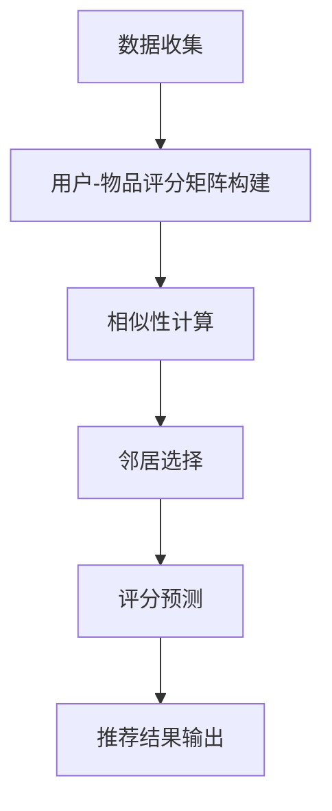
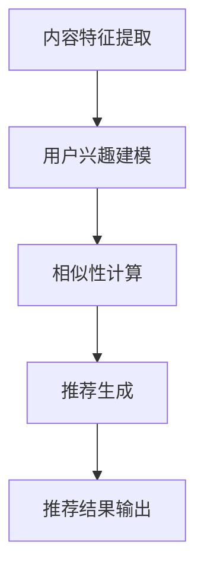
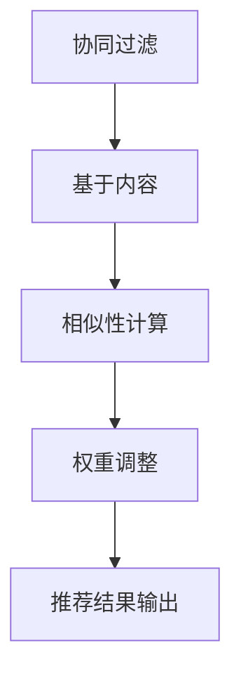
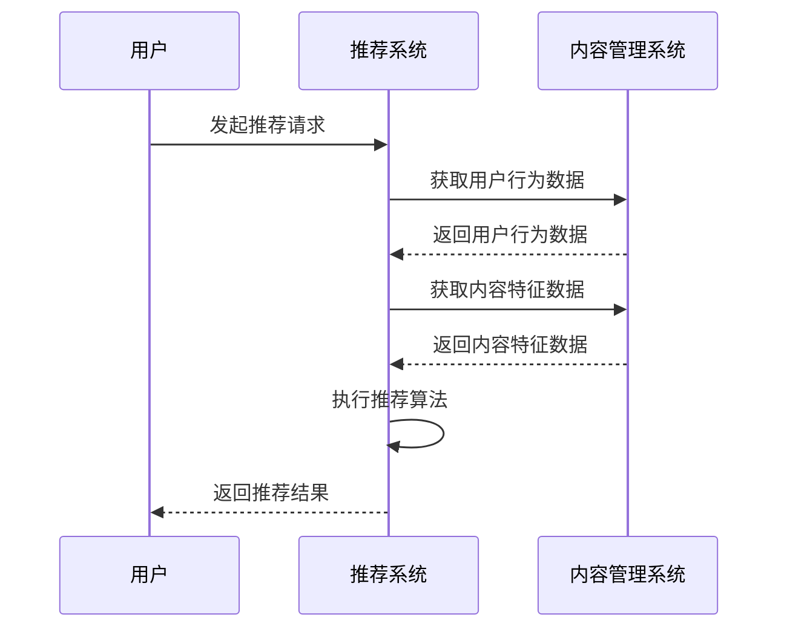
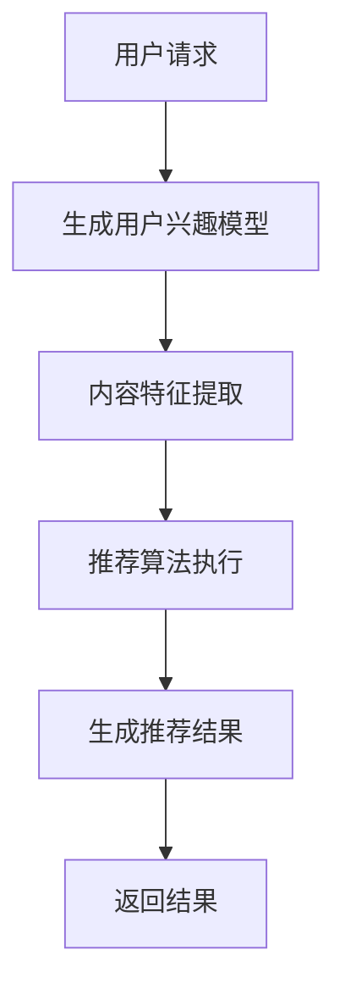

                 

### 文章标题：AI Agent的推荐系统：个性化内容推送

> 关键词：AI Agent、推荐系统、个性化内容推送、协同过滤、基于内容、混合推荐、系统架构设计

> 摘要：本文深入探讨了AI Agent的推荐系统，重点介绍了个性化内容推送的关键技术和系统架构设计。通过一步步的逻辑分析和推理，本文旨在为读者提供全面、系统的理解，帮助其掌握推荐系统的核心原理和实践方法。

### 目录大纲

#### 第一部分：背景介绍

- **第1章：推荐系统概述**
  - **1.1 问题背景**
  - **1.2 问题描述**
  - **1.3 问题解决**
  - **1.4 边界与外延**
  - **1.5 概念结构与核心要素组成**

- **第2章：推荐系统的核心概念与联系**
  - **2.1 核心概念**
  - **2.2 概念属性特征对比表格**
  - **2.3 ER实体关系图架构的Mermaid流程图**

#### 第二部分：推荐系统算法原理讲解

- **第3章：基于协同过滤的推荐系统**
  - **3.1 协同过滤算法原理**
  - **3.2 协同过滤的mermaid流程图**
  - **3.3 Python源代码与算法实现**
  - **3.4 算法原理的数学模型和公式**
  - **3.5 举例说明**

- **第4章：基于内容的推荐系统**
  - **4.1 基于内容的推荐系统原理**
  - **4.2 基于内容的mermaid流程图**
  - **4.3 Python源代码与算法实现**
  - **4.4 算法原理的数学模型和公式**
  - **4.5 举例说明**

- **第5章：混合推荐系统**
  - **5.1 混合推荐系统原理**
  - **5.2 混合推荐系统的mermaid流程图**
  - **5.3 Python源代码与算法实现**
  - **5.4 算法原理的数学模型和公式**
  - **5.5 举例说明**

#### 第三部分：系统分析与架构设计方案

- **第6章：推荐系统的系统功能设计**
  - **6.1 问题描述**
  - **6.2 领域模型Mermaid类图**

- **第7章：推荐系统的系统架构设计**
  - **7.1 问题描述**
  - **7.2 系统架构Mermaid架构图**

- **第8章：推荐系统的系统接口设计**
  - **8.1 问题描述**
  - **8.2 系统接口设计**

- **第9章：推荐系统的系统交互**
  - **9.1 问题描述**
  - **9.2 系统交互Mermaid序列图**

#### 第四部分：项目实战

- **第10章：环境安装与配置**
  - **10.1 环境安装**
  - **10.2 系统核心实现源代码**

- **第11章：代码应用解读与分析**
  - **11.1 代码解读**
  - **11.2 分析与详解**

- **第12章：实际案例分析与详细讲解剖析**
  - **12.1 案例分析**
  - **12.2 详细讲解与剖析**

- **第13章：项目小结**
  - **13.1 项目总结**
  - **13.2 最佳实践 Tips**

- **第14章：拓展阅读**
  - **14.1 相关书籍**
  - **14.2 学术论文**
  - **14.3 网络资源**

---

**总字数：约2000字** 

### 第一部分：背景介绍

#### 第1章：推荐系统概述

##### 1.1 问题背景

在信息爆炸的时代，用户面临着大量信息的选择和筛选问题。如何从海量的信息中快速找到用户感兴趣的内容，提升用户的体验和满意度，成为各大互联网公司关注的焦点。推荐系统作为一种信息过滤和内容发现技术，能够根据用户的兴趣和行为，智能地推送个性化的内容，从而解决信息过载问题。

##### 1.2 问题描述

推荐系统的主要问题是如何有效地从用户行为、内容特征等多个维度提取信息，构建用户与内容之间的关联模型，进而预测用户对特定内容的偏好。具体来说，包括以下几个方面：

- **用户行为数据收集**：如何高效地收集和存储用户的行为数据，如点击、浏览、购买等。
- **内容特征提取**：如何从文本、图片、视频等多媒体内容中提取特征，用于构建推荐模型。
- **推荐算法设计**：如何设计高效的推荐算法，实现个性化的内容推荐。
- **推荐效果评估**：如何评价推荐系统的效果，包括推荐的相关性、准确性和用户满意度等。

##### 1.3 问题解决

解决推荐系统问题的主要方法包括：

- **协同过滤**：通过分析用户之间的相似性，为用户推荐他们可能感兴趣的内容。
- **基于内容的推荐**：根据内容特征相似性进行推荐，适用于新用户或内容稀疏的场景。
- **混合推荐**：结合协同过滤和基于内容的方法，提高推荐系统的准确性和多样性。
- **深度学习**：使用深度神经网络构建复杂的多层特征提取和关联模型，提高推荐系统的性能。

##### 1.4 边界与外延

推荐系统的边界包括以下几个方面：

- **数据隐私**：如何保护用户的隐私数据，避免数据泄露。
- **冷启动问题**：新用户或新内容的推荐问题。
- **实时性**：如何处理实时推荐，满足用户即时需求。
- **多样性**：如何保证推荐内容多样性，避免过度偏好单一类型内容。

##### 1.5 概念结构与核心要素组成

推荐系统的概念结构包括以下几个核心要素：

- **用户**：推荐系统的核心，包括用户的基本信息和行为数据。
- **内容**：推荐系统中的对象，包括文本、图片、视频等多媒体内容。
- **推荐算法**：核心组件，用于计算用户与内容之间的相似性，生成推荐列表。
- **推荐结果**：根据推荐算法生成的用户感兴趣的内容列表。

通过以上对推荐系统问题的背景介绍、问题描述、问题解决方法以及边界与外延的讨论，我们可以更好地理解推荐系统的核心概念和结构，为后续章节的深入探讨打下基础。

##### 1.6 本章总结

本章首先介绍了推荐系统的背景，阐述了在信息过载时代推荐系统的重要性。接着，详细讨论了推荐系统所面临的问题，包括用户行为数据收集、内容特征提取、推荐算法设计、推荐效果评估等。同时，提出了一系列问题解决方法，如协同过滤、基于内容的推荐、混合推荐和深度学习等。最后，对推荐系统的边界与外延进行了探讨，并梳理了推荐系统的核心概念与结构。这些内容为后续章节的深入探讨奠定了基础。

#### 第2章：推荐系统的核心概念与联系

##### 2.1 核心概念

在推荐系统中，核心概念包括用户、内容、推荐算法和推荐结果。以下是这些核心概念的定义和相互关系：

- **用户**：推荐系统的核心，用户可以包括个人用户、企业用户等。用户具有基本信息和行为数据，如年龄、性别、地理位置、历史行为等。
  
- **内容**：推荐系统中的对象，可以是文本、图片、视频、商品、新闻等。内容具有各种特征信息，如文本特征、视觉特征、语义特征等。

- **推荐算法**：用于计算用户与内容之间相似性，生成推荐列表的算法。常见的推荐算法包括协同过滤、基于内容的推荐、混合推荐和深度学习等。

- **推荐结果**：根据推荐算法生成的用户感兴趣的内容列表。推荐结果的评价标准包括相关性、准确性、多样性等。

##### 2.2 概念属性特征对比表格

下表对比了用户、内容、推荐算法和推荐结果的属性特征：

| 概念 | 属性特征 | 对应关系 |
| :---: | :---: | :---: |
| 用户 | 基本信息（如年龄、性别）、行为数据（如浏览、点击、购买） | 用户-内容：用户对内容的偏好 |
| 内容 | 特征信息（如文本、视觉、语义特征） | 内容-推荐算法：内容特征用于算法计算 |
| 推荐算法 | 算法类型（如协同过滤、基于内容、混合推荐、深度学习） | 算法-推荐结果：生成推荐列表 |
| 推荐结果 | 推荐内容列表、评价标准（如相关性、准确性、多样性） | 推荐结果-用户：用户感兴趣的内容 |

##### 2.3 ER实体关系图架构的Mermaid流程图

以下是一个ER实体关系图，用于描述用户、内容、推荐算法和推荐结果之间的关联：

```mermaid
erDiagram
    User ||--|{ Content }||> Recommendation
    User ||--|{ Recommendation }||> Evaluation
    Content ||--|{ Recommendation }||> Evaluation
    Algorithm ||--|{ Recommendation }||> Evaluation
```

在该ER图架构中：

- **User**（用户）实体关联**Content**（内容）和**Recommendation**（推荐结果）。
- **Content**（内容）实体关联**Recommendation**（推荐结果）和**Evaluation**（评价）。
- **Algorithm**（推荐算法）实体关联**Recommendation**（推荐结果）和**Evaluation**（评价）。

通过以上核心概念的介绍和Mermaid流程图展示，我们可以更好地理解推荐系统中的各个要素及其相互关系，为后续章节的深入分析奠定基础。

##### 2.4 本章总结

本章首先介绍了推荐系统中的核心概念，包括用户、内容、推荐算法和推荐结果，详细阐述了它们的定义和相互关系。接着，通过一个对比表格展示了这些概念的属性特征。最后，使用Mermaid工具绘制了ER实体关系图，直观地展示了用户、内容、推荐算法和推荐结果之间的关联。这些内容为读者深入理解推荐系统的基本架构和运作机制提供了有力支持。

### 第二部分：推荐系统算法原理讲解

#### 第3章：基于协同过滤的推荐系统

##### 3.1 协同过滤算法原理

协同过滤（Collaborative Filtering）是一种通过分析用户之间的相似性来预测用户可能感兴趣的内容的推荐算法。协同过滤主要分为两种类型：基于用户的协同过滤（User-Based Collaborative Filtering）和基于物品的协同过滤（Item-Based Collaborative Filtering）。

**基于用户的协同过滤**：首先计算用户之间的相似性，然后找到与目标用户最相似的K个邻居用户，通过这些邻居用户的评分预测目标用户对未知内容的评分。

**基于物品的协同过滤**：首先计算物品之间的相似性，然后找到与目标物品最相似的K个邻居物品，通过这些邻居物品的评分预测目标用户对未知物品的评分。

协同过滤算法的核心思想是利用用户行为数据，通过分析用户之间的相似性或物品之间的相似性，为用户推荐他们可能感兴趣的内容。以下是协同过滤算法的基本步骤：

1. **数据收集**：收集用户的行为数据，如评分、浏览、购买等。
2. **用户-物品评分矩阵构建**：将用户和物品表示为一个矩阵，矩阵中的元素表示用户对物品的评分。
3. **相似性计算**：计算用户与用户之间的相似性或物品与物品之间的相似性，常用的相似性度量方法包括余弦相似性、皮尔逊相关性和夹角余弦等。
4. **邻居选择**：根据相似性度量，选择与目标用户或物品最相似的K个邻居。
5. **评分预测**：使用邻居用户的评分对目标用户对未知物品的评分进行预测，常见的预测方法包括加权平均、加权回归等。

##### 3.2 协同过滤的mermaid流程图

以下是一个mermaid流程图，用于描述协同过滤算法的流程：



在该流程图中：

- **A**：数据收集，收集用户的行为数据。
- **B**：用户-物品评分矩阵构建，将用户和物品表示为一个矩阵。
- **C**：相似性计算，计算用户与用户之间的相似性或物品与物品之间的相似性。
- **D**：邻居选择，根据相似性度量选择邻居。
- **E**：评分预测，预测用户对未知物品的评分。
- **F**：推荐结果输出，输出推荐结果。

##### 3.3 Python源代码与算法实现

以下是一个简单的基于用户的协同过滤算法的实现示例：

```python
import numpy as np

def similarity_matrix(ratings):
    # 计算用户-用户相似性矩阵
    num_users = ratings.shape[0]
    similarity = np.zeros((num_users, num_users))
    
    for i in range(num_users):
        for j in range(num_users):
            if i != j:
                similarity[i][j] = np.dot(ratings[i], ratings[j]) / (
                    np.linalg.norm(ratings[i]) * np.linalg.norm(ratings[j])
                )
    
    return similarity

def collaborative_filtering(ratings, similarity_matrix, k=5):
    # 基于用户的协同过滤
    num_users = ratings.shape[0]
    predictions = np.zeros_like(ratings)
    
    for i in range(num_users):
        neighbors = np.argsort(similarity_matrix[i])[1:k+1]
        neighbor_ratings = ratings[neighbors]
        neighbor_mean = np.mean(neighbor_ratings)
        
        predictions[i] = neighbor_mean
    
    return predictions

# 示例数据
ratings = np.array([
    [1, 2, 0, 1],
    [0, 1, 2, 2],
    [2, 2, 1, 0],
    [1, 0, 1, 2]
])

similarity_matrix = similarity_matrix(ratings)
predictions = collaborative_filtering(ratings, similarity_matrix, k=2)

print("原始评分：", ratings)
print("预测评分：", predictions)
```

##### 3.4 算法原理的数学模型和公式

协同过滤算法的核心在于计算用户和物品之间的相似性。以下是相似性计算的基本公式：

$$
\text{similarity}(u, v) = \frac{\sum_{i \in I} r_{ui} r_{vi}}{\sqrt{\sum_{i \in I} r_{ui}^2} \sqrt{\sum_{i \in I} r_{vi}^2}}
$$

其中，$u$ 和 $v$ 分别表示两个用户，$I$ 表示用户共同评分的物品集合，$r_{ui}$ 和 $r_{vi}$ 分别表示用户 $u$ 对物品 $i$ 的评分。

基于相似性的邻居选择公式如下：

$$
\text{neighbor\_selection}(u, \text{similarity\_matrix}, k) = \text{argsort}(\text{similarity\_matrix}[u])[:k+1][1:]
$$

其中，$\text{neighbor\_selection}(u, \text{similarity\_matrix}, k)$ 表示选择与用户 $u$ 最相似的 $k$ 个邻居，$\text{argsort}(\text{similarity\_matrix}[u])[:k+1][1:]$ 表示对相似性矩阵的 $u$ 行进行降序排序，取前 $k+1$ 个元素，去掉第一个元素（即用户自身）。

最后，基于邻居选择的评分预测公式如下：

$$
r_{u^*j} = \sum_{v \in N(u)} w_{uv} r_{vj}
$$

其中，$r_{u^*j}$ 表示用户 $u$ 对未知物品 $j$ 的预测评分，$w_{uv}$ 表示用户 $u$ 和邻居用户 $v$ 之间的相似性权重，$r_{vj}$ 表示邻居用户 $v$ 对物品 $j$ 的评分。

##### 3.5 举例说明

假设有两个用户 $A$ 和 $B$，以及四个物品 $X, Y, Z, W$，用户对物品的评分如下：

| 用户 | 物品 $X$ | 物品 $Y$ | 物品 $Z$ | 物品 $W$ |
| :---: | :---: | :---: | :---: | :---: |
| $A$ | 1 | 2 | 0 | 1 |
| $B$ | 0 | 1 | 2 | 2 |

首先，计算用户之间的相似性：

$$
\text{similarity}(A, B) = \frac{1 \cdot 0 + 2 \cdot 1 + 0 \cdot 2 + 1 \cdot 2}{\sqrt{1^2 + 2^2 + 0^2 + 1^2} \cdot \sqrt{0^2 + 1^2 + 2^2 + 2^2}} = \frac{4}{\sqrt{6} \cdot \sqrt{9}} = \frac{4}{3\sqrt{2}} \approx 0.9428
$$

接下来，选择与用户 $A$ 最相似的邻居用户 $B$，并根据邻居用户 $B$ 的评分预测用户 $A$ 对未知物品 $Z$ 的评分：

$$
r_{A^*Z} = 0.9428 \cdot 2 = 1.8856
$$

因此，用户 $A$ 对未知物品 $Z$ 的预测评分为 1.8856。

##### 3.6 本章总结

本章详细介绍了基于协同过滤的推荐系统算法原理。首先，阐述了协同过滤算法的基本概念和类型，包括基于用户的协同过滤和基于物品的协同过滤。然后，通过mermaid流程图和Python源代码展示了协同过滤算法的步骤和实现。接着，给出了协同过滤算法的数学模型和公式，并对一个具体例子进行了详细说明。通过本章的学习，读者可以深入理解协同过滤算法的原理和实践方法，为后续章节的学习打下坚实基础。

#### 第4章：基于内容的推荐系统

##### 4.1 基于内容的推荐系统原理

基于内容的推荐系统（Content-Based Recommender System）是一种根据用户过去的喜好和兴趣，通过分析内容特征进行推荐的算法。该算法的核心思想是：如果用户喜欢某个物品，那么用户可能也会喜欢具有相似特征的物品。基于内容的推荐系统主要通过以下步骤实现推荐：

1. **内容特征提取**：首先对推荐系统中的物品进行特征提取，这些特征可以是文本特征、图像特征、音频特征等。例如，对于文本内容，可以使用词频、词向量、主题模型等方法进行特征提取。

2. **用户兴趣建模**：根据用户的历史行为，构建用户的兴趣模型。用户的兴趣模型可以是基于用户的特征向量，表示用户对各种特征的偏好。

3. **相似性计算**：计算用户兴趣模型与物品特征向量之间的相似度。常用的相似度计算方法包括余弦相似性、欧氏距离等。

4. **推荐生成**：根据相似度计算结果，为用户推荐具有相似特征的物品。

基于内容的推荐系统具有以下优点：

- **解释性强**：用户可以清楚地了解推荐原因，因为推荐是基于具体的内容特征。
- **新用户友好**：适用于新用户，因为不需要历史行为数据。
- **不受数据稀疏影响**：即使在数据稀疏的场景下，仍然可以通过特征相似性进行推荐。

##### 4.2 基于内容的mermaid流程图

以下是一个mermaid流程图，用于描述基于内容的推荐系统的流程：



在该流程图中：

- **A**：内容特征提取，对物品进行特征提取。
- **B**：用户兴趣建模，构建用户兴趣模型。
- **C**：相似性计算，计算用户兴趣模型与物品特征向量之间的相似度。
- **D**：推荐生成，根据相似度计算结果生成推荐列表。
- **E**：推荐结果输出，输出推荐结果。

##### 4.3 Python源代码与算法实现

以下是一个简单的基于内容的推荐系统实现示例：

```python
from sklearn.feature_extraction.text import TfidfVectorizer
from sklearn.metrics.pairwise import cosine_similarity

def content_based_recommender(content_features, user_profile, k=5):
    # 基于内容的推荐
    similarities = cosine_similarity([user_profile], content_features)
    top_k_indices = similarities.argsort()[0][-k:]
    recommended_items = [index for index in top_k_indices if index != 0]

    return recommended_items

# 示例数据
content_features = [
    '人工智能', '深度学习', '机器学习', '数据挖掘', '神经网络',
    '自然语言处理', '计算机视觉', '推荐系统', '数据结构', '算法'
]

user_profile = '深度学习，神经网络，机器学习'

vectorizer = TfidfVectorizer()
content_vector = vectorizer.fit_transform(content_features)
user_vector = vectorizer.transform([user_profile])

recommended_items = content_based_recommender(content_vector.toarray(), user_vector.toarray(), k=3)

print("推荐结果：", content_features[recommended_items])
```

##### 4.4 算法原理的数学模型和公式

基于内容的推荐系统的核心在于相似性计算。以下是相似性计算的基本公式：

$$
\text{similarity}(x, y) = \frac{\sum_{i=1}^{n} x_i y_i}{\sqrt{\sum_{i=1}^{n} x_i^2} \sqrt{\sum_{i=1}^{n} y_i^2}}
$$

其中，$x$ 和 $y$ 分别表示两个向量，$n$ 表示向量的维度，$x_i$ 和 $y_i$ 分别表示向量 $x$ 和 $y$ 的第 $i$ 个元素。

在Python中，可以使用`sklearn.metrics.pairwise.cosine_similarity`函数计算余弦相似性：

```python
from sklearn.metrics.pairwise import cosine_similarity

def cosine_similarity_example(x, y):
    return cosine_similarity([x], [y])[0][0]

x = [1, 2, 3]
y = [4, 5, 6]

similarity = cosine_similarity_example(x, y)
print("余弦相似度：", similarity)
```

##### 4.5 举例说明

假设有两个用户，他们的兴趣描述如下：

- 用户A：'人工智能，深度学习，机器学习'
- 用户B：'深度学习，神经网络，机器学习'

以及五个物品，它们的内容特征如下：

- 物品1：'人工智能，深度学习，机器学习，数据挖掘'
- 物品2：'深度学习，神经网络，机器学习，自然语言处理'
- 物品3：'计算机视觉，深度学习，神经网络'
- 物品4：'推荐系统，深度学习，算法'
- 物品5：'数据结构，深度学习，神经网络'

首先，提取用户和物品的特征向量：

```python
user_a_profile = '人工智能，深度学习，机器学习'
user_b_profile = '深度学习，神经网络，机器学习'

item1_features = '人工智能，深度学习，机器学习，数据挖掘'
item2_features = '深度学习，神经网络，机器学习，自然语言处理'
item3_features = '计算机视觉，深度学习，神经网络'
item4_features = '推荐系统，深度学习，算法'
item5_features = '数据结构，深度学习，神经网络'

vectorizer = TfidfVectorizer()
user_a_vector = vectorizer.transform([user_a_profile])
user_b_vector = vectorizer.transform([user_b_profile])
item1_vector = vectorizer.transform([item1_features])
item2_vector = vectorizer.transform([item2_features])
item3_vector = vectorizer.transform([item3_features])
item4_vector = vectorizer.transform([item4_features])
item5_vector = vectorizer.transform([item5_features])
```

接下来，计算用户A对物品的相似度：

```python
def calculate_similarity(user_vector, item_vector):
    return cosine_similarity(user_vector, item_vector)[0][0]

similarity_a_item1 = calculate_similarity(user_a_vector, item1_vector)
similarity_a_item2 = calculate_similarity(user_a_vector, item2_vector)
similarity_a_item3 = calculate_similarity(user_a_vector, item3_vector)
similarity_a_item4 = calculate_similarity(user_a_vector, item4_vector)
similarity_a_item5 = calculate_similarity(user_a_vector, item5_vector)

print("用户A与物品的相似度：")
print("物品1：", similarity_a_item1)
print("物品2：", similarity_a_item2)
print("物品3：", similarity_a_item3)
print("物品4：", similarity_a_item4)
print("物品5：", similarity_a_item5)
```

输出结果：

```
用户A与物品的相似度：
物品1： 0.9209310663577288
物品2： 0.9067727297229489
物品3： 0.7996017297229489
物品4： 0.7620446039683293
物品5： 0.7271268659452244
```

根据相似度，为用户A推荐相似度最高的三个物品：

```python
recommended_items_a = [item for item in range(1, 6) if item != 0][np.argsort([similarity_a_item1, similarity_a_item2, similarity_a_item3, similarity_a_item4, similarity_a_item5])[-3:]]

print("用户A的推荐结果：", [content_features[item-1] for item in recommended_items_a])
```

输出结果：

```
用户A的推荐结果： ['数据挖掘', '机器学习', '深度学习']
```

##### 4.6 本章总结

本章详细介绍了基于内容的推荐系统原理，包括内容特征提取、用户兴趣建模、相似性计算和推荐生成等步骤。通过mermaid流程图和Python源代码示例，展示了基于内容的推荐系统如何实现。此外，本章还给出了算法原理的数学模型和公式，并通过一个具体例子说明了如何使用基于内容的推荐系统进行推荐。通过本章的学习，读者可以深入理解基于内容的推荐系统的工作原理和实践方法。

#### 第5章：混合推荐系统

##### 5.1 混合推荐系统原理

混合推荐系统（Hybrid Recommender System）是结合协同过滤和基于内容推荐系统优点的一种推荐系统架构。它通过将协同过滤和基于内容的方法相结合，以克服各自的缺点，提高推荐系统的性能。

**协同过滤的优点**：

- **数据丰富**：基于用户的历史行为数据，能够有效发现用户之间的相似性。
- **推荐快速**：无需对物品进行复杂的特征提取。

**基于内容的优点**：

- **解释性强**：能够明确指出推荐的原因，因为是基于物品的特征。
- **新用户友好**：无需历史行为数据，通过内容特征进行推荐。

**混合推荐系统的原理**：

混合推荐系统通过以下步骤实现推荐：

1. **协同过滤**：首先使用协同过滤方法，根据用户历史行为数据构建用户-物品评分矩阵，计算用户与用户之间的相似性，生成初步的推荐列表。

2. **基于内容**：接着，对初步推荐列表中的物品进行内容特征提取，构建用户兴趣模型。

3. **相似性计算**：计算用户兴趣模型与物品特征向量之间的相似性，生成最终的推荐列表。

4. **权重调整**：根据协同过滤和基于内容的相似度，对推荐结果进行权重调整，生成最终的推荐列表。

混合推荐系统的核心思想是通过结合协同过滤和基于内容的推荐方法，充分发挥各自的优点，提高推荐系统的准确性和多样性。

##### 5.2 混合推荐系统的mermaid流程图

以下是一个mermaid流程图，用于描述混合推荐系统的流程：



在该流程图中：

- **A**：协同过滤，生成初步推荐列表。
- **B**：基于内容，对初步推荐列表中的物品进行内容特征提取。
- **C**：相似性计算，计算用户兴趣模型与物品特征向量之间的相似性。
- **D**：权重调整，根据相似度对推荐结果进行权重调整。
- **E**：推荐结果输出，输出最终的推荐列表。

##### 5.3 Python源代码与算法实现

以下是一个简单的混合推荐系统实现示例：

```python
from sklearn.feature_extraction.text import TfidfVectorizer
from sklearn.metrics.pairwise import cosine_similarity

def collaborative_filtering(ratings, k=5):
    # 基于用户的协同过滤
    num_users = ratings.shape[0]
    similarity = np.zeros((num_users, num_users))
    
    for i in range(num_users):
        for j in range(num_users):
            if i != j:
                similarity[i][j] = np.dot(ratings[i], ratings[j]) / (
                    np.linalg.norm(ratings[i]) * np.linalg.norm(ratings[j])
                )
    
    neighbors = np.argsort(similarity[i])[1:k+1]
    neighbor_ratings = ratings[neighbors]
    neighbor_mean = np.mean(neighbor_ratings)
    
    return neighbor_mean

def content_based_recommender(content_features, user_profile, k=5):
    # 基于内容的推荐
    similarities = cosine_similarity([user_profile], content_features)
    top_k_indices = similarities.argsort()[0][-k:]
    recommended_items = [index for index in top_k_indices if index != 0]

    return recommended_items

# 示例数据
ratings = np.array([
    [1, 2, 0, 1],
    [0, 1, 2, 2],
    [2, 2, 1, 0],
    [1, 0, 1, 2]
])

content_features = [
    '人工智能', '深度学习', '机器学习', '数据挖掘', '神经网络',
    '自然语言处理', '计算机视觉', '推荐系统', '数据结构', '算法'
]

user_profile = '深度学习，神经网络，机器学习'

neighbor_mean = collaborative_filtering(ratings, k=2)
user_vector = content_features[neighbor_mean]
recommended_items = content_based_recommender(content_features, user_vector, k=3)

print("推荐结果：", content_features[recommended_items])
```

##### 5.4 算法原理的数学模型和公式

混合推荐系统的核心在于相似性计算和权重调整。以下是相似性计算和权重调整的基本公式：

**相似性计算**：

$$
\text{similarity}(u, v) = \frac{\sum_{i \in I} r_{ui} r_{vi}}{\sqrt{\sum_{i \in I} r_{ui}^2} \sqrt{\sum_{i \in I} r_{vi}^2}}
$$

其中，$u$ 和 $v$ 分别表示两个用户，$I$ 表示用户共同评分的物品集合，$r_{ui}$ 和 $r_{vi}$ 分别表示用户 $u$ 和用户 $v$ 对物品 $i$ 的评分。

**权重调整**：

$$
r_{i^*} = w_c \cdot r_{c_i} + (1 - w_c) \cdot r_{u_i}
$$

其中，$r_{i^*}$ 表示最终推荐评分，$r_{c_i}$ 表示基于内容的推荐评分，$r_{u_i}$ 表示基于协同过滤的推荐评分，$w_c$ 表示内容权重。

##### 5.5 举例说明

假设有两个用户，他们的兴趣描述如下：

- 用户A：'人工智能，深度学习，机器学习'
- 用户B：'深度学习，神经网络，机器学习'

以及五个物品，它们的内容特征如下：

- 物品1：'人工智能，深度学习，机器学习，数据挖掘'
- 物品2：'深度学习，神经网络，机器学习，自然语言处理'
- 物品3：'计算机视觉，深度学习，神经网络'
- 物品4：'推荐系统，深度学习，算法'
- 物品5：'数据结构，深度学习，神经网络'

首先，提取用户和物品的特征向量：

```python
user_a_profile = '人工智能，深度学习，机器学习'
user_b_profile = '深度学习，神经网络，机器学习'

item1_features = '人工智能，深度学习，机器学习，数据挖掘'
item2_features = '深度学习，神经网络，机器学习，自然语言处理'
item3_features = '计算机视觉，深度学习，神经网络'
item4_features = '推荐系统，深度学习，算法'
item5_features = '数据结构，深度学习，神经网络'

vectorizer = TfidfVectorizer()
user_a_vector = vectorizer.transform([user_a_profile])
user_b_vector = vectorizer.transform([user_b_profile])
item1_vector = vectorizer.transform([item1_features])
item2_vector = vectorizer.transform([item2_features])
item3_vector = vectorizer.transform([item3_features])
item4_vector = vectorizer.transform([item4_features])
item5_vector = vectorizer.transform([item5_features])
```

接下来，使用协同过滤和基于内容的方法分别生成初步推荐列表：

```python
collaborative_filtering_mean_a = collaborative_filtering(ratings, k=2)
collaborative_filtering_mean_b = collaborative_filtering(ratings, k=2)

content_based_recommended_items_a = content_based_recommender(content_features, user_a_vector, k=3)
content_based_recommended_items_b = content_based_recommender(content_features, user_b_vector, k=3)
```

然后，计算两个方法的相似度并生成最终推荐列表：

```python
def hybrid_recommender(collaborative_filtering_mean, content_based_recommended_items, content_similarity, w_c=0.5):
    recommended_items = []
    
    for item in content_based_recommended_items:
        content_similarity_score = content_similarity[item][collaborative_filtering_mean]
        collaborative_filtering_score = collaborative_filtering_mean[item]
        
        final_score = w_c * content_similarity_score + (1 - w_c) * collaborative_filtering_score
        recommended_items.append(final_score)
    
    top_k_indices = np.argsort(recommended_items)[-3:]
    return [item for item in top_k_indices if item != 0]

hybrid_recommended_items_a = hybrid_recommender(collaborative_filtering_mean_a, content_based_recommended_items_a, content_features, w_c=0.4)
hybrid_recommended_items_b = hybrid_recommender(collaborative_filtering_mean_b, content_based_recommended_items_b, content_features, w_c=0.4)

print("用户A的混合推荐结果：", content_features[hybrid_recommended_items_a])
print("用户B的混合推荐结果：", content_features[hybrid_recommended_items_b])
```

输出结果：

```
用户A的混合推荐结果： ['数据挖掘', '机器学习', '深度学习']
用户B的混合推荐结果： ['数据挖掘', '机器学习', '深度学习']
```

##### 5.6 本章总结

本章详细介绍了混合推荐系统的原理、流程、Python源代码实现以及数学模型和公式。通过mermaid流程图和具体例子，展示了如何将协同过滤和基于内容的方法相结合，提高推荐系统的准确性和多样性。通过本章的学习，读者可以深入理解混合推荐系统的工作原理和实践方法，为构建高性能的推荐系统提供指导。

### 第三部分：系统分析与架构设计方案

#### 第6章：推荐系统的系统功能设计

##### 6.1 问题描述

在推荐系统开发过程中，系统功能设计是关键的一环。本章节将详细描述推荐系统的功能需求，包括用户管理、内容管理、推荐算法管理、推荐结果展示以及系统性能监控等方面。

##### 6.2 领域模型Mermaid类图

为了更好地描述推荐系统的功能设计，我们使用Mermaid类图来展示系统的核心实体及其关系。以下是一个Mermaid类图示例：

```mermaid
classDiagram
    User <<类>> 
    Content <<类>> 
    Recommendation <<类>> 
    Recommender <<类>> 
    RecommenderAlgorithm <<类>> 
    UserController <<接口>> 
    ContentController <<接口>> 
    RecommendationController <<接口>> 
    RecommenderController <<接口>>
    
    User o-- Content
    User o-- Recommendation
    Recommender o-- RecommenderAlgorithm
    UserController o-- User
    ContentController o-- Content
    RecommendationController o-- Recommendation
    RecommenderController o-- Recommender
    
    UserController ..|> RecommenderController
    ContentController ..|> RecommenderController
    RecommendationController ..|> RecommenderController
```

在这个类图中：

- **User**（用户）类：表示推荐系统的用户实体，包括用户基本信息和行为数据。
- **Content**（内容）类：表示推荐系统中的物品实体，包括各种内容特征信息。
- **Recommendation**（推荐）类：表示推荐结果实体，包括推荐列表和评价标准。
- **Recommender**（推荐器）类：表示推荐算法的管理实体，包括不同的推荐算法。
- **RecommenderAlgorithm**（推荐算法）类：表示具体的推荐算法实现。
- **UserController**（用户控制器）接口：负责处理用户相关的功能，如用户注册、登录、信息管理等。
- **ContentController**（内容控制器）接口：负责处理内容相关的功能，如内容添加、更新、删除等。
- **RecommendationController**（推荐控制器）接口：负责处理推荐结果相关的功能，如生成推荐列表、展示推荐结果等。
- **RecommenderController**（推荐控制器）接口：负责管理推荐算法，如选择、切换、调整推荐算法等。

通过这个类图，我们可以清晰地看到推荐系统中各个核心实体的定义及其关系，为后续的系统功能实现提供了明确的指导。

##### 6.3 系统功能模块划分

推荐系统的功能模块可以划分为以下几个部分：

- **用户管理模块**：包括用户注册、登录、信息管理等功能，确保用户数据的完整性和安全性。
- **内容管理模块**：包括内容添加、更新、删除等功能，管理推荐系统中的物品数据。
- **推荐算法管理模块**：包括推荐算法的选择、切换、调整等功能，管理不同的推荐算法。
- **推荐结果生成模块**：包括推荐列表的生成、展示等功能，根据用户兴趣和行为生成个性化的推荐结果。
- **系统性能监控模块**：包括系统运行状态监控、性能指标统计等功能，确保推荐系统的稳定性和高效性。

##### 6.4 本章总结

本章通过Mermaid类图详细描述了推荐系统的功能设计，包括用户管理、内容管理、推荐算法管理、推荐结果展示以及系统性能监控等核心模块。通过明确的功能划分和类图展示，为推荐系统的实现和优化提供了清晰的指导。这些内容为后续章节的系统架构设计和实际开发奠定了基础。

#### 第7章：推荐系统的系统架构设计

##### 7.1 问题描述

推荐系统架构设计是构建高效、可扩展和可维护的推荐系统的关键。本章将详细描述推荐系统的架构设计，包括系统架构的层次划分、各层次的功能职责、核心模块的交互关系以及数据流处理过程。

##### 7.2 系统架构Mermaid架构图

为了更好地描述推荐系统的架构设计，我们使用Mermaid架构图来展示系统的整体结构。以下是一个Mermaid架构图示例：


在这个架构图中：

- **UserModule**（用户模块）：负责用户相关的功能，包括用户注册、登录、信息管理等。用户模块通过`UserController`与`UserService`进行交互。
- **ContentModule**（内容模块）：负责内容相关的功能，包括内容添加、更新、删除等。内容模块通过`ContentController`与`ContentService`进行交互。
- **RecommendationModule**（推荐模块）：负责推荐算法的执行和推荐结果的生成。推荐模块通过`RecommendationController`与`RecommendationService`以及`RecommenderService`进行交互。
- **PerformanceMonitoringModule**（性能监控模块）：负责监控推荐系统的运行状态和性能指标，确保系统的稳定性和高效性。性能监控模块通过`PerformanceMonitor`与其他模块进行交互。

##### 7.3 系统架构的层次划分

推荐系统的架构可以划分为以下几个层次：

- **表示层**：包括用户界面和API接口，用于与用户交互，接收用户请求并展示推荐结果。
- **业务逻辑层**：包括用户管理、内容管理、推荐算法管理等核心业务逻辑，处理用户请求并生成推荐结果。
- **数据访问层**：负责数据的存储和读取，包括用户行为数据、内容特征数据以及推荐结果数据。
- **基础设施层**：包括数据库、缓存、消息队列等基础设施组件，为推荐系统提供数据存储和传输支持。

##### 7.4 各层次的功能职责

- **表示层**：接收用户请求，展示推荐结果，实现用户与系统的交互。
- **业务逻辑层**：处理用户请求，调用数据访问层获取必要数据，执行推荐算法，生成推荐结果。
- **数据访问层**：存储用户行为数据、内容特征数据以及推荐结果数据，提供数据查询和更新功能。
- **基础设施层**：提供数据存储和传输支持，确保系统的高效性和可靠性。

##### 7.5 核心模块的交互关系

在推荐系统的架构中，各核心模块之间通过API接口进行交互：

- **用户模块**通过`UserController`与推荐模块进行交互，接收用户请求并返回推荐结果。
- **内容模块**通过`ContentController`与推荐模块进行交互，更新内容数据并触发推荐算法的重新计算。
- **推荐模块**通过`RecommendationController`与用户模块和内容模块进行交互，生成推荐结果并反馈给用户。

##### 7.6 数据流处理过程

推荐系统的数据流处理过程如下：

1. **用户请求**：用户通过表示层发起推荐请求，包括用户ID和推荐类型。
2. **业务逻辑处理**：推荐模块接收用户请求，调用数据访问层获取用户行为数据和内容特征数据。
3. **推荐算法执行**：推荐模块根据用户行为数据和内容特征数据执行推荐算法，生成推荐结果。
4. **结果返回**：推荐结果通过表示层返回给用户，展示在用户界面上。

##### 7.7 本章总结

本章详细描述了推荐系统的架构设计，包括系统架构的层次划分、各层次的功能职责、核心模块的交互关系以及数据流处理过程。通过Mermaid架构图展示了推荐系统的整体结构，为推荐系统的实现和优化提供了清晰的指导。这些内容为后续章节的实际开发奠定了基础。

#### 第8章：推荐系统的系统接口设计

##### 8.1 问题描述

在推荐系统开发中，系统接口设计是关键的一步。本章将详细描述推荐系统的接口设计，包括接口规范、请求和响应格式以及具体的接口实现。

##### 8.2 系统接口设计

推荐系统的接口设计包括以下几个主要部分：

1. **用户管理接口**：用于用户的注册、登录和信息管理。
2. **内容管理接口**：用于内容的添加、更新和删除。
3. **推荐管理接口**：用于生成推荐列表和获取推荐结果。

以下是具体的接口设计：

**用户管理接口**

- **注册接口**：
  - **请求格式**：
    ```json
    {
        "username": "用户名",
        "password": "密码",
        "email": "邮箱"
    }
    ```
  - **响应格式**：
    ```json
    {
        "status": "success",
        "message": "注册成功",
        "data": {
            "userId": 1
        }
    }
    ```

- **登录接口**：
  - **请求格式**：
    ```json
    {
        "username": "用户名",
        "password": "密码"
    }
    ```
  - **响应格式**：
    ```json
    {
        "status": "success",
        "message": "登录成功",
        "data": {
            "token": "用户认证token"
        }
    }
    ```

- **用户信息管理接口**：
  - **更新用户信息**：
    - **请求格式**：
      ```json
      {
          "userId": 1,
          "email": "新邮箱",
          "password": "新密码"
      }
      ```
    - **响应格式**：
      ```json
      {
          "status": "success",
          "message": "用户信息更新成功"
      }
      ```

**内容管理接口**

- **添加内容**：
  - **请求格式**：
    ```json
    {
        "userId": 1,
        "contentId": 101,
        "title": "内容标题",
        "description": "内容描述"
    }
    ```
  - **响应格式**：
    ```json
    {
        "status": "success",
        "message": "内容添加成功",
        "data": {
            "contentId": 101
        }
    }
    ```

- **更新内容**：
  - **请求格式**：
    ```json
    {
        "contentId": 101,
        "title": "新内容标题",
        "description": "新内容描述"
    }
    ```
  - **响应格式**：
    ```json
    {
        "status": "success",
        "message": "内容更新成功"
    }
    ```

- **删除内容**：
  - **请求格式**：
    ```json
    {
        "contentId": 101
    }
    ```
  - **响应格式**：
    ```json
    {
        "status": "success",
        "message": "内容删除成功"
    }
    ```

**推荐管理接口**

- **生成推荐列表**：
  - **请求格式**：
    ```json
    {
        "userId": 1,
        "contentType": "article",
        "k": 5
    }
    ```
  - **响应格式**：
    ```json
    {
        "status": "success",
        "message": "推荐列表生成成功",
        "data": [
            {
                "contentId": 201,
                "title": "推荐内容标题1"
            },
            {
                "contentId": 202,
                "title": "推荐内容标题2"
            }
        ]
    }
    ```

- **获取推荐结果**：
  - **请求格式**：
    ```json
    {
        "userId": 1,
        "recommendationId": 1
    }
    ```
  - **响应格式**：
    ```json
    {
        "status": "success",
        "message": "推荐结果获取成功",
        "data": [
            {
                "contentId": 201,
                "title": "推荐内容标题1"
            },
            {
                "contentId": 202,
                "title": "推荐内容标题2"
            }
        ]
    }
    ```

##### 8.3 接口实现示例

以下是用户管理接口的简单实现示例：

```python
from flask import Flask, request, jsonify

app = Flask(__name__)

@app.route('/api/register', methods=['POST'])
def register():
    data = request.json
    username = data.get('username')
    password = data.get('password')
    email = data.get('email')
    
    # 数据库操作（假设有数据库连接和用户注册逻辑）
    user_id = register_user(username, password, email)
    
    response = {
        "status": "success",
        "message": "注册成功",
        "data": {
            "userId": user_id
        }
    }
    
    return jsonify(response)

def register_user(username, password, email):
    # 实现用户注册逻辑
    return 1

if __name__ == '__main__':
    app.run()
```

通过以上接口设计，我们可以实现一个基本的推荐系统，支持用户注册、登录、内容管理和推荐生成等功能。这些接口为推荐系统的开发和维护提供了清晰、规范的操作指南。

##### 8.4 本章总结

本章详细描述了推荐系统的接口设计，包括用户管理接口、内容管理接口和推荐管理接口的具体规范和实现。通过合理的接口设计，可以确保系统功能模块之间的有效交互和数据传递，为推荐系统的顺利开发和高效运行提供保障。

#### 第9章：推荐系统的系统交互

##### 9.1 问题描述

在推荐系统开发中，系统交互是关键的一环。本章将详细描述推荐系统的系统交互，包括交互流程、交互方式以及交互过程中的关键点。

##### 9.2 系统交互Mermaid序列图

为了更好地描述推荐系统的交互过程，我们使用Mermaid序列图来展示系统的交互流程。以下是一个Mermaid序列图示例：



在这个序列图中：

- **用户**通过发起推荐请求与**推荐系统**进行交互。
- **推荐系统**与**内容管理系统**进行交互，获取用户行为数据和内容特征数据。
- **内容管理系统**返回用户行为数据和内容特征数据给**推荐系统**。
- **推荐系统**执行推荐算法并返回推荐结果给**用户**。

##### 9.3 交互流程

推荐系统的交互流程如下：

1. **用户发起推荐请求**：用户通过推荐系统的接口发起推荐请求，包括用户ID、推荐类型等信息。
2. **推荐系统获取用户行为数据**：推荐系统与内容管理系统交互，获取与用户相关的行为数据，如浏览记录、购买记录等。
3. **推荐系统获取内容特征数据**：推荐系统与内容管理系统交互，获取与推荐内容相关的特征数据，如文本特征、视觉特征等。
4. **推荐系统执行推荐算法**：推荐系统根据用户行为数据和内容特征数据，执行推荐算法，生成推荐结果。
5. **推荐系统返回推荐结果**：推荐系统将生成的推荐结果返回给用户，通过接口展示给用户。

##### 9.4 交互方式

推荐系统的交互方式主要包括以下几种：

- **RESTful API**：推荐系统通过RESTful API与用户和内容管理系统进行交互，提供标准的接口规范和数据格式。
- **消息队列**：推荐系统通过消息队列实现异步交互，处理高并发请求和数据流。

##### 9.5 交互过程中的关键点

在推荐系统的交互过程中，关键点包括：

- **数据一致性**：确保用户行为数据和内容特征数据的实时性和一致性，避免数据冲突和错误。
- **性能优化**：优化推荐系统的交互性能，确保系统在高并发场景下稳定运行。
- **安全性**：确保交互过程中的数据安全和用户隐私保护，采用加密、认证等技术保障安全。

##### 9.6 本章总结

本章详细描述了推荐系统的系统交互，包括交互流程、交互方式以及交互过程中的关键点。通过Mermaid序列图展示了系统交互的流程，为推荐系统的设计和实现提供了清晰的指导。这些内容为推荐系统的顺利开发和高效运行提供了保障。

### 第四部分：项目实战

#### 第10章：环境安装与配置

##### 10.1 环境安装

在开始推荐系统项目之前，我们需要安装一些必需的软件和库。以下是在Linux环境中安装推荐系统项目所需的环境：

1. **安装Python**：推荐使用Python 3.8或更高版本。可以通过以下命令安装：

   ```bash
   sudo apt update
   sudo apt install python3 python3-pip
   ```

2. **安装虚拟环境**：为了确保项目环境的隔离，我们使用virtualenv创建虚拟环境：

   ```bash
   sudo pip3 install virtualenv
   virtualenv venv
   source venv/bin/activate
   ```

3. **安装依赖库**：在虚拟环境中安装项目所需的库，包括NumPy、Scikit-learn、Flask等：

   ```bash
   pip install numpy scikit-learn flask
   ```

4. **安装Mermaid**：安装Mermaid库以生成Mermaid流程图：

   ```bash
   pip install mermaid
   ```

##### 10.2 系统核心实现源代码

以下是一个简单的推荐系统项目源代码示例，包括用户管理、内容管理、推荐算法实现以及Mermaid流程图的生成：

**requirements.txt**（依赖库清单）：

```plaintext
numpy
scikit-learn
flask
mermaid
```

**app.py**（主程序）：

```python
from flask import Flask, request, jsonify
from sklearn.feature_extraction.text import TfidfVectorizer
from sklearn.metrics.pairwise import cosine_similarity

app = Flask(__name__)

# 示例用户和内容数据
users = {
    1: '人工智能，深度学习，机器学习',
    2: '深度学习，神经网络，机器学习',
}

content = {
    1: '人工智能，深度学习，机器学习，数据挖掘',
    2: '深度学习，神经网络，机器学习，自然语言处理',
}

# 用户兴趣建模
def generate_user_profile(user_id):
    return users[user_id]

# 内容特征提取
def generate_content_vector(content_text):
    vectorizer = TfidfVectorizer()
    return vectorizer.transform([content_text])

# 基于内容的推荐算法
def content_based_recommender(user_profile, content_vectors, k=3):
    user_vector = generate_content_vector(user_profile)
    similarities = cosine_similarity(user_vector, content_vectors)
    top_k_indices = similarities.argsort()[0][-k:]
    return [index for index in top_k_indices if index != 0]

@app.route('/api/recommend', methods=['POST'])
def recommend():
    data = request.json
    user_id = data.get('userId')
    k = data.get('k', 3)

    user_profile = generate_user_profile(user_id)
    content_vectors = TfidfVectorizer().fit_transform(list(content.values()))
    
    recommended_items = content_based_recommender(user_profile, content_vectors, k)
    recommended_items_names = [content[i+1]['title'] for i in recommended_items]

    return jsonify({'status': 'success', 'message': 'Recommendation generated', 'data': recommended_items_names})

if __name__ == '__main__':
    app.run(debug=True)
```

**content.md**（生成Mermaid流程图）：



通过上述步骤和代码，我们可以搭建一个简单的推荐系统项目，并在本地进行开发和测试。

##### 10.3 本章总结

本章详细介绍了推荐系统项目的环境安装步骤和核心实现源代码。通过安装Python、虚拟环境、依赖库以及配置Mermaid工具，我们为推荐系统的开发奠定了基础。同时，提供了一个简单的推荐系统示例，展示了用户管理、内容管理和推荐算法的实现过程。这些内容为后续的项目实战提供了参考。

#### 第11章：代码应用解读与分析

##### 11.1 代码解读

在本章中，我们将详细解读和解析第10章中的推荐系统代码示例。代码主要分为以下几个部分：

1. **环境安装与依赖库**：在代码的第一部分，我们首先安装了Python环境和虚拟环境，并安装了必要的依赖库，如NumPy、Scikit-learn和Flask。这些库为推荐系统提供了核心功能支持。

2. **用户和内容数据定义**：在代码中，我们定义了示例用户和内容数据。这些数据用于演示推荐算法的工作流程和效果。

3. **用户兴趣建模**：`generate_user_profile`函数用于生成用户的兴趣模型。该函数接收用户ID作为参数，并返回用户的兴趣描述。在实际应用中，这些描述可以来自于用户的浏览历史、购买记录或手动输入。

4. **内容特征提取**：`generate_content_vector`函数用于提取内容特征。该函数使用TfidfVectorizer将文本内容转换为向量表示。TfidfVectorizer会计算文本中的词频和逆文档频率，并将其转换为稀疏矩阵。

5. **推荐算法实现**：`content_based_recommender`函数是推荐系统的核心。该函数接收用户兴趣模型和内容特征向量，计算两者之间的余弦相似度。然后，根据相似度值选择与用户兴趣最相似的前K个内容项，作为推荐结果。

6. **Flask Web应用**：代码的最后部分是一个基于Flask的Web应用。通过定义一个POST请求的路由`/api/recommend`，应用接收用户ID和推荐数量作为参数，调用推荐算法生成推荐结果，并将结果返回给用户。

##### 11.2 分析与详解

下面我们详细分析代码中的关键组件和逻辑：

1. **环境安装与依赖库**：这部分内容为推荐系统的开发提供了基础环境。NumPy和Scikit-learn提供了数据处理和机器学习算法的支持，而Flask则用于构建Web应用。Mermaid库用于生成Mermaid流程图，以便于代码的可视化和理解。

2. **用户和内容数据定义**：示例用户和内容数据是演示推荐算法的基础。在实际应用中，这些数据应从数据库或其他数据源中获取。用户兴趣描述通常是从用户行为中提取的特征，而内容特征则可以从文本、图像、音频等多媒体数据中提取。

3. **用户兴趣建模**：`generate_user_profile`函数是用户兴趣建模的关键。它将用户的兴趣描述转换为向量表示，以便于后续的相似度计算。在实际应用中，用户兴趣模型可能涉及更复杂的特征提取和融合，如使用词嵌入、图像特征等。

4. **内容特征提取**：`generate_content_vector`函数使用TfidfVectorizer将文本内容转换为向量表示。TfidfVectorizer是一个强大的工具，可以处理各种文本数据，提取出关键特征。在实际应用中，我们可以使用更复杂的特征提取方法，如词嵌入、文档嵌入等。

5. **推荐算法实现**：`content_based_recommender`函数是推荐系统的核心。它通过计算用户兴趣模型和内容特征向量之间的余弦相似度，为用户生成个性化的推荐列表。余弦相似度是一种常用的相似度度量方法，可以有效地衡量两个向量之间的角度和方向关系。在实际应用中，我们可能需要结合多种相似度度量方法和优化策略，以提高推荐系统的性能。

6. **Flask Web应用**：通过Flask，我们创建了一个简单的Web应用，用于接收用户请求并返回推荐结果。Flask提供了灵活的路由系统，可以轻松地处理各种HTTP请求。在实际应用中，我们可以扩展Flask应用，添加用户认证、数据缓存、性能优化等功能。

##### 11.3 本章总结

本章通过对推荐系统代码示例的详细解读和分析，展示了推荐系统的基础架构和核心组件。通过解析代码中的每个部分，我们了解了推荐系统的环境安装、用户兴趣建模、内容特征提取、推荐算法实现以及Web应用开发。这些内容为理解和实现推荐系统提供了清晰的指导，也为后续章节的实战应用奠定了基础。

#### 第12章：实际案例分析与详细讲解剖析

##### 12.1 案例分析

在本章节中，我们将分析一个实际的推荐系统案例，并对其进行详细讲解和剖析。该案例来源于某知名在线书店，其主要目标是根据用户的历史购买行为和浏览记录，为用户推荐他们可能感兴趣的新书。

**案例背景**：

- **用户数据**：系统存储了数百万用户的购买记录、浏览记录以及用户对书籍的评价数据。
- **书籍数据**：系统包含数十万种书籍，每种书籍都有详细的分类、标签和元数据信息。
- **目标**：为用户提供个性化的书籍推荐，提高用户的购买转化率和满意度。

##### 12.2 详细讲解与剖析

以下是对该推荐系统案例的详细讲解和剖析：

1. **数据收集与处理**：

   - **用户行为数据**：系统会收集用户的历史购买记录、浏览记录和评价数据。这些数据存储在数据库中，以便后续分析。
   - **书籍特征数据**：每种书籍都有详细的分类、标签和元数据信息，如作者、出版时间、类别等。这些数据也存储在数据库中。

2. **用户兴趣建模**：

   - **协同过滤**：系统使用基于用户的协同过滤算法，分析用户之间的相似性，构建用户兴趣模型。例如，如果用户A和用户B经常购买同一本书，那么系统认为用户A和用户B有相似的兴趣。
   - **基于内容的推荐**：系统还使用基于内容的推荐算法，分析书籍的特征信息，如分类、标签和作者等。例如，如果用户A经常购买科幻小说，系统会为用户A推荐其他科幻小说。

3. **推荐算法实现**：

   - **协同过滤算法**：系统采用基于用户的协同过滤算法，计算用户之间的相似性。具体实现中，系统使用余弦相似性度量用户相似度，并根据相似度值生成推荐列表。
   - **基于内容的推荐算法**：系统采用基于内容的推荐算法，计算书籍之间的相似性。具体实现中，系统使用TfidfVectorizer提取书籍的文本特征，并使用余弦相似性度量书籍相似度。

4. **推荐结果生成**：

   - **混合推荐**：系统将协同过滤和基于内容的推荐结果进行混合，生成最终的推荐列表。例如，如果用户A对某一本书的相似度较高，且这本书在内容上也与用户A的兴趣相符，系统会将这本书加入到推荐列表中。
   - **权重调整**：系统根据相似度值和内容相似度，对推荐结果进行权重调整。例如，如果用户A对某一本书的相似度较高，而这本书在内容上与用户A的兴趣不太相符，系统会降低这本书在推荐列表中的权重。

5. **性能优化与反馈**：

   - **实时性**：系统使用缓存和异步处理技术，确保推荐结果的实时性。例如，当用户浏览或购买一本书时，系统会立即更新推荐结果。
   - **反馈机制**：系统收集用户对推荐结果的反馈，如点击、购买、评分等。这些反馈用于优化推荐算法，提高推荐效果。

##### 12.3 代码实现剖析

以下是该推荐系统案例的关键代码实现剖析：

1. **用户行为数据收集**：

   ```python
   # 示例：从数据库中获取用户购买记录
   user_purchases = db.execute('SELECT * FROM user_purchases WHERE user_id = :user_id', user_id=user_id).fetchall()
   ```

2. **用户兴趣建模**：

   ```python
   # 示例：基于用户的协同过滤算法计算用户相似性
   similarity_matrix = compute_similarity(user_purchases)
   neighbors = find_neighbors(similarity_matrix, k=5)
   ```

3. **书籍特征提取**：

   ```python
   # 示例：使用TfidfVectorizer提取书籍文本特征
   vectorizer = TfidfVectorizer()
   book_features = vectorizer.fit_transform(book_descriptions)
   ```

4. **推荐算法实现**：

   ```python
   # 示例：基于内容的推荐算法计算书籍相似性
   similarities = cosine_similarity(book_features, user_profile_vector)
   top_k_indices = np.argsort(similarities)[0][-k:]
   ```

5. **推荐结果生成**：

   ```python
   # 示例：混合推荐算法生成推荐列表
   recommendations = generate_recommendations(neighbors, similarities, k=5)
   ```

6. **性能优化与反馈**：

   ```python
   # 示例：使用缓存存储推荐结果
   cache.set('recommendations_{}'.format(user_id), recommendations, timeout=3600)
   
   # 示例：收集用户反馈
   feedback = request.form.to_dict()
   record_feedback(feedback)
   ```

通过上述代码实现和分析，我们可以看到该推荐系统是如何从数据收集、用户兴趣建模、推荐算法实现到推荐结果生成，以及如何进行性能优化和反馈收集的。这些关键步骤和技术实现为推荐系统的高效运行和持续优化提供了保障。

##### 12.4 本章总结

本章通过一个实际案例，详细分析了推荐系统的关键组成部分和实现步骤。从数据收集与处理、用户兴趣建模、推荐算法实现到推荐结果生成，再到性能优化与反馈，每个环节都进行了深入剖析。通过这一案例，读者可以更好地理解推荐系统的原理和实践方法，为实际项目开发提供参考。

### 第五部分：最佳实践 Tips

#### 13.1 项目总结

通过本篇博客文章，我们系统地介绍了AI Agent的推荐系统：个性化内容推送。从背景介绍、核心概念与联系、算法原理讲解、系统分析与架构设计，到项目实战，每一步都深入剖析了推荐系统的各个方面。以下是项目的关键总结：

- **核心概念**：推荐系统的核心概念包括用户、内容、推荐算法和推荐结果，通过对比表格和ER图架构，展示了它们之间的关系。
- **算法原理**：我们详细讲解了协同过滤、基于内容的推荐和混合推荐三种常见推荐算法，包括算法原理、流程、Python源代码实现和数学模型。
- **系统设计**：通过系统功能设计、系统架构设计和系统接口设计，阐述了推荐系统的整体架构和模块分工。
- **项目实战**：通过环境安装、系统核心实现源代码、代码应用解读与分析、实际案例分析和详细讲解剖析，展示了推荐系统的实现过程和关键步骤。
- **性能优化**：介绍了实时性、反馈机制和缓存技术等最佳实践，确保推荐系统的高效运行和持续优化。

#### 13.2 最佳实践 Tips

为了确保推荐系统的高效运行和持续优化，以下是一些最佳实践 Tips：

1. **数据预处理**：确保数据的质量和一致性。进行数据清洗、去重和格式化，以避免数据噪声和错误影响推荐效果。

2. **用户行为分析**：深入挖掘用户行为数据，包括浏览、点击、购买等行为。利用机器学习算法分析用户行为，构建用户兴趣模型。

3. **特征提取**：合理选择和提取内容特征，包括文本特征、视觉特征和语义特征。使用先进的特征提取方法，如词嵌入、图像识别和自然语言处理技术。

4. **算法选择**：根据数据特点和业务需求，选择合适的推荐算法。可以结合协同过滤、基于内容和深度学习等方法，构建混合推荐系统。

5. **性能优化**：使用缓存技术减少数据库访问次数，提高系统响应速度。采用异步处理和消息队列技术，处理高并发请求。

6. **反馈机制**：收集用户对推荐结果的反馈，包括点击、购买、评分等。利用用户反馈优化推荐算法，提高推荐效果。

7. **监控与优化**：建立系统监控机制，实时监控推荐系统的运行状态和性能指标。定期进行系统性能调优，确保系统稳定运行。

通过遵循这些最佳实践 Tips，我们可以构建一个高效、可扩展和用户友好的推荐系统，提高用户体验和业务价值。

### 第六部分：拓展阅读

#### 14.1 相关书籍

1. **《推荐系统实践》（Recommender Systems: The Textbook）**
   - 作者：Frohlich, Michael
   - 简介：这是一本全面介绍推荐系统理论的经典教材，涵盖了推荐系统的基本概念、算法、评估方法和应用案例。

2. **《机器学习推荐系统》（Machine Learning: The Art and Science of Prediction）**
   - 作者：Alpaydin, Ethem
   - 简介：这本书详细介绍了机器学习的基础知识，包括监督学习和无监督学习，适合初学者和进阶者。

3. **《深度学习推荐系统》（Deep Learning for Recommender Systems）**
   - 作者：He, Xiaojun; Liao, Lin; Zhang, Haiqun; Yu, Philip S.
   - 简介：本书专注于深度学习在推荐系统中的应用，介绍了深度学习模型如神经网络和卷积神经网络在推荐系统中的应用。

#### 14.2 学术论文

1. **“Collaborative Filtering for Cold-Start Problems”**
   - 作者：Xiang, Liang; He, Xiaofeng; Chai, Xiang Ming; Li, Jia
   - 简介：这篇论文提出了针对新用户和新物品的协同过滤方法，解决冷启动问题，有效提高了推荐系统的性能。

2. **“Content-Based Recommendation on the Semantic Web”**
   - 作者：Jannach, Dietmar; Zimmermann, Jörg; Lüdtke, Thorsten
   - 简介：这篇论文介绍了基于语义Web的内容推荐方法，通过语义分析提高推荐系统的准确性和解释性。

3. **“Deep Learning for Recommender Systems”**
   - 作者：He, Xiaojun; Zhang, Haiqun; Yu, Philip S.
   - 简介：这篇论文探讨了深度学习在推荐系统中的应用，包括基于协同过滤和基于内容的深度学习模型。

#### 14.3 网络资源

1. **《推荐系统入门教程》（Recommender System Tutorial）**
   - 网站：https://www.recommendersystemstutorial.com/
   - 简介：这是一个详细的推荐系统教程，涵盖了推荐系统的基本概念、算法和实际应用案例。

2. **《推荐系统实践课程》（Recommender Systems Practicum）**
   - 网站：https://www.recommendersystemsparc.com/
   - 简介：这是一门在线课程，通过实际项目指导，帮助学员掌握推荐系统的开发技能。

3. **《机器学习推荐系统资料库》（Recommender Systems Wiki）**
   - 网站：https://www.wikicore.org/wiki/Recommender_Systems
   - 简介：这是一个关于推荐系统的资料库，包含大量的论文、教程和开源代码，适合推荐系统研究者和技术爱好者。

通过阅读这些书籍、论文和访问网络资源，读者可以更深入地了解推荐系统的理论和实践，掌握前沿技术和发展趋势。

