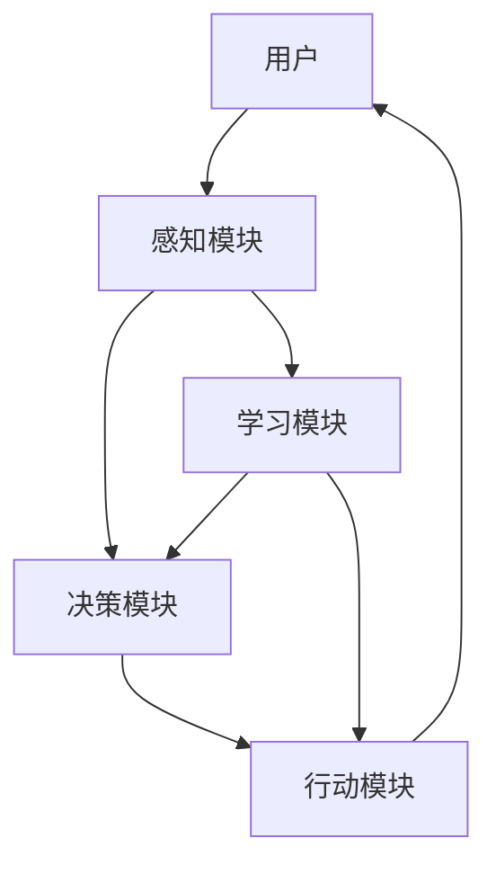
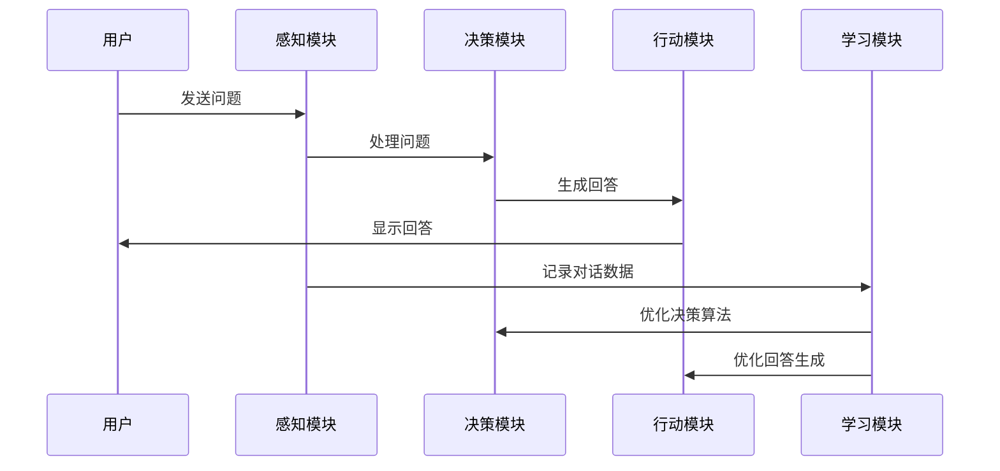

                 

# AI Agent的架构设计：从概念到实现

关键词：AI Agent、架构设计、感知、决策、学习、项目实战

摘要：本文将从AI Agent的基础概念入手，逐步探讨其架构设计的原理和关键组件，通过实际项目案例分析，阐述如何从理论到实践进行AI Agent的架构设计，最后总结最佳实践和注意事项。

## 第一部分: AI Agent的基础概念与背景

### 第1章: AI Agent的基本概念与历史发展

#### 1.1 AI Agent的定义与核心特性

AI Agent是指具有感知、决策、行动和学习能力的自主智能体，能够在环境中自主地感知、理解环境状态，根据目标做出决策，并采取相应行动以实现目标。AI Agent的核心特性包括：

- **感知**：获取环境信息，理解当前状态。
- **决策**：根据感知信息，从多个可能的行动中选取最优或满意的行动。
- **行动**：根据决策结果，对环境施加影响。
- **学习**：通过经验改进决策和行为。

#### 1.2 AI Agent的发展历程

AI Agent的发展可以追溯到20世纪50年代，当时人工智能的概念刚刚兴起。早期的研究主要集中在规则推理和知识表示方面。随着计算机技术的发展，特别是机器学习和深度学习技术的突破，AI Agent的能力得到了显著提升。

- **早期探索**：基于规则的推理系统。
- **关键里程碑**：机器学习算法的出现，特别是深度学习。
- **当前趋势与发展方向**：强化学习、多模态感知、自适应控制等。

#### 1.3 AI Agent的重要性与应用场景

AI Agent在各个领域都有广泛的应用，如智能客服、自动驾驶、智能家居、金融风控等。

- **应用领域**：智能机器人、游戏AI、无人机、智能交通等。
- **商业价值**：提高效率、降低成本、创新商业模式。
- **技术挑战**：数据获取、模型解释性、鲁棒性等。

### 第2章: AI Agent的核心概念与联系

#### 2.1 AI Agent的核心概念

AI Agent的核心概念包括感知、决策、行动和学习。以下是对这些概念的具体解释：

- **感知**：感知是指AI Agent通过传感器获取环境信息，如视觉、听觉、触觉等。感知系统负责对获取的数据进行预处理和特征提取。
- **决策**：决策是指AI Agent根据感知到的环境状态，利用决策算法从多个可能的行动中选择一个最优的行动。
- **行动**：行动是指AI Agent根据决策结果，对环境施加影响，如移动、发送消息、调整参数等。
- **学习**：学习是指AI Agent通过经验和反馈不断优化决策和行为，以提高任务完成效果。

#### 2.2 AI Agent的属性特征对比表格

以下是一个简单的AI Agent属性特征对比表格：

| 特性       | 说明                                                         |
| ---------- | ------------------------------------------------------------ |
| 感知       | 获取环境信息的能力                                           |
| 决策       | 根据感知信息选择行动的能力                                   |
| 行动       | 对环境施加影响的能力                                       |
| 学习       | 通过经验不断改进决策和行为的能力                            |
| 自适应性   | 根据环境变化调整行为的能力                                  |
| 智能性     | 完成复杂任务的能力                                         |
| 可扩展性   | 系统组件的可扩展性和模块化设计                             |
| 鲁棒性     | 在面对不确定性和异常情况时的稳定性和可靠性                  |

#### 2.3 AI Agent的ER实体关系图

以下是一个简单的AI Agent ER实体关系图：

```mermaid
erDiagram
  AI_Agent ||--|{ 感知系统 : Sensors }
  AI_Agent ||--|{ 决策系统 : Decision_Making }
  AI_Agent ||--|{ 行为系统 : Behavior }
  AI_Agent ||--|{ 学习系统 : Learning }
  感知系统 ||--|{ 数据预处理 : Data_Preprocessing }
  决策系统 ||--|{ 决策算法 : Decision_Algorithms }
  行为系统 ||--|{ 行动执行 : Action_Execution }
  学习系统 ||--|{ 学习算法 : Learning_Algorithms }
```

## 第二部分: AI Agent架构设计原理

### 第3章: AI Agent架构设计的基本原理

#### 3.1 AI Agent架构设计的基本原则

AI Agent架构设计需要遵循以下基本原则：

- **模块化**：将系统划分为多个模块，每个模块负责一个特定的功能，便于系统维护和扩展。
- **可扩展性**：设计时考虑系统未来的扩展需求，确保系统能够轻松地增加新功能或模块。
- **适应性**：系统能够适应不同的环境和任务需求，具备灵活性。

#### 3.2 AI Agent的架构模型

AI Agent的架构模型可以分为以下几种：

- **集中式架构**：所有组件集中在同一服务器上，优点是结构简单，缺点是扩展性和鲁棒性较差。
- **分布式架构**：组件分布在多个服务器上，优点是扩展性好，缺点是系统设计和维护复杂。
- **混合架构**：结合集中式和分布式架构的优点，适用于不同场景的需求。

## 第三部分: 实际项目中的AI Agent架构设计

### 第4章: AI Agent架构设计的项目实战

#### 4.1 项目介绍

本项目旨在设计一个智能客服系统，该系统需要能够理解用户问题、提供准确回答，并在对话中保持自然流畅。系统目标包括：

- **问题理解**：准确识别用户问题的意图和关键信息。
- **回答生成**：生成准确、相关且自然的回答。
- **用户交互**：在对话中提供良好的用户体验。

#### 4.2 系统功能设计

系统功能设计包括以下几个主要模块：

- **感知模块**：通过自然语言处理技术理解用户问题。
- **决策模块**：根据用户问题和上下文信息，选择合适的回答。
- **行动模块**：生成并输出回答。
- **学习模块**：通过用户反馈和对话数据，不断优化系统性能。

#### 4.3 系统架构设计

以下是一个简单的系统架构图：



#### 4.4 系统接口设计

系统接口设计包括以下部分：

- **用户接口**：用于接收用户问题和显示回答。
- **API接口**：与其他系统集成，如知识库、数据库等。

#### 4.5 系统交互

以下是一个简单的系统交互序列图：



#### 4.6 系统核心实现源代码

以下是感知模块的核心实现源代码：

```python
import nltk
from nltk.tokenize import word_tokenize

def preprocess_question(question):
    tokens = word_tokenize(question)
    return [token.lower() for token in tokens if token.isalpha()]

def extract_keyphrases(tokens):
    # 使用NLTK的关键短语提取器
    from nltk.corpus import stopwords
    from nltk.tokenize import sent_tokenize
    stop_words = set(stopwords.words('english'))
    sentences = sent_tokenize(question)
    keyphrases = []
    for sentence in sentences:
        words = [word for word in word_tokenize(sentence) if word.lower() not in stop_words]
        if len(words) > 1:
            keyphrases.append(' '.join(words))
    return keyphrases
```

#### 4.7 代码应用解读与分析

此代码用于预处理用户输入的问题，提取关键短语，为后续的决策模块提供输入。以下是代码的详细解读和分析：

- `preprocess_question` 函数负责对问题进行预处理，包括分词和转换为小写，以便后续处理。
- `extract_keyphrases` 函数使用NLTK库的停用词列表，对句子进行分词，并过滤掉停用词，从而提取出关键短语。

#### 4.8 实际案例分析和详细讲解

假设用户输入了一个问题：“How do I reset my password?”，我们可以看到代码是如何处理的：

1. **预处理问题**：分词和转换为小写。
   ```python
   tokens = preprocess_question("How do I reset my password?")
   # 输出：['how', 'i', 'reset', 'my', 'password']
   ```

2. **提取关键短语**：使用NLTK的关键短语提取器。
   ```python
   keyphrases = extract_keyphrases(tokens)
   # 输出：['reset my password']
   ```

通过以上处理，我们得到了关键短语“reset my password”，这将为后续的决策模块提供重要信息，以便生成合适的回答。

#### 4.9 项目小结

在本项目中，我们设计并实现了一个智能客服系统，通过感知、决策、行动和学习模块的协同工作，实现了对用户问题的理解和回答。项目过程中，我们遇到了一些挑战，如自然语言处理中的歧义和上下文理解问题，但通过不断优化算法和模型，我们取得了显著的进展。未来，我们将继续改进系统，提高其智能性和用户体验。

## 第四部分: AI Agent架构设计的最佳实践

### 第5章: AI Agent架构设计的最佳实践

#### 5.1 设计最佳实践

在AI Agent架构设计中，以下是一些最佳实践：

- **模块化设计**：确保系统易于维护和扩展。
- **可扩展性**：设计时考虑未来的扩展需求。
- **适应性**：系统能够适应不同的环境和任务需求。
- **安全性**：确保系统的鲁棒性和数据安全。
- **可解释性**：提高模型的透明度和可解释性，便于调试和优化。

#### 5.2 小结与注意事项

在AI Agent架构设计过程中，需要关注以下事项：

- **需求分析**：确保设计符合实际应用需求。
- **技术选型**：根据任务特点选择合适的算法和技术。
- **测试与验证**：对系统进行充分的测试和验证，确保其性能和稳定性。
- **迭代优化**：不断收集反馈，优化系统性能和用户体验。

#### 5.3 拓展阅读

- **相关文献**：《人工智能：一种现代方法》、《深度学习》
- **在线资源**：AI Agent相关教程、项目案例、开源代码库

---

通过上述内容，我们详细介绍了AI Agent的架构设计，从概念到实现，涵盖了基础概念、设计原理、项目实战和最佳实践。希望本文对您在AI Agent架构设计方面有所启发和帮助。

## 作者信息

作者：AI天才研究院/AI Genius Institute & 禅与计算机程序设计艺术 /Zen And The Art of Computer Programming。如需进一步讨论或提问，欢迎联系作者。

