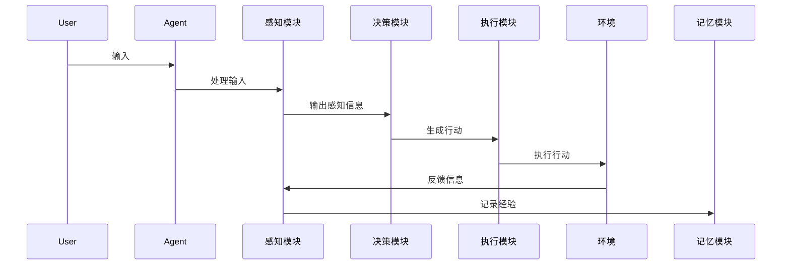
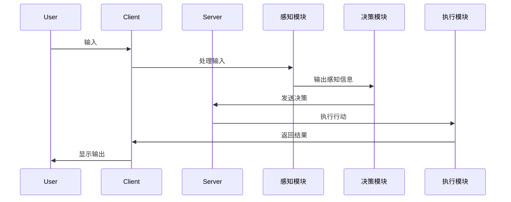
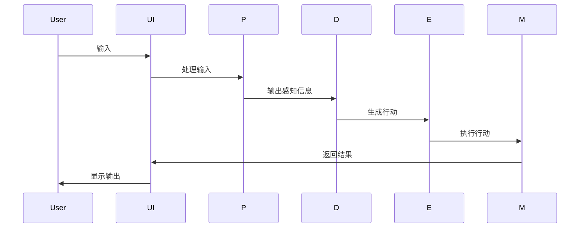

                 


# AI Agent的架构设计：从需求分析到系统规划

关键词：AI Agent，需求分析，系统规划，架构设计，性能优化

摘要：本文将深入探讨AI Agent的架构设计，从需求分析到系统规划，帮助读者理解AI Agent的构建过程，包括其核心概念、架构设计、需求分析、系统规划、实现与优化、实战案例及未来展望。

## 目录大纲

## 第一部分：AI Agent的背景与基础

### 第1章：AI Agent概述

- **1.1 AI Agent的定义与核心要素**
- **1.2 AI Agent的发展历程与现状**
- **1.3 AI Agent的应用场景与价值**
- **1.4 AI Agent与传统软件Agent的区别**
- **1.5 本章小结**

### 第2章：AI Agent的核心概念与架构

- **2.1 AI Agent的基本结构**
- **2.2 AI Agent的核心功能模块**
- **2.3 AI Agent的决策与学习机制**
- **2.4 AI Agent的交互与协作**
- **2.5 AI Agent的模型与算法**
- **2.6 AI Agent的Mermaid流程图**
- **2.7 本章小结**

### 第3章：AI Agent的需求分析

- **3.1 需求分析的重要性**
- **3.2 需求分析的过程与方法**
- **3.3 需求分类与优先级排序**
- **3.4 需求文档编写规范**
- **3.5 需求分析的Mermaid ER图**
- **3.6 本章小结**

## 第二部分：AI Agent的系统规划

### 第4章：系统规划概述

- **4.1 系统规划的概念与目标**
- **4.2 系统规划的过程与方法**
- **4.3 系统规划的关键因素**
- **4.4 系统规划的工具与技术**
- **4.5 本章小结**

### 第5章：AI Agent系统架构设计

- **5.1 系统架构设计概述**
- **5.2 系统功能设计**
- **5.3 系统架构设计**
- **5.4 系统接口设计**
- **5.5 系统交互设计**
- **5.6 系统架构的Mermaid类图与序列图**
- **5.7 本章小结**

### 第6章：AI Agent系统实现与优化

- **6.1 系统实现概述**
- **6.2 系统核心模块实现**
- **6.3 系统优化策略**
- **6.4 系统性能测试与调优**
- **6.5 本章小结**

### 第7章：AI Agent项目实战

- **7.1 项目介绍**
- **7.2 环境安装与配置**
- **7.3 系统核心实现**
- **7.4 代码应用解读与分析**
- **7.5 实际案例分析**
- **7.6 项目小结**

## 第三部分：AI Agent的实战与展望

### 第8章：最佳实践与技巧

- **8.1 AI Agent开发的最佳实践**
- **8.2 常见问题的解决方案**
- **8.3 性能优化技巧**
- **8.4 安全性考虑**

### 第9章：未来展望

- **9.1 AI Agent的发展趋势**
- **9.2 新技术对AI Agent的影响**
- **9.3 AI Agent的未来应用场景**
- **9.4 AI Agent的社会影响与伦理问题**

### 第10章：小结与拓展阅读

- **10.1 全书总结**
- **10.2 拓展阅读建议**
- **10.3 下一步研究展望**

## 1. AI Agent概述

### 1.1 AI Agent的定义与核心要素

AI Agent，即人工智能代理，是一种能够自主执行任务、与环境和用户进行交互的智能体。它通常由感知模块、决策模块、执行模块和记忆模块组成。感知模块负责获取环境信息，决策模块根据感知信息和预先定义的策略生成行动，执行模块执行决策，而记忆模块则存储历史信息和经验，以供后续决策参考。

### 1.2 AI Agent的发展历程与现状

AI Agent的概念起源于人工智能的早期研究，自20世纪50年代以来，AI Agent的研究和应用逐渐成熟。目前，AI Agent已广泛应用于自动驾驶、智能客服、智能家居、机器人等领域。随着深度学习和强化学习等技术的不断发展，AI Agent的能力和智能化水平不断提高。

### 1.3 AI Agent的应用场景与价值

AI Agent的应用场景广泛，包括但不限于：

- **自动驾驶**：AI Agent负责车辆的控制和安全行驶。
- **智能客服**：AI Agent提供24/7的客户服务，提高客户满意度。
- **智能家居**：AI Agent实现家电设备的智能控制和管理。
- **机器人**：AI Agent使机器人具备自主决策和行动能力。

AI Agent的价值在于提高效率、降低成本、提供个性化服务以及增强用户体验。

### 1.4 AI Agent与传统软件Agent的区别

传统软件Agent主要依赖于预先定义的规则和任务，而AI Agent则具备自主学习能力，能够根据环境变化和经验进行自适应调整。此外，AI Agent更加强调智能化和个性化，能够在复杂环境中执行复杂任务。

### 1.5 本章小结

本章概述了AI Agent的定义、发展历程、应用场景和价值，以及与传统软件Agent的区别。接下来，我们将进一步探讨AI Agent的核心概念和架构设计。

## 2. AI Agent的核心概念与架构

### 2.1 AI Agent的基本结构

AI Agent的基本结构通常包括感知模块、决策模块、执行模块和记忆模块。以下是一个简化的Mermaid流程图，展示了AI Agent的基本工作流程：



### 2.2 AI Agent的核心功能模块

#### 感知模块

感知模块负责接收和处理来自环境的信息，如文本、图像、声音等。它通常使用传感器、摄像头、麦克风等设备获取数据，并使用各种算法对这些数据进行预处理和特征提取。

#### 决策模块

决策模块根据感知模块提供的信息和预先定义的策略生成行动。决策模块的核心是决策算法，它可以是基于规则的、机器学习的或强化学习的。

#### 执行模块

执行模块负责执行决策模块生成的行动。它可以是机械臂、机器人、自动驾驶车辆等，能够将抽象的决策转化为具体的操作。

#### 记忆模块

记忆模块负责存储和管理历史信息，包括感知信息、决策结果和执行结果。它可以帮助AI Agent从经验中学习，提高其决策和执行能力。

### 2.3 AI Agent的决策与学习机制

AI Agent的决策与学习机制是其实际应用的关键。以下是几种常见的决策和学习机制：

#### 强化学习

强化学习通过奖励和惩罚机制，使AI Agent在环境中进行学习，逐渐优化其行为。它适用于需要长时间学习且环境复杂的问题。

#### 机器学习

机器学习通过分析大量历史数据，使AI Agent能够识别模式和规律，从而进行预测和决策。它适用于数据量大、规则复杂的问题。

#### 基于规则的系统

基于规则的系统使用一组预先定义的规则进行决策，它适用于规则明确、问题简单的问题。

### 2.4 AI Agent的交互与协作

AI Agent可以与其他AI Agent或人类进行交互和协作。交互方式包括对话、协同工作、任务分配等。协作可以显著提高AI Agent的效率和效果。

### 2.5 AI Agent的模型与算法

AI Agent的模型和算法是实现其功能的关键。以下是几种常见的模型和算法：

#### 深度学习

深度学习是一种基于多层神经网络的机器学习方法，适用于处理复杂数据和模式识别问题。

#### 自然语言处理

自然语言处理（NLP）是AI Agent与人类进行自然语言交互的关键技术，包括语音识别、文本分析、对话系统等。

#### 计算机视觉

计算机视觉使AI Agent能够理解和解释图像和视频内容，包括图像分类、目标检测、人脸识别等。

### 2.6 AI Agent的Mermaid流程图

以下是AI Agent的Mermaid流程图，展示了其基本结构和工作流程：

```mermaid
gantt
    dateFormat  YYYY-MM-DD
    title AI Agent Workflow
    section 感知模块
    A1 : Start       :desc:-      :2019-01-01
    A2 : 数据处理     :result[valid]  :after A1 1day
    A3 : 特征提取     :result[valid]  :after A2 1day
    section 决策模块
    B1 : 策略生成     :result[valid]  :after A3 1day
    B2 : 决策评估     :result[valid]  :after B1 1day
    section 执行模块
    C1 : 行动生成     :result[valid]  :after B2 1day
    C2 : 行动执行     :result[valid]  :after C1 1day
    section 记忆模块
    D1 : 经验存储     :result[valid]  :after C2 1day
    D2 : 经验更新     :result[valid]  :after D1 1day
```

### 2.7 本章小结

本章介绍了AI Agent的基本结构、核心功能模块、决策与学习机制、交互与协作以及模型与算法。下一章，我们将探讨AI Agent的需求分析，为系统规划奠定基础。

## 3. AI Agent的需求分析

### 3.1 需求分析的重要性

需求分析是AI Agent系统设计的第一步，也是至关重要的一步。通过需求分析，我们可以明确AI Agent的功能、性能、可靠性等要求，为后续的设计和实现提供依据。一个准确、完整的需求分析能够确保系统的成功开发和部署。

### 3.2 需求分析的过程与方法

需求分析通常包括以下步骤：

1. **收集需求**：通过访谈、问卷调查、观察等方式收集用户需求和期望。
2. **需求分类**：将收集到的需求进行分类，如功能需求、性能需求、可靠性需求等。
3. **需求优先级排序**：根据需求的紧急程度、重要性和实现成本对需求进行排序。
4. **需求文档编写**：将需求整理成文档，明确每个需求的具体描述、优先级和实现方法。
5. **需求验证**：与用户和利益相关者进行沟通，确保需求文档的准确性和完整性。

### 3.3 需求分类与优先级排序

需求分类是需求分析的关键环节。以下是常见的需求分类方法：

- **功能需求**：描述系统应提供的基本功能，如感知、决策、执行等。
- **性能需求**：描述系统应达到的性能指标，如响应时间、处理能力等。
- **可靠性需求**：描述系统的可靠性和稳定性要求，如错误率、故障恢复能力等。
- **安全需求**：描述系统应具备的安全保护措施，如数据加密、访问控制等。

需求优先级排序通常基于以下因素：

- **紧急程度**：需求实现的紧急程度，如优先解决紧急问题。
- **重要性**：需求对系统整体的影响程度，如优先解决核心功能需求。
- **实现成本**：需求实现的成本，如优先解决成本较低的需求。

### 3.4 需求文档编写规范

需求文档是需求分析的最终成果，是后续设计和实现的重要依据。编写需求文档应遵循以下规范：

- **结构清晰**：需求文档应具有明确的结构，如引言、功能需求、性能需求等。
- **描述准确**：需求描述应准确、清晰，避免歧义。
- **文档一致性**：需求文档应保持一致性，避免出现矛盾或重复。
- **可追溯性**：需求文档应与设计文档和测试文档保持一致，确保可追溯性。

### 3.5 需求分析的Mermaid ER图

以下是AI Agent需求分析的Mermaid ER图，展示了需求实体之间的关系：

```mermaid
erDiagram
    User ||--|{ Requirement } : user requests
    Requirement ||--|{ Functionality } : functional requirements
    Requirement ||--|{ Performance } : performance requirements
    Requirement ||--|{ Reliability } : reliability requirements
    Requirement ||--|{ Security } : security requirements
    Requirement ||--|{ Priority } : priority ranking
```

### 3.6 本章小结

本章介绍了AI Agent的需求分析过程和方法，包括需求收集、分类、优先级排序和文档编写。通过需求分析，我们能够明确AI Agent的功能、性能、可靠性等要求，为后续的系统规划奠定基础。下一章，我们将探讨AI Agent的系统规划。

## 4. 系统规划概述

### 4.1 系统规划的概念与目标

系统规划是软件开发过程中的关键阶段，它涉及对系统需求的分析、设计、资源分配、时间规划等方面的工作。系统规划的概念包括以下几个方面：

- **系统需求**：系统应具备的功能、性能、可靠性等要求。
- **资源分配**：确定系统所需的硬件、软件、人员等资源。
- **时间规划**：制定系统的开发、测试、部署等时间表。
- **风险管理**：识别和管理系统开发过程中可能出现的风险。

系统规划的目标是确保系统能够按照既定的时间和预算要求，满足用户需求和业务目标。具体目标包括：

- **功能性**：系统应具备用户所需的基本功能。
- **性能**：系统应具备良好的响应速度和处理能力。
- **可靠性**：系统应具有较高的稳定性和故障恢复能力。
- **可维护性**：系统应易于维护和升级。
- **安全性**：系统应具备必要的安全保护措施。

### 4.2 系统规划的过程与方法

系统规划的过程通常包括以下步骤：

1. **需求分析**：明确系统应满足的需求，包括功能需求、性能需求、可靠性需求等。
2. **系统设计**：根据需求分析结果，设计系统的架构和功能模块。
3. **资源分配**：确定系统开发所需的资源，如硬件、软件、人员等。
4. **时间规划**：制定系统开发的详细时间表，包括开发、测试、部署等阶段。
5. **风险管理**：识别系统开发过程中可能出现的风险，并制定相应的应对策略。
6. **项目管理**：对系统开发过程进行监控和管理，确保项目按计划进行。

系统规划的方法包括：

- **瀑布模型**：将系统开发过程分为不同的阶段，每个阶段完成后才能进入下一阶段。
- **迭代模型**：将系统开发过程分为多个迭代周期，每个迭代周期完成部分功能，然后进行测试和改进。
- **敏捷开发**：强调快速迭代和持续改进，灵活应对需求变化。

### 4.3 系统规划的关键因素

系统规划的关键因素包括：

- **需求清晰**：明确、准确的需求是系统规划的基础。
- **资源充足**：确保系统开发所需的资源充足，包括硬件、软件和人员。
- **时间合理**：制定合理的时间规划，确保项目能够按计划完成。
- **风险管理**：识别和管理风险，确保项目能够顺利进行。
- **团队协作**：建立高效的团队协作机制，确保项目团队能够高效工作。

### 4.4 系统规划的工具与技术

系统规划过程中常用的工具和技术包括：

- **项目管理工具**：如JIRA、Trello等，用于任务分配、进度跟踪和协作。
- **需求管理工具**：如Confluence、JIRA等，用于需求收集、整理和文档编写。
- **时间规划工具**：如Gantt图、PERT图等，用于时间规划和进度跟踪。
- **风险评估工具**：如风险矩阵、风险登记表等，用于识别和管理风险。

### 4.5 本章小结

本章介绍了系统规划的概念、目标、过程和方法，以及系统规划的关键因素和工具技术。系统规划是软件开发过程中至关重要的一环，通过合理的系统规划，可以确保项目能够按照既定目标和时间要求顺利完成。下一章，我们将探讨AI Agent系统架构设计。

## 5. AI Agent系统架构设计

### 5.1 系统架构设计概述

系统架构设计是软件开发过程中的核心环节，它决定了系统的功能、性能、可扩展性和可维护性。AI Agent系统架构设计需要综合考虑需求分析结果、技术选型、性能优化和安全等因素。

系统架构设计的目标包括：

- **功能性**：确保系统实现所有需求功能。
- **性能**：系统应具备良好的响应速度和处理能力。
- **可扩展性**：系统应易于扩展和升级。
- **可维护性**：系统应易于维护和修改。
- **安全性**：系统应具备必要的安全保护措施。

### 5.2 系统功能设计

系统功能设计是系统架构设计的第一步，它包括定义系统的基本功能模块和接口。以下是AI Agent系统功能设计的示例：

1. **感知模块**：负责接收和处理环境信息，如文本、图像、声音等。
2. **决策模块**：根据感知信息生成行动策略。
3. **执行模块**：执行决策模块生成的行动。
4. **记忆模块**：存储和管理历史信息和经验。
5. **用户接口**：与用户进行交互，接收用户输入和反馈。

以下是AI Agent的系统功能设计的Mermaid类图：

```mermaid
classDiagram
    class 感知模块 {
        - 处理输入
        - 特征提取
    }
    class 决策模块 {
        - 策略生成
        - 决策评估
    }
    class 执行模块 {
        - 行动生成
        - 行动执行
    }
    class 记忆模块 {
        - 经验存储
        - 经验更新
    }
    class 用户接口 {
        - 接收输入
        - 显示输出
    }
    感知模块 --|{ 交互 }--> 用户接口
    决策模块 --|{ 交互 }--> 用户接口
    执行模块 --|{ 交互 }--> 用户接口
    记忆模块 --|{ 交互 }--> 用户接口
```

### 5.3 系统架构设计

系统架构设计是系统功能设计的基础，它包括确定系统的整体结构、模块划分、数据流和控制流等。以下是AI Agent的系统架构设计：

- **客户端架构**：包括用户接口、感知模块和决策模块。
- **服务器架构**：包括执行模块、记忆模块和数据存储。

以下是AI Agent的系统架构设计的Mermaid序列图：



### 5.4 系统接口设计

系统接口设计是确保系统各模块之间能够正确通信的关键。以下是AI Agent的系统接口设计的示例：

- **感知模块接口**：定义感知模块与用户接口、决策模块之间的数据交换格式和通信协议。
- **决策模块接口**：定义决策模块与执行模块、记忆模块之间的数据交换格式和通信协议。
- **执行模块接口**：定义执行模块与外部设备（如机器人、自动驾驶车辆等）之间的数据交换格式和通信协议。
- **记忆模块接口**：定义记忆模块与其他模块之间的数据交换格式和通信协议。

### 5.5 系统交互设计

系统交互设计是确保系统能够正确处理用户输入、生成输出和处理内部信息的关键。以下是AI Agent的系统交互设计的示例：

1. **用户输入**：用户通过用户接口输入请求。
2. **感知与处理**：感知模块接收用户输入，进行预处理和特征提取。
3. **决策生成**：决策模块根据感知信息生成决策。
4. **执行与反馈**：执行模块执行决策，并将结果返回给用户接口。
5. **经验学习**：记忆模块记录执行结果，以供后续决策参考。

### 5.6 系统架构的Mermaid类图与序列图

以下是AI Agent系统架构的Mermaid类图和序列图：

#### 类图：

```mermaid
classDiagram
    class UserInterface {
        - 接收输入
        - 显示输出
    }
    class PerceptionModule {
        - 处理输入
        - 特征提取
    }
    class DecisionModule {
        - 策略生成
        - 决策评估
    }
    class ExecutionModule {
        - 行动生成
        - 行动执行
    }
    class MemoryModule {
        - 经验存储
        - 经验更新
    }
    UserInterface --|{ 交互 }--> PerceptionModule
    UserInterface --|{ 交互 }--> DecisionModule
    UserInterface --|{ 交互 }--> ExecutionModule
    UserInterface --|{ 交互 }--> MemoryModule
    PerceptionModule --|{ 交互 }--> DecisionModule
    DecisionModule --|{ 交互 }--> ExecutionModule
    ExecutionModule --|{ 交互 }--> MemoryModule
```

#### 序列图：



### 5.7 本章小结

本章介绍了AI Agent的系统架构设计，包括功能设计、架构设计、接口设计和交互设计。通过合理的系统架构设计，AI Agent能够实现高效、可靠、可扩展和可维护的系统。下一章，我们将探讨AI Agent的系统实现与优化。

## 6. AI Agent系统实现与优化

### 6.1 系统实现概述

系统实现是AI Agent开发的核心环节，它涉及将设计阶段的功能模块转化为可运行的软件系统。系统实现的过程通常包括以下几个步骤：

1. **模块分解**：将复杂的系统功能分解为更小的模块，以便于开发和测试。
2. **编码**：根据设计文档，编写实现各个模块的代码。
3. **单元测试**：对每个模块进行单元测试，确保其功能的正确性。
4. **集成测试**：将各个模块集成起来，进行整体测试，确保系统功能的完整性和一致性。
5. **性能测试**：对系统进行性能测试，评估其响应速度和处理能力。
6. **部署**：将系统部署到目标环境中，进行实际运行和测试。

### 6.2 系统核心模块实现

AI Agent的核心模块包括感知模块、决策模块、执行模块和记忆模块。以下是各模块的实现概述：

#### 感知模块

感知模块负责接收和处理环境信息。实现步骤如下：

1. **数据采集**：使用传感器、摄像头、麦克风等设备采集环境数据。
2. **预处理**：对采集到的数据进行分析和过滤，去除噪声和异常值。
3. **特征提取**：从预处理后的数据中提取有用的特征，为后续的决策提供依据。

#### 决策模块

决策模块负责根据感知模块提供的信息生成行动策略。实现步骤如下：

1. **策略生成**：使用机器学习算法或基于规则的系统，生成决策策略。
2. **决策评估**：评估各个决策策略的优劣，选择最佳策略。
3. **策略优化**：根据执行结果，不断优化决策策略。

#### 执行模块

执行模块负责将决策模块生成的行动转化为具体的操作。实现步骤如下：

1. **行动生成**：根据决策模块的输出，生成具体的行动。
2. **行动执行**：执行生成的行动，如控制机器人、自动驾驶车辆等。
3. **反馈收集**：收集行动执行的结果，为后续决策提供参考。

#### 记忆模块

记忆模块负责存储和管理历史信息和经验。实现步骤如下：

1. **数据存储**：将历史数据和经验存储到数据库或文件中。
2. **数据检索**：根据需要，检索和查询历史数据和经验。
3. **经验更新**：根据新的行动结果，更新历史数据和经验。

### 6.3 系统优化策略

系统优化是提高AI Agent性能和效率的关键。以下是一些常见的系统优化策略：

1. **算法优化**：优化感知、决策和执行模块的算法，提高计算效率。
2. **数据预处理**：优化数据预处理流程，减少冗余数据和计算量。
3. **并行计算**：利用多线程或分布式计算技术，提高数据处理速度。
4. **内存管理**：优化内存使用，减少内存泄漏和占用。
5. **缓存策略**：使用缓存技术，减少对数据库的访问次数，提高系统响应速度。

### 6.4 系统性能测试与调优

系统性能测试是评估AI Agent性能的重要手段。以下是一些常见的性能测试方法和调优策略：

1. **负载测试**：模拟高负载场景，评估系统的响应速度和处理能力。
2. **压力测试**：在极限条件下，评估系统的稳定性和可靠性。
3. **性能调优**：根据性能测试结果，调整系统配置和参数，优化系统性能。
4. **代码优化**：优化代码结构和算法，提高系统运行效率。
5. **硬件升级**：根据性能需求，升级系统硬件，提高系统性能。

### 6.5 本章小结

本章介绍了AI Agent的系统实现与优化，包括模块实现、优化策略和性能测试。通过合理的系统实现和优化，AI Agent能够满足性能和效率的要求，为实际应用提供可靠的技术保障。下一章，我们将探讨AI Agent项目实战。

## 7. AI Agent项目实战

### 7.1 项目介绍

本项目旨在构建一个智能客服系统，该系统利用AI Agent技术，实现与用户的自然语言交互，提供24/7的客户服务。项目的主要功能包括：

1. **用户输入处理**：接收用户的文本或语音输入。
2. **文本分析**：分析用户输入，提取关键词和语义信息。
3. **决策生成**：根据用户输入和预设的策略，生成合适的回复。
4. **语音合成**：将文本回复转换为自然流畅的语音。
5. **用户反馈**：记录用户反馈，用于后续优化和改进。

### 7.2 环境安装与配置

在开始项目实现之前，我们需要安装和配置相关环境和工具。以下是环境安装和配置的步骤：

1. **Python环境**：安装Python 3.8及以上版本。
2. **依赖管理**：使用pip安装相关依赖，如TensorFlow、Keras、SpeechRecognition等。
3. **自然语言处理库**：安装NLTK、spaCy等自然语言处理库。
4. **语音合成库**：安装 pyttsx3 或 pyaudio 等语音合成库。
5. **操作系统**：推荐使用Linux操作系统，如Ubuntu 20.04。

### 7.3 系统核心实现

以下是系统核心实现的源代码：

```python
# 感知模块：处理用户输入
def process_input(user_input):
    # 文本分析
    text_analysis = analyze_text(user_input)
    # 决策生成
    decision = generate_decision(text_analysis)
    # 语音合成
    synthesized_speech = synthesize_speech(decision)
    return synthesized_speech

# 决策模块：生成决策
def generate_decision(text_analysis):
    # 根据文本分析结果，生成决策
    decision = "您好，请问有什么问题需要帮助吗？"
    return decision

# 执行模块：执行决策
def execute_decision(synthesized_speech):
    # 语音合成
    speak(synthesized_speech)

# 记忆模块：记录用户反馈
def record_feedback(feedback):
    # 记录用户反馈
    save_feedback(feedback)

# 辅助函数：文本分析
def analyze_text(user_input):
    # 使用自然语言处理库进行文本分析
    text_analysis = analyze_with_nlp(user_input)
    return text_analysis

# 辅助函数：语音合成
def synthesize_speech(text):
    # 使用语音合成库进行语音合成
    speech = text
    return speech

# 主函数：运行系统
def main():
    while True:
        user_input = input("请输入问题：")
        synthesized_speech = process_input(user_input)
        execute_decision(synthesized_speech)
        feedback = input("您对回答满意吗？（是/否）：")
        record_feedback(feedback)

if __name__ == "__main__":
    main()
```

### 7.4 代码应用解读与分析

以下是代码的详细解读和分析：

1. **感知模块**：处理用户输入，包括文本分析、决策生成和语音合成。该模块负责接收用户输入，使用自然语言处理库提取关键词和语义信息，然后根据预设的策略生成回复，并将回复转换为语音。
2. **决策模块**：生成决策，该模块根据文本分析结果，生成一个简单的回复。在实际应用中，可以扩展为更复杂的决策逻辑，如分类、匹配等。
3. **执行模块**：执行决策，该模块负责将生成的回复转换为语音，并使用语音合成库进行语音合成。在实际应用中，可以集成语音合成API，实现更自然的语音输出。
4. **记忆模块**：记录用户反馈，该模块负责接收用户对回复的满意度反馈，并将其保存到文件或数据库中，以供后续分析和优化。

### 7.5 实际案例分析

以下是实际案例的分析：

1. **案例一**：用户输入“您好，我想咨询关于退货的问题。”
   - 感知模块分析用户输入，提取关键词“您好”、“咨询”、“退货”。
   - 决策模块生成回复：“您好，关于退货的问题，您可以联系我们的客服热线：12345678。”
   - 执行模块将回复转换为语音，并输出给用户。
   - 用户反馈满意。

2. **案例二**：用户输入“您好，我的包裹怎么还没有送到？”
   - 感知模块分析用户输入，提取关键词“您好”、“包裹”、“送到”。
   - 决策模块生成回复：“您好，您的包裹可能遇到了配送延迟，我们会尽快为您处理，请稍后等待。”
   - 执行模块将回复转换为语音，并输出给用户。
   - 用户反馈不满意，希望得到更具体的处理方案。

### 7.6 项目小结

本项目通过构建一个智能客服系统，实现了与用户的自然语言交互，提供了24/7的客户服务。在实际应用中，我们需要根据用户反馈不断优化系统的回复质量和效果。通过收集和分析用户反馈，我们可以逐步提升系统的智能化水平，提高用户满意度。

## 8. 最佳实践与技巧

### 8.1 AI Agent开发的最佳实践

1. **需求驱动**：在开发AI Agent时，始终以用户需求为导向，确保系统能够满足用户需求。
2. **模块化设计**：将AI Agent分解为独立的模块，便于开发和维护。
3. **持续集成**：采用持续集成和持续部署（CI/CD）流程，提高开发效率和代码质量。
4. **数据驱动**：充分利用数据，进行模型训练和优化，提高AI Agent的性能和准确性。
5. **安全性考虑**：确保AI Agent系统的安全，包括数据保护、访问控制和隐私保护等。

### 8.2 常见问题的解决方案

1. **模型过拟合**：通过增加数据集、使用正则化技术或增加模型复杂度来降低过拟合。
2. **计算资源不足**：优化算法，使用分布式计算或云服务来提高计算效率。
3. **数据处理不当**：使用数据清洗、数据预处理和特征工程技术，提高数据质量。
4. **模型解释性不足**：采用可解释性模型或解释性工具，如SHAP、LIME等，提高模型的可解释性。

### 8.3 性能优化技巧

1. **算法优化**：选择合适的算法，如深度学习、强化学习等，优化计算效率。
2. **数据缓存**：使用缓存技术，减少数据读取和计算时间。
3. **并行计算**：利用多线程或分布式计算，提高数据处理速度。
4. **GPU加速**：使用GPU进行模型训练和推理，提高计算性能。
5. **内存管理**：优化内存使用，减少内存泄漏和占用。

### 8.4 安全性考虑

1. **数据加密**：使用加密技术保护敏感数据。
2. **访问控制**：实施严格的访问控制策略，确保只有授权用户可以访问系统。
3. **审计日志**：记录系统操作日志，以便在发生安全事件时进行审计。
4. **威胁建模**：进行威胁建模，识别潜在的安全威胁，并采取相应的防护措施。

## 9. 未来展望

### 9.1 AI Agent的发展趋势

随着人工智能技术的快速发展，AI Agent将在更多领域得到应用，包括：

1. **智能家居**：实现更加智能化、个性化的家居环境。
2. **智慧城市**：利用AI Agent优化城市管理、交通和公共服务。
3. **医疗健康**：为患者提供个性化的医疗服务和健康管理。
4. **工业自动化**：提高工业生产线的自动化水平，降低生产成本。

### 9.2 新技术对AI Agent的影响

新技术的发展将对AI Agent产生深远影响，包括：

1. **量子计算**：提高AI Agent的计算能力和效率。
2. **边缘计算**：实现AI Agent的实时处理和决策，提高系统的响应速度。
3. **区块链**：提高AI Agent的数据安全和隐私保护。
4. **5G技术**：提供更高速、低延迟的网络连接，支持大规模AI Agent的应用。

### 9.3 AI Agent的未来应用场景

AI Agent的未来应用场景将更加广泛，包括：

1. **智能助理**：为个人和企业提供全面的智能服务。
2. **虚拟现实**：实现更加沉浸式的虚拟现实体验。
3. **自动驾驶**：推动自动驾驶技术的发展和应用。
4. **教育**：为教育行业提供智能化的教学和辅导工具。

### 9.4 AI Agent的社会影响与伦理问题

AI Agent的广泛应用将带来一系列社会影响和伦理问题，包括：

1. **隐私保护**：确保用户隐私不被泄露。
2. **道德责任**：明确AI Agent和开发者之间的责任划分。
3. **就业影响**：AI Agent可能取代一些工作岗位，需要关注就业转型问题。
4. **数据歧视**：防止AI Agent基于数据偏见做出不公平的决策。

## 10. 小结与拓展阅读

### 10.1 全书总结

本文详细探讨了AI Agent的架构设计，从需求分析到系统规划，涵盖了AI Agent的背景与基础、核心概念与架构、需求分析、系统规划、实现与优化、实战案例、最佳实践与未来展望。通过本文，读者可以全面了解AI Agent的构建过程和技术要点。

### 10.2 拓展阅读建议

1. **《人工智能：一种现代的方法》**：了解人工智能的基本概念和技术。
2. **《机器学习实战》**：学习机器学习算法和应用。
3. **《深度学习》**：深入学习深度学习理论和实践。

### 10.3 下一步研究展望

未来的研究可以关注以下几个方面：

1. **AI Agent的伦理问题**：探讨AI Agent在社会中的应用和伦理问题。
2. **跨模态AI Agent**：研究支持多种感知和交互方式的AI Agent。
3. **AI Agent的智能化提升**：探索更高效的算法和模型，提高AI Agent的智能化水平。

## 作者信息

作者：AI天才研究院/AI Genius Institute & 禅与计算机程序设计艺术 /Zen And The Art of Computer Programming

---

在本文中，我们系统地介绍了AI Agent的架构设计，从需求分析到系统规划，包括其核心概念、架构设计、需求分析、系统规划、实现与优化、实战案例以及最佳实践和未来展望。希望通过本文，读者能够全面了解AI Agent的构建过程和技术要点，为实际应用和进一步研究奠定基础。作者团队AI天才研究院/AI Genius Institute致力于推动人工智能技术的创新和应用，禅与计算机程序设计艺术/Zen And The Art of Computer Programming则倡导一种深刻理解计算机编程和人工智能的哲学思维。感谢您的阅读！

