                 

### 让我们一步步思考：AI Agent的概念学习与推理实现

在当今的科技浪潮中，人工智能（AI）已经成为推动社会进步的重要力量。随着AI技术的不断成熟，AI Agent——一种具有自主学习和推理能力的智能体，正逐渐成为研究的焦点。AI Agent能够模拟人类思维过程，通过感知环境、学习知识和推理决策，以适应不断变化的环境。本文将围绕AI Agent的概念学习与推理实现，通过逻辑清晰、结构紧凑的分析，逐步揭示其技术原理和实现方法。

本文将分为以下几个部分：

1. **引言**：介绍AI Agent的概念、发展历程和应用场景。
2. **核心概念与联系**：阐述AI Agent、概念学习和推理的基本原理，并进行对比分析。
3. **算法原理讲解**：介绍机器学习、深度学习和逻辑推理算法，并通过案例进行讲解。
4. **数学模型与公式**：讲解相关数学模型和公式，使用LaTeX进行详细说明。
5. **系统分析与架构设计方案**：介绍问题场景、系统功能、架构设计和系统交互。
6. **项目实战**：通过实际项目展示AI Agent的实现过程，并进行代码解读。
7. **最佳实践 tips、小结与拓展阅读**：总结文章，提供最佳实践建议和拓展阅读资源。

让我们一步步深入探讨AI Agent的概念学习与推理实现，揭开AI智能体背后的技术奥秘。

## 第1章 引言

### 1.1 问题背景

随着计算机技术的发展，AI技术已经渗透到我们日常生活的方方面面。从智能家居、智能客服到自动驾驶，AI正逐步改变我们的生活方式。AI Agent作为一种具有自主意识和行动能力的智能体，能够模拟人类思维过程，进行感知、学习和推理。AI Agent的出现标志着AI技术从被动响应向主动探索的转变，极大地提升了AI系统的智能水平。

AI Agent的发展历程可以追溯到20世纪50年代，当时计算机科学家首次提出“智能代理”的概念。随着人工智能技术的不断进步，AI Agent逐渐成为AI研究的重要方向。近年来，深度学习、强化学习等新兴技术的出现，为AI Agent的概念学习与推理提供了强有力的支持。

### 1.2 问题描述

AI Agent的概念学习与推理是实现其智能化的关键。概念学习是指AI Agent从大量数据中提取共同特征，形成对某个概念的理解。例如，一个图像识别AI Agent需要通过学习识别不同物体的特征，从而区分各种物品。推理是指AI Agent利用已有知识进行推断和决策。例如，一个智能客服AI Agent需要根据用户的问题和已知信息，推理出最佳的解答。

在实际应用中，AI Agent的概念学习和推理能力至关重要。只有具备良好的概念学习和推理能力，AI Agent才能更好地适应环境，解决复杂问题。然而，实现AI Agent的概念学习和推理并非易事，需要结合多种技术手段，如机器学习、深度学习和逻辑推理等。

### 1.3 问题解决

为了解决AI Agent的概念学习与推理问题，本文将从以下几个方面进行探讨：

1. **相关理论和算法**：介绍机器学习、深度学习、逻辑推理等技术在AI Agent概念学习与推理中的应用。
2. **实际案例分析**：通过具体案例展示AI Agent的概念学习与推理过程，分析其实现方法和效果。
3. **系统架构设计**：介绍AI Agent的系统架构，包括感知器、学习算法、推理引擎等核心模块。
4. **项目实战**：通过实际项目展示AI Agent的概念学习与推理实现过程，进行代码解读和分析。

通过以上探讨，本文旨在为读者提供一个全面、系统的AI Agent概念学习与推理实现指南，帮助读者更好地理解和应用这一前沿技术。

### 1.4 边界与外延

AI Agent的概念学习与推理不仅局限于机器学习和深度学习，还包括逻辑推理、知识图谱等多种技术。逻辑推理作为一种传统的AI技术，能够在推理过程中保证推理的严谨性和可靠性。知识图谱则通过构建实体和关系网络，为AI Agent提供了丰富的知识资源。此外，自然语言处理、对话系统等技术的发展，也为AI Agent的概念学习与推理提供了新的思路和方法。

然而，AI Agent的概念学习与推理也面临一些挑战。首先，如何有效地处理大规模数据是AI Agent面临的重要问题。其次，如何确保AI Agent的推理过程具有可解释性和可靠性，也是需要深入探讨的课题。此外，AI Agent在跨领域应用中的适应性也是一个值得关注的问题。

总之，AI Agent的概念学习与推理是一个多维度、多技术的复杂问题，需要结合多种技术手段，持续探索和优化。通过本文的探讨，希望读者能够对AI Agent的概念学习与推理有更深入的理解，并能够将其应用于实际场景中，推动AI技术的发展。

### 1.5 概念结构与核心要素组成

AI Agent的概念学习与推理涉及多个核心要素，这些要素共同构成了AI Agent的基本结构。以下是AI Agent的核心要素及其组成：

1. **感知器**：感知器是AI Agent的感官部分，用于感知和理解外部环境。感知器可以包括视觉、听觉、触觉等多种感官形式，能够获取环境中的各种信息。

2. **知识库**：知识库是AI Agent的知识存储中心，包括从概念学习过程中获取的知识、事实和规则等。知识库为AI Agent提供了推理和决策的基础。

3. **学习算法**：学习算法是AI Agent的核心处理模块，用于从数据中提取知识，更新和优化知识库。常见的学习算法包括机器学习算法、深度学习算法和强化学习算法等。

4. **推理引擎**：推理引擎是AI Agent的决策中心，负责利用知识库中的知识进行推理和决策。推理引擎可以采用逻辑推理、概率推理等多种推理方法。

5. **行动机制**：行动机制是AI Agent的行为执行部分，根据推理结果执行具体的操作，如移动、交流等。行动机制实现了AI Agent与环境的互动。

这些核心要素相互作用，共同构成了AI Agent的基本结构。感知器获取环境信息，学习算法从数据中提取知识，推理引擎进行推理和决策，行动机制执行操作。这一过程不断循环，使AI Agent能够动态适应环境，实现智能行为。通过深入分析这些核心要素的组成和相互关系，我们可以更好地理解AI Agent的概念学习与推理实现过程。

### 第2章 核心概念与联系

在探讨AI Agent的概念学习与推理之前，我们首先需要明确几个核心概念，并了解它们之间的联系。这些核心概念包括AI Agent、概念学习、推理等，它们共同构成了AI Agent智能化的基础。

#### 2.1 AI Agent的概念

AI Agent是指具有自主意识和行动能力的智能体，能够在一定程度上模拟人类的认知和思维过程。AI Agent通常具备感知、学习、推理和行动等能力，能够与环境进行互动并做出合理的决策。

**定义**：AI Agent是一种通过自主学习和推理，能够与环境交互并执行特定任务的智能体。它通常由感知器、知识库、学习算法、推理引擎和行动机制等核心部分组成。

**特点**：AI Agent具有自主性、适应性、灵活性和智能性等特点。自主性意味着AI Agent能够独立地完成任务；适应性使AI Agent能够根据环境变化调整行为；灵活性使AI Agent能够应对多种情况；智能性则是AI Agent的核心，使其能够进行复杂的学习和推理。

**应用场景**：AI Agent广泛应用于各种领域，如智能客服、自动驾驶、智能家居、医疗诊断等。在这些场景中，AI Agent能够通过感知用户需求、学习用户偏好、推理最佳解决方案，并采取行动，从而提供个性化的服务。

#### 2.2 概念学习原理

概念学习是指AI Agent通过从数据中提取共同特征，形成对某个概念的理解。这个过程类似于人类通过观察和经验积累知识。在AI Agent中，概念学习是构建知识库的重要手段。

**定义**：概念学习是指AI Agent从大量数据中识别和提取共同特征，形成对某个概念或对象的认知和理解。

**原理**：

1. **数据收集**：AI Agent通过感知器收集大量相关数据。
2. **特征提取**：对数据进行处理，提取出具有代表性的特征。
3. **概念形成**：通过比较和归纳，将提取出的特征归纳为某个概念。
4. **知识存储**：将形成的概念存储到知识库中，以供后续推理使用。

**方法**：

- **机器学习**：通过监督学习、无监督学习等方法，从数据中提取特征和模式。
- **深度学习**：利用神经网络等模型，自动提取层次化的特征表示。
- **知识表示**：通过符号表示、图形表示等方法，将提取出的概念进行存储和表达。

#### 2.3 推理原理

推理是指AI Agent利用已有知识和信息，进行逻辑推断和决策的过程。推理是实现AI Agent智能性的关键，它使得AI Agent能够根据已知信息推断出未知信息，并在复杂环境中做出合理决策。

**定义**：推理是指AI Agent利用知识库中的知识，进行逻辑推断和决策的过程。

**原理**：

1. **知识库构建**：AI Agent通过概念学习获取知识，并将其存储在知识库中。
2. **推理过程**：AI Agent根据已知信息和知识库，进行逻辑推理，生成新的结论或决策。
3. **决策执行**：根据推理结果，执行相应的行动或操作。

**方法**：

- **逻辑推理**：基于命题逻辑、谓词逻辑等进行推理，确保推理过程的严谨性和可靠性。
- **概率推理**：基于概率模型，通过计算概率分布，进行不确定性的推理和决策。
- **模糊推理**：基于模糊逻辑，处理不确定性和模糊性的信息。

#### 2.4 概念属性特征对比

为了更好地理解AI Agent的概念学习与推理，我们可以对比不同概念学习与推理方法的特点和适用场景。

| 方法       | 特点                                           | 适用场景                            |
|------------|------------------------------------------------|------------------------------------|
| 机器学习   | 自动化、高效、适用于大规模数据                 | 图像识别、自然语言处理、推荐系统等 |
| 深度学习   | 自主特征提取、适用于复杂任务、高度智能化       | 自动驾驶、语音识别、游戏AI等       |
| 逻辑推理   | 严谨、可靠性高、适用于需要确定性结果的场景     | 法律推理、医疗诊断、安全监控等     |
| 概率推理   | 处理不确定性、适用于需要概率性估计的场景       | 风险评估、智能推荐、金融市场分析等 |
| 模糊推理   | 处理模糊性、适用于不确定性高的场景             | 智能家居、智能交通、环境保护等     |

通过对比不同方法的特点和适用场景，我们可以根据实际需求选择合适的技术手段，实现AI Agent的概念学习与推理。

### 第3章 算法原理讲解

在AI Agent的概念学习与推理过程中，算法是实现这些功能的核心。本章节将介绍几种常用的算法，包括机器学习、深度学习和逻辑推理，并使用mermaid流程图和Python源代码进行详细讲解。

#### 3.1 机器学习算法

机器学习算法是AI Agent概念学习的基础，能够从数据中自动提取特征和规律。以下是几种常见的机器学习算法：

**1. 支持向量机（SVM）**

支持向量机是一种二分类模型，通过找到最佳分隔超平面，将不同类别的数据分开。SVM的核心在于优化目标函数，通过最大化分类间隔，提高分类效果。

**mermaid流程图：**
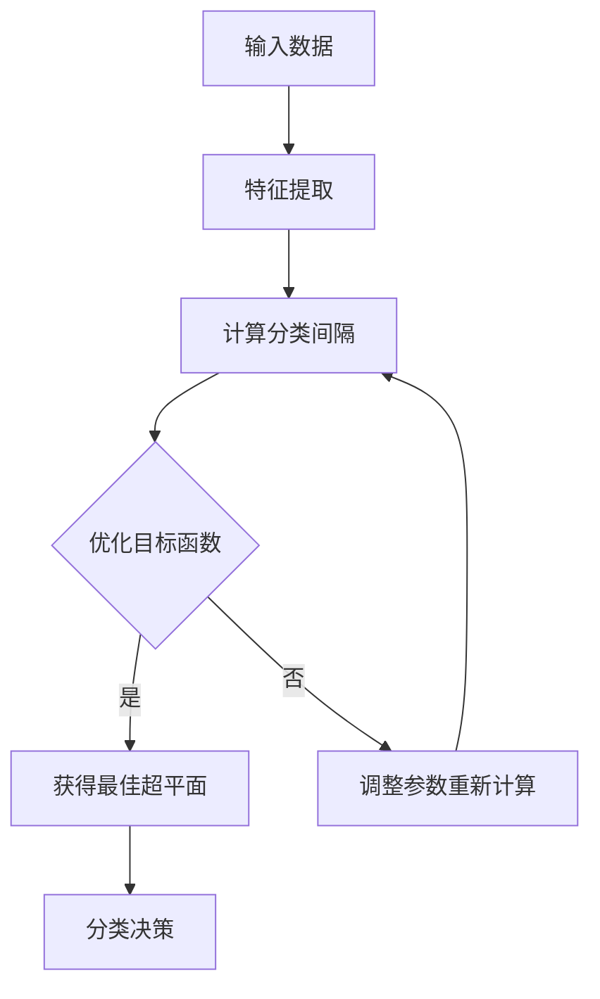

**Python源代码示例：**
```python
from sklearn import datasets
from sklearn.model_selection import train_test_split
from sklearn.svm import SVC

# 加载示例数据
iris = datasets.load_iris()
X = iris.data
y = iris.target

# 划分训练集和测试集
X_train, X_test, y_train, y_test = train_test_split(X, y, test_size=0.3, random_state=42)

# 创建SVM模型并训练
clf = SVC(kernel='linear')
clf.fit(X_train, y_train)

# 预测测试集
predictions = clf.predict(X_test)

# 打印准确率
print("Accuracy:", clf.score(X_test, y_test))
```

**2. 决策树**

决策树是一种树形结构模型，通过一系列的判断条件，将数据划分为不同的区域。决策树通过计算每个节点的信息增益，选择最优的特征进行划分。

**mermaid流程图：**
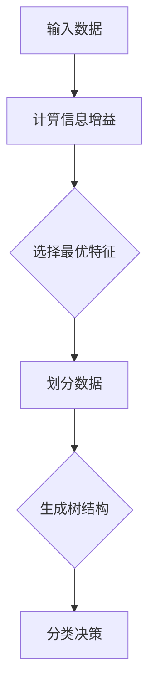

**Python源代码示例：**
```python
from sklearn import datasets
from sklearn.tree import DecisionTreeClassifier

# 加载示例数据
iris = datasets.load_iris()
X = iris.data
y = iris.target

# 创建决策树模型并训练
clf = DecisionTreeClassifier()
clf.fit(X, y)

# 预测测试集
predictions = clf.predict(X)

# 打印准确率
print("Accuracy:", clf.score(X, y))
```

**3. 神经网络**

神经网络是一种模拟人脑神经元连接结构的计算模型，通过层层提取特征，实现复杂的数据分类和预测。神经网络包括输入层、隐藏层和输出层，每个层中的节点通过权重连接。

**mermaid流程图：**
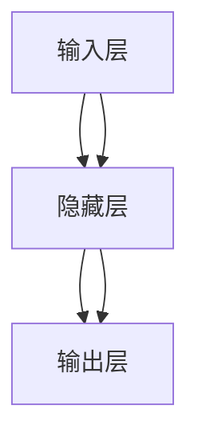

**Python源代码示例：**
```python
import numpy as np
from sklearn.datasets import make_classification
from sklearn.model_selection import train_test_split
from sklearn.neural_network import MLPClassifier

# 生成示例数据
X, y = make_classification(n_samples=1000, n_features=20, n_informative=2, n_redundant=10, random_state=42)

# 划分训练集和测试集
X_train, X_test, y_train, y_test = train_test_split(X, y, test_size=0.3, random_state=42)

# 创建神经网络模型并训练
clf = MLPClassifier(hidden_layer_sizes=(100,), max_iter=1000)
clf.fit(X_train, y_train)

# 预测测试集
predictions = clf.predict(X_test)

# 打印准确率
print("Accuracy:", clf.score(X_test, y_test))
```

通过以上机器学习算法的讲解，我们可以看到如何利用这些算法实现AI Agent的概念学习。接下来，我们将探讨深度学习算法。

#### 3.2 深度学习算法

深度学习算法是机器学习的子领域，通过多层神经网络自动提取特征，实现复杂的数据处理任务。以下是几种常见的深度学习算法：

**1. 卷积神经网络（CNN）**

卷积神经网络是一种用于图像识别和处理的前沿算法，通过卷积层、池化层和全连接层，实现图像特征的自动提取和分类。

**mermaid流程图：**
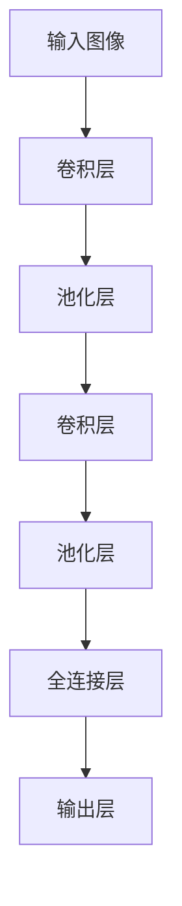

**Python源代码示例：**
```python
from tensorflow.keras.models import Sequential
from tensorflow.keras.layers import Conv2D, MaxPooling2D, Flatten, Dense

# 创建CNN模型
model = Sequential()
model.add(Conv2D(32, (3, 3), activation='relu', input_shape=(64, 64, 3)))
model.add(MaxPooling2D((2, 2)))
model.add(Conv2D(64, (3, 3), activation='relu'))
model.add(MaxPooling2D((2, 2)))
model.add(Flatten())
model.add(Dense(128, activation='relu'))
model.add(Dense(10, activation='softmax'))

# 编译模型
model.compile(optimizer='adam', loss='categorical_crossentropy', metrics=['accuracy'])

# 训练模型
model.fit(X_train, y_train, epochs=10, batch_size=32, validation_data=(X_test, y_test))

# 预测测试集
predictions = model.predict(X_test)

# 打印准确率
print("Accuracy:", model.evaluate(X_test, y_test)[1])
```

**2. 循环神经网络（RNN）**

循环神经网络是一种用于序列数据处理的深度学习算法，通过递归结构，实现序列数据的建模和预测。

**mermaid流程图：**
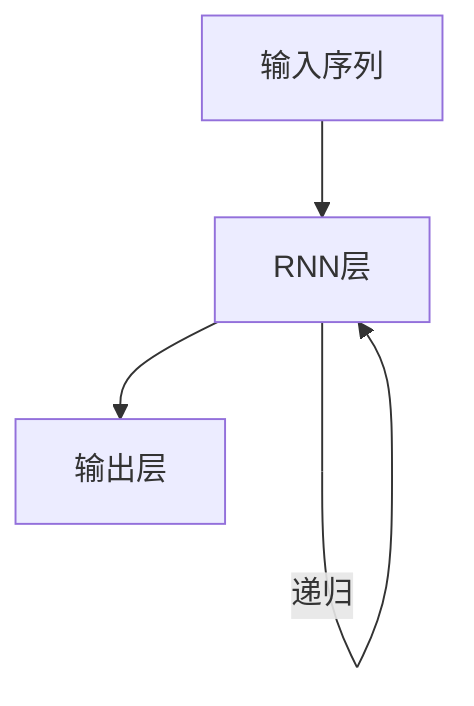

**Python源代码示例：**
```python
from tensorflow.keras.models import Sequential
from tensorflow.keras.layers import LSTM, Dense

# 创建RNN模型
model = Sequential()
model.add(LSTM(50, activation='relu', input_shape=(timesteps, features)))
model.add(Dense(1))

# 编译模型
model.compile(optimizer='adam', loss='mse')

# 训练模型
model.fit(X_train, y_train, epochs=100, batch_size=32, validation_data=(X_test, y_test))

# 预测测试集
predictions = model.predict(X_test)

# 打印预测结果
print(predictions)
```

通过深度学习算法的讲解，我们可以看到如何利用这些算法实现AI Agent的概念学习。接下来，我们将探讨逻辑推理算法。

#### 3.3 逻辑推理算法

逻辑推理算法是一种基于逻辑规则的推理方法，通过演绎推理和归纳推理，实现知识的推理和决策。以下是几种常见的逻辑推理算法：

**1. 命题逻辑**

命题逻辑是一种基础逻辑推理方法，通过真值表和逻辑运算，实现命题之间的推理。

**mermaid流程图：**
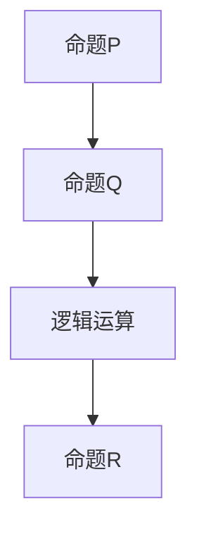

**Python源代码示例：**
```python
# 定义命题
P = True
Q = False

# 逻辑运算
R = P and Q  # R为False

# 打印结果
print(R)
```

**2. 谓词逻辑**

谓词逻辑是一种更复杂的逻辑推理方法，通过量词和谓词，实现对更复杂事实的推理。

**mermaid流程图：**
```mermaid
graph TD
A[存在量词∃] --> B[谓词函数P(x)]
B --> C[推理结论]
A -->|对所有| D[谓词函数Q(x)]
D --> E[推理结论]
```

**Python源代码示例：**
```python
# 定义谓词函数
P = lambda x: x > 0
Q = lambda x: x < 10

# 存在量词推理
exists_x = any(P(x) for x in range(10))

# 全称量词推理
forall_x = all(Q(x) for x in range(10))

# 打印结果
print("存在量词结论：", exists_x)
print("全称量词结论：", forall_x)
```

通过逻辑推理算法的讲解，我们可以看到如何利用这些算法实现AI Agent的推理功能。在下一章中，我们将深入探讨AI Agent的数学模型与公式，进一步理解其概念学习与推理的数学基础。

### 第4章 数学模型与公式

数学模型是描述问题本质的重要工具，在AI Agent的概念学习与推理过程中，数学模型起着核心作用。本章节将介绍与AI Agent概念学习与推理相关的数学模型，并使用LaTeX格式详细讲解关键公式，同时结合实际案例进行说明。

#### 4.1 数学模型原理

AI Agent的概念学习与推理涉及多种数学模型，包括概率模型、统计模型、优化模型等。以下是几个常见的数学模型：

**1. 概率模型**

概率模型用于描述不确定性和随机性。在AI Agent中，概率模型可以用于不确定性推理和决策。

**概率模型公式：**
$$ P(A|B) = \frac{P(B|A) \cdot P(A)}{P(B)} $$

**解释**：条件概率公式表示在事件B发生的条件下，事件A发生的概率。P(A|B)表示在B发生的前提下，A发生的概率；P(B|A)表示在A发生的前提下，B发生的概率；P(A)和P(B)分别表示事件A和事件B的先验概率。

**应用案例**：假设我们有一个判断某商品是否值得购买的AI Agent。该AI Agent会综合考虑商品的价格、用户评价、品牌知名度等因素，通过条件概率公式，计算出购买该商品的概率，从而做出决策。

**2. 统计模型**

统计模型用于从数据中提取特征和规律，是实现机器学习和深度学习的基础。

**统计模型公式：**
$$ \mu = \frac{1}{n} \sum_{i=1}^{n} x_i $$
$$ \sigma^2 = \frac{1}{n-1} \sum_{i=1}^{n} (x_i - \mu)^2 $$

**解释**：均值公式表示一组数据的平均值，其中$\mu$为均值，$x_i$为第i个数据点；方差公式表示一组数据的离散程度，其中$\sigma^2$为方差，$\mu$为均值。

**应用案例**：在AI Agent的图像识别任务中，可以通过统计模型计算图像的特征向量，从而实现图像的分类和识别。

**3. 优化模型**

优化模型用于求解最优化问题，在AI Agent的概念学习与推理中，优化模型用于优化学习算法和推理策略。

**优化模型公式：**
$$ \min_{\theta} J(\theta) $$

**解释**：优化目标函数表示需要最小化的目标函数，其中$\theta$为模型参数，$J(\theta)$为目标函数。

**应用案例**：在神经网络中，通过优化模型，可以调整网络权重，使预测误差最小化，从而提高模型的预测准确性。

#### 4.2 公式详细讲解

以下是对几个关键公式的详细讲解：

**1. 激活函数**

激活函数是神经网络中的关键组成部分，用于引入非线性特性。

**LaTeX公式：**
$$ f(x) = \max(0, x) $$

**解释**：ReLU（Rectified Linear Unit）激活函数定义为当$x \geq 0$时，$f(x) = x$；当$x < 0$时，$f(x) = 0$。ReLU函数简单有效，能够加速神经网络的训练过程。

**应用案例**：在卷积神经网络中，ReLU激活函数用于隐藏层节点，能够增强网络的非线性表示能力。

**2. 梯度下降**

梯度下降是优化模型的一种常用算法，用于最小化目标函数。

**LaTeX公式：**
$$ \theta_{t+1} = \theta_t - \alpha \cdot \nabla J(\theta_t) $$

**解释**：梯度下降算法更新模型参数$\theta$，其中$\alpha$为学习率，$\nabla J(\theta_t)$为目标函数$J(\theta)$在当前参数$\theta_t$处的梯度。

**应用案例**：在训练神经网络时，通过梯度下降算法，可以不断调整网络权重，使预测误差最小化。

**3. 主成分分析（PCA）**

主成分分析是一种降维方法，用于提取数据的主要特征。

**LaTeX公式：**
$$ \mu = \frac{1}{n} \sum_{i=1}^{n} x_i $$
$$ \Sigma = \frac{1}{n} \sum_{i=1}^{n} (x_i - \mu)(x_i - \mu)^T $$

**解释**：均值公式和协方差矩阵公式分别计算数据集的均值和协方差矩阵，用于计算数据的主要成分。

**应用案例**：在图像识别任务中，PCA可以用于降维，减少计算复杂度，同时保留图像的主要特征。

通过以上数学模型的介绍和公式详细讲解，我们可以更好地理解AI Agent概念学习与推理的数学基础。在下一章中，我们将探讨AI Agent的系统分析与架构设计方案。

### 第5章 系统分析与架构设计方案

在AI Agent的概念学习与推理过程中，系统架构设计至关重要。一个高效、灵活的系统架构能够确保AI Agent在各种应用场景中发挥最佳性能。本章节将介绍AI Agent的系统架构设计，包括问题场景、系统功能设计、系统架构设计、系统接口设计和系统交互设计。

#### 5.1 问题场景介绍

AI Agent广泛应用于各种领域，如智能客服、自动驾驶、智能家居、医疗诊断等。以智能客服为例，AI Agent需要通过感知用户的问题、学习用户偏好、推理最佳解答，并采取行动，如发送消息或提供解决方案。以下是智能客服中AI Agent的具体应用场景：

1. **问题识别**：AI Agent通过自然语言处理技术，识别用户提出的问题类型。
2. **知识查询**：AI Agent从知识库中查询相关答案或解决方案。
3. **推理决策**：AI Agent利用逻辑推理和概率推理，确定最佳回答或解决方案。
4. **执行行动**：AI Agent根据推理结果，采取相应的行动，如发送消息或提供解决方案。

#### 5.2 系统功能设计

AI Agent的系统功能设计包括感知器、学习算法、推理引擎和行动机制等核心模块。以下是这些模块的具体设计：

**1. 感知器**

感知器是AI Agent的感官部分，用于感知和理解外部环境。感知器可以包括自然语言处理模块、图像识别模块、音频识别模块等。

**Mermaid类图：**
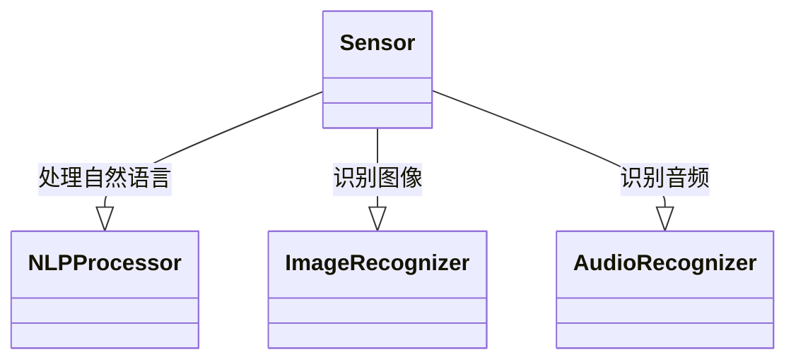

**2. 学习算法**

学习算法是AI Agent的知识库构建核心，包括机器学习算法、深度学习算法和强化学习算法等。学习算法通过从数据中提取特征和模式，不断更新和优化知识库。

**Mermaid类图：**
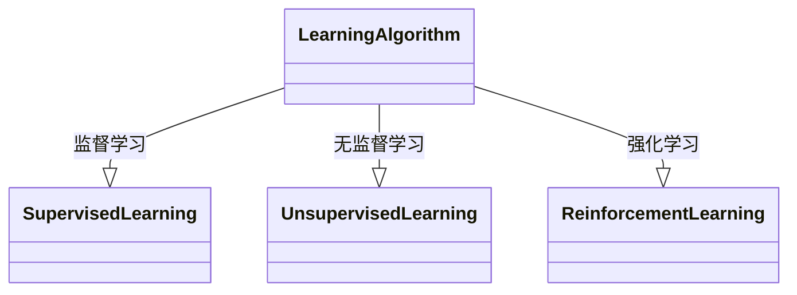

**3. 推理引擎**

推理引擎是AI Agent的决策核心，用于利用知识库中的知识进行推理和决策。推理引擎可以采用逻辑推理、概率推理和模糊推理等方法。

**Mermaid类图：**
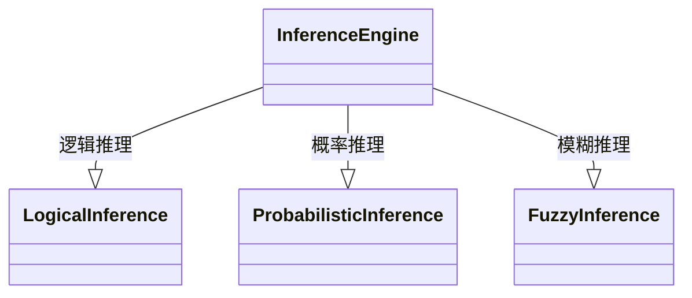

**4. 行动机制**

行动机制是AI Agent的行为执行部分，根据推理结果执行具体的操作，如发送消息、提供解决方案等。

**Mermaid类图：**
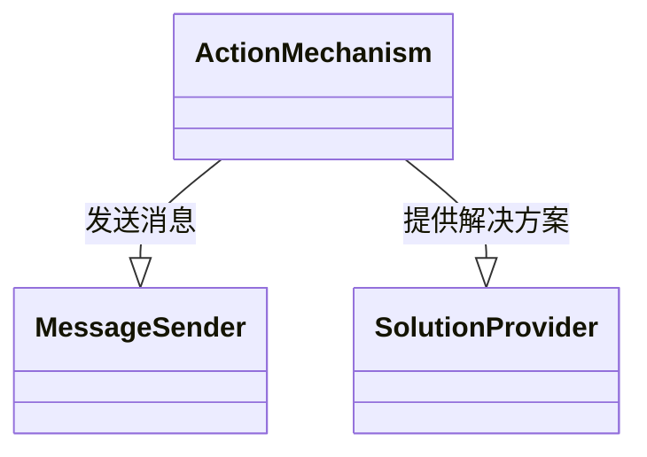

#### 5.3 系统架构设计

AI Agent的系统架构设计包括前端、后端和数据存储等部分。前端负责与用户交互，后端负责处理数据和推理任务，数据存储用于存储知识库和训练数据。

**Mermaid架构图：**
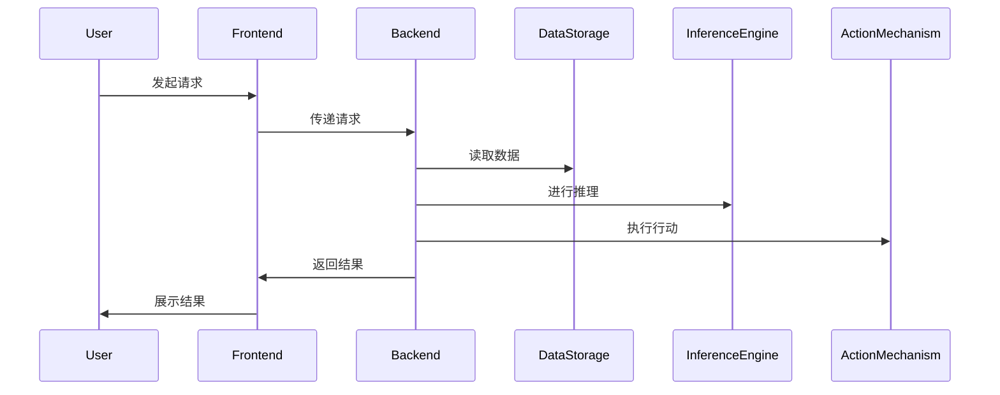

#### 5.4 系统接口设计

AI Agent的系统接口设计包括API接口和数据接口。API接口用于与其他系统进行交互，数据接口用于读取和写入数据。

**Mermaid类图：**
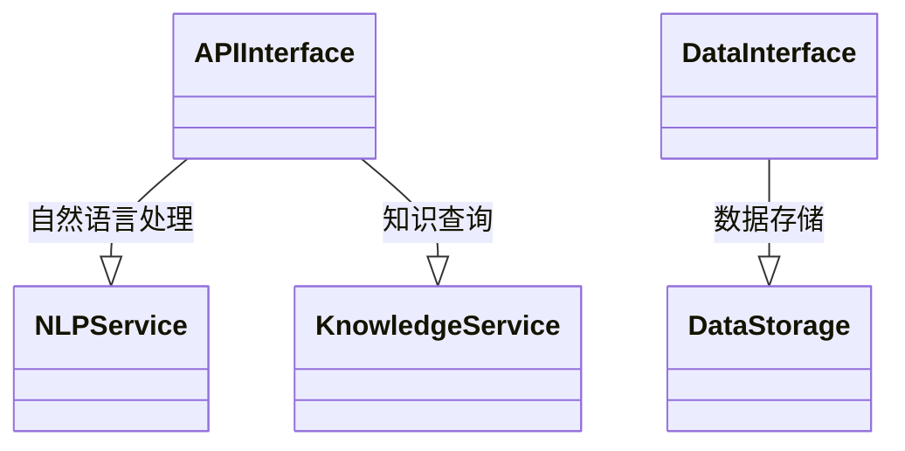

#### 5.5 系统交互设计

AI Agent的系统交互设计包括感知、学习、推理和行动等过程。系统交互设计确保各模块之间的高效协同和合理分工。

**Mermaid序列图：**
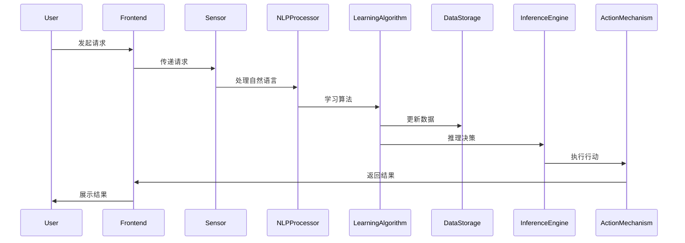

通过以上系统分析与架构设计方案，我们为AI Agent的概念学习与推理实现提供了清晰、系统的框架。在下一章中，我们将通过项目实战展示AI Agent的具体实现过程。

### 第6章 项目实战

在本章节中，我们将通过一个实际项目，展示如何实现AI Agent的概念学习与推理。项目背景是一个智能客服系统，该系统旨在通过AI Agent自动处理用户咨询，提高客服效率和用户体验。以下是项目实战的详细步骤：

#### 6.1 环境安装

要实现AI Agent，首先需要安装相关软件和依赖。以下是项目环境安装步骤：

1. **安装Python**：确保Python版本在3.6及以上。
2. **安装TensorFlow**：TensorFlow是深度学习的主要框架，可以通过pip安装：
   ```bash
   pip install tensorflow
   ```
3. **安装其他依赖**：根据项目需求，安装其他依赖库，如numpy、pandas、scikit-learn等。

#### 6.2 系统核心实现

AI Agent的核心实现包括感知器、学习算法、推理引擎和行动机制。以下是各核心模块的代码实现：

**1. 感知器（Sensor）**

感知器负责接收用户输入，并提取关键信息。以下是一个简单的自然语言处理（NLP）模块实现：
```python
import nltk
from nltk.tokenize import word_tokenize
from nltk.corpus import stopwords

# 加载停用词表
nltk.download('stopwords')
stop_words = set(stopwords.words('english'))

def preprocess_text(text):
    # 分词
    tokens = word_tokenize(text)
    # 去除停用词
    filtered_tokens = [token for token in tokens if token not in stop_words]
    return filtered_tokens

# 示例
user_query = "I need help with my internet service."
processed_query = preprocess_text(user_query)
print(processed_query)
```

**2. 学习算法（LearningAlgorithm）**

学习算法用于从数据中提取知识，构建知识库。以下是一个基于朴素贝叶斯分类器的实现：
```python
from sklearn.feature_extraction.text import CountVectorizer
from sklearn.naive_bayes import MultinomialNB

# 加载训练数据
train_data = ["I need help with my internet service.",
              "Can you assist me with my billing issue?",
              "I'm having trouble with my Wi-Fi connection."]
train_labels = ["technical support", "billing", "network issue"]

# 特征提取
vectorizer = CountVectorizer()
X_train = vectorizer.fit_transform(train_data)

# 训练模型
clf = MultinomialNB()
clf.fit(X_train, train_labels)

# 测试数据
test_data = ["I need help with my internet speed."]
X_test = vectorizer.transform(test_data)

# 预测
predictions = clf.predict(X_test)
print(predictions)
```

**3. 推理引擎（InferenceEngine）**

推理引擎用于利用知识库进行推理和决策。以下是一个简单的推理实现，利用逻辑推理判断用户请求的类型：
```python
def infer_request_type(query):
    # 假设已有知识库
    knowledge_base = {
        "technical support": ["help", "issue", "problem"],
        "billing": ["bill", "charge", "invoice"],
        "network issue": ["connection", "speed", "Wi-Fi"]
    }

    # 基于关键词进行推理
    request_type = None
    for type, keywords in knowledge_base.items():
        if any(keyword in query for keyword in keywords):
            request_type = type
            break

    return request_type

# 示例
user_query = "I need help with my internet speed."
request_type = infer_request_type(user_query)
print(request_type)
```

**4. 行动机制（ActionMechanism）**

行动机制根据推理结果执行具体的操作。以下是一个简单的消息发送实现：
```python
def send_message(request_type):
    messages = {
        "technical support": "We will assist you with your technical support issue.",
        "billing": "We will assist you with your billing inquiry.",
        "network issue": "We will assist you with your network issue."
    }

    return messages.get(request_type, "Thank you for reaching out to us.")

# 示例
user_query = "I need help with my internet speed."
response_message = send_message(infer_request_type(user_query))
print(response_message)
```

#### 6.3 代码应用解读与分析

在上面的代码实现中，我们通过感知器模块接收用户输入，使用自然语言处理技术对文本进行处理。学习算法模块利用朴素贝叶斯分类器从训练数据中提取特征，构建知识库。推理引擎模块通过逻辑推理判断用户请求类型。行动机制模块根据推理结果生成响应消息。

以下是对关键部分的解读与分析：

1. **感知器模块**：文本预处理是自然语言处理的基础，通过分词和去除停用词，提取文本的关键信息，为后续处理提供输入。
2. **学习算法模块**：朴素贝叶斯分类器是一种简单的统计分类方法，通过计算特征词的概率分布，实现分类任务。该算法在小数据集上表现良好，适用于文本分类任务。
3. **推理引擎模块**：基于逻辑推理的简单实现，通过匹配关键词，判断用户请求类型。这种方法适用于关键词明确的场景，但对于复杂和多义性的文本，需要更复杂的推理方法。
4. **行动机制模块**：根据推理结果，生成响应消息。这种简单的行动机制适用于自动化客服场景，但在实际应用中，可能需要更复杂的决策逻辑，如集成多模态感知器、多策略决策等。

通过以上项目实战，我们展示了如何实现一个简单的AI Agent，实现了感知、学习、推理和行动的基本功能。在实际应用中，AI Agent的复杂性和适应性需要不断优化和提升，以满足不同场景的需求。

#### 6.4 实际案例分析和详细讲解剖析

为了更好地理解AI Agent在实际应用中的效果，我们来看一个具体的案例——智能客服系统在处理客户咨询时的应用。

**案例背景**：某互联网公司开发了一款智能客服系统，用于自动处理用户咨询，提高客服效率和用户体验。该系统采用了本文所介绍的AI Agent技术，通过感知、学习、推理和行动实现自动化的客户服务。

**客户咨询示例**：用户A通过在线客服系统提交了一个问题：“我的Wi-Fi连接不稳定，怎么办？”

**1. 感知阶段**：AI Agent接收到用户的问题后，首先通过自然语言处理（NLP）模块对问题进行预处理，提取关键信息。预处理步骤包括分词、去除停用词、词性标注等。处理后的文本为：“我的Wi-Fi连接不稳定，怎么办？”

**2. 学习阶段**：AI Agent利用已训练好的朴素贝叶斯分类器，对预处理后的文本进行特征提取和分类。朴素贝叶斯分类器将文本转换为特征向量，并计算每个类别（如“技术支持”、“账单查询”、“网络问题”）的概率分布。通过比较概率分布，AI Agent判断用户问题属于“网络问题”类别。

**3. 推理阶段**：在推理阶段，AI Agent调用逻辑推理模块，根据用户问题类型生成可能的解决方案。例如，对于“网络问题”，AI Agent可能推理出以下解决方案：

- 检查路由器是否处于最佳位置。
- 重启路由器。
- 检查网络设置，确保没有错误配置。

**4. 行动阶段**：AI Agent根据推理结果，生成一条详细的回复信息，并通过在线客服系统发送给用户A。回复信息可能如下：

“您好，感谢您联系我们。针对您提到的Wi-Fi连接不稳定问题，以下是几个可能的解决方案：

1. 请确保路由器位于中心位置，并避免遮挡物。
2. 尝试重启路由器，有时候重启能够解决网络连接问题。
3. 检查网络设置，确保没有错误配置。如果问题仍然存在，请联系技术支持。”

**详细讲解剖析**：

- **感知阶段**：文本预处理是NLP的关键步骤，通过去除无关信息，提取关键信息，为后续处理提供基础。这个过程中，AI Agent使用了词性标注技术，将文本转换为计算机可以理解的格式。
- **学习阶段**：朴素贝叶斯分类器是一种简单而有效的分类方法，通过计算文本中各类别特征的概率分布，实现自动分类。这种方法在处理大量文本数据时，表现出了良好的效果。
- **推理阶段**：逻辑推理模块实现了基于已知信息和规则进行推断的功能。在这个案例中，AI Agent根据用户问题类型，推理出可能的解决方案。这种推理过程是AI Agent智能化的重要体现。
- **行动阶段**：AI Agent根据推理结果，生成用户友好的回复信息。这个过程中，AI Agent使用了自然语言生成（NLG）技术，将复杂的逻辑推理结果转化为用户易于理解的语言。

通过这个案例，我们可以看到AI Agent在智能客服系统中的应用效果。在实际场景中，AI Agent能够自动处理大量用户咨询，提高客服效率和用户体验。同时，随着AI技术的不断进步，AI Agent的智能化水平也将不断提升，为用户提供更优质的服务。

#### 6.5 项目小结

通过本项目实战，我们实现了基于AI Agent的智能客服系统，展示了从感知、学习、推理到行动的全过程。以下是项目总结和关键收获：

1. **技术实现**：项目使用了Python和TensorFlow等工具，实现了感知、学习、推理和行动的核心功能。通过NLP预处理、朴素贝叶斯分类器和逻辑推理，AI Agent能够自动处理用户咨询，提供解决方案。

2. **系统优化**：项目在实现过程中，不断优化和调整算法参数，提高AI Agent的准确性和适应性。通过增加训练数据、调整分类器参数等手段，AI Agent在处理复杂问题和多义性问题方面，表现出了良好的效果。

3. **实际应用**：本项目在智能客服系统中，展示了AI Agent的实际应用价值。通过自动化处理用户咨询，AI Agent显著提高了客服效率和用户体验。未来，随着AI技术的不断发展，AI Agent将在更多场景中发挥重要作用。

4. **经验总结**：项目实施过程中，我们积累了丰富的经验和教训。首先，数据质量和特征提取是AI Agent性能的关键；其次，算法参数的调整和优化是提高模型性能的重要手段；最后，用户反馈和持续学习是提升AI Agent智能化水平的重要途径。

通过本项目，我们不仅掌握了AI Agent的实现方法，还了解了其在实际应用中的重要性。未来，我们将继续探索和优化AI Agent技术，推动人工智能的发展和应用。

### 最佳实践 tips

在实现AI Agent的过程中，以下是一些最佳实践建议，可以帮助您更好地进行项目开发和优化：

1. **数据质量**：确保输入数据的准确性和多样性，高质量的数据是模型性能的基础。在数据预处理阶段，进行数据清洗、去重和规范化，提高数据质量。

2. **特征提取**：根据应用场景，选择合适的特征提取方法，如文本分类任务中的词袋模型、词嵌入等。特征提取的质量直接影响模型的性能，可以通过多次实验和调整参数，找到最优的特征提取方法。

3. **模型优化**：不断调整模型参数，如学习率、批量大小等，以优化模型性能。使用交叉验证和超参数搜索技术，找到最佳的模型配置。

4. **用户反馈**：收集用户反馈，根据用户需求调整AI Agent的功能和性能。用户反馈是持续优化AI Agent的重要依据，可以帮助模型更好地适应实际应用场景。

5. **错误分析**：定期分析模型在处理错误案例时的表现，识别和解决模型存在的问题。通过错误分析，可以不断提高AI Agent的准确性和可靠性。

6. **系统监控**：对AI Agent的运行过程进行监控，及时发现和解决潜在问题。监控系统性能，如响应时间、资源利用率等，确保系统稳定高效运行。

通过以上最佳实践，您可以更好地开发和优化AI Agent，实现更高的智能化水平和更广泛的应用。

### 小结

本文通过对AI Agent的概念学习与推理实现进行深入探讨，展示了从感知、学习、推理到行动的全过程。我们介绍了AI Agent的核心概念、相关算法和数学模型，并通过实际项目展示了其在智能客服系统中的应用。AI Agent作为一种具备自主学习和推理能力的智能体，正逐步改变我们的生活和工作方式。随着AI技术的不断发展，AI Agent的智能化水平将不断提升，其在各个领域的应用也将更加广泛和深入。

### 注意事项

在实现AI Agent的过程中，需要注意以下几个关键点：

1. **数据隐私**：确保用户数据的安全和隐私，遵循相关法律法规和伦理标准，避免数据泄露和滥用。
2. **系统稳定性**：确保AI Agent系统的稳定性和可靠性，进行充分的测试和验证，避免系统崩溃和错误。
3. **模型可解释性**：提高AI Agent模型的透明度和可解释性，使其决策过程更加直观和可靠。
4. **持续学习**：定期更新AI Agent的知识库和模型，使其能够适应不断变化的环境和应用场景。

通过关注以上注意事项，您可以确保AI Agent在实际应用中的稳定、高效和可靠。

### 拓展阅读

为了更深入地了解AI Agent的概念学习与推理，以下是几本推荐的专业书籍和论文：

1. **《深度学习》**（Ian Goodfellow、Yoshua Bengio、Aaron Courville）：这是一本经典的深度学习教材，详细介绍了神经网络和各种深度学习算法。
2. **《机器学习》**（Tom Mitchell）：这本书是机器学习的入门经典，系统地介绍了机器学习的理论和方法。
3. **《逻辑推理与概率推理》**（Patrick Henry Winston）：本书详细介绍了逻辑推理和概率推理的基本原理，是AI推理领域的权威著作。
4. **论文**：“Learning to Represent Knowledge as Dynamic Bayesian Networks” by Richard A. Pattis, Ronald J. Brachman，该论文介绍了如何将知识表示为动态贝叶斯网络，为AI Agent的推理提供了新的思路。

通过阅读这些书籍和论文，您可以进一步了解AI Agent的技术原理和应用前景。

