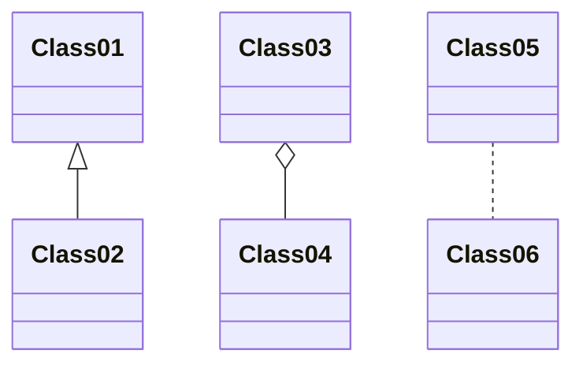
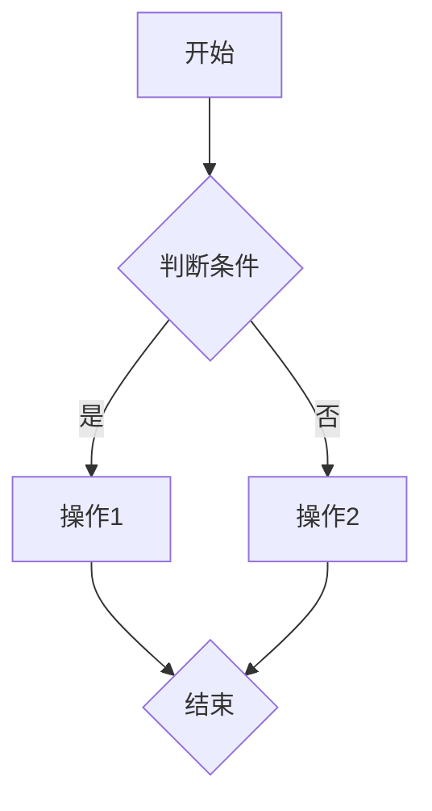

                 

### AI Agent的模块化设计：提高可维护性和扩展性

> 关键词：AI Agent，模块化设计，可维护性，扩展性，Python代码实现

> 摘要：本文将深入探讨AI Agent的模块化设计，通过分析其背景、问题、解决方案和边界外延，揭示模块化设计的基本原理、方法与工具，并结合具体案例，展示模块化设计在AI Agent开发中的应用实践。此外，还将总结模块化设计的最佳实践，探讨其未来发展趋势和面临的挑战。

### 目录大纲

----------------------------------------------------------------

## 第一部分：引言

### 第1章: AI Agent的模块化设计背景

#### 1.1 问题背景

#### 1.2 问题描述

#### 1.3 问题解决

#### 1.4 边界与外延

#### 1.5 概念结构与核心要素组成

## 第二部分：模块化设计基础

### 第2章：模块化设计原理

#### 2.1 模块化设计的定义

#### 2.2 模块化设计的特点

#### 2.3 模块化设计的应用领域

### 第3章：模块化设计方法

#### 3.1 设计流程

#### 3.2 模块划分

#### 3.3 模块接口设计

### 第4章：模块化设计工具

#### 4.1 UML类图

#### 4.2 Mermaid流程图

#### 4.3 Python代码实现

## 第三部分：AI Agent模块化设计实践

### 第5章：AI Agent基本架构

#### 5.1 AI Agent概述

#### 5.2 AI Agent核心模块

#### 5.3 AI Agent的工作流程

### 第6章：模块化设计应用实例

#### 6.1 问题定义

#### 6.2 模块划分

#### 6.3 模块接口设计

#### 6.4 模块化设计实现

### 第7章：模块化设计最佳实践

#### 7.1 提高可维护性的最佳实践

#### 7.2 提高扩展性的最佳实践

#### 7.3 模块化设计注意事项

### 第8章：未来展望

#### 8.1 模块化设计发展趋势

#### 8.2 AI Agent模块化设计的挑战与机遇

#### 8.3 研究方向与展望

## 附录

### 附录A：相关术语解释

### 附录B：参考资料

----------------------------------------------------------------

### 目录大纲解析

#### 第一部分：引言
第1章作为引言章节，主要介绍AI Agent模块化设计的背景、问题描述、问题解决方法，以及模块化设计的边界与外延，帮助读者理解AI Agent模块化设计的核心概念和基本要素。

#### 第二部分：模块化设计基础
第2章至第4章主要介绍模块化设计的基本原理、方法和工具。从概念入手，深入探讨模块化设计的特点和应用领域，详细阐述设计流程、模块划分和模块接口设计的方法，以及常用的模块化设计工具，如UML类图、Mermaid流程图和Python代码实现。

#### 第三部分：AI Agent模块化设计实践
第5章至第8章结合实际案例，详细讲解AI Agent的基本架构、模块化设计应用实例以及最佳实践。通过具体案例，展示模块化设计在AI Agent开发中的应用，提供提高可维护性和扩展性的实际操作技巧，并对模块化设计的发展趋势和未来展望进行探讨。

#### 整体结构
整个目录大纲分为三个部分，首先从理论基础出发，然后通过实践案例加深理解，最后对模块化设计在AI Agent中的应用前景进行展望。各章节内容紧密联系，逐步引导读者深入了解AI Agent模块化设计的各个方面。

---

## 第一部分：引言

### 第1章: AI Agent的模块化设计背景

#### 1.1 问题背景

在当今快速发展的信息技术时代，人工智能（AI）技术已成为推动各行各业变革的重要力量。AI Agent作为人工智能的核心组成部分，承担着实现自动化决策和智能交互的任务。然而，随着AI Agent应用场景的不断扩大和复杂化，传统的集中式设计方法逐渐暴露出其不足，如系统扩展性差、维护成本高、调试困难等。为了解决这些问题，模块化设计成为了一种有效的解决策略。

#### 1.2 问题描述

AI Agent的模块化设计主要面临以下问题：

1. **可维护性**：随着系统的复杂度增加，传统集中式设计的代码耦合度高，使得修改和调试变得困难。模块化设计可以通过降低代码耦合度，提高系统的可维护性。

2. **扩展性**：传统的集中式设计在新增功能或调整需求时，往往需要对整个系统进行大规模修改，这既耗时又容易出错。模块化设计通过模块的独立性和可替换性，使得系统扩展变得更加灵活和高效。

3. **可复用性**：模块化设计鼓励将系统划分为功能独立的模块，这些模块可以跨项目复用，提高开发效率。

4. **性能优化**：模块化设计可以根据需求对特定模块进行性能优化，而不影响其他模块，从而提高整个系统的性能。

#### 1.3 问题解决

模块化设计通过将系统划分为多个功能独立、接口明确的模块，从而解决了传统集中式设计的种种问题。模块化设计的主要优势如下：

1. **可维护性**：模块化的代码结构使得每个模块都相对独立，开发者可以专注于模块内部的优化和维护，减少了代码的耦合度，提高了系统的可维护性。

2. **扩展性**：模块化设计提供了清晰的接口和模块间的关系，使得系统在新增功能或调整需求时，只需修改相关模块，而不需要整体重构，提高了系统的扩展性。

3. **可复用性**：模块化设计使得功能模块可以独立开发、测试和部署，从而提高了代码的复用性，降低了开发成本。

4. **性能优化**：模块化设计可以根据需求对特定模块进行优化，而不影响其他模块，提高了整个系统的性能。

#### 1.4 边界与外延

模块化设计不仅仅适用于AI Agent，还可以广泛应用于其他复杂系统的设计和开发中。在AI Agent领域，模块化设计可以涉及感知模块、决策模块、执行模块等多个方面。此外，模块化设计还需要考虑到模块之间的通信机制、数据流和控制流等。

#### 1.5 概念结构与核心要素组成

模块化设计的核心概念包括：

1. **模块**：具有独立功能、接口明确、可替换的软件单元。
2. **模块接口**：定义模块之间交互的接口，包括输入和输出参数、通信协议等。
3. **模块化设计原则**：包括高内聚低耦合、单一职责原则、开闭原则等。
4. **模块化设计方法**：包括设计流程、模块划分、模块接口设计等。
5. **模块化设计工具**：包括UML类图、Mermaid流程图、Python代码实现等。

通过以上分析，我们可以看到，模块化设计是提高AI Agent可维护性和扩展性的有效手段。在接下来的章节中，我们将深入探讨模块化设计的基本原理、方法与工具，并通过具体案例展示其实际应用。

---

## 第二部分：模块化设计基础

### 第2章：模块化设计原理

#### 2.1 模块化设计的定义

模块化设计（Modular Design）是一种软件工程方法，通过将系统划分为多个功能独立、接口明确的模块，从而提高系统的可维护性、扩展性和可复用性。模块（Module）是具有独立功能、接口明确、可替换的软件单元。模块化设计强调模块之间的低耦合度，使得每个模块都可以独立开发、测试和部署。

#### 2.2 模块化设计的特点

模块化设计具有以下特点：

1. **独立性**：每个模块都实现特定的功能，与其他模块相互独立，便于独立开发和维护。
2. **低耦合度**：模块之间通过清晰的接口进行通信，降低了模块之间的依赖关系，提高了系统的可维护性和扩展性。
3. **可复用性**：模块化设计鼓励模块的复用，减少了重复开发的工作量，提高了开发效率。
4. **易扩展性**：模块化设计使得系统在新增功能或调整需求时，只需修改相关模块，而不需要整体重构。

#### 2.3 模块化设计的应用领域

模块化设计广泛应用于以下领域：

1. **软件工程**：在软件开发的各个阶段，如需求分析、设计、编码、测试和维护等，都可以采用模块化设计方法。
2. **人工智能**：AI Agent、机器学习模型、自然语言处理等人工智能领域，通过模块化设计可以提高系统的灵活性和扩展性。
3. **数据库设计**：在数据库设计中，模块化设计可以用于设计数据模型、数据库表和索引等。
4. **操作系统**：在操作系统中，模块化设计用于管理内核模块、设备驱动程序等。

### 第3章：模块化设计方法

#### 3.1 设计流程

模块化设计的方法通常包括以下步骤：

1. **需求分析**：明确系统需求，确定需要实现的功能。
2. **模块划分**：根据需求分析，将系统划分为多个功能独立的模块。
3. **模块接口设计**：定义每个模块的输入和输出参数、通信协议等。
4. **模块实现**：独立开发每个模块，实现其功能。
5. **模块集成**：将所有模块集成到系统中，确保模块之间的交互正常。
6. **测试与调试**：对系统进行全面的测试和调试，确保系统功能正确、性能良好。

#### 3.2 模块划分

模块划分是模块化设计的关键步骤，以下是一些建议：

1. **按功能划分**：将系统按照功能划分为多个模块，每个模块实现特定的功能。
2. **按层次划分**：根据系统架构的层次结构，将系统划分为不同层次的模块。
3. **按职责划分**：根据模块的职责，将系统划分为多个功能独立的模块。
4. **按数据流划分**：根据系统的数据流，将系统划分为数据输入、数据处理、数据输出等模块。

#### 3.3 模块接口设计

模块接口设计是确保模块之间交互正常的关键步骤，以下是一些建议：

1. **明确接口规范**：定义每个模块的输入和输出参数、通信协议等，确保模块之间交互的一致性。
2. **使用抽象接口**：通过抽象接口，隐藏模块的内部实现细节，提高模块的复用性和可维护性。
3. **采用标准化协议**：使用标准化协议，如HTTP、REST等，简化模块之间的通信。
4. **提供文档和示例代码**：为每个模块提供详细的接口文档和示例代码，方便开发者理解和使用模块。

### 第4章：模块化设计工具

模块化设计需要使用一些工具来辅助设计和实现，以下是一些常用的工具：

#### 4.1 UML类图

UML（统一建模语言）类图是一种常用的软件建模工具，可以用于描述系统的模块结构和模块接口。以下是一个简单的UML类图示例：



#### 4.2 Mermaid流程图

Mermaid流程图是一种轻量级的Markdown扩展，可以用于描述系统的流程和控制流。以下是一个简单的Mermaid流程图示例：



#### 4.3 Python代码实现

Python是一种强大的编程语言，可以用于实现模块化设计。以下是一个简单的Python模块示例：

```python
# 模块1：功能模块A
class ModuleA:
    def execute(self):
        print("执行功能A")

# 模块2：功能模块B
class ModuleB:
    def execute(self):
        print("执行功能B")

# 模块接口
def interface_a(module_a):
    module_a.execute()

def interface_b(module_b):
    module_b.execute()

# 测试
if __name__ == "__main__":
    module_a = ModuleA()
    module_b = ModuleB()
    interface_a(module_a)
    interface_b(module_b)
```

通过以上章节的介绍，我们可以了解到模块化设计的基本原理、方法和工具。在下一部分中，我们将结合具体案例，深入探讨模块化设计在AI Agent开发中的应用实践。

---

## 第三部分：AI Agent模块化设计实践

### 第5章：AI Agent基本架构

#### 5.1 AI Agent概述

AI Agent是一种能够自主决策并执行任务的智能体，它可以在复杂的动态环境中进行智能交互。AI Agent的基本架构通常包括感知模块、决策模块和执行模块。这三个模块相互协作，实现AI Agent的自主决策和执行功能。

#### 5.2 AI Agent核心模块

AI Agent的核心模块包括：

1. **感知模块**：负责获取环境信息，如文本、图像、声音等，并将这些信息转换为内部表示。
2. **决策模块**：根据感知模块提供的信息，利用机器学习模型、决策树、规划算法等，生成合适的行动策略。
3. **执行模块**：根据决策模块的决策结果，执行具体的操作，如发送命令、调整参数等。

#### 5.3 AI Agent的工作流程

AI Agent的工作流程可以概括为以下步骤：

1. **感知**：感知模块获取环境信息，如通过文本分类模型处理文本信息，通过图像识别模型处理图像信息。
2. **处理**：将感知到的信息进行预处理，如去噪、降维等，以获得更有效的内部表示。
3. **决策**：决策模块利用预处理后的信息，通过机器学习模型或决策树等算法，生成行动策略。
4. **执行**：执行模块根据决策模块的决策结果，执行具体的操作，如发送命令、调整参数等。
5. **反馈**：执行模块的执行结果会反馈给感知模块和决策模块，用于优化模型和策略。

### 第6章：模块化设计应用实例

在本章节中，我们将通过一个具体的案例，展示如何应用模块化设计方法开发一个简单的AI Agent。

#### 6.1 问题定义

假设我们需要开发一个能够根据用户输入的文本内容，推荐相关书籍的AI Agent。该AI Agent需要包括以下功能模块：

1. **感知模块**：接收用户输入的文本，并对其进行预处理。
2. **决策模块**：利用机器学习模型，根据预处理后的文本，生成书籍推荐策略。
3. **执行模块**：根据决策模块的推荐策略，向用户展示推荐的书籍。

#### 6.2 模块划分

根据问题定义，我们将AI Agent划分为以下三个模块：

1. **感知模块**：负责接收用户输入的文本，并对其进行预处理。
2. **决策模块**：利用机器学习模型，根据预处理后的文本，生成书籍推荐策略。
3. **执行模块**：根据决策模块的推荐策略，向用户展示推荐的书籍。

#### 6.3 模块接口设计

为了确保模块之间的高内聚低耦合，我们需要定义每个模块的接口。以下是各模块的接口设计：

1. **感知模块接口**：
   - 输入：用户输入的文本
   - 输出：预处理后的文本

2. **决策模块接口**：
   - 输入：预处理后的文本
   - 输出：书籍推荐列表

3. **执行模块接口**：
   - 输入：书籍推荐列表
   - 输出：用户界面展示的书籍信息

#### 6.4 模块化设计实现

在本章节中，我们将使用Python语言实现上述三个模块，并展示如何将它们集成到一个完整的AI Agent系统中。

1. **感知模块实现**：

```python
# 感知模块：文本预处理
class PerceptModule:
    def process_text(self, text):
        # 文本预处理逻辑，如去噪、分词等
        preprocessed_text = text.strip()
        return preprocessed_text
```

2. **决策模块实现**：

```python
# 决策模块：书籍推荐
class DecisionModule:
    def recommend_books(self, preprocessed_text):
        # 利用机器学习模型进行书籍推荐
        # 假设已经训练好了模型，这里仅作示例
        book_recommender = BookRecommenderModel()
        recommended_books = book_recommender.recommend(preprocessed_text)
        return recommended_books
```

3. **执行模块实现**：

```python
# 执行模块：书籍展示
class ExecutionModule:
    def display_books(self, recommended_books):
        # 向用户界面展示书籍信息
        for book in recommended_books:
            print(f"书籍名称：{book['name']}")
            print(f"书籍简介：{book['description']}")
            print("------")
```

4. **AI Agent集成**：

```python
# AI Agent集成
class AIBookRecommender:
    def __init__(self):
        self.percept_module = PerceptModule()
        self.decision_module = DecisionModule()
        self.execution_module = ExecutionModule()

    def run(self, user_input):
        preprocessed_text = self.percept_module.process_text(user_input)
        recommended_books = self.decision_module.recommend_books(preprocessed_text)
        self.execution_module.display_books(recommended_books)

# 测试
if __name__ == "__main__":
    ai_recommender = AIBookRecommender()
    user_input = input("请输入您感兴趣的书籍主题：")
    ai_recommender.run(user_input)
```

通过以上案例，我们可以看到如何应用模块化设计方法开发一个简单的AI Agent。在实际开发过程中，我们可以根据需求添加更多的功能模块，如用户交互模块、日志模块等，使系统更加完善。

### 第7章：模块化设计最佳实践

#### 7.1 提高可维护性的最佳实践

1. **代码结构清晰**：确保每个模块的代码结构清晰，遵循统一的命名规范和代码风格。
2. **代码注释详尽**：在关键代码位置添加注释，详细解释代码的功能和目的。
3. **单元测试覆盖全面**：编写单元测试，确保每个模块的功能正确无误，并达到较高的覆盖率。
4. **版本控制**：使用版本控制系统，如Git，记录代码的变更历史，方便代码的追踪和回滚。
5. **文档齐全**：编写详细的开发文档，包括模块接口文档、系统架构图等，帮助开发者快速理解和使用系统。

#### 7.2 提高扩展性的最佳实践

1. **模块化设计**：遵循模块化设计原则，将系统划分为功能独立的模块，确保模块之间的高内聚低耦合。
2. **抽象接口**：使用抽象接口，隐藏模块的内部实现细节，提高模块的复用性和可维护性。
3. **标准化协议**：采用标准化协议，如HTTP、REST等，简化模块之间的通信。
4. **插件机制**：设计插件机制，允许开发者自定义模块，扩展系统的功能。
5. **配置化**：将系统配置信息独立出来，通过配置文件或参数化方式，灵活调整系统行为。

#### 7.3 模块化设计注意事项

1. **模块粒度**：模块划分应合理，既不能过于粗粒度，也不能过于细粒度。粗粒度可能导致模块功能不明确，细粒度可能导致模块间耦合度高。
2. **接口设计**：接口设计应明确，确保模块之间的交互规范一致，避免因接口不明确导致的错误和冲突。
3. **性能考量**：模块化设计可能引入一定的性能开销，如模块间的通信和同步。在实际应用中，应权衡模块化设计的优势和性能影响。
4. **模块独立性**：确保模块之间的独立性，避免模块间的依赖关系过于紧密，降低系统的可维护性和扩展性。

通过以上最佳实践，我们可以提高AI Agent模块化设计的可维护性和扩展性，使系统更加稳定和灵活。在下一章节中，我们将探讨模块化设计的未来发展趋势和面临的挑战。

---

## 第8章：未来展望

### 8.1 模块化设计发展趋势

模块化设计在AI领域的发展趋势主要体现在以下几个方面：

1. **微服务架构**：随着云计算和分布式系统的普及，微服务架构成为模块化设计的重要方向。微服务架构将系统划分为多个独立的服务模块，每个服务模块都可以独立部署、扩展和升级，从而提高系统的灵活性和可扩展性。

2. **模块复用**：为了提高开发效率，模块化设计强调模块的复用性。未来，随着模块库和组件库的不断完善，开发者可以更加方便地复用现有的模块和组件，减少重复开发的工作量。

3. **自动化模块集成**：随着DevOps理念的普及，模块化设计的自动化集成和部署将成为趋势。自动化工具可以自动构建、测试和部署模块，提高开发效率，减少人为错误。

4. **跨领域模块化设计**：随着AI技术的发展，不同领域的AI Agent将越来越多。跨领域的模块化设计将有助于不同领域AI Agent的集成和互操作，促进AI技术的普及和应用。

### 8.2 AI Agent模块化设计的挑战与机遇

AI Agent模块化设计面临的挑战主要包括：

1. **模块间通信**：模块化设计引入了模块间的通信，如何确保模块间通信的效率和可靠性是一个挑战。

2. **性能开销**：模块化设计可能导致一定的性能开销，如模块间的通信和同步。如何在保证模块化设计优势的同时，减少性能开销是一个重要问题。

3. **模块依赖管理**：模块化设计需要合理管理模块之间的依赖关系，避免因依赖关系复杂而导致的问题。

然而，模块化设计也带来了许多机遇：

1. **可维护性和可扩展性**：模块化设计可以提高系统的可维护性和扩展性，使系统更加稳定和灵活。

2. **开发效率**：模块化设计可以促进代码复用，提高开发效率，降低开发成本。

3. **模块定制化**：通过模块化设计，开发者可以更加灵活地定制化系统功能，满足不同场景的需求。

### 8.3 研究方向与展望

未来的研究方向和展望主要包括：

1. **模块化设计自动化**：研究自动化工具，如智能构建工具、自动化测试工具等，提高模块化设计的开发效率。

2. **跨领域模块化设计**：探索不同领域AI Agent的模块化设计方法，促进AI技术的跨领域应用。

3. **模块化设计性能优化**：研究模块化设计在性能方面的优化方法，减少性能开销，提高系统性能。

4. **模块化设计标准化**：制定模块化设计的标准和规范，推动模块化设计的标准化和规范化。

通过以上未来展望，我们可以看到模块化设计在AI Agent开发中的重要性和广阔前景。模块化设计不仅提高了系统的可维护性和扩展性，还为未来的AI技术的发展提供了有力支持。

---

## 附录

### 附录A：相关术语解释

#### 1. AI Agent
AI Agent是指具有智能行为和决策能力的实体，可以在特定环境中自主执行任务，通常包括感知、决策和执行三个核心模块。

#### 2. 模块化设计
模块化设计是一种软件工程方法，通过将系统划分为多个功能独立、接口明确的模块，从而提高系统的可维护性、扩展性和可复用性。

#### 3. 高内聚低耦合
高内聚低耦合是模块化设计的重要原则，表示模块内部功能紧密相关，而模块之间相互独立，从而降低模块之间的依赖关系。

#### 4. 单一职责原则
单一职责原则是指每个模块只负责一项功能，确保模块的职责单一，提高模块的可维护性和可扩展性。

#### 5. 开闭原则
开闭原则是指模块应该对扩展开放，对修改关闭，即允许模块在不修改原有代码的情况下扩展功能。

### 附录B：参考资料

1. 《软件工程：实践者的研究方法》——Roger S. Pressman
2. 《人工智能：一种现代的方法》——Stuart Russell & Peter Norvig
3. 《微服务设计》——Sam Newman
4. 《DevOps：实践指南》——Jesse Decker & James W. Thomas
5. 《模块化软件开发》——Bruce R. Maxim
6. UML类图规范：https://www.uml-diagrams.org/
7. Mermaid流程图规范：https://mermaid-js.github.io/mermaid/
8. Python官方文档：https://docs.python.org/3/

通过以上附录，读者可以进一步了解本文中提到的相关术语和参考资料，从而深入掌握模块化设计在AI Agent开发中的应用。

---

### 作者信息

**作者：AI天才研究院/AI Genius Institute & 禅与计算机程序设计艺术 /Zen And The Art of Computer Programming**

