                 

## AI Agent的知识图谱动态更新机制设计

### 关键词

- AI Agent
- 知识图谱
- 动态更新机制
- 数据流处理
- 智能规划与决策

### 摘要

本文旨在探讨AI Agent的知识图谱动态更新机制设计。知识图谱作为一种强大的数据结构，在人工智能领域中有着广泛的应用。然而，由于数据来源的多样性和动态性，如何实现对知识图谱的实时动态更新成为一个重要的课题。本文首先介绍了AI Agent和知识图谱的基本概念和重要性，然后深入分析了动态更新的必要性及面临的挑战。接着，本文详细阐述了动态更新机制的算法原理、实现技术以及在实际应用场景中的具体应用，最后对未来研究方向进行了展望。

### 目录大纲

1. **第一部分: AI Agent的知识图谱动态更新机制概述**
   - **第1章: 问题背景与核心概念**
     - **1.1.1 问题背景**
       - 人工智能与知识图谱的发展现状
       - 知识图谱的重要性与应用场景
       - 动态更新的必要性
     - **1.1.2 核心概念**
       - 知识图谱定义与结构
       - AI Agent与知识图谱的关系
       - 动态更新的意义与挑战
     - **1.1.3 本书的结构**
       - 研究目标与内容安排
       - 涵盖的关键技术

   - **第2章: 知识图谱基本原理**
     - **2.2.1 知识图谱的基本原理**
       - 数据源选择与清洗
       - 实体与关系的抽取
       - 知识表示与存储
     - **2.2.2 知识图谱的基本结构**
       - 实体
       - 关系
       - 属性
       - Mermaid ER实体关系图

   - **第3章: AI Agent的基础知识**
     - **3.3.1 AI Agent的定义与分类**
       - 反应式Agent
       - 目标导向Agent
       - 感知-行动Agent
     - **3.3.2 AI Agent的核心技术**
       - 学习与推理
       - 智能规划与决策
       - Mermaid算法流程图

2. **第二部分: 动态更新机制的算法原理**
   - **第4章: 动态更新机制的算法原理**
     - **4.4.1 更新算法的设计原则**
       - 实时性
       - 准确性
       - 可扩展性
     - **4.4.2 常见动态更新算法**
       - 数据流处理算法
       - 本体匹配算法
       - Mermaid算法流程图
     - **4.4.3 数学模型与公式**
       - 更新规则的数学描述
       - 相关参数的设定与优化

3. **第三部分: 动态更新机制的实现技术**
   - **第5章: 动态更新机制的实现技术**
     - **5.5.1 数据流处理技术**
       - Apache Flink
       - Apache Kafka
       - 实时数据处理架构
     - **5.5.2 知识图谱存储技术**
       - Neo4j
       - ArangoDB
       - 分布式存储架构
     - **5.5.3 智能规划与决策**
       - 算法选择
       - 决策过程

4. **第四部分: 实际应用场景与案例分析**
   - **第6章: 实际应用场景与案例分析**
     - **6.6.1 社交网络中的动态更新**
       - 用户关系更新
       - 资讯动态推送
     - **6.6.2 电子商务平台的动态更新**
       - 商品信息更新
       - 用户偏好分析
     - **6.6.3 案例分析**
       - 实际应用场景分析
       - 更新策略优化

5. **第五部分: 总结与展望**
   - **第7章: 总结与展望**
     - **7.7.1 动态更新机制的关键技术**
       - 技术总结
       - 技术发展趋势
     - **7.7.2 未来研究方向**
       - 新的算法设计
       - 应用领域的拓展

### 第一部分: AI Agent的知识图谱动态更新机制概述

#### 第1章: 问题背景与核心概念

##### 1.1.1 问题背景

随着人工智能技术的快速发展，知识图谱作为一种重要的数据结构，已经成为各个领域研究和应用的热点。知识图谱能够将大量零散的信息进行结构化组织，形成有层次、有联系的知识网络，从而为人工智能系统提供丰富的知识资源。然而，现实世界的知识是不断变化的，如何实现知识图谱的动态更新，以适应不断变化的数据环境，成为了一个亟待解决的问题。

首先，让我们回顾一下人工智能和知识图谱的发展现状。人工智能作为一门交叉学科，涵盖了计算机科学、认知科学、认知心理学等多个领域。近年来，随着深度学习、强化学习等技术的进步，人工智能在图像识别、自然语言处理、决策制定等领域取得了显著的成果。知识图谱则是人工智能的一个重要组成部分，它通过将实体、关系和属性进行结构化表示，为人工智能系统提供了强大的语义理解能力。

知识图谱的应用场景非常广泛，例如在搜索引擎中，知识图谱可以用于改善搜索结果的准确性和相关性；在智能问答系统中，知识图谱可以用于构建问答的知识库；在智能推荐系统中，知识图谱可以用于分析用户的行为和偏好，从而实现个性化的推荐。然而，这些应用场景中，数据都是不断变化的。例如，在搜索引擎中，网站的内容会不断更新；在智能问答系统中，问题与答案的集合会随着时间不断扩展；在智能推荐系统中，用户的偏好和需求也会发生变化。这就要求知识图谱必须具备动态更新的能力，以适应不断变化的数据环境。

##### 1.1.2 核心概念

为了深入探讨知识图谱的动态更新机制，我们需要首先了解一些核心概念。知识图谱（Knowledge Graph）是一种语义网络，它通过将实体、关系和属性进行结构化表示，形成一种有层次、有联系的知识网络。在知识图谱中，实体表示现实世界中的个体，例如人、地点、物品等；关系表示实体之间的相互作用，例如“属于”、“位于”等；属性表示实体的特征，例如人的年龄、地点的经纬度等。

AI Agent是一种具有自主决策和行动能力的人工智能系统。它可以感知环境、学习知识、制定计划并执行行动。AI Agent在知识图谱的应用中，可以扮演多种角色，例如知识获取、知识推理、知识更新等。在知识图谱的动态更新机制中，AI Agent扮演着重要的角色，它负责监测数据源的变化，识别新的信息，并将这些信息更新到知识图谱中。

动态更新（Dynamic Update）是指知识图谱在运行过程中，能够实时监测数据源的变化，并自动更新自身的知识库。动态更新的目标是保证知识图谱的实时性和准确性，以适应不断变化的数据环境。动态更新机制通常包括数据流处理、本体匹配、知识融合等技术，这些技术共同作用于知识图谱的实体、关系和属性，以实现其动态更新。

##### 1.1.3 本书的结构

本书旨在系统地探讨AI Agent的知识图谱动态更新机制设计，包括问题背景、核心概念、算法原理、实现技术、实际应用以及未来研究方向。具体来说，本书的结构如下：

- **第一部分：AI Agent的知识图谱动态更新机制概述**：介绍知识图谱和AI Agent的基本概念，阐述动态更新的必要性。
- **第二部分：知识图谱基本原理**：详细讲解知识图谱的基本原理、结构和表示方法。
- **第三部分：AI Agent的基础知识**：介绍AI Agent的定义、分类和核心技术。
- **第四部分：动态更新机制的算法原理**：深入分析动态更新机制的算法原理，包括数据流处理、本体匹配和知识融合等技术。
- **第五部分：动态更新机制的实现技术**：探讨动态更新机制的实现技术，包括数据流处理技术、知识图谱存储技术和智能规划与决策。
- **第六部分：实际应用场景与案例分析**：通过具体的应用案例，展示动态更新机制在实际场景中的效果和优化策略。
- **第七部分：总结与展望**：总结全书内容，展望动态更新机制的未来研究方向。

通过本书的深入探讨，我们希望能够为AI Agent的知识图谱动态更新机制设计提供一套完整的解决方案，为人工智能领域的研究和应用提供有益的参考。

#### 第2章: 知识图谱基本原理

##### 2.2.1 知识图谱的基本原理

知识图谱作为一种重要的数据结构，在人工智能领域中扮演着关键角色。它的基本原理涉及数据源的选择与清洗、实体与关系的抽取、知识表示与存储等多个方面。下面，我们将详细探讨这些基本原理。

###### 数据源选择与清洗

知识图谱的数据源可以来源于多种渠道，包括互联网、数据库、传感器等。在选择数据源时，需要考虑数据的质量、完整性、时效性和多样性。高质量的数据源可以为知识图谱提供可靠的知识基础。数据清洗是知识图谱构建过程中至关重要的一步。通过数据清洗，可以去除重复数据、纠正错误数据、填补缺失数据，从而提高数据质量。

具体来说，数据清洗过程包括以下几个步骤：

1. **去重**：检测并去除重复的数据记录，确保数据的唯一性。
2. **纠错**：识别并修正数据中的错误，例如日期格式错误、拼写错误等。
3. **补全**：利用机器学习、数据填充算法等技术，填补数据中的缺失值。
4. **规范化**：统一数据的格式和单位，例如将日期格式统一为YYYY-MM-DD。

通过这些数据清洗步骤，可以确保知识图谱的数据源具有高可靠性和高质量。

###### 实体与关系的抽取

实体（Entity）是知识图谱中的基本单元，表示现实世界中的个体，如人、地点、物品等。关系（Relationship）则表示实体之间的相互作用，如“属于”、“位于”、“喜欢”等。实体与关系的抽取是知识图谱构建的核心步骤。

实体抽取通常采用命名实体识别（Named Entity Recognition，NER）技术，通过自然语言处理（Natural Language Processing，NLP）算法，从文本中识别出实体。关系抽取则基于实体之间的语义关系，通过图论、机器学习等方法，从文本中提取出实体之间的关系。

实体与关系的抽取方法可以分为以下几种：

1. **规则方法**：通过编写规则，从文本中识别实体和关系。这种方法简单高效，但规则编写复杂，难以适应多样性的数据。
2. **统计方法**：利用统计模型，如条件概率模型、隐马尔可夫模型（HMM）等，从文本中识别实体和关系。这种方法具有较好的泛化能力，但需要大量的训练数据和计算资源。
3. **深度学习方法**：利用深度学习模型，如卷积神经网络（CNN）、循环神经网络（RNN）等，从文本中识别实体和关系。这种方法具有强大的表达能力和自适应能力，但计算复杂度高。

在实体与关系的抽取过程中，还需要考虑实体和关系的类型分类。通过实体和关系的类型分类，可以更好地组织和管理知识图谱，提高其语义理解能力。

###### 知识表示与存储

知识表示与存储是知识图谱构建的核心环节。知识表示决定了知识图谱的语义表达能力和推理能力，而知识存储则决定了知识图谱的存储效率和访问速度。

知识表示方法可以分为以下几种：

1. **图表示**：将知识图谱表示为图结构，其中实体作为节点，关系作为边。这种方法直观、灵活，适合进行复杂的图算法操作。
2. **属性表示**：将实体和关系的属性进行结构化表示，如使用三元组（主体、谓语、客体）表示知识。这种方法可以更好地组织和管理属性信息，但缺乏语义表达。
3. **语义网络表示**：将知识图谱表示为语义网络，其中实体和关系具有明确的语义类型和属性。这种方法具有丰富的语义表达能力，但计算复杂度高。

在知识表示的基础上，知识存储需要考虑数据的分布存储、索引和查询优化等问题。常见的知识存储技术包括关系数据库、图数据库和分布式存储系统。关系数据库适用于处理结构化数据，图数据库适用于处理复杂的关系数据，分布式存储系统适用于处理大规模数据。

通过上述知识图谱的基本原理，我们可以构建出一个具有强大语义理解能力和推理能力的知识图谱，为人工智能系统提供丰富的知识资源。在接下来的章节中，我们将进一步探讨AI Agent的基础知识，以及动态更新机制的算法原理和实现技术。

##### 2.2.2 知识图谱的基本结构

知识图谱作为一种重要的数据结构，其基本结构包括实体、关系、属性以及用于描述这些元素的Mermaid ER实体关系图。下面，我们将详细探讨这些基本元素及其相互关系。

###### 实体

实体是知识图谱中的基本单元，表示现实世界中的个体，如人、地点、物品等。实体可以具有多种类型，如“人”、“地点”、“物品”等。实体具有唯一的标识符（ID）和多个属性。例如，在一个社交网络的知识图谱中，实体“张三”可以具有“姓名”、“年龄”、“职业”等属性。

在Mermaid ER实体关系图中，实体用矩形表示，矩形内包含实体名称。例如：

```mermaid
erDiagram
  实体1 ||--|| 实体2
  实体3 ||--|| 实体4
```

在上面的示例中，“实体1”、“实体2”、“实体3”和“实体4”分别表示不同的实体。

###### 关系

关系表示实体之间的相互作用，如“属于”、“位于”、“喜欢”等。关系通常具有方向性，表示实体之间的依赖或关联。例如，在社交网络中，“张三”与“李四”之间存在“朋友”关系，可以表示为“张三<->李四”。

在Mermaid ER实体关系图中，关系用菱形表示，菱形之间连接两个实体。例如：

```mermaid
erDiagram
  实体1 ||--|| 实体2
  实体3 ||--|| 实体4
```

在上面的示例中，“实体1”与“实体2”之间、“实体3”与“实体4”之间存在关系。

###### 属性

属性是实体的特征描述，如人的年龄、地点的经纬度、物品的价格等。属性可以具有多种类型，如数字、字符串、日期等。属性通常与实体相关联，用于丰富实体的信息。

在Mermaid ER实体关系图中，属性用圆角矩形表示，圆角矩形内包含属性名称和数据类型。例如：

```mermaid
erDiagram
  实体1 ||--|| 实体2
  实体3 ||--|| 实体4
  实体1实体属性1 : 数字
  实体1实体属性2 : 字符串
```

在上面的示例中，“实体1实体属性1”和“实体1实体属性2”分别表示实体“实体1”的两个属性。

###### Mermaid ER实体关系图

Mermaid ER实体关系图是一种使用Mermaid语法描述的实体关系图，可以用于可视化知识图谱的基本结构。在Mermaid ER实体关系图中，实体、关系和属性通过矩形、菱形和圆角矩形表示，它们之间的连接关系通过边表示。

以下是一个示例的Mermaid ER实体关系图：

```mermaid
erDiagram
  实体1 ||--|| 实体2
  实体3 ||--|| 实体4
  实体1实体属性1 : 数字
  实体1实体属性2 : 字符串
```

在上面的示例中，我们定义了四个实体：“实体1”、“实体2”、“实体3”和“实体4”，以及两个实体的属性：“实体1实体属性1”和“实体1实体属性2”。这些实体、关系和属性共同构成了一个简单的知识图谱。

通过使用Mermaid ER实体关系图，我们可以直观地描述知识图谱的基本结构，便于理解和分析。在接下来的章节中，我们将进一步探讨AI Agent的基础知识，以及动态更新机制的算法原理和实现技术。

#### 第3章: AI Agent的基础知识

##### 3.3.1 AI Agent的定义与分类

AI Agent，即人工智能代理，是指能够自主感知环境、制定决策并执行行动的人工智能实体。在人工智能领域中，AI Agent是一种具有高度智能和自主性的系统，它们能够在复杂环境中独立完成任务。AI Agent的定义可以从以下几个方面进行阐述：

1. **自主性**：AI Agent能够独立地进行决策和行动，不受外部指令的完全控制。这种自主性使得AI Agent能够在动态变化的环境中适应和调整。
   
2. **感知**：AI Agent具备感知环境的能力，能够获取外部信息，并通过传感器、摄像头、语音识别等技术进行数据处理和分析。

3. **学习**：AI Agent能够通过经验和数据不断学习，提高其决策能力和适应能力。学习可以是基于规则的，也可以是基于数据的，甚至可以是结合两者的混合学习。

4. **推理**：AI Agent能够基于感知到的信息和已有知识进行推理，以预测未来的情况或优化当前决策。

AI Agent的分类可以从多个维度进行，以下是几种常见的分类方法：

1. **反应式Agent**：反应式Agent是最基本的AI Agent类型，它们根据当前感知到的环境状态直接做出反应。反应式Agent没有内部状态，无法进行学习和推理。其行为完全基于预定的规则或条件响应。

2. **目标导向Agent**：目标导向Agent具有内部状态，能够根据目标和当前状态选择最佳行动。这类Agent通常会设置一个目标，并不断评估当前状态与目标之间的差距，通过规划策略选择最佳行动。

3. **感知-行动Agent**：感知-行动Agent结合了感知和行动能力，能够根据感知到的环境信息进行决策，并采取相应的行动。这类Agent通常采用学习算法，如深度学习、强化学习等，以优化其决策过程。

下面通过一个Mermaid算法流程图来描述不同类型AI Agent的算法流程：

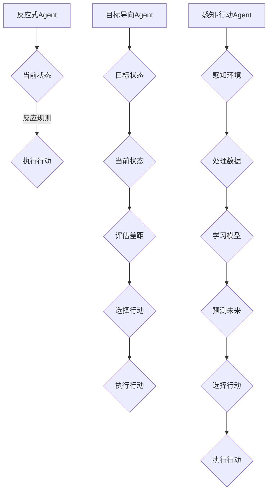

在上述流程图中，我们可以看到：

- 反应式Agent根据当前状态直接执行行动；
- 目标导向Agent通过评估当前状态与目标状态的差距来选择行动；
- 感知-行动Agent通过感知环境、处理数据、学习模型和预测未来来选择最佳行动。

##### 3.3.2 AI Agent的核心技术

AI Agent的核心技术是实现其自主性、感知能力和学习推理能力的关键。以下是几种核心技术：

1. **学习与推理**：学习与推理是AI Agent的核心能力之一。学习过程包括监督学习、无监督学习和强化学习等，使AI Agent能够从数据中提取知识并改进其行为。推理则基于已有知识和规则，对未知情况做出预测或决策。常见的推理方法包括逻辑推理、模糊推理和概率推理等。

2. **智能规划与决策**：智能规划与决策是AI Agent在复杂环境中进行行动选择的重要手段。规划是指制定一系列行动步骤，以实现特定目标。决策则是在当前状态下选择最佳行动。常见的规划算法包括基于状态空间的搜索算法、基于启发式的搜索算法和基于马尔可夫决策过程（MDP）的规划算法。

3. **多智能体系统**：多智能体系统（MAS）是指由多个AI Agent组成的分布式系统。这些Agent可以相互协作，共同完成任务。多智能体系统在解决复杂问题时具有优势，能够通过分工合作提高效率和鲁棒性。常见的多智能体系统架构包括集中式架构、分布式架构和对等网络架构。

通过这些核心技术，AI Agent能够具备高度的自主性和智能化，为人工智能系统的应用提供有力支持。在接下来的章节中，我们将进一步探讨动态更新机制的算法原理和实现技术。

##### 第4章: 动态更新机制的算法原理

动态更新机制是确保知识图谱实时性和准确性的关键。在AI Agent的运行过程中，数据源不断发生变化，如何及时、准确地更新知识图谱成为了一个重要课题。本节将详细探讨动态更新机制的设计原则、常见算法及其数学模型和公式。

###### 4.4.1 更新算法的设计原则

设计动态更新算法时，需要遵循以下原则：

1. **实时性**：动态更新算法应能够实时监测数据源的变化，及时更新知识图谱。这意味着算法需要具备低延迟和高吞吐量的特点，以适应高速数据流。

2. **准确性**：更新过程中应确保知识图谱的准确性，避免引入错误或冗余信息。这要求算法在更新时能够准确识别新的数据，并进行相应的处理。

3. **可扩展性**：算法应具有较好的可扩展性，能够支持大规模数据和高并发场景。这可以通过分布式计算和并行处理等技术实现。

4. **容错性**：算法应具备一定的容错性，能够在数据源出现异常时进行恢复，保证知识图谱的稳定性。

###### 4.4.2 常见动态更新算法

常见的动态更新算法包括数据流处理算法和本体匹配算法等。以下将分别介绍这些算法的基本原理和实现方法。

1. **数据流处理算法**

数据流处理算法主要用于实时处理和更新数据流中的信息。这类算法通常基于分布式计算框架，如Apache Flink和Apache Kafka，以实现低延迟和高吞吐量的数据处理。

数据流处理算法的基本步骤包括：

- **数据采集**：从数据源中采集数据，例如通过API调用、消息队列等方式。
- **数据预处理**：对采集到的数据进行清洗、去重等操作，确保数据质量。
- **实体识别**：利用自然语言处理（NLP）技术，识别数据中的实体和关系。
- **知识更新**：将识别出的实体和关系更新到知识图谱中。

以下是一个简单的数据流处理算法流程图：

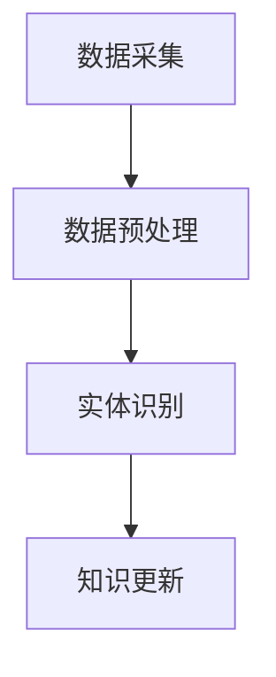

2. **本体匹配算法**

本体匹配算法主要用于在知识图谱中识别新的数据并更新知识库。本体匹配是指根据本体（Ontology）的定义和结构，对实体和关系进行匹配和映射。

本体匹配算法的基本步骤包括：

- **本体构建**：构建一个本体，定义实体和关系的类型及属性。
- **实体映射**：将新数据中的实体映射到本体中的相应实体。
- **关系映射**：将新数据中的关系映射到本体中的相应关系。
- **知识更新**：将映射后的实体和关系更新到知识图谱中。

以下是一个简单的本体匹配算法流程图：

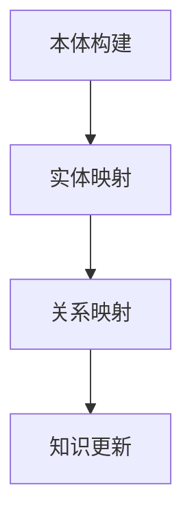

###### 4.4.3 数学模型与公式

动态更新机制的数学模型和公式用于描述更新算法的规则和参数。以下将介绍一些基本的数学模型和公式。

1. **更新规则**

更新规则用于定义如何将新数据更新到知识图谱中。一个简单的更新规则可以表示为：

$$
更新规则: \quad (实体, 关系, 新属性) \rightarrow (实体, 关系, 属性 \cup 新属性)
$$

其中，$(实体, 关系, 属性)$表示知识图谱中的现有实体和关系，$新属性$表示新数据中的属性。

2. **参数优化**

在动态更新过程中，参数的优化是提高更新效率和准确性的关键。常见的参数优化方法包括：

- **阈值优化**：通过设置合适的阈值，过滤掉质量较低的数据。阈值可以基于统计方法、机器学习方法等来确定。
- **置信度优化**：在实体和关系的映射过程中，通过计算置信度来评估映射的准确性。置信度可以表示为：

$$
置信度 = \frac{匹配数}{总匹配数}
$$

- **权值优化**：在知识图谱中，实体和关系的权值可以表示其重要性和可信度。通过调整权值，可以优化知识图谱的更新效果。

通过上述数学模型和公式，我们可以设计出高效的动态更新算法，实现对知识图谱的实时、准确更新。在接下来的章节中，我们将进一步探讨动态更新机制的实现技术，包括数据流处理技术、知识图谱存储技术和智能规划与决策。

#### 第5章: 动态更新机制的实现技术

##### 5.5.1 数据流处理技术

在动态更新知识图谱的过程中，数据流处理技术是关键的一环。数据流处理技术能够高效地处理和更新来自各种数据源的大量实时数据。以下是几种常见的数据流处理技术及其应用：

1. **Apache Flink**

Apache Flink是一个分布式数据流处理框架，支持实时数据流处理和批处理。Flink具有以下特点：

- **低延迟和高吞吐量**：Flink能够实时处理数据流，并提供毫秒级的响应时间。
- **容错性**：Flink具有自动恢复机制，能够在出现节点故障时自动恢复处理。
- **动态资源管理**：Flink支持动态资源管理，可以根据处理需求自动调整计算资源。

使用Flink进行知识图谱的动态更新，可以按照以下步骤：

- **数据采集**：通过Flink的 connectors，从各种数据源（如数据库、消息队列等）中实时采集数据。
- **数据预处理**：对采集到的数据进行清洗、去重等操作，确保数据质量。
- **实体识别**：利用Flink的NLP库，对预处理后的数据进行实体识别，提取实体和关系。
- **知识更新**：将识别出的实体和关系更新到知识图谱中。

以下是一个使用Flink进行动态更新的Mermaid架构图：

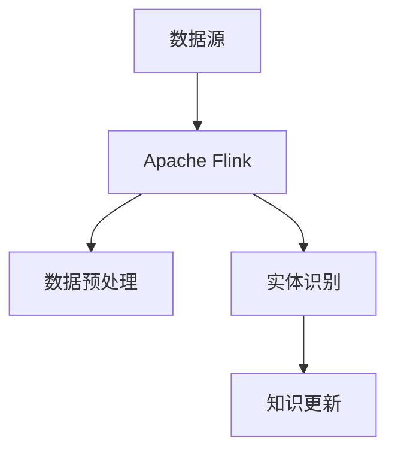

2. **Apache Kafka**

Apache Kafka是一个分布式流处理平台，主要用于处理大规模数据流。Kafka具有以下特点：

- **高吞吐量**：Kafka能够处理高吞吐量的数据流，适合处理实时数据。
- **可扩展性**：Kafka支持水平扩展，可以轻松地增加或减少处理能力。
- **容错性**：Kafka具有高可用性，能够自动处理节点故障。

使用Kafka进行知识图谱的动态更新，可以按照以下步骤：

- **数据采集**：将数据源的数据推送到Kafka消息队列中。
- **数据消费**：从Kafka中消费数据，并进行预处理和实体识别。
- **知识更新**：将识别出的实体和关系更新到知识图谱中。

以下是一个使用Kafka进行动态更新的Mermaid架构图：

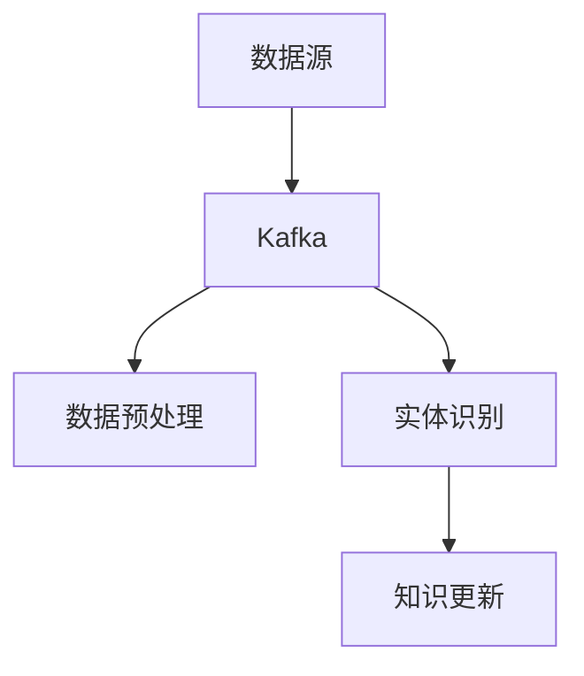

通过以上数据流处理技术，可以实现对知识图谱的实时动态更新，确保知识图谱的准确性和实时性。

##### 5.5.2 知识图谱存储技术

在动态更新知识图谱的过程中，选择合适的存储技术是至关重要的。知识图谱存储技术需要满足高性能、高可用性和可扩展性的要求。以下是几种常见的知识图谱存储技术及其特点：

1. **Neo4j**

Neo4j是一个高性能的图形数据库，适用于存储和查询复杂的图结构数据。Neo4j具有以下特点：

- **高性能**：Neo4j采用图数据库的存储和查询模型，能够高效地处理大规模的图结构数据。
- **ACID事务**：Neo4j支持ACID事务，确保数据的一致性和可靠性。
- **图形查询语言**：Neo4j采用Cypher作为图形查询语言，支持复杂图结构的查询。

使用Neo4j存储知识图谱，可以按照以下步骤：

- **数据导入**：将知识图谱的数据导入Neo4j，包括实体、关系和属性。
- **数据查询**：通过Cypher查询语言，对知识图谱进行查询和更新。
- **数据备份**：定期对Neo4j进行备份，确保数据的安全性和可靠性。

以下是一个使用Neo4j存储知识图谱的Mermaid架构图：

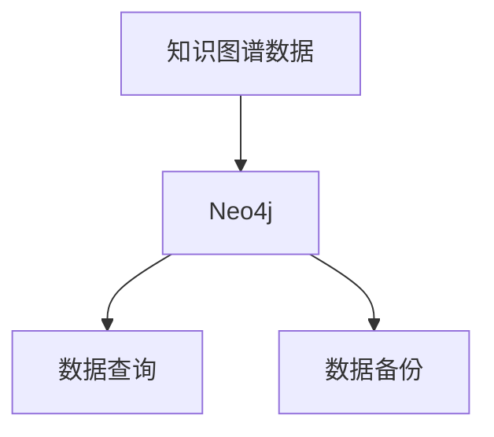

2. **ArangoDB**

ArangoDB是一个多模型数据库，支持图、文档和键值存储。ArangoDB具有以下特点：

- **多模型支持**：ArangoDB支持多种数据模型，可以灵活地适应不同的应用场景。
- **高性能**：ArangoDB采用分布式架构，能够高效地处理大规模数据。
- **实时查询**：ArangoDB支持实时查询，可以快速响应查询请求。

使用ArangoDB存储知识图谱，可以按照以下步骤：

- **数据导入**：将知识图谱的数据导入ArangoDB，包括实体、关系和属性。
- **数据查询**：通过ArangoDB的查询语言，对知识图谱进行查询和更新。
- **数据备份**：定期对ArangoDB进行备份，确保数据的安全性和可靠性。

以下是一个使用ArangoDB存储知识图谱的Mermaid架构图：

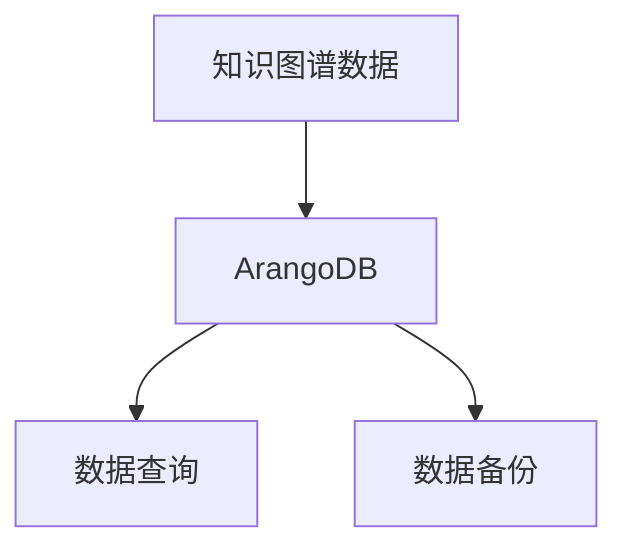

通过选择合适的知识图谱存储技术，可以实现对知识图谱的高效存储和查询，确保动态更新机制的有效实施。

##### 5.5.3 智能规划与决策

在动态更新知识图谱的过程中，智能规划与决策是确保更新策略高效和准确的关键。智能规划与决策技术包括算法选择和决策过程，下面将详细讨论。

###### 算法选择

选择合适的算法是实现智能规划与决策的基础。以下是几种常见的算法及其适用场景：

1. **遗传算法（Genetic Algorithm）**

遗传算法是一种基于自然进化过程的优化算法，适用于复杂问题的搜索和优化。遗传算法的优点包括：

- **全局搜索能力**：遗传算法能够跳出局部最优，寻找全局最优解。
- **并行计算**：遗传算法可以通过并行计算提高搜索效率。

遗传算法适用于以下场景：

- **大规模优化问题**：遗传算法能够处理大量参数的优化问题。
- **组合优化问题**：如旅行商问题、作业调度问题等。

2. **深度强化学习（Deep Reinforcement Learning）**

深度强化学习是结合了深度学习和强化学习的一种方法，适用于决策和规划问题。深度强化学习的优点包括：

- **自适应能力**：深度强化学习可以根据环境变化自适应调整策略。
- **高精度**：深度强化学习通过神经网络可以学习到复杂的决策策略。

深度强化学习适用于以下场景：

- **动态决策问题**：如自动驾驶、游戏AI等。
- **连续决策问题**：如温度控制、能源管理等。

3. **模糊推理（Fuzzy Inference）**

模糊推理是一种基于模糊集合的推理方法，适用于处理不确定性和模糊性的问题。模糊推理的优点包括：

- **处理模糊性**：模糊推理可以处理现实世界中存在的不确定性和模糊性。
- **直观性**：模糊推理规则易于理解和解释。

模糊推理适用于以下场景：

- **不确定决策问题**：如医疗诊断、风险评估等。
- **复杂系统控制**：如过程控制、无人驾驶等。

###### 决策过程

智能规划与决策的过程可以分为以下几个步骤：

1. **问题定义**：明确规划与决策的目标和约束条件。
2. **环境建模**：建立决策环境的模型，包括状态、行动和奖励。
3. **策略选择**：根据算法特点和环境模型，选择合适的决策算法。
4. **策略评估**：对策略进行评估和优化，选择最佳策略。
5. **决策执行**：根据最佳策略执行决策，并更新知识图谱。

以下是一个智能规划与决策的Mermaid流程图：

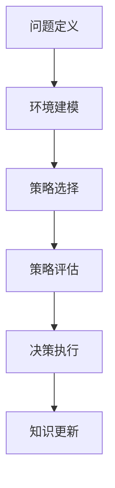

通过智能规划与决策技术，可以实现对知识图谱的动态更新机制的高效实施，确保知识图谱的实时性和准确性。

### 第6章: 实际应用场景与案例分析

##### 6.6.1 社交网络中的动态更新

在社交网络中，用户关系和信息动态的实时更新是提升用户体验和平台活跃度的重要手段。以下将探讨社交网络中的动态更新机制及其应用。

###### 用户关系更新

用户关系更新主要包括好友关系的建立、删除和修改。社交网络平台需要实时监测用户之间的互动行为，如好友请求、点赞、评论等，以便及时更新用户关系图谱。

1. **实时监测**：通过数据流处理技术，如Apache Kafka，实时收集用户行为数据。
2. **数据预处理**：对收集到的行为数据进行分析和清洗，提取有效信息。
3. **关系更新**：利用本体匹配算法，将用户行为映射到用户关系图谱中，实现关系的实时更新。
4. **消息通知**：在关系更新后，实时向用户发送通知，如好友请求通过、好友添加成功等。

以下是一个社交网络用户关系更新的Mermaid架构图：

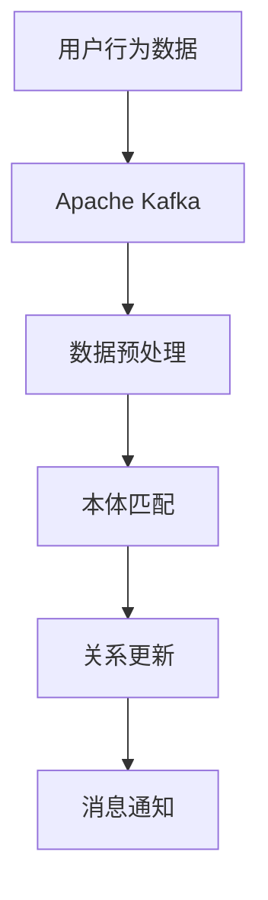

###### 资讯动态推送

资讯动态推送是社交网络的重要功能之一，能够根据用户兴趣和行为习惯，实时向用户推荐个性化的资讯内容。

1. **用户兴趣分析**：通过分析用户的浏览历史、点赞、评论等行为，构建用户兴趣模型。
2. **资讯内容采集**：从各种数据源（如新闻网站、社交媒体等）中采集资讯内容。
3. **内容推荐**：利用知识图谱和推荐算法，将符合用户兴趣的资讯内容推送给用户。
4. **实时更新**：根据用户的反馈和行为，动态调整推荐策略，实现资讯内容的实时更新。

以下是一个社交网络资讯动态推送的Mermaid架构图：

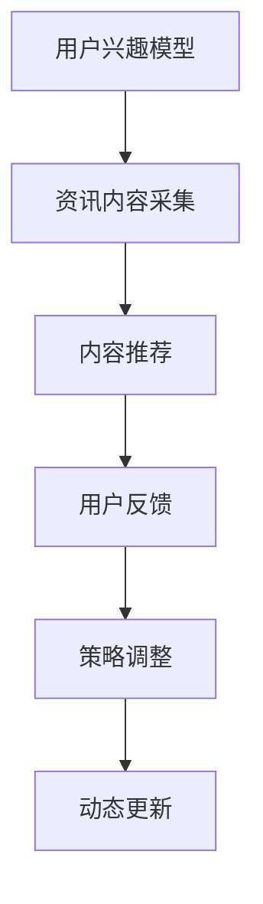

通过这些动态更新机制，社交网络平台能够提供更加个性化和实时的服务，提升用户体验和平台的竞争力。

##### 6.6.2 电子商务平台的动态更新

电子商务平台中，商品信息的实时更新和用户偏好的动态分析是关键。以下将探讨电子商务平台中的动态更新机制及其应用。

###### 商品信息更新

商品信息的实时更新对于电商平台的用户体验和销售转化率至关重要。以下是一个商品信息更新的流程：

1. **数据源监测**：实时监测商品数据源，如商家上传的商品信息、物流信息等。
2. **数据预处理**：对监测到的商品信息进行清洗、去重等操作，确保数据质量。
3. **信息更新**：利用本体匹配算法，将清洗后的商品信息更新到知识图谱中，实现对商品信息的实时更新。
4. **用户通知**：在商品信息更新后，实时向用户发送通知，如商品降价、库存变化等。

以下是一个电子商务平台商品信息更新的Mermaid架构图：

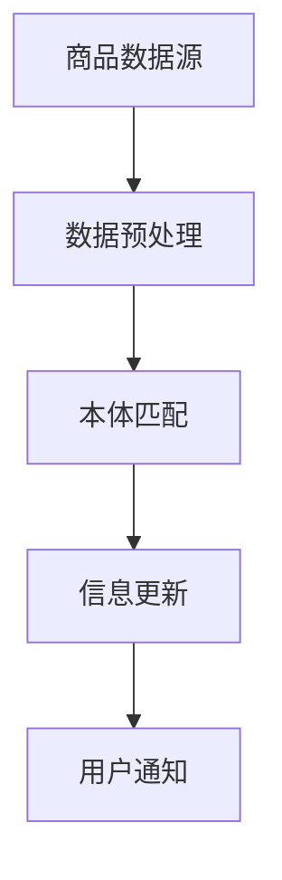

###### 用户偏好分析

用户偏好的动态分析对于电商平台实现个性化推荐和提升用户满意度至关重要。以下是一个用户偏好分析的过程：

1. **行为数据采集**：实时采集用户的浏览历史、购物车、购买记录等行为数据。
2. **偏好模型构建**：利用机器学习算法，如协同过滤、矩阵分解等，构建用户偏好模型。
3. **推荐算法**：基于用户偏好模型，利用推荐算法（如基于内容的推荐、基于协同过滤的推荐等），为用户推荐个性化的商品。
4. **偏好更新**：根据用户的反馈和行为，动态调整偏好模型，实现用户偏好的实时更新。

以下是一个电子商务平台用户偏好分析的Mermaid架构图：

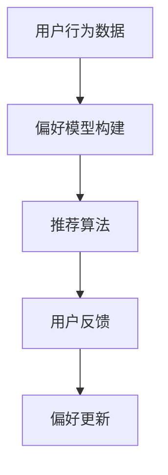

通过这些动态更新机制，电子商务平台能够提供更加个性化和实时的服务，提升用户体验和平台的竞争力。

##### 6.6.3 案例分析

为了更好地理解动态更新机制在实际应用中的效果和优化策略，下面将分析一个具体的实际案例。

###### 案例背景

某大型电商平台在实施动态更新机制时，遇到了以下问题：

- 数据源多样性：电商平台的数据源包括商品信息、用户行为、物流信息等，数据格式和更新频率各异。
- 数据延迟：部分数据源存在延迟，导致实时性受到影响。
- 系统负载：大量实时数据导致系统负载过高，影响平台性能。

###### 解决方案

1. **数据流处理技术**：采用Apache Flink进行数据流处理，确保实时性。通过Flink的connectors，将不同数据源的数据实时采集到Flink中。

2. **分布式存储架构**：采用分布式存储技术（如Apache Hadoop）存储大规模数据，提高数据存储和查询效率。

3. **优化数据预处理**：对数据预处理过程进行优化，减少冗余数据和重复处理，提高数据处理效率。

4. **动态调整更新策略**：根据系统负载和实时性需求，动态调整数据更新频率和策略，确保系统性能和用户体验。

通过以上优化策略，电商平台实现了以下效果：

- 数据实时性显著提高，用户能够及时获取最新商品信息和动态。
- 系统负载得到有效控制，平台性能得到显著提升。
- 用户满意度提高，平台竞争力增强。

通过这个实际案例，我们可以看到动态更新机制在实际应用中的重要性和效果，同时也为其他应用场景提供了有益的参考和借鉴。

### 第7章: 总结与展望

##### 7.7.1 动态更新机制的关键技术

在本文中，我们系统地探讨了AI Agent的知识图谱动态更新机制设计，涵盖了一系列关键技术。这些技术包括数据流处理技术、知识图谱存储技术、智能规划与决策技术等。以下是这些关键技术的总结和展望：

1. **数据流处理技术**：数据流处理技术是实现动态更新机制的核心，如Apache Flink和Apache Kafka，它们能够实时处理大规模数据流，确保知识图谱的实时性。未来，随着数据流处理技术的发展，我们可以期待更高的处理速度和更低的延迟。

2. **知识图谱存储技术**：知识图谱存储技术如Neo4j和ArangoDB，提供了高效的知识存储和查询解决方案。未来，随着图数据库和分布式存储技术的进步，知识图谱存储将更加高效和可扩展。

3. **智能规划与决策技术**：智能规划与决策技术，如遗传算法、深度强化学习和模糊推理，为动态更新提供了智能化的决策支持。随着机器学习和人工智能技术的不断发展，这些算法将变得更加精确和高效。

##### 7.7.2 未来研究方向

尽管我们已经探讨了AI Agent的知识图谱动态更新机制，但未来仍有许多研究方向值得深入探讨：

1. **算法优化**：在动态更新机制中，算法的优化是关键。未来可以通过优化算法，提高更新速度和准确性，如设计更加高效的本体匹配算法和更新规则。

2. **分布式系统**：分布式系统在动态更新机制中的应用前景广阔。通过分布式计算和存储，可以实现大规模、高并发的知识图谱更新，满足不断增长的数据需求。

3. **多智能体系统**：多智能体系统（MAS）可以用于构建分布式、协作的知识图谱更新系统。未来，可以研究如何在多智能体系统中实现高效的动态更新，以提高系统的鲁棒性和适应性。

4. **实时性与准确性**：在动态更新过程中，实时性和准确性是两个重要的权衡。未来可以研究如何在不牺牲实时性的情况下，提高知识图谱的准确性，或者在不降低准确性的情况下，提高更新速度。

通过不断探索和优化，AI Agent的知识图谱动态更新机制将变得更加成熟和高效，为人工智能领域的发展提供强有力的支持。

### 作者信息

**作者：AI天才研究院/AI Genius Institute & 禅与计算机程序设计艺术 /Zen And The Art of Computer Programming**

在这篇技术博客中，我们深入探讨了AI Agent的知识图谱动态更新机制设计，从核心概念、算法原理到实现技术，再到实际应用场景和未来展望，系统地介绍了相关技术。希望通过这篇文章，能够为读者提供对知识图谱动态更新机制的理解和思考，激发更多研究和应用的可能性。同时，感谢AI天才研究院和《禅与计算机程序设计艺术》为我们提供了宝贵的研究资源和灵感。希望这篇文章能够为人工智能领域的技术发展和应用带来新的启示和帮助。

