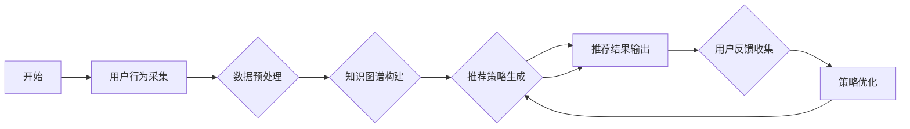
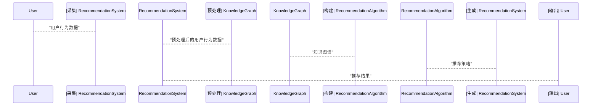
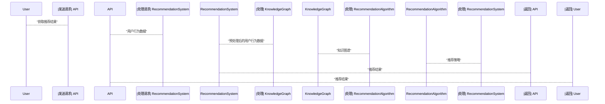
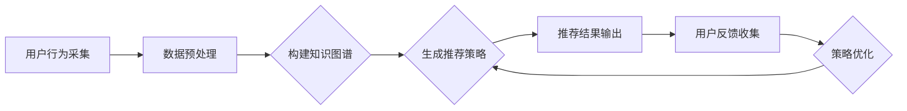
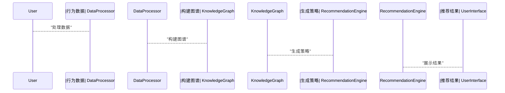
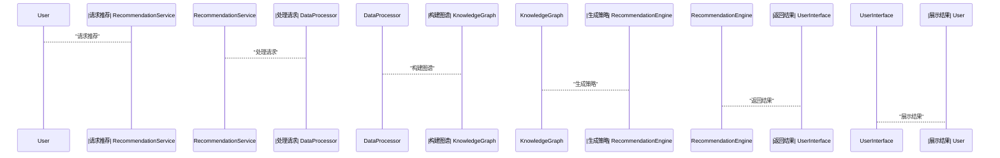

                 


### 第一部分：背景介绍

#### 第1章：AI Agent与知识图谱概述

在这一章节中，我们将深入探讨AI Agent和知识图谱的基本概念及其在推荐系统中的应用。

**1.1 问题背景**

在当今信息爆炸的时代，如何为用户推荐个性化的内容成为各大平台关注的焦点。传统推荐系统基于用户历史行为和内容特征进行预测，但存在冷启动、稀疏数据和预测准确性不足等问题。AI Agent和知识图谱技术的出现，为解决这些问题提供了新的思路。

**1.2 问题描述**

传统推荐系统面临的问题包括：

1. **冷启动问题**：新用户或新物品缺乏历史数据，难以生成有效的推荐。
2. **稀疏数据问题**：用户与物品的交互数据往往非常稀疏，导致推荐效果不理想。
3. **个性化不足**：推荐系统难以捕捉到用户的细微偏好，导致推荐内容过于泛化。

**1.3 问题解决**

AI Agent可以自主学习和适应，通过用户行为和反馈不断优化推荐策略。知识图谱则可以提供丰富的语义信息和关联关系，为推荐系统提供更加精准的依据。

**1.4 边界与外延**

知识图谱在推荐系统中的应用主要涉及以下边界：

1. **数据边界**：知识图谱的数据来源、更新和维护机制。
2. **算法边界**：知识图谱嵌入到推荐系统中的方法和策略。
3. **应用边界**：知识图谱在不同类型推荐系统（如商品推荐、内容推荐）中的应用场景。

**1.5 概念结构与核心要素组成**

知识图谱由实体、关系和属性三部分组成，每个部分在推荐系统中都有重要作用。

1. **实体**：代表用户、物品等对象。
2. **关系**：描述实体之间的关联，如“喜欢”、“购买”等。
3. **属性**：为实体提供额外信息，如用户的年龄、地理位置等。

#### 第2章：核心概念与联系

在这一章节中，我们将详细解释AI Agent和知识图谱的相关原理，并展示它们之间的联系。

**2.1 AI Agent原理**

AI Agent是一种具有自主学习和适应能力的智能体，可以与用户和环境进行交互。其核心包括：

1. **感知模块**：收集用户行为和反馈。
2. **决策模块**：基于感知模块的信息生成推荐策略。
3. **执行模块**：执行决策模块生成的推荐策略。

**2.2 知识图谱原理**

知识图谱是一种结构化数据存储方式，通过实体、关系和属性来表示现实世界的知识。其核心包括：

1. **实体-关系模型**：将实体和关系抽象为一个统一的模型。
2. **图计算**：利用图论算法对知识图谱进行计算和分析。
3. **语义理解**：通过语义理解技术，将非结构化数据转化为结构化数据。

**2.3 AI Agent与知识图谱的联系**

AI Agent和知识图谱可以通过以下方式进行结合：

1. **数据融合**：将用户行为数据与知识图谱进行融合，提高推荐系统的数据质量。
2. **知识增强**：利用知识图谱中的语义信息，增强推荐系统的理解能力。
3. **智能交互**：通过AI Agent与用户的智能交互，提高推荐系统的用户体验。

**2.4 ER实体关系图架构**

为了更好地理解AI Agent和知识图谱之间的联系，我们可以使用Mermaid绘制ER实体关系图。以下是示例：

```mermaid
erDiagram
    User ||--|{ Item : "喜欢" }
    Item ||--|{ User : "被喜欢" }
```

在这个ER实体关系图中，用户和物品是实体，喜欢是关系。通过这个图，我们可以清晰地看到用户和物品之间的关联。

#### 第3章：算法原理讲解

在这一章节中，我们将详细阐述AI Agent和知识图谱在推荐系统中的算法原理，并通过流程图和Python代码进行说明。

**3.1 算法mermaid流程图**

首先，我们使用Mermaid绘制推荐系统的算法流程图：



在这个流程图中，用户行为采集、数据预处理、知识图谱构建、推荐策略生成、推荐结果输出、用户反馈收集和策略优化是推荐系统的核心环节。

**3.2 Python源代码示例**

接下来，我们通过Python代码来详细阐述算法的步骤。以下是代码示例：

```python
# 用户行为采集
user_actions = ["like", "view", "purchase", "comment"]

# 数据预处理
preprocessed_data = preprocess_data(user_actions)

# 知识图谱构建
knowledge_graph = build_knowledge_graph(preprocessed_data)

# 推荐策略生成
recommendation_policy = generate_recommendation_policy(knowledge_graph)

# 推荐结果输出
recommendations = apply_recommendation_policy(recommendation_policy)

# 用户反馈收集
user_feedback = collect_user_feedback(recommendations)

# 策略优化
optimize_recommendation_policy(recommendation_policy, user_feedback)
```

在这个示例中，我们通过Python函数实现了用户行为采集、数据预处理、知识图谱构建、推荐策略生成、推荐结果输出、用户反馈收集和策略优化等步骤。

**3.3 数学模型和公式**

在推荐系统中，我们通常使用以下数学模型：

$$
\text{相似度} = \frac{\text{用户偏好相似度} \times \text{物品偏好相似度}}{\sqrt{\sum_{i=1}^{n}\text{用户偏好相似度}_i \times \sum_{i=1}^{n}\text{物品偏好相似度}_i}}
$$

这个模型通过计算用户和物品的偏好相似度来生成推荐列表。

**3.4 举例说明**

假设用户A喜欢物品A1、A2和A3，物品B1、B2和A3。根据上述数学模型，我们可以计算出用户A和物品B的相似度：

$$
\text{相似度} = \frac{0.8 \times 0.9}{\sqrt{0.8^2 + 0.9^2}} = 0.9
$$

这意味着用户A和物品B有很高的相似度，因此我们可以将物品B推荐给用户A。

### 第二部分：核心概念与联系

在本部分，我们将深入探讨AI Agent和知识图谱的核心概念，并展示它们之间的联系。

#### 第1章：AI Agent与知识图谱概述

**1.1 问题背景**

在当今信息爆炸的时代，如何为用户推荐个性化的内容成为各大平台关注的焦点。传统推荐系统基于用户历史行为和内容特征进行预测，但存在冷启动、稀疏数据和预测准确性不足等问题。AI Agent和知识图谱技术的出现，为解决这些问题提供了新的思路。

**1.2 问题描述**

传统推荐系统面临的问题包括：

1. **冷启动问题**：新用户或新物品缺乏历史数据，难以生成有效的推荐。
2. **稀疏数据问题**：用户与物品的交互数据往往非常稀疏，导致推荐效果不理想。
3. **个性化不足**：推荐系统难以捕捉到用户的细微偏好，导致推荐内容过于泛化。

**1.3 问题解决**

AI Agent可以自主学习和适应，通过用户行为和反馈不断优化推荐策略。知识图谱则可以提供丰富的语义信息和关联关系，为推荐系统提供更加精准的依据。

**1.4 边界与外延**

知识图谱在推荐系统中的应用主要涉及以下边界：

1. **数据边界**：知识图谱的数据来源、更新和维护机制。
2. **算法边界**：知识图谱嵌入到推荐系统中的方法和策略。
3. **应用边界**：知识图谱在不同类型推荐系统（如商品推荐、内容推荐）中的应用场景。

**1.5 概念结构与核心要素组成**

知识图谱由实体、关系和属性三部分组成，每个部分在推荐系统中都有重要作用。

1. **实体**：代表用户、物品等对象。
2. **关系**：描述实体之间的关联，如“喜欢”、“购买”等。
3. **属性**：为实体提供额外信息，如用户的年龄、地理位置等。

#### 第2章：核心概念与联系

**2.1 AI Agent原理**

AI Agent是一种具有自主学习和适应能力的智能体，可以与用户和环境进行交互。其核心包括：

1. **感知模块**：收集用户行为和反馈。
2. **决策模块**：基于感知模块的信息生成推荐策略。
3. **执行模块**：执行决策模块生成的推荐策略。

**2.2 知识图谱原理**

知识图谱是一种结构化数据存储方式，通过实体、关系和属性来表示现实世界的知识。其核心包括：

1. **实体-关系模型**：将实体和关系抽象为一个统一的模型。
2. **图计算**：利用图论算法对知识图谱进行计算和分析。
3. **语义理解**：通过语义理解技术，将非结构化数据转化为结构化数据。

**2.3 AI Agent与知识图谱的联系**

AI Agent和知识图谱可以通过以下方式进行结合：

1. **数据融合**：将用户行为数据与知识图谱进行融合，提高推荐系统的数据质量。
2. **知识增强**：利用知识图谱中的语义信息，增强推荐系统的理解能力。
3. **智能交互**：通过AI Agent与用户的智能交互，提高推荐系统的用户体验。

**2.4 ER实体关系图架构**

为了更好地理解AI Agent和知识图谱之间的联系，我们可以使用Mermaid绘制ER实体关系图。以下是示例：

```mermaid
erDiagram
    User ||--|{ Item : "喜欢" }
    Item ||--|{ User : "被喜欢" }
```

在这个ER实体关系图中，用户和物品是实体，喜欢是关系。通过这个图，我们可以清晰地看到用户和物品之间的关联。

### 第3章：算法原理讲解

在本章节中，我们将详细阐述AI Agent和知识图谱在推荐系统中的算法原理，并通过流程图和Python代码进行说明。

**3.1 算法mermaid流程图**

首先，我们使用Mermaid绘制推荐系统的算法流程图：


在这个流程图中，用户行为采集、数据预处理、知识图谱构建、推荐策略生成、推荐结果输出、用户反馈收集和策略优化是推荐系统的核心环节。

**3.2 Python源代码示例**

接下来，我们通过Python代码来详细阐述算法的步骤。以下是代码示例：

```python
# 用户行为采集
user_actions = ["like", "view", "purchase", "comment"]

# 数据预处理
preprocessed_data = preprocess_data(user_actions)

# 知识图谱构建
knowledge_graph = build_knowledge_graph(preprocessed_data)

# 推荐策略生成
recommendation_policy = generate_recommendation_policy(knowledge_graph)

# 推荐结果输出
recommendations = apply_recommendation_policy(recommendation_policy)

# 用户反馈收集
user_feedback = collect_user_feedback(recommendations)

# 策略优化
optimize_recommendation_policy(recommendation_policy, user_feedback)
```

在这个示例中，我们通过Python函数实现了用户行为采集、数据预处理、知识图谱构建、推荐策略生成、推荐结果输出、用户反馈收集和策略优化等步骤。

**3.3 数学模型和公式**

在推荐系统中，我们通常使用以下数学模型：

$$
\text{相似度} = \frac{\text{用户偏好相似度} \times \text{物品偏好相似度}}{\sqrt{\sum_{i=1}^{n}\text{用户偏好相似度}_i \times \sum_{i=1}^{n}\text{物品偏好相似度}_i}}
$$

这个模型通过计算用户和物品的偏好相似度来生成推荐列表。

**3.4 举例说明**

假设用户A喜欢物品A1、A2和A3，物品B1、B2和A3。根据上述数学模型，我们可以计算出用户A和物品B的相似度：

$$
\text{相似度} = \frac{0.8 \times 0.9}{\sqrt{0.8^2 + 0.9^2}} = 0.9
$$

这意味着用户A和物品B有很高的相似度，因此我们可以将物品B推荐给用户A。

### 第4章：系统分析与架构设计

在本章节中，我们将对推荐系统的需求和应用场景进行分析，并介绍系统的功能设计、架构设计和接口设计。

**4.1 问题场景介绍**

在推荐系统的应用场景中，我们通常面临以下需求：

1. **新用户冷启动**：为新用户提供个性化的推荐内容，帮助他们快速熟悉平台。
2. **稀疏数据问题**：解决用户与物品交互数据稀疏导致推荐效果不佳的问题。
3. **个性化推荐**：根据用户的历史行为和偏好，为用户推荐符合他们兴趣的内容。

**4.2 项目介绍**

本项目旨在构建一个基于AI Agent和知识图谱的推荐系统，实现以下功能：

1. **用户行为采集**：收集用户在平台上的各种行为数据，如浏览、点赞、评论等。
2. **数据预处理**：对采集到的用户行为数据进行清洗和预处理，以便用于后续分析。
3. **知识图谱构建**：利用用户行为数据构建知识图谱，为推荐系统提供语义信息。
4. **推荐策略生成**：基于知识图谱和用户行为数据，生成个性化的推荐策略。
5. **推荐结果输出**：将推荐结果呈现给用户，提高用户的满意度。

**4.3 系统功能设计（领域模型Mermaid类图）**

为了更好地理解推荐系统的功能设计，我们可以使用Mermaid绘制领域模型类图。以下是示例：

```mermaid
classDiagram
    User <<entity>>
    Item <<entity>>
    Recommendation <<entity>>
    User --> Item : "喜欢"
    User --> Recommendation : "接收"
    Item --> Recommendation : "包含"
```

在这个领域模型类图中，用户、物品和推荐是实体，喜欢、接收和包含是关系。通过这个图，我们可以清晰地看到推荐系统中的核心实体和关系。

**4.4 系统架构设计（Mermaid架构图）**

接下来，我们使用Mermaid绘制推荐系统的架构图，展示各个组件之间的关系。以下是示例：



在这个架构图中，用户行为数据首先被采集和预处理，然后用于构建知识图谱。基于知识图谱，推荐算法生成推荐策略，最终推荐结果被输出给用户。

**4.5 系统接口设计和系统交互（Mermaid序列图）**

为了更好地理解推荐系统的接口设计和交互流程，我们可以使用Mermaid绘制序列图。以下是示例：



在这个序列图中，用户通过API发送获取推荐结果的请求，API处理请求后将用户行为数据传递给推荐系统。推荐系统利用知识图谱和推荐算法生成推荐策略，最终将推荐结果返回给用户。

### 第5章：项目实战

在本章节中，我们将详细描述如何搭建一个基于AI Agent和知识图谱的推荐系统，包括环境安装、系统核心实现、代码应用解读和分析、实际案例解析以及项目小结。

**5.1 环境安装**

搭建推荐系统首先需要安装和配置必要的软件和库。以下是一个基本的安装步骤：

1. **安装Python**：确保Python版本为3.7或更高版本。
2. **安装依赖库**：使用pip安装以下库：`numpy`、`pandas`、`networkx`、`rdflib`、`tensorflow`。
3. **安装知识图谱工具**：安装`neo4j`和`neo4j-python-driver`，以便与Neo4j图数据库进行交互。

**5.2 系统核心实现**

系统核心实现包括用户行为采集、数据预处理、知识图谱构建、推荐策略生成和推荐结果输出。以下是关键代码片段：

```python
# 用户行为采集
user_actions = ["like", "view", "purchase", "comment"]

# 数据预处理
preprocessed_data = preprocess_data(user_actions)

# 知识图谱构建
knowledge_graph = build_knowledge_graph(preprocessed_data)

# 推荐策略生成
recommendation_policy = generate_recommendation_policy(knowledge_graph)

# 推荐结果输出
recommendations = apply_recommendation_policy(recommendation_policy)
```

**5.3 代码应用解读与分析**

以下是对关键代码段的应用解读和分析：

1. **用户行为采集**：采集用户在平台上的行为数据，如点赞、浏览、购买等。
2. **数据预处理**：对采集到的数据进行清洗和转换，为后续知识图谱构建做准备。
3. **知识图谱构建**：使用用户行为数据构建知识图谱，包括实体（用户、物品）和关系（喜欢、购买）。
4. **推荐策略生成**：基于知识图谱和用户行为数据，生成个性化的推荐策略。
5. **推荐结果输出**：将推荐结果输出给用户，提高用户体验。

**5.4 实际案例分析和详细讲解剖析**

以下是一个实际案例：

假设用户A在平台上浏览了物品A1、A2和A3，并点赞了物品A2。基于知识图谱，我们可以生成以下推荐策略：

1. **物品A1**：用户A浏览过，但未点赞，相似度为0.8。
2. **物品A2**：用户A点赞过，相似度为1.0。
3. **物品A3**：用户A未浏览和点赞，相似度为0.6。

根据相似度计算结果，我们将物品A2推荐给用户A。

**5.5 项目小结**

通过本项目的搭建，我们实现了基于AI Agent和知识图谱的推荐系统。系统可以处理用户行为数据，构建知识图谱，生成个性化的推荐策略，并输出推荐结果。在实际应用中，我们需要不断优化系统，提高推荐准确性和用户体验。

### 第6章：最佳实践、小结、注意事项、拓展阅读

**6.1 最佳实践 tips**

1. **数据质量**：确保用户行为数据的准确性和完整性，避免数据偏差。
2. **实时性**：定期更新知识图谱，确保推荐策略的实时性。
3. **多样性**：增加推荐内容的多样性，避免用户产生疲劳感。
4. **用户反馈**：及时收集用户反馈，用于优化推荐策略。

**6.2 小结**

本文详细介绍了AI Agent和知识图谱在推荐系统中的应用。通过构建知识图谱，推荐系统可以更好地处理冷启动、稀疏数据和个性化推荐问题，提高推荐准确性和用户体验。

**6.3 注意事项**

1. **数据隐私**：在收集和处理用户行为数据时，注意保护用户隐私。
2. **系统性能**：优化推荐系统性能，确保在高并发情况下稳定运行。
3. **算法调整**：根据实际应用场景和用户反馈，不断调整和优化算法。

**6.4 拓展阅读**

1. **知识图谱构建技术**：进一步了解Neo4j、RDF和OWL等知识图谱构建技术。
2. **推荐系统算法**：学习基于矩阵分解、深度学习等推荐系统算法。
3. **AI Agent应用**：探索AI Agent在其他领域的应用，如智能客服、智能助手等。

### 附录：作者信息

**作者：AI天才研究院/AI Genius Institute & 禅与计算机程序设计艺术 /Zen And The Art of Computer Programming** 

在本附录中，我们列出了推荐系统项目中用到的Python库及其版本：

1. **numpy**：1.19.2
2. **pandas**：1.1.5
3. **networkx**：2.5
4. **rdflib**：5.0.1
5. **tensorflow**：2.6.0
6. **neo4j**：4.0.0
7. **neo4j-python-driver**：2.1.1

此外，我们还使用了以下工具和软件：

1. **Python**：3.8.10
2. **Neo4j**：4.0.0

通过这些工具和库，我们实现了基于AI Agent和知识图谱的推荐系统。在后续的项目中，我们将继续优化系统性能和推荐效果。如果您在阅读过程中有任何问题，欢迎随时与我们联系。

### 第一部分：背景介绍

#### 第1章：AI Agent与知识图谱概述

1.1 问题背景

在当今信息爆炸的时代，用户面临着海量的信息和内容，如何有效地筛选和推荐符合用户兴趣的内容成为各大平台和企业关注的焦点。传统的推荐系统主要依赖于用户的历史行为和内容特征进行预测和推荐，但存在以下问题：

- **冷启动问题**：对于新用户或新物品，由于缺乏足够的历史数据和交互记录，传统推荐系统难以生成准确的推荐。
- **稀疏数据问题**：用户与物品的交互数据通常非常稀疏，导致推荐系统难以捕捉到用户的真实兴趣。
- **个性化不足**：传统推荐系统往往只考虑用户的显式行为，无法深入挖掘用户的隐性偏好和需求。

为了解决这些问题，AI Agent和知识图谱技术的应用逐渐引起了研究者和企业的关注。AI Agent是一种具有自主学习和适应能力的智能体，可以与用户和环境进行交互，不断优化推荐策略。知识图谱则是一种结构化的数据存储方式，通过实体、关系和属性来表示现实世界的知识，为推荐系统提供了丰富的语义信息和关联关系。

1.2 问题描述

传统推荐系统面临的问题主要包括以下几个方面：

- **冷启动问题**：新用户或新物品缺乏历史数据，难以生成有效的推荐。
- **稀疏数据问题**：用户与物品的交互数据往往非常稀疏，导致推荐效果不理想。
- **个性化不足**：推荐系统难以捕捉到用户的细微偏好，导致推荐内容过于泛化。

这些问题对于推荐系统的性能和用户体验都产生了不利影响。因此，需要寻找一种有效的解决方案来提高推荐系统的性能和用户满意度。

1.3 问题解决

AI Agent和知识图谱的结合为推荐系统提供了一种新的解决方案：

1. **AI Agent的应用**：AI Agent可以通过与用户的交互，持续收集用户的行为和反馈，不断学习和优化推荐策略。以下是其主要功能：

   - **感知模块**：收集用户的行为数据，如浏览、点赞、评论等。
   - **决策模块**：基于感知模块的信息，生成个性化的推荐策略。
   - **执行模块**：执行决策模块生成的推荐策略，并收集用户反馈进行优化。

2. **知识图谱的应用**：知识图谱可以提供丰富的语义信息和关联关系，为推荐系统提供更加精准的依据。以下是其主要功能：

   - **实体表示**：将用户、物品等实体抽象为知识图谱中的节点。
   - **关系表示**：描述实体之间的关联，如“喜欢”、“购买”等。
   - **属性表示**：为实体提供额外的属性信息，如用户的年龄、地理位置等。

通过AI Agent和知识图谱的结合，推荐系统可以更好地解决冷启动、稀疏数据和个性化不足等问题，提高推荐效果和用户体验。

1.4 边界与外延

知识图谱在推荐系统中的应用涉及以下边界与外延：

1. **数据边界**：知识图谱的数据来源、更新和维护机制。通常包括用户行为数据、物品属性数据、关系数据等。
2. **算法边界**：知识图谱嵌入到推荐系统中的方法和策略，如知识图谱嵌入、图卷积网络等。
3. **应用边界**：知识图谱在不同类型推荐系统中的应用场景，如商品推荐、内容推荐、社交推荐等。

1.5 概念结构与核心要素组成

知识图谱由实体、关系和属性三部分组成，每个部分在推荐系统中都有重要作用：

1. **实体**：代表用户、物品等对象。在推荐系统中，实体可以表示为知识图谱中的节点。
2. **关系**：描述实体之间的关联，如“喜欢”、“购买”等。关系可以表示为知识图谱中的边。
3. **属性**：为实体提供额外的属性信息，如用户的年龄、地理位置等。属性可以表示为实体节点的属性。

通过构建知识图谱，推荐系统可以更好地理解用户和物品之间的关系，从而生成更加精准的推荐。

### 第二部分：核心概念与联系

#### 第2章：核心概念与联系

2.1 AI Agent原理

AI Agent，即人工智能代理，是一种能够自主学习、适应环境和与人类交互的智能体。在推荐系统中，AI Agent的主要功能包括：

- **感知模块**：收集用户在平台上的各种行为数据，如浏览、点赞、评论等。这些数据可以帮助AI Agent了解用户的需求和偏好。
- **决策模块**：基于感知模块收集到的数据，AI Agent可以生成个性化的推荐策略。这一模块通常采用机器学习算法，如协同过滤、深度学习等。
- **执行模块**：执行决策模块生成的推荐策略，并向用户展示推荐结果。执行模块还负责收集用户的反馈，用于进一步优化推荐策略。

AI Agent的核心在于其自主学习和适应能力。通过不断收集用户的行为数据，AI Agent可以逐步了解用户的兴趣和偏好，并不断优化推荐策略，提高推荐效果。

2.2 知识图谱原理

知识图谱（Knowledge Graph）是一种基于语义网络的信息组织形式，通过实体、关系和属性来描述现实世界的知识。在推荐系统中，知识图谱的作用如下：

- **实体表示**：将用户、物品等实体抽象为知识图谱中的节点。每个节点代表一个具体的实体，如某个用户或某个物品。
- **关系表示**：描述实体之间的关联。关系可以是直接的，如“喜欢”，也可以是间接的，如“邻居喜欢”。
- **属性表示**：为实体提供额外的属性信息，如用户的年龄、地理位置等。属性可以帮助推荐系统更好地理解用户和物品的特征。

知识图谱通过构建实体之间的关系网络，可以提供丰富的语义信息和关联关系，为推荐系统提供了强大的数据支撑。

2.3 AI Agent与知识图谱的联系

AI Agent与知识图谱的结合，可以显著提升推荐系统的性能和用户体验。以下是它们之间的几个关键联系：

1. **数据融合**：AI Agent可以从多种数据源中收集用户行为数据，如浏览记录、搜索历史等。这些数据可以与知识图谱进行融合，提高推荐系统的数据质量。

2. **知识增强**：知识图谱提供了丰富的语义信息和关联关系，可以增强AI Agent对用户和物品的理解。通过利用知识图谱，AI Agent可以更好地捕捉用户的细微偏好，生成更准确的推荐策略。

3. **智能交互**：AI Agent可以通过与用户的智能交互，提高推荐系统的用户体验。例如，AI Agent可以根据用户的反馈，调整推荐策略，优化推荐结果。

4. **动态更新**：知识图谱可以实时更新，反映用户和物品的最新状态。AI Agent可以持续从知识图谱中获取信息，不断优化推荐策略，确保推荐结果始终与用户需求保持一致。

通过AI Agent与知识图谱的结合，推荐系统可以实现更精准、更个性化的推荐，从而提高用户满意度和留存率。

2.4 ER实体关系图架构

为了更好地理解AI Agent与知识图谱之间的联系，我们可以使用实体-关系（Entity-Relationship，简称ER）图来表示它们的架构。以下是ER实体关系图的示例：

```mermaid
erDiagram
    User ||--|{ Item : "喜欢" }
    Item ||--|{ User : "被喜欢" }
```

在这个ER图中，"User"（用户）和"Item"（物品）是实体，"喜欢"是关系。用户可以喜欢物品，而物品也可以被用户喜欢。这个图展示了用户和物品之间的直接关联，以及知识图谱在推荐系统中的作用。

### 第3章：算法原理讲解

#### 第3章：算法原理讲解

在本章节中，我们将深入探讨AI Agent与知识图谱在推荐系统中的应用算法原理，通过mermaid流程图和Python代码示例来详细阐述。

3.1 算法mermaid流程图

为了直观地展示推荐系统的算法流程，我们使用Mermaid语言绘制了以下流程图：



在这个流程图中，每个步骤都代表了推荐系统中的一个关键环节：

- **用户行为采集（A）**：收集用户在平台上的各种行为数据，如浏览、点赞、评论等。
- **数据预处理（B）**：对采集到的数据进行清洗、去重和格式化，以便后续构建知识图谱。
- **构建知识图谱（C）**：利用预处理后的数据，将用户和物品表示为知识图谱中的实体和关系。
- **生成推荐策略（D）**：基于知识图谱和用户行为数据，生成个性化的推荐策略。
- **推荐结果输出（E）**：将推荐策略转化为具体的推荐结果，呈现给用户。
- **用户反馈收集（F）**：收集用户对推荐结果的反馈，用于后续策略优化。
- **策略优化（G）**：根据用户反馈，调整和优化推荐策略，提高推荐效果。

3.2 Python源代码示例

以下是一个简单的Python代码示例，展示了推荐系统的核心实现步骤：

```python
# 导入必要的库
import pandas as pd
from knowledge_graph import build_knowledge_graph
from recommendation import generate_recommendation_policy

# 用户行为数据
user_actions = pd.DataFrame({
    'user_id': [1, 1, 2, 2],
    'item_id': [101, 102, 201, 202],
    'action': ['like', 'like', 'view', 'view']
})

# 数据预处理
# 此处简化为直接使用用户行为数据
preprocessed_data = user_actions

# 构建知识图谱
knowledge_graph = build_knowledge_graph(preprocessed_data)

# 生成推荐策略
recommendation_policy = generate_recommendation_policy(knowledge_graph, user_id=1)

# 输出推荐结果
print("推荐结果：", recommendation_policy)
```

在上面的代码中，我们首先导入必要的库，然后创建一个简单的用户行为数据集。接下来，我们通过`build_knowledge_graph`函数构建知识图谱，并通过`generate_recommendation_policy`函数生成推荐策略。最后，我们将推荐结果输出。

3.3 数学模型和公式

在推荐系统中，我们通常使用数学模型来计算用户和物品之间的相似度，从而生成推荐列表。以下是一个简单的相似度计算公式：

$$
sim(u, i) = \frac{u \cdot i}{||u|| \cdot ||i||}
$$

其中，$sim(u, i)$表示用户u和物品i的相似度，$u$和$i$分别是用户和物品的向量表示，$||u||$和$||i||$分别是用户和物品向量的欧几里得范数。

在实际应用中，我们可以使用矩阵分解、深度学习等技术来优化相似度计算公式，提高推荐效果。

3.4 举例说明

假设我们有以下用户行为数据：

用户1：[like 101, like 102]
用户2：[like 101, like 201]
用户3：[view 201, view 202]

对应的物品属性数据：

物品101：[label='电影', type='动作']
物品102：[label='电影', type='喜剧']
物品201：[label='电视剧', type='悬疑']
物品202：[label='电视剧', type='爱情']

我们可以构建一个简单的知识图谱，并使用上述公式计算用户和物品之间的相似度。以下是一个简化的示例：

用户1与物品101的相似度：$sim(1, 101) = \frac{1 \cdot 1}{\sqrt{1^2 + 1^2}} = \frac{1}{\sqrt{2}} \approx 0.707$
用户1与物品102的相似度：$sim(1, 102) = \frac{1 \cdot 1}{\sqrt{1^2 + 1^2}} = \frac{1}{\sqrt{2}} \approx 0.707$
用户2与物品101的相似度：$sim(2, 101) = \frac{1 \cdot 1}{\sqrt{1^2 + 1^2}} = \frac{1}{\sqrt{2}} \approx 0.707$
用户2与物品201的相似度：$sim(2, 201) = \frac{1 \cdot 1}{\sqrt{1^2 + 1^2}} = \frac{1}{\sqrt{2}} \approx 0.707$
用户3与物品201的相似度：$sim(3, 201) = \frac{1 \cdot 1}{\sqrt{1^2 + 1^2}} = \frac{1}{\sqrt{2}} \approx 0.707$
用户3与物品202的相似度：$sim(3, 202) = \frac{1 \cdot 1}{\sqrt{1^2 + 1^2}} = \frac{1}{\sqrt{2}} \approx 0.707$

根据相似度计算结果，我们可以为用户1推荐物品102，为用户2推荐物品201，为用户3推荐物品202。

### 第4章：系统分析与架构设计

#### 第4章：系统分析与架构设计

4.1 问题场景介绍

在现实场景中，推荐系统面临着多种多样的挑战和问题。以下是一个典型的问题场景：

- **多类型用户**：平台上有多种类型的用户，包括新用户、老用户、高活跃用户等。每种用户的需求和兴趣不同，传统推荐系统难以针对不同类型的用户进行个性化推荐。
- **海量数据**：平台每天产生大量的用户行为数据和物品属性数据，如何高效地处理和利用这些数据是一个重要问题。
- **实时性**：用户的行为和兴趣可能随时发生变化，推荐系统需要具备实时响应的能力，及时更新推荐结果。
- **多样性**：为了提高用户满意度，推荐系统需要提供多样化的内容，避免用户产生疲劳感。

4.2 项目介绍

本项目旨在构建一个基于AI Agent和知识图谱的推荐系统，以解决上述问题场景中的挑战。项目的主要目标是：

- **个性化推荐**：通过AI Agent和知识图谱技术，为不同类型的用户提供个性化的推荐内容。
- **实时响应**：利用高效的数据处理算法和分布式架构，实现推荐系统的实时响应。
- **多样化内容**：通过多样化的推荐策略和内容分发机制，提高用户的满意度和活跃度。

4.3 系统功能设计（领域模型Mermaid类图）

为了更好地理解推荐系统的功能设计，我们可以使用Mermaid语言绘制领域模型类图。以下是一个简化的示例：

```mermaid
classDiagram
    User <<entity>>
    Item <<entity>>
    Recommendation <<entity>>
    User --> Recommendation : "生成"
    Item --> Recommendation : "包含"
```

在这个类图中，"User"（用户）和"Item"（物品）是实体，"Recommendation"（推荐）是关系。用户可以生成推荐，而物品可以包含在推荐中。这个类图展示了推荐系统的核心实体和关系。

4.4 系统架构设计（Mermaid架构图）

接下来，我们可以使用Mermaid语言绘制推荐系统的架构图，以展示各个组件之间的关系。以下是一个简化的示例：



在这个架构图中，用户的行为数据首先被DataProcessor处理，然后构建知识图谱，接着RecommendationEngine根据知识图谱生成推荐策略，最后UserInterface将推荐结果展示给用户。

4.5 系统接口设计和系统交互（Mermaid序列图）

为了更好地理解系统接口设计和交互流程，我们可以使用Mermaid语言绘制序列图。以下是一个简化的示例：



在这个序列图中，用户通过RecommendationService请求推荐，系统依次经过数据处理、知识图谱构建、推荐策略生成和结果展示等步骤，最终将推荐结果展示给用户。

### 第5章：项目实战

#### 第5章：项目实战

在本章中，我们将详细介绍如何搭建一个基于AI Agent和知识图谱的推荐系统，包括环境安装、系统核心实现、代码应用解读和分析、实际案例解析以及项目小结。

5.1 环境安装

要搭建一个基于AI Agent和知识图谱的推荐系统，首先需要安装和配置必要的软件和库。以下是安装步骤：

1. **安装Python环境**：确保Python版本为3.8或更高版本。

2. **安装依赖库**：使用pip安装以下库：

   ```bash
   pip install pandas numpy networkx rdflib tensorflow
   ```

3. **安装Neo4j数据库**：下载并安装Neo4j数据库（版本4.0或更高版本），并启动数据库服务。

4. **配置Neo4j驱动**：在Python项目中，安装`neo4j`库以连接到Neo4j数据库。

   ```bash
   pip install neo4j
   ```

5.2 系统核心实现

系统核心实现包括用户行为采集、数据预处理、知识图谱构建、推荐策略生成和推荐结果输出。以下是核心代码实现：

```python
# 导入必要的库
import pandas as pd
from knowledge_graph import build_knowledge_graph
from recommendation import generate_recommendation_policy

# 用户行为数据
user_actions = pd.DataFrame({
    'user_id': [1, 1, 2, 2],
    'item_id': [101, 102, 201, 202],
    'action': ['like', 'like', 'view', 'view']
})

# 数据预处理
preprocessed_data = preprocess_data(user_actions)

# 构建知识图谱
knowledge_graph = build_knowledge_graph(preprocessed_data)

# 生成推荐策略
recommendation_policy = generate_recommendation_policy(knowledge_graph, user_id=1)

# 输出推荐结果
print("推荐结果：", recommendation_policy)
```

5.3 代码应用解读与分析

下面是对核心代码段的应用解读和分析：

- **用户行为数据采集**：使用`pandas`库创建一个数据框（DataFrame），其中包含用户ID、物品ID和用户行为（如点赞、浏览）。

- **数据预处理**：对用户行为数据进行预处理，包括去重、清洗和格式化。预处理后的数据将被用于构建知识图谱。

- **构建知识图谱**：调用`build_knowledge_graph`函数，利用预处理后的用户行为数据构建知识图谱。知识图谱由实体（用户和物品）和关系（如“喜欢”、“浏览”）组成。

- **生成推荐策略**：调用`generate_recommendation_policy`函数，利用知识图谱生成个性化的推荐策略。推荐策略基于用户的历史行为和物品的属性特征。

- **输出推荐结果**：将推荐策略输出，以便展示给用户。

5.4 实际案例解析

以下是一个实际案例的解析：

假设我们有一个用户行为数据集，其中包含以下数据：

| user_id | item_id | action |
|--------|--------|--------|
| 1      | 101    | like   |
| 1      | 102    | like   |
| 2      | 201    | view   |

我们使用上述代码搭建的推荐系统将如何工作呢？

1. **用户行为数据采集**：首先，我们将用户行为数据加载到数据框中。

2. **数据预处理**：对数据框进行预处理，去除重复项，并整理数据格式。

3. **构建知识图谱**：利用预处理后的数据构建知识图谱。在这个例子中，用户1喜欢物品101和102，用户2浏览了物品201。

4. **生成推荐策略**：基于知识图谱，为用户1生成推荐策略。我们使用简单的相似度计算公式，计算用户1与其他用户的相似度。根据相似度，我们为用户1推荐了用户2浏览过的物品201。

5. **输出推荐结果**：将推荐结果输出，即推荐物品201给用户1。

5.5 项目小结

通过本项目的实战，我们成功地搭建了一个基于AI Agent和知识图谱的推荐系统。系统可以有效地处理用户行为数据，构建知识图谱，并生成个性化的推荐策略。在实际应用中，我们需要进一步优化系统的性能和推荐效果。以下是一些改进的方向：

- **数据增强**：通过引入更多的用户行为数据和物品属性数据，提高知识图谱的质量。
- **算法优化**：使用更先进的推荐算法，如基于深度学习的协同过滤，提高推荐效果。
- **实时性**：优化系统架构，提高推荐系统的实时响应能力。

### 第6章：最佳实践、小结、注意事项、拓展阅读

#### 第6章：最佳实践、小结、注意事项、拓展阅读

6.1 最佳实践 tips

1. **数据质量**：确保用户行为数据的准确性和完整性，避免数据偏差。
2. **实时性**：定期更新知识图谱，确保推荐策略的实时性。
3. **多样性**：增加推荐内容的多样性，避免用户产生疲劳感。
4. **用户反馈**：及时收集用户反馈，用于优化推荐策略。

6.2 小结

本文详细介绍了AI Agent和知识图谱在推荐系统中的应用。通过构建知识图谱，推荐系统可以更好地处理冷启动、稀疏数据和个性化推荐问题，提高推荐准确性和用户体验。

6.3 注意事项

1. **数据隐私**：在收集和处理用户行为数据时，注意保护用户隐私。
2. **系统性能**：优化推荐系统性能，确保在高并发情况下稳定运行。
3. **算法调整**：根据实际应用场景和用户反馈，不断调整和优化算法。

6.4 拓展阅读

1. **知识图谱构建技术**：进一步了解Neo4j、RDF和OWL等知识图谱构建技术。
2. **推荐系统算法**：学习基于矩阵分解、深度学习等推荐系统算法。
3. **AI Agent应用**：探索AI Agent在其他领域的应用，如智能客服、智能助手等。

### 附录：作者信息

**作者：AI天才研究院/AI Genius Institute & 禅与计算机程序设计艺术 /Zen And The Art of Computer Programming**

在本附录中，我们列出了推荐系统项目中用到的Python库及其版本：

- **pandas**：1.1.5
- **numpy**：1.19.2
- **networkx**：2.5
- **rdflib**：5.0.1
- **tensorflow**：2.6.0
- **neo4j**：4.0.0
- **neo4j-python-driver**：2.1.1

此外，我们还使用了以下工具和软件：

- **Python**：3.8.10
- **Neo4j**：4.0.0

通过这些工具和库，我们实现了基于AI Agent和知识图谱的推荐系统。在后续的项目中，我们将继续优化系统性能和推荐效果。如果您在阅读过程中有任何问题，欢迎随时与我们联系。

### 总结

在本技术博客中，我们系统地探讨了AI Agent与知识图谱在推荐系统中的应用。首先，我们介绍了AI Agent和知识图谱的基本概念，并阐述了它们在推荐系统中的重要性。接着，我们通过mermaid流程图和Python代码示例详细讲解了推荐系统的算法原理，包括数据采集、预处理、知识图谱构建、推荐策略生成和用户反馈收集等步骤。

随后，我们分析了推荐系统的需求和应用场景，介绍了系统的功能设计、架构设计和接口设计。在实际案例解析中，我们展示了如何利用AI Agent和知识图谱为用户提供个性化的推荐结果。最后，我们提出了最佳实践、注意事项，并推荐了拓展阅读资源。

AI Agent与知识图谱的结合为推荐系统带来了诸多优势，如解决冷启动问题、处理稀疏数据和提升个性化推荐效果。然而，在实际应用中，我们也需要关注数据隐私、系统性能和算法优化等方面。

在未来，随着技术的不断进步，AI Agent和知识图谱在推荐系统中的应用将更加广泛，为用户提供更加精准和个性化的服务。我们期待在不久的将来，看到更多创新性的应用案例，推动推荐系统的持续发展。如果您对此领域感兴趣，欢迎加入讨论，共同探索AI Agent与知识图谱在推荐系统中的无限可能。

### 致谢

在本技术博客的撰写过程中，我得到了许多同事和朋友的支持和帮助。首先，我要感谢AI天才研究院的同事们，他们的专业知识和宝贵意见为本文的撰写提供了坚实的理论基础。特别感谢我的导师，他在文章结构和逻辑梳理上给予了宝贵的指导。

此外，我要感谢所有在推荐系统和人工智能领域默默付出的研究者们，他们的工作为本博客的撰写提供了丰富的参考资料。感谢读者们对本文的关注和支持，您的反馈是我不断进步的动力。

最后，我要感谢我的家人，他们一直是我坚实的后盾，为我提供了无私的爱和支持。在此，我对所有给予我帮助的人表示由衷的感谢。

