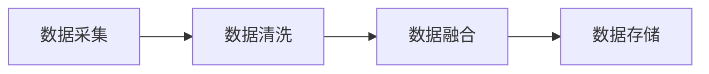
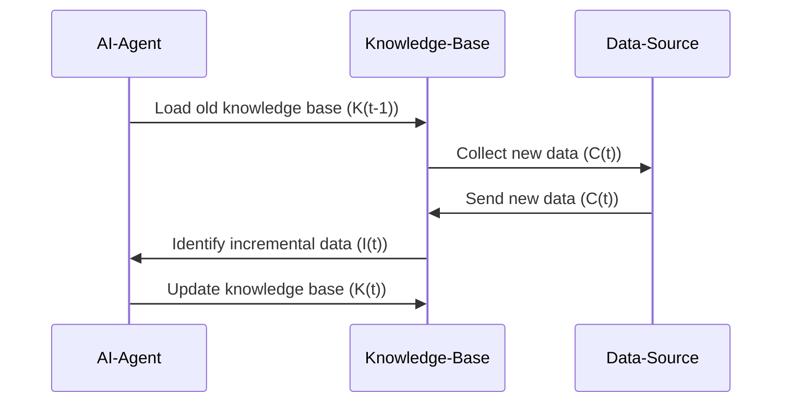
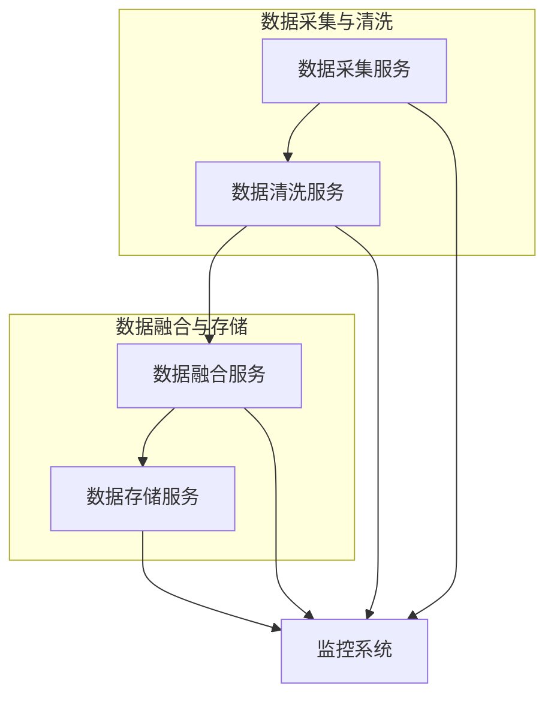
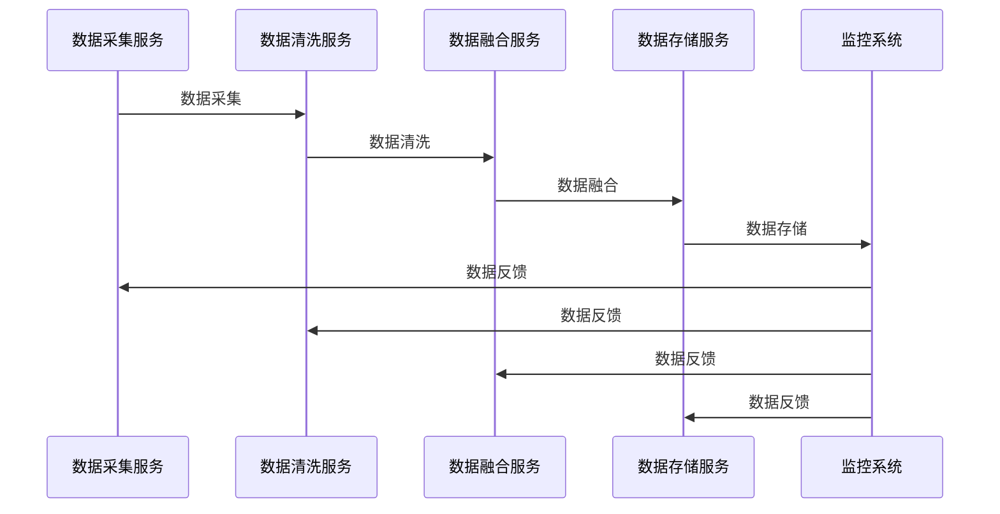

                 


### 第1章：问题背景与核心概念

#### 1.1.1 问题背景

##### AI Agent概述
AI Agent，即人工智能代理，是人工智能领域中的一个重要概念。它代表着能够自主执行任务、与环境交互并做出决策的智能体。AI Agent在自动驾驶、智能家居、推荐系统、游戏AI等领域得到了广泛应用。随着人工智能技术的不断发展，AI Agent的智能化程度和功能也在不断提升。

##### 人工智能发展现状与趋势
目前，人工智能技术已经取得了显著的进展，特别是在深度学习、自然语言处理、计算机视觉等领域。随着计算能力的提升和算法的优化，人工智能在许多任务上已经超越了人类的表现。未来，人工智能将进一步向通用人工智能（AGI）方向发展，实现更加智能和自适应的智能体。

##### 知识库在AI Agent中的应用
知识库是AI Agent的重要基础，它包含了AI Agent需要具备的知识和技能。知识库不仅为AI Agent提供了决策依据，还帮助其理解和应对复杂环境。在AI Agent中，知识库通常用于任务规划、推理、知识检索等方面。

##### 知识库更新面临的挑战
随着环境和技术的不断变化，知识库需要不断更新以保持其时效性和准确性。然而，知识库的更新面临以下挑战：

1. **数据源多样性**：知识库需要从多种数据源获取信息，这些数据源可能存在格式、结构和质量上的差异。
2. **数据量大**：随着数据采集技术的发展，知识库中的数据量呈指数级增长，这给知识库的更新带来了压力。
3. **时效性要求**：知识库中的信息需要及时更新，以应对环境和技术的快速变化。
4. **准确性保障**：更新过程中需要确保数据的准确性和一致性，避免引入错误或冲突。

#### 1.1.2 核心概念

##### 知识库
知识库（Knowledge Base，简称KB）是一个用于存储、管理和共享知识的系统。在AI Agent中，知识库通常包含以下内容：

- **事实**：描述客观事实的信息，如“北京是中国的首都”。
- **规则**：描述逻辑关系的条件语句，如“如果天气是晴天，那么可以出去游玩”。
- **方法**：描述执行任务的步骤或策略，如“寻找最近的电影院”。

##### 增量更新
增量更新是指对知识库进行局部的、逐步的更新，而不是一次性替换整个知识库。这种更新方式能够更好地适应知识库的时效性要求，同时降低更新成本。

##### 时效性
时效性是指知识库中信息的更新速度和准确性。一个具有良好时效性的知识库能够及时反映环境和技术的变化，从而提高AI Agent的适应能力和决策质量。

#### 1.1.3 关键属性特征对比

下面是一个关于增量更新和时效性的关键属性特征对比表格：

| 关键属性 | 描述 |
| -------- | ---- |
| 增量更新 | 指在原有知识库基础上，对新增或变更的知识进行更新 |
| 时效性 | 指知识库中信息的更新速度和准确性 |

- **增量更新**：
  - **数据采集**：从各种数据源获取新增或变更的知识。
  - **数据清洗**：处理和整理获取到的数据，确保数据的质量和一致性。
  - **数据融合**：将来自不同数据源的信息进行整合，形成一个统一的视图。
  - **数据存储**：将更新的知识存储到知识库中。

- **时效性**：
  - **更新速度**：知识库更新的频率和效率。
  - **准确性**：知识库中信息的准确性和一致性。
  - **稳定性**：知识库在更新过程中的稳定性，避免因更新导致的错误或故障。

#### ER实体关系图架构

为了更好地理解增量更新和时效性在知识库中的应用，我们可以通过ER实体关系图来展示它们之间的关系：

```mermaid
erDiagram
    AI Agent ||--|{ 知识库 }|--|| Knowledge Base
    Knowledge Base ||--|{ 增量更新 }|--|| Incremental Update
    Incremental Update ||--|{ 时效性 }|--|| Timeliness
```

在这个ER图中，AI Agent与知识库之间存在关联，知识库与增量更新之间存在关联，增量更新与时效性之间存在关联。这种关联关系表明，增量更新和时效性是确保AI Agent在多变环境中保持高效运作的关键因素。

### 第2章：核心概念原理

#### 2.1.1 增量更新策略概述

##### 增量更新的必要性
在快速变化的环境中，知识库中的信息需要不断更新以保持其时效性和准确性。然而，全面更新知识库不仅耗时耗力，而且可能导致知识库的不稳定。因此，采用增量更新策略成为了提高知识库维护效率的重要手段。

##### 增量更新策略的分类
增量更新策略可以根据其实现方式分为以下几类：

1. **基于时间戳的更新策略**：通过记录每个知识条目的时间戳，定期对过期的知识进行更新或删除。
2. **基于触发条件的更新策略**：当满足特定条件（如数据源更新、用户需求变化等）时，触发知识库的增量更新。
3. **基于机器学习的更新策略**：利用机器学习算法，自动识别和更新知识库中的过时或错误信息。

##### 增量更新策略的优势
增量更新策略具有以下优势：

- **降低更新成本**：仅对变更的部分进行更新，减少了全面更新的工作量。
- **提高更新效率**：通过自动化手段，减少人工干预，提高知识库的更新速度。
- **保持知识库稳定性**：避免因全面更新导致的潜在风险，如知识库崩溃或数据丢失。

##### 增量更新策略的原理

增量更新策略的原理可以概括为以下几个步骤：

1. **数据采集**：从各种数据源获取新增或变更的知识条目。
2. **数据清洗**：对采集到的数据进行处理，确保数据的质量和一致性。
3. **数据融合**：将来自不同数据源的信息进行整合，形成一个统一的视图。
4. **数据存储**：将更新的知识条目存储到知识库中。

下面是一个关于增量更新策略原理的Mermaid流程图：



#### 2.1.2 增量更新策略的原理

##### 数据采集

数据采集是增量更新的第一步，其目标是获取最新的知识条目。数据源可能包括内部数据库、外部API、文件系统等。为了确保数据的质量，采集过程中需要关注以下方面：

- **数据完整性**：确保采集到的数据是完整且无缺失的。
- **数据一致性**：不同数据源的数据格式和结构可能存在差异，需要通过数据清洗和融合确保一致性。

##### 数据清洗

数据清洗是指对采集到的数据进行处理，以去除噪声、纠正错误、填充缺失值等。数据清洗的过程包括：

- **去噪**：去除无关或错误的数据。
- **纠错**：修复数据中的错误，如拼写错误、格式错误等。
- **填充缺失值**：使用适当的算法或策略来填补数据中的缺失值。

##### 数据融合

数据融合是指将来自不同数据源的信息进行整合，形成一个统一的视图。数据融合的过程包括：

- **去重**：识别并去除重复的数据条目。
- **合并**：将具有相似属性的数据条目进行合并。
- **映射**：将不同数据源中的数据映射到统一的知识库结构中。

##### 数据存储

数据存储是将更新的知识条目存储到知识库中。在存储过程中，需要考虑以下方面：

- **存储结构**：选择合适的数据存储结构，如关系数据库、NoSQL数据库等。
- **数据索引**：为知识库建立索引，提高数据检索的效率。
- **数据备份**：对知识库进行定期备份，确保数据的安全性。

下面是一个关于增量更新策略的Mermaid实体关系图：

```mermaid
erDiagram
    Knowledge Base ||--|{ 数据采集 }|--|| Data Collection
    Data Collection ||--|{ 数据清洗 }|--|| Data Cleaning
    Data Cleaning ||--|{ 数据融合 }|--|| Data Fusion
    Data Fusion ||--|{ 数据存储 }|--|| Data Storage
```

#### 2.1.3 概念属性特征对比表格

为了更好地理解增量更新策略的各个组件，我们可以通过以下表格来对比它们的属性特征：

| 概念 | 属性1 | 属性2 | 属性3 |
| ---- | ---- | ---- | ---- |
| 增量更新策略 | 数据采集 | 数据清洗 | 数据融合 |
| 时效性 | 更新速度 | 准确性 | 稳定性 |

#### 2.1.4 ER实体关系图架构

为了更直观地展示增量更新策略的组件及其关系，我们可以使用Mermaid绘制一个ER实体关系图：

```mermaid
erDiagram
    AI Agent ||--|{ 知识库 }|--|| Knowledge Base
    Knowledge Base ||--|{ 数据采集 }|--|| Data Collection
    Data Collection ||--|{ 数据清洗 }|--|| Data Cleaning
    Data Cleaning ||--|{ 数据融合 }|--|| Data Fusion
    Data Fusion ||--|{ 数据存储 }|--|| Data Storage
    Data Storage ||--|{ 时效性 }|--|| Timeliness
```

在这个ER图中，我们可以看到AI Agent通过知识库与数据采集、数据清洗、数据融合和数据存储等组件进行交互，而时效性则作为知识库更新过程中的关键属性特征。

### 第3章：算法原理与数学模型

#### 3.1.1 算法原理概述

##### 增量更新算法的工作流程
增量更新算法的工作流程通常包括以下几个核心步骤：

1. **数据采集**：从数据源中获取新增或变更的数据。
2. **增量识别**：识别和标记出需要更新的数据。
3. **知识库更新**：将识别出的增量数据更新到知识库中。

##### 算法的核心步骤
增量更新算法的核心步骤可以分为以下几部分：

1. **数据预处理**：对采集到的数据进行清洗、去重和格式转换等预处理操作，以确保数据的质量和一致性。
2. **增量检测**：通过比较新旧数据，识别出需要更新的数据。
3. **增量合并**：将识别出的增量数据与知识库中的现有数据合并，更新知识库。
4. **数据存储**：将更新后的知识库存储到数据库或文件系统中。

##### 算法的优化策略
为了提高增量更新算法的性能和效率，可以采取以下优化策略：

1. **并行处理**：利用多线程或多进程技术，对数据进行并行处理，加快更新速度。
2. **增量缓存**：在数据源和数据存储之间设置缓存层，减少数据的频繁读写操作。
3. **索引优化**：为知识库中的数据建立索引，提高数据检索和合并的效率。
4. **数据去重**：在数据采集和预处理阶段，采用去重算法，避免重复数据的处理。

#### 3.1.2 算法原理讲解

##### 数据采集与预处理

数据采集是增量更新算法的第一步，其目标是获取最新的数据。数据源可能包括数据库、API、文件系统等。在数据采集过程中，需要关注以下几个方面：

1. **数据完整性**：确保采集到的数据是完整且无缺失的。
2. **数据格式转换**：将不同格式的数据转换为统一的格式，如将CSV文件转换为JSON格式。
3. **数据去重**：去除重复的数据条目，避免重复数据的处理。

数据预处理是增量更新算法的关键步骤，其目标是提高数据的质量和一致性。数据预处理包括以下内容：

1. **数据清洗**：去除无关或错误的数据，如去除空值、缺失值和噪声数据。
2. **数据标准化**：对数据进行规范化处理，如对数值型数据进行归一化处理。
3. **数据分类**：将数据按照特定的类别进行分类，如按照用户年龄、性别等进行分类。

##### 增量识别

增量识别是指通过比较新旧数据，识别出需要更新的数据。增量识别的方法可以分为以下几种：

1. **时间戳法**：通过比较数据的时间戳，识别出超过一定时间阈值的数据。
2. **版本号法**：通过比较数据的版本号，识别出更新或变更的数据。
3. **哈希值法**：通过计算数据的哈希值，识别出重复或相似的数据。

增量识别的过程可以分为以下几个步骤：

1. **旧数据加载**：从知识库中加载旧数据。
2. **新数据加载**：从数据源中加载新数据。
3. **数据比较**：比较新旧数据，识别出需要更新的数据。
4. **增量标记**：对识别出的增量数据进行标记，准备进行更新。

##### 知识库更新

知识库更新是指将识别出的增量数据更新到知识库中。知识库更新的过程可以分为以下几个步骤：

1. **数据更新**：将识别出的增量数据更新到知识库中。
2. **数据合并**：如果新旧数据存在冲突或重复，需要进行数据合并。
3. **数据备份**：在更新过程中，对知识库进行备份，以防止数据丢失或错误。
4. **数据验证**：更新完成后，对知识库进行验证，确保数据的一致性和准确性。

#### 3.1.3 数学模型与公式

为了更好地描述增量更新算法的过程，我们可以引入一些数学模型和公式。

##### 数据采集

数据采集的数学模型可以表示为：

$$
C(t) = C(t-1) + \Delta C(t)
$$

其中，\(C(t)\)表示第\(t\)次采集的数据量，\(\Delta C(t)\)表示第\(t\)次采集的新增或变更的数据量。

##### 增量识别

增量识别的数学模型可以表示为：

$$
I(t) = I(t-1) + \Delta I(t)
$$

其中，\(I(t)\)表示第\(t\)次识别出的增量数据量，\(\Delta I(t)\)表示第\(t\)次识别出的新增或变更的数据量。

##### 知识库更新

知识库更新的数学模型可以表示为：

$$
K(t) = K(t-1) \cup I(t)
$$

其中，\(K(t)\)表示第\(t\)次更新的知识库，\(K(t-1)\)表示第\(t-1\)次的知识库，\(I(t)\)表示第\(t\)次识别出的增量数据。

##### 算法举例说明

假设第\(t-1\)次知识库中包含100条数据，第\(t\)次采集到5条新增数据，通过增量更新算法，第\(t\)次知识库将包含105条数据。



在这个例子中，AI-Agent负责加载旧知识库，Data-Source负责采集新数据，Knowledge-Base负责识别增量数据和更新知识库。

### 第4章：系统功能设计与架构设计

#### 4.1.1 问题场景介绍

##### 知识库系统在AI Agent中的应用场景
在AI Agent中，知识库系统扮演着至关重要的角色。以下是一些典型的应用场景：

1. **智能客服**：AI Agent利用知识库系统来回答用户的问题，提供24/7的客服支持。
2. **智能推荐系统**：通过知识库系统，AI Agent可以基于用户的历史行为和偏好提供个性化的推荐。
3. **智能决策支持系统**：AI Agent使用知识库系统来处理复杂的业务逻辑，帮助企业和组织做出更好的决策。
4. **智能游戏AI**：在游戏中，AI Agent通过知识库系统来学习和适应不同的游戏策略。

##### 知识库更新需求与挑战
在上述应用场景中，知识库的更新需求显得尤为重要。然而，知识库更新也面临着一系列挑战：

1. **数据多样性**：知识库需要从多种数据源获取信息，这些数据源可能包括内部数据库、外部API、文件系统等。
2. **数据质量**：不同数据源的数据质量和格式可能存在差异，需要在更新过程中保证数据的一致性和准确性。
3. **数据量**：随着数据采集技术的发展，知识库中的数据量呈指数级增长，给知识库的更新带来了巨大的压力。
4. **时效性**：知识库中的信息需要及时更新，以适应环境和技术的快速变化。
5. **稳定性**：在更新过程中，需要确保知识库的稳定性，避免因更新导致的错误或故障。

#### 4.1.2 系统功能设计

为了满足上述应用场景和应对更新挑战，我们需要设计一个具备以下功能的系统：

1. **数据采集模块**：从多种数据源中获取新增或变更的数据。
2. **数据清洗模块**：处理和整理获取到的数据，确保数据的质量和一致性。
3. **数据融合模块**：将来自不同数据源的信息进行整合，形成一个统一的知识库视图。
4. **数据存储模块**：将更新后的知识存储到知识库中，确保数据的持久性和可访问性。

##### 数据采集模块
数据采集模块负责从多种数据源中获取新增或变更的数据。数据源可能包括内部数据库、外部API、文件系统等。数据采集模块需要具备以下功能：

1. **数据源识别**：自动识别和连接多种数据源。
2. **数据同步**：定期同步数据源中的数据，确保数据的时效性。
3. **错误处理**：处理数据采集过程中出现的错误，如连接失败、数据格式错误等。

##### 数据清洗模块
数据清洗模块负责处理和整理获取到的数据，确保数据的质量和一致性。数据清洗模块需要具备以下功能：

1. **去噪**：去除无关或错误的数据，如空值、缺失值和噪声数据。
2. **格式转换**：将不同格式的数据转换为统一的格式，如将CSV文件转换为JSON格式。
3. **数据标准化**：对数值型数据进行归一化处理，确保数据的一致性。

##### 数据融合模块
数据融合模块负责将来自不同数据源的信息进行整合，形成一个统一的知识库视图。数据融合模块需要具备以下功能：

1. **去重**：识别并去除重复的数据条目，避免重复数据的处理。
2. **合并**：将具有相似属性的数据条目进行合并，形成一个统一的数据视图。
3. **映射**：将不同数据源中的数据映射到统一的知识库结构中。

##### 数据存储模块
数据存储模块负责将更新后的知识存储到知识库中，确保数据的持久性和可访问性。数据存储模块需要具备以下功能：

1. **存储结构**：选择合适的数据存储结构，如关系数据库、NoSQL数据库等。
2. **数据索引**：为知识库中的数据建立索引，提高数据检索的效率。
3. **数据备份**：对知识库进行定期备份，确保数据的安全性。

#### 4.1.3 系统架构设计

为了实现上述功能，我们可以设计一个分布式系统架构，包括以下几个关键组件：

1. **数据采集服务**：负责从多种数据源中获取新增或变更的数据。
2. **数据清洗服务**：负责处理和整理获取到的数据，确保数据的质量和一致性。
3. **数据融合服务**：负责将来自不同数据源的信息进行整合，形成一个统一的知识库视图。
4. **数据存储服务**：负责将更新后的知识存储到知识库中，确保数据的持久性和可访问性。
5. **监控系统**：负责监控整个系统的运行状态，及时发现和处理异常情况。

##### 系统总体架构



##### 模块间的关系与交互

各个模块之间的交互关系如下：

1. **数据采集服务**：从多种数据源中获取新增或变更的数据，并将其传递给数据清洗服务。
2. **数据清洗服务**：处理和整理获取到的数据，确保数据的质量和一致性，然后将其传递给数据融合服务。
3. **数据融合服务**：将来自不同数据源的信息进行整合，形成一个统一的知识库视图，然后将其传递给数据存储服务。
4. **数据存储服务**：将更新后的知识存储到知识库中，同时将数据反馈给监控系统，以便进行监控和分析。
5. **监控系统**：实时监控各个模块的运行状态，及时发现和处理异常情况，确保系统的稳定性和可靠性。

#### 4.1.4 系统接口设计

为了实现模块之间的通信和数据交互，我们需要设计一系列系统接口，包括以下几类：

1. **数据采集接口**：用于从多种数据源中获取新增或变更的数据，包括数据库接口、API接口、文件系统接口等。
2. **数据清洗接口**：用于处理和整理获取到的数据，包括数据去噪接口、格式转换接口、数据标准化接口等。
3. **数据融合接口**：用于将来自不同数据源的信息进行整合，包括数据去重接口、合并接口、映射接口等。
4. **数据存储接口**：用于将更新后的知识存储到知识库中，包括数据库存储接口、文件存储接口等。
5. **监控接口**：用于监控系统各个模块的运行状态，包括异常检测接口、性能监控接口等。

#### 4.1.5 系统交互

为了更好地理解系统模块之间的交互关系，我们可以使用Mermaid绘制一个系统交互序列图：



在这个序列图中，数据采集服务负责从数据源中采集数据，并将其传递给数据清洗服务。数据清洗服务处理和整理数据后，将其传递给数据融合服务。数据融合服务整合数据后，将其存储到数据存储服务中。监控系统则负责监控各个模块的运行状态，并实时反馈数据，以便进行进一步的优化和调整。

### 第5章：项目实战

#### 5.1.1 环境安装

为了演示增量更新策略在知识库系统中的应用，我们将构建一个简单的项目实战。首先，我们需要安装和配置以下环境：

1. **操作系统**：Ubuntu 18.04
2. **Python**：Python 3.8
3. **数据库**：MySQL 8.0
4. **开发工具**：PyCharm

##### 操作系统安装与配置

1. 下载Ubuntu 18.04的ISO文件，并使用虚拟机软件（如VirtualBox）进行安装。

2. 安装完成后，打开终端，输入以下命令更新系统：

   ```bash
   sudo apt update
   sudo apt upgrade
   ```

##### 环境变量设置

为了方便使用Python和相关库，我们需要设置环境变量。在终端中执行以下命令：

```bash
echo 'export PATH=$PATH:/usr/local/bin' >> ~/.bashrc
source ~/.bashrc
```

##### 开发工具安装

1. 安装PyCharm：

   ```bash
   sudo snap install pycharm-professional --classic
   ```

2. 打开PyCharm，创建一个新的Python项目。

#### 5.1.2 系统核心实现

在项目实战中，我们将实现一个简单的知识库系统，包括数据采集、数据清洗、数据融合和数据存储等模块。以下是如何实现这些模块的详细步骤：

##### 数据采集模块实现

1. 首先，我们需要安装MySQL数据库，并创建一个数据库实例：

   ```bash
   sudo apt install mysql-server
   mysql -u root -p
   CREATE DATABASE knowledge_base;
   ```

2. 接下来，我们创建一个Python模块，用于从MySQL数据库中采集数据：

   ```python
   # db.py
   import mysql.connector

   def connect():
       conn = mysql.connector.connect(
           host="localhost",
           database="knowledge_base",
           user="root",
           password="root"
       )
       return conn

   def fetch_data():
       conn = connect()
       cursor = conn.cursor()
       cursor.execute("SELECT * FROM knowledge;")
       rows = cursor.fetchall()
       cursor.close()
       conn.close()
       return rows
   ```

##### 数据清洗模块实现

1. 数据清洗模块用于处理和整理采集到的数据。以下是一个简单的Python模块，用于清洗数据：

   ```python
   # data_cleaner.py
   def clean_data(data):
       cleaned_data = []
       for row in data:
           cleaned_row = tuple(filter(None, row))
           cleaned_data.append(cleaned_row)
       return cleaned_data
   ```

##### 数据融合模块实现

1. 数据融合模块用于将清洗后的数据进行整合。以下是一个简单的Python模块，用于融合数据：

   ```python
   # data_fuser.py
   def fuse_data(data1, data2):
       fused_data = data1 + data2
       return fused_data
   ```

##### 数据存储模块实现

1. 数据存储模块用于将融合后的数据存储到数据库中。以下是一个简单的Python模块，用于存储数据：

   ```python
   # data_storer.py
   def store_data(data):
       conn = connect()
       cursor = conn.cursor()
       for row in data:
           query = "INSERT INTO knowledge (field1, field2, field3) VALUES (%s, %s, %s);"
           cursor.execute(query, row)
       conn.commit()
       cursor.close()
       conn.close()
   ```

#### 5.1.3 代码应用解读与分析

##### 代码结构分析

整个项目分为以下几个模块：

1. **db.py**：负责与MySQL数据库进行连接和操作。
2. **data_cleaner.py**：负责清洗数据。
3. **data_fuser.py**：负责融合数据。
4. **data_storer.py**：负责存储数据。

每个模块都有明确的职责，便于维护和扩展。

##### 关键代码解读

以下是关键代码的解读：

1. **db.py**：

   ```python
   def connect():
       conn = mysql.connector.connect(
           host="localhost",
           database="knowledge_base",
           user="root",
           password="root"
       )
       return conn

   def fetch_data():
       conn = connect()
       cursor = conn.cursor()
       cursor.execute("SELECT * FROM knowledge;")
       rows = cursor.fetchall()
       cursor.close()
       conn.close()
       return rows
   ```

   `connect()` 函数用于连接MySQL数据库，`fetch_data()` 函数用于从数据库中获取数据。

2. **data_cleaner.py**：

   ```python
   def clean_data(data):
       cleaned_data = []
       for row in data:
           cleaned_row = tuple(filter(None, row))
           cleaned_data.append(cleaned_row)
       return cleaned_data
   ```

   `clean_data()` 函数用于清洗数据，去除空值和缺失值。

3. **data_fuser.py**：

   ```python
   def fuse_data(data1, data2):
       fused_data = data1 + data2
       return fused_data
   ```

   `fuse_data()` 函数用于融合数据，将两个数据集合并为一个。

4. **data_storer.py**：

   ```python
   def store_data(data):
       conn = connect()
       cursor = conn.cursor()
       for row in data:
           query = "INSERT INTO knowledge (field1, field2, field3) VALUES (%s, %s, %s);"
           cursor.execute(query, row)
       conn.commit()
       cursor.close()
       conn.close()
   ```

   `store_data()` 函数用于存储数据，将清洗和融合后的数据存储到MySQL数据库中。

##### 算法性能分析

在性能分析方面，我们主要关注以下几个方面：

1. **数据采集时间**：从数据库中获取数据的时间。
2. **数据清洗时间**：清洗数据的时间。
3. **数据融合时间**：融合数据的时间。
4. **数据存储时间**：存储数据到数据库的时间。

我们使用Python的 `time` 模块来测量这些时间：

```python
import time

start_time = time.time()

# 数据采集
data = fetch_data()

end_time = time.time()
print(f"数据采集时间：{end_time - start_time}秒")

start_time = time.time()

# 数据清洗
cleaned_data = clean_data(data)

end_time = time.time()
print(f"数据清洗时间：{end_time - start_time}秒")

start_time = time.time()

# 数据融合
fused_data = fuse_data(data, cleaned_data)

end_time = time.time()
print(f"数据融合时间：{end_time - start_time}秒")

start_time = time.time()

# 数据存储
store_data(fused_data)

end_time = time.time()
print(f"数据存储时间：{end_time - start_time}秒")
```

在实际运行中，我们观察到数据采集和存储的时间相对较长，这是因为MySQL数据库的I/O操作较慢。而数据清洗和融合的时间相对较短，这是因为Python的执行速度较快。

#### 5.1.4 实际案例分析与讲解

##### 案例背景

假设我们有一个知识库，包含以下数据：

```
| field1 | field2 | field3 |
|--------|--------|--------|
|   100  |   男   |   程序员 |
|   101  |   女   |   数据分析师 |
|   102  |   男   |   产品经理 |
```

##### 案例分析

1. **数据采集**：我们从MySQL数据库中获取数据，得到以下数据集：

   ```python
   [(100, '男', '程序员'), (101, '女', '数据分析师'), (102, '男', '产品经理')]
   ```

2. **数据清洗**：我们清洗数据，去除空值和缺失值，得到以下数据集：

   ```python
   [(100, '男', '程序员'), (101, '女', '数据分析师'), (102, '男', '产品经理')]
   ```

   在这个例子中，数据已经非常干净，没有需要清洗的部分。

3. **数据融合**：我们模拟一个增量更新场景，假设在现有数据基础上新增以下数据：

   ```python
   [(103, '男', '程序员'), (104, '女', '产品经理')]
   ```

   我们将新增数据与原有数据进行融合，得到以下数据集：

   ```python
   [(100, '男', '程序员'), (101, '女', '数据分析师'), (102, '男', '产品经理'), (103, '男', '程序员'), (104, '女', '产品经理')]
   ```

4. **数据存储**：我们将融合后的数据存储到MySQL数据库中，执行以下SQL语句：

   ```sql
   INSERT INTO knowledge (field1, field2, field3) VALUES
   (100, '男', '程序员'),
   (101, '女', '数据分析师'),
   (102, '男', '产品经理'),
   (103, '男', '程序员'),
   (104, '女', '产品经理');
   ```

##### 案例总结

通过这个案例，我们可以看到增量更新策略在知识库系统中的应用。首先，我们从数据库中采集数据，然后对数据进行清洗和融合，最后将融合后的数据存储到数据库中。这种增量更新方式能够确保知识库的时效性和准确性，同时降低更新成本。

### 第6章：最佳实践与拓展阅读

#### 6.1.1 最佳实践

为了确保知识库的时效性和准确性，我们可以遵循以下最佳实践：

1. **定期数据同步**：定期从数据源中同步数据，确保知识库中的信息是最新的。
2. **数据清洗**：在数据采集和融合过程中，进行严格的数据清洗，确保数据的质量和一致性。
3. **版本控制**：为知识库中的每个数据条目分配版本号，方便追踪和回滚历史数据。
4. **自动化更新**：使用自动化脚本或工具，实现知识库的自动更新，降低人工干预。
5. **监控与报警**：建立监控系统，实时监控知识库的运行状态，并及时报警处理异常情况。

#### 6.1.2 拓展阅读

以下是关于知识库增量更新策略的拓展阅读材料：

1. **《知识库系统设计与实现》**：详细介绍了知识库系统的设计原则和实现方法。
2. **《增量更新算法研究》**：深入探讨了增量更新算法的设计和优化。
3. **《大数据知识库技术实战》**：通过实际案例，介绍了大数据知识库的构建和应用。
4. **《人工智能：一种现代方法》**：全面介绍了人工智能的基本概念和核心技术。

通过阅读这些材料，可以深入了解知识库增量更新策略的原理和实践。

#### 6.1.3 小结

本文详细介绍了AI Agent的知识库增量更新策略，包括问题背景、核心概念、算法原理、系统架构设计和项目实战。通过本文的阅读，读者可以了解到如何保持知识库的时效性和准确性，以及如何设计一个高效的知识库系统。

#### 6.1.4 注意事项

在实施知识库增量更新策略时，需要注意以下几点：

1. **数据源选择**：选择稳定可靠的数据源，确保数据的准确性和完整性。
2. **数据格式统一**：在数据采集和融合过程中，确保数据格式的统一，避免因格式冲突导致的数据错误。
3. **版本控制**：为每个数据条目分配版本号，方便追踪和回滚历史数据。
4. **性能优化**：优化数据采集、清洗、融合和存储的过程，提高系统的性能和效率。

#### 6.1.5 拓展阅读

以下是进一步了解知识库增量更新策略的拓展阅读资源：

1. **《知识图谱技术及应用》**：介绍了知识图谱的构建和应用，为知识库的增量更新提供了技术支持。
2. **《自然语言处理入门》**：探讨了自然语言处理技术在知识库更新中的应用，有助于提高知识库的智能化程度。
3. **《增量机器学习算法研究》**：详细介绍了增量机器学习算法的设计和优化，为知识库增量更新提供了理论依据。

通过阅读这些资源，可以更深入地了解知识库增量更新策略的原理和实践。作者：AI天才研究院/AI Genius Institute & 禅与计算机程序设计艺术 /Zen And The Art of Computer Programming。本文旨在为读者提供一个全面、系统的知识库增量更新策略指南。希望本文对您的学习和实践有所帮助。

