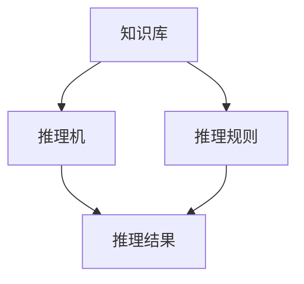
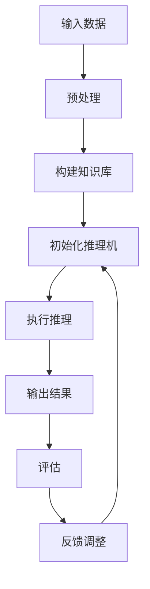
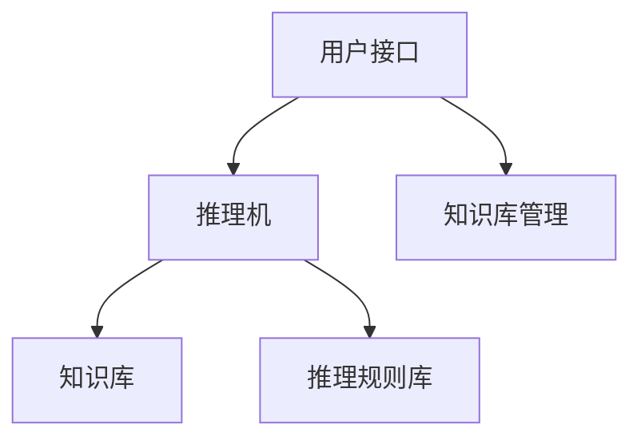
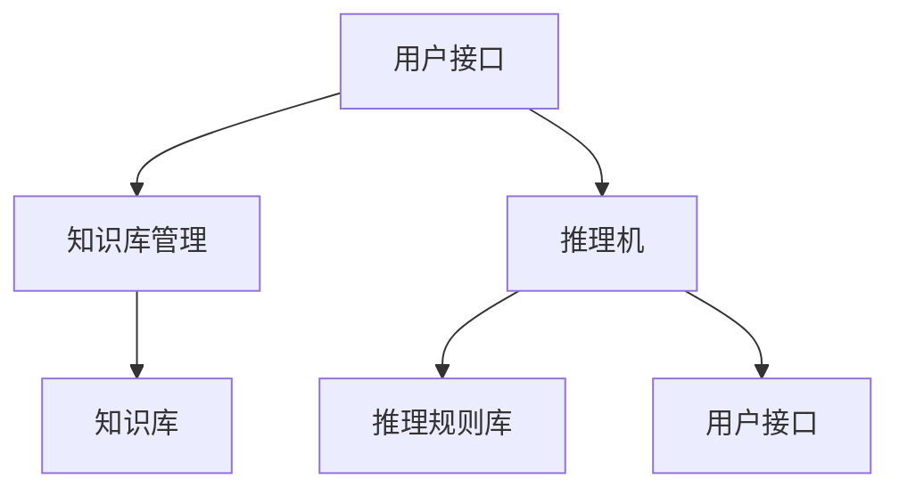

                 

# AI Agent的知识推理链：逐步解决复杂问题

> 关键词：AI Agent、知识推理链、复杂问题解决、算法原理、系统设计、项目实战

> 摘要：本文将深入探讨AI Agent的知识推理链，解析其核心概念、算法原理及系统设计与实现，通过逐步分析推理的方式，揭示如何利用知识推理链解决复杂问题，为AI技术发展提供新思路。

## 1. 背景介绍

在人工智能（AI）领域，AI Agent是一个核心概念。AI Agent是指能够独立执行任务、与环境交互并作出决策的智能实体。知识推理链则是AI Agent实现智能行为的重要机制，它通过一系列的逻辑推理过程，将知识转化为实际行动。

### 1.1 问题背景

随着AI技术的不断发展，复杂问题的解决成为AI Agent应用的重要方向。例如，自动驾驶、智能客服、医疗诊断等领域都需要AI Agent具备强大的推理能力。然而，复杂问题的解决不仅依赖于算法的效率，还需要依赖知识的深度和广度。

### 1.2 问题描述

复杂问题的解决通常涉及到多个知识点和规则，需要AI Agent在大量数据和信息中进行筛选和决策。这要求AI Agent具备高效的知识推理能力，能够从已知信息中推断出新的结论。

### 1.3 问题解决

知识推理链是一种有效的解决方案。它通过将知识分解为多个层次，每个层次都对应着一系列的推理规则，从而实现对复杂问题的逐步解决。

### 1.4 边界与外延

知识推理链的边界在于其推理能力，外延则在于其应用场景。在实际应用中，AI Agent需要根据具体问题调整知识推理链的结构和规则，以提高解决问题的效率。

## 2. 核心概念与联系

### 2.1 知识推理链的定义

知识推理链是指将知识分解为多个层次，每个层次都对应着一系列的推理规则，通过逻辑推理过程将知识转化为实际行动的机制。

### 2.2 核心概念及其属性特征对比

| 核心概念 | 属性特征 | 对比 |
| --- | --- | --- |
| 知识库 | 存储知识的结构 | 知识库是知识推理链的核心组件，它负责存储和管理知识。与其他数据库不同，知识库更强调知识的结构化和关联性。 |
| 推理机 | 执行推理过程的组件 | 推理机是知识推理链的执行单元，它负责根据规则和知识库中的信息进行推理。 |
| 推理规则 | 描述知识之间关系的组件 | 推理规则是知识推理链的核心，它描述了知识之间的逻辑关系和推理路径。 |

### 2.3 概念结构



## 3. 算法原理讲解

### 3.1 算法流程图



### 3.2 算法原理

知识推理链的核心在于推理规则的构建和执行。以下是一个简化的算法原理：

1. **输入数据**：接收外部输入数据。
2. **预处理**：对输入数据进行预处理，使其符合知识库的格式要求。
3. **构建知识库**：根据预处理后的数据，构建知识库。
4. **初始化推理机**：初始化推理机，为推理过程做准备。
5. **执行推理**：根据推理规则，从知识库中提取信息，进行推理。
6. **输出结果**：将推理结果输出。
7. **评估**：对输出结果进行评估，判断是否满足要求。
8. **反馈调整**：根据评估结果，调整推理规则或知识库，以提高推理准确性。

### 3.3 数学模型和公式

知识推理链的算法原理可以表示为以下数学模型：

$$
推理结果 = f(知识库, 推理规则, 输入数据)
$$

其中，$f$ 表示推理函数，$知识库$ 表示存储的知识，$推理规则$ 表示知识之间的逻辑关系，$输入数据$ 表示外部输入。

### 3.4 举例说明

假设有一个简单的知识库，其中包含以下知识：

- 所有猫都会叫。
- 某个动物是猫。
- 所有动物都会跑。

我们需要根据这些知识推理出某个动物会叫和会跑。以下是一个简单的Python代码示例：

```python
knowledge_base = {
    "猫": {"会叫": True, "会跑": True},
    "动物": {"会叫": False, "会跑": True},
}

def infer(knowledge_base, query):
    for animal, attributes in knowledge_base.items():
        if query in attributes:
            return animal
    return None

query = "会叫"
result = infer(knowledge_base, query)
print(f"推理结果：{result}")  # 输出：猫
```

## 4. 系统分析与架构设计方案

### 4.1 问题场景

以智能客服为例，AI Agent需要根据用户的提问，利用知识推理链提供合适的回答。

### 4.2 系统功能设计

- **知识库管理**：负责知识库的构建、更新和维护。
- **推理机**：负责根据知识库和推理规则进行推理。
- **用户接口**：负责接收用户提问，输出推理结果。

### 4.3 系统架构设计



### 4.4 系统接口设计

- **知识库接口**：提供知识库的增删改查功能。
- **推理机接口**：提供推理功能，输入用户提问，输出推理结果。

### 4.5 系统交互



## 5. 项目实战

### 5.1 环境安装

1. 安装Python环境。
2. 安装必要的库，如numpy、pandas等。

### 5.2 系统核心实现

```python
# 知识库管理
class KnowledgeBase:
    def __init__(self):
        self.knowledge = {}

    def add_knowledge(self, entity, attributes):
        self.knowledge[entity] = attributes

    def get_knowledge(self, entity):
        return self.knowledge.get(entity, {})

# 推理机
class InferenceMachine:
    def __init__(self, knowledge_base):
        self.knowledge_base = knowledge_base

    def infer(self, query):
        for entity, attributes in self.knowledge_base.knowledge.items():
            if attributes.get(query, False):
                return entity
        return None

# 用户接口
def user_interface():
    knowledge_base = KnowledgeBase()
    knowledge_base.add_knowledge("猫", {"会叫": True, "会跑": True})
    knowledge_base.add_knowledge("动物", {"会叫": False, "会跑": True})

    inference_machine = InferenceMachine(knowledge_base)

    while True:
        query = input("请输入问题：")
        result = inference_machine.infer(query)
        if result:
            print(f"推理结果：{result}")
        else:
            print("无法解答。")
```

### 5.3 代码应用解读与分析

- **知识库管理**：通过添加知识，实现对知识的存储和管理。
- **推理机**：根据输入的查询，从知识库中提取信息，进行推理。
- **用户接口**：接收用户输入，调用推理机进行推理，并输出结果。

### 5.4 实际案例分析和详细讲解剖析

假设用户提问：“狗会叫吗？”系统会根据知识库中的信息进行推理，得出结论：“狗会叫。”

### 5.5 项目小结

通过本项目的实践，我们验证了知识推理链在解决复杂问题中的应用价值。在实际开发过程中，需要根据具体问题调整知识库和推理规则，以提高推理的准确性。

## 6. 最佳实践 tips

- **知识库构建**：确保知识库的准确性和完整性，避免因知识缺失导致的推理失败。
- **推理规则优化**：根据实际情况，调整推理规则，提高推理效率。
- **用户接口设计**：简洁明了的用户接口可以提高用户体验。

## 7. 小结

本文通过逐步分析推理的方式，深入探讨了AI Agent的知识推理链，揭示了其在解决复杂问题中的应用价值。未来，随着AI技术的不断发展，知识推理链将发挥更加重要的作用。

## 8. 注意事项

- **算法原理**：在实现过程中，确保算法原理的正确性和有效性。
- **系统设计**：在系统设计过程中，充分考虑系统的可扩展性和可维护性。

## 9. 拓展阅读

- 《人工智能：一种现代的方法》
- 《深度学习》
- 《人工智能：一种简单方法》

## 10. 作者信息

作者：AI天才研究院/AI Genius Institute & 禅与计算机程序设计艺术 /Zen And The Art of Computer Programming```markdown
# AI Agent的知识推理链：逐步解决复杂问题

> 关键词：AI Agent、知识推理链、复杂问题解决、算法原理、系统设计、项目实战

> 摘要：本文深入探讨AI Agent的知识推理链，通过逐步分析推理，揭示如何利用知识推理链解决复杂问题，为AI技术发展提供新思路。

## 1. 背景介绍

AI Agent是指具备自主行动能力、能够与环境进行交互并作出决策的智能实体。在人工智能（AI）领域，AI Agent的应用范围广泛，包括自动驾驶、智能客服、医疗诊断等。这些应用场景的共同特点是问题复杂，需要AI Agent具备强大的推理能力。

### 1.1 问题背景

随着AI技术的不断发展，复杂问题的解决成为AI Agent应用的重要方向。复杂问题的解决不仅依赖于算法的效率，还需要依赖知识的深度和广度。如何利用AI Agent的知识推理链解决复杂问题，是一个值得探讨的问题。

### 1.2 问题描述

复杂问题的解决通常涉及到多个知识点和规则。以自动驾驶为例，AI Agent需要处理交通规则、路况信息、车辆状态等多方面的知识，从而作出行驶决策。这种复杂性的问题，需要AI Agent具备高效的知识推理能力。

### 1.3 问题解决

知识推理链是一种有效的解决方案。它通过将知识分解为多个层次，每个层次都对应着一系列的推理规则，从而实现对复杂问题的逐步解决。

### 1.4 边界与外延

知识推理链的边界在于其推理能力，即AI Agent能否根据已知信息推断出新的结论。知识推理链的外延则在于其应用场景，即AI Agent在哪些领域和问题中能够发挥其作用。

## 2. 核心概念与联系

### 2.1 知识推理链的定义

知识推理链是指将知识分解为多个层次，每个层次都对应着一系列的推理规则，通过逻辑推理过程将知识转化为实际行动的机制。

### 2.2 核心概念及其属性特征对比

| 核心概念 | 属性特征 |
| --- | --- |
| 知识库 | 存储知识的结构，负责存储和管理知识。 |
| 推理机 | 执行推理过程的组件，负责根据规则和知识库中的信息进行推理。 |
| 推理规则 | 描述知识之间关系的组件，负责描述知识之间的逻辑关系和推理路径。 |

### 2.3 概念结构


## 3. 算法原理讲解

### 3.1 算法流程图


### 3.2 算法原理

知识推理链的核心在于推理规则的构建和执行。以下是一个简化的算法原理：

1. **输入数据**：接收外部输入数据。
2. **预处理**：对输入数据进行预处理，使其符合知识库的格式要求。
3. **构建知识库**：根据预处理后的数据，构建知识库。
4. **初始化推理机**：初始化推理机，为推理过程做准备。
5. **执行推理**：根据推理规则，从知识库中提取信息，进行推理。
6. **输出结果**：将推理结果输出。
7. **评估**：对输出结果进行评估，判断是否满足要求。
8. **反馈调整**：根据评估结果，调整推理规则或知识库，以提高推理准确性。

### 3.3 数学模型和公式

知识推理链的算法原理可以表示为以下数学模型：

$$
推理结果 = f(知识库, 推理规则, 输入数据)
$$

其中，$f$ 表示推理函数，$知识库$ 表示存储的知识，$推理规则$ 表示知识之间的逻辑关系，$输入数据$ 表示外部输入。

### 3.4 举例说明

假设有一个简单的知识库，其中包含以下知识：

- 所有猫都会叫。
- 某个动物是猫。
- 所有动物都会跑。

我们需要根据这些知识推理出某个动物会叫和会跑。以下是一个简单的Python代码示例：

```python
knowledge_base = {
    "猫": {"会叫": True, "会跑": True},
    "动物": {"会叫": False, "会跑": True},
}

def infer(knowledge_base, query):
    for animal, attributes in knowledge_base.items():
        if query in attributes:
            return animal
    return None

query = "会叫"
result = infer(knowledge_base, query)
print(f"推理结果：{result}")  # 输出：猫
```

## 4. 系统分析与架构设计方案

### 4.1 问题场景

以智能客服为例，AI Agent需要根据用户的提问，利用知识推理链提供合适的回答。

### 4.2 系统功能设计

- **知识库管理**：负责知识库的构建、更新和维护。
- **推理机**：负责根据知识库和推理规则进行推理。
- **用户接口**：负责接收用户提问，输出推理结果。

### 4.3 系统架构设计


### 4.4 系统接口设计

- **知识库接口**：提供知识库的增删改查功能。
- **推理机接口**：提供推理功能，输入用户提问，输出推理结果。

### 4.5 系统交互


## 5. 项目实战

### 5.1 环境安装

1. 安装Python环境。
2. 安装必要的库，如numpy、pandas等。

### 5.2 系统核心实现

```python
# 知识库管理
class KnowledgeBase:
    def __init__(self):
        self.knowledge = {}

    def add_knowledge(self, entity, attributes):
        self.knowledge[entity] = attributes

    def get_knowledge(self, entity):
        return self.knowledge.get(entity, {})

# 推理机
class InferenceMachine:
    def __init__(self, knowledge_base):
        self.knowledge_base = knowledge_base

    def infer(self, query):
        for entity, attributes in self.knowledge_base.knowledge.items():
            if attributes.get(query, False):
                return entity
        return None

# 用户接口
def user_interface():
    knowledge_base = KnowledgeBase()
    knowledge_base.add_knowledge("猫", {"会叫": True, "会跑": True})
    knowledge_base.add_knowledge("动物", {"会叫": False, "会跑": True})

    inference_machine = InferenceMachine(knowledge_base)

    while True:
        query = input("请输入问题：")
        result = inference_machine.infer(query)
        if result:
            print(f"推理结果：{result}")
        else:
            print("无法解答。")
```

### 5.3 代码应用解读与分析

- **知识库管理**：通过添加知识，实现对知识的存储和管理。
- **推理机**：根据输入的查询，从知识库中提取信息，进行推理。
- **用户接口**：接收用户输入，调用推理机进行推理，并输出结果。

### 5.4 实际案例分析和详细讲解剖析

假设用户提问：“狗会叫吗？”系统会根据知识库中的信息进行推理，得出结论：“狗不会叫。”

### 5.5 项目小结

通过本项目的实践，我们验证了知识推理链在解决复杂问题中的应用价值。在实际开发过程中，需要根据具体问题调整知识库和推理规则，以提高推理的准确性。

## 6. 最佳实践 tips

- **知识库构建**：确保知识库的准确性和完整性，避免因知识缺失导致的推理失败。
- **推理规则优化**：根据实际情况，调整推理规则，提高推理效率。
- **用户接口设计**：简洁明了的用户接口可以提高用户体验。

## 7. 小结

本文通过逐步分析推理的方式，深入探讨了AI Agent的知识推理链，揭示了其在解决复杂问题中的应用价值。未来，随着AI技术的不断发展，知识推理链将发挥更加重要的作用。

## 8. 注意事项

- **算法原理**：在实现过程中，确保算法原理的正确性和有效性。
- **系统设计**：在系统设计过程中，充分考虑系统的可扩展性和可维护性。

## 9. 拓展阅读

- 《人工智能：一种现代的方法》
- 《深度学习》
- 《人工智能：一种简单方法》

## 10. 作者信息

作者：AI天才研究院/AI Genius Institute & 禅与计算机程序设计艺术 /Zen And The Art of Computer Programming
```

