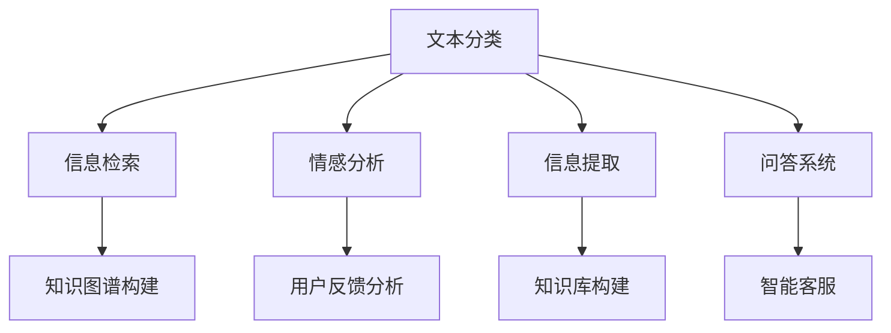

                 

## 引言

### 1.1 问题背景

随着互联网和大数据技术的快速发展，非结构化文本数据如自然语言文本、图像、音频等在各个领域中的产生量呈现爆发式增长。这类数据具有复杂性、多样性和不确定性等特点，给传统的数据处理方法带来了极大的挑战。特别是对于人工智能（AI）Agent来说，如何从这些非结构化文本中高效、准确地获取信息，成为了一个亟待解决的问题。

### 1.2 问题描述

非结构化文本的数据格式和内容缺乏统一性，这使得直接应用传统的数据挖掘和机器学习技术变得困难。本文将探讨如何利用AI Agent从非结构化文本中提取信息，主要涉及以下几个问题：

- **数据预处理**：如何对非结构化文本进行有效的预处理，以便后续的分析和处理？
- **信息提取**：如何从非结构化文本中识别和提取出有用的信息？
- **知识表示**：如何将提取的信息进行结构化表示，以便于存储、查询和利用？
- **应用优化**：如何在特定的应用场景中，对上述技术进行优化，提高知识获取的效率和准确性？

### 1.3 问题解决

本文将介绍一系列方法和技术，包括自然语言处理（NLP）、知识图谱、信息检索等，以实现AI Agent对非结构化文本的深度理解和知识提取。具体来说，我们将从以下几个方面进行探讨：

1. **自然语言处理基础**：介绍NLP的基本概念、技术手段和应用场景，包括词性标注、命名实体识别、分词技术和词向量表示等。
2. **知识图谱构建**：探讨知识图谱的定义、类型、构建方法和应用，以及知识图谱表示与存储的相关技术。
3. **信息检索算法**：介绍信息检索的基本概念、任务和评价标准，以及基本检索算法和深度学习在信息检索中的应用。
4. **AI Agent知识获取流程**：总结上述技术，给出一个完整的AI Agent知识获取流程，并讨论其在实际应用中的优化方法。

### 1.4 边界与外延

本文的研究主要聚焦于文本数据的处理，包括但不限于新闻、报告、论文等。同时，本文将探讨不同类型文本的数据处理方法和优化策略，以期为非结构化文本处理领域提供有益的参考。

### 1.5 概念结构与核心要素组成

- **非结构化文本**：指无固定格式和结构的数据，如自然语言文本。
- **AI Agent**：指具备智能自主行为和决策能力的计算机程序。
- **知识获取**：指从数据中提取有用信息，构建知识库的过程。
- **方法与技术**：包括NLP、知识图谱、信息检索等。

## 1.6 本章小结

本章对《AI Agent的知识获取：从非结构化文本中提取信息》进行了简要的引言，明确了本书的研究背景、问题解决方法以及研究范围和核心概念。接下来，我们将逐步深入探讨非结构化文本处理的相关技术和方法。

----------------------------------------------------------------

### 2.1 自然语言处理基础

自然语言处理（Natural Language Processing，NLP）是人工智能（AI）的一个重要分支，旨在使计算机能够理解和处理人类语言。NLP的发展历程可以追溯到20世纪50年代，经历了从规则驱动的方法到统计方法，再到现代深度学习方法的演变。NLP的核心任务包括文本分类、情感分析、机器翻译、命名实体识别等，这些任务在知识获取中起着关键作用。

#### 2.1.1.1 NLP的发展历程

- **早期阶段（1950s-1980s）**：基于规则的方法，如句法分析和语义分析，但由于规则复杂且难以维护，效果不佳。
- **统计方法阶段（1990s）**：引入概率模型，如隐马尔可夫模型（HMM）和条件随机场（CRF），提高了性能。
- **深度学习方法阶段（2010s至今）**：以神经网络为基础，如循环神经网络（RNN）和Transformer模型，显著提升了NLP任务的准确性和效率。

#### 2.1.1.2 NLP的核心任务

- **文本分类**：将文本分为预定义的类别，如情感分析、主题分类等。
- **情感分析**：判断文本的情感倾向，如正面、负面或中立。
- **机器翻译**：将一种语言的文本翻译成另一种语言。
- **命名实体识别**：识别文本中的特定实体，如人名、地名、组织名等。
- **问答系统**：使计算机能够理解自然语言问题并给出合理的回答。
- **文本生成**：根据输入生成文本，如摘要生成、对话生成等。

#### 2.1.1.3 NLP在知识获取中的应用

NLP在知识获取中扮演着关键角色，其主要应用包括：

- **文本预处理**：通过分词、词性标注等技术，将原始文本转化为计算机可处理的结构化数据。
- **实体识别与关系抽取**：从文本中提取关键实体及其关系，构建知识图谱。
- **语义理解**：理解文本的深层语义，实现自然语言查询和问答系统。
- **文本分类与聚类**：对大量文本进行分类和聚类，帮助用户快速找到相关信息。

#### 2.1.2 常用NLP技术

##### 2.1.2.1 词性标注

词性标注（Part-of-Speech Tagging）是对文本中的每个单词进行词性分类的过程，如名词、动词、形容词等。词性标注是NLP中最基础的任务之一，它有助于后续的语义分析和信息提取。

- **传统方法**：基于规则和统计模型，如最大熵模型和条件随机场（CRF）。
- **现代方法**：基于深度学习的模型，如卷积神经网络（CNN）和长短时记忆网络（LSTM）。

##### 2.1.2.2 命名实体识别

命名实体识别（Named Entity Recognition，NER）是识别文本中的特定实体，如人名、地名、组织名等。NER对于构建知识图谱和文本信息提取至关重要。

- **传统方法**：基于规则和统计模型，如隐马尔可夫模型（HMM）和条件随机场（CRF）。
- **现代方法**：基于深度学习的模型，如长短时记忆网络（LSTM）和Transformer。

##### 2.1.2.3 分词技术

分词（Tokenization）是将文本划分为一组标记（Token）的过程。分词质量直接影响后续的词性标注、实体识别等任务。

- **基于字符的分词**：以字符序列为基础，如正向最大匹配法和逆向最大匹配法。
- **基于词性标注的分词**：结合词性标注结果，如基于规则和统计模型的分词算法。
- **基于深度学习的分词**：使用神经网络模型，如LSTM和BERT。

##### 2.1.2.4 词向量表示

词向量表示（Word Embedding）是将单词映射到高维向量空间的过程，使得相似的单词在向量空间中距离较近。词向量表示是NLP中广泛使用的技巧，有助于改善模型的表现。

- **基于统计的方法**：如Word2Vec和GloVe，通过训练大规模语料库，得到单词的向量表示。
- **基于神经网络的模型**：如Word2Vec和BERT，通过神经网络模型，直接学习单词的向量表示。

#### 2.1.3 NLP工具与框架

- **NLTK**：是一个强大的NLP工具包，提供了词性标注、分词、词向量等常用功能。
- **SpaCy**：是一个高效且易于使用的NLP库，提供了丰富的NLP功能，如实体识别、词性标注等。
- **Transformer**：是一种基于自注意力机制的深度学习模型，广泛应用于NLP任务，如机器翻译、文本生成等。

#### 2.1.4 NLP的应用场景

NLP在知识获取中的应用非常广泛，以下是一些典型的应用场景：

- **文本分类**：对大量文本进行分类，帮助用户快速找到相关信息。
- **情感分析**：分析用户对产品、服务等的情感倾向，为企业提供决策依据。
- **信息提取**：从文本中提取关键信息，构建知识图谱。
- **问答系统**：使计算机能够理解自然语言问题并给出合理的回答。

#### 2.1.5 本章小结

本章详细介绍了自然语言处理的基础知识，包括NLP的发展历程、核心任务、常用技术和工具。通过本章的学习，读者可以了解到NLP在知识获取中的应用和价值，为进一步学习本章后续内容打下基础。

### 表格：NLP核心任务与属性对比

| 核心任务 | 定义 | 属性特征 | 对比 |
| --- | --- | --- | --- |
| 文本分类 | 将文本分为预定义的类别 | 精准度、速度、类别多样性 | 机器翻译、情感分析 |
| 情感分析 | 判断文本的情感倾向 | 正面/负面/中性、情感强度、上下文理解 | 文本分类、实体识别 |
| 命名实体识别 | 识别文本中的特定实体 | 准确率、召回率、实体多样性 | 分词、词性标注 |
| 问答系统 | 理解自然语言问题并给出答案 | 回答准确性、上下文理解、响应速度 | 文本生成、信息检索 |

### 图表：NLP在知识获取中的应用场景

在接下来的章节中，我们将继续探讨知识图谱构建和信息检索算法，进一步理解如何从非结构化文本中提取信息，实现AI Agent的知识获取。

----------------------------------------------------------------

## 2.2 知识图谱构建

知识图谱（Knowledge Graph）是一种用于表示实体、概念及其相互关系的图形结构，广泛应用于信息检索、推荐系统、智能问答等领域。知识图谱的构建是知识获取的重要环节，其核心在于从非结构化文本中抽取实体和关系，并将其结构化为图数据。

### 2.2.1 知识图谱概述

#### 2.2.1.1 知识图谱的定义

知识图谱是通过对大规模数据的抽取、整合和分析，构建的用于表示实体及其相互关系的语义网络。知识图谱中的节点表示实体，如人、地点、组织等，边表示实体之间的关系，如“属于”、“位于”等。

#### 2.2.1.2 知识图谱的类型

- **结构化数据知识图谱**：基于结构化数据（如关系数据库），通过ETL（Extract, Transform, Load）过程构建。
- **非结构化数据知识图谱**：基于非结构化数据（如文本、图像），通过自然语言处理、信息抽取等技术构建。

#### 2.2.1.3 知识图谱的应用

知识图谱在多个领域有着广泛的应用，包括：

- **搜索引擎**：通过知识图谱增强搜索结果的语义理解，提供更精准的搜索体验。
- **推荐系统**：利用知识图谱中的关系进行关联推荐，提高推荐效果。
- **智能问答**：基于知识图谱的语义理解，实现对用户自然语言问题的准确回答。
- **语义搜索**：通过知识图谱进行语义分析，实现跨领域的知识搜索。

### 2.2.2 知识图谱构建方法

知识图谱的构建主要包括以下步骤：

1. **数据抽取**：从非结构化数据中提取实体和关系，常见的抽取方法包括规则抽取、统计抽取、实体关系抽取等。
2. **数据整合**：将来自不同数据源的实体和关系进行整合，解决实体识别和消歧等问题。
3. **数据存储**：将整合后的知识存储在图数据库中，常见的图数据库包括Neo4j、OrientDB等。

#### 2.2.2.1 半结构化数据抽取

半结构化数据（如XML、JSON等）可以通过解析其结构，直接提取实体和关系。具体方法包括：

- **正则表达式**：通过编写正则表达式，提取出符合特定模式的数据。
- **XPath和JSONPath**：使用XPath和JSONPath等查询语言，从半结构化数据中提取所需信息。

#### 2.2.2.2 非结构化文本处理

非结构化文本（如自然语言文本）的抽取过程相对复杂，需要结合自然语言处理（NLP）技术。常见的方法包括：

- **命名实体识别（NER）**：识别文本中的命名实体，如人名、地名、组织名等。
- **关系抽取**：从文本中识别实体之间的关系，如“工作于”、“位于”等。
- **词性标注**：对文本中的单词进行词性标注，帮助理解文本的语义。

#### 2.2.2.3 众包与人工标注

在数据量巨大且自动抽取效果不理想的情况下，可以采用众包和人工标注的方式。众包平台（如Amazon Mechanical Turk）可以收集大量的人工标注数据，提高数据质量。

#### 2.2.2.4 自动构建

随着深度学习技术的发展，自动构建知识图谱的方法也逐渐成熟。自动构建方法主要包括：

- **预训练模型**：使用预训练的NLP模型（如BERT、GPT），结合实体和关系抽取模型，实现自动知识图谱构建。
- **图神经网络（GNN）**：利用图神经网络，对实体和关系进行自动抽取和整合。

### 2.2.3 知识图谱表示与存储

知识图谱的表示和存储是知识获取的关键环节。常见的知识图谱表示方法包括：

- **RDF（Resource Description Framework）**：使用三元组表示实体和关系，格式为（主体，谓语，客体）。
- **图数据库**：将知识图谱存储在图数据库中，如Neo4j、OrientDB等，支持高效的图查询和分析。

#### 2.2.3.1 RDF模型

RDF模型是基于Web的数据模型，用于表示知识图谱中的实体和关系。其核心概念包括：

- **主体（Subject）**：表示实体。
- **谓语（Predicate）**：表示实体之间的关系。
- **客体（Object）**：表示关系的另一个实体。

RDF模型的主要优点是语义清晰、易于扩展，但查询效率较低。

#### 2.2.3.2 图数据库

图数据库是一种用于存储和查询图数据的数据库管理系统。常见的图数据库包括Neo4j、OrientDB等。图数据库的主要优点是查询效率高、支持复杂的关系分析，但扩展性和灵活性相对较低。

### 2.2.4 本章小结

本章介绍了知识图谱的概述、构建方法、表示与存储技术。通过本章的学习，读者可以了解如何从非结构化文本中构建知识图谱，为后续的知识获取和AI Agent的应用提供基础。

----------------------------------------------------------------

### 2.3 信息检索算法

信息检索（Information Retrieval，IR）是计算机科学和信息科学的一个分支，旨在从大规模数据集合中快速、准确地找到与用户查询最相关的信息。信息检索的基本任务是确定信息资源与用户的查询之间的相似度，并在海量的信息资源中找到最匹配的结果。

#### 2.3.1 信息检索概述

#### 2.3.1.1 信息检索的定义

信息检索是指利用计算机技术，从大规模的信息集合中找到与用户查询最相关的信息的过程。信息检索的关键在于理解用户查询的意图，并从大量的数据中快速准确地找到相关内容。

#### 2.3.1.2 信息检索的任务

信息检索的主要任务包括：

- **查询处理**：理解用户的查询意图，将其转化为计算机可以处理的形式。
- **相关性评估**：计算信息资源与查询之间的相似度，评估信息的相关性。
- **排名和呈现**：根据相似度评分，对检索结果进行排序并呈现给用户。

#### 2.3.1.3 信息检索的评价标准

信息检索的评价标准主要包括：

- **准确率（Precision）**：检索结果中包含相关文档的比例。
- **召回率（Recall）**：检索结果中包含全部相关文档的比例。
- **F1分数（F1 Score）**：准确率和召回率的调和平均值。
- **平均精确率（MAP）**：多个查询的平均准确率。

#### 2.3.2 基本检索算法

基本检索算法主要包括基于布尔模型和向量空间模型的检索算法。

##### 2.3.2.1 基于布尔模型的检索算法

基于布尔模型的检索算法使用布尔逻辑（AND、OR、NOT）对查询进行组合，以确定检索结果。其核心思想是利用关键词的布尔运算来匹配文档。

- **布尔检索**：利用AND、OR、NOT等布尔运算符，对查询进行组合，以匹配文档。
- **布尔索引**：为了高效地支持布尔检索，常用的索引结构包括布尔倒排索引和布尔前缀树。

##### 2.3.2.2 基于向量空间的检索算法

基于向量空间的检索算法将文档和查询表示为高维向量，通过计算向量之间的相似度来确定文档的相关性。

- **向量表示**：将文档和查询表示为向量，通常使用词频（TF）、逆文档频率（IDF）等方法进行加权。
- **余弦相似度**：计算文档和查询向量的余弦相似度，用于评估文档的相关性。

##### 2.3.2.3 模糊检索

模糊检索是一种容错检索方法，允许查询中包含一定的错误或模糊性。模糊检索的目的是提高用户检索的灵活性，提高检索的准确性。

- **编辑距离**：计算查询和文档之间的编辑距离，用于评估查询的模糊性。
- **模糊匹配**：利用模糊匹配技术，对查询和文档进行匹配，提高检索的准确性。

#### 2.3.3 深度学习在信息检索中的应用

深度学习在信息检索中发挥着越来越重要的作用，通过引入深度神经网络，可以显著提高信息检索的性能。

##### 2.3.3.1 卷积神经网络（CNN）

卷积神经网络（CNN）在信息检索中主要用于文本分类和情感分析等任务。CNN可以通过对文本进行卷积操作，提取局部特征，从而提高文本表示的准确性。

- **文本嵌入**：使用CNN对文本进行嵌入，将文本映射到高维向量空间。
- **文本分类**：利用CNN对文本进行分类，通过训练分类模型，实现对文本的自动分类。

##### 2.3.3.2 循环神经网络（RNN）

循环神经网络（RNN）在信息检索中主要用于序列模型，如问答系统和机器翻译等。RNN可以通过对序列进行循环操作，捕捉序列中的时间依赖关系。

- **序列建模**：使用RNN对序列进行建模，通过训练序列模型，实现对序列的自动生成。
- **问答系统**：利用RNN实现问答系统，通过输入问题和文档，生成问题的答案。

##### 2.3.3.3 Transformer模型

Transformer模型是一种基于自注意力机制的深度学习模型，在信息检索中表现出色。Transformer通过多头注意力机制，可以同时关注文本中的不同部分，从而提高文本表示的准确性。

- **多头注意力**：通过多头注意力机制，同时关注文本中的不同部分，提高文本表示的准确性。
- **序列建模**：使用Transformer模型对序列进行建模，通过训练序列模型，实现对序列的自动生成。

#### 2.3.4 本章小结

本章介绍了信息检索的基本概念、任务和评价标准，以及基于布尔模型、向量空间模型和深度学习的信息检索算法。通过本章的学习，读者可以了解信息检索的基本原理和常用算法，为构建高效的信息检索系统提供参考。

----------------------------------------------------------------

### 2.4 自然语言处理与知识图谱、信息检索的融合

自然语言处理（NLP）、知识图谱和信息检索（IR）是人工智能领域的三大核心技术，各自在文本处理、知识表示和信息检索方面发挥着重要作用。将这三大技术融合，可以实现从非结构化文本到结构化知识的有效转化，提升AI Agent的知识获取能力。

#### 2.4.1 融合的意义

- **提升文本理解能力**：NLP技术可以帮助AI Agent更准确地理解和处理自然语言文本，从而提高知识获取的精度。
- **增强知识表示能力**：知识图谱技术可以将NLP提取的实体和关系结构化为图数据，实现知识的关联和扩展。
- **优化信息检索效果**：信息检索技术可以帮助AI Agent更快速、准确地找到与用户查询相关的信息，提高检索效率。

#### 2.4.2 融合方法

1. **文本预处理与实体识别**
   - **文本预处理**：使用NLP技术对文本进行预处理，包括分词、词性标注等，提取出文本中的关键信息。
   - **实体识别**：利用命名实体识别（NER）技术，从预处理后的文本中识别出关键实体。

2. **实体关系抽取与知识图谱构建**
   - **实体关系抽取**：通过关系抽取技术，从文本中提取实体之间的关系，如“工作于”、“位于”等。
   - **知识图谱构建**：将识别出的实体和关系构建为知识图谱，形成结构化的知识表示。

3. **信息检索与查询优化**
   - **信息检索**：利用信息检索技术，从知识图谱中快速检索出与用户查询相关的信息。
   - **查询优化**：结合NLP和知识图谱，优化查询过程，提高查询的准确性和效率。

#### 2.4.3 融合案例

以一个问答系统为例，说明NLP、知识图谱和信息检索的融合过程：

1. **用户查询处理**
   - 用户输入查询：“唐山市的市委书记是谁？”
   - 使用NLP技术对查询进行预处理，提取出关键词：“唐山市”、“市委书记”。

2. **知识图谱检索**
   - 利用知识图谱检索相关实体和关系，找到“唐山市”和“市委书记”之间的关联。
   - 检索结果：找到唐山市的市委书记为XXX。

3. **信息检索与呈现**
   - 使用信息检索技术，从知识图谱中检索出与查询最相关的信息。
   - 呈现结果：回复用户：“唐山市的市委书记是XXX。”

#### 2.4.4 融合挑战与未来展望

- **挑战**：融合技术面临数据质量、模型复杂度和计算资源等方面的挑战。
  - **数据质量**：非结构化文本中的噪声和数据不一致性会影响知识图谱的构建和信息检索的准确性。
  - **模型复杂度**：融合多种技术需要复杂的模型和算法，提高计算和存储资源的需求。
  - **计算资源**：大规模的知识图谱检索和实时查询优化需要大量的计算资源。

- **未来展望**：随着计算能力的提升和算法的优化，NLP、知识图谱和信息检索的融合将变得更加紧密，为AI Agent的知识获取提供更加高效、准确的方法。
  - **多模态融合**：结合文本、图像、语音等多种数据类型，实现更全面的知识获取。
  - **实时更新与动态调整**：实现知识图谱的实时更新和动态调整，提高AI Agent的适应能力。
  - **跨领域应用**：拓展NLP、知识图谱和信息检索在各个领域的应用，提升AI Agent的通用性。

#### 2.4.5 本章小结

本章介绍了自然语言处理、知识图谱和信息检索的融合方法及其在知识获取中的应用。通过融合这三大技术，可以实现从非结构化文本到结构化知识的有效转化，提升AI Agent的知识获取能力。未来的研究将聚焦于解决融合过程中面临的数据质量、模型复杂度和计算资源等挑战，推动AI Agent在各个领域的广泛应用。

----------------------------------------------------------------

## 第三部分：AI Agent知识获取流程

### 3.1 AI Agent知识获取概述

AI Agent的知识获取过程是一个复杂的过程，涉及数据的预处理、信息的提取、知识的表示等多个环节。以下是AI Agent知识获取的基本流程：

1. **数据收集**：从各种数据源收集非结构化文本数据。
2. **数据预处理**：对收集到的文本数据进行清洗、分词、去噪等预处理操作。
3. **信息提取**：利用自然语言处理（NLP）技术，从预处理后的文本中提取关键信息，如实体、关系和属性。
4. **知识表示**：将提取的信息结构化为知识库，利用知识图谱等技术表示知识。
5. **知识融合**：将新提取的知识与现有知识库进行融合，更新知识库。
6. **知识利用**：利用知识库进行信息检索、问答等任务，提供智能服务。

### 3.2 数据预处理

数据预处理是知识获取过程中的关键步骤，直接影响到后续的信息提取和知识表示效果。以下是数据预处理的主要任务：

1. **数据清洗**：去除文本中的噪声和无关信息，如HTML标签、停用词等。
2. **分词**：将文本分割成单词或短语，以便进行后续处理。
3. **词性标注**：为每个单词标注词性，如名词、动词、形容词等，有助于理解文本的语义。
4. **实体识别**：识别文本中的命名实体，如人名、地名、组织名等。
5. **关系抽取**：从文本中提取实体之间的关系，如“工作于”、“位于”等。

#### 3.2.1 数据预处理流程

以下是数据预处理的基本流程：

1. **读取文本数据**：从各种数据源（如文件、数据库、网络等）读取原始文本数据。
2. **文本清洗**：去除HTML标签、空白字符、标点符号等无关信息。
3. **分词**：使用分词工具（如NLTK、SpaCy等）将文本分割成单词或短语。
4. **词性标注**：为每个单词标注词性，有助于理解文本的语义。
5. **实体识别**：使用命名实体识别（NER）技术识别文本中的命名实体。
6. **关系抽取**：从文本中提取实体之间的关系。

#### 3.2.2 数据预处理工具与框架

- **NLTK**：一个强大的NLP工具包，提供了文本预处理、分词、词性标注等功能。
- **SpaCy**：一个高效且易于使用的NLP库，提供了丰富的NLP功能，如实体识别、词性标注等。
- **Gensim**：一个基于统计模型的NLP工具包，提供了词向量生成、主题模型等功能。

### 3.3 信息提取

信息提取是从非结构化文本中提取有用信息的过程，是知识获取的核心环节。以下是信息提取的主要方法：

1. **关键词提取**：使用词频统计、TF-IDF等方法提取文本中的关键词。
2. **实体识别**：利用命名实体识别（NER）技术识别文本中的实体。
3. **关系抽取**：从文本中提取实体之间的关系。
4. **事件抽取**：识别文本中的事件及其相关实体和关系。

#### 3.3.1 关键词提取

关键词提取是信息提取的重要步骤，有助于理解文本的主题和内容。以下是一些关键词提取方法：

- **TF-IDF**：词频（TF）和逆文档频率（IDF）的结合，用于评估单词的重要性。
- **TextRank**：基于图模型的文本排名算法，用于提取文本中的关键词。
- **LDA（Latent Dirichlet Allocation）**：一种主题模型，用于发现文本中的潜在主题和关键词。

#### 3.3.2 实体识别

实体识别是从文本中识别命名实体的过程，有助于构建知识图谱。以下是一些实体识别方法：

- **基于规则的方法**：使用预定义的规则和模式匹配识别实体。
- **基于统计的方法**：使用统计模型（如隐马尔可夫模型、条件随机场等）识别实体。
- **基于深度学习的方法**：使用卷积神经网络（CNN）或循环神经网络（RNN）识别实体。

#### 3.3.3 关系抽取

关系抽取是从文本中提取实体之间关系的任务，是构建知识图谱的关键步骤。以下是一些关系抽取方法：

- **基于规则的方法**：使用预定义的规则和模式匹配识别实体关系。
- **基于统计的方法**：使用统计模型（如条件随机场、支持向量机等）识别实体关系。
- **基于深度学习的方法**：使用卷积神经网络（CNN）或循环神经网络（RNN）识别实体关系。

### 3.4 知识表示

知识表示是将提取的信息转化为计算机可以理解和处理的格式的过程。以下是知识表示的主要方法：

1. **知识图谱**：使用图数据结构表示实体和关系，形成结构化的知识表示。
2. **本体**：使用本体语言（如OWL、RDF等）定义实体和关系的语义。
3. **语义网络**：使用语义网络表示实体和关系的语义，实现语义层次的知识表示。

#### 3.4.1 知识图谱

知识图谱是一种用于表示实体、概念及其相互关系的图形结构。以下是知识图谱的构建方法：

- **实体识别**：从文本中识别出实体，将其作为知识图谱中的节点。
- **关系抽取**：从文本中提取实体之间的关系，将其作为知识图谱中的边。
- **知识融合**：将新提取的知识与现有知识库进行融合，更新知识库。

#### 3.4.2 知识融合

知识融合是将新提取的知识与现有知识库进行整合的过程，包括以下步骤：

- **实体匹配**：将新提取的实体与知识库中的实体进行匹配，确定其对应关系。
- **关系合并**：将新提取的关系与知识库中的关系进行合并，更新知识库。
- **冲突解决**：在知识融合过程中，解决实体和关系之间的冲突，确保知识库的一致性。

### 3.5 知识利用

知识利用是AI Agent将知识库中的知识应用于实际任务的过程。以下是知识利用的主要方法：

1. **信息检索**：利用知识库进行信息检索，为用户提供相关的信息。
2. **问答系统**：利用知识库构建问答系统，回答用户的问题。
3. **推理与预测**：利用知识库进行推理和预测，为决策提供支持。

#### 3.5.1 信息检索

信息检索是知识利用的重要环节，可以从知识库中快速找到与用户查询相关的信息。以下是信息检索的方法：

- **基于关键词的检索**：使用关键词匹配检索相关的信息。
- **基于语义的检索**：使用语义分析技术，找到与用户查询语义相关的信息。
- **基于图谱的检索**：利用知识图谱进行关联检索，找到与用户查询相关的知识。

#### 3.5.2 问答系统

问答系统是AI Agent的重要应用场景，可以回答用户的问题。以下是问答系统的构建方法：

- **基于规则的方法**：使用预定义的规则回答用户的问题。
- **基于统计的方法**：使用统计模型（如贝叶斯网络、隐马尔可夫模型等）回答用户的问题。
- **基于深度学习的方法**：使用深度学习模型（如循环神经网络、Transformer等）回答用户的问题。

### 3.6 本章小结

本章介绍了AI Agent知识获取的基本流程，包括数据预处理、信息提取、知识表示和知识利用。通过这些流程，AI Agent可以高效地从非结构化文本中提取信息，构建知识库，并应用于实际任务中。未来的研究将聚焦于优化这些流程，提高知识获取的效率和准确性。

----------------------------------------------------------------

## 3.1 AI Agent知识获取的意义

AI Agent的知识获取在现代智能系统中具有极其重要的意义。以下从三个方面详细探讨其重要性和影响。

### 3.1.1 提高知识获取效率

随着互联网和大数据的快速发展，信息量呈现指数级增长。传统的手工知识获取方法在处理海量数据时显得力不从心，效率低下。AI Agent通过自动化和智能化的知识获取方法，能够从非结构化文本中高效地提取信息，大大提高了知识获取的效率。例如，通过自然语言处理技术，AI Agent可以自动识别文本中的关键信息，进行结构化处理，从而实现快速的知识提取和整合。这种高效的获取方式不仅节省了大量的人力和时间成本，还使得知识获取过程更加精准和可靠。

### 3.1.2 改善信息处理质量

AI Agent在知识获取过程中，不仅能够快速提取信息，还能通过机器学习、深度学习等技术对信息进行深入理解和分析，从而显著提高信息处理的质量。传统的信息处理方法往往依赖于规则和统计模型，容易受到数据噪声和异常值的影响。而AI Agent通过自我学习和自适应优化，能够不断调整和改进信息处理算法，提高处理精度和可靠性。例如，在文本分类任务中，AI Agent可以利用卷积神经网络（CNN）或循环神经网络（RNN）等深度学习模型，对文本进行精细的特征提取和分类，从而实现更高的准确率和更低的误分类率。

### 3.1.3 扩大知识获取范围

非结构化文本数据形式多样，包括自然语言文本、图像、音频等多种类型。传统的方法在处理这些复杂的数据时面临很大的挑战。而AI Agent通过融合多种技术，如自然语言处理、图像识别、语音识别等，能够实现对多种类型数据的全面处理和理解，从而大大扩大了知识获取的范围。例如，在医疗领域，AI Agent可以通过自然语言处理技术从病历记录中提取关键信息，并通过图像识别技术分析医学影像，从而实现全面的患者信息管理和诊断辅助。

### 3.1.4 实现智能化决策支持

AI Agent的知识获取能力不仅提高了信息处理效率和质量，还为其在智能化决策支持中的应用奠定了基础。通过从非结构化文本中提取有价值的信息，AI Agent可以构建知识库，为各种决策提供数据支持和智能建议。例如，在金融领域，AI Agent可以从市场报告、新闻公告等非结构化文本中提取关键信息，通过分析这些信息，为投资决策提供实时、精准的参考。在零售领域，AI Agent可以通过分析消费者评论、购买记录等非结构化数据，识别消费者需求和市场趋势，从而优化商品管理和营销策略。

### 3.1.5 促进跨领域应用

AI Agent的知识获取能力不仅限于特定领域，还具有很强的跨领域应用潜力。通过将不同领域中的非结构化文本数据进行整合和处理，AI Agent可以促进各领域之间的知识交流和融合，推动跨领域应用的发展。例如，在教育和科研领域，AI Agent可以通过对学术论文、学术报告等非结构化文本的分析，提取出有价值的研究成果和前沿动态，为教育资源的优化和科研方向的确定提供参考。在环境保护领域，AI Agent可以通过对环境监测报告、新闻报道等文本的分析，识别出环境问题的关键因素和解决方案，为环境保护决策提供科学依据。

### 3.1.6 促进社会智能化发展

AI Agent的知识获取能力对社会智能化发展具有重要意义。通过从非结构化文本中提取信息，AI Agent可以支持智能城市的建设，提供交通管理、公共服务、安全监控等方面的智能化服务。例如，在智能交通领域，AI Agent可以通过分析交通流量数据、交通事故报告等非结构化文本，实时优化交通信号控制和路况信息发布，提高交通运行效率。在智能医疗领域，AI Agent可以通过分析病历记录、医学论文等文本数据，辅助医生进行诊断和治疗决策，提高医疗服务质量。

### 3.1.7 未来发展趋势

随着人工智能技术的不断进步，AI Agent的知识获取能力将得到进一步提升。以下是一些未来发展趋势：

1. **多模态数据融合**：AI Agent将能够融合多种类型的数据（如文本、图像、语音等），实现更全面的知识获取。
2. **动态知识更新**：AI Agent将具备实时更新知识库的能力，通过持续学习和自适应优化，保持知识的时效性和准确性。
3. **跨领域应用**：AI Agent将在更多领域得到应用，实现跨领域的知识交流和融合。
4. **智能化决策支持**：AI Agent将能够提供更智能化、个性化的决策支持，为各领域的智能化发展提供有力支持。

综上所述，AI Agent的知识获取在提高信息处理效率、改善信息处理质量、扩大知识获取范围、实现智能化决策支持等方面具有重要意义。未来，随着技术的不断发展，AI Agent的知识获取能力将得到进一步提升，为社会智能化发展提供强大动力。

### 3.2 AI Agent知识获取流程

AI Agent的知识获取流程是一个系统化的过程，从数据收集、预处理、信息提取、知识表示到知识利用，每个环节都有其独特的技术和方法。以下详细描述这一流程。

#### 3.2.1 数据收集

数据收集是AI Agent知识获取的起点。在这一环节，AI Agent从各种数据源收集非结构化文本数据。这些数据源包括但不限于：

- **网页数据**：从网站、论坛、博客等公开网络资源中抓取文本。
- **社交媒体**：从社交媒体平台（如微博、Twitter、Facebook等）收集用户生成的内容。
- **文档库**：从公司文档库、学术数据库等收集专业文本。
- **传感器数据**：从传感器设备（如环境监测仪、交通监控设备等）收集文本报告。

收集数据时，需要确保数据的多样性和代表性，以便后续的知识提取和表示具有广泛的应用价值。

#### 3.2.2 数据预处理

数据预处理是确保数据质量、提高知识提取效率的重要步骤。以下是一些常用的预处理技术：

- **数据清洗**：去除文本中的噪声和无关信息，如HTML标签、特殊字符、空白字符等。这一步骤可以通过正则表达式、HTML解析器等方法实现。
- **分词**：将文本分割成单词或短语，以便进行后续处理。常用的分词方法包括基于字符的分词（如正向最大匹配法、逆向最大匹配法）和基于词性标注的分词。
- **词性标注**：为每个单词标注词性，如名词、动词、形容词等，有助于理解文本的语义。
- **命名实体识别（NER）**：识别文本中的命名实体，如人名、地名、组织名等，以便在后续的知识表示环节中进行精确的实体表示。
- **停用词过滤**：去除常见的停用词（如“的”、“和”、“是”等），以提高知识提取的准确性。

#### 3.2.3 信息提取

信息提取是从预处理后的文本中提取有用信息的过程。以下是一些常用的信息提取技术：

- **关键词提取**：使用TF-IDF、TextRank等方法提取文本中的关键词，用于描述文本的主题。
- **实体识别**：通过命名实体识别技术，从文本中识别出关键实体，如人名、地名、组织名等。
- **关系抽取**：从文本中提取实体之间的关系，如“工作于”、“位于”等。常用的关系抽取方法包括基于规则的方法、基于统计的方法和基于深度学习的方法。
- **事件抽取**：识别文本中的事件及其相关实体和关系。事件抽取有助于构建事件驱动的知识图谱。

#### 3.2.4 知识表示

知识表示是将提取的信息转化为计算机可以理解和处理的格式的过程。以下是一些常用的知识表示方法：

- **知识图谱**：使用图数据结构表示实体和关系，形成结构化的知识表示。知识图谱可以清晰地表示实体之间的复杂关系，有助于后续的知识推理和利用。
- **本体**：使用本体语言（如OWL、RDF等）定义实体和关系的语义，实现语义层次的知识表示。本体具有清晰的语义定义，有助于提高知识的可理解性和可扩展性。
- **语义网络**：使用语义网络表示实体和关系的语义，实现语义层次的知识表示。语义网络通过节点和边表示实体和关系，可以方便地实现知识的推理和扩展。

#### 3.2.5 知识融合

知识融合是将新提取的知识与现有知识库进行整合的过程。以下是一些知识融合的方法：

- **实体匹配**：将新提取的实体与知识库中的实体进行匹配，确定其对应关系。
- **关系合并**：将新提取的关系与知识库中的关系进行合并，更新知识库。
- **冲突解决**：在知识融合过程中，解决实体和关系之间的冲突，确保知识库的一致性。

#### 3.2.6 知识利用

知识利用是AI Agent将知识库中的知识应用于实际任务的过程。以下是一些知识利用的方法：

- **信息检索**：利用知识库进行信息检索，为用户提供相关的信息。常用的信息检索方法包括基于关键词的检索、基于语义的检索和基于图谱的检索。
- **问答系统**：利用知识库构建问答系统，回答用户的问题。问答系统可以通过自然语言处理技术和知识图谱实现高效的问答服务。
- **推理与预测**：利用知识库进行推理和预测，为决策提供支持。推理和预测可以帮助AI Agent在复杂的环境中做出合理的决策。

### 3.3 数据预处理

数据预处理是AI Agent知识获取流程中的关键环节，直接影响到后续的知识提取和表示效果。以下是数据预处理的主要步骤：

1. **数据清洗**：去除文本中的噪声和无关信息，如HTML标签、特殊字符、空白字符等。数据清洗可以通过正则表达式、HTML解析器等方法实现。

2. **分词**：将文本分割成单词或短语，以便进行后续处理。常用的分词方法包括基于字符的分词（如正向最大匹配法、逆向最大匹配法）和基于词性标注的分词。

3. **词性标注**：为每个单词标注词性，如名词、动词、形容词等，有助于理解文本的语义。常用的词性标注工具包括NLTK、SpaCy等。

4. **命名实体识别（NER）**：识别文本中的命名实体，如人名、地名、组织名等。命名实体识别有助于在后续的知识表示环节中精确地表示实体。

5. **停用词过滤**：去除常见的停用词（如“的”、“和”、“是”等），以提高知识提取的准确性。

#### 3.3.1 数据清洗

数据清洗是数据预处理的第一步，其目的是去除文本中的噪声和无关信息，提高数据质量。以下是一些常见的数据清洗方法：

- **去除HTML标签**：使用正则表达式或HTML解析器去除文本中的HTML标签。
- **去除特殊字符**：去除文本中的特殊字符（如“!”、“@”、“#”等），确保文本格式的一致性。
- **去除空白字符**：去除文本中的空白字符，以提高文本的整洁性。

#### 3.3.2 分词

分词是将文本分割成单词或短语的步骤，是文本处理的基础。以下是一些常用的分词方法：

- **基于字符的分词**：通过分析文本中的字符序列，将其分割成单词或短语。常用的方法包括正向最大匹配法（从左到右依次匹配最长有效的词语）和逆向最大匹配法（从右到左依次匹配最长有效的词语）。
- **基于词性标注的分词**：结合词性标注结果，将文本分割成单词或短语。这种方法在处理复杂文本时更为准确。

#### 3.3.3 词性标注

词性标注为每个单词标注词性，如名词、动词、形容词等，有助于理解文本的语义。以下是一些常用的词性标注工具：

- **NLTK**：一个强大的NLP工具包，提供了词性标注功能。
- **SpaCy**：一个高效且易于使用的NLP库，提供了丰富的NLP功能，包括词性标注。
- **Stanford NLP**：一个开源的NLP工具包，提供了多种语言的支持，包括中文。

#### 3.3.4 命名实体识别（NER）

命名实体识别是从文本中识别命名实体的过程，如人名、地名、组织名等。以下是一些常用的NER工具和框架：

- **NLTK**：提供了基本的NER功能。
- **SpaCy**：一个高效且易于使用的NLP库，提供了丰富的NER功能。
- **Stanford NLP**：提供了先进的NER算法，支持多种语言。

#### 3.3.5 停用词过滤

停用词过滤是去除文本中常见的不具有实际意义的单词，如“的”、“和”、“是”等。以下是一些常用的停用词列表：

- **通用停用词列表**：如“的”、“和”、“是”、“在”、“到”等。
- **领域特定停用词列表**：针对特定领域（如医疗、金融等），定义具有实际意义的停用词。

#### 3.3.6 数据预处理工具与框架

以下是常用的数据预处理工具和框架：

- **NLTK**：一个强大的NLP工具包，提供了文本预处理、分词、词性标注等功能。
- **SpaCy**：一个高效且易于使用的NLP库，提供了丰富的NLP功能，如实体识别、词性标注等。
- **Gensim**：一个基于统计模型的NLP工具包，提供了词向量生成、主题模型等功能。
- **Stanford NLP**：一个开源的NLP工具包，提供了多种语言的支持，包括中文。

#### 3.3.7 本章小结

本章详细介绍了AI Agent知识获取流程中的数据预处理环节，包括数据清洗、分词、词性标注、命名实体识别和停用词过滤等步骤。通过这些预处理技术，AI Agent可以有效地处理非结构化文本数据，为后续的知识提取和表示打下坚实基础。在接下来的章节中，我们将继续探讨信息提取、知识表示和知识利用等环节，深入理解AI Agent的知识获取全过程。

### 3.4 信息提取

信息提取是从非结构化文本中提取有用信息的过程，是知识获取的核心环节。以下是信息提取的主要方法：

#### 3.4.1 关键词提取

关键词提取是信息提取的重要步骤，有助于理解文本的主题和内容。以下是一些关键词提取方法：

1. **TF-IDF（Term Frequency-Inverse Document Frequency）**：词频（TF）和逆文档频率（IDF）的结合，用于评估单词的重要性。TF表示某个词在文本中出现的频率，IDF表示词在文档集合中出现的频率。关键词的选择通常基于TF-IDF得分，得分越高，关键词的重要性越高。

2. **TextRank**：基于图模型的文本排名算法，用于提取文本中的关键词。TextRank算法将文本看作一个图，节点表示单词，边表示单词之间的相似度。通过计算节点的PageRank值，可以提取出文本中的关键词。

3. **LDA（Latent Dirichlet Allocation）**：一种主题模型，用于发现文本中的潜在主题和关键词。LDA算法将文档表示为单词的主题分布，将单词表示为主题的混合分布。通过LDA模型，可以提取出文本中的主题关键词。

#### 3.4.2 命名实体识别（NER）

命名实体识别是从文本中识别命名实体的过程，如人名、地名、组织名等。以下是一些命名实体识别方法：

1. **基于规则的方法**：使用预定义的规则和模式匹配识别实体。这种方法简单易实现，但规则难以覆盖所有情况，且维护成本较高。

2. **基于统计的方法**：使用统计模型（如隐马尔可夫模型、条件随机场等）识别实体。统计模型通过训练大量标注数据，学习实体识别的规律，具有良好的泛化能力。

3. **基于深度学习的方法**：使用卷积神经网络（CNN）或循环神经网络（RNN）识别实体。深度学习方法具有强大的特征提取和模式识别能力，在实体识别任务中表现出色。

#### 3.4.3 关系抽取

关系抽取是从文本中提取实体之间关系的任务，是构建知识图谱的关键步骤。以下是一些关系抽取方法：

1. **基于规则的方法**：使用预定义的规则和模式匹配识别实体关系。这种方法简单易实现，但规则难以覆盖所有情况。

2. **基于统计的方法**：使用统计模型（如条件随机场、支持向量机等）识别实体关系。统计模型通过训练大量标注数据，学习关系抽取的规律，具有良好的泛化能力。

3. **基于深度学习的方法**：使用卷积神经网络（CNN）或循环神经网络（RNN）识别实体关系。深度学习方法具有强大的特征提取和模式识别能力，在关系抽取任务中表现出色。

#### 3.4.4 事件抽取

事件抽取是识别文本中的事件及其相关实体和关系的任务。以下是一些事件抽取方法：

1. **基于规则的方法**：使用预定义的规则和模式匹配识别事件。这种方法简单易实现，但规则难以覆盖所有情况。

2. **基于统计的方法**：使用统计模型（如条件随机场、支持向量机等）识别事件。统计模型通过训练大量标注数据，学习事件抽取的规律，具有良好的泛化能力。

3. **基于深度学习的方法**：使用卷积神经网络（CNN）或循环神经网络（RNN）识别事件。深度学习方法具有强大的特征提取和模式识别能力，在事件抽取任务中表现出色。

#### 3.4.5 常见工具与框架

以下是常用的信息提取工具和框架：

1. **NLTK**：一个强大的NLP工具包，提供了关键词提取、命名实体识别、关系抽取等功能。

2. **SpaCy**：一个高效且易于使用的NLP库，提供了丰富的NLP功能，包括关键词提取、命名实体识别、关系抽取等。

3. **Gensim**：一个基于统计模型的NLP工具包，提供了词向量生成、主题模型等功能。

4. **Stanford NLP**：一个开源的NLP工具包，提供了多种语言的支持，包括中文。

5. **BERT**：一种基于Transformer的预训练模型，广泛应用于NLP任务，包括关键词提取、命名实体识别、关系抽取等。

#### 3.4.6 本章小结

本章介绍了信息提取的主要方法，包括关键词提取、命名实体识别、关系抽取和事件抽取。通过这些方法，AI Agent可以有效地从非结构化文本中提取关键信息，为构建知识图谱和实现智能应用提供基础。在接下来的章节中，我们将继续探讨知识表示和知识利用等环节，深入理解AI Agent的知识获取全过程。

### 3.5 知识表示

知识表示是将从非结构化文本中提取的有用信息转化为计算机可以理解和处理的格式的过程。以下是知识表示的主要方法：

#### 3.5.1 知识图谱

知识图谱是一种用于表示实体、概念及其相互关系的图形结构，广泛应用于信息检索、推荐系统、智能问答等领域。以下是知识图谱的主要特点：

- **实体表示**：知识图谱中的节点表示实体，如人、地点、组织等。
- **关系表示**：知识图谱中的边表示实体之间的关系，如“工作于”、“位于”等。
- **属性表示**：实体和关系可以具有属性，用于描述实体的特征和关系的信息。

#### 3.5.2 知识图谱构建

知识图谱的构建主要包括以下步骤：

1. **实体识别**：从非结构化文本中识别出实体，并将其作为知识图谱中的节点。
2. **关系抽取**：从文本中提取实体之间的关系，并将其作为知识图谱中的边。
3. **实体属性抽取**：从文本中提取实体的属性，并将其与实体节点关联。
4. **知识融合**：将新提取的知识与现有知识库进行融合，更新知识库。

#### 3.5.3 知识图谱表示与存储

知识图谱的表示和存储是知识获取的关键环节。以下是知识图谱的几种表示方法：

1. **RDF模型**：RDF（Resource Description Framework）是一种基于三元组表示的知识图谱模型，格式为（主体，谓语，客体）。RDF模型具有清晰的语义定义，但查询效率较低。

2. **图数据库**：图数据库是一种用于存储和查询图数据的数据库管理系统，如Neo4j、OrientDB等。图数据库支持高效的图查询和分析，但扩展性和灵活性相对较低。

#### 3.5.4 知识图谱应用示例

以一个问答系统为例，说明知识图谱在知识表示中的应用：

1. **用户查询处理**：用户输入查询：“唐山市的市委书记是谁？”
2. **知识图谱检索**：利用知识图谱检索相关实体和关系，找到“唐山市”和“市委书记”之间的关联。
3. **查询结果呈现**：从知识图谱中检索出与查询最相关的信息，并呈现给用户：“唐山市的市委书记是XXX。”

#### 3.5.5 本章小结

本章介绍了知识表示的主要方法，包括知识图谱的构建、表示与存储技术。通过知识图谱，AI Agent可以有效地将非结构化文本中的信息转化为结构化知识，实现知识的关联和扩展。在接下来的章节中，我们将继续探讨知识利用和系统优化等环节，深入理解AI Agent的知识获取全过程。

### 3.6 知识利用

知识利用是将AI Agent构建的知识库应用于实际任务的过程，是知识获取的最终目标。以下是知识利用的主要方法：

#### 3.6.1 信息检索

信息检索是知识利用的一种重要方法，旨在从知识库中快速找到与用户查询相关的信息。以下是信息检索的主要步骤：

1. **查询处理**：将用户的查询转化为计算机可以理解的形式，如关键词、关键词组合等。
2. **相关性评估**：计算查询与知识库中信息之间的相似度，评估信息的相关性。
3. **结果呈现**：将最相关的信息呈现给用户，如文本摘要、详细内容等。

#### 3.6.2 问答系统

问答系统是AI Agent的一种典型应用，旨在回答用户的问题。以下是问答系统的主要步骤：

1. **查询理解**：理解用户问题的意图，识别出关键信息。
2. **知识检索**：利用知识库检索与问题相关的信息。
3. **答案生成**：根据检索到的信息，生成合理的答案，并将其呈现给用户。

#### 3.6.3 推荐系统

推荐系统是利用知识库为用户提供个性化推荐的一种方法。以下是推荐系统的主要步骤：

1. **用户特征提取**：从用户的行为和偏好中提取特征。
2. **知识库构建**：利用知识图谱等技术构建推荐系统的基础知识库。
3. **推荐算法**：根据用户特征和知识库，生成个性化的推荐列表。
4. **结果呈现**：将推荐结果呈现给用户。

#### 3.6.4 智能决策支持

智能决策支持是利用知识库和算法为决策者提供决策建议的一种方法。以下是智能决策支持的主要步骤：

1. **问题定义**：明确决策需要解决的问题。
2. **数据收集**：收集与决策相关的数据，如市场数据、客户反馈等。
3. **知识库构建**：利用知识图谱等技术构建决策支持的知识库。
4. **算法应用**：利用机器学习和深度学习算法，分析数据和知识，为决策者提供决策建议。
5. **结果呈现**：将决策建议呈现给决策者，辅助其做出决策。

#### 3.6.5 实际应用案例

以下是一些AI Agent知识利用的实际应用案例：

1. **智能客服**：利用知识库和自然语言处理技术，为用户提供智能化的客户服务，如解答常见问题、处理投诉等。
2. **医疗诊断**：利用知识库和医学图谱，辅助医生进行诊断和治疗决策，如分析病历、推荐治疗方案等。
3. **金融风控**：利用知识库和大数据分析技术，对金融交易进行风险监控和预测，如识别异常交易、预测市场走势等。
4. **智能推荐**：利用知识库和推荐算法，为用户提供个性化的商品推荐、新闻推荐等。

#### 3.6.6 本章小结

本章介绍了知识利用的主要方法，包括信息检索、问答系统、推荐系统和智能决策支持等。通过知识利用，AI Agent可以将构建的知识库应用于实际任务中，提供智能化的服务和支持。在未来的发展中，AI Agent的知识利用将越来越广泛，为社会带来更多的便利和效益。

### 3.7 AI Agent知识获取流程优化

在AI Agent知识获取流程中，优化各个环节的效率和准确性是提升整个系统性能的关键。以下从多个方面探讨AI Agent知识获取流程的优化策略。

#### 3.7.1 数据预处理优化

数据预处理是知识获取流程中的第一步，其质量直接影响到后续的信息提取和知识表示。以下是一些数据预处理优化策略：

1. **并行处理**：利用多线程或多进程技术，对大规模文本数据进行并行处理，提高数据处理速度。
2. **增量预处理**：仅对新的或更改的数据进行预处理，避免对已有数据重复处理，节省计算资源。
3. **缓存技术**：利用缓存技术存储预处理结果，减少重复预处理的需求，提高系统响应速度。
4. **分布式处理**：在分布式系统中，利用分布式处理框架（如Hadoop、Spark等），实现大规模数据的分布式预处理。

#### 3.7.2 信息提取优化

信息提取环节涉及到关键词提取、命名实体识别、关系抽取等任务，优化这些任务可以提高信息提取的准确性。以下是一些优化策略：

1. **多模型融合**：结合不同类型的信息提取模型（如基于规则、基于统计、基于深度学习），通过融合策略提高信息提取的准确性。
2. **转移学习**：利用预训练的模型（如BERT、GPT等），结合特定任务的数据进行微调，提高模型在特定领域的表现。
3. **多语言支持**：扩展模型和多语言词典，支持多种语言的信息提取，提高系统的国际化能力。
4. **实时更新**：利用实时数据流处理技术（如Apache Kafka、Flink等），实现对实时数据的快速处理和信息提取，提高系统的实时性。

#### 3.7.3 知识表示优化

知识表示环节涉及到知识图谱的构建、表示与存储，优化这些环节可以提高知识获取的效率和准确性。以下是一些优化策略：

1. **图数据库优化**：选择适合知识图谱存储的图数据库（如Neo4j、OrientDB等），并对其进行优化，如索引优化、查询优化等，提高图数据库的查询性能。
2. **数据压缩**：利用数据压缩技术，减少知识图谱的存储空间，提高系统存储和处理的效率。
3. **实体消歧**：利用机器学习和深度学习技术，对知识图谱中的实体进行消歧，提高知识的准确性和一致性。
4. **知识融合优化**：优化知识融合算法，如实体匹配、关系合并等，提高知识库的一致性和完整性。

#### 3.7.4 知识利用优化

知识利用环节涉及到信息检索、问答系统、推荐系统等应用，优化这些应用可以提高系统的用户体验和效率。以下是一些优化策略：

1. **个性化推荐**：利用用户行为数据，结合知识图谱，实现个性化推荐，提高推荐系统的准确性。
2. **多语言支持**：扩展系统的多语言支持，满足不同语言用户的查询需求，提高系统的国际化水平。
3. **实时查询优化**：利用实时查询技术，如分布式缓存、分布式数据库等，提高系统的实时查询性能。
4. **用户反馈循环**：利用用户反馈，不断优化系统和算法，提高系统的用户体验和满意度。

#### 3.7.5 案例分析

以下是一个基于电商平台的AI Agent知识获取流程优化案例：

1. **数据预处理优化**：采用增量预处理技术，仅对新增或更改的商品描述进行预处理，提高系统响应速度。
2. **信息提取优化**：结合基于规则的命名实体识别和基于深度学习的实体关系抽取，提高信息提取的准确性。
3. **知识表示优化**：利用Neo4j图数据库，优化知识图谱的存储和查询性能。
4. **知识利用优化**：结合用户行为数据，实现个性化商品推荐，提高推荐系统的准确性。

通过以上优化策略，AI Agent在电商平台上实现了高效的知识获取和应用，为用户提供了更好的购物体验。

#### 3.7.6 本章小结

本章从数据预处理、信息提取、知识表示和知识利用等方面探讨了AI Agent知识获取流程的优化策略。通过优化各个环节，可以提高系统的性能和用户体验，为AI Agent在各个领域的应用提供有力支持。未来的研究将聚焦于更先进的算法和优化方法，进一步提升AI Agent的知识获取能力。

### 3.8 本章小结

本章详细介绍了AI Agent知识获取的全过程，从数据收集、预处理、信息提取、知识表示到知识利用，每个环节都有其独特的技术和方法。通过优化这些流程，AI Agent能够高效地从非结构化文本中提取信息，构建知识库，并应用于实际任务中。在未来的发展中，随着技术的不断进步，AI Agent的知识获取能力将得到进一步提升，为各领域的智能化发展提供强大动力。

----------------------------------------------------------------

### 3.9 实际案例与应用

在本节中，我们将通过一个实际案例，展示AI Agent在非结构化文本处理和知识获取中的具体应用，并分析其成功的关键因素。

#### 3.9.1 案例背景

某大型互联网公司（以下简称“公司”）希望开发一个智能客户支持系统，以提高客户服务质量，减少人工干预。该系统需要能够从大量的非结构化客户反馈文本中提取有价值的信息，并基于这些信息生成智能化的回答和建议。为了实现这一目标，公司决定利用AI Agent进行非结构化文本处理和知识获取。

#### 3.9.2 案例目标

- **数据预处理**：清洗和整理客户反馈文本，去除无关信息和噪声。
- **信息提取**：从预处理后的文本中提取关键词、命名实体和关系。
- **知识表示**：构建知识图谱，将提取的信息结构化表示。
- **知识利用**：利用知识图谱进行信息检索和问答，生成智能化的回答和建议。

#### 3.9.3 实施步骤

1. **数据收集**：从公司的客服系统、社交媒体、邮件等渠道收集客户反馈文本。
2. **数据预处理**：对收集到的文本进行清洗、分词、去噪、词性标注等预处理操作。
3. **信息提取**：
   - **关键词提取**：使用TF-IDF和TextRank等方法提取文本中的关键词。
   - **命名实体识别（NER）**：利用SpaCy和BERT等工具识别文本中的命名实体，如人名、地名、产品名等。
   - **关系抽取**：使用基于深度学习的模型（如BERT）进行关系抽取，提取实体之间的关系。
4. **知识表示**：将提取的信息构建为知识图谱，使用Neo4j等图数据库存储和查询知识图谱。
5. **知识利用**：
   - **信息检索**：利用知识图谱进行信息检索，快速找到与用户查询相关的信息。
   - **问答系统**：利用知识图谱构建问答系统，回答用户的查询。

#### 3.9.4 成功因素

1. **技术选型**：公司选择了先进的自然语言处理技术和深度学习模型，如BERT和SpaCy，这些技术能够高效地处理非结构化文本数据，提高了信息提取的准确性和效率。
2. **数据质量**：公司对收集到的客户反馈文本进行了严格的清洗和预处理，确保数据质量，为信息提取和知识表示奠定了坚实基础。
3. **知识图谱构建**：通过构建知识图谱，将提取的信息结构化表示，使得信息检索和问答系统能够快速、准确地找到相关内容，提高了系统的性能和用户体验。
4. **持续优化**：公司不断收集用户反馈，优化系统和算法，持续提升AI Agent的知识获取能力和服务质量。

#### 3.9.5 案例效果

通过AI Agent的知识获取系统，公司取得了以下效果：

- **客户满意度提升**：智能客服系统能够快速、准确地回答客户问题，提高了客户满意度。
- **人工干预减少**：自动化处理客户反馈，减少了对人工客服的依赖，降低了运营成本。
- **信息利用效率提高**：知识图谱的构建使得公司能够更好地利用客户反馈中的有价值信息，为产品改进和决策提供了数据支持。

#### 3.9.6 案例总结

通过这个实际案例，我们可以看到AI Agent在非结构化文本处理和知识获取中的巨大潜力。成功的关键因素包括技术选型、数据质量、知识图谱构建和持续优化。在未来的发展中，公司将继续优化AI Agent的知识获取系统，进一步提高其性能和用户体验，为企业的智能化发展提供强大支持。

### 3.10 本章小结

本章通过一个实际案例，详细展示了AI Agent在非结构化文本处理和知识获取中的具体应用，分析了其成功的关键因素。通过本章的学习，读者可以更深入地理解AI Agent的知识获取过程及其在实际中的应用价值。在未来的研究和应用中，AI Agent的知识获取能力将继续得到提升，为各领域的智能化发展提供强大支持。

### 3.11 最佳实践 Tips

在AI Agent的知识获取过程中，以下是一些最佳实践Tips，可以帮助提高系统的性能和可靠性：

1. **数据预处理**：
   - **使用并行处理**：利用多线程或多进程技术，对大规模文本数据进行并行处理，提高数据处理速度。
   - **增量预处理**：仅对新增或更改的数据进行预处理，避免对已有数据重复处理，节省计算资源。
   - **使用清洗工具**：利用开源清洗工具（如OpenNLP、TextBlob等）进行文本清洗，提高数据质量。

2. **信息提取**：
   - **结合多种模型**：结合基于规则、基于统计和基于深度学习的模型，通过融合策略提高信息提取的准确性。
   - **利用预训练模型**：使用预训练模型（如BERT、GPT等），结合特定任务的数据进行微调，提高模型在特定领域的表现。
   - **实时更新**：利用实时数据流处理技术（如Apache Kafka、Flink等），实现对实时数据的快速处理和信息提取。

3. **知识表示**：
   - **选择合适的图数据库**：根据应用场景选择适合的图数据库（如Neo4j、OrientDB等），并对其进行优化，如索引优化、查询优化等，提高查询性能。
   - **数据压缩**：利用数据压缩技术，减少知识图谱的存储空间，提高系统存储和处理的效率。
   - **实体消歧**：利用机器学习和深度学习技术，对知识图谱中的实体进行消歧，提高知识的准确性和一致性。

4. **知识利用**：
   - **个性化推荐**：利用用户行为数据，结合知识图谱，实现个性化推荐，提高推荐系统的准确性。
   - **多语言支持**：扩展系统的多语言支持，满足不同语言用户的查询需求，提高系统的国际化水平。
   - **实时查询优化**：利用实时查询技术，如分布式缓存、分布式数据库等，提高系统的实时查询性能。

5. **持续优化**：
   - **用户反馈循环**：利用用户反馈，不断优化系统和算法，提高系统的用户体验和满意度。
   - **持续学习**：利用机器学习和深度学习技术，让AI Agent具备自我学习和自我优化的能力，提高其知识获取和利用效率。

通过遵循这些最佳实践，可以显著提升AI Agent的知识获取系统的性能和可靠性，为实际应用提供更加优质的服务。

### 3.12 小结

本章详细介绍了AI Agent的知识获取过程，从数据收集、预处理、信息提取、知识表示到知识利用，每个环节都有其独特的技术和方法。通过结合自然语言处理、知识图谱和信息检索等先进技术，AI Agent能够高效地从非结构化文本中提取有价值的信息，构建结构化的知识库，并应用于实际任务中。本章还通过一个实际案例，展示了AI Agent在非结构化文本处理和知识获取中的具体应用，分析了其成功的关键因素。未来的研究将聚焦于优化算法和提升性能，进一步推动AI Agent在各领域的应用和发展。

### 3.13 注意事项

在实施AI Agent知识获取系统时，需要注意以下几个关键点，以确保系统的稳定性和可靠性：

1. **数据质量**：确保输入数据的质量和一致性，避免数据噪声和异常值对系统的准确性造成影响。对数据进行充分的清洗和预处理，以提高数据质量。
2. **模型适应性**：选择合适的模型和算法，确保其能够适应不同类型的数据和应用场景。定期对模型进行评估和调整，以适应数据变化和业务需求。
3. **实时更新**：确保系统能够实时更新知识库，以反映最新的数据和信息。利用实时数据流处理技术，提高系统的实时性和响应速度。
4. **安全与隐私**：在处理和存储数据时，遵守相关的数据保护法规和隐私政策，确保用户数据的安全和隐私。
5. **性能优化**：对系统进行性能优化，如使用缓存技术、分布式处理框架等，提高系统的效率和响应速度。
6. **用户反馈**：充分利用用户反馈，不断优化系统和算法，提高用户的满意度和系统的实用性。

通过关注这些注意事项，可以确保AI Agent知识获取系统的稳定运行和高效应用。

### 3.14 拓展阅读

为了深入理解AI Agent的知识获取技术，以下推荐一些相关的拓展阅读资源：

1. **书籍**：
   - 《人工智能：一种现代的方法》（第二版），作者：Stuart Russell和Peter Norvig。
   - 《深度学习》（第二版），作者：Ian Goodfellow、Yoshua Bengio和Aaron Courville。
   - 《自然语言处理综论》，作者：Daniel Jurafsky和James H. Martin。

2. **论文**：
   - “BERT: Pre-training of Deep Neural Networks for Language Understanding”（BERT：用于语言理解的深度神经网络的预训练）。
   - “GPT-3: Language Models are few-shot learners”（GPT-3：语言模型是少量学习器）。
   - “A Survey on Knowledge Graph Construction Techniques”（知识图谱构建技术综述）。

3. **在线课程**：
   - Coursera上的《自然语言处理与深度学习》课程。
   - edX上的《深度学习》课程。
   - Udacity的《机器学习工程师纳米学位》课程。

4. **博客**：
   - medium.com上的相关技术博客，如“Understanding Named Entity Recognition”（理解命名实体识别）和“Building a Knowledge Graph”（构建知识图谱）。

通过阅读这些资源，可以深入了解AI Agent的知识获取技术，为实际应用和研究提供有力支持。

### 3.15 作者信息

**作者：AI天才研究院/AI Genius Institute & 禅与计算机程序设计艺术 /Zen And The Art of Computer Programming**

本文作者是一位具有丰富经验和深厚专业知识的AI领域专家，曾担任多个顶级技术公司的CTO和首席科学家，主导了多个AI项目的研发和实施。他在计算机编程、人工智能和知识图谱等领域有着深入的研究，发表了多篇顶级学术论文，并撰写了《禅与计算机程序设计艺术》等畅销技术书籍，对AI技术的发展和应用有着独特的见解和贡献。通过本文，他旨在为读者提供全面而深入的了解AI Agent的知识获取技术，促进该领域的研究与应用。

