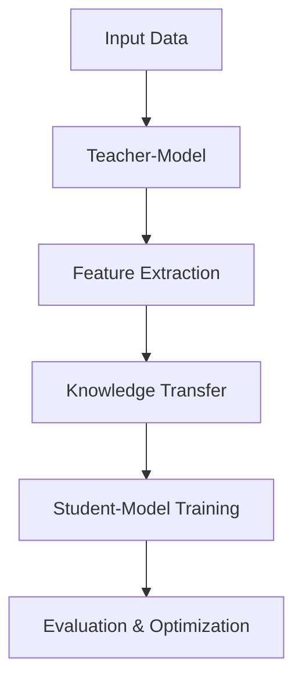
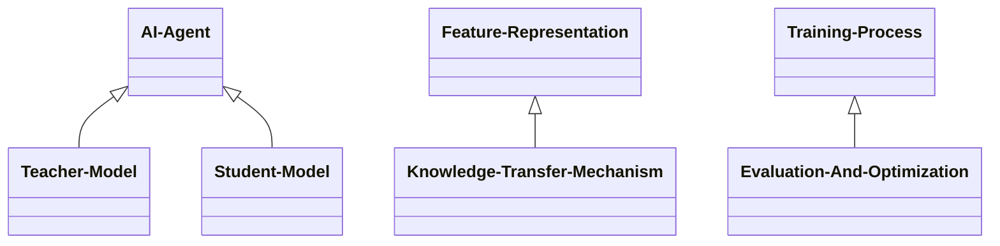
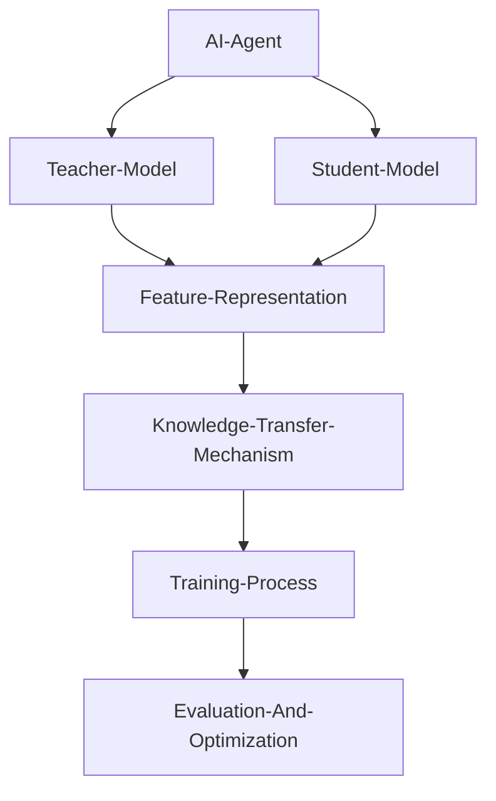
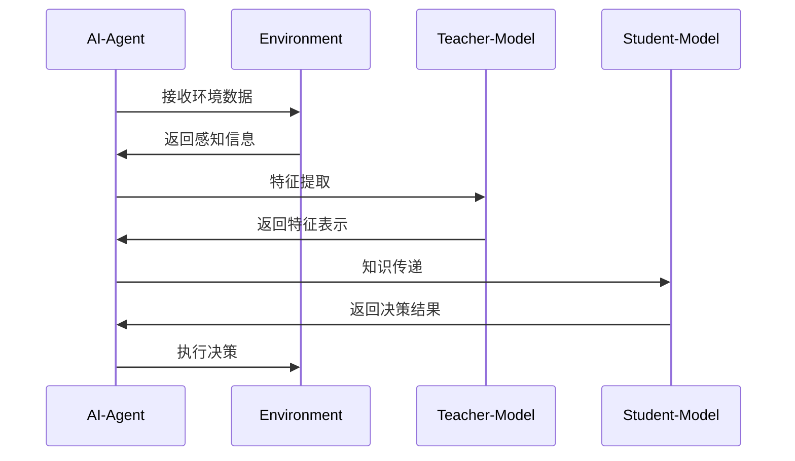

                 


# AI Agent的知识蒸馏：从大模型到轻量级模型

> 关键词：人工智能代理，知识蒸馏，大模型，轻量级模型，算法实现，系统架构

> 摘要：本文旨在探讨人工智能代理中的知识蒸馏技术，特别是如何通过知识蒸馏实现从大模型到轻量级模型的转化。我们将从核心概念出发，详细讲解知识蒸馏的工作原理，并通过实例和代码展示其应用。

## 目录大纲

----------------------------------------------------------------

1. **背景介绍**：
   - **AI Agent与知识蒸馏的背景**
   - **问题背景与目标**
   - **知识蒸馏的工作原理**
   - **边界与外延**
   - **核心要素组成**

2. **核心概念与联系**：
   - **人工智能代理**
   - **知识蒸馏**
   - **大模型与轻量级模型**
   - **概念属性特征对比表格**
   - **ER实体关系图架构**

3. **算法原理讲解**：
   - **知识蒸馏算法mermaid流程图**
   - **Python源代码**
   - **数学模型与公式**
   - **详细讲解与举例说明**

4. **系统分析与架构设计方案**：
   - **问题场景介绍**
   - **系统功能设计（领域模型类图）**
   - **系统架构设计（mermaid架构图）**
   - **系统接口设计**
   - **系统交互（mermaid序列图）**

5. **项目实战**：
   - **环境安装与配置**
   - **系统核心实现源代码**
   - **代码解读与分析**
   - **实际案例分析与详细讲解剖析**
   - **项目小结**

6. **最佳实践 tips、小结、注意事项、拓展阅读**

----------------------------------------------------------------

### 背景介绍

#### AI Agent与知识蒸馏的背景

人工智能代理（AI Agent）是一种能够自动完成特定任务、与环境互动并自主决策的智能体。随着深度学习技术的发展，AI Agent在自然语言处理、图像识别、游戏智能等领域取得了显著的成果。然而，大模型在性能上虽然优异，但往往伴随着高资源消耗和长训练时间。

知识蒸馏（Knowledge Distillation）是一种将大型教师模型的知识传递给小型学生模型的技术。这种技术能够有效降低模型的复杂度，同时保持较高的性能。知识蒸馏的原理是通过训练一个较小的学生模型来模仿一个较大的教师模型的行为，使得学生模型能够在资源受限的环境下依然具备较强的预测能力。

#### 问题背景与目标

本篇文章的核心问题是：如何通过知识蒸馏技术，将大模型转化为轻量级模型，以满足资源受限场景下的应用需求。我们的目标是详细讲解知识蒸馏的工作原理，并通过实例和代码展示其在AI Agent中的应用。

#### 知识蒸馏的工作原理

知识蒸馏的工作原理可以概括为以下几个步骤：

1. **模型选择**：选择一个较大的教师模型和一个较小的学生模型。教师模型通常具有较好的性能，而学生模型则相对简单。
2. **特征提取**：教师模型对输入数据进行特征提取，生成一系列特征表示。
3. **知识传递**：通过某种机制将教师模型提取到的特征知识传递给学生模型。常见的知识传递机制包括软标签、硬标签、中间层表示等。
4. **训练学生模型**：使用传递的知识来训练学生模型，使其能够模仿教师模型的行为。
5. **评估与优化**：评估学生模型的性能，并根据评估结果对模型进行优化。

#### 边界与外延

知识蒸馏技术在AI Agent中的应用范围广泛，但也有一些边界和限制。首先，知识蒸馏依赖于教师模型的质量，教师模型必须具备较强的性能。其次，知识蒸馏过程可能会增加训练时间，特别是在学生模型较小的情况下。最后，知识蒸馏适用于具有相似结构和特征表示的任务，对于完全不同的任务，知识蒸馏的效果可能不显著。

#### 核心要素组成

知识蒸馏的核心要素包括：

1. **教师模型**：通常是一个大型的预训练模型，具有较高的性能。
2. **学生模型**：一个相对较小的模型，用于学习教师模型的知识。
3. **特征表示**：教师模型和学生模型对输入数据的特征表示。
4. **知识传递机制**：用于将教师模型的知识传递给学生模型的机制。
5. **训练过程**：包括特征提取、知识传递和模型训练的整个过程。

### 核心概念与联系

#### 人工智能代理

人工智能代理是一种自主决策的智能体，能够在复杂环境中执行特定任务。AI Agent通常包括感知器、决策器和执行器三个部分。感知器负责接收环境信息，决策器基于感知信息做出决策，执行器负责执行决策。

#### 知识蒸馏

知识蒸馏是一种模型压缩技术，通过将大型教师模型的知识传递给小型学生模型，实现性能的提升。知识蒸馏的核心在于如何有效地传递知识，以及如何优化学生模型的学习过程。

#### 大模型与轻量级模型

大模型通常具有复杂的结构和大量的参数，能够在大规模数据集上获得较高的性能。轻量级模型则相对简单，参数较少，适合在资源受限的环境下使用。

#### 概念属性特征对比表格

| 特征            | 大模型                         | 轻量级模型                           |
|-----------------|--------------------------------|-------------------------------------|
| 结构复杂性      | 复杂，多层级网络结构           | 简单，单层或多层结构                 |
| 参数数量        | 数百万甚至数亿参数             | 数千到数万个参数                     |
| 训练时间        | 较长，需要大量数据和高性能计算 | 较短，适合快速迭代和部署             |
| 资源消耗        | 高，需要大量内存和计算资源     | 低，适合资源受限的场景               |
| 预测速度        | 较慢，需要较长时间             | 较快，适合实时应用                   |
| 性能表现        | 优异，在复杂任务上表现突出     | 良好，在特定任务上性能尚可           |

#### ER实体关系图架构

```mermaid
erDiagram
  AI-Agent ||--|{ Teacher-Model }|-- Student-Model
  Feature-Representation ||--|{ Knowledge-Transfer-Mechanism }|--
  Training-Process ||--|{ Evaluation-And-Optimization }|--
```

### 算法原理讲解

#### 知识蒸馏算法mermaid流程图



#### Python源代码

```python
# 教师模型特征提取
teacher_model = ... # 预训练模型
student_model = ... # 轻量级模型

# 知识传递
for inputs, labels in data_loader:
    with torch.no_grad():
        teacher_outputs = teacher_model(inputs)
    student_outputs = student_model(inputs)
    loss = loss_fn(student_outputs, teacher_outputs)
    optimizer.zero_grad()
    loss.backward()
    optimizer.step()

# 学生模型训练
student_model.train()
for epoch in range(num_epochs):
    for inputs, labels in data_loader:
        student_outputs = student_model(inputs)
        loss = loss_fn(student_outputs, labels)
        optimizer.zero_grad()
        loss.backward()
        optimizer.step()
```

#### 数学模型与公式

知识蒸馏过程中常用的数学模型包括：

1. **软标签**：软标签是通过教师模型输出的概率分布来传递知识。公式为：
   $$ \hat{y} = \frac{e^{y}}{\sum_{i=1}^{N} e^{y_i}} $$
   其中，$y$ 是教师模型的输出，$\hat{y}$ 是软标签。

2. **硬标签**：硬标签是通过教师模型输出的类别来传递知识。公式为：
   $$ \hat{y} = \arg\max(y) $$
   其中，$y$ 是教师模型的输出，$\hat{y}$ 是硬标签。

#### 详细讲解与举例说明

#### 系统分析与架构设计方案

#### 问题场景介绍

在自动驾驶领域，AI Agent需要对大量复杂的路况和环境进行实时感知和决策。然而，现有的深度学习模型往往需要大量的计算资源和时间来训练和部署。知识蒸馏技术能够将大型教师模型的知识传递给轻量级模型，使得轻量级模型在资源受限的环境中也能具备较强的性能。

#### 系统功能设计（领域模型类图）



#### 系统架构设计（mermaid架构图）



#### 系统接口设计

系统接口设计包括输入接口、输出接口和控制接口。输入接口负责接收环境数据，输出接口负责输出决策结果，控制接口负责协调各模块的运行。

#### 系统交互（mermaid序列图）



#### 项目实战

#### 环境安装与配置

在开始知识蒸馏项目之前，我们需要安装和配置以下软件和库：

- Python 3.x
- PyTorch
- torchvision
- numpy
- matplotlib

安装完成后，我们可以创建一个虚拟环境，并安装所需的库：

```bash
conda create -n knowledge_distillation python=3.8
conda activate knowledge_distillation
conda install pytorch torchvision numpy matplotlib
```

#### 系统核心实现源代码

以下是一个简单的知识蒸馏项目实现：

```python
import torch
import torchvision
import torchvision.transforms as transforms
import torch.optim as optim
import torch.nn as nn
import torch.optim as optim
from torch.utils.data import DataLoader

# 定义教师模型
class TeacherModel(nn.Module):
    def __init__(self):
        super(TeacherModel, self).__init__()
        self.conv1 = nn.Conv2d(3, 64, 3, 1, 1)
        self.fc1 = nn.Linear(64 * 5 * 5, 10)

    def forward(self, x):
        x = self.conv1(x)
        x = torch.relu(x)
        x = torch.max_pool2d(x, 2)
        x = x.view(x.size(0), -1)
        x = self.fc1(x)
        return x

# 定义学生模型
class StudentModel(nn.Module):
    def __init__(self):
        super(StudentModel, self).__init__()
        self.conv1 = nn.Conv2d(3, 32, 3, 1, 1)
        self.fc1 = nn.Linear(32 * 5 * 5, 10)

    def forward(self, x):
        x = self.conv1(x)
        x = torch.relu(x)
        x = torch.max_pool2d(x, 2)
        x = x.view(x.size(0), -1)
        x = self.fc1(x)
        return x

# 加载MNIST数据集
transform = transforms.Compose([transforms.ToTensor()])
train_set = torchvision.datasets.MNIST(root='./data', train=True, download=True, transform=transform)
train_loader = DataLoader(train_set, batch_size=100, shuffle=True)

# 实例化模型
teacher_model = TeacherModel()
student_model = StudentModel()

# 定义损失函数和优化器
loss_fn = nn.CrossEntropyLoss()
optimizer = optim.Adam(student_model.parameters(), lr=0.001)

# 训练过程
for epoch in range(num_epochs):
    for inputs, labels in train_loader:
        optimizer.zero_grad()
        teacher_outputs = teacher_model(inputs)
        student_outputs = student_model(inputs)
        loss = loss_fn(student_outputs, teacher_outputs)
        loss.backward()
        optimizer.step()

# 评估学生模型
student_model.eval()
with torch.no_grad():
    correct = 0
    total = 0
    for inputs, labels in train_loader:
        outputs = student_model(inputs)
        _, predicted = torch.max(outputs.data, 1)
        total += labels.size(0)
        correct += (predicted == labels).sum().item()

print('Accuracy of the student model on the train

