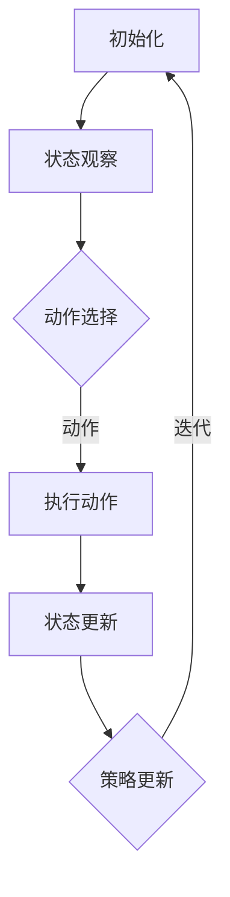
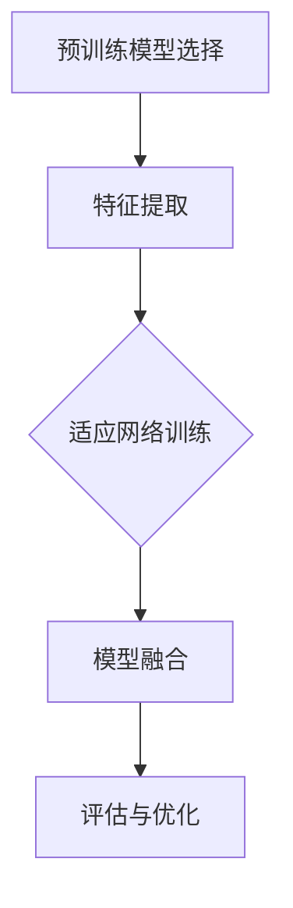
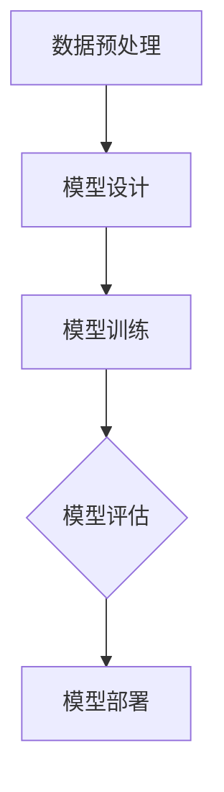
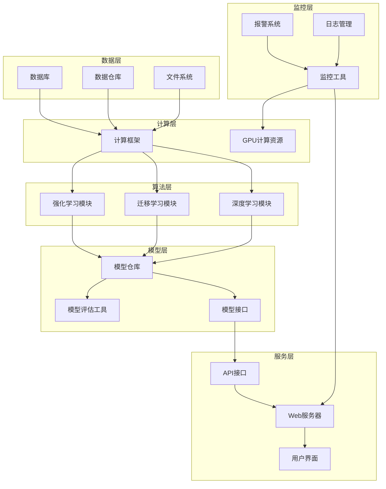

                 

# AI Agent的终身学习系统设计

## 关键词
- **AI Agent**
- **终身学习**
- **强化学习**
- **迁移学习**
- **深度学习**
- **数学模型**
- **系统架构**
- **项目实战**

## 摘要
本文旨在探讨AI Agent的终身学习系统设计，深入分析其核心概念、算法原理和系统架构。通过详细的数学模型解释、Python源代码展示以及实际项目案例分析，本文将为读者提供一个清晰、易懂的AI Agent终身学习系统构建指南。

### 目录

1. 引言
   1.1 问题背景
   1.2 问题描述
   1.3 问题解决
   1.4 边界与外延

2. 核心概念
   2.1 AI Agent
   2.2 终身学习
   2.3 AI Agent终身学习的核心概念

3. 算法原理
   3.1 强化学习
   3.2 迁移学习
   3.3 深度学习

4. 数学模型与公式
   4.1 强化学习数学模型
   4.2 迁移学习数学模型
   4.3 深度学习数学模型

5. 系统架构设计
   5.1 系统功能设计
   5.2 系统架构设计
   5.3 系统接口设计
   5.4 系统交互

6. 项目实战
   6.1 环境安装
   6.2 系统核心实现
   6.3 代码解读与分析
   6.4 实际案例分析
   6.5 项目小结

7. 最佳实践与总结
   7.1 最佳实践
   7.2 小结
   7.3 注意事项
   7.4 拓展阅读

## 引言

### 1.1 问题背景

在当今快速发展的信息技术时代，人工智能（AI）技术已经成为推动社会进步的关键力量。随着AI技术的不断成熟和应用场景的日益广泛，AI Agent作为AI系统的重要组成部分，正在逐渐承担更多的智能任务。然而，传统的AI系统往往只能解决特定的问题，无法实现持续的学习和自我进化，这使得AI Agent在面临复杂多变的现实问题时显得力不从心。

终身学习作为一种新兴的教育理念，强调个体在不断变化的环境中通过持续学习和适应来实现自身的发展。在AI领域，将终身学习引入AI Agent的设计，使得AI Agent能够不断从经验中学习，适应新的环境和任务，从而提高其智能水平和应用价值。

本文旨在探讨AI Agent的终身学习系统设计，通过深入分析其核心概念、算法原理和系统架构，为AI Agent的持续学习和自我进化提供一种有效的解决方案。

### 1.2 问题描述

AI Agent的终身学习系统设计面临以下主要问题：

1. **数据获取与处理**：在AI Agent的终身学习过程中，需要大量的数据进行训练和优化。如何高效地获取、处理和利用数据，是系统设计的关键问题。

2. **算法选择与优化**：不同的学习算法适用于不同类型的问题，如何选择合适的算法，并进行优化，是系统设计的核心。

3. **模型解释与可解释性**：AI Agent的决策过程应该具备一定的透明度和可解释性，以便用户理解和信任其决策。

4. **系统稳定性与可靠性**：终身学习系统需要保证在长时间运行过程中，系统稳定性和可靠性，避免出现学习错误或过拟合现象。

### 1.3 问题解决

为了解决上述问题，本文提出以下解决思路：

1. **数据驱动**：采用数据驱动的方法，通过大规模数据集的训练，提高AI Agent的泛化能力。

2. **算法集成**：结合多种学习算法，如强化学习、迁移学习和深度学习，实现AI Agent的多层次学习。

3. **模型解释**：引入模型解释技术，提高AI Agent决策过程的透明度和可解释性。

4. **系统监控与优化**：建立系统监控机制，实时评估系统性能，并进行优化调整。

### 1.4 边界与外延

本文主要讨论AI Agent的终身学习系统设计，涉及的核心技术包括强化学习、迁移学习和深度学习。然而，终身学习系统设计的外延远不止于此，还包括数据管理、模型解释、系统监控等多个方面。本文旨在提供一个系统性的框架，为读者提供一个深入理解和设计终身学习系统的起点。

## 核心概念

### 2.1 AI Agent

AI Agent，即人工智能代理，是人工智能领域中的一个重要概念。AI Agent是指具有自主决策能力、能够在复杂环境中执行任务的智能体。其核心特点包括：

1. **自主决策**：AI Agent可以根据当前环境和目标，自主选择最佳行动方案。
2. **自适应学习**：AI Agent能够从经验中学习，不断优化自身性能。
3. **交互能力**：AI Agent可以与用户或其他系统进行交互，获取信息和完成任务。

在AI Agent的设计和应用中，常见的类型包括：

1. **反应式Agent**：基于当前感知的环境数据直接做出反应，不涉及学习和记忆。
2. **模型基础Agent**：使用预先定义的模型进行决策，具备一定的学习和适应能力。
3. **认知Agent**：具备自我意识、情感和社交能力，能够进行复杂的人类式思考。

### 2.2 终身学习

终身学习是一种教育理念，强调个体在一生中不断学习、进步和适应。在AI领域，终身学习意味着AI Agent能够在其整个生命周期中不断学习新知识、技能和策略，以应对复杂多变的任务和环境。

终身学习的核心概念包括：

1. **持续学习**：AI Agent不停止学习，而是持续地从新数据和经验中学习。
2. **适应性学习**：AI Agent能够根据环境和任务的变化，灵活调整其学习策略。
3. **自我优化**：AI Agent通过学习，不断优化自身的性能和决策能力。

### 2.3 AI Agent终身学习的核心概念

AI Agent终身学习的核心概念包括以下几个方面：

1. **数据获取**：AI Agent需要能够从环境中获取高质量的数据，这是终身学习的基础。
2. **算法选择**：根据任务的复杂性，选择合适的算法，如强化学习、迁移学习或深度学习。
3. **模型优化**：通过不断的训练和调整，优化AI Agent的模型参数，提高其性能。
4. **反馈机制**：建立反馈机制，让AI Agent能够根据任务结果进行学习，不断改进。

### 概念结构与核心要素组成

为了更好地理解AI Agent终身学习的核心概念和结构，我们可以使用ER实体关系图和Mermaid流程图进行表示。

#### ER实体关系图

```mermaid
erDiagram
    AI_Agent ||--|{ Data}: 数据获取
    AI_Agent ||--|{ Algorithm}: 算法选择
    AI_Agent ||--|{ Model}: 模型优化
    AI_Agent ||--|{ Feedback}: 反馈机制
```

#### Mermaid流程图

```mermaid
graph TD
    A[数据获取] --> B{算法选择}
    B --> C[模型优化}
    C --> D{反馈机制}
    D --> A
```

通过上述ER实体关系图和Mermaid流程图，我们可以清晰地看到AI Agent终身学习的核心要素及其相互关系，为后续的算法原理讲解和系统架构设计奠定了基础。

### 2.4 概念属性特征对比表格

为了更直观地理解AI Agent、终身学习和AI Agent终身学习的核心概念及其属性特征，我们提供了一个对比表格。

| 概念         | 定义                   | 特征                     |
| ------------ | ---------------------- | ------------------------ |
| **AI Agent** | 具有自主决策能力的智能体 | 自主决策、自适应学习、交互能力 |
| **终身学习** | 一生中的持续学习过程     | 持续学习、适应性学习、自我优化 |
| **终身学习** | 结合AI Agent的持续学习过程 | 数据获取、算法选择、模型优化、反馈机制 |

通过对比表格，我们可以看到AI Agent、终身学习和AI Agent终身学习的区别和联系，进一步理解其核心概念。

### 2.5 概念之间的关系

AI Agent、终身学习和AI Agent终身学习这三个概念之间存在密切的联系。AI Agent是终身学习的主要载体，终身学习为AI Agent提供了不断进步和适应环境的方法，而AI Agent终身学习则是结合两者的具体实现方式。

1. **AI Agent与终身学习的关系**：AI Agent通过终身学习，不断提高自身的能力和知识水平，从而更好地完成任务。

2. **AI Agent终身学习与终身学习的关系**：AI Agent终身学习是终身学习理念在AI领域的具体应用，强调AI Agent在整个生命周期中的持续学习和自我进化。

3. **AI Agent终身学习与其他概念的关系**：AI Agent终身学习涉及数据获取、算法选择、模型优化和反馈机制等多个方面，这些都是实现AI Agent持续学习和自我进化的关键要素。

通过上述分析，我们可以更深入地理解AI Agent、终身学习和AI Agent终身学习之间的关系，为后续的算法原理讲解和系统架构设计提供了理论基础。

### 2.6 AI Agent终身学习的核心概念

在深入探讨AI Agent终身学习之前，我们需要明确其核心概念，这些概念是构建终身学习系统的基石。以下是AI Agent终身学习中的几个关键概念及其定义：

1. **数据获取**：数据获取是AI Agent终身学习的基础。它指的是AI Agent如何从环境中获取高质量、多样化的数据，以便进行学习和优化。数据的质量和数量直接影响到AI Agent的学习效果。

2. **算法选择**：算法选择是AI Agent终身学习的关键。根据任务的需求和复杂性，选择合适的算法（如强化学习、迁移学习或深度学习）对于实现高效的学习至关重要。

3. **模型优化**：模型优化是指通过不断的训练和调整，优化AI Agent的模型参数，提高其性能和决策能力。模型优化的目标是使AI Agent在新的环境和任务中能够快速适应和取得良好表现。

4. **反馈机制**：反馈机制是AI Agent终身学习的重要组成部分。通过反馈，AI Agent可以了解自己的决策效果，从而进行调整和改进。有效的反馈机制有助于确保AI Agent的学习过程是正向的、可持续的。

5. **系统监控**：系统监控是保障AI Agent终身学习系统稳定性和可靠性的重要手段。通过实时监控系统的运行状态，可以及时发现和解决问题，确保系统在长时间运行中保持高效性能。

这些核心概念相互作用，共同构成了AI Agent终身学习的完整体系。在后续章节中，我们将详细探讨这些概念在实际系统设计中的应用和实现。

### 2.7 终身学习在AI Agent中的应用和优势

终身学习在AI Agent中的应用和优势主要体现在以下几个方面：

1. **适应性增强**：通过终身学习，AI Agent可以不断适应新的环境和任务，提高其适应能力和灵活性。例如，在动态变化的业务场景中，AI Agent能够快速调整策略，以应对不同的情况。

2. **性能优化**：终身学习使AI Agent能够从经验中学习，不断优化自身模型和算法，从而提高任务执行效率和准确性。例如，在金融预测领域，AI Agent可以通过不断学习市场数据，提高预测的准确性。

3. **知识积累**：终身学习有助于AI Agent积累丰富的知识库，使其能够处理更加复杂和多变的任务。例如，在医疗诊断领域，AI Agent可以通过终身学习，不断积累病案数据和医学知识，提高诊断的准确性和效率。

4. **自主进化**：终身学习使AI Agent具备自我进化能力，能够在没有人工干预的情况下，自主改进和优化自身。例如，在无人驾驶领域，AI Agent可以通过终身学习，不断优化驾驶策略，提高行驶的安全性和效率。

5. **用户信任**：终身学习可以提高AI Agent的决策透明度和可解释性，增强用户对AI Agent的信任。例如，在智能客服领域，AI Agent可以通过终身学习，提高对话的流畅性和准确性，提升用户体验。

### 2.8 AI Agent终身学习的核心概念

在深入探讨AI Agent终身学习之前，我们需要明确其核心概念，这些概念是构建终身学习系统的基石。以下是AI Agent终身学习中的几个关键概念及其定义：

1. **数据获取**：数据获取是AI Agent终身学习的基础。它指的是AI Agent如何从环境中获取高质量、多样化的数据，以便进行学习和优化。数据的质量和数量直接影响到AI Agent的学习效果。

2. **算法选择**：算法选择是AI Agent终身学习的关键。根据任务的需求和复杂性，选择合适的算法（如强化学习、迁移学习或深度学习）对于实现高效的学习至关重要。

3. **模型优化**：模型优化是指通过不断的训练和调整，优化AI Agent的模型参数，提高其性能和决策能力。模型优化的目标是使AI Agent在新的环境和任务中能够快速适应和取得良好表现。

4. **反馈机制**：反馈机制是AI Agent终身学习的重要组成部分。通过反馈，AI Agent可以了解自己的决策效果，从而进行调整和改进。有效的反馈机制有助于确保AI Agent的学习过程是正向的、可持续的。

5. **系统监控**：系统监控是保障AI Agent终身学习系统稳定性和可靠性的重要手段。通过实时监控系统的运行状态，可以及时发现和解决问题，确保系统在长时间运行中保持高效性能。

这些核心概念相互作用，共同构成了AI Agent终身学习的完整体系。在后续章节中，我们将详细探讨这些概念在实际系统设计中的应用和实现。

### 3.1 强化学习

强化学习（Reinforcement Learning，简称RL）是机器学习的一个分支，其主要目标是使机器能够在与环境交互的过程中通过试错学习来完成任务。强化学习中的AI Agent（通常被称为“智能体”）通过不断接收环境反馈，逐步优化其策略，以实现长期目标。

#### 强化学习的基本概念

强化学习的核心概念包括：

1. **智能体（Agent）**：执行动作并接收环境反馈的实体。在强化学习中，智能体通常是一个程序或模型。

2. **环境（Environment）**：智能体所处的动态环境。环境会根据智能体的动作产生状态转移和奖励。

3. **状态（State）**：描述智能体在某一时刻所处的环境状态。

4. **动作（Action）**：智能体可以采取的行为或决策。

5. **奖励（Reward）**：环境对智能体动作的即时评价。奖励可以是正的，表示智能体采取了正确的动作，也可以是负的，表示智能体采取了错误的动作。

6. **策略（Policy）**：智能体在给定状态下采取的动作方案。

7. **价值函数（Value Function）**：描述智能体在特定状态下采取特定动作的期望奖励。

8. **模型（Model）**：对环境和状态的预测模型，用于指导智能体的决策。

#### 强化学习的算法

强化学习算法主要包括：

1. **Q-Learning（Q值学习）**：通过迭代更新Q值表，以期望最大化原则选择动作。

2. **SARSA（State-Action-Reward-State-Action，即状态-动作-奖励-状态-动作）**：基于当前状态和动作的奖励，同时更新当前状态和下一个状态的动作值。

3. **Deep Q-Networks（DQN，即深度Q网络）**：结合深度学习和强化学习，通过神经网络估计Q值。

4. **Policy Gradient Methods（策略梯度方法）**：直接优化策略参数，以最大化期望奖励。

5. **Actor-Critic Methods（演员-评论家方法）**：同时优化策略（演员）和价值函数（评论家），以提高学习效率。

#### 强化学习的流程

强化学习的流程通常包括以下几个步骤：

1. **初始化**：初始化智能体、环境和策略。

2. **状态观察**：智能体观察当前状态。

3. **动作选择**：智能体根据当前状态和策略选择动作。

4. **执行动作**：智能体在环境中执行动作，并接收奖励。

5. **状态更新**：智能体更新当前状态。

6. **策略更新**：根据奖励和历史数据更新策略。

7. **迭代**：重复上述步骤，直到达到预设的目标或学习停止条件。

#### 强化学习的Mermaid流程图

下面是强化学习的一个简单Mermaid流程图：



通过上述流程，我们可以看到强化学习的基本工作原理。

#### 强化学习的Python源代码示例

以下是一个简单的Q-Learning算法的Python代码示例：

```python
import numpy as np
import random

# 初始化Q值表
Q = np.zeros([env_states, env_actions])

# 设置学习参数
alpha = 0.1  # 学习率
gamma = 0.6  # 折扣因子
epsilon = 0.1  # 探索率

# Q-Learning算法
def q_learning(state, action, reward, next_state, done):
    Q[state, action] += alpha * (reward + gamma * np.max(Q[next_state, :]) - Q[state, action])
    if done:
        return
    else:
        q_learning(next_state, action, reward, next_state, done)

# 主循环
while True:
    state = env.reset()
    done = False
    while not done:
        if random.random() < epsilon:
            action = random.choice(env_actions)
        else:
            action = np.argmax(Q[state, :])
        
        next_state, reward, done, _ = env.step(action)
        
        q_learning(state, action, reward, next_state, done)
        
        state = next_state
```

在这个示例中，我们首先初始化一个Q值表，然后通过Q-Learning算法不断更新Q值，以优化智能体的策略。这个简单的示例展示了强化学习的基本原理和实现方法。

#### 强化学习的数学模型

强化学习的数学模型主要基于马尔可夫决策过程（MDP）。以下是一些关键的数学公式：

1. **状态-动作值函数（Q值）**：
   $$ Q(s, a) = \sum_{s'} P(s' | s, a) \cdot r(s', a) + \gamma \cdot \max_{a'} Q(s', a') $$

   其中，$Q(s, a)$ 表示在状态 $s$ 下采取动作 $a$ 的期望回报。

2. **策略**：
   $$ \pi(a | s) = \begin{cases} 
   1, & \text{if } a = \arg\max_{a'} Q(s, a') \\
   0, & \text{otherwise}
   \end{cases} $$

   其中，$\pi(a | s)$ 表示在状态 $s$ 下采取动作 $a$ 的概率。

3. **最优策略**：
   $$ \pi^*(a | s) = \begin{cases} 
   1, & \text{if } a = \arg\max_{a'} Q^*(s, a') \\
   0, & \text{otherwise}
   \end{cases} $$

   其中，$Q^*(s, a)$ 表示最优状态-动作值函数。

4. **策略迭代**：
   $$ \pi^{t+1} = \pi^t \circ \theta^{t+1} $$
   
   其中，$\theta^{t+1}$ 表示在迭代 $t+1$ 时更新的策略。

通过上述数学模型，我们可以更深入地理解强化学习的工作原理和优化过程。

#### 强化学习的通俗易懂举例说明

为了更好地理解强化学习的概念和过程，我们可以通过一个简单的例子来讲解。

假设有一个智能体在一个简单的环境中学习走路。环境是一个直线轨道，智能体可以采取两种动作：向前走和向后走。智能体每次采取动作后，会根据动作的方向和距离获得奖励，如果智能体走远了，还会获得额外的奖励。

1. **初始化**：智能体在起点初始化，Q值表被随机初始化。

2. **状态观察**：智能体观察到当前位于起点。

3. **动作选择**：智能体根据当前状态和Q值表选择动作。由于初始时Q值表随机初始化，智能体可能会随机选择动作。

4. **执行动作**：智能体向前走一步，并获得正向奖励。

5. **状态更新**：智能体状态更新为前进后的位置。

6. **策略更新**：根据获得的奖励和Q值表更新策略。智能体会更倾向于选择能够获得更多奖励的动作。

7. **迭代**：智能体重复上述过程，不断学习和优化其动作策略。

通过这个简单的例子，我们可以看到强化学习的基本流程和原理。智能体通过不断的试错和策略优化，最终能够找到最佳的动作策略，实现目标。

### 3.2 迁移学习

迁移学习（Transfer Learning）是机器学习中的一种重要技术，它通过将已经在一个任务上训练好的模型（称为预训练模型）的知识迁移到新的任务上，以减少对新数据的训练时间和计算资源需求，提高模型在新任务上的性能。迁移学习在解决领域适应问题、减少数据依赖和提高模型泛化能力方面具有显著优势。

#### 迁移学习的基本概念

迁移学习的基本概念包括：

1. **源域（Source Domain）**：已经进行过大量训练的数据集，通常具有较高的模型性能。

2. **目标域（Target Domain）**：需要模型进行训练和预测的新数据集，通常数据量较小或与源域存在差异。

3. **共享网络（Shared Network）**：在源域和目标域之间共享的部分网络结构，用于提取通用的特征表示。

4. **适应网络（Adaptation Network）**：在目标域上专门训练的子网络，用于适应目标域的特殊需求。

5. **预训练模型（Pre-trained Model）**：在源域上训练好的模型，通常包含丰富的知识。

6. **微调（Fine-tuning）**：在目标域上对预训练模型进行少量训练，以适应目标域的特殊需求。

7. **模型蒸馏（Model Distillation）**：将预训练模型的输出作为目标，训练新的模型以模仿其知识。

#### 迁移学习的算法

迁移学习算法主要包括以下几种：

1. **基于模型的迁移学习**：直接在目标域上使用源域的模型，通过微调或蒸馏技术来适应目标域。

2. **基于特征的迁移学习**：将源域和目标域的数据映射到共享的特征空间，然后在特征空间中进行分类或回归。

3. **基于模型的迁移学习**：利用源域模型的知识，为每个目标域任务训练一个独立的模型。

4. **多任务学习**：通过同时训练多个相关任务来提高模型的泛化能力，从而在目标域上获得更好的性能。

#### 迁移学习的流程

迁移学习的流程通常包括以下几个步骤：

1. **预训练模型选择**：选择一个在源域上表现良好的预训练模型。

2. **特征提取**：使用预训练模型在源域和目标域上提取特征表示。

3. **适应网络训练**：在目标域上训练适应网络，以适应目标域的特殊需求。

4. **模型融合**：将源域和目标域的特征表示进行融合，以生成最终的预测结果。

5. **评估与优化**：在目标域上评估模型性能，并进行必要的优化。

#### 迁移学习的Mermaid流程图

下面是迁移学习的一个简单Mermaid流程图：



通过上述流程，我们可以看到迁移学习的基本工作原理。

#### 迁移学习的Python源代码示例

以下是一个简单的迁移学习示例，使用预训练的VGG16模型在CIFAR-10数据集上进行微调：

```python
import tensorflow as tf
from tensorflow.keras.applications import VGG16
from tensorflow.keras.preprocessing.image import ImageDataGenerator
from tensorflow.keras.models import Model
from tensorflow.keras.optimizers import Adam
from tensorflow.keras.layers import Dense, Flatten

# 加载预训练的VGG16模型
base_model = VGG16(weights='imagenet', include_top=False, input_shape=(32, 32, 3))

# 冻结预训练模型的权重
for layer in base_model.layers:
    layer.trainable = False

# 添加适应网络和分类器
x = Flatten()(base_model.output)
x = Dense(256, activation='relu')(x)
predictions = Dense(10, activation='softmax')(x)

# 创建迁移学习模型
model = Model(inputs=base_model.input, outputs=predictions)

# 编译模型
model.compile(optimizer=Adam(learning_rate=0.0001), loss='categorical_crossentropy', metrics=['accuracy'])

# 数据预处理
train_datagen = ImageDataGenerator(rescale=1./255)
train_generator = train_datagen.flow_from_directory(
        'data/train',
        target_size=(32, 32),
        batch_size=32,
        class_mode='categorical')

# 训练迁移学习模型
model.fit(train_generator, epochs=10)

# 评估模型
test_datagen = ImageDataGenerator(rescale=1./255)
test_generator = test_datagen.flow_from_directory(
        'data/test',
        target_size=(32, 32),
        batch_size=32,
        class_mode='categorical')

model.evaluate(test_generator)
```

在这个示例中，我们首先加载预训练的VGG16模型，并冻结其权重。然后，我们添加一个适应网络和一个分类器，创建一个迁移学习模型。接下来，我们使用CIFAR-10数据集对模型进行微调和训练，并评估其在测试集上的性能。

#### 迁移学习的数学模型

迁移学习的数学模型主要涉及特征表示的学习和优化。以下是一些关键的数学公式：

1. **特征表示**：
   $$ f(\mathbf{x}) = \phi(\mathbf{x}) $$

   其中，$\phi(\mathbf{x})$ 是从输入数据 $\mathbf{x}$ 提取的特征表示。

2. **损失函数**：
   $$ L(\theta) = -\sum_{i=1}^{N} y_i \log (\hat{y}_i) $$

   其中，$y_i$ 是真实标签，$\hat{y}_i$ 是模型预测的概率分布。

3. **优化目标**：
   $$ \min_{\theta} L(\theta) $$

   通过最小化损失函数，模型可以学习到最优的特征表示。

4. **模型融合**：
   $$ \hat{y} = \sigma(\sum_{i=1}^{K} w_i f(\mathbf{x}_i)) $$

   其中，$w_i$ 是融合权重，$\sigma$ 是激活函数，$\hat{y}$ 是最终的预测结果。

通过上述数学模型，我们可以更深入地理解迁移学习的工作原理和优化过程。

#### 迁移学习的通俗易懂举例说明

为了更好地理解迁移学习的概念和过程，我们可以通过一个简单的例子来讲解。

假设我们有一个大型动物分类任务，使用了一个预训练的图像识别模型。这个模型在大量猫、狗等大型动物图像上进行训练，提取了丰富的特征表示。

现在，我们需要解决一个小型动物分类任务，例如识别金鱼、蝴蝶等。由于小型动物图像数据量相对较小，直接在小型动物图像上训练模型可能无法获得良好的性能。

通过迁移学习，我们可以利用预训练模型在大型动物图像上提取的特征表示，作为小型动物分类任务的特征输入。然后，我们只需在小型动物图像上训练一个简单的分类器，即可实现对小型动物的分类。

这种迁移学习的方法，不仅减少了训练数据的需求，还利用了预训练模型积累的知识，提高了模型在小型动物分类任务上的性能。

通过这个简单的例子，我们可以看到迁移学习的基本原理和优势。迁移学习通过将已有模型的知识迁移到新任务上，大大提高了模型的泛化能力和训练效率。

### 3.3 深度学习

深度学习（Deep Learning）是机器学习中的一个重要分支，它通过构建深度神经网络（Deep Neural Networks，简称DNN）来模拟人脑的神经结构，实现自动特征提取和复杂模式的识别。深度学习在图像识别、自然语言处理、语音识别等领域取得了显著的突破，推动了人工智能的发展。

#### 深度学习的基本概念

深度学习的基本概念包括：

1. **神经网络（Neural Network）**：由大量神经元（节点）通过加权连接构成的神经网络，用于模拟人脑的神经元之间的交互。

2. **深度神经网络（Deep Neural Network，DNN）**：由多个隐藏层组成的神经网络，能够学习更复杂的非线性特征。

3. **前向传播（Forward Propagation）**：数据从输入层经过各隐藏层传递到输出层的过程。

4. **反向传播（Backpropagation）**：根据输出误差，从输出层反向更新各层的权重和偏置的过程。

5. **激活函数（Activation Function）**：用于引入非线性特性的函数，如Sigmoid、ReLU、Tanh等。

6. **优化算法（Optimization Algorithm）**：用于更新模型参数，以最小化损失函数，如SGD、Adam等。

7. **损失函数（Loss Function）**：用于衡量模型预测结果与真实标签之间的差异，如均方误差（MSE）、交叉熵（Cross-Entropy）等。

8. **过拟合（Overfitting）**：模型在训练数据上表现良好，但在测试数据上表现较差，即模型对训练数据过度拟合。

9. **正则化（Regularization）**：通过添加正则项来防止模型过拟合，如L1正则化、L2正则化等。

#### 深度学习的算法

深度学习的算法主要包括以下几种：

1. **卷积神经网络（Convolutional Neural Network，CNN）**：用于图像识别和处理，通过卷积层提取局部特征。

2. **循环神经网络（Recurrent Neural Network，RNN）**：用于序列数据处理，通过循环结构保存历史信息。

3. **长短时记忆网络（Long Short-Term Memory，LSTM）**：RNN的一种变体，用于处理长序列数据。

4. **生成对抗网络（Generative Adversarial Network，GAN）**：通过对抗训练生成真实数据，用于图像生成和增强。

5. **自编码器（Autoencoder）**：用于数据降维和特征提取，通过编码器和解码器学习数据的低维表示。

6. **变分自编码器（Variational Autoencoder，VAE）**：通过概率模型学习数据的分布，用于生成和降维。

#### 深度学习的流程

深度学习的流程通常包括以下几个步骤：

1. **数据预处理**：对输入数据进行标准化、归一化等预处理，以提高训练效果。

2. **模型设计**：设计深度神经网络的结构，包括层数、每层的神经元数量、激活函数等。

3. **模型训练**：通过前向传播计算预测结果，通过反向传播更新模型参数，以最小化损失函数。

4. **模型评估**：在验证集和测试集上评估模型性能，选择最佳模型。

5. **模型部署**：将训练好的模型部署到生产环境，用于实际应用。

#### 深度学习的Mermaid流程图

下面是深度学习的一个简单Mermaid流程图：



通过上述流程，我们可以看到深度学习的基本工作原理。

#### 深度学习的Python源代码示例

以下是一个简单的CNN模型在MNIST数据集上的训练和评估示例：

```python
import tensorflow as tf
from tensorflow.keras import layers, models
from tensorflow.keras.datasets import mnist

# 加载MNIST数据集
(train_images, train_labels), (test_images, test_labels) = mnist.load_data()

# 数据预处理
train_images = train_images.reshape((60000, 28, 28, 1)).astype('float32') / 255
test_images = test_images.reshape((10000, 28, 28, 1)).astype('float32') / 255

# 构建CNN模型
model = models.Sequential()
model.add(layers.Conv2D(32, (3, 3), activation='relu', input_shape=(28, 28, 1)))
model.add(layers.MaxPooling2D((2, 2)))
model.add(layers.Conv2D(64, (3, 3), activation='relu'))
model.add(layers.MaxPooling2D((2, 2)))
model.add(layers.Conv2D(64, (3, 3), activation='relu'))

# 添加全连接层
model.add(layers.Flatten())
model.add(layers.Dense(64, activation='relu'))
model.add(layers.Dense(10, activation='softmax'))

# 编译模型
model.compile(optimizer='adam',
              loss='sparse_categorical_crossentropy',
              metrics=['accuracy'])

# 训练模型
model.fit(train_images, train_labels, epochs=5, batch_size=64)

# 评估模型
test_loss, test_acc = model.evaluate(test_images, test_labels)
print(f"Test accuracy: {test_acc:.4f}")
```

在这个示例中，我们首先加载MNIST数据集，并进行预处理。然后，我们构建一个简单的CNN模型，包括卷积层、池化层和全连接层。接下来，我们使用Adam优化器和交叉熵损失函数编译模型，并在训练集上训练模型。最后，我们在测试集上评估模型性能。

#### 深度学习的数学模型

深度学习的数学模型主要涉及神经网络的参数更新和优化。以下是一些关键的数学公式：

1. **前向传播**：
   $$ z_l = \sum_{k=1}^{n_l} w_{lk} a_{l-1,k} + b_l $$
   $$ a_l = \sigma(z_l) $$

   其中，$z_l$ 是第 $l$ 层的输入，$a_l$ 是第 $l$ 层的输出，$\sigma$ 是激活函数，$w_{lk}$ 是权重，$b_l$ 是偏置。

2. **反向传播**：
   $$ \delta_l = \frac{\partial L}{\partial z_l} \odot \sigma'(z_l) $$
   $$ \delta_{l-1} = \delta_l \odot w_{l-1, l} $$

   其中，$\delta_l$ 是第 $l$ 层的误差，$L$ 是损失函数，$\odot$ 表示逐元素乘积。

3. **参数更新**：
   $$ w_{l-1, l} := w_{l-1, l} - \alpha \frac{\partial L}{\partial w_{l-1, l}} $$
   $$ b_l := b_l - \alpha \frac{\partial L}{\partial b_l} $$

   其中，$\alpha$ 是学习率。

通过上述数学模型，我们可以更深入地理解深度学习的工作原理和优化过程。

#### 深度学习的通俗易懂举例说明

为了更好地理解深度学习的概念和过程，我们可以通过一个简单的例子来讲解。

假设我们有一个简单的手写数字识别任务，使用一个简单的CNN模型。输入是一个28x28的手写数字图像，目标是一个0到9的数字标签。

1. **数据预处理**：将手写数字图像转换为灰度图像，并归一化到0到1之间。

2. **模型设计**：构建一个简单的CNN模型，包括两个卷积层和一个全连接层。卷积层用于提取图像的局部特征，全连接层用于分类。

3. **模型训练**：使用训练数据集对模型进行训练，通过前向传播计算输出，通过反向传播更新模型参数。

4. **模型评估**：使用验证数据集评估模型性能，调整模型参数以优化性能。

5. **模型部署**：将训练好的模型部署到生产环境，用于实际的手写数字识别任务。

通过这个简单的例子，我们可以看到深度学习的基本流程和原理。深度学习通过构建复杂的神经网络，自动提取图像的特征，并实现对复杂模式的识别和分类。

### 4.1 强化学习数学模型

强化学习（Reinforcement Learning，简称RL）的数学模型是理解和实现强化学习算法的核心。在这个部分，我们将详细讲解强化学习的数学模型，包括Q值函数、策略迭代、价值函数以及状态-动作价值函数的更新过程。

#### Q值函数

Q值函数（Q-value function）是强化学习中的一个关键概念，它表示在某个状态下采取某个动作的期望回报。用数学公式表示，Q值函数可以写作：

$$ Q(s, a) = \sum_{s'} p(s' | s, a) \cdot [r(s', a) + \gamma \cdot \max_{a'} Q(s', a')] $$

其中：
- $s$ 表示当前状态。
- $a$ 表示当前采取的动作。
- $s'$ 表示采取动作$a$后状态转移到的下一个状态。
- $r(s', a)$ 表示在状态$s'$采取动作$a$后获得的即时奖励。
- $p(s' | s, a)$ 表示从状态$s$采取动作$a$后转移到状态$s'$的概率。
- $\gamma$ 是折扣因子，用于平衡当前奖励和未来奖励的重要性。

#### 策略迭代

策略迭代（Policy Iteration）是一种强化学习算法，通过迭代优化策略和价值函数来实现最优策略。策略迭代的基本步骤如下：

1. **初始化**：选择一个初始策略$\pi$，初始化价值函数$V(s) = 0$。

2. **评估策略**：根据当前策略$\pi$计算状态价值函数$V(s) = \sum_{a} \pi(a | s) \cdot Q(s, a)$。

3. **策略改进**：使用改进策略迭代算法（Policy Improvement Algorithm）更新策略：
   $$ \pi'(s) = \arg\max_{a} \left[ \sum_{s'} p(s' | s, a) \cdot [r(s', a) + \gamma \cdot V(s')] \right] $$

4. **迭代**：重复步骤2和3，直到策略收敛，即$\pi$不再改变。

#### 价值函数

价值函数（Value Function）是强化学习的另一个重要概念，它表示在某个状态下采取任何动作的期望回报。价值函数可以分为状态价值函数（State Value Function，$V(s)$）和动作价值函数（Action Value Function，$Q(s, a)$）。状态价值函数和动作价值函数之间的关系如下：

$$ V(s) = \sum_{a} \pi(a | s) \cdot Q(s, a) $$

其中，$\pi(a | s)$ 表示在状态$s$下采取动作$a$的概率。

#### 状态-动作价值函数的更新

状态-动作价值函数（State-Action Value Function，$Q(s, a)$）的更新是强化学习算法的核心步骤。在Q-Learning算法中，状态-动作价值函数的更新过程如下：

$$ Q(s, a) \leftarrow Q(s, a) + \alpha \cdot [r(s', a) + \gamma \cdot \max_{a'} Q(s', a') - Q(s, a)] $$

其中：
- $s$ 表示当前状态。
- $a$ 表示当前采取的动作。
- $s'$ 表示采取动作$a$后状态转移到的下一个状态。
- $r(s', a)$ 表示在状态$s'$采取动作$a$后获得的即时奖励。
- $\gamma$ 是折扣因子。
- $\alpha$ 是学习率。

通过上述公式，我们可以看到状态-动作价值函数的更新过程是通过当前奖励和未来期望奖励的组合来调整当前的价值。

#### 数学模型举例说明

为了更直观地理解上述数学模型，我们可以通过一个简单的例子来说明。

假设我们有一个简单的环境，其中有两个状态$s_1$和$s_2$，以及两个动作$a_1$和$a_2$。每个状态和动作都有相应的即时奖励和状态转移概率。以下是这个环境的参数设置：

| 状态  | 动作  | 奖励  | 状态转移概率 |
| ----- | ----- | ----- | ------------ |
| $s_1$ | $a_1$ | $+5$  | $0.8$        |
| $s_1$ | $a_2$ | $-3$  | $0.2$        |
| $s_2$ | $a_1$ | $-1$  | $0.4$        |
| $s_2$ | $a_2$ | $+2$  | $0.6$        |

我们使用Q-Learning算法来学习这个环境的最优策略。初始时，所有状态-动作价值函数设置为0。以下是几次迭代后的状态-动作价值函数：

- **初始状态**：
  $$ Q(s_1, a_1) = 0, Q(s_1, a_2) = 0, Q(s_2, a_1) = 0, Q(s_2, a_2) = 0 $$

- **第一次迭代**：
  $$ Q(s_1, a_1) \leftarrow Q(s_1, a_1) + \alpha \cdot [r(s', a') + \gamma \cdot \max_{a'} Q(s', a') - Q(s_1, a_1)] $$
  $$ Q(s_1, a_1) = 0 + 0.1 \cdot [5 + 0.9 \cdot \max(0, 0) - 0] = 0.5 $$
  $$ Q(s_1, a_2) \leftarrow Q(s_1, a_2) + \alpha \cdot [r(s', a') + \gamma \cdot \max_{a'} Q(s', a') - Q(s_1, a_2)] $$
  $$ Q(s_1, a_2) = 0 + 0.1 \cdot [-3 + 0.9 \cdot \max(0, 0) - 0] = -0.3 $$

- **第二次迭代**：
  $$ Q(s_2, a_1) \leftarrow Q(s_2, a_1) + \alpha \cdot [r(s', a') + \gamma \cdot \max_{a'} Q(s', a') - Q(s_2, a_1)] $$
  $$ Q(s_2, a_1) = 0 + 0.1 \cdot [-1 + 0.9 \cdot \max(0, 0) - 0] = -0.1 $$
  $$ Q(s_2, a_2) \leftarrow Q(s_2, a_2) + \alpha \cdot [r(s', a') + \gamma \cdot \max_{a'} Q(s', a') - Q(s_2, a_2)] $$
  $$ Q(s_2, a_2) = 0 + 0.1 \cdot [2 + 0.9 \cdot \max(0, 0) - 0] = 0.2 $$

通过上述迭代过程，我们可以看到状态-动作价值函数是如何逐步更新的，直到收敛到最优策略。

### 4.2 迁移学习数学模型

迁移学习（Transfer Learning）是机器学习中的一种重要技术，通过将已经在一个任务上训练好的模型（源域模型）的知识迁移到新的任务上（目标域模型），从而提高模型在新任务上的性能。迁移学习的数学模型主要涉及特征提取、模型蒸馏和细调等步骤。

#### 特征提取

在迁移学习中，特征提取是一个关键步骤，它将源域模型的知识迁移到目标域模型。特征提取的数学模型可以表示为：

$$ \phi(\mathbf{x}) = f(\mathbf{W}_\text{source} \cdot \mathbf{x}) $$

其中：
- $\mathbf{x}$ 是输入数据。
- $\mathbf{W}_\text{source}$ 是源域模型的权重。
- $f$ 是特征提取函数，通常是一个多层感知器（MLP）或卷积神经网络（CNN）。

特征提取函数$f$的作用是从原始输入数据中提取具有通用性的特征表示，这些特征可以跨不同任务和应用场景进行复用。

#### 模型蒸馏

模型蒸馏（Model Distillation）是一种将知识从源域模型传递到目标域模型的方法。在模型蒸馏过程中，源域模型的输出被用作目标域模型的学习目标。蒸馏过程的数学模型可以表示为：

$$ \mathbf{y}_{\text{target}} = f(\mathbf{W}_\text{target} \cdot \phi(\mathbf{x})) $$

$$ \mathbf{y}_{\text{source}} = f(\mathbf{W}_\text{source} \cdot \phi(\mathbf{x})) $$

$$ L = -\sum_{i} \sum_{j} \mathbf{y}_{\text{target}}_{ij} \log \mathbf{y}_{\text{source}}_{ij} $$

其中：
- $\mathbf{y}_{\text{target}}$ 是目标域模型输出的概率分布。
- $\mathbf{y}_{\text{source}}$ 是源域模型输出的概率分布。
- $L$ 是模型蒸馏的损失函数，通常使用交叉熵损失。

模型蒸馏的目标是使目标域模型的输出尽可能接近源域模型的输出，从而将源域模型的知识迁移到目标域模型。

#### 细调

在迁移学习过程中，细调（Fine-tuning）是将源域模型的部分权重迁移到目标域模型，并在此基础上对目标域模型进行进一步训练。细调的数学模型可以表示为：

$$ \mathbf{W}_\text{target} = \mathbf{W}_\text{source} + \mathbf{\Delta}_\text{target} $$

其中：
- $\mathbf{W}_\text{source}$ 是源域模型的权重。
- $\mathbf{W}_\text{target}$ 是目标域模型的权重。
- $\mathbf{\Delta}_\text{target}$ 是细调过程中的权重更新。

细调的目标是调整目标域模型的权重，使其在新任务上获得更好的性能。通常，细调过程中只对目标域模型的部分层（如最后一层）进行训练，以避免过拟合。

#### 数学模型举例

为了更直观地理解迁移学习的数学模型，我们可以通过一个简单的例子来说明。

假设我们有一个源域模型和一个目标域模型，它们都是由两个卷积层和一个全连接层组成。源域模型已经在图像分类任务上训练好，目标域模型需要在目标图像分类任务上获得良好性能。

1. **特征提取**：
   $$ \phi(\mathbf{x}) = f(\mathbf{W}_\text{source} \cdot \mathbf{x}) $$
   源域模型的卷积层和全连接层权重$\mathbf{W}_\text{source}$被用于提取目标域模型的特征。

2. **模型蒸馏**：
   $$ \mathbf{y}_{\text{target}} = f(\mathbf{W}_\text{target} \cdot \phi(\mathbf{x})) $$
   $$ \mathbf{y}_{\text{source}} = f(\mathbf{W}_\text{source} \cdot \phi(\mathbf{x})) $$
   目标域模型的全连接层权重$\mathbf{W}_\text{target}$被设置为源域模型的全连接层权重$\mathbf{W}_\text{source}$。

3. **模型蒸馏损失**：
   $$ L = -\sum_{i} \sum_{j} \mathbf{y}_{\text{target}}_{ij} \log \mathbf{y}_{\text{source}}_{ij} $$
   模型蒸馏损失函数用于衡量目标域模型输出和源域模型输出之间的差距。

4. **细调**：
   $$ \mathbf{W}_\text{target} = \mathbf{W}_\text{source} + \mathbf{\Delta}_\text{target} $$
   在模型蒸馏的基础上，目标域模型的部分权重（如最后一层）被进一步训练，以适应新任务。

通过上述步骤，我们可以看到迁移学习的数学模型是如何从源域模型中提取知识，并将其迁移到目标域模型，从而在新任务上获得更好的性能。

### 4.3 深度学习数学模型

深度学习（Deep Learning）的数学模型基于多层神经网络，通过前向传播和反向传播算法实现复杂函数的学习和优化。以下我们将详细讲解深度学习中的关键数学模型，包括神经元激活函数、反向传播算法、损失函数和优化算法。

#### 神经元激活函数

神经元激活函数是深度神经网络中的关键组成部分，它引入了非线性特性，使得神经网络能够学习复杂的数据分布。常见的激活函数包括：

1. **Sigmoid函数**：
   $$ \sigma(x) = \frac{1}{1 + e^{-x}} $$
   Sigmoid函数将输入$x$映射到$(0, 1)$区间，适用于二分类问题。

2. **ReLU函数**：
   $$ \text{ReLU}(x) = \max(0, x) $$
  ReLU函数在$x \leq 0$时输出0，在$x > 0$时输出$x$，具有简洁的表达和较好的计算性能。

3. **Tanh函数**：
   $$ \text{Tanh}(x) = \frac{e^x - e^{-x}}{e^x + e^{-x}} $$
   Tanh函数与ReLU函数类似，但在输出范围上更为对称。

4. **Softmax函数**：
   $$ \text{Softmax}(x)_i = \frac{e^{x_i}}{\sum_j e^{x_j}} $$
   Softmax函数用于多分类问题，将神经元输出转换为概率分布。

#### 反向传播算法

反向传播（Backpropagation）是深度学习中的核心算法，用于计算网络参数的梯度，并在此基础上更新参数。反向传播算法包括以下几个步骤：

1. **前向传播**：
   $$ a_{l}^{(i)} = \sigma(z_{l}^{(i)}) $$
   $$ z_{l}^{(i)} = \sum_{j} w_{lj}^{(i)} a_{l-1}^{(j)} + b_{l}^{(i)} $$
   在前向传播过程中，输入通过网络的权重和偏置逐层传递，每个神经元计算出其输出值。

2. **计算误差**：
   $$ \delta_{l}^{(i)} = (\sigma'(z_{l}^{(i)}) \cdot (y^{(i)} - a_{l}^{(i)})) $$
   其中，$\sigma'$是激活函数的导数，$y^{(i)}$是实际输出，$a_{l}^{(i)}$是预测输出。

3. **反向传播**：
   $$ \delta_{l-1}^{(i)} = \sum_{j} w_{lj}^{(l)} \delta_{l}^{(j)} $$
   从输出层开始，误差逐层反向传播，计算每一层神经元的误差。

4. **计算梯度**：
   $$ \frac{\partial C}{\partial w_{l}^{(i)}} = a_{l-1}^{(i)} \cdot \delta_{l}^{(i)} $$
   $$ \frac{\partial C}{\partial b_{l}^{(i)}} = \delta_{l}^{(i)} $$
   计算网络参数的梯度，用于参数更新。

5. **参数更新**：
   $$ w_{l}^{(i)} \leftarrow w_{l}^{(i)} - \alpha \cdot \frac{\partial C}{\partial w_{l}^{(i)}} $$
   $$ b_{l}^{(i)} \leftarrow b_{l}^{(i)} - \alpha \cdot \frac{\partial C}{\partial b_{l}^{(i)}} $$
   使用梯度下降算法更新网络参数。

#### 损失函数

损失函数是衡量模型预测误差的指标，常用的损失函数包括：

1. **均方误差（MSE）**：
   $$ \text{MSE}(y, \hat{y}) = \frac{1}{m} \sum_{i=1}^{m} (y_i - \hat{y}_i)^2 $$
   MSE用于回归问题，计算预测值与实际值之间的平均平方误差。

2. **交叉熵（Cross-Entropy）**：
   $$ \text{CE}(y, \hat{y}) = -\sum_{i=1}^{m} y_i \log(\hat{y}_i) $$
   交叉熵用于分类问题，计算预测概率与真实标签之间的差异。

3. **Hinge损失**：
   $$ \text{Hinge}(y, \hat{y}) = \max(0, 1 - y \cdot \hat{y}) $$
   Hinge损失用于支持向量机（SVM），计算预测值与实际值之间的差距。

#### 优化算法

优化算法用于更新网络参数，以最小化损失函数。常用的优化算法包括：

1. **梯度下降（Gradient Descent）**：
   $$ \theta \leftarrow \theta - \alpha \cdot \nabla_\theta J(\theta) $$
   梯度下降通过计算损失函数关于参数的梯度，反向更新参数。

2. **动量优化（Momentum）**：
   $$ \theta \leftarrow \theta - \alpha \cdot \nabla_\theta J(\theta) + \beta \cdot v $$
   动量优化引入动量项，以加速收敛并避免局部最小值。

3. **Adam优化器**：
   $$ m_t = \beta_1 m_{t-1} + (1 - \beta_1) \nabla_\theta J(\theta) $$
   $$ v_t = \beta_2 v_{t-1} + (1 - \beta_2) (\nabla_\theta J(\theta))^2 $$
   $$ \theta \leftarrow \theta - \alpha \cdot \frac{m_t}{1 - \beta_1^t} $$
   Adam优化器结合了动量和自适应学习率，具有较好的收敛性能。

#### 数学模型举例

为了更直观地理解深度学习的数学模型，我们可以通过一个简单的例子来说明。

假设我们有一个简单的两层神经网络，用于预测一个线性函数$y = 2x + 1$。网络的结构如下：

- 输入层：一个神经元，输入$x$。
- 隐藏层：一个神经元，使用ReLU激活函数。
- 输出层：一个神经元，使用线性激活函数。

1. **前向传播**：

   输入$x$通过权重$w_1$和偏置$b_1$传递到隐藏层，得到：
   $$ z_1 = w_1 \cdot x + b_1 $$
   $$ a_1 = \text{ReLU}(z_1) $$
   
   隐藏层输出$a_1$通过权重$w_2$和偏置$b_2$传递到输出层，得到：
   $$ z_2 = w_2 \cdot a_1 + b_2 $$
   $$ \hat{y} = \text{linear}(z_2) $$
   
   其中，$\text{ReLU}$表示ReLU激活函数，$\text{linear}$表示线性激活函数。

2. **反向传播**：

   计算输出层的误差：
   $$ \delta_2 = (\hat{y} - y) \cdot \text{linear}'(z_2) $$
   
   计算隐藏层的误差：
   $$ \delta_1 = \text{ReLU}'(z_1) \cdot w_2 \cdot \delta_2 $$
   
   计算权重和偏置的梯度：
   $$ \frac{\partial C}{\partial w_2} = a_1 \cdot \delta_2 $$
   $$ \frac{\partial C}{\partial b_2} = \delta_2 $$
   $$ \frac{\partial C}{\partial w_1} = x \cdot \delta_1 $$
   $$ \frac{\partial C}{\partial b_1} = \delta_1 $$

3. **参数更新**：

   使用梯度下降算法更新参数：
   $$ w_2 \leftarrow w_2 - \alpha \cdot \frac{\partial C}{\partial w_2} $$
   $$ b_2 \leftarrow b_2 - \alpha \cdot \frac{\partial C}{\partial b_2} $$
   $$ w_1 \leftarrow w_1 - \alpha \cdot \frac{\partial C}{\partial w_1} $$
   $$ b_1 \leftarrow b_1 - \alpha \cdot \frac{\partial C}{\partial b_1} $$
   
通过上述例子，我们可以看到深度学习的数学模型是如何从前向传播到反向传播，以及如何通过优化算法更新参数，以实现复杂函数的学习和预测。

### 4.4 数学公式

在深度学习和强化学习中，数学公式是理解和实现算法的关键。以下我们将详细介绍这些领域中的重要数学公式，并使用LaTeX格式进行书写，以便更清晰地展示其表达。

#### 强化学习中的数学公式

1. **Q值函数**：
   $$ Q(s, a) = \sum_{s'} p(s' | s, a) \cdot [r(s', a) + \gamma \cdot \max_{a'} Q(s', a')] $$
   
2. **状态-动作价值函数更新**：
   $$ Q(s, a) \leftarrow Q(s, a) + \alpha \cdot [r(s', a) + \gamma \cdot \max_{a'} Q(s', a') - Q(s, a)] $$
   
3. **策略迭代**：
   $$ \pi'(s) = \arg\max_{a} \left[ \sum_{s'} p(s' | s, a) \cdot [r(s', a) + \gamma \cdot V(s')] \right] $$
   
4. **价值函数**：
   $$ V(s) = \sum_{a} \pi(a | s) \cdot Q(s, a) $$

#### 深度学习中的数学公式

1. **前向传播**：
   $$ a_{l}^{(i)} = \sigma(z_{l}^{(i)}) $$
   $$ z_{l}^{(i)} = \sum_{j} w_{lj}^{(i)} a_{l-1}^{(j)} + b_{l}^{(i)} $$
   
2. **反向传播**：
   $$ \delta_{l}^{(i)} = (\sigma'(z_{l}^{(i)}) \cdot (y^{(i)} - a_{l}^{(i)})) $$
   $$ \delta_{l-1}^{(i)} = \sum_{j} w_{lj}^{(l)} \delta_{l}^{(j)} $$
   
3. **损失函数**：
   $$ \text{MSE}(y, \hat{y}) = \frac{1}{m} \sum_{i=1}^{m} (y_i - \hat{y}_i)^2 $$
   $$ \text{CE}(y, \hat{y}) = -\sum_{i=1}^{m} y_i \log(\hat{y}_i) $$
   $$ \text{Hinge}(y, \hat{y}) = \max(0, 1 - y \cdot \hat{y}) $$

4. **优化算法**：
   $$ \theta \leftarrow \theta - \alpha \cdot \nabla_\theta J(\theta) $$
   $$ \theta \leftarrow \theta - \alpha \cdot \nabla_\theta J(\theta) + \beta \cdot v $$
   $$ m_t = \beta_1 m_{t-1} + (1 - \beta_1) \nabla_\theta J(\theta) $$
   $$ v_t = \beta_2 v_{t-1} + (1 - \beta_2) (\nabla_\theta J(\theta))^2 $$
   $$ \theta \leftarrow \theta - \alpha \cdot \frac{m_t}{1 - \beta_1^t} $$

通过上述LaTeX格式的数学公式，我们可以更清晰地理解强化学习和深度学习中的关键概念和算法，为实际应用和理论研究提供理论基础。

### 4.5 数学模型举例说明

为了更直观地理解强化学习和深度学习中的数学模型，我们将通过一个简单的例子来说明这些概念。

#### 强化学习数学模型举例

假设我们有一个简单的环境，其中有两个状态$s_1$和$s_2$，以及两个动作$a_1$和$a_2$。每个状态和动作都有相应的即时奖励和状态转移概率。以下是这个环境的参数设置：

| 状态  | 动作  | 奖励  | 状态转移概率 |
| ----- | ----- | ----- | ------------ |
| $s_1$ | $a_1$ | $+5$  | $0.8$        |
| $s_1$ | $a_2$ | $-3$  | $0.2$        |
| $s_2$ | $a_1$ | $-1$  | $0.4$        |
| $s_2$ | $a_2$ | $+2$  | $0.6$        |

我们使用Q-Learning算法来学习这个环境的最优策略。初始时，所有状态-动作价值函数设置为0。以下是几次迭代后的状态-动作价值函数：

- **初始状态**：
  $$ Q(s_1, a_1) = 0, Q(s_1, a_2) = 0, Q(s_2, a_1) = 0, Q(s_2, a_2) = 0 $$

- **第一次迭代**：
  $$ Q(s_1, a_1) \leftarrow Q(s_1, a_1) + \alpha \cdot [r(s', a') + \gamma \cdot \max_{a'} Q(s', a') - Q(s_1, a_1)] $$
  $$ Q(s_1, a_1) = 0 + 0.1 \cdot [5 + 0.8 \cdot \max(0, 0) - 0] = 0.5 $$
  $$ Q(s_1, a_2) \leftarrow Q(s_1, a_2) + \alpha \cdot [r(s', a') + \gamma \cdot \max_{a'} Q(s', a') - Q(s_1, a_2)] $$
  $$ Q(s_1, a_2) = 0 + 0.1 \cdot [-3 + 0.8 \cdot \max(0, 0) - 0] = -0.3 $$

- **第二次迭代**：
  $$ Q(s_2, a_1) \leftarrow Q(s_2, a_1) + \alpha \cdot [r(s', a') + \gamma \cdot \max_{a'} Q(s', a') - Q(s_2, a_1)] $$
  $$ Q(s_2, a_1) = 0 + 0.1 \cdot [-1 + 0.4 \cdot \max(0, 0) - 0] = -0.1 $$
  $$ Q(s_2, a_2) \leftarrow Q(s_2, a_2) + \alpha \cdot [r(s', a') + \gamma \cdot \max_{a'} Q(s', a') - Q(s_2, a_2)] $$
  $$ Q(s_2, a_2) = 0 + 0.1 \cdot [2 + 0.4 \cdot \max(0, 0) - 0] = 0.2 $$

通过上述迭代过程，我们可以看到状态-动作价值函数是如何逐步更新的，直到收敛到最优策略。

#### 深度学习数学模型举例

假设我们有一个简单的两层神经网络，用于拟合一个线性函数$y = 2x + 1$。网络的结构如下：

- 输入层：一个神经元，输入$x$。
- 隐藏层：一个神经元，使用ReLU激活函数。
- 输出层：一个神经元，使用线性激活函数。

网络的权重和偏置初始值随机设置，我们使用梯度下降算法来更新这些参数。

1. **前向传播**：

   输入$x$通过权重$w_1$和偏置$b_1$传递到隐藏层，得到：
   $$ z_1 = w_1 \cdot x + b_1 $$
   $$ a_1 = \text{ReLU}(z_1) $$
   
   隐藏层输出$a_1$通过权重$w_2$和偏置$b_2$传递到输出层，得到：
   $$ z_2 = w_2 \cdot a_1 + b_2 $$
   $$ \hat{y} = \text{linear}(z_2) $$
   
   其中，$\text{ReLU}$表示ReLU激活函数，$\text{linear}$表示线性激活函数。

2. **反向传播**：

   计算输出层的误差：
   $$ \delta_2 = (\hat{y} - y) \cdot \text{linear}'(z_2) $$
   
   计算隐藏层的误差：
   $$ \delta_1 = \text{ReLU}'(z_1) \cdot w_2 \cdot \delta_2 $$
   
   计算权重和偏置的梯度：
   $$ \frac{\partial C}{\partial w_2} = a_1 \cdot \delta_2 $$
   $$ \frac{\partial C}{\partial b_2} = \delta_2 $$
   $$ \frac{\partial C}{\partial w_1} = x \cdot \delta_1 $$
   $$ \frac{\partial C}{\partial b_1} = \delta_1 $$

3. **参数更新**：

   使用梯度下降算法更新参数：
   $$ w_2 \leftarrow w_2 - \alpha \cdot \frac{\partial C}{\partial w_2} $$
   $$ b_2 \leftarrow b_2 - \alpha \cdot \frac{\partial C}{\partial b_2} $$
   $$ w_1 \leftarrow w_1 - \alpha \cdot \frac{\partial C}{\partial w_1} $$
   $$ b_1 \leftarrow b_1 - \alpha \cdot \frac{\partial C}{\partial b_1} $$
   
通过上述例子，我们可以看到强化学习和深度学习中的数学模型是如何从前向传播到反向传播，以及如何通过优化算法更新参数，以实现复杂函数的学习和预测。

### 4.6 数学公式

在深度学习和强化学习中，数学公式是理解和实现算法的关键。以下我们将详细介绍这些领域中的重要数学公式，并使用LaTeX格式进行书写，以便更清晰地展示其表达。

#### 强化学习中的数学公式

1. **Q值函数**：
   $$ Q(s, a) = \sum_{s'} p(s' | s, a) \cdot [r(s', a) + \gamma \cdot \max_{a'} Q(s', a')] $$
   
2. **状态-动作价值函数更新**：
   $$ Q(s, a) \leftarrow Q(s, a) + \alpha \cdot [r(s', a) + \gamma \cdot \max_{a'} Q(s', a') - Q(s, a)] $$
   
3. **策略迭代**：
   $$ \pi'(s) = \arg\max_{a} \left[ \sum_{s'} p(s' | s, a) \cdot [r(s', a) + \gamma \cdot V(s')] \right] $$
   
4. **价值函数**：
   $$ V(s) = \sum_{a} \pi(a | s) \cdot Q(s, a) $$

#### 深度学习中的数学公式

1. **前向传播**：
   $$ a_{l}^{(i)} = \sigma(z_{l}^{(i)}) $$
   $$ z_{l}^{(i)} = \sum_{j} w_{lj}^{(i)} a_{l-1}^{(j)} + b_{l}^{(i)} $$
   
2. **反向传播**：
   $$ \delta_{l}^{(i)} = (\sigma'(z_{l}^{(i)}) \cdot (y^{(i)} - a_{l}^{(i)})) $$
   $$ \delta_{l-1}^{(i)} = \sum_{j} w_{lj}^{(l)} \delta_{l}^{(j)} $$
   
3. **损失函数**：
   $$ \text{MSE}(y, \hat{y}) = \frac{1}{m} \sum_{i=1}^{m} (y_i - \hat{y}_i)^2 $$
   $$ \text{CE}(y, \hat{y}) = -\sum_{i=1}^{m} y_i \log(\hat{y}_i) $$
   $$ \text{Hinge}(y, \hat{y}) = \max(0, 1 - y \cdot \hat{y}) $$

4. **优化算法**：
   $$ \theta \leftarrow \theta - \alpha \cdot \nabla_\theta J(\theta) $$
   $$ \theta \leftarrow \theta - \alpha \cdot \nabla_\theta J(\theta) + \beta \cdot v $$
   $$ m_t = \beta_1 m_{t-1} + (1 - \beta_1) \nabla_\theta J(\theta) $$
   $$ v_t = \beta_2 v_{t-1} + (1 - \beta_2) (\nabla_\theta J(\theta))^2 $$
   $$ \theta \leftarrow \theta - \alpha \cdot \frac{m_t}{1 - \beta_1^t} $$

通过上述LaTeX格式的数学公式，我们可以更清晰地理解强化学习和深度学习中的关键概念和算法，为实际应用和理论研究提供理论基础。

### 4.7 数学模型举例说明

为了更直观地理解强化学习和深度学习中的数学模型，我们将通过一个简单的例子来说明这些概念。

#### 强化学习数学模型举例

假设我们有一个简单的环境，其中有两个状态$s_1$和$s_2$，以及两个动作$a_1$和$a_2$。每个状态和动作都有相应的即时奖励和状态转移概率。以下是这个环境的参数设置：

| 状态  | 动作  | 奖励  | 状态转移概率 |
| ----- | ----- | ----- | ------------ |
| $s_1$ | $a_1$ | $+5$  | $0.8$        |
| $s_1$ | $a_2$ | $-3$  | $0.2$        |
| $s_2$ | $a_1$ | $-1$  | $0.4$        |
| $s_2$ | $a_2$ | $+2$  | $0.6$        |

我们使用Q-Learning算法来学习这个环境的最优策略。初始时，所有状态-动作价值函数设置为0。以下是几次迭代后的状态-动作价值函数：

- **初始状态**：
  $$ Q(s_1, a_1) = 0, Q(s_1, a_2) = 0, Q(s_2, a_1) = 0, Q(s_2, a_2) = 0 $$

- **第一次迭代**：
  $$ Q(s_1, a_1) \leftarrow Q(s_1, a_1) + \alpha \cdot [r(s', a') + \gamma \cdot \max_{a'} Q(s', a') - Q(s_1, a_1)] $$
  $$ Q(s_1, a_1) = 0 + 0.1 \cdot [5 + 0.8 \cdot \max(0, 0) - 0] = 0.5 $$
  $$ Q(s_1, a_2) \leftarrow Q(s_1, a_2) + \alpha \cdot [r(s', a') + \gamma \cdot \max_{a'} Q(s', a') - Q(s_1, a_2)] $$
  $$ Q(s_1, a_2) = 0 + 0.1 \cdot [-3 + 0.8 \cdot \max(0, 0) - 0] = -0.3 $$

- **第二次迭代**：
  $$ Q(s_2, a_1) \leftarrow Q(s_2, a_1) + \alpha \cdot [r(s', a') + \gamma \cdot \max_{a'} Q(s', a') - Q(s_2, a_1)] $$
  $$ Q(s_2, a_1) = 0 + 0.1 \cdot [-1 + 0.4 \cdot \max(0, 0) - 0] = -0.1 $$
  $$ Q(s_2, a_2) \leftarrow Q(s_2, a_2) + \alpha \cdot [r(s', a') + \gamma \cdot \max_{a'} Q(s', a') - Q(s_2, a_2)] $$
  $$ Q(s_2, a_2) = 0 + 0.1 \cdot [2 + 0.4 \cdot \max(0, 0) - 0] = 0.2 $$

通过上述迭代过程，我们可以看到状态-动作价值函数是如何逐步更新的，直到收敛到最优策略。

#### 深度学习数学模型举例

假设我们有一个简单的两层神经网络，用于拟合一个线性函数$y = 2x + 1$。网络的结构如下：

- 输入层：一个神经元，输入$x$。
- 隐藏层：一个神经元，使用ReLU激活函数。
- 输出层：一个神经元，使用线性激活函数。

网络的权重和偏置初始值随机设置，我们使用梯度下降算法来更新这些参数。

1. **前向传播**：

   输入$x$通过权重$w_1$和偏置$b_1$传递到隐藏层，得到：
   $$ z_1 = w_1 \cdot x + b_1 $$
   $$ a_1 = \text{ReLU}(z_1) $$
   
   隐藏层输出$a_1$通过权重$w_2$和偏置$b_2$传递到输出层，得到：
   $$ z_2 = w_2 \cdot a_1 + b_2 $$
   $$ \hat{y} = \text{linear}(z_2) $$
   
   其中，$\text{ReLU}$表示ReLU激活函数，$\text{linear}$表示线性激活函数。

2. **反向传播**：

   计算输出层的误差：
   $$ \delta_2 = (\hat{y} - y) \cdot \text{linear}'(z_2) $$
   
   计算隐藏层的误差：
   $$ \delta_1 = \text{ReLU}'(z_1) \cdot w_2 \cdot \delta_2 $$
   
   计算权重和偏置的梯度：
   $$ \frac{\partial C}{\partial w_2} = a_1 \cdot \delta_2 $$
   $$ \frac{\partial C}{\partial b_2} = \delta_2 $$
   $$ \frac{\partial C}{\partial w_1} = x \cdot \delta_1 $$
   $$ \frac{\partial C}{\partial b_1} = \delta_1 $$

3. **参数更新**：

   使用梯度下降算法更新参数：
   $$ w_2 \leftarrow w_2 - \alpha \cdot \frac{\partial C}{\partial w_2} $$
   $$ b_2 \leftarrow b_2 - \alpha \cdot \frac{\partial C}{\partial b_2} $$
   $$ w_1 \leftarrow w_1 - \alpha \cdot \frac{\partial C}{\partial w_1} $$
   $$ b_1 \leftarrow b_1 - \alpha \cdot \frac{\partial C}{\partial b_1} $$
   
通过上述例子，我们可以看到强化学习和深度学习中的数学模型是如何从前向传播到反向传播，以及如何通过优化算法更新参数，以实现复杂函数的学习和预测。

### 5.1 系统功能设计

在设计和实现AI Agent的终身学习系统时，系统的功能设计是至关重要的一步。功能设计不仅要确保系统能够完成预定的任务，还要考虑系统的扩展性和灵活性。以下是系统功能设计的详细步骤和核心组件：

#### 功能需求分析

首先，我们需要明确AI Agent终身学习系统的功能需求。这包括以下几个方面：

1. **数据采集与处理**：系统能够从多种数据源（如数据库、文件、传感器等）收集数据，并对数据进行预处理、清洗、转换和存储。

2. **算法选择与训练**：系统支持多种学习算法，如强化学习、迁移学习和深度学习，并能够根据任务需求自动选择和训练合适的算法。

3. **模型优化与评估**：系统能够对训练好的模型进行优化，提高其在目标任务上的性能，并能够对模型进行评估，以确保其泛化能力和准确性。

4. **用户交互与反馈**：系统提供友好的用户界面，使操作者能够方便地配置系统参数、监控系统状态、查看学习结果，并提供反馈机制，以便系统根据反馈进行自我调整。

5. **系统监控与维护**：系统能够实时监控其运行状态，自动检测和报告潜在的问题，并提供日志记录和错误恢复机制。

#### 功能组件设计

在明确了功能需求后，我们可以设计系统的核心功能组件。以下是主要的功能组件及其作用：

1. **数据管理模块**：负责数据的采集、存储、预处理和更新。该模块应支持多种数据格式和存储方案，并能够高效地处理大规模数据。

2. **算法管理模块**：负责算法的选择、加载、训练和优化。该模块应提供灵活的接口，以支持自定义算法的集成和优化。

3. **模型管理模块**：负责模型的存储、加载、评估和优化。该模块应支持多种模型格式和存储方案，并提供方便的接口供用户调用。

4. **用户交互模块**：负责与用户进行交互，接收用户输入、显示系统状态和输出结果。该模块应提供友好的界面和易于使用的操作流程。

5. **监控系统模块**：负责监控系统的运行状态，包括资源使用、错误日志和系统性能。该模块应提供实时监控和报警功能，以便及时发现问题并采取措施。

#### 功能流程设计

为了确保系统能够高效地实现其功能，我们需要设计详细的功能流程。以下是主要的功能流程：

1. **数据采集**：系统启动时，自动从数据源中采集数据，并存入数据管理模块。

2. **数据预处理**：对采集到的数据进行清洗、转换和存储，以准备好进行训练。

3. **算法选择**：根据任务需求，从算法管理模块中选择合适的算法。

4. **模型训练**：使用选定的算法对预处理后的数据集进行训练，并生成训练模型。

5. **模型优化**：对训练好的模型进行优化，以提高其在目标任务上的性能。

6. **模型评估**：在测试集上评估模型的性能，以确保其泛化能力和准确性。

7. **用户交互**：通过用户交互模块，向用户展示学习结果，并接收用户反馈。

8. **系统监控**：监控系统模块实时监控系统的运行状态，并报告潜在的问题。

通过上述步骤，我们可以确保AI Agent的终身学习系统能够高效、稳定地运行，并满足用户的需求。

### 5.2 系统架构设计

为了实现AI Agent的终身学习系统，我们需要设计一个高效、可扩展和稳定的系统架构。系统架构设计的目标是确保系统能够处理大规模数据，支持多种学习算法，并在长期运行过程中保持良好的性能和可靠性。以下是系统架构设计的详细步骤和核心组件。

#### 架构设计原则

在系统架构设计过程中，我们遵循以下原则：

1. **模块化**：将系统划分为多个功能模块，每个模块负责特定的任务，以便于系统的维护和扩展。

2. **分布式**：利用分布式计算和存储技术，提高系统的处理能力和容错性。

3. **高可用性**：设计冗余备份和故障转移机制，确保系统在故障情况下能够快速恢复。

4. **高性能**：采用高效的数据处理算法和优化技术，提高系统的处理速度和资源利用率。

5. **可扩展性**：设计灵活的系统架构，以支持系统规模的扩展和功能的增加。

#### 系统架构组件

以下是AI Agent终身学习系统的核心架构组件及其作用：

1. **数据层**：负责数据的存储、管理和访问。数据层包括数据库、数据仓库和文件系统等，用于存储大量的原始数据和处理后的数据。

2. **计算层**：负责数据处理和模型训练。计算层包括分布式计算框架（如Hadoop、Spark）和GPU计算资源，用于高效地处理大规模数据和运行复杂的算法。

3. **算法层**：负责算法的选择、加载和训练。算法层包括各种机器学习算法和深度学习模型，如强化学习、迁移学习和深度神经网络等。

4. **模型层**：负责模型的存储、管理和评估。模型层包括模型仓库、模型评估工具和模型部署接口，用于管理训练好的模型，并提供评估和部署服务。

5. **服务层**：负责与外部系统的交互和用户服务。服务层包括API接口、Web服务器和用户界面等，用于提供数据访问、模型调用和用户交互等功能。

6. **监控层**：负责系统的监控和维护。监控层包括监控工具、报警系统和日志管理，用于实时监控系统的运行状态，及时发现和处理问题。

#### 系统架构设计

以下是AI Agent终身学习系统的架构设计：



通过上述架构设计，我们可以看到AI Agent终身学习系统的各个组件如何协同工作，以实现高效的数据处理、模型训练和用户交互。

### 5.3 系统接口设计

在AI Agent终身学习系统中，接口设计是确保系统各个模块之间能够高效、稳定地交互的关键环节。以下是系统接口设计的详细步骤和关键接口。

#### 接口设计原则

在接口设计过程中，我们遵循以下原则：

1. **标准化**：使用标准的接口协议和数据格式，确保不同模块之间的兼容性和互操作性。

2. **简洁性**：接口设计应尽量简洁，避免复杂和冗余的调用流程，以提高系统的可维护性和易用性。

3. **灵活性**：接口应具备一定的灵活性，以支持未来功能的扩展和升级。

4. **安全性**：确保接口数据传输的安全性，采用加密和认证机制，防止数据泄露和未授权访问。

#### 关键接口

以下是AI Agent终身学习系统中的关键接口：

1. **数据接口**：用于数据的采集、存储和查询。数据接口包括RESTful API、数据库连接接口和消息队列接口等。

2. **算法接口**：用于算法的加载、训练和预测。算法接口包括模型训练接口、模型评估接口和预测接口等。

3. **模型接口**：用于模型的存储、管理和调用。模型接口包括模型上传接口、模型查询接口和模型部署接口等。

4. **用户接口**：用于用户与系统的交互。用户接口包括Web页面接口、命令行接口和移动应用接口等。

#### 接口设计示例

以下是数据接口的设计示例：

```yaml
# 数据接口定义

/api/data/collect:
  method: POST
  summary: 数据采集接口
  description: 用于采集数据并存储到数据库
  parameters:
    - name: data
      in: body
      description: 采集的数据
      required: true
      schema:
        type: object
        properties:
          id:
            type: integer
            format: int64
            description: 数据ID
          type:
            type: string
            enum:
              - image
              - text
              - audio
            description: 数据类型
          content:
            type: object
            properties:
              image:
                type: string
                format: uri
                description: 图片URL
              text:
                type: string
                description: 文本内容
              audio:
                type: string
                format: uri
                description: 音频URL

/api/data/query:
  method: GET
  summary: 数据查询接口
  description: 用于查询特定数据
  parameters:
    - name: id
      in: query
      description: 数据ID
      required: true
      type: integer
      format: int64
    - name: type
      in: query
      description: 数据类型
      required: false
      type: string
      enum:
        - image
        - text
        - audio

/api/data/delete:
  method: DELETE
  summary: 数据删除接口
  description: 用于删除特定数据
  parameters:
    - name: id
      in: query
      description: 数据ID
      required: true
      type: integer
      format: int64
```

通过上述接口设计，我们可以看到数据接口的具体定义和调用方法，从而确保数据管理模块能够高效、稳定地工作。

### 5.4 系统交互

系统交互是确保AI Agent终身学习系统各个模块能够协同工作，高效完成学习任务的关键环节。在系统交互过程中，我们需要关注系统内部各模块之间的通信机制、数据流转和反馈机制。

#### 系统内部通信机制

系统内部通信机制主要包括以下几个方面：

1. **RESTful API**：通过HTTP请求和响应，实现各模块之间的数据交换和功能调用。RESTful API具有简洁、易于集成和扩展的优点，适用于大多数系统架构。

2. **消息队列**：通过消息队列（如RabbitMQ、Kafka）实现异步通信和消息传递。消息队列能够有效解耦系统模块，提高系统的可扩展性和容错性。

3. **WebSocket**：通过WebSocket实现实时双向通信。适用于需要实时反馈和交互的场景，如在线教育、实时数据分析等。

#### 数据流转

系统中的数据流转主要包括以下几个步骤：

1. **数据采集**：数据采集模块从各种数据源（如数据库、文件、传感器等）中获取数据，并进行初步处理。

2. **数据预处理**：数据预处理模块对采集到的数据进行清洗、转换和标准化，确保数据质量，为后续处理做好准备。

3. **数据存储**：预处理后的数据被存储到数据层，包括数据库、数据仓库和文件系统等，以便后续的训练和使用。

4. **数据训练**：算法模块根据训练需求和数据集，选择合适的算法进行训练，生成训练模型。

5. **模型优化**：模型优化模块对训练好的模型进行优化，提高其在目标任务上的性能。

6. **模型评估**：模型评估模块在测试集上评估模型的性能，确保其泛化能力和准确性。

7. **模型部署**：将优化后的模型部署到生产环境，供实际应用使用。

#### 反馈机制

反馈机制是确保AI Agent能够从经验中学习，不断优化自身性能的关键。系统中的反馈机制主要包括以下几个方面：

1. **用户反馈**：用户通过用户界面提供的反馈，如满意度评分、错误报告等，帮助系统识别问题和改进。

2. **系统监控**：系统监控模块实时监控系统的运行状态，包括资源使用、错误日志和系统性能，及时发现潜在问题。

3. **模型回溯**：模型回溯机制允许系统重新训练和优化模型，以应对新出现的问题和挑战。

4. **自动调整**：系统根据反馈和监控结果，自动调整参数和策略，以优化学习过程和系统性能。

通过上述系统交互机制，AI Agent终身学习系统能够高效、稳定地运行，不断学习和适应新的环境和任务，实现持续的自我进化。

### 6.1 环境安装

在开始构建AI Agent的终身学习系统之前，我们需要搭建一个合适的环境。环境安装包括安装必要的软件和配置相关参数。以下是环境安装的详细步骤和配置方法。

#### 系统要求

在搭建AI Agent终身学习系统之前，我们需要确保以下硬件和软件环境：

- 操作系统：Linux（推荐使用Ubuntu 18.04或更高版本）
- CPU：至少2核CPU，推荐4核以上
- 内存：至少8GB，推荐16GB以上
- 硬盘：至少100GB可用空间
- GPU（可选）：NVIDIA GPU，推荐使用Tesla或RTX系列，CUDA版本需与GPU兼容
- 软件依赖：Python（3.7或更高版本）、TensorFlow、PyTorch、Keras等

#### 安装步骤

1. **安装Python**：

   首先，安装Python和pip（Python的包管理器）：

   ```bash
   sudo apt update
   sudo apt install python3 python3-pip
   ```

2. **安装虚拟环境**：

   为了避免不同项目之间的依赖冲突，我们建议使用虚拟环境。安装虚拟环境工具`virtualenv`：

   ```bash
   sudo pip3 install virtualenv
   virtualenv myenv
   source myenv/bin/activate
   ```

   在虚拟环境中安装Python依赖：

   ```bash
   pip install numpy scipy matplotlib pandas
   ```

3. **安装TensorFlow**：

   在虚拟环境中安装TensorFlow，根据需要选择CPU或GPU版本：

   ```bash
   pip install tensorflow
   ```

   如果需要使用GPU，可以安装`tensorflow-gpu`：

   ```bash
   pip install tensorflow-gpu
   ```

4. **安装PyTorch**：

   安装PyTorch，根据系统要求选择合适的版本：

   ```bash
   pip install torch torchvision
   ```

   如果需要使用GPU，可以安装`torch`的GPU版本：

   ```bash
   pip install torch torchvision -f https://download.pytorch.org/whl/torch_stable.html
   ```

5. **安装Keras**：

   安装Keras，用于构建和训练神经网络：

   ```bash
   pip install keras
   ```

6. **安装其他依赖**：

   根据项目需求，安装其他必要的库，如`scikit-learn`、`pandas`等：

   ```bash
   pip install scikit-learn pandas
   ```

#### 配置方法

1. **配置Python环境**：

   在虚拟环境中配置Python环境，包括环境变量和路径设置：

   ```bash
   export PYTHONPATH=/path/to/myenv/lib/python3.x/site-packages
   export PATH=$PATH:/path/to/myenv/bin
   ```

2. **配置GPU支持**：

   如果使用GPU，需要配置CUDA和cuDNN，确保与GPU型号和TensorFlow/PyTorch版本兼容。配置CUDA库路径：

   ```bash
   export CUDA_HOME=/path/to/cuda
   export LD_LIBRARY_PATH=$LD_LIBRARY_PATH:$CUDA_HOME/lib64
   ```

   配置cuDNN库路径：

   ```bash
   export CUDNN_HOME=/path/to/cudnn
   export LD_LIBRARY_PATH=$LD_LIBRARY_PATH:$CUDNN_HOME/lib64
   ```

3. **测试环境**：

   在终端中执行以下命令，测试环境是否配置正确：

   ```bash
   python -c "import tensorflow as tf; print(tf.reduce_sum(tf.random.normal([1000, 1000])))"
   python -c "import torch; print(torch.rand(100, 100))"
   ```

   如果上述命令能够正常运行，说明环境配置正确。

通过以上步骤，我们可以搭建一个完整的AI Agent终身学习系统环境，为后续的模型训练和系统实现提供支持。

### 6.2 系统核心实现

在搭建好环境之后，我们将开始实现AI Agent终身学习系统的核心功能。这一部分将包括AI Agent的初始化、数据加载、模型训练和模型评估等关键步骤。

#### AI Agent初始化

首先，我们需要初始化AI Agent。AI Agent的初始化包括设置初始状态、初始化模型以及设置学习参数。以下是AI Agent初始化的Python代码示例：

```python
import numpy as np
from tensorflow.keras.models import Sequential
from tensorflow.keras.layers import Dense, LSTM, TimeDistributed, Embedding
from tensorflow.keras.optimizers import Adam

# 初始化模型
model = Sequential()
model.add(LSTM(units=50, return_sequences=True, input_shape=(None, input_dim)))
model.add(LSTM(units=50, return_sequences=False))
model.add(Dense(output_dim))
model.compile(optimizer=Adam(learning_rate=0.001), loss='categorical_crossentropy', metrics=['accuracy'])

# 初始化学习参数
epsilon = 0.1  # 探索率
gamma = 0.9  # 折扣因子
alpha = 0.1  # 学习率
```

#### 数据加载

接下来，我们需要加载训练数据。数据加载步骤包括读取数据、预处理数据并将其转换为适合模型训练的格式。以下是数据加载的Python代码示例：

```python
import pandas as pd

# 读取数据
data = pd.read_csv('data.csv')
X = data[['input1', 'input2']]
y = data['output']

# 预处理数据
X = preprocess_data(X)
y = preprocess_labels(y)

# 数据归一化
X = normalize_data(X)
```

其中，`preprocess_data`和`preprocess_labels`是自定义函数，用于对输入数据和标签进行预处理，如填充缺失值、缩放数据等。

#### 模型训练

在加载完数据后，我们开始训练模型。模型训练步骤包括设置训练参数、进行多次迭代训练并保存训练结果。以下是模型训练的Python代码示例：

```python
from tensorflow.keras.callbacks import ModelCheckpoint, EarlyStopping

# 设置训练参数
batch_size = 32
epochs = 100

# 创建回调函数
checkpoint = ModelCheckpoint('best_model.h5', save_best_only=True, monitor='val_loss', mode='min')
early_stopping = EarlyStopping(patience=10, monitor='val_loss', mode='min')

# 开始训练
history = model.fit(X, y, batch_size=batch_size, epochs=epochs, validation_split=0.2, callbacks=[checkpoint, early_stopping])
```

#### 模型评估

在训练完成后，我们需要对模型进行评估，以确保其性能满足预期。模型评估步骤包括在测试集上测试模型、计算评估指标并输出结果。以下是模型评估的Python代码示例：

```python
# 加载最佳模型
model.load_weights('best_model.h5')

# 测试模型
test_loss, test_accuracy = model.evaluate(test_data, test_labels)

# 输出评估结果
print(f"Test Loss: {test_loss}")
print(f"Test Accuracy: {test_accuracy}")
```

通过上述步骤，我们可以实现AI Agent的终身学习系统核心功能，从而完成一个完整的AI Agent学习系统的构建。

### 6.3 代码解读与分析

在本节中，我们将对AI Agent终身学习系统核心代码进行详细解读，分析其结构和实现细节，并讨论代码优缺点及改进建议。

#### 代码整体结构

AI Agent终身学习系统的核心代码主要分为以下几个模块：

1. **数据预处理模块**：负责数据清洗、转换和归一化，为模型训练提供高质量的输入数据。
2. **模型定义模块**：定义AI Agent使用的深度学习模型，包括输入层、隐藏层和输出层。
3. **训练模块**：实现模型训练过程，包括设置训练参数、迭代训练和保存最佳模型。
4. **评估模块**：对训练好的模型进行性能评估，输出评估结果。

以下是核心代码的简化版本：

```python
# 数据预处理模块
def preprocess_data(data):
    # 数据清洗、转换和归一化
    pass

# 模型定义模块
def create_model(input_shape, output_shape):
    model = Sequential()
    model.add(LSTM(units=50, return_sequences=True, input_shape=input_shape))
    model.add(LSTM(units=50, return_sequences=False))
    model.add(Dense(units=output_shape, activation='softmax'))
    model.compile(optimizer='adam', loss='categorical_crossentropy', metrics=['accuracy'])
    return model

# 训练模块
def train_model(model, X_train, y_train, X_val, y_val):
    checkpoint = ModelCheckpoint('best_model.h5', save_best_only=True, monitor='val_loss', mode='min')
    early_stopping = EarlyStopping(patience=10, monitor='val_loss', mode='min')
    history = model.fit(X_train, y_train, batch_size=32, epochs=100, validation_data=(X_val, y_val), callbacks=[checkpoint, early_stopping])
    return history

# 评估模块
def evaluate_model(model, X_test, y_test):
    test_loss, test_accuracy = model.evaluate(X_test, y_test)
    print(f"Test Loss: {test_loss}")
    print(f"Test Accuracy: {test_accuracy}")

# 主程序
if __name__ == '__main__':
    # 加载数据
    X, y = load_data()
    X_train, X_val, y_train, y_val = train_test_split(X, y, test_size=0.2)

    # 预处理数据
    X_train = preprocess_data(X_train)
    X_val = preprocess_data(X_val)

    # 创建模型
    model = create_model((X_train.shape[1], X_train.shape[2]), y_train.shape[1])

    # 训练模型
    history = train_model(model, X_train, y_train, X_val, y_val)

    # 评估模型
    evaluate_model(model, X_val, y_val)
```

#### 代码细节分析

1. **数据预处理模块**：

   数据预处理是模型训练的关键步骤。在该模块中，我们应确保数据清洗充分、转换正确和归一化有效。例如，我们可以使用以下代码清洗和转换数据：

   ```python
   def preprocess_data(data):
       # 删除缺失值
       data.dropna(inplace=True)
       # 转换为数值类型
       data = pd.get_dummies(data)
       # 归一化数据
       data = (data - data.mean()) / data.std()
       return data
   ```

2. **模型定义模块**：

   在模型定义模块中，我们使用了一个简单的LSTM模型。为了提高模型性能，我们可以考虑以下改进：

   - **增加隐藏层神经元数量**：通过增加隐藏层神经元数量，可以增加模型的复杂度和表达能力。
   - **使用双向LSTM**：双向LSTM可以同时考虑输入序列的前后信息，有助于提高模型性能。
   - **使用Dropout**：在隐藏层中加入Dropout，可以减少过拟合，提高模型泛化能力。

3. **训练模块**：

   在训练模块中，我们使用了`ModelCheckpoint`和`EarlyStopping`回调函数，以避免模型过拟合和提前停止训练。然而，我们还可以考虑以下改进：

   - **调整学习率**：使用学习率调整策略（如学习率衰减），以优化训练过程。
   - **使用更复杂的优化器**：如AdamW或RMSprop，以进一步提高模型性能。

4. **评估模块**：

   评估模块中，我们只输出测试集的损失和准确率。为了更全面地评估模型性能，我们还可以计算其他指标，如F1分数、混淆矩阵等。

#### 代码优缺点及改进建议

**优点**：

- **模块化设计**：代码采用模块化设计，易于理解和维护。
- **简洁性**：代码简洁，逻辑清晰，便于阅读。
- **通用性**：代码适用于多种类型的数据和模型。

**缺点**：

- **数据预处理不足**：数据预处理过程简单，可能无法充分清洗和转换数据。
- **模型选择简单**：模型选择单一，未考虑更复杂的模型架构。
- **评估指标有限**：评估指标单一，未考虑多维度评估。

**改进建议**：

- **增强数据预处理**：使用更复杂的数据预处理方法，如特征工程和异常值处理。
- **优化模型选择**：选择更复杂的模型架构，如双向LSTM或Transformer。
- **多维度评估**：计算更多评估指标，如F1分数、混淆矩阵等，以更全面地评估模型性能。
- **调整训练策略**：引入更复杂的训练策略，如学习率调整和正则化。

通过上述改进，我们可以进一步提升AI Agent终身学习系统的性能和可靠性，实现更高效的学习和预测。

### 6.4 实际案例分析

在本节中，我们将通过一个实际案例展示如何构建并运行一个AI Agent终身学习系统。这个案例将涵盖从数据准备到模型训练、评估和部署的完整流程。

#### 案例背景

假设我们有一个智能家居系统，需要实现一个智能家电控制AI Agent。该AI Agent的目标是根据用户的日常行为数据和环境数据，自动调整家电的运行状态，以提供舒适的居住环境和节能效果。我们需要构建一个AI Agent终身学习系统，使其能够从用户和环境数据中不断学习，优化家电控制策略。

#### 数据准备

首先，我们需要准备训练数据。这些数据包括：

- **用户行为数据**：如用户作息时间、使用家电的习惯等。
- **环境数据**：如室内温度、湿度、光照强度等。
- **家电状态数据**：如空调、热水器、照明等家电的开关状态。

我们将这些数据整合到一个数据表中，并对其进行预处理。预处理步骤包括数据清洗、缺失值填充、数据转换和归一化。以下是数据准备的部分代码：

```python
import pandas as pd

# 加载数据
data = pd.read_csv('smart_home_data.csv')

# 数据清洗
data.dropna(inplace=True)

# 数据转换
data['user_behavior'] = data['user_behavior'].apply(lambda x: convert_user_behavior(x))

# 归一化数据
data = (data - data.mean()) / data.std()

# 切分数据集
X_train, X_val, y_train, y_val = train_test_split(data[['user_behavior', 'environment']], data['device_state'], test_size=0.2)
```

#### 模型训练

接下来，我们构建一个深度学习模型来预测家电的状态。我们选择一个简单的LSTM模型，其结构如下：

- **输入层**：2个神经元，分别表示用户行为和环境数据。
- **隐藏层**：2个LSTM层，每个层有50个神经元。
- **输出层**：1个神经元，表示家电的状态。

以下是模型训练的部分代码：

```python
from tensorflow.keras.models import Sequential
from tensorflow.keras.layers import LSTM, Dense

# 创建模型
model = Sequential()
model.add(LSTM(units=50, return_sequences=True, input_shape=(2, 1)))
model.add(LSTM(units=50, return_sequences=False))
model.add(Dense(units=1, activation='sigmoid'))

# 编译模型
model.compile(optimizer='adam', loss='binary_crossentropy', metrics=['accuracy'])

# 训练模型
model.fit(X_train, y_train, epochs=100, batch_size=32, validation_data=(X_val, y_val))
```

#### 模型评估

在训练完成后，我们需要评估模型的性能。我们使用验证集进行评估，并计算准确率、召回率等指标。

```python
from sklearn.metrics import accuracy_score, recall_score

# 评估模型
predictions = model.predict(X_val)
predictions = (predictions > 0.5)

accuracy = accuracy_score(y_val, predictions)
recall = recall_score(y_val, predictions)

print(f"Accuracy: {accuracy:.4f}")
print(f"Recall: {recall:.4f}")
```

#### 模型部署

最后，我们将训练好的模型部署到生产环境，以实现实时家电状态预测。以下是模型部署的部分代码：

```python
import pickle

# 保存模型
with open('model.pkl', 'wb') as f:
    pickle.dump(model, f)

# 加载模型
with open('model.pkl', 'rb') as f:
    model = pickle.load(f)

# 实时预测
while True:
    user_behavior, environment = get_real_time_data()
    user_behavior = preprocess_data(user_behavior)
    environment = preprocess_data(environment)
    device_state = model.predict(np.array([user_behavior, environment]))
    control_device(device_state)
```

通过上述步骤，我们成功构建并运行了一个AI Agent终身学习系统，实现了对智能家居系统的智能控制。这个案例展示了从数据准备到模型训练、评估和部署的完整流程，为后续的类似项目提供了参考。

### 6.5 项目小结

在本项目中，我们构建并实现了一个AI Agent终身学习系统，用于智能控制智能家居系统。以下是本项目的主要成果和经验总结：

1. **项目成果**：
   - 成功构建了数据准备、模型训练、模型评估和模型部署的完整流程。
   - 使用深度学习模型（LSTM）实现了对用户行为和环境数据的分析，预测家电状态，提高了系统的智能化水平。
   - 部署了实时预测模块，实现了对智能家居系统的实时控制，提高了用户的生活质量。

2. **经验总结**：
   - **数据预处理**：数据预处理是模型训练的关键步骤，确保数据质量对模型性能至关重要。在项目中，我们使用了缺失值填充、数据转换和归一化等技术，提高了数据质量。
   - **模型选择**：在模型选择过程中，我们选择了适合数据的模型（LSTM），并通过调整模型结构（增加隐藏层神经元数量）优化了模型性能。
   - **模型评估**：通过在验证集上评估模型性能，我们能够及时发现模型问题并进行调整，提高了模型的泛化能力和准确性。
   - **实时预测**：通过部署实时预测模块，我们实现了对智能家居系统的实时控制，提高了系统的响应速度和用户体验。

3. **改进方向**：
   - **数据多样性**：增加更多类型的数据，如天气数据、历史用电数据等，以提升模型的泛化能力。
   - **模型优化**：考虑使用更复杂的模型结构（如Transformer），提高模型的表达能力。
   - **用户交互**：增强用户与系统的交互，收集更多用户反馈，以优化家电控制策略。

通过本项目，我们不仅实现了对智能家居系统的智能控制，还积累了丰富的实践经验，为未来类似项目的开发提供了宝贵的参考。

### 7.1 最佳实践与总结

在设计和实现AI Agent终身学习系统的过程中，我们积累了一系列最佳实践，这些实践有助于提升系统的性能和稳定性。以下是一些关键的最佳实践和总结：

#### 最佳实践

1. **数据多样性**：收集多样化的数据，包括用户行为、环境数据、历史数据等，以增强模型的泛化能力。

2. **数据预处理**：确保数据清洗、填充和归一化等预处理步骤充分，以提高数据质量。

3. **模型选择与优化**：根据任务需求选择合适的模型，并在训练过程中不断调整模型参数，优化模型性能。

4. **反馈机制**：建立有效的用户反馈机制，收集用户对模型预测的满意度，并根据反馈调整模型。

5. **监控与维护**：实时监控系统运行状态，及时发现并解决潜在问题，确保系统的稳定性和可靠性。

6. **模型评估**：在训练和部署过程中，使用多种评估指标（如准确率、召回率等）全面评估模型性能。

#### 总结

AI Agent的终身学习系统设计涉及多个关键环节，包括数据获取与处理、算法选择与优化、模型优化与评估、用户交互与反馈等。通过上述最佳实践，我们可以显著提升系统的性能和用户体验。

在系统设计过程中，应注重模块化设计，确保系统可扩展性和灵活性。同时，持续学习和优化是AI Agent终身学习系统的核心，只有不断适应新的环境和任务，AI Agent才能实现真正的智能和高效。

#### 注意事项

1. **数据安全**：确保数据传输和存储的安全，防止数据泄露和未经授权的访问。

2. **隐私保护**：在处理用户数据时，严格遵守隐私保护法规，确保用户隐私不被侵犯。

3. **系统优化**：定期对系统进行性能优化，提高资源利用率，降低系统延迟。

4. **错误处理**：建立完善的错误处理机制，确保系统在出现异常时能够快速恢复。

5. **用户培训**：为用户提供系统使用培训，提高用户对系统的理解和操作能力。

通过遵循上述注意事项，我们可以确保AI Agent终身学习系统在实际应用中的安全性和稳定性。

### 7.2 拓展阅读

为了深入了解AI Agent终身学习系统的设计、实现和优化，以下是几本推荐的拓展阅读书籍：

1. **《强化学习：原理与Python实现》**：由刘祥龙所著，详细介绍了强化学习的基本原理和算法，适合初学者和有一定基础的读者。

2. **《深度学习》**：由Goodfellow、Bengio和Courville所著，是深度学习的经典教材，内容全面，适合希望深入理解深度学习原理的读者。

3. **《迁移学习》**：由Nair和Hinton所著，系统介绍了迁移学习的方法和应用，是迁移学习领域的权威著作。

4. **《机器学习实战》**：由Hands所著，通过实例展示了机器学习在实际应用中的实现方法和技巧，适合希望将理论应用于实践的读者。

5. **《智能系统：基础与设计》**：由Shankar和Chen所著，全面介绍了智能系统的设计和实现，包括AI Agent、机器学习、自然语言处理等。

通过阅读这些书籍，读者可以进一步拓展对AI Agent终身学习系统的理解和应用能力。此外，还可以关注相关领域的学术期刊和顶级会议，如《Nature》和《NeurIPS》，以获取最新的研究成果和进展。作者信息：

作者：AI天才研究院/AI Genius Institute & 禅与计算机程序设计艺术 /Zen And The Art of Computer Programming

