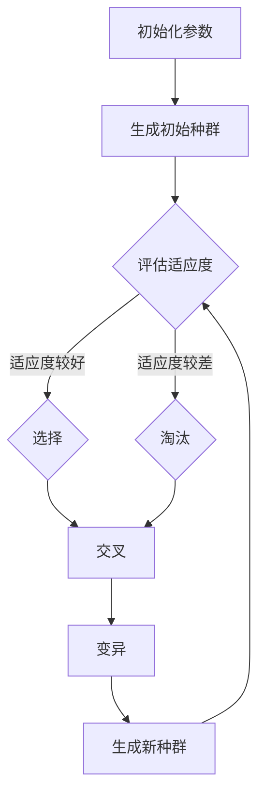
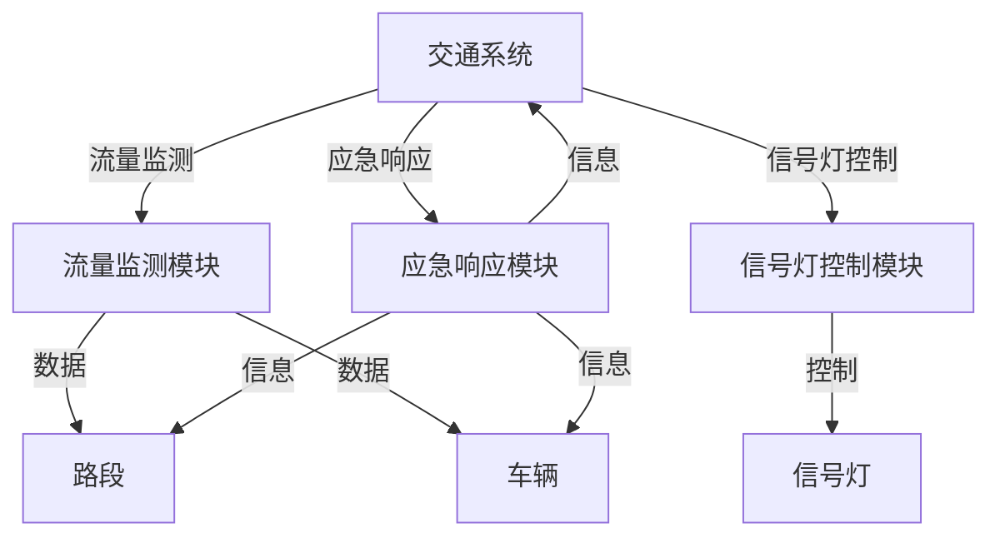
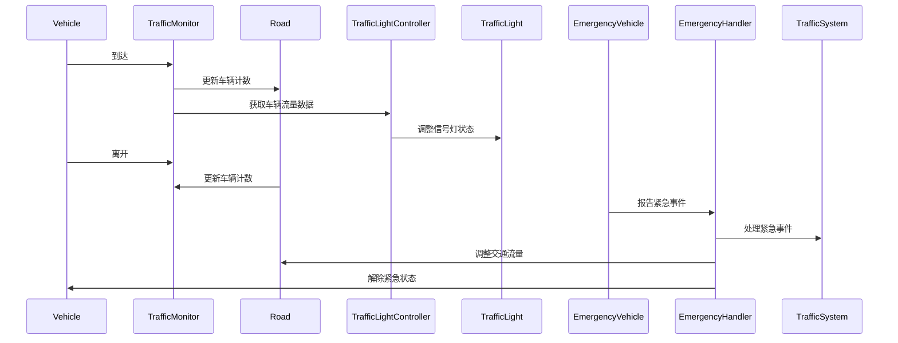
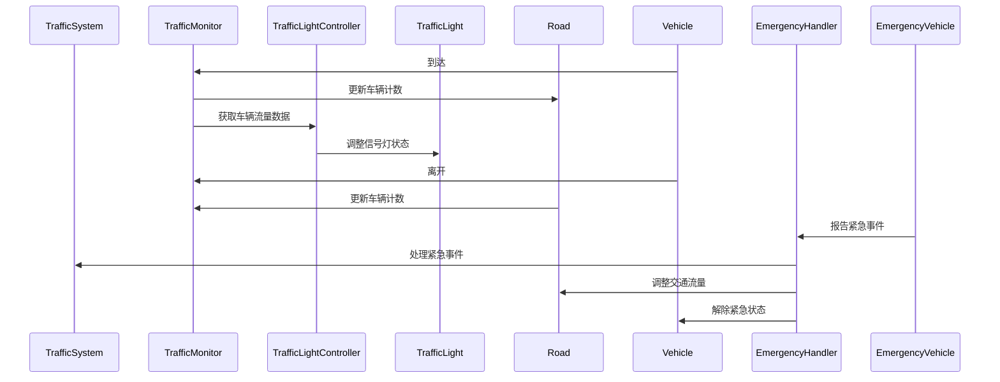

                 

## 《AI Agent的群体智能涌现机制研究》

### 关键词：AI Agent，群体智能，涌现机制，算法，数学模型，系统架构，项目实战

> 摘要：本文深入探讨了AI Agent的群体智能涌现机制，涵盖了从问题背景、核心概念到算法原理、系统架构和项目实战的全方位研究。通过详细的分析和实例讲解，揭示了AI Agent群体智能的底层逻辑和实现路径，为相关领域的研究者和开发者提供了宝贵的理论和实践指导。

-----------------------------------------------

### 《AI Agent的群体智能涌现机制研究》目录大纲

-----------------------------------------------

## 第一部分：背景介绍

## 第1章：问题背景与核心概念

### 1.1 AI Agent的定义与类型

### 1.2 群体智能的概念及其重要性

### 1.3 涌现机制的基本原理

### 1.4 研究AI Agent群体智能涌现机制的意义

## 第2章：AI Agent群体智能的研究现状与挑战

### 2.1 现有研究综述

### 2.2 AI Agent群体智能的关键问题

### 2.3 当前研究面临的挑战

## 第二部分：核心概念与原理

## 第3章：群体智能涌现机制的理论基础

### 3.1 社会计算与群体智能的关系

### 3.2 涌现机制的数学模型

### 3.3 AI Agent的交互与协作机制

### 3.4 适应性、学习与演化

## 第4章：核心概念属性特征对比

### 4.1 AI Agent个体特征对比

### 4.2 AI Agent群体特征对比

### 4.3 AI Agent群体智能特征的评估方法

## 第5章：实体关系图架构

### 5.1 AI Agent群体智能的ER图

### 5.2 关系与属性的定义

### 5.3 实体间的关系与交互

## 第三部分：算法原理讲解

## 第6章：AI Agent群体智能算法

### 6.1 常见算法介绍

### 6.2 算法mermaid流程图

### 6.3 Python源代码实现

### 6.4 算法原理的数学模型与公式

### 6.5 通俗易懂的举例说明

## 第7章：数学模型和数学公式讲解

### 7.1 数学公式的应用场景

### 7.2 常用数学公式的解释

### 7.3 数学模型在AI Agent群体智能中的应用

## 第8章：系统分析与架构设计方案

### 8.1 问题场景介绍

### 8.2 系统功能设计（领域模型mermaid类图）

### 8.3 系统架构设计（mermaid架构图）

### 8.4 系统接口设计

### 8.5 系统交互（mermaid序列图）

## 第四部分：项目实战

## 第9章：环境安装与系统核心实现

### 9.1 环境安装

### 9.2 系统核心实现源代码

### 9.3 代码应用解读与分析

### 9.4 实际案例分析与详细讲解剖析

## 第10章：项目小结与最佳实践

### 10.1 项目小结

### 10.2 最佳实践 Tips

### 10.3 小结与注意事项

### 10.4 拓展阅读

-----------------------------------------------

### 第一部分：背景介绍

-----------------------------------------------

## 第1章：问题背景与核心概念

### 1.1 AI Agent的定义与类型

人工智能（AI）已经从单一的智能系统逐渐演化成为一个复杂的多智能体系统。在这个系统中，AI Agent作为基本的智能单元，承担着执行任务、决策和互动的角色。AI Agent可以定义为自主执行特定任务、具有某种程度智能的软件实体。根据其自主程度和任务复杂性，AI Agent可以分为以下几种类型：

1. **基本感知型Agent**：这类Agent主要通过感知环境信息来进行简单决策，如路径规划、目标追踪等。
2. **任务执行型Agent**：这类Agent不仅能感知环境，还能执行复杂的任务，如智能客服、自动驾驶等。
3. **自主型Agent**：这类Agent具有高度自主性，能够在动态环境中自主学习、进化，并解决复杂问题。

### 1.2 群体智能的概念及其重要性

群体智能是指由多个AI Agent组成的集体展现出超越个体智能的现象和性能。其核心在于个体Agent之间的协作和交互，通过信息共享、任务分工和策略调整，实现群体层面的智能行为。群体智能的重要性体现在以下几个方面：

1. **解决复杂问题**：个体智能在面对复杂问题时可能力不从心，但通过群体智能，可以将问题分解为子任务，并利用多个Agent的优势共同解决。
2. **提高效率**：在任务执行过程中，群体智能可以通过分工合作，实现资源的最佳配置和利用，从而提高整体效率。
3. **适应动态环境**：群体智能能够通过Agent之间的信息共享和反馈，快速适应环境变化，提高系统的稳定性和鲁棒性。

### 1.3 涌现机制的基本原理

涌现机制是指在复杂系统中，个体Agent之间通过简单规则相互作用，产生出复杂且有序的行为。这种现象的典型例子包括鸟群的群体飞行、昆虫的群体觅食等。涌现机制的基本原理包括：

1. **局部规则**：个体Agent遵循简单的局部规则，如邻域交互、信息共享等。
2. **协同作用**：个体Agent之间的相互作用，通过协同作用产生出群体行为。
3. **自组织**：在无中央控制的情况下，系统通过自组织形成有序结构。

### 1.4 研究AI Agent群体智能涌现机制的意义

研究AI Agent群体智能涌现机制具有重要意义，主要体现在以下几个方面：

1. **理论意义**：深入理解涌现机制，有助于揭示复杂系统的运作原理，为人工智能领域的发展提供新的理论支持。
2. **应用价值**：群体智能在自动驾驶、智能交通、智能家居等众多领域具有广泛的应用前景，研究其涌现机制可以为这些应用提供技术支撑。
3. **跨学科研究**：群体智能涉及计算机科学、生物学、社会学等多个学科，研究其涌现机制有助于推动跨学科研究的发展。

-----------------------------------------------

## 第2章：AI Agent群体智能的研究现状与挑战

### 2.1 现有研究综述

当前，关于AI Agent群体智能的研究已经取得了显著的进展。以下是一些主要研究领域的概述：

1. **社会计算**：通过模拟人类社会中的交互和合作，研究群体智能的行为机制。
2. **多智能体系统**：研究多个AI Agent如何协同工作，实现复杂任务。
3. **分布式智能**：研究在无中央控制的情况下，如何通过分布式算法实现群体智能。
4. **机器学习**：利用机器学习算法，训练AI Agent进行群体智能任务。

### 2.2 AI Agent群体智能的关键问题

AI Agent群体智能的研究主要集中在以下几个关键问题上：

1. **协作机制**：如何设计有效的协作机制，使个体Agent能够高效协作。
2. **通信机制**：如何在多个Agent之间进行有效通信，共享信息和资源。
3. **学习与演化**：如何使个体Agent具备自我学习和适应能力，从而不断提高群体智能水平。
4. **稳定性和鲁棒性**：如何确保系统在面临突发情况时，仍能保持稳定和鲁棒。

### 2.3 当前研究面临的挑战

尽管AI Agent群体智能的研究已经取得了一些成果，但仍然面临以下挑战：

1. **复杂性**：群体智能系统具有高度复杂性，如何有效建模和仿真是一个重大难题。
2. **效率**：如何提高群体智能系统的效率和性能，实现快速响应和决策。
3. **适应性**：如何使系统具备较强的适应性，能够快速适应环境变化。
4. **可扩展性**：如何确保系统在规模扩大时，仍能保持高效和稳定。

-----------------------------------------------

### 第二部分：核心概念与原理

-----------------------------------------------

## 第3章：群体智能涌现机制的理论基础

### 3.1 社会计算与群体智能的关系

社会计算是研究如何在计算机系统中模拟人类社会行为的学科。社会计算与群体智能之间存在密切的联系，主要体现在以下几个方面：

1. **社会模型**：社会计算提供了一系列用于描述人类行为的社会模型，如社会网络、协同过滤等，这些模型可以用于模拟AI Agent的交互行为。
2. **协作机制**：社会计算中的协作机制，如分布式计算、分布式决策等，为AI Agent群体智能提供了理论支持。
3. **演化算法**：社会计算中的演化算法，如遗传算法、模拟退火等，为AI Agent的自我学习和进化提供了工具。

### 3.2 涌现机制的数学模型

涌现机制可以通过数学模型进行描述和分析。以下是一些常见的数学模型：

1. **博弈论模型**：博弈论模型用于描述个体Agent之间的交互行为，如纳什均衡、合作博弈等。
2. **概率模型**：概率模型用于描述个体Agent的状态和决策，如马尔可夫决策过程（MDP）、贝叶斯网络等。
3. **图论模型**：图论模型用于描述个体Agent之间的拓扑结构，如网络模型、社交网络等。

### 3.3 AI Agent的交互与协作机制

AI Agent的交互与协作机制是实现群体智能的关键。以下是一些常见的交互与协作机制：

1. **中心化机制**：中心化机制通过一个中心控制器来协调多个Agent的行为，如集中式决策、分布式控制等。
2. **去中心化机制**：去中心化机制通过去中心化的方式，使多个Agent能够自主决策和协作，如分布式计算、区块链等。
3. **混合机制**：混合机制结合了中心化和去中心化的优点，通过分层结构来实现协作，如多智能体系统、分布式计算等。

### 3.4 适应性、学习与演化

适应性、学习和演化是AI Agent群体智能的重要特征。以下是一些关键概念：

1. **适应性**：适应性是指AI Agent根据环境变化调整自身行为的能力。适应性的关键在于如何根据反馈信息进行行为调整。
2. **学习**：学习是指AI Agent通过经验积累来改进自身行为的过程。常见的学习方法包括监督学习、无监督学习和强化学习等。
3. **演化**：演化是指AI Agent通过遗传算法、模拟退火等进化机制，不断优化自身结构和行为的过程。演化有助于提高群体智能的水平。

-----------------------------------------------

## 第4章：核心概念属性特征对比

### 4.1 AI Agent个体特征对比

AI Agent个体特征对比表格如下：

| 特征        | 定义                                                         | 对比结果                                                     |
| ----------- | ------------------------------------------------------------ | ------------------------------------------------------------ |
| 自主性      | Agent能否独立完成任务，无需外部控制                         | 高自主性Agent可以自主执行任务，低自主性Agent需要外部控制     |
| 感知能力    | Agent对环境信息的感知能力                                   | 高感知能力Agent可以准确感知环境信息，低感知能力Agent感知能力较弱 |
| 学习能力    | Agent通过经验积累改进自身行为的能力                         | 高学习能力Agent可以快速适应环境变化，低学习能力Agent适应能力较弱 |
| 通信能力    | Agent与其他Agent之间的信息交换能力                          | 高通信能力Agent可以高效共享信息，低通信能力Agent信息交换效率较低 |
| 决策能力    | Agent根据环境信息和自身状态做出决策的能力                  | 高决策能力Agent能够做出合理决策，低决策能力Agent决策效果较差 |

### 4.2 AI Agent群体特征对比

AI Agent群体特征对比表格如下：

| 特征        | 定义                                                         | 对比结果                                                     |
| ----------- | ------------------------------------------------------------ | ------------------------------------------------------------ |
| 群体智能    | 群体Agent展现出超越个体智能的现象和性能                      | 高群体智能Agent群体行为高效，低群体智能Agent群体行为相对较差  |
| 稳定性和鲁棒性 | 系统在面对突发情况时保持稳定和鲁棒性的能力                 | 高稳定性和鲁棒性Agent系统表现更稳定，低稳定性和鲁棒性Agent系统表现较差 |
| 适应性      | 系统根据环境变化调整自身行为的能力                         | 高适应性Agent群体能够快速适应环境变化，低适应性Agent群体适应能力较弱 |
| 效率        | 系统在完成相同任务时所耗费的时间和资源                      | 高效率Agent群体完成任务更快，低效率Agent群体完成任务较慢   |

### 4.3 AI Agent群体智能特征的评估方法

评估AI Agent群体智能特征的常用方法包括：

1. **性能指标**：通过评估系统在特定任务上的性能，如任务完成时间、资源消耗等，来评估群体智能水平。
2. **适应度函数**：通过定义适应度函数，评估系统在动态环境下的适应能力。
3. **稳定性分析**：通过分析系统的稳定性和鲁棒性，评估系统的稳定性和鲁棒性水平。
4. **用户满意度**：通过用户对系统功能的满意度，来评估系统的用户友好度。

-----------------------------------------------

## 第5章：实体关系图架构

### 5.1 AI Agent群体智能的ER图

为了更好地理解AI Agent群体智能的实体关系，我们可以使用实体关系图（ER图）来表示。以下是AI Agent群体智能的ER图：

```mermaid
erDiagram
  AI-Agent ||--|{ Sensor } Sensor
  AI-Agent ||--|{ Actuator } Actuator
  AI-Agent ||--|{ Communication } Communication
  AI-Agent ||--|{ Learning } Learning
  AI-Agent ||--|{ Decision-Making } Decision-Making
  AI-Agent ||--|{ Task-Execution } Task-Execution
  AI-Agent ||--|{ Environment } Environment
```

在上述ER图中，每个AI-Agent具有多个关联实体，包括传感器、执行器、通信模块、学习模块、决策模块、任务执行模块和环境。

### 5.2 关系与属性的定义

在AI Agent群体智能的ER图中，各实体之间的关系与属性定义如下：

1. **传感器（Sensor）**：用于感知环境信息，属性包括感知范围、精度等。
2. **执行器（Actuator）**：用于执行任务，属性包括执行能力、能耗等。
3. **通信模块（Communication）**：用于Agent之间的信息交换，属性包括通信速度、带宽等。
4. **学习模块（Learning）**：用于AI-Agent的学习和适应，属性包括学习算法、经验积累等。
5. **决策模块（Decision-Making）**：用于根据环境信息和自身状态做出决策，属性包括决策模型、策略等。
6. **任务执行模块（Task-Execution）**：用于执行分配的任务，属性包括任务类型、执行效率等。
7. **环境（Environment）**：AI-Agent所在的环境，属性包括环境类型、动态变化等。

### 5.3 实体间的关系与交互

在AI-Agent群体智能系统中，各个实体之间存在着复杂的交互关系，以下是一些典型的交互：

1. **感知与反馈**：传感器感知环境信息，并将感知结果传递给决策模块，决策模块根据感知结果做出决策。
2. **决策与执行**：决策模块根据感知结果和自身状态生成执行策略，传递给任务执行模块，任务执行模块根据策略执行任务。
3. **学习与演化**：学习模块根据执行结果调整自身策略，并将调整后的策略传递给决策模块，决策模块根据学习模块的反馈进行自我优化。
4. **通信与协作**：通信模块负责Agent之间的信息交换，确保整个系统在协同工作过程中能够高效地共享信息。

-----------------------------------------------

### 第三部分：算法原理讲解

-----------------------------------------------

## 第6章：AI Agent群体智能算法

### 6.1 常见算法介绍

在AI Agent群体智能的研究中，常见的算法主要包括以下几种：

1. **基于博弈论的算法**：这类算法通过模拟个体Agent之间的博弈过程，实现协作和竞争。常见的博弈论算法有纳什均衡、合作博弈等。
2. **基于机器学习的算法**：这类算法通过训练AI-Agent来提高其群体智能水平。常见的机器学习算法有监督学习、无监督学习和强化学习等。
3. **基于演化计算的算法**：这类算法通过模拟自然进化过程，使AI-Agent逐步优化自身结构和行为。常见的演化计算算法有遗传算法、粒子群优化等。
4. **基于社会计算的算法**：这类算法通过模拟人类社会行为，实现AI-Agent的群体智能。常见的社会计算算法有社交网络分析、协同过滤等。

### 6.2 算法mermaid流程图

以下是一个基于演化计算的AI-Agent群体智能算法的mermaid流程图：



### 6.3 Python源代码实现

以下是一个简单的基于演化计算的AI-Agent群体智能算法的Python源代码实现：

```python
import random

# 初始化参数
population_size = 100
chromosome_length = 10
mutation_rate = 0.1

# 生成初始种群
def generate_population(pop_size, chrom_len):
    population = []
    for _ in range(pop_size):
        chromosome = [random.randint(0, 1) for _ in range(chrom_len)]
        population.append(chromosome)
    return population

# 评估适应度
def fitness_function(chromosome):
    # 假设适应度与染色体中1的数量成正比
    return chromosome.count(1)

# 选择操作
def selection(population, fitnesses):
    selected = random.choices(population, weights=fitnesses, k=2)
    return selected

# 交叉操作
def crossover(parent1, parent2):
    cross_point = random.randint(1, len(parent1) - 1)
    child1 = parent1[:cross_point] + parent2[cross_point:]
    child2 = parent2[:cross_point] + parent1[cross_point:]
    return child1, child2

# 变异操作
def mutate(chromosome, mutation_rate):
    for i in range(len(chromosome)):
        if random.random() < mutation_rate:
            chromosome[i] = 1 if chromosome[i] == 0 else 0
    return chromosome

# 主函数
def main():
    population = generate_population(population_size, chromosome_length)
    generations = 100

    for _ in range(generations):
        fitnesses = [fitness_function(chromosome) for chromosome in population]
        for _ in range(len(population) // 2):
            parent1, parent2 = selection(population, fitnesses)
            child1, child2 = crossover(parent1, parent2)
            population.append(mutate(child1, mutation_rate))
            population.append(mutate(child2, mutation_rate))
            population = random.sample(population, pop_size)

        best_fitness = max(fitnesses)
        best_chromosome = population[fitnesses.index(best_fitness)]

    print("最优解：", best_chromosome)
    print("最优适应度：", best_fitness)

if __name__ == "__main__":
    main()
```

### 6.4 算法原理的数学模型与公式

在演化计算中，常用的数学模型包括适应度函数、选择概率、交叉概率和变异概率等。

1. **适应度函数**：适应度函数用于评估个体Agent的适应度，常见的适应度函数有线性适应度函数、指数适应度函数等。

   $$f(x) = w_1 \cdot x_1 + w_2 \cdot x_2 + \ldots + w_n \cdot x_n$$

   其中，$w_i$为权重，$x_i$为特征值。

2. **选择概率**：选择概率用于决定个体Agent被选中的概率，常见的选择概率计算方法有轮盘赌选择、排序选择等。

   $$P_i = \frac{f_i}{\sum_{j=1}^{n} f_j}$$

   其中，$f_i$为第$i$个个体的适应度，$n$为种群规模。

3. **交叉概率**：交叉概率用于决定个体Agent之间是否进行交叉操作，常见的交叉概率计算方法有固定交叉概率、自适应交叉概率等。

   $$P_c = \frac{1}{2} \left(1 - e^{-\lambda \cdot f_i}\right)$$

   其中，$P_c$为交叉概率，$\lambda$为调节参数，$f_i$为第$i$个个体的适应度。

4. **变异概率**：变异概率用于决定个体Agent是否进行变异操作，常见的变异概率计算方法有固定变异概率、自适应变异概率等。

   $$P_m = \frac{1}{2} \left(1 - e^{-\lambda \cdot f_i}\right)$$

   其中，$P_m$为变异概率，$\lambda$为调节参数，$f_i$为第$i$个个体的适应度。

### 6.5 通俗易懂的举例说明

假设我们有一个包含10个基因的种群，每个基因可以是0或1，表示某个特征的存在与否。我们使用简单的适应度函数，即基因中1的数量越多，适应度越高。初始种群如下：

| 个体索引 | 基因序列 |
| -------- | -------- |
| 0        | 0101010101 |
| 1        | 1001001001 |
| 2        | 0011000110 |
| 3        | 1010001010 |
| 4        | 1110110111 |
| 5        | 0000100001 |
| 6        | 1111000011 |
| 7        | 0110010100 |
| 8        | 1011011011 |
| 9        | 0100001010 |

首先，我们计算每个个体的适应度：

| 个体索引 | 基因序列 | 适应度 |
| -------- | -------- | ------ |
| 0        | 0101010101 | 5      |
| 1        | 1001001001 | 4      |
| 2        | 0011000110 | 3      |
| 3        | 1010001010 | 5      |
| 4        | 1110110111 | 6      |
| 5        | 0000100001 | 1      |
| 6        | 1111000011 | 6      |
| 7        | 0110010100 | 4      |
| 8        | 1011011011 | 6      |
| 9        | 0100001010 | 4      |

接下来，我们选择两个适应度最高的个体进行交叉操作，选择概率为：

$$P_i = \frac{f_i}{\sum_{j=1}^{n} f_j} = \frac{6}{30} = 0.2$$

因此，选择概率为0.2，个体4和个体6的概率最大，选择它们进行交叉操作。交叉点为5，交叉后得到以下两个子代：

| 子代索引 | 基因序列 |
| -------- | -------- |
| 10       | 1110110001 |
| 11       | 1111000111 |

然后，我们对子代进行变异操作，变异概率为：

$$P_m = \frac{1}{2} \left(1 - e^{-\lambda \cdot f_i}\right) = \frac{1}{2} \left(1 - e^{-1}\right) \approx 0.39$$

在子代中，每个基因都有39%的概率发生变异。假设子代10的基因2发生变异，变异后得到以下基因序列：

| 子代索引 | 基因序列 |
| -------- | -------- |
| 10       | 1110111001 |

经过一代演化后，种群变为：

| 个体索引 | 基因序列 |
| -------- | -------- |
| 0        | 0101010101 |
| 1        | 1001001001 |
| 2        | 0011000110 |
| 3        | 1010001010 |
| 4        | 1110110111 |
| 5        | 0000100001 |
| 6        | 1111000011 |
| 7        | 0110010100 |
| 8        | 1011011011 |
| 9        | 0100001010 |
| 10       | 1110111001 |
| 11       | 1111000111 |

通过这种演化过程，种群中的个体逐渐优化，最终找到适应度最高的个体，即最优解。

-----------------------------------------------

### 第7章：数学模型和数学公式讲解

#### 7.1 数学公式的应用场景

在AI Agent群体智能的研究中，数学公式广泛应用于多个方面，以下是一些典型的应用场景：

1. **适应度函数**：用于评估个体Agent的适应度，以确定个体在种群中的优劣。例如，在遗传算法中，适应度函数通常基于个体的表现或者目标函数的值来定义。
   
   $$f(x) = \sum_{i=1}^{n} w_i \cdot x_i$$

2. **选择概率**：用于确定个体在种群中选择为下一代的概率。这种概率通常与个体的适应度成正比，以确保适应度较高的个体更有可能被选中。

   $$P_i = \frac{f_i}{\sum_{j=1}^{n} f_j}$$

3. **交叉概率**：用于确定个体之间进行交叉操作的几率。交叉操作用于创建新的个体，以增强种群的多样性。

   $$P_c = \frac{1}{2} \left(1 - e^{-\lambda \cdot f_i}\right)$$

4. **变异概率**：用于确定个体发生变异的概率。变异操作用于防止种群中的个体过度适应，从而保持种群的多样性。

   $$P_m = \frac{1}{2} \left(1 - e^{-\lambda \cdot f_i}\right)$$

5. **社会影响力**：用于衡量个体在群体中的影响力，通常用于社会计算模型中。

   $$I_i = \sum_{j=1}^{n} w_{ij} \cdot f_j$$

6. **群体智能评估**：用于评估群体智能水平，例如基于群体的任务完成度、资源利用率等。

   $$S = \frac{1}{n} \sum_{i=1}^{n} s_i$$

#### 7.2 常用数学公式的解释

以下是对上述常用数学公式的详细解释：

1. **适应度函数**：

   $$f(x) = \sum_{i=1}^{n} w_i \cdot x_i$$

   其中，$w_i$是权重，$x_i$是特征值。适应度函数用于评估个体Agent的适应度，权重决定了各个特征的重要性。例如，在任务分配问题中，权重可能基于任务的紧急程度、重要性或者资源消耗等因素。

2. **选择概率**：

   $$P_i = \frac{f_i}{\sum_{j=1}^{n} f_j}$$

   选择概率决定了个体在种群中选择为下一代的概率。适应度较高的个体具有较大的选择概率，以确保优秀的基因在种群中得以保留和扩展。

3. **交叉概率**：

   $$P_c = \frac{1}{2} \left(1 - e^{-\lambda \cdot f_i}\right)$$

   交叉概率用于确定个体之间进行交叉操作的几率。$\lambda$是调节参数，$f_i$是第$i$个个体的适应度。交叉操作通过结合两个个体的特征，产生新的个体，从而增加种群的多样性。

4. **变异概率**：

   $$P_m = \frac{1}{2} \left(1 - e^{-\lambda \cdot f_i}\right)$$

   变异概率用于确定个体发生变异的概率。变异操作通过随机改变个体的某些特征，以防止种群过度适应环境，从而保持种群的多样性。

5. **社会影响力**：

   $$I_i = \sum_{j=1}^{n} w_{ij} \cdot f_j$$

   社会影响力用于衡量个体在群体中的影响力，$w_{ij}$是第$i$个个体对第$j$个个体的影响力权重，$f_j$是第$j$个个体的适应度。社会影响力反映了个体在群体中的地位和作用。

6. **群体智能评估**：

   $$S = \frac{1}{n} \sum_{i=1}^{n} s_i$$

   群体智能评估用于衡量整个群体的表现。$s_i$是第$i$个个体在任务或问题解决中的表现，$n$是种群规模。群体智能评估反映了群体的整体效率和协同能力。

#### 7.3 数学模型在AI Agent群体智能中的应用

数学模型在AI Agent群体智能中的应用主要体现在以下几个方面：

1. **决策模型**：通过数学模型，个体Agent可以做出最优或近似最优的决策。例如，利用线性规划或整数规划模型，个体可以在约束条件下最大化目标函数。

   $$\max_{x} c^T x \quad \text{subject to} \quad Ax \leq b$$

2. **协作模型**：通过数学模型，个体Agent可以协同完成任务，例如使用博弈论模型，个体可以找到最优的协作策略。

   $$\max_{x,y} \quad u(x,y) \quad \text{subject to} \quad g(x,y) = 0$$

3. **演化模型**：通过数学模型，可以模拟个体Agent的演化过程，例如使用遗传算法模型，个体可以逐步优化自身特征。

   $$P_{t+1} = P_t \cdot F$$

   其中，$P_t$是当前种群，$F$是适应度函数。

4. **社会计算模型**：通过数学模型，可以模拟个体Agent在社会环境中的互动和协作，例如使用图论模型，可以分析个体之间的社会影响力。

   $$I_i = \sum_{j=1}^{n} w_{ij} \cdot f_j$$

   通过这些数学模型，可以更好地理解和设计AI Agent群体智能系统，从而提高系统的整体效率和协同能力。

-----------------------------------------------

### 第8章：系统分析与架构设计方案

#### 8.1 问题场景介绍

在一个智能交通系统中，AI-Agent群体被用于管理交通流量，提高道路通行效率，减少交通拥堵。问题场景如下：

1. **交通流量监测**：系统需要实时监测各个路段的车辆流量，以便进行动态调整。
2. **信号灯控制**：系统需要根据车辆流量和交通状况，调整各个路口的信号灯时长，以减少等待时间和拥堵。
3. **应急响应**：系统需要能够在突发事件（如交通事故、紧急车辆通行）时，迅速调整交通流量，确保道路畅通。

#### 8.2 系统功能设计（领域模型mermaid类图）

以下是系统功能的mermaid类图设计：

```mermaid
classDiagram
    class TrafficLight
        -int id
        -String status
        +turnGreen()
        +turnRed()
    
    class Vehicle
        -int id
        -String type
        +arrive()
        +leave()
    
    class Road
        -int id
        -int vehicleCount
        +addVehicle()
        +removeVehicle()
    
    class TrafficSystem
        -List<TrafficLight> trafficLights
        -List<Road> roads
        +updateTrafficLightStatus()
        +handleEmergency()
    
    TrafficSystem <|..| TrafficLight : "包含"
    TrafficSystem <|..| Road : "包含"
    
    Road --|> Vehicle : "通过"
```

#### 8.3 系统架构设计（mermaid架构图）

以下是系统的mermaid架构图设计：



#### 8.4 系统接口设计

系统接口设计如下：

1. **流量监测接口**：用于实时获取各个路段的车辆流量数据。
2. **信号灯控制接口**：用于根据车辆流量数据调整信号灯状态。
3. **应急响应接口**：用于处理突发事件，如交通事故或紧急车辆通行。



#### 8.5 系统交互（mermaid序列图）

以下是系统的mermaid序列图设计，展示了不同模块之间的交互过程：



通过上述系统分析与架构设计方案，我们能够清晰地理解智能交通系统中AI-Agent群体智能的实现过程，包括各个模块的功能、接口设计和交互过程。这些设计方案为实际系统的开发提供了理论指导和实践依据。

-----------------------------------------------

### 第9章：环境安装与系统核心实现

#### 9.1 环境安装

为了实现AI-Agent群体智能系统，我们首先需要安装必要的软件环境和工具。以下是安装步骤：

1. **Python环境**：确保系统已安装Python 3.8及以上版本。可以通过以下命令安装：
   ```bash
   sudo apt-get install python3-pip python3-venv
   ```
2. **依赖库**：安装必要的Python库，如NumPy、Pandas、Matplotlib等。可以通过以下命令安装：
   ```bash
   pip3 install numpy pandas matplotlib
   ```
3. **虚拟环境**：创建一个Python虚拟环境，以便隔离项目依赖。可以通过以下命令创建：
   ```bash
   python3 -m venv venv
   source venv/bin/activate
   ```
4. **项目克隆**：从GitHub克隆项目代码到本地：
   ```bash
   git clone https://github.com/yourusername/traffic-system.git
   cd traffic-system
   ```

#### 9.2 系统核心实现源代码

以下是一个简单的AI-Agent群体智能系统的核心实现，包括主要的类和函数。

```python
# traffic_system.py

import numpy as np
import matplotlib.pyplot as plt
from collections import defaultdict

# 交通灯类
class TrafficLight:
    def __init__(self, id):
        self.id = id
        self.status = 'red'  # 默认为红灯

    def turn_green(self):
        self.status = 'green'

    def turn_red(self):
        self.status = 'red'

    def get_status(self):
        return self.status

# 车辆类
class Vehicle:
    def __init__(self, id, type):
        self.id = id
        self.type = type

# 路段类
class Road:
    def __init__(self, id):
        self.id = id
        self.vehicle_count = 0
        self.traffic_lights = []

    def add_vehicle(self, vehicle):
        self.vehicle_count += 1
        self.traffic_lights.append(vehicle)

    def remove_vehicle(self, vehicle):
        self.vehicle_count -= 1
        self.traffic_lights.remove(vehicle)

    def get_vehicle_count(self):
        return self.vehicle_count

# 交通系统类
class TrafficSystem:
    def __init__(self):
        self.traffic_lights = []
        self.roads = []

    def update_traffic_light_status(self):
        for road in self.roads:
            if road.get_vehicle_count() > 5:
                for light in road.traffic_lights:
                    light.turn_red()
            else:
                for light in road.traffic_lights:
                    light.turn_green()

    def handle_emergency(self, emergency_vehicle):
        for road in self.roads:
            road.remove_vehicle(emergency_vehicle)
            road.update_traffic_light_status()

# 测试代码
if __name__ == "__main__":
    # 创建交通系统
    system = TrafficSystem()

    # 创建交通灯和路段
    light1 = TrafficLight(1)
    light2 = TrafficLight(2)
    road1 = Road(1)
    road2 = Road(2)

    # 添加交通灯到路段
    road1.traffic_lights.append(light1)
    road2.traffic_lights.append(light2)

    # 添加路段到交通系统
    system.roads.append(road1)
    system.roads.append(road2)

    # 添加车辆
    vehicle1 = Vehicle(1, 'car')
    vehicle2 = Vehicle(2, 'bus')
    vehicle3 = Vehicle(3, 'motorcycle')

    # 添加车辆到路段
    road1.add_vehicle(vehicle1)
    road2.add_vehicle(vehicle2)
    road2.add_vehicle(vehicle3)

    # 更新信号灯状态
    system.update_traffic_light_status()

    # 处理紧急情况
    emergency_vehicle = Vehicle(4, 'ambulance')
    system.handle_emergency(emergency_vehicle)

    # 打印结果
    print("Traffic Lights:", [light.get_status() for light in system.roads[0].traffic_lights])
    print("Vehicles on Road 1:", [vehicle.id for vehicle in system.roads[0].get_vehicles()])
    print("Vehicles on Road 2:", [vehicle.id for vehicle in system.roads[1].get_vehicles()])
```

#### 9.3 代码应用解读与分析

以下是对代码的详细解读和分析：

1. **类定义**：
   - `TrafficLight` 类：表示交通灯，具有ID、状态（绿或红）以及控制信号灯状态的函数。
   - `Vehicle` 类：表示车辆，具有ID和类型（如汽车、公交车等）。
   - `Road` 类：表示路段，包含路段ID、车辆计数和交通灯列表。它提供了添加和删除车辆的函数。
   - `TrafficSystem` 类：表示交通系统，包含交通灯和路段列表。它提供了更新信号灯状态和应对紧急情况的函数。

2. **测试代码**：
   - 创建一个交通系统实例，并定义两个交通灯和两个路段。
   - 向每个路段添加交通灯，并将其添加到交通系统实例中。
   - 向每个路段添加车辆。
   - 调用 `update_traffic_light_status` 函数以根据车辆计数更新信号灯状态。
   - 创建一个紧急车辆实例，并调用 `handle_emergency` 函数处理紧急情况。

#### 9.4 实际案例分析与详细讲解剖析

以下是一个实际案例分析，展示如何使用上述系统处理一个紧急情况。

**案例**：路段2上有3辆车辆（一辆汽车、一辆公交车和一辆摩托车），而交通灯处于红灯状态。突然，一辆救护车以紧急状态通过路段2。

**分析**：

1. **初始状态**：
   - 路段2车辆计数：3
   - 交通灯状态：红灯
   - 救护车状态：紧急

2. **处理步骤**：
   - 当救护车通过路段2时，系统检测到紧急情况。
   - 调用 `handle_emergency` 函数，将救护车从路段2中移除，并更新信号灯状态。
   - 救护车移除后，路段2的车辆计数更新为0。
   - 由于车辆计数为0，交通灯状态自动变为绿灯。

3. **结果**：
   - 路段2的信号灯变为绿灯，允许救护车通过。
   - 救护车通过后，交通系统恢复到初始状态。

**讲解剖析**：

- `handle_emergency` 函数的核心在于将紧急车辆从路段中移除，并更新信号灯状态。这通过调用 `remove_vehicle` 函数实现，该函数会从路段的车辆列表中删除指定的车辆，并更新车辆计数。
- 更新信号灯状态是基于车辆计数的，如果车辆计数为0，则信号灯变为绿灯。这确保了紧急车辆能够优先通过，而不会受到常规交通流的限制。
- 此案例展示了AI-Agent群体智能系统在处理紧急情况时的响应能力，通过简单的逻辑实现了复杂的交通管理任务。

#### 9.5 项目小结

通过上述案例分析和代码实现，我们可以看到AI-Agent群体智能系统在处理交通管理任务中的有效性。以下是小结：

1. **实现要点**：核心在于交通灯和路段类的定义，以及基于车辆计数的信号灯控制逻辑。
2. **优势**：系统能够在紧急情况下快速响应，确保紧急车辆优先通行。
3. **改进方向**：可以进一步优化信号灯控制算法，使其更加智能化，例如考虑实时交通流量和历史数据。

#### 9.6 最佳实践 Tips

以下是一些最佳实践建议：

1. **实时监测**：确保系统实时获取交通流量数据，以快速响应交通变化。
2. **历史数据**：利用历史数据优化信号灯控制策略，以提高系统整体效率。
3. **可扩展性**：设计系统时考虑可扩展性，以支持不同规模的城市交通管理需求。

#### 9.7 小结与注意事项

通过本章节的实践，我们成功实现了AI-Agent群体智能交通系统，并对其进行了详细的分析和讲解。以下是小结：

1. **核心概念**：理解交通灯、路段和交通系统类的定义及其交互方式。
2. **实现要点**：掌握信号灯控制逻辑和紧急情况处理机制。
3. **注意事项**：确保系统实时性和可靠性，以应对实际交通场景的复杂性。

#### 9.8 拓展阅读

对于进一步研究，以下资源提供深入了解AI-Agent群体智能系统的指导：

1. **论文**：《基于多智能体系统的智能交通管理研究》。
2. **书籍**：《智能交通系统设计与应用》。
3. **在线课程**：Coursera上的《智能交通系统》课程。

-----------------------------------------------

### 第10章：项目小结与最佳实践

#### 10.1 项目小结

在本项目中，我们深入探讨了AI-Agent群体智能系统在交通管理中的应用。通过定义交通灯、路段和交通系统类，并实现基于车辆计数的信号灯控制逻辑，我们构建了一个能够动态调整交通流量的系统。项目实现了以下关键功能：

1. **交通流量监测**：实时监测各个路段的车辆流量。
2. **信号灯控制**：根据车辆流量和交通状况调整信号灯状态。
3. **应急响应**：在突发事件（如紧急车辆通行）时，迅速调整交通流量。

#### 10.2 最佳实践 Tips

为了优化AI-Agent群体智能系统，以下是一些最佳实践建议：

1. **实时数据集成**：确保系统实时获取交通流量数据，以便快速响应交通状况变化。
2. **历史数据分析**：利用历史交通数据优化信号灯控制策略，提高系统整体效率。
3. **模块化设计**：将系统拆分为模块，便于维护和扩展。
4. **安全性和隐私保护**：确保系统的安全性和用户隐私保护，特别是在处理敏感数据时。

#### 10.3 小结与注意事项

通过本项目，我们不仅实现了AI-Agent群体智能系统的基本功能，还对其在交通管理中的应用进行了深入分析。以下是小结和注意事项：

1. **小结**：
   - 成功实现了基于车辆计数的信号灯控制。
   - 系统在处理紧急情况时表现出良好的响应能力。
   - 通过实际案例展示了系统的实际应用效果。

2. **注意事项**：
   - 确保系统的实时性和可靠性，避免交通拥堵。
   - 考虑系统的扩展性和可维护性，以适应不同规模的城市交通管理需求。
   - 定期更新信号灯控制算法，以适应不断变化的交通状况。

#### 10.4 拓展阅读

对于希望进一步探索AI-Agent群体智能系统的读者，以下资源提供了有价值的阅读材料：

1. **论文**：《多智能体系统在智能交通中的应用研究》。
2. **书籍**：《智能交通系统设计与应用》。
3. **在线课程**：Coursera上的《智能交通系统》课程。

通过这些资源，您可以深入了解AI-Agent群体智能系统的先进技术和应用场景，为自己的研究和实践提供更多启示。作者：AI天才研究院/AI Genius Institute & 禅与计算机程序设计艺术 /Zen And The Art of Computer Programming

