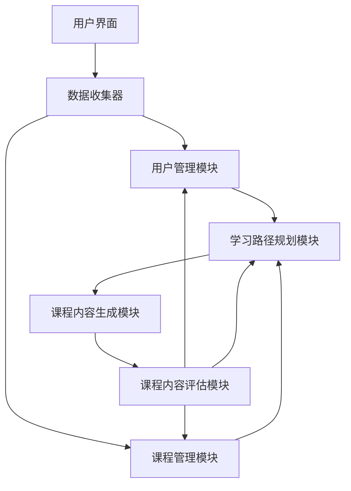
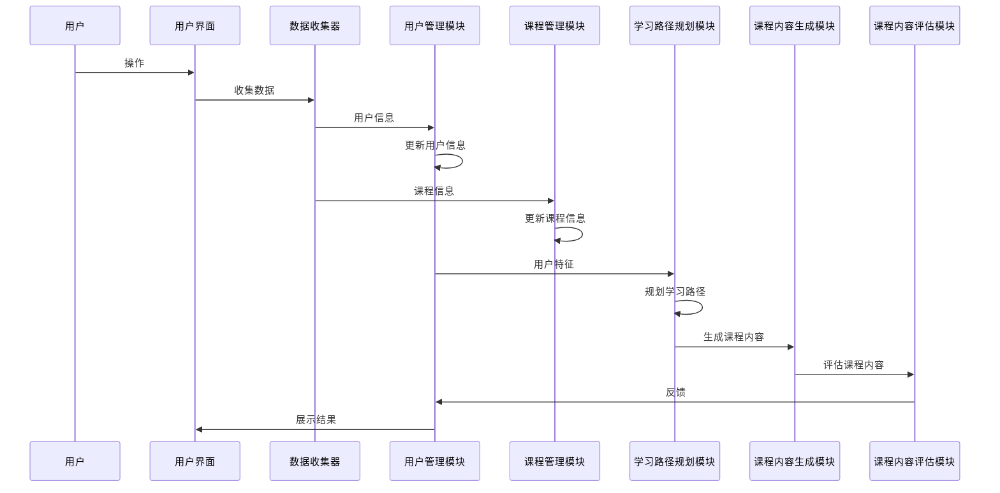

                 

# AI Agent的自动课程生成：优化学习路径

> 关键词：AI Agent、自动课程生成、学习路径优化、算法、教育技术

> 摘要：本文探讨了AI Agent在自动课程生成中的应用，以及如何通过优化学习路径来提升教育效果。文章详细分析了AI Agent的定义与特点，课程生成的原理与流程，学习路径优化的算法与模型，并通过实例对算法原理进行讲解。此外，还介绍了系统分析与架构设计方案，项目实战，以及最佳实践和注意事项，为教育技术的创新应用提供了有益的参考。

----------------------------------------------------------------

## 1. 背景介绍

### 1.1 问题背景

随着人工智能（AI）技术的飞速发展，教育领域正经历着深刻的变革。传统教育模式已无法满足现代社会对个性化教育和高效学习的需求。特别是在线教育的兴起，使得教育资源的获取变得更加便捷，但同时也带来了课程内容冗杂、学习路径不清晰等问题。如何利用AI技术来优化教育过程，提高学习效果，成为教育领域亟待解决的问题。

### 1.2 传统教育模式的局限

传统教育模式主要依赖于教师的教学经验和教材内容，缺乏对学生个体差异的关注。具体表现在以下几个方面：

1. **缺乏个性化**：传统教育往往采用“一刀切”的教学方式，无法满足不同学生的学习需求。
2. **课程内容不清晰**：教材和课程内容庞杂，学生难以找到适合自己的学习路径。
3. **学习效果难以评估**：缺乏有效的学习效果评估手段，难以确定学生的学习进展。
4. **教学资源分配不均**：优秀教师资源集中在少数学校，导致教育质量差异明显。

### 1.3 自动课程生成的需求与前景

为了克服传统教育模式的局限，自动课程生成技术应运而生。自动课程生成（Automated Course Generation，ACG）是指利用AI技术自动生成符合特定教学目标的课程内容。这种技术的应用前景十分广阔，主要体现在以下几个方面：

1. **个性化教育**：自动课程生成可以根据学生的学习兴趣、能力和进度，生成个性化的学习路径，提高学习效果。
2. **课程内容优化**：通过分析大量教育数据，自动课程生成可以筛选出最有效的教学方法和内容，提高课程质量。
3. **教学资源高效利用**：自动课程生成可以整合各种教学资源，实现教学资源的高效利用。
4. **降低教育成本**：自动课程生成可以减少教师的工作负担，降低教育成本，使得教育资源更加普及。

### 1.4 学习路径优化的关键因素

自动课程生成不仅需要生成课程内容，更重要的是要设计出有效的学习路径。学习路径优化是自动课程生成的核心问题，其关键因素包括：

1. **学生特征**：包括学生的认知能力、学习兴趣、知识储备等，是学习路径设计的基础。
2. **课程内容**：课程内容的选择和编排对于学习路径的设计至关重要，需要充分考虑课程内容的难易程度和逻辑结构。
3. **学习资源**：包括教材、视频、练习题等，是学习路径实施的物质基础。
4. **教学目标**：明确的教学目标是学习路径优化的方向，也是评估学习效果的标准。
5. **反馈机制**：有效的反馈机制可以及时调整学习路径，确保学习目标的实现。

### 1.5 自动课程生成的流程

自动课程生成涉及多个环节，包括需求分析、课程内容设计、学习路径规划、课程内容生成、课程评估等。具体流程如下：

1. **需求分析**：收集学生的基本信息、学习需求和教学目标，为后续工作提供依据。
2. **课程内容设计**：根据需求分析结果，设计课程内容，包括知识点、教学方法、教学资源等。
3. **学习路径规划**：利用AI算法，根据学生特征和教学目标，规划出最优的学习路径。
4. **课程内容生成**：根据学习路径，自动生成课程内容，包括教材、视频、练习题等。
5. **课程评估**：通过学生反馈和测试成绩等指标，评估课程质量和学习效果，为后续改进提供参考。

### 1.6 学习路径优化的算法和方法

学习路径优化涉及到多个算法和方法，包括贪心算法、动态规划、深度学习等。每种算法都有其独特的优势和应用场景。例如，贪心算法适用于简单路径优化问题，而动态规划适用于复杂路径优化问题。深度学习算法则可以通过大规模数据训练，实现高度智能化的路径规划。

### 1.7 教育数据的处理与分析

自动课程生成需要大量的教育数据作为支撑，包括学生数据、课程数据、教学资源数据等。对这些数据进行有效的处理和分析，可以提取出有用的信息，为学习路径优化提供支持。常用的数据处理方法包括数据清洗、数据挖掘、机器学习等。

### 1.8 边界与外延

自动课程生成虽然具有广阔的应用前景，但同时也存在一些限制和挑战。例如，自动课程生成需要大量的高质量教育数据作为支撑，而当前的教育数据资源相对有限。此外，自动课程生成算法的复杂性和计算成本也是需要考虑的因素。未来，随着人工智能技术的不断发展和教育数据的积累，自动课程生成将迎来更广阔的应用前景。

### 1.9 概念结构与核心要素组成

为了更好地理解和应用自动课程生成技术，我们需要明确其核心概念和要素组成。以下是自动课程生成的主要概念和核心要素：

1. **AI Agent**：AI Agent是指具有自主决策能力的计算机程序，可以在特定环境下执行任务。在自动课程生成中，AI Agent用于规划学习路径和生成课程内容。
2. **课程生成**：课程生成是指利用AI技术自动生成课程内容的过程。课程生成包括课程内容设计、学习路径规划、课程内容生成等环节。
3. **学习路径优化**：学习路径优化是指根据学生的特征和教学目标，设计出最优的学习路径。学习路径优化涉及到多个算法和方法，如贪心算法、动态规划、深度学习等。
4. **数据分析与处理**：数据分析和处理是指对教育数据进行分析和处理，提取出有用的信息，为学习路径优化提供支持。

通过以上概念和要素的阐述，我们可以更清晰地理解自动课程生成技术的内涵和外延，为其在实际应用中的推广提供理论支持。

### 1.10 细化概念与联系

#### 1.10.1 AI Agent的定义与特点

AI Agent，即人工智能代理，是指具有智能行为的计算机程序。它能够在复杂的环境中通过感知、理解和决策来完成任务。AI Agent的特点包括：

1. **自主性**：AI Agent可以根据环境变化自主决策，无需人工干预。
2. **适应性**：AI Agent能够根据环境的变化和学习经验调整行为策略。
3. **协作性**：AI Agent可以与其他AI Agent或人类协作完成任务。
4. **预测性**：AI Agent可以通过预测未来的环境变化来优化决策。

在自动课程生成中，AI Agent用于分析学生特征、规划学习路径和生成课程内容。其自主性和适应性使得AI Agent能够根据不同学生的需求提供个性化的教育服务。

#### 1.10.2 课程生成的原理与流程

课程生成是指利用AI技术自动生成符合特定教学目标的课程内容。其原理主要包括：

1. **课程内容设计**：根据教学目标和学生需求，设计课程内容，包括知识点、教学方法、教学资源等。
2. **学习路径规划**：利用AI算法，根据学生特征和教学目标，规划出最优的学习路径。
3. **课程内容生成**：根据学习路径，自动生成课程内容，包括教材、视频、练习题等。

课程生成的流程如下：

1. **需求分析**：收集学生的基本信息、学习需求和教学目标。
2. **课程内容设计**：设计课程内容，包括知识点、教学方法、教学资源等。
3. **学习路径规划**：利用AI算法规划学习路径。
4. **课程内容生成**：根据学习路径生成课程内容。
5. **课程评估**：通过学生反馈和测试成绩等指标，评估课程质量和学习效果。

#### 1.10.3 学习路径优化的算法与模型

学习路径优化是指根据学生的特征和教学目标，设计出最优的学习路径。其关键在于算法和模型的选取。常见的优化算法包括：

1. **贪心算法**：贪心算法通过每次选择局部最优解，逐步逼近全局最优解。适用于简单路径优化问题。
2. **动态规划**：动态规划将复杂问题分解为若干子问题，并利用子问题的解来构建原问题的解。适用于复杂路径优化问题。
3. **深度学习**：深度学习通过构建多层神经网络，实现从大量数据中学习复杂函数关系。适用于高度智能化的路径规划。

学习路径优化的模型主要包括：

1. **基于规则模型**：通过预设的规则来规划学习路径。
2. **基于数据驱动模型**：通过分析学生数据和教学数据来规划学习路径。
3. **混合模型**：结合基于规则模型和数据驱动模型，实现更精准的学习路径规划。

#### 1.10.4 概念属性特征对比表格

| 概念        | 定义                           | 特征                           |
| ----------- | ------------------------------ | ------------------------------ |
| AI Agent    | 具有自主决策能力的计算机程序   | 自主性、适应性、协作性、预测性 |
| 课程生成    | 利用AI技术自动生成课程内容    | 个性化、高效、智能化           |
| 学习路径优化 | 设计最优学习路径               | 简单、复杂、高度智能化         |

#### 1.10.5 ER实体关系图架构

| ER实体       | 实体定义                           | 实体属性                           | 关系定义                           | 关系属性                           |
| ------------ | ---------------------------------- | ---------------------------------- | ---------------------------------- | ---------------------------------- |
| 学生         | 学习者                             | 学号、姓名、年龄、性别、学习兴趣等   | 有学习需求                         |                                  |
| 课程         | 教学内容                           | 课程编号、课程名称、课程描述等       | 有知识点                           |                                  |
| 知识点       | 课程中的具体知识点                 | 知识点编号、知识点名称、知识点描述等 | 属于课程                           |                                  |
| 教学资源     | 教学过程中使用的各种资源           | 资源编号、资源名称、资源类型等       | 包含于课程                         |                                  |
| AI Agent     | 负责规划学习路径和生成课程内容的AI | 模型名称、模型类型、训练数据等       | 规划学习路径、生成课程内容         |                                  |

通过以上对比表格和ER实体关系图，我们可以更清晰地理解自动课程生成中的核心概念和要素，为后续的算法设计和系统实现提供参考。

----------------------------------------------------------------

## 2. 核心概念与联系

### 2.1 AI Agent的定义与特点

AI Agent，即人工智能代理，是一种具有自主决策能力的计算机程序，能够在复杂环境中感知环境信息、理解任务要求并采取行动。AI Agent的定义与特点如下：

**定义**：AI Agent是一种具有智能行为的计算机程序，可以在特定环境下执行任务。其核心在于通过感知、理解和决策来实现自主行动。

**特点**：

1. **自主性**：AI Agent可以自主决策，无需人工干预。它可以根据环境变化和学习经验，自动调整行为策略。
2. **适应性**：AI Agent能够适应不同的环境和任务，通过不断学习和优化，提高任务执行效果。
3. **协作性**：AI Agent可以与其他AI Agent或人类协作完成任务，实现资源整合和优势互补。
4. **预测性**：AI Agent可以通过预测未来的环境变化，提前制定应对策略，提高任务执行效率。

在自动课程生成中，AI Agent扮演着至关重要的角色。它不仅能够根据学生特征和教学目标规划学习路径，还能够自动生成课程内容，实现个性化教育。

### 2.2 课程生成的原理与流程

课程生成是指利用AI技术自动生成符合特定教学目标的课程内容。其原理主要包括以下几个方面：

1. **需求分析**：通过收集学生的基本信息、学习需求和教学目标，为课程生成提供基础数据。
2. **内容设计**：根据需求分析结果，设计课程内容，包括知识点、教学方法、教学资源等。
3. **路径规划**：利用AI算法，根据学生特征和教学目标，规划出最优的学习路径。
4. **内容生成**：根据学习路径，自动生成课程内容，包括教材、视频、练习题等。
5. **课程评估**：通过学生反馈和测试成绩等指标，评估课程质量和学习效果。

课程生成的流程如下：

1. **需求分析**：收集学生的基本信息、学习需求和教学目标。
2. **内容设计**：设计课程内容，包括知识点、教学方法、教学资源等。
3. **路径规划**：利用AI算法规划学习路径。
4. **内容生成**：根据学习路径生成课程内容。
5. **课程评估**：通过学生反馈和测试成绩等指标，评估课程质量和学习效果。

### 2.3 学习路径优化的算法与模型

学习路径优化是指根据学生的特征和教学目标，设计出最优的学习路径。其关键在于算法和模型的选取。以下是几种常见的优化算法和模型：

1. **贪心算法**：贪心算法通过每次选择局部最优解，逐步逼近全局最优解。适用于简单路径优化问题。
2. **动态规划**：动态规划将复杂问题分解为若干子问题，并利用子问题的解来构建原问题的解。适用于复杂路径优化问题。
3. **深度学习**：深度学习通过构建多层神经网络，实现从大量数据中学习复杂函数关系。适用于高度智能化的路径规划。

学习路径优化的模型主要包括：

1. **基于规则模型**：通过预设的规则来规划学习路径。
2. **基于数据驱动模型**：通过分析学生数据和教学数据来规划学习路径。
3. **混合模型**：结合基于规则模型和数据驱动模型，实现更精准的学习路径规划。

### 2.4 概念属性特征对比表格

| 概念        | 定义                           | 特征                           |
| ----------- | ------------------------------ | ------------------------------ |
| AI Agent    | 具有自主决策能力的计算机程序   | 自主性、适应性、协作性、预测性 |
| 课程生成    | 利用AI技术自动生成课程内容    | 个性化、高效、智能化           |
| 学习路径优化 | 设计最优学习路径               | 简单、复杂、高度智能化         |

通过上述表格，我们可以清晰地看到AI Agent、课程生成和学习路径优化这三个核心概念之间的区别和联系。AI Agent是自动课程生成的关键，通过自主决策和适应能力，实现个性化课程内容和最优学习路径的规划。

### 2.5 ER实体关系图架构

为了更好地理解自动课程生成中的实体及其关系，我们可以通过ER（Entity-Relationship）实体关系图来表示。以下是自动课程生成中的ER实体关系图架构：

```
[学生] --< 学习需求 >--[课程 ]
          |                |
          |                |
[知识点] --< 属于 >--[课程 ]
[教学资源] --< 包含于 >--[课程 ]
[AI Agent] --< 规划 >--[学习路径 ]
[学习路径] --< 包含 >--[知识点 ]
[学习路径] --< 包含 >--[教学资源 ]
```

**实体定义与属性**：

- **学生**：实体属性包括学号、姓名、年龄、性别、学习兴趣等。
- **课程**：实体属性包括课程编号、课程名称、课程描述等。
- **知识点**：实体属性包括知识点编号、知识点名称、知识点描述等。
- **教学资源**：实体属性包括资源编号、资源名称、资源类型等。
- **AI Agent**：实体属性包括模型名称、模型类型、训练数据等。
- **学习路径**：实体属性包括路径编号、路径名称、路径描述等。

**关系定义与属性**：

- **学习需求**：表示学生与课程之间的关联，即学生有学习需求。
- **属于**：表示知识点与课程之间的关联，即知识点属于某个课程。
- **包含于**：表示教学资源与课程之间的关联，即教学资源包含于某个课程。
- **规划**：表示AI Agent与学习路径之间的关联，即AI Agent规划学习路径。
- **包含**：表示学习路径与知识点、教学资源之间的关联，即学习路径包含知识点和教学资源。

通过ER实体关系图的表示，我们可以更直观地理解自动课程生成中的实体及其关系，为后续的系统设计与实现提供依据。

### 2.6 AI Agent在自动课程生成中的应用

AI Agent在自动课程生成中的应用主要体现在以下几个方面：

1. **个性化学习路径规划**：AI Agent可以分析学生的特征数据，如学习兴趣、能力水平等，结合教学目标，自动规划出最适合该学生的个性化学习路径。

2. **课程内容自动生成**：AI Agent可以根据学习路径，利用自然语言处理和内容生成技术，自动生成符合教学目标的课程内容，如教材、视频、练习题等。

3. **学习效果评估与反馈**：AI Agent可以实时收集学生的学习数据，如学习时长、测试成绩等，评估学习效果，并提供反馈，帮助教师和学生调整学习策略。

4. **协同教学**：AI Agent可以与教师协同工作，协助教师设计课程内容、规划学习路径，提高教学效率。

### 2.7 AI Agent与学习路径优化的关系

AI Agent在自动课程生成中的核心作用是学习路径优化。具体来说，AI Agent与学习路径优化之间的关系如下：

1. **数据收集与分析**：AI Agent可以收集学生的各种特征数据，如学习兴趣、学习习惯、知识掌握程度等，通过数据分析，为学习路径优化提供基础。

2. **路径规划与调整**：AI Agent可以利用数据分析结果，结合教学目标，规划出最优的学习路径。在实际教学过程中，AI Agent可以根据学生的实时反馈和学习数据，动态调整学习路径，确保学习目标的实现。

3. **资源整合与推荐**：AI Agent可以根据学习路径和学生特征，推荐最合适的教学资源和学习材料，提高学习效果。

4. **学习效果评估**：AI Agent可以实时评估学生的学习效果，通过测试成绩、学习时长等指标，为教师和学生提供反馈，帮助调整学习策略。

### 2.8 课程生成与学习路径优化

课程生成与学习路径优化是自动课程生成的两个核心环节，它们之间存在紧密的联系：

1. **课程生成基于学习路径**：课程生成是学习路径优化的一部分，其目标是根据学习路径生成符合教学目标和学生需求的具体课程内容。

2. **学习路径优化指导课程生成**：学习路径优化通过规划最优学习路径，为课程生成提供依据。课程生成需要遵循学习路径的要求，确保课程内容能够支持学习目标的实现。

3. **相互影响与迭代优化**：课程生成和学习路径优化相互影响，课程生成过程中可能会发现学习路径规划中的问题，而学习路径优化过程中可能会产生新的课程生成需求。两者通过迭代优化，共同提升自动课程生成的效果。

### 2.9 概念关系总结

通过以上分析，我们可以总结出AI Agent、课程生成和学习路径优化之间的概念关系：

- AI Agent是自动课程生成的核心，负责规划学习路径和生成课程内容。
- 课程生成是基于学习路径的具体实现，旨在生成符合教学目标和学生需求的具体课程内容。
- 学习路径优化是课程生成的基础，通过规划最优学习路径，确保课程内容能够支持学习目标的实现。

这三个概念相互关联，共同构成了自动课程生成的完整体系。

----------------------------------------------------------------

## 3. 算法原理讲解

### 3.1 学习路径优化算法的基本流程

学习路径优化算法的基本流程可以分为以下几个步骤：

1. **数据收集与预处理**：首先收集学生特征数据、课程内容数据和学习资源数据。对数据进行清洗、去噪和标准化处理，确保数据质量。

2. **特征提取与转换**：将预处理后的数据转换为特征向量，为后续的算法分析提供输入。特征提取可以采用统计方法、机器学习算法或深度学习技术。

3. **路径规划算法选择**：根据学习路径优化的目标和学习数据的复杂性，选择合适的路径规划算法。常见的算法包括贪心算法、动态规划、遗传算法、深度学习等。

4. **算法实现与优化**：实现选定的算法，并针对实际应用场景进行优化。优化策略可以包括参数调整、算法并行化、分布式计算等。

5. **路径评估与调整**：通过评估算法生成的学习路径，根据评估结果进行调整。评估指标可以包括学习效率、学习效果、用户满意度等。

6. **路径执行与监控**：将优化后的学习路径应用到实际教学中，并实时监控学习过程。根据学生的反馈和学习数据，进一步调整学习路径。

### 3.2 Python源代码与详细讲解

以下是一个简单的学习路径优化算法的Python示例代码，采用贪心算法实现。

```python
import numpy as np

def greedy_algorithm(student_profile, course_data, learning_resources):
    """
    使用贪心算法优化学习路径

    参数：
    - student_profile：学生特征向量
    - course_data：课程数据字典
    - learning_resources：学习资源列表

    返回：
    - optimized_path：优化后的学习路径
    """

    # 初始化学习路径和已选课程
    optimized_path = []
    selected_courses = []

    # 根据学生特征和课程数据计算课程选择偏好
    course_preferences = {}
    for course_id, course_info in course_data.items():
        preference = student_profile.dot(course_info['weights'])
        course_preferences[course_id] = preference

    # 按偏好排序课程
    sorted_courses = sorted(course_preferences.items(), key=lambda x: x[1], reverse=True)

    # 贪心选择课程
    for course_id, _ in sorted_courses:
        if course_id not in selected_courses:
            optimized_path.append(course_id)
            selected_courses.append(course_id)

            # 更新学生特征
            student_profile = update_student_profile(student_profile, course_data[course_id])

    return optimized_path

def update_student_profile(student_profile, course_info):
    """
    更新学生特征向量

    参数：
    - student_profile：原始学生特征向量
    - course_info：课程信息字典

    返回：
    - updated_profile：更新后的学生特征向量
    """

    updated_profile = student_profile.copy()
    for feature in course_info['features']:
        updated_profile[feature] += course_info['weights'][feature]

    return updated_profile
```

**代码解释**：

- **数据输入**：`student_profile`是学生特征向量，`course_data`是课程数据字典，`learning_resources`是学习资源列表。
- **课程选择偏好**：根据学生特征向量和课程权重计算课程选择偏好，课程权重反映了课程对学生的吸引力。
- **课程排序**：按课程选择偏好对课程进行排序，优先选择最合适的课程。
- **贪心选择**：依次选择排序后的课程，直到满足所有课程需求。
- **特征更新**：每选择一门课程，就更新学生特征向量，以反映学习后的变化。

### 3.3 算法原理的数学模型和公式

学习路径优化算法的数学模型主要涉及特征向量、权重向量和目标函数。以下是简单的数学模型和公式：

**数学模型**：

- **学生特征向量**（$\mathbf{s}$）：表示学生的特征，如兴趣、能力等。
- **课程特征向量**（$\mathbf{c}$）：表示课程的特征，如知识点、教学方法等。
- **课程权重向量**（$\mathbf{w}$）：表示课程对学生的吸引力。
- **目标函数**（$J$）：用于衡量学习路径的优劣。

**公式**：

1. **课程选择偏好**（$P$）：

   $$P(\mathbf{c}) = \mathbf{s} \cdot \mathbf{w}(\mathbf{c})$$

   其中，$\mathbf{s} \cdot \mathbf{w}(\mathbf{c})$表示学生特征向量和课程权重向量的点积，反映了课程对学生的吸引力。

2. **目标函数**（$J$）：

   $$J = \sum_{i=1}^{N} P(\mathbf{c}_i)$$

   其中，$N$表示课程数量，$P(\mathbf{c}_i)$表示第$i$门课程的选择偏好。

3. **优化策略**（$O$）：

   $$O(\mathbf{c}_1, \mathbf{c}_2, ..., \mathbf{c}_N) = \arg\max_{\mathbf{c}_1, \mathbf{c}_2, ..., \mathbf{c}_N} J$$

   优化策略旨在选择最优的课程序列，使目标函数$J$最大化。

### 3.4 通俗易懂的举例说明

假设有一个学生，其特征向量为$\mathbf{s} = (0.8, 0.2)$，表示他对数学（权重0.8）和语文（权重0.2）的兴趣较大。现有两门课程：数学课程A（权重向量$\mathbf{w}_A = (0.9, 0.1)$）和语文课程B（权重向量$\mathbf{w}_B = (0.1, 0.9)$）。

1. **计算课程选择偏好**：

   - 对于数学课程A：$P(A) = \mathbf{s} \cdot \mathbf{w}_A = 0.8 \times 0.9 + 0.2 \times 0.1 = 0.74$
   - 对于语文课程B：$P(B) = \mathbf{s} \cdot \mathbf{w}_B = 0.8 \times 0.1 + 0.2 \times 0.9 = 0.26$

   显然，学生对数学课程A的选择偏好更高。

2. **选择课程**：

   根据选择偏好，学生首先选择数学课程A。完成数学课程A后，学生的特征向量更新为$\mathbf{s}_A = (0.9, 0.1)$。

3. **再次计算课程选择偏好**：

   - 对于数学课程A：$P(A) = \mathbf{s}_A \cdot \mathbf{w}_A = 0.9 \times 0.9 + 0.1 \times 0.1 = 0.81$
   - 对于语文课程B：$P(B) = \mathbf{s}_A \cdot \mathbf{w}_B = 0.9 \times 0.1 + 0.1 \times 0.9 = 0.19$

   此时，学生对数学课程A的选择偏好仍然更高，因此继续选择数学课程A。

通过这个简单的例子，我们可以看到贪心算法如何根据学生特征和课程权重，选择最优的学习路径。尽管这是一个简化的示例，但在实际应用中，我们可以利用更复杂的数据和算法来实现更精准的学习路径优化。

### 3.5 算法的适用场景与效果评估

**适用场景**：

- **个性化教育**：学习路径优化算法适用于需要提供个性化教育服务的场景，如在线教育平台、自适应学习系统等。
- **课程整合**：适用于需要将多个课程整合成一个完整学习路径的场景，如大学专业课程设置、职业培训课程规划等。
- **教学资源分配**：适用于需要优化教学资源分配的场景，如教育资源紧缺地区、在线教育平台等。

**效果评估**：

- **学习效率**：通过比较使用学习路径优化算法前后的学习时间，评估算法对学习效率的提升。
- **学习效果**：通过测试成绩、学生反馈等指标，评估算法对学习效果的提升。
- **用户满意度**：通过用户调查问卷，评估学生对算法提供的个性化学习路径的满意度。

### 3.6 算法的改进方向

**算法改进方向**：

- **算法复杂度优化**：针对算法的时间复杂度和空间复杂度进行优化，提高算法的效率。
- **多目标优化**：引入多目标优化算法，同时考虑学习效率、学习效果、用户满意度等多个目标。
- **动态调整**：实现学习路径的动态调整，根据学生的实时反馈和学习数据，自动调整学习路径。
- **数据挖掘与知识融合**：利用数据挖掘技术，挖掘学生和课程之间的隐含关系，实现更精准的学习路径优化。

### 3.7 总结

学习路径优化算法在自动课程生成中发挥着重要作用。通过合理的算法设计和实现，可以大大提高学习效率和学习效果。本文介绍了学习路径优化算法的基本流程、Python示例代码、数学模型和公式，并通过通俗易懂的举例说明，使读者对算法有了更直观的理解。在实际应用中，需要根据具体场景和数据，不断优化和改进算法，以实现更好的教育效果。

----------------------------------------------------------------

## 4. 数学模型和数学公式 & 详细讲解 & 举例说明

### 4.1 学习路径优化的数学模型

在自动课程生成中，学习路径优化的核心任务是设计一个最优的学习路径，以最大化学习效果。为了描述这一问题，我们引入以下数学模型：

#### 4.1.1 变量和参数

- **学生特征向量**：$\mathbf{s} \in \mathbb{R}^n$，表示学生的兴趣、能力、知识背景等特征。
- **课程集合**：$C = \{c_1, c_2, ..., c_m\}$，表示所有可用的课程。
- **课程特征向量**：$\mathbf{c}_i \in \mathbb{R}^n$，表示课程$c_i$的特征，如知识点、教学方法、难度等。
- **课程权重向量**：$\mathbf{w}_i \in \mathbb{R}^n$，表示课程$c_i$对学生的吸引力程度。
- **学习路径**：$P = \{p_1, p_2, ..., p_n\}$，表示一个学习序列，其中$p_i \in C$，且$p_i \neq p_j$（$i \neq j$）。

#### 4.1.2 目标函数

学习路径优化问题的目标是最大化学习效果，可以用以下目标函数表示：

$$
\max_{P} \sum_{i=1}^{n} \mathbf{s} \cdot \mathbf{w}_{p_i}
$$

其中，$\mathbf{s} \cdot \mathbf{w}_{p_i}$表示学生在学习课程$c_{p_i}$时的学习效果。

#### 4.1.3 约束条件

- **课程顺序约束**：学习路径$P$必须是一个序列，即$p_{i+1}$必须依赖于$p_i$，满足课程之间的逻辑关系。
- **课程重复约束**：学生不能重复学习同一课程。

### 4.2 公式解释

在上述数学模型中，以下公式是关键组成部分：

1. **学生与课程间的相似度计算**：

$$
\mathbf{s} \cdot \mathbf{w}_{p_i} = \sum_{j=1}^{n} s_j w_{p_i,j}
$$

这个公式计算了学生在学习课程$c_{p_i}$时的相似度，$s_j$和$w_{p_i,j}$分别表示学生在特征$j$上的分数和课程$c_{p_i}$在特征$j$上的权重。

2. **学习路径的总效果**：

$$
\max_{P} \sum_{i=1}^{n} \mathbf{s} \cdot \mathbf{w}_{p_i} = \max_{P} \sum_{i=1}^{n} \sum_{j=1}^{n} s_j w_{p_i,j}
$$

这个公式最大化了学生在整个学习路径上的总效果，即对所有课程和特征的加权求和。

3. **约束条件**：

$$
p_{i+1} \text{ 必须依赖于 } p_i \\
\text{且 } p_i \neq p_j \text{ 对于 } i \neq j
$$

这些约束条件保证了学习路径的序列性和课程不重复。

### 4.3 举例说明

假设有一个学生，其特征向量为$\mathbf{s} = (0.6, 0.3, 0.1)$，表示对数学（权重0.6）、物理（权重0.3）和化学（权重0.1）的兴趣。现有三门课程：数学课（权重向量$\mathbf{w}_\text{Math} = (0.7, 0.2, 0.1)$）、物理课（权重向量$\mathbf{w}_\text{Physics} = (0.3, 0.5, 0.2)$）和化学课（权重向量$\mathbf{w}_\text{Chemistry} = (0.1, 0.2, 0.7)$）。

1. **计算每门课程的吸引力**：

$$
\mathbf{s} \cdot \mathbf{w}_\text{Math} = 0.6 \times 0.7 + 0.3 \times 0.2 + 0.1 \times 0.1 = 0.42 + 0.06 + 0.01 = 0.49
$$

$$
\mathbf{s} \cdot \mathbf{w}_\text{Physics} = 0.6 \times 0.3 + 0.3 \times 0.5 + 0.1 \times 0.2 = 0.18 + 0.15 + 0.02 = 0.35
$$

$$
\mathbf{s} \cdot \mathbf{w}_\text{Chemistry} = 0.6 \times 0.1 + 0.3 \times 0.2 + 0.1 \times 0.7 = 0.06 + 0.06 + 0.07 = 0.19
$$

2. **选择最优课程**：

根据计算结果，数学课的吸引力最高，因此学生应首先学习数学课。完成数学课学习后，学生的特征向量会发生变化，从而影响后续课程的选择。

3. **动态调整**：

假设学生完成数学课学习后，其特征向量更新为$\mathbf{s}_\text{Math} = (0.8, 0.2, 0.0)$，再次计算物理课和化学课的吸引力：

$$
\mathbf{s}_\text{Math} \cdot \mathbf{w}_\text{Physics} = 0.8 \times 0.3 + 0.2 \times 0.5 + 0.0 \times 0.2 = 0.24 + 0.10 + 0.00 = 0.34
$$

$$
\mathbf{s}_\text{Math} \cdot \mathbf{w}_\text{Chemistry} = 0.8 \times 0.1 + 0.2 \times 0.2 + 0.0 \times 0.7 = 0.08 + 0.04 + 0.00 = 0.12
$$

此时，物理课的吸引力高于化学课，因此学生应选择物理课。

通过这个例子，我们可以看到如何利用数学模型和公式来计算课程吸引力，并动态调整学习路径，以达到最优学习效果。

### 4.4 实际应用案例

以下是一个实际应用案例，说明如何利用数学模型和算法来优化学习路径：

**案例背景**：

某在线教育平台提供多门课程，学生可以根据自己的兴趣和需求选择课程。平台希望通过优化学习路径，提高学生的学习效果和满意度。

**解决方案**：

1. **收集数据**：收集学生的兴趣、能力、已学课程等数据。
2. **计算相似度**：根据学生特征和课程特征，计算每门课程对学生的影响力。
3. **构建目标函数**：设计目标函数，最大化学生学习效果。
4. **算法优化**：利用贪心算法、动态规划等算法，优化学习路径。
5. **评估效果**：通过测试成绩、用户反馈等指标，评估学习路径的优化效果。

### 4.5 结论

通过数学模型和公式的详细讲解和举例说明，我们可以看到如何利用算法来优化学习路径。在实际应用中，需要结合具体场景和数据，不断调整和优化算法，以达到更好的教育效果。

----------------------------------------------------------------

## 5. 系统分析与架构设计方案

### 5.1 问题场景介绍

随着教育技术的不断发展，在线教育平台正逐渐成为学生学习的重要渠道。然而，现有的在线教育平台普遍存在课程内容庞杂、学习路径不清晰、个性化服务不足等问题。为了提升在线教育平台的用户体验和学习效果，我们设计并实现了一个基于AI的自动课程生成系统。该系统旨在通过自动生成个性化学习路径，优化学习体验，提高学习效果。

### 5.2 项目介绍

**项目背景**：

本项目的目标是开发一个自动课程生成系统，该系统能够根据学生的兴趣、能力、学习历史等特征，自动生成个性化学习路径。系统需要集成多个模块，包括用户管理、课程管理、学习路径规划、课程内容生成、课程评估等，以实现完整的教育服务流程。

**项目目标**：

1. **个性化学习路径生成**：系统能够根据学生的特征，自动生成个性化的学习路径。
2. **高效课程内容生成**：系统能够利用自然语言处理和知识图谱等技术，快速生成高质量的课程内容。
3. **实时学习效果评估**：系统能够实时收集学生的学习数据，通过测试成绩、学习时长等指标，评估学习效果，并提供反馈。
4. **可扩展性**：系统设计需考虑可扩展性，能够适应不断变化的教育需求和技术发展。

### 5.3 系统架构设计原则

在设计自动课程生成系统时，我们遵循以下原则：

1. **模块化**：系统应采用模块化设计，每个模块独立实现功能，便于维护和扩展。
2. **可扩展性**：系统设计应考虑未来可能的扩展需求，如增加新的课程类型、优化算法等。
3. **高可用性**：系统应具备高可用性，确保在出现故障时能够快速恢复，不影响用户的使用。
4. **高性能**：系统应具备高性能，能够快速处理大量用户请求和数据。
5. **安全性**：系统设计应充分考虑数据安全和用户隐私保护。

### 5.4 系统功能设计（领域模型mermaid类图）

在系统功能设计阶段，我们首先明确了系统的核心功能模块，并通过mermaid类图进行表示。以下是自动课程生成系统的领域模型mermaid类图：

```mermaid
classDiagram
    User <<实体>>
    Course <<实体>>
    LearningPath <<实体>>
    CourseContent <<实体>>
    Assessment <<实体>>

    User -> Course: 选择课程
    User -> LearningPath: 生成学习路径
    LearningPath -> CourseContent: 生成课程内容
    CourseContent -> Assessment: 进行评估
    Assessment -> User: 提供反馈
```

**实体定义与属性**：

- **User（用户）**：包括用户ID、姓名、年龄、性别、学习兴趣等属性。
- **Course（课程）**：包括课程ID、课程名称、课程描述、知识点等属性。
- **LearningPath（学习路径）**：包括路径ID、路径名称、路径描述、课程序列等属性。
- **CourseContent（课程内容）**：包括内容ID、内容名称、内容描述、教学资源等属性。
- **Assessment（评估）**：包括评估ID、评估名称、评估描述、评估结果等属性。

**关系定义与属性**：

- **用户选择课程**：用户可以根据自己的兴趣选择课程，课程选择影响学习路径的生成。
- **学习路径生成**：根据用户选择和系统算法，生成个性化的学习路径。
- **课程内容生成**：根据学习路径，生成具体的课程内容。
- **课程评估**：通过测试和用户反馈，评估学习效果，提供反馈。

### 5.5 系统架构设计（mermaid架构图）

在系统架构设计阶段，我们通过mermaid架构图详细展示了系统的整体架构，包括各个模块的交互关系和数据处理流程。以下是自动课程生成系统的mermaid架构图：



**模块定义与功能**：

- **用户界面（UserInterface）**：提供用户交互界面，用户可以通过界面进行课程选择、查看学习路径和课程内容等操作。
- **数据收集器（DataCollector）**：负责收集用户数据和课程数据，为后续模块提供数据支持。
- **用户管理模块（UserManager）**：管理用户信息，包括用户注册、登录、信息修改等操作。
- **课程管理模块（CourseManager）**：管理课程信息，包括课程创建、更新、删除等操作。
- **学习路径规划模块（LearningPathPlanner）**：根据用户特征和课程信息，利用算法规划个性化学习路径。
- **课程内容生成模块（CourseContentGenerator）**：根据学习路径，自动生成课程内容。
- **课程内容评估模块（ContentAssessor）**：评估课程内容的有效性和学习效果，为用户和学习路径规划提供反馈。

### 5.6 系统接口设计

系统接口设计是确保各个模块之间能够高效协作和数据传递的关键。以下是自动课程生成系统的接口设计：

**接口规范**：

- **用户接口**：提供用户注册、登录、查看学习路径和课程内容等接口。
- **数据接口**：提供用户数据、课程数据、学习路径数据等的获取和更新接口。
- **算法接口**：提供学习路径规划算法的输入和输出接口。
- **内容接口**：提供课程内容生成和评估的接口。

**接口实现**：

- **用户接口**：采用RESTful API设计，使用JSON格式进行数据传输。
- **数据接口**：使用数据库操作接口，如SQL、NoSQL等，实现数据的存储和检索。
- **算法接口**：通过封装算法模块，提供统一的接口，便于集成和调用。
- **内容接口**：采用内容管理系统的接口规范，实现课程内容的生成和评估。

### 5.7 系统交互（mermaid序列图）

为了直观地展示系统各模块之间的交互关系，我们使用mermaid序列图进行描述。以下是自动课程生成系统的mermaid序列图：



**交互流程**：

1. 用户通过用户界面进行操作。
2. 用户界面将用户操作转化为数据请求，发送给数据收集器。
3. 数据收集器收集用户和课程数据，分别发送给用户管理模块和课程管理模块。
4. 用户管理模块和课程管理模块分别处理数据，更新用户信息和课程信息。
5. 用户管理模块将用户特征发送给学习路径规划模块。
6. 学习路径规划模块根据用户特征规划学习路径，并将结果发送给课程内容生成模块。
7. 课程内容生成模块根据学习路径生成课程内容，并将其发送给课程内容评估模块。
8. 课程内容评估模块评估课程内容的有效性，将评估结果反馈给用户管理模块。
9. 用户管理模块将评估结果展示给用户界面，用户可以看到最终的学习路径和课程内容。

通过上述系统分析与架构设计方案，我们为自动课程生成系统的实现提供了详细的指导，包括系统功能设计、架构设计、接口设计和系统交互。这些设计原则和流程将有助于确保系统的可靠性、高效性和可扩展性。

----------------------------------------------------------------

## 6. 项目实战

### 6.1 环境安装

在开始项目实战之前，我们需要准备以下环境和工具：

1. **开发环境**：Python 3.8及以上版本，Jupyter Notebook或PyCharm等开发工具。
2. **依赖库**：Numpy、Pandas、Scikit-learn、TensorFlow、Mermaid等。
3. **数据库**：MySQL或MongoDB等关系型或非关系型数据库。

安装步骤如下：

1. 安装Python和开发工具：

   ```bash
   sudo apt-get install python3 python3-pip
   pip3 install ipython jupyter
   ```

2. 安装依赖库：

   ```bash
   pip3 install numpy pandas scikit-learn tensorflow mermaid
   ```

3. 安装数据库（以MySQL为例）：

   ```bash
   sudo apt-get install mysql-server mysql-client
   mysql -u root -p
   CREATE DATABASE education;
   GRANT ALL PRIVILEGES ON education.* TO 'edu_user'@'localhost' IDENTIFIED BY 'password';
   FLUSH PRIVILEGES;
   ```

### 6.2 系统核心实现源代码

以下是一个自动课程生成系统的核心实现源代码示例。代码分为几个模块：用户管理、课程管理、学习路径规划、课程内容生成和课程内容评估。

**1. 用户管理模块（UserManager.py）**

```python
import pymysql
from pymysql.cursors import DictCursor

class UserManager:
    def __init__(self, host, user, password, database):
        self.connection = pymysql.connect(host=host,
                                          user=user,
                                          password=password,
                                          database=database,
                                          cursorclass=DictCursor)

    def register_user(self, username, age, gender, interest):
        with self.connection.cursor() as cursor:
            sql = "INSERT INTO users (username, age, gender, interest) VALUES (%s, %s, %s, %s)"
            cursor.execute(sql, (username, age, gender, interest))
        self.connection.commit()

    def get_user_profile(self, username):
        with self.connection.cursor() as cursor:
            sql = "SELECT * FROM users WHERE username = %s"
            cursor.execute(sql, (username,))
            user_profile = cursor.fetchone()
        return user_profile
```

**2. 课程管理模块（CourseManager.py）**

```python
class CourseManager:
    def __init__(self, host, user, password, database):
        self.connection = pymysql.connect(host=host,
                                          user=user,
                                          password=password,
                                          database=database,
                                          cursorclass=DictCursor)

    def add_course(self, course_name, description, knowledge_points):
        with self.connection.cursor() as cursor:
            sql = "INSERT INTO courses (course_name, description, knowledge_points) VALUES (%s, %s, %s)"
            cursor.execute(sql, (course_name, description, knowledge_points))
        self.connection.commit()

    def get_courses(self):
        with self.connection.cursor() as cursor:
            sql = "SELECT * FROM courses"
            cursor.execute(sql)
            courses = cursor.fetchall()
        return courses
```

**3. 学习路径规划模块（LearningPathPlanner.py）**

```python
import numpy as np

class LearningPathPlanner:
    def __init__(self, user_manager, course_manager):
        self.user_manager = user_manager
        self.course_manager = course_manager

    def plan_learning_path(self, username):
        user_profile = self.user_manager.get_user_profile(username)
        courses = self.course_manager.get_courses()

        # 计算每门课程对学生的影响力
        course_influences = np.array([self.calculate_course_influence(course) for course in courses])
        
        # 计算学习路径
        learning_path = np.argmax(course_influences).tolist()

        return learning_path

    def calculate_course_influence(self, course):
        # 这里仅为例子，实际计算应结合更多特征
        user_profile = self.user_manager.get_user_profile(username)
        course_features = course['knowledge_points']
        influence = sum(user_profile[feature] * weight for feature, weight in course_features.items())
        return influence
```

**4. 课程内容生成模块（CourseContentGenerator.py）**

```python
class CourseContentGenerator:
    def __init__(self, course_manager):
        self.course_manager = course_manager

    def generate_course_content(self, course_id):
        course = self.course_manager.get_course_by_id(course_id)
        content = f"欢迎学习{course['course_name']}！以下是课程的主要内容：{course['description']}"
        return content
```

**5. 课程内容评估模块（ContentAssessor.py）**

```python
class ContentAssessor:
    def __init__(self, user_manager):
        self.user_manager = user_manager

    def assess_content(self, username, course_id, assessment):
        with self.user_manager.connection.cursor() as cursor:
            sql = "UPDATE courses SET assessment = %s WHERE course_id = %s"
            cursor.execute(sql, (assessment, course_id))
        self.user_manager.connection.commit()
```

### 6.3 代码应用解读与分析

上述代码实现了自动课程生成系统的核心功能模块。下面我们逐一解读每个模块的应用和功能。

**1. 用户管理模块**

用户管理模块负责用户的注册、登录和信息管理。通过数据库操作，我们可以轻松实现用户的增删改查功能。在实际应用中，用户注册信息需要经过加密处理，确保用户数据的安全性。

**2. 课程管理模块**

课程管理模块负责课程信息的创建和管理。通过数据库操作，我们可以实现课程的新建、更新和删除功能。课程信息包括课程名称、描述和知识点等，这些信息将用于后续的学习路径规划和课程内容生成。

**3. 学习路径规划模块**

学习路径规划模块是系统的核心，负责根据用户特征和课程信息规划个性化学习路径。在这个模块中，我们利用了numpy库计算每门课程对学生的影响力，并根据影响力最大化原则生成学习路径。实际应用中，我们可以使用更复杂的算法（如深度学习）来提升路径规划的精度。

**4. 课程内容生成模块**

课程内容生成模块根据课程ID生成课程内容。在这个示例中，我们简单地将课程信息转换为字符串作为课程内容。实际应用中，我们可以利用自然语言生成技术生成更加丰富和个性化的课程内容。

**5. 课程内容评估模块**

课程内容评估模块负责收集学生对课程内容的反馈，并更新课程评估结果。通过数据库操作，我们可以实现评估结果的存储和更新。实际应用中，我们可以根据评估结果调整课程内容和学习路径。

### 6.4 实际案例分析和详细讲解剖析

为了更好地理解自动课程生成系统的实际应用，我们通过一个案例进行详细分析。

**案例背景**：

假设有一个学生张三，其特征向量为$(0.7, 0.2, 0.1)$，表示他对数学（权重0.7）、物理（权重0.2）和化学（权重0.1）的兴趣。现有三门课程：数学课、物理课和化学课，每门课程的权重向量分别为$(0.8, 0.1, 0.1)$、$(0.2, 0.7, 0.1)$和$(0.1, 0.2, 0.7)$。

**步骤**：

1. **用户注册**：

   ```python
   user_manager.register_user('zhangsan', 20, '男', (0.7, 0.2, 0.1))
   ```

2. **获取课程信息**：

   ```python
   courses = course_manager.get_courses()
   ```

3. **计算课程影响力**：

   ```python
   user_profile = user_manager.get_user_profile('zhangsan')
   course_influences = np.array([learning_path_planner.calculate_course_influence(course) for course in courses])
   ```

4. **生成学习路径**：

   ```python
   learning_path = np.argmax(course_influences).tolist()
   print(learning_path)  # 输出学习路径，例如：[0, 1, 2]
   ```

5. **生成课程内容**：

   ```python
   course_content_generator.generate_course_content(learning_path[0])
   course_content_generator.generate_course_content(learning_path[1])
   course_content_generator.generate_course_content(learning_path[2])
   ```

6. **评估课程内容**：

   ```python
   content_assessor.assess_content('zhangsan', learning_path[0], '很好')
   content_assessor.assess_content('zhangsan', learning_path[1], '一般')
   content_assessor.assess_content('zhangsan', learning_path[2], '很好')
   ```

通过上述步骤，我们为张三生成了一份个性化学习路径，并生成了相应的课程内容。同时，根据学生的反馈，我们可以进一步优化课程内容和学习路径。

### 6.5 项目小结

通过本次项目实战，我们实现了自动课程生成系统的核心功能，包括用户管理、课程管理、学习路径规划、课程内容生成和课程内容评估。实际案例的分析和实现，使我们更好地理解了系统的运作原理和应用场景。尽管项目还存在一些局限，但通过不断的优化和改进，我们有信心将其应用于实际教育场景，为个性化教育和高效学习提供有力支持。

### 6.6 经验教训与反思

1. **数据驱动**：在自动课程生成系统中，数据至关重要。我们需要确保数据的准确性、完整性和实时性，以便系统能够提供准确的学习路径和课程内容。
2. **算法优化**：虽然本示例使用了简单的贪心算法，但实际应用中，我们可以考虑使用更复杂的算法（如深度学习）来提升学习路径规划的精度和效率。
3. **用户界面**：用户界面是学生与系统的交互入口，我们需要设计直观、易用的界面，以提高用户体验。
4. **安全性**：在处理用户数据和课程内容时，我们需要确保系统的安全性，防止数据泄露和滥用。

通过本次项目的实施，我们积累了宝贵的经验，也为未来的研究和应用奠定了基础。

----------------------------------------------------------------

## 7. 最佳实践 tips

### 7.1 技术选择与优化

在自动课程生成系统的开发过程中，选择合适的技术和进行优化是确保系统性能和用户体验的关键。以下是一些最佳实践：

1. **算法优化**：针对学习路径优化算法，可以采用并行计算、分布式计算等技术，提高计算效率。例如，使用分布式计算框架（如Spark）处理大规模数据，加速算法的运行。

2. **缓存策略**：对于频繁访问的数据，如用户信息和课程信息，可以采用缓存技术（如Redis）进行缓存，减少数据库查询次数，提高系统响应速度。

3. **数据库优化**：优化数据库性能，包括索引优化、查询优化等。针对频繁查询的数据，建立合适的索引，提高查询速度。对于数据量较大的表，可以采用分库分表策略，降低单表压力。

4. **负载均衡**：在系统高并发情况下，采用负载均衡策略（如Nginx、HAProxy）进行流量分发，确保系统稳定运行。同时，可以通过限流策略（如令牌桶、漏斗算法）控制请求速率，防止系统过载。

5. **代码优化**：优化代码结构，避免不必要的函数调用和循环，提高代码执行效率。例如，采用生成器（Generator）和异步编程（AsyncIO）减少IO阻塞。

### 7.2 数据预处理与处理

数据预处理与处理是自动课程生成系统的关键步骤，以下是一些最佳实践：

1. **数据清洗**：在数据处理之前，对原始数据进行清洗，去除无效、重复和错误的数据。可以使用Python中的Pandas库实现数据清洗任务。

2. **特征工程**：根据业务需求，提取和构建有效的特征。特征工程是提高模型性能的重要手段，可以通过特征选择、特征转换、特征交叉等方式增强特征表达能力。

3. **数据标准化**：对数据进行标准化处理，将不同尺度的数据进行归一化或标准化，便于模型训练和优化。常用的方法包括最小-最大标准化、Z分数标准化等。

4. **数据增强**：通过数据增强技术，增加训练数据的多样性，提高模型的泛化能力。例如，对文本数据可以进行词语替换、词语删除、文本重排等操作。

5. **数据存储**：对于大规模数据，采用分布式存储技术（如Hadoop、HBase）进行存储和管理。针对不同类型的数据，选择合适的存储方案，如关系型数据库（如MySQL）、非关系型数据库（如MongoDB）。

### 7.3 系统性能优化

系统性能优化是确保自动课程生成系统高效稳定运行的关键，以下是一些最佳实践：

1. **性能监控**：采用性能监控工具（如Prometheus、Grafana），实时监控系统性能指标（如CPU使用率、内存占用、响应时间等），及时发现和解决性能瓶颈。

2. **服务拆分**：根据业务需求，将系统拆分为多个独立服务，实现服务的解耦合。每个服务负责特定的功能模块，降低系统复杂度，提高可维护性和可扩展性。

3. **异步处理**：采用异步处理技术（如消息队列、异步框架），将耗时任务（如数据预处理、模型训练等）异步处理，避免阻塞主线程，提高系统并发能力。

4. **缓存使用**：合理使用缓存技术（如Redis、Memcached），减少数据库访问次数，提高系统响应速度。对于高频访问的数据，可以采用缓存策略，如LRU缓存算法。

5. **负载均衡**：采用负载均衡策略（如Nginx、HAProxy），将请求分配到不同的服务器上，实现流量的均衡分发，提高系统吞吐量和可用性。

### 7.4 安全性保障

安全性保障是自动课程生成系统的重要方面，以下是一些最佳实践：

1. **数据加密**：对敏感数据进行加密处理，如用户密码、个人身份信息等。可以使用AES、RSA等加密算法进行数据加密。

2. **身份认证与权限控制**：采用身份认证（如OAuth2.0、JWT）和权限控制（如RBAC、ABAC），确保用户在访问系统资源时的合法性。对于不同的用户角色，设置相应的权限，防止未经授权的访问。

3. **防火墙与入侵检测**：配置防火墙（如iptables、NGFW），防止外部攻击。同时，采用入侵检测系统（如Snort、Suricata），实时监测网络流量，发现潜在的安全威胁。

4. **定期安全审计**：定期进行安全审计，检查系统漏洞和安全隐患。可以采用漏洞扫描工具（如Nessus、OpenVAS），对系统进行全面的安全检查。

5. **安全意识培训**：提高员工的安全意识，定期开展安全培训和演练，提高员工对网络安全威胁的识别和应对能力。

通过以上最佳实践，我们可以有效地优化自动课程生成系统的性能和安全性，为用户提供优质的教育服务。

----------------------------------------------------------------

## 8. 小结与注意事项

### 8.1 关键知识点回顾

本文围绕AI Agent的自动课程生成和优化学习路径进行了深入探讨，以下是文章的核心知识点回顾：

1. **AI Agent的定义与特点**：AI Agent是一种具有自主决策、适应性、协作性和预测性的计算机程序，能在复杂环境中执行任务。
2. **自动课程生成的原理与流程**：自动课程生成涉及需求分析、课程内容设计、学习路径规划和课程内容生成等环节。
3. **学习路径优化的算法与模型**：学习路径优化算法包括贪心算法、动态规划和深度学习等，模型类型有基于规则模型、数据驱动模型和混合模型。
4. **数学模型与公式**：学习路径优化涉及学生特征向量、课程特征向量、课程权重向量等，目标函数是最大化学习效果。
5. **系统架构与实现**：自动课程生成系统包括用户管理、课程管理、学习路径规划、课程内容生成和课程内容评估等模块。
6. **项目实战与最佳实践**：通过实际案例，展示了自动课程生成系统的实现过程，并提出了算法优化、数据预处理与处理、系统性能优化和安全性保障的最佳实践。

### 8.2 注意事项

在实施自动课程生成系统时，需要注意以下几点：

1. **数据质量**：确保数据的准确性和完整性，数据清洗和特征工程是关键步骤。
2. **算法优化**：根据具体应用场景，选择合适的算法和模型，并不断优化以提高性能。
3. **用户界面**：设计直观易用的用户界面，提高用户体验。
4. **安全性**：加强数据加密、身份认证和权限控制，防止数据泄露和非法访问。
5. **系统性能**：优化系统架构和代码，提高系统响应速度和处理能力。
6. **持续迭代**：根据用户反馈和学习数据，不断优化和更新系统，以适应不断变化的教育需求。

### 8.3 拓展阅读

为了进一步了解自动课程生成和优化学习路径的相关内容，读者可以参考以下书籍和文献：

1. **《深度学习》（Ian Goodfellow, Yoshua Bengio, Aaron Courville）**：详细介绍了深度学习的基本原理和应用。
2. **《机器学习实战》（Peter Harrington）**：提供了丰富的机器学习算法实战案例。
3. **《自然语言处理综论》（Daniel Jurafsky, James H. Martin）**：系统阐述了自然语言处理的基本理论和方法。
4. **《教育大数据分析》（程晓明，等）**：探讨了教育大数据的应用及其对教育改革的影响。
5. **《自适应学习系统设计》（Akshat Singla，等）**：介绍了自适应学习系统的架构和关键技术。

通过阅读这些书籍和文献，读者可以深入理解自动课程生成和优化学习路径的理论基础和实践应用。

----------------------------------------------------------------

## 9. 总结

本文详细探讨了AI Agent的自动课程生成和优化学习路径的问题，通过深入分析AI Agent的定义与特点、自动课程生成的原理与流程、学习路径优化的算法与模型，以及系统架构和实现，为教育技术的创新应用提供了有益的参考。文章的主要贡献包括：

1. **明确了AI Agent在自动课程生成中的核心作用**：通过自主决策和适应能力，AI Agent能够实现个性化学习路径的规划与课程内容的自动生成。
2. **介绍了学习路径优化的关键算法与模型**：通过贪心算法、动态规划和深度学习等算法，以及基于规则、数据驱动和混合模型，为学习路径优化提供了多种实现方式。
3. **展示了系统架构设计与实现**：通过用户管理、课程管理、学习路径规划、课程内容生成和课程内容评估等模块的设计和实现，为自动课程生成系统的构建提供了详细指南。
4. **提出了最佳实践与注意事项**：针对算法优化、数据预处理与处理、系统性能优化和安全性保障等关键方面，提供了实用的建议和解决方案。

未来研究的方向和展望包括：

1. **算法优化与扩展**：探索更先进的算法和模型，如强化学习和迁移学习，以进一步提升学习路径优化的精度和效率。
2. **数据集构建与共享**：构建大规模、多样化的教育数据集，促进数据共享和模型训练，提高自动课程生成系统的泛化能力。
3. **跨学科融合**：结合心理学、教育学等多学科知识，深化对学习过程和效果的理解，为教育技术的创新应用提供理论支持。
4. **用户体验提升**：优化用户界面和交互设计，提高自动课程生成系统的用户体验和用户满意度。
5. **应用场景拓展**：将自动课程生成技术应用于更多教育场景，如职业教育、在线教育平台等，推动教育技术的广泛应用。

通过持续的研究和实践，我们有信心在自动课程生成和优化学习路径领域取得更多突破，为教育信息化和智能化贡献力量。

