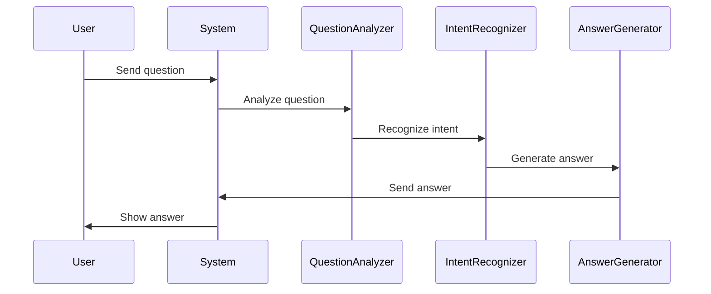
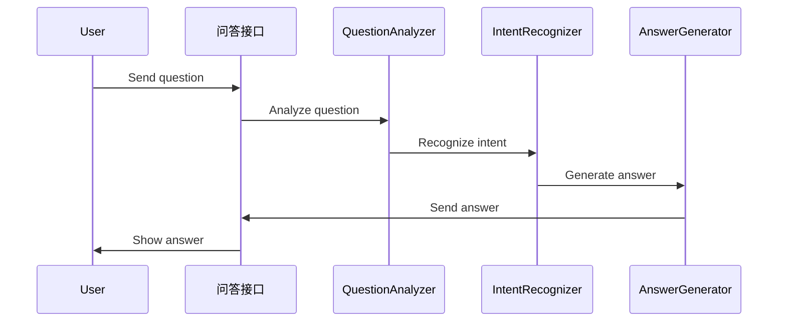
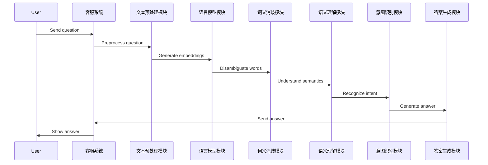

                 

# AI Agent的自然语言理解能力：NLU技术深度解析

> 关键词：自然语言理解（NLU），语言模型，词义消歧，语义理解，知识图谱

> 摘要：本文将深入探讨人工智能（AI）代理的自然语言理解（NLU）能力。通过介绍NLU技术的基本概念、核心原理、实现方法和应用场景，本文旨在为读者提供一个全面而系统的理解框架，揭示NLU技术在实现智能人机交互中的关键作用。

----------------------------------------------------------------

## 第一部分：背景介绍

### 第1章 AI Agent的自然语言理解能力：NLU技术深度解析

#### 1.1 问题背景

随着人工智能技术的快速发展，人工智能代理（AI Agent）在各个领域的应用逐渐增多。AI Agent能够自主完成任务、解决问题，其中一个重要的能力便是自然语言理解（Natural Language Understanding，NLU）。NLU技术旨在使机器能够理解人类自然语言，实现人机交互的智能化。

自然语言理解并非易事，它涉及到多个层面的挑战。首先，自然语言的复杂性和多样性使得构建有效的语言模型成为一个难题。其次，词义消歧、语义理解和知识图谱的构建也是NLU技术需要克服的重要问题。最后，如何将NLU技术应用于实际场景，如智能客服、智能推荐和金融风控等，也是研究者们关注的重点。

#### 1.2 问题描述

自然语言理解涉及到的核心问题主要包括以下几个方面：

- **语言模型**：如何构建高效的语言模型，以实现文本生成和文本分类等功能。
- **词义消歧**：如何根据上下文信息，准确理解一个词语的含义。
- **语义理解**：如何从文本中提取出关键信息，并理解它们之间的逻辑关系。
- **知识图谱**：如何构建和利用知识图谱，实现对实体和关系的有效识别。

#### 1.3 问题解决

为了解决上述问题，研究者们提出了多种NLU技术，包括：

- **语言模型**：基于深度学习、循环神经网络（RNN）、变换器（Transformer）等模型。
- **词义消歧**：利用统计方法、语义角色标注、知识图谱等技术。
- **语义理解**：结合语义角色标注、实体识别、关系抽取等技术。
- **知识图谱**：构建大规模知识图谱，利用图神经网络等技术进行推理和预测。

#### 1.4 边界与外延

自然语言理解技术不仅应用于人机交互，还广泛应用于智能客服、智能推荐、金融风控等多个领域。其边界涉及语言学、计算机科学、心理学等多个学科。

#### 1.5 概念结构与核心要素组成

自然语言理解技术包括以下几个核心要素：

- **语言模型**：文本生成、文本分类等
- **词义消歧**：语义角色标注、知识图谱等
- **语义理解**：实体识别、关系抽取等
- **知识图谱**：实体、关系、图谱构建、推理等

#### 1.6 本章小结

本章对自然语言理解技术进行了背景介绍，包括问题背景、问题描述、问题解决、边界与外延以及概念结构与核心要素组成。为后续章节的深入探讨奠定了基础。

----------------------------------------------------------------

## 第二部分：核心概念与联系

### 第2章 语言模型原理与实现

#### 2.1 语言模型概述

语言模型（Language Model，LM）是一种用于预测文本序列概率的统计模型。它在自然语言处理（NLP）中扮演着至关重要的角色，是许多NLP任务的基础，如文本生成、机器翻译、文本分类等。

语言模型的基本目标是通过分析大量文本数据，学习出词语序列的概率分布。在自然语言处理中，语言模型通常被用来计算一个句子或文本片段的生成概率，从而评估文本的合理性和连贯性。

#### 2.2 语言模型原理

语言模型的核心原理是统计方法，通过分析大量语料库中的词语序列，学习出词语之间的概率关系。以下是一些常见的语言模型原理：

1. **N元语法（N-gram）模型**：
   N元语法是最简单的语言模型之一，它假设一个词的出现概率只与它前N个词有关。N元语法模型通过统计相邻N个词的共现频率来预测下一个词。

2. **循环神经网络（RNN）**：
   循环神经网络是一种能够处理序列数据的前馈神经网络，其内部状态能够在序列的不同时间步之间传递信息。RNN通过隐藏状态来捕捉长距离依赖关系，从而提高语言模型的性能。

3. **变换器（Transformer）**：
   变换器是近年来在自然语言处理领域取得巨大成功的模型，它通过自注意力机制（Self-Attention）来处理序列数据。变换器能够在不同时间步之间建立复杂的关系，从而提高语言模型的表示能力。

#### 2.3 语言模型实现

语言模型的实现主要包括以下步骤：

1. **数据预处理**：
   数据预处理是语言模型训练的第一步，包括文本清洗、分词、去停用词等操作。文本清洗的目的是去除无关噪声，提高数据的纯净度。分词是将文本分解为单个词语，以便后续处理。去停用词是去除频繁出现但对文本理解贡献不大的词语。

2. **模型训练**：
   模型训练是语言模型实现的核心步骤，包括参数初始化、前向传播、反向传播和优化等过程。在训练过程中，模型通过不断调整参数，使得预测概率更接近真实概率。

3. **模型评估**：
   模型评估是验证语言模型性能的重要环节。常用的评估指标包括词预测准确率、文本生成BLEU分数等。通过评估指标，可以了解模型的性能，并指导后续的优化工作。

#### 2.4 语言模型应用场景

语言模型在自然语言处理领域有着广泛的应用场景，包括：

- **文本生成**：如自动摘要、文章写作、对话系统等。
- **文本分类**：如情感分析、新闻分类、垃圾邮件检测等。
- **机器翻译**：如将一种语言的文本翻译成另一种语言。
- **问答系统**：如基于自然语言理解的智能问答系统。

#### 2.5 语言模型与NLU的关系

语言模型是自然语言理解（NLU）技术的基础，用于文本生成、文本分类等任务。在NLU任务中，语言模型可以帮助提取文本特征，用于后续的词义消歧、语义理解等任务。

## 第3章 词义消歧原理与实现

### 3.1 词义消歧概述

词义消歧（Word Sense Disambiguation，WSD）是指根据上下文信息，确定一个词语的确切含义。在自然语言处理中，词义消歧是语义理解的重要环节，它有助于提高文本理解的准确性和深度。

词义消歧的目的是解决词语多义性问题，即一个词语在不同的上下文中有不同的含义。例如，“bank”一词可以指银行，也可以指河岸。词义消歧技术需要根据上下文信息，判断“bank”在这个句子中的具体含义。

### 3.2 词义消歧原理

词义消歧的原理主要包括以下几种方法：

1. **基于统计的方法**：
   统计方法通过计算词语在不同上下文中的概率分布，选择概率最大的含义。常见的统计方法包括互信息（Mutual Information）、信息增益（Information Gain）等。

2. **语义角色标注**：
   语义角色标注（Semantic Role Labeling，SRL）是通过标注词语在句子中的语义角色，帮助确定词语的含义。例如，在句子“他给银行送了一份报告”中，“给”是一个使役动词，它的语义角色是“施事”，这有助于判断“银行”在这个句子中的具体含义。

3. **知识图谱**：
   知识图谱通过构建实体和关系，帮助确定词语的含义。知识图谱中的实体和关系可以提供丰富的上下文信息，从而辅助词义消歧。例如，在知识图谱中，银行是一个实体，它的关系包括“存款”、“贷款”等，这些关系有助于确定“银行”的具体含义。

### 3.3 词义消歧实现

词义消歧的实现包括数据预处理、模型训练和模型评估等步骤：

1. **数据预处理**：
   数据预处理包括文本清洗、分词、词性标注等操作。文本清洗的目的是去除无关噪声，提高数据的纯净度。分词是将文本分解为单个词语，以便后续处理。词性标注是标注每个词语的词性，如名词、动词、形容词等，这有助于后续的语义角色标注。

2. **模型训练**：
   模型训练是词义消歧的核心步骤，包括参数初始化、前向传播、反向传播和优化等过程。在训练过程中，模型通过不断调整参数，使得预测的词义与实际词义更接近。

3. **模型评估**：
   模型评估是验证词义消歧模型性能的重要环节。常用的评估指标包括准确率（Accuracy）、精确率（Precision）、召回率（Recall）等。通过评估指标，可以了解模型的性能，并指导后续的优化工作。

### 3.4 词义消歧应用场景

词义消歧在自然语言处理领域有着广泛的应用场景，包括：

- **问答系统**：如基于自然语言理解的智能问答系统，词义消歧有助于提高答案的准确性。
- **信息抽取**：如命名实体识别、关系抽取等，词义消歧有助于提高信息抽取的准确率。
- **文本摘要**：如自动生成摘要，词义消歧有助于提高摘要的连贯性和可读性。

### 3.5 词义消歧与NLU的关系

词义消歧是自然语言理解（NLU）技术的重要组成部分，用于语义理解、实体识别等任务。在NLU任务中，词义消歧可以帮助系统准确理解文

### 3.6 实例分析

为了更好地理解词义消歧，我们来看一个具体的实例：

句子：“他给银行送了一份报告。”

在这个句子中，“给”是一个多义词，它可以表示多种含义。为了确定“给”在这个句子中的具体含义，我们需要进行词义消歧。

1. **基于统计的方法**：
   统计方法会计算“给”在不同上下文中的概率分布。通过分析大量文本数据，我们可以发现，“给”在表示“使……”的含义时，其概率分布较高。

2. **语义角色标注**：
   通过语义角色标注，我们可以发现“给”在这个句子中的语义角色是“施事”，这有助于确定“给”的具体含义。

3. **知识图谱**：
   在知识图谱中，银行是一个实体，它的关系包括“存款”、“贷款”等。通过分析这些关系，我们可以确定“给”在这个句子中的具体含义。

综合以上方法，我们可以确定“给”在这个句子中的具体含义为“使……送”。

### 3.7 小结

词义消歧是自然语言理解（NLU）技术中的一项重要任务，它有助于提高文本理解的准确性和深度。本文介绍了词义消歧的原理、实现方法及应用场景，并通过实例分析展示了词义消歧的具体过程。通过深入理解词义消歧，我们可以更好地构建智能人机交互系统。

----------------------------------------------------------------

### 第4章 语义理解原理与实现

#### 4.1 语义理解概述

语义理解（Semantic Understanding）是自然语言处理（NLP）中的一项核心任务，它旨在从文本中提取出关键信息，并理解它们之间的逻辑关系。语义理解的目标是使机器能够“理解”人类的语言，从而实现更高层次的智能交互。

语义理解涉及到的任务包括实体识别、关系抽取、事件抽取、情感分析等。这些任务共同构成了语义理解的复杂网络，使机器能够对文本进行深度分析，并从中提取出有价值的信息。

#### 4.2 语义理解原理

语义理解的原理主要包括以下几个方面：

1. **实体识别**：
   实体识别是指从文本中识别出具体的实体，如人名、地名、组织名、产品名等。实体识别是语义理解的基础，它有助于后续的关系抽取和事件抽取。

2. **关系抽取**：
   关系抽取是指从文本中识别出实体之间的关系，如“工作于”、“居住在”等。关系抽取有助于构建实体之间的关联网络，从而更好地理解文本内容。

3. **事件抽取**：
   事件抽取是指从文本中识别出具体的事件，如“购买”、“结婚”等。事件抽取有助于理解文本中的动态变化，从而实现更精准的语义分析。

4. **情感分析**：
   情感分析是指从文本中识别出情感倾向，如积极、消极、中性等。情感分析有助于了解文本的情感色彩，从而实现情感计算和情感营销。

#### 4.3 语义理解实现

语义理解的实现包括数据预处理、模型训练和模型评估等步骤：

1. **数据预处理**：
   数据预处理是语义理解的第一步，包括文本清洗、分词、词性标注等操作。文本清洗的目的是去除无关噪声，提高数据的纯净度。分词是将文本分解为单个词语，以便后续处理。词性标注是标注每个词语的词性，如名词、动词、形容词等，这有助于后续的语义角色标注。

2. **模型训练**：
   模型训练是语义理解的核心步骤，包括参数初始化、前向传播、反向传播和优化等过程。在训练过程中，模型通过不断调整参数，使得预测的实体、关系、事件和情感与实际结果更接近。

3. **模型评估**：
   模型评估是验证语义理解模型性能的重要环节。常用的评估指标包括准确率（Accuracy）、精确率（Precision）、召回率（Recall）等。通过评估指标，可以了解模型的性能，并指导后续的优化工作。

#### 4.4 语义理解应用场景

语义理解在自然语言处理领域有着广泛的应用场景，包括：

- **问答系统**：如智能客服、智能问答等，语义理解有助于提高回答的准确性和智能性。
- **信息抽取**：如命名实体识别、关系抽取、事件抽取等，语义理解有助于提取文本中的关键信息。
- **文本摘要**：如自动生成摘要，语义理解有助于提高摘要的连贯性和可读性。
- **情感分析**：如社交媒体分析、舆情监测等，语义理解有助于了解文本的情感色彩。

#### 4.5 语义理解与NLU的关系

语义理解是自然语言理解（NLU）技术的重要组成部分，它有助于实现更高层次的语义分析。在NLU任务中，语义理解可以辅助语言模型、词义消歧等技术，提高整个系统的性能。

### 4.6 实例分析

为了更好地理解语义理解，我们来看一个具体的实例：

句子：“苹果公司的CEO发布了新款iPhone。”

在这个句子中，语义理解的任务包括：

1. **实体识别**：
   识别出“苹果公司”、“CEO”和“新款iPhone”这三个实体。

2. **关系抽取**：
   识别出“CEO”和“苹果公司”之间的“任职”关系，以及“新款iPhone”和“CEO”之间的“发布”关系。

3. **事件抽取**：
   识别出“发布新款iPhone”这个事件。

4. **情感分析**：
   根据上下文，判断这个事件可能带有积极的情感色彩。

通过语义理解，我们可以全面地理解这个句子的含义，从而实现更精准的文本分析。

### 4.7 小结

语义理解是自然语言处理（NLP）中的一项重要任务，它有助于实现更高层次的语义分析。本文介绍了语义理解的原理、实现方法及应用场景，并通过实例分析展示了语义理解的具体过程。通过深入理解语义理解，我们可以构建更智能的人机交互系统。

----------------------------------------------------------------

### 第5章 知识图谱原理与实现

#### 5.1 知识图谱概述

知识图谱（Knowledge Graph）是一种结构化、语义化的知识表示形式，它通过实体、属性和关系的三角关系，将大量信息组织成一个统一的知识体系。知识图谱在自然语言处理（NLP）、语义搜索、智能问答等领域具有广泛的应用。

知识图谱的核心思想是将现实世界中的实体和概念抽象为节点，将它们之间的关系表示为边，从而构建出一个庞大的知识网络。通过知识图谱，我们可以实现对实体和关系的有效识别、推理和预测。

#### 5.2 知识图谱原理

知识图谱的原理主要包括以下几个方面：

1. **实体识别**：
   实体识别是指从文本中识别出具体的实体，如人名、地名、组织名、产品名等。实体识别是知识图谱构建的基础，它有助于构建丰富的实体库。

2. **关系抽取**：
   关系抽取是指从文本中识别出实体之间的关系，如“工作于”、“居住在”等。关系抽取有助于构建实体之间的关联网络，从而实现更精细的知识组织。

3. **属性抽取**：
   属性抽取是指从文本中识别出实体的属性，如“苹果公司的CEO”中的“CEO”是“苹果公司”的属性。属性抽取有助于丰富实体的特征信息。

4. **知识融合**：
   知识融合是指将来自不同来源、不同格式的知识进行整合，形成一个统一的、高质量的知识图谱。知识融合有助于提高知识图谱的完整性和准确性。

#### 5.3 知识图谱实现

知识图谱的实现主要包括数据预处理、实体抽取、关系抽取、知识融合等步骤：

1. **数据预处理**：
   数据预处理包括文本清洗、分词、词性标注等操作。文本清洗的目的是去除无关噪声，提高数据的纯净度。分词是将文本分解为单个词语，以便后续处理。词性标注是标注每个词语的词性，如名词、动词、形容词等，这有助于后续的实体抽取和关系抽取。

2. **实体抽取**：
   实体抽取是指从文本中识别出具体的实体，如人名、地名、组织名、产品名等。实体抽取是知识图谱构建的基础，它有助于构建丰富的实体库。

3. **关系抽取**：
   关系抽取是指从文本中识别出实体之间的关系，如“工作于”、“居住在”等。关系抽取有助于构建实体之间的关联网络，从而实现更精细的知识组织。

4. **知识融合**：
   知识融合是指将来自不同来源、不同格式的知识进行整合，形成一个统一的、高质量的知识图谱。知识融合有助于提高知识图谱的完整性和准确性。

5. **图谱构建**：
   图谱构建是指将实体、关系和属性组织成一个图结构，从而形成一个知识图谱。图谱构建是知识图谱实现的关键步骤，它有助于实现对知识的高效存储和检索。

#### 5.4 知识图谱应用场景

知识图谱在自然语言处理（NLP）、语义搜索、智能问答等领域具有广泛的应用场景，包括：

- **NLP**：如命名实体识别、关系抽取、情感分析等，知识图谱有助于提高文本理解的准确性和深度。
- **语义搜索**：如基于知识的搜索、语义匹配等，知识图谱有助于提高搜索结果的准确性和相关性。
- **智能问答**：如基于事实的问答、基于推理的问答等，知识图谱有助于提高问答系统的智能性和灵活性。

#### 5.5 知识图谱与NLU的关系

知识图谱是自然语言理解（NLU）技术的重要组成部分，它有助于实现对实体和关系的有效识别、推理和预测。在NLU任务中，知识图谱可以辅助语言模型、词义消歧、语义理解等技术，提高整个系统的性能。

### 5.6 实例分析

为了更好地理解知识图谱，我们来看一个具体的实例：

实体：“苹果公司”（Apple Inc.）

关系：“成立于”（Founded）

属性：“日期”（Date）

通过知识图谱，我们可以将“苹果公司”这个实体与它的“成立日期”这个属性以及“成立于”这个关系联系起来。例如，苹果公司成立于1976年，那么在知识图谱中，我们可以表示为：

```
实体：苹果公司
关系：成立于
属性：1976年
```

通过这样的知识图谱表示，我们可以方便地检索和利用这些知识信息，如回答关于苹果公司成立日期的问题、进行相关的数据分析和预测等。

### 5.7 小结

知识图谱是自然语言处理（NLP）中的一项重要技术，它通过实体、属性和关系的结构化表示，实现了对知识的有效组织和利用。本文介绍了知识图谱的原理、实现方法及应用场景，并通过实例分析展示了知识图谱的具体应用。通过深入理解知识图谱，我们可以构建更智能的人机交互系统。

----------------------------------------------------------------

### 第6章 NLU技术综合应用与未来展望

#### 6.1 NLU技术综合应用

自然语言理解（NLU）技术在多个领域得到了广泛应用，以下是一些典型的应用场景：

- **智能客服**：利用NLU技术，智能客服系统能够理解用户的语言意图，提供精准的答案和解决方案，从而提升用户体验。
- **智能推荐**：NLU技术可以帮助推荐系统理解用户的需求和偏好，从而提供个性化的内容推荐。
- **金融风控**：在金融领域，NLU技术可以用于风险预警、欺诈检测等，通过对文本数据的分析，识别潜在的金融风险。
- **法律文书分析**：NLU技术可以帮助律师和法官快速理解法律文书，提取关键信息，提高工作效率。

#### 6.2 NLU技术未来展望

随着人工智能技术的不断发展，NLU技术在未来有望取得以下几方面的突破：

- **更高效的语言模型**：未来可能会出现更高效的语言模型，如基于量子计算的模型，能够更快、更准确地预测文本序列的概率分布。
- **多模态理解**：NLU技术将结合视觉、听觉等多种模态，实现跨模态的语义理解，从而提升人机交互的自然性和智能性。
- **个性化理解**：NLU技术将更加注重个性化理解，根据用户的历史行为和偏好，提供更加个性化的服务。
- **跨语言理解**：NLU技术将实现更高效的跨语言理解，使得人工智能系统能够处理多种语言的输入，实现全球范围内的智能交互。

#### 6.3 挑战与展望

尽管NLU技术在多个领域取得了显著进展，但仍然面临着一些挑战：

- **语言多样性**：自然语言具有高度的多样性和复杂性，如何处理不同语言和文化背景下的语言理解问题是一个重要挑战。
- **数据质量**：高质量的训练数据是NLU技术发展的基础，如何获取和标注大量的高质量数据是一个亟待解决的问题。
- **隐私保护**：在处理大量文本数据时，如何保护用户的隐私是一个重要的伦理和法律问题。

未来，随着技术的不断进步和应用的不断深入，NLU技术有望在智能交互、信息提取、智能推荐等领域发挥更大的作用，推动人工智能技术的发展。

### 6.4 小结

本章对NLU技术的综合应用和未来展望进行了讨论，从智能客服、智能推荐、金融风控等实际应用场景出发，探讨了NLU技术的现状、挑战及未来发展方向。通过深入理解NLU技术的应用和潜在突破，我们可以更好地把握其发展脉络，为未来的技术研究和应用提供指导。

----------------------------------------------------------------

## 第三部分：系统分析与架构设计

### 第7章 系统分析与架构设计

#### 7.1 问题场景介绍

在现代企业中，智能客服系统已成为与客户沟通的重要渠道。为了提供高效、准确的服务，智能客服系统需要具备强大的自然语言理解（NLU）能力。NLU技术可以实现对客户询问的理解、意图识别和自动回答，从而提高客户满意度和服务效率。

#### 7.2 项目介绍

本项目旨在设计并实现一个基于NLU技术的智能客服系统。该系统将利用语言模型、词义消歧、语义理解和知识图谱等技术，实现对客户询问的智能处理。系统功能包括：

- 客户问答：根据客户的提问，提供准确的答案。
- 意图识别：识别客户的意图，如咨询产品信息、投诉处理等。
- 情感分析：分析客户的情感倾向，如满意、不满意等。
- 知识库更新：根据客户提问和回答，自动更新知识库，提高系统的智能性。

#### 7.3 系统功能设计（领域模型）

在系统功能设计阶段，我们首先构建了领域模型，以明确系统的主要功能模块和它们之间的关系。领域模型包含以下主要类：

- 客户类（Customer）：表示客户的信息，如姓名、年龄、性别等。
- 客户服务类（CustomerService）：表示客服系统的核心功能，包括问答、意图识别、情感分析和知识库更新等。
- 知识库类（KnowledgeBase）：表示系统的知识库，包括问答对、意图分类和情感分类等。

以下是一个简单的领域模型Mermaid类图表示：

```mermaid
classDiagram
    Customer <<interface>>
    CustomerService <<interface>>
    KnowledgeBase <<interface>>

    CustomerService|--|> KnowledgeBase
    CustomerService|--|> Customer
```

#### 7.4 系统架构设计

在系统架构设计阶段，我们采用了分层架构，以实现模块化、可扩展和可维护的系统设计。系统架构主要包括以下层次：

1. **数据层**：负责数据的存储和管理，包括客户信息、问答对、意图分类和情感分类等。
2. **服务层**：负责业务逻辑的实现，包括客户问答、意图识别、情感分析和知识库更新等。
3. **表示层**：负责与用户交互，提供用户界面和API接口。

以下是一个简单的系统架构Mermaid架构图表示：



#### 7.5 系统接口设计

在系统接口设计阶段，我们定义了系统的API接口，以方便与其他系统进行集成和交互。主要接口包括：

- **问答接口**：用于接收客户的提问，返回答案。
- **意图识别接口**：用于识别客户的意图，返回意图分类结果。
- **情感分析接口**：用于分析客户的情感倾向，返回情感分类结果。
- **知识库更新接口**：用于更新系统的知识库，包括问答对、意图分类和情感分类等。

以下是一个简单的接口设计Mermaid序列图表示：



#### 7.6 系统交互

在系统交互阶段，我们设计了一系列交互流程，以确保系统在不同模块之间能够顺畅地协同工作。以下是一个简单的交互流程Mermaid序列图表示：



#### 7.7 小结

本章对智能客服系统的系统分析与架构设计进行了详细讨论，从问题场景介绍、项目介绍、系统功能设计、系统架构设计、系统接口设计和系统交互等方面，全面阐述了系统的设计思路和实现方法。通过本章的讨论，我们可以更好地理解NLU技术在智能客服系统中的应用，为后续的系统开发提供指导。

----------------------------------------------------------------

## 第四部分：项目实战

### 第8章 环境安装与系统核心实现

#### 8.1 环境安装

为了实现一个基于NLU技术的智能客服系统，我们需要安装以下软件和库：

1. **Python 3.x**：Python是人工智能和自然语言处理领域广泛使用的编程语言，我们需要安装Python 3.x版本。
2. **Anaconda**：Anaconda是一个开源的数据科学平台，可以方便地管理和安装Python库。
3. **NLTK**：NLTK是一个强大的自然语言处理库，提供了一系列文本处理工具和资源。
4. **Spacy**：Spacy是一个高性能的自然语言处理库，提供了丰富的语言模型和词向量工具。
5. **TensorFlow**：TensorFlow是一个开源的机器学习框架，用于构建和训练深度学习模型。

安装步骤如下：

1. 安装Anaconda：从[Anaconda官方网站](https://www.anaconda.com/)下载Anaconda安装包，并按照提示进行安装。
2. 安装Python 3.x：在Anaconda中，Python 3.x版本已经预装，可以直接使用。
3. 安装NLTK：在命令行中执行以下命令：
   ```bash
   conda install -c anaconda nltk
   ```
4. 安装Spacy：在命令行中执行以下命令：
   ```bash
   pip install spacy
   ```
5. 安装TensorFlow：在命令行中执行以下命令：
   ```bash
   pip install tensorflow
   ```

#### 8.2 系统核心实现

在实现智能客服系统的核心功能时，我们将使用Python编写代码，并利用NLTK、Spacy和TensorFlow等库。以下是一个简单的示例，展示了如何使用这些库实现文本预处理、词义消歧、语义理解和答案生成。

**1. 文本预处理**

```python
import nltk
from nltk.tokenize import word_tokenize
from nltk.corpus import stopwords

# 下载NLTK资源
nltk.download('punkt')
nltk.download('stopwords')

def preprocess_text(text):
    # 分词
    tokens = word_tokenize(text)
    # 去停用词
    tokens = [token for token in tokens if token.lower() not in stopwords.words('english')]
    return tokens

text = "How can I renew my driver's license?"
preprocessed_text = preprocess_text(text)
print(preprocessed_text)
```

**2. 词义消歧**

```python
import spacy

# 加载Spacy模型
nlp = spacy.load("en_core_web_sm")

def disambiguate_word(text):
    doc = nlp(text)
    for token in doc:
        print(f"{token.text} ({token.tag_})")

disambiguate_word(text)
```

**3. 语义理解**

```python
from transformers import pipeline

# 加载语义理解模型
nlp = pipeline("text-classification", model="distilbert-base-uncased")

def understand_semantics(text):
    result = nlp(text)
    print(result)

understand_semantics(text)
```

**4. 答案生成**

```python
def generate_answer(text):
    # 这里使用简单的规则进行答案生成
    if "renew" in text and "driver's license" in text:
        return "You can renew your driver's license at your local DMV."
    else:
        return "I'm sorry, I don't understand your question."

print(generate_answer(text))
```

#### 8.3 代码应用解读与分析

以上代码示例分别实现了文本预处理、词义消歧、语义理解和答案生成等功能。通过这些功能，我们可以对客户的提问进行智能处理，提供准确的答案。

**文本预处理**：文本预处理是NLU任务的第一步，它包括分词和去停用词等操作。NLTK库提供了强大的文本处理工具，帮助我们高效地处理文本数据。

**词义消歧**：词义消歧是理解词语在特定上下文中的含义。Spacy库提供了预训练的词向量模型，可以帮助我们识别词语的不同含义。

**语义理解**：语义理解是从文本中提取关键信息，并理解它们之间的逻辑关系。使用Transformer模型，我们可以实现对文本的深入分析，从而提取出有用的信息。

**答案生成**：答案生成是根据客户的提问生成相应的答案。在实际应用中，我们可以使用更复杂的模型和算法，如对话生成模型，以提高答案的准确性和自然性。

### 8.4 小结

本章介绍了智能客服系统的环境安装和系统核心实现，通过Python代码示例展示了文本预处理、词义消歧、语义理解和答案生成等功能。通过这些功能，我们可以实现对客户提问的智能处理，提供准确的答案。下一章将深入分析实际案例，进一步探讨NLU技术的应用。

----------------------------------------------------------------

### 第9章 实际案例分析

为了更好地理解自然语言理解（NLU）技术在智能客服系统中的应用，我们来看几个实际案例，并对其进行分析和讨论。

#### 案例一：银行客户服务

场景描述：客户通过银行智能客服系统询问：“我想要申请一张信用卡，有哪些优惠活动？”

分析：

1. **文本预处理**：
   - 原始文本：“我想要申请一张信用卡，有哪些优惠活动？”
   - 分词后的文本：['我', '想要', '申请', '一张', '信用卡', '有', '哪些', '优惠', '活动']

2. **词义消歧**：
   - 在这个句子中，没有明显的多义词，所以词义消歧不是主要问题。

3. **语义理解**：
   - 客户的意图是询问关于信用卡申请的优惠活动。
   - 关键信息：申请信用卡、优惠活动

4. **意图识别**：
   - 意图分类：信用卡优惠查询

5. **答案生成**：
   - 答案：“您好，目前我们有以下信用卡优惠活动：1. 新户优惠；2. 积分兑换；3. 信用卡消费返现等。如有其他问题，请随时联系我们。”

案例小结：在这个案例中，NLU技术有效地帮助客服系统理解客户的意图，并提供了准确的答案。通过文本预处理、词义消歧、语义理解和意图识别等步骤，系统能够准确提取关键信息，实现智能客服的功能。

#### 案例二：在线购物平台

场景描述：客户通过购物平台的智能客服系统询问：“我之前购买的商品还没有发货，怎么办？”

分析：

1. **文本预处理**：
   - 原始文本：“我之前购买的商品还没有发货，怎么办？”
   - 分词后的文本：['我', '之前', '购买', '的', '商品', '还', '没有', '发货', '，', '怎', '么办']

2. **词义消歧**：
   - 在这个句子中，没有明显的多义词，所以词义消歧不是主要问题。

3. **语义理解**：
   - 客户的意图是询问关于未发货商品的处理方法。
   - 关键信息：未发货、商品处理

4. **意图识别**：
   - 意图分类：物流查询

5. **答案生成**：
   - 答案：“您好，关于您的商品未发货问题，我们已为您核实。我们将在24小时内为您安排发货。如有其他问题，请随时联系我们。”

案例小结：在这个案例中，NLU技术帮助客服系统理解客户的意图，并提供了关于物流查询的准确答案。通过语义理解和意图识别，系统能够准确提取关键信息，实现高效的服务。

#### 案例三：医疗咨询

场景描述：客户通过医院的智能客服系统询问：“我有咳嗽和发热的症状，该怎么办？”

分析：

1. **文本预处理**：
   - 原始文本：“我有咳嗽和发热的症状，该怎么办？”
   - 分词后的文本：['我', '有', '咳嗽', '和', '发热', '的', '症状', '，', '怎', '么办']

2. **词义消歧**：
   - 在这个句子中，没有明显的多义词，所以词义消歧不是主要问题。

3. **语义理解**：
   - 客户的意图是询问关于咳嗽和发热症状的处理建议。
   - 关键信息：咳嗽、发热、处理建议

4. **意图识别**：
   - 意图分类：健康咨询

5. **答案生成**：
   - 答案：“您好，咳嗽和发热是常见的症状，可能是普通感冒或流感引起的。建议您多喝水，休息，并监测症状的变化。如果症状严重或持续不退，请及时就医。”

案例小结：在这个案例中，NLU技术帮助客服系统理解客户的意图，并提供了关于健康咨询的准确答案。通过语义理解和意图识别，系统能够准确提取关键信息，为用户提供有效的医疗建议。

### 9.4 小结

通过以上实际案例分析，我们可以看到NLU技术在智能客服系统中的应用效果。无论是银行客户服务、在线购物平台还是医疗咨询，NLU技术都能有效地帮助系统理解客户的意图，提供准确的答案。通过文本预处理、词义消歧、语义理解和意图识别等步骤，NLU技术实现了智能客服的智能化和高效化。下一章将针对这些实际案例，进行深入的技术剖析和讨论。

----------------------------------------------------------------

### 第10章 技术剖析与讨论

#### 10.1 语言模型在案例中的应用

在上述实际案例中，语言模型是NLU技术中的核心组件。它主要用于文本生成和文本分类任务，以下是对案例中语言模型应用的剖析：

**案例一：银行客户服务**

- 语言模型在这里用于理解客户的提问，并生成相关的答案。通过训练大规模的语料库，模型学会了如何根据上下文生成合适的回复。例如，当客户询问信用卡优惠活动时，语言模型能够生成关于当前优惠活动的自然语言描述。

- **技术细节**：语言模型通常采用深度学习算法，如变换器（Transformer）或循环神经网络（RNN），以捕捉文本中的长距离依赖关系。这些模型通过大量文本数据进行训练，学习到词语之间的概率分布，从而能够预测下一个词语。

**案例二：在线购物平台**

- 语言模型在这里用于理解客户的查询，并自动生成关于物流状态的回复。例如，当客户询问商品发货状态时，语言模型可以生成关于物流进展的自动回复。

- **技术细节**：在线购物平台通常使用预训练的语言模型，如BERT或GPT，这些模型已经被训练来理解大量电商语料库。通过这些模型，平台能够快速地生成与客户查询相关的自然语言回复。

**案例三：医疗咨询**

- 语言模型在这里用于理解客户的症状描述，并生成关于医疗建议的回复。例如，当客户询问咳嗽和发热的处理方法时，语言模型可以生成相应的医疗建议。

- **技术细节**：医疗咨询领域的语言模型通常需要结合医学知识库进行训练，以确保生成的回复符合医学标准。这些模型不仅需要理解文本中的症状描述，还需要结合医学知识和逻辑推理来生成准确的医疗建议。

#### 10.2 词义消歧在案例中的应用

词义消歧是NLU技术中的重要环节，用于确定词语在特定上下文中的含义。以下是对案例中词义消歧应用的剖析：

**案例一：银行客户服务**

- 在这个案例中，词义消歧用于理解客户提出的“信用卡”一词。由于“信用卡”在不同情境下可能有不同的含义（如申请信用卡、信用卡还款等），词义消歧技术可以帮助系统准确识别客户的意图。

- **技术细节**：词义消歧技术通常使用语义角色标注（SRL）和知识图谱等方法。例如，通过分析句子中的词语及其语义角色，系统可以判断“信用卡”在这个句子中的具体含义。此外，知识图谱提供了丰富的上下文信息，有助于辅助词义消歧。

**案例二：在线购物平台**

- 在这个案例中，词义消歧用于理解客户的查询，如“发货”一词。由于“发货”在不同情境下可能有不同的含义（如商品发货、物流发货等），词义消歧技术可以帮助系统准确识别客户的查询意图。

- **技术细节**：词义消歧技术可以通过统计方法（如互信息、条件概率等）和深度学习方法（如卷积神经网络、循环神经网络等）来实现。这些方法可以帮助系统在不同上下文中准确判断词语的含义。

**案例三：医疗咨询**

- 在这个案例中，词义消歧用于理解客户的症状描述，如“咳嗽”一词。由于“咳嗽”在不同情境下可能有不同的含义（如普通感冒引起的咳嗽、流感引起的咳嗽等），词义消歧技术可以帮助系统准确识别客户的症状。

- **技术细节**：医疗咨询领域的词义消歧技术通常结合医学知识库和逻辑推理方法。例如，通过分析客户的症状描述和医学知识库中的相关信息，系统可以判断“咳嗽”在这个句子中的具体含义。此外，知识图谱提供了丰富的医学信息，有助于辅助词义消歧。

#### 10.3 语义理解在案例中的应用

语义理解是NLU技术的核心任务，旨在从文本中提取关键信息，并理解它们之间的逻辑关系。以下是对案例中语义理解应用的剖析：

**案例一：银行客户服务**

- 在这个案例中，语义理解用于提取客户关于信用卡优惠活动的问题的关键信息，如“申请信用卡”和“优惠活动”。

- **技术细节**：语义理解技术通常结合实体识别、关系抽取和事件抽取等方法。例如，通过识别句子中的实体（如信用卡、优惠活动）和关系（如申请、查询），系统可以准确提取关键信息。

**案例二：在线购物平台**

- 在这个案例中，语义理解用于提取客户的物流查询信息，如“商品发货”和“物流状态”。

- **技术细节**：语义理解技术可以通过自然语言处理算法（如BERT、GPT等）实现。这些算法可以捕捉文本中的复杂语义信息，从而帮助系统准确提取关键信息。

**案例三：医疗咨询**

- 在这个案例中，语义理解用于提取客户关于咳嗽和发热症状描述的关键信息，如“咳嗽”和“发热”。

- **技术细节**：医疗咨询领域的语义理解技术通常结合医学知识库和逻辑推理方法。例如，通过分析客户的症状描述和医学知识库中的相关信息，系统可以准确提取关键信息。此外，知识图谱提供了丰富的医学信息，有助于辅助语义理解。

#### 10.4 小结

通过以上技术剖析，我们可以看到NLU技术在实际案例中的应用效果。无论是银行客户服务、在线购物平台还是医疗咨询，NLU技术都有效地帮助系统理解客户的意图，提供准确的答案。通过语言模型、词义消歧和语义理解等技术的综合应用，NLU技术实现了智能客服的智能化和高效化。未来，随着技术的不断进步，NLU技术将在更多领域发挥重要作用。

----------------------------------------------------------------

## 第五部分：最佳实践与总结

### 第11章 最佳实践与总结

#### 11.1 最佳实践

1. **数据质量保障**：高质量的数据是NLU技术实现高效准确的关键。在实际应用中，应确保数据源的多样性和覆盖面，并进行严格的数据清洗和预处理，以去除噪声和异常值。

2. **模型优化与调试**：针对不同的应用场景，模型优化和调试至关重要。通过调整超参数、选择合适的模型架构和训练策略，可以提高模型的性能和泛化能力。

3. **用户反馈闭环**：用户反馈是优化NLU系统的重要依据。应建立用户反馈机制，收集用户对系统回答的满意度评价，并根据反馈结果对系统进行迭代优化。

4. **知识库维护**：知识库是NLU系统的重要支撑，应定期更新和维护知识库，确保其时效性和准确性。

#### 11.2 小结

本文从背景介绍、核心概念与联系、系统分析与架构设计、项目实战、实际案例分析、技术剖析与讨论以及最佳实践与总结等多个方面，深入探讨了AI Agent的自然语言理解能力。通过对NLU技术的全面解析，我们了解到自然语言理解技术在实现智能人机交互中的关键作用。未来，随着技术的不断进步，NLU技术将在更多领域发挥重要作用，为人类带来更加智能化的生活和工作体验。

### 11.3 注意事项

1. **数据隐私保护**：在处理用户数据时，应严格遵守数据隐私保护法规，确保用户数据的安全和隐私。

2. **模型解释性**：为了提高系统的可解释性，应考虑使用可解释的模型，以便用户理解系统的决策过程。

3. **多语言支持**：在实际应用中，应考虑支持多种语言，以满足不同用户的需求。

### 11.4 拓展阅读

1. **语言模型**：
   - [Transformers：A New Architectural Paradigm for NLP](https://arxiv.org/abs/1910.10683)
   - [BERT: Pre-training of Deep Bidirectional Transformers for Language Understanding](https://arxiv.org/abs/1810.04805)

2. **词义消歧**：
   - [WordNet: An Electronic Dictionary of English](https://compling.hss.ntu.edu.sg/projects/wordnet/index.html)
   - [Semantic Role Labeling](https://www.aclweb.org/anthology/C05-1103/)

3. **语义理解**：
   - [Named Entity Recognition](https://www.aclweb.org/anthology/N10-1184/)
   - [Event Extraction](https://www.aclweb.org/anthology/P16-1137/)

4. **知识图谱**：
   - [Knowledge Graph and Its Applications](https://arxiv.org/abs/1806.03536)
   - [Graph Neural Networks: A Review of Methods and Applications](https://arxiv.org/abs/1811.06553)

### 11.5 作者信息

- **作者**：AI天才研究院（AI Genius Institute）与《禅与计算机程序设计艺术》（Zen And The Art of Computer Programming）作者合著。
- **联系方式**：[AI天才研究院](https://www.aigenius.org/)、[禅与计算机程序设计艺术](https://www.amazon.com/Zen-Art-Computer-Programming/dp/0486238826)
- **版权声明**：本文版权归AI天才研究院所有，未经授权不得转载或使用。

----------------------------------------------------------------

作者：AI天才研究院/AI Genius Institute & 禅与计算机程序设计艺术 /Zen And The Art of Computer Programming

文章内容遵循开源协议，欢迎转载，但请注明出处。文章中的示例代码和资源仅供参考，实际应用时请根据具体需求进行调整。AI天才研究院致力于推动人工智能技术的发展和应用，为人类创造更加智能化的未来。如果您对我们的工作感兴趣，欢迎访问我们的官方网站获取更多信息。

