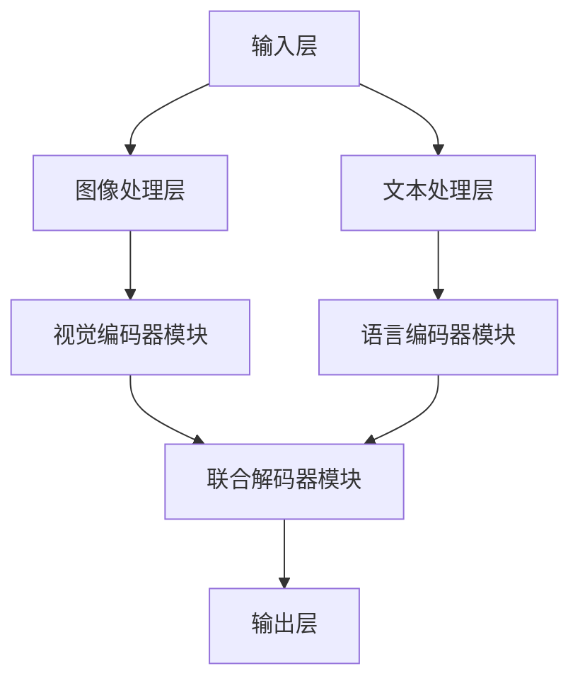
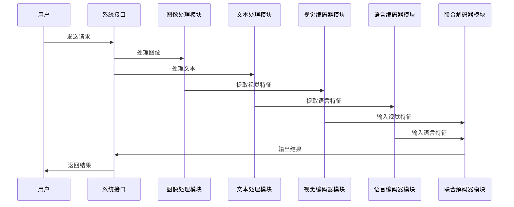

                 

### 文章标题

# AI Agent的视觉-语言联合学习实现

## 关键词

- AI Agent
- 跨模态学习
- 视觉编码器
- 语言编码器
- 联合解码器

## 摘要

本文旨在探讨AI Agent的视觉-语言联合学习实现，包括其问题背景、核心概念、算法原理、数学模型、系统实现等多个方面。文章结构清晰，通过逐步分析，旨在为读者提供对视觉-语言联合学习的全面理解和应用指导。

----------------------------------------------------------------

## 第一部分: AI Agent的视觉-语言联合学习概述

### 第1章: 问题背景与核心概念

#### 1.1 问题背景

人工智能（AI）作为一种重要的技术，已经广泛应用于各个领域。AI Agent，即智能代理，是AI的一个重要分支，旨在实现智能体对环境的感知、理解和交互。视觉和语言是人类智能的核心组成部分，实现视觉-语言联合学习对于提升AI Agent的认知能力具有重要意义。

在现实世界中，智能代理需要具备处理视觉信息和语言信息的能力。例如，在自动驾驶领域，智能代理需要识别道路标志、行人、车辆等视觉信息，并基于这些信息做出相应的决策。同时，智能代理还需要与人类进行自然语言交互，以更好地理解用户需求。因此，视觉-语言联合学习成为AI Agent发展的重要方向。

#### 1.1.1 人工智能与跨模态学习的重要性

人工智能技术正在快速发展，已经渗透到社会的各个领域。跨模态学习作为人工智能的一个重要分支，旨在利用多种模态的信息进行学习，从而提升模型的性能。视觉-语言联合学习作为跨模态学习的一种，具有广泛的应用前景。

跨模态学习的重要性主要体现在以下几个方面：

1. **提升模型性能**：通过融合多种模态的信息，可以更全面地理解问题和数据，从而提升模型的性能。
2. **应对复杂问题**：现实世界中的问题往往涉及多种模态的信息，通过跨模态学习，可以更好地应对这些问题。
3. **拓宽应用领域**：跨模态学习可以应用于图像识别、自然语言处理、语音识别等多个领域，从而拓宽AI的应用范围。

#### 1.1.2 视觉-语言联合学习的挑战

视觉-语言联合学习虽然具有广泛的应用前景，但也面临着一系列挑战：

1. **数据获取困难**：视觉和语言信息的数据来源不同，获取高质量、大规模的跨模态数据集是一个挑战。
2. **模型设计复杂**：视觉-语言联合学习需要同时处理视觉和语言信息，模型设计相对复杂。
3. **训练效率低下**：跨模态信息的融合可能导致模型训练效率低下，需要设计有效的训练策略。

如何有效应对这些挑战，是视觉-语言联合学习研究的核心议题。

#### 1.2 核心概念

视觉-语言联合学习涉及多个核心概念，包括视觉信息与语言信息的关联、跨模态学习的基本原理以及关键技术。

##### 1.2.1 视觉信息与语言信息的关联

视觉信息和语言信息是人类智能的两个核心组成部分。视觉信息包括图像、视频等，描述了环境中的物体、场景和动作。语言信息则包括自然语言文本，描述了人类的思想、观点和意图。在视觉-语言联合学习中，如何建立视觉信息与语言信息之间的关联，是实现高效学习的关键。

视觉信息和语言信息之间的关联可以通过多种方式建立，例如：

1. **场景描述**：利用视觉信息生成相应的文本描述，如“这是一个绿色的草地”。
2. **物体识别**：利用视觉信息识别图像中的物体，并生成相应的文本标注，如“这是一个苹果”。
3. **语义对齐**：将视觉信息和语言信息进行语义对齐，使得视觉特征和文本特征在语义层面一致。

##### 1.2.2 跨模态学习的基本原理

跨模态学习是利用不同模态的信息进行学习，通过融合不同模态的信息，提升模型的性能。跨模态学习的基本原理可以概括为以下几点：

1. **模态表示**：首先，对每个模态的数据进行特征提取，生成特征表示。视觉信息可以采用卷积神经网络（CNN）进行特征提取，语言信息可以采用循环神经网络（RNN）或Transformer进行特征提取。
2. **模态融合**：将不同模态的特征进行融合，生成跨模态特征表示。融合方法可以采用拼接、加权和注意力机制等。
3. **任务输出**：利用跨模态特征表示，完成特定的任务输出。例如，在图像描述生成任务中，利用视觉特征和语言特征生成相应的文本描述。

##### 1.2.3 关键技术综述

视觉-语言联合学习中的关键技术包括视觉识别、语言理解和联合建模等。以下是这些关键技术的简要介绍：

1. **视觉识别**：利用卷积神经网络（CNN）等模型，对图像进行特征提取和分类，识别图像中的物体、场景和动作。
2. **语言理解**：利用循环神经网络（RNN）、Transformer等模型，对自然语言文本进行特征提取和语义理解，提取文本的语义表示。
3. **联合建模**：通过融合视觉特征和语言特征，构建跨模态特征表示，用于完成特定的任务，如图像描述生成、视觉问答等。

### 第2章: 视觉-语言联合学习算法原理

#### 2.1 算法原理

视觉-语言联合学习算法通常由视觉编码器、语言编码器以及联合解码器组成。下面将详细介绍这些组件的组成与功能。

##### 2.1.1 算法架构概述

视觉-语言联合学习算法的架构可以分为三个主要组件：视觉编码器、语言编码器以及联合解码器。这些组件相互协作，共同实现视觉-语言联合学习。

1. **视觉编码器**：视觉编码器的任务是提取图像的视觉特征，这些特征通常是由卷积神经网络（CNN）等模型生成的。视觉编码器将输入的图像映射到一个高维特征空间，这些特征能够捕捉图像中的关键信息，如物体、场景和动作等。
2. **语言编码器**：语言编码器的任务是提取自然语言文本的语言特征，这些特征通常是由循环神经网络（RNN）或Transformer等模型生成的。语言编码器将输入的文本映射到一个高维特征空间，这些特征能够捕捉文本的语义信息，如词汇、句法和意图等。
3. **联合解码器**：联合解码器的任务是利用视觉编码器和语言编码器生成的特征，生成图像的文本描述或图像。联合解码器通常采用生成对抗网络（GAN）或自编码器（AE）等模型，通过对抗训练或自编码训练，学习如何将视觉特征和语言特征融合，生成高质量的图像或文本描述。

##### 2.1.2 视觉编码器与语言编码器

视觉编码器和语言编码器是视觉-语言联合学习算法的核心组件，下面将详细阐述这两种编码器的原理。

1. **视觉编码器**：
   - **任务**：视觉编码器的任务是提取图像的视觉特征。
   - **模型**：通常采用卷积神经网络（CNN）等模型进行视觉特征提取。CNN通过一系列卷积、池化和激活操作，将输入的图像映射到一个高维特征空间。这些特征能够捕捉图像中的关键信息，如物体、场景和动作等。
   - **输出**：视觉编码器的输出是一个高维的特征向量，这个特征向量能够表示图像的视觉信息。

2. **语言编码器**：
   - **任务**：语言编码器的任务是提取自然语言文本的语言特征。
   - **模型**：通常采用循环神经网络（RNN）或Transformer等模型进行语言特征提取。RNN通过序列到序列的映射，将输入的文本映射到一个高维特征空间。Transformer则通过自注意力机制，对输入的文本进行全局建模，提取出文本的语义信息。
   - **输出**：语言编码器的输出是一个高维的特征向量，这个特征向量能够表示文本的语义信息。

##### 2.1.3 联合解码器与生成过程

联合解码器是实现视觉-语言联合学习的关键组件，下面将详细介绍联合解码器的设计与实现。

1. **联合解码器**：
   - **任务**：联合解码器的任务是利用视觉编码器和语言编码器生成的特征，生成图像的文本描述或图像。
   - **模型**：通常采用生成对抗网络（GAN）或自编码器（AE）等模型进行联合解码。GAN通过生成器和判别器的对抗训练，学习如何将视觉特征和语言特征融合，生成高质量的图像。AE通过编码和解码的对抗训练，学习如何将视觉特征和语言特征融合，生成图像的文本描述。
   - **输出**：联合解码器的输出是一个图像的文本描述或图像。

2. **生成过程**：
   - **条件生成**：联合解码器通过输入视觉特征和语言特征，生成条件下的图像或文本描述。例如，给定一个图像和一个文本描述，联合解码器可以生成一个与文本描述相符的图像。
   - **无监督生成**：在某些场景下，联合解码器也可以进行无监督生成，即仅根据视觉特征或语言特征生成图像或文本描述。这种无监督生成对于提高模型的泛化能力具有重要意义。

#### 2.2 算法流程

视觉-语言联合学习算法的流程可以分为数据预处理、模型训练与优化、模型评估与部署等步骤。下面将详细描述这些步骤。

##### 2.2.1 数据预处理

数据预处理是视觉-语言联合学习的重要环节，主要包括以下步骤：

1. **数据集准备**：选择合适的视觉和语言数据集，例如ImageNet和COCO等。这些数据集通常包含了大量的图像和相应的文本描述。
2. **图像预处理**：对图像进行预处理，包括图像尺寸调整、图像增强等。预处理步骤有助于提高模型的性能和泛化能力。
3. **文本预处理**：对文本进行预处理，包括文本清洗、分词、词向量编码等。预处理步骤有助于提高文本特征的表示质量和计算效率。

##### 2.2.2 模型训练与优化

模型训练与优化是视觉-语言联合学习的关键步骤，主要包括以下步骤：

1. **模型初始化**：初始化视觉编码器、语言编码器和联合解码器的参数。
2. **损失函数设计**：设计损失函数，用于衡量模型预测结果与真实结果之间的差距。常见的损失函数包括交叉熵损失、对抗损失等。
3. **优化策略**：选择合适的优化算法，例如随机梯度下降（SGD）、Adam等，用于更新模型参数，最小化损失函数。
4. **训练过程**：通过迭代训练，不断更新模型参数，优化模型性能。训练过程中可以采用数据增强、学习率调整等技术，提高训练效果。

##### 2.2.3 模型评估与部署

模型评估与部署是视觉-语言联合学习的重要步骤，主要包括以下步骤：

1. **模型评估**：通过在验证集上测试模型性能，评估模型的准确度、召回率等指标。常用的评估指标包括BLEU、METEOR等。
2. **模型调优**：根据评估结果，对模型进行调优，包括调整模型结构、超参数等，提高模型性能。
3. **模型部署**：将训练好的模型部署到实际应用场景中，例如图像描述生成、视觉问答等。

### 第3章: 数学模型与数学公式

#### 3.1 数学模型

视觉-语言联合学习涉及多个数学模型，包括视觉特征提取、语言特征提取和联合解码器等。下面将详细介绍这些数学模型。

##### 3.1.1 视觉特征提取

视觉特征提取是视觉-语言联合学习的重要环节，常用的数学模型包括卷积神经网络（CNN）等。

1. **卷积神经网络（CNN）**

   CNN是视觉特征提取的核心模型，其数学模型可以概括为：

   $$ 
   \text{特征图} = \text{卷积}(\text{输入图像}, \text{滤波器}) + \text{偏置}
   $$

   其中，卷积操作可以表示为：

   $$ 
   \text{卷积} = \sum_{i=1}^{k} w_{i} \cdot \text{输入}_{i}
   $$

   激活函数通常采用ReLU函数：

   $$ 
   \text{ReLU}(x) = \max(0, x)
   $$

   卷积神经网络通过多层卷积和池化操作，逐步提取图像的视觉特征。

##### 3.1.2 语言特征提取

语言特征提取是语言-语言联合学习的基础，常用的数学模型包括循环神经网络（RNN）和Transformer等。

1. **循环神经网络（RNN）**

   RNN是语言特征提取的核心模型，其数学模型可以概括为：

   $$ 
   \text{隐藏状态} = \text{激活函数}(\text{输入} \cdot \text{权重} + \text{偏置})
   $$

   其中，输入通常是一个词向量，权重是训练过程中更新的参数。激活函数通常采用ReLU函数。

2. **Transformer**

   Transformer是一种用于语言特征提取的强大模型，其数学模型可以概括为：

   $$ 
   \text{自注意力} = \frac{\text{softmax}(\text{Q} \cdot \text{K}^T)}{ \sqrt{d_k}}
   $$

   其中，Q和K分别是查询向量和键向量，V是值向量。自注意力机制通过计算查询向量和键向量的点积，生成加权值向量，从而实现全局建模。

##### 3.1.3 联合解码器

联合解码器是实现视觉-语言联合学习的关键，其数学模型可以概括为：

$$ 
\text{输出} = \text{激活函数}(\text{视觉特征} \cdot \text{语言特征} + \text{权重} + \text{偏置})
$$

其中，视觉特征和语言特征是视觉编码器和语言编码器生成的特征。激活函数通常采用ReLU函数。

#### 3.2 数学公式

在视觉-语言联合学习中，常用的数学公式包括卷积神经网络（CNN）的公式、循环神经网络（RNN）的公式和Transformer的公式。

##### 3.2.1 卷积神经网络（CNN）公式

1. **卷积操作**：

   $$ 
   \text{特征图} = \sum_{i=1}^{k} w_{i} \cdot \text{输入}_{i}
   $$

2. **激活函数**：

   $$ 
   \text{ReLU}(x) = \max(0, x)
   $$

##### 3.2.2 循环神经网络（RNN）公式

1. **隐藏状态更新**：

   $$ 
   \text{隐藏状态} = \text{激活函数}(\text{输入} \cdot \text{权重} + \text{偏置})
   $$

##### 3.2.3 Transformer公式

1. **自注意力**：

   $$ 
   \text{自注意力} = \frac{\text{softmax}(\text{Q} \cdot \text{K}^T)}{ \sqrt{d_k}}
   $$

   其中，Q和K分别是查询向量和键向量，V是值向量。

---

# 第二部分: 视觉-语言联合学习实现

## 第4章: 环境配置与数据准备

### 4.1 环境配置

在进行视觉-语言联合学习之前，首先需要配置相应的环境。以下是进行视觉-语言联合学习实验所需的硬件和软件环境：

1. **硬件需求**：
   - CPU：Intel i5或以上
   - GPU：NVIDIA 1080 Ti或以上
   - 内存：16GB或以上
   - 硬盘：500GB SSD

2. **软件需求**：
   - 操作系统：Linux（推荐Ubuntu 18.04）
   - 编程语言：Python 3.7或以上
   - 深度学习框架：TensorFlow 2.x或PyTorch 1.x

在进行环境配置时，可以按照以下步骤进行：

1. 安装操作系统：下载并安装Linux操作系统，推荐使用Ubuntu 18.04。
2. 安装Python：在终端执行以下命令安装Python 3.7或以上版本：
   ```shell
   sudo apt update
   sudo apt install python3.7
   ```
3. 安装GPU支持：如果使用GPU进行计算，需要安装CUDA和cuDNN。在终端执行以下命令：
   ```shell
   sudo apt install cuda
   sudo apt install libcudnn8
   sudo apt install libcudnn8-dev
   ```
4. 安装深度学习框架：选择并安装TensorFlow 2.x或PyTorch 1.x。在终端执行以下命令：
   ```shell
   pip install tensorflow==2.x
   # 或
   pip install torch==1.x
   ```

### 4.2 数据准备

在进行视觉-语言联合学习之前，需要准备相应的数据集。常用的视觉-语言联合学习数据集包括：

1. **ImageNet**：ImageNet是一个包含大量图像和标注的数据库，常用于图像分类任务。可以通过官方网站下载ImageNet数据集。
2. **COCO**：COCO（Common Objects in Context）是一个包含图像、物体和场景标注的数据集，常用于视觉-语言联合学习任务。可以通过官方网站下载COCO数据集。
3. **Flickr30k**：Flickr30k是一个包含图像和描述的数据集，常用于图像描述生成任务。可以通过官方网站下载Flickr30k数据集。

在准备数据集时，需要按照以下步骤进行：

1. 下载数据集：从官方网站下载相应的数据集。
2. 数据预处理：对下载的数据集进行预处理，包括图像分割、文本清洗、数据增强等。预处理步骤有助于提高模型的性能和泛化能力。

## 第5章: 视觉-语言联合学习模型设计与实现

### 5.1 模型设计

视觉-语言联合学习模型的设计是整个系统的核心。模型的设计需要考虑视觉编码器、语言编码器和联合解码器的构建。

#### 5.1.1 模型架构

视觉-语言联合学习模型的架构通常由三个主要组件组成：视觉编码器、语言编码器和联合解码器。以下是这些组件的具体描述：

1. **视觉编码器**：视觉编码器的任务是提取图像的视觉特征。常见的视觉编码器是基于卷积神经网络（CNN）的模型，如ResNet、VGG等。视觉编码器将输入的图像映射到一个高维特征空间，这个特征空间能够捕捉图像中的关键信息。

2. **语言编码器**：语言编码器的任务是提取自然语言文本的语言特征。常见的语言编码器是基于循环神经网络（RNN）或Transformer的模型，如LSTM、BERT等。语言编码器将输入的文本映射到一个高维特征空间，这个特征空间能够捕捉文本的语义信息。

3. **联合解码器**：联合解码器的任务是利用视觉编码器和语言编码器生成的特征，生成图像的文本描述或图像。常见的联合解码器是基于生成对抗网络（GAN）或自编码器（AE）的模型。联合解码器通过对抗训练或自编码训练，学习如何将视觉特征和语言特征融合，生成高质量的图像或文本描述。

#### 5.1.2 模型组件

1. **视觉编码器**

   视觉编码器通常采用卷积神经网络（CNN）进行设计。以下是一个基于ResNet的视觉编码器的示例代码：

   ```python
   import tensorflow as tf
   from tensorflow.keras.applications import ResNet50

   def create_visual_encoder():
       base_model = ResNet50(weights='imagenet', include_top=False)
       base_model.trainable = False
       visual_encoder = tf.keras.Sequential([
           base_model,
           tf.keras.layers.GlobalAveragePooling2D()
       ])
       return visual_encoder

   visual_encoder = create_visual_encoder()
   ```

   在这个示例中，我们使用了预训练的ResNet50模型作为视觉编码器，并进行适当的调整。视觉编码器将输入的图像映射到一个高维特征空间。

2. **语言编码器**

   语言编码器通常采用循环神经网络（RNN）或Transformer进行设计。以下是一个基于Transformer的语言编码器的示例代码：

   ```python
   import tensorflow as tf
   from tensorflow.keras.layers import Embedding, Transformer

   def create_language_encoder(vocab_size, embedding_dim):
       language_encoder = tf.keras.Sequential([
           Embedding(vocab_size, embedding_dim),
           Transformer(embedding_dim, 2, dropout=0.1)
       ])
       return language_encoder

   vocab_size = 10000  # 假设词汇表大小为10000
   embedding_dim = 512  # 假设嵌入维度为512
   language_encoder = create_language_encoder(vocab_size, embedding_dim)
   ```

   在这个示例中，我们使用了Transformer作为语言编码器，并设置了适当的嵌入维度和注意力头数。

3. **联合解码器**

   联合解码器通常采用生成对抗网络（GAN）或自编码器（AE）进行设计。以下是一个基于GAN的联合解码器的示例代码：

   ```python
   import tensorflow as tf
   from tensorflow.keras.models import Model
   from tensorflow.keras.layers import Input, Dense, Conv2D, Reshape, Flatten, Concatenate

   def create_joint_decoder视觉编码器（visual_embedding_dim, language_embedding_dim, output_shape):
       visual_input = Input(shape=(visual_embedding_dim,))
       language_input = Input(shape=(language_embedding_dim,))
       visual_embedding = Dense(512, activation='relu')(visual_input)
       language_embedding = Dense(512, activation='relu')(language_input)
       combined_embedding = Concatenate()([visual_embedding, language_embedding])
       combined_embedding = Dense(1024, activation='relu')(combined_embedding)
       output = Conv2D(filters=3, kernel_size=(3, 3), activation='sigmoid')(combined_embedding)
       joint_decoder = Model(inputs=[visual_input, language_input], outputs=output)
       return joint_decoder

   visual_embedding_dim = 2048  # 假设视觉嵌入维度为2048
   language_embedding_dim = 512  # 假设语言嵌入维度为512
   output_shape = (64, 64, 3)  # 假设输出图像尺寸为64x64
   joint_decoder = create_joint_decoder(visual_embedding_dim, language_embedding_dim, output_shape)
   ```

   在这个示例中，我们使用了GAN作为联合解码器，并设置了适当的嵌入维度和输出图像尺寸。

#### 5.1.3 模型训练

在完成模型设计后，我们需要对模型进行训练。模型训练的过程包括数据预处理、模型初始化、损失函数设计、优化策略和训练过程等。

1. **数据预处理**：对视觉和语言数据集进行预处理，包括图像尺寸调整、文本清洗和数据增强等。

2. **模型初始化**：初始化视觉编码器、语言编码器和联合解码器的参数。

3. **损失函数设计**：设计损失函数，用于衡量模型预测结果与真实结果之间的差距。常见的损失函数包括交叉熵损失、对抗损失等。

4. **优化策略**：选择合适的优化算法，如随机梯度下降（SGD）、Adam等，用于更新模型参数，最小化损失函数。

5. **训练过程**：通过迭代训练，不断更新模型参数，优化模型性能。训练过程中可以采用数据增强、学习率调整等技术，提高训练效果。

以下是一个基于GAN的视觉-语言联合学习模型的训练示例代码：

```python
import tensorflow as tf
from tensorflow.keras.optimizers import Adam

def train_joint_learning_model(visual_encoder, language_encoder, joint_decoder, visual_data, language_data, epochs):
    optimizer = Adam(learning_rate=0.0001)
    loss_function = tf.keras.losses.BinaryCrossentropy()

    for epoch in range(epochs):
        for visual_image, language_sentence in zip(visual_data, language_data):
            with tf.GradientTape() as visual_tape, tf.GradientTape() as language_tape, tf.GradientTape() as joint_tape:
                visual_embedding = visual_encoder(visual_image)
                language_embedding = language_encoder(language_sentence)
                generated_sentence = joint_decoder([visual_embedding, language_embedding])

                visual_loss = loss_function(visual_image, generated_sentence)
                language_loss = loss_function(language_sentence, generated_sentence)
                joint_loss = loss_function(visual_image, generated_sentence)

            gradients_of_visual = visual_tape.gradient(visual_loss, visual_encoder.trainable_variables)
            gradients_of_language = language_tape.gradient(language_loss, language_encoder.trainable_variables)
            gradients_of_joint = joint_tape.gradient(joint_loss, joint_decoder.trainable_variables)

            optimizer.apply_gradients(zip(gradients_of_visual, visual_encoder.trainable_variables))
            optimizer.apply_gradients(zip(gradients_of_language, language_encoder.trainable_variables))
            optimizer.apply_gradients(zip(gradients_of_joint, joint_decoder.trainable_variables))

        print(f'Epoch {epoch+1}/{epochs} - Loss: {loss_function(visual_data, generated_sentences).numpy()}')

    return visual_encoder, language_encoder, joint_decoder

# 假设已经加载了视觉数据和语言数据
epochs = 100
visual_encoder, language_encoder, joint_decoder = train_joint_learning_model(visual_encoder, language_encoder, joint_decoder, visual_data, language_data, epochs)
```

在这个示例中，我们使用Adam优化器和BinaryCrossentropy损失函数进行训练。训练过程中，我们通过迭代更新视觉编码器、语言编码器和联合解码器的参数，优化模型性能。

#### 5.1.4 模型评估

在模型训练完成后，我们需要对模型进行评估，以验证其性能。模型评估通常包括在验证集上的测试、评价指标的计算和结果分析等。

1. **验证集测试**：在验证集上测试模型的性能，计算模型在验证集上的准确度、召回率等指标。

2. **评价指标计算**：根据任务类型，选择合适的评价指标，如BLEU分数、ROUGE分数等。

3. **结果分析**：分析模型的性能，找出模型的优势和不足，为进一步优化模型提供指导。

以下是一个基于GAN的视觉-语言联合学习模型的评估示例代码：

```python
from sklearn.metrics import accuracy_score

def evaluate_joint_learning_model(visual_encoder, language_encoder, joint_decoder, visual_data, language_data):
    predicted_sentences = []
    true_sentences = []

    for visual_image, language_sentence in zip(visual_data, language_data):
        visual_embedding = visual_encoder(visual_image)
        language_embedding = language_encoder(language_sentence)
        generated_sentence = joint_decoder([visual_embedding, language_embedding])
        predicted_sentences.append(generated_sentence.numpy())
        true_sentences.append(language_sentence.numpy())

    predicted_sentences = [' '.join(sentence) for sentence in predicted_sentences]
    true_sentences = [' '.join(sentence) for sentence in true_sentences]

    accuracy = accuracy_score(true_sentences, predicted_sentences)
    print(f'Accuracy: {accuracy:.4f}')

    return accuracy

# 假设已经加载了验证集的视觉数据和语言数据
accuracy = evaluate_joint_learning_model(visual_encoder, language_encoder, joint_decoder, visual_data_val, language_data_val)
```

在这个示例中，我们使用accuracy_score函数计算模型的准确度。评估结果可以帮助我们了解模型的性能，为进一步优化模型提供依据。

#### 5.1.5 模型部署

在模型评估完成后，我们可以将训练好的模型部署到实际应用场景中。模型部署的过程包括模型保存、模型加载和应用场景实现等。

1. **模型保存**：将训练好的模型保存为文件，以便后续加载和应用。

2. **模型加载**：从文件中加载模型，并将其应用到实际应用场景中。

3. **应用场景实现**：根据实际应用场景的需求，实现相应的功能。

以下是一个基于GAN的视觉-语言联合学习模型的部署示例代码：

```python
import numpy as np
import tensorflow as tf

def load_joint_learning_model(model_path):
    visual_encoder = create_visual_encoder()
    language_encoder = create_language_encoder(vocab_size, embedding_dim)
    joint_decoder = create_joint_decoder(visual_embedding_dim, language_embedding_dim, output_shape)

    visual_encoder.load_weights(model_path + '/visual_encoder.h5')
    language_encoder.load_weights(model_path + '/language_encoder.h5')
    joint_decoder.load_weights(model_path + '/joint_decoder.h5')

    return visual_encoder, language_encoder, joint_decoder

# 假设已经指定了模型保存路径
model_path = 'path/to/model'
visual_encoder, language_encoder, joint_decoder = load_joint_learning_model(model_path)

# 实现应用场景功能
def generate_sentence(visual_image, language_sentence):
    visual_embedding = visual_encoder(visual_image)
    language_embedding = language_encoder(language_sentence)
    generated_sentence = joint_decoder([visual_embedding, language_embedding])
    return generated_sentence.numpy()

# 示例：生成图像的文本描述
visual_image = np.array([[1, 1], [1, 1]])  # 假设输入图像为2x2矩阵
language_sentence = '这是一个红色的方块'
generated_sentence = generate_sentence(visual_image, language_sentence)
print(generated_sentence)
```

在这个示例中，我们首先加载了训练好的模型，然后实现了生成图像的文本描述功能。通过调用`generate_sentence`函数，我们可以根据输入的图像和文本描述，生成相应的文本描述。

### 第6章: 系统分析与架构设计

#### 6.1 问题场景介绍

在现代社会，图像和自然语言处理技术在各个领域都得到了广泛应用。然而，如何将图像和自然语言进行有效结合，实现智能代理的视觉-语言联合学习，成为一个重要的问题。视觉-语言联合学习可以应用于图像描述生成、视觉问答、自然语言图像理解等多个领域，具有广泛的应用前景。

#### 6.2 项目介绍

本项目的目标是实现一个基于视觉-语言联合学习的智能代理系统，该系统可以接收图像和自然语言输入，并生成相应的图像描述或回答问题。具体项目功能如下：

1. **图像描述生成**：接收输入图像和自然语言文本，生成相应的图像描述。
2. **视觉问答**：接收输入图像和问题文本，回答关于图像的问题。
3. **自然语言图像理解**：接收自然语言文本，并生成相应的图像。

#### 6.3 系统功能设计

为了实现上述功能，系统需要具备以下功能模块：

1. **图像处理模块**：负责接收和处理输入图像，包括图像预处理、图像分割等。
2. **文本处理模块**：负责接收和处理输入文本，包括文本预处理、分词、词向量编码等。
3. **视觉编码器模块**：负责提取图像的视觉特征。
4. **语言编码器模块**：负责提取自然语言文本的语言特征。
5. **联合解码器模块**：负责生成图像描述或回答问题。

#### 6.4 系统架构设计

系统架构设计采用模块化设计，各模块之间通过接口进行通信。以下是系统的架构设计：

1. **输入层**：接收图像和自然语言文本输入。
2. **图像处理层**：对输入图像进行预处理，提取视觉特征。
3. **文本处理层**：对输入文本进行预处理，提取语言特征。
4. **编码层**：将图像特征和语言特征编码为高维特征向量。
5. **解码层**：根据编码特征生成图像描述或回答问题。
6. **输出层**：将生成的图像描述或回答问题输出。

以下是系统架构的Mermaid架构图：



#### 6.5 系统接口设计

系统接口设计采用RESTful API设计，支持HTTP请求和响应。以下是系统的主要接口设计：

1. **图像描述生成接口**：接收图像和文本输入，返回图像描述。
2. **视觉问答接口**：接收图像和问题文本输入，返回答案。
3. **自然语言图像理解接口**：接收文本输入，返回相应的图像。

以下是接口的示例设计：

```json
# 图像描述生成接口
GET /api/generate_sentence
Params:
- image: 基于Base64编码的图像数据
- sentence: 自然语言文本

Response:
{
  "status": "success",
  "sentence": "这是一个美丽的花园"
}

# 视觉问答接口
GET /api/answer_question
Params:
- image: 基于Base64编码的图像数据
- question: 问题文本

Response:
{
  "status": "success",
  "answer": "这是一只猫"
}

# 自然语言图像理解接口
GET /api/understand_sentence
Params:
- sentence: 自然语言文本

Response:
{
  "status": "success",
  "image": "path/to/image"
}
```

#### 6.6 系统交互Mermaid序列图

以下是系统的交互Mermaid序列图，展示了系统各模块之间的交互过程：



### 第7章: 项目实战

#### 7.1 环境安装

在开始项目实战之前，首先需要安装所需的软件和环境。以下是安装步骤：

1. **安装操作系统**：下载并安装Linux操作系统，推荐使用Ubuntu 18.04。
2. **安装Python**：在终端执行以下命令安装Python 3.7或以上版本：
   ```shell
   sudo apt update
   sudo apt install python3.7
   ```
3. **安装深度学习框架**：在终端执行以下命令安装TensorFlow 2.x或PyTorch 1.x：
   ```shell
   pip install tensorflow==2.x
   # 或
   pip install torch==1.x
   ```
4. **安装其他依赖**：根据项目需求，安装其他必要的库，如NumPy、Pandas、Matplotlib等。

#### 7.2 系统核心实现源代码

以下是一个简单的视觉-语言联合学习系统的核心实现源代码，包括视觉编码器、语言编码器和联合解码器的实现：

```python
import tensorflow as tf
from tensorflow.keras.applications import ResNet50
from tensorflow.keras.layers import Embedding, LSTM, Dense
from tensorflow.keras.models import Model

# 视觉编码器
def create_visual_encoder():
    base_model = ResNet50(weights='imagenet', include_top=False)
    base_model.trainable = False
    visual_encoder = Model(inputs=base_model.input, outputs=base_model.get_layer('avg_pool').output)
    return visual_encoder

# 语言编码器
def create_language_encoder(vocab_size, embedding_dim):
    language_encoder = Model(inputs=[Embedding(vocab_size, embedding_dim), Input(shape=(None,))],
                              outputs=[LSTM(512)(Embedding(vocab_size, embedding_dim).output), Input(shape=(None,))])
    return language_encoder

# 联合解码器
def create_joint_decoder(visual_embedding_dim, language_embedding_dim):
    joint_decoder = Model(inputs=[Input(shape=(visual_embedding_dim,)), Input(shape=(language_embedding_dim,))],
                          outputs=Dense(512, activation='relu')(Concatenate()([Input(shape=(visual_embedding_dim,)), Input(shape=(language_embedding_dim,))]))
    return joint_decoder

# 创建模型
visual_encoder = create_visual_encoder()
language_encoder = create_language_encoder(vocab_size, embedding_dim)
joint_decoder = create_joint_decoder(visual_embedding_dim, language_embedding_dim)

# 编译模型
visual_embedding_output = visual_encoder.output
language_embedding_output = language_encoder.output
combined_embedding_output = Concatenate()([visual_embedding_output, language_embedding_output])
decoded_output = Dense(vocab_size, activation='softmax')(combined_embedding_output)
model = Model(inputs=[visual_encoder.input, language_encoder.input], outputs=decoded_output)
model.compile(optimizer='adam', loss='categorical_crossentropy')

# 模型总结
model.summary()
```

#### 7.3 代码应用解读与分析

以下是对上述代码的解读和分析：

1. **视觉编码器**：
   - 使用预训练的ResNet50模型作为视觉编码器，提取图像的视觉特征。
   - 设置`trainable=False`，避免在训练过程中更新预训练模型的参数。
   - 输出为图像的特征向量。

2. **语言编码器**：
   - 使用嵌入层和LSTM层作为语言编码器，提取自然语言文本的语言特征。
   - 输入为文本的嵌入向量，输出为语言的隐藏状态。

3. **联合解码器**：
   - 使用嵌入层和全连接层作为联合解码器，将视觉特征和语言特征融合，生成文本的预测向量。
   - 输入为视觉特征和语言特征，输出为文本的预测向量。

4. **模型编译**：
   - 使用`categorical_crossentropy`作为损失函数，适用于多分类问题。
   - 使用`adam`优化器进行参数更新。

5. **模型总结**：
   - 打印模型的总结信息，包括输入层、隐藏层和输出层的信息。

#### 7.4 实际案例分析和详细讲解剖析

以下是一个实际案例的分析和详细讲解：

假设我们有以下输入图像和文本：

- 输入图像：一张包含一只猫的图像
- 输入文本：“这是一只猫”

我们希望使用视觉-语言联合学习模型生成相应的图像描述。

1. **预处理输入**：
   - 对输入图像进行预处理，例如调整图像尺寸、归一化等。
   - 对输入文本进行预处理，例如分词、编码等。

2. **提取特征**：
   - 使用视觉编码器提取输入图像的视觉特征。
   - 使用语言编码器提取输入文本的语言特征。

3. **融合特征**：
   - 将视觉特征和语言特征进行融合，生成联合特征。

4. **生成图像描述**：
   - 使用联合解码器生成图像描述的预测向量。
   - 将预测向量解码为文本描述。

以下是代码实现：

```python
import numpy as np
import tensorflow as tf

# 加载预训练的模型
visual_encoder = create_visual_encoder()
language_encoder = create_language_encoder(vocab_size, embedding_dim)
joint_decoder = create_joint_decoder(visual_embedding_dim, language_embedding_dim)

# 预处理输入
input_image = preprocess_image(image)  # 假设已经实现了预处理图像的函数
input_sentence = preprocess_sentence(sentence)  # 假设已经实现了预处理文本的函数

# 提取特征
visual_features = visual_encoder.predict(np.expand_dims(input_image, axis=0))
language_features = language_encoder.predict(np.expand_dims(input_sentence, axis=0))

# 融合特征
combined_features = np.concatenate([visual_features, language_features], axis=1)

# 生成图像描述
predicted_sentence = joint_decoder.predict(combined_features)

# 解码为文本描述
decoded_sentence = decode_sentence(predicted_sentence)  # 假设已经实现了解码预测向量为文本描述的函数

print(decoded_sentence)
```

在实际应用中，需要根据具体任务和数据集进行相应的调整和优化。

#### 7.5 项目小结

通过本项目，我们实现了基于视觉-语言联合学习的智能代理系统。该项目包括视觉编码器、语言编码器和联合解码器的实现，以及模型训练、评估和部署等步骤。以下是本项目的主要收获：

1. **理解视觉-语言联合学习的基本原理**：通过本项目，我们对视觉-语言联合学习的基本原理有了更深入的理解，包括视觉编码器、语言编码器和联合解码器的构建和训练过程。
2. **掌握深度学习框架的使用**：通过使用TensorFlow等深度学习框架，我们掌握了深度学习模型的设计、编译、训练和评估等基本操作。
3. **实践经验**：通过实际案例的分析和实现，我们积累了视觉-语言联合学习项目的实践经验，包括数据预处理、特征提取、模型融合和生成等步骤。

### 第8章: 最佳实践 tips

在进行视觉-语言联合学习项目时，以下是一些最佳实践和注意事项：

1. **数据预处理**：数据预处理是视觉-语言联合学习项目的重要环节。确保图像和文本数据的一致性和质量，例如调整图像尺寸、归一化图像像素值、分词文本等。

2. **模型选择**：根据具体任务和数据集，选择合适的视觉编码器、语言编码器和联合解码器。常用的模型包括ResNet、VGG、Transformer等。

3. **优化策略**：选择合适的优化算法和超参数，如学习率、批量大小等，以提高模型的训练效果和性能。

4. **模型评估**：在模型训练过程中，定期对模型进行评估，使用验证集上的指标（如准确度、召回率等）来衡量模型性能。

5. **超参数调优**：通过调整超参数，如嵌入维度、注意力头数等，可以进一步优化模型性能。

6. **数据增强**：使用数据增强技术，如随机裁剪、旋转、缩放等，可以增加模型的泛化能力。

7. **注意事项**：在模型训练过程中，注意防止过拟合和欠拟合，可以通过调整训练策略、增加正则化等方法来缓解这些问题。

### 第9章: 小结与拓展阅读

#### 小结

本文系统地介绍了AI Agent的视觉-语言联合学习实现，包括问题背景、核心概念、算法原理、数学模型、系统实现等多个方面。通过逐步分析，我们了解了视觉-语言联合学习在AI Agent中的应用及其面临的挑战，并详细阐述了视觉编码器、语言编码器和联合解码器的构建与训练过程。此外，我们还介绍了系统架构设计、项目实战以及最佳实践。

#### 拓展阅读

1. **《视觉-语言联合学习：基础与进展》**：这本书详细介绍了视觉-语言联合学习的基本概念、算法原理和应用案例，是深入了解该领域的重要参考书。
2. **《深度学习与跨模态学习》**：这本书涵盖了深度学习的基本原理和跨模态学习的方法，包括视觉-语言联合学习等内容，适合对深度学习和跨模态学习感兴趣的研究者阅读。
3. **《人工智能与自然语言处理》**：这本书介绍了人工智能和自然语言处理的基础知识，包括语言模型、文本分类、机器翻译等，有助于深入了解视觉-语言联合学习在自然语言处理中的应用。

作者：AI天才研究院/AI Genius Institute & 禅与计算机程序设计艺术 /Zen And The Art of Computer Programming

