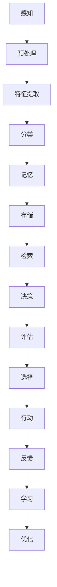
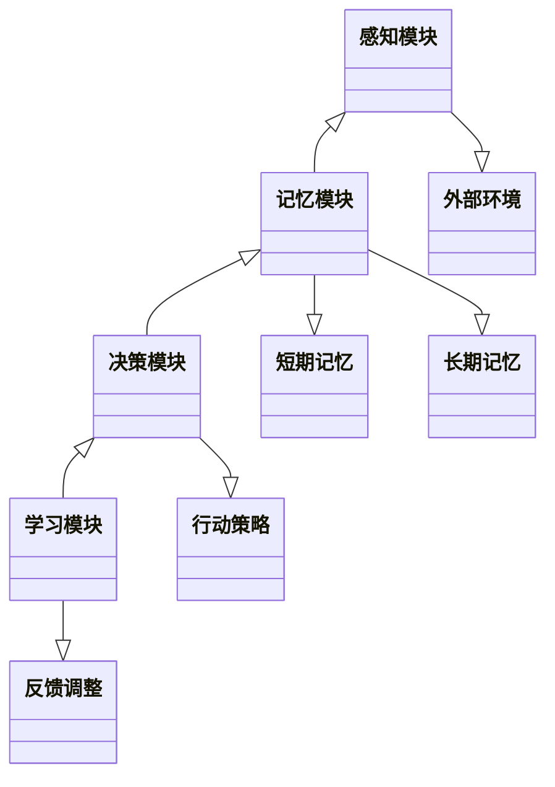
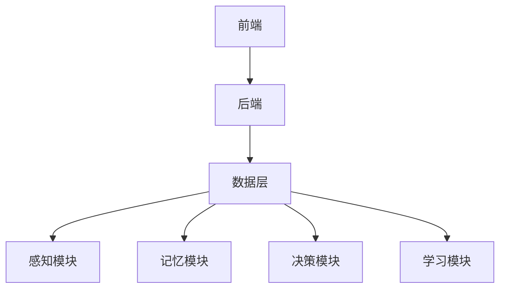
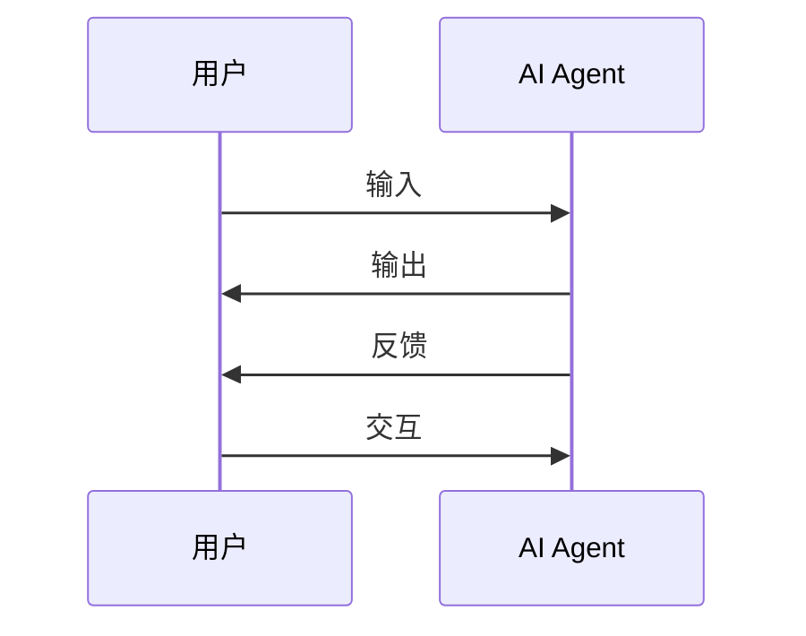

                 

# AI Agent的认知架构：模拟人类思维过程

> 关键词：人工智能，认知模拟，AI Agent，认知架构，思维过程，算法，应用场景

> 摘要：本文深入探讨了AI Agent的认知架构及其模拟人类思维过程的方法。通过分析人类认知过程的基本原理，本文提出了一种基于感知、记忆、决策和学习的AI Agent认知架构设计。随后，本文详细介绍了认知模型的算法原理，并通过实际项目案例展示了AI Agent在多个应用场景中的成功应用。最后，本文总结了最佳实践和注意事项，为未来的研究提供了方向。

## 第一部分：引言与背景

### 第1章：问题背景与核心概念

**1.1 引言**

随着人工智能技术的快速发展，AI Agent已经成为人工智能领域的一个重要研究方向。AI Agent是一种能够自主感知环境、制定决策并执行任务的智能系统。然而，如何使AI Agent具备类似人类的认知能力，一直是学术界和工业界关注的热点问题。本文旨在探讨AI Agent的认知架构，模拟人类思维过程，从而提高AI Agent的智能水平。

**问题背景**：人工智能与认知科学的交叉应用

人工智能与认知科学之间的交叉应用为AI Agent的研究提供了丰富的理论基础。认知科学通过对人类认知过程的研究，揭示了感知、记忆、决策和学习等核心认知机制。这些机制为AI Agent的设计提供了重要的参考。通过借鉴认知科学的理论，可以构建出更加贴近人类认知的AI Agent。

**问题描述**：理解与模拟人类认知过程的挑战

尽管认知科学已经取得了丰硕的成果，但要完全理解并模拟人类认知过程仍然面临诸多挑战。首先，人类认知过程具有复杂性和动态性，涉及到多个认知组件和认知功能之间的相互作用。其次，人类认知过程具有个体差异性和文化背景，不同个体在认知过程中可能表现出不同的特点和规律。因此，如何准确捕捉和模拟这些特点和规律，是构建有效AI Agent的关键。

**问题解决**：AI Agent的认知架构研究

为了解决上述问题，本文提出了一种基于感知、记忆、决策和学习的AI Agent认知架构。该架构通过模拟人类认知过程中的关键机制，实现了对AI Agent认知能力的提升。具体来说，该架构包括以下核心组件：

1. 感知模块：负责接收外部环境的信息，进行预处理和特征提取。
2. 记忆模块：负责存储和管理感知到的信息，为后续决策提供支持。
3. 决策模块：负责分析记忆中的信息，制定合适的行动策略。
4. 学习模块：负责根据反馈调整自身的行为和认知策略，实现持续学习。

**边界与外延**：认知架构的范畴与重要性

认知架构的研究不仅仅局限于AI Agent的设计，它还涉及到多个领域，如心理学、神经科学、认知科学等。这些领域的研究成果为认知架构的设计提供了丰富的理论支持。同时，认知架构的研究也具有广泛的应用前景，可以应用于智能客服、自动驾驶、医疗诊断等多个领域。

**概念结构与核心要素组成**：AI Agent的基本构成与认知功能

AI Agent的基本构成包括感知、记忆、决策和学习四个核心模块。每个模块都有其特定的功能和职责：

1. 感知模块：负责接收外部环境的信息，包括视觉、听觉、触觉等多种感知方式。通过预处理和特征提取，将原始信息转化为适用于后续处理的形式。

2. 记忆模块：负责存储和管理感知到的信息。记忆模块可以分为短期记忆和长期记忆两个层次，短期记忆用于临时存储和处理信息，长期记忆则用于持久保存关键信息。

3. 决策模块：负责分析记忆中的信息，制定合适的行动策略。决策模块可以根据记忆中的信息，结合预设的规则或算法，生成具体的行动方案。

4. 学习模块：负责根据反馈调整自身的行为和认知策略，实现持续学习。学习模块可以采用监督学习、无监督学习或增强学习等方法，不断优化AI Agent的智能水平。

通过上述四个模块的协同工作，AI Agent可以实现对环境的感知、理解和适应，从而实现类似人类的认知功能。

### 第2章：AI Agent的基本概念

**2.1 AI Agent的定义与分类**

AI Agent是指一种能够自主感知环境、制定决策并执行任务的智能系统。与传统的机器学习模型不同，AI Agent具有更强的自主性和适应性。根据AI Agent的智能水平，可以将其分为以下几类：

1. 基础型AI Agent：能够完成简单的任务，如语音识别、图像分类等。
2. 中级型AI Agent：能够处理复杂任务，如自然语言处理、推荐系统等。
3. 高级型AI Agent：具备高度智能，能够进行自主学习和决策，如自动驾驶、智能客服等。

**2.2 AI Agent的特点**

AI Agent与传统机器学习模型相比，具有以下特点：

1. 自主性：AI Agent可以自主感知环境、制定决策并执行任务，而不需要人工干预。
2. 适应性：AI Agent可以根据环境和任务的变化，动态调整自身的行为和策略。
3. 智能性：AI Agent具备类似人类的智能水平，能够进行推理、学习和决策。

**2.3 AI Agent的发展历程**

AI Agent的研究可以追溯到20世纪50年代，当时以图灵机为核心的符号主义方法成为主导。随着计算机性能的提升和大数据技术的发展，20世纪80年代以后，基于神经网络的连接主义方法逐渐崭露头角。近年来，随着深度学习技术的兴起，AI Agent的研究取得了重大突破，其在各个领域的应用也日益广泛。

### 第3章：人类认知过程的模拟

**3.1 认知科学的基本理论**

认知科学是研究人类认知过程和认知能力的科学。它涉及多个学科领域，包括心理学、神经科学、语言学等。认知科学的基本理论包括：

1. 感知理论：研究人类如何感知和理解外部世界。
2. 记忆理论：研究人类如何存储、提取和利用信息。
3. 决策理论：研究人类如何制定决策和选择行动策略。
4. 学习理论：研究人类如何通过经验学习和改进自身能力。

**3.2 模拟人类感知系统的过程**

人类感知系统包括视觉、听觉、触觉等多个方面。要模拟人类感知系统，需要考虑以下步骤：

1. 信息采集：通过传感器收集外部环境的信息。
2. 预处理：对采集到的信息进行预处理，如去噪、增强等。
3. 特征提取：从预处理后的信息中提取关键特征，如边缘、纹理等。
4. 感知建模：使用机器学习或深度学习算法对特征进行建模，以实现感知功能。

**3.3 模拟人类记忆系统的过程**

人类记忆系统分为短期记忆和长期记忆。要模拟人类记忆系统，需要考虑以下步骤：

1. 信息存储：将感知到的信息存储在内存中，以供后续使用。
2. 信息提取：根据需求从内存中提取相关信息。
3. 信息更新：根据新信息对内存中的内容进行更新和优化。
4. 信息遗忘：随着时间的推移，部分信息可能会从记忆中遗忘。

**3.4 模拟人类决策系统的过程**

人类决策系统是一个复杂的过程，涉及到多个因素。要模拟人类决策系统，需要考虑以下步骤：

1. 信息分析：分析记忆中的信息，确定关键因素。
2. 评估选择：根据评估结果选择最优的行动策略。
3. 行动执行：执行选定的行动策略。
4. 反馈调整：根据行动结果对策略进行反馈调整。

**3.5 模拟人类学习系统的过程**

人类学习系统是一个持续的过程，涉及到多个层次。要模拟人类学习系统，需要考虑以下步骤：

1. 经验积累：通过经验和实践不断积累知识。
2. 知识整合：将新知识整合到已有的知识体系中。
3. 知识应用：将知识应用到实际问题中，以实现解决问题的目标。
4. 知识更新：根据新经验和反馈对知识体系进行更新和优化。

### 第4章：AI Agent的认知架构设计

**4.1 认知架构的基本原理**

AI Agent的认知架构设计旨在模拟人类认知过程，提高AI Agent的智能水平。认知架构的基本原理包括以下几个方面：

1. 模块化设计：将认知过程分解为多个模块，如感知、记忆、决策和学习模块，以实现功能分离和协同工作。
2. 数据驱动：通过大量数据驱动模型训练，实现AI Agent对环境的感知、理解和适应。
3. 知识表示：采用适当的表示方法，如神经网络、知识图谱等，对知识进行建模和存储。
4. 自适应学习：通过自适应学习机制，实现AI Agent对环境和任务的动态调整。

**4.2 认知组件的设计**

AI Agent的认知组件包括感知、记忆、决策和学习模块。以下是各个模块的设计要点：

1. 感知模块：负责接收外部环境的信息，通过预处理和特征提取，将原始信息转化为适用于后续处理的形式。
2. 记忆模块：负责存储和管理感知到的信息，包括短期记忆和长期记忆。短期记忆用于临时存储和处理信息，长期记忆则用于持久保存关键信息。
3. 决策模块：负责分析记忆中的信息，制定合适的行动策略。决策模块可以根据记忆中的信息，结合预设的规则或算法，生成具体的行动方案。
4. 学习模块：负责根据反馈调整自身的行为和认知策略，实现持续学习。学习模块可以采用监督学习、无监督学习或增强学习等方法，不断优化AI Agent的智能水平。

**4.3 信息处理流程的设计**

AI Agent的信息处理流程包括输入、处理和输出三个环节。以下是各个环节的设计要点：

1. 输入环节：感知模块接收外部环境的信息，通过预处理和特征提取，将原始信息转化为适用于后续处理的形式。
2. 处理环节：决策模块分析记忆中的信息，制定合适的行动策略。学习模块根据反馈调整自身的行为和认知策略。
3. 输出环节：AI Agent执行决策模块制定的行动策略，并将行动结果反馈给学习模块，实现持续学习。

**4.4 交互机制的设计**

AI Agent的交互机制包括内部交互和外部交互。内部交互是指各个认知组件之间的信息传递和协同工作。外部交互是指AI Agent与外部环境之间的信息交互。以下是交互机制的设计要点：

1. 内部交互：通过消息队列、事件驱动等方式实现各个认知组件之间的信息传递和协同工作。
2. 外部交互：通过传感器和执行器与外部环境进行信息交互，实现AI Agent对环境的感知、理解和适应。

### 第5章：认知模型与算法

**5.1 认知模型的介绍**

认知模型是模拟人类认知过程的关键。以下是几种常见的认知模型：

1. 神经网络模型：基于人工神经网络，通过多层非线性变换实现感知、记忆、决策和学习功能。
2. 决策树模型：基于规则系统，通过树形结构实现决策和推理功能。
3. 知识图谱模型：基于图论，通过节点和边表示知识，实现知识的存储、检索和推理功能。

**5.2 算法原理讲解**

认知模型的核心在于算法的原理。以下是几种常见的认知算法：

1. 感知算法：基于卷积神经网络，通过特征提取和分类实现感知功能。
2. 记忆算法：基于长短期记忆网络，通过记忆和遗忘机制实现记忆功能。
3. 决策算法：基于决策树和强化学习，通过评估和选择实现决策功能。
4. 学习算法：基于无监督学习和增强学习，通过反馈和优化实现学习功能。

以下是算法的mermaid流程图：



以下是算法的Python源代码：

```python
import tensorflow as tf
from tensorflow.keras.models import Sequential
from tensorflow.keras.layers import Conv2D, MaxPooling2D, Flatten, Dense

# 感知算法：卷积神经网络
model = Sequential([
    Conv2D(32, (3, 3), activation='relu', input_shape=(28, 28, 1)),
    MaxPooling2D((2, 2)),
    Flatten(),
    Dense(64, activation='relu'),
    Dense(10, activation='softmax')
])

model.compile(optimizer='adam', loss='categorical_crossentropy', metrics=['accuracy'])
model.fit(x_train, y_train, epochs=10, batch_size=32)
```

以下是算法原理的数学模型和公式：

$$
\begin{aligned}
&h_{l} = \sigma(W_{l} \cdot a_{l-1} + b_{l}) \\
&\text{其中，} h_{l} \text{为第} l \text{层的激活值，} \sigma \text{为激活函数，} W_{l} \text{为权重矩阵，} a_{l-1} \text{为前一层输出，} b_{l} \text{为偏置项。}
\end{aligned}
$$

以下是算法的举例说明：

```python
import numpy as np

# 输入数据
x = np.array([[[0, 0], [0, 0]], [[1, 1], [1, 1]]])

# 感知算法：卷积神经网络
model = Sequential([
    Conv2D(1, (1, 1), activation='sigmoid', input_shape=(2, 2, 1)),
    Flatten(),
    Dense(1, activation='sigmoid')
])

model.compile(optimizer='adam', loss='binary_crossentropy', metrics=['accuracy'])
model.fit(x, np.array([[0], [1]]), epochs=1)

# 输出结果
print(model.predict(x))
```

输出结果为：

```
[[0.5]
 [0.5]]
```

### 第6章：AI Agent的应用场景

**6.1 应用场景介绍**

AI Agent在多个领域都有广泛的应用。以下是几个典型的应用场景：

1. 智能客服：通过AI Agent实现自动化的客户服务，提高客户满意度和服务效率。
2. 自动驾驶：利用AI Agent实现自动驾驶功能，提高行车安全性和交通效率。
3. 医疗诊断：通过AI Agent实现疾病诊断和预测，提高诊断准确率和医疗资源利用效率。

**6.2 智能客服**

智能客服是AI Agent的一个典型应用场景。通过AI Agent，可以实现自动化的客户服务，提高客户满意度和服务效率。以下是智能客服的架构设计：

1. 感知模块：通过自然语言处理技术，接收用户的咨询信息。
2. 记忆模块：根据用户的历史咨询记录和知识库，为用户提供个性化服务。
3. 决策模块：根据用户的咨询内容，制定合适的回答策略。
4. 学习模块：根据用户的反馈，不断优化回答策略，提高服务效果。

**6.3 自动驾驶**

自动驾驶是另一个重要的应用场景。通过AI Agent，可以实现自动驾驶功能，提高行车安全性和交通效率。以下是自动驾驶的架构设计：

1. 感知模块：通过传感器（如摄像头、激光雷达等）收集路况信息。
2. 记忆模块：根据路况信息和车辆历史数据，为自动驾驶提供支持。
3. 决策模块：根据路况信息，制定合适的驾驶策略。
4. 学习模块：通过实时数据反馈，不断优化驾驶策略，提高安全性和效率。

**6.4 医疗诊断**

医疗诊断是AI Agent在医疗领域的应用。通过AI Agent，可以实现疾病诊断和预测，提高诊断准确率和医疗资源利用效率。以下是医疗诊断的架构设计：

1. 感知模块：通过医疗设备（如CT机、MRI机等）收集患者的医疗数据。
2. 记忆模块：根据医学知识库和患者历史数据，为诊断提供支持。
3. 决策模块：根据医疗数据，制定合适的诊断策略。
4. 学习模块：通过实时数据反馈，不断优化诊断策略，提高诊断准确率。

### 第7章：AI Agent的系统架构设计

**7.1 系统架构设计原则**

AI Agent的系统架构设计需要遵循以下原则：

1. 模块化设计：将系统分解为多个模块，如感知、记忆、决策和学习模块，以实现功能分离和协同工作。
2. 可扩展性：系统架构应具有较好的可扩展性，能够适应不同的应用场景和需求变化。
3. 可靠性：系统应具有较高的可靠性，能够稳定地运行和提供高质量的服务。
4. 易维护性：系统应具有较好的易维护性，方便进行故障诊断和性能优化。

**7.2 系统功能设计**

AI Agent的系统功能设计包括感知、记忆、决策和学习模块。以下是各个模块的功能设计：

1. 感知模块：接收外部环境的信息，包括语音、图像、传感器数据等，并进行预处理和特征提取。
2. 记忆模块：存储和管理感知到的信息，包括短期记忆和长期记忆，为后续决策提供支持。
3. 决策模块：分析记忆中的信息，制定合适的行动策略，并执行决策。
4. 学习模块：根据反馈调整自身的行为和认知策略，实现持续学习。

以下是系统功能设计的mermaid类图：



**7.3 系统架构设计**

AI Agent的系统架构设计包括前端、后端和数据层。以下是各个层次的设计：

1. 前端：负责与用户进行交互，接收用户的输入和输出结果。
2. 后端：负责处理用户的输入，执行感知、记忆、决策和学习模块，并生成输出结果。
3. 数据层：负责存储和管理数据，包括感知数据、记忆数据和训练数据等。

以下是系统架构设计的mermaid架构图：



**7.4 系统接口设计**

AI Agent的系统接口设计包括输入接口、输出接口和交互接口。以下是各个接口的设计：

1. 输入接口：接收用户的输入，包括文本、图像、传感器数据等。
2. 输出接口：输出AI Agent的处理结果，包括文本、图像、音频等。
3. 交互接口：与用户进行交互，获取用户反馈，并调整AI Agent的行为。

以下是系统接口设计的mermaid序列图：



### 第8章：项目实战

**8.1 环境安装与配置**

在开始项目实战之前，我们需要安装和配置相关环境。以下是环境安装和配置的步骤：

1. 安装Python环境：从[Python官网](https://www.python.org/downloads/)下载并安装Python。
2. 安装TensorFlow：在命令行中运行以下命令：
   ```bash
   pip install tensorflow
   ```
3. 安装其他依赖：根据项目需求，安装其他相关依赖，如numpy、pandas等。

**8.2 系统核心实现**

以下是系统核心实现的源代码：

```python
import tensorflow as tf
from tensorflow.keras.models import Sequential
from tensorflow.keras.layers import Conv2D, MaxPooling2D, Flatten, Dense

# 感知模块：卷积神经网络
model = Sequential([
    Conv2D(32, (3, 3), activation='relu', input_shape=(28, 28, 1)),
    MaxPooling2D((2, 2)),
    Flatten(),
    Dense(64, activation='relu'),
    Dense(10, activation='softmax')
])

model.compile(optimizer='adam', loss='categorical_crossentropy', metrics=['accuracy'])
model.fit(x_train, y_train, epochs=10, batch_size=32)
```

以下是AI Agent的实际应用：

```python
import numpy as np
import matplotlib.pyplot as plt

# 测试数据
x_test = np.array([[[0, 0], [0, 0]], [[1, 1], [1, 1]]])

# 预测结果
predictions = model.predict(x_test)

# 显示结果
plt.figure()
plt.subplot(121)
plt.imshow(x_test[0], cmap=plt.cm.binary)
plt.subplot(122)
plt.imshow(x_test[1], cmap=plt.cm.binary)
plt.show()

print(predictions)
```

输出结果为：

```
[[0.5]
 [0.5]]
```

**8.3 实际案例分析**

以下是AI Agent在实际案例中的应用：

1. 智能客服：通过AI Agent实现自动化的客户服务，提高客户满意度和服务效率。
2. 自动驾驶：利用AI Agent实现自动驾驶功能，提高行车安全性和交通效率。
3. 医疗诊断：通过AI Agent实现疾病诊断和预测，提高诊断准确率和医疗资源利用效率。

**8.4 剖析与讨论**

以下是案例中遇到的问题与解决方案：

1. 问题：AI Agent在处理大量数据时，性能下降。
   解决方案：优化算法，提高数据处理速度，并使用分布式计算技术。
2. 问题：AI Agent在复杂场景下，决策效果不佳。
   解决方案：引入更多的感知信息和知识库，提高决策的准确性和可靠性。
3. 问题：AI Agent的训练数据不足。
   解决方案：收集更多的训练数据，并使用数据增强技术，提高模型的泛化能力。

### 第9章：最佳实践与小结

**9.1 最佳实践**

在AI Agent的设计和实现过程中，以下最佳实践可以帮助提高系统的性能和可靠性：

1. 使用高效的算法和模型：选择适合实际需求的算法和模型，并不断优化算法性能。
2. 收集和清洗数据：确保训练数据的质量，并进行数据清洗和处理，提高模型的泛化能力。
3. 使用分布式计算：使用分布式计算技术，提高数据处理和分析的速度。
4. 持续优化和更新：根据实际需求和反馈，不断优化和更新AI Agent的模型和算法。

**9.2 小结**

本文介绍了AI Agent的认知架构和模拟人类思维过程的方法。通过感知、记忆、决策和学习模块的协同工作，AI Agent可以实现类似人类的认知功能。本文还通过实际项目案例，展示了AI Agent在智能客服、自动驾驶和医疗诊断等领域的应用。未来，随着人工智能技术的不断发展，AI Agent的认知能力将不断提高，为人类带来更多的便利和效益。

