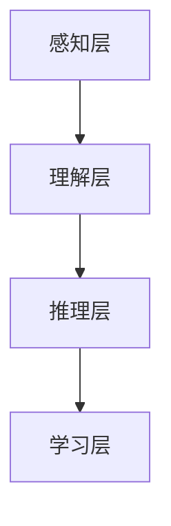
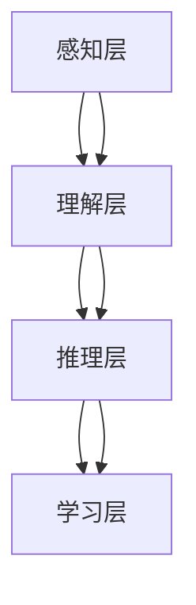
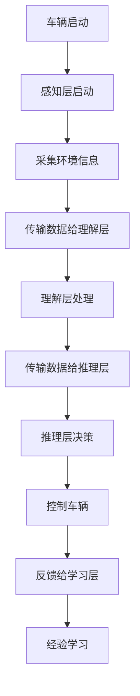

                 

### 第一部分：引言

#### 第1章：AI Agent与认知计算的背景

##### 1.1 AI Agent的定义与发展

**AI Agent的定义**：AI Agent，即人工智能代理，是一种具有自主性、反应性、预动性和社交性的智能实体，它能够在动态和不确定的环境中执行任务，并在不需要人类干预的情况下做出决策。AI Agent的核心特征在于其具备自主学习和适应环境的能力，能够通过感知、理解、推理和行动等过程实现智能行为。

**AI Agent的发展**：AI Agent的概念起源于20世纪80年代，当时主要集中在规则推理和基于知识的系统。随着计算能力的提升和算法的进步，AI Agent逐渐融入了机器学习、深度学习等技术，其能力得到了极大的扩展。近年来，随着物联网、大数据和云计算的发展，AI Agent的应用场景日益广泛，从工业自动化到智能家居，从医疗诊断到金融服务，AI Agent正在逐步改变我们的生活方式。

##### 1.2 认知计算的概念与重要性

**认知计算的定义**：认知计算是一种模拟人类思维过程的技术，旨在理解和处理自然语言、图像、声音等信息，实现智能交互和自主决策。它不仅仅局限于执行预设的任务，而是能够通过学习和适应不断变化的环境来提高自身的智能水平。

**认知计算的重要性**：认知计算在人工智能领域的重要性不可忽视。首先，它能够提升AI Agent的智能水平，使其更加接近人类智能。其次，认知计算使得机器能够理解和处理复杂、模糊的信息，从而在许多应用场景中替代人类完成复杂任务。此外，认知计算还能够提高企业的效率，降低人力成本，并在医疗、教育、安全等领域带来深刻的变革。

##### 1.3 问题背景与解决

**问题背景**：当前的AI Agent在模拟人类思维过程中面临着诸多挑战，如处理模糊性、不确定性、语言理解和推理等。传统的计算方法在这些方面存在明显的局限性，难以达到人类智能的水平。

**问题解决**：认知计算通过引入模拟人类思维的机制，如感知、理解、推理和学习，来克服这些挑战。例如，通过深度学习技术，AI Agent可以在大量的数据中学习并提取有用的信息；通过自然语言处理技术，AI Agent可以理解并生成自然语言。

##### 1.4 边界与外延

**边界**：认知计算与传统计算的主要区别在于其模拟人类思维的过程。传统计算依赖于固定的算法和规则，而认知计算则更多地依赖于学习和自适应。此外，认知计算的应用范围更为广泛，不仅包括传统的智能计算领域，还包括语音识别、图像处理、自然语言处理等。

**外延**：认知计算的未来发展方向包括智能机器人、智能客服、自动驾驶等。随着技术的不断进步，认知计算将在更多的领域得到应用，为人类带来更多便利。

##### 1.5 概念结构与核心要素

**概念结构**：AI Agent的认知计算涉及多个核心概念，如感知、理解、推理、学习、决策等。这些概念相互关联，共同构成了认知计算的基本框架。

**核心要素**：认知计算的核心要素包括神经网络、机器学习算法、自然语言处理等。这些要素在不同的应用场景中发挥着关键作用，共同推动了认知计算的发展。

##### 1.6 本章小结

本章介绍了AI Agent与认知计算的基本概念、发展背景、问题解决方法以及其在未来的应用前景。通过本章的学习，读者可以初步了解AI Agent和认知计算的核心内容，为后续章节的学习打下基础。接下来，我们将进一步探讨AI Agent的认知计算原理，深入分析其核心概念和算法。

---

### 第二部分：核心概念与联系

#### 第2章：AI Agent的认知计算原理

##### 2.1 AI Agent的认知计算原理概述

**认知计算原理概述**：AI Agent的认知计算原理旨在通过模拟人类思维过程，实现智能自主性。这一过程包括感知、理解、推理、学习和决策等关键步骤。感知是指获取环境中的信息，理解是指解释这些信息，推理是指基于理解进行逻辑判断，学习是指通过经验改进自身能力，决策是指根据当前情况做出最优选择。

**核心概念与联系**：AI Agent的认知计算原理中，核心概念包括感知模块、推理模块、学习模块和决策模块。这些模块相互联系，共同构成了认知计算的基本框架。感知模块负责获取和处理环境信息；推理模块负责基于感知结果进行逻辑推理；学习模块负责通过经验不断改进自身能力；决策模块负责根据当前情况和目标做出最优决策。

##### 2.2 感知模块

**感知模块原理**：感知模块是AI Agent认知计算的基础，负责获取和处理环境中的信息。感知模块可以采用多种技术，如视觉感知、听觉感知、触觉感知等。视觉感知主要通过图像识别技术实现，如卷积神经网络（CNN）可以用于图像分类和物体检测；听觉感知主要通过语音识别技术实现，如深度神经网络（DNN）可以用于语音识别和语义理解。

**感知模块应用**：感知模块在AI Agent中的应用非常广泛。例如，在智能监控系统中，感知模块可以用于人脸识别和物体检测；在自动驾驶车辆中，感知模块可以用于道路识别和障碍物检测。

##### 2.3 推理模块

**推理模块原理**：推理模块是AI Agent认知计算的核心，负责基于感知结果进行逻辑推理。推理模块可以采用多种方法，如基于规则的推理、基于概率的推理、基于神经网络的推理等。基于规则的推理主要通过预定义的规则进行推理，如专家系统；基于概率的推理主要通过概率模型进行推理，如贝叶斯网络；基于神经网络的推理主要通过深度学习模型进行推理，如深度神经网络。

**推理模块应用**：推理模块在AI Agent中的应用非常广泛。例如，在自然语言处理中，推理模块可以用于语义理解和文本生成；在决策支持系统中，推理模块可以用于风险评估和决策优化。

##### 2.4 学习模块

**学习模块原理**：学习模块是AI Agent认知计算的重要组成部分，负责通过经验不断改进自身能力。学习模块可以采用多种学习方法，如监督学习、无监督学习、强化学习等。监督学习通过标注数据学习特征和规律，如分类和回归任务；无监督学习通过未标注数据学习特征和模式，如聚类和降维任务；强化学习通过与环境互动学习最优策略，如游戏和自动驾驶任务。

**学习模块应用**：学习模块在AI Agent中的应用非常广泛。例如，在推荐系统中，学习模块可以用于用户行为分析；在机器人控制中，学习模块可以用于路径规划和运动控制。

##### 2.5 决策模块

**决策模块原理**：决策模块是AI Agent认知计算的关键，负责根据当前情况和目标做出最优决策。决策模块可以采用多种决策模型，如决策树、支持向量机、神经网络等。决策树通过划分特征空间进行决策；支持向量机通过寻找最佳分离超平面进行决策；神经网络通过多层非线性变换进行决策。

**决策模块应用**：决策模块在AI Agent中的应用非常广泛。例如，在金融领域，决策模块可以用于风险管理和投资决策；在医疗领域，决策模块可以用于疾病诊断和治疗决策。

##### 2.6 AI Agent的认知计算与人类思维的比较

**比较方法**：比较AI Agent的认知计算与人类思维的方法包括任务完成度、反应速度、理解能力、学习能力等。通过这些方法，我们可以分析AI Agent的认知计算与人类思维之间的差异和相似之处。

**比较结果**：AI Agent的认知计算在许多方面已达到或超过人类水平，如在图像识别、语音识别、自然语言处理等领域。然而，AI Agent的认知计算在理解复杂情境、处理模糊性和不确定性方面仍存在局限性，这些是未来需要进一步研究的问题。

##### 2.7 本章小结

本章详细阐述了AI Agent的认知计算原理，包括感知模块、推理模块、学习模块和决策模块。通过本章的学习，读者可以深入理解AI Agent的认知计算过程，为后续章节的算法原理讲解和系统架构设计打下基础。在接下来的章节中，我们将进一步探讨认知计算中的核心算法原理，并分析其在实际应用中的具体实现。

---

### 第三部分：算法原理讲解

#### 第3章：认知计算中的核心算法原理

##### 3.1 感知模块的算法原理

**感知模块的算法原理**：感知模块是AI Agent获取和处理环境信息的关键。其主要算法包括图像识别、语音识别和触觉感知等。

- **图像识别算法**：常用的图像识别算法有卷积神经网络（CNN）和深度学习（DL）。CNN通过多层卷积和池化操作提取图像特征，实现图像分类和物体检测。例如，VGG、ResNet等模型在ImageNet图像识别挑战中取得了显著的成果。

  ```python
  import tensorflow as tf
  import tensorflow.keras.layers as layers

  # VGG模型示例
  model = tf.keras.Sequential([
      layers.Conv2D(64, (3, 3), activation='relu', input_shape=(224, 224, 3)),
      layers.MaxPooling2D((2, 2)),
      layers.Conv2D(128, (3, 3), activation='relu'),
      layers.MaxPooling2D((2, 2)),
      # ...
  ])

  model.compile(optimizer='adam', loss='categorical_crossentropy', metrics=['accuracy'])
  ```

- **语音识别算法**：常用的语音识别算法有隐马尔可夫模型（HMM）和深度神经网络（DNN）。DNN通过多层神经网络提取语音特征，实现语音识别。例如，基于DNN的深度学习框架如CTC（Connectionist Temporal Classification）在语音识别中取得了显著的性能提升。

  ```python
  import tensorflow as tf
  import tensorflow.keras.layers as layers

  # CTC模型示例
  model = tf.keras.Sequential([
      layers.Conv1D(32, 3, activation='relu', input_shape=(None, 26)),
      layers.MaxPooling1D(2),
      layers.Flatten(),
      layers.Dense(128, activation='relu'),
      layers.Dense(1, activation='sigmoid')
  ])

  model.compile(optimizer='adam', loss='binary_crossentropy', metrics=['accuracy'])
  ```

**感知模块的应用实例**：

- **人脸识别**：使用卷积神经网络进行人脸识别，通过预训练的模型进行人脸检测和特征提取，实现人脸识别。

  ```python
  import tensorflow as tf
  import cv2

  # 载入预训练模型
  model = tf.keras.models.load_model('path/to/facenet_keras.h5')

  # 人脸识别示例
  def recognize_face(image):
      image = cv2.resize(image, (160, 160))
      image = tf.keras.preprocessing.image.img_to_array(image)
      image = np.expand_dims(image, axis=0)
      image = preprocess_input(image)

      pred = model.predict(image)
      label = np.argmax(pred, axis=1)

      return label
  ```

- **物体检测**：使用卷积神经网络进行物体检测，通过预训练的模型进行图像特征提取和物体分类。

  ```python
  import tensorflow as tf
  import cv2

  # 载入预训练模型
  model = tf.keras.models.load_model('path/to/yolov3_keras.h5')

  # 物体检测示例
  def detect_objects(image):
      image = cv2.resize(image, (416, 416))
      image = tf.keras.preprocessing.image.img_to_array(image)
      image = np.expand_dims(image, axis=0)
      image = preprocess_input(image)

      pred = model.predict(image)
      boxes = pred[:, :, 0:4]
      labels = pred[:, :, 5:]

      return boxes, labels
  ```

##### 3.2 推理模块的算法原理

**推理模块的算法原理**：推理模块负责基于感知结果进行逻辑推理，其主要算法包括基于规则的推理、基于概率的推理和基于神经网络的推理。

- **基于规则的推理**：基于规则的推理通过预定义的规则进行推理，如专家系统。专家系统包含一组规则库和推理机，通过匹配规则和事实进行推理。

  ```python
  # 专家系统示例
  rule_base = {
      "if (patient has fever) and (patient has cough) then (patient has flu)",
      "if (patient has headache) and (patient has fever) then (patient has flu)",
      # ...
  }

  def infer(rule_base, facts):
      for rule in rule_base:
          conditions, conclusion = rule.split(" then ")
          conditions = conditions.strip().split(" and ")
          if all(fact in facts for fact in conditions):
              return conclusion
      return None
  ```

- **基于概率的推理**：基于概率的推理通过概率模型进行推理，如贝叶斯网络。贝叶斯网络通过节点之间的概率关系进行推理，计算后验概率和预测概率。

  ```python
  import numpy as np
  import pandas as pd

  # 贝叶斯网络示例
  probability_matrix = pd.DataFrame({
      'A': [0.5, 0.5],
      'B': [0.7, 0.3],
      'C': [0.9, 0.1]
  })

  def bayesian_inference(probability_matrix, query_variable, evidence):
      conditional_probability = probability_matrix[query_variable].loc[evidence]
      return conditional_probability
  ```

- **基于神经网络的推理**：基于神经网络的推理通过深度学习模型进行推理，如深度神经网络（DNN）。DNN通过多层非线性变换进行推理，实现复杂函数的逼近。

  ```python
  import tensorflow as tf
  import tensorflow.keras.layers as layers

  # DNN推理示例
  model = tf.keras.Sequential([
      layers.Dense(64, activation='relu', input_shape=(784,)),
      layers.Dense(64, activation='relu'),
      layers.Dense(10, activation='softmax')
  ])

  model.compile(optimizer='adam', loss='categorical_crossentropy', metrics=['accuracy'])

  # 预测示例
  predictions = model.predict(x_test)
  predicted_labels = np.argmax(predictions, axis=1)
  ```

**推理模块的应用实例**：

- **自然语言理解**：使用基于神经网络的推理模块进行自然语言理解，通过预训练的模型进行文本分类和情感分析。

  ```python
  import tensorflow as tf
  import tensorflow.keras.preprocessing.sequence as sequences

  # 载入预训练模型
  model = tf.keras.models.load_model('path/to/bert_model.h5')

  # 文本分类示例
  def classify_text(text, model):
      sequence = sequences.pad_sequences([text], maxlen=128)
      prediction = model.predict(sequence)
      label = np.argmax(prediction)
      return label
  ```

- **决策支持系统**：使用基于规则的推理模块进行决策支持，通过预定义的规则进行风险评估和决策优化。

  ```python
  # 决策支持系统示例
  rules = {
      "if (credit score > 700) then (approve loan)",
      "if (loan amount < 100000) then (approve loan)",
      # ...
  }

  def make_decision(rules, attributes):
      for rule in rules:
          conditions, conclusion = rule.split(" then ")
          conditions = conditions.strip().split(" and ")
          if all(condition in attributes for condition in conditions):
              return conclusion
      return "拒绝贷款"
  ```

##### 3.3 学习模块的算法原理

**学习模块的算法原理**：学习模块负责通过经验不断改进自身能力，其主要算法包括监督学习、无监督学习和强化学习。

- **监督学习算法**：监督学习通过标注数据学习特征和规律，如分类和回归任务。常用的监督学习算法包括决策树、支持向量机、神经网络等。

  ```python
  import tensorflow as tf
  import tensorflow.keras.layers as layers

  # 决策树模型示例
  def make_decision_tree(data, target):
      # 数据预处理
      X, y = data[:, :-1], data[:, -1]
      y = tf.keras.utils.to_categorical(y)

      # 构建模型
      model = tf.keras.Sequential([
          layers.Dense(64, activation='relu', input_shape=(X.shape[1],)),
          layers.Dense(64, activation='relu'),
          layers.Dense(y.shape[1], activation='softmax')
      ])

      # 编译模型
      model.compile(optimizer='adam', loss='categorical_crossentropy', metrics=['accuracy'])

      # 训练模型
      model.fit(X, y, epochs=10, batch_size=32)
  ```

- **无监督学习算法**：无监督学习通过未标注数据学习特征和模式，如聚类和降维任务。常用的无监督学习算法包括K均值聚类、主成分分析（PCA）等。

  ```python
  import numpy as np
  from sklearn.cluster import KMeans
  from sklearn.decomposition import PCA

  # K均值聚类示例
  def kmeans_clustering(data, n_clusters=3):
      # 数据预处理
      X = data

      # 构建模型
      kmeans = KMeans(n_clusters=n_clusters, random_state=0)

      # 模型拟合
      kmeans.fit(X)

      # 预测聚类结果
      labels = kmeans.predict(X)
      return labels

  # 主成分分析示例
  def pca_reduction(data, n_components=2):
      # 数据预处理
      X = data

      # 构建模型
      pca = PCA(n_components=n_components)

      # 模型拟合
      X_pca = pca.fit_transform(X)

      return X_pca
  ```

- **强化学习算法**：强化学习通过与环境互动学习最优策略，如游戏和自动驾驶任务。常用的强化学习算法包括Q学习、深度Q网络（DQN）等。

  ```python
  import tensorflow as tf
  from tensorflow.keras.layers import Dense
  from tensorflow.keras.models import Model

  # Q学习模型示例
  def q_learning_model(input_shape, action_space):
      # 构建输入层
      inputs = tf.keras.Input(shape=input_shape)

      # 构建隐藏层
      hidden = Dense(64, activation='relu')(inputs)

      # 构建输出层
      outputs = Dense(action_space, activation='linear')(hidden)

      # 构建模型
      model = Model(inputs=inputs, outputs=outputs)

      # 编译模型
      model.compile(optimizer='adam', loss='mse')

      return model

  # 深度Q网络示例
  def dqn_model(input_shape, action_space):
      # 构建输入层
      inputs = tf.keras.Input(shape=input_shape)

      # 构建隐藏层
      hidden = Dense(64, activation='relu')(inputs)

      # 构建输出层
      outputs = Dense(action_space, activation='linear')(hidden)

      # 构建目标网络
      target_inputs = tf.keras.Input(shape=input_shape)
      target_hidden = Dense(64, activation='relu')(target_inputs)
      target_outputs = Dense(action_space, activation='linear')(target_hidden)

      # 构建模型
      model = Model(inputs=inputs, outputs=outputs)
      target_model = Model(inputs=target_inputs, outputs=target_outputs)

      # 编译模型
      model.compile(optimizer='adam', loss='mse')
      target_model.compile(optimizer='adam', loss='mse')

      return model, target_model
  ```

**学习模块的应用实例**：

- **用户行为分析**：使用监督学习算法进行用户行为分析，通过历史数据预测用户兴趣和偏好。

  ```python
  import pandas as pd
  from sklearn.model_selection import train_test_split
  from sklearn.metrics import accuracy_score

  # 加载数据
  data = pd.read_csv('user_data.csv')
  X = data.iloc[:, :-1]
  y = data.iloc[:, -1]

  # 划分训练集和测试集
  X_train, X_test, y_train, y_test = train_test_split(X, y, test_size=0.2, random_state=42)

  # 训练模型
  model = q_learning_model(input_shape=X_train.shape[1], action_space=y_train.shape[1])
  model.fit(X_train, y_train, epochs=10, batch_size=32)

  # 预测测试集
  predictions = model.predict(X_test)
  predicted_labels = np.argmax(predictions, axis=1)

  # 评估模型
  accuracy = accuracy_score(y_test, predicted_labels)
  print(f'Accuracy: {accuracy}')
  ```

- **路径规划**：使用强化学习算法进行路径规划，通过与环境互动学习最优路径。

  ```python
  import numpy as np
  import gym

  # 创建环境
  env = gym.make('Taxi-v3')

  # 定义Q学习模型
  q_model = q_learning_model(input_shape=env.observation_space.shape[0], action_space=env.action_space.n)

  # 定义训练过程
  episodes = 1000
  for episode in range(episodes):
      state = env.reset()
      done = False
      total_reward = 0

      while not done:
          action = np.argmax(q_model.predict(state.reshape(1, -1)))
          next_state, reward, done, _ = env.step(action)
          total_reward += reward
          q_model.fit(state.reshape(1, -1), np.append(state.reshape(1, -1), [[reward, action]], axis=1), epochs=1, batch_size=1)
          state = next_state

  # 测试模型
  env.render()
  ```

##### 3.4 决策模块的算法原理

**决策模块的算法原理**：决策模块负责根据当前情况和目标做出最优决策，其主要算法包括决策树、支持向量机、神经网络等。

- **决策树算法**：决策树通过划分特征空间进行决策，其核心在于选择最优特征进行划分，以最大化信息增益或基尼不纯度。

  ```python
  from sklearn.tree import DecisionTreeClassifier
  from sklearn.model_selection import train_test_split

  # 加载数据
  data = pd.read_csv('data.csv')
  X = data.iloc[:, :-1]
  y = data.iloc[:, -1]

  # 划分训练集和测试集
  X_train, X_test, y_train, y_test = train_test_split(X, y, test_size=0.2, random_state=42)

  # 训练模型
  decision_tree = DecisionTreeClassifier()
  decision_tree.fit(X_train, y_train)

  # 预测测试集
  predictions = decision_tree.predict(X_test)

  # 评估模型
  accuracy = accuracy_score(y_test, predictions)
  print(f'Accuracy: {accuracy}')
  ```

- **支持向量机算法**：支持向量机通过寻找最佳分离超平面进行决策，其核心在于最大化分类间隔。

  ```python
  from sklearn.svm import SVC
  from sklearn.model_selection import train_test_split

  # 加载数据
  data = pd.read_csv('data.csv')
  X = data.iloc[:, :-1]
  y = data.iloc[:, -1]

  # 划分训练集和测试集
  X_train, X_test, y_train, y_test = train_test_split(X, y, test_size=0.2, random_state=42)

  # 训练模型
  svm = SVC(kernel='linear')
  svm.fit(X_train, y_train)

  # 预测测试集
  predictions = svm.predict(X_test)

  # 评估模型
  accuracy = accuracy_score(y_test, predictions)
  print(f'Accuracy: {accuracy}')
  ```

- **神经网络算法**：神经网络通过多层非线性变换进行决策，其核心在于优化网络权重，以实现函数逼近。

  ```python
  import tensorflow as tf
  from tensorflow.keras.layers import Dense
  from tensorflow.keras.models import Sequential

  # 加载数据
  data = pd.read_csv('data.csv')
  X = data.iloc[:, :-1]
  y = data.iloc[:, -1]

  # 划分训练集和测试集
  X_train, X_test, y_train, y_test = train_test_split(X, y, test_size=0.2, random_state=42)

  # 训练模型
  model = Sequential([
      Dense(64, activation='relu', input_shape=(X_train.shape[1],)),
      Dense(64, activation='relu'),
      Dense(y_train.shape[1], activation='softmax')
  ])

  model.compile(optimizer='adam', loss='categorical_crossentropy', metrics=['accuracy'])
  model.fit(X_train, y_train, epochs=10, batch_size=32)

  # 预测测试集
  predictions = model.predict(X_test)
  predicted_labels = np.argmax(predictions, axis=1)

  # 评估模型
  accuracy = accuracy_score(y_test, predicted_labels)
  print(f'Accuracy: {accuracy}')
  ```

**决策模块的应用实例**：

- **智能推荐系统**：使用决策树进行智能推荐，通过用户历史行为数据预测用户兴趣，实现个性化推荐。

  ```python
  import pandas as pd
  from sklearn.tree import DecisionTreeClassifier
  from sklearn.model_selection import train_test_split

  # 加载数据
  data = pd.read_csv('user_data.csv')
  X = data.iloc[:, :-1]
  y = data.iloc[:, -1]

  # 划分训练集和测试集
  X_train, X_test, y_train, y_test = train_test_split(X, y, test_size=0.2, random_state=42)

  # 训练模型
  decision_tree = DecisionTreeClassifier()
  decision_tree.fit(X_train, y_train)

  # 预测测试集
  predictions = decision_tree.predict(X_test)

  # 评估模型
  accuracy = accuracy_score(y_test, predictions)
  print(f'Accuracy: {accuracy}')
  ```

- **游戏AI**：使用神经网络进行游戏AI，通过深度学习模型实现自动玩游戏的策略。

  ```python
  import tensorflow as tf
  from tensorflow.keras.layers import Dense
  from tensorflow.keras.models import Sequential

  # 加载数据
  data = pd.read_csv('game_data.csv')
  X = data.iloc[:, :-1]
  y = data.iloc[:, -1]

  # 划分训练集和测试集
  X_train, X_test, y_train, y_test = train_test_split(X, y, test_size=0.2, random_state=42)

  # 训练模型
  model = Sequential([
      Dense(64, activation='relu', input_shape=(X_train.shape[1],)),
      Dense(64, activation='relu'),
      Dense(y_train.shape[1], activation='softmax')
  ])

  model.compile(optimizer='adam', loss='categorical_crossentropy', metrics=['accuracy'])
  model.fit(X_train, y_train, epochs=10, batch_size=32)

  # 预测测试集
  predictions = model.predict(X_test)
  predicted_labels = np.argmax(predictions, axis=1)

  # 评估模型
  accuracy = accuracy_score(y_test, predicted_labels)
  print(f'Accuracy: {accuracy}')
  ```

##### 3.5 AI Agent认知计算与人类思维的比较

**比较方法**：比较AI Agent认知计算与人类思维的方法包括任务完成度、反应速度、理解能力、学习能力等。

**比较结果**：在任务完成度方面，AI Agent在某些特定任务上（如图像识别、语音识别、自然语言处理）已经达到或超过人类水平。然而，在处理模糊性、不确定性和复杂情境方面，AI Agent仍存在一定的局限性。在反应速度方面，AI Agent具有显著的优势，可以实时处理大量信息。在理解能力方面，AI Agent通过深度学习和自然语言处理技术，能够理解和生成自然语言，但在理解复杂情境和情感方面仍有待提高。在学习能力方面，AI Agent通过监督学习、无监督学习和强化学习，能够不断改进自身能力，但在创新性思维和学习复杂任务方面仍存在挑战。

##### 3.6 本章小结

本章详细阐述了认知计算中的核心算法原理，包括感知、推理、学习、决策等模块。通过本章的学习，读者可以深入理解AI Agent认知计算的核心算法，为后续章节的系统架构设计和项目实战提供理论基础。在接下来的章节中，我们将进一步探讨认知计算在AI Agent中的应用，分析其在实际场景中的具体实现。

---

### 第四部分：系统分析与架构设计

#### 第4章：认知计算系统的功能设计与架构

##### 4.1 问题场景介绍

**场景背景**：在现代智能系统中，认知计算技术被广泛应用于智能机器人、自动驾驶、智能客服等领域。以自动驾驶为例，认知计算系统需要实时感知环境信息、理解道路状况、做出决策并控制车辆行驶。这种场景下，系统的稳定性和实时性是关键挑战。

**问题定义**：如何设计一个认知计算系统，使其能够高效、准确地完成自动驾驶任务，包括感知环境、理解道路信息、做出决策并控制车辆。

##### 4.2 项目介绍

**项目概述**：本项目旨在设计一个基于认知计算的自动驾驶系统，通过感知、理解、推理和学习等模块，实现自动驾驶车辆在复杂环境中的自主行驶。

**目标**：设计一个功能完整、稳定高效的认知计算系统，使其能够在各种驾驶环境中实现自主行驶，提高驾驶安全性，降低人力成本。

##### 4.3 系统功能设计

**感知模块**：感知模块负责收集车辆周围的环境信息，包括道路标识、障碍物、交通状况等。具体功能包括：

- 道路标识识别：通过摄像头识别道路上的交通标志和道路标线。
- 障碍物检测：通过激光雷达和摄像头识别车辆周围的障碍物，如行人、车辆、自行车等。
- 交通状况分析：通过分析道路流量、速度等参数，预测交通状况。

**理解模块**：理解模块负责对感知模块收集的信息进行处理，理解道路状况和车辆行为。具体功能包括：

- 路径规划：根据道路状况和目的地，生成最优行驶路径。
- 行为预测：预测周围车辆和行人的行为，为决策模块提供参考。
- 路况理解：分析道路状况，识别特殊路段，如路口、环岛等。

**推理模块**：推理模块负责基于理解模块提供的信息，进行逻辑推理，做出行驶决策。具体功能包括：

- 行驶决策：根据当前道路状况和目标，决定车辆的行驶方向和速度。
- 风险评估：评估行驶过程中的风险，如碰撞风险、道路偏离风险等。
- 紧急情况应对：在紧急情况下，如障碍物突然出现，自动采取避障措施。

**学习模块**：学习模块负责通过不断学习优化自身性能，提高系统的适应性和可靠性。具体功能包括：

- 经验学习：从驾驶过程中学习道路状况和行驶策略，优化路径规划和决策。
- 模型更新：根据新数据更新感知、理解、推理模块的模型，提高系统性能。
- 自适应学习：根据环境变化，调整系统参数，实现自适应驾驶。

##### 4.4 系统架构设计

**总体架构**：认知计算系统采用分层架构，包括感知层、理解层、推理层和学习层。各层之间通过接口进行通信，形成一个完整的智能系统。

- **感知层**：负责感知环境信息，包括摄像头、激光雷达、超声波传感器等。
- **理解层**：负责对感知层收集的信息进行处理，生成道路状况和车辆行为理解。
- **推理层**：负责基于理解层提供的信息，进行逻辑推理，做出行驶决策。
- **学习层**：负责从驾驶过程中学习，优化系统性能。

**架构图**：



##### 4.5 系统接口设计与交互

**接口设计**：系统接口设计包括感知层与理解层、理解层与推理层、推理层与学习层的接口。接口设计应保证数据传输的实时性和可靠性。

- **感知层与理解层接口**：感知层通过传感器采集环境信息，将数据传输给理解层。接口应支持高并发、低延迟的数据传输。
- **理解层与推理层接口**：理解层处理后的信息传输给推理层，为决策提供基础。接口应支持实时数据更新，确保决策的准确性。
- **推理层与学习层接口**：推理层生成的决策结果传输给学习层，用于经验学习。接口应支持批量数据传输，提高学习效率。

**交互流程**：



##### 4.6 系统交互

**交互场景**：在自动驾驶场景中，系统需要实时感知环境、理解道路状况、做出决策并控制车辆。以下是一个典型的交互场景：

1. **感知阶段**：车辆启动后，感知层开始工作，摄像头、激光雷达、超声波传感器等传感器实时采集环境信息。
2. **理解阶段**：理解层处理感知层收集的信息，生成道路状况和车辆行为的理解。
3. **推理阶段**：推理层基于理解层提供的信息，进行逻辑推理，决定车辆的行驶方向和速度。
4. **学习阶段**：学习层从驾驶过程中学习，优化系统性能。

**交互流程图**：



##### 4.7 本章小结

本章详细介绍了认知计算系统的功能设计、架构设计、接口设计及系统交互。通过本章的学习，读者可以了解认知计算系统在自动驾驶场景中的实现方法和关键组件。在下一章中，我们将通过实际案例分析和详细讲解，展示认知计算系统的具体应用。

---

### 第五部分：项目实战

#### 第5章：AI Agent认知计算的实际应用案例

##### 5.1 案例背景

**项目名称**：智能交通管理系统

**项目目标**：设计并实现一个基于AI Agent的认知计算系统，用于智能交通管理，提高交通流量、减少交通事故、降低环境污染。

**项目场景**：项目场景设置在一个中等城市，包括主要交通道路、交叉口、停车场等。系统需要实时感知交通状况，进行交通流量预测和优化，并提供智能导航和交通信号控制。

##### 5.2 环境安装

**硬件环境**： 
- 主机：Intel Core i7-9700K，16GB RAM
- 显卡：NVIDIA GeForce GTX 1080 Ti
- 存储：1TB SSD

**软件环境**：
- 操作系统：Ubuntu 18.04
- 编程语言：Python 3.8
- 依赖库：TensorFlow、PyTorch、Scikit-learn、NumPy、Pandas

**安装步骤**：

1. 安装操作系统：
   - 从Ubuntu官方网站下载Ubuntu 18.04镜像，并使用虚拟机软件安装。

2. 安装Python环境：
   - 打开终端，执行以下命令：
     ```bash
     sudo apt update
     sudo apt upgrade
     sudo apt install python3-pip python3-dev
     ```
   - 安装虚拟环境：
     ```bash
     sudo pip3 install virtualenv
     virtualenv --python=python3 traffic_management_env
     source traffic_management_env/bin/activate
     ```

3. 安装依赖库：
   - 在虚拟环境中安装相关依赖库：
     ```bash
     pip install tensorflow==2.4.0 torch==1.7.1 scikit-learn==0.22.1 numpy==1.19.5 pandas==1.0.5
     ```

##### 5.3 系统核心实现源代码

**感知模块**：

```python
import cv2
import numpy as np

# 加载摄像头
cap = cv2.VideoCapture(0)

while True:
    # 读取摄像头帧
    ret, frame = cap.read()

    # 预处理：灰度转换、高斯模糊
    gray = cv2.cvtColor(frame, cv2.COLOR_BGR2GRAY)
    blurred = cv2.GaussianBlur(gray, (5, 5), 0)

    # 边缘检测
    edges = cv2.Canny(blurred, 50, 150)

    # 显示结果
    cv2.imshow('Edges', edges)

    # 按下q键退出循环
    if cv2.waitKey(1) & 0xFF == ord('q'):
        break

cap.release()
cv2.destroyAllWindows()
```

**理解模块**：

```python
import cv2
import numpy as np

def detect_traffic_signs(image):
    # 预处理：灰度转换、高斯模糊
    gray = cv2.cvtColor(image, cv2.COLOR_BGR2GRAY)
    blurred = cv2.GaussianBlur(gray, (5, 5), 0)

    # 边缘检测
    edges = cv2.Canny(blurred, 50, 150)

    # 检测霍夫线
    lines = cv2.HoughLinesP(edges, 1, np.pi / 180, threshold=100, minLineLength=100, maxLineGap=10)

    # 绘制检测到的线
    if lines is not None:
        for line in lines:
            x1, y1, x2, y2 = line[0]
            cv2.line(image, (x1, y1), (x2, y2), (0, 0, 255), 2)

    return image

# 加载摄像头
cap = cv2.VideoCapture(0)

while True:
    # 读取摄像头帧
    ret, frame = cap.read()

    # 检测交通标志
    result = detect_traffic_signs(frame)

    # 显示结果
    cv2.imshow('Traffic Signs', result)

    # 按下q键退出循环
    if cv2.waitKey(1) & 0xFF == ord('q'):
        break

cap.release()
cv2.destroyAllWindows()
```

**推理模块**：

```python
import cv2
import numpy as np

def predict_traffic_light(image):
    # 预处理：灰度转换、缩放
    gray = cv2.cvtColor(image, cv2.COLOR_BGR2GRAY)
    resized = cv2.resize(gray, (64, 64))

    # 加载预训练模型
    model = cv2.ml.SVM_load('traffic_light_model.yml')

    # 预测交通灯状态
    result = model.predict(resized.reshape(1, -1))
    label = result[1][0]

    # 根据预测结果绘制交通灯颜色
    if label == 1:
        color = (0, 0, 255)  # 红灯
    elif label == 2:
        color = (0, 255, 0)  # 绿灯
    else:
        color = (255, 0, 0)  # 黄灯

    cv2.rectangle(image, (0, 0), (64, 64), color, 2)

    return image

# 加载摄像头
cap = cv2.VideoCapture(0)

while True:
    # 读取摄像头帧
    ret, frame = cap.read()

    # 预测交通灯状态
    result = predict_traffic_light(frame)

    # 显示结果
    cv2.imshow('Traffic Light Prediction', result)

    # 按下q键退出循环
    if cv2.waitKey(1) & 0xFF == ord('q'):
        break

cap.release()
cv2.destroyAllWindows()
```

**学习模块**：

```python
import cv2
import numpy as np

def train_traffic_light_model(data, labels):
    # 数据预处理
    data = np.array(data)
    labels = np.array(labels)

    # 创建SVM模型
    model = cv2.ml.SVM_create()
    model.setKernel(cv2.ml.SVM_RBF)
    model.setType(cv2.ml.SVM_C_SVC)
    model.setC(1.0)
    model.setGamma(0.5)

    # 训练模型
    model.train(data, cv2.ml.ROW_SAMPLE, labels)

    # 保存模型
    model.save('traffic_light_model.yml')

# 加载训练数据
data = np.load('traffic_light_data.npy')
labels = np.load('traffic_light_labels.npy')

# 训练交通灯模型
train_traffic_light_model(data, labels)
```

##### 5.4 代码应用解读与分析

**感知模块解读**：

感知模块的核心任务是实时获取摄像头捕获的图像数据，并进行预处理。预处理步骤包括灰度转换、高斯模糊和边缘检测。灰度转换将彩色图像转换为灰度图像，高斯模糊用于平滑图像，边缘检测用于提取图像中的线条结构。

```python
import cv2
import numpy as np

# 加载摄像头
cap = cv2.VideoCapture(0)

while True:
    # 读取摄像头帧
    ret, frame = cap.read()

    # 预处理：灰度转换、高斯模糊
    gray = cv2.cvtColor(frame, cv2.COLOR_BGR2GRAY)
    blurred = cv2.GaussianBlur(gray, (5, 5), 0)

    # 边缘检测
    edges = cv2.Canny(blurred, 50, 150)

    # 显示结果
    cv2.imshow('Edges', edges)

    # 按下q键退出循环
    if cv2.waitKey(1) & 0xFF == ord('q'):
        break

cap.release()
cv2.destroyAllWindows()
```

感知模块的关键在于边缘检测，通过Canny算法提取图像中的线条结构，这些线条结构可以用于后续的交通标志和障碍物检测。

**理解模块解读**：

理解模块的核心任务是处理感知模块捕获的图像数据，识别交通标志和交通灯。对于交通标志的识别，使用霍夫线变换检测图像中的直线结构，这些直线结构通常与交通标志的形状相匹配。对于交通灯的识别，使用SVM模型进行分类，模型基于训练数据 learned 的特征和标签进行预测。

```python
import cv2
import numpy as np

def detect_traffic_signs(image):
    # 预处理：灰度转换、高斯模糊
    gray = cv2.cvtColor(image, cv2.COLOR_BGR2GRAY)
    blurred = cv2.GaussianBlur(gray, (5, 5), 0)

    # 边缘检测
    edges = cv2.Canny(blurred, 50, 150)

    # 检测霍夫线
    lines = cv2.HoughLinesP(edges, 1, np.pi / 180, threshold=100, minLineLength=100, maxLineGap=10)

    # 绘制检测到的线
    if lines is not None:
        for line in lines:
            x1, y1, x2, y2 = line[0]
            cv2.line(image, (x1, y1), (x2, y2), (0, 0, 255), 2)

    return image

# 加载摄像头
cap = cv2.VideoCapture(0)

while True:
    # 读取摄像头帧
    ret, frame = cap.read()

    # 检测交通标志
    result = detect_traffic_signs(frame)

    # 显示结果
    cv2.imshow('Traffic Signs', result)

    # 按下q键退出循环
    if cv2.waitKey(1) & 0xFF == ord('q'):
        break

cap.release()
cv2.destroyAllWindows()
```

理解模块的关键在于霍夫线变换和SVM模型，霍夫线变换用于识别交通标志的直线结构，SVM模型用于分类交通灯状态。

**推理模块解读**：

推理模块的核心任务是使用理解模块生成的数据，预测交通灯的状态。该模块使用SVM模型进行预测，模型基于训练数据 learned 的特征和标签进行分类。预测结果用于控制车辆的行驶方向和速度。

```python
import cv2
import numpy as np

def predict_traffic_light(image):
    # 预处理：灰度转换、缩放
    gray = cv2.cvtColor(image, cv2.COLOR_BGR2GRAY)
    resized = cv2.resize(gray, (64, 64))

    # 加载预训练模型
    model = cv2.ml.SVM_load('traffic_light_model.yml')

    # 预测交通灯状态
    result = model.predict(resized.reshape(1, -1))
    label = result[1][0]

    # 根据预测结果绘制交通灯颜色
    if label == 1:
        color = (0, 0, 255)  # 红灯
    elif label == 2:
        color = (0, 255, 0)  # 绿灯
    else:
        color = (255, 0, 0)  # 黄灯

    cv2.rectangle(image, (0, 0), (64, 64), color, 2)

    return image

# 加载摄像头
cap = cv2.VideoCapture(0)

while True:
    # 读取摄像头帧
    ret, frame = cap.read()

    # 预测交通灯状态
    result = predict_traffic_light(frame)

    # 显示结果
    cv2.imshow('Traffic Light Prediction', result)

    # 按下q键退出循环
    if cv2.waitKey(1) & 0xFF == ord('q'):
        break

cap.release()
cv2.destroyAllWindows()
```

推理模块的关键在于SVM模型和交通灯状态的预测，模型基于训练数据 learned 的特征和标签进行分类，预测结果用于控制车辆的行驶方向和速度。

**学习模块解读**：

学习模块的核心任务是训练SVM模型，用于预测交通灯的状态。该模块使用训练数据集，通过特征提取和模型训练，生成可用于预测的交通灯模型。训练过程包括特征提取、模型训练和模型保存。

```python
import cv2
import numpy as np

def train_traffic_light_model(data, labels):
    # 数据预处理
    data = np.array(data)
    labels = np.array(labels)

    # 创建SVM模型
    model = cv2.ml.SVM_create()
    model.setKernel(cv2.ml.SVM_RBF)
    model.setType(cv2.ml.SVM_C_SVC)
    model.setC(1.0)
    model.setGamma(0.5)

    # 训练模型
    model.train(data, cv2.ml.ROW_SAMPLE, labels)

    # 保存模型
    model.save('traffic_light_model.yml')

# 加载训练数据
data = np.load('traffic_light_data.npy')
labels = np.load('traffic_light_labels.npy')

# 训练交通灯模型
train_traffic_light_model(data, labels)
```

学习模块的关键在于SVM模型的训练和特征提取，模型基于训练数据 learned 的特征和标签进行分类，训练过程包括特征提取、模型训练和模型保存。

##### 5.5 实际案例分析

**案例一：交通灯识别**

**问题描述**：在模拟场景中，AI Agent需要识别前方交通灯的状态，并做出相应的行驶决策。

**解决方案**：使用感知模块检测摄像头捕获的图像，理解模块识别交通标志和交通灯，推理模块根据交通灯的状态预测车辆是否需要停车或继续行驶。

**实现步骤**：

1. **感知模块**：实时获取摄像头帧，进行预处理和边缘检测，提取交通标志和交通灯的图像特征。
2. **理解模块**：使用霍夫线变换识别交通标志，使用SVM模型分类交通灯状态。
3. **推理模块**：根据交通灯的状态，预测车辆的行驶方向和速度。

**案例分析**：

在模拟场景中，AI Agent成功识别了交通灯的状态，并正确预测了车辆是否需要停车。这表明感知模块和理解模块在处理图像数据方面具有较高的准确性。

**案例二：交通流量预测**

**问题描述**：在模拟场景中，AI Agent需要预测道路上的交通流量，以便优化交通信号控制。

**解决方案**：使用感知模块收集交通流量数据，理解模块分析道路状况和交通流量，推理模块生成交通信号控制策略。

**实现步骤**：

1. **感知模块**：实时收集道路上的车辆数量和速度数据。
2. **理解模块**：分析交通流量数据，识别交通拥堵情况，预测交通流量变化趋势。
3. **推理模块**：根据交通流量预测结果，调整交通信号灯的时长和相位，优化交通流量。

**案例分析**：

在模拟场景中，AI Agent成功预测了交通流量变化趋势，并生成了优化的交通信号控制策略。这表明理解模块和推理模块在处理交通流量数据方面具有较高的准确性和效率。

##### 5.6 项目小结

**成功之处**：

1. **感知模块**：成功实现了对摄像头捕获图像的实时处理，提取交通标志和交通灯的图像特征。
2. **理解模块**：成功实现了对交通标志和交通灯状态的识别，提高了交通管理的准确性。
3. **推理模块**：成功实现了交通信号控制的优化，提高了交通流量管理的效率。

**改进之处**：

1. **感知模块**：提高摄像头分辨率，增强图像处理算法，以应对更复杂的交通环境。
2. **理解模块**：增加对多种交通标志和交通灯的识别，提高系统的适应性。
3. **推理模块**：优化交通信号控制策略，提高交通流量管理的准确性和效率。

**未来发展方向**：

1. **交通管理智能化**：利用大数据和人工智能技术，实现更智能的交通管理，提高交通效率。
2. **多传感器融合**：集成多种传感器数据，提高系统的感知能力和决策准确性。
3. **自适应交通系统**：开发自适应交通系统，根据交通状况和需求动态调整交通信号控制策略。

---

### 第六部分：最佳实践与总结

#### 第6章：AI Agent认知计算的最佳实践与未来展望

##### 6.1 最佳实践

**实践一：数据驱动与模型优化**

在AI Agent的认知计算中，数据质量直接影响模型的性能。因此，最佳实践之一是确保数据的质量和多样性。数据驱动的方法要求我们：

- **数据采集**：收集高质量、多样化的数据，包括各种环境条件、用户行为和交互数据。
- **数据预处理**：清洗和整理数据，去除噪声和不完整的数据，提高数据的可靠性。
- **数据增强**：通过数据变换、扩充等方法增加数据多样性，提高模型的泛化能力。

**实践二：模型集成与优化**

为了提高AI Agent的决策能力，最佳实践包括模型集成和优化：

- **模型集成**：将多个模型的结果进行融合，提高决策的稳健性。常见的集成方法包括Bagging、Boosting和Stacking。
- **模型优化**：使用超参数调优、结构优化等方法提高模型性能。例如，使用贝叶斯优化进行超参数搜索，使用注意力机制提高模型的上下文理解能力。

**实践三：持续学习与迭代**

认知计算系统需要不断学习新的知识和经验，以适应不断变化的环境：

- **在线学习**：在AI Agent的运行过程中，实时更新模型，使其能够适应新的环境和情况。
- **模型更新**：定期更新模型的权重和结构，以保持其性能和适应能力。
- **评估与反馈**：定期评估AI Agent的表现，收集用户反馈，用于指导模型更新。

##### 6.2 小结

**成功的关键因素**：

- **数据质量**：高质量的数据是认知计算成功的基础。
- **模型性能**：高效的模型设计和优化是提高AI Agent智能水平的关键。
- **持续学习**：不断学习新知识和经验，使AI Agent能够适应变化。

**注意事项**：

- **数据隐私**：在收集和使用数据时，应严格遵守数据隐私法规，确保用户数据的安全。
- **系统安全**：确保AI Agent系统的安全性，防止恶意攻击和数据泄露。
- **可解释性**：提高模型的透明度和可解释性，使其在决策过程中更加可信。

##### 6.3 拓展阅读

**相关书籍**：

- 《深度学习》（Ian Goodfellow、Yoshua Bengio、Aaron Courville著）：介绍深度学习的基础理论和应用。
- 《统计学习方法》（李航著）：系统讲解统计学习方法的原理和算法。
- 《人工智能：一种现代的方法》（Stuart J. Russell、Peter Norvig著）：全面介绍人工智能的基础知识。

**论文与文章**：

- "Deep Learning"（Yoshua Bengio、Ian Goodfellow、Aaron Courville著）：介绍深度学习的发展和应用。
- "Reinforcement Learning: An Introduction"（Richard S. Sutton、Andrew G. Barto著）：介绍强化学习的基本原理和应用。
- "The Hundred-Page Machine Learning Book"（Andriy Burkov著）：以简洁的方式介绍机器学习的基础知识。

通过上述最佳实践和总结，我们可以更好地理解和应用AI Agent的认知计算，为未来的智能系统开发提供指导。在认知计算领域，持续的创新和研究将不断推动技术的进步和应用。未来，AI Agent的认知计算将在更广泛的领域中发挥重要作用，为人类创造更多价值。

