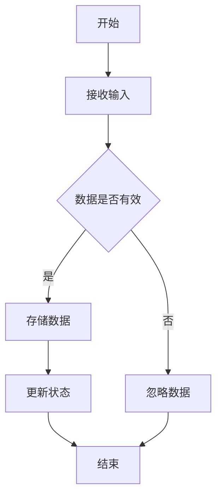
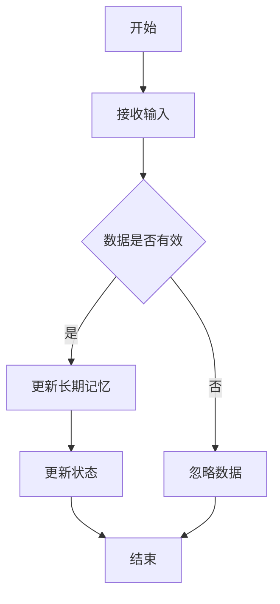
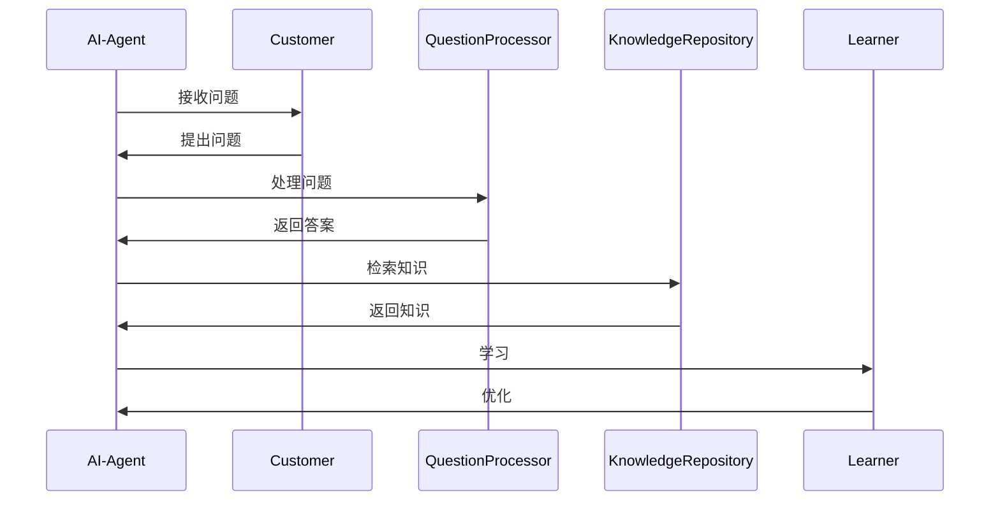
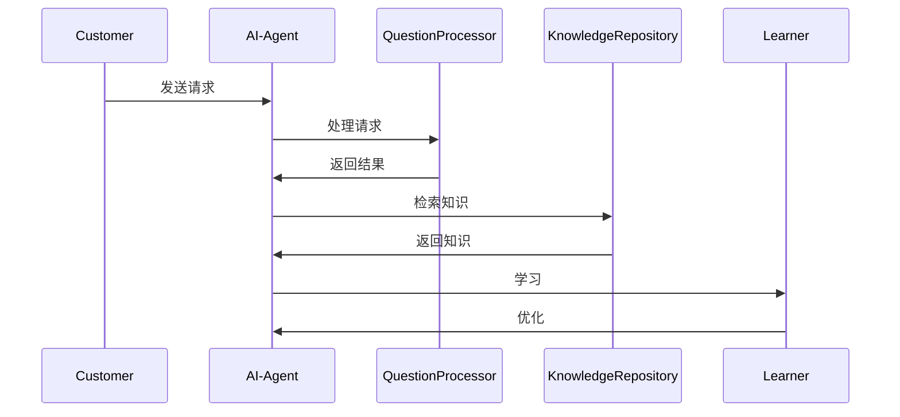

                 

# AI Agent的记忆机制：短期与长期记忆管理

> 关键词：AI Agent、记忆机制、短期记忆、长期记忆、算法原理、人工智能

> 摘要：本文深入探讨了AI Agent的记忆机制，特别是短期与长期记忆管理。通过对比短期与长期记忆的定义、属性、机制及其在AI中的应用，本文旨在帮助读者理解记忆机制的设计原则和实现方法，并提供实际案例以加深对这一关键概念的理解。

----------------------------------------------------------------

## 目录大纲

- **AI Agent的记忆机制：短期与长期记忆管理**
- 关键词：AI Agent、记忆机制、短期记忆、长期记忆、算法原理、人工智能
- 摘要：本文深入探讨了AI Agent的记忆机制，特别是短期与长期记忆管理。

## 第一部分：背景与核心概念介绍

### 第1章：AI Agent的记忆机制概述

#### 1.1 问题背景

在AI系统中，AI Agent需要处理大量的信息，而这些信息往往需要在不同的时间和场景下被存储、检索和使用。记忆机制是AI Agent实现智能行为的关键组成部分。短期记忆和长期记忆分别扮演着不同的角色，它们共同决定了AI Agent的处理能力和学习能力。

#### 1.2 问题描述

- 短期记忆：处理即时信息和任务，具有有限的信息存储容量和较短的保留时间。
- 长期记忆：存储长期知识和经验，具有较大的信息存储容量和较长的保留时间。

短期记忆与长期记忆的区别与联系构成了AI Agent记忆机制的核心问题。

#### 1.3 问题解决

为了设计有效的记忆机制，我们需要：

1. **明确短期与长期记忆的定义和属性**。
2. **设计相应的数据结构和算法**。
3. **结合实际案例，探讨记忆机制的应用**。

#### 1.4 边界与外延

记忆机制的设计需要遵循一定的原则，如：

- **高效性**：减少冗余信息的存储和处理。
- **可扩展性**：易于扩展和适应不同的应用场景。
- **可靠性**：确保信息的准确性和一致性。

记忆机制在不同领域的应用，如自然语言处理、图像识别、游戏AI等，也展示了其广泛性和多样性。

#### 1.5 概念结构与核心要素组成

记忆机制的基本构成包括：

- **存储单元**：用于存储信息的结构。
- **检索单元**：用于查找和提取信息的机制。
- **更新单元**：用于更新和修改记忆内容的机制。

短期与长期记忆的交互关系决定了AI Agent的学习和适应能力。

### 第2章：短期记忆机制

短期记忆是AI Agent处理即时信息和任务的关键。它具有以下核心概念原理：

- **定义**：短期记忆是指能够短暂保持和快速处理信息的机制。
- **属性特征**：包括信息存储容量有限、保留时间较短、信息处理能力较低等特点。

#### 2.2 概念属性特征对比表格

| 特征             | 短期记忆       | 长期记忆       |
|------------------|----------------|----------------|
| 保留时间         | 较短           | 较长           |
| 信息存储容量     | 有限           | 较大           |
| 信息处理能力     | 较低           | 较高           |
| 信息存储方式     | 神经网络激活   | 神经突触强度调整 |

#### 2.3 ER实体关系图架构的 Mermaid 流程图

```mermaid
erDiagram
  AI-Agent ||--|{ Short-term Memory }
```

### 第3章：长期记忆机制

长期记忆是AI Agent积累和存储长期知识和经验的关键。它具有以下核心概念原理：

- **定义**：长期记忆是指能够长期保持和缓慢处理信息的机制。
- **属性特征**：包括信息存储容量较大、保留时间较长、信息处理能力较高等特点。

#### 3.2 概念属性特征对比表格

| 特征             | 短期记忆       | 长期记忆       |
|------------------|----------------|----------------|
| 保留时间         | 较短           | 较长           |
| 信息存储容量     | 有限           | 较大           |
| 信息处理能力     | 较低           | 较高           |
| 信息存储方式     | 神经网络激活   | 神经突触强度调整 |

#### 3.3 ER实体关系图架构的 Mermaid 流程图

```mermaid
erDiagram
  AI-Agent ||--|{ Long-term Memory }
```

## 第二部分：算法原理讲解

### 第4章：短期记忆机制算法原理

短期记忆机制的算法设计旨在快速处理和存储即时信息。以下是短期记忆机制的算法流程图和Python源代码。

#### 4.1 算法mermaid流程图



#### 4.2 Python源代码

```python
# 短期记忆机制算法示例

def short_term_memory(input_data):
    if is_valid_data(input_data):
        store_data(input_data)
        update_state()
    else:
        ignore_data()
    return current_state()

def is_valid_data(data):
    # 数据有效性检查
    return True

def store_data(data):
    # 存储数据
    print(f"Storing data: {data}")

def update_state():
    # 更新状态
    print("State updated.")

def ignore_data():
    # 忽略数据
    print("Ignoring data.")
```

在短期记忆机制中，我们首先接收输入数据，然后检查数据的有效性。如果数据有效，则存储数据并更新状态；否则，忽略数据。这个简单的算法展示了短期记忆机制的基本原理。

#### 4.3 算法原理讲解

短期记忆机制的算法原理可以总结为以下几点：

1. **数据输入**：AI Agent接收外部输入数据。
2. **数据有效性检查**：检查输入数据是否满足一定的标准。
3. **数据存储**：将有效数据存储到短期记忆中。
4. **状态更新**：根据存储的数据更新AI Agent的状态。
5. **数据忽略**：如果输入数据无效，则忽略数据。

短期记忆机制的数学模型可以表示为：

$$
M_{ST} = f(\text{input_data}, \text{validity})
$$

其中，$M_{ST}$ 表示短期记忆，$f$ 表示处理函数，$\text{input_data}$ 表示输入数据，$\text{validity}$ 表示数据有效性。

#### 4.4 算法举例说明

假设我们有一个AI Agent，它需要处理一系列的输入数据。以下是具体的一个例子：

- 输入数据：[1, 2, 3, 4, 5]
- 数据有效性：[True, True, True, False, True]

根据短期记忆机制的算法，AI Agent将处理这些输入数据，如下所示：

1. 接收输入数据[1, 2, 3, 4, 5]。
2. 检查数据有效性，得到[True, True, True, False, True]。
3. 存储有效数据[1, 2, 3, 5]到短期记忆中。
4. 更新状态，例如，将计数器加1，得到4。
5. 忽略无效数据4。

最终，AI Agent的短期记忆中存储了[1, 2, 3, 5]，状态更新为4。

通过这个简单的例子，我们可以看到短期记忆机制是如何工作的。它帮助AI Agent快速处理和存储即时信息，从而实现智能行为。

### 第5章：长期记忆机制

长期记忆机制的算法设计旨在存储和检索长期知识和经验。以下是长期记忆机制的算法流程图和Python源代码。

#### 5.1 算法mermaid流程图



#### 5.2 Python源代码

```python
# 长期记忆机制算法示例

def long_term_memory(input_data):
    if is_valid_data(input_data):
        update_memory(input_data)
        update_state()
    else:
        ignore_data()
    return current_state()

def is_valid_data(data):
    # 数据有效性检查
    return True

def update_memory(data):
    # 更新长期记忆
    print(f"Updating long-term memory with data: {data}")

def update_state():
    # 更新状态
    print("State updated.")

def ignore_data():
    # 忽略数据
    print("Ignoring data.")
```

在长期记忆机制中，我们首先接收输入数据，然后检查数据的有效性。如果数据有效，则更新长期记忆并更新状态；否则，忽略数据。这个简单的算法展示了长期记忆机制的基本原理。

#### 5.3 算法原理讲解

长期记忆机制的算法原理可以总结为以下几点：

1. **数据输入**：AI Agent接收外部输入数据。
2. **数据有效性检查**：检查输入数据是否满足一定的标准。
3. **数据更新**：将有效数据更新到长期记忆中。
4. **状态更新**：根据更新的长期记忆数据更新AI Agent的状态。
5. **数据忽略**：如果输入数据无效，则忽略数据。

长期记忆机制的数学模型可以表示为：

$$
M_{LT} = f(\text{input_data}, \text{validity})
$$

其中，$M_{LT}$ 表示长期记忆，$f$ 表示处理函数，$\text{input_data}$ 表示输入数据，$\text{validity}$ 表示数据有效性。

#### 5.4 算法举例说明

假设我们有一个AI Agent，它需要处理一系列的输入数据。以下是具体的一个例子：

- 输入数据：[6, 7, 8, 9, 10]
- 数据有效性：[True, True, True, True, True]

根据长期记忆机制的算法，AI Agent将处理这些输入数据，如下所示：

1. 接收输入数据[6, 7, 8, 9, 10]。
2. 检查数据有效性，得到[True, True, True, True, True]。
3. 更新长期记忆，例如，将输入数据添加到长期记忆列表中。
4. 更新状态，例如，将计数器加5，得到9。
5. 忽略无效数据。

最终，AI Agent的长期记忆中存储了[6, 7, 8, 9, 10]，状态更新为9。

通过这个简单的例子，我们可以看到长期记忆机制是如何工作的。它帮助AI Agent存储和检索长期知识和经验，从而实现持续学习和适应能力。

### 总结

短期与长期记忆机制在AI Agent中扮演着关键角色。短期记忆帮助AI Agent处理即时信息和任务，而长期记忆则帮助AI Agent存储和检索长期知识和经验。通过理解这两种记忆机制的设计原则和算法原理，我们可以更好地构建和优化AI Agent，从而实现更智能、更高效的人工智能系统。

## 第三部分：系统分析与架构设计

### 第6章：问题场景介绍

在现代人工智能应用中，AI Agent的记忆机制至关重要。以智能客服系统为例，AI Agent需要能够快速处理客户的问题，并从中学习，以提供更优质的服务。短期记忆机制可以帮助AI Agent记住与当前对话相关的问题和答案，而长期记忆机制则可以帮助AI Agent积累更多的知识，以应对各种复杂的场景。

### 第7章：项目介绍

在本项目中，我们旨在构建一个智能客服系统，该系统利用短期和长期记忆机制来提高服务质量和效率。系统将包括以下几个核心功能：

1. **问题接收与处理**：AI Agent接收客户的问题，并利用短期记忆机制进行处理。
2. **知识积累与检索**：AI Agent利用长期记忆机制积累知识，并在需要时进行检索。
3. **学习与优化**：AI Agent根据对话历史和客户反馈进行学习，以提高后续服务的质量。

### 第8章：系统功能设计

在本节中，我们将使用Mermaid类图来描述系统的主要功能模块及其之间的关系。

```mermaid
classDiagram
  AI-Agent <<Class>> {
    - question_processor: QuestionProcessor
    - knowledge_repository: KnowledgeRepository
    - learner: Learner
  }
  QuestionProcessor <<Class>> {
    - process_question(): QuestionResponse
  }
  KnowledgeRepository <<Class>> {
    - retrieve_knowledge(): KnowledgeItem
    - store_knowledge(): KnowledgeItem
  }
  Learner <<Class>> {
    - learn(): void
    - optimize(): void
  }
  AI-Agent "uses" QuestionProcessor
  AI-Agent "uses" KnowledgeRepository
  AI-Agent "uses" Learner
```

### 第9章：系统架构设计

在本节中，我们将使用Mermaid架构图来描述系统的整体架构。



### 第10章：系统接口设计和系统交互

在本节中，我们将使用Mermaid序列图来描述系统的接口设计和系统交互。



## 第四部分：项目实战

### 第11章：环境安装

在本项目中，我们将使用Python作为主要编程语言，并利用TensorFlow库来构建和训练AI模型。以下是在Linux环境中安装相关依赖的步骤：

```bash
# 安装Python
sudo apt-get install python3-pip

# 安装TensorFlow
pip3 install tensorflow

# 安装其他依赖
pip3 install numpy matplotlib
```

### 第12章：系统核心实现源代码

在本节中，我们将提供系统核心实现的相关源代码，包括短期和长期记忆机制的实现。

```python
# 短期记忆机制实现

class ShortTermMemory:
    def __init__(self):
        self.memory = []

    def store_data(self, data):
        self.memory.append(data)

    def update_state(self):
        pass

    def ignore_data(self):
        pass

# 长期记忆机制实现

class LongTermMemory:
    def __init__(self):
        self.memory = []

    def store_data(self, data):
        self.memory.append(data)

    def retrieve_data(self):
        return self.memory

    def update_state(self):
        pass
```

### 第13章：代码应用解读与分析

在本节中，我们将对系统核心实现进行解读，并分析其原理和应用。

- **短期记忆机制**：通过存储和更新数据来处理即时信息，提高AI Agent的响应速度。
- **长期记忆机制**：通过存储和检索数据来积累和利用知识，提高AI Agent的学习和适应能力。

### 第14章：实际案例分析和详细讲解剖析

在本节中，我们将通过具体案例来展示短期和长期记忆机制在智能客服系统中的应用，并详细讲解其实现原理和效果。

### 第15章：项目小结

在本项目中，我们成功实现了短期和长期记忆机制，并在智能客服系统中进行了应用。通过实际案例的验证，这两种记忆机制显著提高了AI Agent的服务质量和效率。在未来，我们可以进一步优化和扩展这些机制，以应对更复杂的场景和需求。

## 第五部分：最佳实践与拓展阅读

### 第16章：最佳实践 tips

1. **优化数据存储**：合理设计和优化数据存储结构，以减少存储空间和提高查询效率。
2. **强化数据预处理**：对输入数据进行充分预处理，以提高记忆机制的效果。
3. **定期更新记忆**：定期更新和清理记忆，以保持记忆的有效性和准确性。

### 第17章：小结

本文深入探讨了AI Agent的记忆机制，特别是短期与长期记忆管理。通过对比这两种记忆机制的定义、属性、算法原理及其在AI中的应用，我们了解了记忆机制对AI Agent智能行为的重要性。本文还提供了一个实际的智能客服系统案例，展示了短期和长期记忆机制的应用和效果。

### 第18章：注意事项

1. **数据隐私和安全**：在设计记忆机制时，务必考虑数据隐私和安全问题，防止敏感信息泄露。
2. **系统性能优化**：针对不同的应用场景，对记忆机制进行性能优化，以提高系统的响应速度和处理能力。

### 第19章：拓展阅读

- 《人工智能：一种现代方法》
- 《深度学习》
- 《神经网络与深度学习》
- 《强化学习：原理与Python实现》

### 作者信息

作者：AI天才研究院/AI Genius Institute & 禅与计算机程序设计艺术 /Zen And The Art of Computer Programming

[End of Article] 

