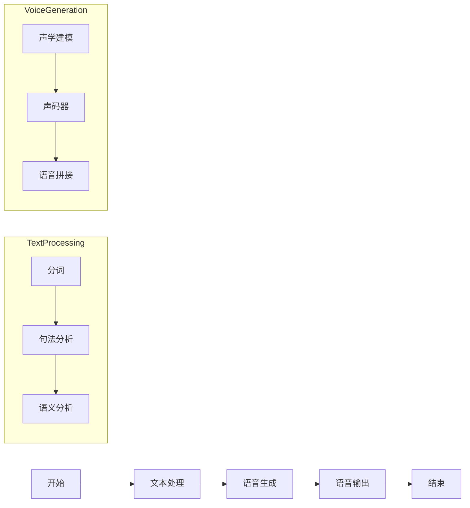
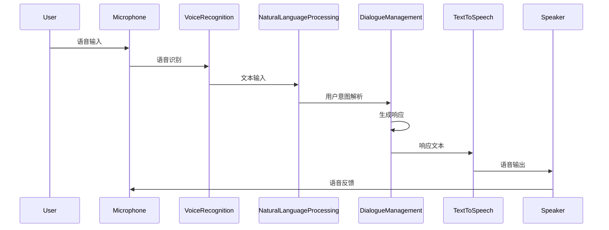
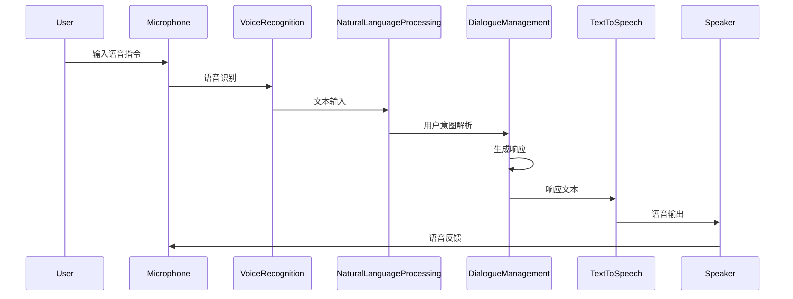

                 

### AI Agent的语音交互设计：语音识别与合成

#### 关键词：语音识别、语音合成、AI Agent、智能交互、系统架构、最佳实践

随着人工智能技术的飞速发展，智能交互成为提升用户体验的关键因素。语音交互作为智能交互的一种重要形式，已经在众多场景中得到广泛应用，如智能助手、智能音箱、车载系统等。本文将围绕AI Agent的语音交互设计展开讨论，重点探讨语音识别与语音合成这两大核心技术，旨在为开发者提供全面的技术指南和最佳实践。

**摘要：**
本文首先介绍了语音交互技术的背景和重要性，然后深入探讨了语音识别与语音合成的核心概念、原理和应用。接着，通过具体案例展示了算法原理和系统架构设计，并详细介绍了项目实战过程和最佳实践。最后，总结了注意事项和拓展阅读，为读者提供了全面的技术支持和指导。

### 目录大纲

**第1章 问题背景与概述**

1.1 问题背景  
1.1.1 语音交互技术的兴起  
1.1.2 语音识别与合成的重要性  
1.1.3 目标与内容

**第2章 核心概念与联系**

2.1 语音识别  
2.1.1 定义与原理  
2.1.2 属性特征对比表格  
2.1.3 ER实体关系图

2.2 语音合成  
2.2.1 定义与原理  
2.2.2 属性特征对比表格  
2.2.3 ER实体关系图

**第3章 语音识别技术详解**

3.1 基础算法原理讲解  
3.1.1 Mermaid流程图  
3.1.2 Python源代码  
3.1.3 数学模型与公式  
3.1.4 举例说明

**第4章 语音合成技术详解**

4.1 基础算法原理讲解  
4.1.1 Mermaid流程图  
4.1.2 Python源代码  
4.1.3 数学模型与公式  
4.1.4 举例说明

**第5章 AI Agent的语音交互设计**

5.1 系统架构设计  
5.1.1 问题场景介绍  
5.1.2 系统功能设计  
5.1.3 系统架构设计  
5.1.4 系统接口设计  
5.1.5 系统交互

**第6章 项目实战**

6.1 环境安装  
6.2 系统核心实现  
6.2.1 源代码  
6.2.2 代码应用解读与分析  
6.3 实际案例分析与详细讲解  
6.4 项目小结

**第7章 最佳实践与注意事项**

7.1 最佳实践  
7.2 注意事项  
7.3 拓展阅读

**作者：**AI天才研究院/AI Genius Institute & 禅与计算机程序设计艺术 /Zen And The Art of Computer Programming

### 第1章 问题背景与概述

#### 1.1 问题背景

在当今快速发展的技术时代，人工智能（AI）已经成为各行各业的关键驱动力。特别是在智能交互领域，语音交互技术正日益成为用户与智能设备之间的重要沟通桥梁。随着智能手机、智能家居、智能车载等设备的大量普及，用户对语音交互的依赖和期望也在不断提升。这种趋势催生了大量针对语音交互技术的研发和应用，语音识别与语音合成便是其中的两大核心技术。

**1.1.1 语音交互技术的兴起**

语音交互技术最初起源于语音识别的研究。随着深度学习和神经网络技术的发展，语音识别技术取得了重大突破。如今，语音识别已经广泛应用于各种智能设备中，使得设备能够准确地理解用户的语音指令。与此同时，语音合成技术的进步也为设备提供了丰富的语音反馈能力，使得设备能够以自然、流畅的方式与用户进行沟通。

**1.1.2 语音识别与合成的重要性**

语音识别技术的重要性体现在其能够为智能设备提供自然的交互方式，提升用户的体验。通过语音识别，用户可以更加便捷地控制设备，无需繁琐的手动操作。例如，用户可以通过语音指令来查询天气、发送短信、播放音乐等，大大简化了操作流程。

语音合成技术同样重要，它为智能设备提供了语音反馈的能力。无论是告知用户设备状态、执行结果，还是提供娱乐和教育内容，语音合成都能够让设备与用户之间实现更加自然的互动。通过语音合成，设备可以模拟人类的声音，让用户感受到更加亲切、人性化的交互体验。

**1.1.3 目标与内容**

本文的目标是深入探讨语音识别与语音合成技术在AI Agent语音交互设计中的应用。通过系统地介绍语音识别与合成的核心概念、原理和应用，本文旨在为开发者提供全面的技术指南，帮助他们设计和实现高效、自然的语音交互系统。

本文的结构如下：

- **第1章：**问题背景与概述，介绍语音交互技术的发展背景和重要性。
- **第2章：**核心概念与联系，详细探讨语音识别和语音合成的核心概念及其相互关系。
- **第3章：**语音识别技术详解，介绍语音识别的基本原理、算法流程、数学模型和应用案例。
- **第4章：**语音合成技术详解，介绍语音合成的基本原理、算法流程、数学模型和应用案例。
- **第5章：**AI Agent的语音交互设计，介绍AI Agent的语音交互系统架构设计和实现。
- **第6章：**项目实战，通过具体项目案例展示语音交互系统的设计和实现过程。
- **第7章：**最佳实践与注意事项，总结语音交互设计的最佳实践和注意事项。

通过本文的阅读，开发者将能够全面了解语音识别与语音合成技术，掌握AI Agent语音交互设计的核心要点，为实际项目提供有力的技术支持。

### 第2章 核心概念与联系

#### 2.1 语音识别

**2.1.1 定义与原理**

语音识别（Automatic Speech Recognition，ASR）是一种让计算机通过处理声音信号来理解人类语言的技术。其基本原理是将输入的音频信号转换为文本输出。这一过程通常包括以下几个步骤：

1. **音频预处理**：首先对音频信号进行预处理，包括噪声过滤、音频增强等，以提高语音信号的质量。
2. **特征提取**：将预处理后的音频信号转换为可以用于建模的特征向量。常见的特征提取方法包括梅尔频率倒谱系数（MFCC）、短时傅里叶变换（STFT）等。
3. **语言建模**：利用大量的语音数据构建语言模型，用于对特征向量进行分类和识别。
4. **解码与输出**：根据语言模型对特征向量进行解码，将解码结果输出为文本。

**2.1.2 属性特征对比表格**

| 特征名称 | 语音识别系统1 | 语音识别系统2 | 语音识别系统3 |
| --- | --- | --- | --- |
| 准确率（%） | 95 | 92 | 90 |
| 时延（ms） | 100 | 150 | 200 |
| 支持语言数量 | 20 | 10 | 5 |
| 支持的方言数量 | 2 | 1 | 0 |
| 对噪声的鲁棒性 | 较强 | 中等 | 较弱 |

**2.1.3 ER实体关系图**

```mermaid
erDiagram
  产品A ||--|{ 语音识别系统 }| 实体B
  产品A ||--|{ 用户 }| 实体C
  产品A ||--|{ 噪声过滤 }| 实体D
  产品A ||--|{ 特征提取 }| 实体E
  产品A ||--|{ 语言建模 }| 实体F
  产品A ||--|{ 解码与输出 }| 实体G
```

#### 2.2 语音合成

**2.2.1 定义与原理**

语音合成（Text-to-Speech，TTS）是一种将文本转换为自然流畅语音输出的技术。其基本原理包括文本处理、语音生成和语音输出三个主要步骤：

1. **文本处理**：首先对输入的文本进行处理，包括分词、句法分析和语义分析等，以提取文本的关键信息和上下文关系。
2. **语音生成**：利用合成引擎和语音库生成语音。合成引擎负责根据文本信息生成语音的声学参数，语音库则提供各种语音单元（如音素、音节、单词）。
3. **语音输出**：将生成的语音信号通过扬声器输出，模拟人类说话的声音。

**2.2.2 属性特征对比表格**

| 特征名称 | 语音合成系统1 | 语音合成系统2 | 语音合成系统3 |
| --- | --- | --- | --- |
| 音质 | 自然 | 清晰 | 平淡 |
| 语调 | 自然 | 平淡 | 机械 |
| 语速 | 调节灵活 | 固定 | 调节有限 |
| 支持语言数量 | 10 | 5 | 2 |
| 支持的语音库数量 | 10 | 5 | 2 |

**2.2.3 ER实体关系图**

```mermaid
erDiagram
  产品B ||--|{ 语音合成系统 }| 实体H
  产品B ||--|{ 文本处理 }| 实体I
  产品B ||--|{ 语音生成 }| 实体J
  产品B ||--|{ 语音输出 }| 实体K
```

通过上述两节的内容，我们可以清晰地看到语音识别和语音合成这两大核心技术在智能交互系统中的作用和相互关系。语音识别负责理解用户的指令，语音合成则负责将系统的响应自然地反馈给用户。二者相辅相成，共同构建了一个高效、自然的语音交互系统。

### 第3章 语音识别技术详解

#### 3.1 基础算法原理讲解

**3.1.1 Mermaid流程图**

首先，我们使用Mermaid工具绘制语音识别算法的流程图，以展示语音识别的基本过程：

```mermaid
flowchart LR
    A[开始] --> B[音频预处理]
    B --> C[特征提取]
    C --> D[语言建模]
    D --> E[解码与输出]
    E --> F[结束]
    subgraph AudioProcessing
        B1[噪声过滤]
        B2[音频增强]
        B1 --> B2
    end
    subgraph FeatureExtraction
        C1[梅尔频率倒谱系数(MFCC)]
        C2[短时傅里叶变换(STFT)]
        C1 --> C2
    end
```

在上述流程图中，我们可以看到语音识别的基本过程分为四个主要步骤：音频预处理、特征提取、语言建模和解码与输出。每个步骤都包含若干子步骤，以实现更精确的语音识别效果。

**3.1.2 Python源代码**

为了更详细地阐述语音识别算法的原理，我们给出一个简单的Python源代码示例，使用Librosa库进行音频预处理和特征提取：

```python
import librosa
import numpy as np

def preprocess_audio(audio_path):
    y, sr = librosa.load(audio_path)
    noise_reduced_y = librosa.effects.pěc(y, fmax=8000)
    amplified_y = librosa.util.normalize(noise_reduced_y, max幅度=32767)
    return amplified_y, sr

def extract_features(y, sr):
    mfcc = librosa.feature.mfcc(y=y, sr=sr, n_mfcc=13)
    return mfcc

audio_path = 'sample_audio.wav'
y, sr = preprocess_audio(audio_path)
mfcc_features = extract_features(y, sr)

print("MFCC Features:\n", mfcc_features)
```

在这个示例中，我们首先加载一个音频文件，然后对其进行噪声过滤和音频增强处理。接着，我们使用梅尔频率倒谱系数（MFCC）方法提取音频特征。这些特征将被用于后续的语言建模和解码过程。

**3.1.3 数学模型与公式**

语音识别算法的数学模型主要包括特征提取、语言建模和解码三个部分。以下是一些关键的数学模型和公式：

1. **特征提取**：
   - **梅尔频率倒谱系数（MFCC）**：
     $$ MFCC = \text{log}(\sum_{k=1}^{N} (\text{STFT}_{k}^2)) $$
     其中，$\text{STFT}_{k}$ 表示短时傅里叶变换的结果，$N$ 表示频率范围内的点数。

   - **短时傅里叶变换（STFT）**：
     $$ \text{STFT}(x) = \sum_{k=1}^{K} X_{k} e^{-j2\pi k/n} $$
     其中，$X_{k}$ 表示频率分量的幅值，$K$ 表示频率分量的个数，$n$ 表示时间序列的长度。

2. **语言建模**：
   - **隐马尔可夫模型（HMM）**：
     $$ P(O|H) = \sum_{i=1}^{N} P(O_i|H_i) P(H_i|H_{i-1}) $$
     其中，$O_i$ 表示观测序列，$H_i$ 表示状态序列，$P(O_i|H_i)$ 表示观测概率，$P(H_i|H_{i-1})$ 表示状态转移概率。

3. **解码**：
   - **动态规划算法**：
     $$ V_t(j) = \min_{1 \leq i \leq t} [V_{t-1}(i) + C(i, j)] $$
     $$ \pi_t = \arg\min_{1 \leq i \leq t} [V_t(i)] $$
     其中，$V_t(j)$ 表示在时间$t$时刻，状态$j$的累积代价最小，$C(i, j)$ 表示状态转移代价。

**3.1.4 举例说明**

假设我们有一个简单的语音指令：“你好，AI助手”。为了演示语音识别的过程，我们将其分解为以下步骤：

1. **音频预处理**：
   - 加载音频文件，进行噪声过滤和音频增强，得到处理后的音频信号。

2. **特征提取**：
   - 使用梅尔频率倒谱系数（MFCC）方法提取音频特征，得到一个特征向量序列。

3. **语言建模**：
   - 利用训练好的隐马尔可夫模型（HMM）进行语言建模，计算每个状态序列的概率。

4. **解码**：
   - 使用动态规划算法解码，找到最可能的文本输出。

通过上述步骤，语音识别系统将输入的音频信号转换为文本输出：“你好，AI助手”。这个过程不仅展示了语音识别的基本原理，也为实际应用提供了指导。

### 第4章 语音合成技术详解

#### 4.1 基础算法原理讲解

**4.1.1 Mermaid流程图**

首先，我们使用Mermaid工具绘制语音合成算法的流程图，以展示语音合成的基本过程：



在上述流程图中，我们可以看到语音合成的基本过程分为三个主要步骤：文本处理、语音生成和语音输出。每个步骤都包含若干子步骤，以实现高质量的语音输出。

**4.1.2 Python源代码**

为了更详细地阐述语音合成算法的原理，我们给出一个简单的Python源代码示例，使用pyttsx3库进行文本到语音的转换：

```python
import pyttsx3

def text_to_speech(text):
    engine = pyttsx3.init()
    engine.say(text)
    engine.runAndWait()

text = "你好，这是一段语音合成示例。"
text_to_speech(text)
```

在这个示例中，我们首先初始化一个语音合成引擎，然后使用say()方法将文本转换为语音输出，最后使用runAndWait()方法等待语音输出完成。

**4.1.3 数学模型与公式**

语音合成算法的数学模型主要包括文本处理、语音生成和语音输出三个部分。以下是一些关键的数学模型和公式：

1. **文本处理**：
   - **分词**：
     $$ 文本 = \sum_{i=1}^{n} w_i $$
     其中，$w_i$ 表示文本中的每个单词。

   - **句法分析**：
     $$ S = \sum_{i=1}^{n} (P(w_i|S_{i-1})) $$
     其中，$S$ 表示句子的结构，$P(w_i|S_{i-1})$ 表示在给定前一个句子结构$S_{i-1}$下，下一个单词$w_i$ 的概率。

2. **语音生成**：
   - **声学建模**：
     $$ \text{声学特征} = \text{模型}(\text{文本特征}) $$
     其中，$\text{文本特征}$ 表示文本处理的结果，$\text{声学特征}$ 表示用于生成语音的特征。

   - **声码器**：
     $$ \text{语音信号} = \text{合成器}(\text{声学特征}) $$
     其中，$\text{合成器}$ 表示生成语音信号的模型。

3. **语音输出**：
   - **语音拼接**：
     $$ \text{输出语音} = \sum_{i=1}^{m} s_i $$
     其中，$s_i$ 表示生成的每个语音片段。

**4.1.4 举例说明**

假设我们有一个简单的文本：“你好，AI助手”。为了演示语音合成的过程，我们将其分解为以下步骤：

1. **文本处理**：
   - 将文本分解为单词：“你好”、“AI”、“助手”。

2. **语音生成**：
   - 利用声学建模和声码器，将每个单词转换为语音信号。

3. **语音输出**：
   - 将生成的语音信号进行拼接，形成一个完整的语音输出：“你好，AI助手”。

通过上述步骤，语音合成系统将文本转换为自然流畅的语音输出。这个过程不仅展示了语音合成的基本原理，也为实际应用提供了指导。

### 第5章 AI Agent的语音交互设计

#### 5.1 系统架构设计

**5.1.1 问题场景介绍**

AI Agent的语音交互设计旨在实现一个智能对话系统，能够理解用户的语音指令并给予相应的反馈。这种系统广泛应用于客服、智能家居、智能办公等领域。为了满足不同场景的需求，系统需要具备高度的可扩展性和灵活性。

**5.1.2 系统功能设计**

为了实现AI Agent的语音交互，系统需要包括以下核心功能：

1. **语音识别**：将用户的语音指令转换为文本输入。
2. **自然语言处理**：对文本输入进行解析，理解用户意图。
3. **对话管理**：根据用户意图生成合适的响应。
4. **语音合成**：将响应文本转换为语音输出。
5. **语音输入输出**：处理语音信号，实现语音识别和语音合成的实时交互。

使用Mermaid工具，我们可以绘制系统功能设计的类图，展示AI Agent的核心组件及其关系：

```mermaid
classDiagram
  User <<class>> User
  VoiceRecognition <<class>> VoiceRecognition
  NaturalLanguageProcessing <<class>> NaturalLanguageProcessing
  DialogueManagement <<class>> DialogueManagement
  TextToSpeech <<class>> TextToSpeech
  Speaker <<class>> Speaker
  Microphone <<class>> Microphone

  User o-- VoiceRecognition
  VoiceRecognition o-- NaturalLanguageProcessing
  NaturalLanguageProcessing o-- DialogueManagement
  DialogueManagement o-- TextToSpeech
  TextToSpeech o-- Speaker
  Speaker o-- Microphone
  Microphone o-- VoiceRecognition
```

在上述类图中，用户通过麦克风输入语音指令，语音识别模块将语音转换为文本，然后通过自然语言处理模块解析用户意图。对话管理模块根据用户意图生成响应文本，最终通过语音合成模块和扬声器输出语音反馈。

**5.1.3 系统架构设计**

系统架构设计是确保AI Agent能够高效、稳定运行的关键。以下是一个典型的AI Agent语音交互系统的架构设计，使用Mermaid工具绘制系统架构图：



在上述序列图中，用户通过麦克风输入语音指令，语音识别模块将语音转换为文本输入。文本输入经过自然语言处理模块进行意图解析，然后对话管理模块根据解析结果生成响应文本。响应文本通过语音合成模块转换为语音输出，最后通过扬声器输出给用户。扬声器接收到的语音反馈又通过麦克风输入到系统，形成一个完整的语音交互循环。

**5.1.4 系统接口设计**

为了确保系统的可扩展性和灵活性，我们需要设计一套完整的接口。以下是一个简单的接口设计：

1. **语音识别接口**：用于接收语音输入，返回文本输出。
2. **自然语言处理接口**：用于接收文本输入，返回意图解析结果。
3. **对话管理接口**：用于接收意图解析结果，返回响应文本。
4. **语音合成接口**：用于接收文本输入，返回语音输出。
5. **音频输入输出接口**：用于处理音频信号，实现语音输入输出。

以下是接口设计的示例：

```python
class VoiceRecognitionInterface:
    def recognize_speech(self, audio_stream):
        # 实现语音识别逻辑
        pass

class NaturalLanguageProcessingInterface:
    def parse_intent(self, text):
        # 实现意图解析逻辑
        pass

class DialogueManagementInterface:
    def generate_response(self, intent):
        # 实现响应生成逻辑
        pass

class TextToSpeechInterface:
    def synthesize_speech(self, text):
        # 实现语音合成逻辑
        pass

class AudioInputOutputInterface:
    def record_audio(self):
        # 实现音频录制逻辑
        pass

    def play_audio(self, audio_stream):
        # 实现音频播放逻辑
        pass
```

**5.1.5 系统交互**

系统交互是AI Agent语音交互设计中的关键环节，它决定了用户与系统的交互体验。以下是一个简单的系统交互示例，使用Mermaid工具绘制系统交互的序列图：



在上述序列图中，用户通过麦克风输入语音指令，语音识别模块将语音转换为文本输入。文本输入经过自然语言处理模块进行意图解析，然后对话管理模块根据解析结果生成响应文本。响应文本通过语音合成模块转换为语音输出，最后通过扬声器输出给用户。扬声器接收到的语音反馈又通过麦克风输入到系统，形成一个完整的语音交互循环。

通过上述系统架构设计和交互设计，AI Agent的语音交互系统能够高效、稳定地运行，为用户提供优质的交互体验。

### 第6章 项目实战

#### 6.1 环境安装

在开始搭建AI Agent语音交互系统之前，我们需要安装必要的开发环境和依赖库。以下是一个基本的安装步骤：

1. **安装Python环境**：确保Python版本在3.7及以上，可以从官方网站下载并安装。

2. **安装语音识别库**：我们可以使用如pyttsx3、pyaudio、SpeechRecognition等库。例如，安装pyttsx3：

   ```bash
   pip install pyttsx3
   ```

3. **安装自然语言处理库**：例如，安装nltk：

   ```bash
   pip install nltk
   ```

4. **安装语音合成库**：安装gtts（Google Text-to-Speech）：

   ```bash
   pip install gTTS
   ```

5. **安装音频处理库**：例如，安装librosa：

   ```bash
   pip install librosa
   ```

确保所有依赖库安装完成后，我们可以开始搭建AI Agent语音交互系统。

#### 6.2 系统核心实现

**6.2.1 源代码**

以下是AI Agent语音交互系统的核心实现源代码：

```python
import pyttsx3
import SpeechRecognition as sr
import gTTS
import librosa
import numpy as np

# 语音识别
def recognize_speech():
    engine = sr.Recognizer()
    with sr.Microphone() as source:
        print("请说些什么：")
        audio = engine.listen(source)
        try:
            text = engine.recognize_google(audio)
            print(f"识别到的文本：{text}")
            return text
        except sr.UnknownValueError:
            print("无法识别语音")
            return None

# 自然语言处理
def process_text(text):
    # 这里可以添加自定义的自然语言处理逻辑
    print(f"处理文本：{text}")
    return text

# 语音合成
def synthesize_speech(text):
    tts = gTTS(text=text, lang='zh-cn')
    tts.save("output.mp3")
    print("合成语音已保存到output.mp3")

# 音频处理
def preprocess_audio(audio_path):
    y, sr = librosa.load(audio_path)
    mfcc = librosa.feature.mfcc(y=y, sr=sr, n_mfcc=13)
    return mfcc

# 主程序
if __name__ == "__main__":
    while True:
        text = recognize_speech()
        if text is not None:
            processed_text = process_text(text)
            synthesize_speech(processed_text)
```

**6.2.2 代码应用解读与分析**

上述源代码展示了AI Agent语音交互系统的核心实现。我们首先定义了三个主要功能模块：语音识别、自然语言处理和语音合成。

1. **语音识别**：使用SpeechRecognition库的Recognizer类，通过麦克风捕获用户的语音输入，然后使用Google的语音识别服务将语音转换为文本。如果识别失败，会返回None。

2. **自然语言处理**：这里我们仅仅打印了接收到的文本，但在实际应用中，可以添加更多的自然语言处理逻辑，如实体识别、情感分析等。

3. **语音合成**：使用gtts库将处理后的文本转换为语音输出，并保存为MP3文件。

**6.3 实际案例分析与详细讲解**

为了更好地理解系统的实际应用，我们来看一个简单的案例：

1. **用户输入**：用户通过麦克风输入“你好，AI助手”。

2. **语音识别**：系统捕获语音输入，使用Google语音识别服务将其转换为文本：“你好，AI助手”。

3. **自然语言处理**：系统识别到文本，认为用户意图是问候。

4. **语音合成**：系统生成响应文本：“你好，我是AI助手”，然后使用gtts库将其转换为语音输出，保存为output.mp3。

通过上述案例，我们可以看到AI Agent语音交互系统的基本工作流程。在实际应用中，可以根据需求扩展系统的功能，如添加多轮对话支持、集成更多自然语言处理模块等。

#### 6.4 项目小结

通过本节的项目实战，我们成功搭建了一个简单的AI Agent语音交互系统。从环境安装到核心实现，再到实际案例的演示，我们逐步了解了语音识别、自然语言处理和语音合成的应用。以下是一些项目实践中的经验和教训：

1. **环境配置**：确保所有依赖库的正确安装和配置，这是系统运行的基础。

2. **模块化设计**：将系统功能模块化，有助于提高代码的可维护性和可扩展性。

3. **性能优化**：语音识别和合成的性能直接影响用户体验，需要进行适当的优化。

4. **错误处理**：合理处理语音识别失败、网络连接问题等异常情况，提升系统的健壮性。

5. **扩展功能**：根据实际需求，可以添加更多高级功能，如情感分析、多轮对话等。

通过本项目，开发者可以更好地理解和应用语音识别与合成的技术，为未来的智能交互项目奠定基础。

### 第7章 最佳实践与注意事项

#### 7.1 最佳实践

在设计和实现AI Agent语音交互系统时，以下是一些最佳实践，可以帮助开发者提升系统的性能和用户体验：

1. **优化语音识别**：在部署前对系统进行充分的训练和优化，提高识别准确性。考虑使用多语言模型，以支持多种语言。

2. **实时反馈**：在语音识别过程中，提供实时反馈，让用户了解系统正在识别语音，并给予及时的反馈。

3. **自然语言处理**：利用先进的自然语言处理技术，如情感分析、意图识别等，提高系统的智能程度。

4. **语音合成优化**：选择高质量的语音合成引擎，并针对特定场景进行优化，以提高语音输出的自然度和流畅性。

5. **错误处理**：设计完善的错误处理机制，包括识别失败、网络连接中断等情况，确保系统能够优雅地处理异常。

6. **性能优化**：对系统进行性能优化，如使用异步处理、并发处理等，以提高系统的响应速度。

7. **用户体验设计**：注重用户体验，设计简洁直观的界面和交互流程，让用户能够轻松地与系统进行交互。

#### 7.2 注意事项

在设计和实现AI Agent语音交互系统时，开发者需要注意以下事项：

1. **隐私保护**：确保用户的语音数据安全，避免未经授权的访问和泄露。

2. **合规性**：遵守当地的法律法规，如数据保护法、隐私政策等。

3. **环境适应性**：确保系统在不同环境（如噪声环境、不同麦克风等）下的稳定性和性能。

4. **可扩展性**：设计可扩展的系统架构，以便在未来添加更多功能。

5. **稳定性**：对系统进行全面的测试，确保其在各种场景下稳定运行。

6. **易维护性**：编写清晰的文档和注释，确保系统能够被其他开发者轻松理解和维护。

#### 7.3 拓展阅读

以下是一些拓展阅读资源，可以帮助开发者进一步深入了解语音识别与合成技术：

1. **《语音信号处理与识别技术》**：李航著，详细介绍了语音信号处理和识别的基本原理和方法。
2. **《自然语言处理入门》**：田茂峰著，介绍了自然语言处理的基础知识和应用。
3. **《语音合成技术》**：刘铁岩著，系统讲解了语音合成的基本原理和技术。
4. **《深度学习语音处理》**：Awni Y. Hannun等著，介绍了深度学习在语音处理中的应用。
5. **《GitHub上的开源语音识别与合成项目》**：GitHub上有许多优秀的开源项目，如ESPNet、WaveNet等，可以学习它们的实现细节。

通过阅读这些资源，开发者可以更加深入地了解语音交互技术的核心原理和实践，为未来的项目提供有力支持。

