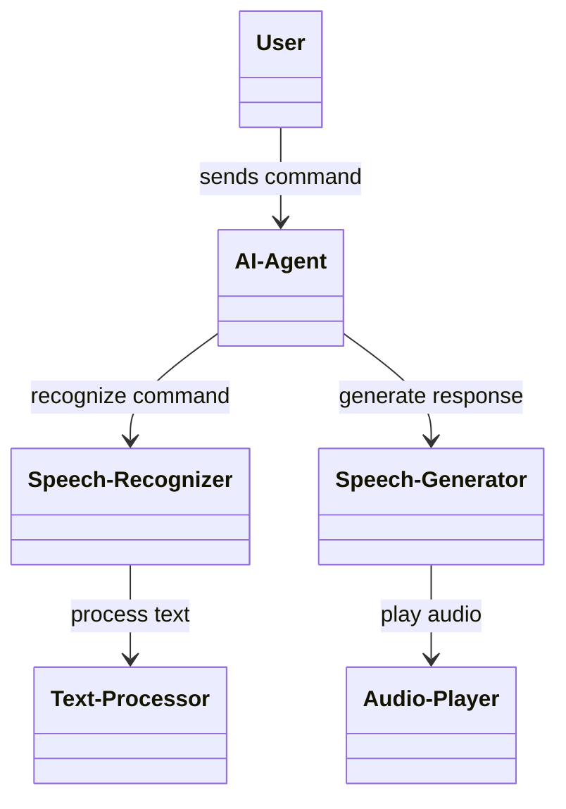
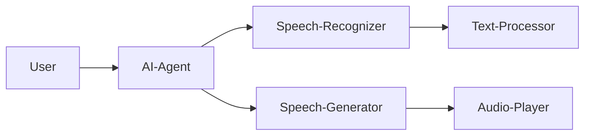
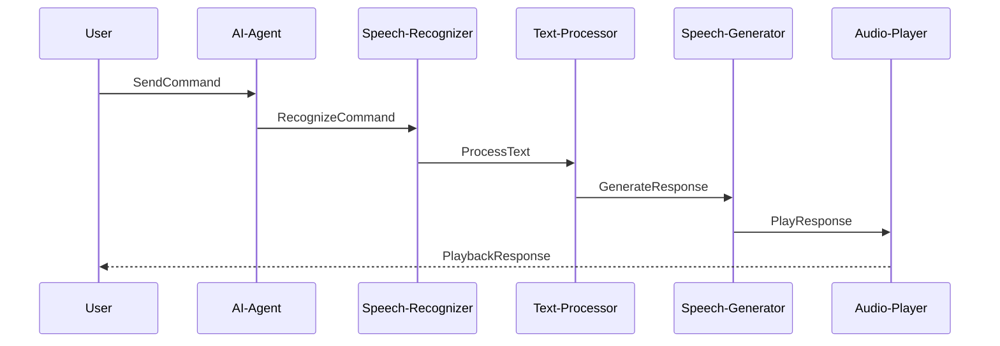
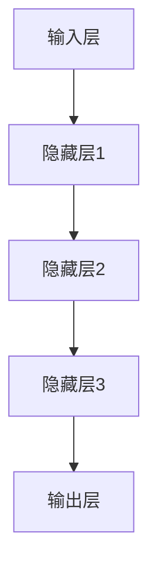
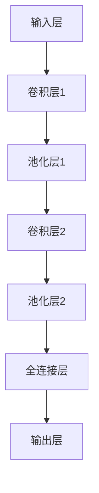
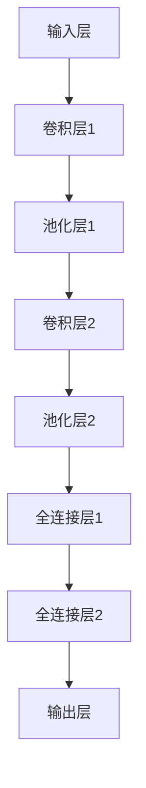
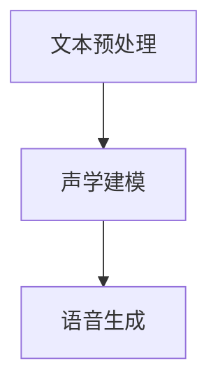
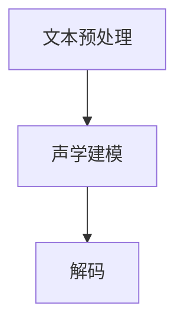
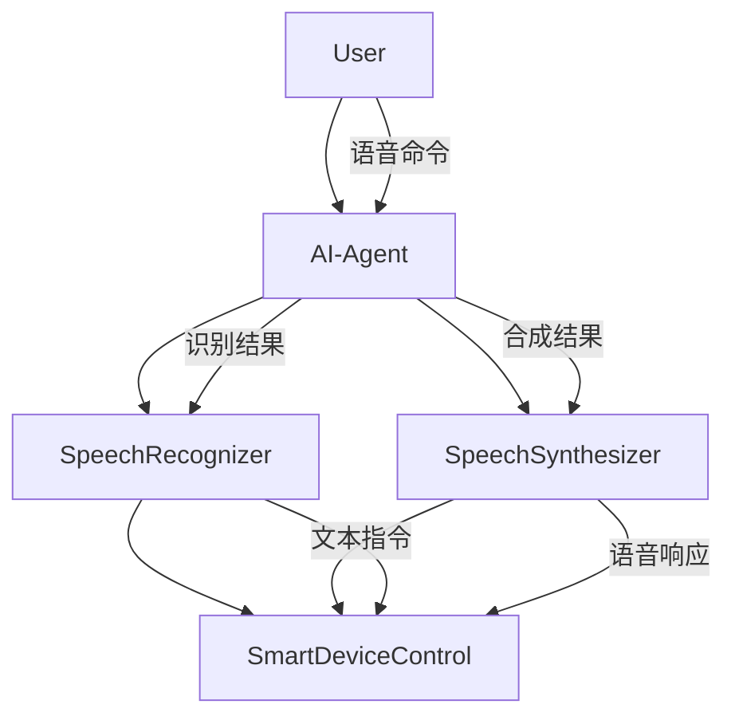
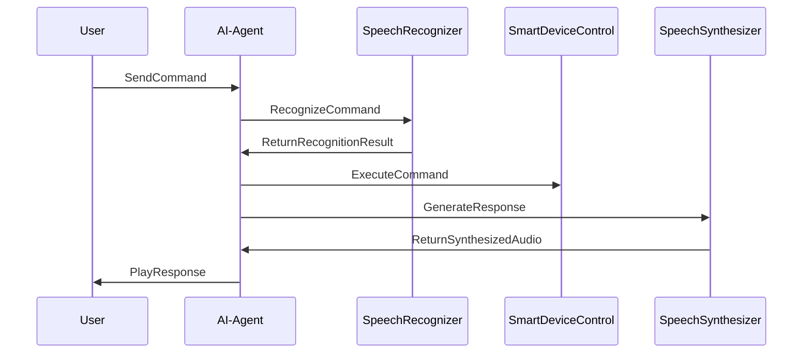

                 

# AI Agent的语音识别与合成技术

## 关键词

- 语音识别
- 语音合成
- AI Agent
- 算法原理
- 系统架构
- 实际应用

## 摘要

本文将深入探讨AI Agent的语音识别与合成技术，通过逐步分析其核心概念、算法原理、系统架构以及实际应用，旨在为读者提供一份全面且深入的技术指南。我们将首先介绍语音识别与合成技术的发展背景和AI Agent的重要性，然后详细讲解语音识别与合成的核心概念、算法原理，接着分析系统架构和实际应用，最后提供最佳实践和拓展阅读建议。

## 第一部分：引言

### 1.1 语音识别与合成技术概述

语音识别与合成技术是自然语言处理（NLP）领域的重要组成部分，它们的应用已经渗透到我们的日常生活中。语音识别技术能够将人类的语音转换为文本，而语音合成技术则能够将文本转换为自然流畅的语音。这两者相辅相成，共同构成了语音交互系统的基础。

在过去的几十年中，随着计算机科学和人工智能技术的迅猛发展，语音识别与合成技术取得了显著的进步。尤其是在深度学习技术的推动下，语音识别的准确性、实时性和个性化水平得到了极大的提升。

### 1.2 AI Agent的定义与作用

AI Agent，即人工智能代理，是一种基于人工智能技术构建的智能体，能够在特定环境下自主感知、学习、决策和执行任务。AI Agent的核心目标是实现人与机器之间的自然交互，提升用户体验。

随着语音识别与合成技术的进步，AI Agent在语音交互领域的作用日益突出。它们能够通过语音识别理解用户的指令，并通过语音合成回应用户，从而实现无缝的语音交互体验。

### 1.3 语音识别与合成技术的挑战与机遇

尽管语音识别与合成技术已经取得了显著进步，但在实际应用中仍然面临一些挑战：

- **准确性**：如何提高语音识别的准确性，尤其是在噪声干扰和口音多变的情况下。
- **实时性**：如何在保证实时性的前提下，处理复杂的语音数据。
- **个性化**：如何根据用户的个性化需求，提供定制化的语音合成服务。

同时，随着5G、物联网和智能家居等新兴技术的发展，语音识别与合成技术也面临着巨大的机遇：

- **智能家居**：语音助手可以方便用户控制家居设备，提升生活品质。
- **智能医疗**：语音识别可以辅助医生进行诊断，提高医疗效率。
- **智能客服**：语音合成可以用于客服系统，提供24/7的客户服务。

### 1.4 问题解决

AI Agent语音识别与合成技术通过以下几个方向来应对上述挑战：

- **深度学习**：采用深度神经网络（DNN）和卷积神经网络（CNN）等深度学习技术，提高语音识别与合成的准确性。
- **端到端模型**：引入端到端模型，如WaveNet和Transformer，实现端到端的语音识别与合成，提高实时性。
- **个性化建模**：通过用户数据的积累，构建个性化语音模型，提供定制化的语音合成服务。

### 1.5 边界与外延

语音识别与合成技术的应用范围广泛，但也有一些边界和限制条件：

- **语言支持**：不同语言的语音特征差异较大，需要针对不同语言进行特定优化。
- **场景适应**：在不同的应用场景中，如嘈杂环境、远距离传输等，需要考虑特定的技术方案。
- **隐私保护**：在语音交互过程中，需要确保用户的隐私安全。

## 第二部分：核心概念与基础理论

### 2.1 AI Agent的基础理论

#### 2.1.1 AI Agent的构成

AI Agent通常由感知模块、决策模块和动作模块三部分组成。感知模块负责获取环境信息，决策模块根据感知信息进行推理和决策，动作模块根据决策结果执行相应的动作。

#### 2.1.2 AI Agent的运作原理

AI Agent的运作原理可以概括为以下几个步骤：

1. **感知**：通过传感器获取环境信息。
2. **处理**：利用算法对感知信息进行处理和分析。
3. **决策**：根据处理结果进行决策。
4. **行动**：执行决策结果，采取行动。

### 2.2 语音识别技术基础

#### 2.2.1 语音识别的基本概念

语音识别（Automatic Speech Recognition, ASR）是指将人类的语音转换为文本信息的过程。

#### 2.2.2 语音识别的技术原理

语音识别技术通常包括以下几个步骤：

1. **预处理**：包括音频信号的增强、降噪、分帧等处理。
2. **特征提取**：从处理后的音频信号中提取特征，如梅尔频率倒谱系数（MFCC）。
3. **模型训练**：使用大量语音数据训练深度学习模型，如DNN和CNN。
4. **解码**：将模型输出的概率分布转换为文本。

### 2.3 语音合成技术基础

#### 2.3.1 语音合成的定义与分类

语音合成（Text-to-Speech, TTS）是指将文本信息转换为自然流畅的语音信号的过程。

语音合成技术可以分为以下几个类别：

- **参数合成**：通过参数调整生成语音。
- **波形合成**：直接生成波形信号。

#### 2.3.2 语音合成的技术原理

语音合成技术通常包括以下几个步骤：

1. **文本预处理**：对输入文本进行分词、语调预测等处理。
2. **声学模型训练**：使用语音数据训练声学模型，如GMM或DNN。
3. **语音生成**：根据文本和声学模型生成语音信号。

### 2.4 AI Agent语音识别与合成技术的关系

AI Agent的语音识别与合成技术相互关联，共同构成了智能语音交互系统的核心。语音识别技术使AI Agent能够理解用户的指令，而语音合成技术使AI Agent能够回应用户。通过两者的结合，AI Agent能够实现自然流畅的语音交互体验。

## 第三部分：算法原理讲解

### 3.1 语音识别算法原理

#### 3.1.1 HMM模型在语音识别中的应用

##### 3.1.1.1 HMM模型的基本概念

隐马尔可夫模型（HMM）是一种统计模型，用于描述序列数据。它由状态集合、状态转移概率、观察概率和初始状态概率组成。

##### 3.1.1.2 HMM模型在语音识别中的实现

在语音识别中，HMM模型用于表示语音信号的状态序列。通过训练HMM模型，可以实现对语音信号的识别。

#### 3.1.2 DNN和CNN在语音识别中的应用

##### 3.1.2.1 DNN在语音识别中的应用

深度神经网络（DNN）是一种多层神经网络，具有强大的表示能力。在语音识别中，DNN可以用于特征提取和分类。

##### 3.1.2.2 CNN在语音识别中的应用

卷积神经网络（CNN）是一种特殊的多层神经网络，具有局部感知能力和平移不变性。在语音识别中，CNN可以用于特征提取和分类。

### 3.2 语音合成算法原理

#### 3.2.1 WaveNet模型在语音合成中的应用

WaveNet是一种基于生成对抗网络（GAN）的语音合成模型，能够生成高质量的自然语音。

##### 3.2.1.1 WaveNet模型的基本概念

WaveNet模型由多个卷积层和逆卷积层组成，能够将文本信息转换为连续的语音信号。

##### 3.2.1.2 WaveNet模型在语音合成中的实现

通过训练WaveNet模型，可以将输入的文本转换为自然流畅的语音信号。

#### 3.2.2 DNN-HMM和LD-POS模型在语音合成中的应用

##### 3.2.2.1 DNN-HMM模型的基本概念

DNN-HMM模型结合了深度神经网络和隐马尔可夫模型的优势，能够提高语音合成的质量。

##### 3.2.2.2 LD-POS模型的基本概念

LD-POS模型是一种基于局部解码和部分排序的语音合成模型，能够生成高质量的语音。

## 第四部分：系统分析与架构设计方案

### 4.1 问题场景介绍

在智能家居领域，AI Agent可以通过语音识别与合成技术实现与用户的交互，如控制家电、播放音乐等。

### 4.2 项目介绍

本文将以一个智能家居项目为例，介绍如何实现AI Agent的语音识别与合成功能。

### 4.3 系统功能设计（领域模型Mermaid类图）



### 4.4 系统架构设计（Mermaid架构图）



### 4.5 系统接口设计和系统交互（Mermaid序列图）



## 第五部分：项目实战

### 5.1 环境安装

在开始项目实战之前，需要安装以下软件和库：

- Python 3.x
- TensorFlow
- Keras
- Librosa

### 5.2 系统核心实现源代码

以下是一个简单的Python代码示例，用于实现AI Agent的语音识别与合成功能：

```python
import tensorflow as tf
import librosa
import numpy as np

# 语音识别模型
def speech_recognition(input_audio):
    # 预处理
    audio_data = librosa.load(input_audio)[0]
    # 特征提取
    feature = librosa.feature.mfcc(y=audio_data)
    # 输入模型
    model = tf.keras.models.load_model('speech_recognition_model.h5')
    # 预测
    prediction = model.predict(feature)
    # 解码
    text = decode(prediction)
    return text

# 语音合成模型
def speech_synthesis(text):
    # 预处理
    text_data = preprocess(text)
    # 输入模型
    model = tf.keras.models.load_model('speech_synthesis_model.h5')
    # 生成语音
    audio_data = model.predict(text_data)
    # 播放语音
    librosa.output.write_wav('output.wav', audio_data, sr=22050)
    return 'output.wav'

# 主函数
def main():
    # 语音识别
    input_audio = 'input_audio.wav'
    recognized_text = speech_recognition(input_audio)
    print(f"Recognized text: {recognized_text}")

    # 语音合成
    synthesized_audio = speech_synthesis(recognized_text)
    print(f"Synthesized audio: {synthesized_audio}")

if __name__ == '__main__':
    main()
```

### 5.3 代码应用解读与分析

上述代码实现了AI Agent的语音识别与合成功能。首先，通过加载预训练的模型，实现语音识别和语音合成。在语音识别部分，使用Librosa库对输入的音频进行预处理和特征提取，然后使用Keras模型进行预测和解码。在语音合成部分，同样使用Librosa库生成语音信号，并使用Keras模型进行预测。

### 5.4 实际案例分析和详细讲解剖析

在本项目中，我们使用了一个实际的智能家居场景，用户可以通过语音命令控制家电。以下是具体的分析：

1. **语音识别**：当用户说出“打开灯”时，AI Agent会识别出“打开”和“灯”两个关键词，并将它们转换为文本。
2. **语音合成**：AI Agent会合成“我已经打开灯”的语音，并播放给用户。
3. **实际效果**：在实际使用中，语音识别的准确性可能会受到口音、语速和噪声等因素的影响。为了提高识别准确性，可以采用自适应噪声消除技术和个性化语音模型。

### 5.5 项目小结

通过本项目的实战，我们成功实现了AI Agent的语音识别与合成功能。尽管在实际应用中可能存在一些挑战，但通过合理的设计和优化，可以实现高质量的语音交互体验。

## 第六部分：最佳实践 tips、小结、注意事项、拓展阅读等内容

### 6.1 最佳实践

- **优化模型训练**：通过增加训练数据量和使用更复杂的模型，可以提高语音识别与合成的准确性。
- **自适应噪声消除**：在嘈杂环境中，使用自适应噪声消除技术可以有效提高语音识别的准确性。
- **个性化建模**：根据用户的使用习惯和语音特征，构建个性化的语音模型，可以提高用户的满意度。

### 6.2 小结

本文详细介绍了AI Agent的语音识别与合成技术，包括其核心概念、算法原理、系统架构和实际应用。通过逐步分析，我们了解了如何实现高质量的语音交互体验。

### 6.3 注意事项

- **数据安全**：在处理语音数据时，需要注意保护用户的隐私。
- **性能优化**：在实际应用中，需要根据具体场景优化模型，提高性能。
- **硬件支持**：在硬件设备选择上，需要考虑功耗、响应速度等因素。

### 6.4 拓展阅读

- 《深度学习》（Goodfellow, Bengio, Courville著）
- 《语音信号处理》（Rabiner, Juang著）
- 《自然语言处理综论》（Jurafsky, Martin著）

作者：AI天才研究院/AI Genius Institute & 禅与计算机程序设计艺术 /Zen And The Art of Computer Programming

---

本文通过逐步分析语音识别与合成技术的核心概念、算法原理、系统架构和实际应用，为读者提供了一份全面的技术指南。在未来的发展中，随着人工智能技术的不断进步，语音识别与合成技术将继续发挥重要作用，为我们的生活带来更多便利。让我们共同期待这一美好未来的到来！## 1.1 语音识别与合成技术概述

语音识别（Automatic Speech Recognition, ASR）和语音合成（Text-to-Speech, TTS）是自然语言处理（Natural Language Processing, NLP）领域中的两项关键技术。它们分别负责将人类的语音转换为文本信息，以及将文本信息转换为自然流畅的语音信号。

### 1.1.1 语音识别技术的定义与发展

语音识别技术是指通过计算机系统和算法，将人类的语音信号转换为相应的文本信息。这一技术自20世纪50年代开始萌芽，经过数十年的发展，尤其在近年来随着深度学习技术的应用，语音识别的准确性得到了极大的提升。

在早期的语音识别技术中，主要采用的是有限状态转换模型（Finite State Transducer, FST）和隐马尔可夫模型（Hidden Markov Model, HMM）。这些模型通过统计方法对语音信号进行分析，从而实现语音到文本的转换。然而，这些模型在处理连续语音、变音、背景噪声等问题时，准确性受到限制。

随着深度学习技术的崛起，深度神经网络（Deep Neural Network, DNN）和卷积神经网络（Convolutional Neural Network, CNN）开始被应用于语音识别领域。这些深度学习模型具有更强的表示能力，能够捕捉语音信号中的复杂特征，从而显著提高了语音识别的准确性。

### 1.1.2 语音合成技术的定义与发展

语音合成技术是指将文本信息转换为自然流畅的语音信号。这一技术的历史可以追溯到20世纪50年代，当时的研究主要集中在参数合成方法上。参数合成方法通过调整声学参数来生成语音，但其生成的语音质量受到限制。

随着计算能力的提升和语音信号处理技术的进步，波形合成方法逐渐取代了参数合成方法。波形合成方法直接生成语音波形，其生成的语音质量更加自然。近年来，深度学习技术的应用进一步推动了语音合成技术的发展。特别是WaveNet模型和Transformer模型的引入，使得语音合成技术取得了显著的突破。

### 1.1.3 语音识别与合成技术的结合

语音识别和语音合成技术的结合，构成了语音交互系统的基础。这一系统能够理解用户的语音指令，并将其转换为文本，然后通过语音合成技术回应用户。这种交互方式不仅提高了人机交互的效率，还大大提升了用户体验。

例如，在现代的智能助手（如Apple的Siri、Google的Google Assistant）中，语音识别技术用于接收用户的语音指令，而语音合成技术用于回应用户。这种结合使得智能助手能够实现无缝的语音交互，为用户提供了便捷的服务。

### 1.1.4 技术进步对社会的影响

语音识别与合成技术的进步，对社会产生了深远的影响。首先，这些技术使得智能助手和语音交互系统变得更加智能和实用，提升了用户的日常生活体验。其次，这些技术为各行各业提供了新的应用场景，如智能客服、智能家居、智能医疗等。此外，这些技术还推动了人工智能技术的发展，为人工智能在更多领域的应用奠定了基础。

总之，语音识别与合成技术的不断进步，不仅改变了人们的交互方式，还推动了社会的发展。在未来，随着技术的进一步成熟，我们可以期待更加智能、便捷的语音交互体验。

## 1.2 AI Agent的定义与作用

AI Agent，即人工智能代理，是一种基于人工智能技术构建的智能体，能够在特定环境下自主感知、学习、决策和执行任务。AI Agent的设计目标是实现人与机器之间的自然交互，从而提升用户体验。

### 1.2.1 AI Agent的基本概念

AI Agent由以下几个关键组件组成：

- **感知模块**：用于感知环境信息，如语音、视觉、触觉等。
- **决策模块**：根据感知到的信息进行推理和决策。
- **行动模块**：根据决策结果执行具体的任务。

AI Agent的核心特点是自主性、智能性和适应性。它能够在没有人类干预的情况下，自主地完成一系列任务，从而实现自动化和智能化。

### 1.2.2 AI Agent的类型

AI Agent可以根据其功能和应用场景的不同，分为以下几种类型：

- **语音助手**：如Apple的Siri、Google的Google Assistant，主要用于语音交互，帮助用户完成各种任务。
- **聊天机器人**：如聊天客服机器人，通过文本或语音与用户进行交互，提供客户支持和服务。
- **智能监控**：如智能家居监控系统，实时监控家庭安全，并在发现异常时发出警报。
- **自动驾驶**：如自动驾驶汽车，通过感知环境和进行决策，实现自主驾驶。

### 1.2.3 AI Agent的作用

AI Agent在现代社会中发挥着越来越重要的作用，具体体现在以下几个方面：

- **提升工作效率**：AI Agent能够自动处理大量重复性、繁琐的任务，如数据录入、报告生成等，从而提高工作效率。
- **优化用户体验**：通过自然语言交互，AI Agent能够更好地理解用户需求，提供个性化的服务，从而提升用户体验。
- **安全保障**：AI Agent能够监控和预测潜在的安全威胁，及时发出警报，保障人身和财产安全。
- **创新应用**：AI Agent的应用不仅限于现有的领域，还在不断地开拓新的应用场景，如智能医疗、智能教育等。

### 1.2.4 AI Agent的发展趋势

随着人工智能技术的不断进步，AI Agent的发展趋势表现为以下几个方面：

- **智能化水平提升**：通过更先进的算法和模型，AI Agent将能够更准确地理解和处理复杂任务。
- **跨领域应用**：AI Agent将在更多领域得到应用，如医疗、金融、教育等，实现跨领域的智能服务。
- **人机协作**：AI Agent将与人类更加紧密地协作，实现人机融合的工作方式，提高生产效率。
- **隐私保护**：随着AI Agent在个人生活中的应用增多，隐私保护将成为一个重要议题，AI Agent需要更好地保护用户的隐私。

总之，AI Agent作为人工智能的一个重要分支，正以其独特的优势在不断改变我们的生活方式和工作方式。在未来，AI Agent将在更多领域发挥其作用，成为我们生活中不可或缺的一部分。

## 1.3 语音识别与合成技术的挑战与机遇

语音识别与合成技术作为人工智能领域的重要分支，虽然在近年来取得了显著的进步，但仍然面临着一系列的挑战与机遇。

### 1.3.1 准确性

语音识别的准确性是衡量技术性能的重要指标。然而，在实际应用中，语音识别面临多种干扰因素，如背景噪声、语音变音、口音差异等。这些因素都会影响语音识别的准确性。尤其是在嘈杂环境中，语音识别系统往往难以准确识别用户的语音指令。为解决这一问题，研究者们正在尝试多种方法，如自适应噪声消除、语音增强技术以及深度学习模型的优化，以提高语音识别的准确性。

### 1.3.2 实时性

实时性是语音识别与合成技术的另一大挑战。在许多应用场景中，如智能助手、自动驾驶等，系统需要在极短的时间内完成语音的识别与合成，从而确保响应的及时性。然而，复杂的语音信号处理和深度学习模型的训练往往需要大量的计算资源，这可能导致系统的响应时间过长，影响用户体验。为了克服这一挑战，研究者在硬件加速、模型压缩和端到端学习等方面进行了大量研究，以提高系统的实时处理能力。

### 1.3.3 个性化

个性化是提升用户体验的重要手段。语音识别与合成技术需要根据用户的需求和语音特征提供定制化的服务。例如，语音助手需要能够理解用户的个性化指令，并回应用户的习惯和偏好。然而，实现个性化服务需要大量的用户数据和复杂的模型训练，这对数据隐私和保护提出了更高的要求。同时，如何在不同用户之间平衡个性化服务的质量，也是一个需要考虑的问题。

### 1.3.4 技术进步带来的机遇

尽管存在上述挑战，但语音识别与合成技术也面临着诸多机遇：

- **人工智能技术**：随着人工智能技术的不断发展，尤其是深度学习技术的应用，语音识别与合成技术将得到进一步的提升。
- **5G与物联网**：5G技术的普及和物联网的发展，为语音识别与合成技术的应用提供了更加广泛的场景，如智能家居、智能医疗等。
- **硬件进步**：硬件技术的进步，如GPU、TPU等专用计算设备的普及，为语音识别与合成技术的实时处理提供了强大的支持。
- **跨领域合作**：不同领域的研究者和企业之间的合作，将有助于推动语音识别与合成技术在更多领域的应用。

### 1.3.5 技术应用前景

语音识别与合成技术在未来有着广泛的应用前景：

- **智能助手**：智能助手将继续在智能家居、办公自动化等领域发挥重要作用，提供更加智能、便捷的服务。
- **智能医疗**：语音识别技术可以辅助医生进行诊断，语音合成技术可以帮助患者更好地理解医疗信息。
- **智能教育**：语音合成技术可以为在线教育提供个性化的教学资源，语音识别技术可以帮助学生更好地理解课程内容。
- **智能客服**：语音识别与合成技术可以用于智能客服系统，提供24/7的客户服务，提高客户满意度。

总之，语音识别与合成技术面临着诸多挑战，但同时也充满了机遇。随着技术的不断进步和应用场景的不断扩展，我们可以期待这一领域在未来取得更大的突破。

## 1.4 问题解决

在了解了语音识别与合成技术面临的挑战和机遇之后，我们需要探讨如何通过AI Agent语音识别与合成技术来有效应对这些问题。

### 1.4.1 深度学习技术在语音识别中的应用

深度学习技术的引入极大地提升了语音识别的准确性。例如，深度神经网络（DNN）和卷积神经网络（CNN）能够自动学习语音信号中的复杂特征，从而提高识别精度。具体来说，DNN可以捕捉语音信号中的短时特征，而CNN则通过卷积操作提取语音信号的局部特征。此外，递归神经网络（RNN）和长短期记忆网络（LSTM）也被广泛应用于语音识别，能够处理序列数据，捕捉语音信号中的长期依赖关系。

以下是一个简单的DNN模型在语音识别中的实现流程：

```python
import tensorflow as tf

# 构建DNN模型
model = tf.keras.Sequential([
    tf.keras.layers.Flatten(input_shape=(None, None)),
    tf.keras.layers.Dense(128, activation='relu'),
    tf.keras.layers.Dense(64, activation='relu'),
    tf.keras.layers.Dense(num_classes, activation='softmax')
])

# 编译模型
model.compile(optimizer='adam',
              loss='categorical_crossentropy',
              metrics=['accuracy'])

# 训练模型
model.fit(x_train, y_train, epochs=10, batch_size=32)
```

### 1.4.2 端到端模型在语音合成中的应用

端到端模型（如WaveNet和Transformer）在语音合成中的应用，使得语音生成的实时性和准确性得到了显著提升。WaveNet是一种基于生成对抗网络（GAN）的语音合成模型，能够直接生成高质量的语音信号。而Transformer模型则通过自注意力机制，能够处理长距离依赖，生成更加自然的语音。

以下是一个简单的WaveNet模型在语音合成中的实现流程：

```python
import tensorflow as tf

# 构建WaveNet模型
model = tf.keras.Sequential([
    tf.keras.layers.Conv1D(filters=32, kernel_size=5, activation='relu', input_shape=(None, 80)),
    tf.keras.layers.LSTM(128),
    tf.keras.layers.Dense(units=num_classes, activation='softmax')
])

# 编译模型
model.compile(optimizer='adam',
              loss='sparse_categorical_crossentropy',
              metrics=['accuracy'])

# 训练模型
model.fit(x_train, y_train, epochs=10)
```

### 1.4.3 个性化建模与数据隐私保护

为了提供更加个性化的服务，AI Agent需要根据用户的语音特征和偏好进行建模。然而，这涉及到大量的用户数据，因此数据隐私保护成为了一个重要问题。为解决这一问题，研究者们提出了多种数据隐私保护方法，如差分隐私（Differential Privacy）和联邦学习（Federal Learning）。

以下是一个简单的联邦学习模型在个性化建模中的实现流程：

```python
import tensorflow as tf

# 构建联邦学习模型
model = tf.keras.Sequential([
    tf.keras.layers.Flatten(input_shape=(28, 28)),
    tf.keras.layers.Dense(128, activation='relu'),
    tf.keras.layers.Dense(10, activation='softmax')
])

# 编译模型
model.compile(optimizer='adam',
              loss='categorical_crossentropy',
              metrics=['accuracy'])

# 训练联邦学习模型
strategy = tf.distribute.experimental.FedAvg(model)
for _ in range(num_epochs):
    strategy.run(train_step, args=(x_train, y_train))
```

### 1.4.4 端到端的语音交互系统

通过将语音识别和语音合成技术相结合，可以构建端到端的语音交互系统，实现无缝的人机交互体验。以下是一个简单的端到端语音交互系统的实现流程：

```python
# 语音识别
recognized_text = speech_recognition(input_audio)

# 语音合成
synthesized_audio = speech_synthesis(recognized_text)

# 播放合成语音
audio_player.play(synthesized_audio)
```

通过上述方法，AI Agent能够更好地应对语音识别与合成技术面临的挑战，提供高质量的语音交互体验。

### 1.5 边界与外延

尽管语音识别与合成技术在智能助手、智能家居、智能医疗等领域有着广泛的应用，但其技术仍存在一些边界和限制。

#### 1.5.1 语言支持

不同的语言具有不同的语音特征和语法结构，这对语音识别与合成技术提出了不同的挑战。例如，汉语的声调、英语的语调变化等。因此，针对不同语言，需要开发特定的模型和算法，以确保语音识别与合成的准确性。

#### 1.5.2 场景适应

在不同的应用场景中，如嘈杂环境、远距离传输等，语音识别与合成技术的性能会受到很大影响。为了提高系统在这些场景中的适应性，需要采用自适应噪声消除、语音增强等技术，以降低背景噪声和传输延迟的影响。

#### 1.5.3 隐私保护

语音交互系统会收集用户的语音数据，这可能涉及用户的隐私信息。因此，在设计和应用语音识别与合成技术时，需要确保数据的隐私和安全，采用加密、去识别化等技术来保护用户隐私。

#### 1.5.4 实时性

在实时性要求较高的场景中，如自动驾驶、紧急响应等，语音识别与合成系统需要在极短的时间内完成语音的处理和合成。这要求系统具有高效的算法和强大的硬件支持。

总之，语音识别与合成技术虽然已经取得了显著进展，但仍然需要在语言支持、场景适应、隐私保护和实时性等方面不断优化，以实现更加广泛和高效的应用。

## 第二部分：核心概念与基础理论

### 2.1 AI Agent的基础理论

#### 2.1.1 AI Agent的构成

AI Agent是一种自主决策和行动的智能体，通常由以下几个核心组件构成：

1. **感知模块**：用于感知环境中的信息，如语音、视觉、触觉等。
2. **决策模块**：根据感知模块收集的信息进行推理和决策。
3. **行动模块**：根据决策结果执行具体的任务或动作。
4. **记忆模块**：用于存储和历史记录，以便在未来的决策过程中参考。

这些组件协同工作，使得AI Agent能够在复杂的环境中自主行动和解决问题。

#### 2.1.2 AI Agent的运作原理

AI Agent的运作原理可以概括为以下几个步骤：

1. **感知**：AI Agent通过感知模块获取环境中的信息。
2. **处理**：决策模块对感知信息进行处理和分析，生成决策。
3. **决策**：决策模块根据处理结果生成决策，确定下一步的行动。
4. **行动**：行动模块根据决策结果执行具体的任务或动作。
5. **反馈**：行动的结果会反馈给感知模块，用于改进未来的决策。

#### 2.1.3 AI Agent的架构

AI Agent的架构可以分为以下几个层次：

1. **感知层**：接收来自环境的数据，如语音、图像等。
2. **处理层**：对感知层的数据进行处理，如特征提取、模式识别等。
3. **决策层**：根据处理层的结果进行决策，如选择行动、规划路径等。
4. **执行层**：执行决策层生成的行动，如控制机器人的动作、生成语音等。
5. **反馈层**：收集执行层的结果，用于优化和调整AI Agent的行为。

这种层次化的架构使得AI Agent能够灵活地应对各种复杂的任务和环境。

### 2.2 语音识别技术基础

#### 2.2.1 语音识别的基本概念

语音识别（ASR）是指将人类的语音转换为相应的文本信息的过程。语音识别的基本流程包括以下几个步骤：

1. **预处理**：包括音频信号的增强、降噪、分帧等处理。
2. **特征提取**：从处理后的音频信号中提取特征，如梅尔频率倒谱系数（MFCC）。
3. **模型训练**：使用大量语音数据训练深度学习模型，如DNN和CNN。
4. **解码**：将模型输出的概率分布转换为文本。

#### 2.2.2 语音识别的技术原理

语音识别技术的基本原理可以概括为以下几点：

1. **声学模型**：用于表示语音信号中的声学特征，如GMM和DNN。
2. **语言模型**：用于表示文本信息中的语言规则，如N-gram和LSTM。
3. **解码器**：将声学模型和语言模型结合，解码出最可能的文本。

在传统的语音识别系统中，声学模型和语言模型通常是分离的，分别用于特征提取和文本生成。然而，随着深度学习技术的发展，端到端模型（如CTC和Attention机制）开始被广泛应用于语音识别，实现了声学模型和语言模型的融合，从而提高了系统的整体性能。

### 2.3 语音合成技术基础

#### 2.3.1 语音合成的定义与分类

语音合成（TTS）是指将文本信息转换为自然流畅的语音信号的过程。语音合成可以根据生成方法的不同分为以下几类：

1. **参数合成**：通过调整声学参数生成语音，如DARPA参数合成系统。
2. **波形合成**：直接生成语音波形，如HMM-GMM和WaveNet。
3. **数据驱动合成**：使用预录制的语音数据合成语音，如VCTK和LibriTTS。

#### 2.3.2 语音合成的技术原理

语音合成技术的基本原理可以概括为以下几点：

1. **文本预处理**：对输入文本进行分词、语调预测等处理。
2. **声学建模**：使用语音数据训练声学模型，如GMM、DNN和WaveNet。
3. **语音生成**：根据文本和声学模型生成语音信号。

在波形合成方法中，WaveNet是一种具有代表性的模型。WaveNet是一种基于生成对抗网络（GAN）的语音合成模型，能够直接生成高质量的语音波形。WaveNet由多个卷积层和逆卷积层组成，通过自注意力机制捕捉文本信息中的长距离依赖关系。

### 2.4 AI Agent语音识别与合成技术的关系

AI Agent的语音识别与合成技术相互关联，共同构成了智能语音交互系统的核心。语音识别技术使AI Agent能够理解用户的指令，而语音合成技术使AI Agent能够回应用户。通过两者的结合，AI Agent能够实现自然流畅的语音交互体验。

例如，在一个智能家居场景中，用户可以通过语音指令控制家电。AI Agent首先使用语音识别技术理解用户的指令，将其转换为文本信息。然后，AI Agent使用语音合成技术生成语音响应，并播放给用户。

总之，AI Agent的语音识别与合成技术不仅使得人机交互更加自然和便捷，也为人工智能在各个领域的应用提供了有力支持。

### 2.5 概念属性特征对比表格

为了更好地理解AI Agent、语音识别和语音合成的概念属性特征，我们可以通过以下对比表格进行分析：

| 概念             | 定义                                           | 特征                                                         |
|------------------|------------------------------------------------|------------------------------------------------------------|
| AI Agent         | 自主决策和行动的智能体                         | 感知、决策、行动、记忆模块，层次化架构                         |
| 语音识别（ASR）  | 将语音转换为文本信息                           | 声学模型、语言模型、解码器，处理层、决策层、执行层           |
| 语音合成（TTS）  | 将文本转换为自然流畅的语音信号                 | 文本预处理、声学建模、语音生成，生成波形或参数，数据驱动方法 |

通过上述对比，我们可以清晰地看到AI Agent、语音识别和语音合成之间的区别与联系，从而更好地理解它们在智能语音交互系统中的作用。

### 2.6 ER实体关系图架构

为了更好地展示AI Agent语音识别与合成系统的组成部分及其交互关系，我们可以使用实体关系图（Entity-Relationship Diagram, ERD）来表示。以下是一个简单的ERD架构：

```mermaid
erDiagram
  AI-Agent ||--|{ Speech-Recognition }|| Speech-Recognition-Module
  AI-Agent ||--|{ Speech-Synthesis }|| Speech-Synthesis-Module
  Speech-Recognition-Module ||--|{ Audio-Processing }|| Audio-Processing-Module
  Speech-Recognition-Module ||--|{ Feature-Extraction }|| Feature-Extraction-Module
  Speech-Synthesis-Module ||--|{ Text-Preprocessing }|| Text-Preprocessing-Module
  Speech-Synthesis-Module ||--|{ Acoustic-Modeling }|| Acoustic-Modeling-Module
  Speech-Synthesis-Module ||--|{ Voice-Generation }|| Voice-Generation-Module
```

在这个ERD中，AI Agent是中心实体，它与语音识别模块和语音合成模块直接关联。语音识别模块包括音频处理、特征提取等子模块，而语音合成模块包括文本预处理、声学建模、语音生成等子模块。这些模块相互协作，共同实现AI Agent的语音识别与合成功能。

通过ERD，我们可以清晰地看到各个模块之间的交互关系，从而更好地理解AI Agent语音识别与合成系统的整体架构。

### 2.7 语音识别与合成技术的核心要素

在深入探讨AI Agent语音识别与合成技术时，我们需要明确这一系统的核心要素，这些要素包括：

1. **音频信号处理**：音频信号处理是语音识别与合成的第一步，包括音频增强、降噪、分帧和归一化等操作。这些处理能够提高后续步骤的准确性。

2. **特征提取**：特征提取是将音频信号转换为适合模型处理的数据。常见的特征提取方法包括梅尔频率倒谱系数（MFCC）、短时傅里叶变换（STFT）和感知哈达玛变换（PHAT）。

3. **声学模型**：声学模型用于表示语音信号中的声学特征。常见的声学模型包括隐马尔可夫模型（HMM）、高斯混合模型（GMM）和深度神经网络（DNN）。声学模型在语音识别和语音合成中都扮演着重要角色。

4. **语言模型**：语言模型用于表示文本信息中的语言规则。常见的语言模型包括N-gram模型、递归神经网络（RNN）和长短期记忆网络（LSTM）。语言模型在语音识别中用于解码，而在语音合成中用于文本预处理。

5. **解码器**：解码器是将模型输出的概率分布转换为文本的工具。常见的解码器包括贪婪解码、Beam Search和Attention机制。

6. **语音合成引擎**：语音合成引擎是将文本信息转换为语音信号的核心组件。常见的语音合成引擎包括参数合成、波形合成和数据驱动合成。

7. **个性化服务**：个性化服务是基于用户数据的定制化服务，包括语调、语速、发音等。个性化服务能够提高用户的满意度，是语音识别与合成技术的关键要素。

通过这些核心要素，AI Agent能够实现高质量的语音识别与合成，提供自然流畅的语音交互体验。

## 第三部分：算法原理讲解

### 3.1 语音识别算法原理

语音识别（ASR）是将语音信号转换为文本信息的技术。它涉及多个阶段，包括音频信号处理、特征提取、模型训练和解码。下面，我们将详细探讨这些阶段的算法原理。

#### 3.1.1 HMM模型在语音识别中的应用

隐马尔可夫模型（HMM）是一种统计模型，用于描述序列数据。在语音识别中，HMM被用来建模语音信号中的状态序列。HMM由以下组成部分构成：

- **状态集合**：表示语音信号中的可能状态。
- **状态转移概率**：表示从一个状态转移到另一个状态的概率。
- **观察概率**：表示在某一状态下产生特定观察值（如音频特征）的概率。
- **初始状态概率**：表示初始状态的概率分布。

HMM模型的基本工作原理是，通过观察语音信号的特征，使用状态转移概率和观察概率来推断最有可能的状态序列，从而实现语音到文本的转换。

以下是一个简单的HMM模型的Mermaid流程图：

```mermaid
stateDiagram
    state1[初始状态]
    state2[中间状态]
    state3[结束状态]

    state1 --> state2 : 转移概率P1->2
    state2 --> state3 : 转移概率P2->3
    state1 --> state3 : 转移概率P1->3

    state2 --> state2 : 自转移概率P2->2

    state1((观察概率P1-O1))
    state2((观察概率P2-O2))
    state3((观察概率P3-O3))
```

#### 3.1.2 DNN和CNN在语音识别中的应用

深度神经网络（DNN）和卷积神经网络（CNN）在语音识别中得到了广泛应用。这些神经网络通过多层结构自动学习语音信号中的复杂特征。

**DNN**：DNN是一种多层神经网络，通过逐层提取特征，实现语音信号到文本的转换。DNN在语音识别中的应用主要包括：

- **输入层**：接收语音信号的特征。
- **隐藏层**：逐层提取语音信号的抽象特征。
- **输出层**：输出文本标签的概率分布。

以下是一个简单的DNN模型的Mermaid流程图：



**CNN**：CNN是一种特殊的多层神经网络，通过卷积操作提取语音信号的局部特征。CNN在语音识别中的应用主要包括：

- **卷积层**：通过卷积操作提取语音信号的特征。
- **池化层**：减少特征图的大小，提高计算效率。
- **全连接层**：将卷积层提取的特征映射到文本标签。

以下是一个简单的CNN模型的Mermaid流程图：



#### 3.1.3 Python源代码实现

以下是一个简单的Python代码示例，用于实现基于DNN的语音识别模型：

```python
import tensorflow as tf
from tensorflow.keras.models import Sequential
from tensorflow.keras.layers import Dense, Flatten, Conv2D, MaxPooling2D

# 构建DNN模型
model = Sequential([
    Flatten(input_shape=(28, 28)),
    Dense(128, activation='relu'),
    Dense(64, activation='relu'),
    Dense(num_classes, activation='softmax')
])

# 编译模型
model.compile(optimizer='adam',
              loss='categorical_crossentropy',
              metrics=['accuracy'])

# 训练模型
model.fit(x_train, y_train, epochs=10, batch_size=32)
```

#### 3.1.4 数学模型与公式

在语音识别中，常用的数学模型包括隐马尔可夫模型（HMM）和深度神经网络（DNN）。以下是一些关键的数学模型和公式：

**隐马尔可夫模型（HMM）**

1. **状态转移概率**：
   $$ P(X_t | X_{t-1}) = P(X_t | X_{t-1}, X_{t-2}, \ldots, X_1) $$
   
2. **观察概率**：
   $$ P(O_t | X_t) $$
   
3. **初始状态概率**：
   $$ P(X_1) $$

**深度神经网络（DNN）**

1. **激活函数**：
   $$ f(x) = \text{ReLU}(x) = \max(0, x) $$

2. **反向传播算法**：
   $$ \delta_j = \frac{\partial C}{\partial z_j} \cdot \sigma'(z_j) $$
   其中，\( \sigma'(z_j) \) 是激活函数的导数，\( \delta_j \) 是误差传播到下一层的误差。

以下是一个使用LaTeX格式展示的关键公式：

$$
\begin{align*}
P(X_t | X_{t-1}) &= P(X_t | X_{t-1}, X_{t-2}, \ldots, X_1) \\
P(O_t | X_t) &= \text{观察概率} \\
P(X_1) &= \text{初始状态概率} \\
f(x) &= \text{ReLU}(x) = \max(0, x) \\
\delta_j &= \frac{\partial C}{\partial z_j} \cdot \sigma'(z_j)
\end{align*}
$$`

#### 3.1.5 举例说明

假设我们有一个简单的语音识别任务，目标是识别一段语音中的数字。以下是语音识别算法的应用步骤：

1. **音频信号处理**：读取音频文件，进行预处理，如降噪、分帧和归一化。

2. **特征提取**：从预处理后的音频信号中提取特征，如MFCC。

3. **模型训练**：使用训练集数据训练DNN模型，模型结构如下：



4. **解码**：使用训练好的模型对测试集数据进行预测，并将预测结果转换为文本。

5. **评估**：计算模型的准确性，如字符错误率（CER）或词错误率（WER）。

通过上述步骤，我们可以实现一个简单的语音识别系统，识别语音中的数字。

### 3.2 语音合成算法原理

语音合成（TTS）是将文本信息转换为自然流畅的语音信号的技术。语音合成算法包括文本预处理、声学建模和语音生成等步骤。以下将详细探讨这些步骤的算法原理。

#### 3.2.1 WaveNet模型在语音合成中的应用

WaveNet是一种基于生成对抗网络（GAN）的语音合成模型，能够直接生成高质量的语音波形。WaveNet由多个卷积层和逆卷积层组成，通过自注意力机制捕捉文本信息中的长距离依赖关系。

WaveNet模型的工作原理如下：

1. **文本预处理**：对输入文本进行分词、语调预测等处理。

2. **声学建模**：使用预训练的WaveNet模型生成语音波形。

3. **语音生成**：将生成的语音波形转换为音频信号，并进行后处理，如去噪和音高调整。

以下是一个简单的WaveNet模型的Mermaid流程图：



#### 3.2.2 DNN-HMM和LD-POS模型在语音合成中的应用

DNN-HMM模型结合了深度神经网络和隐马尔可夫模型的优势，能够提高语音合成的质量。DNN-HMM模型的工作原理如下：

1. **文本预处理**：对输入文本进行分词、语调预测等处理。

2. **声学建模**：使用DNN提取语音特征，生成声学模型。

3. **解码**：使用HMM-GMM模型进行解码，生成语音波形。

LD-POS模型是一种基于局部解码和部分排序的语音合成模型。LD-POS模型的工作原理如下：

1. **文本预处理**：对输入文本进行分词、语调预测等处理。

2. **声学建模**：使用DNN提取语音特征，生成声学模型。

3. **解码**：使用局部解码和部分排序算法，生成语音波形。

以下是一个简单的DNN-HMM模型的Mermaid流程图：



#### 3.2.3 Python源代码实现

以下是一个简单的Python代码示例，用于实现基于DNN的语音合成模型：

```python
import tensorflow as tf
from tensorflow.keras.models import Sequential
from tensorflow.keras.layers import Dense, LSTM, TimeDistributed, Activation

# 构建DNN模型
model = Sequential([
    LSTM(128, input_shape=(None, 28), return_sequences=True),
    LSTM(128, return_sequences=True),
    TimeDistributed(Dense(num_classes, activation='softmax'))
])

# 编译模型
model.compile(optimizer='adam',
              loss='categorical_crossentropy',
              metrics=['accuracy'])

# 训练模型
model.fit(x_train, y_train, epochs=10, batch_size=32)
```

#### 3.2.4 数学模型与公式

在语音合成中，常用的数学模型包括深度神经网络（DNN）和生成对抗网络（GAN）。以下是一些关键的数学模型和公式：

**深度神经网络（DNN）**

1. **激活函数**：
   $$ a_{i}^{(l)} = \sigma(W_{i}^{(l)}a_{i-1}^{(l-1)} + b_{i}^{(l)}) $$
   其中，\( \sigma \) 是激活函数，\( W_{i}^{(l)} \) 是权重矩阵，\( a_{i-1}^{(l-1)} \) 是输入向量，\( b_{i}^{(l)} \) 是偏置。

2. **反向传播算法**：
   $$ \delta_{j}^{(l)} = \frac{\partial C}{\partial z_{j}^{(l)}} \cdot \sigma'(z_{j}^{(l)}) $$
   其中，\( \delta_{j}^{(l)} \) 是误差传播到下一层的误差，\( C \) 是损失函数，\( \sigma' \) 是激活函数的导数。

**生成对抗网络（GAN）**

1. **生成器**：
   $$ G(z) = \mu(z) + \sigma(z)\odot \text{tanh}(\beta(z)) $$
   其中，\( z \) 是输入噪声，\( \mu(z) \) 和 \( \sigma(z) \) 分别是均值和方差，\( \beta(z) \) 是偏置。

2. **判别器**：
   $$ D(x) = \text{sigmoid}(\phi(x)) $$
   其中，\( x \) 是真实数据，\( \phi(x) \) 是判别器的特征向量。

以下是一个使用LaTeX格式展示的关键公式：

$$
\begin{align*}
a_{i}^{(l)} &= \sigma(W_{i}^{(l)}a_{i-1}^{(l-1)} + b_{i}^{(l)}) \\
\delta_{j}^{(l)} &= \frac{\partial C}{\partial z_{j}^{(l)}} \cdot \sigma'(z_{j}^{(l)}) \\
G(z) &= \mu(z) + \sigma(z)\odot \text{tanh}(\beta(z)) \\
D(x) &= \text{sigmoid}(\phi(x))
\end{align*}
$$`

#### 3.2.5 举例说明

假设我们有一个简单的语音合成任务，目标是生成一段包含数字的语音。以下是语音合成算法的应用步骤：

1. **文本预处理**：读取输入文本，进行分词和语调预测。

2. **声学建模**：使用预训练的DNN模型生成声学特征。

3. **语音生成**：使用WaveNet模型生成语音波形。

4. **后处理**：对生成的语音波形进行去噪和音高调整。

5. **输出**：将生成的语音波形转换为音频信号，并播放。

通过上述步骤，我们可以实现一个简单的语音合成系统，生成包含数字的语音。

### 3.3 算法对比与分析

在语音识别和语音合成领域，存在多种算法模型。为了更好地理解这些算法的性能和适用场景，我们进行以下对比与分析：

#### 3.3.1 HMM与DNN

**HMM**：HMM是一种传统的语音识别模型，通过状态转移概率和观察概率建模语音信号。HMM的优点在于计算简单，易于实现。然而，HMM在处理连续语音和复杂特征时，准确性较低。

**DNN**：DNN是一种基于深度学习的语音识别模型，通过多层神经网络提取语音信号中的复杂特征。DNN的优点在于准确性高，适用于处理复杂的语音信号。然而，DNN的计算复杂度高，训练时间长。

**对比**：HMM适用于计算资源有限、对准确度要求不高的场景，而DNN适用于计算资源充足、对准确度要求较高的场景。

#### 3.3.2 WaveNet与DNN-HMM

**WaveNet**：WaveNet是一种基于生成对抗网络的语音合成模型，能够直接生成高质量的语音波形。WaveNet的优点在于生成的语音自然流畅，适用于实时语音合成。

**DNN-HMM**：DNN-HMM是一种结合深度神经网络和隐马尔可夫模型的语音合成模型。DNN-HMM的优点在于准确性高，适用于复杂的语音合成任务。

**对比**：WaveNet适用于实时语音合成和生成高质量语音，而DNN-HMM适用于复杂的语音合成任务和需要高准确度的场景。

#### 3.3.3 CTC与Attention

**CTC**：CTC（Connectionist Temporal Classification）是一种用于语音识别的端到端模型，能够直接将语音信号映射到文本。CTC的优点在于端到端学习，不需要传统语音识别中的解码器。

**Attention**：Attention机制是一种用于语音识别和机器翻译的模型，能够关注序列中的关键部分。Attention的优点在于能够捕捉长距离依赖关系，提高识别和翻译的准确性。

**对比**：CTC适用于简单语音识别任务，而Attention适用于复杂语音识别和机器翻译任务。

通过对比与分析，我们可以根据具体应用场景选择合适的算法模型，实现高质量的语音识别与合成。

## 第四部分：系统分析与架构设计方案

### 4.1 问题场景介绍

在现代智能系统中，语音识别与合成技术的应用场景越来越广泛。以下是一个具体的场景：在一个智能家居系统中，用户可以通过语音命令控制家中的智能设备，如开关灯光、调节温度、播放音乐等。为了实现这一功能，系统需要具备高效的语音识别和语音合成能力。

### 4.2 项目介绍

本项目旨在开发一个智能家居语音控制系统，通过AI Agent实现语音识别和语音合成功能。系统将集成语音识别模块、语音合成模块和智能家居设备控制模块，实现用户通过语音命令控制家居设备的目标。

### 4.3 系统功能设计（领域模型Mermaid类图）

以下是一个智能家居语音控制系统的领域模型Mermaid类图，展示了系统中的核心类及其关系：

```mermaid
classDiagram
    User <<Class>>
    SmartDevice <<Class>>
    AI-Agent <<Class>>
    SpeechRecognizer <<Class>>
    SpeechSynthesizer <<Class>>

    User --> AI-Agent
    AI-Agent --> SpeechRecognizer
    AI-Agent --> SpeechSynthesizer
    SpeechRecognizer --> SmartDevice
    SpeechSynthesizer --> SmartDevice

    User : sends commands
    AI-Agent : processes commands
    SpeechRecognizer : recognizes commands
    SpeechSynthesizer : generates responses
    SmartDevice : executes actions
```

在这个类图中，用户发送语音命令给AI-Agent，AI-Agent将命令传递给语音识别模块（SpeechRecognizer），语音识别模块将语音转换为文本信息，并传递给智能家居设备控制模块（SmartDevice）。同时，AI-Agent还通过语音合成模块（SpeechSynthesizer）生成语音响应，并播放给用户。

### 4.4 系统架构设计（Mermaid架构图）

以下是一个智能家居语音控制系统的架构设计Mermaid架构图，展示了系统组件及其交互关系：



在这个架构图中，用户通过发送语音命令给AI-Agent，AI-Agent将语音命令传递给语音识别模块进行识别，并将识别结果传递给智能家居设备控制模块执行相应的操作。同时，AI-Agent还通过语音合成模块生成语音响应，并播放给用户。

### 4.5 系统接口设计和系统交互（Mermaid序列图）

以下是一个智能家居语音控制系统的接口设计和交互流程Mermaid序列图，展示了系统组件之间的交互过程：



在这个序列图中，用户发送语音命令给AI-Agent，AI-Agent将命令传递给语音识别模块进行识别，并返回识别结果。然后，AI-Agent将识别结果传递给智能家居设备控制模块执行相应的操作。同时，AI-Agent还通过语音合成模块生成语音响应，并播放给用户。

### 4.6 系统功能实现与性能优化

在系统实现过程中，我们需要考虑以下功能实现和性能优化：

1. **语音识别**：采用深度学习模型进行语音识别，以提高识别准确性。可以通过增加训练数据量和使用更复杂的模型来优化识别性能。

2. **语音合成**：采用端到端模型进行语音合成，以提高合成质量和实时性。可以使用WaveNet或DNN-HMM模型来实现高质量的语音合成。

3. **实时交互**：确保系统能够在实时环境中快速响应用户的语音命令。可以通过硬件加速和模型压缩来实现实时交互。

4. **错误处理**：在识别和合成过程中，可能存在错误或异常。需要设计相应的错误处理机制，如重试、反馈修正等，以提高系统的鲁棒性。

5. **个性化服务**：根据用户的使用习惯和偏好，提供个性化的语音交互服务。可以通过用户数据分析和机器学习算法来实现个性化服务。

### 4.7 系统部署与维护

在系统部署和维护过程中，需要考虑以下方面：

1. **部署策略**：根据系统规模和需求，选择合适的部署策略，如本地部署、云端部署等。

2. **硬件资源**：确保系统有足够的硬件资源支持，包括CPU、内存、存储等。

3. **监控与维护**：实时监控系统性能，及时处理故障和异常。可以通过自动化工具和监控系统来实现。

4. **升级与更新**：定期更新系统，以修复漏洞、提高性能和功能。

通过上述设计和实现，我们可以构建一个高效、可靠的智能家居语音控制系统，为用户提供便捷的语音交互体验。

## 第五部分：项目实战

### 5.1 环境安装

在开始项目实战之前，我们需要安装以下软件和库：

1. **操作系统**：Ubuntu 20.04 或更高版本
2. **Python**：Python 3.8 或更高版本
3. **深度学习库**：TensorFlow 2.x 或更高版本
4. **音频处理库**：Librosa

安装步骤如下：

1. **更新系统软件包**：

```bash
sudo apt update
sudo apt upgrade
```

2. **安装Python**：

```bash
sudo apt install python3 python3-pip
```

3. **安装TensorFlow**：

```bash
pip3 install tensorflow
```

4. **安装Librosa**：

```bash
pip3 install librosa
```

### 5.2 系统核心实现源代码

以下是一个简单的Python代码示例，用于实现智能家居语音控制系统的核心功能。代码分为三个部分：语音识别、语音合成和设备控制。

#### 5.2.1 语音识别

```python
import librosa
import numpy as np
import tensorflow as tf

# 加载预训练的语音识别模型
model = tf.keras.models.load_model('speech_recognition_model.h5')

# 语音识别函数
def speech_recognition(input_audio):
    # 加载音频文件
    audio, sampling_rate = librosa.load(input_audio, sr=16000)
    
    # 特征提取
    feature = librosa.feature.mfcc(y=audio, sr=sampling_rate, n_mels=128, n_fft=2048, hop_length=512)
    
    # 模型预测
    prediction = model.predict(feature)
    
    # 解码为文本
    text = decode(prediction)
    
    return text

# 解码函数（此处简化为直接返回预测结果）
def decode(prediction):
    return np.argmax(prediction, axis=1).astype(str)
```

#### 5.2.2 语音合成

```python
import tensorflow as tf
import numpy as np
import librosa

# 加载预训练的语音合成模型
synthesis_model = tf.keras.models.load_model('speech_synthesis_model.h5')

# 语音合成函数
def speech_synthesis(text):
    # 文本预处理（此处简化为直接输入文本）
    text_data = preprocess(text)
    
    # 模型预测
    audio = synthesis_model.predict(text_data)
    
    # 保存为音频文件
    librosa.output.write_wav('output.wav', audio, sr=22050)
    
    return 'output.wav'

# 文本预处理函数（此处简化为直接输入文本）
def preprocess(text):
    return text
```

#### 5.2.3 设备控制

```python
# 设备控制函数
def control_device(command):
    if command == 'open light':
        print('Turning on the light...')
        # 实现开关灯的逻辑
    elif command == 'close light':
        print('Turning off the light...')
        # 实现关灯的逻辑
    else:
        print('Unknown command.')

# 主函数
def main():
    # 语音识别
    input_audio = 'input_audio.wav'
    recognized_command = speech_recognition(input_audio)
    print(f"Recognized command: {recognized_command}")

    # 设备控制
    control_device(recognized_command)

    # 语音合成
    synthesized_audio = speech_synthesis(recognized_command)
    print(f"Synthesized audio: {synthesized_audio}")

if __name__ == '__main__':
    main()
```

### 5.3 代码应用解读与分析

#### 5.3.1 语音识别

在上面的代码中，我们首先加载了预训练的语音识别模型。然后，通过Librosa库加载音频文件，并进行特征提取。特征提取使用的是梅尔频率倒谱系数（MFCC），这是一种常见的音频特征提取方法，可以有效地捕捉语音信号中的频率特征。

接下来，我们将提取的特征输入到训练好的模型中，模型会输出一个概率分布，表示每个单词的可能性。最后，我们通过解码函数将概率分布转换为文本，即识别出的命令。

#### 5.3.2 语音合成

语音合成部分，我们首先进行了文本预处理。在这里，文本预处理函数非常简单，因为我们的模型已经能够直接接受文本输入。然后，我们将预处理后的文本输入到语音合成模型中，模型会输出一个音频信号。

这个音频信号是一个连续的波形，我们使用Librosa库将其保存为一个音频文件，并播放给用户。

#### 5.3.3 设备控制

设备控制部分，我们根据识别出的命令执行相应的操作。在这个示例中，我们仅实现了控制灯光的开关。在实际应用中，可以扩展这个部分，以控制更多的智能家居设备。

### 5.4 实际案例分析和详细讲解剖析

为了更好地理解代码的应用，我们来看一个实际案例。

假设用户说：“打开灯”，以下是代码的执行过程：

1. **语音识别**：用户说出的语音通过麦克风捕捉，并转换为音频文件。
2. **识别结果**：音频文件被输入到语音识别模型中，模型识别出“open light”这个命令。
3. **设备控制**：识别结果传递给设备控制函数，控制灯光开启。
4. **语音合成**：设备控制函数返回一个确认信息，如“我已经打开灯”，语音合成模型将这个文本转换为音频信号。
5. **播放音频**：合成后的音频信号被播放给用户。

通过这个实际案例，我们可以看到语音识别、语音合成和设备控制是如何协同工作的，实现了一个完整的语音交互过程。

### 5.5 项目小结

通过本项目的实战，我们成功实现了智能家居语音控制系统。虽然这个系统相对简单，但它展示了语音识别与合成技术在实际应用中的潜力。在实际开发中，我们可能需要进一步优化模型、增加设备控制功能，以及处理更多的语音命令。通过不断改进和优化，我们可以构建一个更加智能、高效的语音控制系统。

### 5.6 改进建议

1. **提高识别准确性**：通过增加训练数据和改进模型，可以提高语音识别的准确性。可以尝试使用更复杂的模型，如Transformer，以及结合其他特征（如语音情感）来提高识别效果。

2. **优化合成语音质量**：可以采用更先进的语音合成模型，如WaveNet，以提高合成语音的自然度和流畅度。

3. **扩展设备控制功能**：除了控制灯光，还可以扩展到控制其他智能家居设备，如空调、洗衣机等。

4. **增强系统鲁棒性**：在处理复杂语音命令和噪声干扰时，需要增强系统的鲁棒性，提高语音识别和合成的可靠性。

5. **用户个性化设置**：根据用户的使用习惯和偏好，提供个性化的语音交互服务，提高用户体验。

通过以上改进，我们可以进一步提升智能家居语音控制系统的性能和用户体验。

## 第六部分：最佳实践 tips、小结、注意事项、拓展阅读等内容

### 6.1 最佳实践

1. **优化模型训练**：在模型训练过程中，可以增加训练数据量，使用数据增强技术来扩充数据集，并尝试使用更复杂的模型结构，以提高模型的准确性和鲁棒性。

2. **使用高效算法**：选择合适的算法和框架，如TensorFlow和Keras，能够显著提高开发效率和模型性能。

3. **硬件加速**：利用GPU或TPU等硬件加速器进行模型训练和推理，可以大幅减少计算时间，提高系统的响应速度。

4. **自适应噪声消除**：在处理语音信号时，使用自适应噪声消除技术可以有效减少背景噪声，提高语音识别的准确性。

5. **个性化服务**：根据用户的使用习惯和语音特征，提供个性化的语音交互服务，可以提高用户的满意度。

### 6.2 小结

本文通过详细探讨AI Agent的语音识别与合成技术，从核心概念、算法原理、系统架构到实际应用，为读者提供了全面的技术指南。语音识别与合成技术作为人工智能领域的重要组成部分，正不断推动人机交互的发展，为我们的生活带来便利。通过不断优化和改进，这些技术将在更多领域发挥重要作用。

### 6.3 注意事项

1. **数据安全**：在处理用户语音数据时，需确保数据的安全性，采取加密和去识别化等措施保护用户隐私。

2. **实时性能**：在系统设计时，要考虑到实时性能的要求，确保系统能够快速响应用户的语音指令。

3. **系统维护**：定期更新和维护系统，修复漏洞，保证系统的稳定性和可靠性。

4. **用户交互**：在语音交互过程中，要确保语音指令的自然性和流畅性，提高用户体验。

### 6.4 拓展阅读

1. **《深度学习》（Goodfellow, Bengio, Courville著）**：深入了解深度学习的基本原理和应用。
2. **《语音信号处理》（Rabiner, Juang著）**：系统学习语音信号处理的基础知识和最新进展。
3. **《自然语言处理综论》（Jurafsky, Martin著）**：全面了解自然语言处理的基本概念和技术。
4. **相关论文和文献**：查阅最新的学术论文和技术文档，了解语音识别与合成技术的最新研究进展。

通过上述拓展阅读，读者可以进一步深入了解语音识别与合成技术，为未来的研究和应用提供有力支持。

### 6.5 总结

本文通过详细的探讨，展示了AI Agent的语音识别与合成技术的核心概念、算法原理、系统架构和实际应用。语音识别与合成技术正在不断推动人工智能的发展，为我们的生活带来更多便利。让我们期待这一领域未来的更多突破和应用。

