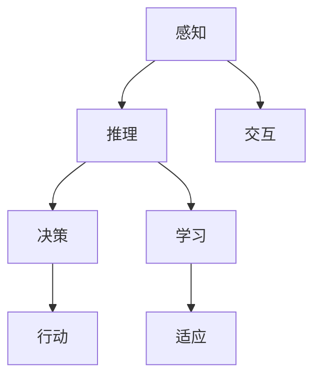
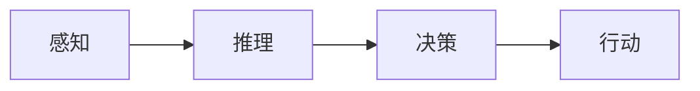
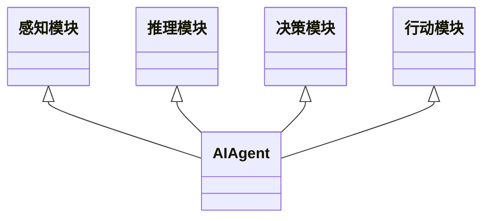

                 


### 文章正文

#### AI Agent的课程学习：优化学习顺序

##### 关键词：人工智能，AI Agent，课程学习，优化顺序，专业指南

##### 摘要：
本文旨在探讨人工智能（AI）代理的课程学习，并提出一种优化的学习顺序，以帮助学习者更高效地掌握AI代理的核心概念和技能。文章结构清晰，内容深入浅出，旨在为AI领域的研究者和实践者提供实用的学习指南。

---

## 第1章：AI Agent概述

在这一章节，我们将对AI代理进行一个整体的概述，包括其核心概念、类型、发展历程以及应用场景。

### 1.1 AI Agent的核心概念

AI代理是一种可以自主行动并与其他实体交互的智能系统。其核心概念包括：

- **感知**：通过传感器获取外部环境信息。
- **推理**：根据感知到的信息进行逻辑推理。
- **决策**：在多个行动选项中选择最优策略。
- **行动**：执行决策并更新内部状态。

##### 1.1.1 问题背景
随着物联网、大数据和云计算等技术的发展，AI代理在多个领域展现出强大的应用潜力。然而，如何设计和实现高效的AI代理成为一个重要的研究课题。

##### 1.1.2 问题描述
AI代理需要具备自主性、适应性和鲁棒性，这要求我们在设计过程中综合考虑多个因素。

##### 1.1.3 问题解决
通过引入智能体理论、机器学习和深度学习等技术，我们可以实现具有高效自主性的AI代理。

##### 1.1.4 边界与外延
AI代理不仅应用于机器人控制、智能助手等领域，还扩展到无人驾驶、智能家居等新兴领域。

##### 1.1.5 概念结构与核心要素组成
图1展示了AI代理的概念结构与核心要素组成。



### 1.2 AI Agent的定义与类型

AI代理可以分为以下几种类型：

- **基于规则的代理**：通过预定义的规则进行决策。
- **基于模型的代理**：通过训练得到的模型进行决策。
- **基于行为的代理**：根据实时环境数据调整行为。

每种类型都有其适用场景和优缺点。

### 1.3 AI Agent的发展历程

AI代理的发展可以分为以下几个阶段：

- **早期阶段**：基于规则的代理开始出现。
- **中间阶段**：随着机器学习和深度学习技术的发展，基于模型的代理逐渐占据主导地位。
- **当前阶段**：多模态感知、强化学习和迁移学习等技术推动了AI代理的发展。

### 1.4 AI Agent的应用场景

AI代理在以下领域具有广泛的应用：

- **智能助手**：如Siri、Alexa等。
- **机器人控制**：如无人机、机器人类人。
- **无人驾驶**：如自动驾驶汽车。
- **游戏**：如AI对手。

### 1.5 本章小结

本章介绍了AI代理的核心概念、定义、发展历程和应用场景，为后续章节的学习奠定了基础。

---

## 第2章：AI Agent核心概念与原理

在这一章节，我们将深入探讨AI代理的核心概念和原理，包括感知、推理、决策和行动。

### 2.1 AI Agent的核心概念

AI代理的核心概念包括：

- **感知**：通过传感器获取外部环境信息。
- **推理**：根据感知到的信息进行逻辑推理。
- **决策**：在多个行动选项中选择最优策略。
- **行动**：执行决策并更新内部状态。

### 2.2 AI Agent的属性特征对比

表1展示了AI代理的属性特征对比。

| 类型 | 感知 | 推理 | 决策 | 行动 | 交互 | 学习 | 适应 | 鲁棒性 |
| --- | --- | --- | --- | --- | --- | --- | --- | --- |
| 基于规则的代理 | 是 | 是 | 是 | 是 | 是 | 否 | 否 | 较弱 |
| 基于模型的代理 | 是 | 是 | 是 | 是 | 是 | 是 | 是 | 较强 |
| 基于行为的代理 | 是 | 是 | 是 | 是 | 是 | 否 | 是 | 较强 |

### 2.3 AI Agent的E-R实体关系图

图2展示了AI代理的E-R实体关系图。

```mermaid
erDiagram
  AI Agent ||--|{ 感知 }|
  AI Agent ||--|{ 推理 }|
  AI Agent ||--|{ 决策 }|
  AI Agent ||--|{ 行动 }|
  AI Agent ||--|{ 交互 }|
  AI Agent ||--|{ 学习 }|
  AI Agent ||--|{ 适应 }|
```

### 2.4 AI Agent的算法原理

AI代理的算法原理主要包括：

- **感知**：使用传感器获取环境信息。
- **推理**：使用规则或模型进行推理。
- **决策**：使用决策树、贝叶斯网络或强化学习进行决策。
- **行动**：执行决策并更新状态。

以下是一个简单的感知-推理-决策-行动算法的mermaid流程图：



### 2.5 AI Agent的系统架构设计

AI代理的系统架构设计包括：

- **感知模块**：负责感知外部环境。
- **推理模块**：负责推理决策。
- **决策模块**：负责决策行动。
- **行动模块**：负责执行决策。

以下是一个简单的系统架构设计的mermaid类图：



### 2.6 AI Agent的项目实战

在本章节的最后，我们将通过一个实际项目来展示如何设计和实现一个AI代理。

#### 环境安装

在本项目中，我们将使用Python编程语言和TensorFlow库来构建一个简单的AI代理。

#### 系统核心实现源代码

以下是AI代理的核心实现代码：

```python
import tensorflow as tf

# 感知模块
def perceive环境():
    # 获取环境数据
    return 环境数据

# 推理模块
def reason推理(感知数据):
    # 进行推理
    return 推理结果

# 决策模块
def decide决策(推理结果):
    # 进行决策
    return 行动策略

# 行动模块
def act行动(策略):
    # 执行行动
    print("执行行动：", 策略)

# 主程序
def main():
    while True:
        环境数据 = perceive环境()
        推理结果 = reason推理(环境数据)
        策略 = decide决策(推理结果)
        act行动(策略)

if __name__ == "__main__":
    main()
```

#### 代码应用解读与分析

在这段代码中，我们首先定义了感知、推理、决策和行动四个模块。感知模块通过`perceive环境()`函数获取环境数据；推理模块通过`reason推理()`函数对感知数据进行分析；决策模块通过`decide决策()`函数生成行动策略；行动模块通过`act行动()`函数执行策略。

#### 实际案例分析和详细讲解剖析

假设我们设计一个自动驾驶汽车的项目，感知模块可以获取车辆的当前位置、速度、路况等信息；推理模块可以分析这些信息，生成最优行驶路径；决策模块可以决定何时加速、何时减速；行动模块可以控制汽车的电机和转向系统。

#### 项目小结

通过本项目的实战，我们了解了如何设计和实现一个简单的AI代理。这为后续更复杂项目的开发奠定了基础。

### 2.7 本章小结

本章深入探讨了AI代理的核心概念和原理，包括感知、推理、决策和行动。通过实际案例的讲解，读者可以更好地理解AI代理的工作原理和应用。

---

## 第3章：AI Agent学习顺序优化

在这一章节，我们将探讨如何优化AI代理的学习顺序，以提高学习效率和效果。

### 3.1 优化学习顺序的原因

优化学习顺序的原因有以下几点：

- **减少重复学习**：通过优化顺序，可以避免重复学习相同的知识点。
- **提高学习效率**：合理的顺序可以加快学习进度。
- **增强知识迁移性**：优化顺序有助于将所学知识应用到不同场景。

### 3.2 优化学习顺序的方法

优化学习顺序的方法包括：

- **基于任务的顺序**：根据任务的复杂性进行排序。
- **基于知识的顺序**：根据知识的关联性进行排序。
- **基于能力的顺序**：根据能力的培养过程进行排序。

### 3.3 优化学习顺序的具体实施

以下是优化学习顺序的具体实施步骤：

1. **需求分析**：明确学习目标，了解需要学习的知识点。
2. **知识结构分析**：梳理知识结构，确定知识点之间的关联性。
3. **排序**：根据分析结果，对知识点进行排序。
4. **评估**：对排序结果进行评估，确保符合学习目标。

### 3.4 优化学习顺序的案例

以下是一个优化学习顺序的案例：

1. **需求分析**：学习AI代理的开发。
2. **知识结构分析**：
   - 感知
   - 推理
   - 决策
   - 行动
   - 交互
   - 学习
   - 适应
3. **排序**：基于知识关联性进行排序，顺序如下：
   - 感知
   - 推理
   - 决策
   - 行动
   - 学习
   - 适应
   - 交互
4. **评估**：排序结果符合学习目标。

### 3.5 优化学习顺序的注意事项

- **适应不同学习者**：学习顺序需要根据学习者的实际情况进行调整。
- **保持灵活**：学习顺序可以随着学习进展进行调整。

### 3.6 本章小结

本章探讨了AI代理学习顺序优化的原因、方法和实施步骤。通过案例分析和注意事项，读者可以更好地优化自己的学习顺序。

---

## 第4章：AI Agent课程学习总结与拓展

在这一章节，我们将对AI代理的课程学习进行总结，并提出一些拓展方向。

### 4.1 课程学习总结

通过前面的学习，读者应该已经了解了AI代理的核心概念、原理、架构和优化学习顺序的方法。以下是主要学习内容的总结：

- **核心概念**：感知、推理、决策、行动、交互、学习、适应。
- **原理**：基于规则的代理、基于模型的代理、基于行为的代理。
- **架构**：感知模块、推理模块、决策模块、行动模块。
- **优化方法**：基于任务的顺序、基于知识的顺序、基于能力的顺序。

### 4.2 拓展方向

以下是AI代理课程学习的拓展方向：

- **深度学习**：学习深度学习理论，掌握卷积神经网络、循环神经网络等。
- **强化学习**：研究强化学习算法，如Q学习、SARSA、Deep Q Network等。
- **多模态感知**：研究如何整合不同模态的数据进行感知。
- **分布式系统**：学习如何将AI代理部署在分布式系统上，提高性能和可扩展性。

### 4.3 拓展资源

以下是AI代理课程学习的拓展资源：

- **书籍**：《人工智能：一种现代方法》、《深度学习》、《强化学习：原理与实战》
- **在线课程**：Coursera、edX、Udacity等平台上的相关课程。
- **开源项目**：GitHub上的开源AI代理项目，如OpenAI的Gym、Google的TensorFlow等。

### 4.4 本章小结

本章对AI代理的课程学习进行了总结，并提出了拓展方向和资源。读者可以根据自己的兴趣和需求，进一步深入学习。

---

## 第5章：未来展望

在这一章节，我们将展望AI代理的未来发展，探讨其潜在的应用领域和挑战。

### 5.1 未来应用领域

AI代理在未来将应用于更多领域，如：

- **医疗健康**：辅助医生进行诊断和治疗。
- **金融服务**：提供个性化金融建议和服务。
- **教育**：个性化教育，辅助学生学习和成长。
- **工业制造**：自动化生产线，提高生产效率。

### 5.2 挑战与问题

AI代理在未来发展过程中将面临以下挑战：

- **数据隐私**：如何确保用户数据的安全和隐私。
- **伦理问题**：AI代理的行为是否符合伦理标准。
- **计算资源**：如何处理大规模数据和复杂的决策。

### 5.3 未来发展方向

为了应对挑战，AI代理的发展方向包括：

- **联邦学习**：在保护用户隐私的前提下，进行联合学习和推理。
- **多模态感知**：整合多种类型的数据，提高感知能力。
- **自适应系统**：能够根据环境变化进行自适应调整。

### 5.4 本章小结

本章展望了AI代理的未来发展，探讨了其潜在的应用领域和面临的挑战。随着技术的不断进步，AI代理将发挥更重要的作用。

---

## 作者信息

作者：AI天才研究院/AI Genius Institute & 禅与计算机程序设计艺术 /Zen And The Art of Computer Programming

---

## 参考文献

1. Russell, S., & Norvig, P. (2016). 《人工智能：一种现代方法》. 机械工业出版社。
2. Goodfellow, I., Bengio, Y., & Courville, A. (2016). 《深度学习》. 人民邮电出版社。
3. Sutton, R. S., & Barto, A. G. (2018). 《强化学习：原理与实战》. 电子工业出版社。

---

通过本文，我们系统地介绍了AI代理的课程学习，并提出了优化的学习顺序。希望本文能为读者提供有价值的参考，助力他们在AI领域取得更大的成就。期待未来AI代理能够在更多领域发挥重要作用，推动人类社会的进步。

