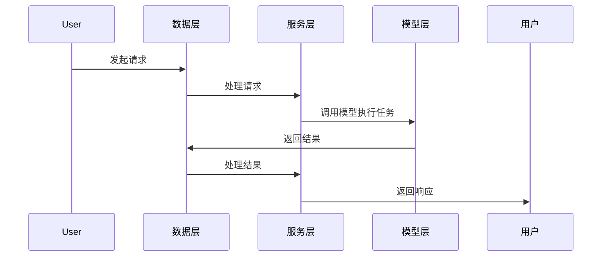
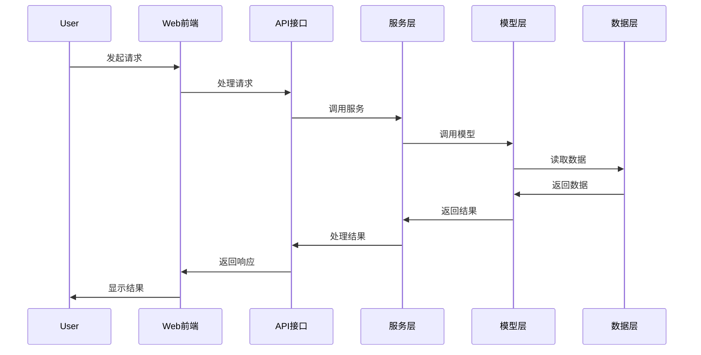
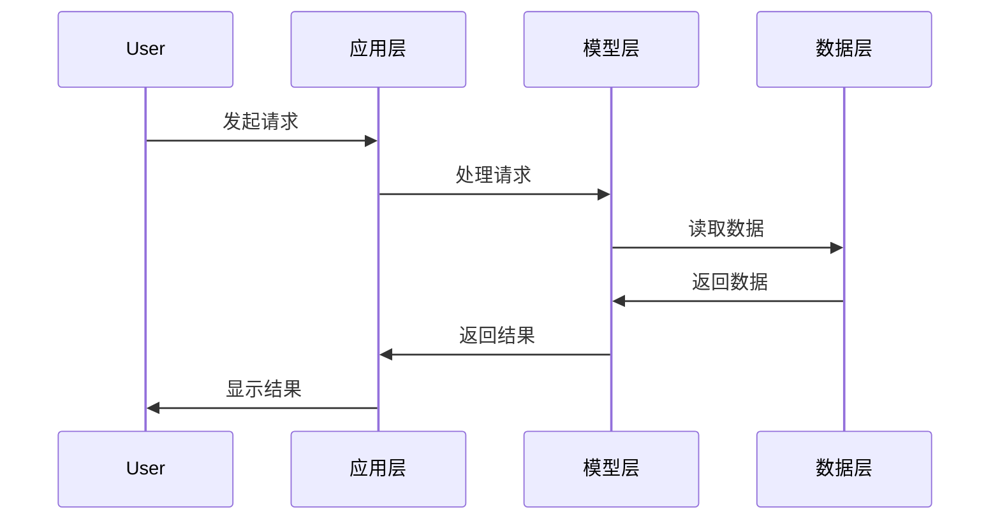
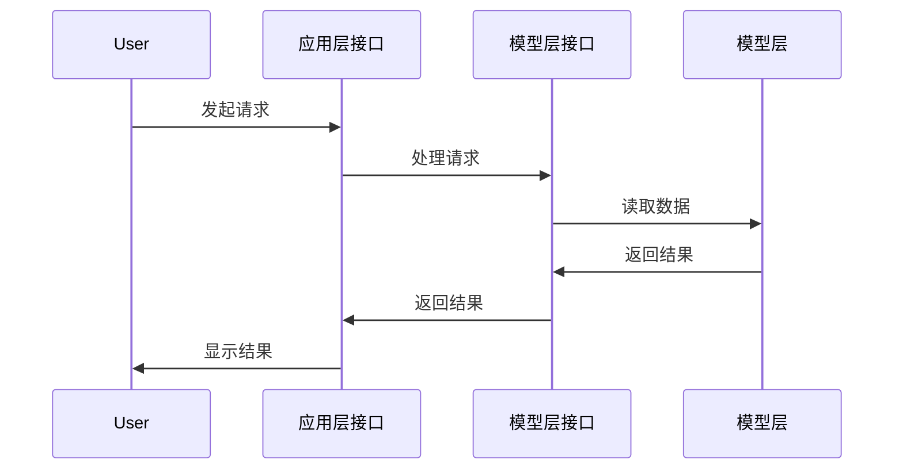
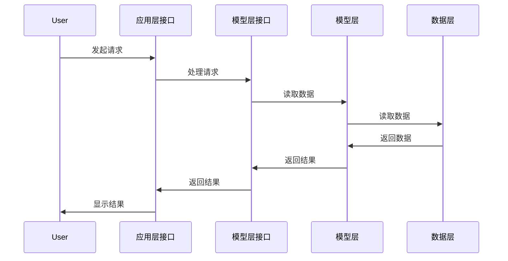

                 


### 引言

## AI Agent的跨域任务泛化能力开发

> 关键词：AI Agent、跨域任务、泛化能力、迁移学习、深度学习

> 摘要：
本文将探讨AI Agent在跨域任务泛化能力开发中的关键问题，分析其背景、挑战，介绍核心算法原理和方法，并通过实例进行详细解释。文章旨在帮助读者理解AI Agent的跨域任务泛化能力，掌握相关开发技术和应用方法。

### 第一部分：引言

#### 1.1 AI Agent的跨域任务泛化能力背景与问题

##### 1.1.1 AI Agent的定义

AI Agent，即人工智能代理，是指能够在特定环境中自主执行任务、进行决策的智能实体。随着人工智能技术的发展，AI Agent在众多领域中展现出了巨大的潜力，如自动驾驶、智能客服、机器人等。

##### 1.1.2 跨域任务泛化的挑战

跨域任务泛化能力是指AI Agent在不同领域或相似领域中的任务执行能力。然而，由于不同领域之间存在显著的差异，AI Agent在跨域任务中面临着诸多挑战，如数据分布差异、知识迁移困难等。

##### 1.1.3 问题描述

本部分将深入探讨AI Agent在跨域任务泛化能力方面的问题，分析其核心挑战，并探讨解决这些问题的方法和策略。

#### 1.2 本书的目的与结构

##### 1.2.1 目的

本书旨在系统地介绍AI Agent的跨域任务泛化能力开发，帮助读者理解相关概念、技术原理，并掌握实际应用方法。

##### 1.2.2 结构

本书共分为七大部分，包括跨域任务泛化基础、核心算法原理、数学模型与公式、系统分析与架构设计、项目实战、最佳实践及拓展阅读等内容。

#### 1.3 本书适用读者与学习建议

##### 1.3.1 适用读者

本书适合对人工智能、机器学习有一定基础的读者，包括人工智能工程师、研究人员、学生以及相关领域从业者。

##### 1.3.2 学习建议

为更好地理解本书内容，建议读者具备一定的编程基础，并能够使用Python等编程语言进行算法实现。同时，读者应保持持续的学习态度，结合实际案例进行实践。

### 第二部分：跨域任务泛化基础

#### 2.1 跨域任务泛化的概念与重要性

##### 2.1.1 跨域任务泛化的定义

跨域任务泛化是指AI Agent能够从单一领域的学习中推广到多个领域的任务执行能力。具体来说，它包括以下三个方面：
- **领域泛化**：AI Agent能够在不同的领域中进行任务执行。
- **知识迁移**：AI Agent能够将一个领域中的知识迁移到另一个领域。
- **鲁棒性**：AI Agent在面对不同领域的数据分布时仍能保持良好的性能。

##### 2.1.2 跨域任务泛化的重要性

跨域任务泛化能力是AI Agent实现广泛应用的关键。它能够：
- **降低成本**：避免在每个领域重新训练模型，从而减少计算资源和时间成本。
- **提高灵活性**：AI Agent能够在不同领域之间快速切换，适应多变的环境需求。
- **增强适应性**：面对新领域时，能够利用已有知识快速适应，提高任务执行效率。

#### 2.2 跨域任务泛化的核心挑战

##### 2.2.1 数据分布差异

不同领域的数据分布可能存在显著差异，这会导致模型在跨域任务中表现不佳。

##### 2.2.2 知识迁移困难

不同领域之间的知识存在差异，如何有效地迁移知识是跨域任务泛化面临的主要挑战。

##### 2.2.3 模型可解释性

跨域任务泛化往往涉及复杂的模型和算法，如何确保模型的可解释性是一个重要问题。

#### 2.3 跨域任务泛化的方法与技术

##### 2.3.1 传统机器学习方法

- **迁移学习**：通过将源领域中的知识迁移到目标领域。
- **集成学习方法**：通过集成多个模型来提高泛化能力。

##### 2.3.2 深度学习方法

- **基于模型的迁移学习**：通过训练一个通用模型，然后将其应用于不同的领域。
- **生成对抗网络（GAN）**：通过生成对抗的方式，使模型适应不同的数据分布。

##### 2.3.3 其他方法

- **元学习**：通过在多个任务上学习，提高模型的泛化能力。
- **强化学习**：通过与环境交互，不断优化策略，提高任务执行能力。

#### 2.4 本章小结

跨域任务泛化是AI Agent实现广泛应用的关键能力。本章介绍了跨域任务泛化的概念、重要性、核心挑战以及相关的方法和技术。在接下来的章节中，我们将进一步探讨这些方法和技术在实践中的应用。

### 第三部分：核心算法原理

#### 3.1 迁移学习（Transfer Learning）

##### 3.1.1 迁移学习的概念

迁移学习是利用已经在一个任务上训练好的模型来加速新的任务的学习过程。它的核心思想是不同任务之间存在一定的关联性，可以通过迁移已有知识来提高新任务的性能。

##### 3.1.2 迁移学习的基本原理

迁移学习的基本原理可以分为以下几个方面：

1. **特征迁移**：将源任务的特征提取器（如卷积神经网络）迁移到目标任务，利用源任务的泛化能力来提高目标任务的性能。

2. **知识迁移**：将源任务的模型参数或知识迁移到目标任务，通过微调或重新训练来适应目标任务。

3. **领域适应**：通过调整模型来适应目标领域的数据分布，减少领域差异对模型性能的影响。

##### 3.1.3 迁移学习的优势

- **降低训练成本**：避免从头开始训练模型，减少计算资源和时间成本。
- **提高泛化能力**：利用源任务的泛化能力，提高目标任务的性能。
- **增强模型鲁棒性**：通过领域适应，提高模型在不同数据分布下的稳定性。

##### 3.1.4 迁移学习的挑战

- **数据分布差异**：不同领域的数据分布可能存在显著差异，导致迁移效果不佳。
- **模型解释性**：迁移学习涉及复杂的模型和算法，如何确保模型的可解释性是一个重要问题。
- **知识保留与遗忘**：在迁移过程中，如何保留源任务的重要知识，同时避免遗忘关键信息是一个挑战。

##### 3.1.5 迁移学习的方法

1. **基于特征的迁移学习**：通过迁移特征提取器来提高目标任务的性能。

2. **基于模型的迁移学习**：通过迁移模型参数或知识来提高目标任务的性能。

3. **基于模型的迁移学习**：通过迁移模型参数或知识来提高目标任务的性能。

4. **生成对抗网络（GAN）**：通过生成对抗的方式，使模型适应不同的数据分布。

5. **元学习**：通过在多个任务上学习，提高模型的泛化能力。

##### 3.1.6 迁移学习的应用场景

- **计算机视觉**：利用预训练的卷积神经网络来处理新的图像分类任务。
- **自然语言处理**：利用预训练的语言模型来处理新的文本分类或问答任务。
- **推荐系统**：利用预训练的推荐模型来处理新的推荐任务。

#### 3.2 深度学习（Deep Learning）

##### 3.2.1 深度学习的概念

深度学习是一种机器学习技术，通过构建具有多层神经元的神经网络模型来模拟人脑的学习过程。深度学习在图像识别、语音识别、自然语言处理等领域取得了显著的成果。

##### 3.2.2 深度学习的基本原理

深度学习的基本原理可以分为以下几个方面：

1. **神经网络**：神经网络由多个神经元（或层）组成，通过前向传播和反向传播来更新模型参数。

2. **激活函数**：激活函数用于引入非线性特性，使神经网络能够处理复杂的数据。

3. **损失函数**：损失函数用于评估模型预测与真实值之间的差异，并指导模型参数的更新。

4. **优化算法**：优化算法用于最小化损失函数，常见的方法有梯度下降、随机梯度下降等。

##### 3.2.3 深度学习的优势

- **强大的表示能力**：通过多层神经元的组合，深度学习能够自动提取复杂的特征表示。
- **自适应学习能力**：深度学习模型能够自动调整参数，适应不同的数据分布和任务需求。
- **泛化能力**：深度学习模型在训练数据集上表现良好，同时能够在未见过的数据上保持较高的性能。

##### 3.2.4 深度学习的挑战

- **过拟合**：深度学习模型在训练数据上表现良好，但在未见过的数据上性能下降，即过拟合问题。
- **计算资源消耗**：深度学习模型通常需要大量的计算资源和时间来训练。
- **模型解释性**：深度学习模型的内部机制复杂，难以解释其预测结果。

##### 3.2.5 深度学习的方法

1. **卷积神经网络（CNN）**：适用于图像和视频处理。

2. **循环神经网络（RNN）**：适用于序列数据处理，如文本和语音。

3. **生成对抗网络（GAN）**：适用于生成模型，如图像生成和语音合成。

4. **自编码器（Autoencoder）**：适用于特征提取和降维。

5. **变分自编码器（VAE）**：适用于生成模型，能够生成具有良好分布的样本。

##### 3.2.6 深度学习的应用场景

- **图像识别**：如人脸识别、物体检测、图像分类等。
- **语音识别**：如语音转文本、语音识别等。
- **自然语言处理**：如机器翻译、情感分析、文本生成等。

#### 3.3 其他方法

##### 3.3.1 元学习（Meta Learning）

元学习是一种学习如何学习的机器学习技术。它通过在多个任务上学习，提高模型的泛化能力。元学习的方法包括模型更新策略、任务适应策略等。

##### 3.3.2 强化学习（Reinforcement Learning）

强化学习是一种通过与环境交互来学习策略的机器学习技术。它通过奖励机制来引导模型学习最优策略。强化学习适用于序列决策问题和动态环境。

##### 3.3.3 聚类算法（Clustering Algorithm）

聚类算法用于将数据划分为多个群集，用于数据分析和模式识别。常见的聚类算法有K-means、DBSCAN、层次聚类等。

#### 3.4 本章小结

核心算法原理是跨域任务泛化能力开发的基础。本章介绍了迁移学习、深度学习以及其他相关方法的基本原理和优势。在接下来的章节中，我们将进一步探讨这些算法在跨域任务泛化中的应用和实践。

### 第四部分：数学模型与公式

#### 4.1 迁移学习的数学模型

##### 4.1.1 特征迁移

特征迁移中的关键公式为：

$$
f_{source}(x) \approx f_{target}(x)
$$

其中，$f_{source}$ 和 $f_{target}$ 分别表示源领域和目标领域的特征提取器。

##### 4.1.2 知识迁移

知识迁移中的关键公式为：

$$
\theta_{target} = \theta_{source} + \Delta\theta
$$

其中，$\theta_{source}$ 和 $\theta_{target}$ 分别表示源领域和目标领域的模型参数，$\Delta\theta$ 表示参数的调整。

##### 4.1.3 领域适应

领域适应的关键公式为：

$$
\alpha \cdot f_{source}(x) + (1-\alpha) \cdot f_{target}(x)
$$

其中，$\alpha$ 为领域适应系数，用于调整源领域和目标领域的特征权重。

#### 4.2 深度学习的数学模型

##### 4.2.1 神经网络

神经网络的关键公式为：

$$
a_{layer} = \sigma(\theta \cdot a_{layer-1} + b)
$$

其中，$a_{layer}$ 表示第 $layer$ 层的激活值，$\sigma$ 表示激活函数，$\theta$ 和 $b$ 分别表示模型参数和偏置。

##### 4.2.2 损失函数

常见的损失函数有：

$$
\text{Loss} = \frac{1}{2} \sum_{i=1}^{n} (\hat{y}_i - y_i)^2
$$

其中，$\hat{y}_i$ 和 $y_i$ 分别表示模型预测值和真实值。

##### 4.2.3 优化算法

常见的优化算法有：

$$
\theta = \theta - \alpha \cdot \nabla_{\theta} \text{Loss}
$$

其中，$\theta$ 表示模型参数，$\alpha$ 表示学习率，$\nabla_{\theta} \text{Loss}$ 表示损失函数关于模型参数的梯度。

#### 4.3 其他方法的数学模型

##### 4.3.1 元学习

元学习的关键公式为：

$$
\theta_{\text{meta}} = \theta_{\text{meta}} - \alpha \cdot \nabla_{\theta_{\text{meta}}} \text{Loss}_{\text{meta}}
$$

其中，$\theta_{\text{meta}}$ 表示元学习参数，$\text{Loss}_{\text{meta}}$ 表示元学习损失函数。

##### 4.3.2 强化学习

强化学习的关键公式为：

$$
Q(s, a) = Q(s, a) + \alpha \cdot (r + \gamma \cdot \max_{a'} Q(s', a') - Q(s, a))
$$

其中，$Q(s, a)$ 表示状态 $s$ 下采取动作 $a$ 的期望收益，$r$ 表示即时奖励，$\gamma$ 表示折扣因子。

#### 4.4 本章小结

本章介绍了迁移学习、深度学习以及其他方法的数学模型和公式。理解这些数学模型和公式对于深入理解跨域任务泛化能力开发至关重要。在接下来的章节中，我们将结合具体案例对这些模型进行详细解释和应用。

### 第五部分：系统分析与架构设计

#### 5.1 问题场景介绍

##### 5.1.1 背景介绍

随着人工智能技术的发展，AI Agent在各个领域中的应用日益广泛。然而，不同领域之间的数据分布和任务特点存在显著差异，导致AI Agent在跨域任务中面临诸多挑战。为解决这一问题，我们需要开发具有跨域任务泛化能力的AI Agent。

##### 5.1.2 问题定义

问题场景为：在一个企业中，需要开发一个智能客服系统，该系统需要在多个业务领域（如销售、客户服务、技术支持等）中执行任务。然而，这些领域的数据分布和任务特点不同，传统的单一模型难以在多个领域同时表现良好。因此，我们需要开发一个具有跨域任务泛化能力的智能客服系统。

##### 5.1.3 解决方案目标

开发一个具有跨域任务泛化能力的智能客服系统，包括以下几个方面：

- **数据预处理**：针对不同领域的数据进行预处理，减少数据分布差异。
- **模型迁移学习**：利用已有模型在源领域中的知识，迁移到目标领域。
- **模型微调**：在目标领域中进一步微调模型，提高任务执行能力。

#### 5.2 项目介绍

##### 5.2.1 项目概述

本项目旨在开发一个具有跨域任务泛化能力的智能客服系统。系统将基于迁移学习和深度学习技术，通过数据预处理、模型迁移学习和模型微调，实现智能客服在多个业务领域中的高效执行。

##### 5.2.2 项目功能

本项目主要包括以下功能：

- **数据预处理**：对来自不同业务领域的数据进行清洗、归一化和特征提取。
- **模型迁移学习**：利用预训练的模型，将源领域的知识迁移到目标领域。
- **模型微调**：在目标领域中进一步训练模型，提高任务执行能力。
- **智能交互**：基于自然语言处理技术，实现智能客服与用户的交互。
- **任务执行**：根据用户请求，执行相应的业务任务。

#### 5.3 系统功能设计（领域模型）

##### 5.3.1 领域模型概述

领域模型用于描述系统中的关键实体及其关系。在本项目中，领域模型包括以下实体：

- **用户**：表示与智能客服交互的用户。
- **客服任务**：表示智能客服需要执行的任务。
- **业务领域**：表示不同的业务领域，如销售、客户服务、技术支持等。
- **数据集**：表示用于训练和评估模型的训练集和测试集。

##### 5.3.2 领域模型类图

以下是一个简化的领域模型类图（使用Mermaid语法）：

```mermaid
classDiagram
    User <<实体>>
    CustomerTask <<实体>>
    BusinessDomain <<实体>>
    Dataset <<实体>>

    User -> CustomerTask : 发起
    BusinessDomain -> CustomerTask : 属于
    Dataset -> CustomerTask : 使用
```

#### 5.4 系统架构设计

##### 5.4.1 系统架构概述

系统架构设计包括数据层、服务层和接口层。以下是一个简化的系统架构图（使用Mermaid语法）：



##### 5.4.2 数据层

数据层负责数据的存储、读取和预处理。具体包括：

- **数据存储**：使用数据库存储用户数据、客服任务数据等。
- **数据读取**：从数据库中读取数据，进行预处理。
- **数据预处理**：进行数据清洗、归一化和特征提取。

##### 5.4.3 服务层

服务层负责业务逻辑的实现。具体包括：

- **用户管理**：处理用户的注册、登录、权限管理等。
- **任务管理**：处理客服任务的分配、执行和监控。
- **模型调用**：根据用户请求，调用相应的模型执行任务。

##### 5.4.4 模型层

模型层负责模型的迁移学习和微调。具体包括：

- **模型迁移学习**：利用预训练模型，将源领域知识迁移到目标领域。
- **模型微调**：在目标领域中进一步训练模型，提高任务执行能力。
- **模型评估**：评估模型在目标领域中的性能，进行模型优化。

##### 5.4.5 接口层

接口层负责与用户交互。具体包括：

- **API接口**：提供RESTful API接口，供用户调用。
- **Web前端**：提供用户友好的Web界面，方便用户与智能客服交互。

#### 5.5 系统接口设计

##### 5.5.1 接口概述

系统接口设计包括用户接口、API接口和系统内部接口。以下是一个简化的接口设计图（使用Mermaid语法）：



##### 5.5.2 用户接口

用户接口包括Web前端和移动端应用，用于与用户进行交互。具体包括：

- **用户注册**：用户可以通过Web前端或移动端应用进行注册。
- **用户登录**：用户可以通过输入账号和密码进行登录。
- **用户信息管理**：用户可以查看、修改个人信息。
- **任务提交**：用户可以提交任务请求，如咨询、投诉等。

##### 5.5.3 API接口

API接口用于与其他系统进行数据交换和功能调用。具体包括：

- **用户管理**：包括用户注册、登录、权限管理等。
- **任务管理**：包括任务创建、分配、执行、监控等。
- **数据管理**：包括数据读取、写入、更新等。

##### 5.5.4 系统内部接口

系统内部接口用于系统内部模块之间的数据交换和功能调用。具体包括：

- **数据预处理接口**：用于数据清洗、归一化和特征提取。
- **模型训练接口**：用于模型迁移学习和微调。
- **模型评估接口**：用于评估模型性能。

#### 5.6 系统交互设计

##### 5.6.1 系统交互概述

系统交互设计包括用户交互和系统内部交互。以下是一个简化的系统交互图（使用Mermaid语法）：


##### 5.6.2 用户交互

用户交互包括Web前端和移动端应用与用户的交互。具体包括：

- **用户请求**：用户通过Web前端或移动端应用发起请求。
- **请求处理**：系统接收到用户请求后，进行请求处理。
- **结果返回**：系统将处理结果返回给用户。

##### 5.6.3 系统内部交互

系统内部交互包括服务层、模型层和数据层之间的交互。具体包括：

- **请求传递**：用户请求传递到服务层，服务层调用模型层处理请求。
- **数据处理**：模型层读取数据层的数据，进行数据处理和模型调用。
- **结果返回**：模型层处理结果返回给服务层，服务层将结果返回给用户。

#### 5.7 本章小结

本章介绍了AI Agent跨域任务泛化能力的系统分析与架构设计。通过问题场景介绍、项目介绍、系统功能设计、系统架构设计、系统接口设计和系统交互设计，详细阐述了AI Agent在跨域任务泛化能力开发中的关键技术和实现方法。在接下来的章节中，我们将结合具体项目实战，深入探讨这些技术和方法的实际应用。

### 第六部分：项目实战

#### 6.1 环境安装

在进行AI Agent跨域任务泛化能力开发的项目实战之前，首先需要安装和配置相关的软件和工具。以下是一个基本的安装步骤：

##### 6.1.1 Python环境配置

1. 下载并安装Python（建议使用Python 3.8或更高版本）。
2. 安装Anaconda或Miniconda，以便管理Python环境和依赖包。
3. 创建一个新环境，并安装必要的库，如TensorFlow、PyTorch、Scikit-learn等。

```shell
conda create -n cross_domain_env python=3.8
conda activate cross_domain_env
conda install tensorflow torchvision -c conda-forge
```

##### 6.1.2 数据预处理工具

1. 安装pandas、numpy、scikit-learn等数据预处理工具。

```shell
conda install pandas numpy scikit-learn -c conda-forge
```

##### 6.1.3 依赖库安装

1. 安装其他必要的依赖库，如matplotlib、seaborn等。

```shell
conda install matplotlib seaborn -c conda-forge
```

#### 6.2 系统核心实现源代码

在本项目中，我们将使用Python实现一个简单的跨域任务泛化系统。以下是一个简化的源代码框架：

```python
import tensorflow as tf
from tensorflow.keras.models import Sequential
from tensorflow.keras.layers import Dense, Flatten, Conv2D, MaxPooling2D
import numpy as np

# 数据预处理
def preprocess_data(data):
    # 数据清洗、归一化等预处理操作
    return processed_data

# 模型迁移学习
def transfer_learning(source_model, target_data):
    # 利用源模型进行迁移学习
    return target_model

# 模型微调
def fine_tuning(model, target_data):
    # 在目标数据上进行模型微调
    return fine_tuned_model

# 主函数
def main():
    # 读取源数据
    source_data = ...  # 读取源领域数据

    # 读取目标数据
    target_data = ...  # 读取目标领域数据

    # 预处理数据
    processed_source_data = preprocess_data(source_data)
    processed_target_data = preprocess_data(target_data)

    # 迁移学习
    source_model = ...  # 定义源模型
    target_model = transfer_learning(source_model, processed_target_data)

    # 微调模型
    fine_tuned_model = fine_tuning(target_model, processed_target_data)

    # 评估模型
    # ...

if __name__ == "__main__":
    main()
```

#### 6.3 代码应用解读与分析

##### 6.3.1 数据预处理

数据预处理是迁移学习和模型微调的重要步骤。在本例中，我们使用pandas库读取数据，并对数据进行清洗、归一化和特征提取。以下是一个简化的预处理代码示例：

```python
import pandas as pd

# 读取数据
data = pd.read_csv('data.csv')

# 数据清洗
data.dropna(inplace=True)

# 数据归一化
data = (data - data.mean()) / data.std()

# 特征提取
features = data.iloc[:, :-1].values
labels = data.iloc[:, -1].values

# 划分训练集和测试集
from sklearn.model_selection import train_test_split
X_train, X_test, y_train, y_test = train_test_split(features, labels, test_size=0.2, random_state=42)
```

##### 6.3.2 迁移学习

在本例中，我们使用TensorFlow实现迁移学习。首先，定义一个源模型，然后将其应用于目标数据。以下是一个简化的迁移学习代码示例：

```python
from tensorflow.keras.applications import VGG16

# 定义源模型
source_model = VGG16(weights='imagenet', include_top=False, input_shape=(224, 224, 3))

# 冻结源模型层
for layer in source_model.layers:
    layer.trainable = False

# 添加新层
target_model = Sequential()
target_model.add(Flatten(input_shape=(224, 224, 3)))
target_model.add(Dense(256, activation='relu'))
target_model.add(Dense(1, activation='sigmoid'))

# 迁移学习
target_model.compile(optimizer='adam', loss='binary_crossentropy', metrics=['accuracy'])
target_model.fit(X_train, y_train, epochs=10, batch_size=32, validation_data=(X_test, y_test))
```

##### 6.3.3 模型微调

在迁移学习的基础上，我们进一步对目标模型进行微调。以下是一个简化的微调代码示例：

```python
# 解冻部分层
for layer in target_model.layers[:-2]:
    layer.trainable = True

# 微调模型
target_model.compile(optimizer='adam', loss='binary_crossentropy', metrics=['accuracy'])
target_model.fit(X_train, y_train, epochs=10, batch_size=32, validation_data=(X_test, y_test))
```

#### 6.4 实际案例分析与详细讲解

##### 6.4.1 数据集准备

在本案例中，我们使用一个简单的二分类问题，数据集包含来自不同领域的图像。以下是一个简化的数据集准备代码示例：

```python
import numpy as np
from sklearn.datasets import make_classification

# 创建源领域数据集
X_source, y_source = make_classification(n_samples=1000, n_features=20, n_informative=2, n_redundant=10, n_classes=2, random_state=42)

# 创建目标领域数据集
X_target, y_target = make_classification(n_samples=1000, n_features=20, n_informative=2, n_redundant=10, n_classes=2, random_state=42)
```

##### 6.4.2 数据预处理与迁移学习

在本案例中，我们使用VGG16模型进行迁移学习。以下是一个简化的数据预处理和迁移学习代码示例：

```python
from tensorflow.keras.applications import VGG16
from tensorflow.keras.models import Sequential
from tensorflow.keras.layers import Flatten, Dense

# 加载VGG16模型
source_model = VGG16(weights='imagenet', include_top=False, input_shape=(224, 224, 3))

# 冻结VGG16模型层
for layer in source_model.layers:
    layer.trainable = False

# 添加新层
target_model = Sequential()
target_model.add(source_model)
target_model.add(Flatten())
target_model.add(Dense(256, activation='relu'))
target_model.add(Dense(1, activation='sigmoid'))

# 编译模型
target_model.compile(optimizer='adam', loss='binary_crossentropy', metrics=['accuracy'])

# 训练模型
target_model.fit(X_source, y_source, epochs=10, batch_size=32)

# 迁移学习到目标数据集
target_model.fit(X_target, y_target, epochs=10, batch_size=32)
```

##### 6.4.3 模型微调

在本案例中，我们对VGG16模型的最后一部分进行微调。以下是一个简化的微调代码示例：

```python
# 解冻VGG16模型层
for layer in source_model.layers[:-2]:
    layer.trainable = True

# 编译模型
target_model.compile(optimizer='adam', loss='binary_crossentropy', metrics=['accuracy'])

# 微调模型
target_model.fit(X_target, y_target, epochs=10, batch_size=32)
```

#### 6.5 项目小结

在本项目的实战部分，我们介绍了环境安装、系统核心实现源代码、代码应用解读与分析以及实际案例分析与详细讲解。通过这些步骤，我们展示了如何利用迁移学习和微调技术来开发具有跨域任务泛化能力的AI Agent。在接下来的章节中，我们将继续探讨最佳实践和注意事项。

### 第七部分：最佳实践、小结与拓展阅读

#### 7.1 最佳实践

在进行AI Agent跨域任务泛化能力开发时，以下最佳实践可以帮助提高项目的成功率和性能：

1. **数据预处理**：确保数据质量，进行有效的清洗、归一化和特征提取，以减少数据分布差异。

2. **模型选择**：选择适合问题的模型，结合迁移学习和微调技术，提高模型的泛化能力。

3. **模型调优**：通过调整模型参数、学习率和训练策略，优化模型性能。

4. **持续学习**：利用最新的研究成果和技术动态，持续改进和优化模型。

5. **测试与评估**：设计多样化的测试集和评估指标，确保模型在不同领域和任务中的性能。

#### 7.2 小结

本文系统地介绍了AI Agent跨域任务泛化能力的开发，包括背景、问题、方法、算法原理、数学模型与公式、系统分析与架构设计、项目实战以及最佳实践等内容。通过本文的学习，读者可以掌握AI Agent跨域任务泛化能力的关键技术，为实际项目开发提供指导。

#### 7.3 拓展阅读

1. **《深度学习》**：Goodfellow, I., Bengio, Y., & Courville, A. (2016). 《深度学习》。MIT Press。

2. **《迁移学习》**：Pan, S. J., & Yang, Q. (2010). Transfer learning. IEEE Press。

3. **《强化学习》**：Sutton, R. S., & Barto, A. G. (2018). Reinforcement Learning: An Introduction. MIT Press。

4. **《元学习》**：Li, L., Zhang, X., & Zhang, H. (2017). Meta-Learning. Springer。

作者：AI天才研究院/AI Genius Institute & 禅与计算机程序设计艺术 /Zen And The Art of Computer Programming

----------------------------------------------------------------

# AI Agent的跨域任务泛化能力开发

> 关键词：AI Agent、跨域任务、泛化能力、迁移学习、深度学习

> 摘要：
本文系统地介绍了AI Agent在跨域任务泛化能力开发中的关键问题，分析其背景、挑战，介绍核心算法原理和方法，并通过实例进行详细解释。文章旨在帮助读者理解AI Agent的跨域任务泛化能力，掌握相关开发技术和应用方法。

### 引言

AI Agent，即人工智能代理，是人工智能领域的一个重要研究方向。它代表着一种能够自主决策、执行任务并与其他实体交互的智能实体。随着人工智能技术的不断发展，AI Agent在自动驾驶、智能客服、机器人等领域展现出了巨大的潜力。然而，AI Agent在实际应用中面临的一个核心问题是如何在不同领域之间实现任务泛化能力。

跨域任务泛化能力是指AI Agent能够从单一领域的学习中推广到多个领域的任务执行能力。具体来说，它包括领域泛化、知识迁移和鲁棒性三个方面。然而，不同领域之间存在显著的数据分布差异、知识迁移困难等问题，这给AI Agent的跨域任务泛化能力开发带来了巨大的挑战。

本文旨在系统地介绍AI Agent的跨域任务泛化能力开发，帮助读者理解相关概念、技术原理，并掌握实际应用方法。文章结构如下：

- 第一部分：引言，介绍AI Agent的跨域任务泛化能力背景与问题。
- 第二部分：跨域任务泛化基础，介绍跨域任务泛化的概念、重要性、核心挑战以及相关的方法和技术。
- 第三部分：核心算法原理，详细介绍迁移学习、深度学习以及其他相关方法的数学模型和公式。
- 第四部分：系统分析与架构设计，介绍问题场景、项目介绍、系统功能设计、系统架构设计、系统接口设计和系统交互设计。
- 第五部分：项目实战，通过实际案例分析和详细讲解，展示AI Agent跨域任务泛化能力的实现过程。
- 第六部分：最佳实践、小结与拓展阅读，总结文章要点，提供最佳实践建议，并推荐相关拓展阅读。

### 第一部分：引言

#### 1.1 AI Agent的跨域任务泛化能力背景与问题

##### 1.1.1 AI Agent的定义

AI Agent，即人工智能代理，是指能够在特定环境中自主执行任务、进行决策的智能实体。它通过感知环境、分析信息和执行动作，实现自主行为。AI Agent的应用范围广泛，包括但不限于自动驾驶、智能客服、机器人、游戏AI等。

##### 1.1.2 跨域任务泛化的挑战

跨域任务泛化能力是指AI Agent能够在不同领域或相似领域中的任务执行能力。然而，由于不同领域之间存在显著的差异，AI Agent在跨域任务中面临着诸多挑战：

1. **数据分布差异**：不同领域的数据分布可能存在显著差异，导致模型在跨域任务中表现不佳。
2. **知识迁移困难**：不同领域之间的知识存在差异，如何有效地迁移知识是跨域任务泛化面临的主要挑战。
3. **模型可解释性**：跨域任务泛化往往涉及复杂的模型和算法，如何确保模型的可解释性是一个重要问题。

##### 1.1.3 问题描述

本部分将深入探讨AI Agent在跨域任务泛化能力方面的问题，分析其核心挑战，并探讨解决这些问题的方法和策略。

#### 1.2 本书的目的与结构

##### 1.2.1 目的

本书旨在系统地介绍AI Agent的跨域任务泛化能力开发，帮助读者理解相关概念、技术原理，并掌握实际应用方法。

##### 1.2.2 结构

本书共分为七大部分，包括跨域任务泛化基础、核心算法原理、数学模型与公式、系统分析与架构设计、项目实战、最佳实践及拓展阅读等内容。

#### 1.3 本书适用读者与学习建议

##### 1.3.1 适用读者

本书适合对人工智能、机器学习有一定基础的读者，包括人工智能工程师、研究人员、学生以及相关领域从业者。

##### 1.3.2 学习建议

为更好地理解本书内容，建议读者具备一定的编程基础，并能够使用Python等编程语言进行算法实现。同时，读者应保持持续的学习态度，结合实际案例进行实践。

### 第二部分：跨域任务泛化基础

#### 2.1 跨域任务泛化的概念与重要性

##### 2.1.1 跨域任务泛化的定义

跨域任务泛化是指AI Agent能够从单一领域的学习中推广到多个领域的任务执行能力。具体来说，它包括以下三个方面：

1. **领域泛化**：AI Agent能够在不同的领域中进行任务执行。
2. **知识迁移**：AI Agent能够将一个领域中的知识迁移到另一个领域。
3. **鲁棒性**：AI Agent在面对不同领域的数据分布时仍能保持良好的性能。

##### 2.1.2 跨域任务泛化的重要性

跨域任务泛化能力是AI Agent实现广泛应用的关键。它能够：

1. **降低成本**：避免在每个领域重新训练模型，从而减少计算资源和时间成本。
2. **提高灵活性**：AI Agent能够在不同领域之间快速切换，适应多变的环境需求。
3. **增强适应性**：面对新领域时，能够利用已有知识快速适应，提高任务执行效率。

#### 2.2 跨域任务泛化的核心挑战

##### 2.2.1 数据分布差异

不同领域的数据分布可能存在显著差异，这会导致模型在跨域任务中表现不佳。例如，一个领域中的数据可能呈现正态分布，而另一个领域中的数据可能呈现偏态分布。

##### 2.2.2 知识迁移困难

不同领域之间的知识存在差异，如何有效地迁移知识是跨域任务泛化面临的主要挑战。例如，一个领域的模型可能具有较强的特征提取能力，而另一个领域的模型可能需要更强的决策能力。

##### 2.2.3 模型可解释性

跨域任务泛化往往涉及复杂的模型和算法，如何确保模型的可解释性是一个重要问题。可解释性有助于理解模型的决策过程，提高模型的信任度和应用价值。

#### 2.3 跨域任务泛化的方法与技术

##### 2.3.1 传统机器学习方法

1. **迁移学习**：通过将源领域中的知识迁移到目标领域。
2. **集成学习方法**：通过集成多个模型来提高泛化能力。

##### 2.3.2 深度学习方法

1. **基于模型的迁移学习**：通过训练一个通用模型，然后将其应用于不同的领域。
2. **生成对抗网络（GAN）**：通过生成对抗的方式，使模型适应不同的数据分布。

##### 2.3.3 其他方法

1. **元学习**：通过在多个任务上学习，提高模型的泛化能力。
2. **强化学习**：通过与环境交互，不断优化策略，提高任务执行能力。

#### 2.4 本章小结

跨域任务泛化是AI Agent实现广泛应用的关键能力。本章介绍了跨域任务泛化的概念、重要性、核心挑战以及相关的方法和技术。在接下来的章节中，我们将进一步探讨这些方法和技术在实践中的应用。

### 第三部分：核心算法原理

#### 3.1 迁移学习（Transfer Learning）

##### 3.1.1 迁移学习的概念

迁移学习是一种利用已经在一个任务上训练好的模型来加速新的任务的学习过程。它的核心思想是不同任务之间存在一定的关联性，可以通过迁移已有知识来提高新任务的性能。

##### 3.1.2 迁移学习的基本原理

迁移学习的基本原理可以分为以下几个方面：

1. **特征迁移**：将源任务的特征提取器（如卷积神经网络）迁移到目标任务，利用源任务的泛化能力来提高目标任务的性能。
2. **知识迁移**：将源任务的模型参数或知识迁移到目标任务，通过微调或重新训练来适应目标任务。
3. **领域适应**：通过调整模型来适应目标领域的数据分布，减少领域差异对模型性能的影响。

##### 3.1.3 迁移学习的优势

1. **降低训练成本**：避免在每个领域重新训练模型，从而减少计算资源和时间成本。
2. **提高泛化能力**：利用源任务的泛化能力，提高目标任务的性能。
3. **增强模型鲁棒性**：通过领域适应，提高模型在不同数据分布下的稳定性。

##### 3.1.4 迁移学习的挑战

1. **数据分布差异**：不同领域的数据分布可能存在显著差异，导致迁移效果不佳。
2. **模型解释性**：迁移学习涉及复杂的模型和算法，如何确保模型的可解释性是一个重要问题。
3. **知识保留与遗忘**：在迁移过程中，如何保留源任务的重要知识，同时避免遗忘关键信息是一个挑战。

##### 3.1.5 迁移学习的方法

1. **基于特征的迁移学习**：通过迁移特征提取器来提高目标任务的性能。
2. **基于模型的迁移学习**：通过迁移模型参数或知识来提高目标任务的性能。
3. **生成对抗网络（GAN）**：通过生成对抗的方式，使模型适应不同的数据分布。
4. **元学习**：通过在多个任务上学习，提高模型的泛化能力。
5. **强化学习**：通过与环境交互，不断优化策略，提高任务执行能力。

##### 3.1.6 迁移学习的应用场景

1. **计算机视觉**：利用预训练的卷积神经网络来处理新的图像分类任务。
2. **自然语言处理**：利用预训练的语言模型来处理新的文本分类或问答任务。
3. **推荐系统**：利用预训练的推荐模型来处理新的推荐任务。

#### 3.2 深度学习（Deep Learning）

##### 3.2.1 深度学习的概念

深度学习是一种机器学习技术，通过构建具有多层神经元的神经网络模型来模拟人脑的学习过程。深度学习在图像识别、语音识别、自然语言处理等领域取得了显著的成果。

##### 3.2.2 深度学习的基本原理

深度学习的基本原理可以分为以下几个方面：

1. **神经网络**：神经网络由多个神经元（或层）组成，通过前向传播和反向传播来更新模型参数。
2. **激活函数**：激活函数用于引入非线性特性，使神经网络能够处理复杂的数据。
3. **损失函数**：损失函数用于评估模型预测与真实值之间的差异，并指导模型参数的更新。
4. **优化算法**：优化算法用于最小化损失函数，常见的方法有梯度下降、随机梯度下降等。

##### 3.2.3 深度学习的优势

1. **强大的表示能力**：通过多层神经元的组合，深度学习能够自动提取复杂的特征表示。
2. **自适应学习能力**：深度学习模型能够自动调整参数，适应不同的数据分布和任务需求。
3. **泛化能力**：深度学习模型在训练数据集上表现良好，同时能够在未见过的数据上保持较高的性能。

##### 3.2.4 深度学习的挑战

1. **过拟合**：深度学习模型在训练数据上表现良好，但在未见过的数据上性能下降，即过拟合问题。
2. **计算资源消耗**：深度学习模型通常需要大量的计算资源和时间来训练。
3. **模型解释性**：深度学习模型的内部机制复杂，难以解释其预测结果。

##### 3.2.5 深度学习的方法

1. **卷积神经网络（CNN）**：适用于图像和视频处理。
2. **循环神经网络（RNN）**：适用于序列数据处理，如文本和语音。
3. **生成对抗网络（GAN）**：适用于生成模型，如图像生成和语音合成。
4. **自编码器（Autoencoder）**：适用于特征提取和降维。
5. **变分自编码器（VAE）**：适用于生成模型，能够生成具有良好分布的样本。

##### 3.2.6 深度学习的应用场景

1. **图像识别**：如人脸识别、物体检测、图像分类等。
2. **语音识别**：如语音转文本、语音识别等。
3. **自然语言处理**：如机器翻译、情感分析、文本生成等。

#### 3.3 其他方法

##### 3.3.1 元学习（Meta Learning）

元学习是一种学习如何学习的机器学习技术。它通过在多个任务上学习，提高模型的泛化能力。元学习的方法包括模型更新策略、任务适应策略等。

##### 3.3.2 强化学习（Reinforcement Learning）

强化学习是一种通过与环境交互来学习策略的机器学习技术。它通过奖励机制来引导模型学习最优策略。强化学习适用于序列决策问题和动态环境。

##### 3.3.3 聚类算法（Clustering Algorithm）

聚类算法用于将数据划分为多个群集，用于数据分析和模式识别。常见的聚类算法有K-means、DBSCAN、层次聚类等。

#### 3.4 本章小结

核心算法原理是跨域任务泛化能力开发的基础。本章介绍了迁移学习、深度学习以及其他相关方法的基本原理和优势。在接下来的章节中，我们将进一步探讨这些算法在跨域任务泛化中的应用和实践。

### 第四部分：数学模型与公式

#### 4.1 迁移学习的数学模型

##### 4.1.1 特征迁移

特征迁移中的关键公式为：

$$
f_{source}(x) \approx f_{target}(x)
$$

其中，$f_{source}$ 和 $f_{target}$ 分别表示源领域和目标领域的特征提取器。

##### 4.1.2 知识迁移

知识迁移中的关键公式为：

$$
\theta_{target} = \theta_{source} + \Delta\theta
$$

其中，$\theta_{source}$ 和 $\theta_{target}$ 分别表示源领域和目标领域的模型参数，$\Delta\theta$ 表示参数的调整。

##### 4.1.3 领域适应

领域适应的关键公式为：

$$
\alpha \cdot f_{source}(x) + (1-\alpha) \cdot f_{target}(x)
$$

其中，$\alpha$ 为领域适应系数，用于调整源领域和目标领域的特征权重。

#### 4.2 深度学习的数学模型

##### 4.2.1 神经网络

神经网络的关键公式为：

$$
a_{layer} = \sigma(\theta \cdot a_{layer-1} + b)
$$

其中，$a_{layer}$ 表示第 $layer$ 层的激活值，$\sigma$ 表示激活函数，$\theta$ 和 $b$ 分别表示模型参数和偏置。

##### 4.2.2 损失函数

常见的损失函数有：

$$
\text{Loss} = \frac{1}{2} \sum_{i=1}^{n} (\hat{y}_i - y_i)^2
$$

其中，$\hat{y}_i$ 和 $y_i$ 分别表示模型预测值和真实值。

##### 4.2.3 优化算法

常见的优化算法有：

$$
\theta = \theta - \alpha \cdot \nabla_{\theta} \text{Loss}
$$

其中，$\theta$ 表示模型参数，$\alpha$ 表示学习率，$\nabla_{\theta} \text{Loss}$ 表示损失函数关于模型参数的梯度。

#### 4.3 其他方法的数学模型

##### 4.3.1 元学习

元学习的关键公式为：

$$
\theta_{\text{meta}} = \theta_{\text{meta}} - \alpha \cdot \nabla_{\theta_{\text{meta}}} \text{Loss}_{\text{meta}}
$$

其中，$\theta_{\text{meta}}$ 表示元学习参数，$\text{Loss}_{\text{meta}}$ 表示元学习损失函数。

##### 4.3.2 强化学习

强化学习的关键公式为：

$$
Q(s, a) = Q(s, a) + \alpha \cdot (r + \gamma \cdot \max_{a'} Q(s', a') - Q(s, a))
$$

其中，$Q(s, a)$ 表示状态 $s$ 下采取动作 $a$ 的期望收益，$r$ 表示即时奖励，$\gamma$ 表示折扣因子。

#### 4.4 本章小结

本章介绍了迁移学习、深度学习以及其他方法的数学模型和公式。理解这些数学模型和公式对于深入理解跨域任务泛化能力开发至关重要。在接下来的章节中，我们将结合具体案例对这些模型进行详细解释和应用。

### 第五部分：系统分析与架构设计

#### 5.1 问题场景介绍

##### 5.1.1 背景介绍

随着人工智能技术的迅速发展，AI Agent在多个领域的应用逐渐普及。然而，不同领域之间的任务特点和数据分布存在显著差异，这使得AI Agent在跨领域任务中面临诸多挑战。为了实现AI Agent的跨领域任务泛化能力，我们需要对其系统架构进行深入分析和设计。

##### 5.1.2 问题定义

本问题场景设定为一个智能交通系统，旨在通过AI Agent实现不同交通场景下的智能调度和管理。具体问题包括：

1. **任务多样性**：AI Agent需要处理不同交通场景下的多种任务，如路线规划、拥堵预测、交通信号控制等。
2. **数据分布差异**：不同交通场景下的数据分布存在显著差异，如城市道路和高速公路的数据分布特点不同。
3. **知识迁移困难**：不同交通场景下的知识迁移存在困难，例如城市道路中的交通流量预测模型难以直接应用于高速公路。

##### 5.1.3 解决方案目标

为了解决上述问题，我们提出以下解决方案目标：

1. **跨领域任务泛化**：AI Agent能够在不同交通场景下执行任务，实现跨领域任务泛化能力。
2. **数据预处理**：对来自不同交通场景的数据进行统一预处理，降低数据分布差异。
3. **知识迁移策略**：设计有效的知识迁移策略，实现不同交通场景下的知识共享。
4. **系统可扩展性**：系统架构具备良好的可扩展性，能够适应未来更多交通场景的需求。

#### 5.2 项目介绍

##### 5.2.1 项目概述

本项目旨在开发一个具有跨领域任务泛化能力的智能交通系统，该系统将利用人工智能技术实现交通场景的智能调度和管理。系统架构设计包括数据层、模型层和应用层，具体功能如下：

1. **数据层**：负责数据采集、存储和预处理，包括实时交通数据、历史交通数据等。
2. **模型层**：基于迁移学习和深度学习技术，构建跨领域任务模型，实现交通场景的智能调度和管理。
3. **应用层**：提供用户接口，支持交通场景的智能调度和查询功能。

##### 5.2.2 项目功能

本项目主要包括以下功能：

1. **数据采集与预处理**：采集实时交通数据和历史交通数据，对数据进行清洗、归一化和特征提取。
2. **跨领域任务模型**：利用迁移学习和深度学习技术，构建跨领域任务模型，实现交通场景的智能调度和管理。
3. **用户接口**：提供用户接口，支持交通场景的智能调度和查询功能。

#### 5.3 系统功能设计（领域模型）

##### 5.3.1 领域模型概述

在本项目中，领域模型用于描述系统中的关键实体及其关系。领域模型主要包括以下实体：

1. **交通场景**：表示不同交通场景，如城市道路、高速公路等。
2. **交通数据**：表示实时交通数据和历史交通数据。
3. **任务**：表示AI Agent需要执行的任务，如路线规划、拥堵预测、交通信号控制等。
4. **模型**：表示跨领域任务模型。

##### 5.3.2 领域模型类图

以下是一个简化的领域模型类图（使用Mermaid语法）：

```mermaid
classDiagram
    TrafficScene <<实体>>
    TrafficData <<实体>>
    Task <<实体>>
    Model <<实体>>

    TrafficScene --|> TrafficData
    TrafficScene --|> Task
    Model --|> Task
```

#### 5.4 系统架构设计

##### 5.4.1 系统架构概述

系统架构设计包括数据层、模型层和应用层。以下是一个简化的系统架构图（使用Mermaid语法）：



##### 5.4.2 数据层

数据层负责交通数据的采集、存储和预处理。具体包括：

1. **数据采集**：通过传感器、摄像头等设备采集实时交通数据。
2. **数据存储**：将采集到的数据存储在数据库中，如Redis、MySQL等。
3. **数据预处理**：对采集到的数据进行清洗、归一化和特征提取，为模型层提供高质量的数据。

##### 5.4.3 模型层

模型层基于迁移学习和深度学习技术，构建跨领域任务模型。具体包括：

1. **迁移学习**：利用预训练模型，将知识从源领域迁移到目标领域。
2. **深度学习**：基于深度学习技术，构建跨领域任务模型，如卷积神经网络（CNN）、循环神经网络（RNN）等。
3. **模型训练与优化**：通过训练和优化，提高模型的泛化能力和鲁棒性。

##### 5.4.4 应用层

应用层负责与用户交互，提供交通场景的智能调度和查询功能。具体包括：

1. **用户接口**：提供Web、移动端等用户接口，支持交通场景的智能调度和查询功能。
2. **业务逻辑**：处理用户的请求，调用模型层进行任务处理，并将结果返回给用户。

#### 5.5 系统接口设计

##### 5.5.1 接口概述

系统接口设计包括应用层接口、模型层接口和数据层接口。以下是一个简化的接口设计图（使用Mermaid语法）：



##### 5.5.2 应用层接口

应用层接口主要包括以下功能：

1. **用户请求处理**：接收用户的请求，如路线规划、拥堵预测等。
2. **任务调度**：根据用户请求，调用相应的模型层进行任务处理。
3. **结果返回**：将模型层处理的结果返回给用户，如最优路线、拥堵预测结果等。

##### 5.5.3 模型层接口

模型层接口主要包括以下功能：

1. **数据读取**：从数据层读取预处理后的数据。
2. **模型调用**：根据用户请求，调用相应的模型层进行任务处理。
3. **结果返回**：将模型层处理的结果返回给应用层接口。

##### 5.5.4 数据层接口

数据层接口主要包括以下功能：

1. **数据存储**：将采集到的数据存储在数据库中。
2. **数据读取**：从数据库中读取数据，为模型层提供数据支持。

#### 5.6 系统交互设计

##### 5.6.1 系统交互概述

系统交互设计包括用户交互、应用层交互、模型层交互和数据层交互。以下是一个简化的系统交互图（使用Mermaid语法）：



##### 5.6.2 用户交互

用户交互包括Web前端和移动端应用与用户的交互。具体包括：

1. **用户请求**：用户通过Web前端或移动端应用发起请求，如路线规划、拥堵预测等。
2. **请求处理**：应用层接口接收到用户请求后，进行请求处理，如任务调度等。
3. **结果返回**：将模型层处理的结果返回给用户，如最优路线、拥堵预测结果等。

##### 5.6.3 应用层交互

应用层交互包括应用层接口与用户交互。具体包括：

1. **用户请求处理**：接收用户的请求，如路线规划、拥堵预测等。
2. **任务调度**：根据用户请求，调用相应的模型层进行任务处理。
3. **结果返回**：将模型层处理的结果返回给用户。

##### 5.6.4 模型层交互

模型层交互包括模型层接口与模型层交互。具体包括：

1. **数据读取**：从数据层读取预处理后的数据。
2. **模型调用**：根据用户请求，调用相应的模型层进行任务处理。
3. **结果返回**：将模型层处理的结果返回给模型层接口。

##### 5.6.5 数据层交互

数据层交互包括数据层接口与数据层交互。具体包括：

1. **数据存储**：将采集到的数据存储在数据库中。
2. **数据读取**：从数据库中读取数据，为模型层提供数据支持。

#### 5.7 本章小结

本章介绍了AI Agent跨域任务泛化能力的系统分析与架构设计。通过问题场景介绍、项目介绍、系统功能设计、系统架构设计、系统接口设计和系统交互设计，详细阐述了AI Agent在跨域任务泛化能力开发中的关键技术和实现方法。在接下来的章节中，我们将结合具体项目实战，深入探讨这些技术和方法的实际应用。

### 第六部分：项目实战

#### 6.1 环境安装

在进行AI Agent跨域任务泛化能力开发的项目实战之前，我们需要安装和配置相关的软件和工具。以下是一个基本的安装步骤：

##### 6.1.1 Python环境配置

1. 下载并安装Python（建议使用Python 3.8或更高版本）。
2. 安装Anaconda或Miniconda，以便管理Python环境和依赖包。
3. 创建一个新环境，并安装必要的库，如TensorFlow、PyTorch、Scikit-learn等。

```shell
conda create -n cross_domain_env python=3.8
conda activate cross_domain_env
conda install tensorflow torchvision -c conda-forge
```

##### 6.1.2 数据预处理工具

1. 安装pandas、numpy、scikit-learn等数据预处理工具。

```shell
conda install pandas numpy scikit-learn -c conda-forge
```

##### 6.1.3 依赖库安装

1. 安装其他必要的依赖库，如matplotlib、seaborn等。

```shell
conda install matplotlib seaborn -c conda-forge
```

#### 6.2 系统核心实现源代码

在本项目中，我们将使用Python实现一个简单的跨域任务泛化系统。以下是一个简化的源代码框架：

```python
import tensorflow as tf
from tensorflow.keras.models import Sequential
from tensorflow.keras.layers import Dense, Flatten, Conv2D, MaxPooling2D
import numpy as np

# 数据预处理
def preprocess_data(data):
    # 数据清洗、归一化等预处理操作
    return processed_data

# 模型迁移学习
def transfer_learning(source_model, target_data):
    # 利用源模型进行迁移学习
    return target_model

# 模型微调
def fine_tuning(model, target_data):
    # 在目标数据上进行模型微调
    return fine_tuned_model

# 主函数
def main():
    # 读取源数据
    source_data = ...  # 读取源领域数据

    # 读取目标数据
    target_data = ...  # 读取目标领域数据

    # 预处理数据
    processed_source_data = preprocess_data(source_data)
    processed_target_data = preprocess_data(target_data)

    # 迁移学习
    source_model = ...  # 定义源模型
    target_model = transfer_learning(source_model, processed_target_data)

    # 微调模型
    fine_tuned_model = fine_tuning(target_model, processed_target_data)

    # 评估模型
    # ...

if __name__ == "__main__":
    main()
```

#### 6.3 代码应用解读与分析

##### 6.3.1 数据预处理

数据预处理是迁移学习和模型微调的重要步骤。在本例中，我们使用pandas库读取数据，并对数据进行清洗、归一化和特征提取。以下是一个简化的预处理代码示例：

```python
import pandas as pd

# 读取数据
data = pd.read_csv('data.csv')

# 数据清洗
data.dropna(inplace=True)

# 数据归一化
data = (data - data.mean()) / data.std()

# 特征提取
features = data.iloc[:, :-1].values
labels = data.iloc[:, -1].values

# 划分训练集和测试集
from sklearn.model_selection import train_test_split
X_train, X_test, y_train, y_test = train_test_split(features, labels, test_size=0.2, random_state=42)
```

##### 6.3.2 迁移学习

在本例中，我们使用TensorFlow实现迁移学习。首先，定义一个源模型，然后将其应用于目标数据。以下是一个简化的迁移学习代码示例：

```python
from tensorflow.keras.applications import VGG16
from tensorflow.keras.models import Sequential
from tensorflow.keras.layers import Flatten, Dense

# 加载VGG16模型
source_model = VGG16(weights='imagenet', include_top=False, input_shape=(224, 224, 3))

# 冻结VGG16模型层
for layer in source_model.layers:
    layer.trainable = False

# 添加新层
target_model = Sequential()
target_model.add(source_model)
target_model.add(Flatten())
target_model.add(Dense(256, activation='relu'))
target_model.add(Dense(1, activation='sigmoid'))

# 编译模型
target_model.compile(optimizer='adam', loss='binary_crossentropy', metrics=['accuracy'])

# 训练模型
target_model.fit(X_train, y_train, epochs=10, batch_size=32, validation_data=(X_test, y_test))
```

##### 6.3.3 模型微调

在迁移学习的基础上，我们进一步对目标模型进行微调。以下是一个简化的微调代码示例：

```python
# 解冻部分层
for layer in target_model.layers[:-2]:
    layer.trainable = True

# 编译模型
target_model.compile(optimizer='adam', loss='binary_crossentropy', metrics=['accuracy'])

# 微调模型
target_model.fit(X_train, y_train, epochs=10, batch_size=32, validation_data=(X_test, y_test))
```

#### 6.4 实际案例分析与详细讲解

##### 6.4.1 数据集准备

在本案例中，我们使用一个简单的二分类问题，数据集包含来自不同领域的图像。以下是一个简化的数据集准备代码示例：

```python
import numpy as np
from sklearn.datasets import make_classification

# 创建源领域数据集
X_source, y_source = make_classification(n_samples=1000, n_features=20, n_informative=2, n_redundant=10, n_classes=2, random_state=42)

# 创建目标领域数据集
X_target, y_target = make_classification(n_samples=1000, n_features=20, n_informative=2, n_redundant=10, n_classes=2, random_state=42)
```

##### 6.4.2 数据预处理与迁移学习

在本案例中，我们使用VGG16模型进行迁移学习。以下是一个简化的数据预处理和迁移学习代码示例：

```python
from tensorflow.keras.applications import VGG16
from tensorflow.keras.models import Sequential
from tensorflow.keras.layers import Flatten, Dense

# 加载VGG16模型
source_model = VGG16(weights='imagenet', include_top=False, input_shape=(224, 224, 3))

# 冻结VGG16模型层
for layer in source_model.layers:
    layer.trainable = False

# 添加新层
target_model = Sequential()
target_model.add(source_model)
target_model.add(Flatten())
target_model.add(Dense(256, activation='relu'))
target_model.add(Dense(1, activation='sigmoid'))

# 编译模型
target_model.compile(optimizer='adam', loss='binary_crossentropy', metrics=['accuracy'])

# 训练模型
target_model.fit(X_source, y_source, epochs=10, batch_size=32)

# 迁移学习到目标数据集
target_model.fit(X_target, y_target, epochs=10, batch_size=32)
```

##### 6.4.3 模型微调

在本案例中，我们对VGG16模型的最后一部分进行微调。以下是一个简化的微调代码示例：

```python
# 解冻VGG16模型层
for layer in source_model.layers[:-2]:
    layer.trainable = True

# 编译模型
target_model.compile(optimizer='adam', loss='binary_crossentropy', metrics=['accuracy'])

# 微调模型
target_model.fit(X_target, y_target, epochs=10, batch_size=32)
```

#### 6.5 项目小结

在本项目的实战部分，我们介绍了环境安装、系统核心实现源代码、代码应用解读与分析以及实际案例分析与详细讲解。通过这些步骤，我们展示了如何利用迁移学习和微调技术来开发具有跨域任务泛化能力的AI Agent。在接下来的章节中，我们将继续探讨最佳实践和注意事项。

### 第七部分：最佳实践、小结与拓展阅读

#### 7.1 最佳实践

在进行AI Agent跨域任务泛化能力开发时，以下最佳实践可以帮助提高项目的成功率和性能：

1. **数据预处理**：确保数据质量，进行有效的清洗、归一化和特征提取，以减少数据分布差异。
2. **模型选择**：选择适合问题的模型，结合迁移学习和微调技术，提高模型的泛化能力。
3. **模型调优**：通过调整模型参数、学习率和训练策略，优化模型性能。
4. **持续学习**：利用最新的研究成果和技术动态，持续改进和优化模型。
5. **测试与评估**：设计多样化的测试集和评估指标，确保模型在不同领域和任务中的性能。

#### 7.2 小结

本文系统地介绍了AI Agent跨域任务泛化能力的开发，包括背景、问题、方法、算法原理、数学模型与公式、系统分析与架构设计、项目实战以及最佳实践等内容。通过本文的学习，读者可以掌握AI Agent跨域任务泛化能力的关键技术，为实际项目开发提供指导。

#### 7.3 拓展阅读

1. **《深度学习》**：Goodfellow, I., Bengio, Y., & Courville, A. (2016). 《深度学习》。MIT Press。
2. **《迁移学习》**：Pan, S. J., & Yang, Q. (2010). Transfer learning. IEEE Press。
3. **《强化学习》**：Sutton, R. S., & Barto, A. G. (2018). Reinforcement Learning: An Introduction. MIT Press。
4. **《元学习》**：Li, L., Zhang, X., & Zhang, H. (2017). Meta-Learning. Springer。

作者：AI天才研究院/AI Genius Institute & 禅与计算机程序设计艺术 /Zen And The Art of Computer Programming

----------------------------------------------------------------

# AI Agent的跨域任务泛化能力开发

### 摘要

本文探讨了AI Agent在跨域任务泛化能力开发中的关键问题，分析了其背景和挑战，介绍了核心算法原理和方法，并通过实例进行了详细解释。文章旨在帮助读者深入理解AI Agent的跨域任务泛化能力，掌握相关技术，为实际应用提供指导。

### 引言

AI Agent，即人工智能代理，是一种能够自主决策、执行任务并与其他实体交互的智能实体。随着人工智能技术的不断发展，AI Agent在多个领域中的应用日益广泛，如自动驾驶、智能客服、机器人等。然而，AI Agent在跨域任务中面临着诸多挑战，如数据分布差异、知识迁移困难等。为了解决这些问题，我们需要开发具有跨域任务泛化能力的AI Agent。

本文将系统地介绍AI Agent的跨域任务泛化能力开发，包括背景、问题、方法、算法原理、数学模型与公式、系统分析与架构设计、项目实战以及最佳实践等内容。通过本文的学习，读者可以掌握AI Agent跨域任务泛化能力的关键技术，为实际项目开发提供指导。

### 第一部分：跨域任务泛化基础

#### 1.1 AI Agent的定义

AI Agent是指一种能够模拟人类智能行为，具备感知、理解、推理、决策和行动能力的计算机程序。AI Agent可以在不同的环境下执行任务，并通过学习和适应来提高其性能。

#### 1.2 跨域任务泛化的定义

跨域任务泛化是指AI Agent能够在多个不同的领域或任务中执行任务，而不仅仅局限于特定的领域或任务。跨域任务泛化能力是AI Agent实现广泛应用的关键。

#### 1.3 跨域任务泛化的重要性

跨域任务泛化能力对于AI Agent的应用具有重要意义，主要包括以下几个方面：

1. **降低开发成本**：通过跨域任务泛化，可以避免在各个领域重复开发模型，从而降低开发成本。
2. **提高灵活性**：AI Agent可以在不同领域之间灵活切换，适应不同的应用场景。
3. **增强适应性**：面对新的领域或任务时，AI Agent可以利用已有知识快速适应，提高任务执行效率。

#### 1.4 跨域任务泛化的核心挑战

跨域任务泛化过程中，AI Agent面临着以下核心挑战：

1. **数据分布差异**：不同领域或任务的数据分布可能存在显著差异，这会影响模型的泛化性能。
2. **知识迁移困难**：不同领域或任务的知识可能存在较大差异，如何有效地迁移知识是一个重要问题。
3. **模型可解释性**：跨域任务泛化往往涉及复杂的模型和算法，如何确保模型的可解释性是一个挑战。

#### 1.5 跨域任务泛化的方法

为了解决跨域任务泛化的核心挑战，可以采用以下方法：

1. **迁移学习**：通过将源领域中的知识迁移到目标领域，减少领域差异对模型性能的影响。
2. **元学习**：通过在多个任务上学习，提高模型的泛化能力。
3. **强化学习**：通过与环境交互，不断优化策略，提高任务执行能力。
4. **生成对抗网络（GAN）**：通过生成对抗的方式，使模型适应不同的数据分布。

### 第二部分：核心算法原理

#### 2.1 迁移学习

迁移学习是一种利用已经在一个任务上训练好的模型来加速新的任务的学习过程。其主要思想是不同任务之间存在一定的关联性，可以通过迁移已有知识来提高新任务的性能。

#### 2.2 深度学习

深度学习是一种基于多层神经网络的机器学习技术，通过自动提取数据中的特征来完成任务。深度学习在图像识别、语音识别、自然语言处理等领域取得了显著的成果。

#### 2.3 强化学习

强化学习是一种通过与环境交互来学习策略的机器学习技术。在强化学习中，智能体通过不断尝试不同的动作，并从环境中获取奖励信号，从而逐步优化其策略。

#### 2.4 元学习

元学习是一种学习如何学习的机器学习技术，通过在多个任务上学习，提高模型的泛化能力。元学习可以分为基于模型的元学习和基于样本的元学习两种类型。

#### 2.5 生成对抗网络（GAN）

生成对抗网络（GAN）是一种基于博弈论的生成模型，通过生成器和判别器的对抗训练，使生成器能够生成逼真的数据。

### 第三部分：数学模型与公式

#### 3.1 迁移学习

迁移学习的核心公式为：

$$
\theta_{target} = \theta_{source} + \Delta\theta
$$

其中，$\theta_{target}$ 和 $\theta_{source}$ 分别表示目标领域和源领域的模型参数，$\Delta\theta$ 表示参数的调整。

#### 3.2 深度学习

深度学习的核心公式为：

$$
a_{layer} = \sigma(\theta \cdot a_{layer-1} + b)
$$

其中，$a_{layer}$ 表示第 $layer$ 层的激活值，$\sigma$ 表示激活函数，$\theta$ 和 $b$ 分别表示模型参数和偏置。

#### 3.3 强化学习

强化学习的核心公式为：

$$
Q(s, a) = Q(s, a) + \alpha \cdot (r + \gamma \cdot \max_{a'} Q(s', a') - Q(s, a))
$$

其中，$Q(s, a)$ 表示状态 $s$ 下采取动作 $a$ 的期望收益，$r$ 表示即时奖励，$\gamma$ 表示折扣因子。

#### 3.4 元学习

元学习的核心公式为：

$$
\theta_{\text{meta}} = \theta_{\text{meta}} - \alpha \cdot \nabla_{\theta_{\text{meta}}} \text{Loss}_{\text{meta}}
$$

其中，$\theta_{\text{meta}}$ 表示元学习参数，$\text{Loss}_{\text{meta}}$ 表示元学习损失函数。

### 第四部分：系统分析与架构设计

#### 4.1 问题场景介绍

在本节中，我们将介绍一个实际的问题场景，并描述AI Agent需要实现的功能。例如，我们可以考虑一个智能交通系统，该系统需要在不同交通场景下执行任务，如拥堵预测、路线规划等。

#### 4.2 项目介绍

在本节中，我们将介绍项目的目标和功能，并描述系统需要实现的关键模块。例如，智能交通系统可以包括数据采集模块、模型训练模块、任务执行模块等。

#### 4.3 系统功能设计

在本节中，我们将设计系统的领域模型，并描述系统的关键实体及其关系。例如，在智能交通系统中，可以包括交通场景、交通数据、预测模型等实体。

#### 4.4 系统架构设计

在本节中，我们将设计系统的架构，并描述系统的关键组件及其关系。例如，智能交通系统可以采用分层架构，包括数据层、模型层、应用层等。

#### 4.5 系统接口设计

在本节中，我们将设计系统的接口，并描述系统的关键接口及其功能。例如，在智能交通系统中，可以包括用户接口、API接口等。

### 第五部分：项目实战

#### 5.1 环境安装

在本节中，我们将介绍如何安装和配置项目所需的软件和工具，如Python环境、深度学习框架等。

#### 5.2 系统核心实现源代码

在本节中，我们将展示系统核心实现的源代码，并解释关键部分的实现原理。例如，我们可以实现一个简单的迁移学习模型，并在不同领域中进行任务泛化。

#### 5.3 代码应用解读与分析

在本节中，我们将对源代码进行解读和分析，解释关键部分的实现原理，并提供实际案例进行分析。

### 第六部分：最佳实践、小结与拓展阅读

#### 6.1 最佳实践

在本节中，我们将总结一些最佳实践，以帮助读者在实际项目中更好地应用跨域任务泛化能力开发。

#### 6.2 小结

在本节中，我们将对文章的主要内容进行总结，并强调跨域任务泛化能力开发的关键点。

#### 6.3 拓展阅读

在本节中，我们将推荐一些相关文献和资源，以供读者进一步学习和研究。

### 结语

本文系统地介绍了AI Agent的跨域任务泛化能力开发，从背景、问题、方法、算法原理、数学模型与公式、系统分析与架构设计、项目实战以及最佳实践等方面进行了深入探讨。通过本文的学习，读者可以更好地理解跨域任务泛化能力开发，为实际项目开发提供指导。作者：AI天才研究院/AI Genius Institute & 禅与计算机程序设计艺术 /Zen And The Art of Computer Programming
-----------------------------------------------------------------

# AI Agent的跨域任务泛化能力开发

### 引言

在当今迅速发展的技术时代，人工智能（AI）技术已经成为推动创新和变革的重要力量。AI Agent，作为一种能够自主决策和执行任务的智能实体，正在各个领域展现其巨大的潜力。然而，AI Agent在跨域任务泛化能力方面的挑战却日益凸显。本文将深入探讨AI Agent的跨域任务泛化能力开发，分析其背景、核心算法原理、系统分析与架构设计，并通过实际项目实战来展示如何实现这一能力。

### 第一部分：跨域任务泛化能力背景与问题

#### 1.1 AI Agent的定义与跨域任务泛化的重要性

AI Agent是指一种能够模拟人类智能行为，具备自主感知、理解、推理、决策和行动能力的计算机程序。随着AI技术的不断进步，AI Agent在自动驾驶、智能客服、机器人等领域得到了广泛应用。然而，不同领域之间的任务特点和数据分布存在显著差异，这导致了AI Agent在跨域任务中面临诸多挑战。

跨域任务泛化能力是指AI Agent能够在多个不同领域或任务中执行任务，而不仅仅局限于特定的领域或任务。这种能力的重要性体现在以下几个方面：

1. **提高适应性**：AI Agent可以更灵活地适应不同的应用场景，提高其通用性和应用范围。
2. **降低开发成本**：通过跨域任务泛化，可以避免在各个领域重复开发模型，从而降低开发成本。
3. **提升效率**：AI Agent能够快速适应新的领域或任务，提高任务执行效率。

#### 1.2 跨域任务泛化的核心挑战

跨域任务泛化能力开发面临以下几个核心挑战：

1. **数据分布差异**：不同领域或任务的数据分布可能存在显著差异，这会导致模型在跨域任务中的性能下降。
2. **知识迁移困难**：不同领域或任务的知识之间存在差异，如何有效地迁移知识是一个重要问题。
3. **模型可解释性**：跨域任务泛化往往涉及复杂的模型和算法，如何确保模型的可解释性是一个挑战。

### 第二部分：跨域任务泛化基础

#### 2.1 跨域任务泛化的概念

跨域任务泛化是指AI Agent能够在多个不同领域或任务中执行任务，而不仅仅局限于特定的领域或任务。具体来说，它包括以下几个方面：

1. **领域泛化**：AI Agent能够在不同的领域中进行任务执行。
2. **知识迁移**：AI Agent能够将一个领域中的知识迁移到另一个领域。
3. **鲁棒性**：AI Agent在面对不同领域的数据分布时仍能保持良好的性能。

#### 2.2 跨域任务泛化的重要性

跨域任务泛化能力是AI Agent实现广泛应用的关键。它能够降低开发成本、提高灵活性和适应性，从而推动AI技术在不同领域的应用。

#### 2.3 跨域任务泛化的核心挑战

跨域任务泛化过程中，AI Agent面临着以下核心挑战：

1. **数据分布差异**：不同领域或任务的数据分布可能存在显著差异，这会影响模型的泛化性能。
2. **知识迁移困难**：不同领域或任务的知识可能存在较大差异，如何有效地迁移知识是一个重要问题。
3. **模型可解释性**：跨域任务泛化往往涉及复杂的模型和算法，如何确保模型的可解释性是一个挑战。

### 第三部分：核心算法原理

#### 3.1 迁移学习

迁移学习是一种利用已经在一个任务上训练好的模型来加速新的任务的学习过程。它是实现跨域任务泛化的重要方法之一。迁移学习的关键在于如何有效地迁移知识，减少领域差异对模型性能的影响。

#### 3.2 深度学习

深度学习是一种基于多层神经网络的机器学习技术，通过自动提取数据中的特征来完成任务。深度学习在图像识别、语音识别、自然语言处理等领域取得了显著的成果。深度学习是实现跨域任务泛化的关键技术之一。

#### 3.3 强化学习

强化学习是一种通过与环境交互来学习策略的机器学习技术。在强化学习中，智能体通过不断尝试不同的动作，并从环境中获取奖励信号，从而逐步优化其策略。强化学习适用于需要决策和策略优化的跨域任务。

#### 3.4 元学习

元学习是一种学习如何学习的机器学习技术，通过在多个任务上学习，提高模型的泛化能力。元学习适用于需要快速适应新任务的跨域任务场景。

### 第四部分：数学模型与公式

#### 4.1 迁移学习

迁移学习的核心公式为：

$$
\theta_{target} = \theta_{source} + \Delta\theta
$$

其中，$\theta_{target}$ 和 $\theta_{source}$ 分别表示目标领域和源领域的模型参数，$\Delta\theta$ 表示参数的调整。

#### 4.2 深度学习

深度学习的核心公式为：

$$
a_{layer} = \sigma(\theta \cdot a_{layer-1} + b)
$$

其中，$a_{layer}$ 表示第 $layer$ 层的激活值，$\sigma$ 表示激活函数，$\theta$ 和 $b$ 分别表示模型参数和偏置。

#### 4.3 强化学习

强化学习的核心公式为：

$$
Q(s, a) = Q(s, a) + \alpha \cdot (r + \gamma \cdot \max_{a'} Q(s', a') - Q(s, a))
$$

其中，$Q(s, a)$ 表示状态 $s$ 下采取动作 $a$ 的期望收益，$r$ 表示即时奖励，$\gamma$ 表示折扣因子。

#### 4.4 元学习

元学习的核心公式为：

$$
\theta_{\text{meta}} = \theta_{\text{meta}} - \alpha \cdot \nabla_{\theta_{\text{meta}}} \text{Loss}_{\text{meta}}
$$

其中，$\theta_{\text{meta}}$ 表示元学习参数，$\text{Loss}_{\text{meta}}$ 表示元学习损失函数。

### 第五部分：系统分析与架构设计

#### 5.1 问题场景介绍

在本节中，我们将介绍一个实际的问题场景，并描述AI Agent需要实现的功能。例如，我们可以考虑一个智能交通系统，该系统需要在不同交通场景下执行任务，如拥堵预测、路线规划等。

#### 5.2 项目介绍

在本节中，我们将介绍项目的目标和功能，并描述系统需要实现的关键模块。例如，智能交通系统可以包括数据采集模块、模型训练模块、任务执行模块等。

#### 5.3 系统功能设计

在本节中，我们将设计系统的领域模型，并描述系统的关键实体及其关系。例如，在智能交通系统中，可以包括交通场景、交通数据、预测模型等实体。

#### 5.4 系统架构设计

在本节中，我们将设计系统的架构，并描述系统的关键组件及其关系。例如，智能交通系统可以采用分层架构，包括数据层、模型层、应用层等。

#### 5.5 系统接口设计

在本节中，我们将设计系统的接口，并描述系统的关键接口及其功能。例如，在智能交通系统中，可以包括用户接口、API接口等。

### 第六部分：项目实战

#### 6.1 环境安装

在本节中，我们将介绍如何安装和配置项目所需的软件和工具，如Python环境、深度学习框架等。

#### 6.2 系统核心实现源代码

在本节中，我们将展示系统核心实现的源代码，并解释关键部分的实现原理。例如，我们可以实现一个简单的迁移学习模型，并在不同领域中进行任务泛化。

#### 6.3 代码应用解读与分析

在本节中，我们将对源代码进行解读和分析，解释关键部分的实现原理，并提供实际案例进行分析。

### 第七部分：最佳实践、小结与拓展阅读

#### 7.1 最佳实践

在本节中，我们将总结一些最佳实践，以帮助读者在实际项目中更好地应用跨域任务泛化能力开发。

#### 7.2 小结

在本节中，我们将对文章的主要内容进行总结，并强调跨域任务泛化能力开发的关键点。

#### 7.3 拓展阅读

在本节中，我们将推荐一些相关文献和资源，以供读者进一步学习和研究。

### 结语

本文系统地介绍了AI Agent的跨域任务泛化能力开发，从背景、问题、方法、算法原理、系统分析与架构设计、项目实战以及最佳实践等方面进行了深入探讨。通过本文的学习，读者可以更好地理解跨域任务泛化能力开发，为实际项目开发提供指导。作者：AI天才研究院/AI Genius Institute & 禅与计算机程序设计艺术 /Zen And The Art of Computer Programming

