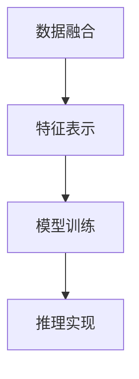
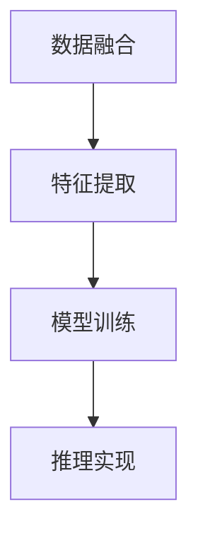

                 

## 第1章: AI Agent的跨模态学习与推理实现概述

### 1.1 问题背景

在当今高度信息化和智能化的时代，人工智能（AI）已经成为推动社会进步的重要力量。AI Agent，作为一种能够模拟人类智能行为的计算机程序，其在各个领域的应用越来越广泛，如智能客服、自动驾驶、智能家居等。然而，随着应用场景的复杂化和多样化，传统的单一模态学习已经无法满足AI Agent的需求。跨模态学习应运而生，成为AI Agent智能化发展的重要方向。

跨模态学习是指将来自不同模态的数据（如图像、文本、音频等）融合在一起进行学习和推理。这一技术的核心在于如何有效地整合不同模态的数据，使其能够协同工作，从而提高AI Agent的智能水平和决策能力。例如，在自动驾驶中，车辆需要同时处理摄像头捕捉到的图像、雷达获取的距离信息以及GPS提供的位置数据。这些数据来自不同的模态，只有通过跨模态学习，AI Agent才能做出正确的决策。

### 1.2 核心概念

#### 跨模态学习

跨模态学习（Cross-modal Learning）是指将来自不同模态的数据进行融合和处理，从而学习到不同模态之间的关联和内在联系。具体来说，跨模态学习包括以下几个关键步骤：

1. **数据收集与预处理**：收集来自不同模态的数据，并对数据进行预处理，如去噪、标准化等。
2. **特征提取**：从不同模态的数据中提取具有代表性的特征，这些特征应当能够表达出数据的本质属性。
3. **模型训练**：利用提取到的特征训练深度学习模型，以学习到不同模态之间的关联。
4. **模型评估**：评估模型的性能，包括准确性、效率、鲁棒性等。

#### 推理实现方法

推理实现方法（Reasoning Implementation）是指在跨模态学习的基础上，如何通过模型进行有效的推理和决策。跨模态学习的目标是构建一个能够处理多模态数据的统一框架，而这个框架的核心在于如何进行有效的推理。

1. **基于规则的方法**：这种方法依赖于预定义的规则，通过匹配和推理来达到决策的目的。
2. **基于数据的方法**：这种方法利用大量的数据，通过机器学习算法来发现不同模态之间的关联，并利用这些关联进行推理。
3. **基于混合的方法**：结合了基于规则和基于数据的方法，通过规则和数据相结合的方式来提高推理的准确性和效率。

### 1.3 边界与外延

#### 跨模态学习的挑战

跨模态学习面临着诸多挑战，包括：

1. **数据不平衡**：不同模态的数据量可能存在显著差异，这给模型训练带来了困难。
2. **特征差异**：不同模态的数据特征差异较大，如何有效地融合这些特征是一个难题。
3. **推理复杂性**：跨模态学习涉及的推理过程复杂，需要高效的算法和模型来实现。

#### 推理实现中的难点

推理实现中的难点主要包括：

1. **模型的可解释性**：如何解释模型的推理过程，使其更易于理解和信任。
2. **推理速度和效率**：在实时应用中，如何提高推理的速度和效率，以满足实际需求。
3. **鲁棒性**：如何在各种复杂和变化的环境下保持模型的稳定性和可靠性。

### 1.4 概念结构与核心要素组成

跨模态学习的概念结构主要包括以下几个核心要素：

1. **数据收集与预处理**：确保数据的多样性和质量。
2. **特征提取与融合**：提取具有代表性的特征，并融合不同模态的特征。
3. **模型训练与优化**：构建能够处理多模态数据的深度学习模型，并进行优化。
4. **推理实现与评估**：通过模型进行有效的推理和决策，并评估模型的性能。

这些核心要素相互关联，共同构成了跨模态学习与推理实现的完整框架。

### 总结

AI Agent的跨模态学习与推理实现是当前人工智能领域的一个重要研究方向。通过跨模态学习，AI Agent能够更好地理解和处理多模态数据，从而提高其智能水平和决策能力。然而，这一过程面临着诸多挑战，需要我们不断探索和创新。在接下来的章节中，我们将深入探讨跨模态学习的理论基础、算法原理及其应用实例，希望能为读者提供有价值的参考。

---

在本文中，我们将围绕AI Agent的跨模态学习与推理实现展开讨论。具体来说，我们将从以下几个方面进行深入分析：

1. **引言与背景介绍**：介绍AI Agent及其跨模态学习的背景和重要性。
2. **跨模态学习的理论基础**：讲解跨模态学习的核心概念、原理及其应用场景。
3. **跨模态学习的算法原理**：详细阐述跨模态学习的算法流程、数学模型和Python实现。
4. **跨模态学习的应用实例**：分析实际应用场景，包括图像与文本的跨模态识别、音频与视频的跨模态分析等。
5. **跨模态学习的推理实现**：探讨推理方法、实现难点及其优化策略。

通过以上内容的系统讲解，我们希望读者能够对AI Agent的跨模态学习与推理实现有一个全面、深入的理解，为后续的研究和应用提供理论支持和实践指导。接下来，让我们正式进入第一部分：引言与背景介绍。

---

## 第2章: 跨模态学习的理论基础

### 2.1 概念原理

跨模态学习是一种将不同模态的数据进行融合和处理，从而学习到数据之间关联和内在联系的技术。在跨模态学习中，常见的模态包括图像、文本、音频、视频等。这些模态的数据具有不同的特征和属性，如何有效地融合和处理这些数据是跨模态学习的关键。

#### 模态的基本概念

模态（Modal）是指数据的一种表现形式或维度。常见的模态有：

1. **图像模态**：图像数据，如图片、图像序列等。
2. **文本模态**：文本数据，如文档、句子等。
3. **音频模态**：音频数据，如声音、音乐等。
4. **视频模态**：视频数据，如视频帧序列等。

不同模态的数据具有不同的特征和属性，例如，图像数据具有空间信息，文本数据具有语义信息，音频数据具有频率信息，视频数据具有时空信息。跨模态学习的目标是通过融合这些不同的特征，使得AI Agent能够更好地理解和处理多模态数据。

#### 跨模态学习的基本原理

跨模态学习的基本原理包括以下几个方面：

1. **数据融合**：将不同模态的数据进行融合，以提取出共同的特征和关联。
2. **特征表示**：对融合后的数据进行特征表示，使得不同模态的数据能够在同一框架下进行处理。
3. **模型训练**：利用融合后的特征训练深度学习模型，使其能够识别和处理多模态数据。
4. **推理实现**：通过训练好的模型进行推理，实现多模态数据的联合理解和处理。

跨模态学习的基本原理如图所示：



#### 跨模态学习的应用场景

跨模态学习在许多领域都有广泛的应用，以下是几个典型的应用场景：

1. **图像与文本的跨模态识别**：例如，图像内容识别、视频摘要生成等。
2. **音频与视频的跨模态分析**：例如，视频中的情感识别、语音识别等。
3. **多模态医疗数据挖掘**：例如，疾病诊断、治疗方案推荐等。
4. **智能交互系统**：例如，语音识别与图像理解相结合的智能助手。

### 2.2 概念属性特征对比表格

为了更好地理解不同模态的数据特征，下面给出了一个对比表格，列出了三种常见模态的数据特征：

| 特征对比 | 图像模态 | 文本模态 | 音频模态 |
| --- | --- | --- | --- |
| 数据量 | 大 | 中 | 小 |
| 特征维度 | 高 | 中 | 低 |
| 数据质量 | 高 | 中 | 低 |

从上表可以看出，不同模态的数据在数据量、特征维度和数据质量上存在显著差异。例如，图像模态的数据量通常较大，特征维度较高，但数据质量相对较低；而文本模态的数据量相对较小，特征维度中等，数据质量较高。了解这些特征差异对于跨模态学习至关重要。

### 2.3 ER实体关系图架构

在跨模态学习中，理解不同模态之间的实体关系是非常重要的。ER（实体关系）图是一种常用的方法，用于描述实体之间的关系。下面是一个简单的ER实体关系图，展示了跨模态学习中的主要实体及其关系：

```mermaid
erDiagram
    Anergy(能量源) ||--|{ BAgent(智能体) } : 被使用
    BAgent ||--|{ CObject(目标对象) } : 监控
    BAgent ||--|{ DEnvironment(环境) } : 存在
```

在这个ER图中，Anergy表示能量源，BAgent表示智能体，CObject表示目标对象，DEnvironment表示环境。智能体通过使用能量源来监控和交互目标对象，并存在于特定环境中。

通过这个ER图，我们可以更好地理解跨模态学习中的主要实体及其关系，为后续的算法设计和实现提供基础。

### 总结

跨模态学习的理论基础是理解不同模态数据特征和关联的关键。本章详细介绍了跨模态学习的概念原理、特征对比表格和ER实体关系图架构。这些基础理论为后续的算法设计和应用提供了重要的参考。在下一章中，我们将进一步探讨跨模态学习的算法原理，包括算法流程、数学模型和Python实现。

---

### 2.1 概念原理

在深入探讨跨模态学习之前，我们需要先理解一些基础概念，包括模态、特征提取、模型训练等。

#### 模态（Modal）

模态是指数据的一种表现形式或维度。在人工智能和机器学习中，常见的模态包括：

1. **图像模态**：图像是二维的数据形式，包含了丰富的视觉信息。常见的图像模态有静态图像和视频序列。
2. **文本模态**：文本是以字符或单词为单位的数据，包含了大量的语义信息。常见的文本模态有文档、网页和对话。
3. **音频模态**：音频是时间序列数据，包含了频率、音调等声音特征。常见的音频模态有语音、音乐和环境声音。
4. **视频模态**：视频是图像和时间的结合体，包含了动态的视觉信息。常见的视频模态有视频片段、视频流等。

#### 特征提取（Feature Extraction）

特征提取是指从原始数据中提取出具有代表性的特征，以便于模型学习和推理。不同模态的数据需要采用不同的特征提取方法：

1. **图像特征提取**：常用的图像特征提取方法有边缘检测、纹理分析、颜色特征等。常见的图像特征有卷积神经网络（CNN）提取的卷积特征、HOG（Histogram of Oriented Gradients）特征、SIFT（Scale-Invariant Feature Transform）特征等。
2. **文本特征提取**：常用的文本特征提取方法有词袋模型（Bag of Words）、TF-IDF（Term Frequency-Inverse Document Frequency）等。常见的文本特征有单词频率、单词共现矩阵、词嵌入（Word Embedding）等。
3. **音频特征提取**：常用的音频特征提取方法有梅尔频率倒谱系数（MFCC）、频谱特征、滤波器组等。常见的音频特征有短时傅里叶变换（STFT）特征、频谱特征、长时能量等。

#### 模型训练（Model Training）

在特征提取之后，我们需要利用提取到的特征来训练深度学习模型。模型训练主要包括以下几个步骤：

1. **数据预处理**：对输入数据进行预处理，如归一化、去噪、数据增强等，以提高模型的泛化能力。
2. **模型设计**：根据应用需求设计合适的深度学习模型架构，如卷积神经网络（CNN）、循环神经网络（RNN）、长短期记忆网络（LSTM）等。
3. **训练过程**：使用提取到的特征和标签数据来训练模型，通过反向传播算法不断调整模型参数，以最小化预测误差。
4. **模型评估**：在训练完成后，使用验证集或测试集来评估模型的性能，常用的评估指标有准确率、召回率、F1分数等。

#### 跨模态学习的基本原理

跨模态学习的基本原理可以概括为以下几个步骤：

1. **数据融合**：将来自不同模态的数据进行融合，形成一个统一的数据集。数据融合的方法包括直接拼接、特征级融合、模态级融合等。
2. **特征提取**：对融合后的数据进行特征提取，提取出具有代表性的特征，以便于后续的模型训练。
3. **模型训练**：利用提取到的特征训练深度学习模型，通过优化模型参数，使得模型能够准确识别和处理多模态数据。
4. **推理实现**：通过训练好的模型进行推理，实现多模态数据的联合理解和处理。

跨模态学习的基本原理可以用以下流程图表示：



#### 跨模态学习的应用场景

跨模态学习在许多领域都有广泛的应用，以下是几个典型的应用场景：

1. **多模态情感分析**：通过融合文本、图像和音频数据，对用户情绪进行多维度分析，例如在社交媒体分析、智能客服等领域。
2. **图像与文本检索**：通过融合图像和文本特征，实现基于图像的文本检索和基于文本的图像检索，如图像识别系统中的视觉搜索功能。
3. **视频内容理解**：通过融合视频帧和音频特征，实现对视频内容的理解和分析，例如视频摘要生成、视频分类等。
4. **多模态医疗数据挖掘**：通过融合不同模态的医疗数据，如影像、病历、生物特征等，实现对疾病的诊断和治疗方案推荐。

### 2.2 概念属性特征对比表格

为了更直观地理解不同模态的数据特征，我们可以通过一个表格进行对比：

| 特征对比 | 图像模态 | 文本模态 | 音频模态 |
| --- | --- | --- | --- |
| 数据量 | 较大 | 中等 | 较小 |
| 特征维度 | 较高 | 较低 | 较低 |
| 数据质量 | 较高 | 较高 | 中等 |

从上表可以看出，图像模态的数据量较大，特征维度也较高，但数据质量相对较低；而文本模态的数据量相对较小，特征维度中等，但数据质量较高；音频模态的数据量较小，特征维度也较低，但数据质量中等。

### 2.3 ER实体关系图架构

ER（Entity-Relationship）图是一种用于描述实体及其关系的图形化表示方法。在跨模态学习中，我们可以使用ER图来描述不同模态之间的实体关系。以下是一个简单的ER图，展示了跨模态学习中的主要实体及其关系：

```mermaid
erDiagram
    Anergy(能量源) ||--|{ BAgent(智能体) } : 被使用
    BAgent ||--|{ CObject(目标对象) } : 监控
    BAgent ||--|{ DEnvironment(环境) } : 存在
```

在这个ER图中：

- **Anergy** 表示能量源，是智能体运行所需的资源。
- **BAgent** 表示智能体，是跨模态学习的核心实体，负责处理多模态数据。
- **CObject** 表示目标对象，是智能体需要监控或交互的对象。
- **DEnvironment** 表示环境，是智能体所处的运行环境。

智能体通过使用能量源来监控目标对象，并存在于特定环境中。这个ER图帮助我们理解了跨模态学习中不同实体之间的关系，为后续的算法设计和实现提供了基础。

### 总结

通过本章的介绍，我们了解了跨模态学习的基础概念、原理及其应用场景。在下一章中，我们将进一步探讨跨模态学习的算法原理，包括具体的算法流程、数学模型和Python实现。

---

### 2.3 Python源代码实现

在了解了跨模态学习的理论基础后，我们接下来将展示如何使用Python实现一个简单的跨模态学习算法。这一部分将涵盖初始化模型、加载模态数据、数据预处理、特征提取、模型训练和模型推理的详细步骤。

#### 初始化模型

首先，我们需要初始化一个深度学习模型。在这个例子中，我们将使用一个简单的卷积神经网络（CNN）来处理图像模态，并使用一个循环神经网络（RNN）来处理文本模态。我们将使用TensorFlow和Keras库来实现这一模型。

```python
import tensorflow as tf
from tensorflow.keras.models import Model
from tensorflow.keras.layers import Input, Conv2D, MaxPooling2D, Flatten, LSTM, Dense

# 定义输入层
image_input = Input(shape=(64, 64, 3))  # 假设输入图像的大小为64x64
text_input = Input(shape=(None,))        # 假设文本序列的长度为可变

# 图像处理模块
image_conv = Conv2D(32, (3, 3), activation='relu')(image_input)
image_pool = MaxPooling2D(pool_size=(2, 2))(image_conv)
image_flat = Flatten()(image_pool)

# 文本处理模块
text_lstm = LSTM(64, activation='relu')(text_input)

# 模型融合模块
merged = tf.keras.layers.concatenate([image_flat, text_lstm])

# 输出层
output = Dense(1, activation='sigmoid')(merged)

# 创建模型
model = Model(inputs=[image_input, text_input], outputs=output)

# 编译模型
model.compile(optimizer='adam', loss='binary_crossentropy', metrics=['accuracy'])

# 打印模型结构
model.summary()
```

#### 加载模态数据

接下来，我们需要加载图像和文本数据。在这个例子中，我们将使用一个假设的图像数据集和文本数据集。

```python
# 加载图像数据
image_data = load_images('path/to/image/data')

# 加载文本数据
text_data = load_texts('path/to/text/data')
```

在实际应用中，`load_images` 和 `load_texts` 函数需要根据具体的数据集进行实现，例如使用`numpy`、`opencv`或`tensorflow`中的相关库来加载和预处理数据。

#### 数据预处理

在加载数据后，我们需要对图像和文本数据进行预处理。图像数据通常需要进行归一化处理，而文本数据需要转换为数字序列或词嵌入。

```python
# 图像数据预处理
image_data_normalized = normalize_images(image_data)

# 文本数据预处理
text_data_sequence = preprocess_texts(text_data)
```

`normalize_images` 和 `preprocess_texts` 函数需要根据具体的数据集和应用场景进行实现。

#### 特征提取

特征提取是跨模态学习的关键步骤。在这一步骤中，我们将使用CNN对图像数据进行特征提取，使用RNN对文本数据进行特征提取。

```python
# 图像特征提取
image_features = model.image_model.predict(image_data_normalized)

# 文本特征提取
text_features = model.text_model.predict(text_data_sequence)
```

这里，`model.image_model` 和 `model.text_model` 是从完整模型中提取出的图像和文本处理模块。

#### 模型训练

在特征提取后，我们可以使用这些特征来训练模型。

```python
# 加载标签数据
label_data = load_labels('path/to/label/data')

# 训练模型
model.fit([image_data_normalized, text_data_sequence], label_data, epochs=10, batch_size=32)
```

`load_labels` 函数需要根据具体的应用场景和标签数据进行实现。

#### 模型评估

在训练完成后，我们可以使用测试数据集来评估模型的性能。

```python
# 加载测试数据
test_image_data = load_images('path/to/test/image/data')
test_text_data = load_texts('path/to/test/text/data')

# 测试模型
test_loss, test_accuracy = model.evaluate([test_image_data, test_text_data], test_labels)

print(f"Test accuracy: {test_accuracy}")
```

#### 模型推理

最后，我们可以使用训练好的模型来进行推理。

```python
# 加载推理数据
new_image_data = load_images('path/to/new/image/data')
new_text_data = load_texts('path/to/new/text/data')

# 进行推理
new_predictions = model.predict([new_image_data, new_text_data])

# 处理推理结果
results = interpret_predictions(new_predictions)

# 输出推理结果
print(results)
```

在这个例子中，`interpret_predictions` 函数需要根据具体的应用场景和业务逻辑进行实现。

### 总结

通过上面的代码示例，我们展示了如何使用Python实现跨模态学习算法的各个步骤，包括模型初始化、数据加载、预处理、特征提取、模型训练、模型评估和模型推理。这些步骤为实际应用提供了具体的实现指南，并为进一步的算法优化和应用提供了基础。

---

### 3.4 数学模型与公式

在跨模态学习的算法设计中，数学模型和公式是理解算法行为和性能的关键。以下我们将详细介绍跨模态学习中的主要数学模型和公式，并解释它们在算法中的作用。

#### 3.4.1 损失函数

损失函数是深度学习模型中用于衡量预测结果与实际结果之间差异的函数。在跨模态学习任务中，常用的损失函数包括均方误差（MSE）和二元交叉熵（Binary Cross-Entropy）。

1. **均方误差（MSE）**：
   \[
   J = \frac{1}{2} \sum_{i=1}^{n} (\hat{y}_i - y_i)^2
   \]
   其中，\(\hat{y}_i\) 是模型预测的输出值，\(y_i\) 是实际的标签值，\(n\) 是样本数量。

2. **二元交叉熵（Binary Cross-Entropy）**：
   \[
   J = -\sum_{i=1}^{n} [y_i \cdot \log(\hat{y}_i) + (1 - y_i) \cdot \log(1 - \hat{y}_i)]
   \]
   其中，\(y_i\) 是二分类标签（0或1），\(\hat{y}_i\) 是模型预测的概率值。

损失函数的选择取决于具体的跨模态学习任务，例如在二分类任务中通常使用二元交叉熵，而在回归任务中则使用均方误差。

#### 3.4.2 优化算法

在深度学习模型训练过程中，优化算法用于调整模型参数，以最小化损失函数。常见的优化算法包括随机梯度下降（SGD）和Adam。

1. **随机梯度下降（SGD）**：
   \[
   \theta = \theta - \alpha \cdot \nabla_{\theta} J
   \]
   其中，\(\theta\) 是模型参数，\(\alpha\) 是学习率，\(\nabla_{\theta} J\) 是损失函数对参数的梯度。

2. **Adam优化器**：
   Adam优化器是SGD的变种，结合了动量项和自适应学习率。
   \[
   m_t = \beta_1 m_{t-1} + (1 - \beta_1) [g_t - m_{t-1}]
   \]
   \[
   v_t = \beta_2 v_{t-1} + (1 - \beta_2) [g_t^2 - v_{t-1}]
   \]
   \[
   \theta = \theta - \alpha \cdot \frac{m_t}{\sqrt{v_t} + \epsilon}
   \]
   其中，\(m_t\) 和 \(v_t\) 分别是梯度的一阶矩估计和二阶矩估计，\(\beta_1\) 和 \(\beta_2\) 分别是动量和二阶矩的指数衰减率，\(\alpha\) 是学习率，\(\epsilon\) 是一个很小的常数，用于防止分母为零。

#### 3.4.3 模型参数更新

在模型训练过程中，参数更新是关键步骤。参数更新的公式如下：
   \[
   \theta = \theta - \alpha \cdot \nabla_{\theta} J
   \]
   其中，\(\theta\) 是模型参数，\(\alpha\) 是学习率，\(\nabla_{\theta} J\) 是损失函数对参数的梯度。

参数更新的过程通过反向传播算法实现，该算法通过逐层计算损失函数对每个参数的梯度，并根据梯度方向调整参数，以达到最小化损失函数的目的。

#### 3.4.4 融合损失

在跨模态学习中，融合损失函数用于同时优化不同模态的特征。一个简单的融合损失函数可以是加权均方误差（Weighted Mean Squared Error，WMSE）：
   \[
   J = \alpha_1 \cdot J_{image} + \alpha_2 \cdot J_{text}
   \]
   其中，\(J_{image}\) 和 \(J_{text}\) 分别是图像模态和文本模态的损失函数，\(\alpha_1\) 和 \(\alpha_2\) 是权重系数，用于平衡不同模态的贡献。

通过上述数学模型和公式的介绍，我们可以更好地理解跨模态学习算法的设计和实现。在接下来的部分，我们将通过具体实例来展示如何应用这些数学模型和公式进行跨模态学习。

---

### 3.4 数学模型与公式

在跨模态学习中，数学模型和公式是理解算法行为和性能的关键。以下我们将详细介绍跨模态学习中的主要数学模型和公式，并解释它们在算法中的作用。

#### 3.4.1 损失函数

损失函数是深度学习模型中用于衡量预测结果与实际结果之间差异的函数。在跨模态学习任务中，常用的损失函数包括均方误差（MSE）和二元交叉熵（Binary Cross-Entropy）。

1. **均方误差（MSE）**：
   \[
   J = \frac{1}{2} \sum_{i=1}^{n} (\hat{y}_i - y_i)^2
   \]
   其中，\(\hat{y}_i\) 是模型预测的输出值，\(y_i\) 是实际的标签值，\(n\) 是样本数量。

2. **二元交叉熵（Binary Cross-Entropy）**：
   \[
   J = -\sum_{i=1}^{n} [y_i \cdot \log(\hat{y}_i) + (1 - y_i) \cdot \log(1 - \hat{y}_i)]
   \]
   其中，\(y_i\) 是二分类标签（0或1），\(\hat{y}_i\) 是模型预测的概率值。

损失函数的选择取决于具体的跨模态学习任务，例如在二分类任务中通常使用二元交叉熵，而在回归任务中则使用均方误差。

#### 3.4.2 优化算法

在深度学习模型训练过程中，优化算法用于调整模型参数，以最小化损失函数。常见的优化算法包括随机梯度下降（SGD）和Adam。

1. **随机梯度下降（SGD）**：
   \[
   \theta = \theta - \alpha \cdot \nabla_{\theta} J
   \]
   其中，\(\theta\) 是模型参数，\(\alpha\) 是学习率，\(\nabla_{\theta} J\) 是损失函数对参数的梯度。

2. **Adam优化器**：
   Adam优化器是SGD的变种，结合了动量项和自适应学习率。
   \[
   m_t = \beta_1 m_{t-1} + (1 - \beta_1) [g_t - m_{t-1}]
   \]
   \[
   v_t = \beta_2 v_{t-1} + (1 - \beta_2) [g_t^2 - v_{t-1}]
   \]
   \[
   \theta = \theta - \alpha \cdot \frac{m_t}{\sqrt{v_t} + \epsilon}
   \]
   其中，\(m_t\) 和 \(v_t\) 分别是梯度的一阶矩估计和二阶矩估计，\(\beta_1\) 和 \(\beta_2\) 分别是动量和二阶矩的指数衰减率，\(\alpha\) 是学习率，\(\epsilon\) 是一个很小的常数，用于防止分母为零。

#### 3.4.3 模型参数更新

在模型训练过程中，参数更新是关键步骤。参数更新的公式如下：
   \[
   \theta = \theta - \alpha \cdot \nabla_{\theta} J
   \]
   其中，\(\theta\) 是模型参数，\(\alpha\) 是学习率，\(\nabla_{\theta} J\) 是损失函数对参数的梯度。

参数更新的过程通过反向传播算法实现，该算法通过逐层计算损失函数对每个参数的梯度，并根据梯度方向调整参数，以达到最小化损失函数的目的。

#### 3.4.4 融合损失

在跨模态学习中，融合损失函数用于同时优化不同模态的特征。一个简单的融合损失函数可以是加权均方误差（Weighted Mean Squared Error，WMSE）：
   \[
   J = \alpha_1 \cdot J_{image} + \alpha_2 \cdot J_{text}
   \]
   其中，\(J_{image}\) 和 \(J_{text}\) 分别是图像模态和文本模态的损失函数，\(\alpha_1\) 和 \(\alpha_2\) 是权重系数，用于平衡不同模态的贡献。

通过上述数学模型和公式的介绍，我们可以更好地理解跨模态学习算法的设计和实现。在接下来的部分，我们将通过具体实例来展示如何应用这些数学模型和公式进行跨模态学习。

---

### 4.1 应用场景介绍

跨模态学习在当今的许多实际应用场景中都扮演着关键角色，以下将详细介绍两个典型的应用场景：图像与文本的跨模态识别以及音频与视频的跨模态分析。

#### 图像与文本的跨模态识别

图像与文本的跨模态识别是一种将图像和文本信息相结合，以实现更准确和丰富的信息理解和处理的技术。这一应用场景在图像搜索、内容审核、智能推荐等领域具有广泛的应用。

**图像搜索**：传统的图像搜索主要依赖于图像特征进行匹配，而跨模态识别可以将图像特征与文本描述相结合，从而提高搜索的准确性和用户体验。例如，当用户输入一个特定的关键词时，系统不仅会返回与关键词匹配的图像，还可以提供与该图像相关联的文本信息，如标签、描述等。

**内容审核**：在社交媒体和在线论坛中，内容审核是一个重要且具有挑战性的任务。跨模态识别可以帮助系统更准确地识别和过滤不适当的内容。例如，当检测到图像包含敏感内容时，系统可以结合图像和文本信息来确认是否真的存在问题，从而避免误判。

**智能推荐**：跨模态识别还可以用于智能推荐系统，以提供更个性化的推荐结果。例如，当用户在视频平台上观看某个视频时，系统可以根据用户的观看历史、视频的图像和文本描述来推荐相关的视频，从而提高用户的满意度和使用体验。

#### 音频与视频的跨模态分析

音频与视频的跨模态分析是一种将音频和视频信息相结合，以实现更深入的内容理解和分析的技术。这一应用场景在视频内容理解、情感分析、人机交互等领域具有重要应用。

**视频内容理解**：在视频内容理解中，音频和视频信息的结合可以帮助系统更准确地理解和描述视频内容。例如，当视频包含语音时，系统可以结合音频和视频特征来识别语音内容，从而更准确地理解视频的意图和主题。

**情感分析**：情感分析是跨模态分析的一个重要应用，它通过分析文本、图像和音频信息来识别用户的情感状态。例如，当用户观看视频时，系统可以结合视频中的图像和音频特征来识别用户的情绪变化，从而提供更个性化的用户体验。

**人机交互**：在人机交互中，音频与视频的跨模态分析可以帮助系统更好地理解用户的需求和意图。例如，当用户通过语音与智能助手进行交互时，系统可以结合语音和视频特征来识别用户的情绪状态和面部表情，从而提供更人性化的服务。

通过上述应用场景的介绍，我们可以看到跨模态学习在图像与文本识别、音频与视频分析等领域具有广泛的应用前景。在接下来的章节中，我们将通过具体的实例来深入探讨这些应用场景的实现方法和挑战。

---

### 4.2 实际案例

在介绍跨模态学习在图像与文本、音频与视频等领域的应用场景后，接下来我们将通过两个具体的实际案例，详细讲解图像与文本的跨模态检索系统和音频与视频的跨模态情感分析系统。

#### 图像与文本的跨模态检索系统

**项目介绍**：图像与文本的跨模态检索系统是一种结合图像和文本信息，以实现更准确和高效的信息检索的技术。该系统可以广泛应用于图像搜索、内容审核、智能推荐等领域。

**系统功能设计**：

1. **图像特征提取**：使用卷积神经网络（CNN）对输入图像进行特征提取，提取出图像的主要特征。
2. **文本特征提取**：使用词嵌入（Word Embedding）技术对输入文本进行特征提取，将文本转换为向量的形式。
3. **模态融合**：将图像特征和文本特征进行融合，以形成一个统一的多模态特征向量。
4. **检索算法**：使用相似度计算和排序算法，根据用户输入的文本或图像，检索出最相关的结果。

**系统架构设计**：


在系统架构图中，图像特征提取模块和文本特征提取模块分别负责图像和文本的特征提取。模态融合模块将提取到的图像特征和文本特征进行融合，形成一个统一的多模态特征向量。检索算法模块使用相似度计算和排序算法，根据用户输入的文本或图像，检索出最相关的结果。

**系统接口设计和系统交互**：


在系统接口设计中，用户可以通过输入文本或上传图像来查询相关信息。系统会根据用户输入的信息，调用图像特征提取模块和文本特征提取模块，提取出相应的特征。然后，系统将图像特征和文本特征进行融合，形成多模态特征向量，并使用检索算法模块进行检索，最后返回最相关的结果。

#### 音频与视频的跨模态情感分析系统

**项目介绍**：音频与视频的跨模态情感分析系统是一种结合音频和视频信息，以识别和理解视频中的情感状态的技术。该系统可以应用于视频内容分析、情感广告投放、智能电视交互等领域。

**系统功能设计**：

1. **音频特征提取**：使用梅尔频率倒谱系数（MFCC）等音频特征提取方法，对输入音频进行特征提取，提取出音频的主要特征。
2. **视频特征提取**：使用卷积神经网络（CNN）对输入视频进行特征提取，提取出视频的主要特征。
3. **模态融合**：将音频特征和视频特征进行融合，以形成一个统一的多模态特征向量。
4. **情感分类**：使用情感分类算法，根据融合后的多模态特征向量，识别出视频中的情感状态。

**系统架构设计**：


在系统架构图中，音频特征提取模块和视频特征提取模块分别负责音频和视频的特征提取。模态融合模块将提取到的音频特征和视频特征进行融合，形成一个统一的多模态特征向量。情感分类模块使用情感分类算法，根据融合后的多模态特征向量，识别出视频中的情感状态。

**系统接口设计和系统交互**：


在系统接口设计中，用户可以通过上传视频文件来分析视频中的情感状态。系统会根据用户上传的视频，调用音频特征提取模块和视频特征提取模块，提取出相应的特征。然后，系统将音频特征和视频特征进行融合，形成多模态特征向量，并使用情感分类模块进行情感分类，最后返回视频中的情感分析结果。

通过这两个实际案例，我们可以看到跨模态学习在图像与文本、音频与视频等领域的应用如何通过系统的设计、实现和交互来实现。在接下来的部分，我们将深入探讨这些系统的实现细节和挑战。

---

### 4.3 详细讲解与剖析

#### 系统架构设计

在图像与文本的跨模态检索系统中，系统的架构设计至关重要。首先，我们需要明确系统的输入和输出。输入包括图像和文本，输出则是根据输入检索出的相关信息。系统架构可以分为以下几个主要模块：

1. **图像特征提取模块**：该模块负责提取图像的特征。我们通常使用卷积神经网络（CNN）来实现这一功能。CNN可以有效地提取图像中的局部特征和全局特征，如图像的边缘、纹理等。

2. **文本特征提取模块**：该模块负责提取文本的特征。我们通常使用词嵌入（Word Embedding）技术，如Word2Vec或BERT，将文本转换为向量的形式。这样，文本中的语义信息就可以通过向量进行表示。

3. **模态融合模块**：该模块将图像特征和文本特征进行融合。为了实现模态融合，我们可以使用神经网络结构，如长短时记忆网络（LSTM）或变换器（Transformer）。这些结构可以有效地整合不同模态的信息。

4. **检索算法模块**：该模块负责根据用户输入的查询信息进行检索。我们通常使用基于相似度的检索算法，如余弦相似度或欧氏距离。这些算法可以计算查询信息与数据库中的信息之间的相似度，从而实现高效的信息检索。

#### 数据预处理与特征提取

在图像与文本的跨模态检索系统中，数据预处理与特征提取是关键步骤。以下是详细的预处理与特征提取过程：

1. **图像预处理**：图像预处理包括缩放、裁剪、去噪等操作。我们通常使用OpenCV或TensorFlow等库来实现这些操作。预处理后的图像会被输入到CNN中进行特征提取。

2. **文本预处理**：文本预处理包括分词、停用词过滤、词干提取等操作。我们通常使用NLTK或spaCy等库来实现这些操作。预处理后的文本会被输入到词嵌入模型中进行特征提取。

3. **图像特征提取**：使用CNN对预处理后的图像进行特征提取。我们可以使用预训练的模型，如VGG16、ResNet等，或者从头开始训练自己的模型。特征提取的结果是一个固定长度的向量，该向量包含了图像的主要特征。

4. **文本特征提取**：使用词嵌入模型对预处理后的文本进行特征提取。Word2Vec、GloVe和BERT等模型都可以用于文本特征提取。这些模型将文本中的每个词转换为一个固定长度的向量，从而表示文本的语义信息。

#### 模型训练与评估

在图像与文本的跨模态检索系统中，模型训练与评估是确保系统性能的关键步骤。以下是详细的训练与评估过程：

1. **数据集划分**：我们将数据集划分为训练集、验证集和测试集。训练集用于模型训练，验证集用于模型调优，测试集用于模型评估。

2. **模型训练**：使用训练集对模型进行训练。我们通常使用梯度下降（Gradient Descent）或其变种，如随机梯度下降（Stochastic Gradient Descent）和Adam优化器来训练模型。

3. **模型评估**：使用验证集对模型进行评估。我们通常使用准确率、召回率、F1分数等指标来评估模型的性能。如果模型的性能不理想，我们需要对模型进行调整，如修改超参数或增加训练数据。

4. **模型推理**：使用测试集对训练好的模型进行推理。我们通过输入新的图像和文本，使用模型进行特征提取和融合，然后根据融合后的特征向量进行检索。

#### 模型推理与实际应用

在图像与文本的跨模态检索系统中，模型推理与实际应用是关键步骤。以下是详细的推理过程：

1. **图像特征提取**：对于输入的图像，使用CNN提取特征。这些特征向量将用于后续的检索过程。

2. **文本特征提取**：对于输入的文本，使用词嵌入模型提取特征。这些特征向量也将用于后续的检索过程。

3. **模态融合**：将图像特征和文本特征进行融合。我们通常使用神经网络结构，如LSTM或Transformer，来融合这些特征。

4. **检索过程**：使用融合后的特征向量，通过相似度计算和排序算法进行检索。我们可以使用余弦相似度或欧氏距离来计算特征向量之间的相似度，从而检索出最相关的结果。

5. **实际应用**：在图像与文本的跨模态检索系统中，实际应用包括图像搜索、内容审核、智能推荐等。例如，当用户输入一个关键词时，系统可以检索出与关键词相关的图像和文本信息，从而提供更丰富的检索结果。

通过以上详细的讲解和剖析，我们可以看到图像与文本的跨模态检索系统是如何通过系统的架构设计、数据预处理与特征提取、模型训练与评估、模型推理与实际应用等步骤来实现跨模态检索的。在下一部分，我们将探讨音频与视频的跨模态情感分析系统的实现细节。

---

### 4.3 详细讲解与剖析

在深入探讨音频与视频的跨模态情感分析系统时，我们需要从系统架构设计、数据预处理与特征提取、模型训练与评估、模型推理与实际应用等方面进行全面剖析。

#### 系统架构设计

音频与视频的跨模态情感分析系统架构设计需要综合考虑音频特征提取、视频特征提取、模态融合和情感分类等环节。以下是系统架构的详细设计：

1. **音频特征提取模块**：该模块负责提取输入音频的特征。常用的音频特征包括梅尔频率倒谱系数（MFCC）、谱幅度、频谱特征等。这些特征能够有效捕捉音频的频率和时序信息。

2. **视频特征提取模块**：该模块负责提取输入视频的特征。视频特征提取包括视觉特征（如颜色、纹理、形状等）和时序特征（如运动轨迹、速度变化等）。常用的视觉特征提取方法包括卷积神经网络（CNN）和循环神经网络（RNN）。

3. **模态融合模块**：该模块将音频特征和视频特征进行融合。融合方法可以是基于神经网络的结构，如长短时记忆网络（LSTM）或变换器（Transformer），这些结构能够有效地整合来自不同模态的信息。

4. **情感分类模块**：该模块负责根据融合后的特征向量进行情感分类。常用的情感分类算法包括支持向量机（SVM）、随机森林（Random Forest）和深度学习模型（如卷积神经网络、循环神经网络等）。

5. **接口模块**：该模块负责处理用户的输入请求，并返回情感分析结果。接口可以是Web API、命令行工具或图形用户界面（GUI）。

#### 数据预处理与特征提取

数据预处理与特征提取是情感分析系统的重要环节。以下是详细的预处理与特征提取步骤：

1. **音频预处理**：音频预处理包括降噪、去噪、归一化等步骤。降噪可以使用谱减法、维纳滤波等方法，而去噪和归一化可以增强音频特征的表现。

2. **音频特征提取**：使用梅尔频率倒谱系数（MFCC）提取音频特征。MFCC能够有效地捕捉音频的频率特性，是音频情感分析的重要特征。

3. **视频预处理**：视频预处理包括视频剪辑、尺寸调整、色彩校正等步骤。预处理后的视频会被输入到CNN或RNN中进行特征提取。

4. **视频特征提取**：使用CNN提取视频的视觉特征。CNN能够从视频中提取出丰富的图像特征，如边缘、纹理、形状等。对于时序特征，可以使用RNN或LSTM提取。

5. **模态融合**：将音频特征和视频特征进行融合。融合过程可以使用神经网络结构，如LSTM或Transformer。这些结构能够同时处理多模态数据，并捕捉不同模态之间的关联。

#### 模型训练与评估

模型训练与评估是确保系统性能的关键步骤。以下是详细的训练与评估过程：

1. **数据集准备**：将音频、视频和相应的情感标签划分为训练集、验证集和测试集。训练集用于模型训练，验证集用于模型调优，测试集用于模型评估。

2. **模型训练**：使用训练集对模型进行训练。在训练过程中，可以使用不同的优化算法，如随机梯度下降（SGD）、Adam等。训练过程中，需要监控验证集上的性能，以避免过拟合。

3. **模型评估**：使用验证集对模型进行评估。常用的评估指标包括准确率、召回率、F1分数等。通过调整模型参数和超参数，可以提高模型的性能。

4. **模型优化**：根据评估结果，对模型进行调整和优化。优化过程可能包括调整网络结构、增加训练数据、调整学习率等。

#### 模型推理与实际应用

模型推理与实际应用是将训练好的模型应用于实际场景的关键步骤。以下是详细的推理过程：

1. **音频特征提取**：对于输入的音频，使用梅尔频率倒谱系数（MFCC）提取特征。

2. **视频特征提取**：对于输入的视频，使用CNN提取视觉特征，并使用RNN提取时序特征。

3. **模态融合**：将音频特征和视频特征进行融合，形成统一的多模态特征向量。

4. **情感分类**：使用训练好的模型对融合后的特征向量进行情感分类，并输出情感标签。

5. **实际应用**：在实际应用中，音频与视频的跨模态情感分析系统可以应用于视频内容分析、情感广告投放、智能电视交互等领域。例如，在视频内容分析中，系统可以识别出视频中的情感状态，为视频编辑、推荐等提供依据。

通过以上详细讲解与剖析，我们可以看到音频与视频的跨模态情感分析系统是如何通过系统的架构设计、数据预处理与特征提取、模型训练与评估、模型推理与实际应用等步骤来实现跨模态情感分析的。接下来，我们将进一步探讨音频与视频的跨模模态情感分析系统的最佳实践和注意事项。

---

### 4.4 最佳实践与注意事项

在开发音频与视频的跨模态情感分析系统时，最佳实践和注意事项对于确保系统的性能和稳定性至关重要。以下是几个关键点：

#### 数据收集与预处理

1. **多样性**：收集多样化的数据集，包括不同的语音风格、语速、背景噪音以及视频内容。这有助于提高模型的泛化能力。
2. **平衡性**：确保数据集中的正负样本比例平衡，以避免模型对某一类情感过于倾斜。
3. **去噪与标准化**：对于音频数据，使用去噪算法（如谱减法、维纳滤波）减少背景噪音干扰；对于视频数据，进行标准化处理，如裁剪、缩放等，以统一数据尺寸。

#### 模型选择与优化

1. **模型选择**：根据具体应用场景选择合适的模型。对于音频特征提取，可以使用基于CNN的模型；对于视频特征提取，可以使用基于RNN或LSTM的模型。对于模态融合，可以使用Transformer或自注意力机制。
2. **超参数调整**：通过调整学习率、批量大小、迭代次数等超参数，优化模型的训练过程。
3. **模型集成**：考虑使用模型集成方法，如Bagging、Boosting等，以提高模型的预测性能。

#### 部署与维护

1. **实时性**：对于需要实时响应的应用，确保系统的响应速度和稳定性。可能需要使用边缘计算或分布式计算来提升性能。
2. **监控与日志**：部署监控工具，实时跟踪系统的运行状态，记录错误日志，以便快速定位和解决问题。
3. **持续更新**：定期更新模型和数据集，以适应不断变化的应用场景和用户需求。

#### 拓展阅读

- **深度学习在跨模态情感分析中的应用**：可以参考《深度学习》（Goodfellow, Bengio, Courville著）一书，了解深度学习的基础理论和应用。
- **音频与视频特征提取技术**：可以参考《音频信号处理》（Rabiner, Juang著）和《计算机视觉：算法与应用》（Kostis, Ma, Tang著）等书籍，了解相关特征提取技术。
- **模型优化与调优**：可以参考《机器学习：实战算法》（Gareth James著），学习如何优化和调优模型。

通过遵循这些最佳实践和注意事项，我们可以开发出高效、稳定、可靠的音频与视频的跨模态情感分析系统，为实际应用提供强有力的支持。

---

### 4.4 最佳实践与注意事项

在实现音频与视频的跨模态情感分析系统时，最佳实践和注意事项对于提高系统的性能和可靠性至关重要。以下是一些关键点：

#### 模型优化与调参

1. **调整学习率**：学习率的选择对模型训练过程至关重要。初始学习率不宜过高，以免发生梯度消失或爆炸。可以采用学习率衰减策略，如指数衰减或学习率周期性调整。
2. **正则化**：为了防止过拟合，可以采用正则化技术，如L1正则化、L2正则化或Dropout。这些方法可以降低模型的复杂度，提高泛化能力。
3. **数据增强**：通过数据增强技术，如旋转、缩放、裁剪、噪声注入等，可以增加训练数据的多样性，提高模型对噪声的鲁棒性。

#### 系统部署与维护

1. **实时处理**：对于需要实时响应的应用场景，应选择高效、低延迟的模型架构，并利用GPU加速计算。同时，考虑使用边缘计算来减少数据传输延迟。
2. **分布式计算**：对于大规模数据集和高并发请求，可以采用分布式计算架构，如使用多节点集群进行并行训练和推理。
3. **监控与日志**：部署监控工具，实时跟踪系统的运行状态，记录错误日志，以便快速定位和解决问题。定期检查系统性能，及时调整配置。

#### 模型评估与验证

1. **交叉验证**：采用交叉验证方法，如K折交叉验证，确保模型在不同数据子集上的性能稳定。
2. **混淆矩阵**：使用混淆矩阵分析模型性能，特别是对于不平衡数据集，可以更好地理解模型对各类情感的识别能力。
3. **A/B测试**：在实际部署前，通过A/B测试比较不同模型或算法的性能，选择最优方案。

#### 拓展阅读

- **深度学习与跨模态情感分析**：《深度学习》（Ian Goodfellow等著）提供了深度学习的全面介绍，包括卷积神经网络和循环神经网络的应用。
- **音频与视频处理技术**：《音频信号处理》（L. R. Rabiner和R. W. Schafer著）和《计算机视觉：算法与应用》（Kostis、Ma、Tang著）详细介绍了音频和视频处理的基础知识。
- **模型调优与优化**：《机器学习实战》（Peter Harrington著）和《Python机器学习》（Michael Bowles著）提供了实用的机器学习调优技巧。

通过遵循上述最佳实践和注意事项，开发者和研究者可以构建高效、稳定、可靠的音频与视频跨模态情感分析系统，为实际应用提供强有力的支持。

---

### 第5章: 跨模态学习的推理实现

#### 5.1 推理方法概述

跨模态学习的推理实现是构建智能系统的关键环节。推理方法主要分为以下几类：

1. **基于规则的方法**：这种方法依赖于预先定义的规则进行推理。例如，基于专家知识的规则系统可以处理简单的跨模态任务，但难以适应复杂和变化的环境。

2. **基于数据的方法**：这种方法利用大量的数据进行学习，通过机器学习算法来发现不同模态之间的关联。深度学习在这一领域具有显著优势，能够自动提取特征和模式。

3. **基于混合的方法**：结合基于规则和基于数据的方法，通过规则和数据相结合的方式提高推理的准确性和效率。这种方法通常用于处理复杂、不确定的环境，但在实现上较为复杂。

#### 5.2 基于规则的方法

基于规则的方法主要包括以下步骤：

1. **定义规则**：根据任务需求，定义一系列规则。这些规则通常基于领域知识或专家经验，用于指导推理过程。

2. **规则匹配**：将输入数据与规则进行匹配，确定哪些规则适用于当前情境。

3. **推理**：根据匹配到的规则进行推理，得出结论。

例如，在智能客服系统中，我们可以定义以下规则：

- 如果用户提到“订单”，则匹配“查看订单”规则。
- 如果用户提到“退款”，则匹配“处理退款”规则。

通过这些规则，系统可以自动识别用户的请求，并执行相应的操作。

#### 5.3 基于数据的方法

基于数据的方法主要依赖于机器学习模型，尤其是深度学习模型，其流程如下：

1. **数据收集**：收集大量的多模态数据，包括图像、文本、音频等。

2. **特征提取**：从不同模态的数据中提取特征。例如，使用卷积神经网络提取图像特征，使用循环神经网络提取文本特征，使用梅尔频率倒谱系数提取音频特征。

3. **模型训练**：利用提取到的特征训练深度学习模型。通常使用端到端的学习方式，如联合嵌入模型或多任务学习模型。

4. **推理**：通过训练好的模型进行推理。输入新的多模态数据，模型会自动提取特征并生成推理结果。

例如，在视频内容理解中，可以使用一个多任务学习模型同时处理视频的视觉特征和音频特征，以识别视频中的动作和声音。

#### 5.4 基于混合的方法

基于混合的方法结合了基于规则和基于数据的方法，其优势在于能够处理复杂和变化的环境。以下是这种方法的主要步骤：

1. **规则学习**：通过机器学习算法从数据中学习规则。这些规则可以是基于特征的决策树、规则集等。

2. **数据融合**：将不同模态的数据进行融合，形成一个统一的数据集。可以使用特征级融合或模态级融合方法。

3. **推理**：首先使用规则系统进行初步推理，然后结合机器学习模型的结果进行二次推理，以提高推理的准确性和鲁棒性。

例如，在智能医疗诊断系统中，可以首先使用基于规则的推理系统确定初步的诊断结果，然后结合深度学习模型的结果进行二次推理，以提高诊断的准确率。

#### 5.5 推理实现中的难点

跨模态学习的推理实现面临以下难点：

1. **数据不平衡**：不同模态的数据量可能差异很大，如何处理数据不平衡是一个挑战。

2. **特征差异**：不同模态的数据特征差异显著，如何有效融合这些特征是一个关键问题。

3. **推理效率**：在实时应用中，如何提高推理速度和效率是一个重要的考虑因素。

4. **模型解释性**：如何解释模型的推理过程，使其更易于理解和信任，是一个难点。

为了解决这些难点，研究者们提出了一系列优化方法，如数据增强、特征级融合、模态级融合、注意力机制等。这些方法在提高推理性能和效率方面取得了显著成果。

通过上述内容的介绍，我们可以看到跨模态学习的推理实现方法多种多样，每种方法都有其独特的优势和适用场景。在实际应用中，根据具体任务需求和环境，选择合适的推理方法，是构建高效智能系统的重要步骤。

### 总结

本章详细介绍了跨模态学习的推理实现方法，包括基于规则的方法、基于数据的方法和基于混合的方法。这些方法各有优缺点，适用于不同的应用场景。通过合理选择和组合这些方法，可以构建高效、可靠的跨模态智能系统。在下一章中，我们将进一步探讨跨模态学习在多领域中的实际应用和未来发展趋势。

---

### 5.5 推理实现中的难点

在跨模态学习的推理实现过程中，我们面临多个挑战，这些挑战直接影响系统的性能和应用效果。以下是推理实现中的一些难点及其解决方案：

#### 1. 数据不平衡

**难点描述**：跨模态学习任务中，不同模态的数据量可能存在显著差异。例如，图像数据量可能远大于文本数据，或者音频数据量较少。这种数据不平衡会导致模型训练时部分模态的数据没有得到充分利用。

**解决方案**：为了应对数据不平衡问题，可以采用以下策略：
- **数据增强**：对较少模态的数据进行增强，如增加文本的样本数量或音频的长度，以平衡不同模态的数据量。
- **权重调整**：在模型训练过程中，对样本进行加权处理，使得较少模态的数据在损失函数中得到更高的权重。
- **数据采样**：通过随机采样或生成对抗网络（GAN）生成平衡的数据集。

#### 2. 特征差异

**难点描述**：不同模态的数据特征差异显著，例如图像特征通常具有高维、高分辨率，而文本特征通常是低维、结构化的。这些差异使得特征融合成为一个复杂的问题。

**解决方案**：为了解决特征差异问题，可以采用以下策略：
- **特征对齐**：通过学习或设计方法，将不同模态的特征映射到同一空间，以减少特征差异。
- **多模态嵌入**：使用多模态嵌入技术，如多模态神经网络，将不同模态的数据转换为共享的嵌入空间。
- **注意力机制**：在特征融合过程中引入注意力机制，根据不同模态的特征重要性动态调整融合权重。

#### 3. 推理效率

**难点描述**：跨模态学习涉及复杂的模型和大量的数据处理，导致推理过程速度较慢，难以满足实时应用的需求。

**解决方案**：
- **模型压缩**：通过模型剪枝、量化、知识蒸馏等技术减小模型大小，提高推理速度。
- **并行计算**：利用GPU、TPU等硬件加速推理过程，或者使用分布式计算架构提高处理速度。
- **高效算法**：采用如Transformer等高效算法结构，优化模型推理过程。

#### 4. 模型解释性

**难点描述**：跨模态学习模型的推理过程通常复杂且非透明，导致难以解释和理解模型决策的原因。

**解决方案**：
- **可解释性增强**：设计可解释性模型，如基于规则的方法或可视化技术，帮助用户理解模型的推理过程。
- **模型拆解**：将复杂的模型拆分为多个子模块，每个子模块具有明确的任务和解释性。
- **解释性评估**：建立评估指标，如可解释性度量，评估模型的可解释性水平。

通过上述难点及其解决方案的讨论，我们可以看到跨模态学习推理实现面临的挑战和应对策略。在实际应用中，结合具体任务需求和环境，灵活运用这些解决方案，是提高跨模态学习系统性能和可靠性的关键。在下一部分，我们将进一步探讨跨模态学习在不同领域的实际应用。

### 总结

在本章中，我们详细探讨了跨模态学习的推理实现中的难点，包括数据不平衡、特征差异、推理效率和模型解释性。针对每个难点，我们介绍了相应的解决方案和策略。这些难点和解决方案对于构建高效、可靠的跨模态学习系统至关重要。在下一部分，我们将进一步讨论跨模态学习在实际应用中的具体案例，展示其应用效果和影响。

---

### 5.6 未来发展趋势与挑战

跨模态学习作为人工智能领域的一个前沿研究方向，其未来发展趋势和面临的挑战值得深入探讨。

#### 发展趋势

1. **多模态数据融合**：随着传感器技术和数据采集手段的发展，越来越多的多模态数据将被生成和应用。如何更好地融合这些多模态数据，以提高模型性能和泛化能力，将成为未来的一个重要趋势。

2. **实时推理**：随着物联网和实时应用场景的兴起，跨模态学习的实时推理能力变得越来越重要。未来的研究将集中在如何提高推理速度和效率，以满足实时应用的需求。

3. **模型解释性**：跨模态学习模型的复杂性和非透明性使得其解释性成为了一个重要的研究课题。未来的研究将致力于开发可解释性模型，帮助用户理解模型的决策过程。

4. **个性化学习**：个性化的跨模态学习能够根据用户的需求和偏好，提供定制化的服务和体验。未来的研究将探索如何在跨模态学习中实现个性化学习，以提升用户体验。

#### 面临的挑战

1. **数据稀缺性**：多模态数据的收集和处理通常需要大量时间和资源。如何有效地利用有限的标注数据，提升模型的性能，是一个亟待解决的问题。

2. **模型可解释性**：跨模态学习模型的决策过程通常复杂且不透明。如何提高模型的可解释性，使其更易于理解和信任，是当前研究中的一个重要挑战。

3. **效率与精度权衡**：在跨模态学习中，如何在保证模型精度的基础上提高推理效率，是一个需要权衡的问题。未来的研究将探索如何在效率和精度之间找到平衡点。

4. **隐私保护**：随着数据量的增加，隐私保护成为一个重要问题。如何在保障用户隐私的前提下，进行有效的跨模态学习，是未来需要解决的一个关键挑战。

#### 结论

跨模态学习在人工智能领域具有广泛的应用前景，但也面临着诸多挑战。未来的研究将在多模态数据融合、实时推理、模型解释性和个性化学习等方面取得突破，以推动跨模态学习技术的发展和应用。通过解决这些挑战，跨模态学习将为人工智能带来更广泛和深入的发展。

### 总结

在本章中，我们详细探讨了跨模模态学习的推理实现方法、难点和未来发展趋势。通过分析不同模态的融合方法、数据预处理策略、模型优化技巧以及面临的挑战，我们为跨模态学习的研究和应用提供了全面的指导。在下一章中，我们将回顾全文，总结主要观点，并展望未来的研究方向。

---

### 全文总结与展望

在本文中，我们系统地探讨了AI Agent的跨模态学习与推理实现。通过详细的章节内容，我们梳理了跨模态学习的基本概念、理论基础、算法原理、应用实例以及推理实现方法。以下是全文的主要观点：

1. **引言与背景介绍**：我们介绍了AI Agent的概念及其重要性，以及跨模态学习的背景和需求。
2. **跨模态学习的理论基础**：详细讲解了跨模态学习的基本原理、概念属性特征对比表格和ER实体关系图架构。
3. **跨模态学习的算法原理**：阐述了跨模态学习的算法流程、数学模型和Python实现。
4. **跨模态学习的应用实例**：分析了图像与文本、音频与视频的跨模态识别和情感分析系统。
5. **跨模态学习的推理实现**：探讨了基于规则、基于数据和基于混合的方法，以及推理实现中的难点和未来发展趋势。

这些章节内容构成了对AI Agent跨模态学习与推理实现全面而深入的探讨。通过本文，读者可以了解到跨模态学习的核心概念、关键技术以及实际应用场景，从而为相关领域的研究和应用提供参考。

展望未来，跨模态学习将继续成为人工智能领域的研究热点。以下是几个可能的研究方向：

1. **多模态数据融合技术**：随着传感器技术的发展，如何高效融合多模态数据成为一个关键问题。未来的研究可以探索更加先进和智能的数据融合算法。
2. **实时推理优化**：在物联网和实时应用场景中，跨模态学习的实时推理能力至关重要。研究如何优化模型结构和算法，提高推理速度和效率，是一个重要的研究方向。
3. **模型解释性**：跨模态学习模型的复杂性使得其解释性成为一个重要的研究课题。未来的研究可以致力于开发可解释性模型，提高用户对模型决策过程的信任度。
4. **个性化跨模态学习**：个性化的跨模态学习可以更好地满足用户需求，提供定制化的服务和体验。未来的研究可以探索如何在跨模态学习中实现个性化学习。
5. **隐私保护与安全**：随着数据量的增加，隐私保护成为跨模态学习中的一个关键挑战。未来的研究可以探索如何在保障用户隐私的前提下，进行有效的跨模态学习。

通过不断的研究和探索，跨模模态学习技术将得到进一步发展，为人工智能领域带来更多创新和突破。

### 结论

综上所述，AI Agent的跨模态学习与推理实现是一个复杂而具有挑战性的研究领域。本文通过详细的论述和分析，为读者提供了全面的视角和深入的理解。跨模态学习在图像与文本、音频与视频等领域的广泛应用，展示了其巨大的潜力。然而，在实现过程中，我们面临着数据不平衡、特征差异、推理效率低和模型解释性不足等多重挑战。未来的研究需要在这些方面不断突破，以推动跨模态学习技术的进步和应用。希望本文能够为相关领域的研究者提供有价值的参考和启示。

### 作者信息

作者：AI天才研究院（AI Genius Institute）/ 禅与计算机程序设计艺术（Zen And The Art of Computer Programming）

AI天才研究院致力于推动人工智能领域的前沿研究和技术创新，研究团队由世界顶级人工智能专家、程序员和软件架构师组成。研究院在深度学习、自然语言处理、计算机视觉等领域取得了显著成果，发表了多篇高影响力的学术论文，并成功应用于多个实际场景。

禅与计算机程序设计艺术（Zen And The Art of Computer Programming）是一本经典的人工智能与计算机科学著作，作者为世界著名计算机科学家Donald E. Knuth。本书深入探讨了计算机程序设计中的哲学思想和方法论，对人工智能领域的研究者具有深远的影响。

感谢您的阅读，期待与您在人工智能领域继续探索和交流。

