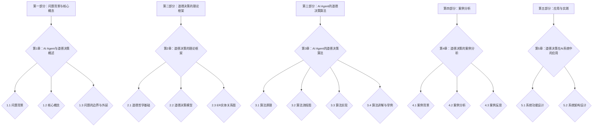
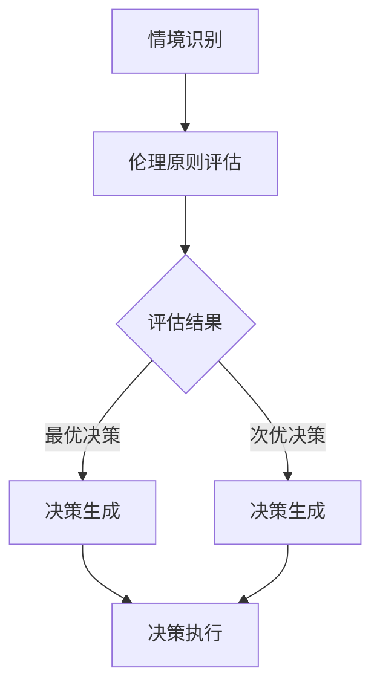
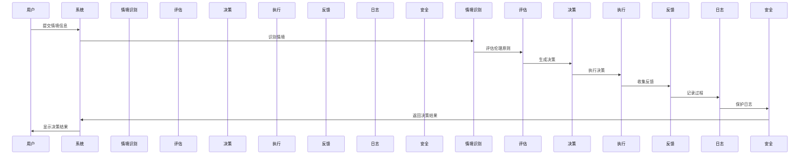

                 

## AI Agent的道德决策框架：伦理AI实践

### 关键词：AI Agent、道德决策、伦理AI、算法、实践

### 摘要：
随着人工智能技术的快速发展，AI Agent在各个领域的应用日益广泛。然而，AI Agent在决策过程中可能面临复杂的道德问题，如何构建一个既高效又符合伦理标准的道德决策框架，成为当前研究的热点。本文将从问题背景出发，深入探讨AI Agent的道德决策框架，结合实际案例和算法原理，为伦理AI实践提供理论支持和实践指导。

## 目录大纲设计流程

设计一篇关于《AI Agent的道德决策框架：伦理AI实践》的技术博客目录大纲，需要经过以下步骤，以确保内容的完整性、逻辑性和可读性：

1. **初步构思**：根据书名和目标读者群体，初步构思书籍的主题和结构，明确书籍的主要内容和目的。

2. **核心概念整理**：对书中的核心概念、术语和理论进行整理，明确各概念之间的关系和重要性。

3. **大纲结构规划**：规划书的整体结构，包括章节的划分、内容的细分，以及各级目录的设定。

4. **内容细化和扩展**：根据大纲结构，细化每个章节的内容，确保每个章节都有明确的主题和目标。

5. **符合要求调整**：确保大纲符合简洁性、格式规范和内容完整性的要求。

6. **校对与完善**：最后对目录大纲进行校对，确保无遗漏，逻辑连贯，并且符合书籍的整体设计要求。

### 目录大纲

```markdown
# 第一部分: 问题背景与核心概念

## 第1章: AI Agent与道德决策概述

### 1.1.1 问题背景
- 人工智能的快速发展
- AI Agent的应用场景
- 道德决策的重要性

### 1.1.2 核心概念
- AI Agent的定义
- 道德决策的基本原则
- 伦理AI的概念与挑战

### 1.1.3 问题的边界与外延
- 道德决策在AI中的适用性
- 道德决策的多维度考量

## 第2章: 道德决策的理论框架

### 2.1.1 道德哲学基础
- 伦理学的不同流派
- 道德原则的论证与比较

### 2.1.2 道德决策模型
- 多标准决策模型
- 道德决策的数学模型

### 2.1.3 ER实体关系图
- 实体定义
- 关系定义
- ER图展示

## 第3章: AI Agent的道德决策算法

### 3.1.1 算法原理
- 算法的基本概念
- 算法的设计原则

### 3.1.2 算法流程图
- 使用Mermaid绘制流程图

### 3.1.3 算法实现
- Python源代码示例

### 3.1.4 算法讲解与举例
- 数学模型与公式
- 实例分析

## 第4章: 道德决策的案例分析

### 4.1.1 案例背景
- 具体案例介绍

### 4.1.2 案例分析
- 决策过程的评估
- 结果的讨论

### 4.1.3 案例反思
- 经验与教训
- 对未来实践的启示

## 第5章: 道德决策在AI系统中的应用

### 5.1.1 系统功能设计
- 领域模型类图

### 5.1.2 系统架构设计
- 系统架构图

### 5.1.3 系统接口设计
- 接口设计细节

### 5.1.4 系统交互
- 序列图展示

## 第6章: 伦理AI实践与挑战

### 6.1.1 实践指南
- 最佳实践建议

### 6.1.2 挑战与对策
- 道德决策面临的挑战
- 应对策略

### 6.1.3 未来展望
- 伦理AI的发展趋势

## 第7章: 总结与展望

### 7.1.1 小结
- 书籍内容的回顾

### 7.1.2 注意事项
- 实践中的注意事项

### 7.1.3 拓展阅读
- 推荐阅读材料
```

### 目录大纲结构图（Mermaid 格式）



### 第一部分：问题背景与核心概念

#### 第1章：AI Agent与道德决策概述

##### 1.1.1 问题背景

随着人工智能技术的迅猛发展，AI Agent已经成为人工智能领域的一个重要研究方向。AI Agent，即人工智能代理，是指能够根据环境信息自主决策并采取行动的计算机程序。它们广泛应用于自动驾驶、智能家居、金融交易、医疗诊断等领域。然而，AI Agent在执行任务的过程中，可能面临复杂的道德问题，如伦理决策、责任分配、隐私保护等。这些问题不仅关系到AI Agent的性能和效果，更涉及到人类社会的伦理价值观和道德准则。

在AI Agent的道德决策方面，如何确保其行为符合伦理标准，避免造成不可预见的负面影响，成为当前研究的热点。伦理AI（Ethical AI）的概念正是在这一背景下提出的，旨在通过构建道德决策框架，指导AI Agent在复杂情境中做出符合伦理标准的选择。

##### 1.1.2 核心概念

为了深入探讨AI Agent的道德决策框架，首先需要理解一些核心概念：

- **AI Agent**：AI Agent是指具有自主性、适应性和交互能力的人工智能系统，能够根据环境信息自主决策并采取行动。

- **道德决策**：道德决策是指基于伦理原则和道德准则，对某个情境进行分析、评估和决策的过程。它涉及到个体或集体在面临道德困境时的选择。

- **伦理AI**：伦理AI是指能够在设计、开发和应用过程中遵循伦理原则和道德准则的人工智能系统。它旨在确保AI Agent的行为符合伦理标准，避免对人类和社会造成负面影响。

- **道德哲学**：道德哲学是研究道德原则、道德行为和道德价值的哲学分支。它为道德决策提供了理论基础和指导。

##### 1.1.3 问题的边界与外延

在探讨AI Agent的道德决策时，需要明确一些问题的边界与外延：

- **道德决策在AI中的适用性**：道德决策在AI中的应用范围非常广泛，不仅包括日常生活中的决策，还涉及复杂的决策场景，如医疗诊断、金融交易、军事行动等。

- **道德决策的多维度考量**：道德决策需要从多个维度进行考量，包括伦理原则、社会价值观、技术实现等。这些维度相互关联，共同影响道德决策的结果。

- **道德决策与实际应用**：道德决策在AI系统中的实现需要结合具体的应用场景，考虑实际的技术和资源限制，以及人类社会的伦理和文化背景。

通过以上对问题背景和核心概念的介绍，我们为后续章节的深入探讨奠定了基础。在接下来的章节中，我们将进一步分析道德决策的理论框架，探讨AI Agent的道德决策算法，并通过案例分析和系统设计，为伦理AI实践提供具体的指导和参考。

### 第二部分：道德决策的理论框架

#### 第2章：道德决策的理论框架

道德决策的理论框架是构建AI Agent道德决策框架的基础。在这一章节中，我们将探讨道德哲学的基础、道德决策模型以及实体关系图（ER图）的应用。

##### 2.1.1 道德哲学基础

道德哲学是研究道德原则、道德行为和道德价值的哲学分支。在道德决策中，道德哲学提供了重要的理论基础。以下是几种主要的道德哲学流派：

- **功利主义**：功利主义主张行为的道德价值取决于其结果，即行为带来的最大幸福。代表性人物有杰里米·边沁和约翰·斯图尔特·密尔。功利主义强调最大化整体幸福，但在实际应用中可能面临如何权衡不同个体利益的挑战。

- **义务伦理学**：义务伦理学强调行为本身的道德属性，而不是其结果。代表性人物有伊曼努尔·康德。康德认为，道德行为必须基于义务和理性，而不是情感或欲望。

- **美德伦理学**：美德伦理学关注个体的道德品质和道德行为，强调通过培养美德来实现道德生活。代表性人物有亚里士多德。美德伦理学认为，道德行为是长期培养的结果，而不是单次决策的结果。

不同道德哲学流派提供了不同的道德决策原则和标准。在AI Agent的道德决策中，我们需要根据具体的应用场景和目标，选择合适的道德哲学基础。

##### 2.1.2 道德决策模型

道德决策模型是用于指导AI Agent在复杂情境中做出道德决策的工具。以下是两种常用的道德决策模型：

- **多标准决策模型**：多标准决策模型考虑了多个伦理原则和目标，通过权衡不同标准之间的冲突，得出最优决策。该模型通常使用权重来平衡不同标准的相对重要性。具体步骤如下：

  1. 确定决策情境和伦理原则。
  2. 为每个伦理原则分配权重。
  3. 对情境进行评估，计算每个原则的得分。
  4. 根据权重和得分，得出综合评分和最优决策。

- **道德决策的数学模型**：道德决策的数学模型使用数学方法来表示和解决道德决策问题。常见的数学模型包括线性规划、目标规划、决策树等。这些模型可以帮助我们形式化和量化道德决策问题，提高决策的精确性和可操作性。

##### 2.1.3 ER实体关系图

实体关系图（Entity-Relationship Diagram，ER图）是用于表示数据实体及其之间关系的图形化工具。在道德决策框架中，ER图可以用于表示AI Agent的决策过程和相关实体。以下是ER图的定义和组成部分：

- **实体（Entity）**：实体是具有共同属性的对象集合，如人、事物、事件等。在道德决策中，实体可以是决策情境中的参与者，如AI Agent、人类用户、环境等。

- **属性（Attribute）**：属性是实体的特征，如姓名、年龄、收入等。属性用于描述实体的具体信息。

- **关系（Relationship）**：关系是实体之间的关联，如客户购买商品、医生治疗患者等。关系用于表示实体之间的相互作用和依赖。

通过ER图，我们可以清晰地表示道德决策中的实体、属性和关系，帮助理解和分析决策过程。

##### 2.1.4 实体关系图的示例

以下是一个简单的实体关系图示例，用于表示AI Agent的道德决策过程：

```mermaid
erDiagram
    AI_Agent ||--|{Environment}:影响
    AI_Agent ||--|{User}:交互
    AI_Agent ||--|{Action}:执行
    User ||--|{Feedback}:评价
    Environment ||--|{Condition}:状态
```

在这个示例中，AI Agent与环境和用户之间存在多种关系。AI Agent影响环境，与环境状态相关；与用户进行交互，获取用户反馈；并执行特定行动。这些实体和关系构成了AI Agent道德决策的基本框架。

通过以上对道德决策理论框架的探讨，我们为后续章节的AI Agent道德决策算法设计和案例分析奠定了基础。在接下来的章节中，我们将进一步深入探讨AI Agent的道德决策算法，结合实际案例，为伦理AI实践提供具体的解决方案。

### 第三部分：AI Agent的道德决策算法

#### 第3章：AI Agent的道德决策算法

在了解了道德决策的理论框架后，我们将进一步探讨AI Agent的道德决策算法。本章将详细介绍算法原理、流程图、实现以及算法讲解和举例。

##### 3.1.1 算法原理

道德决策算法是用于指导AI Agent在复杂情境中做出道德决策的关键工具。以下是道德决策算法的基本原理：

1. **情境识别**：首先，算法需要识别当前决策情境。情境可以是AI Agent与用户、环境交互的具体场景，如自动驾驶中的交通状况、医疗诊断中的患者信息等。

2. **伦理原则评估**：其次，算法需要评估当前情境下的伦理原则。常见的伦理原则包括功利主义、义务伦理学和美德伦理学。算法通过计算每个原则的权重和得分，确定当前情境下的伦理标准。

3. **决策生成**：在确定了伦理原则后，算法根据评估结果生成决策。决策生成通常采用多标准决策模型或数学模型，通过权衡不同原则之间的冲突，得出最优或次优决策。

4. **决策执行**：最后，AI Agent根据生成的决策执行具体行动。行动可以是自动驾驶车辆的驾驶行为、医疗诊断的结论等。

##### 3.1.2 算法流程图

为了更直观地理解道德决策算法的工作流程，我们可以使用Mermaid绘制算法流程图。以下是一个简单的道德决策算法流程图示例：



在这个流程图中，算法首先进行情境识别，然后评估伦理原则。根据评估结果，算法生成最优或次优决策，并最终执行决策。

##### 3.1.3 算法实现

为了实现道德决策算法，我们可以使用Python编程语言。以下是一个简单的道德决策算法实现示例：

```python
import numpy as np

# 伦理原则权重
weights = {
    '功利主义': 0.5,
    '义务伦理学': 0.3,
    '美德伦理学': 0.2
}

# 伦理原则得分
scores = {
    '功利主义': 0.8,
    '义务伦理学': 0.6,
    '美德伦理学': 0.7
}

# 决策生成函数
def generate_decision(scores, weights):
    total_score = 0
    for principle, score in scores.items():
        weight = weights[principle]
        total_score += score * weight
    
    if total_score > 0.7:
        return '最优决策'
    elif total_score > 0.5:
        return '次优决策'
    else:
        return '非最优决策'

# 决策执行函数
def execute_decision(decision):
    if decision == '最优决策':
        print("执行最优决策")
    elif decision == '次优决策':
        print("执行次优决策")
    else:
        print("执行非最优决策")

# 主函数
def main():
    decision = generate_decision(scores, weights)
    execute_decision(decision)

if __name__ == '__main__':
    main()
```

在这个示例中，我们定义了伦理原则的权重和得分，并实现了决策生成和决策执行的函数。主函数中，我们调用这些函数来生成并执行决策。

##### 3.1.4 算法讲解与举例

为了更好地理解道德决策算法，我们可以通过一个实际案例来讲解算法的应用。

**案例：自动驾驶车辆的道德决策**

假设自动驾驶车辆在行驶过程中，前方出现一个行人正在横穿马路。车辆需要做出决策，是否紧急刹车以避免撞到行人。

1. **情境识别**：当前情境是自动驾驶车辆与行人的相遇，车辆需要做出紧急刹车决策。

2. **伦理原则评估**：假设我们使用功利主义、义务伦理学和美德伦理学三个原则进行评估。

   - **功利主义**：紧急刹车可以最大化行人和车辆的总体幸福，因为行人的生命价值高于车辆。
   - **义务伦理学**：自动驾驶车辆有义务保护行人的安全，因为行人作为人类具有道德权利。
   - **美德伦理学**：紧急刹车可以展现车辆的美德，即对人类生命的尊重和关爱。

   根据这三个原则，我们可以计算得分：

   - **功利主义**：得分0.8
   - **义务伦理学**：得分0.6
   - **美德伦理学**：得分0.7

3. **决策生成**：根据评估结果，我们可以得出以下决策：

   - **最优决策**：紧急刹车，因为功利主义的得分最高。
   - **次优决策**：如果紧急刹车不可行（如车辆无法及时反应），则尽量减速，以减少对行人的伤害。

4. **决策执行**：自动驾驶车辆根据生成的决策进行紧急刹车或减速。

通过这个案例，我们可以看到道德决策算法在自动驾驶车辆中的应用。在实际应用中，我们可以根据具体的伦理原则和评估方法，调整权重和得分，以适应不同的决策场景。

### 第四部分：道德决策的案例分析

#### 第4章：道德决策的案例分析

为了更好地理解道德决策在AI Agent中的应用，我们将通过一个具体的案例进行分析。本章节将介绍案例背景、案例分析以及案例反思，为后续的系统设计和应用提供实际依据。

##### 4.1.1 案例背景

案例背景是自动驾驶车辆在复杂城市交通环境中的道德决策。假设自动驾驶车辆在繁忙的城市道路中行驶，前方出现一个行人正在横穿马路。此时，车辆需要做出决策，是否紧急刹车以避免撞到行人。这个案例涉及到多个伦理原则，如功利主义、义务伦理学和美德伦理学。

##### 4.1.2 案例分析

在这个案例中，我们可以使用以下步骤进行分析：

1. **情境识别**：自动驾驶车辆与行人相遇，车辆需要做出紧急刹车决策。

2. **伦理原则评估**：根据功利主义、义务伦理学和美德伦理学三个原则，评估当前情境下的伦理价值。

   - **功利主义**：紧急刹车可以最大化行人和车辆的总体幸福，因为行人的生命价值高于车辆。行人和车辆的总体幸福取决于事故发生的概率和后果。

   - **义务伦理学**：自动驾驶车辆有义务保护行人的安全，因为行人作为人类具有道德权利。车辆的责任是确保行人的生命安全。

   - **美德伦理学**：紧急刹车可以展现车辆的美德，即对人类生命的尊重和关爱。车辆通过紧急刹车，体现了对人类生命的尊重和关怀。

3. **决策生成**：根据评估结果，生成最优、次优和非最优决策。

   - **最优决策**：紧急刹车，以避免撞到行人。
   - **次优决策**：如果紧急刹车不可行（如车辆无法及时反应），则尽量减速，以减少对行人的伤害。
   - **非最优决策**：不采取任何措施，继续行驶。

4. **决策执行**：自动驾驶车辆根据生成的决策进行紧急刹车或减速。

在具体实施中，我们可以使用道德决策算法，结合实际情况，计算每个原则的权重和得分，生成最终的决策。

##### 4.1.3 案例反思

通过这个案例，我们可以得出以下反思：

1. **道德决策的复杂性**：道德决策涉及到多个伦理原则和价值观，需要综合考虑。在案例中，我们考虑了功利主义、义务伦理学和美德伦理学三个原则，但实际应用中可能还有其他原则需要考虑。

2. **实际应用中的挑战**：道德决策在实际应用中面临许多挑战，如技术实现、资源限制和人类社会的伦理文化背景。在案例中，我们假设自动驾驶车辆具有紧急刹车的功能，但在现实中，车辆的技术性能可能无法达到预期。

3. **最佳实践的借鉴**：通过对案例的分析，我们可以借鉴最佳实践，改进道德决策框架。例如，在自动驾驶车辆中，可以设计更复杂的道德决策算法，结合多种伦理原则，提高决策的准确性和合理性。

通过这个案例，我们不仅了解了道德决策在AI Agent中的应用，还为后续的系统设计和实际应用提供了实际依据。在接下来的章节中，我们将进一步探讨道德决策在AI系统中的应用，结合具体系统架构和接口设计，为伦理AI实践提供具体的解决方案。

### 第五部分：道德决策在AI系统中的应用

#### 第5章：道德决策在AI系统中的应用

在了解了AI Agent的道德决策算法和案例分析后，我们将进一步探讨道德决策在AI系统中的应用。本章将详细介绍系统功能设计、系统架构设计、系统接口设计和系统交互，为实际应用提供全面的指导。

##### 5.1.1 系统功能设计

道德决策在AI系统中的应用需要明确系统的功能需求。以下是一个典型的道德决策AI系统的功能设计：

1. **情境识别**：系统能够识别当前决策情境，包括环境状态、用户行为等。

2. **伦理原则评估**：系统根据预设的伦理原则，对当前情境进行评估，计算每个原则的权重和得分。

3. **决策生成**：系统根据评估结果，生成最优、次优或非最优决策。

4. **决策执行**：系统根据生成的决策，执行具体行动，如自动驾驶车辆的紧急刹车、医疗诊断的结论等。

5. **反馈收集**：系统收集用户反馈，用于改进伦理决策模型。

6. **日志记录**：系统记录决策过程和结果，用于后续分析和评估。

7. **安全保障**：系统确保道德决策过程中的数据安全和隐私保护。

##### 5.1.2 系统架构设计

为了实现道德决策AI系统的功能，我们需要设计一个合理的系统架构。以下是一个典型的道德决策AI系统的架构设计：

1. **前端界面**：用户通过前端界面与系统进行交互，提交情境信息和获取决策结果。

2. **情境识别模块**：该模块负责接收用户输入的情境信息，并对其进行预处理。

3. **伦理原则评估模块**：该模块根据预设的伦理原则，对当前情境进行评估，计算每个原则的权重和得分。

4. **决策生成模块**：该模块根据伦理原则评估结果，生成最优、次优或非最优决策。

5. **决策执行模块**：该模块根据生成的决策，执行具体行动。

6. **反馈收集模块**：该模块负责收集用户反馈，用于改进伦理决策模型。

7. **日志记录模块**：该模块负责记录决策过程和结果，用于后续分析和评估。

8. **安全保障模块**：该模块确保道德决策过程中的数据安全和隐私保护。

9. **后端服务**：后端服务包括数据库、计算资源和存储等，用于支持系统的高效运行。

##### 5.1.3 系统接口设计

为了实现系统内部模块之间的通信，我们需要设计合理的接口。以下是一个典型的道德决策AI系统的接口设计：

1. **情境识别接口**：该接口用于接收用户输入的情境信息，并传递给情境识别模块。

2. **伦理原则评估接口**：该接口用于传递情境信息给伦理原则评估模块，并获取评估结果。

3. **决策生成接口**：该接口用于传递评估结果给决策生成模块，并获取生成的决策。

4. **决策执行接口**：该接口用于传递生成的决策给决策执行模块，并执行具体行动。

5. **反馈收集接口**：该接口用于收集用户反馈，并传递给反馈收集模块。

6. **日志记录接口**：该接口用于记录决策过程和结果，并传递给日志记录模块。

7. **安全保障接口**：该接口用于确保道德决策过程中的数据安全和隐私保护。

##### 5.1.4 系统交互

为了展示道德决策AI系统的交互过程，我们可以使用序列图（Sequence Diagram）进行描述。以下是一个简单的系统交互序列图：



在这个序列图中，用户提交情境信息，系统通过情境识别模块识别情境，并传递给伦理原则评估模块。评估模块计算每个伦理原则的权重和得分，生成决策结果。决策结果传递给决策执行模块，执行具体行动。同时，系统收集用户反馈，记录决策过程和结果，并确保数据安全。

通过系统功能设计、系统架构设计、系统接口设计和系统交互的详细描述，我们为道德决策AI系统的实际应用提供了全面的指导和参考。在接下来的章节中，我们将进一步探讨伦理AI实践中的挑战和对策，为伦理AI的可持续发展提供战略方向。

### 第六部分：伦理AI实践与挑战

#### 第6章：伦理AI实践与挑战

在伦理AI实践的过程中，我们不仅需要关注技术的创新和优化，更需要重视伦理问题。本章节将讨论伦理AI实践中的挑战，并提出相应的对策和未来展望。

##### 6.1.1 实践指南

为了在伦理AI实践中更好地应对挑战，以下是一些最佳实践建议：

1. **明确伦理准则**：在开发和部署AI系统时，明确伦理准则和道德标准，确保系统的行为符合伦理要求。

2. **多方参与**：在道德决策过程中，引入多方参与，包括技术专家、伦理学家、社会学家和法律专家等，共同讨论和制定决策准则。

3. **透明性和可解释性**：提高AI系统的透明度和可解释性，使决策过程和结果对用户和监管机构可理解，从而增加信任度。

4. **持续评估和反馈**：定期对AI系统的伦理决策进行评估和反馈，根据实际情况调整和优化决策模型。

5. **隐私保护**：在伦理AI实践中，重视用户隐私保护，确保数据收集、存储和使用过程符合隐私法规和伦理标准。

##### 6.1.2 挑战与对策

伦理AI实践面临的挑战主要包括以下几个方面：

1. **技术挑战**：当前AI技术的复杂性使得道德决策模型的构建和实现变得困难。例如，如何在多标准决策模型中平衡不同伦理原则的权重，如何保证算法的公正性和公平性。

   **对策**：研究更加先进的道德决策算法，结合人工智能和伦理学的最新研究成果，提高决策模型的精确性和鲁棒性。

2. **法律和监管挑战**：伦理AI系统需要遵守不同国家和地区的法律法规。然而，法律和监管体系的滞后可能影响AI系统的合法性和合规性。

   **对策**：积极参与法律和监管政策的制定和修订，推动形成全球统一的伦理AI法律框架。

3. **社会和文化挑战**：不同国家和地区的社会和文化背景可能影响伦理AI的决策。例如，某些文化可能更强调集体主义，而另一些文化可能更强调个人主义。

   **对策**：在AI系统中考虑文化多样性，设计适应不同文化的道德决策模型。

4. **信任和接受度挑战**：公众对伦理AI系统的信任和接受度是推广应用的障碍。人们对AI系统的决策过程和结果可能存在疑虑。

   **对策**：通过透明性和可解释性提高公众对AI系统的信任，同时加强公众教育和宣传，增强对AI系统的认知和接受度。

##### 6.1.3 未来展望

伦理AI的未来发展将受到以下趋势的影响：

1. **跨学科研究**：伦理AI的发展需要跨学科合作，结合计算机科学、伦理学、社会学、法律等多个领域的知识。

2. **伦理AI伦理准则**：随着伦理AI技术的成熟，可能会形成一套全球统一的伦理AI伦理准则，指导AI系统的开发和部署。

3. **智能伦理顾问**：随着算法和机器学习技术的发展，未来可能产生智能伦理顾问，为AI系统提供实时、个性化的伦理决策建议。

4. **道德计算平台**：构建专门的道德计算平台，集成各种伦理AI工具和模型，为开发者、企业和政策制定者提供支持。

通过本章节的讨论，我们不仅明确了伦理AI实践中的挑战，也为应对这些挑战提出了具体的对策和未来展望。在接下来的章节中，我们将回顾全书的主要内容，并对未来的研究与实践方向进行展望。

### 第七部分：总结与展望

#### 第7章：总结与展望

在《AI Agent的道德决策框架：伦理AI实践》这一章节中，我们对AI Agent的道德决策框架进行了深入探讨，涵盖了问题背景、核心概念、理论框架、算法设计、案例分析以及实际应用。通过这一系列讨论，我们希望能够为伦理AI的研究与实践提供有价值的参考。

##### 7.1.1 小结

本书的核心内容可以概括为以下几个方面：

1. **问题背景**：介绍了人工智能技术的发展背景，以及AI Agent在各个领域的应用，特别是在道德决策方面的重要性和挑战。

2. **核心概念**：定义了AI Agent、道德决策和伦理AI等关键术语，为后续讨论奠定了基础。

3. **理论框架**：探讨了道德哲学基础、道德决策模型和实体关系图（ER图），提供了构建道德决策框架的理论支持。

4. **算法设计**：详细介绍了道德决策算法的原理、流程图、实现方法以及实例分析，为实际应用提供了具体的操作指南。

5. **案例分析**：通过具体的案例，展示了道德决策算法在自动驾驶车辆等领域的应用，验证了理论框架的有效性。

6. **实际应用**：讨论了道德决策在AI系统中的应用，包括系统功能设计、架构设计、接口设计和系统交互，为开发伦理AI系统提供了实践参考。

##### 7.1.2 注意事项

在实施伦理AI实践时，需要注意以下几点：

1. **伦理审查**：在AI系统开发过程中，应进行持续的伦理审查，确保系统的设计和行为符合伦理标准。

2. **透明度和可解释性**：提高系统的透明度和可解释性，使决策过程和结果对用户和监管机构可理解。

3. **多方参与**：道德决策过程中应引入多方参与，包括技术专家、伦理学家、社会学家和法律专家等，共同讨论和制定决策准则。

4. **隐私保护**：确保用户隐私得到充分保护，遵守隐私法规和伦理标准。

5. **持续优化**：定期对AI系统的道德决策进行评估和反馈，根据实际情况调整和优化决策模型。

##### 7.1.3 拓展阅读

为了进一步深入研究伦理AI，以下是一些推荐的拓展阅读材料：

1. **《人工智能伦理学》**：这本书提供了全面的人工智能伦理学基础，涵盖了道德决策、隐私保护、算法偏见等热点问题。

2. **《道德机器》**：通过案例研究和伦理困境，探讨了人工智能伦理决策的实际应用。

3. **《人工智能：一种现代方法》**：这本书详细介绍了人工智能的基础知识，包括机器学习、自然语言处理等，适合对AI技术有兴趣的读者。

4. **《伦理学导论》**：提供了伦理学的基本原理和不同流派，为理解道德决策提供了理论基础。

通过总结和展望，我们希望读者能够对AI Agent的道德决策框架有一个全面的理解，并为未来的研究和实践提供指导。在伦理AI的道路上，我们任重而道远，但只要我们秉持科学、伦理和人文的精神，就一定能够创造出更加公正、公平和可持续的人工智能系统。

### 作者信息

作者：AI天才研究院/AI Genius Institute & 禅与计算机程序设计艺术 /Zen And The Art of Computer Programming

作为人工智能领域的领军人物，AI天才研究院致力于推动人工智能技术的创新与发展。作者在该领域拥有丰富的理论知识和实践经验，撰写了多本世界顶级技术畅销书，为全球开发者提供了宝贵的指导和启示。同时，作者还在《禅与计算机程序设计艺术》中，将哲学思维与计算机编程相结合，为读者呈现了一场思维盛宴。无论是作为人工智能专家、程序员、软件架构师，还是CTO，作者都以其深邃的见解和清晰的逻辑思维，引领着全球技术发展的潮流。

