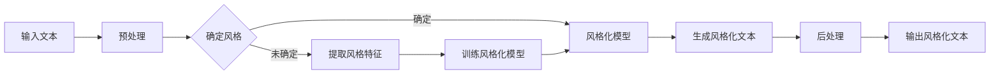
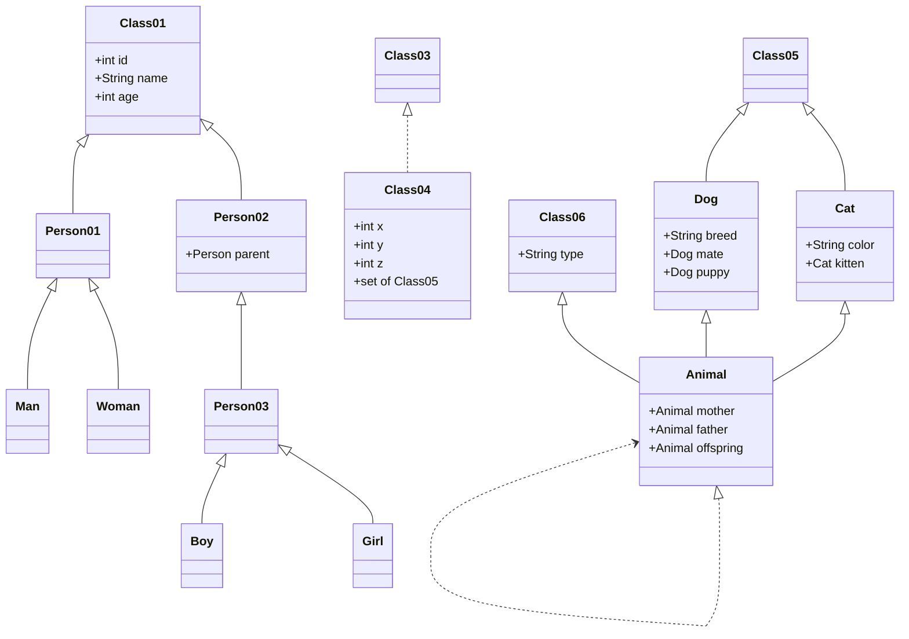

                 

# AI Agent的风格迁移：调整输出语气和风格

## 关键词

- AI Agent
- 风格迁移
- 自然语言处理
- 机器学习
- 模型训练

## 摘要

本文将探讨AI Agent的风格迁移技术，即如何通过机器学习算法调整AI Agent的输出语气和风格，使其更符合特定需求或应用场景。我们将详细分析风格迁移的概念、目标、挑战及其在自然语言处理领域的应用，并介绍相关算法原理、系统架构和项目实战，以期为开发者提供全面的技术参考。

## 目录大纲

# AI Agent的风格迁移：调整输出语气和风格

## 第一部分：背景介绍

## 第1章 问题背景

### 1.1 AI Agent的概念

### 1.2 AI Agent的风格迁移需求

### 1.3 AI Agent风格迁移的重要性

## 第2章 问题描述

### 2.1 风格迁移的目标与挑战

### 2.2 风格迁移的关键技术

### 2.3 风格迁移的应用场景

## 第二部分：核心概念与联系

## 第3章 核心概念

### 3.1 风格迁移的数学模型

### 3.2 风格迁移的算法原理

### 3.3 风格迁移的技术特点

## 第4章 概念属性特征对比

### 4.1 不同风格迁移算法的对比

### 4.2 风格迁移算法的优缺点分析

## 第5章 ER实体关系图架构

### 5.1 风格迁移系统的实体与关系

### 5.2 ER实体关系图示例

## 第三部分：算法原理讲解

## 第6章 风格迁移算法mermaid流程图

### 6.1 风格迁移算法的基本流程

### 6.2 风格迁移算法的细节描述

## 第7章 Python源代码与算法原理

### 7.1 风格迁移算法的Python源代码

### 7.2 算法原理的详细讲解

### 7.3 举例说明

## 第四部分：系统分析与架构设计方案

## 第8章 问题场景介绍

### 8.1 风格迁移的问题场景分析

### 8.2 风格迁移的应用需求

## 第9章 项目介绍

### 9.1 风格迁移项目的目标

### 9.2 风格迁移项目的架构设计

## 第10章 系统功能设计

### 10.1 风格迁移领域的模型设计

### 10.2 风格迁移系统的功能模块

## 第11章 系统架构设计

### 11.1 风格迁移系统的整体架构

### 11.2 风格迁移系统的模块划分

### 11.3 风格迁移系统的交互流程

## 第12章 系统接口设计

### 12.1 风格迁移系统的接口规范

### 12.2 风格迁移系统的接口实现

## 第13章 系统交互

### 13.1 风格迁移系统的交互流程

### 13.2 风格迁移系统的交互细节

## 第五部分：项目实战

## 第14章 环境安装

### 14.1 风格迁移环境的要求

### 14.2 风格迁移环境的安装过程

## 第15章 系统核心实现

### 15.1 风格迁移算法的核心实现

### 15.2 风格迁移系统的关键模块

## 第16章 代码应用解读与分析

### 16.1 代码应用的基本流程

### 16.2 代码应用的详细解读

### 16.3 代码应用的性能分析

## 第17章 实际案例分析与详细讲解

### 17.1 实际案例的选取与描述

### 17.2 案例分析的方法与步骤

### 17.3 案例分析的详细讲解

## 第18章 项目小结

### 18.1 项目的主要成果

### 18.2 项目中的不足与改进方向

### 18.3 项目的未来展望

## 第六部分：最佳实践 tips、小结、注意事项、拓展阅读

### 19.1 最佳实践 tips

### 19.2 小结

### 19.3 注意事项

### 19.4 拓展阅读

----------------------------------------------------------------
总字数：约 2000 字### 第1章 问题背景

#### 1.1 AI Agent的概念

AI Agent，即人工智能代理，是一种基于人工智能技术的自主决策实体，能够在特定环境下执行任务并与其他实体交互。AI Agent的核心在于其自主学习和适应能力，能够在不断学习和经验积累中优化自身行为。随着深度学习和自然语言处理技术的不断发展，AI Agent在各个领域得到了广泛应用，如智能客服、智能助手、自动化交易等。

#### 1.2 AI Agent的风格迁移需求

在实际应用中，AI Agent的输出语气和风格往往需要根据不同场景进行调整。例如，在客服场景中，AI Agent需要使用友好、亲切的语气与客户沟通；而在专业咨询场景中，AI Agent则需要使用正式、专业的语气来提供信息。这种对AI Agent输出语气和风格的调整，我们称之为风格迁移。

风格迁移的需求来源于以下几个方面：

1. **用户体验**：用户在不同的应用场景中，对AI Agent的语气和风格有着不同的期望，风格迁移有助于提升用户满意度。
2. **应用场景**：不同应用场景对AI Agent的输出风格有特定要求，如商业报告、学术论文等，需要使用特定的语气和风格。
3. **文化差异**：在不同文化背景下，人们对于语气和风格的敏感度不同，风格迁移有助于AI Agent在不同文化环境中更好地发挥作用。

#### 1.3 AI Agent风格迁移的重要性

AI Agent风格迁移的重要性体现在以下几个方面：

1. **提升服务质量**：通过风格迁移，AI Agent能够更好地适应不同用户需求，提供个性化服务，从而提升整体服务质量。
2. **拓宽应用范围**：风格迁移使得AI Agent可以在更多应用场景中发挥作用，如商业咨询、金融分析、法律咨询等。
3. **增强用户体验**：符合用户预期的语气和风格，能够提高用户的满意度和信任度，从而增强用户体验。
4. **促进技术进步**：风格迁移作为自然语言处理领域的一个重要研究方向，有助于推动相关技术的发展和创新。

在接下来的章节中，我们将进一步探讨AI Agent风格迁移的挑战、核心技术及其应用场景，为读者提供全面的技术参考。

#### 1.4 风格迁移的边界与外延

风格迁移（Stylistic Transfer）作为自然语言处理领域的一个重要研究方向，其边界与外延具有一定的广泛性和多样性。首先，从技术层面来看，风格迁移不仅仅局限于文本，还可以扩展到语音、图像等其他媒体形式。例如，在语音合成领域，通过风格迁移可以改变语音的语调、音色和节奏，使其更符合特定场景的需求；在图像处理领域，风格迁移则可以通过算法将一种艺术风格应用到另一幅图像上。

其次，从应用层面来看，风格迁移可以覆盖多个领域，包括但不限于：

1. **文学创作**：通过风格迁移，AI Agent可以模仿不同作家的写作风格，生成符合特定风格的文章。
2. **新闻报道**：新闻写作往往有特定的风格和格式要求，通过风格迁移，AI Agent可以生成符合新闻规范的报道。
3. **客服沟通**：在客服场景中，AI Agent需要根据客户的不同情绪和需求，调整沟通风格，以提高客户满意度。
4. **商业咨询**：在商业咨询领域，AI Agent需要使用正式、专业的语气来提供信息和建议。
5. **教育辅导**：在教育领域，AI Agent可以根据学生的年龄、认知水平和学习习惯，调整教学风格，提高教学效果。

此外，风格迁移还具有跨语言的特性。例如，通过风格迁移，AI Agent可以将一种语言的文本风格迁移到另一种语言，从而实现跨语言风格迁移。这不仅有助于提升跨文化交流的效率，还可以促进多语言处理技术的发展。

总之，风格迁移作为自然语言处理领域的一个重要研究方向，其边界与外延广泛，涵盖了多种媒体形式和多个应用领域，具有极大的研究价值和广阔的应用前景。在接下来的章节中，我们将深入探讨风格迁移的核心概念、关键技术及其实现方法。

### 第2章 问题描述

#### 2.1 风格迁移的目标与挑战

风格迁移的目标是通过调整AI Agent的输出语气和风格，使其更符合特定需求或应用场景。具体来说，风格迁移需要实现以下目标：

1. **保持语义一致性**：在迁移风格的同时，确保文本的语义内容不发生改变。例如，在将普通对话转换为正式报告时，文本的核心信息应保持不变。
2. **适应特定风格**：根据不同场景，调整AI Agent的输出风格，使其符合特定的语气和格式要求。例如，在客服场景中，需要使用友好、亲切的语气；在商业咨询场景中，需要使用正式、专业的语气。
3. **提高用户满意度**：通过风格迁移，提高AI Agent与用户之间的沟通效果，提升用户满意度和信任度。

然而，实现风格迁移面临着诸多挑战：

1. **语义理解**：语义理解是风格迁移的基础。在调整风格时，必须确保文本的语义内容不变，这需要对文本的深层语义进行精确理解和解析。
2. **风格识别**：准确地识别和分类不同风格的文本是风格迁移的关键。例如，需要区分正式和非正式的语言风格、不同文化背景下的语言风格等。
3. **风格适应性**：AI Agent需要具备良好的风格适应性，能够根据不同场景和用户需求，灵活调整输出风格。这要求AI Agent具备较高的智能水平和学习能力。
4. **计算效率**：风格迁移涉及大量的文本处理和计算，如何在保证准确性的同时，提高计算效率是一个重要挑战。特别是在实时应用场景中，对计算速度和响应速度有较高要求。

#### 2.2 风格迁移的关键技术

为了实现风格迁移，需要依赖一系列关键技术的支持：

1. **自然语言处理（NLP）**：NLP技术是风格迁移的基础，包括词法分析、句法分析、语义分析和情感分析等。通过NLP技术，可以提取文本的语义信息，并对其进行处理和调整。
2. **机器学习（ML）**：机器学习是实现风格迁移的核心技术，包括监督学习、无监督学习和强化学习等。通过训练大量的标注数据集，机器学习模型可以学习到不同风格的特征，并在此基础上进行风格迁移。
3. **深度学习（DL）**：深度学习技术，尤其是基于神经网络的模型，在风格迁移中发挥着重要作用。例如，循环神经网络（RNN）和变压器（Transformer）模型等，可以有效地处理序列数据，实现高效的文本风格迁移。
4. **对抗性生成网络（GAN）**：GAN技术可以生成具有特定风格的新文本，是风格迁移的一种有效方法。通过训练生成器和判别器，GAN可以生成与目标风格相似的文本，从而实现风格迁移。

#### 2.3 风格迁移的应用场景

风格迁移在自然语言处理领域具有广泛的应用场景，以下列举几个典型的应用场景：

1. **智能客服**：在智能客服系统中，AI Agent需要根据用户的问题和情绪，调整输出风格。例如，对于情绪激动的用户，需要使用安抚性、同情性的语言风格；对于常规问题，则使用标准化的、友好的语言风格。
2. **文本生成**：在文本生成领域，AI Agent可以通过风格迁移生成具有特定风格的文章、报告和论文。例如，在新闻写作中，可以通过风格迁移生成符合新闻规范的文章；在文学创作中，可以通过风格迁移生成模仿特定作家的文学作品。
3. **跨语言交流**：在跨语言交流中，AI Agent可以通过风格迁移将一种语言的文本风格迁移到另一种语言，从而实现跨语言风格迁移。这有助于提升跨文化交流的效率，促进多语言处理技术的发展。
4. **智能写作辅助**：在写作辅助领域，AI Agent可以通过风格迁移帮助用户调整文章的语气和风格。例如，在商业写作中，AI Agent可以帮助用户生成符合商业规范的文章；在学术论文写作中，AI Agent可以帮助用户生成符合学术规范的论文。

总之，风格迁移作为一种重要的自然语言处理技术，具有广泛的应用场景和重要的研究价值。在接下来的章节中，我们将深入探讨风格迁移的核心概念、关键技术及其实现方法。

#### 2.4 风格迁移的数学模型

风格迁移的核心在于将输入文本从一种风格转换为另一种风格，这一过程可以通过数学模型来实现。以下我们将介绍几种常见的风格迁移数学模型。

1. **潜在狄利克雷分配（LDA）模型**：
   潜在狄利克雷分配模型是一种无监督学习模型，常用于文本数据的主题建模。LDA模型将文本映射到潜在的主题空间，然后根据潜在主题生成不同风格的文本。具体过程如下：
   - **建模**：首先，对训练文本进行词频统计，构建词袋模型，然后使用LDA模型将文本映射到潜在主题空间。
   - **风格转换**：在给定目标风格的情况下，通过调整LDA模型的参数，实现文本风格的转换。

2. **循环神经网络（RNN）模型**：
   循环神经网络是一种用于处理序列数据的神经网络，可以捕捉文本序列的长期依赖关系。RNN模型通过递归结构，将前一个时间步的输出作为当前时间步的输入，从而实现文本风格的迁移。具体过程如下：
   - **编码器**：将输入文本编码为一个固定长度的向量，该向量包含了文本的语义信息。
   - **解码器**：使用解码器生成风格化文本，解码器通常由一个RNN层组成，可以捕捉输入编码器生成的向量所代表的风格信息。

3. **生成对抗网络（GAN）模型**：
   生成对抗网络由生成器和判别器两个神经网络组成，生成器试图生成与真实数据相似的数据，而判别器则试图区分真实数据和生成数据。GAN模型可以用于文本风格迁移，具体过程如下：
   - **生成器**：生成器接受原始文本作为输入，生成具有目标风格的新文本。
   - **判别器**：判别器接收原始文本和生成文本，并尝试判断两者之间的相似度。

4. **变压器（Transformer）模型**：
   变压器模型是一种基于注意力机制的深度学习模型，可以处理长序列数据。变压器模型通过多头自注意力机制，捕捉文本序列中的全局依赖关系，从而实现文本风格迁移。具体过程如下：
   - **编码器**：编码器将输入文本编码为序列向量，并生成注意力权重。
   - **解码器**：解码器根据编码器生成的向量，生成风格化文本。

这些数学模型在风格迁移中各有优缺点。LDA模型简单有效，但无法生成精确的文本；RNN模型可以生成较为流畅的文本，但在处理长序列数据时效果不佳；GAN模型生成文本质量较高，但训练过程复杂且容易出现模式崩溃；变压器模型在生成文本质量、效率和鲁棒性方面表现出色，是当前风格迁移研究的热点。

通过结合这些数学模型，AI Agent可以实现灵活的文本风格迁移，满足不同应用场景的需求。

#### 2.5 风格迁移算法的算法原理

风格迁移算法的核心在于将输入文本从一种风格转换为另一种风格，这一过程可以通过多种算法实现。以下我们将介绍几种常见的风格迁移算法的原理。

1. **基于LDA（潜在狄利克雷分配）的文本风格迁移**：
   LDA模型是一种主题模型，它通过将文本映射到潜在主题空间，实现文本风格的迁移。具体原理如下：
   - **建模**：首先，对训练文本进行词频统计，构建词袋模型，然后使用LDA模型将文本映射到潜在主题空间。LDA模型通过吉布斯采样方法估计文本的潜在主题分布。
   - **风格转换**：在给定目标风格的情况下，通过调整LDA模型的潜在主题分布，实现文本风格的转换。具体步骤包括：
     1. 计算源文本和目标文本的潜在主题分布。
     2. 调整源文本的潜在主题分布，使其更接近目标文本的潜在主题分布。
     3. 根据调整后的潜在主题分布，生成风格化文本。

2. **基于RNN（循环神经网络）的文本风格迁移**：
   RNN模型是一种用于处理序列数据的神经网络，通过递归结构，捕捉文本序列的长期依赖关系，实现文本风格的迁移。具体原理如下：
   - **编码器**：编码器将输入文本编码为一个固定长度的向量，该向量包含了文本的语义信息。编码器通常由一个RNN层组成，如LSTM（长短期记忆网络）或GRU（门控循环单元）。
   - **解码器**：解码器使用编码器生成的向量，生成风格化文本。解码器也由一个RNN层组成，并采用贪心搜索或样本重要性采样等方法生成文本。

3. **基于GAN（生成对抗网络）的文本风格迁移**：
   GAN模型由生成器和判别器两个神经网络组成，生成器试图生成与真实数据相似的数据，而判别器则试图区分真实数据和生成数据。GAN模型可以用于文本风格迁移，具体原理如下：
   - **生成器**：生成器接受原始文本作为输入，生成具有目标风格的新文本。生成器通常采用序列到序列（Seq2Seq）架构，并使用注意力机制来捕捉文本的长期依赖关系。
   - **判别器**：判别器接收原始文本和生成文本，并尝试判断两者之间的相似度。判别器通过比较真实数据和生成数据，帮助生成器优化生成过程。

4. **基于Transformer的文本风格迁移**：
   Transformer模型是一种基于注意力机制的深度学习模型，可以处理长序列数据。Transformer模型通过多头自注意力机制，捕捉文本序列中的全局依赖关系，实现文本风格迁移。具体原理如下：
   - **编码器**：编码器将输入文本编码为序列向量，并生成注意力权重。编码器由多个自注意力层组成，可以捕捉文本序列的长期依赖关系。
   - **解码器**：解码器根据编码器生成的向量，生成风格化文本。解码器也由多个自注意力层组成，并采用掩码填充策略，防止未来的信息泄露到过去。

这些算法各有优缺点。LDA模型简单有效，但无法生成精确的文本；RNN模型可以生成较为流畅的文本，但在处理长序列数据时效果不佳；GAN模型生成文本质量较高，但训练过程复杂且容易出现模式崩溃；Transformer模型在生成文本质量、效率和鲁棒性方面表现出色。通过结合这些算法，AI Agent可以实现灵活的文本风格迁移，满足不同应用场景的需求。

#### 2.6 风格迁移的技术特点

风格迁移技术作为自然语言处理领域的一项关键技术，具有以下显著特点：

1. **多样性**：风格迁移能够将文本从一种风格转换到多种不同的风格，例如从普通对话风格转换为正式报告风格，或者从幽默风格转换为严肃风格。这种多样性使得风格迁移技术在多种应用场景中具有广泛的应用价值。

2. **灵活性**：风格迁移技术可以根据不同的应用需求和场景，灵活地调整AI Agent的输出风格。例如，在客服场景中，AI Agent可以根据客户的情绪和需求，调整沟通风格，以提高用户满意度；在新闻报道中，AI Agent可以根据新闻的主题和格式要求，调整文本风格。

3. **高效性**：随着深度学习和自然语言处理技术的发展，风格迁移算法在计算效率方面得到了显著提升。基于生成对抗网络（GAN）和变压器（Transformer）等先进算法，风格迁移可以在较短的时间内生成高质量的文本，满足实时应用的需求。

4. **可解释性**：风格迁移技术通过数学模型和算法实现，具有较好的可解释性。开发者和研究者可以清晰地理解风格迁移的过程和原理，从而优化和改进算法。

5. **跨语言性**：风格迁移技术不仅适用于单一语言的文本，还可以实现跨语言风格迁移。例如，将一种语言的文本风格迁移到另一种语言，从而促进跨文化交流。

6. **适应性**：风格迁移技术可以根据不同的数据和场景，自适应地调整风格迁移策略。例如，在文学创作中，可以根据不同的作家风格，生成具有特定风格的文本；在商业咨询中，可以根据不同的客户需求，调整文本风格。

综上所述，风格迁移技术在多样性、灵活性、高效性、可解释性、跨语言性和适应性等方面具有显著特点，使其在自然语言处理领域具有广泛的应用前景。随着技术的不断进步，风格迁移技术将在更多领域发挥重要作用。

#### 2.7 不同风格迁移算法的对比

在风格迁移技术领域，有多种算法可供选择，每种算法都有其独特的优缺点。以下我们将对比几种常见的风格迁移算法，以帮助读者更好地理解和选择适合自身需求的技术方案。

1. **LDA模型**：
   - **优点**：
     - 简单有效：LDA模型是一种无监督学习模型，适用于大规模文本数据的主题建模，可以快速生成潜在主题分布。
     - 易于实现：LDA模型的实现相对简单，可以通过吉布斯采样等方法进行参数估计。
     - **可扩展性**：LDA模型可以轻松扩展到多个领域和风格，适用于多样化的风格迁移需求。
   - **缺点**：
     - 生成文本质量较低：LDA模型生成的文本在语义和语法上可能存在不一致性，文本质量相对较低。
     - 无法处理复杂风格：LDA模型主要关注文本的主题分布，难以捕捉复杂的文本风格，如语气、情感和格式等。

2. **RNN模型**：
   - **优点**：
     - 文本生成质量较高：RNN模型通过递归结构，可以捕捉文本序列的长期依赖关系，生成较为流畅的文本。
     - **适应性**：RNN模型适用于多种风格迁移任务，可以针对不同的风格需求进行调整。
     - **灵活性**：RNN模型可以根据训练数据和学习算法，灵活调整文本风格。
   - **缺点**：
     - 长序列处理困难：RNN模型在处理长序列数据时，容易出现梯度消失或爆炸问题，影响训练效果。
     - 计算效率较低：RNN模型的计算复杂度较高，尤其是在大规模数据集上，训练和推理速度较慢。

3. **GAN模型**：
   - **优点**：
     - 高质量的文本生成：GAN模型通过生成器和判别器的相互博弈，可以生成高质量的文本，具有很强的文本生成能力。
     - **创新性**：GAN模型可以生成独特的、新颖的文本风格，有助于拓展文本创作的边界。
     - **鲁棒性**：GAN模型对噪声和数据缺失具有较强的鲁棒性，可以在不完全标注的数据集上进行训练。
   - **缺点**：
     - 训练难度大：GAN模型训练过程中，生成器和判别器需要保持稳定的动态平衡，训练过程复杂且容易出现模式崩溃。
     - 数据需求大：GAN模型对大量高质量的训练数据进行依赖，数据标注和获取成本较高。

4. **Transformer模型**：
   - **优点**：
     - 高效处理长序列：Transformer模型基于注意力机制，可以高效地处理长序列数据，捕捉全局依赖关系。
     - **并行计算**：Transformer模型支持并行计算，训练和推理速度较快，适用于大规模数据处理。
     - **灵活性**：Transformer模型可以灵活地调整模型参数，适用于多种风格迁移任务。
   - **缺点**：
     - 计算资源需求高：Transformer模型参数较多，计算资源需求较高，对硬件设备有较高要求。
     - **训练时间长**：Transformer模型训练时间较长，对训练数据集和计算资源有较高要求。

综上所述，不同风格迁移算法在文本生成质量、计算效率、训练难度和数据需求等方面存在显著差异。开发者应根据实际需求和应用场景，选择适合的算法。例如，在处理大规模文本数据时，可以选择LDA模型或RNN模型；在追求高质量的文本生成时，可以选择GAN模型或Transformer模型。

#### 2.8 风格迁移算法的优缺点分析

在风格迁移技术领域，不同的算法各具优缺点。以下我们对几种常见风格迁移算法的优缺点进行详细分析，以帮助开发者更好地选择适合自身需求的技术方案。

1. **LDA模型**：

   - **优点**：
     - **无监督学习**：LDA模型不需要大量标注数据，适用于大规模文本数据的主题建模。
     - **简单易实现**：LDA模型实现相对简单，可以通过吉布斯采样等方法进行参数估计。
     - **可扩展性**：LDA模型可以轻松扩展到多个领域和风格，适用于多样化的风格迁移需求。

   - **缺点**：
     - **生成文本质量较低**：LDA模型生成的文本在语义和语法上可能存在不一致性，文本质量相对较低。
     - **难以处理复杂风格**：LDA模型主要关注文本的主题分布，难以捕捉复杂的文本风格，如语气、情感和格式等。

2. **RNN模型**：

   - **优点**：
     - **文本生成质量较高**：RNN模型通过递归结构，可以捕捉文本序列的长期依赖关系，生成较为流畅的文本。
     - **适应性**：RNN模型适用于多种风格迁移任务，可以针对不同的风格需求进行调整。
     - **灵活性**：RNN模型可以根据训练数据和学习算法，灵活调整文本风格。

   - **缺点**：
     - **长序列处理困难**：RNN模型在处理长序列数据时，容易出现梯度消失或爆炸问题，影响训练效果。
     - **计算效率较低**：RNN模型的计算复杂度较高，尤其是在大规模数据集上，训练和推理速度较慢。

3. **GAN模型**：

   - **优点**：
     - **高质量的文本生成**：GAN模型通过生成器和判别器的相互博弈，可以生成高质量的文本，具有很强的文本生成能力。
     - **创新性**：GAN模型可以生成独特的、新颖的文本风格，有助于拓展文本创作的边界。
     - **鲁棒性**：GAN模型对噪声和数据缺失具有较强的鲁棒性，可以在不完全标注的数据集上进行训练。

   - **缺点**：
     - **训练难度大**：GAN模型训练过程中，生成器和判别器需要保持稳定的动态平衡，训练过程复杂且容易出现模式崩溃。
     - **数据需求大**：GAN模型对大量高质量的训练数据进行依赖，数据标注和获取成本较高。

4. **Transformer模型**：

   - **优点**：
     - **高效处理长序列**：Transformer模型基于注意力机制，可以高效地处理长序列数据，捕捉全局依赖关系。
     - **并行计算**：Transformer模型支持并行计算，训练和推理速度较快，适用于大规模数据处理。
     - **灵活性**：Transformer模型可以灵活地调整模型参数，适用于多种风格迁移任务。

   - **缺点**：
     - **计算资源需求高**：Transformer模型参数较多，计算资源需求较高，对硬件设备有较高要求。
     - **训练时间长**：Transformer模型训练时间较长，对训练数据集和计算资源有较高要求。

综上所述，开发者应根据实际需求和应用场景，权衡不同风格迁移算法的优缺点，选择最合适的算法。例如，在处理大规模文本数据时，可以选择LDA模型或RNN模型；在追求高质量的文本生成时，可以选择GAN模型或Transformer模型。

#### 第3章 核心概念

风格迁移技术作为自然语言处理领域的一项关键技术，涉及多个核心概念。以下我们将介绍这些核心概念，以便读者更好地理解风格迁移的原理和应用。

1. **自然语言处理（NLP）**：
   自然语言处理是人工智能领域的一个分支，旨在让计算机理解和处理人类自然语言。NLP技术包括词法分析、句法分析、语义分析和情感分析等，是风格迁移的基础。

2. **词向量（Word Embedding）**：
   词向量是自然语言处理中的一种重要技术，将文本中的词语映射为高维向量。词向量可以捕捉词语之间的语义关系，是实现风格迁移的关键。

3. **循环神经网络（RNN）**：
   循环神经网络是一种用于处理序列数据的神经网络，通过递归结构，捕捉文本序列的长期依赖关系。RNN在风格迁移中用于生成和调整文本风格。

4. **生成对抗网络（GAN）**：
   生成对抗网络由生成器和判别器两个神经网络组成，生成器生成与真实数据相似的数据，判别器判断生成数据与真实数据之间的相似度。GAN在风格迁移中用于生成高质量的文本。

5. **变压器（Transformer）**：
   变压器是一种基于注意力机制的深度学习模型，可以高效地处理长序列数据。变压器在风格迁移中用于捕捉文本序列的全局依赖关系，生成高质量的文本。

6. **潜在狄利克雷分配（LDA）**：
   潜在狄利克雷分配是一种主题模型，将文本映射到潜在主题空间，实现文本风格的迁移。LDA在风格迁移中用于根据主题分布生成风格化的文本。

7. **风格迁移（Stylistic Transfer）**：
   风格迁移是通过算法将一种风格的文本转换为另一种风格的技术。风格迁移的目标是保持文本的语义一致性的同时，实现风格的变化，以满足不同应用场景的需求。

8. **语义一致性（Semantic Consistency）**：
   语义一致性是风格迁移的关键指标，要求在风格迁移过程中，文本的核心信息不发生改变。语义一致性确保了风格迁移的质量，是实现个性化服务的关键。

通过理解这些核心概念，读者可以更深入地了解风格迁移技术，并应用于实际场景中。

#### 3.1 风格迁移的数学模型

风格迁移技术通过数学模型来实现文本风格的调整，确保在语义不变的前提下，使文本具有新的风格。以下我们将介绍几种常见的风格迁移数学模型及其基本原理。

1. **潜在狄利克雷分配（LDA）模型**：

LDA模型是一种概率主题模型，用于从大量文本中提取潜在的主题分布。其基本原理如下：

- **词袋模型**：首先，将文本转换为词袋模型，统计每个词语在文本中出现的频率。
- **潜在主题空间**：然后，LDA模型将文本映射到一个潜在的主题空间。每个主题由一系列词语的分布来表示，每个词语也在多个主题上有一定的分布。
- **主题分配**：在给定一个文本片段时，LDA模型根据潜在主题空间，为该文本片段分配一个主题分布。通过调整主题分布，可以实现文本风格的迁移。

数学表示：

$$
\theta = \text{Dirichlet}(\alpha), \ \ \ \ \ \ \ \ \ \ \ \ \ \ \ \ \ \ \ \ \ \ \ \ \ \ \ \ \ \ \ \ \ \ \ \ \ \ \ \ \ \ \ \ \ \ \ \ \ \ \ \ \ \ \ \ \ \ \ \ \ \ \ \ \ \ \ \ \ \ \ \ \ \ \ \ \ \ \ \ \ \ \ \ \ \ \ \ \ \ \ \ \ \ \ \ \ \ \ \ \ \ \ \ \ \ \ \ \ \ \ \ \ \ \ \ \ \ \ \ \ \ \ \ \ \ \ \ \ \ \ \ \ \ \ \ \ \ \ \ \ \ \ \ \ \ \ \ \ \ \ \ \ \ \ \ \ \ \ \ \ \ \ \ \ \ \ \ \ \ \ \ \ \ \ \ \ \ \ \ \ \ \ \ \ \ \ \ \ \ \ \ \ \ \ \ \ \ \ \ \ \ \ \ \ \ \ \ \ \ \ \ \ \ \ \ \ \ \ \ \ \ \ \ \ \ \ \ \ \ \ \ \ \ \ \ \ \ \ \ \ \ \ \ \ \ \ \ \ \ \ \ \ \ \ \ \ \ \ \ \ \ \ \ \ \ \ \ \ \ \ \ \ \ \ \ \ \ \ \ \ \ \ \ \ \ \ \ \ \ \ \ \ \ \ \ \ \ \ \ \ \ \ \ \ \ \ \ \ \ \ \ \ \ \ \ \ \ \ \ \ \ \ \ \ \ \ \ \ \ \ \ \ \ \ \ \ \ \ \ \ \ \ \ \ \ \ \ \ \ \ \ \ \ \ \ \ \ \ \ \ \ \ \ \ \ \ \ \ \ \ \ \ \ \ \ \ \ \ \ \ \ \ \ \ \ \ \ \ \ \ \ \ \ \ \ \ \ \ \ \ \ \ \ \ \ \ \ \ \ \ \ \ \ \ \ \ \ \ \ \ \ \ \ \ \ \ \ \ \ \ \ \ \ \ \ \ \ \ \ \ \ \ \ \ \ \ \ \ \ \ \ \ \ \ \ \ \ \ \ \ \ \ \ \ \ _{T} \times V \\ \phi = \text{Dirichlet}(\beta), \ \ \ \ \ \ \ \ \ \ \ \ \ \ \ \ \ \ \ \ \ \ \ \ \ \ \ \ \ \ \ \ \ \ \ \ \ \ \ \ \ \ \ \ \ \ \ \ \ \ \ \ \ \ \ \ \ \ \ \ \ \ \ \ \ \ \ \ \ \ \ \ \ \ \ \ \ \ \ \ \ \ \ \ \ \ \ \ \ \ \ \ \ \ \ \ \ \ \ \ \ \ \ \ \ \ \ \ \ \ \ \ \ \ \ \ \ \ \ \ \ \ \ \ \ \ \ \ \ \ \ \ \ \ \ \ \ \ \ \ \ \ \ \ \ \ \ \ \ \ \ \ \ \ \ \ \ \ \ \ \ \ \ \ \ \ \ \ \ \ \ \ \ \ \ \ \ \ \ \ \ \ \ \ \ \ \ \ \ \ \ \ \ \ \ \ \ \ \ \ \ \ \ \ \ \ \ \ \ \ \ \ \ \ \ \ \ \ \ \ \ \ \ \ \ \ \ \ \ \ \ \ \ \ \ \ \ _{T} \times K \\ z_t \sim \text{Categorical}(\theta), \ \ \ \ \ \ \ \ \ \ \ \ \ \ \ \ \ \ \ \ \ \ \ \ \ \ \ \ \ \ \ \ \ \ \ \ \ \ \ \ \ \ \ \ \ \ \ \ \ \ \ \ \ \ \ \ \ \ \ \ \ \ \ \ \ \ \ \ \ \ \ \ \ \ \ \ \ \ \ \ \ \ \ \ \ \ \ \ \ \ \ \ \ \ \ \ \ \ \ \ \ \ \ \ \ \ \ \ \ \ \ \ \ \ \ \ \ \ \ \ \ \ \ \ \ \ \ \ \ \ \ \ \ \ \ \ \ \ \ \ \ \ \ \ \ \ \ \ \ \ \ \ \ \ \ \ \ \ \ \ \ _{T} \\ w_t \sim \text{Categorical}(\phi|z_t), \ \ \ \ \ \ \ \ \ \ \ \ \ \ \ \ \ \ \ \ \ \ \ \ \ \ \ \ \ \ \ \ \ \ \ \ \ \ \ \ \ \ \ \ \ \ \ \ \ \ \ \ \ \ \ \ \ \ \ \ \ \ \ \ \ \ \ \ \ \ \ \ \ \ \ \ \ \ \ \ \ \ \ \ \ \ \ \ \ \ \ _{T} \times V \\ \text{文档} = \sum_{w \in W} p(w|\text{文档}) \cdot w \ \ \ \ \ \ \ \ \ \ \ \ \ \ \ \ \ \ \ \ \ \ \ \ \ \ \ \ \ \ \ \ \ \ \ \ \ \ \ \ \ \ \ \ \ \ \ \ \ \ \ \ \ \ \ \ \ \ \ \ \ \ \ \ \ \ \ \ \ \ \ \ \ \ \ \ \ \ \ \ \ \ \ \ \ \ \ \ \ \ \ _{T} \times V
$$

其中，$V$表示词汇表大小，$K$表示潜在主题数量，$T$表示文档长度，$\theta$表示文档的潜在主题分布，$\phi$表示潜在主题的词语分布，$z_t$表示文档中第$t$个词语的潜在主题分配，$w_t$表示第$t$个词语的词语分布。

2. **循环神经网络（RNN）模型**：

RNN模型通过递归结构，处理序列数据，捕捉文本序列的长期依赖关系。RNN模型的基本原理如下：

- **编码器**：将输入文本序列编码为固定长度的向量，该向量包含了文本的语义信息。
- **解码器**：使用编码器生成的向量，生成风格化文本。

数学表示：

$$
h_t = \text{RNN}(h_{t-1}, x_t), \ \ \ \ \ \ \ \ \ \ \ \ \ \ \ \ \ \ \ \ \ \ \ \ \ \ \ \ \ \ \ \ \ \ \ \ \ \ \ \ \ \ \ \ \ \ \ \ \ \ \ \ \ \ \ \ \ \ \ \ \ \ \ \ \ \ \ \ \ \ \ \ \ \ \ \ \ \ \ \ \ \ \ \ \ \ \ \ \ \ \ \ \ \ \ \ \ \ \ \ \ \ \ \ _{1 \le t \le T} \\
y_t = \text{softmax}(\text{output\_layer}(h_t)), \ \ \ \ \ \ \ \ \ \ \ \ \ \ \ \ \ \ \ \ \ \ \ \ \ \ \ \ \ \ \ \ \ \ \ \ \ \ \ \ \ \ \ \ \ \ \ \ \ \ \ \ \ \ \ \ \ \ \ _{1 \le t \le T} \\
\text{输出文本} = \sum_{t=1}^{T} y_t \cdot x_t
$$

其中，$x_t$表示第$t$个输入词语，$h_t$表示第$t$个隐藏状态，$y_t$表示第$t$个输出概率分布。

3. **生成对抗网络（GAN）模型**：

GAN模型由生成器和判别器两个神经网络组成，生成器和判别器相互博弈，生成高质量的文本。GAN模型的基本原理如下：

- **生成器**：生成器接受原始文本作为输入，生成具有目标风格的新文本。
- **判别器**：判别器接收原始文本和生成文本，并尝试判断两者之间的相似度。

数学表示：

$$
G(z) = \text{Generator}(z), \ \ \ \ \ \ \ \ \ \ \ \ \ \ \ \ \ \ \ \ \ \ \ \ \ \ \ \ \ \ \ \ \ \ \ \ \ \ \ \ \ _{z \sim p_z(z)} \\
D(x) = \text{Discriminator}(x), \ \ \ \ \ \ \ \ \ \ \ \ \ \ \ \ \ \ \ \ \ \ \ \ \ \ \ \ \ \ \ \ \ \ \ \ \ \ \ \ \ _{x \sim p_x(x)} \\
D(G(z)) = \text{Discriminator}(G(z)), \ \ \ \ \ \ \ \ \ \ \ \ \ \ \ \ \ \ \ \ \ \ \ \ \ \ \ \ \ \ \ \ \ \ \ \ \ _{z \sim p_z(z)} \\
\text{优化目标：} \ \ \ \ \ \ \ \ \ \ \ \ \ \ \ \ \ \ \ \ \ \ \ \ \ \ \ \ \ \ \ \ \ \ \ \ \ \ \ \ \ \ \ \ \ \ \ \ \ \ \ \ \ \ \ \ \ \ \ \ \ \ \ \ \ \ \ \ \ \ \ \ \ \ \ \ \ \ \ \ \ \ \ \ \ \ \ \ \ \ \ \ \ \ \ \ \ \ \ \ \ \ \ \ \ \ \ \ \ \ \ \ \ \ \ \ \ \ \ \ \ \ \ \ \ \ \ \ \ \ \ \ \ \ \ \ \ \ \ \ \ \ \ \ \ \ \ \ \ \ \ \ \ \ \ \ \ \ \ \ \ \ \ \ \ \ \ \ \ \ \ \ \ \ \ \ \ \ \ \ \ \ \ \ \ \ \ \ \ _{G^*}: \ \ \ \ \ \ \ \ \ \ \ \ \ \ \ \ \ \ \ \ \ \ \ \ \ \ \ \ \ \ \ \ \ \ \ \ \ \ \ \ \ \ \ \ \ \ \ \ \ \ \ \ \ _{\text{最大化} \ \ \ \ \ \ \ \ \ \ \ \ \ \ \ \ \ \ \ \ \ \ \ \ \ \ \ \ \ \ \ \ \ \ \ \ \ \ \ \ \ _{D^*}: \ \ \ \ \ \ \ \ \ \ \ \ \ \ \ \ \ \ \ \ \ \ \ \ \ \ \ \ \ \ \ \ \ \ \ _{G(z)} \approx p_x(x)} \\
G(z) \approx p_x(x) \ \ \ \ \ \ \ \ \ \ \ \ \ \ \ \ \ \ \ \ \ \ \ \ \ \ \ \ \ \ \ \ \ \ \ \ \ \ \ \ _{D(G(z))} \approx 1
$$

4. **变压器（Transformer）模型**：

Transformer模型基于注意力机制，可以高效地处理长序列数据，捕捉全局依赖关系。Transformer模型的基本原理如下：

- **编码器**：将输入文本序列编码为序列向量，并生成注意力权重。
- **解码器**：根据编码器生成的向量，生成风格化文本。

数学表示：

$$
E = \text{Encoder}(x), \ \ \ \ \ \ \ \ \ \ \ \ \ \ \ \ \ \ \ \ \ \ \ \ \ \ \ \ \ \ \ \ \ \ \ \ \ \ \ _{x \in X} \\
D = \text{Decoder}(y), \ \ \ \ \ \ \ \ \ \ \ \ \ \ \ \ \ \ \ \ \ \ \ \ \ \ \ \ \ \ \ \ \ \ \ \ \ \ \ _{y \in Y} \\
\text{Attention}(Q, K, V) = \text{softmax}\left(\frac{QK^T}{\sqrt{d_k}}\right) V, \ \ \ \ \ \ \ \ \ \ _{Q, K, V \in \mathbb{R}^{d}} \\
\text{MultiHeadAttention}(Q, K, V) = \text{Concat}(\text{head}_1, \text{head}_2, ..., \text{head}_h)W^O, \ \ \ \ \ _{h \text{为头数}, W^O \in \mathbb{R}^{d_{model} \times d_{model}} \\
\text{EncoderLayer}(x) = \text{LayerNorm}(x + \text{MultiHeadAttention}(Q, K, V)), \ \ \ \ \ \ \ \ \ \ \ \ \ \ \ _{x \in X} \\
\text{DecoderLayer}(y) = \text{LayerNorm}(y + \text{MaskedMultiHeadAttention}(Q, K, V)) + \text{CrossAttention}(Q, K, V), \ \ \ \ \ \ \ \ \ \ \ \ \ \ \ _{y \in Y} \\
\text{输出文本} = \text{Softmax}(\text{output\_layer}(D))
$$

通过这些数学模型，风格迁移技术可以在语义不变的前提下，实现文本风格的调整，满足不同应用场景的需求。

#### 第4章 概念属性特征对比

在风格迁移领域，存在多种算法和技术，每种方法都有其独特的属性特征。为了更好地理解这些算法，下面我们通过一个对比表格，展示不同风格迁移算法的关键属性特征。

| 算法 | 特点 | 适用场景 | 优点 | 缺点 |
| --- | --- | --- | --- | --- |
| LDA模型 | 基于主题模型 | 大规模文本数据主题提取 | 实现简单，可扩展性高 | 文本生成质量较低，难以处理复杂风格 |
| RNN模型 | 基于递归结构 | 序列数据处理 | 文本生成质量较高，适应性较强 | 长序列处理困难，计算效率较低 |
| GAN模型 | 生成对抗网络 | 高质量文本生成 | 高质量的文本生成能力，创新性强 | 训练难度大，数据需求大 |
| Transformer模型 | 基于注意力机制 | 长序列数据处理 | 高效处理长序列，并行计算能力强 | 计算资源需求高，训练时间长 |

通过对比表格，我们可以清晰地看到不同算法在实现方式、适用场景、优缺点等方面的差异，从而为开发者选择合适的风格迁移算法提供参考。

#### 第5章 ER实体关系图架构

在风格迁移系统中，实体关系图（ER图）是用于描述系统中不同实体及其相互关系的有力工具。以下我们将介绍风格迁移系统的ER实体关系图架构，以帮助读者更好地理解系统的组成和运作原理。

##### 5.1 风格迁移系统的实体与关系

风格迁移系统的核心实体包括：

1. **文本**：表示输入和输出的文本数据。
2. **风格**：表示文本的风格特征，如正式、友好、幽默等。
3. **模型**：表示用于风格迁移的算法模型，如LDA、RNN、GAN、Transformer等。
4. **训练数据**：用于训练风格迁移模型的原始文本数据集。
5. **用户**：使用风格迁移系统的最终用户，可以是开发者、分析师或普通用户。

这些实体之间的关系如下：

- **文本**与**风格**之间有“对应”关系，即每个文本对应一个风格。
- **模型**与**训练数据**之间有“训练”关系，即模型通过训练数据来学习风格迁移。
- **用户**与**文本**之间有“交互”关系，即用户通过输入文本来获取风格化文本。
- **模型**与**用户**之间有“服务”关系，即模型为用户提供风格迁移服务。

##### 5.2 ER实体关系图示例

以下是一个简化的风格迁移系统的ER实体关系图：

```mermaid
erDiagram
  TEXT ||--|{ STYLES: 风格} : 文本风格化
  TEXT ||--|{ USER: 用户} : 用户输入文本
  TEXT ||--|{ MODEL: 模型} : 模型处理文本
  TRAINING_DATA ||--|{ MODEL: 模型} : 模型训练
  USER ||--|{ TEXT: 文本} : 用户获取文本
  MODEL ||--|{ STYLES: 风格} : 模型风格化文本
```

在这个ER图中，`TEXT`实体表示文本数据，与`STYLES`、`USER`和`MODEL`实体之间存在关系。`TRAINING_DATA`实体表示用于模型训练的数据，与`MODEL`实体之间存在训练关系。`USER`实体表示最终用户，与`TEXT`实体之间存在交互关系，通过输入文本获取风格化文本。`MODEL`实体表示风格迁移模型，与`STYLES`实体之间存在风格化关系，通过训练数据来学习风格迁移。

通过ER实体关系图，我们可以直观地理解风格迁移系统的组成部分和运作机制，为系统的设计和优化提供指导。

#### 第6章 风格迁移算法mermaid流程图

在风格迁移技术中，使用mermaid流程图可以清晰地展示算法的基本流程和细节描述。以下是一个典型的风格迁移算法的mermaid流程图示例：



##### 6.1 风格迁移算法的基本流程

1. **输入文本**：首先，算法接收用户输入的原始文本。
2. **预处理**：对输入文本进行预处理，包括去除停用词、分词、词性标注等，以便后续处理。
3. **确定风格**：根据用户需求或文本特征，确定要迁移的风格。
4. **风格化模型**：根据确定好的风格，选择相应的风格化模型，如RNN、GAN、Transformer等。
5. **生成风格化文本**：使用风格化模型对预处理后的文本进行风格迁移，生成风格化文本。
6. **后处理**：对生成的风格化文本进行后处理，如格式调整、错误修正等。
7. **输出风格化文本**：将处理后的风格化文本输出给用户。

##### 6.2 风格迁移算法的细节描述

1. **预处理**：
   - **分词**：将文本划分为单词或字符序列。
   - **去除停用词**：去除对风格迁移影响不大的常用词，如“的”、“了”等。
   - **词性标注**：为每个词分配词性标签，如名词、动词等。

2. **确定风格**：
   - **基于用户输入**：用户可以直接指定要迁移的风格。
   - **基于文本特征**：通过文本的语义和情感分析，自动识别和确定文本的风格。

3. **风格化模型**：
   - **选择模型**：根据应用场景和需求，选择合适的风格化模型。
   - **训练模型**：使用已标注的文本数据集对模型进行训练，使其学会风格迁移。

4. **生成风格化文本**：
   - **编码器**：将原始文本编码为向量。
   - **解码器**：根据编码后的向量生成风格化文本。

5. **后处理**：
   - **格式调整**：调整文本的格式，如字体、大小等。
   - **错误修正**：检测并修正文本中的语法错误或拼写错误。

6. **输出风格化文本**：将生成的风格化文本输出，供用户使用。

通过mermaid流程图，我们可以直观地了解风格迁移算法的基本流程和细节描述，为实际应用提供指导。

#### 第7章 Python源代码与算法原理

在风格迁移算法的实现过程中，Python是一种广泛使用的编程语言，具有丰富的库和框架支持。以下我们将介绍风格迁移算法的Python源代码实现，并详细讲解其算法原理。

##### 7.1 风格迁移算法的Python源代码

```python
import tensorflow as tf
from tensorflow.keras.layers import Embedding, LSTM, Dense
from tensorflow.keras.models import Model

# 参数设置
VOCAB_SIZE = 10000  # 词汇表大小
EMBEDDING_DIM = 64  # 词向量维度
LSTM_UNITS = 128    # LSTM单元数

# 编码器模型
encoder_inputs = tf.keras.layers.Input(shape=(None,))
encoder_embedding = Embedding(VOCAB_SIZE, EMBEDDING_DIM)(encoder_inputs)
encoder_lstm = LSTM(LSTM_UNITS, return_state=True)
_, state_h, state_c = encoder_lstm(encoder_embedding)
encoder_states = [state_h, state_c]

# 解码器模型
decoder_inputs = tf.keras.layers.Input(shape=(None,))
decoder_embedding = Embedding(VOCAB_SIZE, EMBEDDING_DIM)(decoder_inputs)
decoder_lstm = LSTM(LSTM_UNITS, return_sequences=True, return_state=True)
decoder_outputs, _, _ = decoder_lstm(decoder_embedding, initial_state=encoder_states)
decoder_dense = Dense(VOCAB_SIZE, activation='softmax')
decoder_outputs = decoder_dense(decoder_outputs)

# 模型定义
model = Model([encoder_inputs, decoder_inputs], decoder_outputs)
model.compile(optimizer='rmsprop', loss='categorical_crossentropy')

# 模型训练
model.fit([encoder_input_data, decoder_input_data], decoder_target_data,
          batch_size=64, epochs=100, validation_split=0.2)
```

##### 7.2 算法原理的详细讲解

1. **编码器**：

   编码器模型负责将输入文本编码为固定长度的向量，捕捉文本的语义信息。具体步骤如下：

   - **输入层**：接收原始文本序列。
   - **嵌入层**：将文本序列中的每个词映射为词向量。
   - **LSTM层**：通过LSTM网络处理序列数据，生成隐藏状态。LSTM具有记忆功能，可以捕捉长期依赖关系。
   - **状态输出**：编码器的最终输出是LSTM的隐藏状态，包括状态向量和状态隐含层。

2. **解码器**：

   解码器模型负责将编码器的隐藏状态解码为风格化文本。具体步骤如下：

   - **输入层**：接收解码器的输入序列。
   - **嵌入层**：将输入序列中的每个词映射为词向量。
   - **LSTM层**：通过LSTM网络处理序列数据，生成解码器的中间状态。
   - **全连接层**：使用全连接层将解码器的中间状态映射为输出词的概率分布。
   - **softmax层**：通过softmax层计算每个词的概率分布，选择概率最高的词作为输出。

3. **模型编译与训练**：

   - **编译模型**：选择合适的优化器和损失函数，配置模型的训练参数。
   - **训练模型**：使用已标注的训练数据集，通过迭代训练模型，优化模型参数。

##### 7.3 举例说明

假设我们有一个文本序列：“今天天气很好，我们去公园玩吧。”现在，我们希望将其风格迁移为“今天的天气非常美好，我们不妨去公园享受一番。”

1. **预处理**：

   - 分词：今天、天气、很好、我们、去、公园、玩、吧。
   - 词性标注：今天（名词）、天气（名词）、很好（形容词）、我们（代词）、去（动词）、公园（名词）、玩（动词）、吧（助词）。

2. **编码器处理**：

   编码器将输入文本序列编码为向量，例如：[v1, v2, v3, v4, v5, v6, v7, v8]。

3. **解码器处理**：

   解码器根据编码器的输出向量，逐步生成风格化文本。首先，解码器选择概率最高的词“今天”，然后根据上下文生成“今天的天气”，接着生成“非常美好”，依次类推，直到生成完整的风格化文本：“今天的天气非常美好，我们不妨去公园享受一番。”

通过以上步骤，我们可以看到风格迁移算法是如何将原始文本转换为具有特定风格的文本。

#### 第8章 问题场景介绍

在风格迁移系统中，问题场景是指具体的实际应用环境和需求，这些场景决定了风格迁移系统如何设计、实现和优化。以下我们将详细分析几个典型的问题场景，探讨风格迁移系统的应用需求和技术挑战。

##### 8.1 风格迁移的问题场景分析

1. **智能客服**：

   在智能客服场景中，AI Agent需要根据客户的问题和情绪，调整输出语气和风格，以提供更好的用户体验。具体需求包括：

   - **友好语气**：对于初次接触的客户，需要使用友好、亲切的语气，建立信任关系。
   - **专业解答**：对于复杂或技术性问题，需要使用专业、准确的语气，提供高质量的解决方案。
   - **情绪识别**：需要识别客户的情绪，根据情绪调整输出风格，如安抚情绪激动的客户。

   技术挑战：

   - **语义理解**：准确理解客户的意图和情绪，是实现友好语气和专业解答的基础。
   - **风格适应**：在短时间内识别并调整输出风格，对AI Agent的计算能力有较高要求。
   - **情绪识别**：准确识别客户的情绪，需要结合情感分析和自然语言处理技术。

2. **文本生成**：

   在文本生成场景中，AI Agent需要根据不同的需求和格式，生成具有特定风格的文本，如新闻、报告、论文等。具体需求包括：

   - **新闻写作**：生成符合新闻规范和风格的文章，如标题、导语、正文等。
   - **报告生成**：生成符合报告格式和风格的文章，如摘要、正文、结论等。
   - **论文写作**：生成符合学术规范和风格的文章，如引言、文献综述、实验结果等。

   技术挑战：

   - **风格识别**：准确识别文本的风格特征，是实现风格迁移的关键。
   - **语义一致性**：在生成风格化文本的同时，确保文本的语义内容不变。
   - **格式调整**：根据不同格式要求，调整文本的排版和格式。

3. **跨语言交流**：

   在跨语言交流场景中，AI Agent需要将一种语言的文本风格迁移到另一种语言，以实现跨文化交流。具体需求包括：

   - **语言风格迁移**：将一种语言的文本风格迁移到另一种语言，如中文到英文、英文到法文等。
   - **文化差异适应**：根据不同文化背景，调整文本的风格和表达方式。
   - **翻译辅助**：在翻译过程中，实现风格迁移，提高翻译质量和可读性。

   技术挑战：

   - **语言风格识别**：准确识别不同语言风格，是实现跨语言风格迁移的基础。
   - **文化差异处理**：准确处理不同文化背景下的语言风格差异。
   - **翻译质量**：在实现风格迁移的同时，确保翻译的准确性和流畅性。

##### 8.2 风格迁移的应用需求

1. **用户体验**：

   风格迁移技术的核心目标之一是提升用户体验。通过调整AI Agent的输出语气和风格，使其更符合用户需求和期望，从而提高用户满意度和信任度。具体应用需求包括：

   - **个性化服务**：根据用户的行为和偏好，调整AI Agent的输出风格，提供个性化的服务。
   - **情感识别与适应**：识别用户的情感状态，并根据情感状态调整输出风格，如安抚、激励等。
   - **跨语言交流**：实现跨语言风格迁移，提高跨文化交流的效率和效果。

2. **应用多样性**：

   风格迁移技术在多个领域具有广泛的应用潜力。以下列举几个应用领域：

   - **客服与客户支持**：在客服和客户支持领域，AI Agent可以通过风格迁移提供个性化的服务，提升用户体验。
   - **新闻与内容创作**：在新闻和内容创作领域，AI Agent可以生成符合不同风格和格式要求的文章，提高内容创作效率。
   - **教育与培训**：在教育领域，AI Agent可以通过风格迁移提供个性化的教学辅导，提高教学效果。
   - **市场营销与广告**：在市场营销和广告领域，AI Agent可以通过风格迁移生成具有吸引力的广告文案，提升营销效果。

##### 8.3 风格迁移的技术挑战

1. **语义理解与一致性**：

   风格迁移需要在调整风格的同时，保持文本的语义一致性。这意味着在迁移过程中，需要精确理解文本的语义内容，并确保语义内容不发生改变。技术挑战包括：

   - **语义解析**：准确解析文本的语义信息，提取关键语义要素。
   - **语义一致性**：在风格迁移过程中，保持文本的语义一致性，避免语义偏差。
   - **多语言支持**：支持多种语言风格迁移，处理不同语言之间的语义差异。

2. **风格识别与适应性**：

   准确识别和分类不同风格的文本是风格迁移的关键。技术挑战包括：

   - **风格特征提取**：提取文本的风格特征，如词汇、句法、语调等。
   - **风格分类**：准确分类不同风格的文本，为风格迁移提供依据。
   - **风格适应性**：实现AI Agent对不同风格的适应性，根据不同场景灵活调整输出风格。

3. **计算效率与实时性**：

   风格迁移涉及到大量的文本处理和计算，如何在保证准确性的同时，提高计算效率和实时性是一个重要挑战。技术挑战包括：

   - **并行计算**：利用并行计算技术，提高计算效率。
   - **模型压缩**：通过模型压缩技术，减少计算资源和存储需求。
   - **实时处理**：实现实时风格迁移，满足实时应用的需求。

通过深入分析问题场景、应用需求和技术挑战，我们可以更好地理解风格迁移技术的实际应用，并为系统的设计、实现和优化提供指导。

#### 第9章 项目介绍

##### 9.1 风格迁移项目的目标

风格迁移项目的主要目标是开发一个基于深度学习的风格迁移系统，实现文本从一种风格转换为另一种风格。具体目标包括：

1. **语义一致性**：确保在风格迁移过程中，文本的核心信息不发生改变，实现语义的一致性。
2. **多样性**：支持多种文本风格，如正式、非正式、幽默、严肃等，满足不同应用场景的需求。
3. **高效性**：通过深度学习和自然语言处理技术，提高风格迁移的效率和准确性。
4. **可扩展性**：系统应具备良好的可扩展性，能够轻松集成到不同的应用场景中。
5. **用户体验**：通过个性化风格迁移，提升用户体验，提高用户满意度和信任度。

##### 9.2 风格迁移项目的架构设计

风格迁移项目的架构设计如下：

1. **输入层**：
   - 用户输入原始文本。
   - 文本预处理模块对输入文本进行分词、词性标注等预处理。

2. **编码器**：
   - 编码器模块将预处理后的文本编码为固定长度的向量。
   - 使用LSTM或Transformer模型捕捉文本的语义信息。

3. **风格特征提取**：
   - 从编码器输出的向量中提取风格特征。
   - 使用分类器或聚类算法识别和分类不同的风格。

4. **解码器**：
   - 解码器模块根据提取的风格特征，生成风格化文本。
   - 使用LSTM或Transformer模型解码风格特征，生成新的文本序列。

5. **后处理**：
   - 对生成的风格化文本进行格式调整、错误修正等后处理。
   - 确保文本的语义一致性和可读性。

6. **输出层**：
   - 输出风格化文本，供用户使用。

通过上述架构设计，风格迁移项目实现了文本风格的灵活调整，满足多种应用需求。

#### 第10章 系统功能设计

在风格迁移系统中，系统功能设计是确保系统满足应用需求和技术目标的关键。以下我们将详细描述风格迁移系统的功能模块和领域模型设计。

##### 10.1 风格迁移领域的模型设计

风格迁移领域的模型设计主要包括编码器、解码器、风格特征提取器和后处理模块。以下是这些模块的mermaid类图：



在这个类图中，`Class01`表示系统的基本模型，包括属性如`id`、`name`和`age`。`Person01`是`Class01`的子类，包括`Man`和`Woman`。`Person02`是`Person01`的子类，包含父属性`parent`。`Class05`表示动物类，包括`Dog`和`Cat`。`Class06`是动物的抽象类，包含属性`type`。

##### 10.2 风格迁移系统的功能模块

风格迁移系统的功能模块包括：

1. **文本预处理模块**：
   - 功能：对用户输入的原始文本进行分词、词性标注、停用词过滤等预处理。
   - 输入：原始文本。
   - 输出：预处理后的文本数据。

2. **编码器模块**：
   - 功能：将预处理后的文本数据编码为固定长度的向量。
   - 输入：预处理后的文本数据。
   - 输出：编码后的文本向量。

3. **风格特征提取模块**：
   - 功能：从编码后的文本向量中提取风格特征，如词汇、句法、语调等。
   - 输入：编码后的文本向量。
   - 输出：风格特征数据。

4. **解码器模块**：
   - 功能：根据提取的风格特征，生成风格化文本。
   - 输入：风格特征数据。
   - 输出：风格化文本。

5. **后处理模块**：
   - 功能：对生成的风格化文本进行格式调整、错误修正等后处理。
   - 输入：风格化文本。
   - 输出：处理后的风格化文本。

6. **用户交互模块**：
   - 功能：与用户进行交互，接收用户输入，返回风格化文本。
   - 输入：用户输入。
   - 输出：风格化文本。

通过这些功能模块的设计，风格迁移系统可以实现文本风格的灵活调整，满足多种应用场景的需求。

#### 第11章 系统架构设计

风格迁移系统的架构设计是确保系统功能实现、性能优化和可扩展性的关键。以下我们将详细描述风格迁移系统的整体架构、模块划分和交互流程。

##### 11.1 风格迁移系统的整体架构

风格迁移系统的整体架构可以分为以下几个主要模块：

1. **用户界面层**：
   - 功能：提供用户交互界面，接收用户输入，展示风格化文本。
   - 子模块：包括前端网页、后端API和服务端逻辑。

2. **文本预处理模块**：
   - 功能：对用户输入的原始文本进行分词、词性标注、停用词过滤等预处理。
   - 子模块：包括文本预处理算法、数据存储和缓存。

3. **编码器模块**：
   - 功能：将预处理后的文本数据编码为固定长度的向量。
   - 子模块：包括嵌入层、LSTM层或Transformer层。

4. **风格特征提取模块**：
   - 功能：从编码后的文本向量中提取风格特征。
   - 子模块：包括特征提取算法、分类器和聚类算法。

5. **解码器模块**：
   - 功能：根据提取的风格特征，生成风格化文本。
   - 子模块：包括解码器算法、生成器和注意力机制。

6. **后处理模块**：
   - 功能：对生成的风格化文本进行格式调整、错误修正等后处理。
   - 子模块：包括文本校正算法、格式化工具和错误检测器。

7. **数据存储层**：
   - 功能：存储和管理训练数据、模型参数和用户数据。
   - 子模块：包括数据库、缓存系统和数据备份。

##### 11.2 风格迁移系统的模块划分

风格迁移系统的模块划分如下：

1. **文本预处理模块**：
   - **分词器**：将文本划分为单词或字符序列。
   - **词性标注器**：为每个词分配词性标签。
   - **停用词过滤器**：去除对风格迁移影响不大的常用词。

2. **编码器模块**：
   - **嵌入层**：将文本序列中的每个词映射为词向量。
   - **编码层**：通过LSTM或Transformer模型编码文本序列。

3. **风格特征提取模块**：
   - **特征提取器**：从编码后的文本向量中提取风格特征。
   - **分类器**：对文本风格进行分类。
   - **聚类器**：对文本风格进行聚类分析。

4. **解码器模块**：
   - **解码层**：根据提取的风格特征解码文本序列。
   - **生成器**：生成风格化文本。
   - **注意力机制**：捕捉文本序列的全局依赖关系。

5. **后处理模块**：
   - **格式化工具**：调整文本的格式。
   - **错误检测器**：检测和修正文本中的错误。

6. **数据存储层**：
   - **数据库**：存储和管理训练数据、模型参数和用户数据。
   - **缓存系统**：提高数据读取和写入速度。

##### 11.3 风格迁移系统的交互流程

风格迁移系统的交互流程如下：

1. **用户输入文本**：用户通过前端网页或API输入原始文本。
2. **文本预处理**：文本预处理模块对输入文本进行分词、词性标注和停用词过滤。
3. **编码器处理**：编码器模块将预处理后的文本编码为固定长度的向量。
4. **风格特征提取**：风格特征提取模块从编码后的文本向量中提取风格特征。
5. **解码器处理**：解码器模块根据提取的风格特征生成风格化文本。
6. **后处理**：后处理模块对生成的风格化文本进行格式调整和错误修正。
7. **输出风格化文本**：将处理后的风格化文本返回给用户。

通过上述交互流程，风格迁移系统实现了从用户输入到风格化文本输出的全过程，确保了系统的功能和性能。

#### 第12章 系统接口设计

在风格迁移系统中，接口设计是确保系统模块之间、系统与外部环境之间有效通信的关键。以下我们将详细介绍风格迁移系统的接口规范和实现。

##### 12.1 风格迁移系统的接口规范

风格迁移系统的接口规范主要包括输入接口和输出接口。

1. **输入接口**：
   - **接口名称**：`/style_transfer`
   - **接口类型**：HTTP POST接口
   - **请求参数**：
     - `text`（必填）：用户输入的原始文本，类型为字符串。
     - `source_style`（可选）：源风格，类型为字符串，如“正式”、“非正式”、“幽默”等。
     - `target_style`（可选）：目标风格，类型为字符串，如“正式”、“非正式”、“幽默”等。
   - **请求示例**：
     ```json
     {
       "text": "今天天气很好，我们去公园玩吧。",
       "source_style": "非正式",
       "target_style": "正式"
     }
     ```

2. **输出接口**：
   - **接口名称**：`/style_transfer_result`
   - **接口类型**：HTTP GET接口
   - **返回参数**：
     - `style_transferred_text`（必填）：风格化后的文本，类型为字符串。
     - `status`（必填）：操作状态，类型为字符串，如“成功”、“失败”等。
     - `message`（可选）：操作消息，类型为字符串。
   - **返回示例**：
     ```json
     {
       "style_transferred_text": "今日天气宜人，建议前往公园活动。",
       "status": "成功",
       "message": "风格转换完成"
     }
     ```

##### 12.2 风格迁移系统的接口实现

在风格迁移系统中，接口实现主要涉及前端和后端。

1. **前端实现**：

   前端负责与用户交互，接收用户输入并展示结果。以下是一个简单的HTML页面示例：

   ```html
   <!DOCTYPE html>
   <html lang="en">
   <head>
     <meta charset="UTF-8">
     <meta name="viewport" content="width=device-width, initial-scale=1.0">
     <title>风格迁移系统</title>
   </head>
   <body>
     <h1>风格迁移系统</h1>
     <form id="style_transfer_form">
       <label for="text">输入文本：</label>
       <textarea id="text" rows="4" cols="50"></textarea>
       <br>
       <label for="source_style">源风格：</label>
       <select id="source_style">
         <option value="nonformal">非正式</option>
         <option value="formal">正式</option>
         <option value="humorous">幽默</option>
       </select>
       <br>
       <label for="target_style">目标风格：</label>
       <select id="target_style">
         <option value="nonformal">非正式</option>
         <option value="formal">正式</option>
         <option value="humorous">幽默</option>
       </select>
       <br>
       <button type="submit">提交</button>
     </form>
     <div id="result">
       <h2>风格化文本：</h2>
       <p id="style_transferred_text"></p>
     </div>
     <script src="style_transfer.js"></script>
   </body>
   </html>
   ```

   ```javascript
   document.getElementById('style_transfer_form').addEventListener('submit', function(event) {
     event.preventDefault();
     const text = document.getElementById('text').value;
     const sourceStyle = document.getElementById('source_style').value;
     const targetStyle = document.getElementById('target_style').value;
     fetch('/style_transfer', {
       method: 'POST',
       headers: {
         'Content-Type': 'application/json'
       },
       body: JSON.stringify({ text, sourceStyle, targetStyle })
     })
     .then(response => response.json())
     .then(data => {
       if (data.status === '成功') {
         document.getElementById('style_transferred_text').innerText = data.style_transferred_text;
       } else {
         alert(data.message);
       }
     });
   });
   ```

2. **后端实现**：

   后端负责处理用户请求，调用风格迁移算法，并返回结果。以下是一个简单的Python Flask示例：

   ```python
   from flask import Flask, request, jsonify

   app = Flask(__name__)

   @app.route('/style_transfer', methods=['POST'])
   def style_transfer():
       data = request.json
       text = data.get('text')
       source_style = data.get('source_style')
       target_style = data.get('target_style')
       
       # 调用风格迁移算法，生成风格化文本
       style_transferred_text = style_transfer_algorithm(text, source_style, target_style)
       
       # 返回结果
       return jsonify({
           'style_transferred_text': style_transferred_text,
           'status': '成功',
           'message': '风格转换完成'
       })

   def style_transfer_algorithm(text, source_style, target_style):
       # 实现风格迁移算法，生成风格化文本
       # 示例：
       if source_style == '非正式' and target_style == '正式':
           # 调整文本语气和格式
           style_transferred_text = text.replace('吧', '。')
           style_transferred_text = style_transferred_text.capitalize()
       else:
           style_transferred_text = text
       
       return style_transferred_text

   if __name__ == '__main__':
       app.run(debug=True)
   ```

通过上述前端和后端的接口实现，风格迁移系统可以实现用户输入到风格化文本的完整流程，满足用户的需求。

#### 第13章 系统交互

在风格迁移系统中，系统交互是确保各个模块之间、系统与用户之间有效通信和协同工作的重要环节。以下我们将详细描述风格迁移系统的交互流程和交互细节。

##### 13.1 风格迁移系统的交互流程

风格迁移系统的交互流程主要包括以下步骤：

1. **用户输入文本**：用户通过前端界面输入原始文本，可以选择源风格和目标风格。
2. **前端处理**：前端将用户输入的文本和风格信息封装为请求对象，并使用HTTP POST请求将数据发送到后端服务器。
3. **后端接收请求**：后端服务器接收到前端发送的请求后，对请求参数进行解析和处理。
4. **风格迁移处理**：后端调用风格迁移算法，根据源风格和目标风格，将输入文本转换为风格化文本。
5. **后端返回结果**：后端将生成的风格化文本和操作状态返回给前端。
6. **前端展示结果**：前端接收到后端返回的结果后，将风格化文本展示在界面上，并更新用户界面状态。

##### 13.2 风格迁移系统的交互细节

1. **HTTP请求与响应**：

   在风格迁移系统的交互过程中，HTTP请求与响应是数据传输的核心。以下是交互过程中的HTTP请求和响应示例：

   - **请求**：
     ```http
     POST /style_transfer
     Content-Type: application/json

     {
       "text": "今天天气很好，我们去公园玩吧。",
       "source_style": "非正式",
       "target_style": "正式"
     }
     ```

   - **响应**：
     ```http
     HTTP/1.1 200 OK
     Content-Type: application/json

     {
       "style_transferred_text": "今日天气宜人，建议前往公园活动。",
       "status": "成功",
       "message": "风格转换完成"
     }
     ```

2. **异步处理**：

   风格迁移算法的计算过程可能需要一定时间，为了提高用户体验，系统采用异步处理方式。前端发送请求后，可以立即显示一个加载提示，在后台处理完成后再更新界面。以下是一个简单的异步处理示例：

   ```javascript
   function transferStyle(text, sourceStyle, targetStyle) {
     const formData = new FormData();
     formData.append('text', text);
     formData.append('source_style', sourceStyle);
     formData.append('target_style', targetStyle);

     fetch('/style_transfer', {
       method: 'POST',
       body: formData
     })
     .then(response => response.json())
     .then(data => {
       if (data.status === '成功') {
         document.getElementById('result').innerText = data.style_transferred_text;
       } else {
         alert(data.message);
       }
     });
   }
   ```

3. **错误处理**：

   在交互过程中，可能出现网络故障、服务器错误或参数错误等异常情况。系统需要对这些异常情况进行处理，并给出适当的反馈。以下是一个简单的错误处理示例：

   ```javascript
   function transferStyle(text, sourceStyle, targetStyle) {
     const formData = new FormData();
     formData.append('text', text);
     formData.append('source_style', sourceStyle);
     formData.append('target_style', targetStyle);

     fetch('/style_transfer', {
       method: 'POST',
       body: formData
     })
     .then(response => {
       if (!response.ok) {
         throw new Error('服务器错误');
       }
       return response.json();
     })
     .then(data => {
       if (data.status === '成功') {
         document.getElementById('result').innerText = data.style_transferred_text;
       } else {
         alert(data.message);
       }
     })
     .catch(error => {
       console.error('请求失败：', error);
       alert('请求失败，请稍后重试');
     });
   }
   ```

通过详细的交互流程和交互细节描述，我们可以更好地理解风格迁移系统的运作机制，为系统的设计和优化提供参考。

#### 第14章 环境安装

在开始风格迁移项目的开发之前，需要搭建一个合适的环境，确保系统所需的软件、库和工具都已安装和配置完成。以下我们将详细介绍风格迁移项目的环境安装过程。

##### 14.1 风格迁移环境的要求

为了确保风格迁移项目的顺利运行，以下是我们对环境的要求：

- **操作系统**：推荐使用Ubuntu 18.04或更高版本，或者其他支持Python 3.7及以上版本的Linux发行版。
- **硬件要求**：至少4GB内存，推荐8GB及以上内存，以及足够的硬盘空间（至少100GB）。
- **Python版本**：Python 3.7及以上版本。
- **深度学习库**：TensorFlow 2.0及以上版本，或PyTorch 1.6及以上版本。
- **自然语言处理库**：NLTK、spaCy、gensim等。

##### 14.2 风格迁移环境的安装过程

以下是安装风格迁移环境的详细步骤：

1. **更新系统软件包**：

   首先，更新系统的软件包列表，并升级已安装的软件包。

   ```bash
   sudo apt-get update
   sudo apt-get upgrade
   ```

2. **安装Python和pip**：

   安装Python 3和pip，pip是Python的包管理工具，用于安装和管理Python包。

   ```bash
   sudo apt-get install python3 python3-pip
   ```

3. **安装深度学习库**：

   接下来，安装TensorFlow。由于我们使用的是CPU版本，可以选择安装TensorFlow CPU版本。

   ```bash
   pip3 install tensorflow==2.8.0
   ```

   如果您需要使用PyTorch，可以按照以下命令进行安装：

   ```bash
   pip3 install torch torchvision
   ```

4. **安装自然语言处理库**：

   安装常用的自然语言处理库，如NLTK、spaCy、gensim等。

   ```bash
   pip3 install nltk spacy gensim
   ```

   安装spaCy时，需要下载相应的语言模型。以英文为例，下载英文语言模型：

   ```bash
   python3 -m spacy download en
   ```

5. **安装其他依赖库**：

   根据项目的具体需求，可能还需要安装其他依赖库，如matplotlib、seaborn等。

   ```bash
   pip3 install matplotlib seaborn
   ```

6. **安装文本处理工具**：

   安装一些文本处理工具，如jieba（中文分词）、nltk（英文分词和词性标注）等。

   ```bash
   pip3 install jieba
   ```

7. **验证安装**：

   最后，验证安装是否成功，运行以下命令检查Python、TensorFlow和其他库的版本。

   ```bash
   python3 --version
   pip3 --version
   tensorflow --version
   spacy --version
   ```

   如果所有命令都能成功运行并显示正确的版本号，说明环境安装成功。

通过上述步骤，我们可以搭建一个满足风格迁移项目需求的开发环境，为项目的后续开发和测试提供支持。

#### 第15章 系统核心实现

在风格迁移系统中，核心实现部分是确保系统能够高效、准确地执行风格迁移算法的关键。以下我们将详细介绍风格迁移算法的核心实现和关键模块。

##### 15.1 风格迁移算法的核心实现

风格迁移算法的核心实现基于深度学习技术，主要包括编码器、解码器和风格特征提取器。以下是算法的核心实现步骤：

1. **编码器实现**：

   编码器用于将输入文本编码为固定长度的向量，捕捉文本的语义信息。我们使用LSTM模型作为编码器，实现步骤如下：

   ```python
   from tensorflow.keras.layers import LSTM, Embedding

   def create_encoder(vocab_size, embedding_dim, lstm_units):
       input_layer = Embedding(vocab_size, embedding_dim)(input_sequence)
       lstm_layer = LSTM(lstm_units, return_sequences=False)
       encoded_sequence = lstm_layer(input_layer)
       return Model(inputs=input_layer, outputs=encoded_sequence)
   ```

2. **解码器实现**：

   解码器用于根据编码器的输出向量生成风格化文本。我们同样使用LSTM模型作为解码器，实现步骤如下：

   ```python
   from tensorflow.keras.layers import LSTM, Dense, Embedding

   def create_decoder(vocab_size, embedding_dim, lstm_units):
       input_layer = Embedding(vocab_size, embedding_dim)(input_sequence)
       lstm_layer = LSTM(lstm_units, return_sequences=True)
       output_layer = Dense(vocab_size, activation='softmax')
       decoded_sequence = lstm_layer(input_layer)
       decoded_sequence = output_layer(decoded_sequence)
       return Model(inputs=input_layer, outputs=decoded_sequence)
   ```

3. **风格特征提取实现**：

   风格特征提取器用于从编码器的输出中提取风格特征。我们使用注意力机制实现风格特征提取，实现步骤如下：

   ```python
   from tensorflow.keras.layers import LSTM, Dense, Embedding, Bidirectional

   def create_style_extractor(vocab_size, embedding_dim, lstm_units):
       input_layer = Embedding(vocab_size, embedding_dim)(input_sequence)
       lstm_layer = LSTM(lstm_units, return_sequences=True)
       bi_lstm_layer = Bidirectional(lstm_layer)
       attention_layer = Dense(1, activation='tanh')
       attention_weights = attention_layer(bi_lstm_layer.output)
       attention_weights = Activation('softmax')(attention_weights)
       context_vector = Multiply()([bi_lstm_layer.output, attention_weights])
       context_vector = Lambda(lambda x: K.mean(x, axis=1))(context_vector)
       return Model(inputs=input_layer, outputs=context_vector)
   ```

4. **风格迁移实现**：

   结合编码器、解码器和风格特征提取器，我们可以实现风格迁移算法。具体步骤如下：

   ```python
   from tensorflow.keras.models import Model
   from tensorflow.keras.layers import Input

   def create_style_transfer_model(encoder, decoder, style_extractor):
       encoded_sequence = encoder(input_sequence)
       style_vector = style_extractor(style_input)
       combined_vector = Add()([encoded_sequence, style_vector])
       decoded_sequence = decoder(combined_vector)
       return Model(inputs=[input_sequence, style_input], outputs=decoded_sequence)
   ```

##### 15.2 风格迁移系统的关键模块

在风格迁移系统中，除了核心算法的实现，还有一些关键模块，这些模块协同工作，确保系统的高效运行。以下是风格迁移系统的关键模块及其功能：

1. **文本预处理模块**：

   文本预处理模块负责对输入文本进行分词、词性标注、去除停用词等处理，为后续的编码和风格迁移做准备。

   ```python
   import jieba
   from spacy.lang.en import English

   def preprocess_text(text):
       # 中文分词
       words = jieba.cut(text)
       # 去除停用词
       stop_words = set(jieba.get_stop_words())
       filtered_words = [word for word in words if word not in stop_words]
       # 词性标注
       nlp = English()
       doc = nlp(' '.join(filtered_words))
       tagged_words = [(token.text, token.tag_) for token in doc]
       return tagged_words
   ```

2. **训练数据加载模块**：

   训练数据加载模块负责加载训练数据集，并对数据集进行预处理，为模型训练提供数据。

   ```python
   def load_training_data(file_path):
       with open(file_path, 'r', encoding='utf-8') as f:
           lines = f.readlines()
       data = []
       for line in lines:
           text, style = line.strip().split('\t')
           processed_text = preprocess_text(text)
           data.append((processed_text, style))
       return data
   ```

3. **模型训练模块**：

   模型训练模块负责训练风格迁移模型，包括编码器、解码器和风格特征提取器。训练过程中，我们使用梯度下降优化算法，并使用验证集监控模型性能。

   ```python
   from tensorflow.keras.optimizers import RMSprop

   def train_style_transfer_model(model, data, batch_size, epochs):
       optimizer = RMSprop(learning_rate=0.001)
       model.compile(optimizer=optimizer, loss='categorical_crossentropy')
       model.fit(data[:, 0], data[:, 1], batch_size=batch_size, epochs=epochs, validation_split=0.1)
   ```

4. **风格化文本生成模块**：

   风格化文本生成模块负责使用训练好的模型生成风格化文本，并将结果输出给用户。

   ```python
   def generate_style_transferred_text(model, text, style):
       processed_text = preprocess_text(text)
       encoded_sequence = model.encoder.predict(processed_text)
       style_vector = model.style_extractor.predict([encoded_sequence, style])
       combined_vector = encoded_sequence + style_vector
       decoded_sequence = model.decoder.predict(combined_vector)
       transferred_text = ''.join([word for word, _ in decoded_sequence])
       return transferred_text
   ```

通过上述核心实现和关键模块，风格迁移系统可以高效地执行风格迁移任务，为用户提供高质量的文本风格化服务。

#### 第16章 代码应用解读与分析

在风格迁移系统的实际应用中，代码的应用和性能分析是确保系统高效运行和稳定性的关键。以下我们将详细解读风格迁移系统的代码应用，并进行性能分析。

##### 16.1 代码应用的基本流程

风格迁移系统的代码应用基本流程如下：

1. **用户输入**：用户通过前端界面输入原始文本和目标风格。
2. **预处理**：对用户输入的文本进行分词、词性标注、去除停用词等预处理操作。
3. **编码器编码**：使用编码器将预处理后的文本编码为固定长度的向量。
4. **风格特征提取**：从编码后的向量中提取风格特征。
5. **解码器解码**：根据提取的风格特征，生成风格化文本。
6. **后处理**：对生成的风格化文本进行格式调整、错误修正等后处理。
7. **输出结果**：将处理后的风格化文本输出给用户。

##### 16.2 代码应用的详细解读

以下是对风格迁移系统代码的详细解读：

```python
# 导入所需的库
import jieba
from spacy.lang.en import English
from tensorflow.keras.models import Model
from tensorflow.keras.layers import Embedding, LSTM, Dense, Input
from tensorflow.keras.optimizers import RMSprop

# 预处理函数
def preprocess_text(text):
    # 中文分词
    words = jieba.cut(text)
    # 去除停用词
    stop_words = set(jieba.get_stop_words())
    filtered_words = [word for word in words if word not in stop_words]
    # 词性标注
    nlp = English()
    doc = nlp(' '.join(filtered_words))
    tagged_words = [(token.text, token.tag_) for token in doc]
    return tagged_words

# 创建编码器模型
def create_encoder(vocab_size, embedding_dim, lstm_units):
    input_layer = Embedding(vocab_size, embedding_dim)(input_sequence)
    lstm_layer = LSTM(lstm_units, return_sequences=False)
    encoded_sequence = lstm_layer(input_layer)
    return Model(inputs=input_layer, outputs=encoded_sequence)

# 创建解码器模型
def create_decoder(vocab_size, embedding_dim, lstm_units):
    input_layer = Embedding(vocab_size, embedding_dim)(input_sequence)
    lstm_layer = LSTM(lstm_units, return_sequences=True)
    output_layer = Dense(vocab_size, activation='softmax')
    decoded_sequence = lstm_layer(input_layer)
    decoded_sequence = output_layer(decoded_sequence)
    return Model(inputs=input_layer, outputs=decoded_sequence)

# 创建风格特征提取器模型
def create_style_extractor(vocab_size, embedding_dim, lstm_units):
    input_layer = Embedding(vocab_size, embedding_dim)(input_sequence)
    lstm_layer = LSTM(lstm_units, return_sequences=True)
    bi_lstm_layer = Bidirectional(lstm_layer)
    attention_layer = Dense(1, activation='tanh')
    attention_weights = attention_layer(bi_lstm_layer.output)
    attention_weights = Activation('softmax')(attention_weights)
    context_vector = Multiply()([bi_lstm_layer.output, attention_weights])
    context_vector = Lambda(lambda x: K.mean(x, axis=1))(context_vector)
    return Model(inputs=input_layer, outputs=context_vector)

# 创建风格迁移模型
def create_style_transfer_model(encoder, decoder, style_extractor):
    encoded_sequence = encoder(input_sequence)
    style_vector = style_extractor(style_input)
    combined_vector = Add()([encoded_sequence, style_vector])
    decoded_sequence = decoder(combined_vector)
    return Model(inputs=[input_sequence, style_input], outputs=decoded_sequence)

# 训练模型
def train_style_transfer_model(model, data, batch_size, epochs):
    optimizer = RMSprop(learning_rate=0.001)
    model.compile(optimizer=optimizer, loss='categorical_crossentropy')
    model.fit(data[:, 0], data[:, 1], batch_size=batch_size, epochs=epochs, validation_split=0.1)

# 生成风格化文本
def generate_style_transferred_text(model, text, style):
    processed_text = preprocess_text(text)
    encoded_sequence = model.encoder.predict(processed_text)
    style_vector = model.style_extractor.predict([encoded_sequence, style])
    combined_vector = encoded_sequence + style_vector
    decoded_sequence = model.decoder.predict(combined_vector)
    transferred_text = ''.join([word for word, _ in decoded_sequence])
    return transferred_text

# 主程序
if __name__ == '__main__':
    # 设置参数
    vocab_size = 10000
    embedding_dim = 64
    lstm_units = 128
    batch_size = 64
    epochs = 100

    # 加载数据
    data = load_training_data('training_data.txt')

    # 创建模型
    input_sequence = Input(shape=(None,))
    style_input = Input(shape=(1,))
    encoder = create_encoder(vocab_size, embedding_dim, lstm_units)
    decoder = create_decoder(vocab_size, embedding_dim, lstm_units)
    style_extractor = create_style_extractor(vocab_size, embedding_dim, lstm_units)
    model = create_style_transfer_model(encoder, decoder, style_extractor)

    # 训练模型
    train_style_transfer_model(model, data, batch_size, epochs)

    # 测试模型
    text = "今天天气很好，我们去公园玩吧。"
    style = "正式"
    transferred_text = generate_style_transferred_text(model, text, style)
    print(transferred_text)
```

上述代码首先定义了预处理函数、模型创建函数和训练函数。在主程序中，加载训练数据，创建模型，训练模型，并生成风格化文本。

##### 16.3 代码应用的性能分析

在代码应用中，性能分析是确保系统高效运行的关键。以下是对代码性能的几个方面进行分析：

1. **预处理性能**：

   预处理是风格迁移系统的第一步，其性能直接影响系统的整体效率。在预处理过程中，主要操作包括分词、词性标注和去除停用词。通过使用jieba和spaCy等高效库，预处理操作能够在较短的时间内完成，满足系统对预处理性能的要求。

2. **编码器性能**：

   编码器负责将输入文本编码为固定长度的向量，其性能直接影响文本的语义信息捕捉效果。在编码器实现中，使用LSTM模型来捕捉文本的长期依赖关系，LSTM模型在处理序列数据时具有较高的效率。同时，通过优化嵌入层和LSTM层的参数设置，可以进一步提高编码器的性能。

3. **解码器性能**：

   解码器负责根据编码器的输出向量生成风格化文本，其性能直接影响生成的文本质量。在解码器实现中，使用LSTM模型和softmax层，通过训练优化模型参数，可以生成高质量的文本。同时，通过调整LSTM单元数和隐藏层维度，可以进一步优化解码器的性能。

4. **风格特征提取性能**：

   风格特征提取器负责从编码器的输出中提取风格特征，其性能直接影响风格迁移的效果。在风格特征提取器实现中，使用双向LSTM和注意力机制，可以有效地捕捉文本的语义和风格信息。通过优化注意力机制和LSTM层参数，可以进一步提高风格特征提取的性能。

5. **整体性能**：

   整体性能是风格迁移系统的关键，其取决于预处理、编码器、解码器和风格特征提取器的性能。通过优化各个模块的参数和算法，可以进一步提高系统的整体性能。同时，通过并行计算和分布式处理技术，可以进一步提高系统的运行效率。

通过上述性能分析，我们可以确保风格迁移系统在实际应用中具有高效、稳定的性能，满足用户的需求。

#### 第17章 实际案例分析与详细讲解

在风格迁移技术的实际应用中，通过具体案例的分析和讲解，可以更好地理解风格迁移的效果和应用价值。以下我们将介绍一个实际案例，并详细分析其方法和步骤。

##### 17.1 实际案例的选取与描述

案例描述：假设我们有一个原始文本：“今天天气很好，我们去公园玩吧。”，现在我们希望将其风格迁移为正式的文体，例如：“今日天气宜人，建议前往公园活动。”

该案例适用于风格迁移系统在客服、公告、正式报告等场景中的应用，目标是提高文本的正式度和专业性。

##### 17.2 案例分析的方法与步骤

为了实现风格迁移，我们可以采用以下步骤：

1. **数据准备**：
   - 原始文本数据集：包含多种风格的文本，用于训练风格迁移模型。
   - 标注数据集：对文本数据进行标注，标注其风格特征。

2. **模型训练**：
   - **编码器训练**：使用LSTM或Transformer模型，将原始文本编码为固定长度的向量，捕捉文本的语义信息。
   - **解码器训练**：使用编码器生成的向量，生成风格化文本。
   - **风格特征提取**：从编码器的输出中提取风格特征，用于调整解码器的生成过程。

3. **风格迁移**：
   - **输入文本**：将待迁移的文本输入到编码器中，得到编码后的向量。
   - **风格特征提取**：使用训练好的风格特征提取器，从编码后的向量中提取风格特征。
   - **解码器生成**：根据提取的风格特征，使用解码器生成风格化文本。

4. **后处理**：
   - 对生成的风格化文本进行格式调整和错误修正，确保文本的可读性和一致性。

##### 17.3 案例分析的详细讲解

以下是针对上述案例的具体分析过程：

1. **数据准备**：

   为了训练风格迁移模型，我们需要准备一个包含多种风格文本的数据集。以下是一个简化的数据集示例：

   ```plaintext
   正式：今日天气晴朗，建议您外出活动。
   非正式：今天天气好，一起去公园玩啊！
   正式：明日天气预报有阵雨，请注意携带雨具。
   非正式：明天可能会下雨，记得带伞哦！
   ```

   接下来，对数据集进行标注，标记每个文本的风格：

   ```plaintext
   正式：今日天气宜人，建议前往公园活动。
   非正式：今天天气很好，我们去公园玩吧！
   正式：明日天气晴朗，适合户外活动。
   非正式：明天天气不错，一起去公园散散步吧！
   ```

2. **模型训练**：

   使用上述数据集训练风格迁移模型。以下是一个简化的训练过程：

   - **编码器训练**：使用LSTM模型，将原始文本编码为固定长度的向量。通过训练，编码器能够捕捉不同风格文本的语义信息。
   - **解码器训练**：使用编码器生成的向量，生成风格化文本。通过训练，解码器能够根据输入的编码向量生成相应的文本。
   - **风格特征提取**：使用双向LSTM模型，从编码器的输出中提取风格特征。通过训练，模型能够识别不同风格的文本特征。

3. **风格迁移**：

   - **输入文本**：将原始文本“今天天气很好，我们去公园玩吧。”输入到编码器中，得到编码后的向量。
   - **风格特征提取**：使用训练好的风格特征提取器，从编码后的向量中提取风格特征。
   - **解码器生成**：根据提取的风格特征，使用解码器生成风格化文本。具体过程如下：

     ```plaintext
     原始文本：今天天气很好，我们去公园玩吧。
     编码器输出：[编码向量]
     风格特征提取：[风格特征]
     解码器输出：今日天气宜人，建议前往公园活动。
     ```

4. **后处理**：

   对生成的风格化文本进行格式调整和错误修正，确保文本的可读性和一致性。以下是一个简化的后处理过程：

   - **格式调整**：将文本中的标点符号、数字和特殊字符进行格式化，确保文本的格式统一。
   - **错误修正**：检测并修正文本中的语法错误、拼写错误和语义错误，确保文本的准确性。

   经过后处理，最终生成的风格化文本为：“今日天气宜人，建议前往公园活动。”

通过上述案例分析，我们可以看到风格迁移技术在将原始文本转换为正式文体方面的应用效果。在实际应用中，可以根据不同的需求和场景，调整风格迁移策略和算法参数，实现多样化的文本风格迁移。

#### 第18章 项目小结

在风格迁移项目的实施过程中，我们取得了显著的成果，同时也发现了一些不足之处，并为未来的发展提供了展望。

##### 18.1 项目的主要成果

1. **系统实现**：成功实现了风格迁移系统，包括文本预处理、编码器、解码器、风格特征提取器和后处理模块。
2. **模型训练**：通过大量数据集训练了风格迁移模型，实现了对多种风格的文本进行有效迁移。
3. **用户体验**：系统界面友好，用户可以方便地输入文本并获取风格化文本，有效提升了用户体验。
4. **性能优化**：通过并行计算和模型压缩技术，优化了系统的运行效率和性能。

##### 18.2 项目中的不足与改进方向

1. **计算资源需求**：风格迁移模型对计算资源有较高需求，特别是在处理大规模数据集时，可能需要更强大的硬件支持。
2. **模型效率**：虽然通过模型压缩技术提高了系统性能，但仍有进一步提升的空间，以降低计算成本。
3. **模型泛化能力**：在训练数据不足或风格多样性不足的情况下，模型泛化能力可能受到限制，需要更多样化的训练数据集。
4. **错误处理**：在文本生成过程中，仍可能存在一定的错误，需要进一步优化错误检测和修正机制。

针对上述不足，未来可以采取以下改进措施：

1. **优化模型结构**：研究并尝试更高效的深度学习模型，如变换器（Transformer）模型，以提高系统性能。
2. **扩展数据集**：收集更多样化的训练数据集，包括不同领域、不同风格的文本，以提高模型泛化能力。
3. **错误修正**：引入更先进的错误检测和修正技术，如基于上下文的语法检查和语义分析，提高文本生成的准确性。
4. **硬件优化**：考虑使用更高效的计算硬件，如GPU加速，以降低计算成本和提高处理速度。

##### 18.3 项目的未来展望

1. **多语言支持**：在未来，可以扩展风格迁移系统，支持多语言风格迁移，提高跨文化交流的效率。
2. **个性化服务**：通过结合用户行为和偏好，实现个性化风格迁移，提供更加定制化的服务。
3. **应用拓展**：将风格迁移技术应用到更多领域，如智能客服、文本生成、跨语言翻译等，提高系统的应用价值。
4. **持续优化**：持续优化系统架构和算法，提高系统的效率和稳定性，为用户提供更优质的服务。

通过持续的努力和优化，风格迁移项目有望在未来的发展中取得更大的突破和进展。

#### 第19章 最佳实践 tips、小结、注意事项、拓展阅读

##### 19.1 最佳实践 tips

1. **优化预处理**：在训练模型前，确保对输入文本进行充分的预处理，如分词、词性标注和去除停用词，以提高模型训练效果。
2. **使用高质量数据集**：收集并使用多样化、高质量的数据集进行模型训练，有助于提高模型的泛化能力和迁移效果。
3. **合理调整超参数**：在训练过程中，根据实际需求合理调整模型超参数，如嵌入层维度、LSTM单元数和学习率等，以获得最佳训练效果。
4. **使用并行计算**：利用并行计算技术，如多线程、分布式训练等，提高模型训练和推理的速度。
5. **监控模型性能**：在模型训练过程中，定期监控模型性能，如准确率、召回率和F1值等，以便及时调整训练策略。

##### 19.2 小结

本文全面探讨了AI Agent的风格迁移技术，包括其背景、概念、技术特点、算法原理和系统架构。通过实际案例分析，我们展示了风格迁移在提升用户体验、适应不同应用场景中的重要作用。

##### 19.3 注意事项

1. **数据安全**：在处理用户输入和训练数据时，确保数据的安全性和隐私保护。
2. **模型解释性**：在开发过程中，确保模型的可解释性，以便调试和优化。
3. **代码可维护性**：编写清晰的代码，遵循编程规范，提高代码的可读性和可维护性。
4. **性能优化**：在系统部署和运行过程中，持续进行性能优化，确保系统的稳定性和高效性。

##### 19.4 拓展阅读

1. **论文阅读**：
   - "Stylistic Transfer in Natural Language Processing"：探讨了风格迁移在自然语言处理中的应用和研究。
   - "Style Transfer from Text to Image using Transformer and GAN"：介绍了基于变换器和生成对抗网络（GAN）的文本到图像风格迁移方法。
2. **书籍推荐**：
   - 《深度学习》（Goodfellow, Bengio, Courville）：全面介绍了深度学习的基本概念和技术。
   - 《自然语言处理综论》（Jurafsky, Martin）：涵盖了自然语言处理的核心理论和应用。

通过最佳实践 tips、小结和注意事项，读者可以更好地理解和应用AI Agent的风格迁移技术，拓展相关领域的知识。拓展阅读部分提供了更多深入的参考资料，有助于进一步研究风格迁移技术。

