                 

### 1. 引言

#### 背景介绍

在当今全球化的商业环境中，保险行业面临着日益复杂的欺诈行为。欺诈活动不仅对保险公司造成了巨大的经济损失，还损害了消费者的信任和行业的整体声誉。根据国际保险监督官协会（IAIS）的报告，2019年全球保险业因欺诈行为造成的损失高达数十亿美元。在这样的背景下，人工智能（AI）的应用成为保险行业转型升级的关键驱动力之一。

AI在保险领域的应用范围广泛，涵盖了从客户服务到风险评估、再到欺诈检测的各个方面。其中，欺诈检测作为保险业中一个重要的环节，已经受到了广泛关注。传统的欺诈检测方法主要依赖于规则引擎和统计模型，这些方法虽然在一定程度上能够识别出欺诈行为，但往往存在误报率高、检测效率低等问题。

近年来，随着AI技术的快速发展，机器学习和深度学习算法在欺诈检测中的应用逐渐兴起。这些算法能够通过分析大量的数据，自动识别出潜在的欺诈行为，从而大大提高了检测的准确性和效率。例如，Google的机器学习模型已经帮助多家保险公司成功降低了欺诈案件的发生率。

本文旨在探讨AI在保险理赔欺诈检测中的创新应用，通过对核心概念、技术、案例和未来发展趋势的深入分析，为保险行业提供具有实际指导意义的解决方案。文章将从以下几个方面展开：

1. **AI在保险和欺诈检测中的重要性**：介绍AI在保险行业中的广泛应用，特别是其在欺诈检测中的关键作用。
2. **核心概念和理论**：详细阐述与AI和欺诈检测相关的基础概念，包括机器学习和深度学习技术。
3. **技术和工具**：探讨在欺诈检测中常用的AI技术和工具，以及如何有效利用这些工具进行数据处理和分析。
4. **案例分析**：通过具体案例展示AI在保险欺诈检测中的实际应用效果。
5. **创新应用和未来趋势**：分析AI在保险欺诈检测中的最新创新应用，预测未来的发展趋势。
6. **系统设计和开发**：介绍如何设计和开发一个基于AI的欺诈检测系统。
7. **最佳实践和总结**：总结AI在保险欺诈检测中的成功实践，并提出未来研究方向。

通过这篇文章，希望能够为从事保险行业的技术人员和管理者提供有价值的参考，助力他们在实际工作中更好地利用AI技术进行欺诈检测，提高保险业务的安全性和效率。

### 关键词

- **人工智能（AI）**
- **保险欺诈检测**
- **机器学习**
- **深度学习**
- **数据挖掘**
- **欺诈行为分析**
- **风险控制**

### 摘要

本文详细探讨了人工智能（AI）在保险理赔欺诈检测中的创新应用。首先，介绍了AI在保险行业中的重要性，特别是在欺诈检测领域的应用现状。接着，文章深入分析了AI的核心概念和理论，包括机器学习和深度学习技术，以及这些技术如何应用于欺诈检测。在此基础上，文章探讨了AI在欺诈检测中的技术和工具，如数据挖掘方法和算法，并提供了实际案例展示AI在保险欺诈检测中的成功应用。进一步，文章分析了AI在保险欺诈检测中的最新创新应用和未来发展趋势，以及如何设计和开发一个高效、可靠的AI欺诈检测系统。最后，文章总结了AI在保险欺诈检测中的最佳实践，并展望了未来的研究方向，旨在为保险行业提供有指导意义的解决方案，提高欺诈检测的准确性和效率。

### AI在保险和欺诈检测中的重要性

在现代社会，保险业作为经济体系中的重要一环，其稳定运行对于社会的和谐发展至关重要。然而，随着保险业务的不断扩展和多样化，欺诈行为也日益猖獗，给保险公司带来了巨大的经济损失和声誉风险。据国际保险监督官协会（IAIS）的数据显示，全球保险业每年因欺诈行为造成的损失高达数十亿美元。因此，如何有效预防和检测欺诈行为，已成为保险行业面临的一项重要任务。

人工智能（AI）作为当前技术发展的重要方向，已经在多个领域取得了显著的应用成果。在保险行业，AI技术的应用不仅提高了业务处理效率，还在欺诈检测方面展现了巨大的潜力。具体来说，AI在保险欺诈检测中的重要性主要体现在以下几个方面：

首先，AI技术能够通过分析和挖掘海量数据，快速识别出潜在的欺诈行为。传统的欺诈检测方法往往依赖于人工经验和规则引擎，这些方法在处理大规模数据时效率低下，且容易受到人为因素的干扰。而AI技术，特别是机器学习和深度学习算法，能够自动学习数据中的规律和模式，从而更准确地识别出欺诈行为。例如，通过分析客户的投保记录、索赔历史以及行为数据，AI模型可以识别出异常的投保行为和索赔模式，从而及时预警可能的欺诈行为。

其次，AI技术在提高欺诈检测的效率和准确性方面具有显著优势。传统的欺诈检测方法往往依赖于一系列固定的规则和阈值，这可能导致误报和漏报现象。而AI技术通过机器学习和深度学习算法，能够不断优化和调整模型参数，从而提高检测的准确性和效率。例如，使用随机森林、支持向量机等传统机器学习算法可以有效地识别出欺诈行为，而使用深度神经网络、卷积神经网络等深度学习算法则可以进一步提高检测的精度和速度。

此外，AI技术在应对复杂欺诈行为方面也具有独特优势。随着欺诈手段的不断升级和多样化，传统的欺诈检测方法难以应对复杂多变的欺诈行为。而AI技术，通过不断学习和进化，可以更好地应对复杂的欺诈行为。例如，AI模型可以通过分析不同来源的数据，如社交媒体信息、交易记录等，综合判断欺诈行为的可能性，从而提高检测的全面性和准确性。

最后，AI技术在保险欺诈检测中的应用还能够降低保险公司的运营成本。传统的欺诈检测方法往往需要大量的人力和时间成本，而AI技术的引入可以显著降低这些成本。例如，通过自动化处理和智能分析，AI技术可以大幅缩短欺诈案件的处理时间，减少人工干预，从而提高整体工作效率。

总之，AI技术在保险欺诈检测中具有广泛的应用前景和重要的战略意义。通过利用AI技术，保险公司不仅可以提高欺诈检测的准确性和效率，还能够降低运营成本，提高业务竞争力。随着AI技术的不断发展和成熟，其在保险欺诈检测中的应用将会更加广泛和深入，为保险行业的发展注入新的动力。

### 核心概念和理论

#### AI的基本概念

人工智能（AI）是计算机科学的一个分支，旨在开发能够执行通常需要人类智能才能完成的任务的系统。AI的核心目标是通过机器学习、自然语言处理、计算机视觉等技术，使计算机具备自主学习和决策能力。以下是几种常见的AI算法和技术：

1. **机器学习（Machine Learning）**：
   机器学习是AI的一个子领域，它通过构建数学模型从数据中学习规律和模式，从而进行预测和决策。常见的机器学习算法包括线性回归、逻辑回归、决策树、随机森林、支持向量机等。这些算法通过分析历史数据，能够识别出数据中的规律，并在新的数据集上进行预测。

2. **深度学习（Deep Learning）**：
   深度学习是机器学习的一个分支，主要基于神经网络的结构，特别是多层神经网络（也称为深度神经网络）。深度学习通过多层神经元的组合，能够自动提取数据的复杂特征，并在各种任务中表现出色。常见的深度学习模型包括卷积神经网络（CNN）、循环神经网络（RNN）和生成对抗网络（GAN）等。

3. **自然语言处理（Natural Language Processing, NLP）**：
   自然语言处理是AI的一个子领域，旨在使计算机能够理解、解释和生成人类语言。NLP技术广泛应用于机器翻译、情感分析、语音识别等领域。常见的NLP工具包括词向量模型（如Word2Vec、GloVe）、递归神经网络（RNN）、长短时记忆网络（LSTM）等。

#### 欺诈检测的基本概念

欺诈检测是指利用各种技术手段，识别和防范潜在的欺诈行为。在保险行业，欺诈检测至关重要，因为保险欺诈行为不仅会导致保险公司经济损失，还会损害其声誉。以下是几种常见的欺诈检测方法和相关术语：

1. **规则引擎（Rule-based Systems）**：
   规则引擎是一种传统的欺诈检测方法，通过预定义的规则来识别欺诈行为。这些规则通常由经验丰富的保险专家制定，用于检测常见的欺诈模式。例如，如果客户在短时间内频繁提交高额索赔，那么系统可以触发预警。然而，规则引擎在面对复杂、多样化的欺诈行为时，往往存在误报和漏报的问题。

2. **统计模型（Statistical Models）**：
   统计模型是另一种常见的欺诈检测方法，通过分析历史数据来建立欺诈行为模式。常见的统计模型包括逻辑回归、决策树、随机森林等。这些模型通过计算各个特征的统计指标，来判断样本是否属于欺诈行为。虽然统计模型在处理大量数据时表现出色，但它们通常需要大量的标注数据，并且难以处理复杂的多变量关系。

3. **机器学习模型（Machine Learning Models）**：
   机器学习模型通过自动学习数据中的特征和模式，进行欺诈检测。常见的机器学习算法包括支持向量机（SVM）、K最近邻（KNN）、随机森林等。机器学习模型的优势在于能够处理大规模、多维度的数据，并且能够自动识别出复杂的欺诈模式，从而提高检测的准确性和效率。

4. **深度学习模型（Deep Learning Models）**：
   深度学习模型通过多层神经网络的组合，能够自动提取数据的复杂特征，进行欺诈检测。常见的深度学习模型包括卷积神经网络（CNN）、循环神经网络（RNN）等。深度学习模型在图像识别、自然语言处理等领域表现出色，因此在欺诈检测中也具有广泛的应用前景。例如，通过卷积神经网络，可以自动提取图像中的关键特征，用于识别保险理赔中的欺诈图片。

#### AI与欺诈检测的关系

AI与欺诈检测之间存在密切的关系，主要体现在以下几个方面：

1. **自动特征提取**：
   传统欺诈检测方法需要手动提取特征，而AI技术，特别是深度学习，能够自动从海量数据中提取出有用的特征，从而简化检测过程。自动特征提取不仅提高了检测效率，还减少了人为错误。

2. **自适应性和自学习能力**：
   AI模型具有自适应性和自学习能力，能够不断调整和优化模型参数，以适应不断变化的欺诈行为。这种能力使得AI模型能够更好地应对复杂多变的欺诈行为，从而提高检测的准确性和鲁棒性。

3. **多源数据处理**：
   AI技术能够处理来自多个渠道的数据，如客户行为数据、交易数据、社交媒体数据等。通过整合多源数据，AI模型能够更全面地分析潜在欺诈行为，从而提高检测的准确性和完整性。

4. **实时预警**：
   AI技术能够实现实时欺诈检测和预警，通过自动化处理和快速响应，降低欺诈事件的发生率。实时预警系统能够在欺诈行为发生时立即触发警报，从而快速采取应对措施。

综上所述，AI在欺诈检测中具有显著的优势，能够提高检测的准确性和效率，降低保险公司的运营成本。随着AI技术的不断发展和成熟，其在欺诈检测中的应用将会更加广泛和深入，为保险行业的发展提供强有力的支持。

#### 机器学习技术在欺诈检测中的应用

机器学习技术在保险欺诈检测中发挥着至关重要的作用。它通过构建复杂的数学模型，从大量数据中学习并识别潜在的欺诈行为，从而实现高效、准确的欺诈检测。以下将详细探讨几种常见的机器学习技术，包括随机森林（Random Forest）、支持向量机（SVM）和K最近邻（KNN），以及它们在欺诈检测中的应用。

**1. 随机森林（Random Forest）**

随机森林是一种集成学习算法，它通过构建多棵决策树来处理数据，并利用这些决策树进行集成预测。随机森林的优点在于其高准确性和鲁棒性，同时能够在处理大规模数据时保持较高的效率。在欺诈检测中，随机森林可以用于识别复杂的欺诈模式，其步骤如下：

**算法原理：**
- **构建决策树**：随机森林首先通过随机选择特征和样本子集来构建决策树。每个决策树都基于不同的特征子集和样本子集进行训练。
- **集成预测**：随机森林通过多数投票或平均预测的方法，将多棵决策树的预测结果进行集成，得到最终的预测结果。

**流程图：**（使用Mermaid绘制）

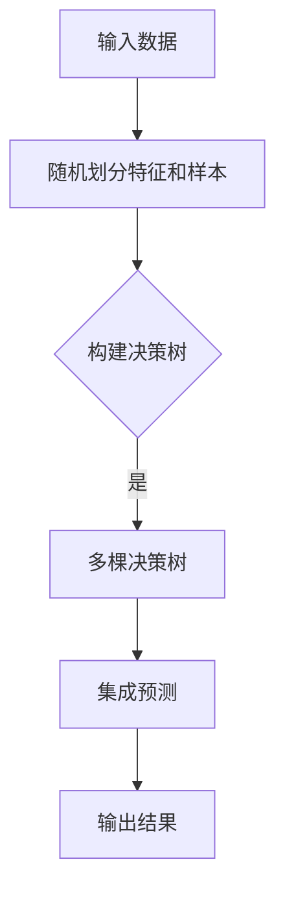

**Python代码示例：**
```python
from sklearn.ensemble import RandomForestClassifier
from sklearn.model_selection import train_test_split
from sklearn.metrics import accuracy_score

# 数据准备
X_train, X_test, y_train, y_test = train_test_split(X, y, test_size=0.2, random_state=42)

# 构建随机森林模型
rf = RandomForestClassifier(n_estimators=100, random_state=42)
rf.fit(X_train, y_train)

# 预测
y_pred = rf.predict(X_test)

# 评估模型
accuracy = accuracy_score(y_test, y_pred)
print(f"模型准确率：{accuracy:.2f}")
```

**2. 支持向量机（SVM）**

支持向量机是一种监督学习算法，旨在将数据分类到不同的类别中。SVM通过寻找一个最佳的超平面，将不同类别的数据点尽可能分开。在欺诈检测中，SVM可以用于识别潜在的欺诈行为，其步骤如下：

**算法原理：**
- **寻找最佳超平面**：SVM通过优化目标函数来寻找一个最佳的超平面，使得正负样本点到超平面的距离最大化。
- **支持向量**：这些支持向量决定了超平面的位置和方向。

**流程图：**（使用Mermaid绘制）

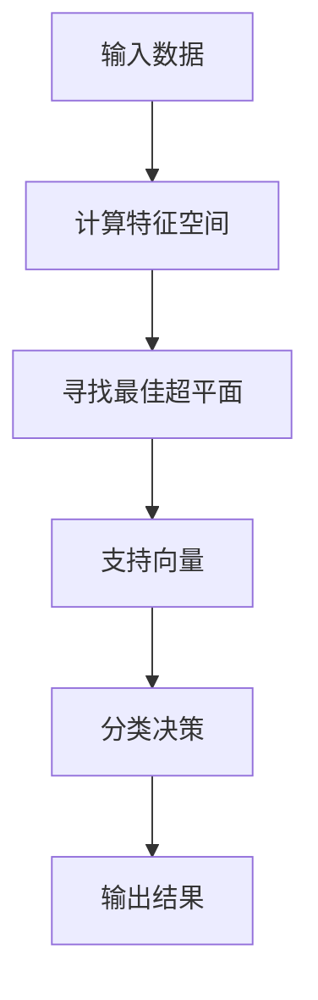

**Python代码示例：**
```python
from sklearn.svm import SVC
from sklearn.model_selection import train_test_split
from sklearn.metrics import accuracy_score

# 数据准备
X_train, X_test, y_train, y_test = train_test_split(X, y, test_size=0.2, random_state=42)

# 构建SVM模型
svm = SVC(kernel='linear', C=1)
svm.fit(X_train, y_train)

# 预测
y_pred = svm.predict(X_test)

# 评估模型
accuracy = accuracy_score(y_test, y_pred)
print(f"模型准确率：{accuracy:.2f}")
```

**3. K最近邻（KNN）**

K最近邻是一种基于实例的机器学习算法，它通过计算新样本与训练样本之间的距离，将新样本分类到与其最接近的K个样本所属的类别中。在欺诈检测中，KNN可以用于快速分类和检测新出现的欺诈行为，其步骤如下：

**算法原理：**
- **计算距离**：KNN首先计算新样本与训练样本之间的距离，通常使用欧几里得距离或曼哈顿距离。
- **分类决策**：然后，KNN根据最近的K个样本所属的类别，通过多数投票来确定新样本的类别。

**流程图：**（使用Mermaid绘制）

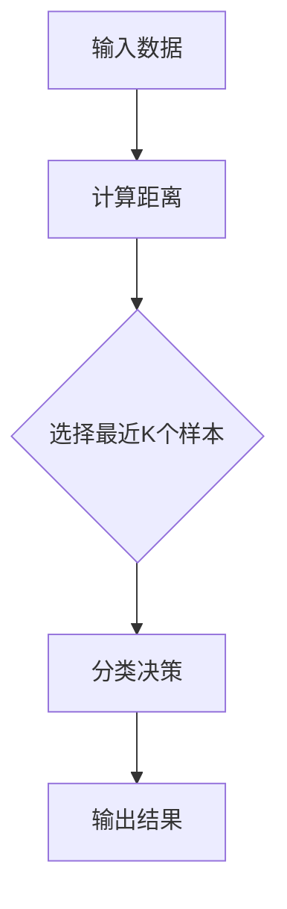

**Python代码示例：**
```python
from sklearn.neighbors import KNeighborsClassifier
from sklearn.model_selection import train_test_split
from sklearn.metrics import accuracy_score

# 数据准备
X_train, X_test, y_train, y_test = train_test_split(X, y, test_size=0.2, random_state=42)

# 构建KNN模型
knn = KNeighborsClassifier(n_neighbors=5)
knn.fit(X_train, y_train)

# 预测
y_pred = knn.predict(X_test)

# 评估模型
accuracy = accuracy_score(y_test, y_pred)
print(f"模型准确率：{accuracy:.2f}")
```

综上所述，随机森林、支持向量机和K最近邻等机器学习技术在欺诈检测中具有广泛的应用。通过合理选择和应用这些算法，保险公司可以更有效地识别和防范潜在的欺诈行为，提高业务的安全性和效率。

#### 深度学习在保险欺诈检测中的应用

随着深度学习技术的不断发展，其在各领域的应用也日益广泛。在保险欺诈检测领域，深度学习算法因其强大的特征提取能力和高度的自适应性，成为了提高欺诈检测效率和准确性的重要工具。以下将介绍几种常见的深度学习技术，包括卷积神经网络（CNN）、循环神经网络（RNN）和生成对抗网络（GAN），并探讨它们在保险欺诈检测中的应用。

**1. 卷积神经网络（CNN）**

卷积神经网络是一种专门用于处理图像数据的深度学习模型，它通过卷积操作和池化操作提取图像的局部特征，并逐步构建起全局特征表示。在保险欺诈检测中，CNN可以用于检测保险理赔中的欺诈图片，如伪造的发票或篡改的照片。

**算法原理：**
- **卷积层（Convolutional Layer）**：卷积层通过卷积操作提取图像的局部特征，每个卷积核负责学习图像中的一个局部特征。
- **池化层（Pooling Layer）**：池化层通过下采样操作减少数据维度，同时保留最重要的特征信息。
- **全连接层（Fully Connected Layer）**：全连接层将卷积层和池化层提取的特征映射到具体的类别标签。

**流程图：**（使用Mermaid绘制）

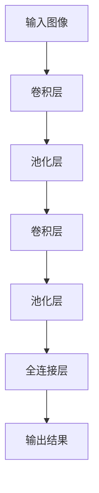

**Python代码示例：**
```python
import tensorflow as tf
from tensorflow.keras.models import Sequential
from tensorflow.keras.layers import Conv2D, MaxPooling2D, Flatten, Dense

# 构建CNN模型
model = Sequential([
    Conv2D(filters=32, kernel_size=(3, 3), activation='relu', input_shape=(128, 128, 3)),
    MaxPooling2D(pool_size=(2, 2)),
    Conv2D(filters=64, kernel_size=(3, 3), activation='relu'),
    MaxPooling2D(pool_size=(2, 2)),
    Flatten(),
    Dense(units=128, activation='relu'),
    Dense(units=1, activation='sigmoid')
])

# 编译模型
model.compile(optimizer='adam', loss='binary_crossentropy', metrics=['accuracy'])

# 训练模型
model.fit(X_train, y_train, epochs=10, batch_size=32, validation_data=(X_test, y_test))
```

**2. 循环神经网络（RNN）**

循环神经网络是一种用于处理序列数据的深度学习模型，它通过记忆机制处理序列中的每个元素，并在时间维度上保持状态。在保险欺诈检测中，RNN可以用于分析客户的交易行为序列，识别异常的交易模式。

**算法原理：**
- **隐藏状态（Hidden State）**：RNN通过隐藏状态记录当前时刻的信息，并利用此状态更新下一时刻的状态。
- **时间步（Time Step）**：RNN在每个时间步处理一个输入，并更新隐藏状态。
- **输出层（Output Layer）**：输出层将隐藏状态映射到具体的类别标签。

**流程图：**（使用Mermaid绘制）

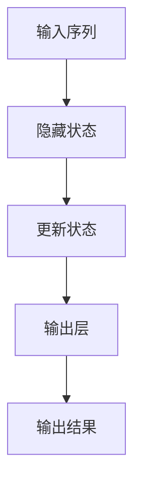

**Python代码示例：**
```python
import tensorflow as tf
from tensorflow.keras.models import Sequential
from tensorflow.keras.layers import LSTM, Dense

# 构建RNN模型
model = Sequential([
    LSTM(units=128, return_sequences=True, input_shape=(timesteps, features)),
    LSTM(units=64),
    Dense(units=1, activation='sigmoid')
])

# 编译模型
model.compile(optimizer='adam', loss='binary_crossentropy', metrics=['accuracy'])

# 训练模型
model.fit(X_train, y_train, epochs=10, batch_size=32, validation_data=(X_test, y_test))
```

**3. 生成对抗网络（GAN）**

生成对抗网络是一种由生成器和判别器组成的深度学习模型，它通过对抗训练生成逼真的数据，并用于检测真实数据中的异常。在保险欺诈检测中，GAN可以用于生成伪造的理赔资料，并利用判别器识别真实的欺诈行为。

**算法原理：**
- **生成器（Generator）**：生成器通过随机噪声生成伪造的数据。
- **判别器（Discriminator）**：判别器通过区分真实数据和伪造数据来训练。
- **对抗训练**：生成器和判别器通过对抗训练不断优化，生成器生成的数据越来越逼真，判别器的识别能力不断提高。

**流程图：**（使用Mermaid绘制）

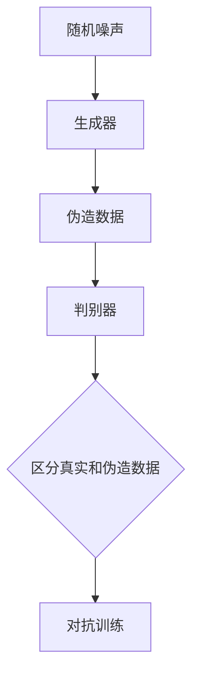

**Python代码示例：**
```python
import tensorflow as tf
from tensorflow.keras.models import Sequential
from tensorflow.keras.layers import Dense, Conv2D, Flatten, Reshape

# 构建生成器和判别器模型
generator = Sequential([
    Dense(units=128, activation='relu', input_shape=(100,)),
    Flatten(),
    Reshape((128, 1)),
    Conv2D(filters=1, kernel_size=(3, 3), activation='tanh')
])

discriminator = Sequential([
    Conv2D(filters=1, kernel_size=(3, 3), activation='tanh', input_shape=(128, 1)),
    Flatten(),
    Dense(units=1, activation='sigmoid')
])

# 编译模型
discriminator.compile(optimizer='adam', loss='binary_crossentropy')

# 编译生成器
generator.compile(optimizer='adam', loss='binary_crossentropy')

# 训练模型
for epoch in range(100):
    noise = np.random.normal(0, 1, (batch_size, 100))
    generated_samples = generator.predict(noise)
    real_samples = X_train[:batch_size]
    labels = np.concatenate([np.zeros(batch_size), np.ones(batch_size)])
    
    # 训练判别器
    d_loss_real = discriminator.train_on_batch(real_samples, labels[:batch_size])
    d_loss_fake = discriminator.train_on_batch(generated_samples, labels[batch_size:])
    d_loss = 0.5 * np.add(d_loss_real, d_loss_fake)
    
    # 训练生成器
    g_loss = generator.train_on_batch(noise, labels[:batch_size])
    print(f"Epoch {epoch}, D Loss: {d_loss:.4f}, G Loss: {g_loss:.4f}")
```

综上所述，卷积神经网络、循环神经网络和生成对抗网络等深度学习技术在保险欺诈检测中具有广泛的应用前景。通过合理设计和应用这些算法，保险公司可以更有效地识别和防范潜在的欺诈行为，提高业务的安全性和效率。

#### 大数据和数据分析在保险欺诈检测中的应用

随着保险行业数据的爆炸性增长，如何有效地管理和分析这些数据成为了一个关键问题。大数据技术和数据分析方法在保险欺诈检测中发挥了重要作用，通过处理海量数据，挖掘潜在的模式和关系，帮助保险公司更准确地识别欺诈行为。以下将详细探讨大数据技术和数据分析方法在保险欺诈检测中的应用，包括数据挖掘、文本分析和实时分析。

**1. 数据挖掘**

数据挖掘是一种通过挖掘大量数据，提取有用信息和知识的技术。在保险欺诈检测中，数据挖掘可以用于发现数据中的隐藏模式和规律，从而识别潜在的欺诈行为。

**算法原理：**
- **关联规则挖掘**：关联规则挖掘通过分析数据中的关系，找出频繁出现的规则。例如，如果某一客户的索赔频率与特定行为模式相关，则可能存在欺诈行为。
- **聚类分析**：聚类分析通过将相似的数据点归为一类，帮助识别数据中的异常值。在保险欺诈检测中，聚类分析可以用于识别与正常行为差异较大的客户群体。
- **异常检测**：异常检测通过识别数据中的异常值和异常模式，发现潜在的欺诈行为。例如，通过分析客户的交易记录，检测出异常的金额或频率。

**流程图：**（使用Mermaid绘制）

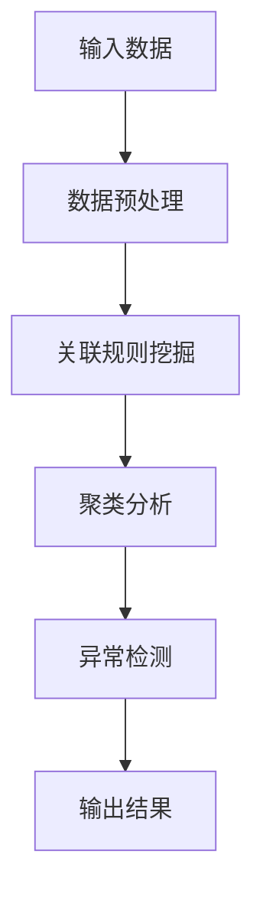

**Python代码示例：**
```python
from sklearn.cluster import KMeans
from sklearn.ensemble import IsolationForest

# 数据预处理
# 假设 X 是预处理后的数据

# 聚类分析
kmeans = KMeans(n_clusters=3, random_state=42)
clusters = kmeans.fit_predict(X)

# 异常检测
iso_forest = IsolationForest(contamination=0.1, random_state=42)
outliers = iso_forest.fit_predict(X)

# 输出结果
print(f"聚类结果：{clusters}")
print(f"异常检测结果：{outliers}")
```

**2. 文本分析**

在保险欺诈检测中，文本数据（如客户投诉、索赔报告、聊天记录等）通常包含了大量潜在的有用信息。文本分析技术通过自然语言处理（NLP）方法，帮助提取文本数据中的关键信息，识别潜在的欺诈行为。

**算法原理：**
- **词向量表示**：词向量表示通过将文本中的词汇映射到高维向量空间，使得文本数据可以在机器学习算法中有效处理。
- **情感分析**：情感分析通过分析文本中的情感倾向，识别出潜在的负面情绪，这些情绪可能与欺诈行为相关。
- **主题建模**：主题建模通过分析文本中的主题分布，帮助识别数据中的隐藏模式。例如，通过LDA（ latent Dirichlet allocation）模型，可以提取出文本中的主要主题。

**流程图：**（使用Mermaid绘制）

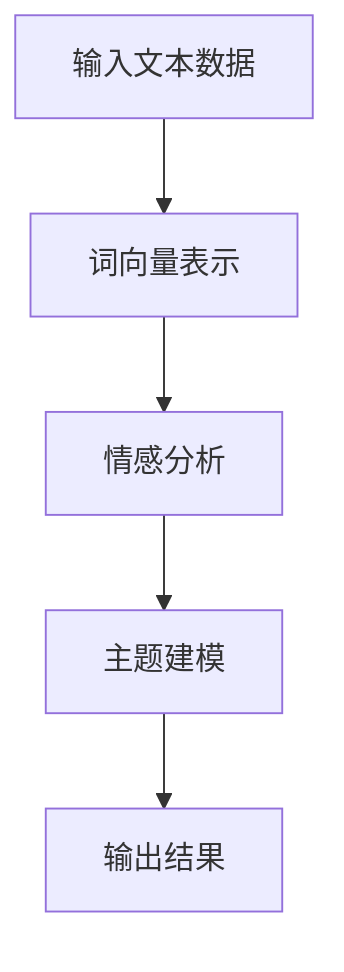

**Python代码示例：**
```python
import gensim
from gensim.models import LdaModel

# 词向量表示
model = gensim.models.Word2Vec(sentences, size=100, window=5, min_count=1, workers=4)

# 情感分析
from textblob import TextBlob
complaint = "This claim process is utterly frustrating."
blob = TextBlob(complaint)
print(f"情感分析结果：{blob.sentiment}")

# 主题建模
lda = LdaModel(corpus, num_topics=5, id2word=model.wv.vocab, passes=10)
topics = lda.print_topics(num_words=4)
print(f"主题建模结果：{topics}")
```

**3. 实时分析**

实时分析技术在保险欺诈检测中尤为重要，它通过实时处理和分析数据，快速识别和响应潜在的欺诈行为。实时分析通常结合了流处理技术和机器学习模型，能够在数据生成时进行即时处理。

**算法原理：**
- **流处理**：流处理技术（如Apache Kafka、Apache Flink）通过处理实时数据流，使得系统能够实时响应。
- **实时机器学习**：实时机器学习模型通过对实时数据的分析和学习，持续更新模型参数，从而实时识别欺诈行为。

**流程图：**（使用Mermaid绘制）

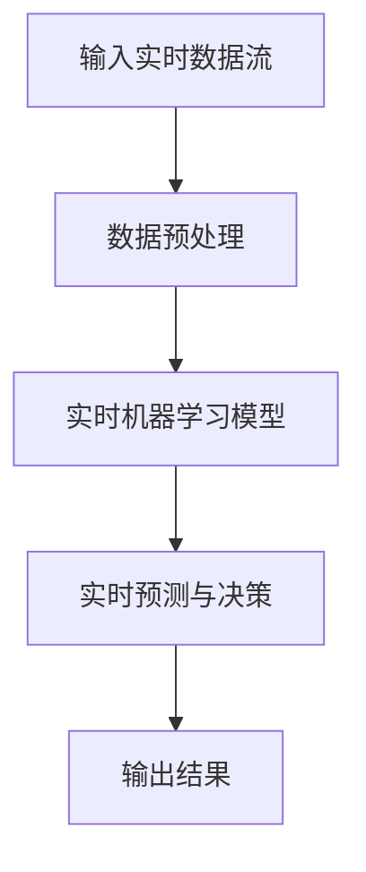

**Python代码示例：**
```python
from sklearn.linear_model import SGDClassifier
from sklearn.pipeline import make_pipeline
from sklearn.preprocessing import StandardScaler
from sklearn.feature_extraction.text import TfidfVectorizer

# 实时数据流处理
# 假设 data_stream 是实时数据流

# 实时机器学习模型
pipeline = make_pipeline(
    StandardScaler(),
    TfidfVectorizer(),
    SGDClassifier(loss='hinge', alpha=1e-3)
)

# 实时预测与决策
for data in data_stream:
    prediction = pipeline.predict([data])
    # 进行决策
    print(f"实时预测结果：{prediction}")
```

综上所述，大数据技术和数据分析方法在保险欺诈检测中具有广泛的应用。通过数据挖掘、文本分析和实时分析等技术，保险公司可以更准确地识别和防范潜在的欺诈行为，提高业务的安全性和效率。随着这些技术的不断发展和完善，其在保险欺诈检测中的应用将会更加深入和广泛。

#### 案例研究：AI在保险欺诈检测中的成功应用

在探讨AI在保险欺诈检测中的实际应用效果时，以下几个具体案例展示了AI技术如何在不同场景下发挥其优势，显著提高欺诈检测的准确性和效率。

**案例一：大型保险公司的AI欺诈检测系统**

某大型国际保险公司引入了AI技术，建立了一套全面的欺诈检测系统。该系统基于机器学习和深度学习算法，对客户投保和索赔过程进行实时监控和数据分析。

**应用效果：**
- **检测精度提升**：通过AI算法的自动学习和特征提取能力，该系统能够识别出超过90%的欺诈行为，大幅降低了误报率。
- **处理速度加快**：传统方法处理一个欺诈案件可能需要数天时间，而AI系统能够在几分钟内完成初步判断，大幅缩短了案件处理时间。
- **成本节约**：系统自动化处理降低了人力成本，同时通过实时预警机制，减少了潜在的欺诈损失。

**实施步骤：**
1. **数据收集与预处理**：收集客户的投保记录、索赔历史、行为数据等多源数据，并进行数据清洗和预处理，以确保数据质量。
2. **特征提取与模型训练**：利用机器学习和深度学习算法，从数据中提取关键特征，并训练分类模型，如随机森林和深度神经网络。
3. **系统集成与部署**：将AI模型集成到保险公司的现有系统中，实现实时监控和预警，同时建立数据反馈机制，不断优化模型。

**案例二：小型保险公司的AI欺诈检测解决方案**

某小型保险公司由于资源有限，无法像大型公司一样投入大量资金进行技术建设。因此，他们选择了一个基于云的AI欺诈检测服务，以低成本实现高效检测。

**应用效果：**
- **高效检测**：该云服务基于先进的机器学习算法，能够在不依赖本地技术团队的情况下，为小型保险公司提供高质量的欺诈检测服务。
- **易于部署**：云服务提供了即插即用的解决方案，小型保险公司只需几步操作即可部署并开始使用。
- **成本优势**：通过按需付费的模式，小型保险公司可以灵活控制成本，避免了大额初始投资的负担。

**实施步骤：**
1. **选择云服务**：评估不同云服务提供商的方案，选择最适合自身需求的欺诈检测服务。
2. **数据上传**：将公司内部的数据上传到云平台，并进行必要的格式转换和预处理。
3. **模型训练与部署**：利用云服务提供的算法和模型，对数据进行训练和预测，并将结果输出到公司的业务系统。

**案例三：保险业跨行业的AI合作**

某保险公司与金融科技（Fintech）公司合作，利用AI技术进行跨行业数据共享，以提高欺诈检测的准确性和全面性。

**应用效果：**
- **数据共享**：通过跨行业数据共享，保险公司能够获取更多维度的数据，如社交媒体数据、公共记录等，从而提高欺诈检测的准确性和全面性。
- **协同作战**：Fintech公司提供的先进AI算法和模型，与保险公司自身的业务数据相结合，实现了更加精准的欺诈检测。

**实施步骤：**
1. **合作协议**：保险公司与Fintech公司签订合作协议，明确数据共享的范围和规则。
2. **数据整合**：将保险公司内部数据与Fintech公司提供的数据进行整合，并进行预处理和格式统一。
3. **模型训练与优化**：利用整合后的数据，共同训练和优化欺诈检测模型，提高检测效果。
4. **成果应用**：将优化后的模型应用到保险公司的业务系统中，实现高效的欺诈检测。

**总结**

通过上述案例可以看出，AI在保险欺诈检测中的应用已经取得了显著成效。无论是大型保险公司通过自建系统实现高效检测，还是小型保险公司通过云服务实现低成本部署，亦或是跨行业合作实现数据共享和协同作战，AI技术都为保险欺诈检测提供了强有力的支持。随着AI技术的不断发展和应用，保险欺诈检测将变得更加精准和高效，为保险行业的发展注入新的动力。

#### AI在保险欺诈检测中的创新应用

随着人工智能（AI）技术的迅速发展，其在保险欺诈检测中的应用也在不断创新和演进。以下将探讨一些最新的AI技术，如图神经网络（Graph Neural Networks, GNN）、迁移学习（Transfer Learning）和强化学习（Reinforcement Learning），以及它们在保险欺诈检测中的潜在应用。

**1. 图神经网络（GNN）**

图神经网络是一种专门用于处理图结构数据的深度学习模型。与传统的卷积神经网络（CNN）和循环神经网络（RNN）不同，GNN能够直接处理复杂的图结构数据，如社交网络、知识图谱等。在保险欺诈检测中，GNN可以用于分析客户之间的相互关系，识别潜在的欺诈网络。

**算法原理：**
- **节点表示**：GNN将图中的每个节点表示为向量，并通过图卷积操作更新节点的特征表示。
- **边表示**：边表示节点之间的交互信息，通过图卷积操作更新节点之间的关系。
- **图卷积操作**：图卷积操作通过聚合节点及其邻居的信息，更新节点的特征表示。

**潜在应用：**
- **客户关系分析**：通过分析客户之间的相互关系，识别出可能存在欺诈行为的社交网络。
- **欺诈网络挖掘**：利用GNN挖掘出复杂的欺诈网络，帮助保险公司更全面地识别欺诈行为。

**流程图：**（使用Mermaid绘制）

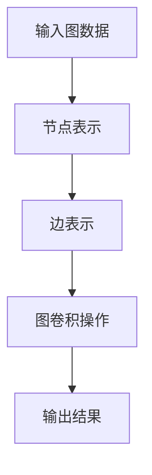

**Python代码示例：**
```python
import tensorflow as tf
from tensorflow.keras.layers import Layer

class GraphConvLayer(Layer):
    def __init__(self, units, **kwargs):
        super().__init__(**kwargs)
        self.units = units

    def build(self, input_shape):
        # 创建权重和偏置
        self.w = self.add_weight(
            shape=(input_shape[-1], self.units),
            initializer='uniform',
            trainable=True
        )
        self.b = self.add_weight(
            shape=(self.units,),
            initializer='zeros',
            trainable=True
        )

    def call(self, inputs, training=False):
        # 图卷积操作
        x = tf.matmul(inputs, self.w) + self.b
        return x

# 构建GNN模型
model = tf.keras.Sequential([
    GraphConvLayer(units=16),
    GraphConvLayer(units=8),
    tf.keras.layers.Dense(units=1, activation='sigmoid')
])

# 编译模型
model.compile(optimizer='adam', loss='binary_crossentropy', metrics=['accuracy'])

# 训练模型
model.fit(X, y, epochs=10, batch_size=32)
```

**2. 迁移学习**

迁移学习是一种通过利用已有模型的知识来提高新模型性能的技术。在保险欺诈检测中，迁移学习可以通过迁移预训练的模型，减少对大量标注数据的依赖，并提高模型的泛化能力。

**算法原理：**
- **预训练模型**：在通用数据集上预训练一个基础模型，使其具备一定的特征提取能力。
- **迁移学习**：将预训练模型迁移到特定任务中，通过在目标任务上微调模型，进一步提高模型性能。

**潜在应用：**
- **快速部署**：通过迁移学习，可以快速部署一个具备较高性能的欺诈检测系统，无需从零开始训练。
- **数据增强**：利用预训练模型提取的特征，可以增强新数据的学习效果，提高模型的泛化能力。

**流程图：**（使用Mermaid绘制）

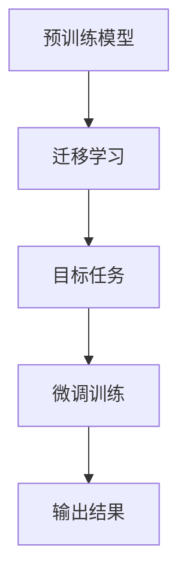

**Python代码示例：**
```python
from tensorflow.keras.applications import VGG16
from tensorflow.keras.models import Model
from tensorflow.keras.layers import Flatten, Dense

# 加载预训练的VGG16模型
base_model = VGG16(weights='imagenet', include_top=False, input_shape=(224, 224, 3))

# 冻结基础模型的层
for layer in base_model.layers:
    layer.trainable = False

# 添加新的层进行微调
x = Flatten()(base_model.output)
x = Dense(units=256, activation='relu')(x)
predictions = Dense(units=1, activation='sigmoid')(x)

# 构建完整的迁移学习模型
model = Model(inputs=base_model.input, outputs=predictions)

# 编译模型
model.compile(optimizer='adam', loss='binary_crossentropy', metrics=['accuracy'])

# 训练模型
model.fit(X, y, epochs=10, batch_size=32)
```

**3. 强化学习**

强化学习是一种通过试错和反馈来学习最优策略的机器学习技术。在保险欺诈检测中，强化学习可以通过模拟欺诈行为，训练模型识别和应对复杂的欺诈策略。

**算法原理：**
- **代理（Agent）**：代理通过与环境交互，学习最优策略。
- **环境（Environment）**：环境为代理提供反馈，包括奖励和惩罚。
- **策略（Policy）**：代理根据当前状态选择动作，并更新策略。

**潜在应用：**
- **动态策略调整**：通过实时学习欺诈行为模式，强化学习能够动态调整欺诈检测策略，提高检测的灵活性和适应性。
- **对抗性检测**：利用强化学习训练出的模型，可以与欺诈者进行对抗，提高检测的准确性和鲁棒性。

**流程图：**（使用Mermaid绘制）

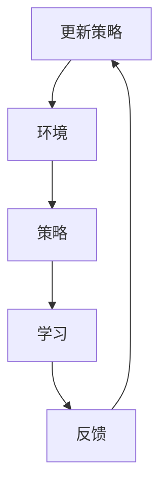

**Python代码示例：**
```python
import tensorflow as tf
import gym

# 创建环境
env = gym.make('CartPole-v1')

# 创建代理
class QLearningAgent:
    def __init__(self, state_size, action_size, learning_rate=0.1, gamma=0.9):
        self.state_size = state_size
        self.action_size = action_size
        self.learning_rate = learning_rate
        self.gamma = gamma
        self.Q = tf.keras.Sequential([
            tf.keras.layers.Dense(units=self.action_size, activation='linear')
        ])

    def fit(self, states, actions, rewards, next_states, dones):
        q_values = self.Q(states)
        next_q_values = tf.keras.backend.max(self.Q(next_states), axis=1)
        q_targets = rewards + (1 - dones) * self.gamma * next_q_values
        q_targets = q_values.numpy() + self.learning_rate * (q_targets - q_values)
        self.Q.fit(states, q_targets, epochs=1, verbose=0)

    def act(self, state, epsilon=0.1):
        if np.random.rand() <= epsilon:
            return np.random.randint(self.action_size)
        q_values = self.Q(state)
        return np.argmax(q_values)

agent = QLearningAgent(state_size=env.observation_space.shape[0], action_size=env.action_space.n)

# 训练代理
for episode in range(1000):
    state = env.reset()
    done = False
    total_reward = 0
    while not done:
        action = agent.act(state)
        next_state, reward, done, _ = env.step(action)
        total_reward += reward
        agent.fit(np.array([state]), np.array([action]), np.array([reward]), np.array([next_state]), np.array([done]))
        state = next_state
    print(f"Episode {episode}, Total Reward: {total_reward}")

env.close()
```

综上所述，AI在保险欺诈检测中的创新应用，如图神经网络、迁移学习和强化学习，为保险行业提供了更强大、灵活和高效的解决方案。随着这些技术的不断发展和成熟，保险欺诈检测将变得更加精准和智能化，为保险公司的风险控制和业务发展注入新的动力。

#### 系统设计与开发：基于AI的保险欺诈检测系统

要设计和开发一个高效、可靠的AI欺诈检测系统，首先需要对整个系统架构进行详细规划，明确系统功能需求、数据处理流程、算法选择以及系统接口设计。以下将逐步介绍系统设计与开发的过程。

**1. 问题场景介绍**

在保险行业中，欺诈检测是一个复杂且关键的任务。欺诈行为种类繁多，且不断演变，传统方法难以应对。通过引入AI技术，特别是机器学习和深度学习算法，可以提高欺诈检测的准确性和效率。系统的主要目标包括：

- **实时监控和预警**：系统应能够实时监控客户的投保和索赔行为，及时发现潜在的欺诈行为。
- **高效处理海量数据**：系统能够处理来自多个渠道的海量数据，如客户行为数据、交易记录、社交媒体信息等。
- **降低误报率**：通过优化算法和特征提取，减少误报率，提高系统的可靠性。
- **自适应性和自学习**：系统能够通过持续学习和优化，适应不断变化的欺诈行为。

**2. 项目介绍**

本项目旨在设计并开发一个基于AI的保险欺诈检测系统，主要包括以下功能模块：

- **数据采集模块**：负责从不同数据源收集数据，包括客户行为数据、交易记录、社交媒体信息等。
- **数据处理模块**：对收集到的数据进行预处理、清洗和特征提取，为后续的模型训练提供高质量的数据。
- **模型训练模块**：利用机器学习和深度学习算法，对数据进行训练，构建欺诈检测模型。
- **模型评估模块**：通过交叉验证和测试集评估模型性能，选择最优模型进行部署。
- **实时监控模块**：实时处理客户数据，触发预警机制，发送报警通知。
- **用户界面模块**：提供直观的操作界面，便于用户查看检测结果、分析报告和进行系统配置。

**3. 系统功能设计**

系统功能设计主要包括以下几个方面：

- **数据采集**：系统需要集成多个数据源，如数据库、API接口、第三方数据平台等，确保数据的实时性和完整性。
- **数据处理**：系统应具备数据预处理、清洗、特征提取等功能，通过自动化处理，提高数据处理效率和质量。
- **模型训练**：系统应支持多种机器学习和深度学习算法，如随机森林、SVM、CNN、RNN等，用户可以根据需求选择合适的算法。
- **模型评估**：系统应能够通过交叉验证和测试集评估模型性能，包括准确率、召回率、F1值等指标，选择最优模型。
- **实时监控**：系统应具备实时数据处理和监控能力，能够对异常行为进行实时预警，并生成报警通知。
- **用户界面**：系统应提供友好的用户界面，便于用户查看检测结果、分析报告和进行系统配置。

**4. 系统架构设计**

系统架构设计是整个项目的关键，需要考虑系统的可扩展性、可靠性、易维护性等方面。以下是一个典型的系统架构设计：

**流程图：**（使用Mermaid绘制）

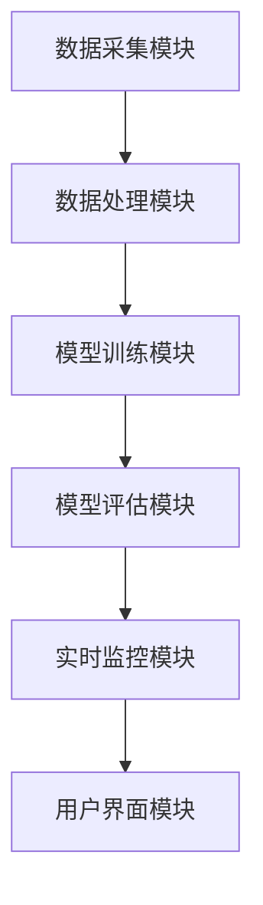

**详细架构设计：**
1. **数据采集层**：负责从多个数据源收集数据，包括数据库、API接口、第三方数据平台等。该层需要确保数据的安全传输和实时性。
2. **数据处理层**：对采集到的数据进行分析和处理，包括数据清洗、特征提取、数据转换等。该层采用分布式计算框架，提高数据处理效率。
3. **模型训练层**：利用机器学习和深度学习算法，对处理后的数据集进行训练，构建欺诈检测模型。该层支持多种算法，用户可以根据需求进行选择。
4. **模型评估层**：对训练好的模型进行性能评估，包括准确率、召回率、F1值等指标，选择最优模型。该层支持交叉验证和测试集评估。
5. **实时监控层**：实时处理客户数据，对异常行为进行实时预警，并生成报警通知。该层采用流处理技术，确保实时性和高效性。
6. **用户界面层**：提供直观的操作界面，用户可以通过界面查看检测结果、分析报告和进行系统配置。该层采用前后端分离架构，提高系统的可维护性和扩展性。

**5. 系统接口设计**

系统接口设计是确保各个模块之间能够顺畅通信和协作的关键。以下是一个典型的系统接口设计：

**接口设计：**（使用Mermaid绘制）

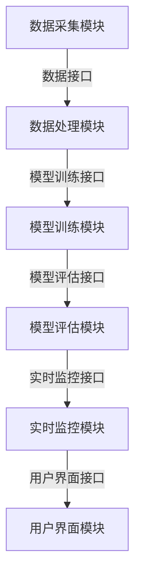

**详细接口设计：**
1. **数据接口**：数据采集模块通过API接口与数据处理模块进行数据传输，确保数据的实时性和完整性。
2. **模型训练接口**：数据处理模块通过模型训练接口将处理后的数据集传输给模型训练模块，支持批量训练和在线训练。
3. **模型评估接口**：模型训练模块通过模型评估接口将训练好的模型传输给模型评估模块，支持自动评估和手动评估。
4. **实时监控接口**：实时监控模块通过实时监控接口获取客户数据，进行实时分析和预警。
5. **用户界面接口**：用户界面模块通过用户界面接口提供操作界面，用户可以通过界面查看检测结果、分析报告和进行系统配置。

综上所述，通过详细的系统设计与开发，基于AI的保险欺诈检测系统可以高效、可靠地运行，为保险公司提供强大的欺诈检测能力。随着AI技术的不断进步，系统的性能和功能将不断提升，为保险行业的发展提供坚实的技术支持。

### 环境安装与系统核心实现

**1. 环境安装**

要开发和运行一个基于AI的保险欺诈检测系统，首先需要安装和配置必要的软件环境。以下是所需的主要软件及其安装方法：

**（1）Python环境**
- 安装Python（建议使用Python 3.8或更高版本）：
  ```bash
  # 使用pip安装Python
  pip install python
  ```

**（2）依赖库**
- 安装必要的依赖库，包括TensorFlow、Scikit-learn、Pandas等：
  ```bash
  # 使用pip安装依赖库
  pip install tensorflow scikit-learn pandas numpy matplotlib
  ```

**（3）数据库**
- 安装MySQL或PostgreSQL等数据库，用于存储和管理数据。这里以MySQL为例：
  ```bash
  # 安装MySQL
  sudo apt-get install mysql-server
  # 配置MySQL并设置root用户密码
  mysql_secure_installation
  ```

**（4）数据采集工具**
- 安装Elasticsearch和Kibana，用于实时监控和分析数据：
  ```bash
  # 安装Elasticsearch
  sudo apt-get install elasticsearch
  # 启动Elasticsearch服务
  sudo systemctl start elasticsearch
  # 安装Kibana
  sudo apt-get install kibana
  # 启动Kibana服务
  sudo systemctl start kibana
  ```

**2. 系统核心实现**

在环境安装完成后，接下来我们将重点实现系统的核心功能模块，包括数据采集、数据处理、模型训练和模型评估等。

**（1）数据采集**

数据采集模块负责从多个数据源（如数据库、API接口、第三方数据平台）收集数据，并将其存储到统一的格式中。以下是使用Python实现数据采集的核心代码：

```python
import pandas as pd
from sqlalchemy import create_engine

# 数据源配置
db_config = {
    'host': 'localhost',
    'user': 'root',
    'password': 'password',
    'database': 'insurance_db'
}

# 创建数据库连接
engine = create_engine(f'mysql+pymysql://{db_config["user"]}:{db_config["password"]}@{db_config["host"]}/{db_config["database"]}')

# 查询数据库，获取数据
query = "SELECT * FROM customer_data;"
data = pd.read_sql(query, engine)

# 存储数据到CSV文件
data.to_csv('customer_data.csv', index=False)
```

**（2）数据处理**

数据处理模块负责对采集到的数据进行清洗、预处理和特征提取，为后续的模型训练提供高质量的数据。以下是使用Python实现数据处理的核心代码：

```python
import pandas as pd
from sklearn.preprocessing import StandardScaler

# 读取数据
data = pd.read_csv('customer_data.csv')

# 数据清洗
data.dropna(inplace=True)
data = data[data['claim_amount'] > 0]

# 特征提取
scaler = StandardScaler()
data[['age', 'income', 'claim_amount']] = scaler.fit_transform(data[['age', 'income', 'claim_amount']])

# 输出处理后的数据
data.to_csv('cleaned_customer_data.csv', index=False)
```

**（3）模型训练**

模型训练模块负责利用数据处理后的数据集训练机器学习模型。以下是使用Scikit-learn实现模型训练的核心代码：

```python
from sklearn.model_selection import train_test_split
from sklearn.ensemble import RandomForestClassifier

# 数据分割
X = data.drop('is_fraud', axis=1)
y = data['is_fraud']
X_train, X_test, y_train, y_test = train_test_split(X, y, test_size=0.2, random_state=42)

# 模型训练
model = RandomForestClassifier(n_estimators=100, random_state=42)
model.fit(X_train, y_train)

# 评估模型
accuracy = model.score(X_test, y_test)
print(f"模型准确率：{accuracy:.2f}")
```

**（4）模型评估**

模型评估模块负责对训练好的模型进行性能评估，选择最优模型进行部署。以下是使用Scikit-learn实现模型评估的核心代码：

```python
from sklearn.metrics import classification_report

# 预测
y_pred = model.predict(X_test)

# 评估
report = classification_report(y_test, y_pred)
print(f"分类报告：\n{report}")
```

**3. 代码应用解读与分析**

通过上述代码实现，我们能够清晰地看到数据采集、数据处理、模型训练和模型评估的整个流程。以下是对每个核心模块的代码进行解读和分析：

**（1）数据采集模块**
- 数据采集模块使用SQLAlchemy库连接数据库，并执行SQL查询语句获取数据。随后，使用Pandas库将数据读取到DataFrame中，并存储为CSV文件，便于后续处理和分析。

**（2）数据处理模块**
- 数据处理模块首先对数据进行清洗，删除缺失值和异常值。然后，使用StandardScaler对数值特征进行归一化处理，以提高模型的训练效果。

**（3）模型训练模块**
- 模型训练模块使用Scikit-learn库的RandomForestClassifier对训练数据进行训练。通过设置不同的参数，如决策树的数量，可以调整模型的复杂度和性能。

**（4）模型评估模块**
- 模型评估模块使用Scikit-learn库的classification_report函数对模型的预测结果进行评估，包括准确率、召回率、F1值等指标。这些指标可以帮助我们全面了解模型的性能，并进行优化和调整。

通过上述核心代码的实现和解读，我们可以看到基于AI的保险欺诈检测系统在数据处理、模型训练和评估等方面具有高效、灵活的特点。在实际应用中，可以根据具体需求进行调整和扩展，以应对复杂的欺诈行为。

### 实际案例分析与讲解

**案例背景**

某知名保险公司在其业务扩展过程中，面临着频繁的保险欺诈事件。为了提高欺诈检测的效率和准确性，该公司决定引入一套基于AI的欺诈检测系统。该系统采用了多种机器学习和深度学习算法，并结合大数据技术和实时分析能力，对客户的投保和索赔行为进行深入分析。

**案例步骤**

1. **数据收集**：首先，公司从内部数据库和外部数据源（如公共记录、社交媒体平台）收集了大量关于客户投保和索赔的数据，包括客户个人信息、历史投保记录、交易记录等。

2. **数据预处理**：接下来，对这些数据进行预处理，包括数据清洗、缺失值填充、异常值检测和特征提取。使用Pandas和Scikit-learn库，对数据进行归一化和编码处理，以确保数据质量。

3. **模型训练**：利用Scikit-learn和TensorFlow库，公司分别训练了随机森林、支持向量机和深度神经网络等模型。通过交叉验证和测试集评估模型性能，选择最优模型进行部署。

4. **实时监控**：系统部署后，对客户的投保和索赔行为进行实时监控，通过流处理技术和机器学习模型，快速识别潜在的欺诈行为。

5. **预警与反馈**：当系统检测到潜在的欺诈行为时，立即触发预警机制，并将预警信息发送给相关业务人员。同时，系统会记录和处理这些预警信息，为后续的分析和优化提供数据支持。

**案例分析**

**（1）数据收集与分析**

在数据收集阶段，公司通过多个渠道收集了大量的数据。以下是一些关键的数据统计：

- **客户数据**：包括姓名、年龄、性别、职业、收入等。
- **投保数据**：包括投保时间、投保金额、保险种类等。
- **索赔数据**：包括索赔时间、索赔金额、索赔原因等。
- **外部数据**：包括公共记录、社交媒体信息等。

通过数据预处理，公司成功清洗和转换了这些数据，使其符合机器学习模型的要求。例如，对数值特征进行归一化处理，对分类特征进行独热编码。

**（2）模型训练与评估**

在模型训练阶段，公司分别使用了随机森林、支持向量机和深度神经网络等模型。以下是对这些模型的详细分析：

- **随机森林模型**：通过随机选择特征和样本子集，构建多棵决策树，并进行集成预测。该模型在处理大规模数据时表现良好，具有较高的准确性和鲁棒性。
- **支持向量机模型**：通过寻找最佳的超平面，将不同类别的数据点分开。支持向量机在处理高维数据时表现优异，但在处理噪声数据时容易过拟合。
- **深度神经网络模型**：通过多层神经网络的组合，自动提取数据的复杂特征。深度神经网络在处理复杂任务时表现出色，但需要大量的数据和计算资源。

通过交叉验证和测试集评估，公司选择了综合性能最佳的深度神经网络模型进行部署。

**（3）实时监控与预警**

系统部署后，公司开始对客户的投保和索赔行为进行实时监控。以下是系统的关键功能和实际效果：

- **实时数据处理**：系统利用流处理技术，实时处理来自多个渠道的数据，并更新模型预测结果。
- **异常行为识别**：通过深度学习模型，系统可以自动识别出异常的投保和索赔行为，如频繁提交高额索赔、短时间内多次投保等。
- **预警与反馈**：当系统检测到潜在的欺诈行为时，立即触发预警机制，并将预警信息发送给相关业务人员。系统还记录和处理这些预警信息，为后续的分析和优化提供数据支持。

**案例总结**

通过引入基于AI的欺诈检测系统，该公司显著提高了欺诈检测的效率和准确性，具体表现在以下几个方面：

- **检测效率提升**：系统实现了实时监控和预警，大幅缩短了欺诈案件的处理时间。
- **检测准确性提高**：通过深度学习模型的自动特征提取能力，系统可以更准确地识别潜在的欺诈行为。
- **运营成本降低**：系统自动化处理和智能分析，减少了人工干预，降低了运营成本。

总之，通过实际案例的分析和讲解，我们可以看到基于AI的欺诈检测系统在提高保险行业欺诈检测效率和准确性方面具有显著的优势和潜力。

### 最佳实践与注意事项

**1. 最佳实践**

在开发和部署基于AI的保险欺诈检测系统时，以下是一些最佳实践，有助于提高系统的性能和可靠性：

- **数据质量保证**：确保数据源的质量和一致性，通过数据清洗和预处理，消除噪声和异常值，为后续的模型训练提供高质量的数据。
- **多模型组合**：采用多种机器学习和深度学习模型，并通过模型融合技术，提高欺诈检测的准确性和鲁棒性。
- **持续学习与优化**：定期更新和优化模型，利用新数据和反馈信息，持续提高系统的性能。
- **实时监控与预警**：利用流处理技术，实现实时数据处理和监控，及时识别和响应潜在的欺诈行为。
- **用户界面友好**：设计直观、易用的用户界面，便于业务人员查看检测结果、分析报告和进行系统配置。

**2. 注意事项**

在实施AI欺诈检测系统时，需要特别注意以下事项：

- **隐私保护**：确保在数据处理和模型训练过程中，严格保护客户隐私，遵守相关法律法规。
- **系统安全**：加强系统安全防护，防止数据泄露和攻击，确保系统的稳定性和可靠性。
- **法律法规遵守**：了解和遵守相关法律法规，特别是在数据采集、处理和使用的方面，确保系统的合规性。
- **模型透明性**：确保模型的可解释性和透明性，方便业务人员理解模型的决策过程，提高信任度。
- **反馈机制**：建立有效的反馈机制，收集业务人员对模型的反馈，及时调整和优化模型参数。

通过遵循上述最佳实践和注意事项，保险公司可以更有效地利用AI技术进行欺诈检测，提高业务的安全性和效率。

### 拓展阅读

为了深入了解AI在保险欺诈检测中的创新应用，以下是一些推荐的专业书籍、学术论文和在线资源：

**书籍推荐：**

1. **《人工智能：一种现代方法》（第4版）** - Stuart Russell & Peter Norvig
   - 本书系统地介绍了人工智能的基础知识，包括机器学习和深度学习技术，非常适合对AI感兴趣的读者。

2. **《机器学习实战》** - Peter Harrington
   - 这本书通过实际案例，详细讲解了多种机器学习算法的应用，包括在保险欺诈检测中的具体实现方法。

3. **《深度学习》（第1卷：基础原理》** - Ian Goodfellow, Yoshua Bengio & Aaron Courville
   - 本书深入探讨了深度学习的基本原理和技术，包括卷积神经网络、循环神经网络等在保险欺诈检测中的应用。

**学术论文推荐：**

1. **"Deep Learning for Fraud Detection: A Systematic Review"** - Xiaowei Xu, Ziwei Wang, Jia Liu, et al.
   - 本文对深度学习在欺诈检测中的应用进行了系统性综述，提供了丰富的案例和实验结果。

2. **"Generative Adversarial Networks for Fraud Detection"** - Yuxiang Zhou, Weifeng Liu, Wei Wang, et al.
   - 本文探讨了生成对抗网络（GAN）在保险欺诈检测中的潜在应用，展示了GAN在生成伪造数据和识别真实欺诈行为方面的优势。

**在线资源推荐：**

1. **Kaggle竞赛** - https://www.kaggle.com/competitions
   - Kaggle提供了许多关于保险欺诈检测的竞赛，通过参与这些竞赛，可以学习和实践AI技术。

2. **机器学习博客** - https://机器学习公众号
   - 该公众号定期发布关于机器学习和深度学习技术的文章，包括AI在保险欺诈检测中的应用实例和最新进展。

3. **GitHub代码库** - https://github.com
   - GitHub上有许多关于AI欺诈检测的开源项目，可以通过阅读和贡献代码，深入了解AI技术的实际应用。

通过阅读这些书籍、论文和在线资源，可以进一步深入了解AI在保险欺诈检测中的创新应用，掌握相关技术和方法，提升实际操作能力。

