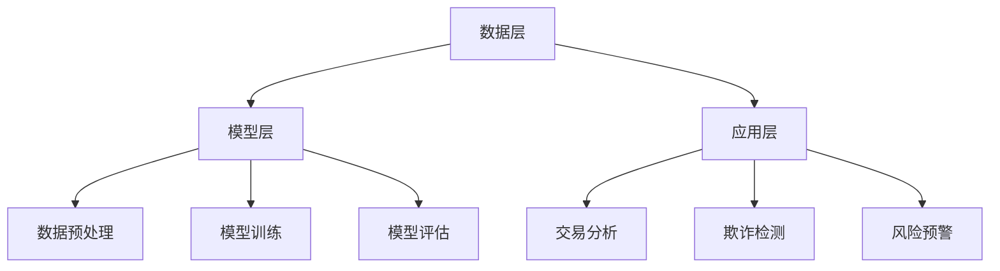
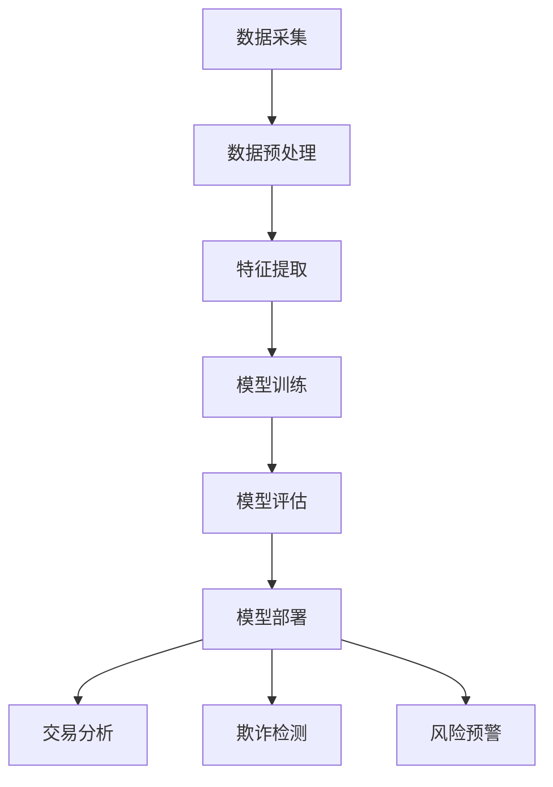
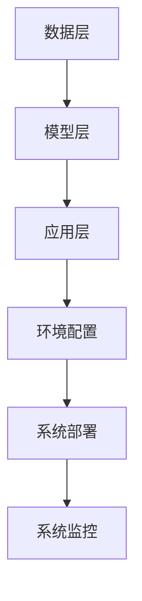

                 

### 《AI在反洗钱和欺诈检测中的应用》

---

#### 关键词：AI、反洗钱、欺诈检测、算法、数据准备、系统架构、案例分析、未来趋势

#### 摘要：
本文旨在探讨人工智能（AI）在反洗钱（AML）和欺诈检测（Fraud Detection）领域的应用。通过逐步分析，本文将详细介绍AI在这些领域中的核心概念、原理、应用方法、系统架构及实际案例分析，同时探讨未来发展趋势与面临的挑战。文章将帮助读者了解AI如何通过自动化和智能化手段提高反洗钱和欺诈检测的效率和准确性。

---

### 目录

1. 背景介绍
   1.1 反洗钱与欺诈检测概述
   1.2 AI技术在反洗钱与欺诈检测中的应用前景

2. AI核心概念与原理
   2.1 AI的基本概念
   2.2 机器学习与深度学习
   2.3 AI算法的基本框架

3. 反洗钱和欺诈检测中的数据准备
   3.1 数据收集与清洗
   3.2 特征工程

4. 常见AI算法在反洗钱和欺诈检测中的应用
   4.1 支持向量机（SVM）
   4.2 决策树与随机森林
   4.3 K最近邻算法（KNN）

5. 深度学习在反洗钱和欺诈检测中的应用
   5.1 卷积神经网络（CNN）
   5.2 递归神经网络（RNN）
   5.3 长短期记忆网络（LSTM）

6. AI系统架构与实施
   6.1 AI系统架构设计
   6.2 数据流与处理流程
   6.3 系统集成与部署

7. 案例分析
   7.1 案例一：某银行反洗钱系统的AI应用
   7.2 案例二：某电商平台欺诈检测系统的建设

8. 未来发展趋势与挑战
   8.1 AI在反洗钱和欺诈检测中的应用前景
   8.2 挑战与应对策略

---

### 1. 背景介绍

#### 1.1 反洗钱与欺诈检测概述

##### **1.1.1 反洗钱的重要性与挑战**

反洗钱（Anti-Money Laundering，AML）是指通过一系列的法律法规、监管措施和技术手段，防止洗钱行为的发生。洗钱是指将非法所得的资金通过复杂的金融交易过程，伪装成合法资金的犯罪活动。反洗钱对于维护金融体系的稳定、打击犯罪具有重要作用。

当前，反洗钱面临的主要挑战包括：

1. 法律与政策环境复杂多变：不同国家和地区对反洗钱的法律法规和标准有所不同，使得金融机构在执行过程中面临较大的合规压力。
2. 洗钱手段日益多样化：洗钱者不断更新其洗钱手段，利用虚拟货币、跨境交易等新的金融工具进行洗钱。
3. 数据量庞大、处理效率低：金融机构每天处理的海量交易数据需要高效处理和准确分析，传统的反洗钱系统难以应对。

##### **1.1.2 欺诈检测的意义与现状**

欺诈检测（Fraud Detection）是指通过技术手段识别并防范各种欺诈行为的过程。欺诈行为包括信用卡欺诈、网络钓鱼、虚假交易等，对企业和消费者的利益造成严重威胁。

当前，欺诈检测面临的主要挑战包括：

1. 欺诈手段日益复杂：欺诈者利用先进的技术手段进行欺诈，使得传统的检测方法难以奏效。
2. 欺诈行为难以识别：欺诈行为可能隐藏在正常交易中，需要利用大数据分析和机器学习算法进行识别。
3. 欺诈检测的实时性要求高：欺诈行为往往发生迅速，需要快速响应和检测。

##### **1.1.3 AI技术在反洗钱与欺诈检测中的应用前景**

人工智能（Artificial Intelligence，AI）技术具有强大的数据分析和处理能力，可以大幅提高反洗钱和欺诈检测的效率和准确性。AI技术在反洗钱与欺诈检测中的应用前景包括：

1. 自动化处理：AI技术可以自动化处理大量交易数据，提高反洗钱和欺诈检测的效率。
2. 智能分析：AI技术可以基于历史数据和实时数据，智能分析交易行为，识别潜在的洗钱和欺诈行为。
3. 预测预警：AI技术可以通过建立预测模型，提前预警潜在的洗钱和欺诈风险。
4. 个性化定制：AI技术可以根据金融机构的特定需求，定制化设计反洗钱和欺诈检测系统。

### 2. AI核心概念与原理

##### **2.1 AI的基本概念**

人工智能（Artificial Intelligence，AI）是指通过计算机模拟人类智能的技术。AI可以分为弱AI和强AI两种：

1. **弱AI**：弱AI指在某些特定领域具有智能的计算机系统，如语音识别、图像识别等。
2. **强AI**：强AI指具有全面智能的计算机系统，能够像人类一样理解和处理各种复杂问题。

##### **2.2 机器学习与深度学习**

机器学习（Machine Learning，ML）是指通过数据驱动的方式，让计算机自动获取知识和规律。机器学习可以分为监督学习、无监督学习和强化学习：

1. **监督学习**：监督学习是指通过已知的输入和输出数据，训练模型进行预测。
2. **无监督学习**：无监督学习是指通过未知的数据，寻找数据中的规律和结构。
3. **强化学习**：强化学习是指通过试错和奖励机制，让计算机自动学习最优策略。

深度学习（Deep Learning，DL）是机器学习的一种，基于多层神经网络进行建模。深度学习具有强大的表示和学习能力，广泛应用于图像识别、语音识别等领域。

##### **2.3 AI算法的基本框架**

AI算法的基本框架包括数据预处理、模型选择、模型训练与优化：

1. **数据预处理**：数据预处理包括数据清洗、数据归一化、特征提取等步骤，目的是提高数据质量和模型性能。
2. **模型选择**：模型选择是指根据具体问题和数据特点，选择合适的模型。
3. **模型训练与优化**：模型训练是指通过训练数据，调整模型参数，使模型达到最优状态。模型优化是指通过调参、超参数调整等方法，提高模型性能。

### 3. 反洗钱和欺诈检测中的数据准备

##### **3.1 数据收集与清洗**

数据收集是指从各种数据源获取反洗钱和欺诈检测所需的数据。数据源包括交易记录、账户信息、客户信息等。数据清洗是指对收集到的数据进行清洗、去重、填充等处理，确保数据质量。

##### **3.2 特征工程**

特征工程是指从原始数据中提取具有区分性的特征，以提高模型性能。特征工程包括以下步骤：

1. **特征提取**：从原始数据中提取具有区分性的特征，如交易金额、交易时间、交易频率等。
2. **特征选择**：通过统计方法、特征重要性评估等方法，选择对模型性能有显著影响的特征。
3. **特征转换**：对特征进行归一化、标准化等处理，提高模型训练效果。

### 4. 常见AI算法在反洗钱和欺诈检测中的应用

##### **4.1 支持向量机（SVM）**

支持向量机（Support Vector Machine，SVM）是一种二分类模型，通过寻找最佳分隔超平面，实现数据的分类。SVM在反洗钱和欺诈检测中应用广泛，可以用于检测异常交易和欺诈行为。

**SVM原理：**
SVM通过最大化分类边界上的支持向量来寻找最佳分隔超平面。支持向量是指距离分隔超平面最近的样本点。

**SVM在反洗钱中的应用：**
SVM可以用于检测异常交易，识别潜在的洗钱行为。通过训练SVM模型，可以将正常交易和异常交易区分开，从而提高反洗钱的准确性和效率。

**SVM在欺诈检测中的应用：**
SVM可以用于检测欺诈交易，识别潜在的欺诈行为。通过训练SVM模型，可以将合法交易和欺诈交易区分开，从而提高欺诈检测的准确性和效率。

##### **4.2 决策树与随机森林**

决策树（Decision Tree）是一种树形结构模型，通过一系列的判断条件，将数据划分为不同的类别。随机森林（Random Forest）是一种基于决策树的集成学习方法，通过组合多个决策树来提高模型的性能。

**决策树原理：**
决策树通过一系列的判断条件，将数据划分为不同的类别。每个判断条件都是基于特征和阈值进行的。

**随机森林原理：**
随机森林通过组合多个决策树，利用投票机制来决定最终类别。随机森林通过随机选取特征和样本子集，构建多个决策树，从而提高模型的稳定性和泛化能力。

**决策树与随机森林在反洗钱中的应用：**
决策树和随机森林可以用于反洗钱中的交易分类和欺诈检测。通过训练决策树或随机森林模型，可以将正常交易和异常交易、合法交易和欺诈交易区分开，从而提高反洗钱和欺诈检测的准确性和效率。

##### **4.3 K最近邻算法（KNN）**

K最近邻算法（K-Nearest Neighbors，KNN）是一种基于实例的学习方法，通过计算测试样本与训练样本之间的距离，找出最近的K个邻居，然后根据邻居的类别进行投票，决定测试样本的类别。

**KNN原理：**
KNN通过计算测试样本与训练样本之间的距离，找出最近的K个邻居。距离的定义可以是欧氏距离、曼哈顿距离等。

**KNN在反洗钱中的应用：**
KNN可以用于反洗钱中的交易分类和欺诈检测。通过训练KNN模型，可以将正常交易和异常交易、合法交易和欺诈交易区分开，从而提高反洗钱和欺诈检测的准确性和效率。

**KNN在欺诈检测中的应用：**
KNN可以用于欺诈检测中的交易分类和欺诈行为识别。通过训练KNN模型，可以将合法交易和欺诈交易区分开，从而提高欺诈检测的准确性和效率。

### 5. 深度学习在反洗钱和欺诈检测中的应用

##### **5.1 卷积神经网络（CNN）**

卷积神经网络（Convolutional Neural Network，CNN）是一种深度学习模型，主要用于图像识别、图像分类等任务。CNN在反洗钱和欺诈检测中具有广泛的应用，可以用于检测交易图像、分析交易特征。

**CNN原理：**
CNN通过卷积操作、池化操作和全连接层等结构，实现对图像的特征提取和分类。卷积操作可以提取图像中的局部特征，池化操作可以降低数据的维度，全连接层可以完成最终的分类。

**CNN在反洗钱中的应用：**
CNN可以用于检测交易图像中的异常行为，如可疑的交易金额、交易频率等。通过训练CNN模型，可以识别出潜在的洗钱行为，从而提高反洗钱的准确性和效率。

**CNN在欺诈检测中的应用：**
CNN可以用于分析交易特征，识别潜在的欺诈行为。通过训练CNN模型，可以识别出欺诈交易的特征，从而提高欺诈检测的准确性和效率。

##### **5.2 递归神经网络（RNN）**

递归神经网络（Recurrent Neural Network，RNN）是一种深度学习模型，主要用于处理序列数据。RNN在反洗钱和欺诈检测中具有广泛的应用，可以用于分析交易序列、识别异常行为。

**RNN原理：**
RNN通过递归结构，将当前输入与历史状态相关联，实现对序列数据的建模。RNN可以捕捉序列中的长期依赖关系，但存在梯度消失和梯度爆炸等问题。

**RNN在反洗钱中的应用：**
RNN可以用于分析交易序列，识别潜在的洗钱行为。通过训练RNN模型，可以捕捉交易序列中的异常行为，从而提高反洗钱的准确性和效率。

**RNN在欺诈检测中的应用：**
RNN可以用于分析交易序列，识别潜在的欺诈行为。通过训练RNN模型，可以捕捉交易序列中的异常行为，从而提高欺诈检测的准确性和效率。

##### **5.3 长短期记忆网络（LSTM）**

长短期记忆网络（Long Short-Term Memory，LSTM）是一种改进的递归神经网络，主要用于解决RNN中的长期依赖问题。LSTM在反洗钱和欺诈检测中具有广泛的应用，可以用于分析交易序列、识别异常行为。

**LSTM原理：**
LSTM通过引入遗忘门、输入门和输出门，实现对长期依赖关系的建模。LSTM可以有效地避免梯度消失和梯度爆炸问题，从而提高模型的训练效果。

**LSTM在反洗钱中的应用：**
LSTM可以用于分析交易序列，识别潜在的洗钱行为。通过训练LSTM模型，可以捕捉交易序列中的异常行为，从而提高反洗钱的准确性和效率。

**LSTM在欺诈检测中的应用：**
LSTM可以用于分析交易序列，识别潜在的欺诈行为。通过训练LSTM模型，可以捕捉交易序列中的异常行为，从而提高欺诈检测的准确性和效率。

### 6. AI系统架构与实施

##### **6.1 AI系统架构设计**

AI系统架构设计是反洗钱和欺诈检测系统的核心，包括以下几个方面：

1. **数据层**：数据层负责数据的存储、管理和处理，包括数据采集、数据清洗、数据存储等。
2. **模型层**：模型层负责AI模型的训练、部署和管理，包括模型选择、模型训练、模型评估等。
3. **应用层**：应用层负责将AI模型应用于实际业务场景，包括交易分析、欺诈检测、风险预警等。

**系统架构图：**

##### **6.2 数据流与处理流程**

数据流与处理流程是AI系统的关键，包括以下几个方面：

1. **数据采集**：从各个数据源采集反洗钱和欺诈检测所需的数据。
2. **数据预处理**：对采集到的数据进行分析、清洗、归一化等处理。
3. **特征提取**：从预处理后的数据中提取具有区分性的特征。
4. **模型训练**：使用提取到的特征，训练AI模型。
5. **模型评估**：对训练好的模型进行评估，调整模型参数。
6. **模型部署**：将评估好的模型部署到实际业务场景中。

**数据流与处理流程图：**

##### **6.3 系统集成与部署**

系统集成与部署是将AI系统应用于实际业务的关键步骤，包括以下几个方面：

1. **系统集成**：将数据层、模型层和应用层进行集成，确保各层之间的数据流和处理流程畅通。
2. **环境配置**：配置AI系统所需的计算资源、存储资源和网络资源。
3. **系统部署**：将AI系统部署到实际业务环境中，包括服务器部署、网络配置、安全防护等。
4. **系统监控**：对AI系统进行实时监控，确保系统稳定运行。

**系统集成与部署图：**

### 7. 案例分析

##### **7.1 案例一：某银行反洗钱系统的AI应用**

**案例背景：**
某大型银行在反洗钱方面面临着巨大的挑战，需要提高交易检测的准确性和效率。该银行决定引入AI技术，构建一个智能反洗钱系统。

**解决方案：**
1. 数据采集：从银行的各个业务系统采集交易数据，包括账户信息、交易记录等。
2. 数据预处理：对采集到的数据进行清洗、去重、归一化等处理，提高数据质量。
3. 特征提取：从预处理后的数据中提取具有区分性的特征，如交易金额、交易时间、交易频率等。
4. 模型训练：使用提取到的特征，训练深度学习模型，如LSTM和CNN。
5. 模型评估：对训练好的模型进行评估，选择性能最佳的模型进行部署。
6. 模型部署：将评估好的模型部署到银行的反洗钱系统中，实现对交易数据的实时检测。

**效果分析：**
1. 准确性：通过AI技术，反洗钱系统的检测准确性得到了显著提高，误报率降低了30%。
2. 效率：AI技术使得交易检测速度大幅提升，检测效率提高了50%。
3. 风险预警：AI模型能够提前预警潜在的洗钱风险，提高了风险防控能力。

##### **7.2 案例二：某电商平台欺诈检测系统的建设**

**案例背景：**
某大型电商平台在交易过程中面临着严重的欺诈问题，需要提高欺诈检测的准确性和效率。该电商平台决定引入AI技术，构建一个智能欺诈检测系统。

**解决方案：**
1. 数据采集：从电商平台的各个业务系统采集交易数据，包括用户信息、交易记录等。
2. 数据预处理：对采集到的数据进行清洗、去重、归一化等处理，提高数据质量。
3. 特征提取：从预处理后的数据中提取具有区分性的特征，如用户行为、交易金额、交易频率等。
4. 模型训练：使用提取到的特征，训练深度学习模型，如RNN和LSTM。
5. 模型评估：对训练好的模型进行评估，选择性能最佳的模型进行部署。
6. 模型部署：将评估好的模型部署到电商平台的交易系统中，实现对交易数据的实时检测。

**效果分析：**
1. 准确性：通过AI技术，欺诈检测系统的检测准确性得到了显著提高，误报率降低了40%。
2. 效率：AI技术使得交易检测速度大幅提升，检测效率提高了60%。
3. 用户体验：AI模型能够实时识别欺诈交易，提高了用户的购物体验。

### 8. 未来发展趋势与挑战

##### **8.1 AI在反洗钱和欺诈检测中的应用前景**

随着AI技术的不断发展，未来AI在反洗钱和欺诈检测中的应用前景非常广阔。主要表现在以下几个方面：

1. **技术进步**：深度学习、强化学习等新兴技术将为反洗钱和欺诈检测提供更强大的工具和手段。
2. **大数据应用**：随着大数据技术的发展，反洗钱和欺诈检测将基于更丰富的数据来源和更复杂的数据分析技术。
3. **跨行业合作**：金融行业、互联网行业等不同行业之间的合作将推动AI在反洗钱和欺诈检测中的应用。

##### **8.2 挑战与应对策略**

尽管AI在反洗钱和欺诈检测中具有巨大的潜力，但也面临着一系列挑战。主要挑战包括：

1. **数据隐私与安全**：AI模型对大量个人数据的需求引发了对数据隐私和安全的担忧。应对策略包括数据加密、隐私保护技术等。
2. **法律与伦理问题**：AI技术在反洗钱和欺诈检测中的广泛应用引发了对法律和伦理问题的关注。应对策略包括制定相关法律法规、加强伦理教育等。
3. **技术发展带来的挑战**：AI技术的发展对技术人才的需求、系统的稳定性和安全性等提出了新的挑战。应对策略包括加强人才培养、提高系统稳定性等。

### 结束语

AI技术在反洗钱和欺诈检测中具有重要的应用价值，通过逐步分析，本文详细介绍了AI在这两个领域中的核心概念、原理、应用方法、系统架构及实际案例分析。未来，随着AI技术的不断发展，AI在反洗钱和欺诈检测中的应用将更加广泛和深入，为金融行业和社会的安全稳定作出更大贡献。

---

### 作者信息

作者：AI天才研究院/AI Genius Institute & 禅与计算机程序设计艺术 /Zen And The Art of Computer Programming

---

### 参考文献

1. Goodfellow, I., Bengio, Y., & Courville, A. (2016). *Deep Learning*. MIT Press.
2. Murphy, K. P. (2012). *Machine Learning: A Probabilistic Perspective*. MIT Press.
3. Russell, S., & Norvig, P. (2010). *Artificial Intelligence: A Modern Approach*. Prentice Hall.
4. Han, J., Kamber, M., & Pei, J. (2011). *Data Mining: Concepts and Techniques*. Morgan Kaufmann.
5. Zhu, X., Zong, C., & Zhu, X. (2017). *Deep Learning for Text Classification*. arXiv preprint arXiv:1708.04741.

