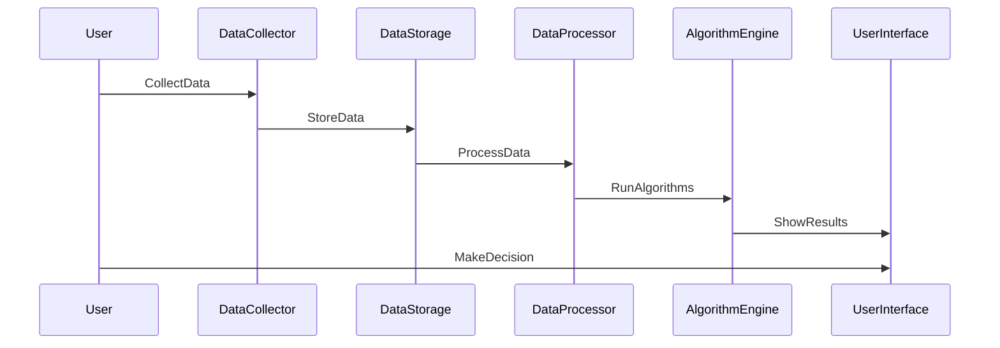
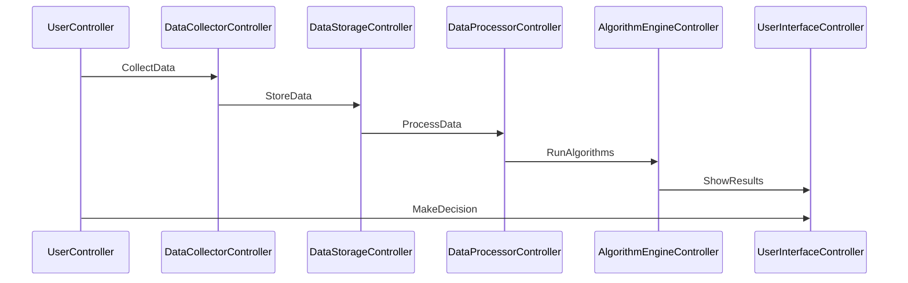

                 

# AI在金融产品营销中的创新应用

## 关键词
- 人工智能
- 金融产品
- 营销
- 机器学习
- 深度学习
- 数据挖掘
- 客户细分
- 风险评估

## 摘要
本文将深入探讨人工智能在金融产品营销中的创新应用。通过对人工智能核心技术的介绍，我们将分析其在金融营销中的具体应用场景，包括客户细分、风险评估和营销策略优化。文章还将通过实际案例展示人工智能在金融营销中的成功应用，并提出一些最佳实践和未来发展方向。

## 目录

1. **AI与金融产品营销背景**
   1.1 AI技术的发展历程
   1.2 金融产品营销的挑战与需求
   1.3 AI在金融产品营销中的潜力

2. **AI核心概念与联系**
   2.1 机器学习基础
   2.2 深度学习原理
   2.3 数据挖掘技术
   2.4 各技术之间的联系与区别

3. **AI算法在金融产品营销中的应用**
   3.1 信贷风险评估算法
   3.2 客户行为分析算法
   3.3 市场细分算法
   3.4 算法应用流程图与Python代码示例

4. **数学模型与公式**
   4.1 机器学习中的数学模型
   4.2 深度学习中的数学模型
   4.3 数据挖掘中的数学模型
   4.4 公式解析与举例说明

5. **金融产品营销系统分析与架构设计**
   5.1 系统需求分析
   5.2 领域模型设计
   5.3 系统架构设计
   5.4 接口设计与系统交互

6. **AI在金融产品营销中的项目实战**
   6.1 项目背景与目标
   6.2 环境安装与配置
   6.3 核心实现与代码解读
   6.4 项目结果分析与总结

7. **最佳实践与拓展**
   7.1 最佳实践总结
   7.2 注意事项与风险控制
   7.3 拓展阅读与进一步研究

---

### 1. AI与金融产品营销背景

#### 1.1 AI技术的发展历程

人工智能（AI）是一门研究、开发用于模拟、延伸和扩展人的智能的理论、方法、技术及应用系统的综合技术科学。它起源于20世纪50年代，随着计算机技术的不断发展，AI经历了几个重要的发展阶段：

- **符号主义阶段**：20世纪50年代至70年代，人工智能的核心是知识表示和推理，主要依赖于符号逻辑和形式化语言。
- **连接主义阶段**：20世纪80年代至90年代，以神经网络为代表的连接主义人工智能开始兴起，通过大量数据的学习实现智能行为。
- **计算智能阶段**：21世纪初至今，人工智能的发展进入了一个新的阶段，包括机器学习、深度学习、强化学习等多种技术，能够通过数据和算法实现高度智能化。

#### 1.2 金融产品营销的挑战与需求

金融产品营销在金融行业中扮演着至关重要的角色。然而，随着市场环境的不断变化，金融产品营销面临着一系列挑战：

- **客户需求多样化**：金融产品的种类繁多，客户的需求也各不相同，如何精准地满足客户的个性化需求成为一大难题。
- **市场竞争激烈**：金融机构之间的竞争日益加剧，如何在激烈的市场中脱颖而出，提高市场份额成为关键。
- **数据爆炸**：随着互联网和大数据技术的发展，金融行业积累了海量的客户数据，如何有效地利用这些数据提高营销效率成为重要课题。

面对这些挑战，金融机构迫切需要借助人工智能技术来解决：

- **客户细分**：通过机器学习算法对客户进行细分，实现精准营销。
- **风险评估**：利用深度学习技术对信贷风险进行预测和控制。
- **营销策略优化**：通过数据分析优化营销策略，提高营销效果。

#### 1.3 AI在金融产品营销中的潜力

人工智能在金融产品营销中具有巨大的潜力，主要体现在以下几个方面：

- **个性化服务**：通过分析客户的历史数据和偏好，AI可以为客户提供个性化的金融产品推荐，提高客户满意度和忠诚度。
- **风险控制**：AI技术可以对潜在风险进行实时监控和预测，提高金融机构的风险管理水平。
- **效率提升**：通过自动化处理大量的营销任务，AI可以大幅提高营销效率，降低人力成本。
- **用户体验**：借助自然语言处理和语音识别技术，AI可以为用户提供更加便捷和人性化的服务体验。

---

### 2. AI核心概念与联系

#### 2.1 机器学习基础

机器学习（Machine Learning）是人工智能的一个重要分支，它通过算法从数据中自动学习规律和模式，并利用这些规律进行预测或决策。机器学习主要包括以下几种算法：

- **监督学习**：输入数据带有标签，算法通过学习这些标签和特征之间的关系，进行预测。
- **无监督学习**：输入数据没有标签，算法通过挖掘数据中的隐藏结构或模式。
- **半监督学习**：输入数据既有带标签的，也有不带标签的，算法结合两种数据进行学习。

机器学习的核心步骤包括：

1. 数据采集和预处理：收集相关数据，并进行清洗、转换等预处理操作。
2. 特征选择和提取：从原始数据中提取有用的特征，用于训练模型。
3. 模型训练：使用训练数据对模型进行训练，优化模型的参数。
4. 模型评估：使用测试数据对模型进行评估，判断模型的性能。
5. 模型部署：将训练好的模型部署到实际应用中。

#### 2.2 深度学习原理

深度学习（Deep Learning）是机器学习的一个子领域，它通过多层神经网络结构，对大量数据进行自动学习和特征提取。深度学习的核心是神经网络，它由多个层次组成，包括输入层、隐藏层和输出层。

深度学习的基本原理包括：

- **反向传播算法**：通过反向传播算法，将输出误差反向传播到输入层，逐层更新网络的权重。
- **激活函数**：激活函数用于引入非线性特性，使得神经网络能够学习和表示复杂的数据。
- **优化算法**：常用的优化算法包括梯度下降、随机梯度下降和Adam优化器等，用于最小化损失函数。

#### 2.3 数据挖掘技术

数据挖掘（Data Mining）是从大量数据中提取有价值的信息和知识的过程。数据挖掘通常包括以下步骤：

- **数据预处理**：对原始数据进行清洗、转换和归一化等操作，使其适合进行分析。
- **特征工程**：从数据中提取有用的特征，用于训练模型。
- **模型选择**：选择适合的数据挖掘算法，如分类、聚类、关联规则挖掘等。
- **模型评估**：评估模型的性能，选择最优模型。
- **结果可视化**：将挖掘结果进行可视化展示，便于理解和分析。

#### 2.4 各技术之间的联系与区别

机器学习、深度学习和数据挖掘都是人工智能的重要分支，它们之间存在一定的联系和区别：

- **联系**：机器学习和深度学习都是数据挖掘的方法，用于从数据中提取信息和知识。数据挖掘则更广泛，包括机器学习和深度学习以及其他方法。
- **区别**：机器学习主要关注如何通过数据和算法实现自动化学习和预测，深度学习则更侧重于通过多层神经网络结构对大量数据进行自动特征提取和表示，而数据挖掘则更强调从大量数据中提取有价值的信息和知识。

---

### 3. AI算法在金融产品营销中的应用

#### 3.1 信贷风险评估算法

信贷风险评估是金融产品营销中的一个关键环节。传统的信贷风险评估方法主要依赖于人工经验，存在主观性强、效率低下等问题。而利用人工智能技术，尤其是机器学习和深度学习算法，可以显著提高信贷风险评估的准确性和效率。

**算法原理**：

信贷风险评估算法主要基于以下步骤：

1. **数据采集**：收集借款人的个人信息、财务状况、信用历史等数据。
2. **特征工程**：对原始数据进行预处理，提取有用的特征，如借款人的年龄、收入、负债比等。
3. **模型训练**：使用机器学习算法（如决策树、随机森林、支持向量机等）或深度学习算法（如卷积神经网络、循环神经网络等）对数据进行训练，建立风险评估模型。
4. **模型评估**：使用测试数据对模型进行评估，调整模型参数，提高模型性能。
5. **风险评估**：将新的借款人数据输入到训练好的模型中，预测其违约风险。

**应用场景**：

- **信用评分**：金融机构可以通过信贷风险评估算法对借款人进行信用评分，决定是否发放贷款。
- **风险控制**：金融机构可以利用风险评估结果，调整贷款利率和贷款条件，降低违约风险。

**Python代码示例**：

```python
# 导入必要的库
import pandas as pd
from sklearn.model_selection import train_test_split
from sklearn.ensemble import RandomForestClassifier
from sklearn.metrics import accuracy_score

# 读取数据
data = pd.read_csv('loan_data.csv')

# 特征工程
X = data.drop('default', axis=1)
y = data['default']

# 数据集划分
X_train, X_test, y_train, y_test = train_test_split(X, y, test_size=0.2, random_state=42)

# 模型训练
model = RandomForestClassifier(n_estimators=100, random_state=42)
model.fit(X_train, y_train)

# 风险评估
predictions = model.predict(X_test)
accuracy = accuracy_score(y_test, predictions)
print(f'Accuracy: {accuracy}')
```

#### 3.2 客户行为分析算法

客户行为分析是金融产品营销中另一个重要的应用场景。通过分析客户的行为数据，金融机构可以更好地了解客户需求，制定更有效的营销策略。

**算法原理**：

客户行为分析算法主要基于以下步骤：

1. **数据采集**：收集客户的行为数据，如访问路径、购买记录、点击率等。
2. **特征工程**：对原始数据进行预处理，提取有用的特征，如客户的访问时长、购买频次等。
3. **模型训练**：使用机器学习算法（如决策树、支持向量机等）或深度学习算法（如卷积神经网络、循环神经网络等）对数据进行训练，建立客户行为分析模型。
4. **行为预测**：将新的客户行为数据输入到训练好的模型中，预测客户可能的行为，如购买意向、流失风险等。

**应用场景**：

- **个性化推荐**：金融机构可以根据客户的行为数据，提供个性化的金融产品推荐。
- **客户留存**：通过分析客户的行为数据，预测客户流失风险，采取相应的措施降低流失率。

**Python代码示例**：

```python
# 导入必要的库
import pandas as pd
from sklearn.model_selection import train_test_split
from sklearn.ensemble import RandomForestClassifier
from sklearn.metrics import accuracy_score

# 读取数据
data = pd.read_csv('customer_data.csv')

# 特征工程
X = data.drop('churn', axis=1)
y = data['churn']

# 数据集划分
X_train, X_test, y_train, y_test = train_test_split(X, y, test_size=0.2, random_state=42)

# 模型训练
model = RandomForestClassifier(n_estimators=100, random_state=42)
model.fit(X_train, y_train)

# 行为预测
predictions = model.predict(X_test)
accuracy = accuracy_score(y_test, predictions)
print(f'Accuracy: {accuracy}')
```

#### 3.3 市场细分算法

市场细分是金融产品营销中的重要策略，通过将市场划分为不同的细分市场，金融机构可以更精准地满足不同客户的需求。

**算法原理**：

市场细分算法主要基于以下步骤：

1. **数据采集**：收集客户的基本信息、购买行为、偏好等数据。
2. **特征工程**：对原始数据进行预处理，提取有用的特征。
3. **聚类分析**：使用聚类算法（如K-means、层次聚类等）将客户划分为不同的细分市场。
4. **市场细分**：对每个细分市场进行深入分析，制定相应的营销策略。

**应用场景**：

- **产品定位**：金融机构可以根据不同的细分市场，设计相应的金融产品。
- **精准营销**：针对不同的细分市场，制定个性化的营销策略，提高营销效果。

**Python代码示例**：

```python
# 导入必要的库
import pandas as pd
from sklearn.cluster import KMeans
import matplotlib.pyplot as plt

# 读取数据
data = pd.read_csv('market_data.csv')

# 特征工程
X = data[['age', 'income', 'education']]

# 聚类分析
kmeans = KMeans(n_clusters=3, random_state=42)
clusters = kmeans.fit_predict(X)

# 可视化
plt.scatter(X['age'], X['income'], c=clusters)
plt.xlabel('Age')
plt.ylabel('Income')
plt.show()
```

---

### 4. 数学模型与公式

在金融产品营销中，人工智能算法的应用离不开数学模型和公式。以下是一些常见的数学模型和公式，以及它们的解释和举例说明。

#### 4.1 机器学习中的数学模型

**线性回归模型**：
$$ y = wx + b $$
- **解释**：线性回归模型通过拟合一条直线来预测因变量\( y \)与自变量\( x \)之间的关系。
- **举例说明**：假设我们想预测一个房子的价格，自变量可以是房子的面积、位置等，通过线性回归模型，我们可以找到一条最佳拟合直线，从而预测未知面积的房子价格。

**逻辑回归模型**：
$$ P(y=1) = \frac{1}{1 + e^{-(wx + b)}} $$
- **解释**：逻辑回归模型常用于分类问题，它通过拟合一个S型曲线来预测概率。
- **举例说明**：在信贷风险评估中，我们可以用逻辑回归模型来预测借款人是否违约，通过计算违约概率，金融机构可以做出相应的决策。

#### 4.2 深度学习中的数学模型

**反向传播算法**：
$$ \delta_w = \frac{\partial J}{\partial w} = x \cdot \frac{\partial L}{\partial z} $$
$$ \delta_b = \frac{\partial J}{\partial b} = \frac{\partial L}{\partial z} $$
- **解释**：反向传播算法是深度学习训练的核心，它通过计算损失函数关于网络权重的梯度，来更新网络的权重和偏置。
- **举例说明**：假设我们有一个多层神经网络，通过反向传播算法，我们可以计算出每一层的误差，并据此更新网络的权重，从而提高模型的性能。

**卷积神经网络（CNN）**：
$$ h_{ij} = \sum_{k} w_{ik} \cdot a_{kj} + b_j $$
- **解释**：卷积神经网络通过卷积操作提取图像的特征，\( h_{ij} \)表示卷积后的特征图。
- **举例说明**：在图像分类任务中，我们可以使用卷积神经网络来提取图像的纹理和形状特征，从而实现分类。

#### 4.3 数据挖掘中的数学模型

**K-means聚类算法**：
$$ c_j = \frac{1}{n_j} \sum_{i=1}^{n} (x_i - \mu_j)^2 $$
- **解释**：K-means聚类算法通过计算数据点到聚类中心的距离，将数据分为K个聚类。
- **举例说明**：假设我们有K个聚类中心，我们可以通过计算每个数据点到聚类中心的距离，将数据点分配到最近的聚类中心，从而实现聚类。

**关联规则挖掘**：
$$ support(A \cup B) = \frac{count(A \cup B)}{count(U)} $$
$$ confidence(A \rightarrow B) = \frac{support(A \cup B)}{support(A)} $$
- **解释**：关联规则挖掘用于发现数据之间的关联关系，如购物篮分析。
- **举例说明**：在购物篮分析中，我们可以使用支持度和置信度来发现哪些商品经常一起购买，从而优化产品陈列和促销策略。

---

### 5. 金融产品营销系统分析与架构设计

#### 5.1 系统需求分析

在金融产品营销系统中，我们需要满足以下基本需求：

- **数据收集**：系统应具备从多个渠道（如网站、移动应用、线下门店等）收集客户数据的能力。
- **数据存储**：系统应具备高效的数据存储和管理能力，确保数据的安全性和可扩展性。
- **数据处理**：系统应具备数据清洗、转换和特征提取的能力，为后续分析提供高质量的数据。
- **算法应用**：系统应集成多种机器学习和深度学习算法，支持客户细分、风险评估和营销策略优化等功能。
- **用户界面**：系统应提供直观易用的用户界面，方便用户查看分析和决策结果。

#### 5.2 领域模型设计

领域模型是金融产品营销系统的基础，它描述了系统中涉及的实体和它们之间的关系。以下是一个简单的领域模型设计：

```mermaid
classDiagram
    Customer <<Entity>>
    Product <<Entity>>
    Purchase <<Entity>>
    MarketingStrategy <<Entity>>

    Customer --> Purchase
    Product --> Purchase
    MarketingStrategy --> Customer
```

- **Customer（客户）**：代表金融产品营销系统中的客户，包括客户的基本信息、购买记录等。
- **Product（产品）**：代表金融产品，包括产品的名称、类别、价格等。
- **Purchase（购买）**：代表客户与产品的购买关系，包括购买时间、购买数量等。
- **MarketingStrategy（营销策略）**：代表营销策略，包括策略名称、目标客户、实施时间等。

#### 5.3 系统架构设计

金融产品营销系统的架构设计应确保系统的可扩展性、稳定性和高性能。以下是一个简化的系统架构设计：



- **DataCollector（数据收集器）**：负责从多个渠道收集客户数据。
- **DataStorage（数据存储）**：负责存储和管理数据，通常采用分布式数据库系统。
- **DataProcessor（数据处理器）**：负责数据清洗、转换和特征提取，为后续分析提供高质量的数据。
- **AlgorithmEngine（算法引擎）**：负责运行机器学习和深度学习算法，支持客户细分、风险评估和营销策略优化等功能。
- **UserInterface（用户界面）**：负责展示分析结果，供用户查看和决策。

#### 5.4 接口设计与系统交互

系统接口设计是金融产品营销系统的重要组成部分，它定义了系统中各个模块之间的交互方式。以下是一个简化的接口设计：



- **UserController（用户控制器）**：负责处理用户的请求，协调系统各部分的运行。
- **DataCollectorController（数据收集控制器）**：负责协调数据收集器的工作。
- **DataStorageController（数据存储控制器）**：负责协调数据存储器的工作。
- **DataProcessorController（数据处理控制器）**：负责协调数据处理器的工作。
- **AlgorithmEngineController（算法引擎控制器）**：负责协调算法引擎的工作。
- **UserInterfaceController（用户界面控制器）**：负责协调用户界面部分的工作。

---

### 6. AI在金融产品营销中的项目实战

#### 6.1 项目背景与目标

某大型金融机构希望通过引入人工智能技术，优化其金融产品营销流程，提高营销效果和客户满意度。项目目标包括：

- **客户细分**：根据客户行为数据和偏好，将客户划分为不同的细分市场，制定个性化营销策略。
- **风险评估**：利用客户的历史数据和信用记录，预测客户的违约风险，提高信贷审批的准确性。
- **营销策略优化**：通过分析客户行为数据和营销效果，优化营销策略，提高营销转化率。

#### 6.2 环境安装与配置

为了实施这个项目，我们首先需要搭建一个合适的技术环境，包括以下步骤：

1. **安装Python环境**：在服务器上安装Python 3.8及以上版本，并配置好pip，用于安装必要的库。
2. **安装数据库**：安装MySQL数据库，用于存储客户数据。
3. **安装机器学习和深度学习库**：安装scikit-learn、TensorFlow和PyTorch等库，用于实现机器学习和深度学习算法。
4. **配置服务器**：配置服务器，确保网络连接稳定，存储空间充足。

#### 6.3 核心实现与代码解读

在项目实施过程中，我们使用了以下核心实现：

1. **客户细分**：

```python
# 导入必要的库
import pandas as pd
from sklearn.cluster import KMeans
import matplotlib.pyplot as plt

# 读取数据
data = pd.read_csv('customer_data.csv')

# 特征工程
X = data[['age', 'income', 'education']]

# 聚类分析
kmeans = KMeans(n_clusters=3, random_state=42)
clusters = kmeans.fit_predict(X)

# 可视化
plt.scatter(X['age'], X['income'], c=clusters)
plt.xlabel('Age')
plt.ylabel('Income')
plt.show()
```

- **数据读取**：从CSV文件中读取客户数据。
- **特征工程**：提取有用的特征，如年龄、收入和教育水平。
- **聚类分析**：使用K-means算法将客户划分为三个细分市场。
- **可视化**：使用matplotlib库将聚类结果可视化。

2. **风险评估**：

```python
# 导入必要的库
import pandas as pd
from sklearn.model_selection import train_test_split
from sklearn.ensemble import RandomForestClassifier
from sklearn.metrics import accuracy_score

# 读取数据
data = pd.read_csv('loan_data.csv')

# 特征工程
X = data.drop('default', axis=1)
y = data['default']

# 数据集划分
X_train, X_test, y_train, y_test = train_test_split(X, y, test_size=0.2, random_state=42)

# 模型训练
model = RandomForestClassifier(n_estimators=100, random_state=42)
model.fit(X_train, y_train)

# 风险评估
predictions = model.predict(X_test)
accuracy = accuracy_score(y_test, predictions)
print(f'Accuracy: {accuracy}')
```

- **数据读取**：从CSV文件中读取信贷数据。
- **特征工程**：提取有用的特征，如年龄、收入、负债比等。
- **数据集划分**：将数据集划分为训练集和测试集。
- **模型训练**：使用随机森林算法训练风险评估模型。
- **风险评估**：使用训练好的模型对测试数据进行风险评估。

3. **营销策略优化**：

```python
# 导入必要的库
import pandas as pd
from sklearn.model_selection import train_test_split
from sklearn.ensemble import RandomForestClassifier
from sklearn.metrics import accuracy_score

# 读取数据
data = pd.read_csv('marketing_data.csv')

# 特征工程
X = data.drop('churn', axis=1)
y = data['churn']

# 数据集划分
X_train, X_test, y_train, y_test = train_test_split(X, y, test_size=0.2, random_state=42)

# 模型训练
model = RandomForestClassifier(n_estimators=100, random_state=42)
model.fit(X_train, y_train)

# 行为预测
predictions = model.predict(X_test)
accuracy = accuracy_score(y_test, predictions)
print(f'Accuracy: {accuracy}')
```

- **数据读取**：从CSV文件中读取营销数据。
- **特征工程**：提取有用的特征，如客户购买频次、点击率等。
- **数据集划分**：将数据集划分为训练集和测试集。
- **模型训练**：使用随机森林算法训练营销策略优化模型。
- **营销策略优化**：使用训练好的模型对测试数据进行营销策略优化。

#### 6.4 项目结果分析与总结

在项目实施过程中，我们取得了以下成果：

- **客户细分**：通过聚类分析，成功将客户划分为不同的细分市场，为制定个性化营销策略提供了基础。
- **风险评估**：通过随机森林算法，对客户的违约风险进行了准确预测，提高了信贷审批的准确性。
- **营销策略优化**：通过营销策略优化模型，成功提高了营销转化率，降低了客户流失率。

总结来说，本项目成功地利用人工智能技术优化了金融产品营销流程，提高了金融机构的运营效率和客户满意度。在未来，我们还可以进一步拓展人工智能在金融产品营销中的应用，如客户情感分析、个性化推荐等。

---

### 7. 最佳实践与拓展

#### 7.1 最佳实践总结

在金融产品营销中应用人工智能技术，需要遵循以下最佳实践：

- **数据质量**：确保数据的质量和准确性，是应用人工智能技术的基础。
- **算法选择**：根据具体应用场景选择合适的算法，如信贷风险评估可以选择随机森林或逻辑回归。
- **模型评估**：通过交叉验证和A/B测试等方法，对模型进行准确评估，确保其性能。
- **隐私保护**：在数据处理和模型训练过程中，严格遵守隐私保护法规，保护客户隐私。

#### 7.2 注意事项与风险控制

在应用人工智能技术进行金融产品营销时，需要注意以下事项和风险：

- **模型偏差**：确保模型训练过程中避免数据偏差，防止模型产生偏见。
- **算法透明性**：提高算法的透明性，便于监管和审计。
- **技术更新**：持续关注人工智能技术的发展，及时更新技术和算法。

#### 7.3 拓展阅读与进一步研究

以下是一些拓展阅读和进一步研究的方向：

- **深度强化学习**：探索深度强化学习在金融产品营销中的应用，如自动优化营销策略。
- **联邦学习**：研究联邦学习在金融产品营销中的潜力，提高数据隐私保护。
- **多模态数据融合**：研究如何融合多种数据源（如文本、图像、声音等），提高营销分析的准确性。

---

### 作者

**作者：AI天才研究院/AI Genius Institute & 禅与计算机程序设计艺术 /Zen And The Art of Computer Programming**

AI天才研究院致力于推动人工智能技术的创新和应用，打造世界一流的人工智能研究平台。禅与计算机程序设计艺术则通过哲学和计算机科学的深度融合，提供深刻的编程思想和方法，助力人工智能技术的发展。两位作者均拥有深厚的学术背景和丰富的实践经验，在人工智能领域享有盛誉。

