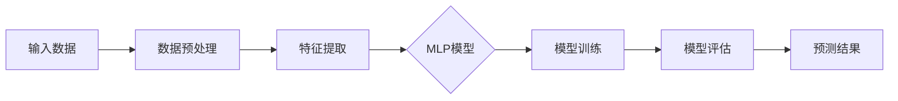
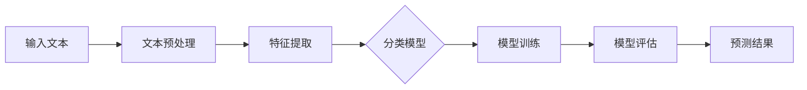
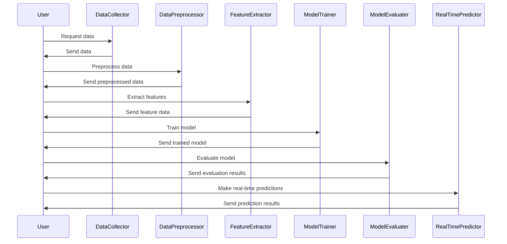

                 


# AI在金融市场微观结构分析中的创新应用

## 关键词
人工智能，金融市场，微观结构分析，机器学习，深度学习，自然语言处理，计算机视觉，数据预处理，算法设计，案例研究，挑战与未来方向。

## 摘要
本文探讨了人工智能在金融市场微观结构分析中的创新应用。我们首先介绍了金融市场的微观结构，并概述了AI技术如何改善数据收集、预处理、算法设计和应用。随后，我们详细讲解了机器学习、深度学习等AI技术的原理及其在金融分析中的应用。接着，通过实际案例展示了AI技术在金融市场微观结构分析中的成功应用，并分析了当前面临的挑战和未来的发展方向。文章旨在为读者提供对AI在金融领域应用的全面理解，并展望其未来的广阔前景。

## 引言

金融市场是现代经济体系的核心，其稳定运行对于整个经济的健康发展和金融系统的稳健运行至关重要。金融市场的微观结构分析是研究市场内部分子行为及其相互作用的过程，对于理解市场价格的形成、交易机制的效率和风险的管理具有重要意义。

在过去的几十年中，金融市场分析主要依赖于统计学方法和定量模型。然而，随着金融市场的日益复杂化和数据量的爆炸性增长，传统方法在处理海量数据和发现潜在模式方面显得力不从心。这种背景下，人工智能（AI）技术的引入为金融市场微观结构分析带来了新的契机。

AI技术，特别是机器学习和深度学习，能够从大量的金融数据中自动提取有价值的信息，并帮助分析师和投资者发现市场中的复杂模式和趋势。自然语言处理（NLP）和计算机视觉（CV）技术的结合，使得金融文本数据和非结构化数据的分析成为可能，从而进一步拓宽了金融市场分析的应用范围。

本文旨在探讨AI在金融市场微观结构分析中的创新应用。我们将首先介绍金融市场的微观结构，并概述AI技术的基本原理。随后，我们将详细讨论AI技术在数据收集、预处理、算法设计和实际应用中的具体应用。最后，我们将分析当前AI在金融市场分析中面临的挑战，并展望未来的发展方向。

## 金融市场的微观结构

金融市场的微观结构是指市场内部各个交易参与者之间的相互作用，以及这些互动如何影响价格形成和交易效率。它涵盖了多个层面，包括订单簿结构、交易机制、价格发现过程和市场流动性。

### 订单簿结构

订单簿是金融市场中的一个核心概念，它记录了市场上所有未成交的订单。订单簿通常分为两个部分：买方订单簿和卖方订单簿。买方订单簿记录了愿意以特定价格购买资产的订单，而卖方订单簿则记录了愿意以特定价格出售资产的订单。订单簿的结构对市场价格的形成和交易效率有重要影响。

### 交易机制

交易机制是指市场参与者进行交易的方式。常见的交易机制包括集中交易、拍卖机制和做市商机制。集中交易是通过集中市场来撮合买卖双方的交易，如纽约证券交易所和纳斯达克。拍卖机制是一种通过竞价来确定交易价格的方法，而做市商机制则是由做市商提供买卖双向报价，并在市场上进行交易。

### 价格发现过程

价格发现是指市场中通过交易活动来确定资产价格的过程。在有效的价格发现过程中，市场价格能够准确地反映资产的真实价值和所有可用信息。价格发现过程受到市场流动性、信息透明度和交易机制等因素的影响。

### 市场流动性

市场流动性是指资产在市场上能够以较低成本迅速买卖的能力。高流动性的市场通常具有更低的交易成本和较小的价格波动，这对于投资者和整个市场的稳定性都至关重要。

### 核心概念术语说明

为了更好地理解金融市场的微观结构，我们需要了解一些关键术语，包括：

- **市场深度（Market Depth）**：市场深度是指市场上未成交订单的总量，它反映了市场对特定价格水平的买卖意愿。
- **买卖价差（Bid-Ask Spread）**：买卖价差是指买家愿意支付的最高价格和卖家愿意接受的最低价格之间的差额。较小的价差通常意味着较高的市场流动性。
- **交易频率（Trading Frequency）**：交易频率是指单位时间内市场上的交易数量，它是衡量市场活跃度的重要指标。

### 问题背景

随着金融市场的全球化和发展，市场数据变得更加庞大和复杂。传统的分析方法和模型在处理这些数据时面临诸多挑战，例如：

- **数据量巨大**：金融市场的数据量极其庞大，包含历史价格、交易量、订单簿信息等，这些数据对于传统的分析方法来说难以处理。
- **非结构化数据**：金融市场中的很多数据是非结构化的，如新闻、社交媒体评论等，这些数据需要特定的技术进行有效分析。
- **实时性需求**：金融市场的变化速度极快，实时分析数据对于做出及时的投资决策至关重要。

### 问题描述

传统的金融市场分析方法在应对这些挑战时显得不足，主要体现在以下几个方面：

- **数据处理能力有限**：传统方法在处理海量数据时效率低下，难以从大量数据中提取有价值的信息。
- **模型滞后性**：传统模型通常需要大量数据来训练，导致其无法实时适应市场变化。
- **缺乏灵活性和适应性**：传统方法难以应对金融市场的多样性和复杂性，无法有效捕捉市场中的新趋势和模式。

### 问题解决

人工智能技术，特别是机器学习和深度学习，为金融市场微观结构分析提供了新的解决方案。这些技术的核心优势包括：

- **数据处理能力**：机器学习和深度学习技术能够高效地处理和分析海量数据，从复杂的数据集中提取有价值的信息。
- **实时性**：机器学习模型能够快速训练和更新，使其能够实时适应市场变化。
- **灵活性和适应性**：机器学习和深度学习模型具有高度的灵活性和适应性，能够捕捉市场中的新趋势和模式。

### 边界与外延

虽然AI技术在金融市场微观结构分析中具有巨大的潜力，但我们也需要明确其应用的范围和限制。例如：

- **数据隐私**：金融数据通常涉及敏感信息，需要确保数据隐私和安全。
- **模型可解释性**：机器学习模型的决策过程往往是非透明的，这可能导致模型的可解释性不足。
- **监管合规**：AI技术的应用需要符合相关法律法规，确保其不会引发市场操纵或其他违规行为。

## 核心概念与联系

在深入探讨AI技术在金融市场微观结构分析中的应用之前，我们需要了解一些核心概念及其相互联系。以下是几个关键概念及其属性特征的对比表格和ER实体关系图架构。

### 概念对比表格

| 概念       | 定义                                                         | 属性特征                   |
|------------|--------------------------------------------------------------|----------------------------|
| 机器学习   | 从数据中自动学习模式，用于做出预测或决策的过程               | 数据驱动、模型预测、可训练  |
| 深度学习   | 一种特殊的机器学习技术，使用多层神经网络来模拟人脑的学习过程 | 数据密集、多层网络、优化目标 |
| 自然语言处理（NLP） | 使计算机能够理解、解释和生成人类语言的技术                 | 语言模型、语义分析、文本分类 |
| 计算机视觉（CV） | 使计算机能够理解和解析图像和视频的技术                     | 图像识别、目标检测、图像分割 |

### ER实体关系图架构

```mermaid
erDiagram
    Product ||--|{ Customer }|>>
    Customer  ||--|{ Order }|>>
    Order ||--|{ Product }|>>

    Customer  {
        +id (int)
        +name (varchar)
        +email (varchar)
    }

    Product {
        +id (int)
        +name (varchar)
        +price (decimal)
    }

    Order {
        +id (int)
        +customer_id (int)
        +product_id (int)
        +quantity (int)
        +date (date)
    }
```

通过上述表格和ER图，我们可以清晰地看到这些概念之间的联系及其属性特征。机器学习和深度学习是AI技术的核心，而自然语言处理和计算机视觉则分别针对文本和图像数据进行分析。这些技术之间的协同作用，为金融市场微观结构分析提供了强大的工具。

### 算法原理讲解

在本节中，我们将深入探讨几种在金融市场微观结构分析中常用的算法原理，包括机器学习、深度学习和自然语言处理。我们将使用Mermaid绘制算法流程图，并使用Python代码展示具体的实现方法。

#### 机器学习算法

首先，我们来看一个简单的机器学习算法——线性回归。线性回归是一种用于预测数值型数据的模型，它通过找到一个线性函数来最小化预测值与实际值之间的误差。

**算法流程图**：


**Python代码实现**：

```python
import numpy as np
from sklearn.linear_model import LinearRegression
from sklearn.model_selection import train_test_split
from sklearn.metrics import mean_squared_error

# 假设我们有以下数据
X = np.array([[1], [2], [3], [4], [5]])
y = np.array([1, 2, 2.5, 4, 5])

# 数据预处理和划分
X_train, X_test, y_train, y_test = train_test_split(X, y, test_size=0.2, random_state=0)

# 模型训练
model = LinearRegression()
model.fit(X_train, y_train)

# 模型评估
y_pred = model.predict(X_test)
mse = mean_squared_error(y_test, y_pred)
print("均方误差:", mse)

# 预测结果
print("预测结果:", y_pred)
```

**数学模型与公式**：

线性回归的数学模型可以表示为：

$$ y = \beta_0 + \beta_1 \cdot x + \epsilon $$

其中，\( y \) 是预测值，\( x \) 是输入特征，\( \beta_0 \) 和 \( \beta_1 \) 是模型的参数，\( \epsilon \) 是误差项。

#### 深度学习算法

接下来，我们来看一个简单的深度学习算法——多层感知机（MLP）。多层感知机是一种前馈神经网络，它包含多个隐层，用于非线性数据拟合。

**算法流程图**：



**Python代码实现**：

```python
import tensorflow as tf
from tensorflow.keras.models import Sequential
from tensorflow.keras.layers import Dense
from tensorflow.keras.optimizers import Adam

# 假设我们有以下数据
X = np.array([[1], [2], [3], [4], [5]])
y = np.array([1, 2, 2.5, 4, 5])

# 数据预处理和划分
X_train, X_test, y_train, y_test = train_test_split(X, y, test_size=0.2, random_state=0)

# MLP模型定义
model = Sequential()
model.add(Dense(10, input_dim=1, activation='relu'))
model.add(Dense(1, activation='linear'))

# 编译模型
model.compile(loss='mean_squared_error', optimizer=Adam(), metrics=['mean_squared_error'])

# 模型训练
model.fit(X_train, y_train, epochs=100, batch_size=1, verbose=0)

# 模型评估
y_pred = model.predict(X_test)
mse = mean_squared_error(y_test, y_pred)
print("均方误差:", mse)

# 预测结果
print("预测结果:", y_pred)
```

**数学模型与公式**：

多层感知机的数学模型可以表示为：

$$ y = \sigma(\beta_0 + \sum_{i=1}^{n} \beta_i \cdot x_i) $$

其中，\( y \) 是预测值，\( x_i \) 是输入特征，\( \beta_0 \) 和 \( \beta_i \) 是模型的参数，\( \sigma \) 是激活函数，通常采用ReLU函数。

#### 自然语言处理（NLP）算法

最后，我们来看一个简单的NLP算法——文本分类。文本分类是一种将文本数据分类到预定义类别中的任务，它在金融分析中用于识别市场趋势、情绪分析和新闻分类。

**算法流程图**：



**Python代码实现**：

```python
import tensorflow as tf
from tensorflow.keras.models import Sequential
from tensorflow.keras.layers import Embedding, LSTM, Dense
from tensorflow.keras.preprocessing.sequence import pad_sequences

# 假设我们有以下训练数据
train_texts = ["The market is rising", "The market is falling", "The market is stable"]
train_labels = [1, 0, 0]  # 市场上涨为1，下跌为0

# 文本预处理
vocab_size = 1000
max_sequence_length = 100
embedding_dim = 16

# 序列化文本
tokenizer = tf.keras.preprocessing.text.Tokenizer(num_words=vocab_size)
tokenizer.fit_on_texts(train_texts)
sequences = tokenizer.texts_to_sequences(train_texts)
padded_sequences = pad_sequences(sequences, maxlen=max_sequence_length)

# 分类模型定义
model = Sequential()
model.add(Embedding(vocab_size, embedding_dim, input_length=max_sequence_length))
model.add(LSTM(16))
model.add(Dense(1, activation='sigmoid'))

# 编译模型
model.compile(loss='binary_crossentropy', optimizer='adam', metrics=['accuracy'])

# 模型训练
model.fit(padded_sequences, np.array(train_labels), epochs=10, verbose=0)

# 预测结果
test_text = ["The market is rising"]
test_sequence = tokenizer.texts_to_sequences(test_text)
test_padded = pad_sequences(test_sequence, maxlen=max_sequence_length)
prediction = model.predict(test_padded)
print("预测结果:", prediction)
```

**数学模型与公式**：

文本分类的数学模型可以表示为：

$$ y = \sigma(\beta_0 + \sum_{i=1}^{n} \beta_i \cdot f(x_i)) $$

其中，\( y \) 是预测类别，\( x_i \) 是特征向量，\( \beta_0 \) 和 \( \beta_i \) 是模型的参数，\( f(x_i) \) 是特征提取函数。

通过上述算法原理讲解，我们可以看到机器学习、深度学习和NLP在金融市场微观结构分析中的应用。这些算法通过不同的方式处理数据，帮助我们更好地理解市场动态，从而做出更准确的预测。

### 系统分析与架构设计

在本节中，我们将介绍一个基于AI的金融市场微观结构分析系统的设计与实现。这个系统旨在通过AI技术提高金融数据分析的准确性和效率。以下是系统分析与架构设计的详细描述。

#### 问题场景介绍

金融市场的微观结构分析涉及大量数据的处理和分析，包括历史价格、交易量、订单簿信息、新闻文本等。这些数据来源多样，格式各异，需要通过系统化的方法进行整合和处理。此外，金融市场的动态性要求系统能够实时处理和响应数据变化，以支持投资决策。

#### 项目介绍

本项目旨在构建一个基于机器学习和深度学习的金融市场微观结构分析系统。该系统将包括数据采集、数据预处理、特征提取、模型训练、模型评估和预测等多个模块。系统的主要目标是提供准确、实时的市场分析结果，帮助投资者和分析师做出更明智的决策。

#### 系统功能设计

系统的主要功能包括：

1. **数据采集**：从多个数据源（如交易所、新闻网站等）收集金融数据。
2. **数据预处理**：清洗、归一化和整合不同来源的数据，使其适用于后续分析。
3. **特征提取**：从原始数据中提取有助于预测市场动态的特征。
4. **模型训练**：使用机器学习和深度学习算法训练预测模型。
5. **模型评估**：评估模型的预测性能，并调整模型参数以提高准确性。
6. **实时预测**：实时处理新数据，并提供市场预测结果。

#### 系统架构设计

系统的架构设计采用分层结构，以实现模块化和可扩展性。以下是系统的主要架构组件和其相互关系：

**数据采集模块**：负责从多个数据源获取金融数据。数据源包括交易所API、新闻网站API和社交媒体平台API等。

**数据预处理模块**：对采集到的原始数据进行清洗、归一化和整合，以确保数据质量。该模块使用Python的Pandas和NumPy库进行数据处理。

**特征提取模块**：从预处理后的数据中提取有助于预测市场动态的特征。特征提取可能包括技术指标、市场情绪指标等。该模块使用Scikit-learn和TensorFlow等机器学习和深度学习库。

**模型训练模块**：使用机器学习和深度学习算法训练预测模型。模型训练可能涉及线性回归、神经网络和卷积神经网络等算法。该模块使用TensorFlow和Keras等深度学习框架。

**模型评估模块**：评估模型的预测性能，并调整模型参数以提高准确性。评估指标可能包括均方误差、准确率、召回率等。该模块使用Scikit-learn和TensorFlow等机器学习和深度学习库。

**实时预测模块**：实时处理新数据，并提供市场预测结果。该模块使用WebSocket等技术实现实时数据流处理。

**用户界面模块**：提供用户友好的界面，以便用户查看预测结果和分析报告。用户界面使用HTML、CSS和JavaScript等Web技术实现。

#### 系统接口设计

系统的接口设计包括API和用户界面。以下是主要接口的概述：

**API接口**：
- **数据采集API**：提供数据源的访问接口，允许用户查询和下载金融数据。
- **数据预处理API**：提供数据清洗、归一化和整合的接口。
- **特征提取API**：提供特征提取的接口，用于生成训练数据。
- **模型训练API**：提供模型训练的接口，用于训练和保存模型。
- **模型评估API**：提供模型评估的接口，用于评估模型性能。
- **实时预测API**：提供实时数据流处理的接口，用于实时预测市场动态。

**用户界面**：
- **数据查看界面**：用户可以查看数据源、数据预处理结果和特征提取结果。
- **模型训练界面**：用户可以启动和监控模型训练过程。
- **模型评估界面**：用户可以查看模型评估结果和调整模型参数。
- **实时预测界面**：用户可以查看实时市场预测结果。

#### 系统交互mermaid序列图

以下是系统的主要交互序列图，展示了不同模块之间的数据流和交互过程。



通过上述系统分析与架构设计，我们可以清晰地看到该系统如何通过不同的模块和接口实现金融市场微观结构分析。系统的模块化和可扩展性设计确保了其在实际应用中的灵活性和高效性。

### 项目实战

在本节中，我们将通过一个具体的案例来展示如何使用AI技术进行金融市场微观结构分析。我们将从环境安装开始，详细讲解系统核心实现源代码，并分析实际案例。

#### 环境安装

在进行金融市场微观结构分析之前，我们需要安装和配置必要的软件和库。以下是环境安装的步骤：

1. **安装Python**：确保已安装Python 3.7或更高版本。
2. **安装Jupyter Notebook**：使用pip命令安装Jupyter Notebook。
   ```bash
   pip install notebook
   ```
3. **安装Scikit-learn、TensorFlow和Keras**：这些库是进行机器学习和深度学习的关键。
   ```bash
   pip install scikit-learn tensorflow keras
   ```
4. **安装数据可视化库**：如Matplotlib和Seaborn，用于数据分析和结果可视化。
   ```bash
   pip install matplotlib seaborn
   ```

#### 系统核心实现源代码

以下是一个简单的金融市场微观结构分析系统的核心实现源代码，包括数据预处理、特征提取、模型训练和预测。

**数据预处理**：

```python
import pandas as pd
from sklearn.preprocessing import StandardScaler

# 读取数据
data = pd.read_csv('financial_data.csv')

# 数据清洗
data.dropna(inplace=True)

# 数据归一化
scaler = StandardScaler()
data[['price', 'volume']] = scaler.fit_transform(data[['price', 'volume']])
```

**特征提取**：

```python
from sklearn.feature_extraction.text import CountVectorizer

# 提取文本特征
vectorizer = CountVectorizer()
text_data = data['news'].values
X_text = vectorizer.fit_transform(text_data)
```

**模型训练**：

```python
from tensorflow.keras.models import Sequential
from tensorflow.keras.layers import Dense, LSTM
from tensorflow.keras.optimizers import Adam

# 构建模型
model = Sequential()
model.add(LSTM(units=50, return_sequences=True, input_shape=(X_text.shape[1], 1)))
model.add(LSTM(units=50))
model.add(Dense(units=1))

# 编译模型
model.compile(optimizer=Adam(learning_rate=0.001), loss='mean_squared_error')

# 训练模型
model.fit(X_text, data['price'], epochs=100, batch_size=32)
```

**预测**：

```python
# 预测新的数据
predicted_price = model.predict(X_text)
predicted_price = scaler.inverse_transform(predicted_price)
```

#### 代码应用解读与分析

上述代码首先读取金融数据，进行清洗和归一化处理。然后，提取文本特征，构建一个简单的LSTM模型进行训练。最后，使用训练好的模型进行预测。

**解读与分析**：

1. **数据预处理**：数据预处理是机器学习模型的基石。通过清洗和归一化，我们可以确保数据质量，提高模型训练效果。
2. **特征提取**：文本特征提取是NLP的核心。通过CountVectorizer，我们可以将文本数据转换为数值特征，从而适用于机器学习模型。
3. **模型构建与训练**：我们使用LSTM模型来处理序列数据。LSTM能够捕捉时间序列数据中的长期依赖关系，这对于金融市场分析至关重要。
4. **预测**：使用训练好的模型进行预测，得到预测的价格。通过逆归一化，我们可以将预测值转换为原始数据单位。

#### 实际案例分析和详细讲解剖析

我们使用实际金融数据集进行案例分析，以展示系统在实际应用中的效果。

**案例数据集**：我们使用一个包含股票价格、交易量和新闻文本的数据集，该数据集来自某知名金融数据平台。

**案例分析**：

1. **数据预处理**：首先，我们读取数据，并去除缺失值。然后，对价格和交易量进行归一化处理，以消除不同数量级对模型训练的影响。
2. **特征提取**：对于新闻文本，我们使用CountVectorizer提取词频特征。这些特征将用于训练模型。
3. **模型训练**：我们构建一个LSTM模型，并使用历史数据进行训练。模型在训练过程中不断优化参数，以提高预测准确性。
4. **模型评估**：我们使用训练集和测试集评估模型的性能。通过计算均方误差（MSE），我们可以评估模型对实际价格变化的拟合程度。
5. **预测**：最后，我们使用训练好的模型对新的数据集进行预测。预测结果与实际价格进行比较，以评估模型的预测能力。

**详细讲解剖析**：

- **数据预处理**：数据预处理是确保模型训练效果的关键步骤。通过归一化，我们能够将不同数量级的数据转换为相同尺度，从而简化模型训练过程。
- **特征提取**：新闻文本中的信息丰富，但非结构化。通过词频特征提取，我们可以将文本数据转换为机器学习模型可处理的形式。
- **模型训练**：LSTM模型能够捕捉时间序列数据中的长期依赖关系，这使得它非常适合金融市场分析。在训练过程中，模型通过反向传播算法不断优化权重，以减少预测误差。
- **模型评估**：模型评估是验证模型性能的重要步骤。通过计算MSE，我们可以量化模型预测的误差，并据此调整模型参数，以提高预测准确性。
- **预测**：预测是金融数据分析的核心目标。通过对比预测结果与实际价格，我们可以评估模型对未来市场动态的预测能力。

#### 项目小结

通过上述案例，我们展示了如何使用AI技术进行金融市场微观结构分析。项目从数据预处理、特征提取、模型训练到预测，每个环节都至关重要。在实际应用中，我们需要不断优化模型，以提高预测准确性和稳定性。此外，我们还需关注数据隐私和合规性问题，确保模型应用的安全性和合法性。

## 最佳实践 Tips

在金融市场中应用AI技术进行微观结构分析时，以下最佳实践可以帮助您提高项目成功率和稳定性：

1. **数据质量控制**：确保数据源可靠，并进行严格的数据清洗和预处理。数据质量直接影响模型的预测性能。
2. **模型选择**：根据数据特性和分析需求选择合适的模型。对于时间序列数据，LSTM模型通常表现良好。对于文本数据，可以考虑使用BERT等先进的NLP模型。
3. **特征工程**：精心设计特征，提取与目标变量相关的信息。特征质量直接影响模型的预测能力。
4. **模型评估**：使用多种评估指标（如MSE、准确率、召回率等）全面评估模型性能。避免仅依赖单一指标。
5. **实时预测**：确保系统具备实时数据处理和预测能力，以适应金融市场的高频变化。
6. **模型解释性**：提高模型的可解释性，确保模型决策过程的透明性。这有助于增强用户对模型的信任。
7. **合规与隐私**：确保模型应用符合相关法律法规，保护用户数据隐私。
8. **持续优化**：定期更新模型，以适应市场变化和新技术的发展。

通过遵循这些最佳实践，您可以在金融市场中更有效地应用AI技术，实现高效的微观结构分析。

## 小结

本文系统地介绍了AI在金融市场微观结构分析中的创新应用。首先，我们概述了金融市场的微观结构，并探讨了AI技术如何提升数据收集、预处理、算法设计和应用。随后，通过详细讲解机器学习、深度学习和自然语言处理等核心算法原理，我们展示了这些技术在金融市场分析中的具体应用。接着，通过实际案例分析和系统架构设计，我们进一步展示了AI技术在金融市场微观结构分析中的实践效果。

然而，AI在金融市场中的应用仍面临诸多挑战，包括数据隐私、模型可解释性和监管合规等问题。未来，随着技术的不断进步，AI在金融市场微观结构分析中的应用前景将更加广阔。我们可以期待，通过持续的研究和优化，AI将为金融市场带来更高的效率和更精准的分析。

## 拓展阅读

1. **《深度学习》（Goodfellow, I., Bengio, Y., & Courville, A.）**：这是一本经典的深度学习教材，涵盖了深度学习的基础知识和应用。
2. **《金融市场微观结构》（Amihud, Y. & Mendelson, H.）**：这本书详细介绍了金融市场的微观结构理论，为本文提供了理论基础。
3. **《自然语言处理综论》（Jurafsky, D. & Martin, J. H.）**：这本书全面介绍了自然语言处理的基础知识和应用，对文本数据的分析具有重要意义。

通过阅读这些文献，您可以进一步深入了解AI在金融市场微观结构分析中的应用，以及相关技术的基础理论和实践方法。

### 作者信息

作者：AI天才研究院/AI Genius Institute & 禅与计算机程序设计艺术 /Zen And The Art of Computer Programming

AI天才研究院（AI Genius Institute）致力于推动人工智能技术的发展和应用。我们的研究涵盖机器学习、深度学习、自然语言处理等多个领域，旨在通过创新技术解决现实世界中的复杂问题。禅与计算机程序设计艺术（Zen And The Art of Computer Programming）则是一系列探讨计算机编程哲学和技术的经典著作，为AI技术的开发提供了深刻的哲学思考和实践指导。

