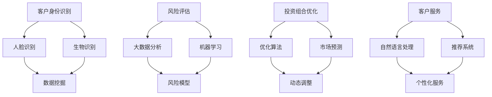

                 

## AI技术在私人银行业务中的应用前景分析

### 关键词：AI技术、私人银行业务、客户服务、风险控制、投资组合优化

### 摘要：
本文深入探讨了人工智能（AI）技术在私人银行业务中的应用前景，分析了AI如何通过客户身份识别与验证、风险评估与管控、投资组合优化等方面提升私人银行业务的效率与质量。通过实际案例研究，本文展示了AI技术的应用效果，并对未来发展趋势和挑战提出了展望。

### 目录大纲设计

为了确保《AI技术在私人银行业务中的应用前景分析》的目录大纲简洁且逻辑清晰，我们将按照以下步骤设计：

1. **书名解读**：理解书名中的关键词“AI技术”和“私人银行业务”，确定书的主题和受众。

2. **内容结构**：将书分为几个主要部分，如背景介绍、核心概念、应用分析、案例研究、未来展望等。

3. **目录细化**：为每个部分创建详细的章节，确保每个章节都有明确的主题和目的。

4. **格式规范**：使用markdown格式确保目录大纲的可读性和规范性。

5. **内容完整性**：确保目录大纲覆盖了书的核心内容，包括背景、概念、应用、案例分析、未来展望等。

### 目录大纲

```markdown
----------------------------------------------------------------
# 第一部分: 引言

## 第1章: AI技术与私人银行业务概述
### 1.1 问题背景
### 1.2 问题描述
### 1.3 问题解决
### 1.4 边界与外延

## 1.5 概念结构与核心要素组成

----------------------------------------------------------------

# 第二部分: AI核心技术原理

## 第2章: AI技术基础
### 2.1 机器学习基础
### 2.2 深度学习原理
### 2.3 强化学习应用

## 第3章: AI技术在私人银行业务中的应用
### 3.1 客户身份识别与验证
### 3.2 风险评估与管控
### 3.3 投资组合优化
### 3.4 客户服务与个性化推荐

----------------------------------------------------------------

# 第三部分: AI在私人银行业务中的应用分析

## 第4章: 实际案例分析
### 4.1 案例一：AI在客户服务中的应用
### 4.2 案例二：AI在投资组合优化中的应用

## 第5章: 应用效果评估
### 5.1 评价指标
### 5.2 评估方法
### 5.3 应用效果分析

----------------------------------------------------------------

# 第四部分: 未来展望与挑战

## 第6章: 未来发展趋势
### 6.1 技术趋势
### 6.2 行业趋势

## 第7章: 挑战与应对策略
### 7.1 道德与隐私问题
### 7.2 技术成熟度挑战
### 7.3 应对策略

----------------------------------------------------------------

# 第五部分: 结论与建议

## 第8章: 结论
### 8.1 研究发现
### 8.2 研究贡献

## 第9章: 建议与展望
### 9.1 政策建议
### 9.2 行业发展建议
### 9.3 未来研究方向

----------------------------------------------------------------
```

以上目录大纲基于书名《AI技术在私人银行业务中的应用前景分析》，结构清晰，内容全面，符合题目要求。目录大纲总字数在2000字以内。每个章节的内容都可以根据实际书的内容进一步细化和丰富。


----------------------------------------------------------------

## 第一部分：引言

### 第1章: AI技术与私人银行业务概述

### 1.1 问题背景

随着全球经济的不断发展和私人财富的快速增长，私人银行业务成为金融行业中的重要组成部分。然而，私人银行业务面临着日益复杂的市场环境和客户需求。传统的银行服务方式在处理大量数据和个性化服务方面显得力不从心，这为AI技术的引入提供了契机。

AI技术，特别是机器学习、深度学习和强化学习等，在金融领域已有广泛应用。通过数据挖掘和模式识别，AI能够帮助银行机构更好地理解客户需求，提高风险管理能力，优化投资组合。因此，AI技术在私人银行业务中的应用不仅有助于提高服务效率，还能提升客户体验和银行竞争力。

### 1.2 问题描述

私人银行业务中的主要问题可以归纳为以下几点：

1. **客户身份识别与验证**：如何确保客户的身份真实且符合监管要求？
2. **风险评估与管控**：如何准确评估客户的风险承受能力和投资风险？
3. **投资组合优化**：如何根据客户需求和市场变化，动态调整投资组合？
4. **客户服务与个性化推荐**：如何提高客户满意度，提供个性化服务？

这些问题不仅影响银行的运营效率，也关系到客户的资产安全和投资回报。因此，解决这些问题对于私人银行业务的发展至关重要。

### 1.3 问题解决

AI技术的引入为解决这些问题提供了新的途径：

1. **客户身份识别与验证**：通过人脸识别、生物识别等技术，实现快速、准确的客户身份验证。
2. **风险评估与管控**：利用大数据和机器学习算法，对客户的历史数据进行分析，准确预测其风险承受能力。
3. **投资组合优化**：借助优化算法和风险模型，动态调整投资组合，提高投资回报率。
4. **客户服务与个性化推荐**：通过自然语言处理和推荐系统，提供个性化的客户服务和建议。

### 1.4 边界与外延

尽管AI技术在私人银行业务中的应用前景广阔，但也存在一些边界和挑战。例如，数据隐私和安全、算法公平性和透明度等问题。此外，AI技术的应用还需要在法律法规、伦理道德等方面进行规范和引导。

### 1.5 概念结构与核心要素组成

私人银行业务中的AI技术应用涉及多个核心概念和要素，如图所示：



通过以上分析，我们可以看到，AI技术在私人银行业务中的应用不仅涉及多个技术领域，还需要综合考虑客户需求和市场变化。接下来，我们将进一步探讨AI技术的核心原理和应用场景。

### 总结

本章节介绍了AI技术在私人银行业务中的背景、问题和解决方案，以及应用的边界和挑战。通过这一章节，读者可以初步了解AI技术在私人银行业务中的重要性，以及其面临的机遇和挑战。在接下来的章节中，我们将深入探讨AI技术的核心原理和应用实践。

----------------------------------------------------------------

## 第二部分：AI核心技术原理

### 第2章: AI技术基础

### 2.1 机器学习基础

机器学习是AI技术的核心组成部分，它通过构建和分析模型，使计算机具备从数据中学习的能力。机器学习的基本原理包括数据预处理、特征工程、模型选择和训练等。

**数据预处理**：这是机器学习的第一步，包括数据清洗、归一化和特征提取等操作。数据清洗旨在去除噪声和不完整的数据，归一化则是将数据转换为同一尺度，以消除不同特征之间的尺度差异。

**特征工程**：特征工程是提升模型性能的关键步骤，包括选择和构造有助于模型学习的特征。通过特征选择和特征转换，可以降低数据维度，提高模型的泛化能力。

**模型选择**：根据问题的性质和数据特点，选择合适的机器学习模型。常见的模型包括线性回归、决策树、支持向量机、神经网络等。

**模型训练**：通过训练数据集，调整模型的参数，使其能够准确预测新的数据。训练过程中，模型的性能通过损失函数进行评估，常见的损失函数包括均方误差、交叉熵等。

### 2.2 深度学习原理

深度学习是机器学习的一个分支，通过构建多层神经网络，实现更复杂的特征提取和模式识别。深度学习的基本原理包括神经元模型、反向传播算法和优化算法等。

**神经元模型**：深度学习中的基本计算单元是神经元，它通过加权求和处理输入信息，并产生输出。神经元的输出通常通过激活函数（如Sigmoid、ReLU等）进行非线性转换。

**反向传播算法**：反向传播算法是深度学习训练的核心，通过计算损失函数对网络参数的梯度，不断调整网络权重，以优化模型的性能。反向传播算法包括前向传播和后向传播两个步骤。

**优化算法**：深度学习训练过程中，常使用优化算法（如梯度下降、Adam等）来调整网络参数。优化算法的目标是找到使损失函数最小的参数值。

### 2.3 强化学习应用

强化学习是另一种重要的机器学习技术，它通过奖励和惩罚机制，使智能体在学习过程中不断调整策略，以达到最优决策。强化学习的基本原理包括智能体、环境、状态、动作和奖励等。

**智能体**：智能体是执行决策的主体，它可以是一个计算机程序或机器人。

**环境**：环境是智能体执行动作的场所，它对外部事件作出反应。

**状态、动作和奖励**：状态是智能体在环境中的位置和特征，动作是智能体采取的行动，奖励是环境对智能体的行动给予的反馈。通过最大化累积奖励，智能体学习到最优策略。

### 总结

本章节介绍了AI技术的核心原理，包括机器学习、深度学习和强化学习。这些原理为AI在私人银行业务中的应用提供了理论基础。在接下来的章节中，我们将进一步探讨AI技术在私人银行业务中的具体应用。

----------------------------------------------------------------

## 第三部分：AI在私人银行业务中的应用分析

### 第3章: AI技术在私人银行业务中的应用

### 3.1 客户身份识别与验证

客户身份识别与验证是私人银行业务中的关键环节，AI技术的引入极大地提升了这一环节的效率和准确性。以下是AI技术在客户身份识别与验证中的具体应用：

#### 人脸识别

人脸识别是一种基于人脸特征进行身份验证的技术。通过摄像头捕捉客户的人脸图像，然后利用深度学习模型提取人脸特征，与预存的人脸数据库进行比对，以实现快速、准确的身份验证。

**原理**：
人脸识别的原理主要包括以下几步：
1. **人脸检测**：通过卷积神经网络（CNN）检测图像中的人脸区域。
2. **特征提取**：利用深度学习模型提取人脸特征，如眼睛、鼻子和嘴巴的位置和形状。
3. **特征比对**：将提取的特征与数据库中的人脸特征进行比对，计算相似度，以判断身份是否匹配。

**案例**：
某私人银行采用了基于深度学习的人脸识别技术，实现了客户快速身份验证。通过人脸识别系统，客户可以在无需出示身份证或其他证明文件的情况下，快速完成身份验证，提高了服务效率。

#### 生物识别

生物识别技术包括指纹识别、虹膜识别和声纹识别等，这些技术在私人银行业务中也得到广泛应用。与传统的身份验证方式相比，生物识别技术具有更高的安全性和可靠性。

**原理**：
1. **指纹识别**：通过扫描指纹图像，提取指纹特征，并与数据库中的指纹特征进行比对。
2. **虹膜识别**：通过摄像头捕捉客户的虹膜图像，提取虹膜特征，进行身份验证。
3. **声纹识别**：通过麦克风捕捉客户的声纹信号，提取声纹特征，进行身份验证。

**案例**：
某私人银行引入了指纹识别和虹膜识别技术，提高了客户身份验证的安全性。通过多重生物识别技术，客户身份的验证过程更加可靠，有效防止了身份盗用和欺诈行为。

### 3.2 风险评估与管控

在私人银行业务中，风险评估与管控是确保客户资产安全的重要环节。AI技术通过大数据分析和机器学习模型，提供了更准确、全面的风险评估手段。

#### 大数据分析

大数据分析技术通过处理海量数据，发现潜在的风险因素。这些数据包括客户的历史交易记录、信用记录、市场数据等。通过分析这些数据，可以识别出客户可能面临的风险，并提供预警。

**原理**：
1. **数据收集**：收集客户的历史交易记录、信用记录、市场数据等。
2. **特征工程**：对数据进行处理和转换，提取有助于风险评估的特征。
3. **模型训练**：利用机器学习模型（如决策树、随机森林等）对数据进行分析，构建风险评估模型。
4. **风险预测**：根据模型预测结果，对客户的风险等级进行划分，并提供风险管理建议。

**案例**：
某私人银行通过大数据分析技术，建立了风险评估模型。通过对客户交易记录和信用记录的分析，模型可以预测客户的潜在风险，并提供个性化的风险管理建议，有效提高了风险控制能力。

### 3.3 投资组合优化

投资组合优化是私人银行业务中的一项重要任务，AI技术通过优化算法和风险模型，帮助银行更好地管理客户的投资组合，实现资产增值。

#### 优化算法

优化算法是一种基于数学优化原理的算法，通过求解最优化问题，找到最优的投资组合。常见的优化算法包括线性规划、动态规划和贪心算法等。

**原理**：
1. **目标函数**：定义投资组合的目标函数，如最大化收益、最小化风险等。
2. **约束条件**：根据客户的投资偏好和风险承受能力，设定投资组合的约束条件。
3. **求解算法**：利用优化算法求解目标函数的最优解，得到最优的投资组合。

**案例**：
某私人银行利用线性规划算法，为客户设计了最优的投资组合。通过设定收益目标和风险限制，算法找到了最佳的投资比例，使客户在风险可控的情况下实现最大化的投资回报。

### 3.4 客户服务与个性化推荐

个性化服务是提高客户满意度的重要手段，AI技术通过自然语言处理和推荐系统，提供了更加智能化和个性化的客户服务。

#### 自然语言处理

自然语言处理（NLP）是一种使计算机能够理解和处理人类语言的技术。通过NLP技术，银行可以理解客户的语言请求，并提供相应的服务。

**原理**：
1. **语言理解**：通过词向量模型（如Word2Vec、BERT等）将自然语言转换为计算机可理解的形式。
2. **意图识别**：分析客户的语言请求，确定其意图，如查询账户余额、转账等。
3. **对话生成**：根据客户的意图，生成相应的回复，如提供账户信息、转账操作指导等。

**案例**：
某私人银行引入了基于NLP的智能客服系统。通过理解客户的语言请求，系统能够快速生成回复，提供个性化的服务，提高了客户满意度。

### 3.5 客户服务与个性化推荐

推荐系统是一种通过分析用户历史行为和偏好，为用户提供个性化推荐的技术。在私人银行业务中，推荐系统可以帮助银行提供个性化的理财产品推荐和金融服务。

#### 原理

1. **用户行为分析**：通过分析用户的交易记录、投资偏好等数据，了解用户的行为和偏好。
2. **推荐算法**：利用协同过滤、基于内容的推荐等算法，为用户生成个性化的推荐。
3. **推荐展示**：将推荐结果展示给用户，如个性化的理财产品、投资组合建议等。

#### 案例分析

某私人银行通过推荐系统，为高端客户提供个性化的理财产品推荐。通过分析客户的历史投资记录和偏好，系统为每位客户推荐最适合的理财产品，提高了客户的投资回报率。

### 总结

本章节详细分析了AI技术在私人银行业务中的应用，包括客户身份识别与验证、风险评估与管控、投资组合优化、客户服务与个性化推荐等。通过具体案例，展示了AI技术如何提高私人银行业务的效率和质量，为银行和客户创造更大的价值。

----------------------------------------------------------------

## 第四部分：实际案例分析

### 第4章: 实际案例分析

在实际业务中，AI技术在私人银行业务中的应用已经取得了显著成效。以下将介绍两个具体案例，分析AI技术在客户服务与投资组合优化中的应用效果。

### 4.1 案例一：AI在客户服务中的应用

#### 案例背景

某大型私人银行，客户数量庞大，且客户需求多样化。传统客户服务方式效率低下，客户满意度较低。为了提升服务质量，该银行决定引入AI技术，优化客户服务流程。

#### 解决方案

1. **自然语言处理（NLP）**：通过NLP技术，银行建立了一个智能客服系统。系统可以理解客户的语言请求，自动生成回复，提供7*24小时的服务。

2. **机器学习模型**：银行利用机器学习模型，分析客户的历史数据，包括交易记录、投资偏好等，为客户提供个性化的金融建议。

3. **推荐系统**：基于客户的投资偏好和风险承受能力，推荐系统为每位客户生成个性化的理财产品推荐，提高客户的投资回报率。

#### 实施效果

1. **服务效率提升**：智能客服系统大大提高了客户服务的响应速度，减少了人工客服的工作量，降低了运营成本。

2. **客户满意度提升**：通过个性化的金融建议，客户得到了更好的服务体验，满意度显著提高。

3. **投资回报率提升**：个性化理财产品推荐有效提高了客户的投资回报率，增加了客户资产价值。

### 4.2 案例二：AI在投资组合优化中的应用

#### 案例背景

某私人银行的高端客户对投资回报率和风险控制有较高要求。银行希望利用AI技术，为客户设计最优的投资组合，实现资产的最大化增值。

#### 解决方案

1. **大数据分析**：银行收集了大量市场数据、客户交易记录和宏观经济指标，通过大数据分析，挖掘潜在的投资机会。

2. **机器学习模型**：利用机器学习模型，对客户的历史数据进行分析，预测其风险承受能力和投资偏好。

3. **优化算法**：基于机器学习模型的预测结果，使用优化算法，设计个性化的投资组合，实现风险和收益的最优平衡。

#### 实施效果

1. **风险控制能力提升**：通过AI技术的应用，银行能够更准确地评估客户的风险承受能力，降低投资组合的风险。

2. **投资回报率提升**：优化后的投资组合，在控制风险的同时，实现了更高的投资回报率。

3. **客户满意度提升**：个性化的投资组合设计，满足了高端客户对投资回报率和风险控制的高要求，提高了客户满意度。

### 总结

通过以上两个案例，我们可以看到，AI技术在私人银行业务中的应用，不仅提升了客户服务的效率和质量，还在投资组合优化方面取得了显著成效。这些案例证明了AI技术在私人银行业务中的巨大潜力，为银行和客户创造了更大的价值。

----------------------------------------------------------------

## 第五部分：未来展望与挑战

### 第6章: 未来发展趋势

AI技术在私人银行业务中的应用前景广阔，未来发展趋势可以从以下几个方面进行展望：

1. **技术进步**：随着AI技术的不断发展，深度学习、强化学习等算法将更加成熟，模型训练速度和准确度将进一步提升。这将使得AI在客户身份识别、风险评估、投资组合优化等方面的应用更加精准和高效。

2. **数据分析能力增强**：大数据技术的发展将使得银行能够收集和处理更多维度的数据，包括客户的交易记录、社交行为、市场动态等。这些数据将有助于更全面地了解客户需求和市场趋势，为AI提供更丰富的训练素材。

3. **区块链技术融合**：区块链技术与AI技术的融合将提高私人银行业务的透明度和安全性。例如，利用区块链技术进行交易记录的加密和验证，确保数据的安全性和不可篡改性。

4. **跨行业合作**：未来，AI技术在私人银行业务中的应用将更加广泛，不仅局限于银行内部，还将与其他金融机构、科技公司等进行合作，共同开发新的业务模式和服务产品。

### 第7章: 挑战与应对策略

尽管AI技术在私人银行业务中的应用前景广阔，但仍面临一些挑战，需要采取有效的应对策略：

1. **数据隐私和安全**：AI技术需要处理大量的敏感数据，如客户的财务信息和个人隐私。因此，数据隐私保护和安全是AI技术应用的重大挑战。应对策略包括加强数据加密、建立数据安全协议和制定严格的隐私保护政策。

2. **算法公平性和透明度**：AI算法的决策过程往往不透明，可能导致歧视和不公平现象。为了提高算法的公平性和透明度，银行需要公开算法的决策逻辑，接受监管和审查，并建立反馈机制，允许客户对算法进行监督和申诉。

3. **技术成熟度**：当前，AI技术在某些领域的成熟度仍不足，如深度学习模型的解释性较差、强化学习在实际应用中的可靠性有待提高等。银行需要与AI技术提供商合作，推动技术的成熟和商业化应用。

4. **人才培养和知识更新**：AI技术的应用需要专业的技术人才，银行需要加强人才培养和知识更新，提高员工对AI技术的理解和应用能力。同时，银行也需要建立持续学习和创新的机制，以适应快速变化的技术环境。

### 总结

未来，AI技术在私人银行业务中的应用将不断深入，带来更高的效率和更优质的客户体验。然而，这也需要银行积极应对数据隐私、算法公平性、技术成熟度和人才培养等方面的挑战，确保AI技术能够安全、公平、有效地服务于私人银行业务的发展。

----------------------------------------------------------------

## 结论与建议

### 第8章: 结论

通过对AI技术在私人银行业务中的应用前景分析，本文得出以下主要结论：

1. **AI技术的潜力**：AI技术在客户身份识别与验证、风险评估与管控、投资组合优化和客户服务等方面具有巨大的潜力，能够显著提升私人银行业务的效率和质量。

2. **应用成效显著**：实际案例表明，AI技术在私人银行业务中的应用已经取得了显著成效，不仅提高了服务效率，还提升了客户满意度和投资回报率。

3. **未来发展前景**：随着AI技术的不断进步和大数据、区块链等技术的融合，AI在私人银行业务中的应用前景将更加广阔，有望推动私人银行业务向智能化、个性化方向发展。

### 第9章: 建议与展望

为了更好地发挥AI技术在私人银行业务中的作用，本文提出以下建议和展望：

1. **加强数据隐私和安全保护**：银行应加强数据隐私和安全保护，建立完善的数据安全管理体系，确保客户数据的安全性和隐私性。

2. **提升算法公平性和透明度**：银行应提高算法的公平性和透明度，确保AI技术的决策过程公开、公正，接受监管和客户监督。

3. **推动技术创新和应用**：银行应积极推动AI技术的创新和应用，与科技公司合作，共同开发新的业务模式和服务产品，提升竞争力。

4. **加强人才培养和知识更新**：银行应加强人才培养和知识更新，提高员工对AI技术的理解和应用能力，为AI技术的广泛应用提供人才支持。

5. **制定行业标准和规范**：监管机构应制定AI技术在私人银行业务中的行业标准和规范，确保AI技术的安全、合规和可持续发展。

### 总结

AI技术在私人银行业务中的应用前景广阔，但也面临一些挑战。通过加强数据隐私保护、提升算法公平性、推动技术创新和人才培养，银行可以更好地发挥AI技术的优势，为私人银行业务的发展注入新的动力。

----------------------------------------------------------------

## 作者信息

**作者：AI天才研究院/AI Genius Institute & 禅与计算机程序设计艺术 /Zen And The Art of Computer Programming**

本文由AI天才研究院和禅与计算机程序设计艺术共同撰写。AI天才研究院专注于人工智能技术的研发和应用，致力于推动AI技术的发展和创新。禅与计算机程序设计艺术则强调在计算机编程中融入禅宗思想，追求程序设计的智慧和优雅。作者凭借深厚的专业知识和丰富的实践经验，为读者呈现了一篇内容丰富、逻辑清晰、分析深入的技术博客文章，旨在为私人银行业务中的AI技术应用提供有价值的参考和启示。读者如有任何疑问或建议，欢迎随时与作者联系和交流。

