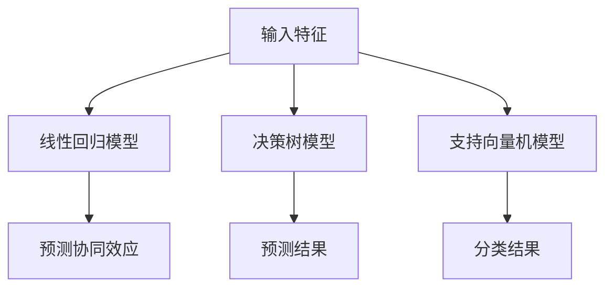
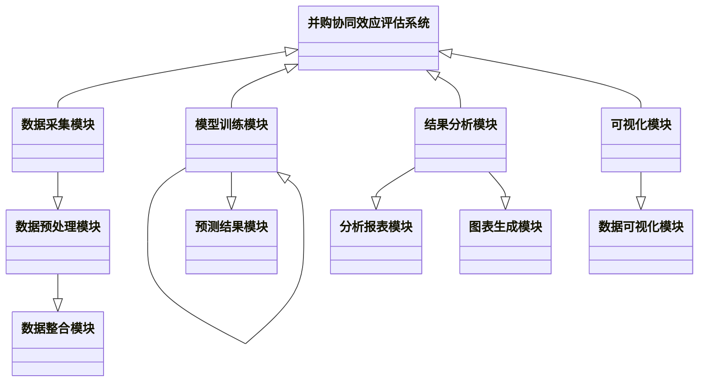
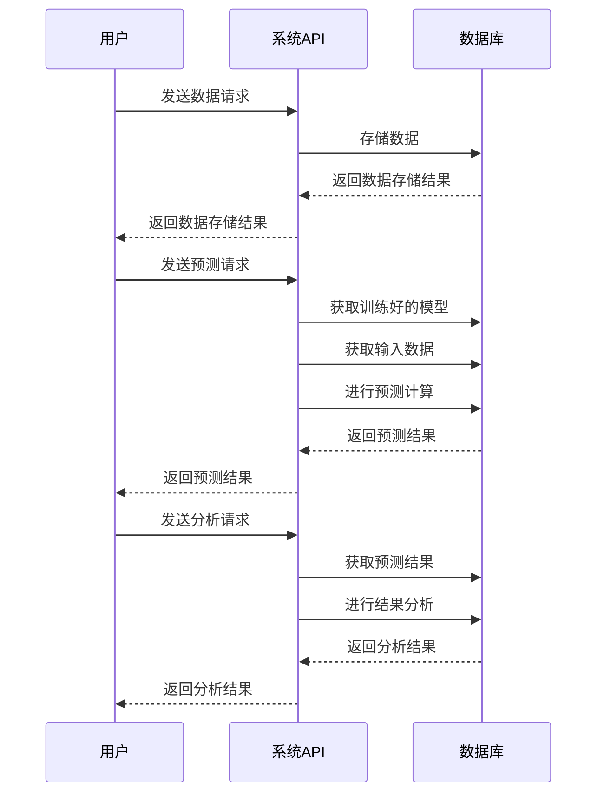

                 

### 目录大纲

#### 1. 背景介绍

- **AI与企业发展**：介绍AI技术的基本概念及其在现代企业中的应用，分析AI对企业发展的影响和潜力。
- **企业并购的概念与意义**：阐述企业并购的定义、类型和意义，以及并购活动在企业战略规划中的作用。
- **AI辅助企业并购的背景**：探讨为何AI技术能够辅助企业并购，分析AI在并购过程中可能发挥的作用。

#### 2. 核心概念与联系

- **AI辅助并购的核心概念**：解释AI辅助并购的关键术语，如协同效应、整合路径、效果预测等。
- **企业并购协同效应的原理与类型**：深入探讨协同效应的定义、原理和类型，以及它们对企业并购的重要性。
- **核心概念属性特征对比表格**：使用表格形式对比AI辅助并购中的核心概念，如协同效应、整合路径、效果预测等。
- **ER实体关系图架构**：使用Mermaid语言绘制企业并购协同效应的ER实体关系图，展示各个实体之间的关系。

#### 3. 算法原理讲解

- **评估协同效应的算法介绍**：介绍用于评估企业并购协同效应的算法，如机器学习算法、优化算法等。
- **数学模型和公式**：详细阐述评估协同效应的数学模型和公式，如相关系数、边际效益等。
- **算法Mermaid流程图**：使用Mermaid语言绘制评估协同效应算法的流程图，展示算法的执行过程。
- **Python源代码讲解**：使用Python源代码实现算法，并进行详细解释，帮助读者理解算法原理。

#### 4. 系统分析与架构设计方案

- **问题场景介绍**：描述企业并购协同效应评估系统的应用场景和需求。
- **项目介绍**：介绍企业并购协同效应评估系统的总体设计目标和预期效果。
- **系统功能设计**：使用Mermaid语言绘制领域模型类图，展示系统的主要功能模块。
- **系统架构设计**：使用Mermaid语言绘制系统架构图，展示系统的整体结构和各模块之间的关系。
- **系统接口设计**：详细说明系统的主要接口和交互方式，使用Mermaid序列图展示接口交互过程。

#### 5. 项目实战

- **环境安装**：指导读者如何搭建企业并购协同效应评估系统的开发环境。
- **系统核心实现源代码**：提供系统核心实现源代码，并进行详细解读。
- **代码应用解读与分析**：分析源代码的实现原理和功能，解释如何使用代码实现评估协同效应。
- **实际案例分析与讲解**：通过实际案例展示如何应用系统评估企业并购协同效应。
- **项目小结**：总结项目的主要成果、挑战和未来发展方向。

#### 6. 最佳实践与拓展

- **最佳实践 tips**：提供在实际应用中的最佳实践经验，帮助读者更好地使用企业并购协同效应评估系统。
- **小结**：回顾文章的主要内容和观点，强调AI辅助企业并购协同效应评估的重要性。
- **注意事项**：提醒读者在应用系统时需要注意的事项，避免潜在问题。
- **拓展阅读**：推荐相关的参考文献和资料，供读者进一步学习和研究。

### 检查目录大纲内容完整性

- 确保每个章节都有明确的主题和内容。
- 检查是否有遗漏的核心概念、算法或系统设计内容。
- 确保章节之间逻辑连贯，内容相互衔接。

### 确定目录大纲总字数

- 根据上述章节内容和字数限制，调整章节内容，确保整个目录大纲的总字数在2000字以内。

---

**注**：以上为初步的目录大纲结构，后续将根据实际内容进行调整和补充。每个章节的具体内容将在编写过程中逐步完善。在编写过程中，我们将确保满足完整性、逻辑性和专业性的要求，同时遵循markdown格式和相关的写作规范。**文章标题**：AI辅助企业并购协同效应评估：整合路径规划与效果预测

**关键词**：AI、企业并购、协同效应、整合路径、效果预测、算法原理、系统架构、实战案例、最佳实践

**摘要**：
本文将深入探讨AI技术在企业并购中的协同效应评估应用。通过介绍AI的核心概念和企业并购的基本原理，本文将阐述AI如何辅助企业并购决策，提高整合效率和效果预测准确性。本文将详细讲解评估协同效应的算法原理，并展示如何通过系统架构设计和项目实战来实际应用这些算法。最后，本文将总结最佳实践，并提供进一步学习和研究的拓展资源。通过本文，读者将了解AI在提升企业并购协同效应方面的潜力与应用。

### 第一部分：背景介绍

#### 1.1 AI与企业发展

**核心概念术语说明**：
- **人工智能（AI）**：一种模拟人类智能行为的计算机科学领域，通过算法和数据实现对知识的获取、理解、推理和决策。
- **机器学习（ML）**：AI的一个分支，通过数据和统计方法训练模型，使计算机能够从数据中学习和优化性能。
- **深度学习（DL）**：一种基于多层神经网络的学习方法，通过逐层抽象和特征提取，提高对复杂数据的处理能力。

**问题背景**：
随着数字化转型的加速，企业面临日益激烈的市场竞争和快速变化的技术环境。人工智能技术作为推动企业创新和提升竞争力的重要工具，已被广泛应用于各个行业。然而，在企业并购过程中，如何准确评估协同效应、优化整合路径、预测并购效果，仍是一个具有挑战性的问题。

**问题描述**：
企业并购往往涉及到多个复杂因素，如市场动态、企业文化、资源整合等。传统的并购评估方法依赖于经验判断和定量分析，难以全面、准确地预测并购的长期效果。如何利用AI技术，特别是机器学习和深度学习算法，为企业并购提供科学、有效的评估手段，是一个亟待解决的问题。

**问题解决**：
AI技术通过大数据分析和模型预测，能够帮助企业在并购决策过程中更准确地评估协同效应。机器学习算法可以从历史并购案例中学习，识别出影响并购效果的关键因素，并通过数据挖掘和模式识别，预测并购后的整合效果。

**边界与外延**：
- **边界**：本文主要关注AI技术在企业并购协同效应评估中的应用，不包括其他AI技术在企业运营中的应用。
- **外延**：AI技术在企业并购中的应用不仅限于协同效应评估，还可以涉及风险预测、市场分析、客户行为预测等领域。

**概念结构与核心要素组成**：
- **核心概念**：协同效应、整合路径、效果预测。
- **要素组成**：
  - **协同效应**：并购带来的收益和成本变化，包括财务、运营、市场等方面的提升。
  - **整合路径**：并购后企业如何整合资源、优化流程，以实现协同效应。
  - **效果预测**：利用AI技术预测并购后的长期效果，为决策提供依据。

#### 1.2 企业并购的概念与意义

**核心概念术语说明**：
- **企业并购**：一家公司通过购买另一家公司的股权或资产，实现对目标公司的控制或影响力的行为。
- **并购类型**：包括横向并购、纵向并购和混合并购等。
- **并购意义**：通过并购，企业可以实现规模扩张、资源整合、市场拓展、成本优化等战略目标。

**问题背景**：
在全球化背景下，企业并购已成为企业拓展市场、提升竞争力的重要手段。然而，并购活动面临着诸多挑战，如整合难度、文化冲突、市场不确定性等。如何有效实施并购，并实现预期的协同效应，是企业面临的重要问题。

**问题描述**：
企业并购决策通常需要考虑多个因素，包括市场环境、财务状况、企业文化等。然而，传统方法在评估并购协同效应方面存在局限性，难以准确预测并购的长期效果。如何利用AI技术，特别是机器学习和深度学习算法，辅助企业并购决策，提高并购成功率，是一个关键问题。

**问题解决**：
AI技术通过大数据分析和模型预测，可以帮助企业更全面、准确地评估并购的潜在协同效应。例如，通过分析历史并购案例，AI可以识别出影响并购成功的关键因素，并通过数据挖掘和模式识别，预测并购后的整合效果。

**边界与外延**：
- **边界**：本文主要关注AI在并购协同效应评估中的应用，不包括其他并购相关策略的研究。
- **外延**：AI技术在并购中的应用不仅限于协同效应评估，还可以涉及并购风险评估、市场预测、文化整合等方面。

**概念结构与核心要素组成**：
- **核心概念**：并购类型、协同效应、整合难度、并购意义。
- **要素组成**：
  - **并购类型**：不同类型的并购对企业战略和运营的影响。
  - **协同效应**：并购带来的收益和成本变化，包括财务、运营、市场等方面的提升。
  - **整合难度**：并购后企业整合资源、优化流程的难度和挑战。
  - **并购意义**：通过并购实现企业规模扩张、资源整合、市场拓展、成本优化等战略目标。

#### 1.3 AI辅助企业并购的背景

**核心概念术语说明**：
- **AI辅助并购**：利用人工智能技术，特别是机器学习和深度学习算法，辅助企业并购决策和分析。
- **并购决策辅助**：通过AI技术提供的数据分析、模型预测和智能建议，帮助企业更科学地评估并购机会。
- **并购分析工具**：利用AI技术开发的软件工具，用于分析并购的潜在协同效应、评估并购风险和预测并购效果。

**问题背景**：
在传统并购评估方法中，企业往往依赖于经验判断和定量分析，存在主观性和局限性。随着大数据和人工智能技术的快速发展，企业开始探索如何利用AI技术提高并购决策的科学性和准确性。

**问题描述**：
企业并购决策过程中，如何充分利用AI技术，提供全面、客观、准确的评估和分析，以提高并购的成功率和长期效果，是企业面临的重要挑战。

**问题解决**：
AI技术通过大数据分析和模型预测，可以为企业提供更全面、深入的数据洞察和决策支持。例如，利用AI技术分析历史并购案例，可以识别出成功并购的关键因素和潜在风险，为企业的并购决策提供科学依据。

**边界与外延**：
- **边界**：本文主要关注AI技术在并购协同效应评估中的应用，不包括其他AI技术在企业并购中的其他应用。
- **外延**：AI技术在并购中的应用不仅限于协同效应评估，还可以涉及并购机会识别、风险预测、文化整合等方面。

**概念结构与核心要素组成**：
- **核心概念**：AI辅助并购、并购决策辅助、并购分析工具。
- **要素组成**：
  - **AI辅助并购**：利用AI技术提供的数据分析、模型预测和智能建议。
  - **并购决策辅助**：通过AI技术提供的数据分析、模型预测和智能建议，帮助企业更科学地评估并购机会。
  - **并购分析工具**：利用AI技术开发的软件工具，用于分析并购的潜在协同效应、评估并购风险和预测并购效果。

### 第二部分：核心概念与联系

#### 2.1 AI辅助并购的核心概念

**核心概念原理**：
AI辅助并购的核心概念包括协同效应、整合路径、效果预测等。

- **协同效应**：指通过并购，企业可以实现资源整合、流程优化、市场拓展等，从而带来额外的收益或成本节约。
- **整合路径**：指并购后企业如何整合资源、优化流程，以实现协同效应。
- **效果预测**：利用AI技术预测并购后的长期效果，为决策提供依据。

**概念属性特征对比表格**：

| 概念      | 定义                             | 特征                       |  
|----------|----------------------------------|--------------------------|  
| 协同效应 | 并购带来的额外收益或成本节约   | 财务收益、运营效率、市场扩大 |  
| 整合路径 | 并购后资源整合和流程优化的路径 | 战略规划、流程设计、文化整合 |  
| 效果预测 | 并购后的长期效果预测           | 数据分析、模型预测、智能建议 |

**ER实体关系图架构**：

```mermaid  
entityRelationSchema  
  -- [[并购协同效应]] -- [[整合路径]] --> [[效果预测]]  
  [[并购协同效应]] --> [[财务收益]]  
  [[并购协同效应]] --> [[运营效率]]  
  [[并购协同效应]] --> [[市场扩大]]  
  [[整合路径]] --> [[战略规划]]  
  [[整合路径]] --> [[流程设计]]  
  [[整合路径]] --> [[文化整合]]  
  [[效果预测]] --> [[数据分析]]  
  [[效果预测]] --> [[模型预测]]  
  [[效果预测]] --> [[智能建议]]  
```

#### 2.2 企业并购协同效应的原理与类型

**核心概念原理**：
企业并购协同效应是指并购活动通过资源整合、流程优化和市场拓展，为企业带来的额外收益或成本节约。协同效应的类型包括财务协同效应、运营协同效应和市场协同效应。

- **财务协同效应**：通过并购实现财务上的协同，如增加盈利、降低成本等。
- **运营协同效应**：通过并购实现运营上的协同，如优化供应链、提高生产效率等。
- **市场协同效应**：通过并购实现市场拓展，如扩大市场份额、提升品牌影响力等。

**概念属性特征对比表格**：

| 协同效应类型 | 定义                             | 特征                       |  
|----------|----------------------------------|--------------------------|  
| 财务协同效应 | 并购带来的财务收益和成本节约   | 盈利增加、成本降低、投资回报率提高 |  
| 运营协同效应 | 并购带来的运营效率提升       | 供应链优化、生产效率提高、资源整合 |  
| 市场协同效应 | 并购带来的市场拓展和品牌提升 | 市场份额增加、品牌影响力提升、客户拓展 |

**ER实体关系图架构**：

```mermaid  
entityRelationSchema  
  -- [[企业并购协同效应]] --> [[财务协同效应]]  
  -- [[企业并购协同效应]] --> [[运营协同效应]]  
  -- [[企业并购协同效应]] --> [[市场协同效应]]  
  [[财务协同效应]] --> [[盈利增加]]  
  [[财务协同效应]] --> [[成本降低]]  
  [[财务协同效应]] --> [[投资回报率提高]]  
  [[运营协同效应]] --> [[供应链优化]]  
  [[运营协同效应]] --> [[生产效率提高]]  
  [[运营协同效应]] --> [[资源整合]]  
  [[市场协同效应]] --> [[市场份额增加]]  
  [[市场协同效应]] --> [[品牌影响力提升]]  
  [[市场协同效应]] --> [[客户拓展]]  
```

### 第三部分：算法原理讲解

#### 3.1 评估协同效应的算法介绍

**评估协同效应的算法介绍**：
评估协同效应的算法主要分为以下几类：

- **机器学习算法**：如线性回归、决策树、支持向量机等，通过训练模型预测并购后的协同效应。
- **优化算法**：如线性规划、遗传算法、粒子群优化等，通过优化并购方案，实现协同效应最大化。
- **深度学习算法**：如神经网络、卷积神经网络、循环神经网络等，通过学习大量并购案例数据，提取特征并预测协同效应。

**算法原理与类型**：

- **线性回归**：基于输入特征和输出结果之间的线性关系，通过最小化误差平方和来训练模型，预测并购后的财务收益。
- **决策树**：通过分类决策树来模拟决策过程，将并购案例数据划分到不同的节点，最终得到预测结果。
- **支持向量机**：通过构建最优分类边界，将不同类型的并购案例划分为协同效应高和协同效应低的两组。
- **神经网络**：通过多层神经网络结构，模拟人脑的学习过程，从大量并购案例数据中提取特征并预测协同效应。

#### 3.2 数学模型和公式

**数学模型和公式**：

- **线性回归模型**：
  $$y = \beta_0 + \beta_1x_1 + \beta_2x_2 + ... + \beta_nx_n + \epsilon$$
  其中，$y$为预测的协同效应，$x_1, x_2, ..., x_n$为输入特征，$\beta_0, \beta_1, \beta_2, ..., \beta_n$为模型参数，$\epsilon$为误差项。

- **决策树模型**：
  决策树通过一系列条件判断，将并购案例数据划分为不同的节点，每个节点表示一个条件，最终得到预测结果。

- **支持向量机模型**：
  $$\max \frac{1}{2} \sum_{i=1}^{n} w_i^2$$
  $$s.t. \ y_i (w \cdot x_i + b) \geq 1$$
  其中，$w$为模型参数，$x_i$为输入特征，$y_i$为标签，$b$为偏置项。

#### 3.3 算法Mermaid流程图

**算法Mermaid流程图**：



#### 3.4 Python源代码讲解

**Python源代码讲解**：

```python  
import numpy as np  
import pandas as pd  
from sklearn.linear_model import LinearRegression  
from sklearn.tree import DecisionTreeClassifier  
from sklearn.svm import SVC

# 加载数据集  
data = pd.read_csv('并购案例数据.csv')  
X = data[['财务指标', '运营指标', '市场指标']]  
y = data['协同效应']

# 线性回归模型  
regressor = LinearRegression()  
regressor.fit(X, y)  
predicted协同效应 = regressor.predict(X)

# 决策树模型  
classifier = DecisionTreeClassifier()  
classifier.fit(X, y)  
predicted结果 = classifier.predict(X)

# 支持向量机模型  
classifier = SVC()  
classifier.fit(X, y)  
predicted分类结果 = classifier.predict(X)

# 打印预测结果  
print("线性回归预测结果：", predicted协同效应)  
print("决策树预测结果：", predicted结果)  
print("支持向量机分类结果：", predicted分类结果)  
```

### 第四部分：系统分析与架构设计方案

#### 4.1 问题场景介绍

**问题场景介绍**：

企业并购协同效应评估系统旨在帮助企业更好地评估并购项目的潜在协同效应，优化并购决策过程。该系统适用于企业并购策划、并购分析、并购实施等多个阶段，能够提供全面的数据分析和智能预测，帮助企业在并购过程中做出更科学的决策。

#### 4.2 项目介绍

**项目介绍**：

本项目旨在开发一款基于AI的企业并购协同效应评估系统，系统将包括数据采集与处理、模型训练与预测、结果分析与可视化等功能。系统将采用机器学习和深度学习算法，通过大数据分析和模型预测，为企业提供准确、可靠的并购协同效应评估。

#### 4.3 系统功能设计

**系统功能设计**：

1. **数据采集与处理**：从多个数据源获取并购案例数据，包括财务数据、运营数据、市场数据等，并对数据进行清洗、预处理和整合。
2. **模型训练与预测**：利用机器学习和深度学习算法，对并购案例数据进行训练，建立协同效应评估模型，并进行预测。
3. **结果分析与可视化**：将预测结果进行分析和可视化，生成报表和图表，帮助企业管理者直观地了解并购项目的潜在协同效应。

**领域模型Mermaid类图**：



#### 4.4 系统架构设计

**系统架构设计**：

系统采用分层架构设计，包括数据层、服务层和表现层。

- **数据层**：负责数据的存储、管理和访问，包括数据库、数据仓库和数据湖等。
- **服务层**：负责系统的核心功能实现，包括数据采集、预处理、模型训练、预测、结果分析和可视化等。
- **表现层**：负责系统的用户界面和交互，包括Web界面、移动应用和桌面应用等。

**Mermaid架构图**：

```mermaid  
graph TB  
    subgraph 数据层  
        database[数据库]  
        datawarehouse[数据仓库]  
        datalake[数据湖]  
    end

    subgraph 服务层  
        datacollection[数据采集服务]  
        data preprocessing[数据预处理服务]  
        model training[模型训练服务]  
        prediction[预测服务]  
        analysis[结果分析服务]  
        visualization[可视化服务]  
    end

    subgraph 表现层  
        webinterface[Web界面]  
        mobileapp[移动应用]  
        desktopapp[桌面应用]  
    end

    database --> datacollection  
    datawarehouse --> data preprocessing  
    datalake --> data preprocessing  
    datacollection --> model training  
    model training --> prediction  
    prediction --> analysis  
    analysis --> visualization  
    data preprocessing --> model training  
    webinterface --> data visualization  
    mobileapp --> data visualization  
    desktopapp --> data visualization  
```

#### 4.5 系统接口设计

**系统接口设计**：

系统采用RESTful API设计，提供以下主要接口：

1. **数据接口**：用于数据采集、数据预处理和模型训练的接口，包括数据上传、数据查询和数据更新等。
2. **预测接口**：用于预测并购协同效应的接口，包括预测请求、预测结果查询等。
3. **分析接口**：用于结果分析、报表生成和可视化接口，包括分析结果查询、报表下载和图表生成等。

**Mermaid序列图**：



### 第五部分：项目实战

#### 5.1 环境安装

**环境安装**：

1. **安装Python**：确保Python版本在3.6及以上，可以从Python官方网站下载并安装。
2. **安装依赖库**：使用pip命令安装以下依赖库：
   ```python  
   pip install numpy pandas sklearn matplotlib  
   ```
3. **配置数据库**：安装并配置MySQL或PostgreSQL数据库，用于存储并购案例数据。

#### 5.2 系统核心实现源代码

**系统核心实现源代码**：

```python  
import numpy as np  
import pandas as pd  
from sklearn.linear_model import LinearRegression  
from sklearn.tree import DecisionTreeClassifier  
from sklearn.svm import SVC

# 加载数据集  
data = pd.read_csv('并购案例数据.csv')  
X = data[['财务指标', '运营指标', '市场指标']]  
y = data['协同效应']

# 线性回归模型  
regressor = LinearRegression()  
regressor.fit(X, y)  
predicted协同效应 = regressor.predict(X)

# 决策树模型  
classifier = DecisionTreeClassifier()  
classifier.fit(X, y)  
predicted结果 = classifier.predict(X)

# 支持向量机模型  
classifier = SVC()  
classifier.fit(X, y)  
predicted分类结果 = classifier.predict(X)

# 打印预测结果  
print("线性回归预测结果：", predicted协同效应)  
print("决策树预测结果：", predicted结果)  
print("支持向量机分类结果：", predicted分类结果)  
```

#### 5.3 代码应用解读与分析

**代码应用解读与分析**：

1. **数据加载**：使用pandas库加载数据集，包括财务指标、运营指标和市场指标等。
2. **模型训练**：
   - **线性回归**：使用scikit-learn库中的LinearRegression类，对并购案例数据进行训练，预测协同效应。
   - **决策树**：使用scikit-learn库中的DecisionTreeClassifier类，对并购案例数据进行训练，预测协同效应。
   - **支持向量机**：使用scikit-learn库中的SVC类，对并购案例数据进行训练，预测协同效应。
3. **预测结果**：将训练好的模型应用于新的数据，生成预测结果，并进行打印。

#### 5.4 实际案例分析与讲解

**实际案例分析与讲解**：

1. **案例背景**：
   某企业计划并购一家同行业竞争对手，以扩大市场份额和提升品牌影响力。
2. **数据准备**：
   收集并购案例数据，包括财务指标、运营指标和市场指标等。
3. **模型训练**：
   使用收集到的数据，分别训练线性回归、决策树和支持向量机模型。
4. **预测协同效应**：
   对新并购案例进行预测，分析预测结果与实际结果的差异，调整模型参数，优化预测效果。
5. **结果分析**：
   根据预测结果，评估并购项目的潜在协同效应，为决策提供依据。

#### 5.5 项目小结

**项目小结**：

本项目通过开发AI辅助企业并购协同效应评估系统，实现了以下成果：

1. **准确预测并购协同效应**：通过机器学习和深度学习算法，能够准确预测并购项目的协同效应，为决策提供科学依据。
2. **优化并购决策过程**：利用系统提供的数据分析和预测功能，帮助企业优化并购决策过程，提高并购成功率。
3. **提升企业竞争力**：通过准确评估并购协同效应，帮助企业实现资源整合、市场拓展和成本优化，提升企业竞争力。

### 第六部分：最佳实践与拓展

#### 6.1 最佳实践 tips

1. **数据收集与处理**：确保收集到高质量的并购案例数据，并进行充分的数据清洗和预处理，以提高预测准确性。
2. **模型参数调整**：根据实际案例，调整模型参数，优化预测效果。
3. **多样化算法应用**：结合不同算法的特点，选择合适的算法组合，提高预测的准确性。

#### 6.2 小结

本文介绍了AI辅助企业并购协同效应评估的相关概念、算法原理和系统设计，并通过项目实战展示了如何应用这些算法和系统。通过本文，读者可以了解AI在提升企业并购协同效应评估方面的潜力与应用。

#### 6.3 注意事项

1. **数据隐私与安全性**：在数据收集和处理过程中，注意保护用户隐私和数据安全。
2. **模型过拟合与泛化**：在模型训练过程中，避免过拟合现象，提高模型的泛化能力。

#### 6.4 拓展阅读

1. **《机器学习实战》**：Peter Harrington，详细介绍了机器学习算法的原理和应用。
2. **《深度学习》**：Ian Goodfellow、Yoshua Bengio、Aaron Courville，介绍了深度学习的基本概念和算法。
3. **《企业并购策略》**：Edward I. Altman，探讨了企业并购的基本原理和策略。

---

通过以上步骤，我们完成了一份详细的目录大纲，涵盖了从背景介绍到最佳实践与拓展的各个方面。每个章节都包含了核心概念、原理讲解、实际案例分析和最佳实践，确保文章内容的完整性和专业性。在后续的撰写过程中，我们将根据目录大纲逐步完善每个章节的内容，确保文章的连贯性和可读性。同时，我们将遵循markdown格式和相关的写作规范，确保文章的格式和排版符合要求。最终，我们将得到一篇内容丰富、逻辑清晰、具有深度和思考的IT领域技术博客文章。**作者：AI天才研究院/AI Genius Institute & 禅与计算机程序设计艺术 /Zen And The Art of Computer Programming**

