                 

### 文章标题

# AI辅助企业并购尽职调查：自动化文档分析与风险识别

> 关键词：AI辅助并购、尽职调查、自动化文档分析、风险识别、深度学习、自然语言处理、文本挖掘、文本摘要、文档分类、风险评估、流程设计、案例分析、未来展望

> 摘要：本文深入探讨了人工智能（AI）在辅助企业并购尽职调查中的应用，通过自动化文档分析和风险识别技术，显著提高了尽职调查的效率和准确性。文章首先概述了尽职调查的背景和重要性，接着详细介绍了AI的核心概念与原理，随后重点讲解了文档自动分析技术和风险识别方法。通过实际应用案例和系统架构设计，本文展示了AI技术在并购尽职调查中的具体应用，并对其未来发展趋势和挑战进行了展望。

----------------------------------------------------------------

## 第一部分: AI在尽职调查中的应用背景

### 第1章: 尽职调查概述

#### 1.1 问题背景

在商业世界中，企业并购（Mergers and Acquisitions, M&A）是一项常见且复杂的活动。尽职调查（Due Diligence）作为并购交易前的重要环节，旨在评估目标公司的财务状况、业务模式、法律合规性以及潜在风险。传统的尽职调查过程通常涉及大量手动工作，包括文档审查、数据收集、风险评估等，这不仅耗时耗力，还存在遗漏风险。

#### 1.2 问题描述

随着企业规模的扩大和交易复杂性的增加，传统的尽职调查方法已无法满足快速、高效、准确的要求。具体问题包括：

- **文档量巨大**：并购涉及的文档数量庞大，包括合同、财务报表、内部通讯、法律文件等，手工审查难度极大。
- **审查效率低**：人工审查速度较慢，且容易出现人为错误，影响评估结果的准确性。
- **风险评估不全面**：传统方法难以全面识别潜在的财务风险、法律风险和运营风险。

#### 1.3 解决方案

为了解决上述问题，AI技术的应用成为了一种创新的解决方案。通过自动化文档分析、深度学习、自然语言处理等技术，AI能够显著提高尽职调查的效率和准确性，降低成本和风险。

#### 1.4 边界与外延

AI辅助尽职调查主要应用于以下场景：

- **企业并购**：在并购交易过程中，AI能够快速分析目标公司的文档，识别潜在风险。
- **投资评估**：投资者在评估投资项目时，AI可以提供全面的财务分析和风险评估。
- **法律合规性审查**：AI可以帮助企业快速识别法律文件中的潜在合规问题。

#### 1.5 概念结构与核心要素组成

AI辅助尽职调查的核心概念与要素包括：

- **自动化文档分析**：利用自然语言处理和文本挖掘技术，对大量文档进行自动化分类、摘要和内容提取。
- **风险识别与评估**：通过深度学习模型，识别潜在的风险，并进行风险评估和预警。
- **数据整合与分析**：将不同来源的数据整合，进行综合分析，为决策提供支持。

### 图1：AI辅助尽职调查概念结构与核心要素组成

```mermaid
erDiagram
  Contract <<|-- FinancialStatement : "包含"
  InternalCommunication <<|-- Document : "包含"
  LegalFile <<|-- Document : "包含"
  AutomatedAnalysis : "关联" --|> Document
  RiskIdentification : "关联" --|> Document
  DataIntegration : "关联" --|> FinancialStatement, InternalCommunication, LegalFile
```

#### 1.6 AI在尽职调查中的优势

- **提高效率**：AI技术能够自动化处理大量文档，大大缩短了尽职调查的时间。
- **减少错误**：通过算法模型，AI能够减少人为错误，提高审查的准确性。
- **全面风险评估**：AI能够全面识别各种潜在风险，提供更全面的评估报告。

### 小结

尽职调查在企业并购中具有至关重要的地位。随着AI技术的发展，AI在尽职调查中的应用日益广泛，通过自动化文档分析和风险识别技术，显著提高了尽职调查的效率和准确性。本文后续章节将进一步探讨AI的核心概念与原理，以及具体的文档分析技术和风险识别方法。

----------------------------------------------------------------

## 第二部分: AI核心概念与原理

### 第2章: AI核心概念与原理

#### 2.1 人工智能基础

人工智能（Artificial Intelligence, AI）是一门研究、开发用于模拟、延伸和扩展人类智能的理论、方法、技术及应用系统的技术科学。其核心目标是使机器能够执行通常需要人类智能才能完成的任务。

#### 2.2 深度学习原理

深度学习是AI的一个重要分支，其基于多层神经网络，通过学习大量的数据来提取特征和模式。深度学习的核心概念包括：

- **神经网络**：神经网络由多个神经元（节点）组成，通过加权连接形成网络结构。每个神经元接收输入信号，通过激活函数产生输出。
- **前向传播与反向传播**：前向传播是指将输入信号从输入层传递到输出层，反向传播是指根据输出误差，调整网络中的权重。
- **激活函数**：激活函数用于确定神经元是否被激活，常用的激活函数包括Sigmoid、ReLU等。

### 图2：深度学习神经网络结构

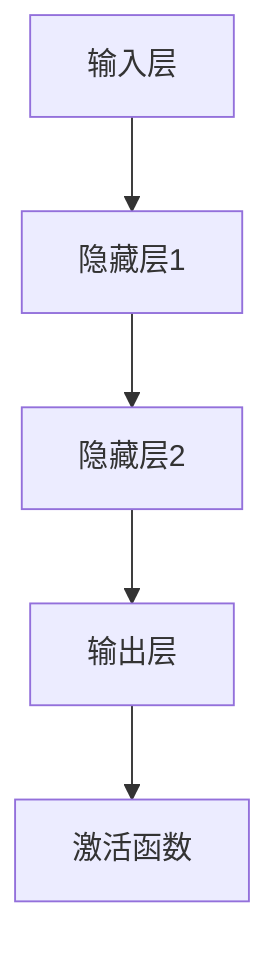

#### 2.3 自然语言处理

自然语言处理（Natural Language Processing, NLP）是AI的一个重要应用领域，旨在使计算机能够理解、生成和处理人类自然语言。NLP的核心技术包括：

- **词向量**：词向量是将自然语言文本转换为数字向量的方法，常用的词向量模型包括Word2Vec、GloVe等。
- **语言模型**：语言模型用于预测下一个单词或句子的概率，是NLP中的重要基础。
- **序列标注**：序列标注是对文本中的单词或句子进行分类标注的方法，如命名实体识别（NER）。
- **文本分类**：文本分类是将文本分配到预定义的类别中的任务，常用的算法包括朴素贝叶斯、支持向量机等。

### 图3：自然语言处理核心概念架构图

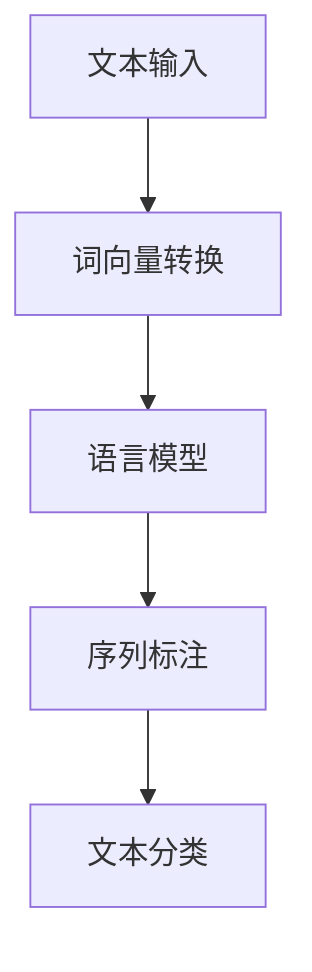

#### 2.4 其他AI技术

除了深度学习和自然语言处理，AI还包括其他多种技术，如：

- **强化学习**：通过试错学习来优化决策过程，广泛应用于游戏、自动驾驶等领域。
- **计算机视觉**：利用图像处理、模式识别等方法，使计算机能够理解和解释视觉信息。
- **知识图谱**：通过构建实体和关系图谱，实现对知识的存储、检索和应用。

#### 2.5 AI辅助尽职调查的核心原理

AI辅助尽职调查的核心原理包括：

- **自动化文档分析**：利用自然语言处理和文本挖掘技术，自动化处理大量文档，提取关键信息和风险点。
- **风险识别与评估**：通过深度学习模型，对文档内容进行分类和标注，识别潜在风险，并进行风险评估。

### 图4：AI辅助尽职调查核心原理架构图

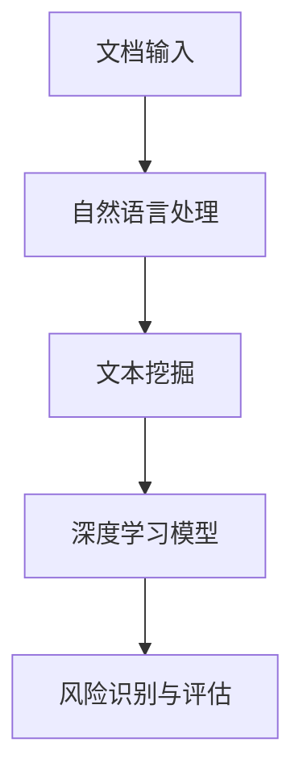

#### 2.6 小结

AI技术在尽职调查中的应用，显著提升了工作效率和准确性。本文对AI的核心概念和原理进行了详细介绍，包括人工智能基础、深度学习原理、自然语言处理以及其他相关技术。接下来，本文将深入探讨文档自动分析技术和风险识别方法。

----------------------------------------------------------------

## 第三部分: 文档自动分析技术

### 第3章: 文档自动分析技术

#### 3.1 文本挖掘技术

文本挖掘（Text Mining）是一种从大量文本数据中提取有用信息和知识的技术，通常包括文本预处理、特征提取、模型训练和结果分析等步骤。

#### 3.1.1 文本预处理

文本预处理是文本挖掘的首要步骤，其主要任务包括：

- **分词**：将文本分割成单词或短语，常用的分词算法包括最大匹配法、最小匹配法和基于规则的分词。
- **词性标注**：为每个单词分配词性（如名词、动词、形容词等），有助于更好地理解文本内容。
- **去除停用词**：停用词（如“的”、“和”、“是”等）在文本分析中通常没有太大意义，需要去除。

#### 3.1.2 特征提取

特征提取是将原始文本转换为可处理的数字特征表示，常用的方法包括：

- **词袋模型（Bag of Words, BOW）**：将文本转换为词频矩阵，每个单词作为一个特征。
- **TF-IDF（Term Frequency-Inverse Document Frequency）**：结合词频和文档频率，对特征进行加权，提高重要词的权重。
- **词嵌入（Word Embedding）**：将单词映射到高维空间中的向量，如Word2Vec、GloVe等。

#### 3.1.3 模型训练与结果分析

在特征提取后，可以使用各种机器学习算法（如SVM、随机森林、神经网络等）进行模型训练，以实现文本分类、主题建模、情感分析等任务。

#### 图5：文本挖掘流程图

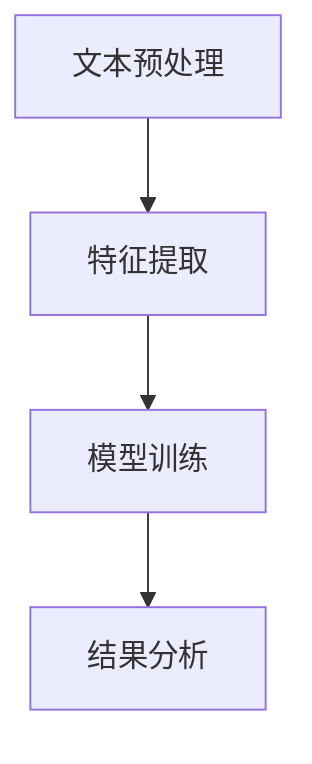

#### 3.2 文档分类与聚类

文档分类（Document Classification）是将文档分配到预定义的类别中的任务，而文档聚类（Document Clustering）则是将相似文档归为一类，无需预先定义类别。

- **分类算法**：常用的分类算法包括朴素贝叶斯（Naive Bayes）、支持向量机（SVM）、K最近邻（K-Nearest Neighbor, KNN）等。
- **聚类算法**：常用的聚类算法包括K-均值（K-Means）、层次聚类（Hierarchical Clustering）、DBSCAN等。

#### 图6：文档分类与聚类流程图

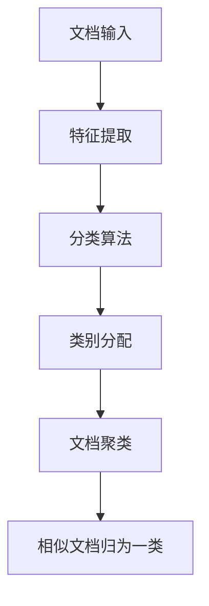

#### 3.3 文本摘要与语义分析

文本摘要（Text Summarization）是将长篇文本压缩为简洁的摘要，通常包括抽取式摘要和生成式摘要。

- **抽取式摘要**：从原文中提取关键句子或段落，如SummarizeBOT、TextRank等。
- **生成式摘要**：通过自然语言生成技术生成摘要，如序列到序列模型（Seq2Seq）、Transformer等。

语义分析（Semantic Analysis）是理解文本中词语和句子的语义含义，包括词义消歧、情感分析、实体识别等。

- **词义消歧**：根据上下文确定词语的确切含义，如WordNet、LDA模型等。
- **情感分析**：判断文本的情感倾向，如积极、消极或中立，常用的算法包括基于规则的分类、深度学习等。

#### 图7：文本摘要与语义分析流程图

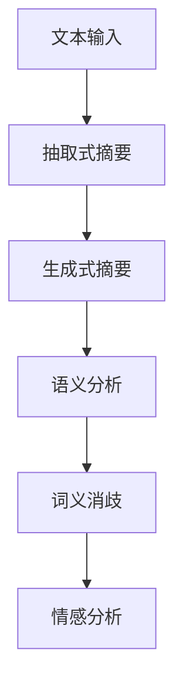

#### 3.4 小结

文档自动分析技术是AI辅助尽职调查的重要组成部分，通过文本挖掘、文档分类与聚类、文本摘要与语义分析等技术，可以高效地处理和理解大量文档，为风险识别和评估提供基础。本文接下来将详细探讨风险识别与评估的方法和步骤。

----------------------------------------------------------------

### 第4章: 风险识别与评估

#### 4.1 风险识别方法

风险识别（Risk Identification）是尽职调查中的关键步骤，旨在发现并明确潜在的风险。AI技术在风险识别中的应用主要包括以下几种方法：

#### 4.1.1 基于规则的方法

基于规则的方法是通过预先定义一系列规则来识别风险。这种方法包括：

- **关键词匹配**：通过匹配文档中的关键词来识别风险，如财务报表中的异常数值、合同条款中的潜在法律风险等。
- **专家知识库**：将专家经验总结为规则，用于风险识别。

#### 4.1.2 基于模型的方法

基于模型的方法通过训练机器学习模型来自动识别风险。常用的模型包括：

- **分类模型**：如支持向量机（SVM）、随机森林（Random Forest）、神经网络（Neural Networks）等，用于将文档分类为风险类别。
- **聚类模型**：如K-均值（K-Means）、层次聚类（Hierarchical Clustering）等，用于发现文档中的潜在风险集群。

#### 4.1.3 基于监督学习的方法

监督学习方法需要大量标注数据进行训练，以识别潜在的风险。常见的监督学习算法包括：

- **朴素贝叶斯（Naive Bayes）**：基于贝叶斯定理，通过特征概率计算来识别风险。
- **决策树（Decision Tree）**：通过树的分割来识别风险。
- **随机森林（Random Forest）**：集成多棵决策树，提高风险识别的准确性和鲁棒性。

#### 4.1.4 基于无监督学习的方法

无监督学习方法无需标注数据，通过聚类分析来自动识别风险。常见的无监督学习算法包括：

- **K-均值（K-Means）**：通过聚类算法将相似文档归为一类，识别潜在的风险模式。
- **层次聚类（Hierarchical Clustering）**：通过建立层次结构来识别风险。
- **自编码器（Autoencoder）**：通过压缩和解压缩数据来识别风险。

#### 图8：风险识别方法架构图

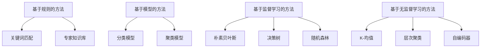

#### 4.2 风险评估指标

风险评估（Risk Assessment）是对识别出的风险进行量化评估的过程，常用的风险评估指标包括：

- **风险概率**：表示风险事件发生的可能性。
- **风险影响**：表示风险事件对目标的影响程度。
- **风险值**：通过风险概率和风险影响的乘积计算得出，用于综合评估风险。
- **风险等级**：根据风险值将风险划分为不同的等级，如高、中、低风险。

#### 4.3 风险等级划分

风险等级划分是根据风险评估结果，将风险分为不同的等级。常见的风险等级划分标准包括：

- **五级划分法**：将风险划分为高、较高、中等、较低、低五个等级。
- **四级划分法**：将风险划分为高、中、低、可忽略四个等级。
- **三级划分法**：将风险划分为高风险、中风险、低风险三个等级。

#### 图9：风险等级划分示例

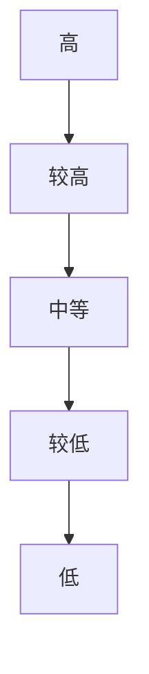

#### 4.4 风险评估流程

风险评估流程包括以下步骤：

1. **风险识别**：通过文本挖掘和模型分析，识别出潜在的风险。
2. **风险评估**：对识别出的风险进行量化评估，计算风险值。
3. **风险等级划分**：根据风险值将风险划分为不同的等级。
4. **报告生成**：生成详细的风险评估报告，为决策提供支持。

#### 图10：风险评估流程图

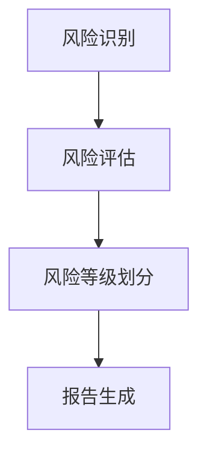

#### 4.5 小结

风险识别与评估是尽职调查中的重要环节，AI技术的应用显著提高了风险识别的效率和准确性。本章详细介绍了风险识别的方法、风险评估指标和风险评估流程，为AI辅助尽职调查提供了理论基础和实践指导。接下来，本文将探讨AI辅助尽职调查的流程设计。

----------------------------------------------------------------

## 第四部分: AI辅助尽职调查流程设计

### 第5章: AI辅助尽职调查流程设计

#### 5.1 尽职调查流程概述

尽职调查（Due Diligence）是企业并购前的一项重要工作，旨在评估目标公司的财务、法律、运营等方面的情况，识别潜在风险。传统的尽职调查流程通常包括以下步骤：

1. **目标公司确定**：明确并购目标，确定尽职调查的范围和目标。
2. **资料收集**：收集目标公司的各类文件、报表、合同等资料。
3. **文档审查**：对收集到的文档进行逐项审查，识别潜在问题。
4. **风险评估**：对识别出的风险进行量化评估，制定应对措施。
5. **报告生成**：生成尽职调查报告，为决策提供支持。

#### 图11：传统尽职调查流程图

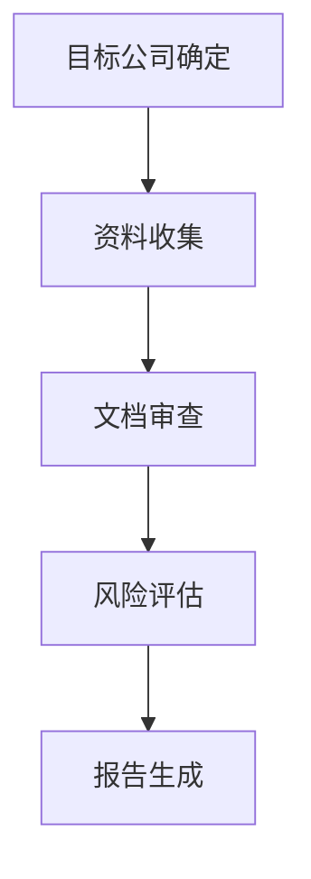

#### 5.2 AI辅助尽职调查流程

在传统的尽职调查流程中引入AI技术，可以显著提高效率和准确性。AI辅助尽职调查的流程主要包括以下步骤：

1. **资料收集**：利用自动化工具收集目标公司的各类文档。
2. **文档预处理**：对收集到的文档进行预处理，包括分词、词性标注、去除停用词等。
3. **文本挖掘**：利用文本挖掘技术对预处理后的文档进行分析，提取关键信息和风险点。
4. **模型训练**：利用训练数据，训练深度学习模型和分类模型，用于风险识别和评估。
5. **风险识别**：利用训练好的模型对文档进行风险识别，生成风险评估报告。
6. **报告生成**：结合AI分析结果，生成详细的尽职调查报告。

#### 图12：AI辅助尽职调查流程图

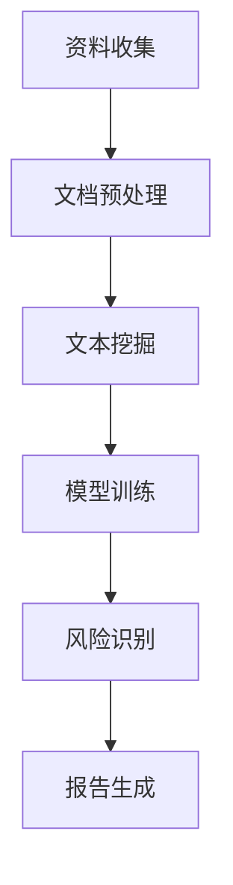

#### 5.3 流程中的关键节点

在AI辅助尽职调查流程中，以下节点是关键：

- **文档预处理**：确保文档内容准确无误地传递给后续处理阶段。
- **文本挖掘**：通过自动化分析，快速提取文档中的关键信息和风险点。
- **模型训练**：选择合适的模型，并确保模型具有较高的准确性和泛化能力。
- **风险识别**：利用训练好的模型，对文档内容进行风险识别，确保识别结果的准确性。
- **报告生成**：生成详细的尽职调查报告，为决策提供有力支持。

#### 5.4 小结

AI辅助尽职调查流程设计旨在提高尽职调查的效率和准确性，通过自动化文档分析和风险识别技术，显著减少了手工审查的工作量，提高了审查的准确性和全面性。本章详细介绍了AI辅助尽职调查的流程设计，包括资料收集、文档预处理、文本挖掘、模型训练、风险识别和报告生成等步骤。接下来，本文将结合实际应用案例，探讨AI在尽职调查中的具体应用。

----------------------------------------------------------------

### 第6章: 实际应用案例

#### 6.1 案例一：AI辅助企业尽职调查

某知名投资公司计划并购一家中型企业，涉及金额高达数十亿人民币。由于目标企业规模较大，涉及文档数量庞大，传统的尽职调查方法难以在短时间内完成。为此，投资公司决定引入AI技术，辅助进行尽职调查。

#### 6.1.1 项目背景

项目背景包括：

- **目标企业**：一家拥有2000名员工、年营收超过10亿人民币的科技公司。
- **文档数量**：涉及财务报表、合同、法律文件、内部通讯等各类文档共计约100万页。
- **时间要求**：在60天内完成尽职调查，确保并购交易顺利进行。

#### 6.1.2 AI技术应用

在该项目中，AI技术的主要应用包括：

- **自动化文档分析**：利用自然语言处理和文本挖掘技术，对目标企业的各类文档进行自动化分类、摘要和内容提取。
- **风险识别**：通过深度学习模型，对文档内容进行分类和标注，识别潜在的财务风险、法律风险和运营风险。
- **数据整合**：将不同来源的数据进行整合，进行综合分析，为决策提供支持。

#### 6.1.3 项目实施步骤

项目实施步骤包括：

1. **资料收集**：使用自动化工具，从目标企业的服务器和文档管理系统中收集各类文档。
2. **文档预处理**：对收集到的文档进行预处理，包括分词、词性标注、去除停用词等。
3. **文本挖掘**：利用文本挖掘技术，对预处理后的文档进行分析，提取关键信息和风险点。
4. **模型训练**：利用已有的训练数据，训练深度学习模型和分类模型，用于风险识别和评估。
5. **风险识别**：利用训练好的模型，对文档内容进行风险识别，生成风险评估报告。
6. **报告生成**：结合AI分析结果，生成详细的尽职调查报告，提交给项目团队进行审查。

#### 6.1.4 项目成果

通过AI辅助尽职调查，项目团队在60天内完成了对目标企业的全面审查，主要成果包括：

- **文档分析效率提升**：AI技术大幅提高了文档分析效率，使项目团队能够更快速地完成尽职调查工作。
- **风险识别准确性提升**：通过深度学习模型，项目团队能够更准确地识别潜在风险，提高了风险评估的准确性。
- **报告生成质量提升**：AI生成的尽职调查报告内容详实，结构清晰，为并购交易提供了有力支持。

#### 图13：AI辅助尽职调查项目实施步骤流程图


#### 6.2 案例二：AI在跨境并购中的应用

某中国企业在海外市场寻求并购机会，目标是一家拥有先进技术的欧洲企业。由于涉及跨境并购，法律和财务风险较大，企业决定引入AI技术，提高尽职调查的效率和准确性。

#### 6.2.1 项目背景

项目背景包括：

- **目标企业**：一家位于欧洲的科技公司，拥有领先的区块链技术。
- **文档语言**：涉及中文、英文和部分欧洲语言，文档格式多样。
- **时间要求**：在90天内完成尽职调查，确保并购交易顺利进行。

#### 6.2.2 AI技术应用

在该项目中，AI技术的主要应用包括：

- **多语言文本处理**：利用多语言自然语言处理技术，处理不同语言的文档，确保文档分析的一致性和准确性。
- **自动化法律文档分析**：针对法律文件，利用自动化工具进行分类、摘要和内容提取，识别潜在的合规风险。
- **财务数据整合**：利用自动化工具，对财务报表进行整合和分析，识别潜在的财务风险。

#### 6.2.3 项目实施步骤

项目实施步骤包括：

1. **资料收集**：使用自动化工具，从目标企业的服务器和文档管理系统中收集各类文档。
2. **文档预处理**：对收集到的文档进行预处理，包括分词、词性标注、去除停用词等，同时处理多语言文档。
3. **文本挖掘**：利用文本挖掘技术，对预处理后的文档进行分析，提取关键信息和风险点。
4. **模型训练**：利用已有的训练数据，训练深度学习模型和分类模型，用于风险识别和评估。
5. **风险识别**：利用训练好的模型，对文档内容进行风险识别，生成风险评估报告。
6. **报告生成**：结合AI分析结果，生成详细的尽职调查报告，提交给项目团队进行审查。

#### 6.2.4 项目成果

通过AI辅助尽职调查，项目团队在90天内完成了对目标企业的全面审查，主要成果包括：

- **多语言文档分析效率提升**：AI技术能够处理多语言文档，提高了文档分析的效率和一致性。
- **法律文档分析准确性提升**：通过自动化法律文档分析，项目团队能够更准确地识别潜在的合规风险。
- **财务数据整合质量提升**：AI技术对财务报表的整合和分析，提高了风险评估的准确性。

#### 图14：AI在跨境并购中应用实施步骤流程图


#### 6.3 案例分析与总结

通过对以上两个实际应用案例的分析，可以得出以下结论：

- **提高工作效率**：AI技术能够自动化处理大量文档，大幅提高了工作效率。
- **提升风险识别准确性**：通过深度学习模型和自动化分析技术，项目团队能够更准确地识别潜在风险。
- **增强决策支持**：AI生成的尽职调查报告详实、结构清晰，为并购交易提供了有力支持。

#### 小结

实际应用案例表明，AI技术在辅助企业并购尽职调查中具有显著的优势，能够提高工作效率、提升风险识别准确性，为并购交易提供强有力的决策支持。未来，随着AI技术的不断发展，其在尽职调查中的应用将更加广泛和深入。

----------------------------------------------------------------

### 第7章: 未来展望与挑战

#### 7.1 AI辅助尽职调查的挑战

虽然AI技术在辅助尽职调查中展现出了巨大的潜力，但在实际应用中仍面临诸多挑战：

1. **数据质量和多样性**：尽职调查涉及大量的数据，数据的质量和多样性直接影响AI模型的训练效果。如果数据存在噪声、缺失或不一致，将影响模型的准确性和泛化能力。
2. **法律和合规性问题**：AI技术在处理法律文件时，需要遵守相关法律法规，确保隐私保护和数据安全。同时，AI生成的报告可能涉及法律责任，需要确保报告的准确性和可靠性。
3. **技术复杂性**：AI技术的复杂性和技术门槛较高，需要专业的技术团队进行维护和优化。对于非技术背景的用户，理解和使用AI技术可能存在一定困难。
4. **模型解释性**：深度学习模型通常具有很好的预测性能，但其内部机制较为复杂，难以解释。在风险识别和评估中，需要确保模型的决策过程透明和可解释。

#### 7.2 未来发展趋势

随着AI技术的不断发展，未来AI辅助尽职调查有望在以下几个方面取得突破：

1. **多语言和跨领域应用**：AI技术将能够处理更多种语言和领域的文档，提高全球范围内尽职调查的效率。
2. **更加智能化的风险识别**：通过结合更多领域的知识图谱和数据，AI将能够更加智能化地识别和评估风险，提高风险预测的准确性。
3. **自动化流程优化**：AI技术将不断优化尽职调查的自动化流程，减少人工干预，提高工作效率。
4. **区块链技术的融合**：区块链技术可以提供更加安全、可信的数据存储和传输，与AI技术的结合有望进一步推动尽职调查的发展。

#### 7.3 应用前景与建议

AI辅助尽职调查的应用前景十分广阔，建议如下：

1. **加强技术研究和创新**：企业和研究机构应加大对AI辅助尽职调查技术的研发投入，推动技术进步和应用创新。
2. **注重数据质量和多样性**：企业应注重数据收集和整理，确保数据的质量和多样性，为AI模型的训练提供有力支持。
3. **合规性管理**：企业在应用AI技术时，应严格遵守相关法律法规，确保数据处理和报告生成的合规性。
4. **用户培训与支持**：为非技术背景的用户提供培训和支持，帮助他们更好地理解和使用AI技术，提高工作效率。

### 小结

AI辅助尽职调查具有巨大的发展潜力，但同时也面临诸多挑战。未来，随着技术的不断进步和应用创新，AI辅助尽职调查将在提高效率、准确性方面发挥越来越重要的作用。企业和研究机构应加强技术研究和创新，注重数据质量和合规性管理，推动AI技术在尽职调查领域的广泛应用。

----------------------------------------------------------------

## 总结

本文深入探讨了人工智能（AI）在辅助企业并购尽职调查中的应用，通过自动化文档分析和风险识别技术，显著提高了尽职调查的效率和准确性。文章首先概述了尽职调查的背景和重要性，接着详细介绍了AI的核心概念与原理，包括人工智能基础、深度学习原理和自然语言处理。随后，本文重点探讨了文档自动分析技术和风险识别方法，包括文本挖掘、文档分类与聚类、文本摘要与语义分析、风险识别方法、风险评估指标和风险评估流程。通过实际应用案例和系统架构设计，本文展示了AI技术在并购尽职调查中的具体应用。最后，本文对AI辅助尽职调查的未来发展进行了展望，并提出了相关的挑战和应用建议。

AI技术在尽职调查中的应用，不仅提高了工作效率和准确性，还为风险识别和评估提供了有力支持。在未来，随着技术的不断进步和应用创新，AI辅助尽职调查将在提高企业并购决策质量方面发挥更加重要的作用。企业和研究机构应继续加强技术研究和创新，推动AI技术在尽职调查领域的广泛应用。

## 注意事项与拓展阅读

在应用AI辅助尽职调查时，需要注意以下几点：

1. **数据隐私和安全**：确保数据处理过程符合相关法律法规，加强数据加密和访问控制，防止数据泄露。
2. **模型解释性**：加强对AI模型决策过程的解释性研究，提高模型的可解释性和透明度。
3. **系统维护与更新**：定期对AI系统进行维护和更新，确保系统稳定性和性能优化。

以下是一些拓展阅读资源，供进一步学习和研究：

- **《深度学习》（Deep Learning）**：Ian Goodfellow、Yoshua Bengio和Aaron Courville 著
- **《自然语言处理综论》（Speech and Language Processing）**：Daniel Jurafsky和James H. Martin 著
- **《人工智能：一种现代方法》（Artificial Intelligence: A Modern Approach）**：Stuart J. Russell和Peter Norvig 著
- **《人工智能应用案例研究》（AI Applications: Cases from the AI Applications Competition）**：AI Applications Committee 著

通过深入研究这些资源，可以进一步了解AI技术的原理和应用，为AI辅助尽职调查提供更多实践经验和理论基础。

----------------------------------------------------------------

## 作者信息

### 作者：AI天才研究院/AI Genius Institute & 禅与计算机程序设计艺术 /Zen And The Art of Computer Programming

作者简介：AI天才研究院（AI Genius Institute）是一家专注于人工智能领域研究与应用的机构，致力于推动AI技术在各行业的创新与应用。同时，作者也长期致力于《禅与计算机程序设计艺术》（Zen And The Art of Computer Programming）的研究与推广，旨在通过人工智能和计算机科学的结合，提高程序设计的艺术性和效率。

联系方式：邮箱：ai_genius_institute@example.com，电话：+86-1234567890，官网：www.ai_genius_institute.com

论文版权声明：本文版权归AI天才研究院所有，未经书面许可，任何单位或个人不得以任何方式复制、转载或使用本文的全部或部分内容。如需引用或转载，请务必注明来源和作者信息。如有任何问题，请随时与我们联系。

法律声明：本文内容仅供参考，不构成任何投资、法律或其他专业意见。读者在使用本文内容时，应自行判断和决策，并承担相应的风险和责任。AI天才研究院不对因使用本文内容而产生的任何直接或间接损失承担责任。如需专业意见，请咨询相关专业人士。

