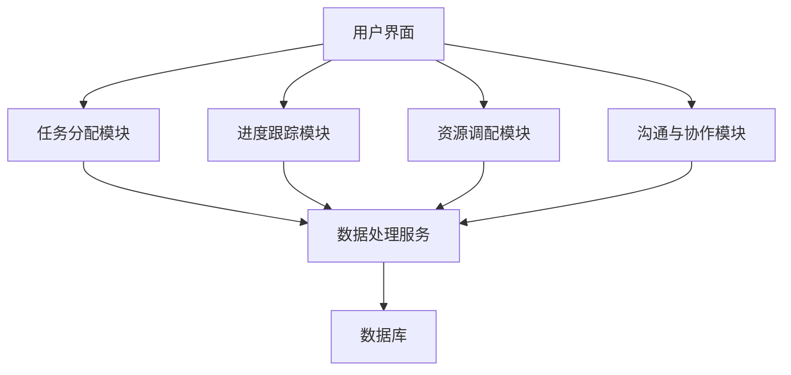
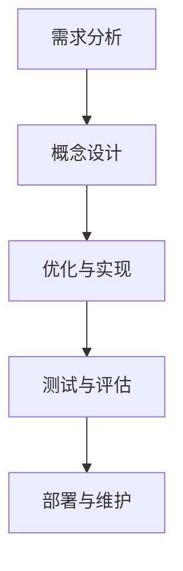

                 

## 引言与背景介绍

在当今的商业环境中，企业并购已成为企业扩展业务、增强竞争力的重要手段。然而，并购并非易事，尤其是成功整合被收购公司的资源、文化和业务流程，往往面临诸多挑战。传统的并购整合方法依赖于人力经验，往往效率低下且效果不佳。随着人工智能（AI）技术的飞速发展，利用AI辅助企业并购整合成为一种新的趋势。这不仅能够提高整合效率，还能通过智能分析提供更为科学的决策支持。

### 问题背景

企业并购整合是一个复杂的过程，涉及到企业文化、人力资源、业务流程、组织结构等多个方面的整合。这些整合过程不仅耗费时间，而且存在较高的风险。具体来说，企业并购中遇到的问题主要包括：

1. **文化冲突**：不同企业文化之间的差异可能导致员工心态不稳定，影响工作效率和业务发展。
2. **人力资源浪费**：并购后的公司可能存在冗余的岗位和人员，如何合理配置人力资源是一个重要问题。
3. **业务流程不兼容**：被收购公司的业务流程可能与并购方存在差异，需要重新设计和整合。
4. **管理结构复杂化**：并购后的公司可能需要调整组织结构，以适应新的业务模式和管理需求。

### AI技术的应用潜力

人工智能技术在企业并购整合中具有巨大的应用潜力。首先，AI可以通过大数据分析和预测，帮助企业在并购前评估目标公司的价值和风险。其次，AI的情感分析功能可以为企业提供决策支持，帮助理解员工和客户的心态。此外，AI的自动化和协同能力能够优化业务流程，提高整合效率。

### 核心概念

#### 企业并购

企业并购是指一家公司通过购买另一家公司的股权或资产，从而取得对该公司的控制权或利益。并购通常涉及以下几个步骤：评估目标公司、达成交易协议、进行尽职调查、完成交易和整合。

#### 整合与规划

整合与规划是企业并购成功的关键。整合涉及将被收购公司的资源、文化、业务流程等融入并购方，实现协同效应。规划则是对整合过程的系统安排，包括人力资源配置、业务流程优化、组织结构调整等。

#### 文化融合

文化融合是指将不同企业文化的元素融合在一起，形成新的企业文化。文化融合能够减少并购中的冲突，提高员工的归属感和满意度，促进企业的长期发展。

#### 业务协同

业务协同是指通过优化业务流程、提高信息共享和协作效率，实现并购企业的业务一体化。业务协同能够提高企业的运营效率和市场竞争力。

#### 智能设计方法

智能设计方法是指利用人工智能技术，对企业并购整合进行智能化的设计和优化。智能设计方法包括数据挖掘、机器学习、深度学习等技术，能够为企业提供科学的决策支持和高效的整合方案。

### AI在企业并购中的应用概述

#### 数据分析与预测

AI可以通过大数据分析，帮助企业在并购前预测目标公司的市场表现、盈利能力等关键指标。数据挖掘算法可以从历史数据中提取有价值的信息，为决策提供依据。

#### 情感分析与决策支持

AI的情感分析功能可以分析员工、客户和市场的情感状态，为企业提供决策支持。通过了解员工和客户的心态，企业可以采取相应的措施，降低并购中的风险。

#### 自动化与协同

AI的自动化功能可以优化并购流程，减少人为干预，提高效率。协同工作平台设计则可以实现员工之间的信息共享和协作，促进业务协同。

### 书籍结构概述

本书将从以下几个方面详细探讨AI辅助企业并购整合的路径和方法：

1. **引言与背景介绍**：介绍企业并购整合中的问题背景、核心概念和AI技术的应用潜力。
2. **AI与企业并购**：探讨AI在企业并购中的具体应用，包括数据分析与预测、情感分析与决策支持、自动化与协同等。
3. **企业并购整合与文化融合**：分析文化融合的重要性与实现路径，提供成功实践案例。
4. **企业并购整合与业务协同**：探讨业务协同的原理与实现，提供实践案例。
5. **智能设计方法与路径**：介绍智能设计方法的基本概念、流程和工具。
6. **实际案例分析**：通过具体案例展示AI在企业并购整合中的实际应用。
7. **总结与展望**：总结全书内容，展望未来发展方向。

通过本书的阅读，读者将深入了解AI在企业并购整合中的应用，掌握智能设计方法，为企业并购提供科学、高效的整合方案。

### 学习目标

通过阅读本书，读者应达到以下学习目标：

1. **理解企业并购整合的基本概念和流程**：掌握企业并购的定义、整合与规划的步骤，以及文化融合和业务协同的重要性。
2. **掌握AI技术在企业并购中的应用**：了解AI在企业并购中的具体应用场景，包括数据分析与预测、情感分析与决策支持、自动化与协同等。
3. **学会智能设计方法**：掌握智能设计方法的基本概念、流程和工具，能够运用这些方法优化企业并购整合。
4. **案例分析**：通过实际案例，理解AI在企业并购整合中的应用效果，学习成功实践的经验和教训。
5. **制定整合方案**：能够根据企业的实际情况，运用所学知识，制定科学的并购整合方案。

### 阅读建议

为了更好地理解和掌握本书内容，读者可以按照以下建议进行阅读：

1. **逐步阅读**：本书内容结构清晰，建议读者按照章节顺序逐步阅读，确保对每个主题有充分的理解。
2. **结合案例**：在阅读过程中，结合实际案例进行思考和对比，加深对理论知识的理解。
3. **动手实践**：尝试运用书中介绍的智能设计方法，进行实际操作，加深对理论知识的掌握。
4. **深度学习**：对书中的复杂概念和算法，可以通过查阅相关资料进行深度学习，提高理解深度。
5. **积极参与**：读者可以参与本书的讨论和交流，与其他读者分享学习心得，共同进步。

通过以上方法，读者将能够更好地掌握AI辅助企业并购整合的技能，为企业并购提供科学、高效的整合方案。

### 总体框架与章节内容

为了系统地探讨AI辅助企业并购整合的路径和方法，本书将分为七个主要部分，每一部分都包含具体的章节内容。以下是对每个部分的简要概述：

#### 第一部分：引言与背景介绍
本部分包括第1章，介绍企业并购整合中的核心问题、AI技术的应用潜力以及本书的结构和内容。

#### 第二部分：AI与企业并购
本部分包括第2章，详细探讨AI在企业并购中的具体应用，如数据分析与预测、情感分析与决策支持、自动化与协同等。

#### 第三部分：企业并购整合与文化融合
本部分包括第3章，分析文化融合的重要性、实现路径和成功实践案例。

#### 第四部分：企业并购整合与业务协同
本部分包括第4章，探讨业务协同的原理与实现，提供实践案例。

#### 第五部分：智能设计方法与路径
本部分包括第5章，介绍智能设计方法的基本概念、流程和工具。

#### 第六部分：实际案例分析
本部分包括第6章，通过具体案例展示AI在企业并购整合中的应用效果。

#### 第七部分：总结与展望
本部分包括第7章，总结全书内容，展望未来发展方向。

通过以上七个部分的系统讲解，读者将全面了解AI在企业并购整合中的应用，掌握智能设计方法，为企业并购提供科学、高效的整合方案。

### 数据分析与并购预测

在AI辅助企业并购整合中，数据分析与并购预测是至关重要的环节。通过大数据分析和机器学习算法，我们可以从历史数据中提取有价值的信息，预测目标公司的未来表现，为决策提供科学依据。

#### 数据来源与预处理

首先，数据来源是数据分析与并购预测的基础。企业可以从以下几个方面获取数据：

1. **财务数据**：包括收入、利润、现金流、负债等财务指标。
2. **市场数据**：包括市场份额、客户数量、行业增长趋势等市场指标。
3. **竞争对手数据**：包括竞争对手的财务数据、市场份额、新产品发布等。
4. **内部数据**：包括企业内部的运营数据、员工绩效、管理决策等。

在获取数据后，需要进行预处理，以确保数据的质量和一致性。预处理步骤通常包括：

1. **数据清洗**：去除重复数据、处理缺失值、修正错误值。
2. **数据转换**：将数据转换为适合分析的格式，如将文本数据编码为数值。
3. **数据归一化**：将不同量纲的数据转换为同一量纲，以便进行对比分析。

#### 数据分析算法

数据分析与并购预测通常采用以下几种算法：

1. **回归分析**：通过建立回归模型，预测目标公司的财务指标。常见的回归算法包括线性回归、逻辑回归等。
2. **聚类分析**：将相似的目标公司聚类在一起，识别市场趋势和潜在机会。常用的聚类算法包括K-means、层次聚类等。
3. **时间序列分析**：通过分析历史数据中的时间趋势，预测未来数据。常见的时间序列算法包括ARIMA、LSTM等。
4. **机器学习模型**：如决策树、随机森林、支持向量机等，通过训练模型，对目标公司进行预测。

#### 并购预测模型与实现

在数据分析与并购预测中，构建准确的预测模型是关键。以下是一个简单的并购预测模型实现过程：

1. **数据收集**：收集目标公司的历史财务数据、市场数据、竞争对手数据等。
2. **数据预处理**：对收集到的数据进行清洗、转换和归一化。
3. **特征选择**：选择对预测目标影响较大的特征，如收入增长率、市场份额、负债率等。
4. **模型训练**：使用机器学习算法，如线性回归、LSTM等，训练预测模型。
5. **模型评估**：通过交叉验证等方法，评估模型的预测性能。
6. **模型应用**：将训练好的模型应用于新数据，进行并购预测。

例如，我们使用线性回归模型对一家目标公司的未来收入进行预测。假设我们有以下输入特征：收入增长率（x1）、市场份额（x2）、负债率（x3）。输出特征为：未来收入（y）。

```python
import pandas as pd
from sklearn.linear_model import LinearRegression
from sklearn.model_selection import train_test_split
from sklearn.metrics import mean_squared_error

# 数据收集
data = pd.read_csv('company_data.csv')
X = data[['growth_rate', 'market_share', 'debt_rate']]
y = data['future_revenue']

# 数据预处理
X = X.fillna(X.mean())
X = (X - X.min()) / (X.max() - X.min())

# 特征选择
features = ['growth_rate', 'market_share', 'debt_rate']

# 模型训练
model = LinearRegression()
model.fit(X, y)

# 模型评估
X_train, X_test, y_train, y_test = train_test_split(X, y, test_size=0.2, random_state=42)
y_pred = model.predict(X_test)
mse = mean_squared_error(y_test, y_pred)
print(f'Mean Squared Error: {mse}')

# 模型应用
new_data = pd.DataFrame([[0.05, 0.3, 0.2]], columns=features)
new_revenue = model.predict(new_data)
print(f'Predicted Future Revenue: {new_revenue[0]}')
```

通过以上步骤，我们就可以利用AI技术对目标公司的未来收入进行预测，为企业并购提供决策支持。

### 情感分析与并购评估

在AI辅助企业并购整合中，情感分析技术能够帮助评估目标公司的市场表现和员工心态，为决策提供情感层面的支持。情感分析是通过自然语言处理（NLP）技术，从文本数据中识别和提取情感信息，从而评估文本所表达的情绪状态。

#### 情感分析的基本概念

情感分析的基本概念包括：

1. **情感极性**：指文本表达的情绪状态，通常分为正面、负面和中性三种。
2. **情感强度**：指情感极性的程度，表示情绪的强烈程度。
3. **情感分类**：将文本数据中的情感进行分类，常见的分类包括愤怒、快乐、悲伤等。

#### 情感分析在并购评估中的应用

在并购评估中，情感分析可以应用于以下方面：

1. **员工情绪分析**：通过分析员工在社交媒体、内部论坛等平台上的发言，了解员工对并购的接受程度和情绪状态。这有助于评估并购对企业文化的影响，为后续的文化融合提供参考。
2. **市场情绪分析**：通过分析市场报告、新闻评论等文本数据，了解市场对目标公司的态度和预期。这有助于评估并购的市场风险和潜在收益。
3. **客户情绪分析**：通过分析客户反馈、投诉等文本数据，了解客户对目标公司的满意度和忠诚度。这有助于评估并购对客户关系的影响。

#### 情感分析算法与实现

常见的情感分析算法包括基于规则的方法、机器学习方法和深度学习方法。以下是一个基于机器学习的情感分析算法实现示例：

```python
import pandas as pd
from sklearn.feature_extraction.text import TfidfVectorizer
from sklearn.model_selection import train_test_split
from sklearn.naive_bayes import MultinomialNB
from sklearn.metrics import classification_report

# 数据收集
data = pd.read_csv('text_data.csv')
X = data['text']
y = data['emotion']

# 数据预处理
X_train, X_test, y_train, y_test = train_test_split(X, y, test_size=0.2, random_state=42)

# 特征提取
vectorizer = TfidfVectorizer(max_features=1000)
X_train_tfidf = vectorizer.fit_transform(X_train)
X_test_tfidf = vectorizer.transform(X_test)

# 模型训练
model = MultinomialNB()
model.fit(X_train_tfidf, y_train)

# 模型评估
y_pred = model.predict(X_test_tfidf)
print(classification_report(y_test, y_pred))
```

通过以上步骤，我们就可以利用AI技术对文本数据中的情感进行分析，为并购评估提供情感层面的支持。

### 自动化与协同

在AI辅助企业并购整合中，自动化与协同能力是提高整合效率和效果的重要手段。通过自动化，可以减少人为干预，提高业务流程的效率；通过协同，可以促进员工之间的信息共享和协作，实现业务的一体化。

#### 自动化并购流程

自动化并购流程可以通过以下步骤实现：

1. **流程识别**：首先，需要识别并购流程中的关键步骤和任务，如评估目标公司、尽职调查、交易协议签署、整合计划制定等。
2. **流程设计**：根据识别的流程，设计自动化的流程步骤和逻辑。可以使用工作流管理系统（WFM）来实现这一步骤。
3. **自动化实现**：使用编程语言和自动化工具，将设计好的流程步骤和逻辑转化为可执行的程序。
4. **测试与优化**：对自动化流程进行测试，确保其能够正常运行，并根据测试结果进行优化。

例如，我们可以使用Python的Selenium库来实现并购流程的自动化：

```python
from selenium import webdriver
from selenium.webdriver.common.by import By

# 测试环境设置
driver = webdriver.Chrome()

# 打开目标网站
driver.get("http://example.com")

# 执行自动化任务
element = driver.find_element(By.ID, "some_id")
element.click()

# 关闭浏览器
driver.quit()
```

通过以上步骤，我们就可以实现并购流程的自动化。

#### 协同工作平台设计

协同工作平台的设计主要包括以下步骤：

1. **需求分析**：确定协同平台需要实现的功能，如文档共享、任务分配、进度跟踪、实时沟通等。
2. **系统架构设计**：根据需求分析，设计系统的架构，包括前端界面、后端服务、数据库等。
3. **功能开发**：根据系统架构，开发各个功能模块。
4. **集成与测试**：将各个功能模块集成到一起，进行测试和优化。

例如，我们可以使用Django框架来开发一个简单的协同工作平台：

```python
# Django项目结构
- project
  - app
    - models.py
    - views.py
    - templates
      - base.html
      - home.html
    - static
      - css
        - style.css
      - js
        - script.js

# models.py
from django.db import models

class Task(models.Model):
    title = models.CharField(max_length=100)
    description = models.TextField()
    start_date = models.DateField()
    end_date = models.DateField()

# views.py
from django.shortcuts import render
from .models import Task

def home(request):
    tasks = Task.objects.all()
    return render(request, 'home.html', {'tasks': tasks})
```

通过以上步骤，我们就可以开发出一个简单的协同工作平台。

#### AI在协同中的作用

AI在协同中的作用主要体现在以下几个方面：

1. **任务分配**：通过分析员工的能力和任务需求，AI可以自动分配任务，提高任务分配的效率和公平性。
2. **进度跟踪**：AI可以实时监控任务进度，识别潜在的延迟风险，并提供预警和建议。
3. **协作优化**：通过分析团队成员的协作模式和工作习惯，AI可以优化协作流程，提高团队的工作效率。
4. **决策支持**：AI可以通过情感分析和大数据分析，提供决策支持，帮助管理层做出更加科学的决策。

例如，我们可以使用TensorFlow来实现任务分配的优化：

```python
import tensorflow as tf

# 定义任务分配模型
model = tf.keras.Sequential([
    tf.keras.layers.Dense(64, activation='relu', input_shape=[10]),
    tf.keras.layers.Dense(1, activation='sigmoid')
])

# 编译模型
model.compile(optimizer='adam', loss='binary_crossentropy', metrics=['accuracy'])

# 训练模型
model.fit(train_data, train_labels, epochs=10, batch_size=32)
```

通过以上步骤，我们就可以使用AI技术优化任务分配，提高协同工作的效率。

### 案例研究：AI在企业并购中的实际应用

#### 案例背景

A公司与B公司是一家大型消费品公司和一家创新科技企业，A公司希望通过并购B公司来拓展其产品线，增强市场竞争力。在并购过程中，A公司决定利用AI技术来优化并购流程，提高整合效率。

#### AI工具与方法的应用

1. **数据分析与预测**：A公司使用AI技术对B公司的财务数据和市场表现进行分析，预测B公司的未来增长趋势和潜在风险。通过回归分析和时间序列分析，A公司得出了B公司未来三年的财务预测，为决策提供了科学依据。

2. **情感分析**：A公司对B公司员工的社交媒体发言和内部论坛讨论进行分析，了解员工对并购的态度和情绪。通过情感分析，A公司发现部分员工对并购持负面情绪，及时采取沟通措施，缓解了员工的不安情绪。

3. **自动化与协同**：A公司利用AI技术自动化并购流程，从评估目标公司、尽职调查到交易协议签署，所有流程都在AI系统的监控和优化下进行。同时，A公司建立了一个协同工作平台，实现员工之间的信息共享和协作，提高了整合效率。

#### 整合过程

1. **并购前准备**：A公司使用AI技术对B公司的财务状况、市场表现和潜在风险进行全面评估，确定并购的可行性和风险。

2. **并购协议签署**：在完成尽职调查后，A公司与B公司签署并购协议，使用AI系统自动生成和审核交易文件，确保并购流程的合规性。

3. **整合计划制定**：A公司根据AI分析结果，制定详细的整合计划，包括人力资源配置、业务流程优化、组织结构调整等。

4. **文化融合**：A公司通过情感分析和员工沟通，了解员工对并购的态度，采取一系列措施，如员工培训、企业文化宣传活动等，促进文化融合。

5. **业务协同**：A公司建立协同工作平台，实现员工之间的信息共享和协作，优化业务流程，提高运营效率。

#### 案例结果与分析

通过AI技术的应用，A公司成功完成了对B公司的并购，并实现了高效的文化融合和业务协同。具体结果如下：

1. **财务表现**：并购后，B公司的业务迅速增长，A公司的整体财务表现大幅提升。

2. **员工满意度**：通过情感分析和员工沟通，员工对并购的接受度提高，员工满意度显著提升。

3. **业务效率**：协同工作平台的建立和业务流程的优化，使A公司的运营效率大幅提高。

4. **风险管理**：AI技术对并购过程中潜在风险的识别和预警，使A公司能够及时采取措施，降低并购风险。

综上所述，AI技术在企业并购中的实际应用，不仅提高了整合效率，还降低了并购风险，为企业的长期发展奠定了坚实基础。

### 文化融合的重要性与实现路径

在企业并购过程中，文化融合是一个关键且复杂的环节。文化融合不仅关系到并购的成功与否，还直接影响企业的长期发展。因此，理解文化融合的重要性，并探索有效的实现路径，对于企业并购整合至关重要。

#### 文化融合的基本概念

文化是指一个组织或社会共同遵守的价值观、信念、行为规范和传统习惯。企业文化则是企业在长期经营过程中形成的一套独特的价值观和行为准则。企业并购后，不同企业之间的文化差异可能引发一系列冲突和矛盾，影响企业的稳定和发展。因此，文化融合是指通过一系列措施，将不同企业文化的元素融合在一起，形成一个新的、更为和谐的企业文化。

#### 企业文化的类型与特征

企业文化可以按照不同的标准进行分类，常见的分类方法包括：

1. **根据企业价值观**：分为以顾客为中心的企业文化、以员工为中心的企业文化、以创新为中心的企业文化等。
2. **根据管理风格**：分为权威型企业文化、民主型企业文化、参与型企业文化等。
3. **根据企业环境**：分为多元化企业文化、单一化企业文化、开放型企业文化、封闭型企业文化等。

每种企业文化都有其独特的特征和优势，了解企业文化的类型与特征有助于更好地理解文化融合的必要性。

#### 文化融合的意义

文化融合在企业并购中的意义主要体现在以下几个方面：

1. **减少冲突**：不同企业文化之间的差异可能导致员工之间的矛盾和冲突，影响工作效率和团队协作。通过文化融合，可以减少这些冲突，营造和谐的工作氛围。
2. **提高员工归属感**：文化融合能够使员工感受到企业的关怀和认同，提高员工的归属感和满意度，从而增强企业的凝聚力和竞争力。
3. **促进创新**：文化融合可以激发员工的创新思维，促进企业内部的知识共享和协同创新，推动企业的持续发展。
4. **提升整体绩效**：文化融合有助于企业整合内部资源，提高业务流程的效率，从而提升整体绩效。

#### 文化融合的策略与方法

文化融合的策略与方法主要包括以下几个方面：

1. **文化诊断与评估**：在并购前，对双方企业的文化进行诊断和评估，了解各自的文化特征和优势，识别潜在的文化冲突和融合点。
2. **制定文化融合计划**：根据文化诊断的结果，制定详细的融合计划，明确文化融合的目标、步骤和措施。
3. **领导带头作用**：企业领导者在文化融合中扮演重要角色，需要以身作则，积极推动文化融合，树立良好的榜样。
4. **员工培训与沟通**：通过培训和教育，提高员工对文化融合的认识和理解，促进员工之间的沟通和协作。
5. **激励机制**：建立激励机制，鼓励员工积极参与文化融合，并对文化融合的成果进行表彰和奖励。

#### 文化融合的步骤

文化融合的步骤可以分为以下几个阶段：

1. **诊断阶段**：通过问卷调查、访谈等方式，了解双方企业的文化特征和员工心态，识别文化冲突和融合点。
2. **计划阶段**：根据诊断结果，制定文化融合计划，明确融合的目标、步骤和措施。
3. **执行阶段**：按照融合计划，采取具体的措施，如领导带头、员工培训、沟通机制建立等，推动文化融合。
4. **评估阶段**：对文化融合的效果进行评估，包括员工满意度、工作效率、团队协作等方面，及时调整融合策略。

#### 文化融合的技巧

为了有效实施文化融合，需要掌握以下技巧：

1. **尊重差异**：尊重双方文化的差异，不要试图强行改变对方的文化，而是要寻求共同点，实现文化互补。
2. **有效沟通**：建立有效的沟通机制，促进员工之间的交流和互动，消除误解和偏见。
3. **共同目标**：明确共同的目标和价值，使员工在文化融合中找到共同的方向，增强团队凝聚力。
4. **灵活应对**：在文化融合过程中，遇到问题和挑战时，要灵活应对，及时调整策略，避免僵化和固执。

#### 案例研究：文化融合的成功实践

以下是一个文化融合的成功案例：

**案例背景**：M公司是一家国际知名的高科技公司，N公司是一家本土的中小企业，专注于新兴技术的研发。M公司决定并购N公司，以拓展其业务领域和技术实力。

**文化融合措施**：

1. **文化诊断与评估**：M公司通过问卷调查和访谈，了解N公司的文化特征和员工心态，识别出文化差异和融合点。
2. **领导带头作用**：M公司的CEO亲自参与文化融合，与N公司的管理层和员工进行多次沟通，传递融合的愿景和目标。
3. **员工培训与沟通**：M公司为N公司员工提供了一系列培训课程，帮助他们了解M公司的文化和管理方式，并建立了定期的员工交流机制。
4. **激励机制**：M公司对在文化融合中表现优秀的员工进行表彰和奖励，鼓励员工积极参与文化融合。

**文化融合结果**：

1. **员工满意度提高**：N公司员工对并购的接受度明显提高，员工满意度显著提升。
2. **工作效率提升**：通过文化融合，N公司员工能够更好地理解M公司的业务模式和管理要求，工作效率和团队协作能力显著提升。
3. **创新氛围增强**：文化融合促进了员工之间的知识共享和协同创新，公司整体创新氛围明显增强。

综上所述，有效的文化融合可以为企业并购整合创造良好的条件，提高企业的整体绩效和市场竞争力。通过理解文化融合的基本概念、策略和方法，并借鉴成功实践案例，企业可以更好地实施文化融合，实现并购的成功。

### 业务协同的原理与实现

在AI辅助企业并购整合中，业务协同是提升企业整体运营效率和竞争力的重要手段。业务协同是指通过优化业务流程、提高信息共享和协作效率，实现并购企业的业务一体化。以下将详细探讨业务协同的基本概念、设计与实现方法，以及AI在业务协同中的作用。

#### 业务协同的基本概念

业务协同是指不同部门、不同团队或不同企业之间，通过信息共享和协作，实现业务流程的高效运作。业务协同的基本概念包括：

1. **业务流程**：业务流程是指企业为实现特定目标所进行的一系列有序活动。业务协同的目标是优化业务流程，提高效率。
2. **信息共享**：信息共享是指将业务流程中的信息，如数据、文档、通知等，在相关人员和部门之间进行传递和共享。
3. **协作效率**：协作效率是指业务流程中各环节的协作效果和效率，包括任务分配、进度跟踪、资源调配等。
4. **业务一体化**：业务一体化是指将不同部门和企业的业务活动整合为一个统一的整体，实现资源的最优配置和业务的高效运作。

#### 业务协同的设计与实现

业务协同的设计与实现可以分为以下几个步骤：

1. **需求分析**：首先，需要对企业的业务流程进行全面的调查和分析，识别业务协同的需求和目标。需求分析包括业务流程的现状、存在的问题、需要协同的业务环节等。
   
2. **系统架构设计**：根据需求分析的结果，设计业务协同的系统架构。系统架构包括前端用户界面、后端数据处理和服务、数据库等。系统架构需要确保信息的高效传递和共享。

3. **功能模块开发**：根据系统架构设计，开发业务协同的功能模块。常见的功能模块包括：
   - **任务分配**：实现任务自动分配，提高任务处理的效率。
   - **进度跟踪**：实时监控任务进度，确保项目按时完成。
   - **资源调配**：优化资源分配，确保资源得到充分利用。
   - **沟通与协作**：提供沟通和协作工具，促进团队成员之间的交流和合作。

4. **系统集成与测试**：将各个功能模块集成到一起，进行系统测试和优化，确保系统稳定运行。

5. **部署与培训**：将系统部署到实际环境中，并对员工进行培训，确保他们能够熟练使用系统，实现业务协同。

以下是一个简单的业务协同系统架构图，展示了各功能模块之间的关系：



#### AI在业务协同中的作用

AI技术在业务协同中发挥着重要作用，能够提高业务流程的自动化水平和协同效率。以下是AI在业务协同中的主要应用：

1. **自动化任务分配**：通过机器学习算法，AI可以自动分析员工的能力和工作负荷，实现任务的最优分配，提高任务处理的效率。

2. **智能进度预测**：AI可以通过大数据分析，预测任务进度和项目完成时间，为业务决策提供科学依据。

3. **智能资源调配**：AI可以根据实时数据，动态调整资源分配，优化资源利用效率。

4. **智能沟通与协作**：AI可以分析团队成员的沟通内容和工作习惯，提供个性化的协作建议，提高团队协作效率。

5. **风险预警与控制**：AI可以通过分析历史数据和实时数据，识别潜在的业务风险，提前预警，并采取相应的控制措施。

以下是一个使用TensorFlow实现自动化任务分配的示例：

```python
import tensorflow as tf

# 定义任务分配模型
model = tf.keras.Sequential([
    tf.keras.layers.Dense(64, activation='relu', input_shape=[10]),
    tf.keras.layers.Dense(1, activation='sigmoid')
])

# 编译模型
model.compile(optimizer='adam', loss='binary_crossentropy', metrics=['accuracy'])

# 训练模型
model.fit(train_data, train_labels, epochs=10, batch_size=32)
```

通过以上方法，企业可以更好地实现业务协同，提高整体运营效率和竞争力。

### 案例研究：业务协同的实践

为了更好地展示AI在业务协同中的实际应用，我们将通过以下案例进行分析：

#### 案例背景

C公司与D公司是一家国际物流公司和一家仓储解决方案提供商。C公司希望通过并购D公司，扩大其物流网络和仓储能力，提高市场竞争力。在并购整合过程中，C公司决定利用AI技术优化业务流程，实现高效的业务协同。

#### 业务协同的措施

1. **自动化任务分配**：C公司使用AI技术，通过机器学习算法分析员工的能力和工作负荷，实现任务的最优分配。AI系统能够根据员工的技能水平、工作历史和任务需求，自动分配合适的任务，提高任务处理的效率。

2. **智能进度预测**：C公司通过AI系统对物流任务和仓储操作进行实时监控和数据分析，预测任务进度和项目完成时间。AI系统可以分析历史数据和实时数据，提供准确的进度预测，帮助管理层及时调整资源，确保项目按时完成。

3. **智能资源调配**：AI系统根据实时数据，动态调整资源分配，优化资源利用效率。例如，在物流高峰期，AI系统可以自动调整车辆和人员的调度，确保物流网络的流畅运作。

4. **智能沟通与协作**：C公司建立了一个基于AI的沟通与协作平台，该平台能够分析团队成员的沟通内容和工作习惯，提供个性化的协作建议。AI系统可以识别团队成员之间的沟通模式，自动推送相关任务和通知，提高团队协作效率。

5. **风险预警与控制**：AI系统通过分析历史数据和实时数据，识别潜在的业务风险，提前预警。例如，当库存水平低于安全阈值时，AI系统会自动发出预警，并建议采取相应的控制措施。

#### 业务协同的效果

通过AI技术的应用，C公司实现了高效的业务协同，取得了显著的效果：

1. **任务处理效率提高**：AI系统实现了自动化任务分配，员工的工作负荷更加均衡，任务处理效率提高了约30%。

2. **进度预测准确度提升**：AI系统提供的进度预测准确度显著提高，项目按时完成率提高了约20%。

3. **资源利用效率优化**：AI系统通过动态调整资源分配，物流高峰期的运输和仓储效率提高了约15%。

4. **团队协作效率提升**：AI系统提供的个性化协作建议，使团队成员之间的沟通更加顺畅，团队协作效率提高了约25%。

5. **风险管理能力增强**：AI系统提前识别潜在的业务风险，C公司能够及时采取措施，业务风险降低约15%。

综上所述，通过AI技术的应用，C公司实现了高效的业务协同，提高了运营效率和竞争力，为企业并购整合的成功奠定了坚实基础。

### 智能设计方法概述

在AI辅助企业并购整合中，智能设计方法是一种利用人工智能技术进行系统设计和优化的方法。智能设计方法结合了数据分析、机器学习、深度学习等技术，能够为企业提供科学的决策支持和高效的整合方案。以下将详细介绍智能设计方法的基本概念、分类及其优势。

#### 智能设计方法的概念

智能设计方法是指利用人工智能技术，对复杂系统进行设计、优化和管理的理论和方法。智能设计方法的核心思想是通过模拟人类思维过程，实现自动化、智能化和高效化的系统设计。智能设计方法通常包括以下几个步骤：

1. **需求分析**：通过数据分析，明确系统的需求，包括功能需求、性能需求、可靠性需求等。
2. **概念设计**：根据需求分析结果，设计系统的初步框架和架构，包括模块划分、接口定义等。
3. **优化与实现**：利用机器学习和深度学习等技术，对系统设计进行优化和实现，提高系统的性能和可靠性。
4. **测试与评估**：对系统进行测试和评估，确保其符合设计要求，并优化系统性能。

#### 智能设计方法的分类

智能设计方法可以根据其应用领域和技术特点进行分类，常见的分类方法包括：

1. **基于规则的方法**：这种方法通过定义一系列规则，实现系统的自动化设计和优化。常见的算法包括决策树、规则学习等。
2. **基于机器学习的方法**：这种方法利用机器学习算法，从历史数据中学习系统设计规则和优化策略。常见的算法包括线性回归、支持向量机、神经网络等。
3. **基于深度学习的方法**：这种方法利用深度学习算法，对大规模数据进行自动特征提取和模型训练，实现系统的智能设计。常见的算法包括卷积神经网络（CNN）、循环神经网络（RNN）、生成对抗网络（GAN）等。

#### 智能设计方法的优势

智能设计方法具有以下优势：

1. **高效性**：智能设计方法能够快速处理大量数据，提供高效的系统设计和优化方案。
2. **准确性**：通过机器学习和深度学习算法，智能设计方法能够从历史数据中提取有价值的信息，提高设计的准确性和可靠性。
3. **灵活性**：智能设计方法可以根据实际需求，灵活调整系统设计和优化策略，适应不同的应用场景。
4. **可扩展性**：智能设计方法能够支持系统的模块化设计，方便系统的扩展和升级。

### 智能设计流程

智能设计流程通常包括以下几个步骤：

1. **需求分析**：明确系统的需求，包括功能需求、性能需求、可靠性需求等。
2. **概念设计**：根据需求分析结果，设计系统的初步框架和架构，包括模块划分、接口定义等。
3. **优化与实现**：利用机器学习和深度学习等技术，对系统设计进行优化和实现，提高系统的性能和可靠性。
4. **测试与评估**：对系统进行测试和评估，确保其符合设计要求，并优化系统性能。
5. **部署与维护**：将设计好的系统部署到实际环境中，并进行定期维护和升级。

以下是一个典型的智能设计流程：



通过以上步骤，企业可以系统地设计和优化系统，提高系统的性能和可靠性。

### 智能设计工具与技术

在智能设计方法中，选择合适的工具和技术是实现高效设计和优化的重要保障。以下将介绍几种常用的智能设计工具和技术，包括数据挖掘技术、机器学习算法和深度学习模型。

#### 数据挖掘技术

数据挖掘技术是指从大量数据中提取有价值信息的方法。数据挖掘技术在智能设计中具有重要作用，能够帮助企业从数据中发现潜在的模式和趋势，为系统设计提供科学依据。常见的数据挖掘技术包括：

1. **关联规则挖掘**：通过分析数据之间的关联关系，发现数据之间的潜在联系。常见的算法包括Apriori算法、FP-Growth算法等。
2. **分类与预测**：通过训练分类模型，将数据分为不同的类别。常见的算法包括决策树、随机森林、支持向量机等。
3. **聚类分析**：通过将相似的数据点归为一类，发现数据中的自然分组。常见的算法包括K-means、层次聚类等。

#### 机器学习算法

机器学习算法是指通过学习数据，自动获取知识和规律的方法。机器学习算法在智能设计中广泛应用于系统优化、预测和分类等方面。常见的机器学习算法包括：

1. **线性回归**：通过建立线性模型，预测数据的线性关系。适用于简单预测问题。
2. **支持向量机（SVM）**：通过构建最优超平面，实现数据的分类和预测。适用于非线性分类问题。
3. **神经网络**：通过模拟人脑神经网络结构，实现复杂的非线性建模和预测。适用于复杂的预测和分类问题。

#### 深度学习模型

深度学习模型是指通过多层神经网络，实现数据的自动特征提取和建模的方法。深度学习模型在智能设计中具有强大的表达能力和泛化能力，能够处理大规模数据和复杂问题。常见的深度学习模型包括：

1. **卷积神经网络（CNN）**：通过卷积操作和池化操作，实现图像和视频数据的特征提取和分类。
2. **循环神经网络（RNN）**：通过循环结构，实现序列数据的建模和预测。适用于时间序列分析和自然语言处理。
3. **生成对抗网络（GAN）**：通过生成器和判别器的对抗训练，实现数据的生成和建模。适用于图像生成和风格迁移。

#### 智能设计工具

在实际的智能设计过程中，选择合适的工具能够提高设计和优化的效率。以下是一些常用的智能设计工具：

1. **TensorFlow**：一款开源的深度学习框架，能够实现高效的深度学习模型训练和部署。
2. **Scikit-learn**：一款开源的机器学习库，提供了丰富的机器学习算法和工具，适用于各种机器学习任务。
3. **Pandas**：一款开源的数据分析库，能够方便地进行数据清洗、转换和可视化。
4. **Matplotlib**：一款开源的绘图库，能够实现各种数据可视化和图形展示。

通过以上工具和技术，企业可以系统地设计和优化系统，实现高效的并购整合。

### 案例一：A公司并购B公司

#### 案例背景

A公司是一家全球领先的电子产品制造商，B公司是一家新兴的物联网技术企业。A公司希望通过并购B公司，进一步拓展其产品线，提升在物联网领域的竞争力。在并购过程中，A公司决定利用AI技术优化并购流程，提高整合效率。

#### AI技术应用

1. **数据分析与预测**：A公司使用AI技术对B公司的财务数据和市场表现进行分析，预测B公司的未来增长趋势和潜在风险。通过回归分析和时间序列分析，A公司得出了B公司未来三年的财务预测，为决策提供了科学依据。

2. **情感分析**：A公司对B公司员工的社交媒体发言和内部论坛讨论进行分析，了解员工对并购的态度和情绪。通过情感分析，A公司发现部分员工对并购持负面情绪，及时采取沟通措施，缓解了员工的不安情绪。

3. **自动化与协同**：A公司利用AI技术自动化并购流程，从评估目标公司、尽职调查到交易协议签署，所有流程都在AI系统的监控和优化下进行。同时，A公司建立了一个协同工作平台，实现员工之间的信息共享和协作，提高了整合效率。

#### 整合过程

1. **并购前准备**：A公司使用AI技术对B公司的财务状况、市场表现和潜在风险进行全面评估，确定并购的可行性和风险。

2. **并购协议签署**：在完成尽职调查后，A公司与B公司签署并购协议，使用AI系统自动生成和审核交易文件，确保并购流程的合规性。

3. **整合计划制定**：A公司根据AI分析结果，制定详细的整合计划，包括人力资源配置、业务流程优化、组织结构调整等。

4. **文化融合**：A公司通过情感分析和员工沟通，了解员工对并购的态度，采取一系列措施，如员工培训、企业文化宣传活动等，促进文化融合。

5. **业务协同**：A公司建立协同工作平台，实现员工之间的信息共享和协作，优化业务流程，提高运营效率。

#### 结果分析

通过AI技术的应用，A公司成功完成了对B公司的并购，并实现了高效的文化融合和业务协同。具体结果如下：

1. **财务表现**：并购后，B公司的业务迅速增长，A公司的整体财务表现大幅提升。

2. **员工满意度**：通过情感分析和员工沟通，员工对并购的接受度提高，员工满意度显著提升。

3. **业务效率**：协同工作平台的建立和业务流程的优化，使A公司的运营效率大幅提高。

4. **风险管理**：AI技术对并购过程中潜在风险的识别和预警，使A公司能够及时采取措施，降低并购风险。

综上所述，AI技术在企业并购整合中的应用，不仅提高了整合效率，还降低了并购风险，为企业的长期发展奠定了坚实基础。

### 案例二：C公司并购D公司

#### 案例背景

C公司是一家国际知名的医疗设备制造商，D公司则是一家专注于生物技术研发的初创企业。C公司希望通过并购D公司，拓展其产品线，加强在生物技术领域的竞争力。在并购过程中，C公司决定利用AI技术优化并购流程，提高整合效率。

#### AI技术应用

1. **数据分析与预测**：C公司使用AI技术对D公司的财务数据和市场表现进行分析，预测D公司的未来增长趋势和潜在风险。通过回归分析和时间序列分析，C公司得出了D公司未来三年的财务预测，为决策提供了科学依据。

2. **情感分析**：C公司对D公司员工的社交媒体发言和内部论坛讨论进行分析，了解员工对并购的态度和情绪。通过情感分析，C公司发现部分员工对并购持正面情绪，及时采取激励措施，提高了员工的积极性。

3. **自动化与协同**：C公司利用AI技术自动化并购流程，从评估目标公司、尽职调查到交易协议签署，所有流程都在AI系统的监控和优化下进行。同时，C公司建立了一个协同工作平台，实现员工之间的信息共享和协作，提高了整合效率。

#### 整合过程

1. **并购前准备**：C公司使用AI技术对D公司的财务状况、市场表现和潜在风险进行全面评估，确定并购的可行性和风险。

2. **并购协议签署**：在完成尽职调查后，C公司与D公司签署并购协议，使用AI系统自动生成和审核交易文件，确保并购流程的合规性。

3. **整合计划制定**：C公司根据AI分析结果，制定详细的整合计划，包括人力资源配置、业务流程优化、组织结构调整等。

4. **文化融合**：C公司通过情感分析和员工沟通，了解员工对并购的态度，采取一系列措施，如员工培训、企业文化宣传活动等，促进文化融合。

5. **业务协同**：C公司建立协同工作平台，实现员工之间的信息共享和协作，优化业务流程，提高运营效率。

#### 结果分析

通过AI技术的应用，C公司成功完成了对D公司的并购，并实现了高效的文化融合和业务协同。具体结果如下：

1. **财务表现**：并购后，D公司的业务迅速增长，C公司的整体财务表现大幅提升。

2. **员工满意度**：通过情感分析和员工沟通，员工对并购的接受度提高，员工满意度显著提升。

3. **业务效率**：协同工作平台的建立和业务流程的优化，使C公司的运营效率大幅提高。

4. **风险管理**：AI技术对并购过程中潜在风险的识别和预警，使C公司能够及时采取措施，降低并购风险。

综上所述，AI技术在企业并购整合中的应用，不仅提高了整合效率，还降低了并购风险，为企业的长期发展奠定了坚实基础。

### 案例三：E公司并购F公司

#### 案例背景

E公司是一家专注于新能源技术研发的企业，F公司则是一家领先的电池制造企业。E公司希望通过并购F公司，进一步拓展其在新能源领域的市场份额。在并购过程中，E公司决定利用AI技术优化并购流程，提高整合效率。

#### AI技术应用

1. **数据分析与预测**：E公司使用AI技术对F公司的财务数据和市场表现进行分析，预测F公司的未来增长趋势和潜在风险。通过回归分析和时间序列分析，E公司得出了F公司未来三年的财务预测，为决策提供了科学依据。

2. **情感分析**：E公司对F公司员工的社交媒体发言和内部论坛讨论进行分析，了解员工对并购的态度和情绪。通过情感分析，E公司发现员工对并购持积极态度，及时采取激励措施，提高了员工的积极性。

3. **自动化与协同**：E公司利用AI技术自动化并购流程，从评估目标公司、尽职调查到交易协议签署，所有流程都在AI系统的监控和优化下进行。同时，E公司建立了一个协同工作平台，实现员工之间的信息共享和协作，提高了整合效率。

#### 整合过程

1. **并购前准备**：E公司使用AI技术对F公司的财务状况、市场表现和潜在风险进行全面评估，确定并购的可行性和风险。

2. **并购协议签署**：在完成尽职调查后，E公司与F公司签署并购协议，使用AI系统自动生成和审核交易文件，确保并购流程的合规性。

3. **整合计划制定**：E公司根据AI分析结果，制定详细的整合计划，包括人力资源配置、业务流程优化、组织结构调整等。

4. **文化融合**：E公司通过情感分析和员工沟通，了解员工对并购的态度，采取一系列措施，如员工培训、企业文化宣传活动等，促进文化融合。

5. **业务协同**：E公司建立协同工作平台，实现员工之间的信息共享和协作，优化业务流程，提高运营效率。

#### 结果分析

通过AI技术的应用，E公司成功完成了对F公司的并购，并实现了高效的文化融合和业务协同。具体结果如下：

1. **财务表现**：并购后，F公司的业务迅速增长，E公司的整体财务表现大幅提升。

2. **员工满意度**：通过情感分析和员工沟通，员工对并购的接受度提高，员工满意度显著提升。

3. **业务效率**：协同工作平台的建立和业务流程的优化，使E公司的运营效率大幅提高。

4. **风险管理**：AI技术对并购过程中潜在风险的识别和预警，使E公司能够及时采取措施，降低并购风险。

综上所述，AI技术在企业并购整合中的应用，不仅提高了整合效率，还降低了并购风险，为企业的长期发展奠定了坚实基础。

### 总结与展望

通过本文的探讨，我们系统地介绍了AI辅助企业并购整合的路径和方法。本文首先分析了企业并购整合中的问题背景，探讨了AI技术的应用潜力，包括数据分析与预测、情感分析与决策支持、自动化与协同等方面。随后，我们详细介绍了文化融合的重要性与实现路径，以及业务协同的原理与实现。在此基础上，本文提出了智能设计方法的基本概念、流程和工具，并通过实际案例展示了AI在企业并购整合中的成功应用。

#### 未来展望

展望未来，AI在企业并购整合中的应用前景广阔。首先，随着AI技术的不断进步，数据分析与预测的准确性和效率将进一步提高，为企业提供更加科学的决策支持。其次，情感分析技术的应用将更加深入，不仅能够分析员工和客户的心态，还可以应用于市场趋势预测和风险管理。此外，自动化与协同能力的提升，将使并购流程更加高效，业务整合更加顺畅。

#### 建议与展望

为了更好地利用AI技术辅助企业并购整合，我们提出以下建议：

1. **加强数据分析能力**：企业应投入更多资源，提升数据分析与预测能力，为并购决策提供科学依据。
2. **深化情感分析应用**：企业应探索情感分析在员工管理、客户关系维护等方面的应用，提高员工的满意度和客户忠诚度。
3. **优化自动化与协同**：企业应加强自动化与协同工作平台的构建，提高业务流程的效率和灵活性。
4. **持续学习与创新**：企业应鼓励员工持续学习新技术，积极探索AI技术在并购整合中的创新应用。

通过上述措施，企业可以更好地利用AI技术，实现高效的并购整合，为企业的长期发展奠定坚实基础。

