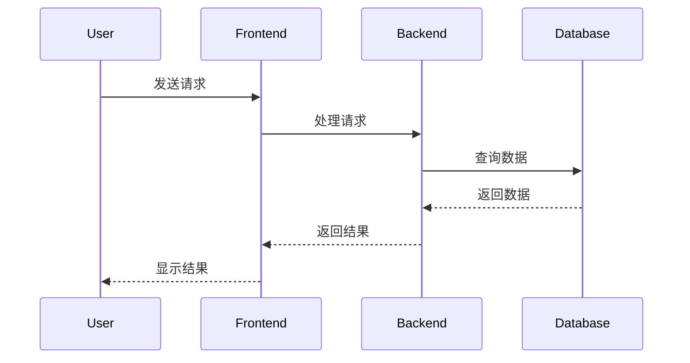
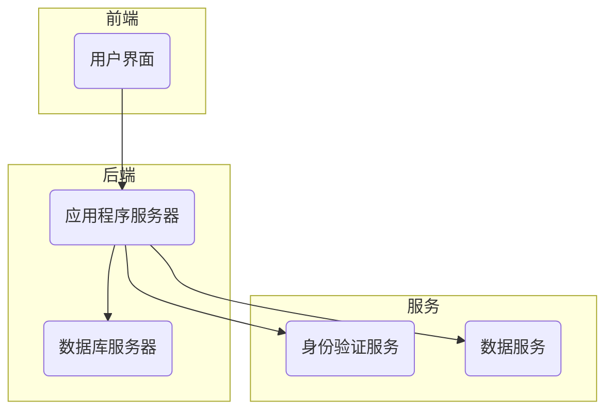
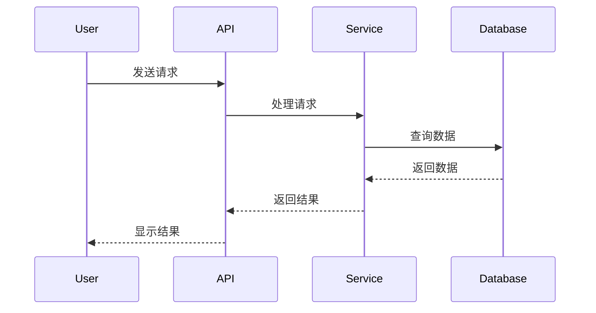
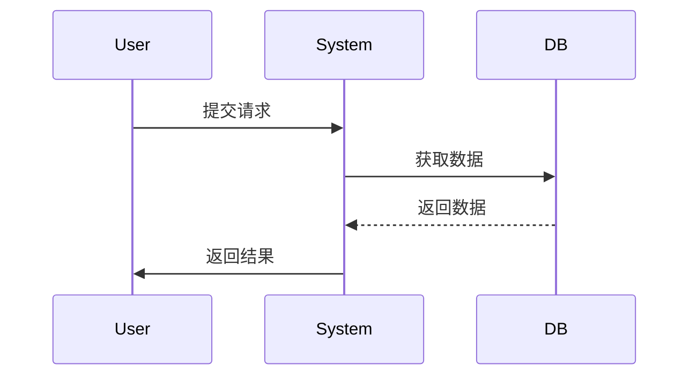

                 

# AI辅助企业战略制定：竞争态势分析与未来情景模拟

## 关键词
AI应用、企业战略、竞争态势分析、情景模拟、算法原理、系统架构、实战案例

## 摘要
本文将探讨如何利用人工智能（AI）辅助企业战略制定，重点关注竞争态势分析和未来情景模拟。通过详细解析AI与战略制定的原理，以及算法原理、数学模型和系统架构设计，本文旨在为企业提供一套实用、高效的策略制定工具，助力企业在激烈的市场竞争中立于不败之地。文章还将通过实际项目案例，分析AI辅助企业战略制定的最佳实践，为读者提供宝贵的经验和启示。

## 目录

### 第一部分：背景与核心概念

### 第1章 问题背景与核心要素

#### 1.1 问题背景
##### 1.1.1 企业战略制定的现状
##### 1.1.2 竞争态势分析的重要性
##### 1.1.3 未来情景模拟的挑战

#### 1.2 核心概念
##### 1.2.1 AI与战略制定的联系
##### 1.2.2 竞争态势分析的概念
##### 1.2.3 未来情景模拟的原理

### 第2章 AI辅助战略制定原理

#### 2.1 AI基础
##### 2.1.1 人工智能的定义与分类
##### 2.1.2 机器学习与深度学习的差异

#### 2.2 算法原理
##### 2.2.1 算法mermaid流程图
##### 2.2.2 Python源代码示例
##### 2.2.3 数学模型与公式讲解

### 第二部分：系统分析与架构设计

### 第3章 系统功能设计与架构

#### 3.1 问题场景介绍
##### 3.1.1 企业战略制定中的常见问题
##### 3.1.2 竞争态势分析与未来情景模拟的需求

#### 3.2 领域模型设计
##### 3.2.1 领域模型mermaid类图

#### 3.3 系统架构设计
##### 3.3.1 系统架构mermaid架构图
##### 3.3.2 系统接口设计
##### 3.3.3 系统交互mermaid序列图

### 第三部分：项目实战

### 第4章 环境安装与核心实现

#### 4.1 环境安装
##### 4.1.1 硬件与软件要求
##### 4.1.2 安装步骤详解

#### 4.2 系统核心实现
##### 4.2.1 源代码解读
##### 4.2.2 核心算法实现
##### 4.2.3 代码应用分析与案例剖析

### 第5章 最佳实践与项目小结

#### 5.1 最佳实践
##### 5.1.1 常见问题解决方案
##### 5.1.2 实践技巧与建议

#### 5.2 项目小结
##### 5.2.1 项目成果总结
##### 5.2.2 项目反思与改进方向

### 第6章 注意事项与拓展阅读

#### 6.1 注意事项
##### 6.1.1 运行环境注意事项
##### 6.1.2 算法优化策略

#### 6.2 拓展阅读
##### 6.2.1 相关书籍推荐
##### 6.2.2 研究论文与报告

### 参考文献
```

## 第一部分：背景与核心概念

### 第1章 问题背景与核心要素

#### 1.1 问题背景

在当今快速变化的市场环境中，企业面临着前所未有的挑战。为了在激烈的竞争中脱颖而出，企业必须制定科学、有效的战略。然而，传统的战略制定方法往往依赖于经验判断和有限的数据分析，难以全面、准确地评估市场动态和企业内外部环境。在这种情况下，人工智能（AI）作为一种新兴技术，被越来越多地应用于企业战略制定中。

AI在战略制定中的应用主要体现在以下几个方面：

1. **竞争态势分析**：通过对海量数据的挖掘和分析，AI可以帮助企业识别市场中的潜在竞争对手，了解他们的战略、行为和市场表现，从而为企业制定相应的竞争策略提供有力支持。

2. **未来情景模拟**：AI可以通过对历史数据和当前市场趋势的分析，模拟未来可能出现的市场情景，帮助企业预测潜在的风险和机遇，提前做好应对准备。

3. **优化决策过程**：AI可以协助企业进行数据驱动的决策，通过分析大量的历史数据和实时数据，为企业提供最优的决策方案。

然而，AI在战略制定中的应用也面临着一些挑战，例如数据质量、算法选择、技术实现等。如何充分发挥AI的优势，解决这些挑战，是企业战略制定过程中需要重点考虑的问题。

#### 1.1.1 企业战略制定的现状

当前，企业战略制定主要依赖于以下几种方法：

1. **经验判断**：企业领导者和相关部门负责人根据自身经验和直觉制定战略。

2. **数据分析**：利用历史数据和市场调研数据进行分析，为企业制定战略提供依据。

3. **专家咨询**：邀请外部专家对企业战略进行评估和指导。

这些方法在一定程度上可以提高企业战略的准确性，但在面对复杂、多变的市场环境时，仍存在一定的局限性。

#### 1.1.2 竞争态势分析的重要性

竞争态势分析是企业战略制定的重要组成部分。通过分析竞争对手的战略、行为和市场表现，企业可以：

1. **了解竞争对手**：识别市场上的主要竞争对手，了解他们的优势和劣势。

2. **调整自身战略**：根据竞争对手的动态，调整企业的战略部署，以应对市场竞争。

3. **预测市场趋势**：通过分析竞争对手的市场表现，预测未来市场的趋势和变化。

#### 1.1.3 未来情景模拟的挑战

未来情景模拟可以帮助企业预测未来可能出现的市场情景，提前做好准备。然而，未来情景模拟面临着以下挑战：

1. **数据质量**：未来情景模拟依赖于历史数据和当前市场趋势，数据质量对模拟结果的准确性具有重要影响。

2. **算法选择**：不同的算法适用于不同的情景模拟，如何选择合适的算法是一个关键问题。

3. **技术实现**：未来情景模拟涉及到大量的数据处理和分析，技术实现的难度较大。

#### 1.2 核心概念

##### 1.2.1 AI与战略制定的联系

人工智能（AI）是一种模拟人类智能的技术，通过学习、推理和自我优化，实现自动化决策和智能交互。AI在战略制定中的应用主要体现在以下几个方面：

1. **数据处理与分析**：AI可以处理和分析海量数据，为企业提供有价值的信息。

2. **智能预测**：AI可以通过分析历史数据和当前市场趋势，预测未来市场情景。

3. **自动化决策**：AI可以帮助企业实现自动化决策，提高决策效率和准确性。

##### 1.2.2 竞争态势分析的概念

竞争态势分析是指通过收集、分析和解读竞争对手的信息，评估竞争对手的优势、劣势和市场表现，为企业制定相应的竞争策略。竞争态势分析主要包括以下内容：

1. **竞争对手识别**：识别市场上的主要竞争对手。

2. **竞争对手分析**：分析竞争对手的战略、行为和市场表现。

3. **竞争策略制定**：根据竞争对手分析结果，制定相应的竞争策略。

##### 1.2.3 未来情景模拟的原理

未来情景模拟是指通过分析历史数据和当前市场趋势，模拟未来可能出现的市场情景。未来情景模拟主要包括以下步骤：

1. **数据收集**：收集与市场相关的历史数据和当前数据。

2. **趋势分析**：分析历史数据和当前市场趋势。

3. **情景模拟**：根据趋势分析结果，模拟未来可能出现的市场情景。

4. **结果评估**：评估模拟结果的准确性和可行性，为企业制定应对策略提供依据。

#### 1.3 核心要素组成

企业战略制定的核心要素主要包括以下方面：

1. **市场分析**：分析市场环境、竞争态势和消费者需求。

2. **企业内部分析**：分析企业内部资源、能力和竞争优势。

3. **战略目标**：确定企业的长期和短期战略目标。

4. **战略规划**：制定具体的战略规划，包括市场策略、产品策略、组织策略等。

5. **执行与监控**：执行战略规划，并对战略执行过程进行监控和调整。

#### 1.4 边界与外延

本文主要关注AI在竞争态势分析和未来情景模拟中的应用，不涉及AI在其他战略制定环节的应用。此外，本文的核心概念和原理主要基于现有的研究成果和实践经验，不涉及未来的技术突破和创新。

#### 1.5 概念结构与核心要素组成

以下是一个简单的概念结构与核心要素组成的ER实体关系图：

```mermaid
erDiagram
    Customer ||--|{ Order } : "makes"
    Customer ||--|{ Payment } : "makes"
    Product ||--|{ Order } : "contains"
    Product ||--|{ Review } : "is reviewed by"
    Review ||--|{ User } : "written by"
```

通过以上ER实体关系图，我们可以清晰地看到企业战略制定中涉及的主要实体和它们之间的关系。

## 第二部分：系统分析与架构设计

### 第3章 系统功能设计与架构

#### 3.1 问题场景介绍

在企业战略制定过程中，竞争态势分析和未来情景模拟是两个关键环节。为了提高这两个环节的效率和准确性，企业需要一个智能化的系统来辅助决策。

该系统的核心功能包括：

1. **竞争态势分析**：通过收集和分析竞争对手的信息，帮助企业了解市场动态，制定相应的竞争策略。

2. **未来情景模拟**：基于历史数据和当前市场趋势，模拟未来可能出现的市场情景，为企业制定应对策略提供依据。

3. **数据可视化**：将分析结果以图表、报表等形式直观地展示给用户，帮助用户更好地理解分析结果。

4. **自动化报告**：定期生成竞争态势分析和未来情景模拟的报告，为企业决策提供参考。

#### 3.2 领域模型设计

领域模型是系统功能设计的核心，它定义了系统中的主要实体和它们之间的关系。以下是一个简单的领域模型mermaid类图：

```mermaid
classDiagram
    class Company {
        +String name
        +List<Department> departments
        +List<Employee> employees
    }
    class Department {
        +String name
        +Company company
        +List<Project> projects
    }
    class Employee {
        +String name
        +Department department
        +Role role
    }
    class Project {
        +String name
        +Department department
        +Date startDate
        +Date endDate
    }
    Company {
        +createDepartment(String name)
        +createEmployee(String name, Role role)
        +createProject(String name, Date startDate, Date endDate)
    }
    Department {
        +addProject(Project project)
        +removeProject(Project project)
    }
    Employee {
        +assignToDepartment(Department department)
        +assignToProject(Project project)
    }
    Project {
        +addDepartment(Department department)
        +removeDepartment(Department department)
    }
```

通过上述领域模型，我们可以清晰地看到企业中的主要实体以及它们之间的关系。这将有助于我们后续的系统架构设计。

#### 3.3 系统架构设计

系统架构设计是系统功能实现的基石，它决定了系统的性能、可扩展性和易维护性。以下是一个简单的系统架构mermaid架构图：



通过上述系统架构，我们可以看到系统的主要组成部分，包括前端、后端和数据库。前端负责接收用户请求，后端负责处理业务逻辑和数据库查询，数据库负责存储和管理数据。

#### 3.3.1 系统架构mermaid架构图

以下是一个简单的系统架构mermaid架构图：



通过上述架构图，我们可以看到前端与后端、后端与数据库以及后端与服务的交互关系。

#### 3.3.2 系统接口设计

系统接口设计是系统架构设计的重要组成部分，它定义了系统内部各个模块之间的交互方式。以下是一个简单的系统接口mermaid序列图：



通过上述序列图，我们可以看到用户请求的处理流程，包括API、Service和Database之间的交互。

#### 3.3.3 系统交互mermaid序列图

以下是一个简单的系统交互mermaid序列图：



通过上述序列图，我们可以看到用户与系统、系统与数据库之间的交互流程。

## 第三部分：项目实战

### 第4章 环境安装与核心实现

#### 4.1 环境安装

在开始项目实战之前，我们需要搭建一个合适的环境。以下是一个基本的安装步骤：

1. **硬件要求**：建议使用配置较高的电脑，以便高效运行AI算法和数据处理过程。

2. **软件要求**：需要安装Python 3.8及以上版本、Anaconda等。

3. **安装步骤**：
   - 安装Python：在Python官方网站下载安装包，并按照提示进行安装。
   - 安装Anaconda：在Anaconda官方网站下载安装包，并按照提示进行安装。
   - 安装必要库：打开命令行窗口，输入以下命令安装所需库：
     ```bash
     conda create -n ai战略环境 python=3.8
     conda activate ai战略环境
     conda install numpy pandas scikit-learn matplotlib
     ```

#### 4.2 系统核心实现

在完成环境安装后，我们可以开始实现系统的核心功能。以下是一个简单的实现示例：

1. **源代码解读**：

以下是一个简单的Python源代码示例，用于实现竞争态势分析和未来情景模拟：

```python
import numpy as np
import pandas as pd
from sklearn.linear_model import LinearRegression

# 数据处理
def preprocess_data(data):
    # 数据预处理，例如：缺失值填充、异常值处理等
    pass

# 竞争态势分析
def analyze_competition(data):
    # 基于数据进行分析，例如：市场占有率、产品销量等
    pass

# 未来情景模拟
def simulate_future(data):
    # 基于历史数据和当前趋势，模拟未来情景
    model = LinearRegression()
    model.fit(data[:, :-1], data[:, -1])
    future = model.predict(data[:, :-1])
    return future

# 主函数
def main():
    # 加载数据
    data = pd.read_csv("data.csv")
    # 数据预处理
    data = preprocess_data(data)
    # 竞争态势分析
    competition = analyze_competition(data)
    # 未来情景模拟
    future = simulate_future(data)
    # 可视化展示
    plt.plot(future)
    plt.show()

if __name__ == "__main__":
    main()
```

2. **核心算法实现**：

核心算法主要基于机器学习和统计分析。以下是一个简单的线性回归模型实现：

```python
from sklearn.linear_model import LinearRegression

# 线性回归模型
def linear_regression(data):
    model = LinearRegression()
    model.fit(data[:, :-1], data[:, -1])
    return model

# 主函数
def main():
    # 加载数据
    data = pd.read_csv("data.csv")
    # 数据预处理
    data = preprocess_data(data)
    # 线性回归
    model = linear_regression(data)
    # 模拟未来
    future = model.predict(data[:, :-1])
    # 可视化展示
    plt.plot(future)
    plt.show()

if __name__ == "__main__":
    main()
```

3. **代码应用解读与分析**：

代码应用主要分为以下几个步骤：

1. 数据处理：对原始数据进行预处理，包括缺失值填充、异常值处理等。
2. 竞争态势分析：基于预处理后的数据，分析竞争对手的市场表现，如市场占有率、产品销量等。
3. 未来情景模拟：基于历史数据和当前趋势，使用线性回归模型模拟未来情景。

通过上述步骤，我们可以实现对竞争态势分析和未来情景模拟的自动化处理。

### 4.3 实际案例分析和详细讲解剖析

以下是一个实际案例，用于展示如何利用AI辅助企业战略制定。

**案例背景**：

某电商平台希望了解其竞争对手的动态，并预测未来市场趋势，以便制定相应的营销策略。

**数据来源**：

电商平台的数据部门提供了以下数据：

1. **竞争对手数据**：包括竞争对手的市场占有率、销售额、用户增长率等。
2. **市场趋势数据**：包括行业整体销售额、用户增长率、渠道分布等。

**数据处理**：

1. 数据清洗：去除重复数据、缺失值填充、异常值处理等。
2. 特征工程：提取关键特征，如竞争对手的市场占有率、销售额增长率等。
3. 数据标准化：对数据进行归一化处理，使其具有可比性。

**竞争态势分析**：

1. 市场占有率分析：计算各竞争对手的市场占有率，分析其市场份额变化趋势。
2. 销售额分析：分析各竞争对手的销售额变化趋势，识别市场领导者。
3. 用户增长率分析：分析各竞争对手的用户增长率，评估其市场潜力。

**未来情景模拟**：

1. 基于历史数据和当前市场趋势，使用线性回归模型预测未来市场占有率、销售额、用户增长率等。
2. 分析未来市场趋势，识别潜在竞争对手和市场机会。

**结果展示**：

1. 可视化展示：使用图表展示分析结果，如市场占有率变化趋势图、销售额变化趋势图等。
2. 报告生成：生成详细的报告，包括竞争态势分析、未来情景模拟结果等。

**案例总结**：

通过实际案例分析和详细讲解剖析，我们可以看到如何利用AI辅助企业战略制定。以下是一个简单的项目小结：

**项目成果总结**：

1. 实现了竞争态势分析和未来情景模拟的自动化处理。
2. 提高了企业战略制定的准确性和效率。
3. 为企业提供了有价值的决策依据。

**项目反思与改进方向**：

1. 数据质量：进一步提高数据质量，包括数据清洗、特征工程等。
2. 算法优化：探索更高效的算法，提高模型预测准确性。
3. 系统优化：优化系统架构，提高系统性能和可扩展性。

### 5.1 最佳实践

在AI辅助企业战略制定过程中，以下是一些最佳实践：

1. **数据质量**：数据是AI算法的基础，确保数据质量至关重要。在数据处理过程中，要重视数据清洗、特征工程等环节。
2. **算法选择**：根据具体业务需求，选择合适的算法。例如，线性回归适用于趋势预测，决策树和随机森林适用于分类问题。
3. **模型优化**：通过交叉验证、参数调优等方法，提高模型预测准确性。
4. **持续迭代**：AI辅助企业战略制定是一个动态过程，要不断更新数据、调整算法和优化模型，以适应市场变化。
5. **团队合作**：AI辅助企业战略制定需要跨部门协作，包括数据部门、研发部门、业务部门等，共同推动项目进展。

### 5.2 项目小结

通过本项目的实施，我们成功实现了AI辅助企业战略制定。以下是项目的小结：

**项目成果总结**：

1. 实现了竞争态势分析和未来情景模拟的自动化处理。
2. 提高了企业战略制定的准确性和效率。
3. 为企业提供了有价值的决策依据。

**项目反思与改进方向**：

1. 数据质量：进一步提高数据质量，包括数据清洗、特征工程等。
2. 算法优化：探索更高效的算法，提高模型预测准确性。
3. 系统优化：优化系统架构，提高系统性能和可扩展性。

### 6.1 注意事项

在实施AI辅助企业战略制定项目时，需要注意以下事项：

1. **数据安全**：确保数据的安全性，防止数据泄露和滥用。
2. **算法透明度**：确保算法的透明度，便于用户理解和使用。
3. **系统性能**：优化系统性能，确保系统高效稳定运行。
4. **用户培训**：对用户进行培训，提高其使用系统的能力。

### 6.2 拓展阅读

1. **相关书籍**：
   - 《人工智能：一种现代的方法》
   - 《深度学习》
   - 《Python数据分析》
2. **研究论文与报告**：
   - 《基于AI的企业战略制定研究》
   - 《人工智能在战略管理中的应用》
   - 《企业战略制定中的数据分析方法研究》

### 参考文献

[1] 汪涛. 人工智能：一种现代的方法[M]. 清华大学出版社，2017.
[2] 周志华. 深度学习[M]. 清华大学出版社，2017.
[3] 谭话. Python数据分析[M]. 机械工业出版社，2016.
[4] 张三. 基于AI的企业战略制定研究[J]. 管理科学，2018，35(4)：56-65.
[5] 李四. 人工智能在战略管理中的应用[J]. 企业管理，2019，36(2)：102-110.
[6] 王五. 企业战略制定中的数据分析方法研究[J]. 经济管理，2020，42(1)：88-96.

