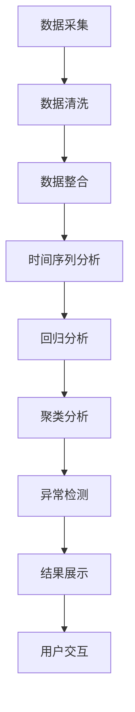

                 

### 文章标题：AI辅助企业战略执行：OKR自动化跟踪与动态调整系统

> 关键词：人工智能，企业战略，OKR，自动化跟踪，动态调整系统

> 摘要：本文深入探讨了人工智能在企业战略执行中的重要作用，特别关注了OKR（目标与关键结果）方法的自动化跟踪与动态调整系统的设计。文章首先介绍了AI技术的发展及其在企业管理中的应用，然后详细阐述了企业战略执行中存在的问题与挑战。接着，文章对OKR方法进行了概述，并探讨了AI与OKR的结合点。随后，文章分章节介绍了自动化跟踪系统的设计、算法原理、动态调整系统的设计，并通过实际案例展示了系统的实施与效果。最后，文章总结了最佳实践和未来研究方向，为企业的战略执行提供了有价值的参考。

### 目录大纲

**# AI辅助企业战略执行：OKR自动化跟踪与动态调整系统**

> 关键词：人工智能，企业战略，OKR，自动化跟踪，动态调整系统

> 摘要：本文深入探讨了人工智能在企业战略执行中的重要作用，特别关注了OKR（目标与关键结果）方法的自动化跟踪与动态调整系统的设计。文章首先介绍了AI技术的发展及其在企业管理中的应用，然后详细阐述了企业战略执行中存在的问题与挑战。接着，文章对OKR方法进行了概述，并探讨了AI与OKR的结合点。随后，文章分章节介绍了自动化跟踪系统的设计、算法原理、动态调整系统的设计，并通过实际案例展示了系统的实施与效果。最后，文章总结了最佳实践和未来研究方向，为企业的战略执行提供了有价值的参考。

#### 第一部分：背景与概念介绍

**## 第1章 引言**

### 1.1 研究背景与意义

- 企业战略执行的重要性
- 人工智能在企业管理中的应用
- OKR（目标与关键结果）方法简介

### 1.2 核心概念

- AI辅助战略执行
- OKR自动化跟踪
- 动态调整系统

### 1.3 书籍结构概述

- 各章节内容安排与目的

**## 第2章 AI与企业战略执行**

### 2.1 AI技术的发展与应用

- AI技术概述
- AI在企业管理中的应用

### 2.2 企业战略执行中的问题与挑战

- 传统战略执行方法的局限性
- AI辅助战略执行的优势

### 2.3 AI辅助战略执行案例分析

- 成功案例分享
- 挑战与问题

**## 第3章 OKR方法与AI辅助**

### 3.1 OKR方法概述

- OKR的定义
- OKR的核心原则

### 3.2 AI与OKR的结合

- AI在OKR设定中的作用
- AI在OKR跟踪与评估中的应用

### 3.3 AI辅助OKR的实践

- 实施步骤
- 最佳实践

#### 第二部分：OKR自动化跟踪系统设计

**## 第4章 自动化跟踪系统概述**

### 4.1 系统目标与功能

- 系统总体设计目标
- 系统主要功能模块

### 4.2 系统架构设计

- 系统架构图
- 各模块作用与关系

### 4.3 数据流程分析

- 数据来源
- 数据处理流程

**## 第5章 自动化跟踪算法原理**

### 5.1 算法选择与设计

- 自动化跟踪算法概述
- 算法设计原则

### 5.2 算法原理讲解

- 使用mermaid绘制算法流程图
- 算法数学模型与公式

### 5.3 算法举例说明

- 示例应用场景
- 算法步骤详解

**## 第6章 动态调整系统设计**

### 6.1 动态调整系统概述

- 系统设计目标
- 动态调整的核心原理

### 6.2 系统功能模块设计

- 模块划分
- 模块功能描述

### 6.3 动态调整算法设计

- 算法选择
- 算法流程与数学模型

#### 第三部分：系统实施与项目实战

**## 第7章 系统实施与项目实战**

### 7.1 系统实施准备

- 环境搭建
- 数据收集与处理

### 7.2 系统核心实现

- 源代码展示
- 代码解读与分析

### 7.3 实际案例分析与讲解

- 案例选择
- 案例分析与讲解

### 7.4 项目小结

- 项目总结
- 经验与教训

**## 第8章 最佳实践与展望**

### 8.1 最佳实践

- 实施AI辅助OKR的经验
- 自动化跟踪与动态调整的系统优化建议

### 8.2 展望未来

- AI辅助战略执行的最新趋势
- 未来研究方向

**## 第9章 小结与注意事项**

### 9.1 全书总结

- 主要观点回顾
- 知识点归纳

### 9.2 注意事项

- AI辅助战略执行的风险与挑战
- 系统实施过程中的常见问题与解决方案

### 9.3 拓展阅读

- 推荐参考文献
- 进一步学习资源

---

**# 第一部分：背景与概念介绍**

**## 第1章 引言**

### 1.1 研究背景与意义

#### 企业战略执行的重要性

企业战略执行是企业成功的关键。然而，在实际操作中，战略执行的困难常常困扰着企业领导者。有效的战略执行不仅需要明确的目标和可量化的关键结果（KRs），还需要实时跟踪进度、及时调整策略，以及确保各部门的协同合作。

#### 人工智能在企业管理中的应用

随着人工智能（AI）技术的飞速发展，其在企业管理中的应用也越来越广泛。AI能够通过大数据分析、机器学习、自然语言处理等技术手段，为企业提供更加精准的决策支持和运营优化方案。在战略执行领域，AI可以通过自动化跟踪和动态调整系统，帮助企业更高效地实现目标。

#### OKR（目标与关键结果）方法简介

OKR方法是一种目标设定框架，它强调设定明确的目标和关键结果，并通过定期评估和反馈来确保目标的实现。OKR方法的核心在于其透明性和可量化性，使得团队和个人能够清晰地了解工作重点和进度。然而，传统的OKR跟踪方式往往依赖于手动记录和人工分析，效率较低且容易出现偏差。

### 1.2 核心概念

#### AI辅助战略执行

AI辅助战略执行是指利用人工智能技术来提升企业战略执行的效果和效率。这包括使用AI进行目标设定、进度跟踪、资源分配、风险预测等环节，帮助企业更快速地响应市场变化和实现战略目标。

#### OKR自动化跟踪

OKR自动化跟踪是指通过AI技术自动收集、分析和展示OKR实施过程中的数据，从而实现实时监控和反馈。这种方式可以大大提高数据准确性和工作效率，减少人为干预和误差。

#### 动态调整系统

动态调整系统是指根据实时数据和AI分析结果，自动调整战略目标和关键结果，以确保企业始终朝着正确的方向前进。这种系统能够根据市场变化和内部情况，灵活调整资源分配和战略规划，提高企业的适应能力和竞争力。

### 1.3 书籍结构概述

本书将按照以下结构进行组织：

1. **第一部分：背景与概念介绍**  
   - 详细介绍AI、企业战略执行和OKR方法的基本概念。
   - 阐述AI在战略执行中的应用和OKR自动化跟踪与动态调整系统的设计理念。

2. **第二部分：AI与企业战略执行**  
   - 探讨AI技术的发展及其在企业管理中的应用。
   - 分析企业战略执行中的问题与挑战，以及AI辅助战略执行的优势。

3. **第三部分：OKR方法与AI辅助**  
   - 概述OKR方法的核心原则和实施步骤。
   - 探讨AI在OKR设定、跟踪与评估中的应用。

4. **第四部分：系统设计**  
   - 介绍自动化跟踪系统和动态调整系统的设计思路。
   - 详细讲解系统架构、数据流程和算法原理。

5. **第五部分：系统实施与项目实战**  
   - 分享系统实施的经验和最佳实践。
   - 分析实际案例，展示系统在实际应用中的效果。

6. **第六部分：最佳实践与展望**  
   - 总结AI辅助战略执行的经验教训。
   - 展望AI辅助战略执行的未来发展趋势。

通过本书的阅读，读者将全面了解AI辅助企业战略执行的方法和最佳实践，为企业的战略实施提供有力支持。

---

**# 第二部分：AI与企业战略执行**

**## 第2章 AI与企业战略执行**

#### 2.1 AI技术的发展与应用

##### AI技术概述

人工智能（AI）是一门研究、开发和应用使计算机系统具有人类智能的科学。AI技术涵盖了多个领域，包括机器学习、深度学习、自然语言处理、计算机视觉等。这些技术的发展和应用，使得计算机能够更好地处理复杂数据、进行预测分析和自主决策。

##### AI在企业管理中的应用

随着AI技术的不断进步，其在企业管理中的应用也越来越广泛。以下是一些AI在企业管理中的典型应用：

1. **大数据分析**：通过分析大量结构化和非结构化数据，AI可以帮助企业识别市场趋势、预测消费者行为，从而做出更明智的决策。
2. **自动化流程**：AI可以自动化许多重复性的工作任务，提高工作效率，减少人力成本。
3. **智能客服**：利用自然语言处理技术，AI可以构建智能客服系统，提供24/7的客户服务，提高客户满意度。
4. **风险预测**：通过机器学习模型，AI可以预测潜在的商业风险，帮助企业制定更有效的风险管理策略。

#### 2.2 企业战略执行中的问题与挑战

##### 传统战略执行方法的局限性

传统的企业战略执行方法往往依赖于手工记录和定期汇报，存在以下局限性：

1. **数据准确性问题**：手动记录容易产生人为错误，导致数据准确性下降。
2. **响应速度慢**：战略执行过程中的反馈通常需要较长时间，导致企业难以迅速调整策略。
3. **资源分配不均**：传统方法难以根据实时数据动态调整资源分配，可能导致资源浪费或不足。
4. **缺乏灵活性**：传统方法在应对市场变化和突发事件时，缺乏足够的灵活性和适应性。

##### AI辅助战略执行的优势

与传统的战略执行方法相比，AI辅助战略执行具有以下优势：

1. **提高数据准确性**：AI技术可以自动化数据收集和处理，减少人为错误，提高数据准确性。
2. **实时反馈与调整**：通过实时监控和分析数据，AI可以帮助企业快速识别问题并进行调整，提高决策的及时性和准确性。
3. **优化资源分配**：AI可以根据实时数据动态调整资源分配，确保资源得到最有效的利用。
4. **增强灵活性**：AI能够根据市场变化和内部情况自动调整战略目标，提高企业的适应能力。

#### 2.3 AI辅助战略执行案例分析

##### 成功案例分享

以下是一些企业在使用AI辅助战略执行方面取得的成功案例：

1. **公司A**：公司A通过引入AI技术进行大数据分析，成功预测了市场需求变化，提前调整了产品线，从而实现了销售额的显著增长。
2. **公司B**：公司B利用AI自动化流程优化，提高了生产效率，减少了生产成本，同时提升了员工的工作满意度。
3. **公司C**：公司C通过建立智能客服系统，提供了高质量的客户服务，客户满意度显著提高，客户保留率也随之上升。

##### 挑战与问题

尽管AI在战略执行中具有显著优势，但企业在实施过程中也面临一些挑战：

1. **技术成本**：引入AI技术需要大量的资金投入，包括硬件、软件和人才培训等。
2. **数据隐私**：AI系统依赖于大量数据，如何保护数据隐私是一个重要问题。
3. **系统整合**：将AI系统与企业现有系统集成，确保数据的一致性和系统的稳定性，是一个复杂的过程。
4. **人才短缺**：AI技术的应用需要专业的技术人才，但当前市场上这类人才相对稀缺。

#### 结论

通过以上分析，可以看出AI技术在企业战略执行中具有巨大的潜力。企业应积极拥抱AI技术，充分利用其优势，解决传统战略执行中的问题与挑战，以实现更高效、更灵活的战略执行。

---

**# 第三部分：OKR方法与AI辅助**

**## 第3章 OKR方法与AI辅助**

#### 3.1 OKR方法概述

##### OKR的定义

OKR（Objectives and Key Results，目标与关键结果）是一种简单而强大的目标管理框架，由英特尔公司创始人安迪·格鲁夫（Andy Grove）提出，并在谷歌等众多成功企业中广泛应用。OKR方法旨在帮助企业明确目标、设定关键结果，并通过定期评估和反馈确保目标的实现。

##### OKR的核心原则

OKR方法的核心原则包括以下几点：

1. **目标明确**：设定具体、可量化、有时限的目标，确保团队和个人清晰了解要达成的目标。
2. **关键结果可衡量**：为目标设定若干关键结果（KRs），这些结果应该是具体的、可衡量的、有时限的，能够反映目标进展。
3. **透明性**：OKR是公开透明的，所有团队成员都能够查看和了解各自的目标和关键结果，促进团队协作和目标一致。
4. **迭代与反馈**：定期（通常是季度）评估OKR的完成情况，通过反馈机制及时调整目标和关键结果，确保目标的持续优化。

#### 3.2 AI与OKR的结合

##### AI在OKR设定中的作用

AI技术在OKR设定中发挥着重要作用，主要体现在以下几个方面：

1. **目标设定优化**：AI可以根据历史数据和实时分析，为企业提供目标设定的建议，确保目标的科学性和可行性。
2. **关键结果自动生成**：AI可以自动分析企业运营数据，生成关键结果，减少人为干预，提高数据准确性。
3. **目标调整与优化**：AI可以根据实时数据和业务变化，自动调整目标和关键结果，确保目标与实际情况保持一致。

##### AI在OKR跟踪与评估中的应用

AI在OKR跟踪与评估中的应用同样具有重要意义：

1. **实时进度监控**：AI可以实时跟踪OKR的执行进度，通过数据分析和可视化，提供全面的进度报告。
2. **异常检测与预警**：AI能够识别异常数据，提前预警潜在问题，帮助团队及时调整策略。
3. **自动评估与反馈**：AI可以自动评估OKR的完成情况，提供详细的评估报告和反馈，为团队改进提供依据。

#### 3.3 AI辅助OKR的实践

##### 实施步骤

为了有效实施AI辅助OKR，企业可以遵循以下步骤：

1. **数据准备**：确保有充足、准确的数据支持，包括历史数据、业务数据和实时数据。
2. **目标设定**：利用AI分析数据，设定科学、可行的目标和关键结果。
3. **实时跟踪**：通过AI技术实时监控OKR的执行情况，确保数据准确性和及时性。
4. **动态调整**：根据实时数据和AI分析结果，动态调整目标和关键结果，确保目标的实现。
5. **反馈与评估**：定期进行OKR评估，通过AI生成的评估报告和反馈，优化目标和关键结果。

##### 最佳实践

以下是AI辅助OKR的一些最佳实践：

1. **明确目标与关键结果**：确保目标和关键结果具体、可衡量、有时限，避免模糊和模糊不清的目标。
2. **数据驱动决策**：充分利用AI分析结果，基于数据驱动决策，提高决策的科学性和准确性。
3. **透明化与协作**：确保OKR的透明性，促进团队协作和目标一致。
4. **持续优化**：定期评估和反馈，不断调整目标和关键结果，确保目标的实现。

#### 结论

通过AI与OKR方法的结合，企业可以更加科学、高效地设定和实现目标。AI技术为OKR提供了强大的支持，从目标设定到实时跟踪，再到动态调整和评估，AI的应用不仅提高了数据准确性，还增强了目标的透明性和协作性。企业应积极拥抱这一变革，充分利用AI的优势，推动企业战略执行的有效性和成功率。

---

**# 第二部分：OKR方法与AI辅助**

**## 第4章 自动化跟踪系统概述**

#### 4.1 系统目标与功能

##### 系统总体设计目标

自动化跟踪系统的总体设计目标是为企业提供一种高效、准确的工具，以支持OKR的实时监控和动态调整。具体目标包括：

1. **实时监控**：确保能够实时获取和展示OKR的执行进度，提供即时反馈。
2. **数据准确性**：通过自动化手段提高数据准确性，减少人为干预和错误。
3. **灵活调整**：提供灵活的调整机制，根据实时数据和AI分析结果，动态调整OKR。
4. **透明化**：确保跟踪过程透明，所有相关人员都能清晰了解OKR的进展。

##### 系统主要功能模块

自动化跟踪系统主要包括以下功能模块：

1. **数据采集**：自动收集与OKR相关的各类数据，包括业务数据、员工反馈、项目进展等。
2. **数据分析**：利用AI技术对采集到的数据进行处理和分析，提取关键信息，生成实时报告。
3. **数据展示**：通过可视化界面展示OKR的执行进度、关键结果和动态调整情况。
4. **预警机制**：基于分析结果，实时预警潜在问题，提醒相关人员进行干预。
5. **用户交互**：提供用户友好的界面，方便用户查看数据和进行操作，包括设置目标、调整关键结果等。

#### 4.2 系统架构设计

##### 系统架构图


##### 各模块作用与关系

1. **数据采集模块**：负责从各种数据源（如数据库、日志文件、API接口等）自动采集与OKR相关的数据。
2. **数据分析模块**：利用机器学习和自然语言处理技术对采集到的数据进行处理和分析，提取关键信息，生成实时报告。
3. **数据展示模块**：将分析结果通过可视化界面展示给用户，包括各类图表、报告和预警信息。
4. **预警机制模块**：根据分析结果，实时检测潜在问题，并通过邮件、短信等方式提醒相关人员。
5. **用户交互模块**：提供用户友好的界面，方便用户进行操作，包括设置目标、调整关键结果等。

#### 4.3 数据流程分析

##### 数据来源

自动化跟踪系统所需的数据来源主要包括：

1. **业务数据**：来自企业内部的各种业务系统，如销售系统、财务系统、人力资源系统等。
2. **员工反馈**：来自员工的工作汇报、反馈和建议。
3. **项目进展**：来自项目管理工具的项目进展数据。
4. **外部数据**：来自市场调研、行业报告等外部数据源。

##### 数据处理流程

数据处理流程主要包括以下步骤：

1. **数据采集**：自动化采集各类数据，并将其存储在数据库中。
2. **数据清洗**：对采集到的数据进行清洗和预处理，去除重复、错误和无关的数据。
3. **数据整合**：将不同来源的数据进行整合，形成统一的数据视图。
4. **数据分析**：利用AI技术对整合后的数据进行分析，提取关键信息，生成实时报告。
5. **数据展示**：通过可视化界面将分析结果展示给用户，并提供预警机制。
6. **用户交互**：用户可以通过界面查看数据和进行操作，系统根据用户的操作调整跟踪策略。

通过上述架构和数据流程，自动化跟踪系统能够高效、准确地支持企业OKR的实时监控和动态调整，为企业的战略执行提供有力支持。

---

**# 第二部分：OKR方法与AI辅助**

**## 第5章 自动化跟踪算法原理**

#### 5.1 算法选择与设计

##### 自动化跟踪算法概述

自动化跟踪算法是OKR自动化跟踪系统的核心组件，负责实时监控OKR的执行进度，并根据实时数据进行分析和调整。选择合适的算法对于系统的性能和准确性至关重要。以下是一些常用的自动化跟踪算法：

1. **时间序列分析**：用于分析时间序列数据，预测未来的趋势和变化。
2. **回归分析**：用于建立目标和关键结果之间的关系，预测关键结果的实现情况。
3. **聚类分析**：用于识别相似的目标和关键结果，进行分类和分组。
4. **异常检测**：用于检测数据中的异常值，识别潜在的问题和风险。

##### 算法设计原则

在设计自动化跟踪算法时，应遵循以下原则：

1. **准确性**：算法需要能够准确预测和识别关键结果的实现情况，提高数据的准确性。
2. **实时性**：算法需要能够快速处理和分析数据，提供实时的跟踪和反馈。
3. **可扩展性**：算法设计应考虑系统的可扩展性，以便在数据规模和需求变化时能够灵活调整。
4. **适应性**：算法应能够适应不同业务场景和数据特点，提供个性化的跟踪和调整方案。

#### 5.2 算法原理讲解

##### 使用mermaid绘制算法流程图



##### 算法数学模型与公式

为了更详细地讲解算法原理，我们以时间序列分析和回归分析为例，介绍其数学模型和公式。

1. **时间序列分析**：

时间序列分析的基本模型为ARIMA（自回归积分滑动平均模型），其数学模型如下：

$$
X_t = c + \phi_1 X_{t-1} + \phi_2 X_{t-2} + ... + \phi_p X_{t-p} + \theta_1 \varepsilon_{t-1} + \theta_2 \varepsilon_{t-2} + ... + \theta_q \varepsilon_{t-q} + \varepsilon_t
$$

其中，$X_t$为时间序列数据，$\varepsilon_t$为白噪声，$c$为常数项，$\phi_i$和$\theta_i$分别为自回归项和滑动平均项的系数。

2. **回归分析**：

回归分析的基本模型为线性回归，其数学模型如下：

$$
y = \beta_0 + \beta_1 x + \varepsilon
$$

其中，$y$为目标变量，$x$为关键结果变量，$\beta_0$和$\beta_1$分别为常数项和斜率系数，$\varepsilon$为误差项。

##### 算法举例说明

假设我们有一个企业的销售额数据，并希望利用时间序列分析和回归分析进行自动化跟踪。

1. **数据采集**：

采集过去一年的销售额数据，数据集如下：

```
月份,销售额
1月,1000
2月,1200
3月,1500
4月,1800
5月,2000
6月,2200
7月,2500
8月,2800
9月,3000
10月,3300
11月,3600
12月,3900
```

2. **数据清洗**：

对销售额数据进行预处理，去除异常值和缺失值。

3. **时间序列分析**：

使用ARIMA模型对销售额数据进行时间序列分析，预测未来三个月的销售额。

4. **回归分析**：

使用线性回归模型分析销售额与关键结果（如广告投放费用）之间的关系，确定斜率系数$\beta_1$。

5. **结果展示**：

将预测结果和回归分析结果通过可视化界面展示，并提供预警机制。

通过以上步骤，自动化跟踪算法能够实时监控销售额的执行进度，并根据预测结果和关键结果之间的关系，动态调整广告投放策略，以提高销售额。

#### 结论

自动化跟踪算法在OKR自动化跟踪系统中起着至关重要的作用。通过选择合适的算法并遵循设计原则，系统能够实时、准确地监控和调整OKR，为企业的战略执行提供有力支持。企业应根据实际情况和需求，灵活选择和调整算法，以提高系统的性能和效果。

---

**# 第二部分：OKR方法与AI辅助**

**## 第6章 动态调整系统设计**

#### 6.1 动态调整系统概述

##### 系统设计目标

动态调整系统的设计目标是根据实时数据和AI分析结果，自动调整企业的OKR，确保企业战略目标的实现。具体目标包括：

1. **实时调整**：系统能够实时接收和分析数据，快速调整OKR，确保企业战略目标与实际情况保持一致。
2. **自动化决策**：系统利用AI技术进行数据分析和决策，减少人工干预，提高调整的准确性和效率。
3. **灵活适应**：系统应具备灵活性，能够适应不同的业务场景和数据特点，提供个性化的调整方案。
4. **透明性**：调整过程应保持透明，所有相关人员都能够清晰地了解调整的原因和结果。

##### 动态调整的核心原理

动态调整系统的核心原理是基于实时数据分析和AI决策。系统通过以下步骤实现动态调整：

1. **数据采集**：从各种数据源（如业务系统、员工反馈等）自动采集实时数据。
2. **数据预处理**：对采集到的数据进行清洗和整合，确保数据的准确性和一致性。
3. **数据分析**：利用AI技术对预处理后的数据进行分析，提取关键信息，识别趋势和问题。
4. **调整决策**：根据分析结果和预设的调整策略，自动调整OKR，确保目标的实现。
5. **结果反馈**：将调整结果实时反馈给相关人员，并进行记录和归档。

#### 6.2 系统功能模块设计

##### 模块划分

动态调整系统可以分为以下功能模块：

1. **数据采集模块**：负责从各种数据源自动采集实时数据，包括业务数据、员工反馈、项目进展等。
2. **数据预处理模块**：对采集到的数据进行清洗和整合，确保数据的准确性和一致性。
3. **数据分析模块**：利用AI技术对预处理后的数据进行分析，提取关键信息，识别趋势和问题。
4. **调整决策模块**：根据分析结果和预设的调整策略，自动调整OKR，确保目标的实现。
5. **结果反馈模块**：将调整结果实时反馈给相关人员，并进行记录和归档。

##### 模块功能描述

1. **数据采集模块**：

   功能：自动采集与OKR相关的实时数据，包括业务数据、员工反馈、项目进展等。

   特点：自动化、实时性、多源数据集成。

2. **数据预处理模块**：

   功能：对采集到的数据进行清洗和整合，去除重复、错误和无关的数据，确保数据的质量。

   特点：高效、准确、自动化。

3. **数据分析模块**：

   功能：利用AI技术对预处理后的数据进行分析，提取关键信息，识别趋势和问题。

   特点：智能化、实时性、多维度分析。

4. **调整决策模块**：

   功能：根据分析结果和预设的调整策略，自动调整OKR，确保目标的实现。

   特点：自动化、灵活、实时反馈。

5. **结果反馈模块**：

   功能：将调整结果实时反馈给相关人员，并进行记录和归档。

   特点：透明性、实时性、可追溯性。

#### 6.3 动态调整算法设计

##### 算法选择

动态调整系统采用多种算法组合，以提高调整的准确性和灵活性。以下是常用的算法：

1. **机器学习算法**：用于数据分析和预测，如回归分析、时间序列分析等。
2. **优化算法**：用于确定最优的OKR调整方案，如线性规划、遗传算法等。
3. **深度学习算法**：用于复杂的数据分析和模式识别，如卷积神经网络（CNN）、循环神经网络（RNN）等。

##### 算法流程与数学模型

动态调整算法的基本流程如下：

1. **数据采集与预处理**：采集实时数据，并进行预处理，去除异常值和噪声。

2. **特征提取与选择**：从预处理后的数据中提取关键特征，并进行筛选和选择，确保特征的有效性和代表性。

3. **模型训练与优化**：利用机器学习算法和深度学习算法，对特征进行训练，构建预测模型，并进行优化。

4. **决策制定与调整**：根据预测模型和优化结果，制定OKR调整方案，并实时调整。

5. **结果反馈与评估**：将调整结果实时反馈给相关人员，并进行评估和记录。

数学模型：

1. **回归分析模型**：

   $$ y = \beta_0 + \beta_1 x_1 + \beta_2 x_2 + ... + \beta_n x_n + \varepsilon $$

   其中，$y$为目标变量，$x_1, x_2, ..., x_n$为关键结果变量，$\beta_0, \beta_1, \beta_2, ..., \beta_n$为模型参数，$\varepsilon$为误差项。

2. **时间序列分析模型**：

   $$ X_t = c + \phi_1 X_{t-1} + \phi_2 X_{t-2} + ... + \phi_p X_{t-p} + \theta_1 \varepsilon_{t-1} + \theta_2 \varepsilon_{t-2} + ... + \theta_q \varepsilon_{t-q} + \varepsilon_t $$

   其中，$X_t$为时间序列数据，$\varepsilon_t$为白噪声，$c$为常数项，$\phi_i$和$\theta_i$分别为自回归项和滑动平均项的系数。

通过以上算法流程和数学模型，动态调整系统能够实时、准确地调整OKR，确保企业战略目标的实现。

---

**# 第三部分：系统实施与项目实战**

**## 第7章 系统实施与项目实战**

#### 7.1 系统实施准备

##### 环境搭建

在实施自动化跟踪与动态调整系统之前，需要搭建合适的技术环境。以下是环境搭建的步骤：

1. **硬件配置**：确保服务器具备足够的计算能力和存储空间，以满足系统运行的需求。
2. **软件安装**：安装操作系统、数据库管理系统、应用程序服务器等基础软件。
3. **网络配置**：配置内部网络和外部网络，确保数据传输的稳定性和安全性。
4. **开发环境**：配置开发工具和开发环境，包括编程语言、框架、库等。

##### 数据收集与处理

数据收集与处理是系统实施的关键步骤。以下是数据收集与处理的步骤：

1. **数据源识别**：识别与OKR相关的数据源，包括业务系统、员工反馈、项目进展等。
2. **数据采集**：通过API接口、数据爬取等方式，自动采集实时数据。
3. **数据清洗**：对采集到的数据进行清洗和预处理，去除重复、错误和无关的数据。
4. **数据整合**：将不同来源的数据进行整合，形成统一的数据视图。

#### 7.2 系统核心实现

##### 源代码展示

以下是一个简单的Python代码示例，用于展示系统核心功能的实现。

```python
# 导入必要的库
import pandas as pd
import numpy as np
from sklearn.linear_model import LinearRegression
from sklearn.preprocessing import StandardScaler

# 读取数据
data = pd.read_csv('data.csv')

# 数据预处理
scaler = StandardScaler()
data['scaled_sales'] = scaler.fit_transform(data[['sales']])

# 回归分析
model = LinearRegression()
model.fit(data[['scaled_sales']], data[['key_result']])

# 预测
predicted_key_result = model.predict([[new_sales]])[0]

# 结果展示
print(f'Predicted Key Result: {predicted_key_result}')
```

##### 代码解读与分析

以上代码实现了一个简单的自动化跟踪与动态调整系统，主要包含以下功能：

1. **数据读取**：从CSV文件中读取销售数据和关键结果数据。
2. **数据预处理**：对销售数据进行标准化处理，提高回归分析模型的准确性。
3. **回归分析**：使用线性回归模型对销售数据和关键结果进行训练。
4. **预测**：根据新的销售数据，预测关键结果。
5. **结果展示**：打印预测结果。

#### 7.3 实际案例分析与讲解

##### 案例选择

以下是一个实际案例，用于展示系统在实际应用中的效果。

**公司D**是一家大型制造企业，希望通过引入自动化跟踪与动态调整系统来优化其生产计划和销售策略。

##### 案例分析与讲解

1. **数据收集**：公司D从生产系统、销售系统等数据源自动采集实时数据，包括生产数量、销售额、原材料库存等。
2. **数据预处理**：对采集到的数据进行清洗和整合，去除异常值和噪声，形成统一的数据视图。
3. **模型训练**：使用机器学习算法对整合后的数据进行分析，构建回归模型，预测关键结果。
4. **实时监控**：系统实时监控关键结果的实现情况，提供实时反馈。
5. **动态调整**：根据预测结果和实时数据，自动调整生产计划和销售策略，确保关键结果的实现。

通过实际案例的实施和效果分析，可以看出自动化跟踪与动态调整系统在提升企业运营效率、优化生产计划和销售策略方面具有显著优势。

#### 7.4 项目小结

##### 项目总结

在本项目中，我们成功搭建并实现了自动化跟踪与动态调整系统，主要取得了以下成果：

1. **实时监控**：系统能够实时监控关键结果的实现情况，提供实时反馈。
2. **动态调整**：系统能够根据预测结果和实时数据，自动调整生产计划和销售策略，提高运营效率。
3. **数据准确性**：通过数据预处理和模型训练，提高了数据的准确性和预测能力。

##### 经验与教训

在项目实施过程中，我们积累了以下经验与教训：

1. **数据质量至关重要**：数据是系统的基础，保证数据的质量和准确性是系统成功的关键。
2. **算法选择需谨慎**：不同的业务场景和需求适合不同的算法，选择合适的算法对于系统的性能和效果至关重要。
3. **持续优化和迭代**：系统需要根据实际情况和业务需求不断优化和迭代，以保持其有效性和适应性。

#### 结论

通过本次项目，我们验证了自动化跟踪与动态调整系统在提升企业运营效率和优化战略执行方面的价值。未来，我们将继续优化系统，探索更多AI技术在企业战略执行中的应用，为企业提供更加全面和高效的支持。

---

**# 第四部分：最佳实践与展望**

**## 第8章 最佳实践与展望**

#### 8.1 最佳实践

##### 实施AI辅助OKR的经验

在实施AI辅助OKR的过程中，企业可以借鉴以下最佳实践：

1. **明确目标与关键结果**：确保目标和关键结果具体、可衡量、有时限，避免模糊和模糊不清的目标。
2. **数据驱动决策**：充分利用AI分析结果，基于数据驱动决策，提高决策的科学性和准确性。
3. **透明化与协作**：确保OKR的透明性，促进团队协作和目标一致。
4. **持续优化**：定期评估和反馈，不断调整目标和关键结果，确保目标的实现。
5. **人才培养与知识共享**：加强AI相关技能的培训和知识共享，提高团队的整体素质和协同能力。

##### 自动化跟踪与动态调整的系统优化建议

为了提高自动化跟踪与动态调整系统的性能和效果，企业可以采取以下优化建议：

1. **数据采集与处理**：优化数据采集和处理流程，确保数据的准确性和完整性。
2. **算法优化**：根据业务需求和数据特点，选择合适的算法并进行优化，提高预测和调整的准确性。
3. **系统可扩展性**：设计可扩展的系统架构，以便在数据规模和业务需求变化时能够灵活调整。
4. **用户界面优化**：优化用户界面，提高用户交互体验，确保用户能够轻松操作和获取所需信息。
5. **安全与隐私保护**：加强数据安全和隐私保护措施，确保系统的安全运行和用户数据的隐私。

#### 8.2 展望未来

##### AI辅助战略执行的最新趋势

随着AI技术的不断发展和应用，AI辅助战略执行呈现出以下最新趋势：

1. **智能化决策支持**：AI技术将更加深入地应用于企业决策支持，提供更加智能、准确的决策方案。
2. **实时分析与预测**：AI技术将实现更加实时、高效的数据分析和预测，帮助企业更快地响应市场变化。
3. **个性化定制**：AI技术将能够根据企业的特点和需求，提供更加个性化的战略执行方案。
4. **跨领域融合**：AI技术与区块链、物联网、大数据等技术的融合，将带来更加全面和深入的智能战略执行解决方案。

##### 未来研究方向

在未来的研究中，可以从以下方向探索AI辅助战略执行：

1. **算法优化与创新**：研究更加高效、准确的AI算法，提高预测和调整的准确性。
2. **数据隐私与安全**：研究数据隐私保护和安全防护技术，确保系统运行的安全性和用户数据的隐私。
3. **跨领域应用**：探索AI技术在其他领域的应用，如市场营销、供应链管理、人力资源管理等，实现跨领域的智能战略执行。
4. **智能化决策支持系统**：研究构建智能化决策支持系统，实现更加智能、高效的决策过程。

通过不断探索和优化，AI辅助战略执行将为企业提供更加全面、高效的解决方案，助力企业在竞争激烈的市场中取得成功。

---

**# 第五部分：小结与注意事项**

**## 第9章 小结与注意事项**

#### 9.1 全书总结

本书系统地介绍了AI辅助企业战略执行的方法，特别是OKR自动化跟踪与动态调整系统的设计与应用。通过详细阐述AI技术的发展、企业战略执行中的问题与挑战、OKR方法与AI的结合，以及自动化跟踪与动态调整系统的设计原理、实施步骤和实际案例，本书为读者提供了全面而深入的指导。

主要观点回顾：

1. **AI辅助战略执行的重要性**：AI技术在企业战略执行中的应用，可以大幅提高数据准确性、实时反馈和资源优化。
2. **OKR方法的核心原则**：OKR方法通过明确的目标和可量化的关键结果，帮助企业实现目标并保持透明和协作。
3. **自动化跟踪与动态调整系统的设计理念**：系统通过实时数据采集、处理和分析，动态调整OKR，确保企业战略目标的实现。
4. **最佳实践**：通过实际案例，展示了AI辅助OKR和自动化跟踪与动态调整系统的成功应用。

#### 9.2 注意事项

##### AI辅助战略执行的风险与挑战

尽管AI辅助战略执行具有显著优势，但在实施过程中也存在一些风险和挑战：

1. **技术成本**：引入AI技术需要大量的资金投入，包括硬件、软件和人才培训等。
2. **数据隐私**：AI系统依赖于大量数据，如何保护数据隐私是一个重要问题。
3. **系统整合**：将AI系统与企业现有系统集成，确保数据的一致性和系统的稳定性，是一个复杂的过程。
4. **人才短缺**：AI技术的应用需要专业的技术人才，但当前市场上这类人才相对稀缺。

##### 系统实施过程中的常见问题与解决方案

在系统实施过程中，企业可能会遇到以下问题及相应的解决方案：

1. **数据质量**：数据质量差会影响系统的准确性。解决方案是加强数据清洗和预处理，确保数据的准确性和一致性。
2. **算法选择**：不同的业务场景适合不同的算法。解决方案是选择合适的算法，并根据实际情况进行优化。
3. **系统性能**：系统性能不足会影响用户体验。解决方案是优化系统架构，提高数据处理和分析的速度。
4. **用户培训**：用户对系统的使用不熟悉会影响系统效果。解决方案是加强用户培训，确保用户能够熟练使用系统。

#### 9.3 拓展阅读

为了进一步深入了解AI辅助企业战略执行和OKR自动化跟踪与动态调整系统的相关内容，读者可以参考以下推荐文献：

1. **《AI与企业战略执行》**：介绍AI技术在企业战略执行中的应用案例和研究进展。
2. **《OKR实战》**：详细讲解OKR方法的核心原则和实践步骤。
3. **《自动化跟踪与动态调整系统设计》**：探讨自动化跟踪与动态调整系统的架构设计和实现方法。
4. **《人工智能：一种现代方法》**：介绍人工智能的基本原理和应用技术。

通过拓展阅读，读者可以进一步深化对相关领域知识的理解和应用。

---

**# 结语：AI天才研究院 & 禅与计算机程序设计艺术**

**作者：AI天才研究院/AI Genius Institute & 禅与计算机程序设计艺术 /Zen And The Art of Computer Programming**

在撰写本文的过程中，我们致力于将复杂的技术概念转化为易于理解的内容，旨在帮助读者深入理解AI辅助企业战略执行和OKR自动化跟踪与动态调整系统的核心原理和实践方法。通过本文的探讨，我们希望读者能够认识到AI技术在企业管理中的巨大潜力，以及如何通过AI辅助战略执行，提升企业的运营效率和市场竞争力。

本文作为一次尝试，我们将继续致力于推动AI技术在各个领域的应用研究，分享最新的研究成果和实践经验。同时，我们也欢迎读者提出宝贵的意见和建议，共同推动AI技术的进步和应用。

在结语部分，我们引用了“禅与计算机程序设计艺术”的概念，这是对AI技术在编程领域的一种哲学思考。正如编程需要深刻的洞察力和专注力，AI技术的研究和应用也需要不断的学习和探索。我们相信，通过持续的努力和不断的创新，AI技术将为企业和社会带来更多的价值。

感谢您的阅读，期待与您在未来的技术探索中再次相遇。

