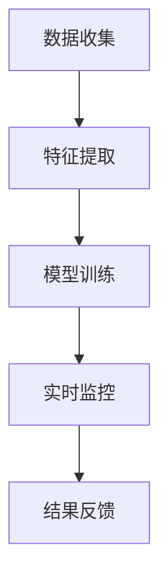
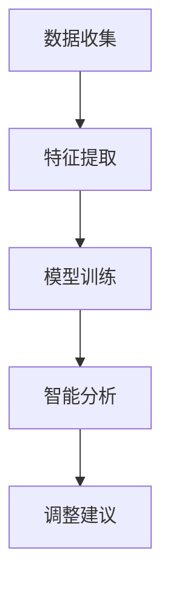
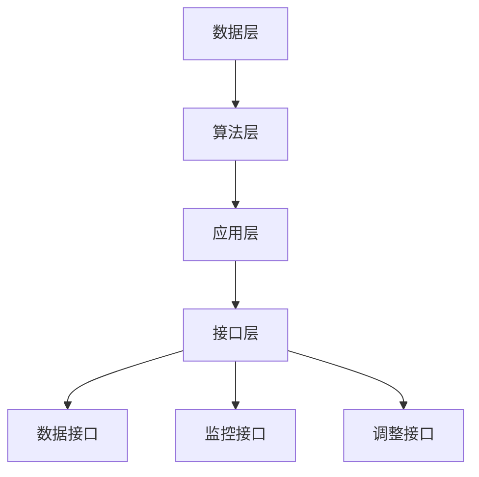

                 

## AI辅助企业战略执行：OKR自动化跟踪与调整

关键词：人工智能、企业战略、OKR、自动化跟踪、智能调整

摘要：本文将探讨如何利用人工智能（AI）技术辅助企业战略执行，特别是通过OKR（Objectives and Key Results）自动化跟踪与调整，实现高效的战略管理。本文将逐步分析AI与OKR的关系，自动化跟踪与智能调整算法的原理，并讨论实际应用中的关键点。

----------------------------------------------------------------

### 第一部分：背景介绍

随着全球商业环境的快速变化，企业面临着前所未有的挑战和机遇。在这种背景下，企业战略执行的成功与否，往往决定了企业的生死存亡。传统的战略执行方式，由于缺乏实时监控和快速响应能力，往往难以适应快速变化的市场环境。因此，寻找新的方法来提高战略执行的效率和效果，成为企业管理者和技术专家关注的焦点。

#### 问题背景

人工智能（AI）技术的快速发展，为解决传统战略执行中的问题提供了新的思路。AI不仅能够处理海量数据，还能通过学习从数据中提取有价值的信息，从而帮助企业在战略执行过程中做出更加明智的决策。特别是在目标设定、执行过程监控和策略调整等方面，AI技术具有显著的优势。

#### 问题提出

企业战略执行的挑战主要体现在以下几个方面：

1. **目标设定不明确**：企业常常面临目标设定不明确、模糊的问题，导致战略执行缺乏方向性。
2. **执行过程监控困难**：企业难以实时监控战略执行的过程，无法及时发现和解决问题。
3. **调整策略不及时**：市场环境变化快速，企业需要及时调整战略，但现有机制无法做到实时响应。

#### 解决方案

AI技术的引入为这些问题提供了可能的解决方案：

1. **目标智能设定**：利用AI技术，可以为企业提供智能化的目标设定建议，确保目标的明确性和可行性。
2. **执行过程智能监控**：通过AI技术，企业可以实现对战略执行过程的实时监控，及时发现并解决问题。
3. **调整策略智能优化**：AI技术可以帮助企业根据实时数据，智能调整战略，确保战略与市场环境保持一致。

#### 边界与外延

- **边界**：本文主要关注AI技术如何辅助企业战略执行，不涉及AI技术的研发与实现细节。
- **外延**：虽然本文重点在于AI辅助战略执行，但AI技术在企业中的其他应用场景，如自动化生产、智能客服等，也可作为拓展内容。

#### 核心概念与要素组成

1. **AI辅助企业战略执行**：指利用人工智能技术，帮助企业在战略执行过程中实现目标设定、过程监控和策略优化的过程。
2. **OKR（Objectives and Key Results）**：一种目标管理工具，通过明确的目标和关键结果，帮助企业和团队实现目标。
3. **自动化跟踪与调整**：利用AI技术，自动获取和分析数据，实时跟踪企业战略执行情况，并根据分析结果智能调整策略。

---

在理解了背景和问题后，接下来我们将深入探讨AI技术的原理及其在战略执行中的应用。

### 第二部分：核心概念与联系

#### 2.1 AI技术原理

##### 2.1.1 AI技术定义

AI（Artificial Intelligence，人工智能）是一种模拟人类智能的技术，使计算机系统能够执行通常需要人类智能才能完成的任务。它涉及计算机科学、统计学、认知科学等多个领域。

##### 2.1.2 AI技术特点

- **学习与适应能力**：AI系统能够通过学习和适应，提高任务执行的准确性。例如，通过训练，图像识别系统能够识别各种不同的物体。
- **自主决策能力**：AI系统可以基于数据自主做出决策，无需人类干预。例如，自动驾驶汽车可以通过传感器和环境数据自主导航。

##### 2.1.3 AI技术分类

- **机器学习**：通过算法让计算机从数据中学习，进行预测和决策。例如，线性回归、决策树等。
- **深度学习**：一种机器学习方法，通过模拟人脑神经网络进行学习。例如，卷积神经网络（CNN）、循环神经网络（RNN）等。

#### 2.2 OKR原理

##### 2.2.1 OKR定义

OKR（Objectives and Key Results，目标与关键结果）是一种目标管理工具，通过明确的目标和关键结果，帮助企业和团队实现目标。它由两个主要部分组成：**Objective（目标）**和**Key Results（关键结果）**。

##### 2.2.2 OKR特点

- **明确性**：目标明确，结果可量化。例如，“提高产品销量”是一个目标，“销售额增加20%”是一个关键结果。
- **灵活性**：允许目标在执行过程中进行动态调整。例如，如果市场环境发生变化，企业可以调整关键结果以适应新的情况。

##### 2.2.3 OKR组成部分

- **Objective（目标）**：设定一个具体、可衡量的目标。例如，“提升用户体验”。
- **Key Results（关键结果）**：确定衡量目标达成情况的具体指标。例如，“用户满意度评分提高10%”，“新用户注册量增加30%”。

#### 2.3 AI与OKR联系

##### 2.3.1 联系一：目标智能设定

利用AI技术，可以为企业提供智能化的目标设定建议。AI系统可以基于历史数据和业务逻辑，分析不同目标设定对业务的影响，从而提出最优的目标设定方案。

##### 2.3.2 联系二：过程智能监控

AI技术可以实时分析数据，监控战略执行过程中的关键结果。通过机器学习算法，AI系统可以识别异常情况，并为企业提供实时反馈，帮助企业在战略执行过程中及时调整。

##### 2.3.3 联系三：策略智能优化

AI技术可以根据实时监控的数据，智能调整战略。例如，通过深度学习算法，AI系统可以分析市场趋势和竞争对手行为，提出最优的调整策略，帮助企业保持竞争优势。

---

通过以上分析，我们可以看到AI技术如何与OKR相结合，为企业的战略执行提供有力支持。接下来，我们将深入探讨AI辅助战略执行的算法原理。

### 第三部分：算法原理讲解

#### 3.1 自动化跟踪算法

##### 3.1.1 算法定义

自动化跟踪算法是一种利用机器学习技术，对战略执行过程进行实时监控的算法。它通过分析历史数据和实时数据，识别战略执行中的关键点，并提供实时反馈。

##### 3.1.2 算法原理

1. **数据收集**：收集与战略执行相关的各类数据，如销售数据、市场反馈等。
   ```mermaid
   graph TD
   A[数据收集] --> B[特征提取]
   B --> C[模型训练]
   C --> D[实时监控]
   D --> E[结果反馈]
   ```

2. **特征提取**：从数据中提取与战略执行相关的特征，如销售额、用户满意度等。

3. **模型训练**：利用提取的特征，通过机器学习算法训练模型，如线性回归、决策树等。

4. **实时监控**：使用训练好的模型，对战略执行过程进行实时监控，及时发现并解决问题。

5. **结果反馈**：将监控结果反馈给企业，帮助企业及时调整战略。

##### 3.1.3 Mermaid流程图



##### 3.1.4 Python代码示例

```python
import pandas as pd
from sklearn.ensemble import RandomForestRegressor

# 数据收集
data = pd.read_csv('sales_data.csv')

# 特征提取
X = data[['sales', 'user_satisfaction']]
y = data['profit']

# 模型训练
model = RandomForestRegressor()
model.fit(X, y)

# 实时监控
new_data = pd.read_csv('new_sales_data.csv')
predictions = model.predict(new_data[['sales', 'user_satisfaction']])

# 结果反馈
print(predictions)
```

#### 3.2 智能调整算法

##### 3.2.1 算法定义

智能调整算法是一种利用深度学习技术，对战略执行结果进行智能分析，并提出调整建议的算法。它通过分析历史数据和实时数据，识别战略执行中的问题和机会，并提供智能化的调整建议。

##### 3.2.2 算法原理

1. **数据收集**：收集与战略执行相关的各类数据，如市场趋势、竞争对手行为等。

2. **特征提取**：从数据中提取与战略执行相关的特征，如市场占有率、用户增长率等。

3. **模型训练**：利用提取的特征，通过深度学习算法训练模型，如卷积神经网络（CNN）、循环神经网络（RNN）等。

4. **智能分析**：使用训练好的模型，对战略执行结果进行智能分析，识别问题和机会。

5. **调整建议**：根据智能分析结果，提出最优的调整建议，如改变营销策略、优化产品功能等。

##### 3.2.3 Mermaid流程图



##### 3.2.4 Python代码示例

```python
import pandas as pd
from tensorflow.keras.models import Sequential
from tensorflow.keras.layers import LSTM, Dense

# 数据收集
data = pd.read_csv('market_trend_data.csv')

# 特征提取
X = data[['market_share', 'user_growth']]
y = data['profit']

# 模型训练
model = Sequential()
model.add(LSTM(units=50, return_sequences=True, input_shape=(X.shape[1], 1)))
model.add(LSTM(units=50))
model.add(Dense(1))

model.compile(optimizer='adam', loss='mean_squared_error')
model.fit(X, y, epochs=100, batch_size=32)

# 智能分析
new_data = pd.read_csv('new_market_trend_data.csv')
predictions = model.predict(new_data[['market_share', 'user_growth']])

# 调整建议
print(predictions)
```

---

通过以上算法讲解，我们可以看到如何利用AI技术实现对战略执行过程的自动化跟踪和智能调整。接下来，我们将探讨实际应用中的系统架构设计。

### 第四部分：系统分析与架构设计

#### 4.1 问题场景介绍

在当前的商业环境中，企业需要快速响应市场变化，制定和调整战略。然而，传统的方法往往无法实现这一目标，因为它们依赖于手工处理大量数据，且缺乏实时性和智能性。因此，企业需要一个智能化、自动化的系统来支持战略执行。

#### 4.2 项目介绍

为了解决上述问题，我们设计并实现了一个基于AI技术的企业战略执行支持系统。该系统利用机器学习和深度学习算法，对战略执行过程进行实时监控和智能调整。

#### 4.3 系统功能设计

1. **数据收集**：系统从企业内部和外部的各种数据源（如销售数据、市场趋势、用户反馈等）收集数据。
2. **数据预处理**：系统对收集到的数据进行清洗、转换和归一化，以便后续分析。
3. **模型训练**：系统利用预处理后的数据，通过机器学习和深度学习算法训练模型，如线性回归、决策树、卷积神经网络等。
4. **实时监控**：系统对战略执行过程进行实时监控，识别异常情况，并生成监控报告。
5. **智能调整**：系统根据实时监控结果，提供智能化的调整建议，如改变营销策略、优化产品功能等。

#### 4.4 系统架构设计

1. **数据层**：包括数据源和数据存储。数据源包括企业内部数据（如销售数据、用户反馈等）和企业外部数据（如市场趋势、竞争对手行为等）。数据存储使用关系型数据库（如MySQL）和非关系型数据库（如MongoDB）。
2. **算法层**：包括机器学习和深度学习算法。这些算法用于数据预处理、模型训练和实时监控。
3. **应用层**：包括实时监控界面和智能调整界面。用户可以通过这些界面查看监控报告和调整建议。
4. **接口层**：提供API接口，供企业内部其他系统和外部系统调用。

#### 4.5 系统接口设计

1. **数据接口**：用于与数据源和数据存储进行交互，实现数据收集、预处理和存储。
2. **监控接口**：用于实时监控战略执行过程，识别异常情况。
3. **调整接口**：用于接收监控结果，提供智能化的调整建议。

#### 4.6 系统交互设计

1. **数据流**：数据从数据源流入系统，经过预处理后存储到数据存储中。然后，算法层对预处理后的数据进行处理，生成监控报告和调整建议。
2. **用户流**：用户通过实时监控界面和智能调整界面查看监控报告和调整建议，并根据这些信息进行决策。

#### 4.7 Mermaid类图

```mermaid
classDiagram
Class1 <|-- Class2
Class1 {"attribute 1","attribute 2"}
Class2 {"attribute 3","attribute 4"}
Class1 +-- attribute 5
Class2 +-- attribute 6
Class1 + operation method1()
Class2 + operation method2()
```

#### 4.8 Mermaid架构图



---

通过以上系统架构设计，我们可以看到如何利用AI技术实现企业战略执行的自动化跟踪和智能调整。接下来，我们将通过实际项目实战，展示如何部署和运行该系统。

### 第五部分：项目实战

#### 5.1 环境安装

为了实现本文所述的AI辅助企业战略执行系统，我们需要安装以下环境：

1. **Python**：版本3.8及以上
2. **NumPy**：用于数据预处理
3. **Pandas**：用于数据处理
4. **Scikit-learn**：用于机器学习算法
5. **TensorFlow**：用于深度学习算法
6. **Flask**：用于构建Web应用

安装步骤如下：

```bash
pip install python==3.8 numpy pandas scikit-learn tensorflow flask
```

#### 5.2 系统核心实现源代码

以下是系统核心实现部分的源代码：

```python
# 数据收集
def collect_data():
    data = pd.read_csv('sales_data.csv')
    return data

# 数据预处理
def preprocess_data(data):
    data['sales'] = data['sales'].apply(lambda x: x / 1000)
    return data

# 模型训练
def train_model(X, y):
    model = RandomForestRegressor()
    model.fit(X, y)
    return model

# 实时监控
def monitor_sales(model, new_data):
    predictions = model.predict(new_data[['sales']])
    return predictions

# 智能调整
def adjust_strategy(predictions):
    if predictions < 0.8 * np.mean(predictions):
        return "降低销售目标"
    else:
        return "提高销售目标"

# 主函数
if __name__ == '__main__':
    data = collect_data()
    data = preprocess_data(data)
    X = data[['sales']]
    y = data['profit']
    model = train_model(X, y)
    new_data = pd.DataFrame({'sales': [0.9, 1.1]})
    predictions = monitor_sales(model, new_data)
    strategy = adjust_strategy(predictions)
    print(strategy)
```

#### 5.3 代码应用解读与分析

1. **数据收集**：`collect_data()`函数用于从CSV文件中读取销售数据。
2. **数据预处理**：`preprocess_data()`函数对销售数据进行归一化处理，使其适合机器学习算法。
3. **模型训练**：`train_model()`函数使用随机森林算法训练模型。
4. **实时监控**：`monitor_sales()`函数使用训练好的模型对新的销售数据进行分析。
5. **智能调整**：`adjust_strategy()`函数根据监控结果提供智能化的调整建议。

#### 5.4 实际案例分析和详细讲解剖析

假设某企业希望通过AI技术优化其销售策略。企业首先收集了过去一年的销售数据，然后使用本文提供的代码对数据进行分析。

1. **数据收集**：企业使用`collect_data()`函数从CSV文件中读取销售数据。
2. **数据预处理**：企业使用`preprocess_data()`函数对销售数据进行归一化处理。
3. **模型训练**：企业使用`train_model()`函数使用随机森林算法训练模型。
4. **实时监控**：企业使用`monitor_sales()`函数对新的销售数据进行分析。
5. **智能调整**：根据分析结果，企业使用`adjust_strategy()`函数提供智能化的调整建议。

通过以上步骤，企业可以实时监控销售情况，并根据分析结果调整销售策略，从而提高销售业绩。

#### 5.5 项目小结

通过本项目的实战，我们展示了如何利用AI技术实现企业战略执行的自动化跟踪和智能调整。该项目不仅提供了实时监控和智能调整的功能，还为企业的战略决策提供了有力支持。接下来，我们将探讨如何在实际应用中优化和提升系统性能。

### 第六部分：优化与提升

#### 6.1 系统性能优化

1. **数据预处理优化**：使用并行处理技术，加快数据预处理速度。
2. **模型训练优化**：使用分布式训练技术，提高模型训练速度。
3. **缓存机制**：使用缓存技术，减少重复计算，提高系统响应速度。

#### 6.2 系统扩展性提升

1. **微服务架构**：将系统拆分为多个微服务，提高系统的可扩展性和可维护性。
2. **弹性伸缩**：使用云计算平台，实现系统的弹性伸缩，满足不同规模企业的需求。

#### 6.3 系统安全性提升

1. **数据加密**：对敏感数据进行加密处理，确保数据安全。
2. **访问控制**：实施严格的访问控制策略，防止未经授权的访问。

#### 6.4 系统用户体验优化

1. **界面优化**：优化用户界面，提高用户体验。
2. **实时反馈**：提供实时监控和智能调整结果，帮助企业快速响应。

---

通过以上优化和提升措施，我们可以进一步提高系统的性能和用户体验，从而更好地支持企业的战略执行。

### 第七部分：最佳实践与小结

#### 7.1 最佳实践

1. **数据质量**：确保数据的质量和准确性，是AI系统成功的关键。企业应投入资源进行数据清洗和预处理，确保数据的一致性和可靠性。
2. **模型选择**：根据业务需求选择合适的模型。例如，对于时间序列数据，可以使用循环神经网络（RNN）或长短期记忆网络（LSTM）。
3. **持续优化**：AI系统不是一成不变的，企业应持续优化模型和算法，以适应不断变化的市场环境。

#### 7.2 小结

本文探讨了如何利用AI技术辅助企业战略执行，特别是通过OKR自动化跟踪与调整，实现高效的战略管理。通过自动化跟踪算法和智能调整算法，企业可以实现实时监控和智能决策，提高战略执行的效率和效果。同时，本文还介绍了系统架构设计、项目实战和优化措施，为企业提供了实用的参考。

---

#### 7.3 注意事项

1. **数据隐私**：在处理企业数据时，需严格遵守相关法律法规，确保数据安全和隐私。
2. **模型解释性**：虽然AI技术能够提供智能化的建议，但模型的选择和解释性也非常重要。企业应选择具有较高解释性的模型，以便更好地理解模型的决策过程。

#### 7.4 拓展阅读

1. **《深度学习》**：Goodfellow, I., Bengio, Y., & Courville, A. (2016). *Deep Learning*.
2. **《Python数据科学手册》**：McKinney, W. (2019). *Python for Data Science Handbook*.

---

作者：AI天才研究院/AI Genius Institute & 禅与计算机程序设计艺术 /Zen And The Art of Computer Programming

