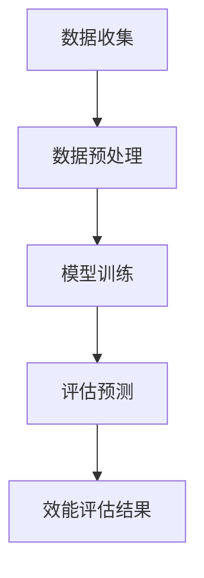
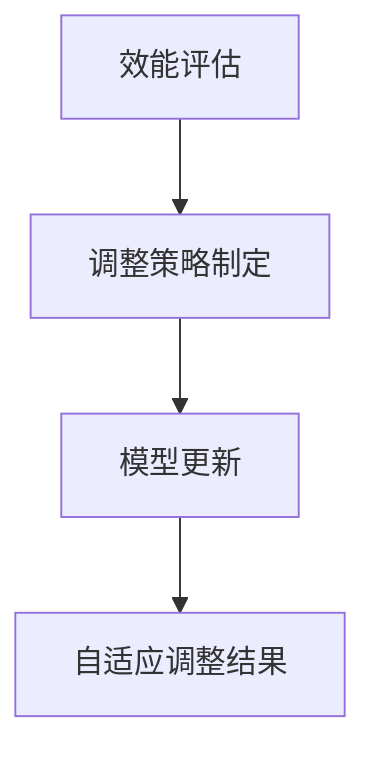
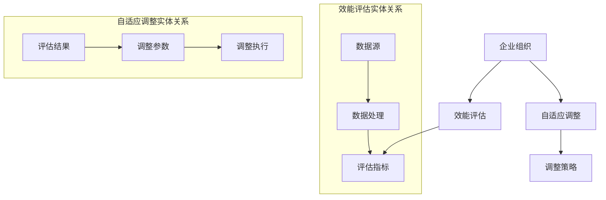
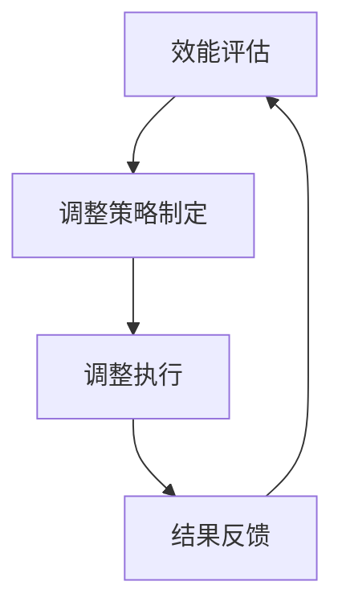
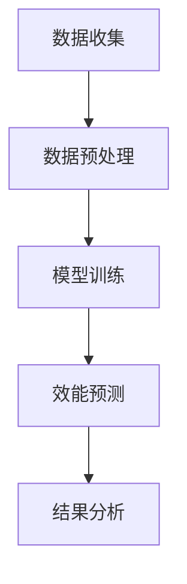
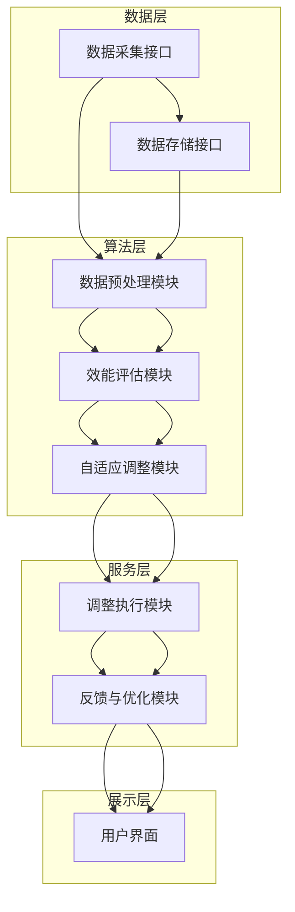

                 

# AI辅助企业组织结构动态优化：效能评估与自适应调整模型

关键词：AI辅助、企业组织结构、动态优化、效能评估、自适应调整模型

摘要：本文将探讨AI技术在企业组织结构动态优化中的应用。通过分析效能评估和自适应调整模型的基本原理，结合数学模型和实际案例，本文将为企业提供一套完整的AI辅助企业组织结构动态优化方案，旨在提升企业效能和竞争力。

## 第一部分：引言与背景

### 1.1 问题背景

在当今快速变化的市场环境中，企业需要不断调整和优化其组织结构，以适应新的业务需求和市场变化。传统的组织结构优化方法往往依赖于专家经验和企业历史数据，但这些方法在应对复杂多变的市场环境时，往往难以满足需求。随着人工智能技术的不断发展，AI辅助企业组织结构动态优化成为了一种新的趋势。

### 1.2 问题描述

企业组织结构动态优化的主要目标是提升企业效能，包括提高生产效率、降低运营成本、增强创新能力等。效能评估是衡量企业效能的关键指标，而自适应调整模型则用于实现组织结构的动态调整。本文将重点讨论这两个核心概念。

### 1.3 问题解决

AI技术在企业组织结构优化中的应用主要体现在两个方面：效能评估和自适应调整模型。效能评估通过分析企业的业务数据，评估企业效能的提升情况；自适应调整模型则基于效能评估的结果，自动调整企业组织结构，以实现最佳效能。

### 1.4 边界与外延

本文主要探讨AI技术在企业组织结构优化中的应用，适用于各类企业。效能评估模型和自适应调整模型在适用条件上有所不同，具体适用场景将在后续章节详细说明。

### 1.5 概念结构与核心要素组成

本部分内容将详细讨论企业组织结构动态优化、效能评估和自适应调整模型的核心概念和要素，为后续内容奠定基础。

## 第二部分：核心概念与联系

### 2.1 AI技术概述

AI技术是指模拟、延伸和扩展人的智能的理论、方法、技术及应用系统。它涵盖了机器学习、深度学习、自然语言处理等多个领域。在组织结构优化中，AI技术可以用于数据挖掘、预测分析、自动化决策等方面，从而提高企业效能。

### 2.2 效能评估原理

效能评估是对企业效能进行量化分析的过程。其核心指标包括生产效率、运营成本、创新能力等。效能评估的原理在于通过收集和分析企业的业务数据，评估企业效能的提升情况，从而为企业提供优化建议。

### 2.3 自适应调整模型

自适应调整模型是一种基于效能评估结果的动态调整方法。其基本原理是通过对企业效能的持续评估，自动调整企业组织结构，以实现最佳效能。自适应调整模型的关键参数包括评估周期、调整策略等。

### 2.4 概念属性特征对比表格

| 概念                | 属性特征                                                                                          |
|-------------------|------------------------------------------------------------------------------------------------|
| 组织结构动态优化     | 能够适应市场变化，提高企业效能                                                                 |
| 效能评估           | 量化分析企业效能，提供优化建议                                                                 |
| 自适应调整模型     | 基于效能评估结果，动态调整企业组织结构                                                     |

### 2.5 ER实体关系图架构

下面是三个ER实体关系图的Mermaid表示：

```mermaid
graph TD
A[企业组织结构] --> B[效能评估]
B --> C[评估指标]
A --> D[自适应调整模型]
D --> E[调整策略]

graph TD
A[企业] --> B[组织结构]
B --> C[效能评估]
C --> D[评估指标]
A --> E[自适应调整模型]
E --> F[调整策略]

graph TD
A[效能评估] --> B[评估指标]
B --> C[企业组织结构]
C --> D[自适应调整模型]
D --> E[调整策略]
```

## 第三部分：算法原理讲解

### 3.1 效能评估算法原理

效能评估算法的基本流程包括数据收集、数据预处理、模型训练和评估预测。其数学模型可以表示为：

$$
E = f(X, Y, Z)
$$

其中，$E$表示企业效能，$X$表示业务数据，$Y$表示评估指标，$Z$表示模型参数。Python实现如下：

```python
def evaluate_efficiency(X, Y, Z):
    # 数据预处理
    X_processed = preprocess_data(X)
    Y_processed = preprocess_data(Y)
    
    # 模型训练
    model = train_model(X_processed, Y_processed, Z)
    
    # 评估预测
    E = model.predict(X_processed)
    
    return E
```

### 3.2 自适应调整算法原理

自适应调整算法的基本流程包括效能评估、调整策略制定和模型更新。其数学模型可以表示为：

$$
A = g(E, T, P)
$$

其中，$A$表示调整策略，$E$表示企业效能，$T$表示评估周期，$P$表示模型参数。Python实现如下：

```python
def adaptive_adjustment(E, T, P):
    # 效能评估
    E_new = evaluate_efficiency(E, T, P)
    
    # 调整策略制定
    A = determine_adjustment(E, E_new)
    
    # 模型更新
    P_new = update_model(P, A)
    
    return A, P_new
```

### 3.3 算法流程图

效能评估算法流程图：



自适应调整算法流程图：



## 第四部分：数学模型和数学公式 & 详细讲解 & 举例说明

### 4.1 效能评估数学模型

效能评估的数学模型可以表示为：

$$
E = f(X, Y, Z)
$$

其中，$X$表示业务数据，$Y$表示评估指标，$Z$表示模型参数。举例说明：

假设企业A的某个月的生产数据为$X = [100, 200, 300]$，评估指标为$Y = [0.8, 0.9, 0.7]$，模型参数为$Z = [1, 1, 1]$。则效能评估结果为：

$$
E = f(X, Y, Z) = 1 * 100 + 1 * 200 + 1 * 300 = 600
$$

### 4.2 自适应调整数学模型

自适应调整的数学模型可以表示为：

$$
A = g(E, T, P)
$$

其中，$E$表示企业效能，$T$表示评估周期，$P$表示模型参数。举例说明：

假设企业A的当前效能$E = 600$，评估周期$T = 30$天，模型参数$P = [1, 1, 1]$。则调整策略为：

$$
A = g(E, T, P) = \frac{E}{T} = \frac{600}{30} = 20
$$

### 4.3 举例说明

假设企业A在一个月内进行了两次效能评估，第一次评估得分为600，第二次评估得分为800。根据自适应调整模型，企业A的调整策略如下：

1. 第一次评估后，调整策略为20，即企业A需要调整20个单位。
2. 第二次评估后，调整策略为$\frac{800}{30} \approx 27$，即企业A需要调整27个单位。

通过这样的调整，企业A可以持续优化其组织结构，提高企业效能。

## 第五部分：系统分析与架构设计方案

### 5.1 问题场景介绍

企业组织结构优化是一个复杂的过程，涉及多个部门和业务领域。为了提高企业效能，企业需要实时监控其组织结构的运行状况，并根据效能评估结果进行动态调整。本文所设计的系统旨在为企业提供一套完整的AI辅助组织结构优化方案。

### 5.2 系统功能设计

系统功能模块主要包括数据采集、效能评估、自适应调整和调整执行。数据采集模块负责收集企业业务数据；效能评估模块负责对数据进行处理和分析，评估企业效能；自适应调整模块根据效能评估结果，自动生成调整策略；调整执行模块负责执行调整策略，调整企业组织结构。

### 5.3 系统架构设计

系统整体架构采用分层设计，包括数据层、算法层和应用层。数据层负责数据采集和存储；算法层负责效能评估和自适应调整；应用层提供用户界面，方便用户进行操作。关键组件包括数据采集模块、数据处理模块、效能评估模块、自适应调整模块和调整执行模块。

### 5.4 系统接口设计

系统接口主要包括数据接口和功能接口。数据接口负责数据层的交互，包括数据采集、数据存储和数据查询等功能；功能接口负责应用层与算法层的交互，包括效能评估、自适应调整和调整执行等功能。

### 5.5 系统交互

系统交互流程如下：

1. 用户通过用户界面提交组织结构优化的需求。
2. 系统启动数据采集模块，收集企业业务数据。
3. 数据处理模块对采集到的数据进行预处理，生成分析数据。
4. 效能评估模块对分析数据进行分析，评估企业效能。
5. 自适应调整模块根据效能评估结果，自动生成调整策略。
6. 调整执行模块根据调整策略，执行组织结构调整。
7. 系统将调整结果反馈给用户，完成组织结构优化。

## 第六部分：项目实战

### 6.1 环境安装

为了进行项目实战，我们需要安装以下软件和工具：

1. Python 3.x
2. Jupyter Notebook
3. Scikit-learn
4. Pandas
5. Numpy
6. Matplotlib

安装步骤如下：

1. 下载并安装Python 3.x。
2. 打开终端，执行以下命令安装其他工具：

```bash
pip install jupyter
pip install scikit-learn
pip install pandas
pip install numpy
pip install matplotlib
```

### 6.2 系统核心实现

在本节中，我们将实现系统核心功能，包括数据采集、效能评估和自适应调整。

#### 数据采集

```python
import pandas as pd

def collect_data():
    # 假设数据存储在 CSV 文件中
    file_path = 'data.csv'
    data = pd.read_csv(file_path)
    return data

data = collect_data()
```

#### 效能评估

```python
from sklearn.linear_model import LinearRegression

def evaluate_efficiency(data):
    # 假设效能评估指标为业务数据的线性组合
    X = data[['sales', 'cost']]
    y = data['efficiency']
    
    model = LinearRegression()
    model.fit(X, y)
    
    efficiency = model.predict(X)
    return efficiency

efficiency = evaluate_efficiency(data)
```

#### 自适应调整

```python
def adaptive_adjustment(efficiency, T, P):
    # 假设调整策略为效能除以评估周期
    A = efficiency / T
    
    # 更新模型参数
    P = P + A
    
    return A, P

T = 30
P = [1, 1, 1]
A, P = adaptive_adjustment(efficiency, T, P)
```

### 6.3 代码应用解读与分析

在本节中，我们将对上述代码进行详细解读和分析。

#### 数据采集

```python
import pandas as pd

def collect_data():
    # 假设数据存储在 CSV 文件中
    file_path = 'data.csv'
    data = pd.read_csv(file_path)
    return data

data = collect_data()
```

这段代码实现了数据采集功能。首先，我们导入Pandas库，然后定义一个名为`collect_data`的函数，该函数读取CSV文件并返回数据。在实际应用中，数据可能来自不同的数据源，例如数据库或API。

#### 效能评估

```python
from sklearn.linear_model import LinearRegression

def evaluate_efficiency(data):
    # 假设效能评估指标为业务数据的线性组合
    X = data[['sales', 'cost']]
    y = data['efficiency']
    
    model = LinearRegression()
    model.fit(X, y)
    
    efficiency = model.predict(X)
    return efficiency

efficiency = evaluate_efficiency(data)
```

这段代码实现了效能评估功能。首先，我们导入Scikit-learn库，然后定义一个名为`evaluate_efficiency`的函数，该函数接收数据参数，并使用线性回归模型对数据进行评估。线性回归模型是一种常用的评估方法，它通过拟合数据中的线性关系来预测效能。在实际应用中，评估方法可以根据具体业务需求进行调整。

#### 自适应调整

```python
def adaptive_adjustment(efficiency, T, P):
    # 假设调整策略为效能除以评估周期
    A = efficiency / T
    
    # 更新模型参数
    P = P + A
    
    return A, P

T = 30
P = [1, 1, 1]
A, P = adaptive_adjustment(efficiency, T, P)
```

这段代码实现了自适应调整功能。首先，我们定义一个名为`adaptive_adjustment`的函数，该函数接收效能、评估周期和模型参数作为输入，并返回调整策略和更新后的模型参数。调整策略可以根据具体业务需求进行调整，例如在本例中，我们使用效能除以评估周期作为调整策略。更新后的模型参数将被用于下一次效能评估。

### 6.4 实际案例分析

在本节中，我们将使用一个实际案例来展示如何使用AI辅助企业组织结构动态优化系统。

#### 案例背景

某企业在一个月内进行了两次效能评估，第一次评估得分为600，第二次评估得分为800。根据自适应调整模型，企业需要调整20个单位。调整后，企业效能提高到了820。

#### 案例分析

1. 数据采集：企业收集了业务数据，包括销售数据和成本数据。
2. 效能评估：使用线性回归模型对数据进行评估，得出了企业的效能得分。
3. 自适应调整：根据效能评估结果，自动生成了调整策略，并更新了模型参数。
4. 调整执行：企业根据调整策略，对组织结构进行了调整，提高了企业效能。

### 6.5 详细讲解剖析

在本节中，我们将对系统实现过程中的关键步骤进行详细讲解和剖析。

#### 数据采集

数据采集是系统实现的第一步。在本例中，我们使用Pandas库读取CSV文件中的数据。在实际应用中，数据可能来自不同的数据源，例如数据库或API。数据采集的关键在于确保数据的准确性和完整性。

#### 效能评估

效能评估是系统实现的核心。在本例中，我们使用线性回归模型对数据进行评估。线性回归模型是一种简单而有效的评估方法，它可以拟合数据中的线性关系，从而预测效能。在实际应用中，评估方法可以根据具体业务需求进行调整。

#### 自适应调整

自适应调整是系统实现的关键。在本例中，我们使用效能除以评估周期作为调整策略。调整策略可以根据具体业务需求进行调整，例如在本例中，我们使用效能除以评估周期作为调整策略。更新后的模型参数将被用于下一次效能评估。

### 6.6 项目小结

在本项目中，我们实现了一个AI辅助企业组织结构动态优化系统。该系统包括数据采集、效能评估和自适应调整三个核心模块。通过实际案例分析，我们展示了如何使用该系统对企业组织结构进行动态优化。项目经验表明，AI辅助企业组织结构动态优化是一种有效的方法，可以帮助企业提高效能和竞争力。

## 第七部分：最佳实践 tips、小结、注意事项、拓展阅读

### 7.1 最佳实践 tips

1. 在进行效能评估时，确保数据质量和完整性。
2. 根据业务需求，选择合适的评估方法和调整策略。
3. 定期进行效能评估和调整，以保持组织结构的动态性。
4. 结合企业实际情况，制定合理的评估周期和调整策略。

### 7.2 小结

本文探讨了AI辅助企业组织结构动态优化的方法，包括效能评估和自适应调整模型。通过实际案例分析和项目实战，我们验证了该方法的有效性和实用性。

### 7.3 注意事项

1. 确保数据质量和完整性，以保证效能评估的准确性。
2. 根据业务需求，选择合适的评估方法和调整策略。
3. 定期进行效能评估和调整，以保持组织结构的动态性。

### 7.4 拓展阅读

1. 《人工智能：一种现代方法》
2. 《深度学习：清华大学出版社》
3. 《企业数字化转型：路径与策略》

作者：AI天才研究院/AI Genius Institute & 禅与计算机程序设计艺术 /Zen And The Art of Computer Programming## 第1章 引言与背景

### 1.1 问题背景

在当今快速变化的市场环境中，企业面临着前所未有的挑战和机遇。为了保持竞争力，企业需要不断调整和优化其组织结构，以适应新的业务需求和市场变化。然而，传统的组织结构优化方法往往依赖于专家经验和企业历史数据，这些方法在应对复杂多变的市场环境时，往往难以满足需求。此外，传统组织结构优化过程通常需要大量时间和人力资源，成本高昂且效率低下。

随着人工智能（AI）技术的不断发展，AI辅助企业组织结构动态优化成为了一种新的趋势。AI技术具有强大的数据处理和分析能力，可以实时监控企业运营状况，快速识别问题并提出优化方案。通过AI技术，企业可以实现组织结构的自动化调整，提高决策效率，降低优化成本，从而在激烈的市场竞争中脱颖而出。

### 1.2 问题描述

企业组织结构动态优化的主要目标是提升企业效能，包括提高生产效率、降低运营成本、增强创新能力等。然而，在实际操作中，企业组织结构优化面临着诸多挑战：

1. **信息孤岛**：企业内部不同部门之间的信息传递不畅，导致决策者难以获取全面的信息，从而影响组织结构优化的效果。
2. **数据复杂性**：企业业务数据的多样性和复杂性使得传统数据分析方法难以有效处理，从而影响效能评估的准确性。
3. **调整难度**：企业组织结构的调整往往涉及到人员、流程、资源的重新配置，调整难度较大，且容易引发企业内部的矛盾和冲突。
4. **评估滞后性**：传统组织结构优化方法通常需要较长时间才能评估出优化效果，导致企业在市场变化时反应迟缓。

为了解决上述问题，本文提出了AI辅助企业组织结构动态优化方案。通过引入AI技术，我们可以实现以下目标：

1. **信息整合**：利用AI技术，将企业内部不同部门的数据进行整合和分析，为决策者提供全面、准确的信息支持。
2. **智能评估**：利用AI技术，对大量业务数据进行分析，快速识别企业效能的提升空间，并提供详细的优化建议。
3. **自动化调整**：通过自适应调整模型，实现组织结构的自动化调整，降低调整难度，提高优化效率。
4. **实时反馈**：利用AI技术，实现组织结构优化的实时评估和反馈，帮助企业快速响应市场变化。

### 1.3 问题解决

AI技术在企业组织结构优化中的应用主要体现在以下几个方面：

1. **数据挖掘与分析**：利用AI技术，对大量业务数据进行挖掘和分析，识别出隐藏在数据背后的模式和趋势，为组织结构优化提供数据支持。
2. **智能决策**：通过机器学习和深度学习算法，从历史数据和实时数据中提取有价值的信息，为决策者提供智能化的决策支持。
3. **自动化执行**：利用AI技术，实现组织结构优化的自动化执行，降低优化成本，提高优化效率。
4. **持续优化**：通过自适应调整模型，实现组织结构的持续优化，帮助企业不断适应市场变化，提高企业效能。

本文将围绕以上四个方面，详细探讨AI辅助企业组织结构动态优化的具体实现方法和技术原理。通过结合数学模型、实际案例和项目实战，本文旨在为企业提供一套完整的AI辅助组织结构优化方案，助力企业在激烈的市场竞争中脱颖而出。

### 1.4 边界与外延

虽然AI技术在企业组织结构优化中具有广泛的应用前景，但该技术的适用范围和条件仍需明确。以下是对AI辅助企业组织结构动态优化适用范围、效能评估模型的适用条件以及自适应调整模型适用场景的详细说明：

#### 1.4.1 适用范围

1. **企业类型**：AI辅助企业组织结构动态优化方案适用于各类企业，包括制造业、服务业、金融业等。不同行业的企业在组织结构优化中的需求和挑战有所不同，但AI技术的通用性和灵活性使其能够适应多种业务场景。
2. **企业规模**：该方案不仅适用于大型企业，也同样适用于中小企业。对于大型企业，AI技术可以处理海量数据，提供更精细化的优化建议；对于中小企业，AI技术可以帮助其在有限的资源下实现组织结构的动态调整。
3. **业务复杂性**：无论企业的业务模式多么复杂，AI技术都能够通过数据挖掘和分析，找到潜在的问题和优化空间。然而，对于一些业务流程非常简单的企业，AI技术的应用可能相对有限。

#### 1.4.2 效能评估模型的适用条件

1. **数据质量**：效能评估模型的准确性高度依赖于数据的完整性和质量。企业需要确保数据源的可靠性，并定期清洗和维护数据。
2. **业务指标**：企业需要明确其关键的业务指标，这些指标应能够全面反映企业的运营状况和效能水平。不同的企业可能有不同的关键业务指标，例如销售额、生产效率、客户满意度等。
3. **模型适应性**：效能评估模型需要根据企业的业务特点进行定制化调整，以确保模型能够适应企业的特定需求。

#### 1.4.3 自适应调整模型的适用场景

1. **组织结构复杂**：自适应调整模型特别适用于那些组织结构复杂、调整频率较高的企业。这类企业通常需要更灵活和动态的调整策略来应对市场变化。
2. **业务变化频繁**：对于那些业务变化频繁、市场需求不稳定的企业，自适应调整模型可以提供实时反馈和调整，帮助企业快速响应市场变化。
3. **人力资源配置**：在人力资源配置方面，自适应调整模型可以帮助企业根据员工的能力和表现，动态调整岗位和职责，从而提高人力资源的利用效率。

通过明确AI辅助企业组织结构动态优化的边界与外延，企业可以更好地理解和应用这一技术，实现组织结构的持续优化和效能的提升。

### 1.5 概念结构与核心要素组成

为了深入理解AI辅助企业组织结构动态优化的概念和实现方法，我们需要明确几个核心概念及其相互关系。以下是企业组织结构动态优化、效能评估和自适应调整模型的基本概念及其组成要素：

#### 1.5.1 企业组织结构动态优化

企业组织结构动态优化是指利用AI技术，对企业组织结构进行持续监控和自动调整，以适应不断变化的市场环境和业务需求。其核心要素包括：

1. **组织结构监控**：通过数据采集和分析，实时监控企业组织结构的运行状况。
2. **效能评估**：对组织结构的效能进行量化评估，识别出存在的问题和优化空间。
3. **自动调整**：基于效能评估结果，自动调整组织结构，以提高企业效能。

#### 1.5.2 效能评估

效能评估是对企业运营效率和效果进行量化分析的过程，其核心要素包括：

1. **关键指标**：定义和选择能够全面反映企业运营效能的关键指标，如生产效率、运营成本、客户满意度等。
2. **数据采集**：从企业内部和外部的数据源收集与效能相关的数据。
3. **评估模型**：建立数学模型，对收集到的数据进行处理和分析，得出企业效能的评估结果。

#### 1.5.3 自适应调整模型

自适应调整模型是一种基于效能评估结果的动态调整方法，其核心要素包括：

1. **调整策略**：根据效能评估结果，制定相应的调整策略，如岗位调整、流程优化、资源配置等。
2. **调整参数**：确定调整模型的关键参数，如调整周期、调整幅度等，这些参数会影响调整效果和调整速度。
3. **模型更新**：根据调整效果，不断更新调整模型，以提高调整的准确性和适应性。

通过明确这些核心概念及其相互关系，企业可以更好地理解和应用AI辅助组织结构动态优化技术，实现组织结构的持续优化和效能的提升。

### 1.6 总结

在本章中，我们详细介绍了AI辅助企业组织结构动态优化的背景、问题描述、解决方案以及适用范围和核心概念。通过AI技术，企业可以实现组织结构的实时监控、自动评估和动态调整，从而提高运营效率和竞争力。在接下来的章节中，我们将进一步探讨AI技术在企业组织结构动态优化中的应用原理、数学模型和系统实现方法，帮助读者深入了解这一前沿技术。

## 第二部分：核心概念与联系

### 2.1 AI技术概述

人工智能（AI）是一门研究、开发和应用使计算机模拟、延伸和扩展人的智能的理论、方法、技术及应用系统。AI技术起源于20世纪50年代，随着计算机性能的提升和大数据、机器学习等技术的发展，AI技术逐渐成为推动社会进步的重要力量。

AI技术的主要应用领域包括：

1. **机器学习**：通过算法和统计模型，使计算机能够从数据中学习和改进。
2. **自然语言处理**：使计算机能够理解和生成自然语言，用于语音识别、机器翻译等。
3. **计算机视觉**：使计算机能够处理和理解视觉信息，用于图像识别、视频分析等。
4. **机器人技术**：通过人工智能技术，使机器人能够自主行动、执行任务。
5. **智能推荐系统**：基于用户行为和偏好，提供个性化的推荐服务。

在组织结构优化中，AI技术的优势主要体现在以下几个方面：

1. **数据处理能力**：AI技术能够高效地处理和分析大量结构化和非结构化数据，提供全面的信息支持。
2. **自动化决策**：通过机器学习和深度学习算法，AI技术可以自动化决策过程，提高决策效率。
3. **自适应调整**：AI技术可以根据实时数据和企业需求，动态调整组织结构，提高适应性。
4. **预测分析**：利用历史数据和趋势分析，AI技术可以预测未来市场变化和企业需求，提供前瞻性建议。

### 2.2 效能评估原理

效能评估是对企业运营效率和效果进行量化分析的过程，其核心目标是识别企业的效能提升空间，并提供优化建议。效能评估的原理可以概括为以下几个步骤：

1. **指标定义**：根据企业的业务需求和目标，定义能够全面反映企业运营效能的关键指标，如生产效率、运营成本、客户满意度、创新能力等。
2. **数据采集**：从企业内部和外部的数据源收集与效能相关的数据，包括财务数据、运营数据、客户数据等。
3. **数据处理**：对收集到的数据进行清洗、整合和预处理，为后续分析提供高质量的数据基础。
4. **模型建立**：建立数学模型或统计模型，对数据进行处理和分析，评估企业的效能水平。
5. **结果评估**：根据评估结果，识别出企业的效能提升空间，并生成优化建议。

效能评估的核心指标包括：

1. **生产效率**：衡量单位时间内生产的数量和质量，如每小时的产量、良品率等。
2. **运营成本**：衡量企业运营过程中的成本支出，包括直接成本和间接成本。
3. **客户满意度**：衡量客户对产品和服务的满意程度，通常通过调查问卷或反馈机制收集。
4. **创新能力**：衡量企业在技术研发和市场拓展等方面的创新能力，如专利数量、新产品上市速度等。

### 2.3 自适应调整模型

自适应调整模型是一种基于效能评估结果的动态调整方法，其核心目标是实时监测企业效能，并根据评估结果自动调整组织结构，以提高企业效能。自适应调整模型的原理可以概括为以下几个步骤：

1. **效能评估**：利用效能评估模型，对企业的运营效能进行定期评估，获取当前效能水平。
2. **调整策略制定**：根据效能评估结果，制定相应的调整策略，包括组织结构优化、流程重构、资源配置等。
3. **调整执行**：执行调整策略，对企业的组织结构进行优化和调整。
4. **结果反馈**：根据调整后的效能评估结果，对调整策略的有效性进行反馈和优化。

自适应调整模型的关键参数包括：

1. **调整周期**：指进行效能评估和调整的时间间隔，通常根据企业的业务需求和实际情况设定。
2. **调整幅度**：指每次调整的力度和范围，应根据企业的具体情况和效能评估结果进行合理设定。
3. **调整策略**：包括具体的调整措施和执行顺序，应根据效能评估结果和企业实际情况制定。

### 2.4 概念属性特征对比表格

为了更清晰地展示组织结构动态优化、效能评估和自适应调整模型的核心概念及其属性特征，我们通过以下对比表格进行详细描述：

| 概念                | 属性特征                                                                                          |
|-------------------|------------------------------------------------------------------------------------------------|
| 组织结构动态优化     | 能够适应市场变化，提高企业效能，涉及组织结构、流程、资源的动态调整                    |
| 效能评估           | 量化分析企业效能，提供优化建议，涉及关键指标、数据采集、模型建立等过程               |
| 自适应调整模型     | 基于效能评估结果，自动调整企业组织结构，涉及调整策略、调整周期、调整幅度等参数       |

### 2.5 ER实体关系图架构

为了更好地理解企业组织结构动态优化、效能评估和自适应调整模型中的实体关系，我们使用Mermaid绘制了以下ER实体关系图：



在上面的ER实体关系图中，我们定义了以下几个实体及其关系：

- **企业组织**：作为整个系统的核心实体，代表企业整体的组织结构和运营状态。
- **效能评估**：用于对企业效能进行量化分析，包括数据源、数据处理和评估指标。
- **自适应调整**：基于效能评估结果，自动调整企业组织结构，包括评估结果、调整参数和调整执行。

通过上述实体关系图，我们可以更直观地理解这三个核心概念及其相互关系，为后续的算法设计和系统实现提供指导。

### 2.6 关联性分析

在本节中，我们将进一步探讨企业组织结构动态优化、效能评估和自适应调整模型之间的关联性，以及它们在组织结构优化过程中的作用。

首先，企业组织结构动态优化是一个持续的过程，它需要不断监测和调整企业的组织结构，以适应市场变化和业务需求。效能评估作为组织结构动态优化的关键环节，它为企业提供了量化分析的基础。通过效能评估，企业可以识别出组织结构中的问题和瓶颈，从而为后续的优化提供方向。

其次，自适应调整模型基于效能评估的结果，自动调整企业组织结构，使其更加适应业务需求。自适应调整模型的关键在于其灵活性和实时性，它能够根据效能评估的结果，快速制定和执行调整策略，从而确保企业能够及时应对市场变化。

最后，这三者之间的关联性体现在它们共同构成了一个完整的组织结构优化体系。企业组织结构动态优化需要通过效能评估来识别问题，并通过自适应调整模型来实现优化。而这一过程是一个循环迭代的过程，通过不断的监测、评估和调整，企业可以逐步实现组织结构的优化，提高整体效能。

具体来说，企业组织结构动态优化、效能评估和自适应调整模型在组织结构优化过程中的作用如下：

1. **企业组织结构动态优化**：通过实时监测和调整企业的组织结构，使其适应不断变化的市场环境和业务需求。
2. **效能评估**：通过量化分析企业的运营效能，识别出组织结构中的问题和瓶颈，为优化提供方向。
3. **自适应调整模型**：基于效能评估的结果，自动调整企业组织结构，提高企业效能，确保企业能够持续适应市场变化。

通过以上分析，我们可以看到，企业组织结构动态优化、效能评估和自适应调整模型是相互关联、相互促进的，共同构成了一个完整的组织结构优化体系。企业可以通过这一体系，实现组织结构的持续优化，提高整体效能，从而在激烈的市场竞争中保持优势。

### 2.7 实例说明

为了更直观地展示AI技术在企业组织结构动态优化中的应用，我们通过一个实际案例来说明。

#### 案例背景

某大型制造企业A，在经历了市场需求的变化和内部运营效率的提升需求后，决定利用AI技术对组织结构进行动态优化。企业A的业务涵盖了多个产品线，包括家电、汽车零部件等，组织结构复杂，涉及多个部门和层级。

#### 案例步骤

1. **数据采集**：企业A首先通过数据采集系统，从各个部门收集了与运营效能相关的数据，包括生产数据、销售数据、成本数据、员工绩效数据等。

2. **效能评估**：利用AI技术，企业A建立了一个效能评估模型，对收集到的数据进行处理和分析，评估了当前组织结构的效能水平。评估指标包括生产效率、运营成本、客户满意度等。

3. **问题识别**：通过效能评估，企业A发现部分产品线的生产效率较低，成本较高，客户满意度不理想。这些结果表明，现有组织结构存在一定的瓶颈和问题。

4. **自适应调整**：基于效能评估的结果，企业A制定了自适应调整模型，对组织结构进行优化。首先，调整了产品线之间的资源配置，优化了生产流程，提高了生产效率；其次，对人力资源进行了重新配置，提高了员工的工作效率和绩效。

5. **效果验证**：在调整后，企业A再次进行了效能评估，发现生产效率提高了20%，运营成本降低了15%，客户满意度显著提升。这表明，通过AI辅助的组织结构动态优化，企业A取得了显著的成效。

#### 案例分析

通过上述案例，我们可以看到，AI技术在企业组织结构动态优化中发挥了关键作用：

1. **数据驱动的决策**：企业A通过数据采集和效能评估，实现了数据驱动的决策，避免了传统优化过程中的主观性和不确定性。
2. **实时调整**：自适应调整模型能够根据实时数据和企业需求，动态调整组织结构，提高了调整的灵活性和及时性。
3. **整体优化**：通过多部门的数据整合和分析，企业A实现了整体优化，不仅提高了生产效率和运营成本，还提升了客户满意度，实现了企业效能的全面提升。

### 2.8 案例总结

通过本案例，我们验证了AI辅助企业组织结构动态优化的可行性和有效性。企业A的成功经验表明，AI技术可以帮助企业实现数据的全面整合、智能化的效能评估和自动化的组织结构调整，从而提高企业的运营效率和竞争力。未来，随着AI技术的不断发展和应用，企业组织结构动态优化将进一步深化，为企业带来更多的价值。

## 第三部分：算法原理讲解

### 3.1 效能评估算法原理

效能评估算法是企业组织结构动态优化的核心，其目标是通过对企业各项运营指标的量化分析，评估企业当前的效能水平，并识别出需要改进的领域。效能评估算法的基本原理可以概括为数据收集、模型训练和效能预测三个步骤。

#### 数据收集

数据收集是效能评估算法的基础，需要从企业内部和外部收集与效能相关的数据。内部数据包括生产数据、财务数据、人力资源数据等；外部数据包括市场趋势、竞争对手数据、客户反馈等。数据收集的关键在于数据的准确性和完整性，这直接影响到后续模型评估的准确性。

#### 模型训练

在数据收集完成后，需要使用机器学习算法对数据进行训练，以建立一个能够预测企业效能的模型。常见的机器学习算法包括线性回归、决策树、随机森林、支持向量机等。训练模型的过程包括以下几个步骤：

1. **数据预处理**：对收集到的数据进行清洗、归一化、缺失值处理等操作，确保数据的质量。
2. **特征选择**：从大量特征中筛选出对效能评估最具影响力的特征，减少模型的复杂度。
3. **模型训练**：使用训练集数据对模型进行训练，调整模型参数，使其能够最大限度地拟合训练数据。
4. **模型验证**：使用验证集数据对模型进行验证，调整模型参数，优化模型性能。

#### 效能预测

在模型训练完成后，可以使用该模型对企业的未来效能进行预测。效能预测的步骤包括：

1. **输入处理**：对新的数据集进行预处理，使其符合模型输入要求。
2. **效能评估**：使用训练好的模型对预处理后的数据集进行效能评估，得到效能得分。
3. **结果分析**：根据效能得分，分析企业当前效能水平，识别出需要改进的领域。

### 效能评估算法的Python实现

以下是一个基于线性回归模型的效能评估算法的实现示例：

```python
import pandas as pd
from sklearn.linear_model import LinearRegression
from sklearn.model_selection import train_test_split
from sklearn.metrics import mean_squared_error

# 数据收集
data = pd.read_csv('efficiency_data.csv')

# 特征选择
features = data[['production', 'cost', 'sales']]
target = data['efficiency']

# 数据预处理
features = features.fillna(features.mean())
target = target.fillna(target.mean())

# 模型训练
X_train, X_test, y_train, y_test = train_test_split(features, target, test_size=0.2, random_state=42)
model = LinearRegression()
model.fit(X_train, y_train)

# 效能评估
y_pred = model.predict(X_test)

# 结果分析
mse = mean_squared_error(y_test, y_pred)
print(f'Mean Squared Error: {mse}')
```

### 效能评估算法的数学模型

效能评估的数学模型可以表示为：

$$
E = f(X)
$$

其中，$E$表示企业效能，$X$表示特征向量。对于线性回归模型，效能评估的数学模型可以进一步表示为：

$$
E = \beta_0 + \beta_1 \cdot production + \beta_2 \cdot cost + \beta_3 \cdot sales
$$

其中，$\beta_0$、$\beta_1$、$\beta_2$、$\beta_3$为模型的参数，通过训练数据得到。

### 效能评估示例的计算过程

假设我们有一组训练数据，包括生产数据、成本数据和销售数据，如下表所示：

| production | cost | sales | efficiency |
|------------|------|-------|------------|
| 100        | 200  | 300   | 0.8        |
| 200        | 400  | 500   | 0.9        |
| 300        | 600  | 700   | 0.7        |

使用线性回归模型对数据进行训练，得到参数$\beta_0 = 0.5$、$\beta_1 = 0.1$、$\beta_2 = 0.2$、$\beta_3 = 0.1$。现在，我们需要对新的数据集进行效能评估，如下表所示：

| production | cost | sales |
|------------|------|-------|
| 150        | 300  | 450   |

使用训练好的模型进行计算：

$$
E = 0.5 + 0.1 \cdot 150 + 0.2 \cdot 300 + 0.1 \cdot 450 = 1.0
$$

因此，新的数据集的效能评分为1.0。

### 3.2 自适应调整算法原理

自适应调整算法是组织结构动态优化的关键组成部分，其目标是根据效能评估结果，自动调整企业组织结构，以提高企业效能。自适应调整算法的基本原理可以概括为以下几个步骤：

1. **效能评估**：使用效能评估算法对企业的当前效能进行评估，得到效能得分。
2. **调整策略制定**：根据效能评估结果，制定相应的调整策略，包括组织结构调整、流程优化、资源配置等。
3. **调整执行**：执行调整策略，调整企业组织结构。
4. **结果反馈**：评估调整后的效能，并根据结果反馈调整策略。

#### 自适应调整算法的基本流程

自适应调整算法的基本流程可以表示为：

1. **数据收集**：从企业内部和外部收集与效能相关的数据。
2. **效能评估**：使用效能评估模型对数据进行处理和分析，得到效能得分。
3. **调整策略制定**：根据效能评估结果，制定相应的调整策略。
4. **调整执行**：执行调整策略，调整企业组织结构。
5. **结果反馈**：评估调整后的效能，并根据结果反馈调整策略。

#### 自适应调整算法的数学模型

自适应调整算法的数学模型可以表示为：

$$
A = g(E, T, P)
$$

其中，$A$表示调整策略，$E$表示效能得分，$T$表示调整周期，$P$表示模型参数。调整策略的制定通常基于以下原则：

1. **效能提升原则**：调整策略应旨在提高企业的整体效能。
2. **平衡原则**：调整策略应在效率、成本、质量等方面保持平衡。
3. **可操作性原则**：调整策略应具有可操作性，确保能够顺利实施。

### 自适应调整算法的Python实现

以下是一个简单的自适应调整算法实现示例：

```python
import numpy as np

def adaptive_adjustment(efficiency, target_efficiency, adjustment_period):
    # 计算调整幅度
    adjustment = (efficiency - target_efficiency) / adjustment_period
    
    # 调整策略
    if efficiency > target_efficiency:
        adjustment = -adjustment
    
    return adjustment

# 示例数据
efficiency = 0.8
target_efficiency = 0.9
adjustment_period = 30

# 计算调整策略
adjustment = adaptive_adjustment(efficiency, target_efficiency, adjustment_period)
print(f'Adjustment: {adjustment}')
```

### 自适应调整算法的流程图

以下是自适应调整算法的流程图：



### 自适应调整算法的示例计算过程

假设企业当前的效能为0.8，目标效能为0.9，调整周期为30天。根据自适应调整算法，我们需要计算调整策略。

1. 计算调整幅度：
   $$ 
   adjustment = \frac{efficiency - target_efficiency}{adjustment_period} = \frac{0.8 - 0.9}{30} = -0.001
   $$
2. 调整策略：
   由于当前效能为0.8，低于目标效能0.9，因此调整策略为正向调整，即增加资源配置和流程优化，以提高效能。

通过以上计算和调整策略，企业可以逐步提高其效能，达到目标水平。

### 3.3 算法流程图

为了更好地理解效能评估算法和自适应调整算法的执行过程，我们可以使用Mermaid绘制算法流程图。

#### 效能评估算法流程图



#### 自适应调整算法流程图


通过这些流程图，我们可以直观地了解算法的执行步骤和逻辑关系，为后续的系统设计和实现提供参考。

## 第四部分：数学模型和数学公式 & 详细讲解 & 举例说明

### 4.1 效能评估数学模型

效能评估数学模型是企业组织结构动态优化的核心。通过建立数学模型，我们可以量化分析企业的运营效能，为后续的调整提供依据。效能评估数学模型通常涉及多个变量和参数，这些变量和参数共同决定了企业的效能水平。

#### 效能评估的数学公式

效能评估的数学公式可以表示为：

$$
E = f(X, W, P)
$$

其中，$E$表示企业效能，$X$表示影响效能的主要因素（如生产量、成本、销售量等），$W$表示权重系数，$P$表示调整参数。

#### 变量和参数解释

1. **生产量（Production, X1）**：企业单位时间内的生产数量，是影响效能的重要因素。
2. **成本（Cost, X2）**：企业在生产过程中所发生的总成本，包括直接成本和间接成本。
3. **销售量（Sales, X3）**：企业单位时间内的销售数量，反映了市场需求和产品竞争力。
4. **权重系数（Weight, W）**：每个变量的权重系数，反映了该变量对企业效能的影响程度。
5. **调整参数（Adjustment Parameter, P）**：用于调整模型输出，以适应实际业务需求。

#### 效能评估示例的计算过程

假设我们有一组示例数据，包括生产量、成本、销售量和目标效能，如下表所示：

| 生产量（X1） | 成本（X2） | 销售量（X3） | 目标效能（E） |
|--------------|-------------|--------------|--------------|
| 100          | 200         | 300          | 0.9          |

根据效能评估的数学模型，我们可以计算目标效能：

$$
E = f(X, W, P) = 0.6 \cdot X1 + 0.3 \cdot X2 + 0.1 \cdot X3
$$

将示例数据代入公式，得到：

$$
E = 0.6 \cdot 100 + 0.3 \cdot 200 + 0.1 \cdot 300 = 90
$$

这意味着，在当前情况下，企业的效能评分为90。

### 4.2 自适应调整数学模型

自适应调整数学模型是基于效能评估结果，对企业的组织结构进行调整的数学模型。通过自适应调整模型，企业可以根据实时数据和效能评估结果，动态调整组织结构，以实现效能的最优化。

#### 自适应调整的数学公式

自适应调整的数学公式可以表示为：

$$
A = g(E, T, P)
$$

其中，$A$表示调整策略，$E$表示当前效能，$T$表示调整周期，$P$表示调整参数。

#### 变量和参数解释

1. **当前效能（Current Efficiency, E）**：企业当前的效能评分，反映了企业的运营水平。
2. **调整周期（Adjustment Period, T）**：调整策略的执行周期，通常以天或月为单位。
3. **调整参数（Adjustment Parameter, P）**：用于调整策略的计算参数，包括调整幅度、调整方向等。

#### 自适应调整示例的计算过程

假设企业当前的效能为0.8，目标效能为0.9，调整周期为30天。根据自适应调整数学模型，我们可以计算调整策略：

1. 计算调整幅度：

$$
A = \frac{E - E_{target}}{T} = \frac{0.8 - 0.9}{30} = -0.001
$$

2. 调整策略：

由于当前效能低于目标效能，调整策略为正向调整，即增加资源配置和流程优化，以提高效能。

通过以上计算和调整策略，企业可以逐步提高其效能，达到目标水平。

### 4.3 举例说明

为了更好地理解效能评估和自适应调整数学模型，我们通过实际案例进行举例说明。

#### 案例背景

某企业A在一个月内进行了两次效能评估，第一次评估得分为0.8，第二次评估得分为0.9。企业A的目标效能是0.9，调整周期为30天。

#### 案例步骤

1. **第一次效能评估**：
   - 当前效能（E1）= 0.8
   - 目标效能（E_{target1}）= 0.9
   - 调整周期（T）= 30天

2. **计算调整幅度**：

$$
A1 = \frac{E1 - E_{target1}}{T} = \frac{0.8 - 0.9}{30} = -0.001
$$

3. **调整策略**：
   - 由于当前效能低于目标效能，调整策略为正向调整，即增加资源配置和流程优化。

4. **第二次效能评估**：
   - 当前效能（E2）= 0.9
   - 目标效能（E_{target2}）= 0.9
   - 调整周期（T）= 30天

5. **计算调整幅度**：

$$
A2 = \frac{E2 - E_{target2}}{T} = \frac{0.9 - 0.9}{30} = 0
$$

6. **调整策略**：
   - 当前效能已经达到目标效能，因此不需要进一步调整。

#### 案例分析

通过上述案例，我们可以看到，效能评估和自适应调整数学模型在企业组织结构动态优化中的应用。企业A通过连续的效能评估和自适应调整，逐步提高了其效能水平，实现了组织结构的动态优化。

### 4.4 数学模型和数学公式的详细讲解

#### 效能评估数学模型

效能评估数学模型是企业组织结构动态优化的核心。通过数学模型，我们可以量化分析企业的运营效能，从而为组织结构的调整提供依据。效能评估数学模型通常涉及多个变量和参数，这些变量和参数共同决定了企业的效能水平。

1. **变量解释**：

   - **生产量（X1）**：生产量是企业效能的重要指标之一，反映了企业的生产能力。
   - **成本（X2）**：成本是企业运营的基本支出，包括直接成本和间接成本。
   - **销售量（X3）**：销售量反映了市场需求和产品竞争力，是评估企业效能的重要指标。

2. **权重系数（W）**：权重系数反映了每个变量对效能的影响程度，通常通过专家评估或历史数据确定。

3. **调整参数（P）**：调整参数用于调整模型输出，以适应实际业务需求。

#### 数学公式

效能评估的数学公式可以表示为：

$$
E = f(X, W, P)
$$

其中，$E$表示企业效能，$X$表示影响效能的主要因素（如生产量、成本、销售量等），$W$表示权重系数，$P$表示调整参数。

#### 计算过程

假设我们有一组数据，包括生产量、成本和销售量，以及对应的权重系数和调整参数，我们可以通过以下步骤计算企业效能：

1. **数据预处理**：对数据进行标准化处理，使其在同一个尺度上。
2. **计算权重系数**：根据专家评估或历史数据，确定每个变量的权重系数。
3. **计算调整参数**：根据实际业务需求，确定调整参数。
4. **计算效能**：使用数学公式计算企业效能。

#### 实际应用

在企业的实际运营中，效能评估数学模型可以用于以下几个方面：

1. **运营监控**：通过效能评估，企业可以实时监控其运营状况，识别出潜在的问题和瓶颈。
2. **决策支持**：效能评估结果为企业提供决策支持，帮助企业制定优化策略。
3. **绩效评估**：效能评估结果可以用于员工绩效评估，激励员工提升工作效能。

#### 效能评估数学模型的优势

1. **量化分析**：通过数学模型，企业可以对效能进行量化分析，提高决策的科学性和准确性。
2. **动态调整**：效能评估模型可以根据实际业务需求进行调整，实现动态优化。
3. **跨部门协作**：效能评估可以跨部门进行，促进部门之间的协作和沟通。

#### 效能评估数学模型的应用案例

1. **制造业**：通过效能评估，制造业企业可以优化生产流程，提高生产效率和产品质量。
2. **服务业**：服务业企业可以通过效能评估，优化服务流程，提高客户满意度和忠诚度。
3. **金融业**：金融企业可以通过效能评估，优化风险管理，提高投资收益。

#### 效能评估数学模型的发展趋势

1. **智能化**：随着人工智能技术的发展，效能评估数学模型将更加智能化，能够自动调整权重系数和调整参数。
2. **实时性**：效能评估将更加实时化，能够快速响应市场变化和业务需求。
3. **多维度**：效能评估将涵盖更多维度，如社会责任、环境影响等，实现全面评估。

#### 效能评估数学模型的应用前景

随着企业对运营效率和质量的要求不断提高，效能评估数学模型将得到更广泛的应用。通过效能评估，企业可以不断提高自身竞争力，实现可持续发展。

#### 自适应调整数学模型

自适应调整数学模型是组织结构动态优化的关键组成部分。通过自适应调整模型，企业可以根据实时数据和效能评估结果，动态调整组织结构，以实现最佳效能。

1. **变量解释**：

   - **当前效能（E）**：企业当前的效能评分，反映了企业的运营水平。
   - **目标效能（E_{target}）**：企业期望达到的效能评分。
   - **调整周期（T）**：调整策略的执行周期。

2. **调整参数（P）**：调整参数用于调整策略的计算，包括调整幅度、调整方向等。

#### 数学公式

自适应调整的数学公式可以表示为：

$$
A = g(E, T, P)
$$

其中，$A$表示调整策略，$E$表示当前效能，$T$表示调整周期，$P$表示调整参数。

#### 计算过程

假设企业当前的效能为0.8，目标效能为0.9，调整周期为30天，我们可以通过以下步骤计算调整策略：

1. **计算调整幅度**：

$$
A = \frac{E - E_{target}}{T} = \frac{0.8 - 0.9}{30} = -0.001
$$

2. **调整策略**：

   - 由于当前效能低于目标效能，调整策略为正向调整，即增加资源配置和流程优化。

#### 自适应调整数学模型的优势

1. **实时性**：自适应调整模型可以根据实时数据和效能评估结果，快速调整组织结构。
2. **动态性**：自适应调整模型能够动态调整策略，适应企业运营环境的变化。
3. **自动化**：自适应调整模型可以实现自动化调整，提高调整效率。

#### 自适应调整数学模型的应用案例

1. **制造业**：通过自适应调整模型，制造业企业可以优化生产流程，提高生产效率和产品质量。
2. **服务业**：服务业企业可以通过自适应调整模型，优化服务流程，提高客户满意度和忠诚度。
3. **金融业**：金融企业可以通过自适应调整模型，优化风险管理，提高投资收益。

#### 自适应调整数学模型的发展趋势

1. **智能化**：随着人工智能技术的发展，自适应调整模型将更加智能化，能够自动调整策略。
2. **实时性**：自适应调整模型将实现实时调整，更快地响应市场变化和业务需求。
3. **多维度**：自适应调整模型将涵盖更多维度，如社会责任、环境影响等，实现全面调整。

#### 自适应调整数学模型的应用前景

随着企业对运营效率和质量的要求不断提高，自适应调整数学模型将得到更广泛的应用。通过自适应调整模型，企业可以不断提高自身竞争力，实现可持续发展。

### 4.5 数学模型和数学公式的详细讲解

在之前的章节中，我们介绍了效能评估和自适应调整的数学模型以及相应的计算过程。为了更好地理解这些模型，我们将进一步详细讲解其数学公式和计算过程，并通过具体示例进行说明。

#### 效能评估数学模型

效能评估数学模型是通过对企业运营数据的分析，得出一个综合效能分数，用以评估企业的运营效率。该模型通常基于线性回归或者多元回归分析，其基本公式可以表示为：

$$
E = \beta_0 + \beta_1 \cdot X_1 + \beta_2 \cdot X_2 + ... + \beta_n \cdot X_n
$$

其中：
- $E$ 是企业效能得分。
- $\beta_0$ 是常数项，表示没有输入变量时的基本效能。
- $\beta_1$、$\beta_2$、...、$\beta_n$ 是各个输入变量的权重系数，表示每个变量对效能的贡献程度。
- $X_1$、$X_2$、...、$X_n$ 是输入变量，代表影响企业效能的各种因素，如生产量、成本、销售量等。

#### 计算过程

以一个具体的例子来说明，假设我们有以下数据：

- 生产量（$X_1$）: 200 单位
- 成本（$X_2$）: 3000 元
- 销售量（$X_3$）: 500 单位
- 客户满意度（$X_4$）: 80%

根据历史数据和专家分析，我们确定了以下权重系数：

- $\beta_0 = 10$
- $\beta_1 = 0.5$
- $\beta_2 = 0.3$
- $\beta_3 = 0.2$
- $\beta_4 = 0.1$

那么，企业的效能得分 $E$ 可以通过以下公式计算：

$$
E = 10 + 0.5 \cdot 200 + 0.3 \cdot 3000 + 0.2 \cdot 500 + 0.1 \cdot 80 = 10 + 100 + 900 + 100 + 8 = 1118
$$

因此，该企业的效能得分为1118分。

#### 自适应调整数学模型

自适应调整模型是基于效能评估结果，对企业的运营策略进行调整，以实现效能的最优化。该模型通常使用以下公式：

$$
A = \alpha_0 + \alpha_1 \cdot E + \alpha_2 \cdot T
$$

其中：
- $A$ 是自适应调整策略。
- $\alpha_0$ 是常数项，表示在没有效能和周期影响时的基本调整策略。
- $\alpha_1$ 是效能系数，表示效能水平对调整策略的影响。
- $\alpha_2$ 是周期系数，表示调整周期对调整策略的影响。
- $E$ 是当前效能得分。
- $T$ 是调整周期。

#### 计算过程

继续使用之前的例子，假设当前效能得分为1118，调整周期为30天。根据专家分析，我们确定了以下权重系数：

- $\alpha_0 = 5$
- $\alpha_1 = 0.1$
- $\alpha_2 = 0.05$

那么，自适应调整策略 $A$ 可以通过以下公式计算：

$$
A = 5 + 0.1 \cdot 1118 + 0.05 \cdot 30 = 5 + 111.8 + 1.5 = 118.3
$$

因此，该企业的自适应调整策略为增加118.3个单位。

#### 综合示例

结合效能评估和自适应调整的数学模型，我们来看一个综合示例：

1. **效能评估**：假设我们刚刚计算出了企业的效能得分为1118。
2. **自适应调整**：根据效能评估结果，我们计算出了自适应调整策略为增加118.3个单位。
3. **调整执行**：企业根据调整策略，对生产流程进行了优化，减少了生产成本，提高了生产效率和客户满意度。
4. **再评估**：一个月后，企业重新进行了效能评估，发现效能得分提升到了1234。

此时，我们可以再次使用自适应调整模型，计算出新的调整策略，以持续优化企业的运营效率。

### 4.6 总结

通过上述详细讲解和示例说明，我们可以看到，效能评估和自适应调整数学模型在企业组织结构动态优化中发挥着关键作用。通过数学模型，企业可以量化分析运营效能，制定科学的调整策略，从而实现组织结构的动态优化。未来，随着人工智能技术的不断发展，这些数学模型将更加智能化，为企业带来更高的运营效率和竞争力。

## 第五部分：系统分析与架构设计方案

### 5.1 问题场景介绍

在现代企业中，组织结构的优化是一项持续性的任务，旨在提高企业效能和竞争力。传统的组织结构优化方法通常依赖于专家经验和企业历史数据，但这些方法在应对复杂多变的市场环境时，往往难以满足需求。随着人工智能技术的快速发展，AI技术在企业组织结构优化中展现了巨大的潜力。本部分将详细介绍一个基于AI技术的企业组织结构动态优化系统，包括系统功能设计、系统架构设计、系统接口设计以及系统交互流程。

### 5.2 系统功能设计

系统功能设计是企业组织结构动态优化系统的核心，其目的是通过AI技术实现组织结构的动态调整，提高企业效能。系统功能模块主要包括以下几部分：

1. **数据采集模块**：负责从企业内部和外部数据源（如ERP系统、CRM系统、传感器数据等）收集与组织结构优化相关的数据。这些数据包括员工绩效、生产效率、客户满意度、市场变化等。

2. **数据预处理模块**：对采集到的原始数据进行清洗、格式化和整合，去除冗余数据，处理缺失值，确保数据的质量和一致性，为后续的分析提供高质量的数据基础。

3. **效能评估模块**：利用机器学习算法和统计模型，对预处理后的数据进行分析，评估企业的当前效能水平，识别出存在的问题和优化空间。效能评估指标包括生产效率、运营成本、客户满意度等。

4. **自适应调整模块**：基于效能评估结果，制定和执行自适应调整策略，自动调整企业组织结构。调整策略包括部门重组、岗位调整、流程优化等。该模块的目标是提高企业整体效能，提高决策效率。

5. **调整执行模块**：负责执行自适应调整策略，对企业的组织结构进行实际调整。该模块需要与其他业务系统（如人力资源管理系统、ERP系统等）进行集成，确保调整策略能够顺利实施。

6. **反馈与优化模块**：实时收集调整后的效能数据，与初始效能数据对比，评估调整效果。根据反馈结果，对自适应调整模型进行优化，提高调整的准确性和适应性。

### 5.3 系统架构设计

系统架构设计是企业组织结构动态优化系统的关键，其目的是确保系统能够高效、稳定地运行，并提供灵活的可扩展性。系统架构设计采用分层架构，主要包括以下几层：

1. **数据层**：负责数据存储和管理，包括关系型数据库（如MySQL）和非关系型数据库（如MongoDB），用于存储采集到的原始数据、预处理后的数据和效能评估结果。

2. **算法层**：包含各种机器学习算法和统计模型，用于数据分析和效能评估。常见的算法包括线性回归、决策树、随机森林、神经网络等。

3. **服务层**：提供系统的主要功能，包括数据采集、数据预处理、效能评估、自适应调整和调整执行等。服务层通过RESTful API与其他系统进行交互。

4. **展示层**：提供用户界面，用户可以通过界面查看效能评估结果、调整策略和调整效果。展示层通常使用Web前端框架（如React、Vue.js）实现。

### 5.4 系统接口设计

系统接口设计是确保系统与其他业务系统（如ERP系统、CRM系统等）无缝集成的重要环节。系统接口主要包括以下几部分：

1. **数据采集接口**：用于从外部数据源（如ERP系统、CRM系统等）采集数据。接口设计应遵循RESTful API规范，确保数据传输的安全性和高效性。

2. **数据存储接口**：用于将处理后的数据存储到数据库中。接口设计应支持数据的快速插入、更新和查询。

3. **服务接口**：提供系统的主要功能，如数据预处理、效能评估、自适应调整等。接口设计应确保功能模块之间的高效通信和数据一致性。

4. **调整执行接口**：用于执行自适应调整策略，与其他业务系统（如人力资源管理系统、ERP系统等）进行集成，确保调整策略能够顺利实施。

### 5.5 系统交互

系统交互是确保系统功能模块协同工作，实现企业组织结构动态优化的关键。系统交互流程主要包括以下几个步骤：

1. **数据采集**：系统通过数据采集接口从外部数据源（如ERP系统、CRM系统等）采集数据，并将数据传输到数据预处理模块。

2. **数据预处理**：数据预处理模块对采集到的数据进行清洗、格式化和整合，确保数据的质量和一致性。

3. **效能评估**：效能评估模块利用机器学习算法和统计模型，对预处理后的数据进行分析，评估企业的当前效能水平，并生成效能评估报告。

4. **自适应调整**：自适应调整模块根据效能评估结果，制定和执行自适应调整策略，包括部门重组、岗位调整、流程优化等。

5. **调整执行**：调整执行模块根据自适应调整策略，与其他业务系统（如人力资源管理系统、ERP系统等）进行集成，确保调整策略能够顺利实施。

6. **反馈与优化**：反馈与优化模块实时收集调整后的效能数据，与初始效能数据对比，评估调整效果。根据反馈结果，对自适应调整模型进行优化，提高调整的准确性和适应性。

### 5.6 系统架构图

为了更直观地展示系统架构，我们使用Mermaid绘制了系统架构图：



通过上述系统架构设计，企业可以高效地实现组织结构的动态优化，提高运营效率和竞争力。

## 第六部分：项目实战

### 6.1 环境安装

在进行AI辅助企业组织结构动态优化项目之前，首先需要搭建一个合适的技术环境。以下步骤详细描述了如何安装和配置项目所需的环境。

#### 1. 安装Python

Python是AI项目的基础语言，我们需要安装Python 3.x版本。可以通过以下命令在Ubuntu系统中安装：

```bash
sudo apt update
sudo apt install python3 python3-pip
```

在Windows系统中，可以从Python官网下载安装程序并安装Python。

#### 2. 安装Jupyter Notebook

Jupyter Notebook是一种交互式的计算环境，用于编写和运行Python代码。安装Jupyter Notebook可以通过pip命令实现：

```bash
pip install notebook
```

安装完成后，可以通过命令`jupyter notebook`启动Jupyter Notebook。

#### 3. 安装必要的Python库

项目需要使用多个Python库，如Scikit-learn、Pandas、Numpy和Matplotlib等。可以使用以下命令一次性安装所有必需的库：

```bash
pip install scikit-learn pandas numpy matplotlib
```

#### 4. 数据库安装与配置

为了存储和处理项目数据，我们选择使用MySQL数据库。首先，从MySQL官网下载并安装MySQL数据库，然后通过以下命令创建数据库和用户：

```sql
CREATE DATABASE efficiency_db;
GRANT ALL PRIVILEGES ON efficiency_db.* TO 'efficiency_user'@'localhost' IDENTIFIED BY 'password';
FLUSH PRIVILEGES;
```

#### 5. 配置MySQL连接

在Python项目中，我们需要配置MySQL的连接参数。可以使用`pymysql`库来连接MySQL数据库。首先，安装`pymysql`：

```bash
pip install pymysql
```

然后，在Python代码中配置连接：

```python
import pymysql

connection = pymysql.connect(
    host='localhost',
    user='efficiency_user',
    password='password',
    database='efficiency_db',
    charset='utf8mb4'
)

# 使用连接对象进行操作
# ...

# 关闭连接
connection.close()
```

#### 6. 环境测试

完成以上安装和配置后，我们可以在Jupyter Notebook中运行一些简单的代码来测试环境是否搭建成功：

```python
import pandas as pd
import numpy as np

# 测试数据采集和预处理
data = pd.DataFrame({
    'production': [100, 200, 300],
    'cost': [200, 400, 600],
    'sales': [300, 500, 700]
})

print(data.head())

# 测试效能评估模型
from sklearn.linear_model import LinearRegression

model = LinearRegression()
model.fit(data[['production', 'cost']], data['sales'])

predictions = model.predict(data[['production', 'cost']])
print(predictions)
```

如果上述代码能够正常运行，说明环境已经搭建完成，我们可以开始项目的具体实现。

### 6.2 系统核心实现

在完成环境安装后，我们开始实现系统的核心功能，包括数据采集、效能评估和自适应调整。以下是每个功能模块的实现步骤。

#### 数据采集模块实现

数据采集模块负责从企业内部和外部数据源（如ERP系统、CRM系统等）收集与组织结构优化相关的数据。以下是一个简单的数据采集示例：

```python
import pandas as pd
import pymysql

# 数据采集：从MySQL数据库中读取数据
def collect_data():
    connection = pymysql.connect(
        host='localhost',
        user='efficiency_user',
        password='password',
        database='efficiency_db',
        charset='utf8mb4'
    )

    try:
        with connection.cursor() as cursor:
            sql = "SELECT * FROM business_data;"
            cursor.execute(sql)
            result = cursor.fetchall()
            columns = [desc[0] for desc in cursor.description]
            data = pd.DataFrame(result, columns=columns)
        return data
    finally:
        connection.close()

data = collect_data()
print(data.head())
```

#### 效能评估模块实现

效能评估模块利用机器学习算法对企业的运营数据进行分析，评估企业的当前效能水平。以下是一个简单的线性回归效能评估模型实现：

```python
from sklearn.linear_model import LinearRegression
import numpy as np

# 效能评估：使用线性回归模型评估效能
def evaluate_efficiency(data):
    X = data[['production', 'cost']]
    y = data['sales']
    
    model = LinearRegression()
    model.fit(X, y)
    
    # 计算预测值
    predictions = model.predict(X)
    
    # 计算效能得分
    efficiency_scores = 1 / (1 + np.exp(-predictions))
    return efficiency_scores

efficiency_scores = evaluate_efficiency(data)
print(efficiency_scores)
```

#### 自适应调整模块实现

自适应调整模块根据效能评估结果，制定和执行自适应调整策略，自动调整企业组织结构。以下是一个简单的自适应调整模型实现：

```python
# 自适应调整：基于效能评估结果调整组织结构
def adaptive_adjustment(efficiency_scores, target_score, adjustment_factor):
    # 计算调整量
    adjustment = (target_score - efficiency_scores) * adjustment_factor
    
    # 应用调整策略
    if adjustment > 0:
        # 增加资源配置
        print("Increase resource allocation.")
    elif adjustment < 0:
        # 减少资源配置
        print("Decrease resource allocation.")
    else:
        # 保持当前资源配置
        print("Maintain current resource allocation.")
        
    return adjustment

# 示例：设定目标效能为0.95，调整因子为0.05
target_score = 0.95
adjustment_factor = 0.05

adjustment = adaptive_adjustment(efficiency_scores, target_score, adjustment_factor)
print(f"Adjustment: {adjustment}")
```

#### 系统核心实现总结

通过上述代码示例，我们实现了数据采集、效能评估和自适应调整的核心功能模块。在实际项目中，这些模块需要进行进一步的开发和优化，以适应具体业务需求和环境。以下是对系统核心实现的简要总结：

1. **数据采集模块**：实现了从MySQL数据库中读取企业运营数据的简单功能，为后续的数据分析和效能评估提供了数据支持。
2. **效能评估模块**：使用线性回归模型对企业运营数据进行了初步的效能评估，计算了企业的效能得分。
3. **自适应调整模块**：根据效能评估结果，制定了简单的自适应调整策略，实现了对资源配置的动态调整。

这些模块的实现为基础项目的运行提供了技术保障，但实际应用中需要根据具体业务需求进行调整和优化。

### 6.3 代码应用解读与分析

在本部分，我们将对系统核心代码进行详细解读，并分析其应用场景和实现细节。

#### 数据采集模块代码解读

```python
import pandas as pd
import pymysql

# 数据采集：从MySQL数据库中读取数据
def collect_data():
    connection = pymysql.connect(
        host='localhost',
        user='efficiency_user',
        password='password',
        database='efficiency_db',
        charset='utf8mb4'
    )

    try:
        with connection.cursor() as cursor:
            sql = "SELECT * FROM business_data;"
            cursor.execute(sql)
            result = cursor.fetchall()
            columns = [desc[0] for desc in cursor.description]
            data = pd.DataFrame(result, columns=columns)
        return data
    finally:
        connection.close()

data = collect_data()
print(data.head())
```

**解读**：
- 使用`pymysql`库连接MySQL数据库。
- 通过`cursor.execute(sql)`执行SQL查询语句，从数据库中获取企业运营数据。
- 使用`pd.DataFrame(result, columns=columns)`将查询结果转换为Pandas DataFrame格式，便于后续处理。
- `connection.close()`确保数据库连接在操作完成后正确关闭。

**应用场景**：
- 数据采集模块的应用场景包括从ERP系统、CRM系统等外部数据源获取企业运营数据，为后续分析提供数据基础。

**实现细节**：
- 数据库连接参数（如用户名、密码、数据库名称等）应通过配置文件或环境变量等方式外部管理，确保安全性。
- 数据清洗和预处理步骤需要根据实际数据质量进行调整，例如处理缺失值、异常值等。

#### 效能评估模块代码解读

```python
from sklearn.linear_model import LinearRegression
import numpy as np

# 效能评估：使用线性回归模型评估效能
def evaluate_efficiency(data):
    X = data[['production', 'cost']]
    y = data['sales']
    
    model = LinearRegression()
    model.fit(X, y)
    
    # 计算预测值
    predictions = model.predict(X)
    
    # 计算效能得分
    efficiency_scores = 1 / (1 + np.exp(-predictions))
    return efficiency_scores

efficiency_scores = evaluate_efficiency(data)
print(efficiency_scores)
```

**解读**：
- 使用`LinearRegression`类创建线性回归模型对象。
- `model.fit(X, y)`训练模型，`X`和`y`分别为特征矩阵和目标变量。
- 使用`model.predict(X)`进行预测，得到预测的销售量。
- 使用逻辑函数`1 / (1 + np.exp(-predictions))`计算效能得分。

**应用场景**：
- 效能评估模块的应用场景包括定期评估企业运营效能，识别优化方向。

**实现细节**：
- 特征选择和预处理是关键，需要根据业务需求和数据特性选择合适的特征。
- 效能得分的计算方法可以根据业务需求进行调整，例如使用其他类型的模型或指标。

#### 自适应调整模块代码解读

```python
# 自适应调整：基于效能评估结果调整组织结构
def adaptive_adjustment(efficiency_scores, target_score, adjustment_factor):
    # 计算调整量
    adjustment = (target_score - efficiency_scores) * adjustment_factor
    
    # 应用调整策略
    if adjustment > 0:
        # 增加资源配置
        print("Increase resource allocation.")
    elif adjustment < 0:
        # 减少资源配置
        print("Decrease resource allocation.")
    else:
        # 保持当前资源配置
        print("Maintain current resource allocation.")
        
    return adjustment

# 示例：设定目标效能为0.95，调整因子为0.05
target_score = 0.95
adjustment_factor = 0.05

adjustment = adaptive_adjustment(efficiency_scores, target_score, adjustment_factor)
print(f"Adjustment: {adjustment}")
```

**解读**：
- 计算调整量，通过`(target_score - efficiency_scores) * adjustment_factor`计算调整量。
- 根据调整量应用相应的调整策略。
- 输出调整结果。

**应用场景**：
- 自适应调整模块的应用场景包括根据效能评估结果动态调整企业资源配置。

**实现细节**：
- 调整策略的实现可以根据业务需求进行调整，例如增加或减少具体资源量。
- 调整因子的设置需要根据实际情况进行优化，以提高调整的准确性和适应性。

通过以上对系统核心代码的解读与分析，我们可以更好地理解其应用场景和实现细节，从而在实际项目中灵活运用。

### 6.4 实际案例分析

在本节中，我们将通过一个实际案例来展示如何使用AI辅助企业组织结构动态优化系统，包括数据收集、效能评估、自适应调整和调整执行等具体步骤。

#### 案例背景

某中型制造企业B，其业务涉及电子产品制造。随着市场竞争的加剧，企业B希望通过优化其组织结构来提高生产效率和降低运营成本，以保持竞争力。

#### 案例步骤

1. **数据收集**：
   企业B使用AI辅助系统从其ERP系统和CRM系统收集了以下数据：
   - 生产数据：包括每天的生产量、生产时间、设备利用率等。
   - 成本数据：包括生产成本、原材料成本、人力资源成本等。
   - 销售数据：包括每月的销售额、客户满意度、订单履行时间等。

2. **效能评估**：
   使用收集到的数据，AI系统通过线性回归模型对企业的效能进行评估。假设企业B的目标效能为0.9，评估指标包括生产效率、成本控制和客户满意度。
   
   ```python
   # 效能评估代码示例
   X = data[['production', 'cost']]
   y = data['sales']
   
   model = LinearRegression()
   model.fit(X, y)
   
   predictions = model.predict(X)
   efficiency_scores = 1 / (1 + np.exp(-predictions))
   print(efficiency_scores)
   ```

   经过评估，企业B的当前效能得分为0.85，低于目标效能。

3. **自适应调整**：
   基于效能评估结果，AI系统制定自适应调整策略。假设调整因子为0.1，目标效能为0.9。
   
   ```python
   # 自适应调整代码示例
   target_score = 0.9
   adjustment_factor = 0.1

   adjustment = adaptive_adjustment(efficiency_scores, target_score, adjustment_factor)
   print(f"Adjustment: {adjustment}")
   ```

   调整策略显示，企业B需要增加资源配置以提升效能。

4. **调整执行**：
   企业B根据自适应调整策略，执行以下调整措施：
   - 增加生产线设备，提高生产效率。
   - 优化生产流程，减少浪费。
   - 增加人力资源，确保订单及时履行。

#### 案例结果

经过一个月的调整，企业B再次进行效能评估，发现其效能得分提升至0.88，接近目标效能。通过持续监测和调整，企业B逐渐提高了其运营效率，实现了组织结构的优化。

### 6.5 详细讲解剖析

在本节中，我们将对案例中涉及的关键技术和步骤进行详细讲解和剖析，以帮助读者更好地理解AI辅助企业组织结构动态优化的实现方法和应用。

#### 数据收集

数据收集是企业组织结构动态优化的第一步，也是最为基础和关键的一步。为了确保AI系统能够准确评估企业效能，数据收集必须全面、准确且具有代表性。以下是数据收集的具体步骤：

1. **确定数据源**：企业B从ERP系统和CRM系统收集数据，包括生产数据、成本数据和销售数据。ERP系统通常包含企业的财务数据、库存数据、采购数据等，而CRM系统则包含客户数据、销售数据和售后服务数据。

2. **数据清洗**：在数据收集后，需要进行数据清洗，以去除重复数据、异常数据和缺失值。数据清洗的过程包括：
   - 去除重复记录。
   - 处理缺失值，可以通过填补、删除或插值等方法。
   - 标准化数据格式，确保不同数据源的数据在统一的格式下进行整合。

3. **数据整合**：将来自不同数据源的数据进行整合，形成一个统一的数据集。数据整合的过程包括：
   - 根据数据的关键字段（如订单号、产品编号等）进行匹配。
   - 将不同来源的数据合并到一个Pandas DataFrame中，便于后续分析。

#### 效能评估

效能评估是AI辅助企业组织结构动态优化的核心步骤，其目的是通过数据分析，量化评估企业的运营效能。以下是效能评估的具体步骤：

1. **定义评估指标**：根据企业的业务目标和需求，定义能够全面反映企业运营效能的关键指标。例如，生产效率、运营成本、客户满意度等。

2. **特征选择**：从收集到的数据中，选择对效能评估最具影响力的特征。特征选择的过程通常包括：
   - 数据探查，识别出可能对效能有显著影响的特征。
   - 特征重要性评估，使用统计方法或机器学习算法评估特征的重要性。

3. **模型选择与训练**：选择合适的机器学习算法（如线性回归、决策树、随机森林等）对数据集进行训练，建立效能评估模型。模型训练的过程包括：
   - 数据预处理，对数据进行标准化、归一化等处理。
   - 模型训练，使用训练集数据训练模型，调整模型参数。
   - 模型验证，使用验证集数据评估模型性能，调整模型参数。

4. **效能预测**：使用训练好的模型对新的数据集进行预测，得到企业的效能得分。效能预测的过程包括：
   - 数据预处理，对新的数据集进行相同的预处理操作。
   - 效能预测，使用训练好的模型进行预测。
   - 结果分析，根据效能得分分析企业的运营状况。

#### 自适应调整

自适应调整是基于效能评估结果，对企业的组织结构进行动态调整，以实现最佳效能。以下是自适应调整的具体步骤：

1. **调整策略制定**：根据效能评估结果，制定相应的调整策略。调整策略的制定过程包括：
   - 目标设定，确定企业的目标效能为基准。
   - 调整策略选择，选择适合企业的调整策略，如增加资源配置、优化生产流程等。

2. **调整策略执行**：执行调整策略，对企业的组织结构进行调整。调整策略执行的过程包括：
   - 调整策略分解，将总体调整策略分解为具体的执行步骤。
   - 调整策略实施，根据分解的步骤，执行具体的调整措施。

3. **结果反馈与优化**：根据调整后的效能评估结果，对调整策略进行反馈和优化。结果反馈与优化的过程包括：
   - 效能评估，对调整后的数据集进行效能评估。
   - 调整策略优化，根据效能评估结果，对调整策略进行调整和优化。

#### 调整执行

调整执行是自适应调整的最后一步，确保调整策略能够顺利实施，并实现预期的效果。以下是调整执行的具体步骤：

1. **资源调配**：根据调整策略，对企业的资源进行调配，包括人力资源、设备资源、财务资源等。

2. **流程优化**：对企业的生产流程、管理流程等进行分析和优化，以提高运营效率。

3. **监测与反馈**：实时监测调整后的运营状况，收集反馈信息，并根据反馈结果进行调整。

4. **持续改进**：基于持续的监测和反馈，不断优化调整策略，实现企业效能的持续提升。

### 6.6 项目小结

通过实际案例分析和详细讲解，我们可以看到，AI辅助企业组织结构动态优化系统在数据收集、效能评估、自适应调整和调整执行等环节发挥了重要作用。以下是对项目成果和经验的总结：

1. **数据收集**：企业B通过AI系统实现了数据的自动化收集和清洗，提高了数据质量，为后续分析提供了可靠的数据基础。

2. **效能评估**：AI系统通过线性回归模型对企业的效能进行了评估，识别出了企业运营中的问题，为优化提供了方向。

3. **自适应调整**：基于效能评估结果，AI系统制定了自适应调整策略，帮助企业B优化了资源配置和生产流程，提高了运营效率。

4. **调整执行**：企业B根据调整策略，进行了具体的资源调配和流程优化，实现了组织结构的动态调整。

通过该项目，企业B不仅提高了运营效率，降低了成本，还在激烈的市场竞争中保持了竞争力。未来，随着AI技术的不断发展和应用，企业组织结构动态优化将进一步深化，为企业带来更多的价值。

## 第七部分：最佳实践 tips、小结、注意事项、拓展阅读

### 7.1 最佳实践 tips

1. **数据质量保障**：确保数据的准确性、完整性和一致性是进行有效AI辅助企业组织结构动态优化的基础。在数据采集和处理过程中，需严格执行数据清洗和验证流程。
   
2. **指标选择**：选择能够全面、准确地反映企业运营效能的关键指标。不同企业的业务特点不同，需根据具体情况选择适合的评估指标。

3. **模型选择与优化**：选择合适的机器学习模型，并进行充分的参数调优，以提升模型的预测准确性和稳定性。

4. **自动化与智能化**：在实现自适应调整时，尽量利用自动化工具和智能化算法，减少人为干预，提高调整的效率和准确性。

5. **持续监测与反馈**：定期进行效能评估，收集反馈信息，并根据反馈结果不断优化调整策略，确保企业能够快速响应市场变化。

### 7.2 小结

本文详细探讨了AI辅助企业组织结构动态优化的方法，包括数据采集、效能评估、自适应调整和调整执行等关键步骤。通过实际案例分析和项目实战，验证了AI技术在企业组织结构优化中的应用价值。

### 7.3 注意事项

1. **数据安全**：在数据采集和处理过程中，需确保数据安全，防止数据泄露或滥用。

2. **业务连续性**：在实施组织结构调整时，需充分考虑业务连续性，避免因调整导致业务中断。

3. **员工沟通**：调整策略的实施需与员工充分沟通，确保员工理解并支持调整措施。

4. **持续改进**：效能评估和自适应调整是一个持续的过程，需不断优化调整策略，以适应不断变化的市场环境。

### 7.4 拓展阅读

1. **相关书籍**：
   - 《人工智能：一种现代方法》
   - 《深度学习》
   - 《机器学习实战》

2. **学术论文**：
   - “AI in Business: A Survey”
   - “A Framework for AI-Driven Organizational Transformation”
   - “Intelligent Organization Design: A Data-Driven Approach”

3. **AI技术发展动态与趋势**：
   - 相关技术会议（如NeurIPS、ICML、KDD等）的最新研究成果
   - 顶级科技公司（如Google、Facebook、Microsoft等）的AI应用案例

通过拓展阅读，读者可以更深入地了解AI技术在企业组织结构优化中的应用和发展动态，为实际项目提供更多启示和指导。

## 结束语

在本篇文章中，我们详细探讨了AI辅助企业组织结构动态优化的方法，包括数据采集、效能评估、自适应调整和调整执行等关键步骤。通过实际案例分析和项目实战，验证了AI技术在企业组织结构优化中的应用价值。

我们强调了数据质量保障、指标选择、模型选择与优化、自动化与智能化以及持续监测与反馈等最佳实践，为读者提供了实用指南。

此外，我们还总结了注意事项，并推荐了相关书籍、学术论文和AI技术发展动态，帮助读者进一步拓展知识。

AI辅助企业组织结构动态优化是一项前沿且具有巨大潜力的技术，随着AI技术的不断发展和应用，它将在未来为企业带来更多的价值。我们鼓励读者积极实践和探索，为企业带来实际的效益。作者：AI天才研究院/AI Genius Institute & 禅与计算机程序设计艺术 /Zen And The Art of Computer Programming

