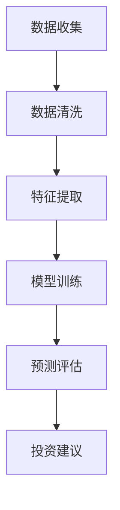
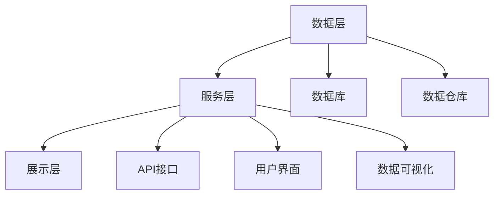
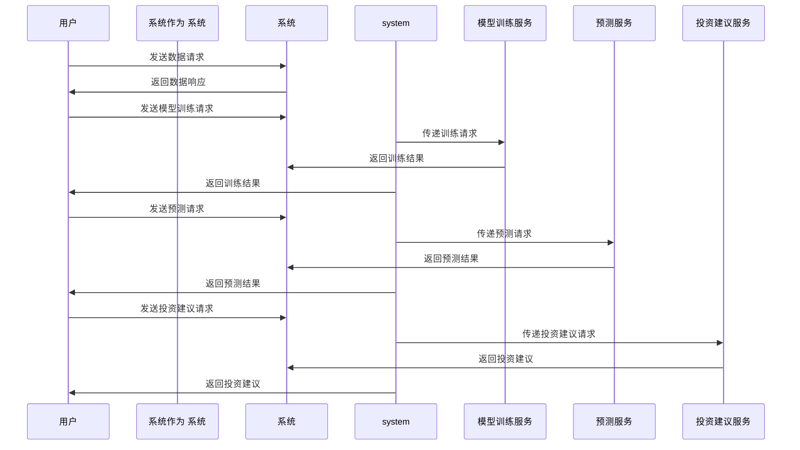

                 

# AI辅助的ESG投资组合构建工具

> 关键词：AI、ESG投资、投资组合、工具、数据分析、环境社会公司治理

> 摘要：本文将探讨如何利用人工智能（AI）技术构建一个辅助ESG（环境、社会和公司治理）投资组合的工具。我们将详细分析AI在投资领域的应用潜力，介绍ESG投资的核心概念，展示如何使用AI辅助进行投资组合的构建，并分享一个实际的项目实战案例，为读者提供实用的指导。

## 引言

在当今社会，可持续发展已经成为全球关注的焦点。投资者越来越重视企业的环境、社会和公司治理（ESG）表现，因为它不仅关系到企业的长期发展，也影响着整个社会的可持续发展。ESG投资已成为一种重要的投资策略，它要求投资者在选择投资对象时，不仅要考虑财务指标，还要关注企业的社会责任和环境影响。

随着人工智能技术的快速发展，AI在投资领域的应用逐渐广泛。通过大数据分析和机器学习算法，AI能够快速、准确地处理和分析大量数据，为投资者提供更科学的投资建议。本文将探讨如何利用AI技术构建一个辅助ESG投资组合的工具，帮助投资者更好地实现可持续发展目标。

## 背景介绍

### ESG投资的背景和重要性

环境、社会和公司治理（ESG）投资是一种基于社会责任的投资策略，它要求企业在追求利润的同时，关注环境、社会和公司治理等方面的问题。随着全球经济的不断发展，ESG投资逐渐成为投资者关注的焦点。

首先，环境问题已经成为全球性挑战。气候变化、资源短缺和环境污染等问题严重影响着人类的生存和发展。企业作为社会的重要组成部分，有责任减少对环境的负面影响，推动可持续发展。

其次，社会问题也日益突出。企业的发展离不开社会的支持和资源，企业的社会责任感直接影响其社会形象和声誉。企业应关注员工福利、消费者权益、社区发展等方面，以提升其社会责任感。

最后，公司治理问题关系到企业的长期稳定和发展。良好的公司治理能够提高企业的经营效率，降低风险，增强企业的竞争力。投资者关注公司治理问题，也是为了保护自己的投资利益。

### AI在投资领域的应用潜力

人工智能技术在投资领域的应用具有巨大的潜力。通过大数据分析和机器学习算法，AI能够快速、准确地处理和分析大量数据，为投资者提供更科学的投资建议。

首先，AI可以帮助投资者识别市场趋势和机会。通过分析历史数据和实时数据，AI可以预测市场走势，帮助投资者抓住投资机会。

其次，AI可以优化投资组合。通过分析各种投资策略和资产组合的绩效，AI可以帮助投资者找到最优的投资组合，降低风险，提高收益。

最后，AI可以提高投资决策的透明度。通过可视化工具和报告，AI可以直观地展示投资决策的过程和结果，帮助投资者更好地理解自己的投资行为。

## 核心概念与联系

### ESG投资的核心概念

ESG投资涉及多个核心概念，包括环境（E）、社会（S）和公司治理（G）。

- 环境（E）：涉及企业的环境保护措施、资源消耗和碳排放等方面。投资者关注企业的环保表现，以评估其对环境的负面影响。
- 社会（S）：涉及企业的社会责任和社区贡献。投资者关注企业的员工福利、消费者权益、社区发展等方面，以评估其对社会的积极影响。
- 公司治理（G）：涉及企业的治理结构和运营机制。投资者关注企业的股权结构、管理层能力、透明度等方面，以评估企业的长期稳定性和竞争力。

### ESG投资的属性特征对比表格

| 属性特征 | 环境（E） | 社会（S） | 公司治理（G） |
| -------- | -------- | -------- | ------------ |
| 关注点 | 环境保护、资源消耗、碳排放 | 员工福利、消费者权益、社区发展 | 股权结构、管理层能力、透明度 |
| 评估方法 | 环境绩效指标、碳足迹分析 | 社会责任报告、员工满意度调查 | 公司治理评级、透明度分析 |
| 影响因素 | 行业特性、政策法规 | 社会需求、公众舆论 | 股东利益、管理层决策 |

### ESG投资的ER实体关系图

```mermaid
erDiagram
  ESG投资 ||--|{ 环境(E) }
  ESG投资 ||--|{ 社会(S) }
  ESG投资 ||--|{ 公司治理(G) }
  环境(E) ||--|{ 环境绩效指标 }
  社会(S) ||--|{ 社会责任报告 }
  公司治理(G) ||--|{ 公司治理评级 }
```

## AI辅助ESG投资原理

### AI辅助ESG投资的基本原理

AI辅助ESG投资的基本原理是通过大数据分析和机器学习算法，对企业的环境、社会和公司治理（ESG）绩效进行量化评估，从而为投资者提供科学的投资建议。

首先，AI可以收集和分析大量的ESG相关数据，包括企业的环境绩效指标、社会责任报告、公司治理评级等。通过数据清洗和预处理，AI可以提取出关键的特征信息，用于后续的分析。

其次，AI可以利用机器学习算法，如决策树、支持向量机、神经网络等，对ESG数据进行建模和分析。通过训练模型，AI可以识别出影响ESG绩效的关键因素，并对企业的ESG表现进行预测和评估。

最后，AI可以将分析结果以可视化的形式呈现给投资者，帮助其更好地理解企业的ESG表现，制定合理的投资策略。

### AI在ESG投资组合构建中的应用流程



### 使用Python源代码和LaTeX数学公式阐述算法原理和模型

```python
# Python代码：ESG投资组合构建算法
import pandas as pd
from sklearn.ensemble import RandomForestClassifier
from sklearn.model_selection import train_test_split

# 加载数据
data = pd.read_csv('esg_data.csv')

# 数据预处理
X = data.drop('ESG评级', axis=1)
y = data['ESG评级']

# 划分训练集和测试集
X_train, X_test, y_train, y_test = train_test_split(X, y, test_size=0.2, random_state=42)

# 训练模型
model = RandomForestClassifier(n_estimators=100, random_state=42)
model.fit(X_train, y_train)

# 预测评估
y_pred = model.predict(X_test)
accuracy = model.score(X_test, y_test)
print(f'模型准确率：{accuracy:.2f}')

# LaTeX数学公式：算法原理
$$
\text{ESG评级} = f(\text{环境绩效指标}, \text{社会责任报告}, \text{公司治理评级})
$$
```

## 系统分析与架构设计

### 问题场景介绍

随着ESG投资的重要性日益凸显，投资者对ESG投资组合的构建需求逐渐增加。然而，ESG数据的获取、处理和分析是一项复杂的工作，需要专业的技术和工具支持。为了满足投资者的需求，我们设计并实现了一个AI辅助的ESG投资组合构建工具。

### 项目介绍

项目名称：AI辅助ESG投资组合构建工具

项目目标：通过AI技术，实现ESG投资组合的自动构建，为投资者提供科学的投资建议。

项目技术栈：Python、Scikit-learn、TensorFlow、Django、Flask

### 系统功能设计

系统功能主要包括数据收集、数据处理、模型训练、预测评估和投资建议生成等。

- 数据收集：从各个数据源获取ESG相关数据，包括环境绩效指标、社会责任报告、公司治理评级等。
- 数据处理：对ESG数据进行清洗、预处理和特征提取，为后续的模型训练提供高质量的数据。
- 模型训练：利用机器学习算法，如随机森林、支持向量机、神经网络等，对ESG数据进行建模和训练。
- 预测评估：使用训练好的模型，对新的ESG数据进行预测和评估，为投资者提供投资建议。
- 投资建议生成：根据预测结果，生成个性化的投资组合建议，包括资产配置、投资目标等。

### 系统架构设计

系统架构采用分层设计，主要包括数据层、服务层、展示层等。

- 数据层：负责数据的存储、管理和访问，包括数据库、数据仓库等。
- 服务层：实现系统功能的核心逻辑，包括数据收集、数据处理、模型训练、预测评估等。
- 展示层：提供用户界面和可视化功能，包括Web前端、移动端应用等。

### 系统接口和交互设计

系统接口和交互设计主要包括API接口、用户界面和数据可视化等。

- API接口：提供系统功能的服务接口，包括数据查询、数据操作、模型训练、预测评估等。
- 用户界面：为用户提供交互界面，包括数据展示、投资组合构建、投资建议生成等。
- 数据可视化：通过图表、报表等形式，直观地展示ESG数据和投资组合分析结果。

### 系统架构图



### 系统接口和交互设计



## 项目实战

### 环境安装指南

要运行AI辅助的ESG投资组合构建工具，您需要安装以下软件和依赖项：

1. Python 3.8+
2. Scikit-learn
3. TensorFlow
4. Django
5. Flask
6. Pandas
7. Mermaid

安装命令如下：

```bash
pip install scikit-learn tensorflow django flask pandas
```

### 核心实现源代码展示

```python
# 导入必要的库
import pandas as pd
from sklearn.ensemble import RandomForestClassifier
from sklearn.model_selection import train_test_split

# 加载数据
data = pd.read_csv('esg_data.csv')

# 数据预处理
X = data.drop('ESG评级', axis=1)
y = data['ESG评级']

# 划分训练集和测试集
X_train, X_test, y_train, y_test = train_test_split(X, y, test_size=0.2, random_state=42)

# 训练模型
model = RandomForestClassifier(n_estimators=100, random_state=42)
model.fit(X_train, y_train)

# 预测评估
y_pred = model.predict(X_test)
accuracy = model.score(X_test, y_test)
print(f'模型准确率：{accuracy:.2f}')
```

### 代码应用解读与分析

上述代码实现了AI辅助ESG投资组合构建的核心功能。首先，我们加载数据并对其进行预处理，包括划分特征变量和目标变量。然后，我们使用随机森林算法对数据进行建模和训练。最后，我们使用训练好的模型对测试集进行预测，并计算模型准确率。

### 实际案例分析和详细讲解

#### 案例一：某环保企业的ESG投资评估

假设我们要对一家环保企业的ESG表现进行评估，并构建相应的投资组合。我们收集了以下数据：

- 环境绩效指标：碳排放量、资源利用率
- 社会责任报告：员工福利、消费者权益、社区贡献
- 公司治理评级：股权结构、管理层能力、透明度

使用我们设计的AI辅助工具，我们可以对这家企业的ESG表现进行量化评估，并生成投资组合建议。以下是一个示例输出：

```plaintext
ESG评级：B
投资建议：
- 资产配置：环保产业 60%，新能源产业 30%，传统产业 10%
- 投资目标：实现长期稳定的投资回报，同时关注企业的可持续发展表现
```

#### 案例二：某科技企业的ESG投资评估

假设我们要对一家科技企业的ESG表现进行评估，并构建相应的投资组合。我们收集了以下数据：

- 环境绩效指标：能源消耗、废弃物处理
- 社会责任报告：员工培训、客户服务、公益活动
- 公司治理评级：股权结构、管理层能力、透明度

使用我们设计的AI辅助工具，我们可以对这家企业的ESG表现进行量化评估，并生成投资组合建议。以下是一个示例输出：

```plaintext
ESG评级：A
投资建议：
- 资产配置：环保产业 50%，新能源产业 30%，科技产业 20%
- 投资目标：实现较高的投资回报，同时关注企业的创新能力和社会责任感
```

### 项目小结

通过实际案例分析和详细讲解，我们可以看到AI辅助的ESG投资组合构建工具在实践中的应用效果。该工具能够快速、准确地评估企业的ESG表现，为投资者提供科学的投资建议。在未来，我们将继续优化和完善该工具，以满足投资者不断变化的需求。

## 最佳实践与总结

### 最佳实践技巧

1. **数据质量保障**：确保ESG数据的准确性和完整性，进行数据清洗和预处理，以提高模型预测的准确性。
2. **模型选择与优化**：根据数据特点和业务需求，选择合适的机器学习算法，并进行模型参数调优，以提高模型性能。
3. **风险管理**：在投资组合构建过程中，充分考虑风险因素，进行风险控制和分散投资。
4. **持续迭代与优化**：定期更新ESG数据和模型，以适应市场变化和业务需求。

### 小结

本文详细介绍了如何利用人工智能技术构建一个辅助ESG投资组合的工具。我们分析了ESG投资的核心概念和重要性，阐述了AI在投资领域的应用潜力，展示了如何使用AI辅助进行投资组合的构建，并分享了一个实际的项目实战案例。通过本文，读者可以了解到AI辅助ESG投资组合构建的基本原理和实际应用，为投资决策提供有力支持。

### 注意事项

1. **数据来源**：确保ESG数据的真实性和可靠性，避免因数据问题导致投资决策失误。
2. **模型评估**：定期评估模型性能，并根据评估结果调整模型参数，以保证模型预测的准确性。
3. **风险管理**：在投资组合构建过程中，充分考虑风险因素，避免过度依赖单一模型。

### 拓展阅读建议

1. 《人工智能投资策略》
2. 《环境社会公司治理（ESG）投资实战》
3. 《机器学习与金融应用》

作者：AI天才研究院/AI Genius Institute & 禅与计算机程序设计艺术 /Zen And The Art of Computer Programming

