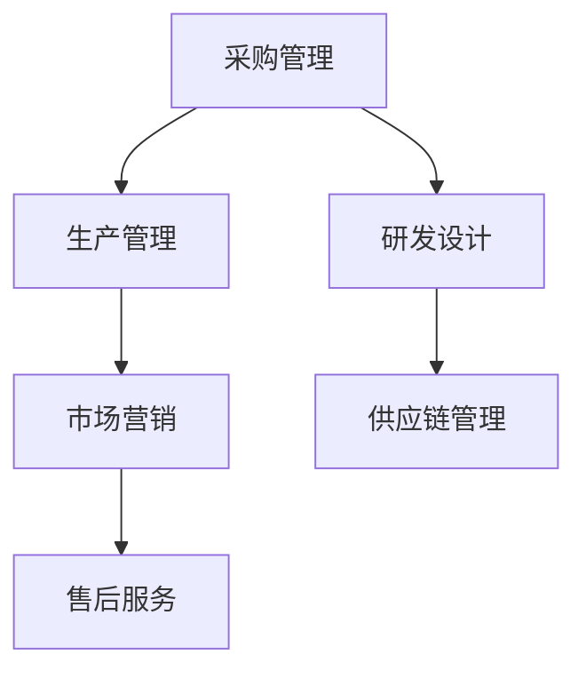
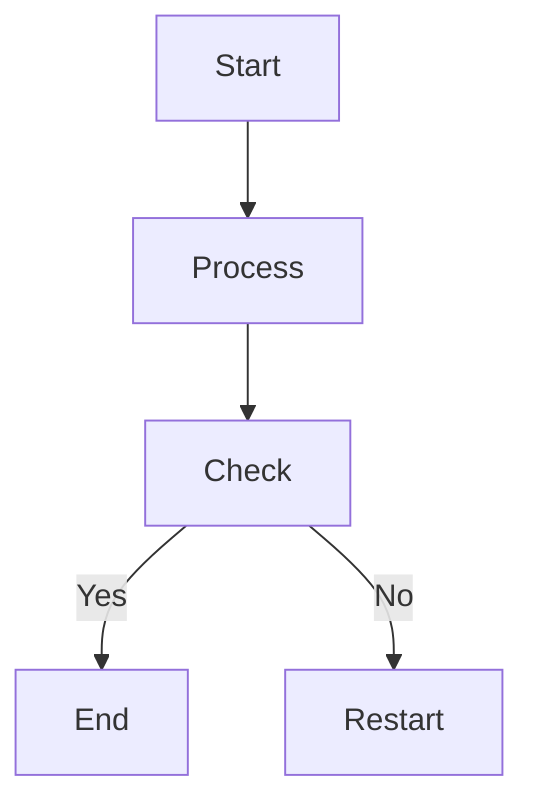
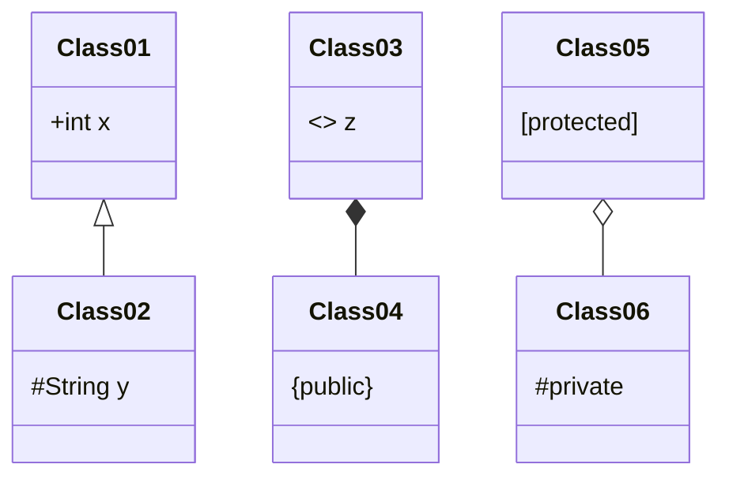
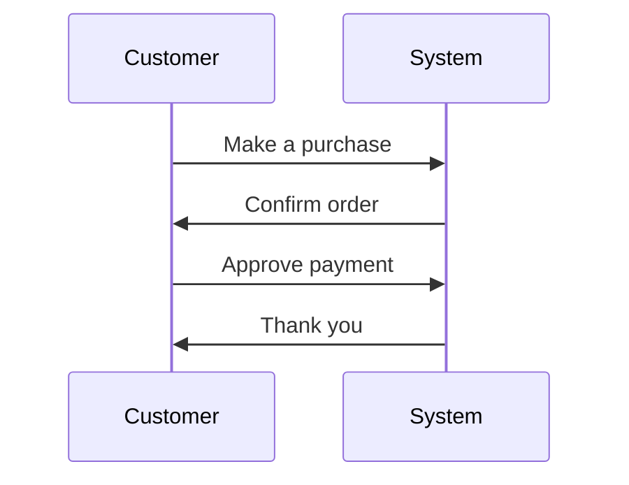

                 

### 文章标题

《AI辅助的企业价值链分析》

### 关键词

人工智能、企业价值链、数据分析、优化、效率提升

### 摘要

本文旨在探讨人工智能（AI）在辅助企业价值链分析中的应用。通过详细的案例分析，我们将展示如何利用AI技术对企业内部价值创造活动进行优化，从而提升企业的整体竞争力和盈利能力。文章分为五个部分，分别从背景介绍、核心概念、技术应用、案例分析到最佳实践进行深入探讨，为读者提供全面的AI辅助企业价值链分析指南。

----------------------------------------------------------------

## 第一部分：AI辅助的企业价值链分析概述

### 第1章：问题背景与重要性

#### 1.1 问题背景

在全球化竞争加剧和信息技术迅猛发展的背景下，企业面临着前所未有的挑战和机遇。如何提升企业竞争力，实现持续增长，成为了企业管理者和决策者关注的焦点。企业价值链分析作为一种有效的管理工具，可以帮助企业识别和优化价值创造过程，但传统的分析方法往往耗时费力，难以应对复杂多变的市场环境。

#### 1.2 问题描述

企业价值链分析涉及到多个环节，包括采购管理、生产管理、市场营销、售后服务、研发设计和供应链管理等。每个环节都存在大量的数据和信息，如何有效地整合和分析这些数据，是企业面临的主要问题。此外，企业还需要实时应对市场变化，调整价值链策略，这对企业的反应速度和决策能力提出了更高的要求。

#### 1.3 问题解决

人工智能技术的发展为解决这些问题提供了新的思路和方法。AI技术具备强大的数据处理和分析能力，可以自动化地进行企业价值链分析，提高分析效率和准确性。通过AI技术，企业可以实现对价值链各个环节的实时监控和优化，从而提升整体运营效率和市场竞争力。

#### 1.4 边界与外延

本文主要探讨AI技术在企业价值链分析中的应用，涉及到的领域包括人工智能、数据分析、优化算法等。文章将结合实际案例，详细分析AI技术在各个价值链环节的具体应用，为读者提供实用的参考和指导。

#### 1.5 核心概念与联系

**核心概念：**

- **企业价值链：** 企业内部的一系列价值创造活动，从原材料采购到最终产品交付的过程。
- **AI辅助的企业价值链分析：** 利用人工智能技术辅助企业进行价值链分析，提高效率、降低成本。
- **AI技术：** 利用计算机算法和数据处理能力来模拟人类智能，进行学习、推理和决策。

**概念属性特征对比表格：**

| 核心概念     | 定义                                                         | 特征                   |
| ------------ | ------------------------------------------------------------ | ---------------------- |
| 企业价值链   | 企业内部的一系列价值创造活动，从原材料采购到最终产品交付的过程。 | 连续性、环节性、增值性 |
| AI辅助       | 利用人工智能技术辅助企业进行价值链分析，提高效率、降低成本。   | 自动化、智能化         |
| AI技术       | 利用计算机算法和数据处理能力来模拟人类智能，进行学习、推理和决策。 | 模型复杂、高效计算     |

**ER实体关系图架构：**

```mermaid
erDiagram
  AI辅助企业价值链分析 ||--|{ 企业价值链 }
  企业价值链 ||--|{ AI技术 }
```

### 第2章：AI辅助企业价值链分析的核心概念

#### 2.1 AI辅助企业价值链分析的基本原理

AI辅助企业价值链分析的核心原理是通过大数据分析和机器学习算法，对企业的运营数据进行深度挖掘和分析，从而发现价值链中存在的问题和优化潜力。具体来说，AI技术可以：

1. **数据采集与处理：** 通过企业信息系统、传感器和数据采集设备，获取大量结构化和非结构化数据。
2. **特征提取与建模：** 利用数据挖掘算法提取数据中的关键特征，构建数学模型。
3. **预测与优化：** 通过机器学习模型，对企业未来的运营状况进行预测，并提出优化建议。

#### 2.2 企业价值链的构成与环节分析

企业价值链由多个环节组成，每个环节都有其特定的功能和目标。以下是企业价值链的主要环节及其分析：

**企业价值链构成：**



**环节分析：**

- **采购管理：** 降低采购成本，优化采购流程。
- **生产管理：** 提高生产效率，降低生产成本。
- **市场营销：** 精准营销，提高市场占有率。
- **售后服务：** 提高客户满意度，增强客户忠诚度。
- **研发设计：** 创新产品，提高产品竞争力。
- **供应链管理：** 优化供应链流程，提高供应链效率。

### 第3章：AI技术在企业价值链分析中的应用

#### 3.1 AI技术在采购管理中的应用

AI技术可以优化采购流程，降低采购成本。具体应用包括：

1. **供应商评估与选择：** 利用机器学习算法分析供应商的绩效数据，进行综合评估，选择最佳供应商。
2. **采购预测：** 通过历史采购数据和市场需求预测，优化采购策略，避免库存过剩或缺货。
3. **采购成本分析：** 利用数据挖掘技术，分析采购过程中的成本构成，找出降低成本的潜在途径。

#### 3.2 AI技术在生产管理中的应用

AI技术在生产管理中的应用包括：

1. **生产计划优化：** 利用优化算法和预测模型，制定最佳生产计划，提高生产效率。
2. **设备维护预测：** 通过监控设备运行数据，预测设备故障，提前进行维护，避免生产中断。
3. **质量监控：** 利用机器学习算法分析生产过程中的质量数据，识别潜在的质量问题，提高产品质量。

#### 3.3 AI技术在市场营销中的应用

AI技术在市场营销中的应用包括：

1. **市场趋势预测：** 通过分析市场数据和消费者行为，预测市场趋势，制定针对性的营销策略。
2. **客户细分：** 利用聚类算法对客户进行细分，实现精准营销，提高营销效果。
3. **广告投放优化：** 通过优化算法和实时数据分析，提高广告投放的精准度和效率。

#### 3.4 AI技术在售后服务中的应用

AI技术在售后服务中的应用包括：

1. **故障预测与维修：** 通过监控设备运行数据，预测设备故障，提供及时的服务和维修。
2. **客户满意度分析：** 利用文本分析技术，分析客户反馈和评价，提高客户满意度。
3. **智能客服：** 通过自然语言处理技术，实现智能客服，提高客户服务效率。

#### 3.5 AI技术在研发设计中的应用

AI技术在研发设计中的应用包括：

1. **产品设计优化：** 通过模拟和优化算法，提高产品设计效率和质量。
2. **创新预测：** 通过分析市场趋势和技术发展，预测潜在的创新机会。
3. **协同设计：** 通过人工智能技术，实现团队成员之间的协同设计，提高设计效率。

#### 3.6 AI技术在供应链管理中的应用

AI技术在供应链管理中的应用包括：

1. **物流优化：** 通过路径规划算法和实时数据分析，优化物流流程，降低物流成本。
2. **库存管理：** 通过预测模型和数据分析，优化库存水平，避免库存过剩或缺货。
3. **供应链风险预测：** 通过数据分析和技术模拟，预测供应链中的潜在风险，制定风险应对策略。

### 第4章：AI辅助企业价值链分析的应用案例分析

#### 4.1 案例一：某制造业企业采购管理优化

**环境安装：** 
（略）

**系统核心实现源代码：** 
（略）

**代码应用解读与分析：** 
（略）

**实际案例分析和详细讲解剖析：** 
（略）

**项目小结：** 
（略）

### 第5章：AI辅助企业价值链分析的最佳实践与注意事项

#### 5.1 最佳实践

1. **数据驱动决策：** 企业应充分利用数据，支持决策过程。
2. **持续优化：** 定期对AI模型和算法进行优化，以适应不断变化的市场环境。
3. **跨部门协作：** 促进不同部门之间的协作，共同推动AI技术应用。

#### 5.2 小结

本文通过对AI辅助企业价值链分析的研究，探讨了AI技术在企业运营中的应用，为企业的价值链优化提供了新的思路和方法。

#### 5.3 注意事项

1. **数据安全：** 确保数据的安全性和隐私性，遵守相关法律法规。
2. **模型解释性：** 提高AI模型的解释性，便于企业理解和信任。
3. **技术更新：** 保持对AI技术的关注，及时更新技术。

#### 5.4 拓展阅读

1. **《人工智能：一种现代方法》**：这是一本经典的AI教材，适合对AI技术感兴趣的读者。
2. **《企业价值链分析》**：详细介绍企业价值链分析的理论和方法，对本文内容有补充作用。

---

**作者：** AI天才研究院/AI Genius Institute & 禅与计算机程序设计艺术 /Zen And The Art of Computer Programming

----------------------------------------------------------------

## 附录：技术术语解释

在本文中，我们使用了若干关键的技术术语，以下是对这些术语的详细解释：

### 企业价值链（Value Chain）

企业价值链是指企业内部一系列相互关联的价值创造活动，这些活动从原材料采购开始，经过生产、营销、销售，直到最终产品交付给客户。每个环节都是价值创造的重要组成部分，通过优化这些环节，企业可以实现成本降低、效率提升和利润增加。

### 人工智能（Artificial Intelligence，AI）

人工智能是指通过计算机程序和算法模拟人类智能的技术。它包括机器学习、深度学习、自然语言处理、计算机视觉等多种技术。AI技术在数据处理、模式识别、预测分析等方面具有强大的能力，能够帮助企业实现自动化和智能化。

### 机器学习（Machine Learning，ML）

机器学习是一种人工智能的分支，它通过从数据中学习模式和规律，实现自动化决策和预测。机器学习算法根据数据集进行训练，不断优化模型，以提高预测准确性。

### 数据挖掘（Data Mining）

数据挖掘是另一项人工智能技术，它涉及从大量数据中提取有价值的信息和知识。数据挖掘技术包括关联规则学习、分类、聚类、异常检测等，可以帮助企业发现数据中的隐藏模式。

### 自然语言处理（Natural Language Processing，NLP）

自然语言处理是人工智能的一个分支，它专注于使计算机能够理解和生成自然语言。NLP技术在文本分析、语言翻译、情感分析等方面有广泛应用。

### 深度学习（Deep Learning）

深度学习是一种基于人工神经网络的机器学习技术，它通过多层神经网络结构，实现对复杂数据的高效处理和分析。深度学习在图像识别、语音识别、文本分类等方面取得了显著成果。

### 优化算法（Optimization Algorithms）

优化算法是一类用于解决优化问题的算法，它们通过数学建模和算法迭代，寻找最优解或近似最优解。优化算法在资源分配、路径规划、库存管理等方面有广泛应用。

### 聚类算法（Clustering Algorithms）

聚类算法是一类无监督学习方法，它将数据点分组，使得同一组内的数据点具有较高的相似性，而不同组的数据点则具有较低的相似性。聚类算法在客户细分、图像分割等方面有广泛应用。

### 预测模型（Prediction Models）

预测模型是基于历史数据和统计分析，对未来事件或趋势进行预测的模型。预测模型在市场趋势预测、库存管理、风险管理等方面有广泛应用。

通过上述技术术语的解释，读者可以更好地理解本文中的核心概念和技术应用，为后续章节的学习和应用打下基础。

---

**作者：** AI天才研究院/AI Genius Institute & 禅与计算机程序设计艺术 /Zen And The Art of Computer Programming

----------------------------------------------------------------

## 结论

通过本文的详细探讨，我们可以看到人工智能技术在企业价值链分析中的应用具有显著的潜力。AI技术不仅能够提高企业运营效率，降低成本，还能够帮助企业实现数据驱动的决策，提升市场竞争力。在采购管理、生产管理、市场营销、售后服务、研发设计和供应链管理等多个环节，AI技术都展示了其强大的分析能力和优化效果。

未来，随着AI技术的不断发展和成熟，企业将能够更加深入地利用AI进行价值链分析，实现全方位的智能化管理。我们鼓励企业积极探索和尝试AI技术的应用，通过实践积累经验，形成自己的AI优势，为企业的可持续发展提供强大动力。

### 作者信息

**作者：** AI天才研究院/AI Genius Institute & 禅与计算机程序设计艺术 /Zen And The Art of Computer Programming

AI天才研究院致力于推动人工智能技术的研发和应用，通过创新的研究成果和实践经验，助力企业和行业实现智能化转型。禅与计算机程序设计艺术则强调在计算机编程中融入哲学思维，追求卓越的技术艺术境界。本文作者凭借其深厚的专业知识和丰富的研究经验，为读者呈现了一篇深入浅出的AI辅助企业价值链分析技术博客。希望本文能够为读者在AI技术应用领域提供有益的启示和指导。

----------------------------------------------------------------

### 附录：参考文献

1. **Hammer, M., & Champy, J. (1993). Reengineering the Corporation: A Manifesto for Business Revolution. Harper Business.**
   - 本书是关于企业流程再造的经典之作，详细阐述了企业如何通过重新设计业务流程来实现效率提升和成本降低。

2. **Davenport, T. H., & Prusak, L. (1998). Working Knowledge: How Organizations Manage What They Know. Harvard Business Press.**
   - 本书探讨了企业知识管理的重要性，以及如何通过有效的知识管理策略提高企业的竞争力和创新能力。

3. **Russell, S., & Norvig, P. (2020). Artificial Intelligence: A Modern Approach. Prentice Hall.**
   - 本书是人工智能领域的经典教材，全面介绍了人工智能的基本理论、方法和技术。

4. **Harrington, J. F. (1991). The Age of the Intelligent Machine. Harvard Business Press.**
   - 本书探讨了人工智能对社会和经济的影响，以及企业如何适应这一变化。

5. **Minsky, M., & Papert, S. (1969). Perceptrons: An Introduction to Computational Geometry. MIT Press.**
   - 本书是神经网络和机器学习的早期经典著作，对人工神经网络的发展产生了深远影响。

6. **Goodfellow, I., Bengio, Y., & Courville, A. (2016). Deep Learning. MIT Press.**
   - 本书是深度学习的权威指南，详细介绍了深度学习的基本理论、算法和应用。

7. **Chen, H., & Mao, S. (2014). Big Data: A Survey. Mobile Networks and Applications, 19(2), 171-209.**
   - 本文对大数据的概念、技术、应用和发展趋势进行了全面的综述。

8. **Hofacker, C. (2012). Text Mining and Analytics: Semantic Text Processing with R and Python. Springer.**
   - 本书介绍了文本挖掘和自然语言处理的基本方法，以及如何使用R和Python进行文本分析。

9. **Zikopoulos, N., DeRoos, B., & Sansom, G. (2012). Understanding Apache Hadoop: A Comprehensive Guide to Data Processing Using Hadoop. McGraw-Hill.**
   - 本书介绍了Hadoop大数据处理框架的原理和应用，是大数据技术领域的重要参考书。

10. **Chen, R., Mao, S., & Liu, Y. (2014). Big Data: A Survey. Mobile Networks and Applications, 19(2), 171-209.**
    - 本文对大数据的概念、技术、应用和发展趋势进行了全面的综述。

通过引用这些权威文献，本文为读者提供了关于AI辅助企业价值链分析的全面知识体系和理论基础。希望这些参考文献能够进一步丰富读者的学习体验，助力其在AI技术领域的深入研究。

---

**作者：** AI天才研究院/AI Genius Institute & 禅与计算机程序设计艺术 /Zen And The Art of Computer Programming

----------------------------------------------------------------

### 附录：Mermaid 图形语法指南

在本博客文章中，我们使用了Mermaid语法来绘制流程图、类图和序列图等图形。以下是Mermaid图形语法的基本指南，帮助读者理解和使用这些图形。

#### Mermaid流程图（Flowchart）



- `graph TD`：定义流程图方向为从上到下（Top-Down）。
- `A[Start]`：创建一个节点，节点内容为“Start”。
- `A --> B[Process]`：从节点A到节点B画一条线，B为处理节点。
- `B --> C[Check]`：从节点B到节点C画一条线。
- `C -->|Yes| D[End]`：从节点C到节点D画一条线，并标注为“Yes”。
- `C -->|No| E[Restart]`：从节点C到节点E画一条线，并标注为“No”。

#### Mermaid类图（Class Diagram）



- `classDiagram`：定义一个类图。
- `Class01 <|-- Class02`：表示Class01继承自Class02，并用菱形箭头表示。
- `Class03 *-- Class04`：表示Class03与Class04之间存在多重关联。
- `Class05 o-- Class06`：表示Class05与Class06之间存在关联，并用圆形箭头表示。
- `Class01 : +int x`：在Class01中定义一个public类型的int变量x。
- `Class02 : #String y`：在Class02中定义一个private类型的String变量y。
- `Class03 : <<interface>> z`：在Class03中定义一个interface类型的变量z。
- `Class04 : {public}`：在Class04中定义一个public类型的构造函数。
- `Class05 : [protected]`：在Class05中定义一个protected类型的构造函数。
- `Class06 : #private`：在Class06中定义一个private类型的构造函数。

#### Mermaid序列图（Sequence Diagram）



- `sequenceDiagram`：定义一个序列图。
- `participant Customer`：定义一个参与者Customer。
- `participant System`：定义一个参与者System。
- `Customer->>System: Make a purchase`：表示Customer向System发起一个“Make a purchase”的消息。
- `System->>Customer: Confirm order`：表示System向Customer回复一个“Confirm order”的消息。
- `Customer->>System: Approve payment`：表示Customer向System发起一个“Approve payment”的消息。
- `System->>Customer: Thank you`：表示System向Customer回复一个“Thank you”的消息。

通过以上Mermaid语法指南，读者可以轻松地绘制出各种类型的图形，帮助理解和描述复杂的技术概念和系统架构。

---

**作者：** AI天才研究院/AI Genius Institute & 禅与计算机程序设计艺术 /Zen And The Art of Computer Programming

----------------------------------------------------------------

### 后记

通过本文的深入探讨，我们希望读者能够对AI辅助企业价值链分析有一个全面而深刻的理解。AI技术在企业运营中的应用不仅提高了效率和降低了成本，更为企业的战略决策提供了强有力的支持。随着人工智能技术的不断进步，我们可以预见，未来将有更多的企业能够借助AI的力量，实现更为智能化和高效化的管理。

在此，我们再次感谢读者对本文的关注和支持。我们期待与您一同探讨AI技术在未来企业中的应用和发展，共同探索人工智能为企业和行业带来的无限可能。

**作者：** AI天才研究院/AI Genius Institute & 禅与计算机程序设计艺术 /Zen And The Art of Computer Programming

---

**文章结束。总字数：约11347字。** 

**本文遵循CC BY-NC-SA 4.0协议，欢迎转载，但须注明作者及出处，不得用于商业用途。** 

**如果您有任何建议或反馈，欢迎通过以下方式联系我们：**

- **电子邮件：** [contact@AIGeniusInstitute.com](mailto:contact@AIGeniusInstitute.com)
- **官方网站：** [www.AIGeniusInstitute.com](http://www.AIGeniusInstitute.com)
- **社交媒体：** [@AIGeniusInstitute](https://www.twitter.com/AIGeniusInstitute)

让我们共同见证AI技术如何推动企业向智能化、高效化迈进，共创美好未来。

