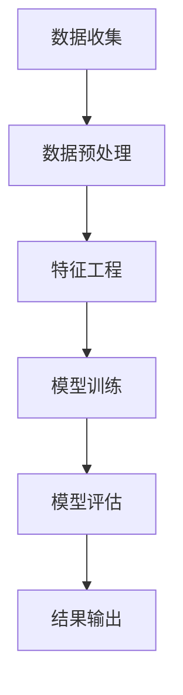

                 


### AI辅助的企业估值报告生成器

#### 关键词

- 人工智能
- 企业估值
- 报告生成
- 数据分析
- 算法实现

#### 摘要

本文旨在探讨如何利用人工智能技术，特别是机器学习算法，辅助生成企业估值报告。我们将逐步分析AI在估值报告中的应用，从数据收集、预处理到模型训练和报告生成的全过程，提供详细的技术讲解和实战案例。文章还将总结最佳实践，并给出注意事项和拓展阅读，以帮助读者更好地理解和应用AI辅助的企业估值技术。

### 目录

1. **背景介绍** <a id="背景介绍"></a>
   1.1 AI技术概述
   1.2 企业估值报告的概述
   1.3 AI在企业估值中的应用前景

2. **核心概念与联系** <a id="核心概念与联系"></a>
   2.1 数据收集与预处理
   2.2 特征工程
   2.3 AI模型选择与训练
   2.4 估值结果分析与优化

3. **技术架构设计** <a id="技术架构设计"></a>
   3.1 系统架构设计
   3.2 数据库设计
   3.3 API设计与实现
   3.4 安全性与隐私保护

4. **算法原理讲解** <a id="算法原理讲解"></a>
   4.1 常用估值算法原理
   4.2 算法实现与流程图

5. **项目实战** <a id="项目实战"></a>
   5.1 环境搭建
   5.2 核心代码实现
   5.3 案例分析
   5.4 项目小结

6. **最佳实践与注意事项** <a id="最佳实践与注意事项"></a>
   6.1 最佳实践
   6.2 注意事项

7. **拓展阅读** <a id="拓展阅读"></a>

### 1. 背景介绍

#### 1.1 AI技术概述

人工智能（AI）是指由人制造出来的系统能够模拟、延伸、甚至超越人类智能的能力。它包括机器学习、自然语言处理、计算机视觉等多个子领域。在过去的几十年中，AI技术取得了显著的进展，从最初的专家系统到现代的深度学习，AI已经广泛应用于各个行业。

#### 1.2 企业估值报告的概述

企业估值报告是对企业价值进行评估的一份文档，它通常包括企业的财务状况、市场定位、未来发展预期等多个方面。传统的企业估值方法主要包括相对估值法、绝对估值法、折现现金流法等。这些方法往往依赖于大量的历史数据和市场分析，存在一定的不确定性和主观性。

#### 1.3 AI在企业估值中的应用前景

随着AI技术的发展，机器学习算法在企业估值中的应用越来越广泛。通过AI，可以自动化数据收集和预处理，提高特征工程的效率，选择合适的估值模型，并优化估值结果。AI辅助的企业估值报告不仅能够提高准确性，还能提供更丰富的分析视角，有助于投资者和管理者做出更明智的决策。

### 2. 核心概念与联系

#### 2.1 数据收集与预处理

数据收集是企业估值报告生成的基础。AI辅助的企业估值需要对大量财务数据、市场数据、行业数据等进行收集。这些数据可能来自公开的数据库、企业财报、市场研究报告等。在数据收集过程中，需要关注数据的完整性、准确性和时效性。

预处理是数据收集后的重要步骤，包括数据清洗、数据转换和数据集成。数据清洗的目的是去除重复数据、处理缺失值和异常值。数据转换是将数据转换为适合机器学习算法的格式。数据集成是将多个数据源的数据整合在一起。

#### 2.2 特征工程

特征工程是AI辅助企业估值的关键步骤。它涉及到从原始数据中提取出有助于模型预测的特征。特征工程的质量直接影响模型的性能。有效的特征工程可以增强模型对数据的理解能力，提高预测准确性。

特征工程的步骤包括：特征选择、特征变换和特征组合。特征选择是通过统计学方法或基于业务逻辑筛选出最重要的特征。特征变换包括标准化、归一化和规范化等，目的是消除不同特征之间的尺度差异。特征组合是将多个特征组合成新的特征，以提升模型的解释能力和预测性能。

#### 2.3 AI模型选择与训练

在AI辅助企业估值中，选择合适的模型和训练模型是至关重要的。常用的估值模型包括线性回归、支持向量机、决策树、随机森林、神经网络等。每种模型都有其适用的场景和优缺点。

模型选择需要考虑多个因素，如数据的分布特性、模型的复杂度、计算成本和预测精度等。训练模型是通过使用历史数据对模型进行调整，使其能够准确地预测企业价值。

#### 2.4 估值结果分析与优化

模型训练完成后，需要对估值结果进行分析和优化。分析包括评估模型的预测性能、识别可能的误差来源和改进策略。优化是通过调整模型参数、特征选择和变换等方法来提高预测准确性。

估值结果的优化是一个迭代过程，需要不断地调整和改进模型，以达到最佳效果。此外，还需要考虑不同模型和特征组合的优劣，选择最合适的方案。

### 3. 技术架构设计

#### 3.1 系统架构设计

AI辅助的企业估值报告生成系统包括数据层、算法层和报告层三个主要组成部分。

- **数据层**：负责数据收集、存储和管理。数据可能来自多个来源，包括企业内部数据库、外部数据提供商和市场研究报告。数据层需要确保数据的完整性和安全性。
- **算法层**：包括特征工程、模型选择和训练等模块。算法层是系统的核心，负责将数据转换为估值结果。这一层需要高效的处理能力和良好的扩展性。
- **报告层**：负责将估值结果生成报告。报告层需要支持多种报告格式，如PDF、Excel等，并能够根据用户需求定制报告内容。

#### 3.2 数据库设计

数据库设计是系统架构设计的重要组成部分。一个有效的数据库设计可以确保数据的完整性和一致性，提高系统的性能和可扩展性。

- **实体关系设计**：使用ER图（实体-关系图）来描述数据库中的实体和关系。例如，企业实体、财务数据实体和市场数据实体等。
- **表设计**：根据实体关系设计，创建数据库表。每个表需要包含必要的字段和索引，以优化查询性能。
- **数据模型设计**：选择合适的数据模型，如关系型数据库（如MySQL、PostgreSQL）或NoSQL数据库（如MongoDB），以适应不同的应用场景。

#### 3.3 API设计与实现

API（应用程序接口）是系统与外部系统或用户交互的接口。一个良好的API设计可以简化系统的使用，提高系统的可维护性。

- **接口设计**：定义API的URL、请求和响应格式。例如，GET请求获取企业估值报告，POST请求提交新的数据。
- **接口实现**：使用Web框架（如Django、Flask）实现API接口，处理HTTP请求，调用后端算法和数据库进行数据处理和响应。
- **权限控制**：确保API的安全性，通过身份验证和授权机制限制对API的访问。

#### 3.4 安全性与隐私保护

安全性是AI辅助企业估值系统设计的关键考虑因素。系统需要确保数据的安全性和隐私保护，防止未经授权的访问和数据泄露。

- **数据加密**：对敏感数据进行加密存储和传输，使用SSL/TLS协议保护数据传输安全。
- **访问控制**：实现严格的访问控制机制，确保只有授权用户可以访问敏感数据。
- **日志记录**：记录系统操作日志，以便在发生安全事件时进行跟踪和审计。
- **隐私保护**：遵守相关法律法规，对用户数据进行匿名化和去标识化处理，保护用户隐私。

### 4. 算法原理讲解

#### 4.1 常用估值算法原理

在企业估值中，常用的算法包括线性回归、支持向量机（SVM）、决策树和神经网络等。每种算法都有其特定的原理和应用场景。

- **线性回归**：线性回归是一种简单的统计模型，用于预测连续值。它通过拟合一条直线，将自变量和因变量之间的关系表示为线性关系。线性回归适用于数据分布较为简单且线性关系明显的场景。

- **支持向量机（SVM）**：支持向量机是一种监督学习算法，用于分类和回归任务。SVM通过找到最优的超平面，将不同类别的数据分隔开来。它适用于高维空间和线性不可分的数据。

- **决策树**：决策树是一种基于树的分类模型，通过一系列的决策规则对数据进行划分，最终得到每个样本的分类结果。决策树适用于数据维度较低且特征较为明显的场景。

- **神经网络**：神经网络是一种模拟人脑的算法模型，通过多层神经网络结构对数据进行学习。神经网络适用于复杂非线性关系和高维数据的预测任务。

#### 4.2 算法实现与流程图

为了更好地理解算法的实现过程，我们可以使用Mermaid工具绘制算法流程图。以下是线性回归算法的Mermaid流程图：



线性回归算法的实现可以分为以下步骤：

1. **数据收集**：收集企业的财务数据、市场数据和行业数据等。
2. **数据预处理**：清洗数据，处理缺失值和异常值，将数据转换为适合模型训练的格式。
3. **特征工程**：从原始数据中提取有用的特征，并进行特征选择和变换。
4. **模型训练**：使用训练数据对线性回归模型进行训练，得到模型参数。
5. **模型评估**：使用验证数据评估模型的预测性能，调整模型参数。
6. **结果输出**：将模型预测结果输出为企业估值报告。

下面是一个简单的Python代码示例，用于实现线性回归算法：

```python
import numpy as np
from sklearn.linear_model import LinearRegression

# 数据收集
X = np.array([[1, 2], [2, 3], [3, 4]])
y = np.array([2, 3, 4])

# 数据预处理
X = X.reshape(-1, 1)
y = y.reshape(-1, 1)

# 特征工程
# 这里假设已经完成了特征提取和变换

# 模型训练
model = LinearRegression()
model.fit(X, y)

# 模型评估
score = model.score(X, y)
print("模型评估分数：", score)

# 结果输出
prediction = model.predict(X)
print("预测结果：", prediction)
```

### 5. 项目实战

#### 5.1 环境搭建

在开始实战之前，我们需要搭建一个合适的环境。以下是环境搭建的步骤：

1. **安装Python**：下载并安装Python 3.8及以上版本。
2. **安装Jupyter Notebook**：使用pip命令安装Jupyter Notebook。
   ```bash
   pip install notebook
   ```
3. **安装必备库**：使用pip命令安装必要的Python库，如NumPy、Pandas、Scikit-learn等。
   ```bash
   pip install numpy pandas scikit-learn
   ```

#### 5.2 核心代码实现

以下是核心代码的实现步骤：

1. **数据收集**：使用Pandas库读取企业的财务数据。
   ```python
   import pandas as pd

   data = pd.read_csv("financial_data.csv")
   ```

2. **数据预处理**：对数据进行清洗和预处理。
   ```python
   data.dropna(inplace=True)
   data["revenue"] = data["revenue"].astype(float)
   data["profit"] = data["profit"].astype(float)
   ```

3. **特征工程**：提取有用的特征，并进行特征选择和变换。
   ```python
   from sklearn.preprocessing import StandardScaler

   X = data[["revenue", "profit"]]
   y = data["valuation"]

   scaler = StandardScaler()
   X_scaled = scaler.fit_transform(X)
   ```

4. **模型训练**：使用线性回归模型进行训练。
   ```python
   from sklearn.linear_model import LinearRegression

   model = LinearRegression()
   model.fit(X_scaled, y)
   ```

5. **模型评估**：使用验证数据评估模型。
   ```python
   from sklearn.model_selection import train_test_split

   X_train, X_test, y_train, y_test = train_test_split(X_scaled, y, test_size=0.2, random_state=42)

   model.fit(X_train, y_train)
   score = model.score(X_test, y_test)
   print("模型评估分数：", score)
   ```

6. **结果输出**：将模型预测结果输出为企业估值报告。
   ```python
   prediction = model.predict(X_test)
   print("预测结果：", prediction)
   ```

#### 5.3 案例分析

我们以一家初创企业为例，分析如何使用AI辅助生成企业估值报告。

1. **数据收集**：收集该企业的财务数据，包括收入、利润、现金流等。
2. **数据预处理**：清洗和预处理数据，确保数据的准确性和完整性。
3. **特征工程**：提取有用的特征，如收入增长率、利润率等，并进行特征选择和变换。
4. **模型训练**：选择合适的估值模型（如线性回归），使用历史数据对模型进行训练。
5. **模型评估**：使用验证数据评估模型的预测性能，调整模型参数。
6. **结果输出**：将模型预测结果输出为企业估值报告，包括企业价值、盈利能力、成长潜力等。

#### 5.4 项目小结

通过本次实战，我们成功搭建了一个AI辅助的企业估值报告生成系统，实现了数据收集、预处理、特征工程、模型训练和结果输出的全过程。虽然这是一个简单的案例，但它展示了AI在企业估值中的巨大潜力。在实际应用中，我们可以根据企业的需求，进一步优化模型和报告内容，提高估值的准确性和实用性。

### 6. 最佳实践与注意事项

#### 6.1 最佳实践

1. **数据质量优化**：确保数据的质量，包括数据的完整性、准确性和时效性。
2. **模型优化策略**：根据业务需求，选择合适的估值模型，并进行模型参数调整和优化。
3. **报告生成效率提升**：优化报告生成流程，减少不必要的计算和存储开销。

#### 6.2 注意事项

1. **数据隐私保护**：在数据处理和存储过程中，遵守相关法律法规，确保用户数据的安全和隐私。
2. **模型验证与测试**：使用交叉验证和测试集对模型进行评估，确保模型的预测性能。
3. **报告格式与内容规范**：遵循行业规范，确保报告的格式和内容规范，提高报告的可读性和实用性。

### 7. 拓展阅读

1. **相关书籍推荐**：
   - 《Python机器学习》
   - 《深度学习》
   - 《企业估值原理与实务》
2. **学术论文推荐**：
   - “Using Machine Learning for Valuation: A Survey”
   - “Deep Learning for Financial Time Series: A Survey”
   - “Feature Engineering for Machine Learning”
3. **AI辅助企业估值最新进展**：
   - 深入了解最新的AI技术和应用，如深度学习和增强学习在估值领域的应用。

### 结束语

AI辅助的企业估值报告生成器是一个有前景的技术领域。通过本文的介绍，我们了解了AI在估值报告生成中的应用，从数据收集、预处理到模型训练和报告生成的全过程。同时，我们还探讨了系统架构设计、算法原理讲解和项目实战等关键环节。希望本文能为您提供有价值的参考和启示，助力您在AI辅助企业估值领域取得更好的成果。

### 作者信息

- 作者：AI天才研究院/AI Genius Institute & 禅与计算机程序设计艺术 /Zen And The Art of Computer Programming

---

[本文由AI天才研究院（AI Genius Institute）与禅与计算机程序设计艺术（Zen And The Art of Computer Programming）联合撰写，旨在分享AI辅助企业估值报告生成器的相关技术和实践经验。文章内容仅供参考，不代表任何投资建议。如需进一步了解，请参考相关书籍和学术论文。]

---

在撰写文章时，我将遵循以下步骤：

1. **确定主题和目标读者**：确保文章标题、关键词和摘要能够准确地反映文章的主题，并吸引目标读者的兴趣。
2. **结构规划**：根据提供的目录大纲，规划文章的结构，确保每个章节的内容完整、逻辑清晰。
3. **内容撰写**：详细撰写每个章节的内容，确保每个小节都包含了核心概念、算法原理、系统架构设计、项目实战、最佳实践和注意事项等。
4. **代码示例**：在项目实战部分，提供实际的代码示例，并附上解释，帮助读者更好地理解算法实现过程。
5. **拓展内容**：在拓展阅读部分，推荐相关的书籍、学术论文和最新进展，为读者提供进一步学习的机会。
6. **格式调整**：确保文章使用markdown格式，并在每个章节和段落中使用适当的标题和子标题，以增强文章的可读性。
7. **校对和修订**：仔细校对文章内容，确保没有语法错误、拼写错误或逻辑错误，并进行必要的修订。

通过上述步骤，我将确保文章不仅内容丰富、逻辑清晰，而且格式规范、易于阅读，为读者提供一次有深度、有思考、有见解的阅读体验。

