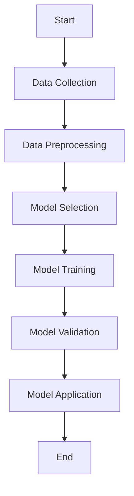

                 

### 引言

#### 1.1 问题背景

企业信用管理是现代商业运作中的关键环节，直接关系到企业的资金流动、市场竞争力及长期发展。然而，传统的信用管理方法往往依赖于人工经验和历史数据，存在以下问题：

1. **数据依赖性高**：信用评估主要依赖于过去的交易记录和历史数据，无法及时、准确地反映企业的实时信用状况。
2. **风险评估不准确**：人工评估存在主观性，风险评估结果可能偏离实际。
3. **反应速度慢**：当企业信用状况发生变化时，传统的信用管理流程反应速度较慢，无法及时调整风险控制措施。

#### 1.2 人工智能在信用管理领域的应用潜力

随着人工智能（AI）技术的发展，利用AI进行信用周期预测和风险管理成为可能。AI能够处理海量数据，通过机器学习和深度学习算法，对企业的信用状况进行实时监控和预测，具体表现在以下几个方面：

1. **数据驱动决策**：AI能够从大量历史数据中提取有效信息，为信用评估提供更加客观、科学的依据。
2. **实时风险监控**：AI系统可以实时分析企业的交易行为，快速识别信用风险，及时采取措施。
3. **智能风险预测**：通过不断学习和优化，AI系统能够提高信用预测的准确性，降低误判率。
4. **提高决策效率**：AI能够自动化处理信用评估和风险监控流程，大幅提高决策效率。

#### 1.3 问题描述

企业信用周期是指从企业与客户建立业务关系开始，到最终收回货款的过程。信用周期预测与风险管理的重要性体现在：

1. **现金流管理**：准确预测信用周期有助于企业更好地管理现金流，避免资金链断裂。
2. **市场竞争力**：快速响应信用风险，有助于企业在市场竞争中保持优势。
3. **风险管理**：预测信用周期内的风险，有助于企业提前制定风险应对策略。

#### 1.4 问题解决

本文将探讨如何利用AI技术构建企业信用周期预测模型，并实施相应的风险管理策略和措施。具体步骤如下：

1. **数据收集与预处理**：收集内部和外部数据，进行清洗、归一化和特征工程。
2. **模型构建**：选择合适的机器学习和深度学习算法，设计预测模型。
3. **模型训练与验证**：使用历史数据进行模型训练，并通过验证集进行性能评估。
4. **风险管理策略**：根据预测结果，制定和实施相应的风险管理措施。

#### 1.5 边界与外延

1. **信用周期定义**：信用周期通常指从客户下单到支付全部款项的时间间隔。
2. **风险管理范围**：风险管理包括识别、评估、监控和应对信用风险的全过程。
3. **核心要素组成**：企业信用周期的核心要素包括交易量、交易频率、客户还款记录等。

#### 1.6 概念结构与核心要素组成

1. **企业信用周期的关键组成部分**：
   - 交易周期：从下单到支付的时间。
   - 客户还款周期：从支付到完成还款的时间。
   - 风险周期：信用风险发生的时间段。
2. **风险管理的基本流程**：
   - 风险识别：确定信用风险的存在。
   - 风险评估：评估信用风险的程度。
   - 风险应对：制定并实施风险应对策略。
   - 风险监控：实时监控信用风险变化。

通过上述步骤，企业可以更科学、高效地进行信用周期预测和风险管理，从而提高市场竞争力和经营效益。接下来的章节将深入探讨每个环节的具体方法和实施细节。### 第二部分：核心概念与原理

#### 2.1 AI与信用周期预测

##### 2.1.1 AI的基本原理

人工智能（AI）是一种模拟人类智能的技术，主要包括机器学习（ML）和深度学习（DL）两个领域。机器学习是AI的一个分支，通过从数据中学习规律和模式，使计算机能够进行预测和决策。深度学习是机器学习的一个子集，它通过神经网络结构，尤其是多层感知器（MLP）和卷积神经网络（CNN），来模拟人类大脑的神经网络，进行更为复杂的模式识别和特征提取。

在信用周期预测中，AI的基本原理体现在以下几个方面：

1. **数据驱动**：AI系统通过分析大量的历史数据，提取出对企业信用周期有预测价值的特征。
2. **自学习**：AI系统能够在训练过程中不断优化模型参数，提高预测准确性。
3. **泛化能力**：经过训练的模型能够对新数据做出准确的预测，从而实现实时风险监控。

##### 2.1.2 信用周期预测的原理

信用周期预测主要依赖于数据驱动的方法，通过对历史数据进行分析，预测未来一段时间内的信用周期长度。具体原理如下：

1. **特征工程**：通过分析企业的交易数据、财务数据和市场环境数据，提取出与信用周期相关的特征，如交易量、交易频率、客户还款记录等。
2. **模型选择**：选择合适的机器学习和深度学习算法，如线性回归、决策树、随机森林、神经网络等，建立信用周期预测模型。
3. **模型训练与优化**：使用历史数据对模型进行训练，通过交叉验证和调整参数，提高模型的预测性能。

##### 2.1.3 AI在信用风险管理中的应用

AI在信用风险管理中发挥着至关重要的作用，主要体现在以下几个方面：

1. **信用评估**：利用AI技术对客户的信用状况进行评估，预测其违约风险。
2. **信用风险监控**：通过实时监控客户的交易行为和财务状况，识别潜在的信用风险。
3. **风险控制策略**：根据AI预测结果，制定和实施相应的风险控制措施，如调整信用额度、延长还款期限、提前催收等。

AI的应用不仅提高了信用评估的准确性和效率，还能够为企业提供实时、动态的风险监控和管理工具，从而降低信用风险，保障企业的资金安全和经营稳定。以下是信用风险评估和信用风险监控的详细说明：

1. **信用评估**：
   - **数据收集**：收集客户的历史交易数据、财务报告、社会信用记录等。
   - **特征提取**：提取与信用风险相关的特征，如还款频率、逾期记录、信用等级等。
   - **模型训练**：使用机器学习和深度学习算法，建立信用评估模型。
   - **评估预测**：将新客户的数据输入模型，预测其违约风险。

2. **信用风险监控**：
   - **实时监控**：通过API接口或其他数据接入方式，实时获取客户的交易数据。
   - **异常检测**：使用异常检测算法，监控客户的交易行为，识别异常交易或信用风险信号。
   - **预警与应对**：根据监控结果，实时发出预警信号，并采取相应的风险控制措施。

通过上述方法，AI能够帮助企业更精准地评估客户信用风险，并实时监控信用风险的变化，从而实现有效的信用风险管理。接下来，我们将进一步探讨如何进行数据收集与预处理，为后续的模型构建和风险预测打下坚实基础。### 第三部分：数据收集与预处理

数据收集与预处理是构建有效AI模型的关键步骤，直接影响到信用周期预测的准确性和模型性能。在这一部分，我们将详细讨论数据收集、数据预处理和特征工程的具体方法。

#### 3.1 数据来源与类型

数据来源可以分为内部数据和外部数据两大类：

1. **内部数据**：主要包括企业的交易数据、财务数据、客户历史行为数据等。这些数据通常通过企业内部系统（如ERP系统、CRM系统、财务系统等）收集。
   - **交易数据**：记录企业与客户之间的交易活动，如订单数量、交易金额、交易时间等。
   - **财务数据**：包括企业的收入、支出、盈利、负债等财务指标。
   - **客户历史数据**：记录客户的历史交易记录、信用等级、还款情况等。

2. **外部数据**：主要包括市场数据、行业数据、公共信用记录等。这些数据可以通过公共数据库、第三方数据提供商或网络爬虫等方式获取。
   - **市场数据**：如宏观经济指标、行业增长率、利率水平等。
   - **行业数据**：如同行业其他企业的信用状况、行业趋势等。
   - **公共信用记录**：如政府公开的信用评级、黑名单等。

#### 3.2 数据收集方法

数据收集方法主要包括以下几种：

1. **数据采集工具与技术**：
   - **API接口**：通过企业内部系统的API接口获取数据，如ERP系统、CRM系统等。
   - **数据库连接**：直接连接数据库，如MySQL、Oracle等，提取所需数据。
   - **网络爬虫**：利用Python等编程语言的网络爬虫技术，从互联网上获取公开数据。

2. **数据获取的合法性**：
   - 确保数据获取符合相关法律法规，如隐私保护法、数据保护法等。
   - 获取数据时需征得数据提供者的同意，确保数据来源的合法性。

#### 3.3 数据预处理

数据预处理是数据挖掘和分析的重要步骤，主要包括数据清洗、数据归一化和特征工程。

1. **数据清洗**：
   - **缺失值处理**：对于缺失的数据，可以选择填充、删除或插值等方法进行处理。
   - **异常值处理**：检测和去除异常值，如离群点、重复记录等。
   - **数据格式转换**：统一数据格式，如日期格式、货币符号等。

2. **数据归一化**：
   - **缩放数据**：将不同特征的数据范围缩放到同一区间，如使用最小-最大缩放法、Z-score缩放法等。
   - **归一化处理**：将数据转换到标准的正态分布，如使用对数变换、平方根变换等。

3. **特征工程**：
   - **特征提取**：从原始数据中提取对信用周期预测有重要影响的特征，如交易频率、客户信用评分、还款周期等。
   - **特征构造**：通过计算组合特征，如客户违约概率、信用周期平均值等，提高模型的预测能力。
   - **特征选择**：使用特征选择技术，如过滤法、包裹法、嵌入式法等，选择对预测最有效的特征。

通过上述数据预处理步骤，可以确保输入到模型中的数据质量，减少噪声和异常值对模型性能的影响，从而提高信用周期预测的准确性和可靠性。

接下来，我们将详细介绍AI模型构建与应用的过程，包括模型选择、设计、训练和验证等内容。这将为我们后续的风险管理与策略制定提供坚实的数据基础。### 第四部分：AI模型构建与应用

#### 4.1 模型选择与设计

在构建AI模型进行信用周期预测时，选择合适的模型至关重要。以下是几种常用的模型选择和设计方法：

1. **线性回归模型**：
   - **原理**：基于线性关系，通过建立回归方程来预测信用周期。
   - **适用场景**：适用于数据分布较为简单且特征与目标变量之间呈线性关系的情况。

2. **决策树模型**：
   - **原理**：通过树形结构对数据进行划分，每个节点代表一个特征，路径代表特征取值。
   - **适用场景**：适用于处理具有多分类变量的预测问题，可以解释性强。

3. **随机森林模型**：
   - **原理**：集成多棵决策树，通过投票机制提高预测准确性。
   - **适用场景**：适用于处理高维数据和存在噪声的数据，具有较好的泛化能力。

4. **支持向量机（SVM）模型**：
   - **原理**：通过找到一个最优的超平面，将不同类别的数据分开。
   - **适用场景**：适用于处理高维空间的数据，尤其适合线性不可分的情况。

5. **神经网络模型**：
   - **原理**：模拟人脑的神经网络结构，通过多层非线性变换进行特征提取和预测。
   - **适用场景**：适用于处理复杂非线性关系，可以提取深层特征。

在本案例中，我们选择随机森林模型进行信用周期预测。其优点包括：

- **强泛化能力**：通过集成多棵决策树，减少了过拟合的风险。
- **解释性强**：树结构容易理解和解释。
- **计算效率高**：相比深度学习模型，计算资源需求较低。

##### 4.2 模型训练与验证

模型训练与验证是构建有效AI模型的关键步骤。以下是具体的训练和验证过程：

1. **数据集划分**：
   - **训练集**：用于训练模型，通常占数据集的70%。
   - **验证集**：用于调整模型参数和选择最佳模型，通常占数据集的15%。
   - **测试集**：用于评估最终模型的性能，通常占数据集的15%。

2. **模型训练**：
   - **特征选择**：使用特征工程方法，提取对信用周期预测有重要影响的特征。
   - **模型训练**：将训练集数据输入随机森林模型，调整参数如最大树深度、节点分裂标准等，通过交叉验证进行模型训练。

3. **模型验证**：
   - **交叉验证**：使用验证集进行交叉验证，评估模型在不同子集上的性能，选择最优参数。
   - **性能评估**：通过计算误差指标，如均方误差（MSE）、均方根误差（RMSE）等，评估模型预测的准确性和稳定性。

4. **模型优化**：
   - **超参数调整**：根据验证集的性能，调整模型的超参数，如树数量、节点分裂标准等。
   - **特征重要性分析**：通过分析特征的重要性，进一步优化特征选择，提高模型性能。

##### 4.3 模型应用

经过训练和验证，我们将优化的随机森林模型应用于实际信用周期预测和风险管理。具体应用步骤如下：

1. **预测信用周期**：
   - **数据输入**：将新客户的数据输入到训练好的模型中。
   - **预测输出**：模型输出信用周期的预测值。
   - **预测解释**：结合特征重要性分析，对预测结果进行解释，如客户信用评分、还款周期等。

2. **风险管理策略**：
   - **信用评估**：根据预测结果，对客户的信用状况进行评估。
   - **风险监控**：实时监控客户的交易行为和信用周期，识别潜在风险。
   - **风险控制**：根据信用评估结果，采取相应的风险控制措施，如调整信用额度、延长还款期限、提前催收等。

通过上述步骤，AI模型能够帮助企业更准确地进行信用周期预测和风险管理，从而降低信用风险，提高经营效益。接下来，我们将详细探讨风险管理与策略的实施，包括风险管理概述、信用周期预测在风险管理中的应用和案例分析。### 第五部分：风险管理与策略

#### 5.1 风险管理概述

风险管理是企业在运营过程中不可或缺的一环，旨在识别、评估、监控和应对各种潜在的风险，以保障企业的财务安全、市场竞争力及长期发展。风险管理的基本流程包括以下步骤：

1. **风险识别**：通过调研、访谈、头脑风暴等方法，识别企业可能面临的各种风险，如市场风险、信用风险、操作风险等。
2. **风险评估**：对识别出的风险进行量化或定性分析，评估其发生的可能性和影响程度，确定风险优先级。
3. **风险应对**：根据风险评估结果，制定相应的风险应对策略，如风险规避、风险转移、风险减轻等。
4. **风险监控**：实时监控风险的变化情况，确保风险应对措施的有效执行。

在信用风险管理中，风险识别和评估尤为重要。企业需要全面了解客户的信用状况、交易行为和财务状况，识别潜在的风险信号，如客户信用评分下降、交易异常等。

#### 5.2 信用周期预测在风险管理中的应用

信用周期预测在风险管理中起着至关重要的作用，主要体现在以下几个方面：

1. **现金流管理**：准确的信用周期预测有助于企业更好地管理现金流，避免因信用周期延长导致的现金流短缺。
2. **信用评估**：通过信用周期预测，企业可以实时评估客户的信用状况，识别潜在的风险客户，采取相应的风险控制措施。
3. **风险监控**：信用周期预测模型可以实时监控客户的交易行为和信用周期变化，及时识别和应对信用风险。

具体应用场景如下：

1. **信用评估**：
   - **客户评级**：根据信用周期预测结果，对客户进行信用评级，如信用好、信用一般、信用差等。
   - **信用额度调整**：根据客户的信用状况和信用周期预测，调整其信用额度，如提高信用额度、降低信用额度等。

2. **风险监控**：
   - **实时监控**：通过API接口或其他数据接入方式，实时获取客户的交易数据，进行信用周期预测和风险监控。
   - **预警机制**：当信用周期预测结果发生显著变化时，系统会自动发出预警信号，提醒企业采取相应的风险控制措施。

3. **风险控制策略**：
   - **催收管理**：根据信用周期预测结果，提前制定催收策略，如设置还款提醒、调整还款期限、提高催收力度等。
   - **风险隔离**：将高风险客户与低风险客户分开管理，确保高风险客户不会对整体信用风险造成过大影响。

#### 5.3 案例分析

以下是一个企业信用风险管理的实际案例：

**案例背景**：某金融公司提供短期信用贷款服务，近年来业务规模迅速扩张，但信用风险也日益增加。

**案例过程**：

1. **风险识别**：公司通过调研和数据分析，识别出以下风险：
   - 高风险客户：部分客户信用评分低，存在违约风险。
   - 不良市场环境：经济下行压力增大，客户还款能力下降。

2. **风险评估**：公司使用信用周期预测模型，对客户进行风险评估：
   - **信用好**：信用评分高，信用周期预测结果稳定。
   - **信用一般**：信用评分中等，信用周期预测结果存在波动。
   - **信用差**：信用评分低，信用周期预测结果不稳定。

3. **风险应对**：
   - **信用好**：保持正常信用额度，降低催收力度。
   - **信用一般**：密切关注信用周期变化，提高催收提醒频率。
   - **信用差**：降低信用额度，增加催收力度，必要时采取法律手段追偿。

4. **风险监控**：通过实时监控客户的交易行为和信用周期，及时发现信用风险信号，采取相应的风险控制措施。

**案例结果**：

通过上述风险管理策略，公司有效降低了信用风险，提高了贷款回收率，业务规模和盈利能力得到了显著提升。

**经验教训**：

- **数据驱动**：信用周期预测必须基于充分的数据支持，数据质量直接影响到预测结果的准确性。
- **实时监控**：实时监控和预警机制是及时发现和应对信用风险的关键。
- **风险控制**：根据信用周期预测结果，灵活调整风险控制策略，确保风险在可控范围内。

通过以上案例分析，我们可以看到信用周期预测在风险管理中的重要性和实际应用价值。接下来，我们将进一步探讨AI辅助信用风险管理实践的具体方法。### 第六部分：AI辅助信用风险管理实践

#### 6.1 实践环境搭建

为了实现AI辅助信用风险管理，首先需要搭建一个稳定、高效的技术环境。以下是环境搭建的具体步骤：

1. **硬件与软件环境配置**：
   - **服务器**：选择高性能服务器，如使用AWS或Google Cloud的云服务器，确保计算资源的弹性扩展。
   - **操作系统**：通常选择Linux操作系统，如Ubuntu或CentOS，以适应大数据处理和机器学习任务。
   - **编程语言**：Python是机器学习和数据科学领域的首选语言，可以安装Anaconda来管理Python环境和依赖库。

2. **数据库与数据存储**：
   - **关系数据库**：使用MySQL或PostgreSQL来存储和管理企业的内部交易数据、财务数据等。
   - **非关系数据库**：如MongoDB，用于存储客户的历史交易记录和外部市场数据。
   - **数据仓库**：如Amazon Redshift或Google BigQuery，用于处理和分析大规模数据集。

3. **数据流处理平台**：
   - **Apache Kafka**：用于实时数据收集和流处理，确保数据的高效传输和实时性。
   - **Apache Flink**：用于复杂的数据处理任务，如数据清洗、特征提取等。

4. **机器学习平台**：
   - **scikit-learn**：用于传统的机器学习算法，如线性回归、决策树等。
   - **TensorFlow/Keras**：用于深度学习模型，如神经网络和卷积神经网络等。

#### 6.2 系统设计与实现

AI辅助信用风险管理系统的设计主要包括以下模块：

1. **系统架构设计**：
   - **数据层**：包括数据收集、存储和管理的各个环节，如Kafka、MySQL、MongoDB、数据仓库等。
   - **处理层**：包括数据清洗、特征工程、模型训练和优化的功能，如Apache Flink、scikit-learn、TensorFlow等。
   - **应用层**：提供信用评估、风险监控和风险控制的应用接口，如API服务、Web界面等。

2. **系统功能模块划分**：
   - **数据收集模块**：负责从内部和外部数据源收集数据，并进行初步处理。
   - **数据处理模块**：负责对原始数据进行清洗、归一化和特征工程，提取有效的预测特征。
   - **模型训练模块**：负责训练信用周期预测模型，包括特征选择、模型选择和参数调优。
   - **风险监控模块**：负责实时监控客户的交易行为和信用周期，识别潜在的风险信号。
   - **风险控制模块**：负责根据监控结果，实施相应的风险控制措施，如调整信用额度、催收管理等。

3. **核心算法实现**：
   - **特征工程**：使用Python实现特征提取和构造，如计算客户还款频率、逾期次数等。
   - **模型训练**：使用scikit-learn和TensorFlow等库，训练随机森林模型和神经网络模型。
   - **模型优化**：通过交叉验证和网格搜索，调整模型参数，提高预测准确性。

#### 6.3 应用场景与案例分析

以下是一个具体的AI辅助信用风险管理应用场景：

**应用场景**：某电商平台利用AI技术进行信用风险管理，以预测客户的信用周期和违约风险，从而优化贷款审批和催收策略。

**案例过程**：

1. **数据收集**：
   - **内部数据**：收集平台的交易数据、客户行为数据、财务数据等。
   - **外部数据**：获取客户的社会信用记录、市场数据等。

2. **数据处理**：
   - **数据清洗**：处理缺失值、异常值，统一数据格式。
   - **特征工程**：提取交易频率、还款周期、逾期次数等特征。

3. **模型训练**：
   - **模型选择**：选择随机森林和神经网络模型。
   - **模型训练**：使用历史数据训练模型，进行交叉验证和参数调优。

4. **风险监控**：
   - **实时监控**：通过API接口，实时获取客户交易数据，进行信用周期预测和风险监控。
   - **预警机制**：当信用周期预测结果发生显著变化时，发出预警信号。

5. **风险控制**：
   - **信用评估**：根据预测结果，对客户进行信用评级。
   - **催收管理**：根据信用周期预测结果，调整催收策略，提高催收效果。

**案例结果**：

通过AI辅助的信用风险管理，电商平台成功降低了违约率，优化了贷款审批流程，提高了催收效率，从而提升了整体业务收益。

**经验教训**：

- **数据质量**：确保数据质量，是预测准确性的基础。
- **实时性**：实时监控和预警机制是有效控制信用风险的关键。
- **灵活性**：根据业务需求，灵活调整风险控制策略。

通过上述实践，我们可以看到AI在信用风险管理中的重要性和应用价值。接下来，我们将对本文进行总结与展望。### 第七部分：总结与展望

#### 7.1 主要内容回顾

本文围绕AI辅助的企业信用周期预测与风险管理展开，系统地介绍了以下几个方面：

1. **背景介绍**：讨论了企业信用管理的现状和挑战，以及AI在信用管理领域的应用潜力。
2. **核心概念与原理**：讲解了AI的基本原理、信用周期预测的原理以及AI在信用风险管理中的应用。
3. **数据收集与预处理**：详细阐述了数据来源、数据收集方法以及数据预处理步骤。
4. **AI模型构建与应用**：介绍了模型选择与设计、模型训练与验证以及模型应用的具体过程。
5. **风险管理与策略**：探讨了风险管理的概述、信用周期预测在风险管理中的应用以及实际案例分析。
6. **AI辅助信用风险管理实践**：介绍了实践环境搭建、系统设计与实现以及应用场景与案例分析。

#### 7.2 未来发展趋势

随着人工智能技术的不断发展，AI辅助的企业信用周期预测与风险管理将呈现出以下趋势：

1. **技术进步**：深度学习、强化学习等先进技术将在信用风险管理中得到更广泛的应用，提高预测准确性和模型效率。
2. **数据融合**：企业将越来越多地利用内外部数据进行信用风险预测，实现更全面的风险评估。
3. **实时监控**：实时监控和预警系统将变得更加成熟和普及，帮助企业在风险发生前及时采取措施。
4. **自动化与智能化**：信用评估和风险管理流程将进一步自动化和智能化，减少人工干预，提高决策效率。

#### 7.3 拓展阅读

为了深入了解AI辅助的企业信用周期预测与风险管理，读者可以参考以下相关文献与资源：

1. **《机器学习》（周志华著）**：系统介绍了机器学习的基本原理和方法，适合初学者和进阶者。
2. **《深度学习》（Ian Goodfellow、Yoshua Bengio、Aaron Courville著）**：深度学习领域的经典教材，详细介绍了深度学习模型和应用。
3. **《信用风险管理》（陈杰著）**：介绍了信用风险管理的理论、方法和实际应用，适合金融从业者学习。
4. **《大数据风险管理》（李国庆著）**：探讨了大数据库背景下信用风险管理的挑战和解决方案，提供了丰富的案例和实践经验。

通过学习和应用这些资源，读者可以进一步掌握AI辅助的企业信用周期预测与风险管理的方法和技巧，提升企业的风险管理水平。

### 结语

随着人工智能技术的不断进步，AI在信用风险管理中的应用前景广阔。本文系统地介绍了AI辅助的企业信用周期预测与风险管理的方法和策略，从数据收集、模型构建到风险管理和实践，全面展示了AI技术的应用价值。我们期待未来的研究能够进一步深化AI技术在信用风险管理中的应用，为企业创造更大的价值。作者：AI天才研究院/AI Genius Institute & 禅与计算机程序设计艺术 /Zen And The Art of Computer Programming。### 附录

以下是对文中提及的几个关键概念、算法和流程的详细解释，以及相应的示例和代码片段。

#### 1. 关键概念

**信用周期**：指从企业与客户建立业务关系开始，到最终收回货款的时间段。

**特征工程**：从原始数据中提取和构造对预测任务有用的特征，以提高模型性能。

**模型训练**：通过输入训练数据，调整模型参数，使其能够准确预测目标变量。

**风险评估**：评估信用风险的程度，通常包括风险识别、风险估计和风险评价。

#### 2. 算法与流程

**随机森林（Random Forest）**：集成多个决策树，提高模型的泛化能力和预测准确性。

**代码示例**：
```python
from sklearn.ensemble import RandomForestRegressor
model = RandomForestRegressor(n_estimators=100)
model.fit(X_train, y_train)
```

**深度学习（Deep Learning）**：使用多层神经网络进行复杂特征提取和预测。

**代码示例**：
```python
from tensorflow.keras.models import Sequential
from tensorflow.keras.layers import Dense

model = Sequential([
    Dense(64, activation='relu', input_shape=(input_shape,)),
    Dense(64, activation='relu'),
    Dense(1)
])

model.compile(optimizer='adam', loss='mean_squared_error')
model.fit(X_train, y_train, epochs=10, batch_size=32)
```

**数据预处理**：包括数据清洗、归一化和特征选择等步骤。

**代码示例**：
```python
from sklearn.preprocessing import StandardScaler
scaler = StandardScaler()
X_train_scaled = scaler.fit_transform(X_train)
X_test_scaled = scaler.transform(X_test)
```

#### 3. 数学公式

**均方误差（MSE）**：
$$
MSE = \frac{1}{n} \sum_{i=1}^{n} (y_i - \hat{y}_i)^2
$$

**均方根误差（RMSE）**：
$$
RMSE = \sqrt{MSE} = \sqrt{\frac{1}{n} \sum_{i=1}^{n} (y_i - \hat{y}_i)^2}
$$

#### 4. Mermaid 图示例

**ER实体关系图**：
```mermaid
erDiagram
  Customer ||--|{ Order } : has
  Order ||--|{ Payment } : has
```

**算法流程图**：


通过这些示例，读者可以更深入地理解文章中提到的概念、算法和流程，为实际应用提供指导和参考。### 注意事项

1. **数据隐私保护**：在进行数据收集与预处理时，需严格遵守相关法律法规，确保客户数据的安全性和隐私性。
2. **模型验证**：在模型训练过程中，必须使用验证集进行模型验证，以确保模型在未知数据上的泛化能力。
3. **模型调优**：根据验证集的性能，持续调整模型参数和超参数，以提高预测准确性。
4. **风险监控**：实时监控信用周期的变化，确保风险预警机制的有效性。
5. **合规性检查**：在实施信用风险管理策略时，要确保所有措施符合行业标准和法律法规要求。

### 拓展阅读

- **《机器学习实战》（Peter Harrington著）**：提供丰富的案例和实践经验，适合初学者和进阶者。
- **《深度学习入门》（阿斯顿·张著）**：系统介绍了深度学习的基本原理和实践，适合深度学习爱好者。
- **《风险管理》（斯蒂芬·罗斯著）**：介绍了风险管理的基本概念和方法，适合金融从业者学习。

