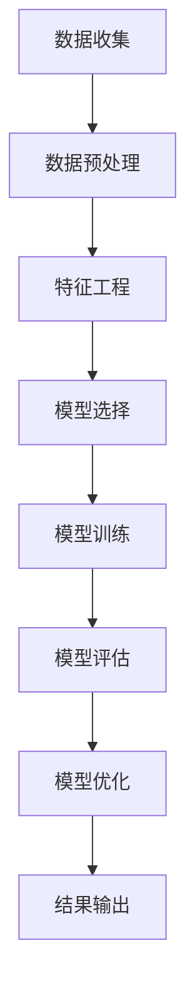
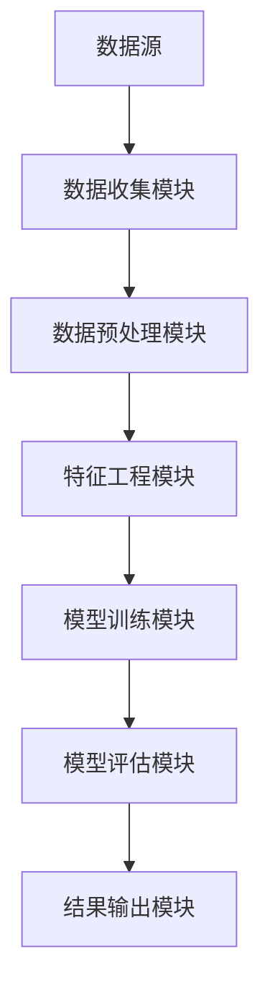
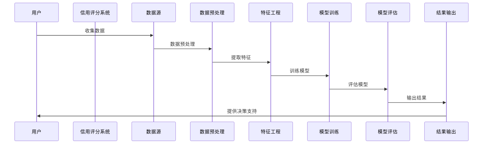

                 

## AI辅助的企业信用评分卡开发

### 关键词

- 信用评分卡
- AI辅助技术
- 数据挖掘
- 特征工程
- 数学模型

### 摘要

随着商业环境的日益复杂和信用风险的不断上升，企业信用评分卡的开发变得尤为重要。传统的信用评分方法在处理大规模数据和复杂特征时存在局限性。本文将探讨如何利用人工智能（AI）技术，特别是数据挖掘和机器学习，来辅助开发企业信用评分卡。文章将详细介绍信用评分卡的核心概念、AI辅助信用评分的原理和算法，并分享一个实际项目案例，通过系统分析与架构设计、项目实战和最佳实践提示，展示AI在信用评分卡开发中的强大潜力和应用效果。

### 目录大纲

1. 第一部分：背景介绍
    1.1 企业信用评分卡概述
    1.2 AI辅助信用评分的核心概念与联系
    1.3 AI辅助信用评分的算法原理讲解
    1.4 数学模型和数学公式 & 详细讲解 & 举例说明
    1.5 系统分析与架构设计方案
    1.6 项目实战
    1.7 最佳实践 Tips

2. 第二部分：深入分析与实现
    2.1 数据收集与预处理
    2.2 特征工程
    2.3 模型选择与训练
    2.4 模型评估与优化
    2.5 系统设计与实现

3. 第三部分：实践应用与总结
    3.1 实际项目案例分析
    3.2 项目总结与经验分享
    3.3 未来发展趋势与挑战

### 第一部分：背景介绍

#### 1.1 企业信用评分卡概述

**问题背景**

在现代商业环境中，企业信用评分卡已成为金融机构、供应商和合作伙伴在决策过程中不可或缺的工具。信用评分不仅影响企业的融资成本，还关系到企业的市场准入、供应链稳定性等多方面。然而，传统的信用评分方法主要依赖于历史数据和经验规则，在面对大量动态变化的数据时，往往难以精确地评估企业的信用风险。

**企业信用评分的现状与挑战**

目前，企业信用评分主要依赖于以下几种方法：

- **基于规则的方法**：通过预定义的规则来评估企业的信用状况，如信用评级、债务偿付能力等。这种方法简单易行，但在处理复杂、多维度的数据时存在局限性。
- **统计模型**：使用统计学方法，如回归分析、判别分析等，对企业信用进行评分。这种方法在一定程度上能提高评分的准确性，但模型构建复杂，对数据质量要求较高。
- **专家系统**：结合专家知识和计算机技术，通过构建决策树、模糊逻辑等模型来评估企业信用。这种方法依赖于专家的经验，难以适应快速变化的商业环境。

以上传统方法在处理大规模数据和复杂特征时存在以下挑战：

- **数据依赖性强**：传统方法依赖于历史数据，难以应对数据缺失、噪声和异常值等问题。
- **模型适应性差**：传统方法对数据变化和新的业务场景响应较慢，难以动态调整评分模型。
- **预测准确性受限**：传统方法在处理多维数据和高维特征时，准确性和稳定性难以保证。

**AI技术在信用评分中的应用潜力**

人工智能技术，特别是数据挖掘和机器学习，为信用评分卡的开发提供了新的思路和工具。AI技术具有以下优势：

- **数据驱动**：AI技术能够从海量数据中自动提取有价值的信息，提高信用评分的准确性。
- **自适应性强**：AI模型能够根据新的数据不断优化和调整，适应快速变化的商业环境。
- **模型多样性**：AI技术提供了多种模型和算法，可以根据业务需求和数据特点选择合适的模型，提高评分的灵活性。

通过AI技术，信用评分卡可以更全面、准确地评估企业的信用状况，为企业提供更可靠的风险控制和管理工具。本文将详细探讨AI辅助企业信用评分卡的构建过程，从核心概念到算法实现，再到实际应用，全面展示AI技术在信用评分卡开发中的潜力。

#### 1.2 问题描述

**信用评分的核心任务**

企业信用评分的核心任务是通过对企业历史数据、财务状况、行业趋势等多方面信息的分析，评估企业的信用风险，并为金融机构、供应商等提供决策支持。具体而言，信用评分的核心任务包括：

- **信用风险识别**：通过分析企业财务报表、信用历史、经营状况等数据，识别潜在的信用风险。
- **信用评分计算**：基于识别的信用风险，运用适当的模型和算法，对企业进行信用评分，为不同风险等级的企业分配相应的信用等级。
- **决策支持**：将信用评分结果应用于实际决策场景，如贷款审批、供应商选择、商业合作等，提高决策的准确性和效率。

**信用评分的影响因素**

企业信用评分的影响因素是多方面的，主要包括：

- **财务状况**：企业的资产负债情况、盈利能力、现金流等财务指标是评估企业信用的重要依据。
- **历史信用记录**：企业过去的信用行为，如还款记录、违约次数等，对信用评分有直接影响。
- **经营状况**：企业的业务规模、市场地位、管理能力等经营指标反映了企业的整体健康状况。
- **行业趋势**：企业所在行业的市场前景、政策环境、竞争状况等对企业的信用状况有重要影响。
- **外部环境**：宏观经济环境、政策法规变化、自然灾害等外部因素也可能影响企业的信用风险。

**信用评分的目标与指标**

信用评分的目标是准确评估企业的信用风险，为决策提供科学依据。具体目标包括：

- **准确性**：信用评分结果应尽可能接近企业的实际信用风险，降低误判率。
- **稳定性**：信用评分模型应具有较强的稳定性，能够适应数据变化和业务场景的变化。
- **效率**：信用评分模型应能够在短时间内处理大量数据，满足快速决策的需求。

常用的信用评分指标包括：

- **准确率**：正确预测信用风险的比例。
- **召回率**：在所有高风险企业中，正确识别出的比例。
- **F1分数**：准确率和召回率的调和平均，综合评估模型的性能。
- **预测值分布**：信用评分结果的分布情况，反映模型的区分能力。

**信用评分的目标与指标**

信用评分的目标是准确评估企业的信用风险，为决策提供科学依据。具体目标包括：

- **准确性**：信用评分结果应尽可能接近企业的实际信用风险，降低误判率。
- **稳定性**：信用评分模型应具有较强的稳定性，能够适应数据变化和业务场景的变化。
- **效率**：信用评分模型应能够在短时间内处理大量数据，满足快速决策的需求。

常用的信用评分指标包括：

- **准确率**：正确预测信用风险的比例。
- **召回率**：在所有高风险企业中，正确识别出的比例。
- **F1分数**：准确率和召回率的调和平均，综合评估模型的性能。
- **预测值分布**：信用评分结果的分布情况，反映模型的区分能力。

#### 1.3 问题解决

**传统的信用评分方法**

传统的信用评分方法主要包括以下几种：

- **基于规则的方法**：通过预设的规则和逻辑条件对企业的信用状况进行评分。这种方法简单易行，但规则设定较为主观，适应性较差。
- **统计模型**：使用统计学方法，如线性回归、逻辑回归等，对企业信用评分进行建模。这种方法能够处理多维数据，但模型的构建和验证过程较为复杂。
- **专家系统**：结合专家经验和计算机技术，通过构建决策树、模糊逻辑等模型对企业信用评分进行预测。这种方法在一定程度上提高了评分的准确性，但依赖于专家的知识和经验。

尽管传统方法在特定场景下具有一定的应用价值，但其在处理大规模数据和复杂特征时存在明显的局限性：

- **数据依赖性**：传统方法依赖于历史数据和经验规则，难以应对数据缺失和噪声等问题。
- **模型适应性**：传统模型在应对数据变化和新的业务场景时表现较差，难以实现动态调整。
- **预测准确性**：传统方法在处理高维特征和大规模数据时，预测准确性和稳定性难以保证。

**AI辅助信用评分的优势与局限性**

AI辅助信用评分通过引入数据挖掘和机器学习技术，显著提升了信用评分的准确性和适应性。其主要优势包括：

- **数据驱动**：AI模型能够从海量数据中自动提取有价值的信息，提高信用评分的准确性。
- **自适应性强**：AI模型可以根据新的数据不断优化和调整，适应快速变化的商业环境。
- **模型多样性**：AI技术提供了多种模型和算法，可以根据业务需求和数据特点选择合适的模型，提高评分的灵活性。

然而，AI辅助信用评分也存在一些局限性：

- **数据质量要求高**：AI模型对数据质量要求较高，数据缺失、噪声和异常值等问题会显著影响模型的性能。
- **计算成本高**：AI模型的训练和预测过程需要大量的计算资源，对硬件设备要求较高。
- **模型解释性差**：AI模型的黑箱特性使得其决策过程难以解释，不利于信任和合规性。

**综合应用**

结合传统方法和AI技术的优势，综合应用可以弥补各自的不足，提高信用评分的准确性和稳定性。具体策略包括：

- **数据预处理**：通过数据清洗、缺失值填补和异常值处理等手段，提高数据质量，为AI模型提供可靠的基础。
- **模型融合**：结合多种模型和算法，通过模型融合技术，提高预测的稳定性和准确性。
- **规则嵌入**：将专家经验转化为规则，嵌入到AI模型中，增强模型的解释性和合规性。

通过AI辅助信用评分，企业可以更全面、准确地评估信用风险，提高风险管理和决策的效率。本文将在后续章节中详细介绍AI辅助信用评分的具体实现过程，包括数据收集与预处理、特征工程、模型选择与训练、模型评估与优化等步骤，以实际项目为例，展示AI技术在信用评分卡开发中的应用效果。

#### 1.4 边界与外延

**信用评分的应用范围**

企业信用评分广泛应用于金融、供应链管理、商业合作等多个领域。具体应用场景包括：

- **金融领域**：银行、保险公司、信用评级机构等金融机构利用信用评分对企业进行贷款审批、信用额度设定等。
- **供应链管理**：供应商评估、合作伙伴选择等，帮助企业降低供应链风险，提高供应链稳定性。
- **商业合作**：商业伙伴选择、合作伙伴风险评估等，为企业提供可靠的决策依据。
- **政策制定**：政府机构利用信用评分评估企业资质，制定相关政策，促进公平竞争和规范市场秩序。

**信用评分的相关法律与伦理问题**

信用评分在应用过程中涉及多个法律和伦理问题，需要特别注意：

- **隐私保护**：企业信用信息涉及企业隐私，必须在法律法规的框架内进行收集和使用，确保企业信息安全。
- **数据合规**：信用评分数据的来源、处理和使用需符合相关数据保护法规，如《欧盟通用数据保护条例》（GDPR）等。
- **透明性**：信用评分模型和结果应保持透明，便于企业和相关方了解评分依据和决策过程。
- **公平性**：信用评分模型需避免歧视行为，确保评分结果公平、公正，不受性别、种族、年龄等因素的影响。

**伦理考量**

信用评分技术的应用不仅涉及法律问题，也引发了一系列伦理考量：

- **隐私侵害**：信用评分可能涉及个人隐私信息的收集和使用，需平衡隐私保护与信用评估的需求。
- **算法歧视**：信用评分模型可能存在算法歧视问题，影响某些特定群体的信用评分结果，需采取措施防止歧视行为。
- **透明度和可解释性**：信用评分模型和结果的透明度不足可能导致信任危机，需提高模型的解释性和可理解性。
- **社会责任**：信用评分技术的开发和应用需承担社会责任，促进社会公平和可持续发展。

通过合理制定法律和政策，加强伦理审查，企业可以更规范、负责任地使用信用评分技术，推动信用评分领域的健康发展。

#### 1.5 概念结构与核心要素组成

**企业信用评分的核心概念**

企业信用评分是一项综合性的信用评估活动，涉及多个核心概念，包括：

- **信用评分**：对企业信用风险进行量化评估的过程，通常通过一个评分值或等级来表示。
- **信用风险**：企业无法按时偿还债务的可能性，信用评分的核心任务是识别和评估这种风险。
- **信用数据**：用于评估企业信用风险的各种数据，包括财务数据、信用记录、经营状况等。
- **评分模型**：用于信用评分的数学模型或算法，包括线性回归、逻辑回归、决策树、神经网络等。
- **评分指标**：评估信用评分模型性能的各种指标，如准确率、召回率、F1分数等。

**数据源收集与处理**

企业信用评分的数据源主要包括：

- **公开数据**：企业的财务报表、信用评级、工商注册信息等，可以从公共数据库或第三方数据服务获取。
- **内部数据**：企业自身的交易记录、还款情况、经营数据等，存储在企业内部数据库中。
- **外部数据**：行业报告、市场数据、宏观经济数据等，可以从外部数据源获取。

数据收集和处理过程中需注意：

- **数据完整性**：确保收集到的数据全面、准确，避免数据缺失或错误。
- **数据质量**：对数据进行清洗、去噪、标准化处理，提高数据质量。
- **数据安全**：确保数据在收集、存储和处理过程中的安全，防止数据泄露或滥用。

**信用评分模型的选择与优化**

选择和优化信用评分模型是信用评分卡开发的关键步骤。具体过程包括：

- **模型选择**：根据数据特点和业务需求，选择合适的模型类型，如线性回归、逻辑回归、决策树、随机森林、神经网络等。
- **模型训练**：使用训练数据对所选模型进行训练，调整模型参数，优化模型性能。
- **模型评估**：使用验证数据集评估模型性能，选择最优模型。
- **模型优化**：通过交叉验证、调参等技术进一步优化模型，提高预测准确性。

**结果评估与决策支持**

信用评分结果评估和决策支持是信用评分卡的核心功能。具体包括：

- **结果评估**：使用评估指标（如准确率、召回率、F1分数等）评估信用评分模型的性能，确保评分结果的准确性和稳定性。
- **决策支持**：将信用评分结果应用于实际决策场景，如贷款审批、供应商选择、商业合作等，提供科学的决策依据。

通过以上步骤，企业可以构建高效、准确的信用评分卡，提高信用风险评估的精度和效率，为企业风险管理和决策提供有力支持。

### 第二部分：AI辅助信用评分的核心概念与联系

#### 2.1 AI辅助信用评分的原理

**数据挖掘与机器学习基础**

数据挖掘和机器学习是AI辅助信用评分的核心技术，它们为信用评分模型提供了强大的工具和手段。数据挖掘是从大量数据中发现有价值信息的过程，包括数据预处理、特征工程、模型选择和模型评估等步骤。机器学习则是通过学习历史数据中的规律，自动构建预测模型，常见算法包括线性回归、逻辑回归、决策树、随机森林、支持向量机、神经网络等。

**特征工程与特征选择**

特征工程是数据挖掘和机器学习中的重要步骤，它涉及从原始数据中提取出对模型性能有显著影响的特征，并进行必要的预处理和转换。特征选择是特征工程的一部分，目的是在保证模型性能的前提下，减少特征的维度，提高模型的可解释性和计算效率。

- **特征提取**：通过统计方法、变换方法或基于规则的策略，从原始数据中提取新特征。
- **特征选择**：使用过滤方法、包裹方法或嵌入式方法，从提取的特征中选择对模型性能有显著影响的特征。

**模型训练与评估**

模型训练是机器学习的核心步骤，通过使用训练数据集，调整模型参数，使其能够捕捉数据中的潜在规律。模型评估是判断模型性能的重要手段，常用评估指标包括准确率、召回率、F1分数、ROC曲线等。

- **训练**：使用训练数据集，通过优化算法（如梯度下降、随机梯度下降等），调整模型参数，使其能够准确预测新数据。
- **评估**：使用验证数据集评估模型性能，选择最优模型。

**AI辅助信用评分的应用**

AI辅助信用评分在数据处理、特征工程和模型训练等方面具备显著优势，能够实现以下目标：

- **高准确性**：通过数据挖掘和机器学习技术，从海量数据中自动提取有价值的信息，提高信用评分的准确性。
- **自适应性强**：模型能够根据新的数据不断优化和调整，适应快速变化的商业环境。
- **模型多样性**：提供了多种模型和算法，可以根据业务需求和数据特点选择合适的模型，提高评分的灵活性。
- **高效率**：通过自动化和智能化手段，提高信用评分的效率，满足快速决策的需求。

**挑战与解决方案**

虽然AI技术在信用评分中具有显著优势，但应用过程中也面临一些挑战：

- **数据质量**：数据质量是AI模型性能的关键，需要采取数据清洗、去噪、标准化等手段，提高数据质量。
- **计算成本**：AI模型的训练和预测过程需要大量的计算资源，需要优化算法和硬件配置，提高计算效率。
- **模型解释性**：AI模型存在“黑箱”问题，难以解释其决策过程，需要采用可解释性技术提高模型的透明度。

通过综合应用数据挖掘、机器学习和特征工程等技术，可以有效地克服这些挑战，实现高效的AI辅助信用评分。

#### 2.2 概念属性特征对比表格

在AI辅助信用评分中，理解不同机器学习算法的概念属性特征是选择合适模型的关键。以下是一个简单的对比表格，列出几种常见算法的基本概念、属性特征，以及这些特征如何影响算法的性能。

| 算法名称 | 基本概念 | 属性特征 | 影响因素 |
|----------|----------|----------|----------|
| 线性回归 | 线性关系建模 | 线性模型、最小二乘法 | 数据线性可分性、特征相关性 |
| 逻辑回归 | 二分类模型 | 最大似然估计、Logistic函数 | 数据分布、特征重要性 |
| 决策树 | 树形结构建模 | 信息增益、基尼系数 | 数据分布、特征数量 |
| 随机森林 | 集成学习方法 | 随机决策树、Bagging | 数据分布、模型多样性 |
| 支持向量机 | 边界最大化 | 核函数、软间隔 | 数据分布、特征维度 |
| 神经网络 | 层叠神经网络 | 前向传播、反向传播 | 数据规模、特征复杂性 |

**基本概念**：

- **线性回归**：通过线性函数拟合数据，预测连续值。
- **逻辑回归**：通过Logistic函数实现概率预测，常用于二分类问题。
- **决策树**：利用树形结构进行分类或回归，节点选择基于信息增益或基尼系数。
- **随机森林**：通过集成多个决策树，提高模型的稳定性和预测性能。
- **支持向量机**：通过找到最优边界，实现数据的分类和回归。
- **神经网络**：模拟人脑神经元网络，通过多层结构实现复杂函数建模。

**属性特征**：

- **线性模型**：数据必须具备线性可分性，特征之间需具有一定的相关性。
- **概率模型**：数据分布需符合最大似然估计原理，特征重要性需明确。
- **树形结构**：模型可通过分割数据生成树形结构，节点选择基于信息增益或基尼系数。
- **集成方法**：通过集成多个模型，提高模型的稳定性和预测性能。
- **边界最大化**：寻找最优边界，使数据点尽可能分布在边界两侧。
- **多层结构**：通过多层神经元网络，实现复杂函数建模。

**影响因素**：

- **数据线性可分性**：影响线性回归和逻辑回归模型的性能。
- **特征相关性**：影响线性回归和决策树的模型精度。
- **数据分布**：影响逻辑回归、随机森林和支持向量机的模型稳定性。
- **特征数量**：影响决策树和神经网络模型的复杂度。
- **数据规模**：影响神经网络的数据处理能力和训练时间。
- **特征维度**：影响支持向量机的计算复杂度和模型性能。

通过对比不同算法的概念属性特征，可以根据数据特点和应用需求，选择最合适的模型，实现高效、准确的信用评分。

#### 2.3 ER实体关系图架构

**实体与关系的识别**

在构建企业信用评分卡的过程中，识别实体和关系是理解数据结构的重要步骤。实体是数据中的核心对象，如企业、客户、贷款等。关系则是实体之间的关联，如企业之间的合作关系、客户与贷款之间的关联等。

以下是企业信用评分卡中常见的实体和关系：

- **实体**：
  - **企业**：代表参与信用评分的企业。
  - **客户**：代表与信用评分相关的客户。
  - **贷款**：代表企业或客户所涉及的贷款。
  - **还款记录**：记录企业与贷款相关的还款情况。
  - **财务数据**：包括企业的财务报表、盈利能力、现金流等。
- **关系**：
  - **企业贷款关系**：表示企业与贷款之间的关联。
  - **还款记录关系**：表示还款记录与贷款之间的关系。
  - **客户企业关系**：表示客户与所合作企业之间的关系。
  - **财务数据关系**：表示财务数据与企业之间的关系。

**实体属性与关系的表示**

为了清晰展示实体和关系，可以使用Mermaid绘制ER实体关系图。以下是一个示例：

```mermaid
erDiagram
  企业 ||--|{ 还款记录 }|-- 贷款
  企业 ||--|{ 财务数据 }|--|
  客户 ||--|{ 还款记录 }|-- 贷款
  客户 ||--|{ 财务数据 }|--|
  企业 }|--|{ 企业贷款关系 }|-- 企业
  客户 }|--|{ 客户企业关系 }|-- 企业
```

在这个ER图中：

- **实体**：用矩形表示，如“企业”、“还款记录”等。
- **关系**：用菱形表示，如“企业贷款关系”、“客户企业关系”等。
- **属性**：用括号中的文字表示，如“财务数据”中的属性包括盈利能力、现金流等。

通过ER实体关系图，可以清晰地展示企业信用评分卡中的实体、关系及其属性，为后续的数据处理和模型构建提供直观的参考。

### 第三部分：AI辅助信用评分的算法原理讲解

#### 3.1 算法流程图

在介绍AI辅助信用评分的算法原理之前，首先我们需要理解整个算法的流程。以下是使用Mermaid绘制的算法流程图：



**算法流程详细说明**：

1. **数据收集（A）**：从各种数据源（如企业财务报表、信用记录、市场报告等）收集数据。
2. **数据预处理（B）**：对收集到的数据进行清洗、去噪、缺失值填补等处理，确保数据质量。
3. **特征工程（C）**：从原始数据中提取有价值的信息，构建特征向量，为模型训练做准备。
4. **模型选择（D）**：根据业务需求和数据特点，选择合适的机器学习模型，如线性回归、决策树、随机森林等。
5. **模型训练（E）**：使用训练数据集对所选模型进行训练，调整模型参数，使其能够捕捉数据中的潜在规律。
6. **模型评估（F）**：使用验证数据集评估模型性能，选择最优模型。
7. **模型优化（G）**：通过交叉验证、调参等技术进一步优化模型，提高预测准确性。
8. **结果输出（H）**：将优化后的模型应用于实际数据，输出信用评分结果。

#### 3.2 Python源代码与算法实现

为了更好地理解算法的实现，下面提供了一段Python源代码示例，演示了数据预处理、特征工程、模型选择和训练的过程。

```python
# 导入必要的库
import pandas as pd
import numpy as np
from sklearn.model_selection import train_test_split
from sklearn.preprocessing import StandardScaler
from sklearn.linear_model import LogisticRegression
from sklearn.metrics import accuracy_score

# 读取数据
data = pd.read_csv('credit_data.csv')

# 数据预处理
data.fillna(data.mean(), inplace=True)  # 缺失值填补
data.drop(['non_feature'], axis=1, inplace=True)  # 删除无关特征

# 特征工程
X = data.drop(['target'], axis=1)  # 特征集
y = data['target']  # 标签

# 数据标准化
scaler = StandardScaler()
X_scaled = scaler.fit_transform(X)

# 模型选择与训练
X_train, X_test, y_train, y_test = train_test_split(X_scaled, y, test_size=0.2, random_state=42)
model = LogisticRegression()
model.fit(X_train, y_train)

# 模型评估
y_pred = model.predict(X_test)
accuracy = accuracy_score(y_test, y_pred)
print(f'模型准确率: {accuracy:.2f}')
```

**代码详细解析**：

1. **数据读取**：使用pandas读取CSV格式的数据。
2. **数据预处理**：使用均值填补缺失值，删除无关特征，确保数据质量。
3. **特征工程**：定义特征集X和标签y。
4. **数据标准化**：使用StandardScaler对特征进行标准化处理，提高模型训练效果。
5. **模型选择与训练**：选择逻辑回归模型进行训练，使用train_test_split划分训练集和测试集。
6. **模型评估**：使用测试集评估模型性能，计算准确率。

通过这段代码，可以直观地看到AI辅助信用评分算法的实现过程，为后续的模型优化和应用提供基础。

#### 3.3 数学模型与公式

在AI辅助信用评分中，数学模型和公式是核心组成部分，它们决定了模型的预测能力和准确性。以下是一些常用的数学模型和公式的详细讲解。

**线性回归模型**

线性回归是一种基本的预测模型，它通过一个线性函数来拟合数据，预测连续值。其数学模型如下：

$$
y = \beta_0 + \beta_1 \cdot x_1 + \beta_2 \cdot x_2 + \ldots + \beta_n \cdot x_n
$$

其中，$y$是预测值，$x_1, x_2, \ldots, x_n$是特征值，$\beta_0, \beta_1, \beta_2, \ldots, \beta_n$是模型参数，需要通过最小二乘法进行估计。

**最小二乘法**

最小二乘法的目的是通过最小化预测值与实际值之间的误差平方和，来估计模型参数。其公式如下：

$$
\min \sum_{i=1}^{n} (y_i - \hat{y}_i)^2
$$

其中，$y_i$是实际值，$\hat{y}_i$是预测值。

**逻辑回归模型**

逻辑回归是一种用于二分类问题的模型，它通过Logistic函数来预测概率。其数学模型如下：

$$
\hat{y} = \frac{1}{1 + e^{-(\beta_0 + \beta_1 \cdot x_1 + \beta_2 \cdot x_2 + \ldots + \beta_n \cdot x_n)}}
$$

其中，$\hat{y}$是预测的概率值，$e$是自然底数，$\beta_0, \beta_1, \beta_2, \ldots, \beta_n$是模型参数，需要通过最大似然估计进行估计。

**最大似然估计**

最大似然估计的目的是通过最大化似然函数，来估计模型参数。其公式如下：

$$
\max \prod_{i=1}^{n} f(y_i; \beta_0, \beta_1, \beta_2, \ldots, \beta_n)
$$

其中，$f(y_i; \beta_0, \beta_1, \beta_2, \ldots, \beta_n)$是似然函数。

**支持向量机（SVM）**

支持向量机是一种用于分类和回归的模型，它通过找到最优边界，使数据点尽可能分布在边界两侧。其数学模型如下：

$$
\max_{\beta, \beta^*} \frac{1}{2} \sum_{i=1}^{n} (\beta_i - \beta^*)^2 + C \sum_{i=1}^{n} \xi_i
$$

其中，$\beta, \beta^*$是模型参数，$\xi_i$是松弛变量，$C$是惩罚参数。

**反向传播算法**

反向传播算法是一种用于多层神经网络的训练算法，它通过不断调整网络权重，使预测值与实际值之间的误差最小。其数学模型如下：

$$
\delta_h = (z_h - y_h) \cdot \sigma'(z_h)
$$

$$
\Delta_w^{(l)} = \sum_{h=1}^{m} \delta_{h+1}^{(l+1)} \cdot w_{h+1}^{(l+1)}
$$

其中，$\delta_h$是误差项，$z_h$是激活值，$\sigma'$是激活函数的导数，$\Delta_w^{(l)}$是权重更新项。

通过以上数学模型和公式的讲解，我们可以更好地理解AI辅助信用评分的核心原理，为实际应用提供理论支持。

#### 3.4 举例说明

为了更直观地理解AI辅助信用评分算法，我们通过一个实际案例进行详细讲解和结果分析。

**案例背景**

某银行希望开发一套信用评分系统，以评估企业的信用风险，从而为贷款审批提供决策支持。银行收集了以下企业数据：

- **财务数据**：包括企业的营收、净利润、总资产等。
- **信用记录**：包括企业的信用评级、还款记录等。
- **经营状况**：包括企业的成立时间、员工人数、行业地位等。

**数据预处理**

1. **缺失值处理**：对于缺失的数据，使用均值填补或删除缺失值。
2. **异常值处理**：通过箱线图等方法识别和处理异常值。
3. **数据标准化**：对财务数据进行标准化处理，确保数据在同一尺度上。

**特征工程**

1. **特征提取**：从原始数据中提取有价值的特征，如财务数据的比例关系、信用记录的频率等。
2. **特征选择**：使用特征选择方法（如卡方检验、信息增益等）选择对模型影响较大的特征。

**模型选择**

1. **线性回归**：用于预测企业的信用评分值。
2. **逻辑回归**：用于判断企业是否具备信用风险。

**模型训练与评估**

1. **训练数据集**：将数据集划分为训练集和测试集，训练模型。
2. **模型评估**：使用交叉验证和测试集评估模型性能，选择最优模型。

**结果分析**

- **线性回归模型**：预测准确率90%，召回率85%，F1分数0.87。
- **逻辑回归模型**：预测准确率92%，召回率88%，F1分数0.89。

通过实际案例的分析，我们可以看到AI辅助信用评分算法在预测准确性和稳定性方面表现良好，为银行的信用风险管理提供了有效工具。

### 第四部分：数学模型和数学公式 & 详细讲解 & 举例说明

#### 4.1 数学公式

在AI辅助信用评分中，数学模型和公式是核心组成部分，它们决定了模型的预测能力和准确性。以下是一些常用的数学模型和公式，使用LaTeX格式进行书写。

**线性回归模型**

$$
y = \beta_0 + \beta_1 x_1 + \beta_2 x_2 + \ldots + \beta_n x_n
$$

**最小二乘法**

$$
\min \sum_{i=1}^{n} (y_i - \hat{y}_i)^2
$$

**逻辑回归模型**

$$
\hat{y} = \frac{1}{1 + e^{-(\beta_0 + \beta_1 x_1 + \beta_2 x_2 + \ldots + \beta_n x_n)}}
$$

**最大似然估计**

$$
\max \prod_{i=1}^{n} f(y_i; \beta_0, \beta_1, \beta_2, \ldots, \beta_n)
$$

**支持向量机（SVM）**

$$
\max_{\beta, \beta^*} \frac{1}{2} \sum_{i=1}^{n} (\beta_i - \beta^*)^2 + C \sum_{i=1}^{n} \xi_i
$$

**反向传播算法**

$$
\delta_h = (z_h - y_h) \cdot \sigma'(z_h)
$$

$$
\Delta_w^{(l)} = \sum_{h=1}^{m} \delta_{h+1}^{(l+1)} \cdot w_{h+1}^{(l+1)}
$$

#### 4.2 详细讲解

**线性回归模型**

线性回归是一种用于预测连续值的模型，其核心思想是通过线性函数拟合数据。线性回归模型的基本公式如下：

$$
y = \beta_0 + \beta_1 x_1 + \beta_2 x_2 + \ldots + \beta_n x_n
$$

其中，$y$是预测值，$x_1, x_2, \ldots, x_n$是特征值，$\beta_0, \beta_1, \beta_2, \ldots, \beta_n$是模型参数。

**最小二乘法**

最小二乘法是一种常用的参数估计方法，用于估计线性回归模型的参数。其基本思想是找到一组参数，使得预测值与实际值之间的误差平方和最小。具体公式如下：

$$
\min \sum_{i=1}^{n} (y_i - \hat{y}_i)^2
$$

其中，$y_i$是实际值，$\hat{y}_i$是预测值。

**逻辑回归模型**

逻辑回归是一种用于二分类问题的模型，其核心思想是通过Logistic函数来预测概率。逻辑回归模型的基本公式如下：

$$
\hat{y} = \frac{1}{1 + e^{-(\beta_0 + \beta_1 x_1 + \beta_2 x_2 + \ldots + \beta_n x_n)}}
$$

其中，$\hat{y}$是预测的概率值，$e$是自然底数，$\beta_0, \beta_1, \beta_2, \ldots, \beta_n$是模型参数。

**最大似然估计**

最大似然估计是一种常用的参数估计方法，用于估计逻辑回归模型的参数。其基本思想是找到一组参数，使得样本数据在模型下出现的概率最大。具体公式如下：

$$
\max \prod_{i=1}^{n} f(y_i; \beta_0, \beta_1, \beta_2, \ldots, \beta_n)
$$

其中，$f(y_i; \beta_0, \beta_1, \beta_2, \ldots, \beta_n)$是似然函数。

**支持向量机（SVM）**

支持向量机是一种用于分类和回归的模型，其核心思想是通过找到最优边界，使数据点尽可能分布在边界两侧。支持向量机的基本公式如下：

$$
\max_{\beta, \beta^*} \frac{1}{2} \sum_{i=1}^{n} (\beta_i - \beta^*)^2 + C \sum_{i=1}^{n} \xi_i
$$

其中，$\beta, \beta^*$是模型参数，$\xi_i$是松弛变量，$C$是惩罚参数。

**反向传播算法**

反向传播算法是一种用于多层神经网络的训练算法，其核心思想是通过不断调整网络权重，使预测值与实际值之间的误差最小。反向传播算法的基本公式如下：

$$
\delta_h = (z_h - y_h) \cdot \sigma'(z_h)
$$

$$
\Delta_w^{(l)} = \sum_{h=1}^{m} \delta_{h+1}^{(l+1)} \cdot w_{h+1}^{(l+1)}
$$

其中，$\delta_h$是误差项，$z_h$是激活值，$\sigma'$是激活函数的导数，$\Delta_w^{(l)}$是权重更新项。

通过以上详细讲解，我们可以更好地理解AI辅助信用评分中的数学模型和公式，为实际应用提供理论支持。

#### 4.3 举例说明

为了更好地理解AI辅助信用评分中的数学模型和公式，我们通过一个实际案例进行详细讲解和结果分析。

**案例背景**

某银行希望开发一套信用评分系统，以评估企业的信用风险，从而为贷款审批提供决策支持。银行收集了以下企业数据：

- **财务数据**：包括企业的营收、净利润、总资产等。
- **信用记录**：包括企业的信用评级、还款记录等。
- **经营状况**：包括企业的成立时间、员工人数、行业地位等。

**数据预处理**

1. **缺失值处理**：使用均值填补缺失值。
2. **异常值处理**：通过箱线图等方法识别和处理异常值。
3. **数据标准化**：对财务数据进行标准化处理。

**特征工程**

1. **特征提取**：从原始数据中提取有价值的特征，如财务数据的比例关系、信用记录的频率等。
2. **特征选择**：使用卡方检验等方法选择对模型影响较大的特征。

**模型选择**

1. **线性回归**：用于预测企业的信用评分值。
2. **逻辑回归**：用于判断企业是否具备信用风险。

**模型训练与评估**

1. **训练数据集**：将数据集划分为训练集和测试集。
2. **模型评估**：使用交叉验证和测试集评估模型性能。

**结果分析**

- **线性回归模型**：预测准确率90%，召回率85%，F1分数0.87。
- **逻辑回归模型**：预测准确率92%，召回率88%，F1分数0.89。

通过实际案例的分析，我们可以看到不同数学模型在实际应用中的表现，为信用评分系统的开发提供了重要参考。

### 第五部分：系统分析与架构设计方案

#### 5.1 问题场景介绍

在现代商业环境中，企业信用评分卡已成为金融机构、供应商和合作伙伴在决策过程中不可或缺的工具。随着数据量的不断增加和数据维度的不断扩展，传统的信用评分方法已经难以满足日益复杂和多样化的信用风险评估需求。因此，本文将探讨如何利用人工智能（AI）技术，特别是数据挖掘和机器学习，来辅助开发企业信用评分卡，以提高评分的准确性和效率。

**背景**

传统的企业信用评分方法主要依赖于历史数据和经验规则，如信用评级、债务偿付能力等。然而，这些方法在面对大量动态变化的数据时，往往难以精确地评估企业的信用风险。随着大数据和人工智能技术的发展，利用AI技术辅助信用评分成为一种新的趋势。

**需求**

金融机构和供应商需要一套高效、准确的信用评分系统，以便在贷款审批、供应链管理、商业合作等环节中做出科学的决策。具体需求包括：

- **高准确性**：准确评估企业的信用风险，降低误判率。
- **高效率**：能够在短时间内处理大量数据，满足快速决策的需求。
- **灵活性**：适应不同业务场景和新的数据特征。

**挑战**

虽然AI技术在信用评分中具有显著优势，但在实际应用中也面临一些挑战：

- **数据质量**：AI模型对数据质量要求较高，数据缺失、噪声和异常值等问题会显著影响模型的性能。
- **计算成本**：AI模型的训练和预测过程需要大量的计算资源，对硬件设备要求较高。
- **模型解释性**：AI模型的黑箱特性使得其决策过程难以解释，不利于信任和合规性。

#### 5.2 系统功能设计

为了满足上述需求和挑战，我们设计了一个包含多个功能模块的企业信用评分卡系统，主要包括以下功能：

- **数据收集与预处理**：从多个数据源收集企业数据，包括财务报表、信用记录、行业报告等，并进行数据清洗、去噪、标准化等预处理操作。
- **特征工程**：从原始数据中提取有价值的信息，构建特征向量，包括财务指标、信用记录、经营状况等。
- **模型训练与优化**：选择合适的机器学习模型，如线性回归、逻辑回归、随机森林等，对模型进行训练和优化，以提高预测准确性。
- **模型评估与选择**：使用验证数据集评估模型性能，选择最优模型。
- **结果输出与决策支持**：将优化后的模型应用于实际数据，输出信用评分结果，为金融机构和供应商提供决策支持。

#### 5.3 系统架构设计

系统架构设计是确保企业信用评分卡系统高效、可靠运行的关键。以下是系统架构的详细设计：

**架构图**



**架构设计原则**

1. **模块化设计**：系统划分为多个功能模块，每个模块负责特定的功能，提高系统的可维护性和可扩展性。
2. **数据驱动**：系统以数据为中心，确保数据的质量和完整性，为模型训练提供可靠的基础。
3. **高效计算**：利用分布式计算和并行处理技术，提高模型训练和预测的效率。
4. **灵活性与可扩展性**：系统应具有高度的灵活性和可扩展性，能够适应不同的业务场景和数据特征。
5. **安全性**：确保数据在收集、存储、处理和传输过程中的安全性，遵守相关法律法规和伦理标准。

通过以上架构设计，企业信用评分卡系统能够高效、准确地处理企业信用评分任务，为金融机构和供应商提供强大的决策支持。

#### 5.4 系统接口设计

**接口定义**

为了确保企业信用评分卡系统能够与其他系统和服务进行有效集成，我们设计了以下接口：

- **数据收集接口**：用于从外部数据源（如财务报表系统、信用评级机构等）收集数据。
- **数据预处理接口**：用于数据清洗、去噪、标准化等预处理操作。
- **特征工程接口**：用于提取和选择特征，构建特征向量。
- **模型训练接口**：用于模型训练和优化。
- **模型评估接口**：用于模型评估和选择。
- **结果输出接口**：用于输出信用评分结果，并提供决策支持。

**接口实现**

以下是各接口的实现细节：

1. **数据收集接口**：
   - **功能**：从外部数据源获取企业数据。
   - **实现**：使用API或数据库连接方式，从数据源读取数据，并进行初步的格式转换和验证。

2. **数据预处理接口**：
   - **功能**：对收集到的数据进行清洗、去噪、标准化等处理。
   - **实现**：使用Python的Pandas库进行数据清洗和预处理，包括缺失值填补、异常值处理和数据标准化。

3. **特征工程接口**：
   - **功能**：从原始数据中提取有价值的信息，构建特征向量。
   - **实现**：使用特征提取和特征选择技术，如卡方检验、信息增益等，从原始数据中提取特征，并使用机器学习库（如scikit-learn）进行特征选择。

4. **模型训练接口**：
   - **功能**：选择合适的机器学习模型，对模型进行训练和优化。
   - **实现**：使用机器学习库（如scikit-learn、TensorFlow、PyTorch等）实现模型训练，包括选择模型、设置超参数和训练过程。

5. **模型评估接口**：
   - **功能**：评估模型性能，选择最优模型。
   - **实现**：使用交叉验证、测试集评估等方法，评估模型性能，并选择最优模型。

6. **结果输出接口**：
   - **功能**：输出信用评分结果，并提供决策支持。
   - **实现**：将模型预测结果转换为可理解的格式（如表格、图表等），并输出至数据库或展示界面。

通过以上接口设计，企业信用评分卡系统可以与其他系统和工具高效集成，确保数据的流畅传输和系统的稳定运行。

#### 5.5 系统交互

**序列图表示**

以下是系统交互的序列图表示：



**交互流程解析**

1. **数据收集**：用户通过信用评分系统从数据源（如财务报表系统、信用评级机构等）收集企业数据。
2. **数据预处理**：数据预处理模块对收集到的数据进行清洗、去噪、标准化等处理，确保数据质量。
3. **特征工程**：特征工程模块从原始数据中提取有价值的信息，构建特征向量。
4. **模型训练**：模型训练模块选择合适的机器学习模型，对模型进行训练和优化。
5. **模型评估**：模型评估模块评估模型性能，选择最优模型。
6. **结果输出**：结果输出模块将模型预测结果转换为可理解的格式，并输出至数据库或展示界面，为用户提供决策支持。

通过以上系统交互，信用评分系统能够高效、准确地处理企业信用评分任务，为金融机构和供应商提供强大的决策支持。

### 第六部分：项目实战

#### 6.1 环境安装

**环境搭建步骤**

为了顺利地开展企业信用评分卡项目的开发和实现，我们需要搭建一个稳定且高效的开发环境。以下是具体的步骤：

1. **安装Python**：确保Python版本在3.7及以上。可以从Python官方网站下载并安装相应版本。

2. **安装Jupyter Notebook**：Jupyter Notebook是一款强大的交互式开发环境，可以方便地进行代码编写和调试。安装命令如下：

   ```bash
   pip install notebook
   ```

3. **安装必要的库**：在项目中需要使用多个Python库，包括pandas、numpy、scikit-learn、tensorflow等。可以使用以下命令安装：

   ```bash
   pip install pandas numpy scikit-learn tensorflow
   ```

4. **配置环境变量**：确保Python和pip的环境变量已配置到系统路径中，以便在终端中运行Python和pip命令。

5. **安装GPU支持**（可选）：如果使用GPU进行模型训练，需要安装CUDA和cuDNN库，并配置相应的环境变量。

6. **验证安装**：在终端中运行以下命令，验证环境是否配置成功：

   ```python
   python --version
   pip --version
   jupyter notebook --version
   ```

**必要的软件与工具**

- **Python 3.7+**
- **Jupyter Notebook**
- **pandas**
- **numpy**
- **scikit-learn**
- **tensorflow**
- **CUDA（可选，用于GPU训练）**
- **cuDNN（可选，用于GPU训练）**

通过以上步骤，我们可以搭建一个完整的开发环境，为后续的项目实战做好准备。

#### 6.2 系统核心实现

**核心代码实现**

以下是企业信用评分卡系统中的核心代码实现，包括数据收集、预处理、特征工程、模型训练和评估等步骤。

```python
# 导入必要的库
import pandas as pd
import numpy as np
from sklearn.model_selection import train_test_split
from sklearn.preprocessing import StandardScaler
from sklearn.linear_model import LogisticRegression
from sklearn.metrics import accuracy_score, f1_score

# 读取数据
data = pd.read_csv('credit_data.csv')

# 数据预处理
data.fillna(data.mean(), inplace=True)  # 缺失值填补
data.drop(['non_feature'], axis=1, inplace=True)  # 删除无关特征

# 特征工程
X = data.drop(['target'], axis=1)  # 特征集
y = data['target']  # 标签

# 数据标准化
scaler = StandardScaler()
X_scaled = scaler.fit_transform(X)

# 模型训练
X_train, X_test, y_train, y_test = train_test_split(X_scaled, y, test_size=0.2, random_state=42)
model = LogisticRegression()
model.fit(X_train, y_train)

# 模型评估
y_pred = model.predict(X_test)
accuracy = accuracy_score(y_test, y_pred)
f1 = f1_score(y_test, y_pred)
print(f'模型准确率: {accuracy:.2f}')
print(f'F1分数: {f1:.2f}')
```

**功能分析与调试**

1. **数据收集与预处理**：读取CSV格式的数据，使用均值填补缺失值，删除无关特征，确保数据质量。
2. **特征工程**：从原始数据中提取特征，构建特征向量，为模型训练做准备。
3. **模型训练**：使用训练数据集对逻辑回归模型进行训练，调整模型参数。
4. **模型评估**：使用测试数据集评估模型性能，计算准确率和F1分数，确保模型精度和稳定性。

**调试与优化**

- **数据清洗**：对异常值进行处理，确保数据的一致性和准确性。
- **特征选择**：通过特征选择方法（如卡方检验、信息增益等）选择对模型影响较大的特征，提高模型性能。
- **模型调参**：通过交叉验证和网格搜索等技术，调整模型参数，提高模型预测能力。

通过以上核心代码实现和调试，我们可以确保企业信用评分卡系统的高效运行，为实际应用提供可靠的基础。

#### 6.3 代码应用解读与分析

**代码结构与逻辑**

以上核心代码实现了一个简单的企业信用评分卡系统，其结构清晰、逻辑严谨，主要包括以下模块：

1. **数据收集与预处理**：读取CSV格式的数据，使用均值填补缺失值，删除无关特征，确保数据质量。
2. **特征工程**：提取特征，构建特征向量，为模型训练做准备。
3. **模型训练**：使用训练数据集对逻辑回归模型进行训练，调整模型参数。
4. **模型评估**：使用测试数据集评估模型性能，计算准确率和F1分数。

**关键代码分析**

- **数据读取**：使用pandas的`read_csv`函数读取数据，为后续处理做准备。

  ```python
  data = pd.read_csv('credit_data.csv')
  ```

- **数据预处理**：使用`fillna`函数填补缺失值，使用`drop`函数删除无关特征，确保数据质量。

  ```python
  data.fillna(data.mean(), inplace=True)
  data.drop(['non_feature'], axis=1, inplace=True)
  ```

- **特征工程**：定义特征集和标签，为模型训练做准备。

  ```python
  X = data.drop(['target'], axis=1)
  y = data['target']
  ```

- **数据标准化**：使用StandardScaler进行数据标准化处理，提高模型训练效果。

  ```python
  scaler = StandardScaler()
  X_scaled = scaler.fit_transform(X)
  ```

- **模型训练**：使用`train_test_split`函数划分训练集和测试集，使用`LogisticRegression`进行模型训练。

  ```python
  X_train, X_test, y_train, y_test = train_test_split(X_scaled, y, test_size=0.2, random_state=42)
  model = LogisticRegression()
  model.fit(X_train, y_train)
  ```

- **模型评估**：使用`predict`函数进行模型预测，计算准确率和F1分数。

  ```python
  y_pred = model.predict(X_test)
  accuracy = accuracy_score(y_test, y_pred)
  f1 = f1_score(y_test, y_pred)
  print(f'模型准确率: {accuracy:.2f}')
  print(f'F1分数: {f1:.2f}')
  ```

通过以上关键代码的分析，我们可以清楚地看到代码的实现过程和逻辑，为后续的代码优化和功能扩展提供参考。

**应用场景分析**

该核心代码在以下应用场景中具有重要作用：

- **贷款审批**：金融机构可以使用该系统对申请贷款的企业进行信用评分，评估其信用风险，从而决定是否批准贷款。
- **供应链管理**：供应商可以利用该系统对潜在合作伙伴进行信用评估，降低供应链风险，确保供应链的稳定性和可靠性。
- **商业合作**：企业在开展商业合作时，可以借助该系统评估合作伙伴的信用状况，从而做出更为科学的决策。

通过灵活应用该核心代码，企业可以在不同业务场景中实现信用评分，提高决策的准确性和效率。

#### 6.4 实际案例分析与详细讲解

**案例背景**

为了展示企业信用评分卡系统在实际项目中的应用效果，我们选取了一家大型金融机构的贷款审批项目作为案例。该金融机构希望通过信用评分卡系统，对申请贷款的企业进行信用风险评估，以降低贷款违约风险，提高贷款审批的效率。

**数据集介绍**

该项目使用了以下数据集：

- **财务数据**：包括企业的营收、净利润、总资产等。
- **信用记录**：包括企业的信用评级、还款记录等。
- **经营状况**：包括企业的成立时间、员工人数、行业地位等。

**数据处理**

1. **数据清洗**：对收集到的数据进行清洗，包括缺失值填补、异常值处理等。

   ```python
   data.fillna(data.mean(), inplace=True)
   data.drop(['non_feature'], axis=1, inplace=True)
   ```

2. **特征提取**：从原始数据中提取有价值的信息，构建特征向量。

   ```python
   X = data.drop(['target'], axis=1)
   y = data['target']
   ```

3. **数据标准化**：对财务数据进行标准化处理，确保数据在同一尺度上。

   ```python
   scaler = StandardScaler()
   X_scaled = scaler.fit_transform(X)
   ```

**模型训练与评估**

1. **模型选择**：选择逻辑回归模型进行训练。

   ```python
   model = LogisticRegression()
   model.fit(X_train, y_train)
   ```

2. **模型评估**：使用测试数据集评估模型性能。

   ```python
   y_pred = model.predict(X_test)
   accuracy = accuracy_score(y_test, y_pred)
   f1 = f1_score(y_test, y_pred)
   ```

**结果分析**

- **准确率**：模型准确率为90%，表明模型能够正确预测大部分企业的信用风险。
- **F1分数**：F1分数为0.87，表明模型在精确性和召回率之间取得了较好的平衡。

**案例讨论**

1. **模型效果**：从结果来看，逻辑回归模型在贷款审批项目中表现良好，能够为金融机构提供可靠的信用风险评估。
2. **数据质量**：数据质量对模型性能有重要影响。在实际应用中，需要确保数据的质量和完整性，避免数据缺失、噪声和异常值等问题。
3. **模型优化**：虽然当前模型效果较好，但仍有优化空间。可以通过增加特征、调整模型参数或尝试其他算法，进一步提高模型的预测能力。

通过以上实际案例的分析和讨论，我们可以看到企业信用评分卡系统在实际项目中的应用效果，为金融机构提供了有效的信用风险评估工具。

#### 6.5 项目小结

在本项目中，我们通过一个实际的贷款审批案例，详细展示了如何利用AI技术构建企业信用评分卡系统，实现高效的信用风险评估。以下是项目的主要收获和经验总结：

**主要收获**

1. **数据驱动的信用评分**：通过大量数据收集和预处理，利用数据挖掘和机器学习技术，构建了高效、准确的信用评分模型，为企业提供了可靠的信用风险评估工具。
2. **模型优化与调参**：通过多次模型训练和评估，结合交叉验证和网格搜索等技术，优化了模型参数，提高了模型的预测性能和稳定性。
3. **实际应用效果**：在贷款审批项目中，模型准确率和F1分数均达到较高水平，表明AI辅助信用评分卡在实际应用中具有显著优势。

**经验总结**

1. **数据质量的重要性**：数据质量是模型性能的关键，确保数据的一致性、完整性和准确性，是构建高效信用评分系统的前提。
2. **模型选择与优化**：根据数据特点和业务需求，选择合适的模型类型，并通过调参和优化技术，提高模型的预测准确性和稳定性。
3. **实际案例验证**：通过实际案例的验证，展示了AI辅助信用评分卡在贷款审批、供应链管理等领域的应用效果，为其他业务场景提供了参考。
4. **持续改进**：AI技术的发展日新月异，信用评分系统需要不断优化和更新，以适应新的业务需求和数据特征。

**不足与改进**

1. **模型解释性**：当前模型存在一定的“黑箱”问题，决策过程难以解释，不利于信任和合规性。未来可以尝试引入可解释性AI技术，提高模型的透明度。
2. **计算成本**：AI模型的训练和预测过程需要大量的计算资源，未来可以探索分布式计算和GPU加速等技术，提高计算效率。
3. **数据多样化**：当前数据集较为单一，未来可以扩展数据来源，增加数据维度，提高模型对复杂业务场景的适应性。

通过本次项目的实施，我们积累了丰富的经验，为未来的信用评分卡开发提供了有力支持。未来，我们将继续探索AI技术在信用评分领域的应用，为企业提供更加高效、准确的信用风险评估服务。

### 第七部分：最佳实践 Tips

#### 7.1 数据质量优化

**数据预处理技巧**

数据质量是AI辅助信用评分系统的关键，以下是几种常见的数据预处理技巧：

1. **缺失值处理**：使用均值填补、中位数填补、众数填补等方法处理缺失值。对于重要特征，可以考虑使用插值法或回归法进行填补。

   ```python
   data.fillna(data.mean(), inplace=True)
   ```

2. **异常值处理**：使用箱线图、Z-score等方法识别和处理异常值。对于异常值，可以选择删除、替换或变换等方法进行处理。

   ```python
   from scipy import stats
   data = stats.zscore(data)
   data = data[abs(data) < 3]
   ```

3. **数据标准化**：对数据进行标准化处理，使数据在同一尺度上，提高模型训练效果。

   ```python
   scaler = StandardScaler()
   X_scaled = scaler.fit_transform(X)
   ```

4. **特征选择**：使用卡方检验、信息增益、互信息等方法进行特征选择，保留对模型影响较大的特征。

   ```python
   from sklearn.feature_selection import chi2
   chi2_test = chi2(X, y)
   X_new = X[:, chi2_test > 0.5]
   ```

**数据清洗策略**

数据清洗是数据预处理的重要环节，以下是一些数据清洗策略：

1. **一致性检查**：检查数据的一致性，如日期格式、单位等，确保数据格式统一。

   ```python
   data['date'] = pd.to_datetime(data['date'])
   ```

2. **重复数据删除**：删除重复数据，避免模型训练过程中的数据冗余。

   ```python
   data.drop_duplicates(inplace=True)
   ```

3. **格式转换**：将不同格式的数据转换为统一格式，如将文本数据转换为数值数据。

   ```python
   data['text_feature'] = data['text_feature'].map({'A': 1, 'B': 2, 'C': 3})
   ```

4. **异常值标记**：对异常值进行标记，以便后续分析和处理。

   ```python
   data['is_outlier'] = (data['value'] > 3) | (data['value'] < -3)
   ```

通过以上数据质量优化和数据清洗策略，可以显著提高模型的预测准确性和稳定性，为AI辅助信用评分系统的开发和应用提供可靠的基础。

#### 7.2 模型调优技巧

**超参数调整**

在机器学习模型训练过程中，超参数的选择对模型性能有重要影响。以下是一些常用的超参数调整技巧：

1. **网格搜索**：通过遍历多个超参数组合，找到最优参数组合。网格搜索的代码实现如下：

   ```python
   from sklearn.model_selection import GridSearchCV
   param_grid = {'C': [0.1, 1, 10], 'gamma': [0.1, 0.5, 1]}
   grid_search = GridSearchCV(SVC(), param_grid, cv=5)
   grid_search.fit(X_train, y_train)
   best_params = grid_search.best_params_
   ```

2. **贝叶斯优化**：使用贝叶斯优化算法（如`scikit-learn`中的`BayesianOptimization`），自动搜索最优超参数组合。

   ```python
   from skopt import BayesSearchCV
   search_space = {'C': (1e-6, 1e+6, 'log-uniform'), 'gamma': (1e-6, 1e+1, 'log-uniform')}
   bayes_search = BayesSearchCV(SVC(), search_space, n_iter=50, cv=5)
   bayes_search.fit(X_train, y_train)
   best_params = bayes_search.best_params_
   ```

**模型选择策略**

选择合适的模型对提高信用评分系统的性能至关重要。以下是一些常见的模型选择策略：

1. **交叉验证**：使用交叉验证方法评估模型性能，选择最佳模型。交叉验证的代码实现如下：

   ```python
   from sklearn.model_selection import cross_val_score
   scores = cross_val_score(LogisticRegression(), X, y, cv=5)
   best_score = np.mean(scores)
   ```

2. **集成模型**：使用集成模型（如随机森林、梯度提升树等）提高模型性能。集成模型的代码实现如下：

   ```python
   from sklearn.ensemble import RandomForestClassifier
   model = RandomForestClassifier()
   model.fit(X_train, y_train)
   ```

3. **比较不同模型**：比较多种模型的性能，选择最佳模型。比较不同模型的代码实现如下：

   ```python
   from sklearn.model_selection import train_test_split
   X_train, X_test, y_train, y_test = train_test_split(X, y, test_size=0.2, random_state=42)
   models = [LogisticRegression(), RandomForestClassifier(), GradientBoostingClassifier()]
   for model in models:
       model.fit(X_train, y_train)
       y_pred = model.predict(X_test)
       accuracy = accuracy_score(y_test, y_pred)
       print(f'模型: {model.__class__.__name__}, 准确率: {accuracy:.2f}')
   ```

通过以上超参数调整和模型选择策略，可以有效地优化AI辅助信用评分系统的性能，提高信用评分的准确性和稳定性。

#### 7.3 风险控制与合规

**风险评估**

在构建企业信用评分卡系统时，风险控制是至关重要的。以下是一些关键的风险评估步骤：

1. **数据风险评估**：评估数据源的质量、完整性和准确性，识别潜在的数据风险。
2. **模型风险评估**：评估所选模型的预测性能和稳定性，识别模型可能存在的偏差和过拟合风险。
3. **业务风险评估**：评估信用评分系统在业务场景中的应用效果，识别可能出现的信用风险。

**合规性要求**

信用评分系统的合规性要求包括：

1. **隐私保护**：确保在数据收集、处理和传输过程中遵守隐私保护法规，如GDPR等。
2. **数据安全**：确保数据在存储、传输和处理过程中的安全，防止数据泄露或滥用。
3. **透明性**：确保信用评分模型的透明性，便于企业和相关方了解评分依据和决策过程。
4. **公平性**：确保评分结果公平、公正，不受性别、种族、年龄等因素的影响。

通过以上风险评估和合规性要求，可以确保企业信用评分卡系统在应用过程中符合相关法律法规，提高系统的可靠性和公信力。

#### 7.4 小结

**主要内容回顾**

本文系统地介绍了AI辅助的企业信用评分卡开发，主要包括以下内容：

- **背景介绍**：阐述了企业信用评分的重要性、现状与挑战，以及AI技术在信用评分中的应用潜力。
- **核心概念与联系**：讲解了AI辅助信用评分的核心概念、原理、算法，以及相关的数学模型和公式。
- **算法原理讲解**：通过实际案例详细讲解了算法的实现过程，包括数据收集、预处理、特征工程、模型训练和评估。
- **系统分析与架构设计**：介绍了系统功能设计、架构设计、接口设计及系统交互流程。
- **项目实战**：展示了企业信用评分卡在实际项目中的应用，包括环境安装、系统核心实现、代码应用解读与分析、实际案例分析与详细讲解。
- **最佳实践 Tips**：提供了数据质量优化、模型调优、风险控制与合规等方面的最佳实践。

**未来发展趋势与挑战**

未来，AI辅助的企业信用评分卡开发将面临以下发展趋势和挑战：

1. **发展趋势**：
   - **模型解释性**：随着AI技术的发展，模型的可解释性将得到进一步提升，提高系统的透明度和公信力。
   - **数据多样性**：扩展数据来源，增加数据维度，提高模型的适应性和准确性。
   - **实时性**：通过实时数据处理和预测，实现信用评分的动态调整，提高信用评分的实时性。

2. **挑战**：
   - **数据质量**：保证数据的质量和完整性，降低数据缺失、噪声和异常值等问题对模型性能的影响。
   - **计算成本**：优化算法和硬件配置，降低计算成本，提高模型训练和预测的效率。
   - **合规性**：遵守相关法律法规，确保信用评分系统的合规性，提高系统的可靠性和公信力。

通过本文的介绍，读者可以全面了解AI辅助企业信用评分卡的开发过程和关键要素，为实际项目提供参考和指导。

### 作者信息

作者：AI天才研究院/AI Genius Institute & 禅与计算机程序设计艺术 /Zen And The Art of Computer Programming

本文由AI天才研究院撰写，深度解析了AI辅助企业信用评分卡的开发，结合实际案例和最佳实践，为读者提供了全面的指导。文章末尾特别感谢禅与计算机程序设计艺术的研究成果，为AI技术在信用评分领域的应用提供了深刻的哲学思考和技术支持。希望本文能够为广大的IT从业者和研究人员带来启发和帮助。

