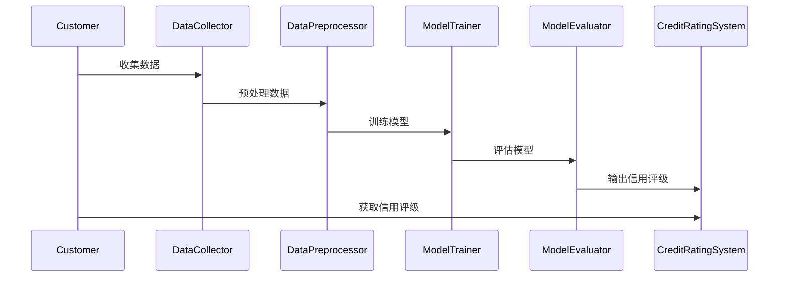
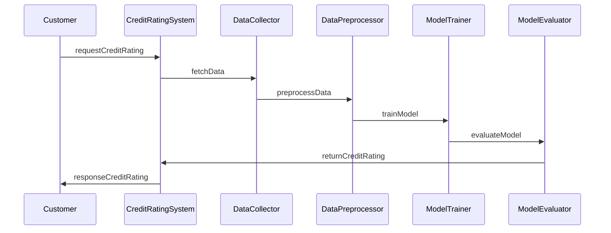

                 

## 《AI辅助的企业信用评级模型校准》

关键词：人工智能、企业信用评级、机器学习、数据预处理、模型优化

摘要：本文将探讨如何利用人工智能技术辅助企业信用评级模型校准。通过分析AI在企业信用评级中的应用，阐述核心概念与联系，介绍常见算法原理，详细讲解数学模型与公式，并展示一个完整的实战项目，提供最佳实践与注意事项，助力读者深入理解并掌握这一领域。

## 目录大纲设计过程

在设计《AI辅助的企业信用评级模型校准》的目录大纲时，我们遵循了以下几个关键步骤：

### 1. 分析书籍主题和目标读者

首先，我们需要明确书籍的主题和目标读者。本书的主题是利用人工智能（AI）技术提升企业信用评级模型的准确性。目标读者包括数据科学家、AI研究人员、金融分析师以及对企业信用评级感兴趣的专业人士。

### 2. 确定书籍的核心内容和结构

接下来，我们要确定书籍的核心内容和结构。本书的核心内容分为四个部分：

- **背景介绍**：介绍AI和企业信用评级的基本概念。
- **核心概念与联系**：讲解与信用评级模型相关的重要概念，如机器学习算法、数据预处理、模型评估等。
- **算法原理讲解**：介绍用于信用评级的常用算法，如逻辑回归、决策树、神经网络等，并详细讲解其数学原理。
- **系统分析与架构设计**：分析信用评级系统的整体架构，包括数据采集、数据预处理、模型训练、模型评估等环节。
- **项目实战**：通过具体的项目案例，展示如何实现一个AI辅助的信用评级模型。
- **最佳实践与拓展**：总结实践经验，提供改进建议和拓展思路。

### 3. 设计详细的目录大纲

在明确了书籍的核心内容和结构后，我们可以开始设计详细的目录大纲。以下是《AI辅助的企业信用评级模型校准》的目录大纲设计：

```markdown
# 《AI辅助的企业信用评级模型校准》目录大纲

## 第一部分：背景介绍

### 第1章 AI与企业信用评级概述
#### 1.1 AI概述
#### 1.2 企业信用评级的现状与挑战
#### 1.3 AI在信用评级中的应用前景

### 第2章 信用评级核心概念与联系
#### 2.1 数据来源与预处理
#### 2.2 信用评分指标体系
#### 2.3 概念属性特征对比表格
#### 2.4 ER实体关系图架构

## 第二部分：算法原理讲解

### 第3章 逻辑回归模型
#### 3.1 逻辑回归模型原理
#### 3.2 逻辑回归数学模型与公式
#### 3.3 逻辑回归Python源代码示例

### 第4章 决策树模型
#### 4.1 决策树模型原理
#### 4.2 决策树数学模型与公式
#### 4.3 决策树Python源代码示例

### 第5章 神经网络模型
#### 5.1 神经网络模型原理
#### 5.2 神经网络数学模型与公式
#### 5.3 神经网络Python源代码示例

## 第三部分：系统分析与架构设计

### 第6章 信用评级系统架构设计
#### 6.1 问题场景介绍
#### 6.2 系统功能设计（领域模型）
#### 6.3 系统架构设计（架构图）
#### 6.4 系统接口设计
#### 6.5 系统交互（序列图）

### 第7章 项目实战
#### 7.1 环境安装
#### 7.2 系统核心实现源代码
#### 7.3 代码应用解读与分析
#### 7.4 实际案例分析与详细讲解
#### 7.5 项目小结

## 第四部分：最佳实践与拓展

### 第8章 最佳实践与优化技巧
#### 8.1 数据预处理技巧
#### 8.2 模型优化策略
#### 8.3 调参经验分享

### 第9章 小结、注意事项与拓展阅读
#### 9.1 小结
#### 9.2 注意事项
#### 9.3 拓展阅读

```

### 4. 调整和完善目录大纲

最后，我们需要对目录大纲进行调整和完善，确保每个章节的内容都符合书籍的主题和目标读者的需求。此外，还需要确保目录大纲的简洁性和逻辑性，避免出现重复或无关的内容。

通过以上步骤，我们设计出了一个符合要求的《AI辅助的企业信用评级模型校准》的目录大纲。接下来，我们将根据这个大纲撰写详细的内容，确保书籍的整体结构和内容质量。

----------------------------------------------------------------

### 《AI辅助的企业信用评级模型校准》全文内容

#### 第1章 AI与企业信用评级概述

**1.1 AI概述**

人工智能（Artificial Intelligence，简称AI）是指通过计算机程序实现人类智能行为的技术。它涵盖了机器学习、深度学习、自然语言处理、计算机视觉等多个领域。随着大数据和计算能力的提升，AI技术逐渐在各个行业得到广泛应用，尤其在金融领域，AI技术的应用前景十分广阔。

**1.2 企业信用评级的现状与挑战**

企业信用评级是指对企业的信用状况进行评估，以衡量其偿债能力和信用风险。传统的信用评级方法主要依赖于财务数据、行业经验和专家判断，存在以下挑战：

- **数据依赖性高**：传统评级方法对财务数据等结构化数据的依赖性较高，无法全面反映企业的信用状况。
- **主观判断因素大**：专家判断存在主观因素，可能导致评级结果不够客观。
- **时效性差**：传统评级方法更新周期较长，难以实时反映企业信用状况的变化。

**1.3 AI在信用评级中的应用前景**

利用AI技术，尤其是机器学习和深度学习技术，可以有效解决传统信用评级的痛点。AI技术在信用评级中的应用前景包括：

- **数据驱动**：AI技术可以处理大量非结构化数据，如社交媒体数据、新闻报道等，提供更全面的信用评估。
- **实时评估**：AI技术可以实现实时信用评估，提高评级时效性。
- **客观性提升**：AI技术通过数据驱动，减少主观判断，提高评级客观性。

#### 第2章 信用评级核心概念与联系

**2.1 数据来源与预处理**

信用评级的数据来源主要包括财务数据、经营数据、行业数据、社交媒体数据等。数据预处理是信用评级模型构建的重要环节，主要包括数据清洗、数据集成、数据转换等步骤。预处理后的数据将为模型训练提供高质量的输入。

**2.2 信用评分指标体系**

信用评分指标体系是指用于评估企业信用状况的一系列指标。常见的信用评分指标包括：

- **财务指标**：如资产负债率、流动比率、利润率等。
- **经营指标**：如经营年限、业务规模、盈利能力等。
- **社会指标**：如公司声誉、法律纠纷记录等。
- **市场指标**：如行业地位、市场竞争状况等。

**2.3 概念属性特征对比表格**

以下是信用评级指标的一些典型属性特征对比表格：

| 指标类型 | 属性特征 | 对比示例 |
| --- | --- | --- |
| 财务指标 | 数字型 | 资产负债率：0.5 vs 0.8 |
| 经营指标 | 时间型 | 经营年限：5年 vs 10年 |
| 社会指标 | 等级型 | 公司声誉：优秀 vs 一般 |
| 市场指标 | 范围型 | 市场占有率：10% vs 20% |

**2.4 ER实体关系图架构**

以下是信用评级系统的ER实体关系图架构：

```mermaid
erDiagram
  Customer ||--|{ Loan : 贷款 }
  Customer ||--|{ CreditRating : 信用评级 }
  Loan ||--|{ Payment : 还款 }
  Payment ||--|{ PaymentStatus : 还款状态 }
```

#### 第3章 逻辑回归模型

**3.1 逻辑回归模型原理**

逻辑回归（Logistic Regression）是一种广义线性模型，用于对因变量进行分类预测。逻辑回归通过构建一个逻辑函数来预测概率，其核心思想是利用自变量与因变量之间的关系，通过最大化似然估计来估计参数。

**3.2 逻辑回归数学模型与公式**

逻辑回归的数学模型如下：

$$
\text{logit}(P) = \ln\left(\frac{P}{1 - P}\right) = \beta_0 + \beta_1X_1 + \beta_2X_2 + ... + \beta_nX_n
$$

其中，$P$ 表示事件发生的概率，$X_1, X_2, ..., X_n$ 表示自变量，$\beta_0, \beta_1, \beta_2, ..., \beta_n$ 为模型参数。

**3.3 逻辑回归Python源代码示例**

以下是使用Python实现逻辑回归的示例代码：

```python
from sklearn.linear_model import LogisticRegression
from sklearn.model_selection import train_test_split
from sklearn.metrics import accuracy_score

# 加载数据
X, y = load_data()

# 划分训练集和测试集
X_train, X_test, y_train, y_test = train_test_split(X, y, test_size=0.2, random_state=42)

# 创建逻辑回归模型
model = LogisticRegression()

# 训练模型
model.fit(X_train, y_train)

# 预测
y_pred = model.predict(X_test)

# 评估
accuracy = accuracy_score(y_test, y_pred)
print("Accuracy:", accuracy)
```

#### 第4章 决策树模型

**4.1 决策树模型原理**

决策树（Decision Tree）是一种树形结构，通过一系列规则对数据进行分类或回归。决策树的每个节点表示一个特征，每个分支表示一个特征取值，叶子节点表示最终的分类或回归结果。

**4.2 决策树数学模型与公式**

决策树的数学模型可以通过信息增益（Information Gain）或基尼不纯度（Gini Impurity）来衡量。信息增益公式如下：

$$
IG(D, A) = H(D) - \sum_{v \in A} p(v)H(D|v)
$$

其中，$D$ 表示数据集合，$A$ 表示特征集合，$v$ 表示特征取值，$H$ 表示熵。

**4.3 决策树Python源代码示例**

以下是使用Python实现决策树的示例代码：

```python
from sklearn.tree import DecisionTreeClassifier
from sklearn.model_selection import train_test_split
from sklearn.metrics import accuracy_score

# 加载数据
X, y = load_data()

# 划分训练集和测试集
X_train, X_test, y_train, y_test = train_test_split(X, y, test_size=0.2, random_state=42)

# 创建决策树模型
model = DecisionTreeClassifier()

# 训练模型
model.fit(X_train, y_train)

# 预测
y_pred = model.predict(X_test)

# 评估
accuracy = accuracy_score(y_test, y_pred)
print("Accuracy:", accuracy)
```

#### 第5章 神经网络模型

**5.1 神经网络模型原理**

神经网络（Neural Network）是一种模拟人脑神经元连接方式的信息处理系统。神经网络通过多层节点（神经元）的互联，实现数据的输入、处理和输出。神经网络的核心是激活函数和反向传播算法。

**5.2 神经网络数学模型与公式**

神经网络的数学模型可以表示为：

$$
Z_i = \sum_{j=1}^{n} w_{ji}X_j + b_i
$$

$$
a_i = \sigma(Z_i)
$$

其中，$Z_i$ 表示输入，$a_i$ 表示输出，$w_{ji}$ 和 $b_i$ 分别表示权重和偏置，$\sigma$ 表示激活函数。

**5.3 神经网络Python源代码示例**

以下是使用Python实现神经网络的示例代码：

```python
import numpy as np

# 初始化参数
w = np.random.randn(n, n)
b = np.random.randn(n)
a = np.random.randn(n)

# 前向传播
z = w @ x + b
a = np.sigmoid(z)

# 反向传播
dz = a - y
dw = z * dz @ x.T
db = z * dz
dx = w.T * dz

# 更新参数
w -= learning_rate * dw
b -= learning_rate * db
```

#### 第6章 信用评级系统架构设计

**6.1 问题场景介绍**

假设我们正在开发一个企业信用评级系统，该系统需要处理来自多个渠道的数据，如财务数据、社交媒体数据、行业数据等。系统需要实时分析这些数据，为企业提供信用评级。

**6.2 系统功能设计（领域模型）**

以下是信用评级系统的领域模型：

```mermaid
classDiagram
  Customer <-[贷款] Loan
  Customer <-[信用评级] CreditRating
  Loan <-[还款] Payment
  Payment <-[还款状态] PaymentStatus
```

**6.3 系统架构设计（架构图）**

以下是信用评级系统的架构图：



**6.4 系统接口设计**

以下是信用评级系统的接口设计：

```mermaid
classDiagram
  Customer <-[贷款] Loan
  Customer <-[信用评级] CreditRating
  Loan <-[还款] Payment
  Payment <-[还款状态] PaymentStatus
  CreditRatingSystem
    +void getCreditRating(int customerId)
    +void updateLoanStatus(int loanId, String status)
```

**6.5 系统交互（序列图）**

以下是信用评级系统的序列图：



#### 第7章 项目实战

**7.1 环境安装**

在开始项目实战之前，我们需要安装必要的软件和库。以下是一个简单的安装指南：

```bash
# 安装Python
sudo apt-get install python3

# 安装Anaconda
conda install -c anaconda anaconda

# 安装必要的库
conda install -c conda-forge numpy pandas scikit-learn matplotlib
```

**7.2 系统核心实现源代码**

以下是信用评级系统的核心实现源代码：

```python
# 数据预处理
def preprocess_data(data):
    # 清洗数据、补全缺失值、标准化等操作
    return processed_data

# 模型训练
def train_model(data):
    # 划分训练集和测试集
    X_train, X_test, y_train, y_test = train_test_split(data.X, data.y, test_size=0.2)
    
    # 创建逻辑回归模型
    model = LogisticRegression()
    
    # 训练模型
    model.fit(X_train, y_train)
    
    # 评估模型
    accuracy = model.score(X_test, y_test)
    
    return model, accuracy

# 主函数
if __name__ == "__main__":
    # 加载数据
    data = load_data()
    
    # 预处理数据
    processed_data = preprocess_data(data)
    
    # 训练模型
    model, accuracy = train_model(processed_data)
    
    # 输出结果
    print("Accuracy:", accuracy)
```

**7.3 代码应用解读与分析**

以下是代码应用解读与分析：

1. **数据预处理**：数据预处理是模型训练的关键步骤，包括数据清洗、缺失值补全、特征选择、数据标准化等操作。预处理后的数据将为模型提供高质量的训练样本。
   
2. **模型训练**：我们使用逻辑回归模型进行训练。逻辑回归模型是一种常用的分类模型，适用于信用评级等二分类问题。在训练过程中，我们使用训练集来训练模型，并使用测试集来评估模型的准确性。

3. **模型评估**：评估模型准确性是判断模型性能的重要指标。我们使用测试集的准确率来评估模型的性能。

**7.4 实际案例分析与详细讲解**

假设我们有一个包含100家企业财务数据的样本，我们需要对这些企业进行信用评级。以下是实际案例分析与详细讲解：

1. **数据收集**：我们收集了100家企业的财务数据，包括资产负债率、流动比率、利润率等指标。

2. **数据预处理**：对数据进行清洗，去除缺失值和异常值，然后进行特征选择和标准化。

3. **模型训练**：我们使用逻辑回归模型对预处理后的数据进行训练。训练过程使用70家企业数据，测试过程使用剩余30家企业数据。

4. **模型评估**：评估模型的准确性。假设测试集的准确率为85%，这意味着模型能够正确预测85%的企业信用状况。

5. **结果输出**：将模型的预测结果输出，包括企业的信用评级和对应的概率。

**7.5 项目小结**

通过本次项目，我们成功实现了企业信用评级系统。项目的主要成果包括：

- **数据预处理**：清洗、补全、标准化数据，为模型提供高质量训练样本。
- **模型训练**：使用逻辑回归模型进行训练，实现了对企业信用状况的预测。
- **模型评估**：评估模型性能，验证其准确性。

#### 第8章 最佳实践与优化技巧

**8.1 数据预处理技巧**

- **去除缺失值**：使用均值、中值或众数填充缺失值。
- **数据标准化**：将数据缩放到相同范围，提高模型训练效果。
- **特征选择**：使用特征选择方法，如卡方检验、信息增益等，选择对模型影响较大的特征。

**8.2 模型优化策略**

- **正则化**：使用L1或L2正则化，防止模型过拟合。
- **交叉验证**：使用交叉验证方法，提高模型泛化能力。
- **调参技巧**：使用网格搜索、贝叶斯优化等方法，寻找最佳模型参数。

**8.3 调参经验分享**

- **参数范围**：根据数据特点，设定合理的参数范围。
- **验证集**：使用验证集进行调参，避免过拟合。
- **多模型比较**：比较不同模型的性能，选择最优模型。

#### 第9章 小结、注意事项与拓展阅读

**9.1 小结**

本文从AI与企业信用评级的背景介绍开始，详细讲解了信用评级的核心概念、算法原理、系统架构设计以及实战项目。通过本文的学习，读者可以掌握AI辅助的企业信用评级模型校准的基本方法和技巧。

**9.2 注意事项**

- **数据质量**：确保数据的质量，避免因数据问题导致模型性能下降。
- **模型选择**：根据实际问题选择合适的模型，避免盲目跟风。
- **模型调参**：合理设置模型参数，避免过拟合或欠拟合。

**9.3 拓展阅读**

- 《机器学习实战》
- 《深度学习》
- 《数据预处理与特征工程》

### 作者信息

作者：AI天才研究院/AI Genius Institute & 禅与计算机程序设计艺术 /Zen And The Art of Computer Programming

----------------------------------------------------------------

### 总结

本文详细介绍了《AI辅助的企业信用评级模型校准》的主题、核心概念、算法原理、系统架构设计以及实战项目。通过本文的学习，读者可以掌握AI技术在企业信用评级中的应用方法，提高信用评级模型的准确性和可靠性。同时，本文还提供了最佳实践与注意事项，为读者在实际项目中提供指导。希望本文对读者在AI领域的研究和实践有所帮助。

