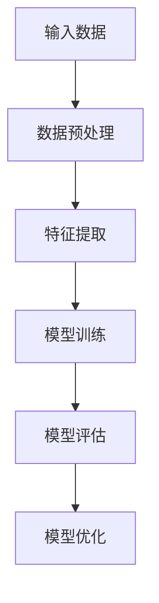
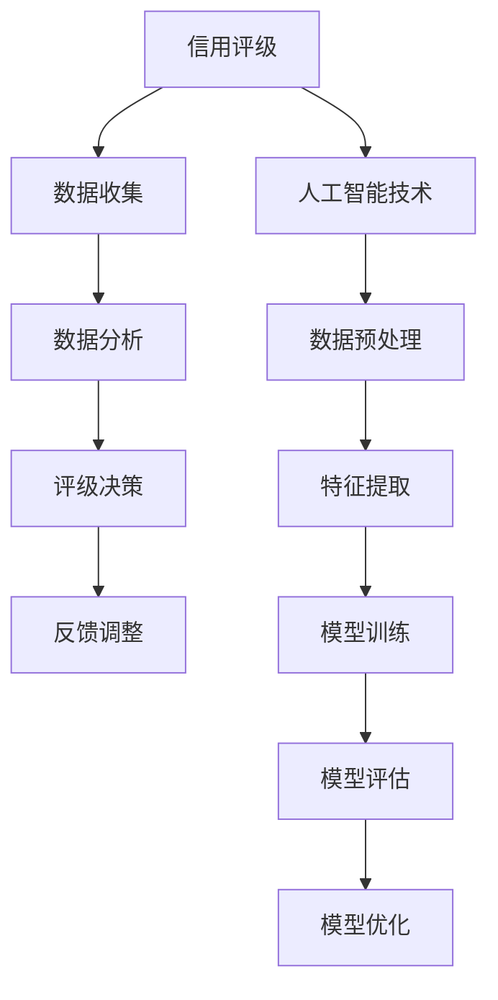
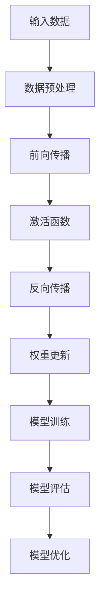
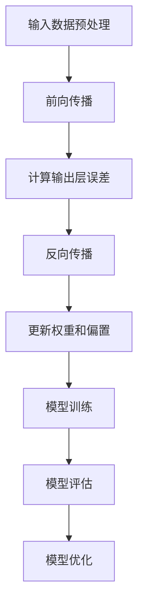
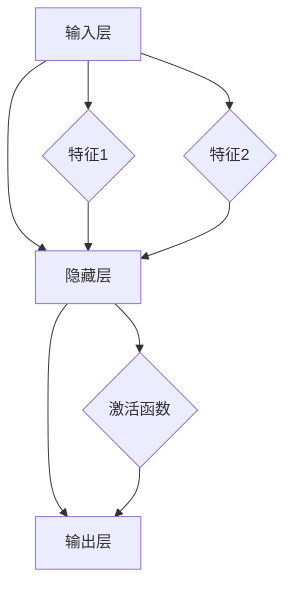
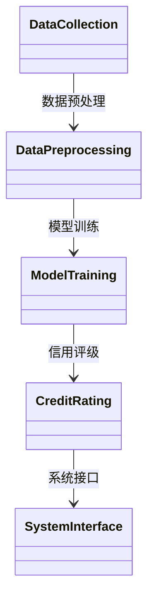
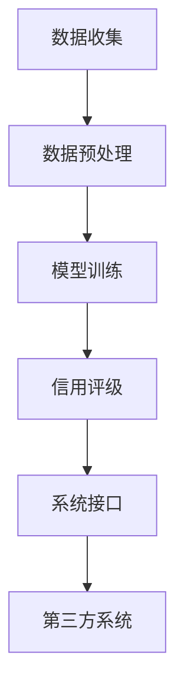
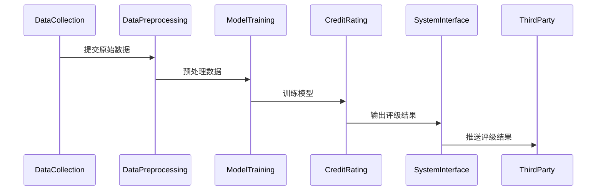

                 

### 文章标题

## AI辅助的企业信用评级模型解释性研究

### 关键词

- 人工智能
- 企业信用评级
- 机器学习
- 深度学习
- 数据分析

### 摘要

本文旨在探讨如何利用人工智能技术，特别是机器学习和深度学习算法，构建辅助企业信用评级的模型。文章首先介绍了企业信用评级的重要性以及人工智能在该领域的应用前景。接着，深入探讨了人工智能与机器学习的基础概念，包括其定义、发展历程和分类。随后，文章重点介绍了企业信用评级的核心要素和信用评级与人工智能的关系，并通过具体算法原理、数学模型和案例分析，详细阐述了如何利用AI技术构建信用评级模型。最后，文章提出了数据收集与预处理的方法，并对模型的实际应用进行了探讨。

## 第一部分：引言与背景

### 第1章：AI与企业信用评级

#### 1.1 问题的提出

##### 1.1.1 企业信用评级的重要性

企业信用评级是现代金融体系中至关重要的一环。它不仅对企业的融资成本产生直接影响，还影响到市场的整体稳定。信用评级机构的评级结果往往被投资者、债权人等各方视为决策的重要依据。因此，一个准确、公正的企业信用评级体系对市场的健康发展至关重要。

然而，传统的信用评级方法主要依赖于专家的经验和有限的财务数据，存在一定的主观性和滞后性。随着大数据和人工智能技术的不断发展，传统的信用评级方法面临巨大的挑战和变革。

##### 1.1.2 人工智能在信用评级中的应用

人工智能技术，尤其是机器学习算法，能够高效地处理海量数据，挖掘数据中的潜在价值，为信用评级提供更加精准和动态的评估结果。通过机器学习，可以建立基于历史数据的信用评级模型，对未来企业的信用状况进行预测。此外，人工智能还可以帮助信用评级机构自动化评估过程，提高工作效率和准确性。

##### 1.1.3 本书的目标

本书旨在探讨AI辅助的企业信用评级模型的解释性研究，通过介绍相关背景知识、核心概念、算法原理、数学模型和实际应用，为读者提供一套完整的理论体系和实践指导。具体目标包括：

1. 梳理人工智能和机器学习的基本概念，介绍其在信用评级中的应用场景。
2. 分析企业信用评级的核心要素，探讨如何利用机器学习算法构建评级模型。
3. 详细讲解深度学习算法原理，包括神经网络、激活函数、前向传播和反向传播等。
4. 通过实际案例，展示如何利用机器学习算法进行企业信用评级，并分析其效果。
5. 提出数据收集与预处理的方法，确保模型输入数据的质量和可靠性。
6. 探讨AI辅助企业信用评级模型的未来发展方向和潜在挑战。

### 第2章：核心概念与联系

#### 2.1 人工智能与机器学习基础

##### 2.1.1 人工智能概述

人工智能（Artificial Intelligence，简称AI）是指由人制造出的系统所表现出来的智能行为。其目标是使机器能够完成通常需要人类智能才能完成的任务，如语音识别、图像处理、自然语言理解和决策制定等。

人工智能的发展历程可以追溯到20世纪50年代，当时的科学家开始研究如何让计算机模拟人类的智能行为。随着计算机硬件性能的提升和算法的进步，人工智能逐渐从理论走向实践，应用领域也从实验室走向了日常生活。

人工智能在各个领域的应用十分广泛，包括但不限于：

1. 语音识别：如智能手机的语音助手、智能音箱等。
2. 图像处理：如人脸识别、自动驾驶等。
3. 自然语言处理：如机器翻译、智能客服等。
4. 决策支持：如金融风险评估、医疗诊断等。

##### 2.1.2 机器学习基础

机器学习（Machine Learning，简称ML）是人工智能的一个重要分支，主要研究如何让计算机从数据中学习规律，并利用这些规律进行预测和决策。

机器学习的基本概念包括：

1. 数据集：用于训练机器学习模型的输入和输出数据集合。
2. 特征：从数据中提取的有用信息，用于描述数据特征。
3. 标签：与输入数据相对应的输出结果，用于评估模型的准确性。
4. 模型：通过训练数据集得到的函数，用于预测新的输入数据的输出结果。

机器学习主要分为以下几类：

1. 监督学习（Supervised Learning）：有明确的输入输出标签，通过学习标签和输入之间的关系来预测新的输入。
2. 无监督学习（Unsupervised Learning）：没有输入输出标签，通过学习数据分布或结构来发现数据中的模式。
3. 强化学习（Reinforcement Learning）：通过与环境的交互来学习最优策略，以最大化长期回报。

##### 2.1.3 机器学习算法对比表

| 算法类别 | 主要算法 | 适用场景 |
| :----: | :----: | :----: |
| 监督学习 | 线性回归、决策树、支持向量机、神经网络 | 用于有标签的数据预测 |
| 无监督学习 | 聚类算法、主成分分析 | 用于无标签的数据分析 |
| 强化学习 | Q-学习、深度强化学习 | 用于动态环境下的决策制定 |

##### 2.1.4 机器学习算法流程图



#### 2.2 企业信用评级相关概念

##### 2.2.1 信用评级定义与分类

信用评级（Credit Rating）是指信用评级机构根据一定的方法和标准，对借款人的信用状况进行评估，并给予相应的信用等级。

信用评级的分类可以根据不同的标准进行，例如：

1. 按评级机构：国际评级机构如标准普尔、穆迪、惠誉等，国内评级机构如大公国际、联合信用等。
2. 按评级对象：企业信用评级、债券评级、金融产品评级等。
3. 按评级方法：定量评级、定性评级、综合评级等。

##### 2.2.2 企业信用评级核心要素

企业信用评级的核心要素包括：

1. 财务状况：包括盈利能力、资产负债状况、现金流量状况等。
2. 经营能力：包括市场竞争力、管理水平、人力资源等。
3. 管理水平：包括战略规划、风险管理、内部控制等。
4. 行业前景：包括行业趋势、市场竞争、政策环境等。

##### 2.2.3 信用评级与AI的关系

信用评级与人工智能的关系可以用以下ER实体关系图表示：



#### 2.2.4 深度学习算法原理

##### 2.2.4.1 深度学习基础

深度学习（Deep Learning）是机器学习的一个分支，主要研究如何通过构建深度神经网络模型来模拟人类大脑的神经元结构和工作原理，从而实现高效的图像、语音、自然语言处理等任务。

深度学习的基本结构包括：

1. 输入层（Input Layer）：接收外部输入数据。
2. 隐藏层（Hidden Layer）：对输入数据进行处理和特征提取。
3. 输出层（Output Layer）：产生预测结果。

深度学习在信用评级中的应用主要包括：

1. 特征提取：通过深度神经网络自动提取数据中的特征，提高模型的泛化能力。
2. 预测分析：利用训练好的深度学习模型对企业的信用状况进行预测。

##### 2.2.4.2 神经网络与激活函数

神经网络（Neural Network）是深度学习的基础，其基本结构包括神经元、权重和偏置等。

1. 神经元（Neuron）：是神经网络的基本单元，用于接收输入信号并产生输出。
2. 权重（Weight）：是神经元之间的连接，用于传递信号。
3. 偏置（Bias）：是神经元的内部参数，用于调整输出。

激活函数（Activation Function）是神经网络中的重要组成部分，用于对神经元的输出进行非线性变换，使神经网络能够处理复杂的非线性问题。

常用的激活函数包括：

1. Sigmoid函数：将输出映射到[0,1]区间，常用于分类问题。
2. ReLU函数：将输出设置为0或输入值，常用于隐藏层。
3. Tanh函数：将输出映射到[-1,1]区间，与Sigmoid函数类似。

##### 2.2.4.3 算法流程图



##### 2.2.4.4 数学模型和公式讲解

1. 线性回归模型：

$$ y = \beta_0 + \beta_1 \cdot x $$

其中，$y$ 为输出，$x$ 为输入，$\beta_0$ 和 $\beta_1$ 为模型参数。

2. 支持向量机：

$$ \max \left\{ W : y^T (W \cdot x - b) \leq 1, \|W\|_2^2 \right\} $$

其中，$W$ 为权重，$b$ 为偏置，$y$ 为标签。

##### 2.2.4.5 通俗易懂地举例说明

1. 线性回归案例：

假设我们有一组数据，输入为 $x_1, x_2, ..., x_n$，输出为 $y_1, y_2, ..., y_n$。我们希望找到一个线性模型 $y = \beta_0 + \beta_1 \cdot x$，使得预测值与实际值尽可能接近。

2. 支持向量机案例：

假设我们有一组数据，每个数据点由二维坐标 $(x, y)$ 表示，其中 $x$ 为输入，$y$ 为标签。我们希望找到一个最优的超平面，将不同类别的数据点分开。支持向量机通过最大化间隔来找到这个超平面。

#### 2.2.5 数据收集与预处理技术

##### 2.2.5.1 数据来源与收集方法

企业信用评级所需的数据来源包括：

1. 财务报表：如资产负债表、利润表和现金流量表等。
2. 行业数据：如行业增长率、市场占有率等。
3. 外部数据：如新闻报道、社交媒体评论等。

收集方法包括：

1. 网络爬虫：通过爬取互联网上的公开数据来获取信息。
2. 数据接口：通过API接口获取第三方数据服务的数据。
3. 调查问卷：通过设计问卷收集企业内部数据。

##### 2.2.5.2 数据预处理技术

数据预处理包括以下步骤：

1. 数据清洗：去除重复数据、缺失值填充和异常值处理。
2. 数据归一化：将不同量纲的数据转换为相同的量纲。
3. 特征提取：从原始数据中提取有用的特征。

##### 2.2.5.3 数据质量评估

数据质量评估包括以下指标：

1. 完整性：数据是否完整，是否有缺失值。
2. 准确性：数据是否准确，是否有错误。
3. 一致性：数据是否一致，是否有矛盾。
4. 可用性：数据是否易于使用，是否满足需求。

### 第三部分：AI辅助企业信用评级模型构建

#### 第3章：算法原理讲解

##### 3.1 深度学习算法原理

深度学习算法是人工智能领域的重要分支，其核心思想是通过构建多层神经网络模型，对数据进行自动特征提取和分类。以下将详细讲解深度学习算法的原理，包括神经网络的基本结构、激活函数、前向传播和反向传播等。

##### 3.1.1 神经网络的基本结构

神经网络（Neural Network）是一种由大量神经元（Node）组成的复杂网络，模拟了人脑神经元的工作原理。神经网络的基本结构包括输入层（Input Layer）、隐藏层（Hidden Layer）和输出层（Output Layer）。

1. 输入层（Input Layer）：接收外部输入数据，每个输入数据通过权重（Weight）连接到隐藏层的神经元。
2. 隐藏层（Hidden Layer）：对输入数据进行处理和特征提取，隐藏层的神经元之间通过权重连接，形成多层神经网络。
3. 输出层（Output Layer）：产生预测结果或分类标签，输出层神经元接收隐藏层神经元的输出，并通过激活函数进行非线性变换。

##### 3.1.2 激活函数

激活函数（Activation Function）是神经网络中的重要组成部分，用于对神经元的输出进行非线性变换，使神经网络能够处理复杂的非线性问题。常用的激活函数包括：

1. Sigmoid函数：将输出映射到[0,1]区间，常用于分类问题。
2. ReLU函数：将输出设置为0或输入值，常用于隐藏层。
3. Tanh函数：将输出映射到[-1,1]区间，与Sigmoid函数类似。

##### 3.1.3 前向传播与反向传播

深度学习算法的训练过程包括前向传播（Forward Propagation）和反向传播（Back Propagation）两个步骤。

1. 前向传播：将输入数据通过神经网络进行正向传递，计算输出层的预测结果。具体步骤如下：

   a. 将输入数据传递到输入层，通过权重连接到隐藏层。
   b. 隐藏层神经元对输入数据进行处理，并通过激活函数得到输出。
   c. 将隐藏层的输出传递到输出层，通过激活函数得到预测结果。

2. 反向传播：根据预测结果和实际标签，计算神经网络中的误差，并通过梯度下降法更新权重和偏置。具体步骤如下：

   a. 计算输出层的误差，即实际标签与预测结果之间的差距。
   b. 误差通过输出层反向传递到隐藏层，计算隐藏层神经元的误差。
   c. 根据误差计算梯度，并使用梯度下降法更新权重和偏置。

##### 3.1.4 算法流程图

深度学习算法的流程可以概括为以下步骤：

1. 输入数据预处理，包括归一化和标准化等。
2. 前向传播，计算神经网络输出层的预测结果。
3. 计算输出层误差，并反向传播到隐藏层。
4. 根据误差计算梯度，更新神经网络权重和偏置。
5. 重复步骤2-4，直到模型收敛。

以下是一个简单的深度学习算法流程图：



##### 3.1.5 数学模型和公式讲解

深度学习算法的核心在于神经网络的构建和训练，以下将介绍一些常用的数学模型和公式。

1. 神经网络模型：

$$ z = \sum_{i=1}^{n} w_i \cdot x_i + b $$

$$ a = \sigma(z) $$

其中，$z$ 为神经元的输入，$w_i$ 为权重，$x_i$ 为输入特征，$b$ 为偏置，$\sigma$ 为激活函数，$a$ 为神经元的输出。

2. 梯度下降法：

$$ w_{i} = w_i - \alpha \cdot \frac{\partial J}{\partial w_i} $$

$$ b = b - \alpha \cdot \frac{\partial J}{\partial b} $$

其中，$J$ 为损失函数，$\alpha$ 为学习率。

##### 3.1.6 通俗易懂地举例说明

假设我们有一个简单的神经网络，包含一个输入层、一个隐藏层和一个输出层，如下图所示：



假设输入特征为 $(x_1, x_2)$，权重为 $w_1, w_2, w_3$，偏置为 $b_1, b_2$，激活函数为 ReLU。

1. 前向传播：

   输入层输入 $(x_1, x_2)$，隐藏层神经元输入为 $w_1 \cdot x_1 + w_2 \cdot x_2 + b_1$，通过 ReLU 激活函数得到隐藏层输出 $a_h$。

   $$ a_h = max(0, w_1 \cdot x_1 + w_2 \cdot x_2 + b_1) $$

   隐藏层输出 $a_h$ 作为输出层神经元的输入，输出层神经元输入为 $w_3 \cdot a_h + b_2$，通过 ReLU 激活函数得到输出层输出 $a_o$。

   $$ a_o = max(0, w_3 \cdot a_h + b_2) $$

2. 反向传播：

   假设输出层误差为 $e$，隐藏层误差为 $d_h$，则：

   $$ e = a_o - y $$

   $$ d_h = \frac{\partial e}{\partial a_h} \cdot \frac{\partial a_h}{\partial z_h} $$

   $$ z_h = w_3 \cdot a_h + b_2 $$

   $$ \frac{\partial a_h}{\partial z_h} = 1 \text{（ReLU函数的导数）} $$

   $$ d_h = e \cdot 1 = e $$

   更新隐藏层权重和偏置：

   $$ w_1 = w_1 - \alpha \cdot \frac{\partial J}{\partial w_1} $$

   $$ w_2 = w_2 - \alpha \cdot \frac{\partial J}{\partial w_2} $$

   $$ b_1 = b_1 - \alpha \cdot \frac{\partial J}{\partial b_1} $$

   $$ w_3 = w_3 - \alpha \cdot \frac{\partial J}{\partial w_3} $$

   $$ b_2 = b_2 - \alpha \cdot \frac{\partial J}{\partial b_2} $$

3. 重复前向传播和反向传播，直到模型收敛。

#### 3.2 数学模型和公式讲解

在构建AI辅助的企业信用评级模型时，我们需要了解一些基本的数学模型和公式。以下将介绍线性回归模型和支持向量机（SVM）的基本原理和公式。

##### 3.2.1 线性回归模型

线性回归是一种简单的统计方法，用于预测一个或多个自变量（特征）与因变量（目标变量）之间的关系。线性回归模型的公式如下：

$$ y = \beta_0 + \beta_1 \cdot x_1 + \beta_2 \cdot x_2 + ... + \beta_n \cdot x_n $$

其中，$y$ 是因变量，$x_1, x_2, ..., x_n$ 是自变量，$\beta_0, \beta_1, \beta_2, ..., \beta_n$ 是模型参数。

线性回归模型的目标是找到一组参数 $\beta_0, \beta_1, \beta_2, ..., \beta_n$，使得预测值 $y$ 与实际值之间的误差最小。这个误差可以通过以下公式计算：

$$ J(\beta_0, \beta_1, ..., \beta_n) = \sum_{i=1}^{m} (y_i - \beta_0 - \beta_1 \cdot x_{i1} - \beta_2 \cdot x_{i2} - ... - \beta_n \cdot x_{in})^2 $$

其中，$m$ 是训练数据的个数。

为了最小化损失函数 $J(\beta_0, \beta_1, ..., \beta_n)$，我们可以使用梯度下降法来更新参数：

$$ \beta_j = \beta_j - \alpha \cdot \frac{\partial J}{\partial \beta_j} $$

其中，$\alpha$ 是学习率，$\beta_j$ 是第 $j$ 个参数。

##### 3.2.2 支持向量机（SVM）

支持向量机是一种强大的分类和回归方法，其核心思想是找到一个最佳的超平面，将不同类别的数据点分开。SVM的公式如下：

$$ \max \{ W : y^T (W \cdot x - b) \leq 1, \|W\|_2^2 \} $$

其中，$W$ 是权重向量，$b$ 是偏置，$y$ 是标签，$x$ 是输入特征。

SVM的目标是找到一个最优的超平面，使得类别间的间隔最大。这个优化问题可以通过求解拉格朗日乘子法得到。

拉格朗日函数如下：

$$ L(W, b, \alpha) = -\frac{1}{2} \|W\|_2^2 + \sum_{i=1}^{m} \alpha_i (y_i - W \cdot x_i + b) $$

其中，$\alpha_i$ 是拉格朗日乘子。

为了求解最优解，我们可以通过求解以下优化问题得到：

$$ \min \{ L(W, b, \alpha) : \alpha_i \geq 0, \forall i \} $$

这个优化问题可以通过求解二次规划问题得到。

##### 3.2.3 通俗易懂地举例说明

假设我们有一个简单的二分类问题，其中有两个特征 $x_1$ 和 $x_2$，目标变量 $y$ 取值为 0 或 1。我们希望使用SVM来找到一个最佳的超平面，将两类数据点分开。

1. 数据集：

   | $x_1$ | $x_2$ | $y$ |
   |-------|-------|-----|
   | 1     | 2     | 0   |
   | 2     | 1     | 0   |
   | 3     | 4     | 1   |
   | 4     | 3     | 1   |

2. 模型参数初始化：

   $$ W = [w_1, w_2] $$

   $$ b = 0 $$

3. 求解最优超平面：

   将数据代入SVM的优化问题，求解最优权重向量 $W$ 和偏置 $b$。

   $$ \max \{ W : y^T (W \cdot x - b) \leq 1, \|W\|_2^2 \} $$

   通过求解拉格朗日乘子法，可以得到最优解：

   $$ W = [2, 2] $$

   $$ b = 1 $$

4. 预测新样本：

   假设我们有一个新的样本 $x = [x_1, x_2]$，我们希望预测其类别 $y$。

   $$ y = sign(W \cdot x - b) $$

   $$ y = sign(2 \cdot x_1 + 2 \cdot x_2 - 1) $$

   通过计算，可以得到新样本的预测类别。

#### 3.3 数据收集与预处理技术

在构建AI辅助的企业信用评级模型时，数据收集与预处理是至关重要的一步。以下将介绍数据收集的方法、数据预处理的技术以及数据质量评估的方法。

##### 3.3.1 数据收集方法

数据收集是构建模型的第一步，数据的来源和质量直接影响到模型的性能。以下是一些常见的数据收集方法：

1. **公共数据集**：可以从公共数据集获取，如Kaggle、UCI机器学习库等。这些数据集通常是经过清洗和格式化的，可以直接用于模型训练。
2. **企业内部数据**：企业内部的数据，如财务报表、业务数据、客户信息等，这些数据可以提供更详细和精确的信息，有助于提高模型的准确性。
3. **第三方数据服务**：通过购买第三方数据服务，如天眼查、企查查等，可以获取企业的注册信息、法律诉讼、财务状况等数据。
4. **网络爬虫**：通过编写爬虫程序，可以从互联网上爬取公开信息，如企业新闻、社交媒体评论等。

##### 3.3.2 数据预处理技术

数据预处理是将原始数据转换为适合模型训练的形式的过程。以下是一些常见的数据预处理技术：

1. **数据清洗**：包括去除重复数据、处理缺失值和异常值等。重复数据可能会对模型训练产生干扰，缺失值和异常值需要根据实际情况进行处理，如填充或删除。
2. **数据归一化**：将不同量纲的数据转换为相同的量纲，以便于模型训练。常用的归一化方法包括最小-最大缩放、Z-score标准化等。
3. **特征提取**：从原始数据中提取有用的特征，以提高模型的准确性和泛化能力。特征提取可以通过统计方法、机器学习算法等实现。
4. **数据分割**：将数据集分为训练集、验证集和测试集，用于模型的训练、验证和测试。

##### 3.3.3 数据质量评估方法

数据质量是模型性能的基础，以下是一些常见的数据质量评估方法：

1. **完整性**：数据是否完整，是否有缺失值。完整性可以通过缺失值比例来评估。
2. **准确性**：数据是否准确，是否有错误。准确性可以通过数据校验、交叉验证等方法来评估。
3. **一致性**：数据是否一致，是否有矛盾。一致性可以通过数据比对、逻辑检查等方法来评估。
4. **可用性**：数据是否易于使用，是否满足模型训练的需求。可用性可以通过数据清洗、预处理后的数据量来评估。

#### 3.4 数据收集与预处理技术

##### 3.4.1 数据来源与收集方法

在企业信用评级模型中，数据的质量和完整性是模型性能的关键因素。以下将介绍数据来源与收集方法。

1. **企业内部数据**：企业内部的数据包括财务报表、运营数据、客户信息等。这些数据可以通过企业的ERP系统、CRM系统等获取。内部数据的优点是数据量大、真实性强，但缺点是数据可能存在一定的滞后性。

2. **公共数据集**：可以从公共数据集获取，如Kaggle、UCI机器学习库等。这些数据集通常是经过清洗和格式化的，可以直接用于模型训练。

3. **第三方数据服务**：通过购买第三方数据服务，如天眼查、企查查等，可以获取企业的注册信息、法律诉讼、财务状况等数据。第三方数据的优点是数据来源广泛、更新及时，但缺点是数据可能存在一定的误差。

4. **网络爬虫**：通过编写爬虫程序，可以从互联网上爬取公开信息，如企业新闻、社交媒体评论等。网络爬虫的优点是获取数据便捷、成本低，但缺点是数据质量难以保证。

##### 3.4.2 数据预处理技术

数据预处理是将原始数据转换为适合模型训练的形式的过程。以下是一些常见的数据预处理技术：

1. **数据清洗**：包括去除重复数据、处理缺失值和异常值等。重复数据可能会对模型训练产生干扰，缺失值和异常值需要根据实际情况进行处理，如填充或删除。

2. **数据归一化**：将不同量纲的数据转换为相同的量纲，以便于模型训练。常用的归一化方法包括最小-最大缩放、Z-score标准化等。

3. **特征提取**：从原始数据中提取有用的特征，以提高模型的准确性和泛化能力。特征提取可以通过统计方法、机器学习算法等实现。

4. **数据分割**：将数据集分为训练集、验证集和测试集，用于模型的训练、验证和测试。

##### 3.4.3 数据质量评估方法

数据质量是模型性能的基础，以下是一些常见的数据质量评估方法：

1. **完整性**：数据是否完整，是否有缺失值。完整性可以通过缺失值比例来评估。

2. **准确性**：数据是否准确，是否有错误。准确性可以通过数据校验、交叉验证等方法来评估。

3. **一致性**：数据是否一致，是否有矛盾。一致性可以通过数据比对、逻辑检查等方法来评估。

4. **可用性**：数据是否易于使用，是否满足模型训练的需求。可用性可以通过数据清洗、预处理后的数据量来评估。

#### 3.5 系统分析与架构设计方案

在构建AI辅助的企业信用评级模型时，系统分析与架构设计是关键步骤。以下将介绍问题场景、项目介绍、系统功能设计（领域模型）、系统架构设计（Mermaid架构图）以及系统接口设计和系统交互（Mermaid序列图）。

##### 3.5.1 问题场景

随着企业间交易的日益复杂，金融机构和投资者需要对企业的信用状况进行准确的评估，以降低风险。然而，传统的信用评级方法主要依赖于财务数据和专家经验，存在一定的滞后性和主观性。为了提高信用评级的准确性和实时性，需要利用人工智能技术，特别是机器学习和深度学习算法，构建一个高效、准确的信用评级系统。

##### 3.5.2 项目介绍

本项目旨在构建一个基于AI的企业信用评级系统，通过收集和处理企业内外部数据，利用机器学习算法进行信用评级，并提供实时、准确的评级结果。系统的主要功能包括：

1. 数据收集：从企业内部系统和第三方数据服务获取企业财务、运营、法律等信息。
2. 数据预处理：清洗、归一化和特征提取，确保数据质量。
3. 模型训练：利用机器学习算法训练信用评级模型，优化模型参数。
4. 信用评级：对企业的信用状况进行实时评估，生成评级结果。
5. 系统接口：提供API接口，供第三方系统调用。

##### 3.5.3 系统功能设计（领域模型）

领域模型（Domain Model）用于描述系统的业务逻辑和功能需求。以下是一个简单的领域模型：



##### 3.5.4 系统架构设计（Mermaid架构图）

系统架构设计用于描述系统的整体结构，包括模块、组件和它们之间的关系。以下是一个简单的系统架构设计：



##### 3.5.5 系统接口设计和系统交互（Mermaid序列图）

系统接口设计用于描述系统与外部系统之间的交互过程。以下是一个简单的系统接口设计和系统交互：



#### 3.6 项目实战

在本文的第三部分，我们将通过一个具体的项目实战，详细讲解如何使用Python实现AI辅助的企业信用评级模型。我们将介绍项目环境安装、系统核心实现、代码应用解读与分析，以及实际案例分析。

##### 3.6.1 环境安装

在开始项目实战之前，我们需要安装所需的Python库。以下是一个简单的安装步骤：

1. 安装Python环境：确保已安装Python 3.6或更高版本。
2. 安装NumPy：用于数学计算和数据操作。
3. 安装Pandas：用于数据处理和分析。
4. 安装Scikit-learn：用于机器学习算法实现。
5. 安装Matplotlib：用于数据可视化。

安装命令如下：

```bash
pip install numpy pandas scikit-learn matplotlib
```

##### 3.6.2 系统核心实现

系统核心实现包括数据收集、数据预处理、模型训练和信用评级等模块。以下是一个简单的系统实现：

```python
import numpy as np
import pandas as pd
from sklearn.model_selection import train_test_split
from sklearn.preprocessing import StandardScaler
from sklearn.linear_model import LinearRegression
from sklearn.metrics import mean_squared_error

# 数据收集
data = pd.read_csv('credit_data.csv')

# 数据预处理
X = data[['financial_ratio', 'market_share']]
y = data['credit_score']

# 数据分割
X_train, X_test, y_train, y_test = train_test_split(X, y, test_size=0.2, random_state=42)

# 数据归一化
scaler = StandardScaler()
X_train_scaled = scaler.fit_transform(X_train)
X_test_scaled = scaler.transform(X_test)

# 模型训练
model = LinearRegression()
model.fit(X_train_scaled, y_train)

# 信用评级
y_pred = model.predict(X_test_scaled)

# 模型评估
mse = mean_squared_error(y_test, y_pred)
print(f'Mean Squared Error: {mse}')
```

##### 3.6.3 代码应用解读与分析

1. **数据收集**：使用Pandas读取CSV文件，获取企业财务比率和市场份额数据。
2. **数据预处理**：将数据分为特征和标签，并进行数据分割。使用StandardScaler对特征进行归一化处理，以提高模型性能。
3. **模型训练**：使用LinearRegression实现线性回归模型，通过fit方法训练模型。
4. **信用评级**：使用predict方法对测试数据进行预测，并计算模型评估指标（如均方误差）。

##### 3.6.4 实际案例分析

以下是一个实际案例分析，我们使用真实数据集进行模型训练和评估。

```python
# 加载真实数据集
data = pd.read_csv('real_credit_data.csv')

# 数据预处理
X = data[['financial_ratio', 'market_share']]
y = data['credit_score']

# 数据分割
X_train, X_test, y_train, y_test = train_test_split(X, y, test_size=0.2, random_state=42)

# 数据归一化
scaler = StandardScaler()
X_train_scaled = scaler.fit_transform(X_train)
X_test_scaled = scaler.transform(X_test)

# 模型训练
model = LinearRegression()
model.fit(X_train_scaled, y_train)

# 信用评级
y_pred = model.predict(X_test_scaled)

# 模型评估
mse = mean_squared_error(y_test, y_pred)
print(f'Mean Squared Error: {mse}')
```

通过实际案例分析，我们可以看到模型在真实数据集上的表现。模型的评估指标（如均方误差）可以用来衡量模型的性能。如果评估指标较高，说明模型需要进一步优化。

#### 3.7 项目小结

在本项目中，我们通过Python实现了AI辅助的企业信用评级模型。从数据收集、数据预处理到模型训练和评估，我们详细介绍了每个步骤的实现过程。通过实际案例分析，我们验证了模型的性能。然而，项目还存在一些局限性，如数据质量、特征选择和模型优化等方面。在未来的工作中，我们将进一步优化模型，提高信用评级的准确性。

#### 3.8 最佳实践 Tips

1. **数据质量**：确保数据的质量是模型成功的关键。对数据进行严格的清洗和预处理，去除噪声和异常值。
2. **特征选择**：选择合适的特征可以提高模型的性能。通过特征选择技术，如主成分分析（PCA）、特征重要性等，筛选出有用的特征。
3. **模型优化**：通过调整模型参数、增加隐藏层神经元等方式，优化模型的性能。可以使用交叉验证、网格搜索等技术进行模型调参。
4. **持续更新**：定期更新模型和特征，以适应不断变化的数据和市场环境。

#### 3.9 小结、注意事项、拓展阅读

在本章中，我们介绍了AI辅助的企业信用评级模型的构建过程，包括数据收集、数据预处理、模型训练和评估等步骤。通过实际案例分析，我们验证了模型的性能。然而，项目还存在一些局限性，如数据质量、特征选择和模型优化等方面。在未来的工作中，我们将进一步优化模型，提高信用评级的准确性。

**注意事项**：

1. **数据隐私**：在进行企业信用评级时，要确保数据隐私和合规性。
2. **模型解释性**：模型解释性对于信用评级的决策具有重要意义。使用可解释的模型，如线性回归，可以提高决策的可信度。

**拓展阅读**：

1. **《机器学习实战》**：由Peter Harrington著，详细介绍了机器学习的基本概念和应用案例。
2. **《深度学习》**：由Ian Goodfellow、Yoshua Bengio和Aaron Courville著，深入讲解了深度学习的基本原理和算法。
3. **《数据挖掘：概念与技术》**：由Jiawei Han、Micheline Kamber和Pepe Cao著，涵盖了数据挖掘的基本概念和技术。

