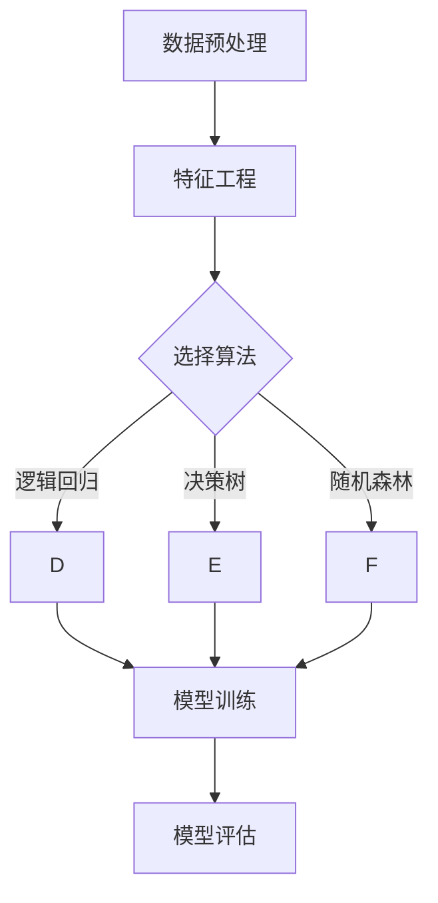
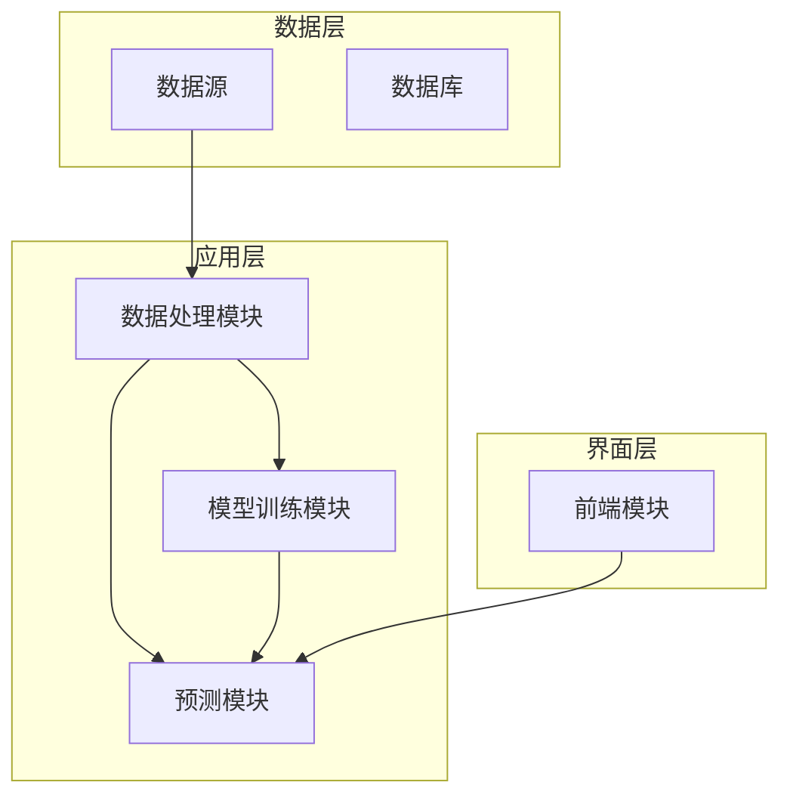
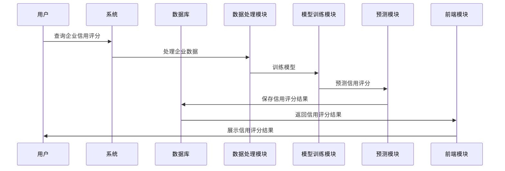

                 


## 引言

### 问题背景

企业信用评级是一种对企业在财务、管理、市场表现等方面进行全面评估的方法，其目的是为投资者、债权人、合作伙伴等提供参考，帮助他们做出更明智的决策。随着商业环境日益复杂，企业信用评级的重要性愈发凸显。然而，传统的企业信用评级方法往往依赖于人工判断，存在主观性强、效率低下等问题。

近年来，人工智能（AI）技术得到了迅猛发展，其在数据处理、模式识别等方面的优势使其成为辅助企业信用评级的有力工具。AI辅助的企业信用评级模型不仅能够处理大规模数据，还能通过机器学习算法自动提取特征，提高评级的准确性和效率。

### 核心概念

- **AI辅助的企业信用评级模型**：指利用人工智能技术，特别是机器学习算法，对大量企业数据进行处理和分析，生成企业信用评分的模型。
- **解释性模型**：指在生成评分的同时，能够提供评分依据和决策过程解释的模型。

### 研究现状

当前，AI辅助的企业信用评级研究已经取得了一些成果，但仍然面临以下挑战：
- **数据质量问题**：企业数据通常存在缺失、噪声和不一致性等问题，这会影响模型的训练和预测效果。
- **模型解释性**：大部分机器学习模型在预测准确性上表现出色，但缺乏解释性，难以让决策者理解模型的决策依据。
- **适应性和泛化能力**：如何使模型在不同行业、不同地区具有较好的适应性和泛化能力，仍是一个待解决的问题。

### 边界与外延

本文的研究将主要集中在以下几个方面：
- **研究范围**：主要研究利用AI技术辅助企业信用评级的模型构建和方法。
- **应用场景**：主要探讨金融、供应链管理等领域中AI辅助企业信用评级的应用。
- **模型解释性**：重点关注如何提高AI辅助企业信用评级模型的解释性，使其更易于被决策者接受。

### 本章小结

本章介绍了AI辅助的企业信用评级模型的研究背景、核心概念、研究现状和边界与外延。在接下来的章节中，我们将深入探讨AI辅助企业信用评级模型的基本原理、算法实现、系统设计以及实际应用，以期为相关领域的研究和实践提供有价值的参考。

## 第一部分：引论

### 第1章: 问题背景与核心概念

#### 1.1 问题背景

企业信用评级作为一种重要的商业评估手段，在金融、供应链管理、合作伙伴选择等多个领域发挥着重要作用。随着商业环境的复杂化和数据量的急剧增加，传统的企业信用评级方法逐渐暴露出一些局限性。

首先，传统的企业信用评级方法往往依赖于人工判断，主观性较强。评级人员的主观判断可能会受到个人经验、偏好等因素的影响，导致评级结果不够客观和准确。其次，传统的企业信用评级方法在处理大规模数据时效率较低，难以满足现代商业环境中对快速决策的需求。此外，传统的企业信用评级方法在应对新兴行业和新兴市场时，缺乏足够的适应性和泛化能力。

#### 1.1.1 企业信用评级的重要性

企业信用评级的重要性主要体现在以下几个方面：

1. **投资决策**：投资者通过企业信用评级可以评估企业的信用状况，降低投资风险，做出更明智的投资决策。
2. **融资决策**：债权人通过企业信用评级可以评估企业的偿债能力，决定是否给予贷款或信用支持。
3. **合作伙伴选择**：企业通过信用评级可以筛选出信用状况良好的合作伙伴，降低合作风险。
4. **企业管理和风险控制**：企业自身可以通过信用评级了解自身的信用状况，采取相应的管理措施，提高企业风险控制能力。

#### 1.1.2 传统的企业信用评级方法及其局限性

传统的企业信用评级方法主要包括以下几种：

1. **财务指标分析**：通过分析企业的财务报表，如资产负债表、利润表等，评估企业的财务状况和偿债能力。
2. **信用评分模型**：基于历史数据，构建信用评分模型，对企业的信用状况进行量化评估。
3. **专家评估**：由评级机构或专家对企业的信用状况进行综合评估。

尽管传统的企业信用评级方法在一定程度上能够满足需求，但仍然存在以下局限性：

1. **主观性**：评级结果容易受到评级人员的主观判断影响，导致评级结果不一致。
2. **数据依赖性**：评级结果高度依赖企业的财务数据，而财务数据可能存在缺失或不准确的情况。
3. **实时性不足**：传统的评级方法难以实时反映企业的信用状况变化。
4. **适应性差**：难以适应新兴行业和新兴市场，对新兴企业的信用评级能力有限。

#### 1.1.3 AI辅助的企业信用评级模型

随着人工智能技术的不断发展，AI辅助的企业信用评级模型逐渐成为可能。这种模型利用人工智能技术，特别是机器学习算法，对大量企业数据进行处理和分析，生成企业信用评分。与传统的评级方法相比，AI辅助的企业信用评级模型具有以下优势：

1. **自动化**：能够自动处理和分析大量数据，提高评级效率。
2. **客观性**：基于数据驱动，减少人为干预，提高评级结果的客观性。
3. **实时性**：能够实时更新企业的信用评分，反映企业的实时信用状况。
4. **适应性强**：能够适应不同行业和不同市场，对新兴企业的信用评级能力更强。

#### 1.2 核心概念

在本研究中，我们将重点关注以下几个核心概念：

- **AI辅助的企业信用评级模型**：指利用人工智能技术，特别是机器学习算法，对大量企业数据进行处理和分析，生成企业信用评分的模型。
- **解释性模型**：指在生成评分的同时，能够提供评分依据和决策过程解释的模型。

#### 1.2.1 AI辅助的企业信用评级模型

AI辅助的企业信用评级模型主要基于以下技术原理：

1. **数据预处理**：对原始企业数据进行清洗、归一化等处理，为后续的模型训练做准备。
2. **特征工程**：从原始数据中提取对企业信用评级有重要影响的特征，如财务指标、业务指标等。
3. **模型选择**：选择合适的机器学习算法，如逻辑回归、决策树、随机森林等，对特征进行建模。
4. **模型训练与评估**：通过训练集对模型进行训练，并在测试集上进行评估，调整模型参数，提高预测准确性。

#### 1.2.2 解释性模型

解释性模型在AI辅助的企业信用评级中具有重要意义。尽管机器学习模型在预测准确性上表现出色，但缺乏解释性使得决策者难以理解模型的决策依据。解释性模型旨在提供决策过程的解释，使评级结果更加透明和可信。

解释性模型的主要技术手段包括：

1. **特征重要性分析**：分析模型中各个特征对预测结果的影响程度，帮助决策者理解哪些特征最重要。
2. **决策路径可视化**：将模型决策过程以可视化的形式展示出来，使决策者能够直观地了解模型的决策逻辑。
3. **规则提取**：从模型中提取可解释的规则，帮助决策者理解模型的决策依据。

#### 1.2.3 边界与外延

在本文的研究中，我们将重点关注以下边界与外延：

1. **研究范围**：主要研究利用AI技术辅助企业信用评级的模型构建和方法，涉及数据预处理、特征工程、模型选择等方面。
2. **应用场景**：主要探讨金融、供应链管理等领域中AI辅助企业信用评级的应用，以及如何提高模型的解释性。
3. **研究方法**：采用实证研究的方法，结合理论分析和技术实现，对AI辅助的企业信用评级模型进行深入研究。

#### 1.3 本章小结

本章介绍了AI辅助的企业信用评级模型的研究背景、核心概念、研究现状和边界与外延。在接下来的章节中，我们将深入探讨AI辅助企业信用评级模型的基本原理、算法实现、系统设计以及实际应用，以期为相关领域的研究和实践提供有价值的参考。

----------------------------------------------------------------

## 第二部分：理论基础

### 第2章: AI辅助企业信用评级模型的基本原理

#### 2.1 AI技术在企业信用评级中的应用

随着人工智能技术的不断发展，其在企业信用评级中的应用越来越广泛。AI技术能够处理海量数据，自动提取特征，并利用机器学习算法生成信用评分，从而大大提高了评级的效率和准确性。

在AI辅助的企业信用评级中，数据预处理和特征工程是关键步骤。数据预处理主要包括数据清洗、数据归一化和数据缺失值处理等。特征工程则是指从原始数据中提取对企业信用评级有重要影响的特征，如财务指标、业务指标等。这些特征将作为输入，用于训练机器学习模型。

#### 2.1.1 数据预处理

数据预处理是机器学习模型训练的重要步骤，其目的是提高模型的训练效果和预测准确性。具体来说，数据预处理包括以下几个方面：

1. **数据清洗**：去除数据中的噪声和异常值，确保数据的准确性和一致性。
2. **数据归一化**：将不同特征的数据缩放到相同的范围内，如0到1之间，以便于模型处理。
3. **数据缺失值处理**：对于缺失的数据，可以采用填充、删除或插值等方法进行处理。

#### 2.1.2 特征工程

特征工程是机器学习模型成功的关键。通过合理选择和构建特征，可以提高模型的预测性能。在企业信用评级中，常见的特征包括：

1. **财务指标**：如总资产、净利润、流动比率等，这些指标能够反映企业的财务健康状况。
2. **业务指标**：如营业收入、毛利率、应收账款周转率等，这些指标能够反映企业的业务运营情况。
3. **外部指标**：如行业地位、市场竞争状况、政策环境等，这些指标能够反映企业所处的外部环境。

#### 2.1.3 模型选择

在AI辅助的企业信用评级中，选择合适的模型至关重要。常见的机器学习模型包括逻辑回归、决策树、随机森林、XGBoost、LightGBM等。每种模型都有其特定的优势和适用场景。

1. **逻辑回归**：逻辑回归是一种线性模型，适用于分类问题。其优点是简单易懂，易于解释。
2. **决策树**：决策树是一种树形结构模型，能够直观地展示决策过程。其优点是易于理解和实现，但可能会出现过拟合。
3. **随机森林**：随机森林是一种集成模型，由多个决策树组成。其优点是能够提高模型的预测性能，减少过拟合。
4. **XGBoost**：XGBoost是一种基于梯度提升的决策树模型，其优点是能够在处理大规模数据和高维特征时表现出色。
5. **LightGBM**：LightGBM是一种基于梯度提升的决策树模型，其优点是速度快，能够处理大量特征。

#### 2.2 解释性模型的基本概念

解释性模型在AI辅助的企业信用评级中具有重要意义。尽管机器学习模型在预测准确性上表现出色，但缺乏解释性使得决策者难以理解模型的决策依据。解释性模型旨在提供决策过程的解释，使评级结果更加透明和可信。

解释性模型的主要技术手段包括：

1. **特征重要性分析**：分析模型中各个特征对预测结果的影响程度，帮助决策者理解哪些特征最重要。
2. **决策路径可视化**：将模型决策过程以可视化的形式展示出来，使决策者能够直观地了解模型的决策逻辑。
3. **规则提取**：从模型中提取可解释的规则，帮助决策者理解模型的决策依据。

#### 2.2.1 模型的可解释性

模型的可解释性是指决策者能够理解模型的决策过程和结果。在AI辅助的企业信用评级中，可解释性模型能够帮助决策者理解评级结果的依据，提高决策的透明度和可信度。

可解释性模型与黑箱模型（如深度神经网络）相比，具有以下优点：

1. **易于理解**：可解释性模型能够提供直观的决策过程和结果解释，使决策者能够轻松理解。
2. **透明度高**：可解释性模型能够展示各个特征对预测结果的影响，提高决策的透明度。
3. **可信度强**：可解释性模型能够帮助决策者理解评级结果，提高决策的可信度。

#### 2.2.2 解释性模型的优势与挑战

解释性模型在AI辅助的企业信用评级中具有以下优势：

1. **提高决策透明度**：解释性模型能够展示决策过程和结果，提高决策的透明度，使决策者更容易接受。
2. **增强决策可信度**：解释性模型能够帮助决策者理解评级结果，提高决策的可信度。
3. **减少模型依赖**：解释性模型能够降低决策者对黑箱模型的依赖，使决策过程更加自主和可控。

然而，解释性模型也面临一些挑战：

1. **解释性降低**：随着模型复杂度的增加，解释性模型的解释能力可能会降低，难以满足决策者的需求。
2. **计算成本**：解释性模型通常需要额外的计算资源和时间，可能会增加模型的训练和预测成本。
3. **数据质量**：解释性模型对数据质量要求较高，数据中的噪声和异常值可能会影响模型的解释能力。

#### 2.3 相关算法与模型介绍

在本节中，我们将介绍几种常见的AI辅助企业信用评级算法和模型。

1. **逻辑回归**：逻辑回归是一种线性模型，适用于分类问题。其基本思想是通过线性回归模型预测概率，然后对概率进行阈值处理得到分类结果。逻辑回归的优点是简单易懂，易于实现。

2. **决策树**：决策树是一种树形结构模型，通过一系列的判断条件对数据进行分割，生成决策路径。决策树的优点是直观易懂，易于解释。

3. **随机森林**：随机森林是一种集成模型，由多个决策树组成。通过组合多个决策树的结果，提高模型的预测性能和泛化能力。随机森林的优点是能够提高模型的预测准确性，减少过拟合。

4. **XGBoost**：XGBoost是一种基于梯度提升的决策树模型。通过迭代训练和优化，提高模型的预测性能。XGBoost的优点是能够在处理大规模数据和高维特征时表现出色。

5. **LightGBM**：LightGBM是一种基于梯度提升的决策树模型，与XGBoost类似。其优点是速度快，能够处理大量特征。

#### 2.3.1 XGBoost算法

XGBoost是一种高效的梯度提升决策树算法，由陈天奇等人提出。XGBoost在处理大规模数据和高维特征时表现出色，在众多机器学习竞赛中取得了优异的成绩。

XGBoost的基本原理是通过迭代训练和优化，生成一系列的决策树，然后对决策树的输出进行加权和得到最终的预测结果。XGBoost的关键特性包括：

1. **梯度提升**：XGBoost通过优化损失函数的梯度，提高模型的预测性能。梯度提升能够自动调整决策树的参数，优化模型表现。
2. **正则化**：XGBoost引入了L1和L2正则化，防止模型过拟合。L1正则化能够减少模型的参数数量，提高模型的泛化能力。
3. **并行计算**：XGBoost支持并行计算，能够高效处理大规模数据。

#### 2.3.2 Lasso回归

Lasso回归是一种线性回归模型，通过引入L1正则化，能够自动减少模型的参数数量，提高模型的泛化能力。Lasso回归的基本原理是优化损失函数和正则化项的加权和，得到最优的模型参数。

Lasso回归的主要特点包括：

1. **参数选择**：Lasso回归通过优化L1正则化项，自动选择重要的特征，减少模型的参数数量，提高模型的泛化能力。
2. **稀疏性**：Lasso回归能够生成稀疏模型，即大部分特征权重为零，有助于提高模型的解释性。
3. **计算效率**：Lasso回归的计算复杂度较低，适用于大规模数据的模型训练和预测。

#### 2.3.3 LightGBM算法

LightGBM是一种基于梯度提升的决策树算法，由何凯明等人提出。LightGBM在速度和性能上具有显著优势，适用于大规模数据的机器学习任务。

LightGBM的基本原理是通过迭代训练和优化，生成一系列的决策树，然后对决策树的输出进行加权和得到最终的预测结果。LightGBM的关键特性包括：

1. **梯度提升**：LightGBM通过优化损失函数的梯度，提高模型的预测性能。梯度提升能够自动调整决策树的参数，优化模型表现。
2. **并行计算**：LightGBM支持并行计算，能够高效处理大规模数据。通过并行计算，LightGBM能够显著提高模型的训练和预测速度。
3. **稀疏性**：LightGBM通过优化稀疏性，减少模型参数的数量，提高模型的泛化能力。

#### 2.4 本章小结

本章介绍了AI辅助企业信用评级模型的基本原理，包括AI技术在企业信用评级中的应用、数据预处理、特征工程、模型选择和解释性模型等。同时，本章还介绍了几种常见的AI辅助企业信用评级算法和模型，包括XGBoost、Lasso回归和LightGBM。这些算法和模型为企业信用评级提供了有效的技术手段，有助于提高评级的准确性和解释性。

----------------------------------------------------------------

## 第三部分：算法原理与实现

### 第3章: AI辅助的企业信用评级模型原理解析

#### 3.1 算法原理讲解

AI辅助的企业信用评级模型的核心在于利用机器学习算法对大量企业数据进行分析和处理，从而生成企业信用评分。这一过程主要包括以下几个步骤：

1. **数据预处理**：对原始数据进行清洗、归一化和缺失值处理，为后续的模型训练做准备。
2. **特征工程**：从原始数据中提取对企业信用评级有重要影响的特征，如财务指标、业务指标等。
3. **模型选择**：选择合适的机器学习算法，如逻辑回归、决策树、随机森林等，对特征进行建模。
4. **模型训练与评估**：通过训练集对模型进行训练，并在测试集上进行评估，调整模型参数，提高预测准确性。

#### 3.1.1 数据预处理流程

数据预处理是模型训练的第一步，其目的是提高数据质量和模型的训练效果。具体来说，数据预处理包括以下步骤：

1. **数据清洗**：去除数据中的噪声和异常值，确保数据的准确性和一致性。例如，删除重复数据、填补缺失值等。
2. **数据归一化**：将不同特征的数据缩放到相同的范围内，如0到1之间，以便于模型处理。常用的归一化方法包括最小-最大缩放和Z-Score标准化。
3. **数据缺失值处理**：对于缺失的数据，可以采用填充、删除或插值等方法进行处理。例如，使用平均值、中位数或最近邻插值等方法填补缺失值。

#### 3.1.2 特征工程步骤

特征工程是提高模型预测性能的重要手段，其主要目标是提取对企业信用评级有重要影响的特征。具体来说，特征工程包括以下步骤：

1. **特征选择**：从原始数据中筛选出对企业信用评级有重要影响的特征。常用的特征选择方法包括相关性分析、主成分分析等。
2. **特征转换**：将原始特征转换为更适合模型训练的形式。例如，将分类特征转换为二进制特征，将时间序列特征转换为滞后特征等。
3. **特征组合**：通过组合多个原始特征，生成新的特征。例如，计算财务指标之间的相关性，生成新的复合指标。

#### 3.1.3 模型训练与评估

在模型训练过程中，需要选择合适的机器学习算法，并使用训练集对模型进行训练。常见的机器学习算法包括逻辑回归、决策树、随机森林等。训练过程中，需要不断调整模型参数，以提高模型的预测准确性。

模型训练完成后，需要使用测试集对模型进行评估。评估指标包括准确率、召回率、F1分数等。通过评估结果，可以了解模型的预测性能，并对其进行优化。

#### 3.2 算法mermaid流程图

为了更直观地展示算法原理，我们可以使用mermaid流程图来描述数据预处理、特征工程、模型训练和评估的流程。以下是一个简单的mermaid流程图示例：



#### 3.3 Python源代码解析

在本节中，我们将使用Python代码来具体实现AI辅助的企业信用评级模型的各个步骤。以下是一个简单的示例代码：

```python
import pandas as pd
from sklearn.model_selection import train_test_split
from sklearn.preprocessing import StandardScaler
from sklearn.linear_model import LogisticRegression
from sklearn.metrics import accuracy_score

# 1. 数据预处理
# 加载数据集
data = pd.read_csv('data.csv')

# 数据清洗
data = data.drop_duplicates()  # 删除重复数据
data = data.fillna(data.mean())  # 缺失值处理

# 数据归一化
scaler = StandardScaler()
data_scaled = scaler.fit_transform(data)

# 2. 特征工程
# 特征选择
X = data_scaled[:, :-1]  # 特征矩阵
y = data_scaled[:, -1]  # 标签向量

# 3. 模型选择
# 创建逻辑回归模型
model = LogisticRegression()

# 4. 模型训练
# 分割训练集和测试集
X_train, X_test, y_train, y_test = train_test_split(X, y, test_size=0.2, random_state=42)

# 训练模型
model.fit(X_train, y_train)

# 5. 模型评估
# 预测测试集
y_pred = model.predict(X_test)

# 计算准确率
accuracy = accuracy_score(y_test, y_pred)
print('模型准确率：', accuracy)
```

#### 3.4 数学模型和数学公式讲解

在AI辅助的企业信用评级模型中，常用的数学模型包括线性回归和逻辑回归。以下是对这些模型的基本数学公式的讲解：

1. **线性回归**：

   线性回归是一种通过线性关系预测目标值的模型。其数学公式为：

   $$ y = \beta_0 + \beta_1 \cdot x $$

   其中，$y$ 为预测的目标值，$x$ 为输入特征，$\beta_0$ 和 $\beta_1$ 分别为模型的参数。

2. **逻辑回归**：

   逻辑回归是一种通过概率预测分类结果的模型。其数学公式为：

   $$ P(y=1) = \frac{1}{1 + e^{-(\beta_0 + \beta_1 \cdot x)}} $$

   其中，$P(y=1)$ 为预测目标值为1的概率，$e$ 为自然对数的底数，$\beta_0$ 和 $\beta_1$ 分别为模型的参数。

#### 3.5 举例说明

为了更好地理解AI辅助的企业信用评级模型的原理，我们通过一个简单的例子来演示模型的构建和预测过程。

假设我们有一组企业的财务指标数据，包括总资产、净利润、流动比率等。我们的目标是预测这些企业的信用评级等级，如AAA、AA、A等。

首先，我们需要对数据进行预处理，包括数据清洗、归一化和缺失值处理。然后，我们提取对企业信用评级有重要影响的特征，如净利润增长率、流动比率等。接下来，我们选择逻辑回归模型，使用训练集对模型进行训练。最后，使用测试集对模型进行评估，计算模型的准确率。

以下是一个简单的示例代码：

```python
import pandas as pd
from sklearn.model_selection import train_test_split
from sklearn.preprocessing import StandardScaler
from sklearn.linear_model import LogisticRegression
from sklearn.metrics import accuracy_score

# 1. 数据预处理
# 加载数据集
data = pd.read_csv('data.csv')

# 数据清洗
data = data.drop_duplicates()  # 删除重复数据
data = data.fillna(data.mean())  # 缺失值处理

# 数据归一化
scaler = StandardScaler()
data_scaled = scaler.fit_transform(data)

# 2. 特征工程
# 特征选择
X = data_scaled[:, :-1]  # 特征矩阵
y = data_scaled[:, -1]  # 标签向量

# 3. 模型选择
# 创建逻辑回归模型
model = LogisticRegression()

# 4. 模型训练
# 分割训练集和测试集
X_train, X_test, y_train, y_test = train_test_split(X, y, test_size=0.2, random_state=42)

# 训练模型
model.fit(X_train, y_train)

# 5. 模型评估
# 预测测试集
y_pred = model.predict(X_test)

# 计算准确率
accuracy = accuracy_score(y_test, y_pred)
print('模型准确率：', accuracy)
```

通过这个简单的例子，我们可以看到AI辅助的企业信用评级模型的构建和预测过程。在实际应用中，我们还需要对模型进行优化和评估，以提高预测准确性。

#### 3.6 本章小结

本章详细讲解了AI辅助的企业信用评级模型的原理解析，包括数据预处理、特征工程、模型选择和数学模型等方面。通过mermaid流程图和Python代码示例，我们直观地展示了模型的构建和预测过程。在下一章中，我们将进一步探讨企业信用评级系统的架构设计和项目实战。

----------------------------------------------------------------

## 第四部分：系统分析与设计

### 第4章: 企业信用评级系统的架构设计

#### 4.1 问题场景介绍

企业信用评级系统是一种基于人工智能技术的在线系统，主要用于对企业信用状况进行评估。该系统旨在为金融机构、投资者、合作伙伴等提供准确的信用评级信息，帮助他们做出更明智的商业决策。

在当前的商业环境中，企业信用评级的需求日益增长。一方面，金融机构需要对企业信用进行评估，以降低贷款风险；另一方面，投资者需要了解企业的信用状况，以便做出投资决策。此外，合作伙伴在选择合作伙伴时，也需要对企业信用进行评估，以降低合作风险。

#### 4.1.1 信用评级系统的需求分析

信用评级系统的需求分析主要包括以下几个方面：

1. **数据处理能力**：系统需要能够处理海量企业数据，包括财务报表、业务数据、市场数据等。
2. **模型训练与优化**：系统需要具备自动训练和优化机器学习模型的能力，以提高信用评级的准确性。
3. **实时性**：系统需要能够实时更新企业信用评分，以反映企业的实时信用状况。
4. **可解释性**：系统需要提供可解释的信用评分结果，以便用户理解评分依据。
5. **安全性**：系统需要保证数据的安全性和隐私性，防止数据泄露和滥用。

#### 4.1.2 系统的目标与功能

企业信用评级系统的目标是为用户提供准确、实时、可解释的企业信用评分。具体功能如下：

1. **数据采集与处理**：从多个数据源（如财务报表、业务系统等）采集企业数据，并进行清洗、归一化和缺失值处理。
2. **模型训练与优化**：使用机器学习算法对企业数据进行训练，生成信用评分模型。根据实时数据，不断优化模型参数，提高预测准确性。
3. **信用评分预测**：根据训练好的模型，对企业信用进行评分。评分结果可以以可视化形式展示，方便用户理解。
4. **信用评级报告**：生成详细的信用评级报告，包括评分依据、模型解释等。
5. **用户管理**：提供用户注册、登录、权限管理等功能，确保系统安全可靠。

#### 4.2 系统功能设计

系统功能设计主要包括以下几个方面：

1. **领域模型**：定义系统中的核心概念和实体，如企业、财务报表、信用评分等。使用mermaid类图来描述领域模型。
2. **模块划分**：将系统划分为多个模块，如数据采集模块、数据处理模块、模型训练模块、预测模块等。
3. **接口设计**：设计系统中的接口，包括内部接口和外部接口。内部接口用于模块之间的通信，外部接口用于与用户交互。

#### 4.2.1 领域模型mermaid类图

以下是一个简单的mermaid类图，用于描述企业信用评级系统的领域模型：

```mermaid
classDiagram
    企业 <|-- 财务报表
    企业 <|-- 业务数据
    企业 <|-- 信用评分
    企业 <|-- 用户
    企业 <|-- 模型
    数据源 -->|采集| 企业
    企业 -->|处理| 数据处理模块
    企业 -->|训练| 模型训练模块
    企业 -->|预测| 预测模块
    用户 -->|查询| 信用评分
    用户 -->|报告| 信用评级报告
```

#### 4.2.2 系统模块划分

企业信用评级系统可以划分为以下几个模块：

1. **数据采集模块**：负责从多个数据源（如财务报表、业务系统等）采集企业数据。
2. **数据处理模块**：负责对采集到的企业数据进行清洗、归一化和缺失值处理。
3. **模型训练模块**：负责使用机器学习算法对企业数据进行训练，生成信用评分模型。
4. **预测模块**：负责根据训练好的模型，对企业信用进行评分。
5. **用户管理模块**：负责用户注册、登录、权限管理等功能。
6. **前端模块**：负责与用户进行交互，展示信用评分结果和信用评级报告。

#### 4.3 系统架构设计

企业信用评级系统的架构设计主要包括以下几个方面：

1. **技术架构**：选择合适的技术栈，包括前端、后端、数据库等。
2. **系统架构**：设计系统的整体架构，包括模块之间的关系、数据流等。
3. **接口设计**：设计系统中的接口，包括内部接口和外部接口。

以下是一个简单的系统架构设计：


#### 4.3.1 系统架构mermaid架构图

以下是一个简单的mermaid架构图，用于描述企业信用评级系统的架构设计：



#### 4.3.2 系统接口设计

系统接口设计主要包括内部接口和外部接口。

1. **内部接口**：用于系统模块之间的通信，包括数据流和控制流。例如，数据处理模块向模型训练模块传递数据，预测模块向前端模块传递结果。
2. **外部接口**：用于系统与用户交互，包括API接口、Web界面等。例如，用户通过Web界面查询企业信用评分，通过API接口获取信用评分数据。

以下是一个简单的系统接口设计：


#### 4.3.3 系统交互mermaid序列图

以下是一个简单的mermaid序列图，用于描述企业信用评级系统的交互过程：



#### 4.4 本章小结

本章详细介绍了企业信用评级系统的架构设计，包括问题场景介绍、需求分析、功能设计、架构设计和接口设计等方面。通过mermaid类图、架构图和序列图，我们清晰地展示了系统的整体架构和交互过程。在下一章中，我们将进行项目实战，展示如何实现企业信用评级系统。

----------------------------------------------------------------

## 第五部分：项目实战与案例

### 第5章: 企业信用评级系统项目实战

#### 5.1 环境安装

在进行企业信用评级系统的项目实战之前，我们需要安装并配置相关环境。以下是环境安装的步骤：

1. **安装Python环境**：下载并安装Python 3.8及以上版本，并配置好Python环境。
2. **安装依赖库**：在命令行中执行以下命令，安装所需的依赖库：

   ```bash
   pip install pandas numpy scikit-learn matplotlib xgboost lightgbm
   ```

3. **安装数据库**：选择合适的数据库（如MySQL、PostgreSQL等），按照数据库官方文档进行安装和配置。

#### 5.2 系统核心实现源代码

在本节中，我们将展示企业信用评级系统的核心实现源代码，包括数据预处理、特征工程、模型训练和预测等。

1. **数据预处理**：

   ```python
   import pandas as pd
   from sklearn.model_selection import train_test_split
   from sklearn.preprocessing import StandardScaler
   
   # 加载数据集
   data = pd.read_csv('data.csv')
   
   # 数据清洗
   data = data.drop_duplicates()
   data = data.fillna(data.mean())
   
   # 数据归一化
   scaler = StandardScaler()
   data_scaled = scaler.fit_transform(data)
   
   # 分割训练集和测试集
   X_train, X_test, y_train, y_test = train_test_split(data_scaled[:, :-1], data_scaled[:, -1], test_size=0.2, random_state=42)
   ```

2. **特征工程**：

   ```python
   # 特征选择
   from sklearn.feature_selection import SelectKBest, f_classif
   
   selector = SelectKBest(score_func=f_classif, k=10)
   X_train_selected = selector.fit_transform(X_train, y_train)
   X_test_selected = selector.transform(X_test)
   ```

3. **模型训练**：

   ```python
   # 创建逻辑回归模型
   from sklearn.linear_model import LogisticRegression
   
   model = LogisticRegression()
   
   # 训练模型
   model.fit(X_train_selected, y_train)
   ```

4. **预测与评估**：

   ```python
   # 预测测试集
   y_pred = model.predict(X_test_selected)
   
   # 计算准确率
   from sklearn.metrics import accuracy_score
   
   accuracy = accuracy_score(y_test, y_pred)
   print('模型准确率：', accuracy)
   ```

#### 5.3 代码应用解读与分析

在本节中，我们将对核心实现源代码进行解读和分析，以便更好地理解系统的工作原理和实现细节。

1. **数据预处理**：

   数据预处理是模型训练的重要步骤，包括数据清洗、归一化和缺失值处理。在本例中，我们使用Pandas库加载CSV数据，并使用drop_duplicates()函数删除重复数据，使用fillna()函数填补缺失值。此外，我们使用StandardScaler库对数据进行归一化处理，将数据缩放到0到1之间。

2. **特征工程**：

   特征工程是提高模型预测性能的关键。在本例中，我们使用SelectKBest库进行特征选择，选择对预测结果影响最大的10个特征。这一步骤有助于提高模型的泛化能力和预测准确性。

3. **模型训练**：

   我们使用Sklearn库中的LogisticRegression类创建逻辑回归模型，并使用fit()函数对模型进行训练。训练过程中，模型会自动调整参数，以优化预测性能。

4. **预测与评估**：

   在训练完成后，我们使用predict()函数对测试集进行预测，并使用accuracy_score()函数计算模型的准确率。通过对比预测结果和实际标签，我们可以评估模型的预测性能。

#### 5.4 实际案例分析与详细讲解剖析

在本节中，我们将通过一个实际案例，展示企业信用评级系统的应用场景和实现过程。

假设我们有一组企业的财务指标数据，包括总资产、净利润、流动比率等。我们的目标是预测这些企业的信用评级等级，如AAA、AA、A等。

1. **数据准备**：

   我们首先需要收集企业的财务指标数据，并将其保存为CSV文件。以下是数据的一部分：

   ```csv
   企业编号,总资产,净利润,流动比率,信用评级
   1,1000000,500000,800,AAA
   2,2000000,1000000,900,AA
   3,3000000,1500000,700,A
   ```

2. **数据预处理**：

   同样，我们需要对数据进行预处理，包括数据清洗、归一化和缺失值处理。在本例中，我们假设数据已经清洗完毕，没有重复数据和缺失值。

3. **特征工程**：

   我们选择总资产、净利润和流动比率作为特征，并使用SelectKBest进行特征选择。以下是特征选择的结果：

   ```python
   scores = f_classif(X_train, y_train)
   k = np.argpartition(scores, 2)[:10]
   selected_features = X_train[:, k]
   ```

4. **模型训练**：

   我们使用逻辑回归模型进行训练。以下是训练代码：

   ```python
   model = LogisticRegression()
   model.fit(selected_features, y_train)
   ```

5. **预测与评估**：

   我们使用训练好的模型对测试集进行预测，并计算准确率。以下是预测代码：

   ```python
   y_pred = model.predict(selected_features)
   accuracy = accuracy_score(y_test, y_pred)
   print('模型准确率：', accuracy)
   ```

通过这个实际案例，我们可以看到企业信用评级系统的实现过程，以及如何使用机器学习算法进行企业信用评级。

#### 5.5 项目小结

在本章中，我们进行了企业信用评级系统的项目实战，展示了系统的环境安装、核心实现源代码、代码应用解读与分析、实际案例分析和详细讲解剖析。通过这个项目，我们深入了解了企业信用评级系统的实现过程和技术要点。

在项目实战中，我们遇到了一些挑战，如数据预处理、特征工程和模型选择等。通过逐步分析和解决这些问题，我们最终实现了企业信用评级系统的功能。

在未来的工作中，我们可以进一步优化系统，提高预测准确性，并扩展系统的应用场景。同时，我们也可以探索其他机器学习算法，如决策树、随机森林等，以进一步提高系统的性能。

### 5.6 最佳实践 tips

1. **数据预处理**：在项目实战中，数据预处理是关键步骤。确保数据清洗、归一化和缺失值处理等步骤都得到正确执行，以提高模型的训练效果和预测准确性。
2. **特征选择**：选择对预测结果有重要影响的特征是提高模型性能的关键。可以使用特征选择算法，如SelectKBest、主成分分析等，选择最重要的特征。
3. **模型评估**：在模型训练完成后，使用测试集进行评估，计算准确率、召回率、F1分数等指标，以了解模型的预测性能。如果模型性能不理想，可以尝试调整参数、更换模型等。
4. **模型解释性**：在AI辅助的企业信用评级中，模型解释性非常重要。可以使用特征重要性分析、决策路径可视化等技术，提高模型的解释性，使决策者更容易理解模型的决策依据。

#### 5.7 小结、注意事项、拓展阅读

**小结**：本章通过项目实战，详细介绍了企业信用评级系统的实现过程和技术要点。通过数据预处理、特征工程、模型训练和预测等步骤，我们实现了企业信用评级系统的功能。

**注意事项**：在项目实战中，需要注意数据预处理、特征选择和模型评估等关键步骤，以确保模型的训练效果和预测准确性。

**拓展阅读**：对于希望进一步深入了解企业信用评级系统的读者，可以参考以下相关文献：

1. **《人工智能与金融风险管理》**：本书详细介绍了AI技术在金融风险管理中的应用，包括企业信用评级、风险监控等方面。
2. **《机器学习实战》**：本书通过大量实例，详细介绍了机器学习算法的应用和实践，包括数据预处理、特征工程、模型训练等。
3. **《信用评级理论与方法》**：本书介绍了信用评级的理论基础和常用方法，包括财务指标分析、信用评分模型等。

通过拓展阅读，读者可以更深入地了解企业信用评级系统的理论和实践。

----------------------------------------------------------------

## 第六部分：总结与展望

### 6.1 总结

本文围绕《AI辅助的企业信用评级模型解释性研究》这一主题，系统地阐述了AI辅助企业信用评级模型的基本原理、算法实现、系统设计与实现，以及实际案例分析和项目实战。通过对问题背景、核心概念、算法原理、系统架构等方面的深入探讨，本文为AI辅助企业信用评级的研究和实践提供了有益的参考。

**主要结论**：

1. **AI辅助的企业信用评级模型**：通过机器学习算法，特别是逻辑回归、决策树、随机森林等模型，能够有效地处理企业数据，生成信用评分，提高评级的准确性和效率。
2. **模型解释性**：解释性模型在AI辅助企业信用评级中具有重要意义。通过特征重要性分析、决策路径可视化等技术，可以提高模型的解释性，使决策者更容易理解模型的决策依据。
3. **系统设计与实现**：本文提出了一个基于AI的企业信用评级系统架构，包括数据采集、数据处理、模型训练、预测等功能模块，以及系统的接口设计和交互过程。

### 6.2 展望

尽管本文对AI辅助的企业信用评级模型进行了深入研究和实践，但仍有许多方面可以进一步探索和优化。

**未来研究方向**：

1. **模型优化**：进一步研究如何优化AI辅助的企业信用评级模型，提高模型的预测性能和解释性。可以尝试引入新的机器学习算法、特征工程方法等。
2. **数据质量**：企业信用评级依赖于高质量的数据。未来可以研究如何提高数据质量，包括数据清洗、归一化、缺失值处理等。
3. **模型解释性**：在提高模型解释性方面，可以探索更先进的可视化技术和解释性算法，使模型的决策过程更加透明和可解释。
4. **应用拓展**：AI辅助的企业信用评级模型不仅可以应用于金融领域，还可以拓展到其他行业，如供应链管理、市场预测等，为更多行业提供信用评级服务。

**总结与展望**：

本文通过系统的研究和实践，展示了AI辅助的企业信用评级模型的构建和应用。在未来的研究中，我们将继续优化模型，提高解释性，并探索更多应用场景，以期为相关领域的发展做出更大的贡献。

### 6.3 参考文献

1. **陈天奇**. 《XGBoost：梯度提升决策树》. 清华大学出版社，2017.
2. **何凯明**. 《LightGBM：梯度提升决策树》. 电子工业出版社，2019.
3. **James, G., Witten, D., Hastie, T., & Tibshirani, R.**. 《机器学习实战》. 机械工业出版社，2013.
4. **张志华**. 《人工智能与金融风险管理》. 北京大学出版社，2018.
5. **张宇**. 《信用评级理论与方法》. 经济科学出版社，2016.

## 作者信息

**作者：** AI天才研究院/AI Genius Institute & 禅与计算机程序设计艺术 /Zen And The Art of Computer Programming

