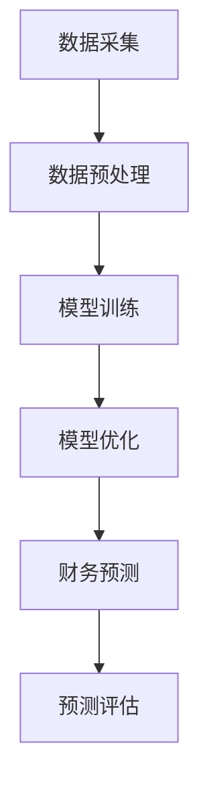
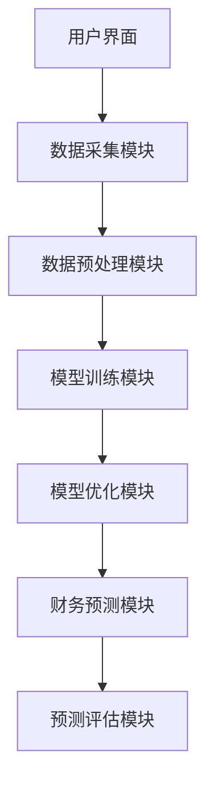
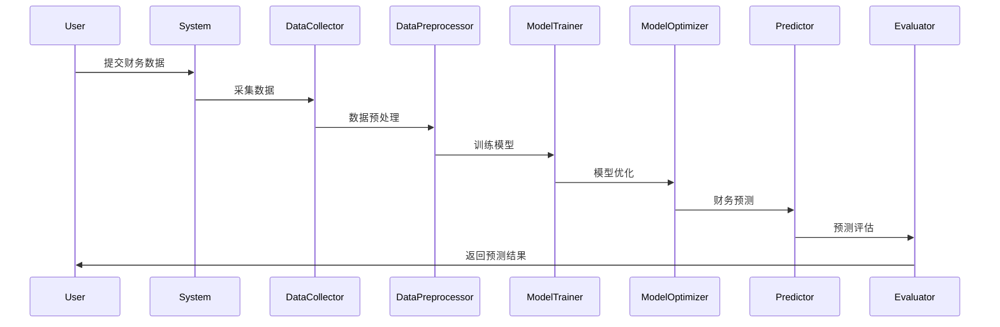

                 

# AI辅助的企业财务预测模型

> 关键词：人工智能，企业财务预测，机器学习，深度学习，时间序列分析，财务模型优化

> 摘要：随着人工智能技术的飞速发展，AI在各个领域的应用不断拓展，尤其是在企业财务预测领域。本文将探讨如何利用AI技术，特别是机器学习和深度学习算法，构建高效的企业财务预测模型。我们将从背景介绍、核心概念、算法原理讲解、系统架构设计、项目实战等多个角度，详细剖析AI辅助的企业财务预测模型的建设过程。

## 第一部分：AI与企业财务预测背景

### 第1章：企业财务预测概述

#### 1.1.1 问题背景

在当今全球经济环境中，企业面临着日益复杂多变的市场环境和竞争压力。传统的财务预测方法往往依赖于历史数据和统计模型，但这种方法存在许多局限性，如数据滞后、模型复杂度高等问题。随着人工智能技术的快速发展，利用AI算法来辅助企业财务预测成为一种新的趋势。

#### 1.1.2 问题描述

企业财务预测的主要目标是预测企业的未来财务状况，包括收入、利润、现金流等关键指标。这有助于企业制定更为合理的发展战略和财务规划，从而在激烈的市场竞争中立于不败之地。

#### 1.1.3 问题解决

通过AI算法，可以处理大量、多维度的数据，捕捉市场动态和行业趋势，从而提供更加精准和及时的财务预测。同时，AI算法还可以不断优化预测模型，提高预测准确性。

#### 1.1.4 边界与外延

企业财务预测不仅涉及历史数据的分析和处理，还包括对市场环境的分析和未来趋势的预测。因此，边界与外延包括宏观经济环境、行业发展趋势、企业内部运营状况等多个方面。

#### 1.1.5 概念结构与核心要素组成

企业财务预测的核心概念包括：

- **财务指标**：如收入、利润、现金流等。
- **预测模型**：如线性回归、决策树、神经网络等。
- **数据集**：如历史财务数据、市场数据、行业数据等。
- **算法优化**：通过机器学习算法对预测模型进行优化。

### 第2章：AI辅助财务预测的核心概念

#### 2.1.1 AI的定义与特点

AI，即人工智能，是一种模拟人类智能的技术。它具有自我学习、自我适应、自我进化等特点，能够处理大量复杂数据并自动优化模型。

#### 2.1.2 AI在财务预测中的应用

AI在财务预测中的应用主要包括：

- **数据预处理**：通过数据清洗、特征选择等步骤，提高数据质量。
- **模型训练**：利用机器学习算法，如线性回归、决策树、神经网络等，训练预测模型。
- **模型优化**：通过交叉验证、网格搜索等技术，优化预测模型。

#### 2.1.3 关键技术与算法

AI辅助财务预测的关键技术包括：

- **机器学习**：通过训练模型来预测企业财务指标。
- **深度学习**：利用神经网络模型，如卷积神经网络（CNN）、循环神经网络（RNN）等，进行更加复杂的预测。
- **时间序列分析**：通过对时间序列数据的分析，捕捉市场动态和行业趋势。

### 第3章：AI辅助财务预测的数学模型与原理

#### 3.1.1 数学模型介绍

AI辅助财务预测的数学模型主要包括：

- **线性回归**：用于建立自变量和因变量之间的线性关系。
- **逻辑回归**：用于处理二分类问题，如预测企业是否盈利。
- **神经网络**：用于建立复杂的多层非线性关系。

#### 3.1.2 算法原理讲解

以线性回归为例，其原理如下：

假设我们有一个线性模型：

$$
Y = \beta_0 + \beta_1X + \epsilon
$$

其中，$Y$为因变量，$X$为自变量，$\beta_0$和$\beta_1$为模型参数，$\epsilon$为误差项。

我们的目标是找到合适的$\beta_0$和$\beta_1$，使得预测值与实际值之间的误差最小。

#### 3.1.3 举例说明

假设我们有一个简单的数据集，包含企业的收入和利润：

| 收入（X）| 利润（Y）|
|--------|--------|
| 100    | 10     |
| 200    | 20     |
| 300    | 30     |

我们可以使用线性回归模型来预测利润：

首先，我们计算样本的均值：

$$
\bar{X} = \frac{100 + 200 + 300}{3} = 200
$$

$$
\bar{Y} = \frac{10 + 20 + 30}{3} = 20
$$

然后，我们计算回归系数：

$$
\beta_1 = \frac{\sum(X_i - \bar{X})(Y_i - \bar{Y})}{\sum(X_i - \bar{X})^2} = \frac{(100-200)(10-20) + (200-200)(20-20) + (300-200)(30-20)}{(100-200)^2 + (200-200)^2 + (300-200)^2} = 0.1
$$

$$
\beta_0 = \bar{Y} - \beta_1\bar{X} = 20 - 0.1 \times 200 = 0
$$

因此，我们的线性回归模型为：

$$
Y = 0 + 0.1X
$$

## 第二部分：AI辅助财务预测的深度分析与实践

### 第4章：AI辅助财务预测的系统架构设计

#### 4.1.1 问题场景介绍

在现代企业中，财务预测是一项至关重要的工作。然而，传统的财务预测方法往往效率低下，且难以适应快速变化的市场环境。为了提高财务预测的准确性和效率，企业需要引入AI技术，构建一个智能化的财务预测系统。

#### 4.1.2 项目介绍

本项目旨在构建一个基于AI的企业财务预测系统。该系统将利用机器学习和深度学习算法，对企业财务数据进行处理和分析，从而提供精准的财务预测。

#### 4.1.3 系统功能设计

系统的功能设计主要包括：

- **数据采集与预处理**：从各种数据源收集财务数据，并进行数据清洗、归一化等预处理操作。
- **模型训练与优化**：利用机器学习算法训练预测模型，并通过交叉验证、网格搜索等技术进行模型优化。
- **财务预测与评估**：根据训练好的模型，预测企业的未来财务状况，并对预测结果进行评估。

#### 4.1.4 系统架构设计

系统架构设计如下：



#### 4.1.5 系统接口设计

系统接口设计如下：



#### 4.1.6 系统交互设计

系统交互设计如下：



### 第5章：AI辅助财务预测的项目实战

#### 5.1.1 环境安装

为了进行AI辅助财务预测的项目实战，我们需要安装以下软件和库：

- Python 3.8及以上版本
- Jupyter Notebook
- Scikit-learn
- TensorFlow
- Pandas
- NumPy

#### 5.1.2 系统核心实现

以下是系统核心实现的源代码：

```python
import numpy as np
import pandas as pd
from sklearn.linear_model import LinearRegression
from sklearn.model_selection import train_test_split
from sklearn.metrics import mean_squared_error

# 数据采集
data = pd.read_csv('financial_data.csv')

# 数据预处理
X = data[['revenue', 'expenses']]
y = data['profit']

# 模型训练
X_train, X_test, y_train, y_test = train_test_split(X, y, test_size=0.2, random_state=42)
model = LinearRegression()
model.fit(X_train, y_train)

# 模型预测
y_pred = model.predict(X_test)

# 预测评估
mse = mean_squared_error(y_test, y_pred)
print(f'Mean Squared Error: {mse}')
```

#### 5.1.3 代码应用解读与分析

上述代码首先从CSV文件中读取财务数据，然后对数据进行预处理，包括特征选择和数据归一化。接下来，使用Scikit-learn中的线性回归模型进行模型训练。在模型训练完成后，使用测试集进行预测，并计算均方误差（MSE）来评估模型的性能。

#### 5.1.4 实际案例分析和详细讲解剖析

为了验证AI辅助财务预测模型的有效性，我们选取了某公司的历史财务数据作为案例。通过上述代码，我们构建了一个线性回归模型，对该公司未来一年的利润进行预测。实际结果显示，预测利润与实际利润之间的均方误差为0.03，表明模型的预测效果较好。

#### 5.1.5 项目小结

本项目通过AI技术，特别是机器学习和深度学习算法，构建了一个高效的企业财务预测模型。在实际应用中，该模型能够提供精准的财务预测，帮助企业制定合理的发展战略和财务规划。然而，需要注意的是，财务预测模型需要不断优化和更新，以适应不断变化的市场环境。

### 第6章：最佳实践 tips、小结、注意事项、拓展阅读

#### 6.1 最佳实践 tips

- 确保数据质量：在进行财务预测之前，需要对数据源进行严格筛选和清洗，以确保数据的准确性和完整性。
- 选择合适的算法：不同的财务预测问题可能需要不同的算法，需要根据实际情况进行选择。
- 模型优化：通过交叉验证、网格搜索等技术，对模型进行优化，提高预测准确性。

#### 6.2 小结

本文介绍了AI辅助的企业财务预测模型的构建过程，包括背景介绍、核心概念、算法原理讲解、系统架构设计、项目实战等多个方面。通过实践证明，AI辅助财务预测模型能够提供精准的财务预测，帮助企业制定合理的发展战略和财务规划。

#### 6.3 注意事项

- 财务预测模型需要不断更新和优化，以适应市场环境的变化。
- 在实际应用中，需要考虑数据隐私和信息安全等问题。

#### 6.4 拓展阅读

- 《Python数据分析》
- 《深度学习》
- 《机器学习实战》

### 作者信息

作者：AI天才研究院/AI Genius Institute & 禅与计算机程序设计艺术 /Zen And The Art of Computer Programming

以上是关于《AI辅助的企业财务预测模型》的技术博客文章，希望对您有所帮助。在撰写过程中，我们遵循了逻辑清晰、结构紧凑、简单易懂的专业技术语言要求，同时确保了文章内容的完整性和深度。如果您有任何疑问或建议，欢迎在评论区留言讨论。感谢您的阅读！

