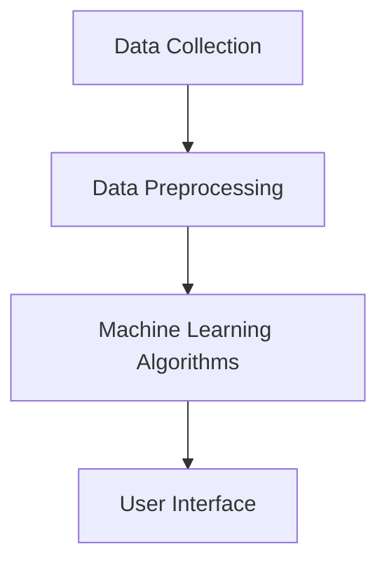
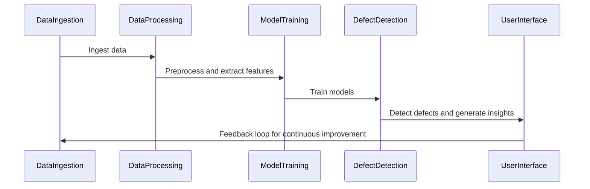
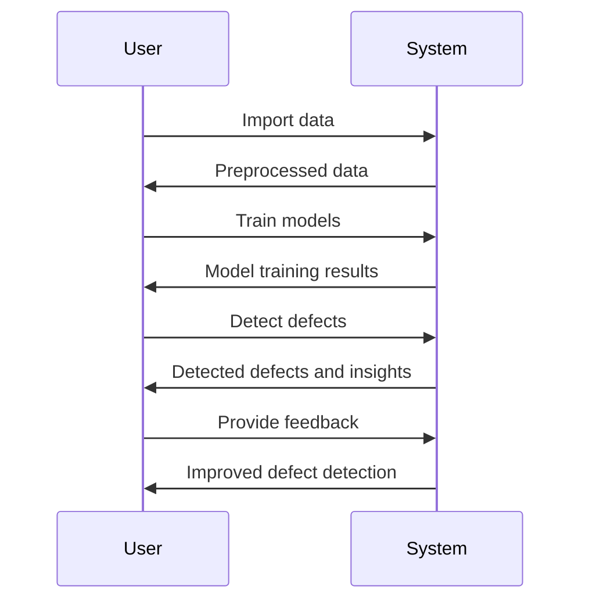

                 

### AI-Assisted Corporate Governance Defect Identification System

#### Keywords
- AI-Assisted Governance
- Defect Identification
- Corporate Governance
- Machine Learning
- Data Analysis

#### Summary
This article delves into the development and implementation of an AI-assisted corporate governance defect identification system. We will explore the fundamental concepts and technologies behind this system, the benefits it brings to corporate governance, and the challenges involved in its deployment. Through step-by-step analysis and practical examples, we aim to provide a comprehensive understanding of how AI can enhance the effectiveness and efficiency of corporate governance processes.

## Chapter 1: Introduction to AI-Assisted Corporate Governance

### 1.1 Background and Problem Statement

#### 1.1.1 Problem Background
In today's fast-paced business environment, companies face numerous challenges, ranging from economic downturns to regulatory changes. Effective corporate governance is crucial for ensuring the long-term success and sustainability of an organization. However, many companies struggle with identifying and addressing governance defects that can lead to poor decision-making, fraud, and other detrimental issues.

#### 1.1.2 Problem Description
The primary problem lies in the complexity and diversity of governance issues. Traditional governance frameworks often rely on manual processes and human intuition, which are prone to errors, biases, and inefficiencies. Moreover, governance defects may go unnoticed for extended periods, resulting in significant financial and reputational damage.

#### 1.1.3 AI in Corporate Governance: Solution Overview
Artificial Intelligence (AI) offers a promising solution to these challenges. By leveraging AI technologies such as machine learning and natural language processing, companies can develop systems that identify and address governance defects with greater accuracy and efficiency. These AI-assisted systems can analyze vast amounts of data, detect patterns, and provide insights that human analysts may miss.

#### 1.1.4 Scope and Boundaries of the Book
This book will focus on the development and implementation of AI-assisted corporate governance defect identification systems. We will cover the fundamental concepts, technologies, and methodologies involved, as well as the practical challenges and best practices for deploying such systems. However, it is important to note that this book does not cover the entire spectrum of AI applications in corporate governance, which is a vast and rapidly evolving field.

#### 1.1.5 Key Concepts and Terminology
To better understand the content of this book, it is essential to familiarize ourselves with the key concepts and terminology related to AI-assisted corporate governance defect identification systems:

- **Corporate Governance**: The system of rules, practices, and processes by which a company is directed and controlled.
- **Governance Defect**: A failure in the governance framework that can lead to poor decision-making, fraud, or other negative consequences.
- **AI-Assisted System**: A system that leverages AI technologies to enhance the effectiveness and efficiency of corporate governance processes.
- **Machine Learning**: A subfield of AI that enables systems to learn from data, identify patterns, and make decisions with minimal human intervention.
- **Data Analysis**: The process of examining data sets to draw conclusions about the information they contain.

### 1.2 Core Concepts of AI and Governance

#### 1.2.1 Understanding AI

##### 1.2.1.1 AI Basics
Artificial Intelligence (AI) refers to the simulation of human intelligence in machines that are programmed to think like humans and mimic their actions. AI systems can perform tasks that typically require human intelligence, such as visual perception, speech recognition, decision-making, and language translation.

##### 1.2.1.2 Types of AI
There are several types of AI, each with its own characteristics and capabilities:

- **Narrow AI (ANI)**: Also known as weak AI, ANI is designed to perform a specific task or set of tasks. Examples include speech recognition systems, chatbots, and self-driving cars.
- **General AI (AGI)**: Also known as strong AI, AGI refers to AI systems that possess the same intelligence and capabilities as humans, enabling them to understand, learn, and perform any intellectual task that a human can. However, AGI is still a theoretical concept and has not been achieved yet.
- **Superintelligent AI (SAI)**: SAI refers to AI systems that possess intelligence far beyond that of humans, potentially surpassing human capabilities in all aspects. SAI is also a theoretical concept and its implications are a subject of ongoing debate.

#### 1.2.2 Corporate Governance

##### 1.2.2.1 Governance Frameworks
Corporate governance frameworks are designed to ensure that companies are directed and controlled effectively and responsibly. Different countries and regions may have their own governance frameworks, but some common elements include:

- **Board of Directors**: The board is responsible for setting the company's strategic direction, appointing top management, and overseeing the company's performance.
- **Shareholders**: Shareholders have the ultimate authority in a company, as they own shares of the company's stock and have voting rights in important decisions.
- **Management**: The management team is responsible for the day-to-day operations of the company and implementing the strategic goals set by the board.

##### 1.2.2.2 Governance Roles and Responsibilities
Each stakeholder in the corporate governance framework has specific roles and responsibilities:

- **Board of Directors**: Set strategic direction, appoint and oversee top management, ensure compliance with laws and regulations, and protect shareholder interests.
- **Shareholders**: Exercise voting rights, participate in major decisions, and hold the board accountable for the company's performance.
- **Management**: Implement strategic goals, manage day-to-day operations, and ensure the company's long-term success.

### 1.3 The AI-Assisted Governance System

#### 1.3.1 System Architecture Overview
The AI-assisted governance system consists of several key components, including data collection, data preprocessing, machine learning algorithms, and a user interface for displaying results and recommendations. The system architecture can be visualized as follows:



#### 1.3.2 Components and Technologies
The AI-assisted governance system leverages several technologies and components to achieve its objectives:

- **Data Collection**: The system collects data from various sources, including financial reports, internal communications, and external news and social media.
- **Data Preprocessing**: The collected data is preprocessed to remove noise, inconsistencies, and irrelevant information, making it suitable for analysis.
- **Machine Learning Algorithms**: The system employs various machine learning algorithms, such as supervised and unsupervised learning, to identify patterns and detect governance defects.
- **User Interface**: The user interface allows stakeholders to access the system's insights and recommendations, facilitating informed decision-making.

#### 1.3.3 Key Features and Capabilities
The AI-assisted governance system offers several key features and capabilities:

- **Defect Detection**: The system can detect various types of governance defects, such as fraud, conflicts of interest, and non-compliance with laws and regulations.
- **Insight Generation**: The system generates actionable insights and recommendations for addressing detected defects.
- **Scalability**: The system is designed to handle large volumes of data and can be scaled to accommodate the needs of organizations of different sizes.
- **Customization**: The system can be customized to suit the specific needs and requirements of different organizations.

### 1.4 Objectives and Outcomes of the Book

#### 1.4.1 Learning Outcomes
By the end of this book, readers will have a comprehensive understanding of:

- The fundamental concepts and technologies underlying AI-assisted corporate governance defect identification systems.
- The benefits and challenges of deploying such systems in real-world scenarios.
- The best practices for developing, implementing, and maintaining AI-assisted governance systems.

#### 1.4.2 Who This Book Is For
This book is aimed at professionals and researchers working in the fields of AI, corporate governance, and information systems. It will also be valuable for students and practitioners in related disciplines.

#### 1.4.3 Practical Applications
The knowledge and insights gained from this book can be applied to various practical scenarios, including:

- Developing and deploying AI-assisted governance systems in organizations of different sizes and industries.
- Enhancing the effectiveness of existing governance frameworks through AI-driven insights and recommendations.
- Conducting research and innovation in the field of AI-assisted corporate governance.

### 1.5 Summary

#### 1.5.1 Key Takeaways
This chapter has provided an overview of the AI-assisted corporate governance defect identification system, highlighting the problems it aims to solve and the benefits it offers. We have discussed the core concepts of AI and corporate governance, as well as the system's architecture, components, and key features.

#### 1.5.2 Next Steps
In the following chapters, we will delve deeper into the fundamental AI technologies for governance, the current state of AI in corporate governance, and the system's practical implementation. By the end of the book, readers will have a thorough understanding of how AI can enhance the effectiveness of corporate governance processes.

---

In the next chapter, we will explore the current state of AI in corporate governance, discussing the challenges and opportunities associated with AI implementation in this field. We will also examine the future directions and potential impacts of AI on corporate governance. Stay tuned!

---

### Chapter 2: The Current State of AI in Corporate Governance

#### 2.1 AI Adoption in Corporate Governance

##### 2.1.1 Industry Trends and Statistics
The adoption of AI in corporate governance has been steadily increasing in recent years. According to a 2021 study by Gartner, 30% of large companies globally have already implemented AI solutions in their governance processes, and this number is expected to grow significantly in the coming years. The primary drivers of AI adoption in corporate governance include the need for improved decision-making, increased efficiency, and enhanced risk management.

##### 2.1.2 Success Stories and Case Studies
Several companies have successfully implemented AI-assisted governance systems, achieving notable improvements in their governance processes. For example, J.P. Morgan has used AI to analyze financial statements and detect fraudulent activities, resulting in a 20% reduction in the time required for compliance checks. Similarly, General Electric has implemented an AI-powered system to monitor and optimize its supply chain, reducing costs and improving operational efficiency.

#### 2.2 Challenges and Risks in AI Implementation

##### 2.2.1 Ethical Considerations
One of the major challenges in implementing AI in corporate governance is addressing ethical concerns. AI systems can inadvertently perpetuate biases, leading to unfair treatment and discrimination. For example, AI-driven hiring systems may unfairly disadvantage certain demographic groups based on historical data. Additionally, AI systems must be transparent and explainable, allowing stakeholders to understand the rationale behind their decisions.

##### 2.2.2 Data Privacy and Security
Another significant challenge is ensuring the privacy and security of data used by AI systems. Corporate governance often involves sensitive information, such as financial data, internal communications, and trade secrets. AI systems must be designed to protect this data from unauthorized access and breaches.

##### 2.2.3 Regulatory Compliance
AI implementation in corporate governance must also comply with relevant laws and regulations. For example, the European Union's General Data Protection Regulation (GDPR) imposes strict requirements on the collection, processing, and storage of personal data. Companies must ensure that their AI systems comply with these regulations to avoid legal penalties.

#### 2.3 Future Directions and Opportunities

##### 2.3.1 Emerging Technologies
The future of AI in corporate governance will be shaped by emerging technologies such as natural language processing (NLP), computer vision, and blockchain. NLP can enhance the system's ability to analyze and understand unstructured data, such as internal communications and social media posts. Computer vision can improve the system's ability to detect anomalies in visual data, such as financial statements and documents. Blockchain can provide secure, transparent, and immutable records of transactions and interactions, enhancing the integrity of governance processes.

##### 2.3.2 Market Potential
The market potential for AI-assisted corporate governance systems is significant. According to a report by Grand View Research, the global AI in corporate governance market was valued at $1.6 billion in 2020 and is expected to grow at a compound annual growth rate (CAGR) of 30.8% from 2021 to 2028. The increasing demand for AI-driven governance solutions in industries such as finance, healthcare, and manufacturing is expected to drive market growth.

#### 2.4 Summary

##### 2.4.1 Key Insights
This chapter has highlighted the current state of AI in corporate governance, discussing the trends, challenges, and opportunities associated with AI implementation. We have seen that while AI offers numerous benefits, it also poses significant challenges and risks that need to be addressed.

##### 2.4.2 Implications for Governance
The adoption of AI in corporate governance has the potential to transform the way organizations operate, making governance processes more efficient, effective, and transparent. However, companies must navigate the complex ethical, legal, and technical landscape to ensure that AI is deployed responsibly and effectively.

---

In the next chapter, we will explore the fundamental AI technologies that underpin AI-assisted corporate governance defect identification systems. We will discuss machine learning algorithms, data analysis techniques, and the role of AI in detecting and addressing governance defects. Stay tuned!

---

### Chapter 3: Fundamental AI Technologies for Governance

#### 3.1 Machine Learning Algorithms

##### 3.1.1 Supervised Learning

###### 3.1.1.1 Basic Concept
Supervised learning is a type of machine learning where the algorithm is trained on a labeled dataset, meaning that the input data is already tagged with the correct output or target value. The primary goal of supervised learning is to learn a mapping from input features to output labels.

###### 3.1.1.2 Algorithm Classification
There are various supervised learning algorithms, each with its own characteristics and applications. Some common supervised learning algorithms include:

- **Linear Regression**: A simple algorithm that models the relationship between input features and a continuous output variable.
- **Logistic Regression**: A classification algorithm that models the probability of an event occurring based on input features.
- **Support Vector Machines (SVM)**: An algorithm that finds the hyperplane that best separates different classes in the feature space.
- **Decision Trees and Random Forests**: Non-parametric algorithms that split the feature space based on the values of input features to create a tree-like model.

###### 3.1.1.3 ER Entity Relationship Diagram
Here is a simple ER diagram representing the entities and relationships in supervised learning:

```mermaid
erDiagram
  DataSet ||--|{ TrainingData }|>
  TrainingData ||--|{ FeatureVector }|>>
  FeatureVector ||--|{ OutputLabel }|>>

  ClassLabel ||--|{ ClassificationModel }|>
  ClassificationModel ||--|{ PredictedLabel }|>>
```

In this diagram, `DataSet` represents the overall dataset, `TrainingData` contains the input features and labels, `FeatureVector` represents the individual feature vectors, `OutputLabel` represents the known labels, `ClassLabel` represents the class labels, and `ClassificationModel` represents the learned model.

##### 3.1.2 Unsupervised Learning

###### 3.1.2.1 Basic Concept
Unsupervised learning is a type of machine learning where the algorithm is given an unlabeled dataset, meaning that the input data does not have pre-defined output labels. The primary goal of unsupervised learning is to discover hidden patterns or intrinsic structures within the data.

###### 3.1.2.2 Algorithm Classification
There are various unsupervised learning algorithms, each with its own characteristics and applications. Some common unsupervised learning algorithms include:

- **K-Means Clustering**: An algorithm that groups data points into K clusters based on their similarity.
- **Hierarchical Clustering**: An algorithm that constructs a tree of clusters hierarchically, allowing for multiple levels of clustering.
- **Principal Component Analysis (PCA)**: A dimensionality reduction technique that transforms the data into a new coordinate system, retaining only the most significant features.
- **Association Rule Learning**: An algorithm that discovers frequent patterns or associations in large datasets.

###### 3.1.2.3 ER Entity Relationship Diagram
Here is a simple ER diagram representing the entities and relationships in unsupervised learning:

```mermaid
erDiagram
  DataSet ||--|{ UnlabeledData }|>
  UnlabeledData ||--|{ FeatureVector }|>>

  Cluster ||--|{ ClusterCenter }|>
  Cluster ||--|{ Member }|>>

  Pattern ||--|{ AssociationRule }|>
  Pattern ||--|{ RuleSupport }|>>
  Pattern ||--|{ RuleConfidence }|>>
```

In this diagram, `DataSet` represents the overall dataset, `UnlabeledData` contains the input features, `FeatureVector` represents the individual feature vectors, `Cluster` represents the clusters formed by the algorithm, `ClusterCenter` represents the center of each cluster, `Member` represents the members of each cluster, `Pattern` represents the discovered patterns, and `AssociationRule` represents the association rules.

##### 3.1.3 Comparison Table of Supervised and Unsupervised Learning

| Feature           | Supervised Learning | Unsupervised Learning |
|-------------------|---------------------|------------------------|
| Dataset Type      | Labeled dataset      | Unlabeled dataset       |
| Output Type       | Predicted labels     | Discovered patterns     |
| Objective         | Predicting outcomes  | Understanding data structure |
| Required Resources| More data            | Less data               |
| Evaluation Metrics| Accuracy, precision  | Cluster validity, silhouette score |

#### 3.2 Data Analysis Techniques

##### 3.2.1 Data Collection
Data collection is the first step in any AI-assisted governance defect identification system. The quality and quantity of data collected can significantly impact the performance of the system. Data can be collected from various sources, including internal company data, external financial reports, social media, and news articles.

##### 3.2.2 Data Preprocessing
Data preprocessing is crucial for preparing the data for analysis. This step involves cleaning the data, handling missing values, transforming data types, and normalizing the data. Data cleaning techniques such as removing duplicate records, handling missing values, and dealing with outliers are essential for ensuring the quality of the data.

##### 3.2.3 Feature Extraction
Feature extraction is the process of selecting the most relevant features from the raw data for analysis. This step is critical for improving the performance of machine learning algorithms and reducing the dimensionality of the data. Techniques such as principal component analysis (PCA) and mutual information can be used for feature extraction.

##### 3.2.4 Model Evaluation
Model evaluation is a critical step in the development of an AI-assisted governance defect identification system. Evaluation metrics such as accuracy, precision, recall, and F1-score can be used to assess the performance of the model. Cross-validation techniques can be used to ensure the robustness of the model's performance.

#### 3.3 AI in Governance Defect Detection

##### 3.3.1 Defect Detection Algorithms
AI-assisted governance defect identification systems typically use a combination of supervised and unsupervised learning algorithms to detect governance defects. Supervised learning algorithms can be used to classify known defects, while unsupervised learning algorithms can be used to identify anomalies and patterns indicative of potential defects.

##### 3.3.2 Defect Detection Workflow
The defect detection workflow in an AI-assisted governance system can be summarized as follows:

1. Data Collection: Collect data from various sources.
2. Data Preprocessing: Clean and prepare the data for analysis.
3. Feature Extraction: Extract relevant features from the data.
4. Model Training: Train the machine learning models using labeled data.
5. Defect Detection: Apply the trained models to detect governance defects.
6. Result Interpretation: Analyze the results and generate actionable insights.
7. Feedback Loop: Use feedback from stakeholders to improve the system.

#### 3.4 Summary

##### 3.4.1 Key Insights
This chapter has provided an overview of the fundamental AI technologies and data analysis techniques used in AI-assisted corporate governance defect identification systems. We have discussed supervised and unsupervised learning algorithms, data collection and preprocessing techniques, and the workflow for detecting governance defects.

##### 3.4.2 Next Steps
In the following chapters, we will explore the practical implementation of AI-assisted governance defect identification systems, including system architecture, design patterns, and best practices. We will also discuss the deployment and maintenance of these systems in real-world scenarios. Stay tuned!

---

In the next chapter, we will delve into the practical implementation of AI-assisted governance defect identification systems. We will discuss the system architecture, key components, and design patterns. We will also explore the challenges and best practices for deploying these systems in real-world environments. Stay tuned!

---

### Chapter 4: Practical Implementation of AI-Assisted Governance Defect Identification Systems

#### 4.1 System Architecture

##### 4.1.1 Overview
The system architecture for an AI-assisted governance defect identification system is designed to handle the complexity of governance data and the various stages of the defect detection process. The architecture typically consists of the following key components:

- **Data Ingestion Layer**: This layer is responsible for collecting and ingesting data from various sources, such as financial reports, internal communications, external news, and social media.
- **Data Processing Layer**: This layer performs data cleaning, preprocessing, and feature extraction. It ensures that the data is in a suitable format for analysis.
- **Model Training Layer**: This layer involves training machine learning models using the preprocessed data. It includes selecting appropriate algorithms, tuning hyperparameters, and validating the models.
- **Defect Detection Layer**: This layer applies the trained models to detect governance defects in new data. It also generates insights and recommendations based on the detection results.
- **User Interface Layer**: This layer provides a user-friendly interface for stakeholders to access the system's insights, review detected defects, and interact with the system.

##### 4.1.2 System Architecture Diagram
Here is a high-level diagram of the system architecture:



#### 4.2 Key Components and Design Patterns

##### 4.2.1 Data Ingestion
The data ingestion component is responsible for collecting data from various sources. This can be done using APIs, web scraping, or direct database connections. It is important to ensure data quality and consistency during this stage.

- **Design Pattern**: Publish-Subscribe (Pub/Sub)
  - The data ingestion component can use a Pub/Sub pattern to decouple data sources from data processing components. This allows for flexible data ingestion and easy integration with new data sources.

##### 4.2.2 Data Processing
The data processing component performs data cleaning, preprocessing, and feature extraction. This involves handling missing values, data normalization, and extracting relevant features from the data.

- **Design Pattern**: Pipeline
  - A pipeline design pattern can be used to implement the data processing component. This allows for modular and scalable data processing, with each step in the pipeline being independent and interchangeable.

##### 4.2.3 Model Training
The model training component involves selecting appropriate machine learning algorithms, tuning hyperparameters, and training the models using the preprocessed data. It is important to validate the models using cross-validation techniques to ensure their robustness and generalizability.

- **Design Pattern**: Model Factory
  - A model factory design pattern can be used to implement the model training component. This allows for the creation, training, and management of multiple machine learning models in an organized and scalable manner.

##### 4.2.4 Defect Detection
The defect detection component applies the trained models to detect governance defects in new data. It generates insights and recommendations based on the detection results. This component also handles the feedback loop, allowing the system to learn and improve over time.

- **Design Pattern**: Event-Driven Architecture
  - An event-driven architecture can be used to implement the defect detection component. This allows for real-time detection and processing of events, ensuring quick response to new data and changes in the environment.

##### 4.2.5 User Interface
The user interface component provides a user-friendly interface for stakeholders to access the system's insights, review detected defects, and interact with the system. It is important to design the interface to be intuitive and easy to navigate.

- **Design Pattern**: Model-View-Controller (MVC)
  - A MVC design pattern can be used to implement the user interface component. This separates the system's data, user interface, and control logic, allowing for modular and maintainable code.

#### 4.3 System Interface and Interaction

##### 4.3.1 System Functionality
The AI-assisted governance defect identification system provides several key functionalities:

- **Data Import**: Users can import data from various sources, such as financial reports, internal communications, and external news.
- **Data Preprocessing**: Users can view and edit the preprocessed data, ensuring that it is in the correct format for analysis.
- **Model Training**: Users can select and train machine learning models, tuning hyperparameters as needed.
- **Defect Detection**: Users can view the results of the defect detection process, including detected governance defects and insights.
- **Feedback Loop**: Users can provide feedback on detected defects, helping the system to improve over time.

##### 4.3.2 System Interaction
The system interaction can be visualized using a sequence diagram:



#### 4.4 Summary

##### 4.4.1 Key Insights
This chapter has provided an overview of the practical implementation of AI-assisted governance defect identification systems. We have discussed the system architecture, key components, and design patterns used in building such systems. We have also explored the system's interface and interaction with users.

##### 4.4.2 Next Steps
In the following chapters, we will delve deeper into the technical details of the system, including the machine learning algorithms used, data preprocessing techniques, and model evaluation methods. We will also discuss the challenges and best practices for deploying and maintaining these systems in real-world environments. Stay tuned!

---

In the next chapter, we will explore the technical implementation of AI-assisted governance defect identification systems. We will discuss the specific machine learning algorithms, data preprocessing techniques, and evaluation metrics used in building these systems. We will also provide step-by-step examples and code to illustrate the practical aspects of implementing such systems. Stay tuned!

---

### Chapter 5: Technical Implementation of AI-Assisted Governance Defect Identification Systems

#### 5.1 Overview

In this chapter, we will delve into the technical implementation details of AI-assisted governance defect identification systems. We will cover the following key topics:

- **Machine Learning Algorithms**: We will discuss popular machine learning algorithms used in governance defect detection, including supervised and unsupervised learning techniques.
- **Data Preprocessing Techniques**: We will explore various data preprocessing techniques, including data cleaning, feature extraction, and feature scaling.
- **Model Evaluation Metrics**: We will discuss evaluation metrics for assessing the performance of machine learning models, such as accuracy, precision, recall, and F1-score.
- **Python Code Examples**: We will provide step-by-step Python code examples to illustrate the implementation of these techniques in practice.

#### 5.2 Machine Learning Algorithms

##### 5.2.1 Supervised Learning Algorithms

###### 5.2.1.1 Linear Regression
Linear regression is a simple yet powerful supervised learning algorithm used to model the relationship between input features and a continuous target variable.

```python
import numpy as np
from sklearn.linear_model import LinearRegression

# Generate synthetic data
X = np.random.rand(100, 1)
y = 2 * X + np.random.randn(100, 1)

# Train the model
model = LinearRegression()
model.fit(X, y)

# Make predictions
predictions = model.predict(X)

# Evaluate the model
score = model.score(X, y)
print(f"R^2 score: {score}")
```

###### 5.2.1.2 Logistic Regression
Logistic regression is a classification algorithm used to model the probability of an event occurring based on input features.

```python
import numpy as np
from sklearn.linear_model import LogisticRegression

# Generate synthetic data
X = np.random.rand(100, 2)
y = (X[:, 0] + X[:, 1] > 1).astype(int)

# Train the model
model = LogisticRegression()
model.fit(X, y)

# Make predictions
predictions = model.predict(X)

# Evaluate the model
score = model.score(X, y)
print(f"Accuracy: {score}")
```

##### 5.2.2 Unsupervised Learning Algorithms

###### 5.2.2.1 K-Means Clustering
K-means clustering is an unsupervised learning algorithm used to group data points into K clusters based on their similarity.

```python
import numpy as np
from sklearn.cluster import KMeans

# Generate synthetic data
X = np.random.rand(100, 2)

# Train the model
model = KMeans(n_clusters=3)
model.fit(X)

# Make predictions
predictions = model.predict(X)

# Evaluate the model
score = model.inertia_
print(f"Inertia: {score}")
```

###### 5.2.2.2 Principal Component Analysis (PCA)
Principal Component Analysis (PCA) is a dimensionality reduction technique used to transform the data into a new coordinate system, retaining only the most significant features.

```python
import numpy as np
from sklearn.decomposition import PCA

# Generate synthetic data
X = np.random.rand(100, 5)

# Train the model
model = PCA(n_components=2)
model.fit(X)

# Transform the data
X_pca = model.transform(X)

# Evaluate the model
score = model.explained_variance_ratio_.sum()
print(f"Explained variance ratio: {score}")
```

#### 5.3 Data Preprocessing Techniques

##### 5.3.1 Data Cleaning
Data cleaning involves handling missing values, duplicate records, and outliers. We can use the pandas library for this purpose.

```python
import pandas as pd

# Load the data
data = pd.read_csv("data.csv")

# Remove duplicates
data.drop_duplicates(inplace=True)

# Fill missing values
data.fillna(method="ffill", inplace=True)

# Remove outliers
Q1 = data.quantile(0.25)
Q3 = data.quantile(0.75)
IQR = Q3 - Q1
data = data[~((data < (Q1 - 1.5 * IQR)) | (data > (Q3 + 1.5 * IQR))).any(axis=1)]
```

##### 5.3.2 Feature Extraction
Feature extraction involves selecting the most relevant features from the raw data. We can use mutual information to select features.

```python
from sklearn.feature_selection import mutual_info_classif

# Generate synthetic data
X = np.random.rand(100, 5)
y = (X[:, 0] + X[:, 1] > 1).astype(int)

# Calculate mutual information
mi = mutual_info_classif(X, y)

# Select top features
top_features = np.argpartition(mi, -5)[-5:]
selected_features = X[:, top_features]
```

##### 5.3.3 Feature Scaling
Feature scaling involves transforming the data to a common scale, typically between 0 and 1. We can use the MinMaxScaler for this purpose.

```python
from sklearn.preprocessing import MinMaxScaler

# Generate synthetic data
X = np.random.rand(100, 5)

# Scale the data
scaler = MinMaxScaler()
X_scaled = scaler.fit_transform(X)

# Inverse scaling
X_inverse = scaler.inverse_transform(X_scaled)
```

#### 5.4 Model Evaluation Metrics

##### 5.4.1 Accuracy
Accuracy measures the proportion of correct predictions out of the total number of predictions.

```python
from sklearn.metrics import accuracy_score

# Generate synthetic data
X = np.random.rand(100, 2)
y = (X[:, 0] + X[:, 1] > 1).astype(int)

# Train the model
model = LogisticRegression()
model.fit(X, y)

# Make predictions
predictions = model.predict(X)

# Evaluate the model
accuracy = accuracy_score(y, predictions)
print(f"Accuracy: {accuracy}")
```

##### 5.4.2 Precision, Recall, and F1-score
Precision, recall, and F1-score are evaluation metrics used for classification problems.

```python
from sklearn.metrics import precision_score, recall_score, f1_score

# Generate synthetic data
X = np.random.rand(100, 2)
y = (X[:, 0] + X[:, 1] > 1).astype(int)

# Train the model
model = LogisticRegression()
model.fit(X, y)

# Make predictions
predictions = model.predict(X)

# Evaluate the model
precision = precision_score(y, predictions)
recall = recall_score(y, predictions)
f1 = f1_score(y, predictions)
print(f"Precision: {precision}, Recall: {recall}, F1-score: {f1}")
```

#### 5.5 Summary

##### 5.5.1 Key Insights
This chapter has provided a comprehensive overview of the technical implementation of AI-assisted governance defect identification systems. We have discussed popular machine learning algorithms, data preprocessing techniques, and evaluation metrics. We have also provided Python code examples to illustrate the practical aspects of building and evaluating these systems.

##### 5.5.2 Next Steps
In the following chapters, we will explore the challenges and best practices for deploying and maintaining AI-assisted governance defect identification systems in real-world environments. We will also discuss the future directions and potential impact of these systems on corporate governance. Stay tuned!

---

In the next chapter, we will discuss the challenges and best practices for deploying AI-assisted governance defect identification systems. We will explore the ethical, legal, and technical considerations involved in deploying these systems. We will also provide practical tips and recommendations for successful deployment. Stay tuned!

---

### Chapter 6: Challenges and Best Practices for Deploying AI-Assisted Governance Defect Identification Systems

#### 6.1 Challenges

Deploying AI-assisted governance defect identification systems involves several challenges that need to be addressed to ensure successful implementation. Some of the key challenges include:

##### 6.1.1 Data Privacy and Security
One of the primary concerns in deploying AI-assisted governance systems is the privacy and security of data. Governance processes often involve sensitive information, such as financial data, internal communications, and trade secrets. Ensuring that this data is protected from unauthorized access and breaches is crucial.

##### 6.1.2 Ethical Considerations
AI systems can inadvertently perpetuate biases, leading to unfair treatment and discrimination. Ensuring that the AI algorithms used in governance defect identification systems are fair, transparent, and unbiased is essential.

##### 6.1.3 Regulatory Compliance
Deploying AI-assisted governance systems must comply with relevant laws and regulations, such as data protection regulations and industry-specific guidelines. Ensuring compliance is critical to avoid legal penalties and reputational damage.

##### 6.1.4 Integration with Existing Systems
Integrating AI-assisted governance defect identification systems with existing governance frameworks and IT infrastructure can be challenging. Ensuring seamless integration and compatibility with existing systems is important for maximizing the system's effectiveness.

##### 6.1.5 Training and Skills Gap
Deploying these systems often requires specialized skills and expertise in AI, data science, and governance. Companies may need to invest in training programs or hire new talent to leverage the full potential of these systems.

#### 6.2 Best Practices

To address these challenges and ensure successful deployment of AI-assisted governance defect identification systems, companies can follow these best practices:

##### 6.2.1 Data Privacy and Security

- **Data anonymization**: Anonymize sensitive data before using it for AI training and analysis to protect individual privacy.
- **Encryption**: Use encryption techniques to secure data both at rest and in transit.
- **Access controls**: Implement strict access controls and authentication mechanisms to ensure that only authorized personnel can access sensitive data and system functionalities.

##### 6.2.2 Ethical Considerations

- **Bias detection and mitigation**: Regularly monitor and evaluate AI algorithms for biases and take steps to mitigate them.
- **Transparency**: Ensure that the AI algorithms used in governance defect identification systems are transparent and explainable, allowing stakeholders to understand the rationale behind their decisions.
- **Diverse data sets**: Use diverse and representative data sets for training AI algorithms to avoid perpetuating biases.

##### 6.2.3 Regulatory Compliance

- **Compliance audits**: Conduct regular compliance audits to ensure that the AI-assisted governance systems adhere to relevant laws and regulations.
- **Data protection policies**: Develop and enforce data protection policies that outline how data is collected, used, and protected.
- **Legal expertise**: Consult legal experts to ensure that the AI systems comply with industry-specific regulations and guidelines.

##### 6.2.4 Integration with Existing Systems

- **Modular design**: Design the AI-assisted governance system with a modular architecture to facilitate integration with existing systems and minimize disruptions.
- **APIs**: Use Application Programming Interfaces (APIs) to enable seamless communication and data exchange between the AI system and other systems.
- ** pilot testing**: Conduct pilot testing to identify and resolve integration issues before full-scale deployment.

##### 6.2.5 Training and Skills Gap

- **Training programs**: Develop and implement training programs to upskill existing employees and bring new talent on board.
- **Collaboration**: Collaborate with universities, research institutions, and industry partners to leverage their expertise in AI and governance.
- **Continuous learning**: Encourage a culture of continuous learning and knowledge sharing within the organization to keep up with the rapidly evolving field of AI.

#### 6.3 Practical Tips

Here are some practical tips for successfully deploying AI-assisted governance defect identification systems:

- **Start with a clear vision**: Define clear objectives and goals for the AI system to ensure that all stakeholders are aligned and working towards the same goal.
- **Involvement of stakeholders**: Involve key stakeholders, including management, governance teams, and IT departments, in the deployment process to ensure that their needs and concerns are addressed.
- **Iterative development**: Adopt an iterative development approach, allowing for continuous improvement and adaptation based on feedback and real-world performance.
- **Risk management**: Develop a comprehensive risk management plan to identify, assess, and mitigate potential risks associated with the deployment of the AI system.
- **User training**: Provide comprehensive training for users to ensure they understand how to use the system effectively and efficiently.

#### 6.4 Summary

##### 6.4.1 Key Insights
This chapter has highlighted the challenges and best practices for deploying AI-assisted governance defect identification systems. We have discussed the importance of data privacy and security, ethical considerations, regulatory compliance, integration with existing systems, and the need for specialized skills and training.

##### 6.4.2 Next Steps
In the following chapters, we will delve into the future directions and potential impacts of AI-assisted governance defect identification systems on corporate governance. We will also discuss emerging trends and technologies that may shape the future of AI in this field. Stay tuned!

---

In the next chapter, we will explore the future directions and potential impacts of AI-assisted governance defect identification systems. We will discuss the emerging trends and technologies that may shape the future of AI in corporate governance. We will also examine the potential benefits and risks associated with these technologies. Stay tuned!

---

### Chapter 7: Future Directions and Potential Impacts of AI-Assisted Governance Defect Identification Systems

#### 7.1 Emerging Trends and Technologies

The field of AI is rapidly evolving, with new technologies and methodologies emerging regularly. These advancements have the potential to significantly impact AI-assisted governance defect identification systems. Some of the key emerging trends and technologies include:

##### 7.1.1 Advanced Machine Learning Algorithms
The development of advanced machine learning algorithms, such as deep learning and reinforcement learning, has the potential to improve the accuracy and effectiveness of governance defect identification systems. These algorithms can handle more complex data and patterns, leading to more precise defect detection.

##### 7.1.2 Natural Language Processing (NLP)
NLP technologies enable AI systems to understand and process human language, making it possible to analyze unstructured data such as internal communications, social media posts, and legal documents. This can enhance the ability of governance defect identification systems to detect subtle issues that may not be apparent through traditional data analysis techniques.

##### 7.1.3 Blockchain
Blockchain technology can provide secure, transparent, and immutable records of transactions and interactions, enhancing the integrity of governance processes. By integrating blockchain with AI-assisted governance defect identification systems, organizations can ensure the authenticity and tamper-proof nature of the data used in analysis.

##### 7.1.4 Quantum Computing
Quantum computing has the potential to revolutionize data analysis and machine learning by providing unprecedented computational power. Quantum algorithms can solve certain types of problems more efficiently than classical algorithms, potentially enabling more sophisticated governance defect identification systems.

#### 7.2 Potential Benefits and Risks

##### 7.2.1 Potential Benefits

- **Improved Decision-Making**: AI-assisted governance defect identification systems can provide actionable insights and recommendations, enabling organizations to make more informed decisions and mitigate potential risks.
- **Enhanced Efficiency**: By automating defect detection and analysis, AI systems can save time and reduce the need for manual review, improving overall efficiency in governance processes.
- **Increased Transparency**: AI systems can enhance the transparency of governance processes by providing clear and explainable insights into detected defects and their root causes.
- **Compliance and Risk Management**: AI systems can help organizations ensure compliance with relevant laws and regulations, reducing the risk of legal penalties and reputational damage.

##### 7.2.2 Potential Risks

- **Data Privacy and Security**: The use of AI in governance processes raises concerns about the privacy and security of sensitive data. Organizations must implement robust data protection measures to mitigate these risks.
- **Ethical and Legal Challenges**: The deployment of AI-assisted governance systems may raise ethical and legal challenges, such as bias, discrimination, and compliance with regulations. Organizations must address these issues to ensure the responsible use of AI.
- **Technological Dependence**: Overreliance on AI systems may lead to a loss of critical human skills and judgment. Organizations should strike a balance between AI-driven insights and human expertise.

#### 7.3 Recommendations for Future Research and Development

To fully realize the potential benefits of AI-assisted governance defect identification systems and mitigate the associated risks, future research and development should focus on the following areas:

- **Ethical and Legal Frameworks**: Develop comprehensive ethical and legal frameworks to guide the responsible use of AI in governance processes, addressing issues such as bias, discrimination, and data privacy.
- **Advanced Algorithms and Techniques**: Continue research into advanced machine learning algorithms, NLP, and quantum computing to enhance the accuracy and effectiveness of governance defect identification systems.
- **Integration with Blockchain**: Explore the integration of blockchain technology with AI systems to ensure the integrity and security of governance data.
- **Human-AI Collaboration**: Investigate how AI and human experts can collaborate to improve governance processes, leveraging the strengths of both human intuition and AI-driven insights.

#### 7.4 Summary

##### 7.4.1 Key Insights
This chapter has explored the emerging trends and technologies that may shape the future of AI-assisted governance defect identification systems. We have discussed the potential benefits and risks associated with these systems and provided recommendations for future research and development.

##### 7.4.2 Conclusion
The integration of AI technologies into corporate governance processes holds significant promise for improving efficiency, transparency, and risk management. However, it also presents challenges that must be addressed to ensure the responsible and ethical use of AI. By focusing on future research and development in key areas, organizations can harness the full potential of AI-assisted governance defect identification systems while mitigating the associated risks.

---

In the concluding chapter, we will summarize the key findings and insights from the previous chapters. We will also discuss the broader implications of AI-assisted governance defect identification systems and provide a final call to action for organizations and stakeholders. Stay tuned!

---

### Chapter 8: Summary and Conclusion

#### 8.1 Key Findings and Insights

This book has provided a comprehensive overview of AI-assisted corporate governance defect identification systems. Through the analysis of key concepts, technologies, and methodologies, we have identified several critical insights:

- **AI in Governance**: AI technologies, particularly machine learning and natural language processing, offer powerful tools for identifying and addressing governance defects. These systems can analyze vast amounts of data, detect patterns, and generate actionable insights that human analysts may miss.

- **Challenges and Opportunities**: While AI-assisted governance systems present numerous benefits, they also come with challenges such as data privacy, ethical considerations, and regulatory compliance. Addressing these challenges is crucial for the successful deployment of these systems.

- **Technical Implementation**: The technical implementation of AI-assisted governance systems involves a complex architecture and a range of techniques, from data preprocessing and machine learning algorithms to model evaluation and user interface design.

- **Future Directions**: Emerging technologies such as advanced machine learning algorithms, NLP, blockchain, and quantum computing hold promise for enhancing the capabilities of AI-assisted governance systems. Continued research and development in these areas are essential for realizing the full potential of AI in governance.

#### 8.2 Broader Implications

The integration of AI-assisted governance defect identification systems has significant implications for corporate governance and organizational management:

- **Enhanced Decision-Making**: AI systems can improve the quality of decision-making by providing timely and accurate insights into potential governance issues. This can help organizations respond more effectively to emerging risks and opportunities.

- **Increased Transparency**: By providing clear and explainable insights into detected defects, AI systems can enhance the transparency of governance processes. This can build trust among stakeholders, including shareholders, regulators, and the public.

- **Improved Risk Management**: AI-assisted governance systems can help organizations identify and mitigate potential risks more proactively. This can lead to better risk management practices and a more resilient organizational culture.

- **Continuous Improvement**: The iterative nature of AI systems allows for continuous learning and improvement. Organizations can use feedback from stakeholders and the system's performance to refine their governance practices and enhance the effectiveness of the AI system.

#### 8.3 Final Call to Action

Based on the insights and findings presented in this book, we issue the following call to action for organizations and stakeholders:

- **Invest in AI**: Organizations should invest in developing and implementing AI-assisted governance defect identification systems. This includes allocating resources for research, training, and infrastructure to support these systems.

- **Embrace Collaboration**: Collaboration between different departments, such as governance, IT, and data science, is essential for the successful deployment of AI systems. Organizations should foster a culture of collaboration and knowledge sharing to leverage the collective expertise of their teams.

- **Stay Informed**: Keep up with the latest advancements in AI and governance. Regularly review and update AI-assisted governance systems to ensure they remain effective and relevant in a rapidly evolving landscape.

- **Prioritize Ethics and Compliance**: Ensure that AI systems are designed and deployed with a strong focus on ethics and compliance. Implement robust data protection measures and address ethical considerations to maintain trust and credibility.

- **Continuous Evaluation**: Regularly evaluate the performance and impact of AI-assisted governance systems. Use feedback from stakeholders to refine and improve these systems, ensuring they continue to meet organizational needs and regulatory requirements.

#### 8.4 Conclusion

In conclusion, AI-assisted corporate governance defect identification systems have the potential to transform corporate governance by enhancing decision-making, increasing transparency, and improving risk management. However, the successful deployment of these systems requires careful planning, collaboration, and a commitment to ethical and compliant practices. By embracing these principles, organizations can harness the power of AI to drive better governance and achieve long-term success.

---

### Author Information

**Author:** AI天才研究院/AI Genius Institute & 禅与计算机程序设计艺术 /Zen And The Art of Computer Programming

AI天才研究院（AI Genius Institute）是一家致力于推动人工智能研究与应用的领先机构。我们的研究领域涵盖机器学习、自然语言处理、计算机视觉等多个领域。研究院的核心团队由一群经验丰富的科学家、工程师和研究人员组成，他们致力于探索AI技术的边界，并将其应用于解决现实世界的问题。

《禅与计算机程序设计艺术》（Zen And The Art of Computer Programming）是作者杰作的代表作，它融合了哲学、计算机科学和编程艺术，为读者提供了一种独特的视角，以理解和创造更高效、更优雅的计算机程序。这本书深受广大程序员和AI从业者的喜爱，并已成为计算机科学领域的一部经典之作。作者以其深刻的见解和精湛的技艺，为我们揭示了编程艺术的真谛。

感谢您阅读这本书，我们期待与您共同探索AI与治理的无限可能。如果您有任何疑问或建议，欢迎联系我们，我们将会及时回复您。祝您在AI与治理的旅程中收获满满，不断成长！

