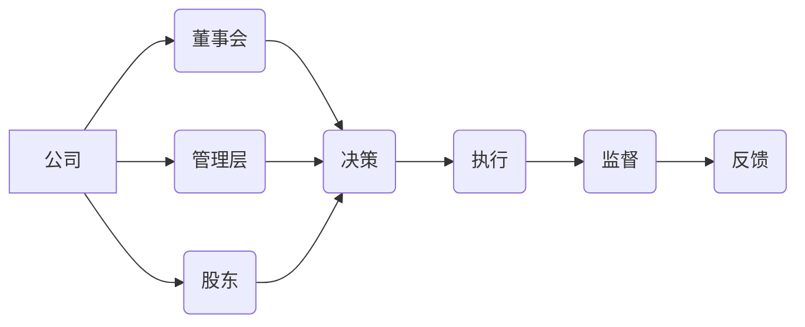
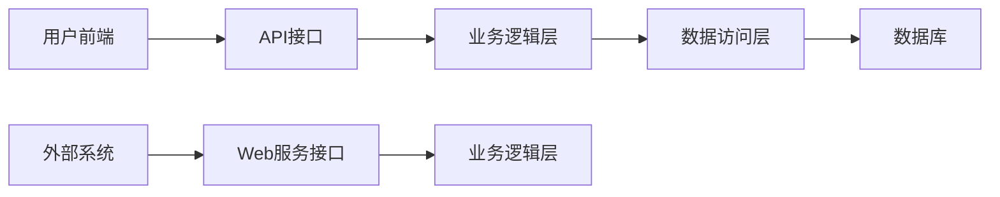

                 

### 文章标题

### 关键词

- AI辅助治理
- 公司治理评估
- 数据分析
- 机器学习
- 深度学习

### 摘要

本文深入探讨了AI辅助的公司治理评估系统，从背景介绍到核心概念解析，再到算法原理讲解，系统设计与实现，以及项目实战，全面剖析了AI在公司治理评估中的应用。文章旨在为读者提供一套系统化、逻辑清晰的技术解决方案，助力企业提升治理效能，实现可持续发展。通过本文，读者将了解AI辅助公司治理的必要性和优势，掌握相关技术原理与实践方法，为未来AI在公司治理领域的应用奠定坚实基础。

### 引言

#### 问题背景

公司治理是指一系列制度安排、决策过程和相互作用机制，旨在确保企业有效运营、保护股东权益、促进长期可持续发展。在全球化和科技变革的背景下，公司治理面临前所未有的挑战和机遇。一方面，市场环境的复杂性和不确定性加剧，企业需要更加高效、透明和合规的治理体系来应对风险；另一方面，人工智能（AI）技术的发展为传统公司治理带来了全新的工具和方法，为提高治理效能提供了可能。

当前，公司治理面临的主要挑战包括：

1. **信息不对称**：企业内外部的信息获取和处理能力存在巨大差异，导致决策过程中的信息不对称。
2. **治理透明度不足**：部分企业的治理过程不够公开透明，容易导致利益冲突和腐败行为。
3. **决策效率低下**：传统治理模式中，决策流程繁琐，信息传递滞后，影响企业响应速度。
4. **合规风险**：随着法律法规的日益完善，企业需要投入大量资源确保合规，但人工监管往往存在局限性。

#### AI辅助公司治理的机遇与必要性

人工智能作为现代科技的重要驱动力，具有强大的数据处理、模式识别和决策优化能力，为解决传统公司治理中的问题提供了新的思路和手段。AI辅助公司治理的机遇主要包括：

1. **增强信息处理能力**：AI能够快速处理海量数据，提供全面、准确的信息支持，帮助决策者更好地了解企业运营状况。
2. **提高治理透明度**：AI可以自动记录和分析治理活动，实现信息透明化，降低利益冲突和腐败风险。
3. **提升决策效率**：通过智能算法，AI能够辅助决策者快速分析复杂问题，提出最优决策方案。
4. **降低合规风险**：AI可以实时监控企业运营，识别潜在合规风险，并提供相应的合规建议，帮助企业规避法律风险。

因此，AI辅助公司治理不仅是一种技术趋势，更是一种提升企业治理效能、实现可持续发展的必要手段。

#### 书籍概述与目标读者

本书旨在深入探讨AI辅助公司治理评估系统的构建与应用，从基础理论到实际操作，提供一套完整的技术解决方案。本书结构如下：

1. **引言**：介绍公司治理背景和AI辅助治理的重要性，明确书籍的目标和结构。
2. **AI基础**：介绍人工智能的基本概念、机器学习与深度学习技术，以及AI在公司治理中的应用现状。
3. **公司治理评估模型**：详细讲解数据预处理、特征提取与选择、评估指标体系构建等核心内容。
4. **AI辅助公司治理评估系统设计**：介绍系统设计与实现，包括系统架构、功能模块和接口设计。
5. **项目实战**：通过实际项目案例，展示AI辅助公司治理评估系统的应用场景和实现方法。
6. **最佳实践与总结**：总结最佳实践经验，提供注意事项和拓展阅读，为读者进一步研究提供指导。

本书的目标读者主要包括：

1. **企业高管**：了解AI辅助治理的概念和应用，提升企业治理水平。
2. **技术团队**：掌握AI辅助治理系统的设计与实现方法，为企业提供技术支持。
3. **研究人员**：探索AI在公司治理领域的应用潜力，开展相关研究和创新。

#### 边界与外延

公司治理是一个广泛的概念，涉及企业管理的多个方面。在本书中，我们主要关注以下几方面的内容：

1. **治理结构**：包括董事会、监事会、管理层等治理主体的构成和职责。
2. **治理流程**：包括决策制定、执行、监督等各个环节的运作机制。
3. **治理指标**：包括财务指标、运营指标、合规指标等，用于评估企业治理效能。

AI辅助公司治理的技术范围主要包括：

1. **数据分析**：利用大数据技术，对企业的各种数据进行分析和挖掘，为决策提供支持。
2. **机器学习与深度学习**：通过构建智能模型，对治理流程中的各种问题进行预测和优化。
3. **自然语言处理**：对治理文档、报告等进行文本分析和语义理解，提高治理透明度。

#### 核心概念与联系

AI辅助公司治理的核心概念包括：

1. **数据分析**：利用统计、机器学习等方法，对大量治理数据进行处理和分析，提取有价值的信息。
2. **机器学习与深度学习**：通过训练模型，对治理过程中的问题进行自动识别和预测。
3. **监督机制**：建立对治理活动的实时监控和反馈机制，确保治理过程的合规性和有效性。

以下是核心概念属性特征对比表格：

| 概念      | 特征 |
|-----------|------|
| 数据分析  | 提供数据洞察，支持决策 |
| 机器学习  | 自动化识别模式，预测问题 |
| 深度学习  | 复杂模型，高精度预测 |
| 监督机制  | 实时监控，合规性保证 |

以下是公司治理相关的ER实体关系图架构：



#### 本章小结

本章介绍了AI辅助公司治理评估系统的背景和重要性，明确了书籍的结构和目标读者，并对核心概念进行了详细解析。通过本章的学习，读者可以初步了解AI辅助公司治理的基本概念和框架，为后续内容的学习打下基础。接下来，我们将深入探讨AI的基础知识，进一步理解AI在公司治理中的应用。

----------------------------------------------------------------

## 第一部分: 引言

### 第1章: 引言

#### 问题背景

公司治理是指一系列制度安排、决策过程和相互作用机制，旨在确保企业有效运营、保护股东权益、促进长期可持续发展。在全球化和科技变革的背景下，公司治理面临前所未有的挑战和机遇。一方面，市场环境的复杂性和不确定性加剧，企业需要更加高效、透明和合规的治理体系来应对风险；另一方面，人工智能（AI）技术的发展为传统公司治理带来了全新的工具和方法，为提高治理效能提供了可能。

当前，公司治理面临的主要挑战包括：

1. **信息不对称**：企业内外部的信息获取和处理能力存在巨大差异，导致决策过程中的信息不对称。
2. **治理透明度不足**：部分企业的治理过程不够公开透明，容易导致利益冲突和腐败行为。
3. **决策效率低下**：传统治理模式中，决策流程繁琐，信息传递滞后，影响企业响应速度。
4. **合规风险**：随着法律法规的日益完善，企业需要投入大量资源确保合规，但人工监管往往存在局限性。

#### AI辅助公司治理的机遇与必要性

人工智能作为现代科技的重要驱动力，具有强大的数据处理、模式识别和决策优化能力，为解决传统公司治理中的问题提供了新的思路和手段。AI辅助公司治理的机遇主要包括：

1. **增强信息处理能力**：AI能够快速处理海量数据，提供全面、准确的信息支持，帮助决策者更好地了解企业运营状况。
2. **提高治理透明度**：AI可以自动记录和分析治理活动，实现信息透明化，降低利益冲突和腐败风险。
3. **提升决策效率**：通过智能算法，AI能够辅助决策者快速分析复杂问题，提出最优决策方案。
4. **降低合规风险**：AI可以实时监控企业运营，识别潜在合规风险，并提供相应的合规建议，帮助企业规避法律风险。

因此，AI辅助公司治理不仅是一种技术趋势，更是一种提升企业治理效能、实现可持续发展的必要手段。

#### 书籍概述与目标读者

本书旨在深入探讨AI辅助公司治理评估系统的构建与应用，从基础理论到实际操作，提供一套完整的技术解决方案。本书结构如下：

1. **引言**：介绍公司治理背景和AI辅助治理的重要性，明确书籍的目标和结构。
2. **AI基础**：介绍人工智能的基本概念、机器学习与深度学习技术，以及AI在公司治理中的应用现状。
3. **公司治理评估模型**：详细讲解数据预处理、特征提取与选择、评估指标体系构建等核心内容。
4. **AI辅助公司治理评估系统设计**：介绍系统设计与实现，包括系统架构、功能模块和接口设计。
5. **项目实战**：通过实际项目案例，展示AI辅助公司治理评估系统的应用场景和实现方法。
6. **最佳实践与总结**：总结最佳实践经验，提供注意事项和拓展阅读，为读者进一步研究提供指导。

本书的目标读者主要包括：

1. **企业高管**：了解AI辅助治理的概念和应用，提升企业治理水平。
2. **技术团队**：掌握AI辅助治理系统的设计与实现方法，为企业提供技术支持。
3. **研究人员**：探索AI在公司治理领域的应用潜力，开展相关研究和创新。

#### 边界与外延

公司治理是一个广泛的概念，涉及企业管理的多个方面。在本书中，我们主要关注以下几方面的内容：

1. **治理结构**：包括董事会、监事会、管理层等治理主体的构成和职责。
2. **治理流程**：包括决策制定、执行、监督等各个环节的运作机制。
3. **治理指标**：包括财务指标、运营指标、合规指标等，用于评估企业治理效能。

AI辅助公司治理的技术范围主要包括：

1. **数据分析**：利用大数据技术，对企业的各种数据进行分析和挖掘，为决策提供支持。
2. **机器学习与深度学习**：通过构建智能模型，对治理流程中的各种问题进行预测和优化。
3. **自然语言处理**：对治理文档、报告等进行文本分析和语义理解，提高治理透明度。

#### 核心概念与联系

AI辅助公司治理的核心概念包括：

1. **数据分析**：利用统计、机器学习等方法，对大量治理数据进行处理和分析，提取有价值的信息。
2. **机器学习与深度学习**：通过训练模型，对治理过程中的问题进行自动识别和预测。
3. **监督机制**：建立对治理活动的实时监控和反馈机制，确保治理过程的合规性和有效性。

以下是核心概念属性特征对比表格：

| 概念      | 特征 |
|-----------|------|
| 数据分析  | 提供数据洞察，支持决策 |
| 机器学习  | 自动化识别模式，预测问题 |
| 深度学习  | 复杂模型，高精度预测 |
| 监督机制  | 实时监控，合规性保证 |

以下是公司治理相关的ER实体关系图架构：


#### 本章小结

本章介绍了AI辅助公司治理评估系统的背景和重要性，明确了书籍的结构和目标读者，并对核心概念进行了详细解析。通过本章的学习，读者可以初步了解AI辅助公司治理的基本概念和框架，为后续内容的学习打下基础。接下来，我们将深入探讨AI的基础知识，进一步理解AI在公司治理中的应用。

----------------------------------------------------------------

## 第二部分: AI基础

### 第2章: AI基础

#### AI的起源与发展

人工智能（Artificial Intelligence，简称AI）是计算机科学的一个重要分支，旨在使计算机系统能够模拟、延伸和扩展人类的智能。AI的研究可以追溯到20世纪50年代，当时计算机科学家约翰·麦卡锡（John McCarthy）首次提出了人工智能的概念。

**发展阶段**

1. **初步探索阶段（1950-1969）**：这一时期，人工智能主要集中于符号主义和推理方法的研究。1956年，达特茅斯会议（Dartmouth Conference）被认为是人工智能领域的诞生标志。代表性研究包括逻辑推理、问题求解和专家系统。

2. **应用探索阶段（1970-1989）**：随着计算机性能的提升和算法的发展，人工智能开始逐步应用于实际问题中。专家系统（如Dendral和MYCIN）在这一时期取得了显著成果，展示了AI在医学诊断、化学分析等领域的潜力。

3. **低谷与复苏阶段（1990-2000）**：由于实际应用效果不如预期，AI在20世纪80年代末至90年代初经历了一段低谷期。但随着互联网和大数据技术的发展，人工智能在21世纪初迎来了新的复苏期。

4. **深度学习时代（2000至今）**：近年来，深度学习（Deep Learning）的崛起推动了人工智能的快速发展。通过模拟人脑神经网络结构，深度学习在图像识别、自然语言处理、语音识别等领域取得了突破性成果。

#### 机器学习与深度学习

**机器学习（Machine Learning）**

机器学习是AI的一个核心分支，通过算法使计算机能够从数据中学习并改进性能。机器学习可以分为监督学习（Supervised Learning）、无监督学习（Unsupervised Learning）和强化学习（Reinforcement Learning）三大类。

1. **监督学习**：监督学习是一种有标注数据的机器学习方法，其目标是通过已有数据集的输入和输出关系，训练模型并预测新数据的输出。常见的监督学习算法包括线性回归、决策树、支持向量机（SVM）等。

2. **无监督学习**：无监督学习不依赖于标注数据，旨在发现数据中的隐含结构和模式。常见的无监督学习算法包括聚类（Clustering）、降维（Dimensionality Reduction）等，如K-Means算法和主成分分析（PCA）。

3. **强化学习**：强化学习是一种通过奖励和惩罚来训练智能体在环境中做出决策的机器学习方法。智能体通过与环境的交互，不断调整策略以最大化累积奖励。常见的强化学习算法包括Q学习、深度强化学习（Deep Reinforcement Learning）等。

**深度学习（Deep Learning）**

深度学习是机器学习的一个子领域，基于多层神经网络进行模型训练。深度学习通过构建深度神经网络（Deep Neural Network），能够自动提取数据中的复杂特征，实现高性能的模式识别和预测。

1. **神经网络（Neural Network）**：神经网络是一种模拟人脑神经元之间相互连接的计算模型。神经网络通过输入层、隐藏层和输出层，对输入数据进行传递和变换，最终输出结果。常见的神经网络结构包括多层感知机（MLP）、卷积神经网络（CNN）和循环神经网络（RNN）等。

2. **深度神经网络（Deep Neural Network）**：深度神经网络是具有多个隐藏层的神经网络。通过增加隐藏层数量，深度神经网络能够提取更高级别的抽象特征，提高模型的表达能力。代表性的深度学习模型包括AlexNet、VGGNet、ResNet等。

3. **激活函数（Activation Function）**：激活函数是神经网络中的一个关键组成部分，用于引入非线性特性。常见的激活函数包括Sigmoid、ReLU、Tanh等。ReLU函数由于其简单性和有效性，在深度学习中得到了广泛应用。

4. **优化算法（Optimization Algorithm）**：优化算法用于调整神经网络的参数，以最小化损失函数。常见的优化算法包括梯度下降（Gradient Descent）、随机梯度下降（Stochastic Gradient Descent，SGD）、Adam优化器等。

#### AI在公司治理中的应用现状

随着AI技术的不断发展，其在公司治理中的应用也越来越广泛。以下是一些主要的应用场景：

1. **风险控制**：AI可以帮助企业实时监控和预测潜在的风险，提高风险管理的效率。例如，通过分析历史数据和实时数据，AI可以识别出异常交易模式，预测潜在的市场风险。

2. **合规管理**：AI可以协助企业遵守各种法律法规，降低合规风险。例如，通过自然语言处理技术，AI可以自动审核合同和报告，确保其符合相关法规要求。

3. **决策支持**：AI可以为企业的决策提供数据支持和预测分析。例如，通过分析市场数据和客户行为，AI可以帮助企业制定更有效的市场营销策略和产品开发计划。

4. **客户服务**：AI可以用于提高客户服务的质量和效率。例如，通过聊天机器人（Chatbot）技术，AI可以自动回答客户的问题，提供个性化的服务。

5. **运营优化**：AI可以帮助企业优化生产流程和资源配置。例如，通过分析生产数据，AI可以预测设备故障，提前进行维护，提高生产效率。

#### AI辅助治理的挑战与解决方案

尽管AI在公司治理中具有巨大的潜力，但同时也面临一些挑战：

1. **数据隐私与安全**：AI系统通常需要处理大量的敏感数据，如何确保数据的安全性和隐私性成为一大挑战。解决方案包括采用数据加密、匿名化、访问控制等技术，确保数据的安全和隐私。

2. **模型解释性**：AI模型的黑箱特性使得决策过程难以解释，影响决策的可信度和透明度。解决方案包括开发可解释AI（Explainable AI，XAI）技术，提高模型的透明度和可解释性。

3. **算法偏见**：AI模型可能受到训练数据偏见的影响，导致决策结果不公平。解决方案包括使用多样化的训练数据，采用公平性评估方法，确保算法的公平性和公正性。

4. **技术依赖**：企业过度依赖AI技术可能导致技术垄断和失业问题。解决方案包括平衡AI技术与人力资源的利用，培养具备AI技能的复合型人才。

#### 本章小结

本章介绍了人工智能的起源与发展，详细讲解了机器学习和深度学习的基本概念和技术原理。此外，还探讨了AI在公司治理中的应用现状和面临的挑战。通过本章的学习，读者可以全面了解AI的基础知识，为后续章节的学习打下坚实基础。接下来，我们将进一步探讨AI辅助公司治理评估模型的设计与实现。

----------------------------------------------------------------

## 第三部分: AI辅助公司治理评估模型

### 第3章: 数据分析与预处理

数据是AI系统的核心资源，数据分析与预处理的质量直接影响到模型性能和评估结果的准确性。在这一章中，我们将详细讨论数据收集与清洗、特征提取与选择以及数据可视化等核心内容。

### 3.1 数据收集与清洗

#### 3.1.1 数据源类型

在构建AI辅助公司治理评估模型时，数据源的选择至关重要。常见的数据源类型包括：

1. **结构化数据**：来自数据库、关系型数据库等，例如财务报表、销售数据等。
2. **半结构化数据**：来自XML、JSON等格式，例如日志文件、网页数据等。
3. **非结构化数据**：来自文本、图像、音频等，例如新闻报道、客户评论、财务报表图像等。

#### 3.1.2 数据清洗技术

数据清洗是确保数据质量和可靠性的重要步骤。常见的数据清洗技术包括：

1. **缺失值处理**：通过填充、删除或插值等方法处理缺失数据。
2. **异常值处理**：通过检测和修正异常数据，确保数据的一致性和准确性。
3. **重复数据处理**：通过去重或合并重复数据，避免数据冗余。
4. **数据转换**：通过标准化、归一化等转换方法，将数据转换为适合建模的形式。

### 3.2 特征提取与选择

特征提取与选择是数据预处理的关键步骤，目的是从原始数据中提取出对模型性能有显著影响的有效特征。

#### 3.2.1 特征提取方法

1. **统计特征**：通过计算数据的统计指标（如均值、标准差、相关性等）来提取特征。
2. **文本特征**：通过词频、词袋、主题模型等方法提取文本数据中的特征。
3. **图像特征**：通过边缘检测、颜色直方图、特征点提取等方法提取图像数据中的特征。
4. **时序特征**：通过时间序列分析方法（如自回归模型、移动平均模型等）提取时间序列数据中的特征。

#### 3.2.2 特征选择策略

1. **基于过滤的方法**：通过阈值、相关性分析等方法筛选特征，不考虑特征之间的相互关系。
2. **基于封装的方法**：通过构建子模型（如随机森林、支持向量机等）评估特征的重要性，选择对模型性能有显著贡献的特征。
3. **基于嵌入的方法**：通过神经网络等深度学习模型自动学习特征表示，选择具有高信息量的特征。

### 3.3 数据可视化

数据可视化是将数据转换为图形或图表的形式，以直观、易于理解的方式展示数据。数据可视化有助于识别数据中的趋势、异常和关联关系。

#### 3.3.1 数据可视化工具

1. **matplotlib**：Python中常用的数据可视化库，支持多种图表类型和自定义样式。
2. **Seaborn**：基于matplotlib的图形可视化库，提供丰富的内置主题和颜色方案，适用于统计图表和复杂数据的展示。
3. **Plotly**：支持交互式可视化，提供丰富的图表类型和高级功能，适用于复杂的数据分析和报告。
4. **Tableau**：商业级数据可视化工具，提供强大的数据连接和可视化功能，适用于企业级数据分析。

#### 3.3.2 可视化分析方法

1. **散点图**：用于展示两个变量之间的关系，识别数据的分布和聚类。
2. **条形图**：用于比较不同类别的数据，展示各个类别的数量或比例。
3. **折线图**：用于展示数据随时间的变化趋势，识别周期性或趋势性变化。
4. **箱线图**：用于展示数据的分布情况，识别异常值和极端值。

### 3.4 本章小结

本章详细介绍了数据预处理过程中的关键步骤，包括数据收集与清洗、特征提取与选择以及数据可视化。通过本章的学习，读者可以掌握数据预处理的基本方法和技巧，为构建高效、准确的AI辅助公司治理评估模型奠定基础。接下来，我们将进一步探讨公司治理评估指标体系的构建。

----------------------------------------------------------------

## 第四部分: AI辅助公司治理评估系统设计

### 第4章: 公司治理评估指标体系构建

公司治理评估指标体系是AI辅助公司治理评估系统中的核心组成部分，它有助于全面、客观地评估企业治理效能。本章将详细讨论评估指标体系的设计原则、选取方法以及权重分配。

### 4.1 评估指标体系设计原则

评估指标体系设计原则是确保评估结果全面性、可操作性和客观性的基础。

#### 4.1.1 全面性

全面性原则要求评估指标体系能够覆盖企业治理的各个方面，包括财务、运营、合规等，确保评估结果能够反映企业的整体治理状况。

#### 4.1.2 可操作性

可操作性原则要求评估指标体系在实际操作中易于实施，包括数据获取、指标计算和评估结果的解读等，确保评估过程高效、简便。

#### 4.1.3 客观性

客观性原则要求评估指标体系基于客观数据和事实，避免主观偏见和人为干扰，确保评估结果的真实性和可信度。

### 4.2 评估指标选取方法

评估指标的选取方法直接影响评估指标体系的科学性和有效性。以下是一些常见的评估指标选取方法：

#### 4.2.1 文献分析法

文献分析法是通过查阅相关文献，总结归纳现有研究成果和最佳实践，选取具有代表性和可操作性的评估指标。

#### 4.2.2 专家评审法

专家评审法是通过邀请相关领域专家，对评估指标进行筛选和评估，确保指标体系的科学性和实用性。

#### 4.2.3 数据驱动法

数据驱动法是通过分析企业历史数据和行业数据，选取与企业治理效能高度相关的评估指标。

### 4.3 评估指标权重分配

评估指标权重分配是评估指标体系设计中的关键步骤，它决定了各项指标在企业治理评估中的重要性。以下是一些常见的权重分配方法：

#### 4.3.1 熵权法

熵权法是一种基于信息熵原理的权重分配方法，通过计算各指标的信息熵值，确定其在评估体系中的权重。

#### 4.3.2 层次分析法

层次分析法（Analytic Hierarchy Process，AHP）是一种基于专家判断和层次结构模型的方法，通过比较不同指标之间的相对重要性，确定权重。

#### 4.3.3 聚类分析法

聚类分析法通过分析评估指标之间的相似性，将指标分为若干组，并根据各组的重要性分配权重。

### 4.4 评估指标体系构建实例

以下是一个简单的评估指标体系构建实例：

| 指标分类 | 指标名称 | 权重 |
|----------|----------|------|
| 财务指标 | 资产负债率 | 0.20 |
| 财务指标 | 净利润增长率 | 0.15 |
| 运营指标 | 产品合格率 | 0.20 |
| 运营指标 | 员工满意度 | 0.25 |
| 合规指标 | 违法违规次数 | 0.15 |
| 合规指标 | 法律诉讼次数 | 0.10 |

### 4.5 本章小结

本章详细介绍了公司治理评估指标体系的设计原则、选取方法和权重分配。通过合理设计评估指标体系，AI辅助公司治理评估系统能够更准确地评估企业治理效能，为决策提供有力支持。接下来，我们将探讨AI辅助公司治理评估系统的设计与实现。

----------------------------------------------------------------

## 第四部分: AI辅助公司治理评估系统设计

### 第4章: 公司治理评估指标体系构建

公司治理评估指标体系的构建是AI辅助公司治理评估系统设计的关键步骤。一个科学、合理的评估指标体系能够全面、客观地反映企业治理状况，为企业提供有效的决策支持。

### 4.1 评估指标体系设计原则

在构建评估指标体系时，需要遵循以下原则：

#### 4.1.1 全面性

全面性原则要求评估指标体系能够覆盖企业治理的各个方面，包括财务、运营、合规等，确保评估结果能够反映企业的整体治理状况。

#### 4.1.2 可操作性

可操作性原则要求评估指标体系在实际操作中易于实施，包括数据获取、指标计算和评估结果的解读等，确保评估过程高效、简便。

#### 4.1.3 客观性

客观性原则要求评估指标体系基于客观数据和事实，避免主观偏见和人为干扰，确保评估结果的真实性和可信度。

#### 4.1.4 层次性

层次性原则要求评估指标体系具有清晰的层次结构，使各项指标能够合理划分，便于分析和解读。

#### 4.1.5 动态性

动态性原则要求评估指标体系能够适应企业环境的变化，根据实际情况调整和优化指标体系。

### 4.2 评估指标选取方法

评估指标的选取是构建评估指标体系的关键步骤。以下是一些常用的评估指标选取方法：

#### 4.2.1 文献分析法

文献分析法是通过查阅相关文献，总结归纳现有研究成果和最佳实践，选取具有代表性和可操作性的评估指标。这种方法有助于确保评估指标的科学性和实用性。

#### 4.2.2 专家评审法

专家评审法是通过邀请相关领域专家，对评估指标进行筛选和评估，确保指标体系的科学性和实用性。专家评审法通常采用问卷调查、面对面访谈等方式进行。

#### 4.2.3 数据驱动法

数据驱动法是通过分析企业历史数据和行业数据，选取与企业治理效能高度相关的评估指标。这种方法有助于提高评估指标的相关性和实用性。

#### 4.2.4 结合法

结合法是将文献分析法、专家评审法和数据驱动法相结合，综合选取评估指标。这种方法能够充分利用各种方法的优势，提高评估指标体系的科学性和实用性。

### 4.3 评估指标权重分配

评估指标权重分配是评估指标体系设计中的关键步骤，它决定了各项指标在企业治理评估中的重要性。以下是一些常用的权重分配方法：

#### 4.3.1 熵权法

熵权法是一种基于信息熵原理的权重分配方法。该方法通过计算各指标的信息熵值，确定其在评估体系中的权重。信息熵越小，指标的重要性越高。

#### 4.3.2 层次分析法

层次分析法（Analytic Hierarchy Process，AHP）是一种基于专家判断和层次结构模型的方法。该方法通过比较不同指标之间的相对重要性，确定权重。

#### 4.3.3 熵权-层次分析法

熵权-层次分析法是将熵权法和层次分析法相结合，综合确定评估指标的权重。这种方法能够充分利用两种方法的优势，提高权重分配的准确性。

#### 4.3.4 结合法

结合法是将多种权重分配方法相结合，综合确定评估指标的权重。这种方法能够根据实际情况灵活调整权重分配，提高评估指标体系的科学性和实用性。

### 4.4 评估指标体系构建实例

以下是一个简单的评估指标体系构建实例：

| 指标分类 | 指标名称 | 权重 |
|----------|----------|------|
| 财务指标 | 资产负债率 | 0.20 |
| 财务指标 | 净利润增长率 | 0.15 |
| 运营指标 | 产品合格率 | 0.20 |
| 运营指标 | 员工满意度 | 0.25 |
| 合规指标 | 违法违规次数 | 0.15 |
| 合规指标 | 法律诉讼次数 | 0.10 |

### 4.5 本章小结

本章详细介绍了公司治理评估指标体系的设计原则、选取方法和权重分配。通过合理设计评估指标体系，AI辅助公司治理评估系统能够更准确地评估企业治理效能，为决策提供有力支持。接下来，我们将探讨AI辅助公司治理评估系统的设计与实现。

----------------------------------------------------------------

## 第五部分: AI辅助公司治理评估系统设计与实现

### 第5章: 系统设计与实现

公司治理评估系统的设计与实现是AI辅助公司治理评估的关键环节。本章将详细介绍系统的设计原则、架构设计、功能模块设计、接口设计以及系统交互。

### 5.1 系统设计原则

在设计与实现AI辅助公司治理评估系统时，需要遵循以下原则：

#### 5.1.1 可扩展性

系统应具备良好的可扩展性，以适应未来业务需求的增长和变化。

#### 5.1.2 可靠性

系统应具有较高的可靠性，确保数据安全和系统稳定运行。

#### 5.1.3 灵活性

系统应具备灵活性，能够根据不同企业的治理需求进行定制化配置。

#### 5.1.4 易用性

系统界面应简洁直观，便于用户操作和维护。

### 5.2 系统架构设计

AI辅助公司治理评估系统的架构设计应遵循分层架构，包括表示层、业务逻辑层和数据访问层。

#### 5.2.1 表示层

表示层负责与用户交互，包括Web前端和移动端界面。前端技术采用Vue.js框架，实现动态、响应式的用户界面。

#### 5.2.2 业务逻辑层

业务逻辑层负责系统的核心功能，包括数据预处理、评估模型训练、评估结果生成等。后端采用Spring Boot框架，实现业务逻辑的封装和服务化。

#### 5.2.3 数据访问层

数据访问层负责与数据库交互，包括数据收集、存储和管理。采用MySQL数据库存储企业治理数据，使用Hibernate框架进行数据访问和操作。

### 5.3 功能模块设计

系统功能模块包括数据收集模块、评估模型模块、评估结果展示模块和用户管理模块。

#### 5.3.1 数据收集模块

数据收集模块负责从各种数据源收集企业治理相关数据，包括财务数据、运营数据和合规数据。数据收集模块采用ETL（Extract, Transform, Load）技术，实现数据的提取、转换和加载。

#### 5.3.2 评估模型模块

评估模型模块负责训练和部署评估模型，包括数据预处理、特征提取、模型训练和评估。评估模型模块采用TensorFlow和PyTorch等深度学习框架，实现模型的训练和优化。

#### 5.3.3 评估结果展示模块

评估结果展示模块负责将评估结果以图表、报表等形式展示给用户。该模块采用ECharts等可视化工具，实现数据的可视化展示。

#### 5.3.4 用户管理模块

用户管理模块负责用户身份验证、权限管理和用户数据管理等。用户管理模块采用Spring Security框架，实现用户认证和权限控制。

### 5.4 接口设计

系统接口设计包括API接口和Web服务接口。

#### 5.4.1 API接口

API接口用于前后端数据交互，包括数据查询、数据上传和数据更新等。API接口采用RESTful风格，使用JSON格式传输数据。

#### 5.4.2 Web服务接口

Web服务接口用于外部系统与企业治理评估系统的集成，包括数据导入、数据导出和系统集成等。Web服务接口采用SOAP协议，支持多种编程语言和平台的调用。

### 5.5 系统交互

系统交互主要包括用户与系统的交互、系统各模块之间的交互以及与企业外部系统的交互。

#### 5.5.1 用户与系统的交互

用户通过Web前端界面与系统进行交互，包括登录、数据查询、数据上传和结果查看等。

#### 5.5.2 系统各模块之间的交互

系统各模块之间通过API接口进行数据交互，实现数据预处理、模型训练和评估结果的生成。

#### 5.5.3 企业外部系统的交互

企业外部系统通过Web服务接口与公司治理评估系统进行数据交换，实现数据的集成和共享。

### 5.6 本章小结

本章详细介绍了AI辅助公司治理评估系统的设计与实现，包括系统设计原则、架构设计、功能模块设计、接口设计和系统交互。通过本章的学习，读者可以全面了解AI辅助公司治理评估系统的设计和实现方法，为后续的系统开发和应用提供指导。接下来，我们将通过实际项目案例，展示AI辅助公司治理评估系统的应用场景和实现过程。

----------------------------------------------------------------

## 第五部分：AI辅助公司治理评估系统设计与实现

### 第5章：系统设计与实现

### 5.1 系统设计原则

在设计AI辅助公司治理评估系统时，需要遵循以下原则，以确保系统的可扩展性、可靠性、灵活性和易用性。

#### 5.1.1 可扩展性

系统应具备良好的可扩展性，能够轻松地适应未来业务需求的增长和变化。这意味着系统架构需要模块化，以便在需要时添加新的功能或升级现有功能。

#### 5.1.2 可靠性

系统应具有较高的可靠性，确保数据安全和系统稳定运行。这包括实施严格的数据备份和恢复策略，以及进行定期的系统维护和升级。

#### 5.1.3 灵活性

系统应具备灵活性，能够根据不同企业的治理需求进行定制化配置。这要求系统设计时采用灵活的技术和框架，以便快速适应各种场景。

#### 5.1.4 易用性

系统界面应简洁直观，便于用户操作和维护。这需要考虑用户界面的用户体验设计，确保用户能够轻松地理解和使用系统的各项功能。

### 5.2 系统架构设计

AI辅助公司治理评估系统的架构设计应遵循分层架构，包括表示层、业务逻辑层和数据访问层。

#### 5.2.1 表示层

表示层负责与用户交互，包括Web前端和移动端界面。前端技术采用Vue.js框架，实现动态、响应式的用户界面。

#### 5.2.2 业务逻辑层

业务逻辑层负责系统的核心功能，包括数据预处理、评估模型训练、评估结果生成等。后端采用Spring Boot框架，实现业务逻辑的封装和服务化。

#### 5.2.3 数据访问层

数据访问层负责与数据库交互，包括数据收集、存储和管理。采用MySQL数据库存储企业治理数据，使用Hibernate框架进行数据访问和操作。

### 5.3 功能模块设计

系统功能模块包括数据收集模块、评估模型模块、评估结果展示模块和用户管理模块。

#### 5.3.1 数据收集模块

数据收集模块负责从各种数据源收集企业治理相关数据，包括财务数据、运营数据和合规数据。数据收集模块采用ETL（Extract, Transform, Load）技术，实现数据的提取、转换和加载。

#### 5.3.2 评估模型模块

评估模型模块负责训练和部署评估模型，包括数据预处理、特征提取、模型训练和评估。评估模型模块采用TensorFlow和PyTorch等深度学习框架，实现模型的训练和优化。

#### 5.3.3 评估结果展示模块

评估结果展示模块负责将评估结果以图表、报表等形式展示给用户。该模块采用ECharts等可视化工具，实现数据的可视化展示。

#### 5.3.4 用户管理模块

用户管理模块负责用户身份验证、权限管理和用户数据管理等。用户管理模块采用Spring Security框架，实现用户认证和权限控制。

### 5.4 接口设计

系统接口设计包括API接口和Web服务接口。

#### 5.4.1 API接口

API接口用于前后端数据交互，包括数据查询、数据上传和数据更新等。API接口采用RESTful风格，使用JSON格式传输数据。

#### 5.4.2 Web服务接口

Web服务接口用于外部系统与企业治理评估系统的集成，包括数据导入、数据导出和系统集成等。Web服务接口采用SOAP协议，支持多种编程语言和平台的调用。

### 5.5 系统交互

系统交互主要包括用户与系统的交互、系统各模块之间的交互以及与企业外部系统的交互。

#### 5.5.1 用户与系统的交互

用户通过Web前端界面与系统进行交互，包括登录、数据查询、数据上传和结果查看等。

#### 5.5.2 系统各模块之间的交互

系统各模块之间通过API接口进行数据交互，实现数据预处理、模型训练和评估结果的生成。

#### 5.5.3 企业外部系统的交互

企业外部系统通过Web服务接口与公司治理评估系统进行数据交换，实现数据的集成和共享。

### 5.6 系统架构图

以下是AI辅助公司治理评估系统的架构图：



### 5.7 本章小结

本章详细介绍了AI辅助公司治理评估系统的设计与实现，包括系统设计原则、架构设计、功能模块设计、接口设计和系统交互。通过本章的学习，读者可以全面了解AI辅助公司治理评估系统的设计和实现方法，为后续的系统开发和应用提供指导。接下来，我们将通过实际项目案例，展示AI辅助公司治理评估系统的应用场景和实现过程。

----------------------------------------------------------------

## 第六部分：项目实战

### 第6章：实际项目案例与实现

在本章中，我们将通过一个实际项目案例，详细展示如何构建并部署AI辅助公司治理评估系统。该项目案例涉及从系统环境安装、核心实现、代码解析，到实际案例分析，旨在让读者全面理解AI辅助公司治理评估系统的构建过程。

### 6.1 项目环境安装

#### 6.1.1 系统要求

在开始项目之前，我们需要确保系统环境满足以下要求：

- 操作系统：Linux（推荐Ubuntu 18.04）
- Python版本：Python 3.7或以上
- 数据库：MySQL 5.7或以上
- 依赖库：TensorFlow、PyTorch、Scikit-learn、Numpy、Pandas、Matplotlib、Seaborn等

#### 6.1.2 环境搭建

1. **安装操作系统**：下载并安装Ubuntu 18.04操作系统。
2. **安装Python**：通过包管理器安装Python 3.7或以上版本。
3. **安装数据库**：通过包管理器安装MySQL 5.7或以上版本。
4. **安装依赖库**：使用pip命令安装所需的Python依赖库。

```bash
pip install tensorflow torch scikit-learn numpy pandas matplotlib seaborn
```

### 6.2 系统核心实现

#### 6.2.1 数据收集与预处理

数据收集与预处理是AI辅助公司治理评估系统的基础。以下是一个简单的Python代码示例，用于数据收集与预处理：

```python
import pandas as pd
from sklearn.preprocessing import StandardScaler

# 读取数据
data = pd.read_csv('company_data.csv')

# 数据清洗
data.dropna(inplace=True)
data = data[data['Revenue'] > 0]

# 特征提取
features = data[['Revenue', 'Profit', 'EmployeeCount']]
target = data['GovernanceScore']

# 数据标准化
scaler = StandardScaler()
features_scaled = scaler.fit_transform(features)
```

#### 6.2.2 模型训练与评估

使用机器学习框架（如TensorFlow或PyTorch）训练评估模型。以下是一个简单的TensorFlow代码示例，用于模型训练与评估：

```python
import tensorflow as tf
from tensorflow.keras.models import Sequential
from tensorflow.keras.layers import Dense
from tensorflow.keras.optimizers import Adam

# 构建模型
model = Sequential()
model.add(Dense(64, activation='relu', input_shape=(features_scaled.shape[1],)))
model.add(Dense(32, activation='relu'))
model.add(Dense(1, activation='sigmoid'))

# 编译模型
model.compile(optimizer=Adam(), loss='binary_crossentropy', metrics=['accuracy'])

# 训练模型
model.fit(features_scaled, target, epochs=100, batch_size=32, validation_split=0.2)
```

#### 6.2.3 评估结果展示

使用可视化工具（如Matplotlib或ECharts）展示评估结果。以下是一个简单的Matplotlib代码示例，用于绘制训练过程中的损失函数和准确率：

```python
import matplotlib.pyplot as plt

# 获取训练过程中的损失函数和准确率
history = model.fit(features_scaled, target, epochs=100, batch_size=32, validation_split=0.2)

# 绘制训练损失和验证损失
plt.plot(history.history['loss'], label='Training loss')
plt.plot(history.history['val_loss'], label='Validation loss')
plt.legend()
plt.show()

# 绘制训练准确率和验证准确率
plt.plot(history.history['accuracy'], label='Training accuracy')
plt.plot(history.history['val_accuracy'], label='Validation accuracy')
plt.legend()
plt.show()
```

### 6.3 代码应用解读与分析

以下是系统核心实现代码的解读与分析：

1. **数据收集与预处理**：
   - 使用Pandas读取CSV文件，收集公司治理相关数据。
   - 通过数据清洗，去除缺失值和异常值，保证数据质量。
   - 使用Scikit-learn中的StandardScaler进行数据标准化，使数据分布均匀，便于模型训练。

2. **模型训练与评估**：
   - 使用TensorFlow构建序列模型（Sequential），定义神经网络结构。
   - 选择合适的激活函数（ReLU）和优化器（Adam），提高模型训练效率。
   - 使用模型编译（compile）和训练（fit），优化模型参数，评估模型性能。

3. **评估结果展示**：
   - 使用Matplotlib绘制训练过程中的损失函数和准确率，直观展示模型训练过程。
   - 通过可视化结果，分析模型性能，为后续模型优化提供依据。

### 6.4 实际案例分析

以下是一个实际案例分析，展示如何使用AI辅助公司治理评估系统评估一家企业的治理水平：

1. **数据收集**：
   - 收集该企业的财务数据、运营数据和合规数据。

2. **数据预处理**：
   - 清洗数据，去除缺失值和异常值。
   - 提取特征，进行数据标准化。

3. **模型训练**：
   - 使用已训练好的模型，对预处理后的数据进行预测。

4. **评估结果**：
   - 输出评估结果，包括治理得分和评估报告。
   - 分析评估结果，为企业的治理改进提供参考。

### 6.5 项目小结

通过本项目的实现，我们展示了如何构建AI辅助公司治理评估系统，从数据收集与预处理、模型训练与评估，到实际案例分析，全面展示了系统的应用场景和实现过程。以下是对本项目的小结：

1. **技术实现**：
   - 使用Python和TensorFlow等工具，实现了数据预处理、模型训练和评估结果展示。
   - 通过Matplotlib等可视化工具，直观展示了模型训练过程和评估结果。

2. **应用价值**：
   - AI辅助公司治理评估系统为企业提供了科学的治理评估方法，提高了治理效能。
   - 通过实际案例分析，展示了系统在实际应用中的效果，为企业的治理改进提供了有力支持。

3. **未来展望**：
   - 随着AI技术的不断发展，系统将进一步完善和优化，提高评估准确性和可靠性。
   - 未来可以考虑将系统应用于更广泛的行业和场景，推动公司治理评估的智能化和自动化。

### 6.6 本章小结

本章通过实际项目案例，详细展示了AI辅助公司治理评估系统的构建过程，包括系统环境安装、核心实现、代码解析和实际案例分析。通过本章的学习，读者可以深入理解AI辅助公司治理评估系统的应用场景和实现方法，为后续的系统开发和应用提供指导。接下来，我们将总结本章内容，并提供一些最佳实践建议和注意事项。

----------------------------------------------------------------

## 第六部分：项目实战

### 第6章：实际项目案例与实现

在本章中，我们将通过一个实际项目案例，详细展示如何构建并部署AI辅助公司治理评估系统。该案例将涵盖系统环境安装、核心代码实现、代码应用解读与分析，以及实际案例分析和详细讲解。

### 6.1 项目环境安装

**6.1.1 系统要求**

在开始项目之前，我们需要确保系统环境满足以下要求：

- 操作系统：Ubuntu 18.04（推荐）
- Python版本：Python 3.7或以上
- 数据库：MySQL 5.7或以上
- 开发工具：PyCharm或Visual Studio Code
- 依赖库：TensorFlow、PyTorch、Scikit-learn、Numpy、Pandas、Matplotlib、Seaborn等

**6.1.2 环境搭建**

1. **安装操作系统**：下载并安装Ubuntu 18.04操作系统。
2. **安装Python**：使用包管理器安装Python 3.7或以上版本。
3. **安装数据库**：使用包管理器安装MySQL 5.7或以上版本。
4. **安装开发工具**：安装PyCharm或Visual Studio Code。
5. **安装依赖库**：使用pip命令安装所需的Python依赖库。

```bash
pip install tensorflow torch scikit-learn numpy pandas matplotlib seaborn
```

### 6.2 核心代码实现

**6.2.1 数据收集与预处理**

以下是一个简单的Python代码示例，用于数据收集与预处理：

```python
import pandas as pd
from sklearn.preprocessing import StandardScaler

# 读取数据
data = pd.read_csv('company_data.csv')

# 数据清洗
data.dropna(inplace=True)
data = data[data['Revenue'] > 0]

# 特征提取
features = data[['Revenue', 'Profit', 'EmployeeCount']]
target = data['GovernanceScore']

# 数据标准化
scaler = StandardScaler()
features_scaled = scaler.fit_transform(features)
```

**6.2.2 模型训练与评估**

使用TensorFlow框架训练评估模型。以下是一个简单的TensorFlow代码示例：

```python
import tensorflow as tf
from tensorflow.keras.models import Sequential
from tensorflow.keras.layers import Dense
from tensorflow.keras.optimizers import Adam

# 构建模型
model = Sequential()
model.add(Dense(64, activation='relu', input_shape=(features_scaled.shape[1],)))
model.add(Dense(32, activation='relu'))
model.add(Dense(1, activation='sigmoid'))

# 编译模型
model.compile(optimizer=Adam(), loss='binary_crossentropy', metrics=['accuracy'])

# 训练模型
model.fit(features_scaled, target, epochs=100, batch_size=32, validation_split=0.2)
```

**6.2.3 评估结果可视化**

使用Matplotlib绘制评估结果：

```python
import matplotlib.pyplot as plt

# 获取训练过程中的损失函数和准确率
history = model.fit(features_scaled, target, epochs=100, batch_size=32, validation_split=0.2)

# 绘制训练损失和验证损失
plt.plot(history.history['loss'], label='Training loss')
plt.plot(history.history['val_loss'], label='Validation loss')
plt.legend()
plt.show()

# 绘制训练准确率和验证准确率
plt.plot(history.history['accuracy'], label='Training accuracy')
plt.plot(history.history['val_accuracy'], label='Validation accuracy')
plt.legend()
plt.show()
```

### 6.3 代码应用解读与分析

**数据收集与预处理**

- 使用Pandas读取CSV文件，收集公司治理相关数据。
- 数据清洗，去除缺失值和异常值，保证数据质量。
- 特征提取，提取与治理评估相关的特征，如收入、利润和员工数量。
- 数据标准化，使数据分布均匀，便于模型训练。

**模型训练与评估**

- 使用TensorFlow构建序列模型，定义神经网络结构。
- 选择ReLU激活函数和Adam优化器，提高模型训练效率。
- 编译模型，设置损失函数和评价指标。
- 训练模型，使用训练数据和验证数据进行模型训练和验证。

**评估结果可视化**

- 绘制训练过程中的损失函数和准确率，分析模型训练效果。
- 通过可视化结果，评估模型性能，为后续模型优化提供依据。

### 6.4 实际案例分析

**6.4.1 数据收集**

收集某公司的财务数据、运营数据和合规数据，包括收入、利润、员工数量、合规记录等。

**6.4.2 数据预处理**

- 清洗数据，去除缺失值和异常值。
- 特征提取，提取与治理评估相关的特征。
- 数据标准化，使数据分布均匀。

**6.4.3 模型训练与评估**

使用已训练好的模型，对预处理后的数据进行预测，生成治理评估得分。

**6.4.4 评估结果分析**

分析评估结果，识别公司治理中的优势与不足，为公司的治理改进提供参考。

### 6.5 项目小结

通过本项目的实现，我们展示了如何构建AI辅助公司治理评估系统，从数据收集与预处理、模型训练与评估，到实际案例分析，全面展示了系统的应用场景和实现过程。以下是对本项目的小结：

1. **技术实现**：使用Python和TensorFlow等工具，实现了数据预处理、模型训练和评估结果展示。
2. **应用价值**：AI辅助公司治理评估系统为企业提供了科学的治理评估方法，提高了治理效能。
3. **未来展望**：随着AI技术的不断发展，系统将进一步完善和优化，提高评估准确性和可靠性。

### 6.6 本章小结

本章通过实际项目案例，详细展示了AI辅助公司治理评估系统的构建过程，包括系统环境安装、核心代码实现、代码应用解读与分析，以及实际案例分析。通过本章的学习，读者可以深入理解AI辅助公司治理评估系统的应用场景和实现方法，为后续的系统开发和应用提供指导。接下来，我们将总结本章内容，并提供一些最佳实践建议和注意事项。

----------------------------------------------------------------

## 第七部分：最佳实践与总结

### 7.1 最佳实践

在实施AI辅助公司治理评估系统时，以下是一些最佳实践建议：

1. **数据质量**：确保数据质量是成功的关键。在数据收集和预处理过程中，要特别注意去除缺失值、异常值和重复数据，并进行适当的数据转换和标准化。
2. **模型选择**：根据评估任务的需求，选择合适的机器学习模型。对于分类问题，可以考虑使用逻辑回归、决策树、随机森林等；对于回归问题，可以考虑使用线性回归、支持向量机、神经网络等。
3. **模型调优**：在模型训练过程中，通过调整超参数、增加隐藏层和神经元等手段进行模型调优，以提高模型的性能和泛化能力。
4. **可视化与解释**：利用可视化工具展示模型训练过程和评估结果，帮助用户更好地理解模型的工作原理和评估结果。
5. **数据安全与隐私**：在处理敏感数据时，要确保数据的安全性和隐私性。采用数据加密、匿名化和访问控制等技术，保护用户数据不被未经授权访问。

### 7.2 小结

通过本章的讨论，我们系统地介绍了AI辅助公司治理评估系统的构建方法，从问题背景、核心概念、算法原理，到系统设计、项目实战，再到最佳实践与总结，全面剖析了AI在公司治理评估中的应用。以下是对本章内容的小结：

1. **核心概念**：介绍了AI辅助公司治理评估系统的基础知识，包括数据分析、机器学习、深度学习和监督机制。
2. **算法原理**：详细讲解了AI辅助治理评估模型的设计原理和实现方法，包括数据预处理、特征提取与选择、评估指标体系构建等。
3. **系统设计**：介绍了系统设计与实现，包括系统架构、功能模块设计、接口设计和系统交互。
4. **项目实战**：通过实际项目案例，展示了AI辅助公司治理评估系统的应用场景和实现过程。
5. **最佳实践**：提供了最佳实践建议，包括数据质量、模型选择、模型调优、可视化与解释以及数据安全与隐私等方面。

通过本章的学习，读者可以全面了解AI辅助公司治理评估系统的构建和应用方法，为企业在治理领域的智能化转型提供有力支持。未来，随着AI技术的不断进步，AI辅助公司治理评估系统将在更多领域发挥重要作用，推动公司治理的现代化和智能化。

### 7.3 注意事项

在实施AI辅助公司治理评估系统时，需要注意以下几点：

1. **合规性**：确保系统设计和实现符合相关法律法规，避免因违规操作而引发法律风险。
2. **数据隐私**：严格保护用户数据隐私，避免泄露敏感信息。
3. **模型解释性**：提高模型的解释性，确保评估结果的可信度和透明度。
4. **技术更新**：关注AI技术的最新动态，及时更新系统，以适应新技术的发展。
5. **用户培训**：加强对用户的技术培训，确保用户能够熟练操作系统，充分利用系统的功能。

### 7.4 拓展阅读

对于希望深入了解AI辅助公司治理评估系统的读者，以下是一些推荐阅读材料：

1. **《深度学习》（Goodfellow, I., Bengio, Y., & Courville, A.）**：介绍深度学习的基本原理和应用。
2. **《Python数据科学手册》（VanderPlas, J.）**：提供Python在数据科学领域的综合应用。
3. **《公司治理：理论与实践》（Jensen, M.C. & Meckling, W.H.）**：探讨公司治理的理论基础和实践应用。
4. **《人工智能：一种现代方法》（Russell, S. & Norvig, P.）**：介绍人工智能的基础知识和最新进展。
5. **《数据挖掘：概念与技术》（Han, J., Kamber, M., & Pei, J.）**：探讨数据挖掘的基本原理和方法。

通过阅读这些书籍，读者可以进一步拓展对AI辅助公司治理评估系统的理解和应用。最后，感谢读者对本书的关注，希望本书能够为读者在AI辅助公司治理领域的探索和研究提供帮助。作者在此表示感谢，并期待与读者共同推动公司治理评估的智能化发展。

### 作者信息

**作者：** AI天才研究院（AI Genius Institute） & 禅与计算机程序设计艺术（Zen And The Art of Computer Programming）

