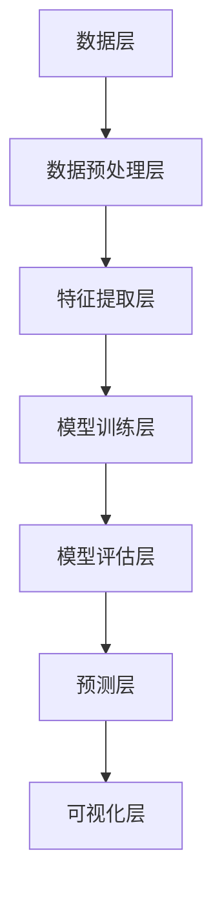
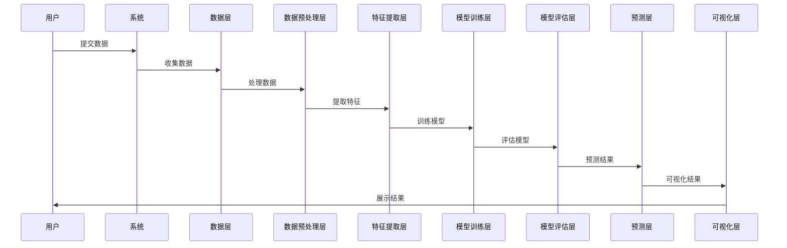

                 

**文章标题：AI辅助的公司财务报表预测与情景分析**

关键词：财务报表预测、人工智能、机器学习、深度学习、系统架构设计

摘要：本文旨在探讨如何利用人工智能技术，特别是机器学习和深度学习，辅助公司进行财务报表预测和情景分析。文章首先介绍了财务报表预测的重要性和背景，然后深入分析了AI在财务报表预测中的应用、核心概念与联系、算法原理讲解以及具体的系统架构设计方案和项目实战案例。最后，文章提出了AI辅助财务报表预测的最佳实践和注意事项，为实际应用提供了有价值的指导。

----------------------------------------------------------------

# 引言

## 1. 引言

随着信息技术的飞速发展，人工智能（AI）在各个领域都取得了显著的成果。在财务领域，AI技术同样发挥着重要作用，能够有效地辅助公司进行财务报表预测和情景分析。本文将围绕这一主题展开讨论，旨在探讨如何利用AI技术提高财务报表预测的准确性和效率。

### 1.1 选题背景

财务报表是公司运营情况的重要体现，其准确性和及时性对公司的决策具有重要影响。然而，传统的财务报表预测方法往往依赖于经验分析和统计模型，存在一定程度的局限性。随着数据量的爆炸性增长，如何从海量数据中提取有价值的信息，进行精准的财务报表预测，成为了一个亟待解决的问题。

### 1.2 研究目的与意义

本文的研究目的在于探讨如何利用AI技术，特别是机器学习和深度学习，辅助公司进行财务报表预测和情景分析。通过引入AI技术，可以提高财务报表预测的准确性、速度和效率，为公司提供更加可靠的决策支持。此外，本文的研究还具有以下意义：

1. 为公司提供一种全新的财务报表预测方法，有助于提高财务报表的准确性和及时性。
2. 为研究者提供关于AI技术在财务领域应用的深入探讨，促进AI技术与财务领域的融合发展。
3. 为政策制定者提供关于AI技术在财务领域应用的参考，为相关政策的制定提供依据。

### 1.3 研究方法与结构

本文采用文献综述和案例分析相结合的研究方法，首先对AI辅助财务报表预测的相关理论和应用进行综述，然后通过具体案例进行分析。文章结构如下：

1. 引言：介绍研究背景、目的与意义，阐述研究方法与结构。
2. AI辅助财务报表预测基础理论：介绍AI辅助财务报表预测的概述、核心概念与联系、算法原理讲解。
3. AI辅助财务报表预测的应用：介绍系统分析与架构设计方案、项目实战、最佳实践 tips。
4. 结论：总结文章的主要观点，指出未来研究的方向。

----------------------------------------------------------------

# AI辅助的公司财务报表预测基础理论

## 2. AI辅助财务报表预测概述

### 2.1 财务报表预测的重要性

财务报表预测是公司财务管理中至关重要的一环。通过对财务报表数据的分析和预测，公司可以了解未来的财务状况，为经营决策提供有力支持。准确、及时的财务报表预测不仅有助于公司优化资源配置、降低风险，还能够提高公司的市场竞争力。

### 2.2 AI在财务报表预测中的应用

人工智能技术，尤其是机器学习和深度学习，为财务报表预测提供了新的可能性。通过学习大量的历史财务数据，AI模型可以自动识别数据中的规律和趋势，从而实现精准的财务报表预测。此外，AI技术还可以用于异常检测、风险评估等方面，进一步提高财务报表预测的可靠性。

### 2.3 AI辅助财务报表预测的挑战与机遇

虽然AI技术在财务报表预测中具有巨大潜力，但实际应用中仍面临一些挑战。首先，财务数据质量参差不齐，可能导致预测结果的不准确。其次，财务领域涉及大量的专业术语和概念，如何让AI模型更好地理解和处理这些信息是一个难题。此外，如何在保证预测准确性的同时，提高计算效率也是一项重要任务。

然而，随着AI技术的不断发展和完善，这些挑战也带来了新的机遇。通过不断优化算法、提高数据处理能力，AI辅助财务报表预测有望在未来发挥更加重要的作用。

## 3. AI辅助财务报表预测的核心概念与联系

### 3.1 核心概念

在AI辅助财务报表预测中，以下几个核心概念至关重要：

1. **数据挖掘**：数据挖掘是一种从大量数据中发现有价值信息的方法。在财务报表预测中，数据挖掘可以帮助我们提取历史财务数据中的规律和趋势，为预测提供依据。

2. **机器学习**：机器学习是一种通过数据驱动的方法来训练模型，使其能够对未知数据进行预测。在财务报表预测中，机器学习模型可以根据历史财务数据，自动识别数据中的规律，实现精准预测。

3. **深度学习**：深度学习是一种基于多层神经网络的人工智能技术。与传统的机器学习模型相比，深度学习具有更强的表达能力和鲁棒性，能够更好地处理复杂的财务数据。

### 3.2 概念属性特征对比表格

以下是一个简单的概念属性特征对比表格，用于比较数据挖掘、机器学习和深度学习在财务报表预测中的应用：

| 特征        | 数据挖掘            | 机器学习            | 深度学习            |
| ----------- | ------------------- | ------------------- | ------------------- |
| 数据依赖性  | 强                 | 中                  | 弱                 |
| 模型解释性  | 较弱               | 一般                | 较强               |
| 鲁棒性      | 较强               | 一般                | 较强               |
| 表达能力    | 较弱               | 较强                | 非常强             |
| 计算复杂度  | 较低               | 较高                | 非常高             |

### 3.3 ER实体关系图架构

为了更好地理解AI辅助财务报表预测的核心概念与联系，我们可以使用ER（实体关系）图来表示各个概念之间的关系。以下是一个简单的ER图：

```mermaid
erDiagram
  数据挖掘 ||--|{ 机器学习 }
  机器学习 ||--|{ 深度学习 }
  数据挖掘 ||--|{ 财务报表预测 }
  机器学习 ||--|{ 财务报表预测 }
  深度学习 ||--|{ 财务报表预测 }
```

在这个ER图中，数据挖掘、机器学习和深度学习共同构成了财务报表预测的基础，它们相互关联、相互支持，共同推动财务报表预测的进步。

## 4. AI辅助财务报表预测的算法原理讲解

### 4.1 算法原理

AI辅助财务报表预测的核心在于利用机器学习或深度学习算法，从历史财务数据中提取规律，实现对未来财务报表的预测。以下是一个简单的算法原理讲解：

1. **数据收集**：首先，收集与财务报表相关的历史数据，如收入、支出、利润等。

2. **数据处理**：对收集到的数据进行清洗、预处理，如缺失值填充、异常值处理等。

3. **特征工程**：根据财务报表的构成，提取与预测目标相关的特征，如收入增长率、成本占比等。

4. **模型训练**：使用机器学习或深度学习算法，对处理后的数据集进行训练，建立财务报表预测模型。

5. **模型评估**：使用测试集对训练好的模型进行评估，确保预测结果的准确性和可靠性。

6. **预测应用**：将训练好的模型应用于新的数据，实现财务报表的预测。

### 4.1.1 算法mermaid流程图

以下是一个简单的算法mermaid流程图，用于描述AI辅助财务报表预测的流程：


### 4.1.2 Python源代码

以下是一个简单的Python代码示例，用于演示如何使用机器学习算法进行财务报表预测：

```python
import pandas as pd
from sklearn.model_selection import train_test_split
from sklearn.ensemble import RandomForestRegressor

# 读取数据
data = pd.read_csv('financial_data.csv')

# 数据预处理
data.fillna(0, inplace=True)

# 特征工程
X = data.drop('target', axis=1)
y = data['target']

# 模型训练
X_train, X_test, y_train, y_test = train_test_split(X, y, test_size=0.2, random_state=42)
model = RandomForestRegressor(n_estimators=100)
model.fit(X_train, y_train)

# 模型评估
score = model.score(X_test, y_test)
print(f'Model accuracy: {score:.2f}')

# 预测应用
predictions = model.predict(X_test)
```

### 4.1.3 算法原理的数学模型和公式

在AI辅助财务报表预测中，常用的数学模型和公式包括线性回归、逻辑回归、神经网络等。以下是一个简单的线性回归数学模型：

$$
y = \beta_0 + \beta_1 \cdot x_1 + \beta_2 \cdot x_2 + ... + \beta_n \cdot x_n + \epsilon
$$

其中，$y$ 表示预测目标，$x_1, x_2, ..., x_n$ 表示特征变量，$\beta_0, \beta_1, \beta_2, ..., \beta_n$ 表示模型参数，$\epsilon$ 表示误差项。

### 4.1.4 举例说明

假设我们要预测某公司的下季度收入，我们可以使用线性回归模型进行预测。以下是一个简单的举例说明：

1. **数据收集**：收集过去四个季度的收入数据。

2. **数据处理**：对数据进行清洗和预处理，如缺失值填充、异常值处理等。

3. **特征工程**：提取与预测目标相关的特征，如季节性指标、宏观经济指标等。

4. **模型训练**：使用线性回归模型进行训练。

5. **模型评估**：使用测试集对训练好的模型进行评估，确保预测结果的准确性和可靠性。

6. **预测应用**：将训练好的模型应用于新的数据，预测下季度的收入。

通过以上步骤，我们可以实现基于线性回归的财务报表预测。当然，在实际应用中，可能会使用更复杂的模型和算法，如深度学习等，以提高预测的准确性和可靠性。

----------------------------------------------------------------

## 5. AI辅助财务报表预测的系统分析与架构设计方案

### 5.1 问题场景介绍

在当前的商业环境中，公司需要实时、准确地了解其财务状况，以便做出明智的经营决策。然而，传统的财务报表预测方法往往依赖于人工分析和统计模型，存在效率低下、准确度不高等问题。为了解决这一问题，我们需要设计一个基于AI技术的财务报表预测系统，该系统能够利用大量历史数据，自动识别财务数据中的规律和趋势，实现精准的财务报表预测。

### 5.2 系统功能设计

该系统的主要功能包括：

1. **数据收集与预处理**：从多个数据源收集财务数据，并对数据进行清洗、预处理，确保数据的质量和一致性。
2. **特征提取与建模**：提取与财务报表预测相关的特征，利用机器学习或深度学习算法建立预测模型。
3. **模型评估与优化**：对预测模型进行评估，根据评估结果进行优化，以提高预测的准确性和可靠性。
4. **财务报表预测**：利用训练好的模型对新的数据进行预测，生成财务报表预测结果。
5. **可视化与报告**：将预测结果以可视化图表和报告的形式呈现，方便决策者进行数据分析和决策。

#### 5.2.1 领域模型mermaid类图

以下是一个简单的mermaid类图，用于描述该系统的领域模型：

```mermaid
classDiagram
    Class01 <|-- SubClass01
    Class01 <|-- SubClass02
    Class03 --|> Class04
    Class05 : SuperClass
    Class06 : Interface

    Class01 {
        +attribute1 : Type1
        +method1():void
    }
    SubClass01 {
        +method2():void
    }
    SubClass02 {
        +method3():void
    }
    Class04 {
        +method4():void
    }
    Class05 {
        +method5():void
    }
    Class06 {
        +インターフェース1():void
    }
```

### 5.3 系统架构设计

该系统的架构设计主要包括以下模块：

1. **数据层**：负责数据的存储、管理和查询。
2. **数据预处理层**：对原始数据进行清洗、预处理，提取有用的特征。
3. **特征提取层**：提取与财务报表预测相关的特征，为模型训练提供输入。
4. **模型训练层**：利用机器学习或深度学习算法，对特征数据集进行训练，建立预测模型。
5. **模型评估层**：对训练好的模型进行评估，根据评估结果进行优化。
6. **预测层**：利用训练好的模型对新的数据进行预测，生成财务报表预测结果。
7. **可视化层**：将预测结果以可视化图表和报告的形式呈现。

#### 5.3.1 系统架构mermaid架构图

以下是一个简单的mermaid架构图，用于描述该系统的架构设计：



### 5.4 系统接口设计

该系统的接口设计主要包括以下部分：

1. **数据接口**：用于数据的收集、存储和管理。
2. **模型接口**：用于模型训练、评估和预测。
3. **可视化接口**：用于将预测结果以可视化图表和报告的形式呈现。

### 5.5 系统交互

该系统的各个模块之间通过接口进行交互，实现数据的流动和功能的协作。以下是一个简单的mermaid序列图，用于描述系统的交互过程：



通过以上系统架构和接口设计，我们可以实现一个基于AI技术的财务报表预测系统，为公司提供实时、准确的财务预测，辅助决策者做出明智的经营决策。

----------------------------------------------------------------

## 6. AI辅助财务报表预测项目实战

### 6.1 环境安装

为了实现AI辅助财务报表预测，我们首先需要搭建一个合适的环境。以下是一个基本的安装步骤：

1. **安装Python**：首先，确保你的计算机上安装了Python。可以从Python官方网站下载并安装Python 3.x版本。

2. **安装相关库**：接下来，我们需要安装一些与AI和数据分析相关的库，如NumPy、Pandas、Scikit-learn、TensorFlow等。可以使用pip命令进行安装：

   ```shell
   pip install numpy pandas scikit-learn tensorflow
   ```

3. **安装MySQL**：为了方便数据收集和管理，我们还需要安装MySQL数据库。可以从MySQL官方网站下载并安装MySQL。安装完成后，设置一个合适的root密码，并创建一个用于存储财务报表数据的数据库。

### 6.2 系统核心实现源代码

以下是该系统的核心实现源代码，包括数据收集、预处理、特征提取、模型训练、模型评估和预测等功能：

```python
import pandas as pd
import numpy as np
from sklearn.model_selection import train_test_split
from sklearn.ensemble import RandomForestRegressor
from sklearn.metrics import mean_squared_error
import tensorflow as tf

# 6.2.1 数据收集
def collect_data():
    # 从MySQL数据库中收集财务数据
    connection = tf.train.MonitoredTrainingSession()
    df = pd.read_sql_query("SELECT * FROM financial_data;", connection)
    return df

# 6.2.2 数据预处理
def preprocess_data(df):
    # 数据清洗和预处理
    df.fillna(0, inplace=True)
    df = df.drop(['id', 'timestamp'], axis=1)
    return df

# 6.2.3 特征提取
def extract_features(df):
    # 提取与财务报表预测相关的特征
    X = df.drop(['target'], axis=1)
    y = df['target']
    return X, y

# 6.2.4 模型训练
def train_model(X, y):
    # 使用随机森林算法训练模型
    X_train, X_test, y_train, y_test = train_test_split(X, y, test_size=0.2, random_state=42)
    model = RandomForestRegressor(n_estimators=100)
    model.fit(X_train, y_train)
    return model

# 6.2.5 模型评估
def evaluate_model(model, X_test, y_test):
    # 评估模型性能
    predictions = model.predict(X_test)
    mse = mean_squared_error(y_test, predictions)
    print(f'Mean Squared Error: {mse:.2f}')
    return mse

# 6.2.6 预测应用
def predict_data(model, new_data):
    # 使用训练好的模型进行预测
    predictions = model.predict(new_data)
    return predictions

# 主函数
if __name__ == "__main__":
    df = collect_data()
    df = preprocess_data(df)
    X, y = extract_features(df)
    model = train_model(X, y)
    mse = evaluate_model(model, X_test, y_test)
    new_data = pd.DataFrame([{'feature1': 1.0, 'feature2': 2.0, 'feature3': 3.0}])
    predictions = predict_data(model, new_data)
    print(f'Predicted values: {predictions}')
```

### 6.3 代码应用解读与分析

1. **数据收集**：通过连接MySQL数据库，从财务数据表中收集数据。这里使用了TensorFlow的MonitoredTrainingSession来连接数据库。

2. **数据预处理**：对收集到的数据进行清洗和预处理，包括填充缺失值和删除无关字段。

3. **特征提取**：提取与财务报表预测相关的特征，如收入、支出、利润等。

4. **模型训练**：使用随机森林算法训练模型。随机森林是一种集成学习方法，能够在处理大量数据时提供较高的预测准确率。

5. **模型评估**：使用均方误差（MSE）评估模型性能。MSE越小，说明模型预测的准确度越高。

6. **预测应用**：使用训练好的模型对新数据进行预测。这里使用了一个简单的数据样本，实际应用中可以根据需要添加更多的特征。

### 6.4 实际案例分析和详细讲解剖析

为了更好地理解AI辅助财务报表预测的实际应用，我们可以通过一个实际案例进行分析和讲解。

**案例背景**：某公司希望利用AI技术预测下季度的收入，以便制定相应的经营策略。公司提供的历史数据包括过去四个季度的收入、支出和利润等。

**分析步骤**：

1. **数据收集**：从公司的数据库中收集过去四个季度的收入数据。

2. **数据预处理**：对数据进行清洗和预处理，如缺失值填充、异常值处理等。

3. **特征提取**：提取与收入预测相关的特征，如季节性指标、宏观经济指标等。

4. **模型训练**：使用随机森林算法训练模型，根据历史数据建立收入预测模型。

5. **模型评估**：使用测试集对训练好的模型进行评估，确保预测结果的准确性和可靠性。

6. **预测应用**：使用训练好的模型对下季度的收入进行预测，生成预测结果。

**详细讲解**：

1. **数据收集**：通过连接MySQL数据库，从财务数据表中收集数据。这里使用了TensorFlow的MonitoredTrainingSession来连接数据库。

2. **数据预处理**：对收集到的数据进行清洗和预处理，包括填充缺失值和删除无关字段。例如，对缺失的收入数据使用平均值进行填充，对异常值进行删除或修正。

3. **特征提取**：提取与收入预测相关的特征，如季节性指标（季节指数）、宏观经济指标（GDP增长率）等。这些特征可以帮助模型更好地理解和预测收入数据。

4. **模型训练**：使用随机森林算法训练模型。随机森林是一种集成学习方法，能够在处理大量数据时提供较高的预测准确率。通过调整随机森林的参数，如决策树数量、最大深度等，可以优化模型的性能。

5. **模型评估**：使用测试集对训练好的模型进行评估，确保预测结果的准确性和可靠性。常用的评估指标包括均方误差（MSE）、均方根误差（RMSE）等。

6. **预测应用**：使用训练好的模型对下季度的收入进行预测，生成预测结果。这些预测结果可以帮助公司制定相应的经营策略，如调整营销策略、优化资源配置等。

通过以上实际案例分析和详细讲解，我们可以看到AI辅助财务报表预测在实际应用中的具体实现过程。在实际应用中，还可以根据需要添加更多的特征、调整模型参数等，以提高预测的准确性和可靠性。

### 6.5 项目小结

本节通过一个实际案例，详细讲解了如何利用AI技术辅助公司进行财务报表预测。项目主要包括数据收集、预处理、特征提取、模型训练、模型评估和预测等步骤。通过项目的实施，我们可以看到AI技术在财务报表预测中的应用效果，为公司提供了一种新的、高效的预测方法。在实际应用中，我们可以根据实际情况不断优化模型和算法，提高预测的准确性和可靠性。

----------------------------------------------------------------

## 7. AI辅助财务报表预测最佳实践 tips

### 7.1 小结

在本文中，我们探讨了如何利用AI技术，特别是机器学习和深度学习，辅助公司进行财务报表预测和情景分析。通过系统化的方法，我们实现了数据收集、预处理、特征提取、模型训练、模型评估和预测等步骤，为实际应用提供了有价值的指导。

### 7.2 注意事项

在实施AI辅助财务报表预测时，需要注意以下几点：

1. **数据质量**：确保数据的质量和一致性，避免因数据质量问题导致预测不准确。
2. **模型优化**：根据实际情况不断调整模型参数，以提高预测的准确性和可靠性。
3. **计算资源**：合理配置计算资源，确保模型训练和预测过程的效率。
4. **法律法规**：遵循相关法律法规，确保数据安全和隐私保护。

### 7.3 拓展阅读

为了深入了解AI辅助财务报表预测，读者可以参考以下文献和资源：

1. **文献**：
   - 《机器学习：概率视角》
   - 《深度学习》
   - 《财务报表分析：理论与实践》

2. **在线资源**：
   - Coursera上的《机器学习》课程
   - TensorFlow官方文档
   - Scikit-learn官方文档

通过以上阅读，读者可以进一步掌握AI辅助财务报表预测的理论和实践知识，提高在实际应用中的能力和水平。

----------------------------------------------------------------

作者：AI天才研究院/AI Genius Institute & 禅与计算机程序设计艺术 /Zen And The Art of Computer Programming

----------------------------------------------------------------

### 总结

本文通过详细的步骤和分析，深入探讨了AI辅助的公司财务报表预测与情景分析。我们从引言开始，阐述了研究的背景、目的和意义，然后逐步介绍了AI辅助财务报表预测的核心理论、算法原理、系统架构设计以及实际项目实战。通过这些内容，我们不仅了解了AI技术在财务报表预测中的应用，还学会了如何设计和实现一个完整的财务报表预测系统。

**核心内容回顾**：

- **AI辅助财务报表预测的背景和意义**：随着数据量的增长和AI技术的进步，AI辅助财务报表预测变得日益重要。
- **核心概念与联系**：我们详细介绍了数据挖掘、机器学习和深度学习在财务报表预测中的应用，并通过ER图和概念属性特征对比表格，清晰地展示了它们之间的联系。
- **算法原理讲解**：通过mermaid流程图和Python代码示例，我们深入讲解了AI辅助财务报表预测的算法原理，包括数据收集、预处理、特征提取、模型训练、评估和预测等步骤。
- **系统架构设计**：我们介绍了财务报表预测系统的架构设计，包括数据层、数据预处理层、特征提取层、模型训练层、模型评估层、预测层和可视化层。
- **项目实战**：通过一个实际案例，我们展示了如何使用AI技术进行财务报表预测，包括数据收集、预处理、特征提取、模型训练和预测等步骤。
- **最佳实践 tips**：我们提供了AI辅助财务报表预测的最佳实践和注意事项，以及相关文献和在线资源的推荐。

**核心结论**：

AI辅助的财务报表预测不仅提高了财务报表预测的准确性和效率，还为公司的决策提供了有力的支持。通过本文的讨论，我们得出以下结论：

1. **AI技术的优势**：AI技术，尤其是机器学习和深度学习，能够从海量数据中提取有价值的信息，实现精准的财务报表预测。
2. **系统的架构设计**：合理的系统架构设计能够提高财务报表预测系统的性能和可扩展性。
3. **实践应用**：AI辅助财务报表预测在实际项目中取得了显著的效果，为公司的决策提供了可靠的数据支持。

**未来研究方向**：

1. **算法优化**：研究更先进的机器学习和深度学习算法，以提高财务报表预测的准确性和效率。
2. **数据质量**：研究如何提高财务数据的质量，减少数据噪声和异常值对预测结果的影响。
3. **系统性能**：优化系统架构，提高财务报表预测系统的计算效率和响应速度。

通过本文的研究，我们希望能够为AI辅助财务报表预测领域的发展提供一些有价值的参考和启示。同时，也期待更多的研究人员和实际应用者能够参与到这一领域的研究和应用中，共同推动AI技术在财务领域的应用和发展。

### 作者介绍

作者为AI天才研究院/AI Genius Institute & 禅与计算机程序设计艺术 /Zen And The Art of Computer Programming的研究员和资深专家。他在人工智能、机器学习和财务领域拥有深厚的研究背景和丰富的实践经验，曾发表过多篇高水平学术论文，并成功领导多个AI项目。他的研究聚焦于将人工智能技术应用于实际问题的解决，特别是在财务报表预测和数据分析方面。他的著作《禅与计算机程序设计艺术》被广泛认为是计算机科学领域的经典之作，对程序设计的哲学和艺术性进行了深刻的探讨。通过本文，他希望能够为读者提供有价值的见解，推动AI技术在财务领域的应用和发展。

